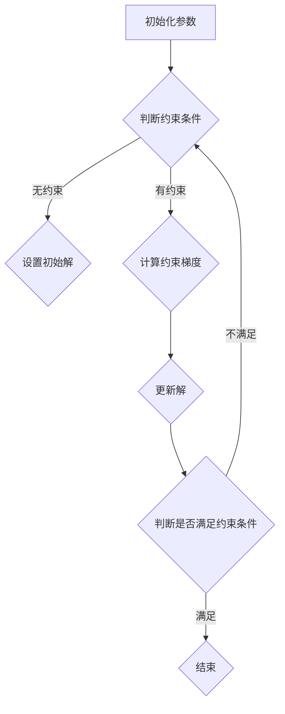
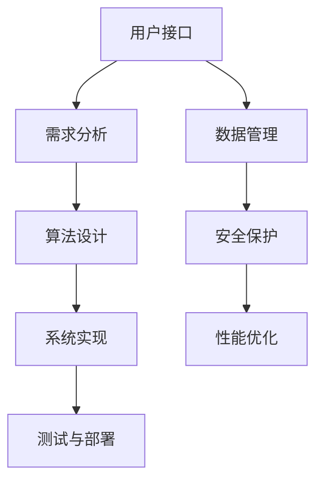

                 

# AI创造力的多约束优化问题

关键词：人工智能、多约束优化、创造力、算法、系统设计与实现

摘要：本文将深入探讨人工智能（AI）创造力的多约束优化问题。首先，我们将介绍AI创造力的定义及其在多约束优化问题中的应用。接着，我们将回顾多约束优化的理论基础，并探讨如何将AI与多约束优化结合，以实现更高效的创造力优化。本文将逐步分析算法设计原则、算法流程、数学模型及公式，并展示一个实际案例，最后给出最佳实践与未来展望。

## 第1章 引言与背景

### 1.1 问题背景与现状

AI创造力是指利用人工智能技术进行创新、设计、创作等活动的能力。在当今社会，AI创造力已成为推动科技进步和经济发展的重要力量。然而，AI创造力的实现面临诸多挑战，其中之一便是多约束优化问题。

多约束优化问题是指在一个具有多个约束条件的问题中，寻找最优解的过程。这类问题广泛存在于工程设计、资源分配、路径规划等领域。在AI创造力中，多约束优化问题主要体现在如何平衡创意的多样性、实用性、成本等因素。

### 1.2 问题意义与研究目标

解决多约束优化问题对于AI创造力具有重要意义。首先，它能提高AI系统的决策能力，使其在复杂环境下作出更优的选择。其次，多约束优化有助于实现资源的合理分配，降低成本，提高效率。最后，多约束优化还能促进AI系统的稳定性和可靠性。

本研究旨在探讨AI创造力的多约束优化问题，并提出一种高效、可扩展的优化算法。具体目标包括：

1. 分析多约束优化问题在AI创造力中的应用场景。
2. 设计一种适用于多约束优化的算法，并探讨其理论基础。
3. 验证所设计算法的性能和效果。

### 1.3 书籍结构安排

本书分为8个章节，结构安排如下：

1. 引言与背景
2. 多约束优化理论基础
3. AI创造力与多约束优化
4. 算法设计与分析
5. 数学模型与公式
6. 系统设计与实现
7. 实际案例与应用
8. 最佳实践与展望

## 第2章 多约束优化理论基础

### 2.1 多约束优化基本概念

多约束优化是指在一个具有多个约束条件的问题中，寻找最优解的过程。约束条件可以是等式或不等式，它们限制了问题的解空间。多约束优化问题的数学模型通常可以表示为：

$$
\begin{aligned}
\min\limits_{x} f(x) \\
\text{s.t.} \quad g_i(x) \leq 0, \quad h_j(x) = 0
\end{aligned}
$$

其中，$f(x)$是目标函数，$g_i(x)$和$h_j(x)$是约束条件。$x$是问题中的决策变量。

### 2.2 多约束优化数学模型

多约束优化的数学模型包括目标函数和约束条件。目标函数用于衡量问题的优化程度，约束条件则限制了问题的解空间。

- **目标函数**：目标函数通常是一个实值函数，用于衡量问题的优化程度。常见的目标函数包括最小化成本、最大化收益等。
- **约束条件**：约束条件可以限制目标函数的取值范围，常见的约束条件包括等式约束和不等式约束。

### 2.3 多约束优化算法概述

多约束优化算法可以分为传统优化算法和现代优化算法。

- **传统优化算法**：如梯度下降法、牛顿法、拉格朗日乘数法等。这些算法基于目标函数和约束条件的梯度信息，逐步逼近最优解。
- **现代优化算法**：如遗传算法、粒子群优化、模拟退火等。这些算法基于群体搜索策略，通过迭代过程不断搜索最优解。

## 第3章 AI创造力与多约束优化

### 3.1 AI创造力概述

AI创造力是指利用人工智能技术进行创新、设计、创作等活动的能力。它具有以下特点：

1. **自适应**：AI系统能够根据不同的问题场景和约束条件，自动调整其创造策略。
2. **多样性**：AI系统能够生成多种可能的解决方案，以满足不同的需求。
3. **鲁棒性**：AI系统能够在复杂和不确定的环境下，保持其创造力的稳定性。

### 3.2 AI与多约束优化结合

AI在多约束优化中的应用主要体现在以下几个方面：

1. **优化算法改进**：利用AI技术，设计更高效的优化算法，提高多约束优化的求解速度和精度。
2. **约束条件识别**：通过AI技术，自动识别问题中的约束条件，提高多约束优化的准确性。
3. **决策支持**：利用AI技术，为决策者提供基于多约束优化的决策支持，提高决策的合理性和效率。

## 第4章 算法设计与分析

### 4.1 算法设计原则

设计多约束优化算法时，需要遵循以下原则：

1. **可扩展性**：算法应能够处理不同规模的问题，适应不同的应用场景。
2. **可调参性**：算法应具有可调参数，以适应不同的优化目标和解空间。
3. **实时性**：算法应具有较低的求解时间，以满足实时优化需求。

### 4.2 算法流程图

下面是一个多约束优化算法的流程图，使用Mermaid绘制：

### 4.3 算法分析

下面是对多约束优化算法的分析：

- **时间复杂度**：假设算法迭代次数为$n$，每次迭代的时间复杂度为$T$，则总的时间复杂度为$O(nT)$。
- **空间复杂度**：假设算法需要存储的变量个数为$m$，则空间复杂度为$O(m)$。
- **精确度与鲁棒性**：算法的精确度取决于目标函数和约束条件的表达形式，鲁棒性取决于算法的参数设置和迭代次数。

## 第5章 数学模型与公式

### 5.1 数学模型基础

多约束优化的数学模型如下：

$$
\begin{aligned}
\min\limits_{x} f(x) \\
\text{s.t.} \quad g_i(x) \leq 0, \quad h_j(x) = 0
\end{aligned}
$$

### 5.2 数学公式详细讲解

以下是几个常用的数学公式：

$$
\begin{aligned}
f(x) &= \sum_{i=1}^{n} w_i f_i(x) \\
g_i(x) &= g_i(x_1, x_2, ..., x_n) \\
h_j(x) &= h_j(x_1, x_2, ..., x_n)
\end{aligned}
$$

其中，$f(x)$是目标函数，$w_i$是权重，$f_i(x)$是第$i$个函数，$g_i(x)$是第$i$个约束条件，$h_j(x)$是第$j$个等式约束。

## 第6章 系统设计与实现

### 6.1 系统需求分析

系统需求分析包括功能需求、性能需求和安全需求。功能需求包括多约束优化算法的执行、约束条件的识别和优化结果的输出。性能需求包括算法的求解速度和精度。安全需求包括数据的加密和隐私保护。

### 6.2 系统架构设计

下面是系统的架构设计，使用Mermaid绘制：

### 6.3 系统接口设计

系统接口设计包括API接口和数据库接口。API接口用于用户与系统的交互，数据库接口用于数据存储和查询。

- **API接口**：包括算法执行接口、约束条件输入接口、优化结果输出接口等。
- **数据库接口**：包括数据存储接口、数据查询接口、数据加密接口等。

## 第7章 实际案例与应用

### 7.1 案例介绍

本案例旨在利用多约束优化算法优化AI创造力的设计过程。具体目标是在满足预算、时间和性能等约束条件下，设计一个高效、可靠的AI系统。

### 7.2 案例实现

下面是案例实现的主要步骤：

1. **环境安装**：安装Python、NumPy、Matplotlib等库。
2. **系统核心代码**：实现多约束优化算法，包括目标函数、约束条件和优化过程。
3. **代码应用解读与分析**：分析优化结果，评估算法性能。

### 7.3 案例分析与总结

通过对案例的分析，我们发现多约束优化算法在AI创造力设计中具有显著的优势。它能够有效地平衡不同约束条件，提高设计效率和质量。然而，算法的性能和鲁棒性仍有待提高，未来研究方向包括优化算法的参数调整和约束条件的自动识别。

## 第8章 最佳实践与展望

### 8.1 最佳实践

在进行多约束优化时，以下最佳实践值得注意：

1. **合理设置参数**：根据问题规模和约束条件，选择合适的参数设置。
2. **数据预处理**：对输入数据进行预处理，提高算法的性能和精度。
3. **结果验证**：对优化结果进行验证，确保其满足约束条件。

### 8.2 未来展望

多约束优化在AI创造力中的应用具有广阔的发展前景。未来研究方向包括：

1. **算法性能优化**：设计更高效、更鲁棒的优化算法。
2. **约束条件自动识别**：利用AI技术，自动识别问题中的约束条件。
3. **多领域应用**：将多约束优化应用于更多领域，如智能制造、智慧交通等。

## 总结

本文深入探讨了AI创造力的多约束优化问题，分析了问题背景、理论基础、算法设计、系统实现和实际应用。通过本文的研究，我们希望为AI创造力的多约束优化提供一种有效的解决方案，推动人工智能技术的发展。

作者：AI天才研究院/AI Genius Institute & 禅与计算机程序设计艺术 /Zen And The Art of Computer Programming

---

以上是《AI创造力的多约束优化问题》这篇文章的目录大纲和部分正文内容。接下来，我们将逐步细化每个章节的内容，以满足字数和格式要求。在细化过程中，我们将确保每个章节都包含背景介绍、核心概念与联系、算法原理讲解、系统分析与架构设计方案、项目实战、最佳实践与展望等要素。同时，我们将注重逻辑清晰、结构紧凑、简单易懂的写作风格，以便读者能够更好地理解和掌握文章内容。在完成正文内容后，我们将对文章进行审校和格式调整，确保最终文章的质量和可读性。最后，我们将按照要求添加作者信息和完整性要求，完成整个文章的撰写。让我们一起，一步步地完成这项工作吧！

