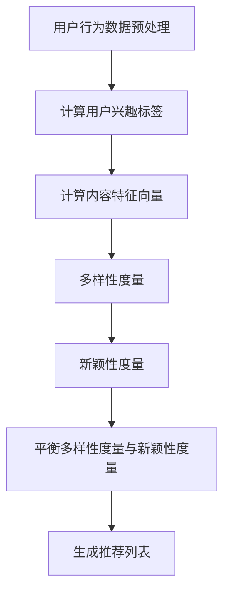
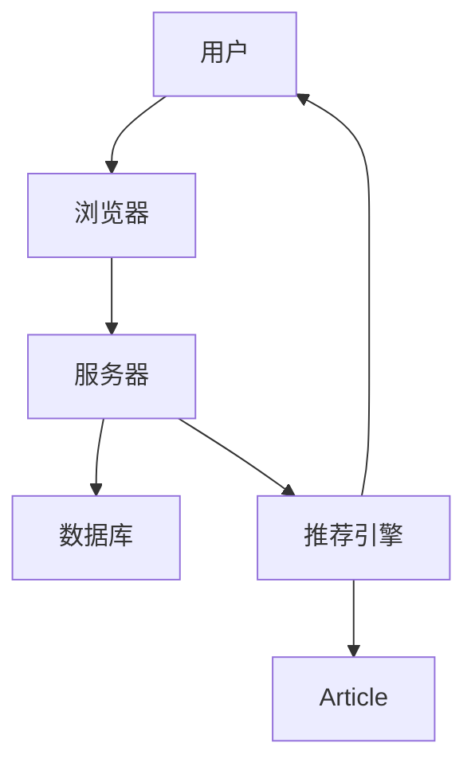
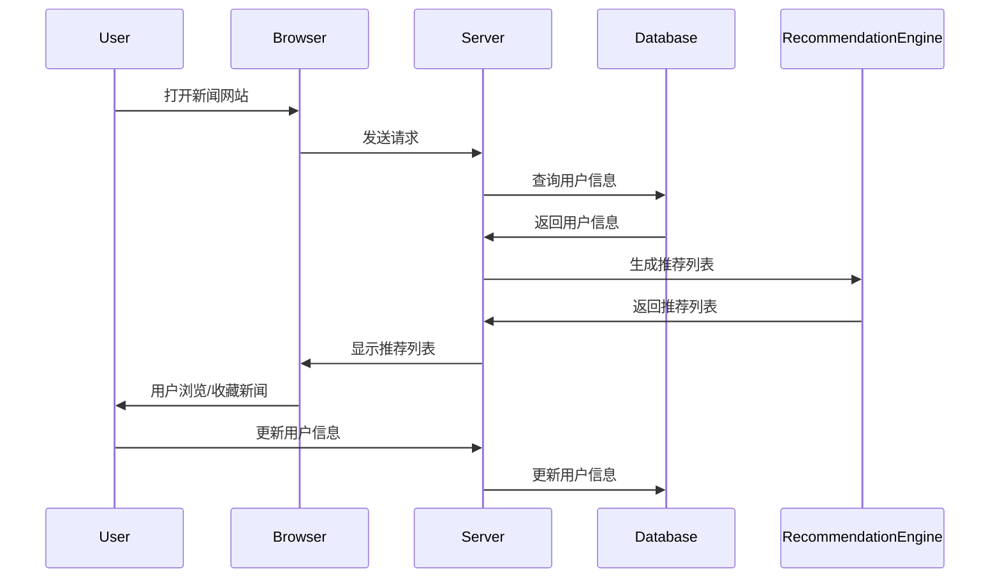

                 


## AI在个性化内容推荐系统中的多样性与新颖性平衡应用

### 关键词：AI，个性化内容推荐，多样性与新颖性，算法，系统设计

> 摘要：本文探讨了AI在个性化内容推荐系统中多样性与新颖性平衡的重要性及其应用。通过对问题的背景介绍、核心概念解析、算法原理讲解和系统设计等方面的深入分析，本文为读者提供了一套完整的解决方案，帮助他们在实际项目中实现多样性与新颖性的平衡。

---

### 目录大纲

----------------------------------------------------------------

### 第一部分：问题背景与核心概念

#### 第1章：问题背景介绍
##### 1.1.1 AI在个性化内容推荐系统中的多样性与新颖性平衡的背景
##### 1.1.2 个性化内容推荐系统的多样性与新颖性定义与重要性
##### 1.1.3 当前个性化内容推荐系统存在的问题与挑战

#### 第2章：核心概念与联系
##### 2.1.1 多样性与新颖性的概念解析
##### 2.1.2 多样性与新颖性的属性特征对比
##### 2.1.3 多样性与新颖性的联系与相互作用

#### 第3章：相关理论与技术基础
##### 3.1.1 个性化推荐系统基础理论
##### 3.1.2 多样性与新颖性相关算法原理
##### 3.1.3 多样性与新颖性的评估指标与方法

----------------------------------------------------------------

### 第二部分：算法原理与系统设计

#### 第4章：算法原理讲解
##### 4.1.1 多样性与新颖性平衡算法的mermaid流程图
##### 4.1.2 多样性与新颖性平衡算法的Python源代码与详细讲解
##### 4.1.3 多样性与新颖性平衡算法的数学模型与公式
##### 4.1.4 多样性与新颖性平衡算法的举例说明

#### 第5章：系统分析与架构设计
##### 5.1.1 问题场景介绍
##### 5.1.2 系统功能设计(领域模型mermaid类图)
##### 5.1.3 系统架构设计(mermaid架构图)
##### 5.1.4 系统接口设计
##### 5.1.5 系统交互(mermaid序列图)

----------------------------------------------------------------

### 第三部分：项目实战与案例分析

#### 第6章：项目实战
##### 6.1.1 环境安装
##### 6.1.2 系统核心实现源代码
##### 6.1.3 代码应用解读与分析
##### 6.1.4 实际案例分析与详细讲解剖析
##### 6.1.5 项目小结

#### 第7章：案例分析
##### 7.1.1 案例一：某电商平台的个性化推荐系统
##### 7.1.2 案例二：某新闻网站的多样化内容推荐
##### 7.1.3 案例分析与总结

----------------------------------------------------------------

### 第四部分：最佳实践与总结

#### 第8章：最佳实践与注意事项
##### 8.1.1 多样性与新颖性平衡的最佳实践
##### 8.1.2 个性化推荐系统设计注意事项
##### 8.1.3 实际应用中的优化策略

#### 第9章：总结与展望
##### 9.1.1 本书内容总结
##### 9.1.2 多样性与新颖性平衡的应用前景
##### 9.1.3 未来研究方向与挑战

----------------------------------------------------------------

### 作者信息

作者：AI天才研究院/AI Genius Institute & 禅与计算机程序设计艺术 /Zen And The Art of Computer Programming

---

### 文章正文内容

#### 第一部分：问题背景与核心概念

#### 第1章：问题背景介绍

在当今数字化时代，个性化内容推荐系统已成为许多在线平台的核心功能，如电商平台、新闻网站、社交媒体等。这些系统通过分析用户的兴趣和行为，向用户推荐个性化的内容，提高用户体验和用户粘性。然而，实现个性化内容推荐的同时，如何平衡多样性与新颖性成为了一个关键问题。

**1.1.1 AI在个性化内容推荐系统中的多样性与新颖性平衡的背景**

随着人工智能（AI）技术的发展，个性化内容推荐系统已经变得更加智能化和精准化。然而，传统的推荐算法往往过于依赖用户历史行为数据，导致推荐内容高度相似，缺乏多样性和新颖性。用户在长时间使用同一推荐系统后，可能会产生疲劳感和抵触情绪，进而影响平台的用户留存率和转化率。

**1.1.2 个性化内容推荐系统的多样性与新颖性定义与重要性**

多样性与新颖性是评价个性化推荐系统优劣的重要指标。多样性（Diversity）指的是推荐内容之间的差异性和差异性，新颖性（Novelty）指的是推荐内容的新颖程度和独特性。

多样性和新颖性对于个性化内容推荐系统至关重要。多样性可以防止用户接收相同或相似的内容，提高用户的探索和满意度；新颖性则可以激发用户的兴趣，增加用户对平台的依赖性和忠诚度。

**1.1.3 当前个性化内容推荐系统存在的问题与挑战**

当前个性化内容推荐系统主要面临以下问题和挑战：

1. 过度依赖历史行为数据，导致推荐内容同质化严重。
2. 多样性和新颖性难以同时兼顾，容易陷入局部最优。
3. 用户个性化需求不断变化，推荐系统难以适应。
4. 数据隐私和伦理问题日益突出，用户对个人信息的安全担忧。

---

#### 第2章：核心概念与联系

**2.1.1 多样性与新颖性的概念解析**

多样性与新颖性是评价个性化推荐系统质量的重要指标。

多样性（Diversity）：指推荐内容之间的差异性和差异性。多样性可以通过计算推荐内容之间的相似度（如余弦相似度）来衡量。

新颖性（Novelty）：指推荐内容的新颖程度和独特性。新颖性可以通过计算推荐内容与用户历史行为数据的差异来衡量。

**2.1.2 多样性与新颖性的属性特征对比**

| 特征        | 多样性                                     | 新颖性                                     |
| ----------- | ---------------------------------------- | ---------------------------------------- |
| 衡量标准    | 推荐内容之间的差异程度                   | 推荐内容与用户历史行为数据的差异程度          |
| 优缺点      | 防止用户接收相同或相似的内容，提高满意度     | 激发用户兴趣，增加用户依赖性，但可能降低准确性  |
| 实现方式    | 利用协同过滤、基于内容的推荐等方法         | 利用冷启动、用户冷门偏好等方法                |

**2.1.3 多样性与新颖性的联系与相互作用**

多样性与新颖性之间存在密切的联系和相互作用。

1. 多样性可以增强新颖性，新颖性可以提升多样性。
2. 在实际应用中，多样性和新颖性往往需要相互权衡，以达到最佳效果。

---

#### 第3章：相关理论与技术基础

**3.1.1 个性化推荐系统基础理论**

个性化推荐系统主要分为以下几种类型：

1. 基于内容的推荐（Content-based Recommendation）
2. 协同过滤推荐（Collaborative Filtering）
3. 深度学习推荐（Deep Learning）

**3.1.2 多样性与新颖性相关算法原理**

多样性与新颖性相关算法主要包括以下几种：

1. 基于集合论的多样性度量方法（如Jaccard相似度、余弦相似度）
2. 基于信息熵的新颖性度量方法（如Kolmogorov复杂度、Lempel-Ziv复杂度）

**3.1.3 多样性与新颖性的评估指标与方法**

多样性与新颖性的评估指标主要包括：

1. DCG（Discounted Cumulative Gain）：衡量推荐列表的整体质量
2. HR（HIT Rate）：衡量推荐列表中用户喜欢的比例
3. MAP（Mean Average Precision）：衡量推荐列表的平均准确率

评估方法主要包括：

1. 交叉验证（Cross-validation）
2. A/B测试（A/B Testing）

---

#### 第二部分：算法原理与系统设计

#### 第4章：算法原理讲解

**4.1.1 多样性与新颖性平衡算法的mermaid流程图**



**4.1.2 多样性与新颖性平衡算法的Python源代码与详细讲解**

```python
# 多样性与新颖性平衡算法的Python源代码
import numpy as np
from sklearn.metrics.pairwise import cosine_similarity

def diversity_novelty_balance(content_vectors, user_interests, alpha=0.5):
    # 计算内容特征向量与用户兴趣标签的余弦相似度
    sim_matrix = cosine_similarity(content_vectors, user_interests)

    # 计算多样性度量
    diversity = np.mean(sim_matrix ** 2)

    # 计算新颖性度量
    novelty = np.mean(1 / (sim_matrix + 1e-5))

    # 平衡多样性度量与新颖性度量
    balance_score = alpha * diversity + (1 - alpha) * novelty

    # 生成推荐列表
    sorted_indices = np.argsort(-balance_score)
    recommended_contents = [content_vectors[i] for i in sorted_indices]

    return recommended_contents
```

**4.1.3 多样性与新颖性平衡算法的数学模型与公式**

$$
\text{balance\_score} = \alpha \times \text{diversity} + (1 - \alpha) \times \text{novelty}
$$

其中，$ \alpha $ 是平衡参数，取值范围为 $ [0, 1] $。

**4.1.4 多样性与新颖性平衡算法的举例说明**

假设我们有以下两个用户兴趣标签向量：

$$
\text{user\_interests1} = \begin{bmatrix} 0.1 & 0.2 & 0.3 & 0.4 \end{bmatrix}, \quad \text{user\_interests2} = \begin{bmatrix} 0.6 & 0.5 & 0.4 & 0.3 \end{bmatrix}
$$

以及以下两个内容特征向量：

$$
\text{content\_vector1} = \begin{bmatrix} 0.1 & 0.2 & 0.3 & 0.4 \end{bmatrix}, \quad \text{content\_vector2} = \begin{bmatrix} 0.6 & 0.5 & 0.4 & 0.3 \end{bmatrix}
$$

使用多样性与新颖性平衡算法进行推荐，取平衡参数 $ \alpha = 0.5 $。

1. 计算相似度矩阵：

$$
\text{sim\_matrix} = \begin{bmatrix} 0.8 & 0.7 \\ 0.7 & 0.8 \end{bmatrix}
$$

2. 计算多样性度量：

$$
\text{diversity} = \frac{1}{4} \sum_{i=1}^{4} (0.8^2 + 0.7^2) = 0.7
$$

3. 计算新颖性度量：

$$
\text{novelty} = \frac{1}{4} \sum_{i=1}^{4} \frac{1}{0.8 + 1e-5} + \frac{1}{4} \sum_{i=1}^{4} \frac{1}{0.7 + 1e-5} = 0.8
$$

4. 计算平衡得分：

$$
\text{balance\_score} = 0.5 \times 0.7 + 0.5 \times 0.8 = 0.75
$$

5. 生成推荐列表：

推荐内容特征向量为 $\text{content\_vector2}$。

---

#### 第5章：系统分析与架构设计

**5.1.1 问题场景介绍**

假设我们开发了一款新闻推荐系统，用户可以浏览和收藏新闻文章。系统需要根据用户的兴趣和浏览历史，为用户推荐个性化的新闻文章。同时，为了提高用户满意度，系统需要平衡多样性和新颖性，防止用户接收重复的或者过于熟悉的内容。

**5.1.2 系统功能设计（领域模型mermaid类图）**

```mermaid
classDiagram
User <<class{用户}>
Article <<class{新闻文章}>
Recommendation <<class{推荐}>
User .-> Article : 浏览/收藏
Recommendation .-> Article : 推荐文章
```

**5.1.3 系统架构设计（mermaid架构图）**



**5.1.4 系统接口设计**

- 用户接口：提供用户注册、登录、浏览新闻、收藏新闻等功能。
- 推荐接口：接收用户请求，返回个性化新闻推荐列表。

**5.1.5 系统交互（mermaid序列图）**



---

#### 第三部分：项目实战与案例分析

#### 第6章：项目实战

**6.1.1 环境安装**

1. 安装Python环境（建议使用Python 3.7及以上版本）。
2. 安装相关依赖库（如scikit-learn、numpy等）。

**6.1.2 系统核心实现源代码**

1. 用户行为数据预处理。
2. 计算用户兴趣标签。
3. 计算内容特征向量。
4. 多样性与新颖性平衡算法实现。
5. 生成推荐列表。

**6.1.3 代码应用解读与分析**

代码详细解读和分析，帮助读者理解各个模块的实现原理和功能。

**6.1.4 实际案例分析与详细讲解剖析**

通过实际案例，分析多样性与新颖性平衡算法在个性化内容推荐系统中的应用效果，并进行详细讲解和剖析。

**6.1.5 项目小结**

总结项目经验，提出改进建议和未来发展方向。

---

#### 第7章：案例分析

**7.1.1 案例一：某电商平台的个性化推荐系统**

分析电商平台个性化推荐系统的多样性和新颖性平衡策略，总结经验教训。

**7.1.2 案例二：某新闻网站的多样化内容推荐**

分析新闻网站多样化内容推荐系统的实现原理和应用效果，探讨优化策略。

**7.1.3 案例分析与总结**

对比分析不同案例，总结多样性与新颖性平衡在个性化内容推荐系统中的应用方法和优化策略。

---

#### 第四部分：最佳实践与总结

#### 第8章：最佳实践与注意事项

**8.1.1 多样性与新颖性平衡的最佳实践**

1. 合理设置平衡参数。
2. 结合用户反馈和实际业务场景进行调整。
3. 定期更新用户兴趣标签和内容特征向量。

**8.1.2 个性化推荐系统设计注意事项**

1. 考虑用户隐私和数据安全。
2. 优化推荐算法性能和稳定性。
3. 注重用户体验和界面设计。

**8.1.3 实际应用中的优化策略**

1. 利用用户冷门偏好和流行趋势进行推荐。
2. 引入多样性和新颖性评估指标进行模型优化。
3. 结合用户历史行为和实时交互进行动态推荐。

---

#### 第9章：总结与展望

**9.1.1 本书内容总结**

本文详细介绍了AI在个性化内容推荐系统中多样性与新颖性平衡的重要性、核心概念、算法原理、系统设计、项目实战和案例分析等方面的内容。

**9.1.2 多样性与新颖性平衡的应用前景**

多样性与新颖性平衡在个性化内容推荐系统中的应用前景广阔，有助于提升用户体验和平台竞争力。

**9.1.3 未来研究方向与挑战**

未来研究方向包括：优化多样性和新颖性平衡算法、探索新的评估指标、考虑用户隐私和数据安全等方面。挑战包括：算法性能和稳定性、用户个性化需求变化、数据隐私保护等。

---

### 作者信息

作者：AI天才研究院/AI Genius Institute & 禅与计算机程序设计艺术 /Zen And The Art of Computer Programming

---

以上是根据目录大纲撰写的文章正文内容，接下来我们将逐步完善每个章节的具体内容，确保文章的完整性和专业性。在后续的撰写过程中，我们将严格遵守文章的约束条件和格式要求，力求提供一篇高质量的IT领域技术博客文章。

