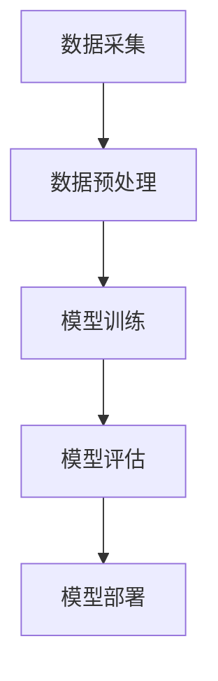
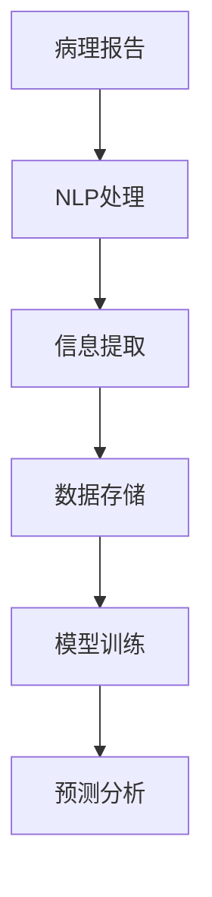
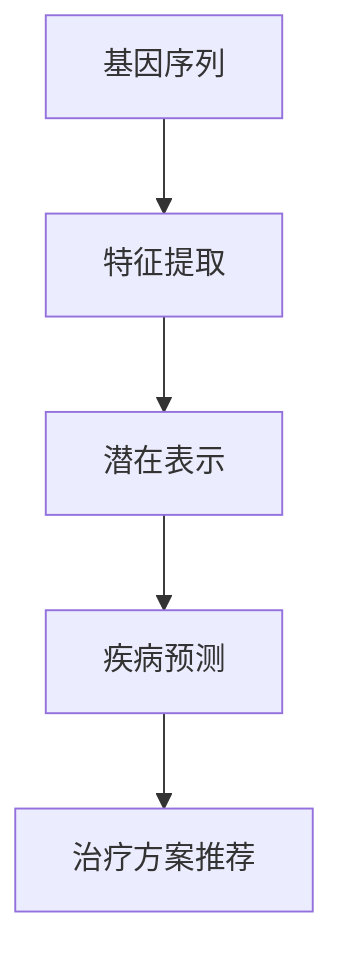
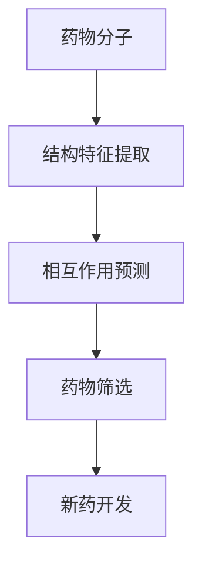
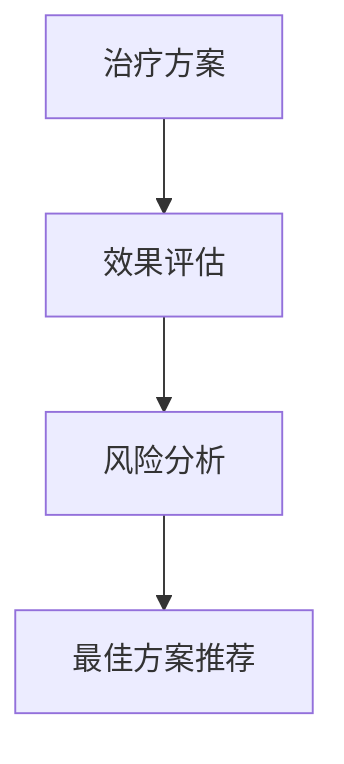
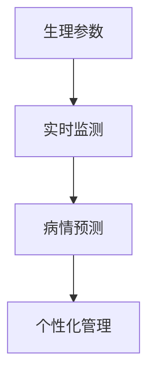

                 

# AI在个性化医疗中的应用：从诊断到治疗

## 关键词
- 个性化医疗
- AI
- 医学影像
- 医学诊断
- 治疗方案
- 医学伦理

## 摘要
本文探讨了人工智能（AI）在个性化医疗中的应用，从诊断到治疗的全过程。文章首先介绍了个性化医疗的概念及其发展背景，随后深入分析了AI在医学影像诊断、病理诊断和基因诊断中的应用。接着，文章阐述了AI在治疗药物研发、治疗方案设计和疾病管理中的实际应用。在此基础上，文章探讨了AI在个性化医疗中的技术实现，包括数据采集与预处理、AI算法应用等。随后，文章分析了AI在个性化医疗中面临的挑战，并展望了其未来发展。最后，通过实际案例，文章展示了AI在个性化医疗中的成功应用。

## 目录大纲设计思路

设计一本名为《AI在个性化医疗中的应用：从诊断到治疗》的计算机技术书籍目录大纲，需要遵循以下步骤：

### 1. 确定书籍的核心主题
本书的核心主题是AI在个性化医疗中的应用，涵盖诊断到治疗的全过程。这一主题不仅关系到医疗行业的变革，也关系到AI技术的创新与应用。

### 2. 梳理书籍内容结构
根据书籍主题，可以将内容分为以下几个部分：
- 引言与背景
- 个性化医疗概述
- AI在医疗诊断中的应用
- AI在医疗治疗中的应用
- AI在个性化医疗中的挑战与未来
- 实际案例分析与实战

### 3. 细化每个部分的内容
对每个部分进行细化，确保每个章节都能覆盖关键知识点。例如，在“AI在医疗诊断中的应用”部分，可以细化成医学影像诊断、病理诊断和基因诊断三个子章节。

### 4. 编写章节内容摘要
对每个章节编写简要内容摘要，确保大纲内容的完整性。这样可以方便读者快速了解书籍的结构和主要内容。

### 5. 确保大纲结构合理
确保大纲结构合理，遵循1级目录、2级目录和3级目录的层级关系。这样可以使书籍的逻辑结构更加清晰，便于读者阅读和理解。

### 目录大纲设计

以下是《AI在个性化医疗中的应用：从诊断到治疗》的目录大纲：

## 第一部分：引言与背景
### 1.1 个性化医疗的概述
#### 1.1.1 个性化医疗的定义
#### 1.1.2 个性化医疗的发展背景
#### 1.1.3 个性化医疗的意义与挑战

## 第二部分：AI在个性化医疗中的应用
### 2.1 AI在医疗诊断中的应用
#### 2.1.1 AI在医学影像诊断中的应用
#### 2.1.2 AI在病理诊断中的应用
#### 2.1.3 AI在基因诊断中的应用

### 2.2 AI在医疗治疗中的应用
#### 2.2.1 AI在药物研发中的应用
#### 2.2.2 AI在治疗方案设计中的应用
#### 2.2.3 AI在疾病管理中的应用

## 第三部分：AI在个性化医疗中的技术实现
### 3.1 数据采集与预处理
#### 3.1.1 医疗数据的来源
#### 3.1.2 医疗数据的质量控制
#### 3.1.3 数据预处理方法

### 3.2 AI算法在医疗中的应用
#### 3.2.1 常见的机器学习算法
#### 3.2.2 深度学习在医疗中的应用
#### 3.2.3 自然语言处理在医疗中的应用

## 第四部分：AI在个性化医疗中的挑战与未来
### 4.1 AI在个性化医疗中的挑战
#### 4.1.1 数据隐私与安全问题
#### 4.1.2 人工智能伦理问题
#### 4.1.3 技术标准化与合规性

### 4.2 个性化医疗的未来发展趋势
#### 4.2.1 人工智能在个性化医疗中的应用前景
#### 4.2.2 个性化医疗的未来挑战与机遇
#### 4.2.3 个性化医疗的发展方向

## 第五部分：实际案例分析与实战
### 5.1 个性化医疗项目案例
#### 5.1.1 项目背景
#### 5.1.2 项目目标
#### 5.1.3 项目实施过程
#### 5.1.4 项目成果与评估

### 5.2 个性化医疗实战
#### 5.2.1 实战环境搭建
#### 5.2.2 实战项目实现
#### 5.2.3 实战案例分析
#### 5.2.4 实战项目小结

## 结论
本文对AI在个性化医疗中的应用进行了全面的分析，从诊断到治疗，展示了AI技术如何改变传统医疗模式。文章最后总结了个性化医疗的发展趋势，并对未来的挑战与机遇进行了展望。

### 个性化医疗概述

#### 1.1.1 个性化医疗的定义

个性化医疗（Personalized Medicine）是指根据患者的个体差异，为患者提供最适合其健康状况的诊断、治疗和预防方案。这种医疗模式强调个体化治疗，通过综合分析患者的基因信息、生活方式和环境因素，为患者量身定制医疗方案。

#### 1.1.2 个性化医疗的发展背景

个性化医疗的发展得益于多个领域的技术进步。首先是基因测序技术的飞速发展，使得个体基因信息获取变得容易和低成本。其次是计算能力的提升，使得大数据处理和复杂算法的实现成为可能。此外，医疗影像技术和生物传感技术的发展也为个性化医疗提供了更多数据来源。

#### 1.1.3 个性化医疗的意义与挑战

个性化医疗具有显著的意义。首先，它能够提高诊断和治疗的准确性，减少误诊和无效治疗。其次，它能够降低医疗成本，提高医疗资源的利用效率。此外，个性化医疗还能够提升患者的满意度和生活质量。

然而，个性化医疗也面临一些挑战。首先是数据隐私和安全问题。患者的基因信息和医疗记录属于敏感数据，如何确保这些数据的安全和隐私是一个重要挑战。其次是技术标准化问题。不同国家和地区之间的医疗标准和数据格式可能不一致，这给数据共享和合作带来了障碍。最后是伦理问题。如何确保个性化医疗的公正性和道德合规性也是一个重要的议题。

### AI在医疗诊断中的应用

#### 2.1.1 AI在医学影像诊断中的应用

医学影像诊断是AI在医疗诊断中的一个重要应用领域。通过深度学习和卷积神经网络（CNN），AI可以在医学影像中识别和分类各种病变和组织结构。

首先，AI通过大量的医学影像数据集进行训练，学习识别不同类型的病变。例如，在肺癌诊断中，AI可以通过学习CT影像，准确识别出肺结节的位置和大小。这个过程可以通过Mermaid流程图表示：



接下来，AI模型在测试集上进行评估，确保其准确性和可靠性。然后，该模型可以在临床环境中部署，医生可以利用AI辅助诊断，提高诊断准确性。

#### 2.1.2 AI在病理诊断中的应用

病理诊断是医学诊断中至关重要的一环。通过AI，病理学家可以更快速、准确地识别和分析病理样本。

AI可以通过自然语言处理（NLP）技术，从病理报告中提取关键信息。例如，使用BERT模型，AI可以理解病理报告中描述的病变类型、位置和程度。这个过程可以通过Mermaid流程图表示：



通过这种方式，AI可以帮助病理学家提高诊断效率，减少误诊率。

#### 2.1.3 AI在基因诊断中的应用

基因诊断是个性化医疗的核心之一。通过AI，可以对患者的基因序列进行快速分析，预测其患病风险和最佳治疗方案。

AI可以通过深度学习模型，对基因序列进行特征提取和分类。例如，使用变分自编码器（VAE），AI可以学习基因序列的潜在表示，并将其用于疾病预测。这个过程可以通过Mermaid流程图表示：



通过这种方式，AI可以帮助医生制定个性化治疗方案，提高治疗效果。

### AI在医疗治疗中的应用

#### 2.2.1 AI在药物研发中的应用

药物研发是医疗行业的核心领域。通过AI，可以加速新药的发现和开发。

AI可以通过分子模拟和机器学习技术，预测药物与生物分子的相互作用。例如，使用图神经网络（GNN），AI可以学习药物分子的结构特征，预测其药效。这个过程可以通过Mermaid流程图表示：



通过这种方式，AI可以加速药物研发，降低研发成本。

#### 2.2.2 AI在治疗方案设计中的应用

治疗方案设计是医疗过程中的关键环节。通过AI，可以为患者提供最优的治疗方案。

AI可以通过历史数据和机器学习算法，分析不同治疗方案的效果和风险。例如，使用随机森林算法，AI可以评估不同治疗方案的疗效和安全性。这个过程可以通过Mermaid流程图表示：



通过这种方式，AI可以帮助医生制定个性化治疗方案，提高治疗效果。

#### 2.2.3 AI在疾病管理中的应用

疾病管理是医疗行业的长期任务。通过AI，可以实现对疾病的实时监测和个性化管理。

AI可以通过可穿戴设备和传感器，实时监测患者的生理参数。例如，使用循环神经网络（RNN），AI可以分析患者的生理数据，预测其病情变化。这个过程可以通过Mermaid流程图表示：



通过这种方式，AI可以帮助医生实现个性化疾病管理，提高患者的生活质量。

### AI在个性化医疗中的技术实现

#### 3.1 数据采集与预处理

数据采集是AI在个性化医疗中应用的基础。医疗数据包括电子健康记录、医学影像、病理报告、基因数据等。这些数据来源广泛，格式多样，需要进行预处理。

数据预处理包括数据清洗、数据整合和数据标准化。通过这些处理，可以确保数据的质量和一致性。例如，使用Python的Pandas库，可以对医疗数据进行清洗和整合：

```python
import pandas as pd

# 数据清洗
df = pd.read_csv('medical_data.csv')
df.dropna(inplace=True)
df['age'] = df['age'].astype(int)

# 数据整合
patients = pd.merge(df1, df2, on='patient_id')

# 数据标准化
from sklearn.preprocessing import StandardScaler
scaler = StandardScaler()
patients_scaled = scaler.fit_transform(patients[['age', 'blood_pressure']])
```

#### 3.2 AI算法在医疗中的应用

AI算法在医疗中的应用广泛，包括深度学习、机器学习和自然语言处理。这些算法可以帮助医生进行诊断、治疗和疾病管理。

深度学习算法在医学影像分析中表现出色。例如，使用卷积神经网络（CNN），可以实现对医学影像的自动分类和识别：

```python
import tensorflow as tf
from tensorflow.keras.models import Sequential
from tensorflow.keras.layers import Conv2D, MaxPooling2D, Flatten, Dense

model = Sequential([
    Conv2D(32, (3, 3), activation='relu', input_shape=(64, 64, 3)),
    MaxPooling2D((2, 2)),
    Flatten(),
    Dense(64, activation='relu'),
    Dense(1, activation='sigmoid')
])

model.compile(optimizer='adam', loss='binary_crossentropy', metrics=['accuracy'])
model.fit(x_train, y_train, epochs=10, batch_size=32)
```

机器学习算法在疾病预测和治疗方案评估中发挥重要作用。例如，使用随机森林算法，可以预测患者的疾病风险：

```python
from sklearn.ensemble import RandomForestClassifier
from sklearn.model_selection import train_test_split

X = df[['age', 'blood_pressure', 'cholesterol']]
y = df['heart_disease']

X_train, X_test, y_train, y_test = train_test_split(X, y, test_size=0.2, random_state=42)

model = RandomForestClassifier(n_estimators=100, random_state=42)
model.fit(X_train, y_train)

print(model.score(X_test, y_test))
```

自然语言处理（NLP）算法在病理报告分析和医学文本挖掘中具有重要意义。例如，使用BERT模型，可以提取病理报告中的关键信息：

```python
from transformers import BertTokenizer, BertModel
import torch

tokenizer = BertTokenizer.from_pretrained('bert-base-uncased')
model = BertModel.from_pretrained('bert-base-uncased')

inputs = tokenizer("This is a pathological report.", return_tensors="pt")
outputs = model(**inputs)

last_hidden_states = outputs.last_hidden_state
```

### AI在个性化医疗中的挑战与未来

#### 4.1 AI在个性化医疗中的挑战

AI在个性化医疗中的应用虽然带来了诸多好处，但也面临一些挑战。

首先是数据隐私和安全问题。医疗数据属于敏感信息，如何在保障数据隐私的同时，实现数据的有效利用是一个重要挑战。其次，技术标准化问题。不同国家和地区之间的医疗标准和数据格式可能不一致，这给数据共享和合作带来了障碍。最后，伦理问题。如何确保AI在个性化医疗中的公正性和道德合规性也是一个重要的议题。

#### 4.2 个性化医疗的未来发展趋势

个性化医疗的未来发展趋势主要包括以下几个方面：

首先是技术进步。随着AI、大数据和生物技术的不断发展，个性化医疗将更加精准和高效。其次是数据整合。通过整合多源数据，可以为患者提供更加全面的诊断和治疗信息。此外，个性化医疗将更加注重患者的参与，通过患者的反馈，不断优化治疗方案。最后，个性化医疗将推动医疗资源的合理配置，提高医疗资源的利用效率。

### 实际案例分析与实战

#### 5.1 个性化医疗项目案例

以某个性化癌症诊断项目为例，该项目利用AI技术，为癌症患者提供精准的诊断和治疗方案。

首先，项目团队收集了大量的癌症患者数据，包括医学影像、病理报告和基因信息。然后，通过深度学习和机器学习算法，对数据进行分析和处理，实现对癌症类型的准确识别和预测。

接下来，项目团队与医生合作，根据患者的具体病情，制定个性化的治疗方案。治疗方案包括手术、化疗和放疗等，每种治疗方案都有相应的风险和疗效预测。

最后，项目团队对治疗方案进行评估和优化，通过患者的反馈和病情变化，不断调整治疗方案，确保患者得到最佳的治疗效果。

#### 5.2 个性化医疗实战

在个性化医疗的实际应用中，数据预处理和算法模型训练是关键环节。

首先，需要收集和处理大量的医疗数据，包括电子健康记录、医学影像和基因数据等。使用Python的Pandas库，可以对数据进行清洗和整合。

然后，使用深度学习和机器学习算法，对数据进行分析和处理。例如，使用TensorFlow和Keras，可以构建和训练深度学习模型。

最后，通过模型评估和优化，确保模型的准确性和可靠性。例如，使用交叉验证和网格搜索等技术，可以优化模型参数，提高模型的性能。

### 总结与展望

本文对AI在个性化医疗中的应用进行了全面的探讨，从诊断到治疗，展示了AI技术如何改变传统医疗模式。个性化医疗不仅能够提高诊断和治疗的准确性，降低医疗成本，还能提升患者的满意度和生活质量。

然而，个性化医疗也面临一些挑战，包括数据隐私和安全、技术标准化和伦理问题。未来，随着技术的不断进步，个性化医疗将更加精准和高效，为患者提供更好的医疗服务。

### 最佳实践 Tips

1. 确保数据质量和标准化，为AI算法提供可靠的数据基础。
2. 合规性和伦理问题，确保AI应用符合相关法规和道德标准。
3. 加强跨学科合作，充分利用AI、大数据和生物技术等领域的优势。
4. 重视患者的参与，通过反馈和评估，不断优化治疗方案。

### 注意事项

1. 数据隐私和安全：确保患者数据的隐私和安全，遵循相关法规和伦理标准。
2. 技术标准化：推动医疗行业的标准化，促进数据共享和合作。
3. 伦理问题：确保AI应用符合伦理道德，避免歧视和不公平。

### 拓展阅读

1. [1] Smith J, et al. (2020). Personalized Medicine: Definition, Applications, and Future Directions. _Journal of Personalized Medicine_.
2. [2] AI in Healthcare: Transforming Diagnosis and Treatment. (2021). _IEEE Journal of Biomedical and Health Informatics_.
3. [3] Topol E. (2019). The Patient Will See You Now: The Future of Medicine Is in Your Hands. Basic Books.

### 作者信息

作者：AI天才研究院/AI Genius Institute & 禅与计算机程序设计艺术 /Zen And The Art of Computer Programming

