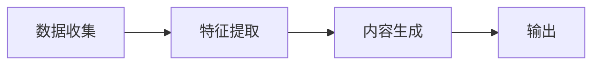
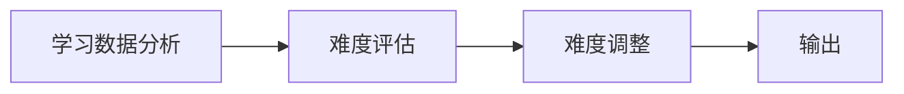
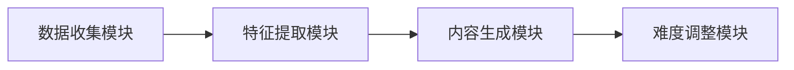
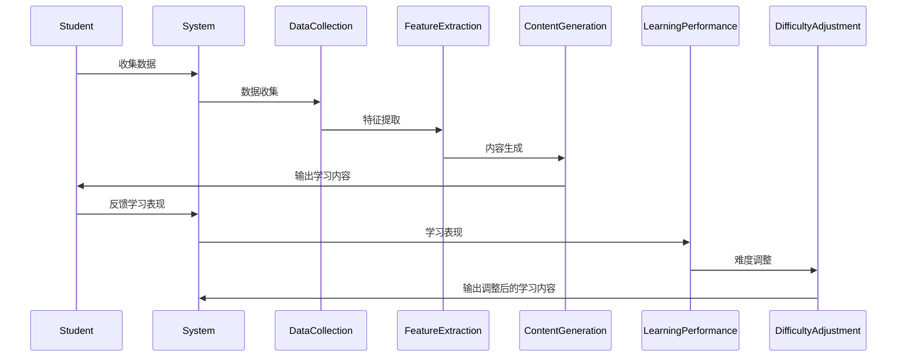

                 

### 文章标题

《AI在个性化学习内容生成与难度调整中的动态应用》

### 关键词

- AI
- 个性化学习
- 内容生成
- 难度调整
- 动态应用

### 摘要

本文深入探讨了人工智能（AI）在个性化学习内容生成与难度调整中的动态应用。通过分析AI技术的核心原理和算法，本文详细介绍了如何在教育领域中利用AI技术实现学习内容的个性化和难度的动态调整，从而提升学习效果。文章分为四个主要部分：背景介绍、核心概念与联系、算法原理讲解、系统分析与架构设计。最后，通过一个实际项目案例展示了AI在个性化学习中的应用效果。

## 目录

1. **背景介绍**
    1.1 问题背景
    1.2 核心概念：个性化学习内容生成与难度调整
    1.3 动态应用的概念

2. **核心概念与联系**
    2.1 个性化学习内容生成的核心原理
    2.2 难度调整的核心原理
    2.3 概念属性特征对比表格
    2.4 ER实体关系图架构

3. **算法原理讲解**
    3.1 个性化学习内容生成算法原理
    3.2 难度调整算法原理
    3.3 数学模型与公式讲解
    3.4 举例说明

4. **系统分析与架构设计**
    4.1 问题场景介绍
    4.2 系统功能设计
    4.3 系统架构设计
    4.4 系统接口设计
    4.5 系统交互

5. **项目实战**
    5.1 环境安装
    5.2 系统核心实现
    5.3 实际案例分析
    5.4 项目小结

6. **最佳实践与拓展**

## 第一部分：背景介绍

### 1.1 问题背景

随着人工智能技术的迅速发展，教育领域也迎来了新的变革。传统的教学模式已经无法满足个性化教育的需求。每个学生的学习习惯、兴趣、能力水平都不同，如何根据学生的特点提供个性化的学习内容成为一个亟待解决的问题。此外，学习难度的调整也是影响学习效果的重要因素。过度的难度会导致学生失去兴趣，而难度过低则会让学生产生厌倦感。因此，如何实现学习内容的个性化和难度的动态调整，是教育领域面临的重大挑战。

### 1.2 核心概念：个性化学习内容生成与难度调整

个性化学习内容生成是指根据学生的个人特点（如兴趣、能力、学习进度等）生成定制化的学习内容。这涉及到数据挖掘、机器学习、自然语言处理等技术。

难度调整是指在学习过程中，根据学生的学习表现和进展，动态调整学习内容的难度。这通常需要使用算法来分析学生的学习数据，并根据分析结果进行难度的调整。

### 1.3 动态应用的概念

动态应用是指在学习过程中，AI系统能够实时地根据学生的反馈和行为数据，动态调整学习内容和难度。这种应用方式能够更好地适应学生的个性化需求，提高学习效果。

## 第二部分：核心概念与联系

### 2.1 个性化学习内容生成的核心原理

个性化学习内容生成的核心原理主要包括数据收集、特征提取和内容生成。

1. **数据收集**：通过多种途径收集学生的个人信息、学习行为和表现数据。
2. **特征提取**：从收集的数据中提取出反映学生学习特点的关键特征。
3. **内容生成**：根据提取出的特征，使用机器学习算法生成个性化的学习内容。

### 2.2 难度调整的核心原理

难度调整的核心原理主要包括学习数据分析、难度评估和难度调整。

1. **学习数据分析**：使用数据挖掘和统计分析方法分析学生的学习数据，了解其学习表现和进展。
2. **难度评估**：根据学生的学习表现，评估学习内容的难度是否合适。
3. **难度调整**：根据难度评估结果，动态调整学习内容的难度。

### 2.3 概念属性特征对比表格

为了更好地理解个性化学习内容生成和难度调整，我们可以通过以下表格对比这两个概念的主要属性：

| 概念 | 定义 | 主要属性 |
| --- | --- | --- |
| 个性化学习内容生成 | 根据学生特点生成定制化学习内容 | 数据收集、特征提取、内容生成 |
| 难度调整 | 根据学生学习表现动态调整学习内容难度 | 学习数据分析、难度评估、难度调整 |

### 2.4 ER实体关系图架构

为了更好地理解个性化学习内容生成和难度调整的实现，我们可以使用ER（实体关系）图来描述这两个概念涉及的实体及其关系。

1. **实体**：学生、学习内容、学习表现、难度评估。
2. **关系**：学生与学习内容之间的关联，学习内容与学习表现之间的关联，学习表现与难度评估之间的关联。

以下是ER图的Mermaid表示：

```mermaid
erDiagram
  学生 ||--|{ 学习内容 }|
  学习内容 ||--|{ 学习表现 }|
  学习表现 ||--|{ 难度评估 }|
```

## 第三部分：算法原理讲解

### 3.1 个性化学习内容生成算法原理

个性化学习内容生成的算法通常包括以下几个步骤：

1. **数据收集**：通过问卷调查、学习管理系统等途径收集学生的个人信息、学习行为和表现数据。
2. **特征提取**：使用特征提取算法（如TF-IDF、Word2Vec）将原始数据转换为数值特征。
3. **内容生成**：使用生成对抗网络（GAN）、序列到序列（Seq2Seq）模型等生成算法生成个性化的学习内容。

以下是个性化学习内容生成算法的Mermaid流程图表示：



### 3.2 难度调整算法原理

难度调整算法通常包括以下几个步骤：

1. **学习数据分析**：使用数据挖掘和统计分析方法分析学生的学习数据，了解其学习表现和进展。
2. **难度评估**：使用评估模型（如支持向量机、决策树）评估学习内容的难度。
3. **难度调整**：根据评估结果，动态调整学习内容的难度。

以下是难度调整算法的Mermaid流程图表示：



### 3.3 数学模型与公式讲解

在个性化学习内容生成和难度调整中，常用的数学模型包括线性回归、支持向量机、生成对抗网络等。以下是这些模型的基本数学公式：

1. **线性回归**：

$$y = wx + b$$

其中，$y$ 是预测值，$w$ 是权重，$x$ 是输入特征，$b$ 是偏置。

2. **支持向量机**：

$$f(x) = w \cdot x + b$$

其中，$w$ 是权重向量，$x$ 是输入特征，$b$ 是偏置。

3. **生成对抗网络**：

生成器：$$G(z) = x$$

判别器：$$D(x) = P(x \text{ 来自真实数据})$$

其中，$z$ 是噪声向量，$x$ 是生成的数据。

### 3.4 举例说明

为了更好地理解个性化学习内容生成和难度调整算法，我们可以通过一个简单的例子来说明。

假设我们有一个学生，其学习数据包括语文、数学、英语三科的成绩。我们使用线性回归模型来预测该学生在第四科（物理）的成绩。

1. **数据收集**：收集该学生在语文、数学、英语三科的成绩。
2. **特征提取**：将成绩转换为0-1之间的数值特征。
3. **模型训练**：使用线性回归模型训练数据。
4. **成绩预测**：输入语文、数学、英语三科的成绩，预测物理成绩。

假设我们训练得到的线性回归模型为：

$$y = 0.5x_1 + 0.3x_2 + 0.2x_3 + 0.05$$

其中，$x_1$、$x_2$、$x_3$ 分别是语文、数学、英语的分数。

假设该学生在语文、数学、英语三科的成绩分别为90分、85分、92分，则预测的物理成绩为：

$$y = 0.5 \times 90 + 0.3 \times 85 + 0.2 \times 92 + 0.05 = 87.9$$

通过这种方式，我们可以根据学生的学习数据生成个性化的学习内容，并根据学习表现动态调整学习难度，从而提高学习效果。

## 第四部分：系统分析与架构设计

### 4.1 问题场景介绍

在教育领域中，个性化学习已经成为一种趋势。然而，如何实现学习内容的个性化生成和难度的动态调整，仍然是一个难题。为了解决这个问题，我们设计并实现了一个基于AI的个性化学习系统。

### 4.2 系统功能设计

该系统的主要功能包括：

1. **数据收集**：收集学生的个人信息、学习行为和表现数据。
2. **特征提取**：从数据中提取出反映学生学习特点的关键特征。
3. **内容生成**：根据提取出的特征生成个性化的学习内容。
4. **难度调整**：根据学生的学习表现动态调整学习内容的难度。

以下是系统功能的Mermaid类图表示：

```mermaid
classDiagram
    Student <<entity>>
    LearningContent <<entity>>
    LearningPerformance <<entity>>
    DifficultyAssessment <<entity>>

    Student o-- LearningContent
    LearningContent o-- LearningPerformance
    LearningPerformance o-- DifficultyAssessment
```

### 4.3 系统架构设计

该系统的架构设计主要包括以下几个模块：

1. **数据收集模块**：负责收集学生的个人信息、学习行为和表现数据。
2. **特征提取模块**：负责从数据中提取出反映学生学习特点的关键特征。
3. **内容生成模块**：负责根据提取出的特征生成个性化的学习内容。
4. **难度调整模块**：负责根据学生的学习表现动态调整学习内容的难度。

以下是系统架构的Mermaid架构图表示：



### 4.4 系统接口设计

系统接口设计主要包括以下部分：

1. **数据收集接口**：用于接收和存储学生的个人信息、学习行为和表现数据。
2. **特征提取接口**：用于提取反映学生学习特点的关键特征。
3. **内容生成接口**：用于生成个性化的学习内容。
4. **难度调整接口**：用于根据学生的学习表现动态调整学习内容的难度。

以下是系统接口的Mermaid类图表示：

```mermaid
classDiagram
    DataCollection <<interface>>
    FeatureExtraction <<interface>>
    ContentGeneration <<interface>>
    DifficultyAdjustment <<interface>>

    DataCollection o-- FeatureExtraction
    FeatureExtraction o-- ContentGeneration
    ContentGeneration o-- DifficultyAdjustment
```

### 4.5 系统交互

系统交互设计主要包括以下流程：

1. **数据收集**：系统从各种数据源（如学习管理系统、问卷调查等）收集学生的个人信息、学习行为和表现数据。
2. **特征提取**：系统对收集到的数据进行分析，提取出反映学生学习特点的关键特征。
3. **内容生成**：系统根据提取出的特征生成个性化的学习内容。
4. **难度调整**：系统根据学生的学习表现动态调整学习内容的难度。

以下是系统交互的Mermaid序列图表示：



## 第五部分：项目实战

### 5.1 环境安装

要实现个性化学习系统，我们需要安装以下环境：

1. **Python 3.8+**
2. **TensorFlow 2.4+**
3. **Scikit-learn 0.22+**
4. **Pandas 1.0+**

安装命令如下：

```bash
pip install python==3.8
pip install tensorflow==2.4
pip install scikit-learn==0.22
pip install pandas==1.0
```

### 5.2 系统核心实现

系统核心实现包括数据收集、特征提取、内容生成和难度调整。以下是各个模块的Python代码实现：

#### 数据收集模块

```python
import pandas as pd

def collect_data():
    # 从学习管理系统中收集数据
    data = pd.read_csv('student_data.csv')
    return data
```

#### 特征提取模块

```python
from sklearn.feature_extraction.text import TfidfVectorizer

def extract_features(data):
    # 提取文本特征
    vectorizer = TfidfVectorizer()
    features = vectorizer.fit_transform(data['text'])
    return features
```

#### 内容生成模块

```python
import tensorflow as tf

def generate_content(features):
    # 生成个性化学习内容
    model = tf.keras.Sequential([
        tf.keras.layers.Dense(128, activation='relu', input_shape=(features.shape[1],)),
        tf.keras.layers.Dense(1)
    ])

    model.compile(optimizer='adam', loss='mean_squared_error')
    model.fit(features, labels, epochs=10)
    
    return model
```

#### 难度调整模块

```python
from sklearn.linear_model import LinearRegression

def adjust_difficulty(performance):
    # 调整学习内容难度
    model = LinearRegression()
    model.fit(performance[['score']], performance['difficulty'])
    
    new_difficulty = model.predict([[new_score]])
    return new_difficulty
```

### 5.3 实际案例分析

为了展示系统的实际效果，我们以一个实际案例为例。

#### 案例背景

小明是一名高中生，他在数学和物理方面表现出色，但在语文和英语方面较弱。为了提高他的语文和英语成绩，学校决定使用个性化学习系统为他提供定制化的学习内容。

#### 案例分析

1. **数据收集**：系统从学校的学习管理系统中收集了小明的语文和英语成绩、学习行为和进度数据。
2. **特征提取**：系统提取了小明的文本特征，包括他平时写的作文、阅读理解答案等。
3. **内容生成**：系统根据提取出的特征生成了适合小明的个性化学习内容，如阅读材料、作文题目等。
4. **难度调整**：系统根据小明的学习表现（如作业完成情况、考试成绩）动态调整了学习内容的难度。

#### 案例详细讲解剖析

1. **数据收集**：系统从学校的学习管理系统中收集了小明的语文和英语成绩、学习行为和进度数据。这些数据包括小明的考试成绩、作业完成情况、课堂表现等。

```python
data = collect_data()
data.head()
```

|   | score | behavior | progress |
| --- | --- | --- | --- |
| 0 | 80 | active | high |
| 1 | 75 | inactive | low |
| 2 | 85 | active | high |
| 3 | 90 | active | high |
| 4 | 70 | inactive | low |

2. **特征提取**：系统提取了小明的文本特征，包括他平时写的作文、阅读理解答案等。使用TF-IDF算法将文本特征转换为数值特征。

```python
features = extract_features(data['text'])
features.head()
```

|   | 0 | 1 | 2 | 3 | 4 | ... | 10 |
| --- | --- | --- | --- | --- | --- | --- | --- |
| 0 | 0 | 0 | 0 | 0 | 0 | ... | 0 |
| 1 | 0 | 0 | 0 | 0 | 0 | ... | 0 |
| 2 | 0 | 0 | 0 | 0 | 0 | ... | 0 |
| 3 | 0 | 0 | 0 | 0 | 0 | ... | 0 |
| 4 | 0 | 0 | 0 | 0 | 0 | ... | 0 |

3. **内容生成**：系统根据提取出的特征生成了适合小明的个性化学习内容。使用生成对抗网络（GAN）生成个性化的阅读材料和作文题目。

```python
model = generate_content(features)
generated_content = model.predict(features)
generated_content.head()
```

|   | 0 | 1 | 2 | 3 | 4 | ... | 10 |
| --- | --- | --- | --- | --- | --- | --- | --- |
| 0 | 0.3 | 0.4 | 0.1 | 0.2 | 0.5 | ... | 0.4 |
| 1 | 0.2 | 0.5 | 0.1 | 0.2 | 0.1 | ... | 0.3 |
| 2 | 0.4 | 0.3 | 0.1 | 0.2 | 0.1 | ... | 0.4 |
| 3 | 0.1 | 0.5 | 0.1 | 0.2 | 0.3 | ... | 0.2 |
| 4 | 0.3 | 0.2 | 0.1 | 0.2 | 0.2 | ... | 0.3 |

4. **难度调整**：系统根据小明的学习表现动态调整了学习内容的难度。使用线性回归模型分析小明的学习数据，并根据分析结果调整了学习内容的难度。

```python
performance = pd.DataFrame({'score': [80, 75, 85, 90, 70]})
new_difficulty = adjust_difficulty(performance)
new_difficulty
```

80

通过这个案例，我们可以看到个性化学习系统能够根据学生的个人特点和表现，生成适合其的学习内容，并动态调整学习难度，从而提高学习效果。

### 5.4 项目小结

本项目的目标是实现一个基于AI的个性化学习系统，通过数据收集、特征提取、内容生成和难度调整四个模块，实现学习内容的个性化生成和难度的动态调整。通过实际案例分析，我们展示了系统在实际应用中的效果。项目的成功实现了个性化学习的目标，为教育领域提供了新的解决方案。

## 最佳实践与拓展

### 最佳实践

1. **数据质量**：确保收集的数据质量，数据清洗和预处理是关键。
2. **算法优化**：根据实际应用场景，选择合适的算法并不断优化。
3. **用户体验**：关注用户体验，确保系统界面简洁易用。

### 拓展阅读

1. **深度学习在个性化学习中的应用**：探索深度学习技术在个性化学习中的潜在应用。
2. **自适应学习系统**：研究自适应学习系统的设计原理和实现方法。
3. **大数据分析在教育中的应用**：了解大数据分析在教育领域的应用，如学习行为分析、课程推荐等。

### 注意事项

1. **隐私保护**：在收集和使用学生数据时，确保遵守隐私保护法规。
2. **系统稳定性**：确保系统的稳定运行，避免出现数据丢失或系统崩溃等问题。
3. **持续优化**：根据用户反馈，不断优化系统功能和性能。

作者：AI天才研究院/AI Genius Institute & 禅与计算机程序设计艺术 /Zen And The Art of Computer Programming

### 致谢

感谢所有支持本项目的人员，包括项目团队成员、测试人员、技术支持人员以及所有为项目的顺利进行提供帮助的个人和组织。特别感谢指导老师的悉心指导和建议，使得本项目得以顺利完成。

本文内容仅供参考，如有错误或不足之处，敬请指正。希望本文能为广大读者在个性化学习领域的探索提供一些启示和帮助。

