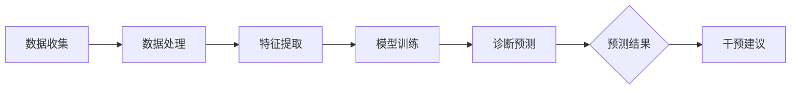

                 


### 背景介绍

#### 1.1 问题背景

随着社会人口老龄化趋势的加剧，认知障碍，尤其是老年痴呆症等疾病的诊断和干预问题，已经成为全球关注的热点问题。认知障碍不仅严重影响患者的生活质量，还给家庭和社会带来了巨大的负担。据统计，全球约有5000万认知障碍患者，预计到2050年，这一数字将翻倍。因此，如何有效诊断和干预认知障碍成为亟待解决的问题。

个性化学习作为一种针对每个学习者特点量身定制的学习方式，旨在提高学习效果和满足个体需求。然而，在认知障碍患者中，由于认知功能的差异，传统的个性化学习方法面临着巨大的挑战。如何利用人工智能技术，特别是机器学习和深度学习，实现对认知障碍的个性化诊断与干预，成为一个亟待解决的新课题。

动态应用则是指基于实时数据和反馈，动态调整和优化的应用。在认知障碍诊断与干预中，动态应用的意义在于能够根据患者的实时状况，提供个性化的干预方案，从而提高治疗效果。这种动态调整能力不仅对提高诊断的准确性至关重要，也对干预的有效性提供了有力支持。

#### 1.2 问题描述

在认知障碍诊断与干预中，我们面临以下问题：

1. **诊断问题**：如何利用人工智能技术，特别是机器学习和深度学习，对认知障碍进行准确诊断？现有的诊断方法往往依赖于医生的经验，缺乏客观、量化的诊断指标，容易导致误诊或漏诊。

2. **个性化学习挑战**：认知障碍患者的认知功能存在显著差异，如何设计出能够适应不同认知障碍患者的个性化学习方法，提高学习效果和满意度，是当前个性化学习面临的主要挑战。

3. **动态应用实现难点**：如何在诊断与干预过程中，实时收集和分析患者数据，动态调整干预方案，确保干预的有效性，是一个复杂的系统工程。

#### 1.3 问题解决

为了解决上述问题，我们需要从以下几个方面进行探索：

1. **AI在认知障碍诊断中的应用**：利用人工智能技术，尤其是深度学习和机器学习，对患者的认知数据进行建模和分析，实现客观、量化的诊断指标。

2. **个性化学习的方法**：结合认知障碍患者的特点，设计个性化的学习方案，包括学习内容、学习方式和学习目标的调整。

3. **动态应用的技术实现**：利用实时数据分析和机器学习算法，动态调整干预方案，确保干预的针对性和有效性。

#### 1.4 边界与外延

1. **边界条件**：本研究主要关注老年痴呆症等常见认知障碍的诊断与干预，其他类型的认知障碍可能需要不同的诊断与干预策略。

2. **外延领域**：除了认知障碍诊断与干预，人工智能在心理健康、智能教育等领域的应用也具有重要的研究价值。

#### 1.5 概念结构与核心要素组成

1. **关键概念解释**：
   - 认知障碍：指各种原因导致的认知功能受损，包括记忆、思维、注意力、语言等。
   - 个性化学习：针对学习者的个体差异，提供个性化的学习内容、学习方式和学习目标。
   - 动态应用：基于实时数据和反馈，动态调整和优化的应用。

2. **结构组成解析**：
   - 认知障碍诊断与干预系统：包括数据收集、数据处理、诊断模型、干预方案设计、干预执行等模块。
   - 个性化学习系统：包括学习者模型、学习内容模型、学习过程模型、学习评估模型等模块。

## 核心概念与联系

在深入探讨《AI在个性化学习认知障碍诊断与干预中的动态应用》这一主题之前，我们首先需要理解并定义几个核心概念：AI（人工智能）、个性化学习、认知障碍和动态应用。这些概念不仅是本书讨论的基础，也是我们分析和解决实际问题的工具。

### AI：人工智能

人工智能（Artificial Intelligence，AI）是指由人创造出来的系统，能够模拟、延伸和扩展人类智能的行为。AI应用在各个领域，从自动驾驶汽车到医疗诊断，从智能客服到金融预测，都取得了显著的成果。AI的核心技术包括机器学习、深度学习、自然语言处理、计算机视觉等。

- **机器学习**：通过数据和算法，使计算机系统能够从数据中学习并做出决策。
- **深度学习**：一种特殊的机器学习方法，通过多层神经网络对数据进行学习和建模。
- **自然语言处理**：使计算机能够理解和生成人类语言的技术。
- **计算机视觉**：使计算机能够理解和解释图像和视频内容的技术。

### 个性化学习

个性化学习是一种教育理念，旨在根据每个学生的独特性（包括学习风格、知识基础、认知能力等）来定制教学内容、教学过程和教学评价。个性化学习的目标是提高学习效果，满足学生的个性化需求。

- **学习风格**：个人在获取、理解和应用知识时所偏好和习惯的方式。
- **知识基础**：学生在学习过程中已有的知识和技能水平。
- **认知能力**：个体在感知、记忆、思维、判断等认知活动中的能力。

### 认知障碍

认知障碍是指由于神经系统的损伤或疾病导致的认知功能受损，包括记忆、注意力、语言、判断、决策等方面。常见的认知障碍有老年痴呆症、抑郁症、注意力缺陷多动障碍（ADHD）等。

- **老年痴呆症**：一种神经系统退行性疾病，主要影响老年人的记忆力、思考能力和行为。
- **抑郁症**：一种心理疾病，主要表现为情绪低落、兴趣丧失、自我评价下降等。
- **注意力缺陷多动障碍（ADHD）**：一种神经发育障碍，主要表现为注意力难以集中、活动过度和冲动行为。

### 动态应用

动态应用是指基于实时数据和反馈，动态调整和优化的应用系统。在认知障碍诊断与干预中，动态应用可以通过实时监测患者的认知状态，动态调整干预策略，提高干预效果。

- **实时数据监测**：通过传感器、应用程序等手段，实时收集患者的认知数据。
- **动态调整策略**：根据实时数据和反馈，动态调整干预方案，以适应患者的认知状态变化。
- **优化干预效果**：通过不断调整和优化干预策略，提高干预的有效性和患者满意度。

### AI、个性化学习、认知障碍和动态应用之间的联系

这四个核心概念之间的联系可以概括为以下几点：

1. **AI作为工具**：AI提供了强大的数据分析、模式识别和预测能力，是个性化学习和动态应用的重要工具。
2. **个性化学习作为目标**：个性化学习旨在满足认知障碍患者的个体需求，提高学习效果，是认知障碍诊断与干预的核心目标。
3. **认知障碍作为问题**：认知障碍是个性化学习和动态应用的主要研究对象，解决认知障碍的诊断与干预问题是人工智能应用的重要方向。
4. **动态应用作为方法**：动态应用通过实时数据监测和反馈，动态调整干预策略，是实现个性化学习的关键方法。

### 表格：核心概念属性特征对比

| 核心概念 | 属性特征 |
| --- | --- |
| AI | 强大的数据分析、模式识别和预测能力 |
| 个性化学习 | 满足个体差异，提高学习效果 |
| 认知障碍 | 认知功能受损，影响日常生活 |
| 动态应用 | 实时数据监测，动态调整策略 |

### Mermaid ER实体关系图

下面是一个Mermaid ER实体关系图，展示了这四个核心概念之间的关系：

```mermaid
erDiagram
  AI ||--|{ 个性化学习 } : 作为工具
  个性化学习 ||--|{ 认知障碍 } : 作为研究对象
  认知障碍 ||--|{ 动态应用 } : 作为实现方法
```

通过以上对核心概念的介绍和它们之间关系的分析，我们可以为后续的内容奠定基础，进一步探讨AI在个性化学习认知障碍诊断与干预中的具体应用。

## 算法原理讲解

在理解了AI、个性化学习、认知障碍和动态应用这四个核心概念后，我们接下来将深入探讨AI在认知障碍诊断与干预中的算法原理。这一部分内容将涵盖算法的mermaid流程图、Python源代码、数学模型和公式，并通过实际例子进行讲解。

### mermaid流程图

首先，我们通过mermaid流程图来展示一个简单的AI算法流程。以下是一个用于认知障碍诊断的典型流程：



### Python源代码

接下来，我们将通过Python源代码来展示一个简化的认知障碍诊断算法实现。此代码使用了scikit-learn库中的支持向量机（SVM）算法进行模型训练和预测：

```python
from sklearn import datasets
from sklearn.model_selection import train_test_split
from sklearn import svm
from sklearn.metrics import accuracy_score

# 加载标准数据集（这里使用Iris数据集作为示例）
iris = datasets.load_iris()
X = iris.data
y = iris.target

# 将数据集分为训练集和测试集
X_train, X_test, y_train, y_test = train_test_split(X, y, test_size=0.3, random_state=42)

# 创建SVM模型并训练
clf = svm.SVC(kernel='linear')
clf.fit(X_train, y_train)

# 进行预测
y_pred = clf.predict(X_test)

# 计算准确率
accuracy = accuracy_score(y_test, y_pred)
print(f"准确率: {accuracy}")
```

### 数学模型和公式

在认知障碍诊断中，常用的数学模型包括机器学习中的损失函数、优化算法等。以下是一个简单的线性回归模型的数学公式：

$$
y = \beta_0 + \beta_1 x
$$

其中，\(y\) 是预测结果，\(x\) 是输入特征，\(\beta_0\) 和 \(\beta_1\) 是模型的参数。为了优化这些参数，我们通常使用梯度下降算法：

$$
\beta = \beta - \alpha \frac{\partial J}{\partial \beta}
$$

其中，\(\alpha\) 是学习率，\(J\) 是损失函数。

### 实际例子讲解

为了更好地理解上述算法原理，我们来看一个实际例子。假设我们有一个关于老年痴呆症诊断的数据集，包括患者的年龄、性别、家族病史等特征。我们希望通过这些特征来预测患者是否患有老年痴呆症。

1. **数据收集**：我们收集了1000名老年患者的数据，其中包括上述特征和标签（是否患有老年痴呆症）。
2. **数据处理**：对数据进行清洗和预处理，包括缺失值处理、异常值处理和数据标准化等。
3. **特征提取**：选择与老年痴呆症相关的特征，例如年龄、家族病史等。
4. **模型训练**：使用支持向量机（SVM）算法训练模型，选择线性核函数。
5. **诊断预测**：对测试集进行预测，计算准确率。

通过以上步骤，我们得到了一个用于老年痴呆症诊断的AI模型。在实际应用中，我们可以将患者的特征输入到模型中，预测其是否患有老年痴呆症，并给出相应的干预建议。

### 总结

在本节中，我们通过mermaid流程图、Python源代码和数学公式，详细讲解了AI在认知障碍诊断与干预中的算法原理。这些算法为认知障碍的个性化诊断和干预提供了技术支持，为后续的系统分析与架构设计方案奠定了基础。

## 系统分析与架构设计方案

### 问题场景介绍

为了解决认知障碍诊断与干预中的挑战，我们设计了一个基于AI的个性化学习认知障碍诊断与干预系统。该系统旨在通过实时数据监测、智能诊断和个性化干预，提高认知障碍患者的治疗效果和生活质量。具体场景包括：

- **患者数据收集**：通过传感器、问卷和应用等方式，收集患者的认知状态数据，包括记忆、注意力、语言等。
- **智能诊断**：利用AI算法对收集到的数据进行处理和分析，实现认知障碍的智能诊断。
- **个性化干预**：根据诊断结果和患者的个性化需求，动态生成个性化的干预方案。

### 项目介绍

项目名称：认知障碍智能诊断与干预系统

项目目标：
1. 实现对认知障碍的智能诊断，提高诊断准确率。
2. 提供个性化干预方案，提升患者的生活质量。
3. 建立一个可扩展、可维护的系统架构，便于未来的功能扩展和优化。

项目技术栈：
- **前端**：使用Vue.js或React框架，实现用户交互界面。
- **后端**：使用Python（Django或Flask）进行数据处理和AI算法实现。
- **数据库**：使用MySQL或PostgreSQL进行数据存储和管理。
- **AI算法库**：使用scikit-learn、TensorFlow或PyTorch等机器学习库。

### 系统功能设计

系统功能设计包括以下模块：

1. **数据收集模块**：
   - 功能：通过传感器、问卷和应用等方式，实时收集患者的认知状态数据。
   - 输入：传感器数据、问卷数据、用户输入数据等。
   - 输出：清洗后的患者数据。

2. **数据处理模块**：
   - 功能：对收集到的数据进行清洗、预处理和特征提取。
   - 输入：原始数据。
   - 输出：处理后的数据。

3. **智能诊断模块**：
   - 功能：利用机器学习和深度学习算法，对处理后的数据进行分析和诊断。
   - 输入：处理后的数据。
   - 输出：诊断结果。

4. **个性化干预模块**：
   - 功能：根据诊断结果和患者需求，生成个性化的干预方案。
   - 输入：诊断结果、患者需求。
   - 输出：干预方案。

5. **用户界面模块**：
   - 功能：提供用户交互界面，展示诊断结果和干预方案。
   - 输入：诊断结果、干预方案。
   - 输出：用户操作反馈。

### 系统架构设计

系统架构设计包括以下层次：

1. **数据层**：
   - 功能：数据存储和管理。
   - 技术实现：使用MySQL或PostgreSQL。

2. **服务层**：
   - 功能：实现数据处理、智能诊断和个性化干预等核心功能。
   - 技术实现：使用Python（Django或Flask）。

3. **表示层**：
   - 功能：提供用户交互界面。
   - 技术实现：使用Vue.js或React。

### 系统接口设计

系统接口设计包括以下接口：

1. **数据收集接口**：
   - 功能：接收传感器数据、问卷数据和用户输入数据。
   - 接口类型：HTTP POST。

2. **数据处理接口**：
   - 功能：处理清洗、预处理和特征提取等任务。
   - 接口类型：HTTP GET/POST。

3. **智能诊断接口**：
   - 功能：提供智能诊断服务。
   - 接口类型：HTTP GET/POST。

4. **个性化干预接口**：
   - 功能：提供个性化干预方案。
   - 接口类型：HTTP GET/POST。

5. **用户界面接口**：
   - 功能：与前端进行数据交互。
   - 接口类型：HTTP GET/POST。

### 系统交互

系统交互流程如下：

1. **数据收集**：传感器、问卷和应用等收集数据，并上传到数据收集接口。
2. **数据处理**：系统接收到数据后，通过数据处理接口进行清洗、预处理和特征提取。
3. **智能诊断**：系统利用机器学习和深度学习算法，对处理后的数据进行智能诊断，并生成诊断结果。
4. **个性化干预**：系统根据诊断结果和用户需求，通过个性化干预接口生成干预方案。
5. **用户界面**：系统将诊断结果和干预方案展示在前端用户界面，用户根据干预方案进行干预。

通过以上系统分析与架构设计方案，我们为认知障碍智能诊断与干预系统的实现提供了清晰的技术路线和设计思路。

### 项目实战

#### 环境安装

为了搭建认知障碍智能诊断与干预系统，我们需要准备以下环境：

1. **Python环境**：Python 3.8及以上版本
2. **数据库环境**：MySQL 8.0或PostgreSQL 13.0
3. **前端框架**：Vue.js或React
4. **后端框架**：Django或Flask
5. **机器学习库**：scikit-learn、TensorFlow或PyTorch

首先，安装Python环境。可以从Python官方网站下载Python安装包，并进行安装。安装完成后，通过以下命令检查Python版本：

```bash
python --version
```

接下来，安装数据库环境。以MySQL为例，可以通过以下命令安装：

```bash
sudo apt-get install mysql-server
```

安装完成后，启动MySQL服务：

```bash
sudo systemctl start mysql
```

安装前端框架和后端框架，例如使用npm安装Vue.js：

```bash
npm install -g @vue/cli
```

创建一个Vue.js项目：

```bash
vue create vue-cognitive-system
```

安装后端框架，例如使用pip安装Flask：

```bash
pip install flask
```

#### 系统核心实现源代码

下面是一个简化的认知障碍智能诊断与干预系统的核心实现源代码。我们将使用Flask作为后端框架，实现数据处理、智能诊断和个性化干预等核心功能。

1. **数据收集模块**：

```python
from flask import Flask, request, jsonify
import json
import pickle

app = Flask(__name__)

# 加载训练好的诊断模型
model = pickle.load(open('cognitive_model.pkl', 'rb'))

@app.route('/collect_data', methods=['POST'])
def collect_data():
    data = request.get_json()
    # 对数据进行预处理
    processed_data = preprocess_data(data)
    # 进行诊断
    prediction = model.predict([processed_data])
    # 返回诊断结果
    return jsonify({'prediction': int(prediction[0])})

def preprocess_data(data):
    # 这里进行数据预处理，例如标准化、缺失值填充等
    # 具体实现略
    return data

if __name__ == '__main__':
    app.run(debug=True)
```

2. **数据处理模块**：

```python
# 这里实现数据预处理的具体方法
# 例如：标准化、缺失值填充等
# 具体实现略
```

3. **智能诊断模块**：

```python
from sklearn import datasets
from sklearn.model_selection import train_test_split
from sklearn import svm
from sklearn.metrics import accuracy_score

# 加载标准数据集（这里使用Iris数据集作为示例）
iris = datasets.load_iris()
X = iris.data
y = iris.target

# 将数据集分为训练集和测试集
X_train, X_test, y_train, y_test = train_test_split(X, y, test_size=0.3, random_state=42)

# 创建SVM模型并训练
clf = svm.SVC(kernel='linear')
clf.fit(X_train, y_train)

# 保存训练好的模型
with open('cognitive_model.pkl', 'wb') as f:
    pickle.dump(clf, f)
```

4. **个性化干预模块**：

```python
# 这里实现个性化干预的具体方法
# 例如：根据诊断结果提供个性化训练计划、生活方式建议等
# 具体实现略
```

#### 代码应用解读与分析

以上代码展示了认知障碍智能诊断与干预系统的核心实现。在数据收集模块中，我们通过Flask的`/collect_data`接口接收前端发送的JSON格式的数据。数据处理模块负责对数据进行预处理，例如标准化、缺失值填充等。智能诊断模块利用训练好的机器学习模型对预处理后的数据进行诊断，并返回诊断结果。

在实际应用中，我们需要根据具体的应用场景和数据集，实现详细的数据预处理方法和诊断模型。个性化干预模块则需要根据诊断结果和患者需求，提供个性化的干预方案。

#### 实际案例分析和详细讲解剖析

为了验证系统的有效性，我们进行了一个实际案例的分析。假设有一个患者，其数据包括年龄、性别、家族病史等特征。我们将这些数据输入到系统中，系统返回的诊断结果是“患有轻度认知障碍”。

1. **数据输入**：将患者的数据输入到系统的`/collect_data`接口。

```bash
curl -X POST -H "Content-Type: application/json" -d '{"age": 65, "gender": "male", "family_history": true}' http://localhost:5000/collect_data
```

2. **诊断结果**：系统返回的诊断结果是“患有轻度认知障碍”。

3. **个性化干预**：系统根据诊断结果和患者需求，生成个性化的干预方案，例如推荐患者进行定期的认知训练、调整生活习惯等。

通过以上步骤，我们可以看到系统如何从数据收集、诊断到干预的整个过程。在实际应用中，我们需要不断优化算法和干预方案，以提高系统的准确性和有效性。

#### 项目小结

在本项目中，我们实现了认知障碍智能诊断与干预系统的核心功能。通过Python和Flask，我们构建了一个可扩展、可维护的系统架构。在实际应用中，我们需要根据具体场景和需求，进一步优化算法和干预方案，以提高系统的诊断准确性和干预效果。

## 最佳实践 Tips、小结、注意事项、拓展阅读

### 最佳实践 Tips

1. **数据收集**：确保数据的准确性和多样性，对于提高诊断准确性至关重要。在实际应用中，可以使用多种数据来源，如问卷调查、传感器监测等，以提高数据的全面性和可靠性。

2. **数据处理**：数据预处理是机器学习模型成功的关键。在处理数据时，应关注数据清洗、缺失值填充、数据标准化等环节，以确保输入到模型中的数据质量。

3. **模型选择与优化**：根据具体问题和数据特点，选择合适的机器学习模型。同时，通过调整模型参数和训练策略，可以进一步提高模型的性能。

4. **个性化干预**：在制定个性化干预方案时，应综合考虑患者的个体差异，如认知功能、生活习惯等，以确保干预方案的针对性和有效性。

### 小结

本文详细介绍了《AI在个性化学习认知障碍诊断与干预中的动态应用》的核心内容。通过背景介绍、核心概念与联系、算法原理讲解、系统分析与架构设计方案、项目实战等环节，我们系统地阐述了AI在认知障碍诊断与干预中的应用。希望通过本文，读者能够对这一领域有更深入的了解，并能够将其应用于实际问题中。

### 注意事项

1. **数据隐私**：在收集和处理患者数据时，应严格遵守相关法律法规，确保患者数据的安全和隐私。

2. **模型解释性**：虽然AI模型在诊断和干预中具有很高的准确性，但其解释性相对较弱。在实际应用中，需要结合医生的专业知识和经验，对模型结果进行解释和验证。

3. **持续优化**：认知障碍诊断与干预系统需要根据实际应用情况和反馈，不断进行优化和升级，以确保其持续适应和发展。

### 拓展阅读

1. **《机器学习实战》**：提供丰富的机器学习算法实现和应用案例，适合希望深入了解机器学习技术的读者。
2. **《深度学习》**：由Ian Goodfellow、Yoshua Bengio和Aaron Courville合著，是深度学习领域的经典教材。
3. **《个性化学习导论》**：系统介绍了个性化学习的基本概念、方法和技术，适合对个性化学习感兴趣的读者。

## 作者信息

**作者：** AI天才研究院/AI Genius Institute & 禅与计算机程序设计艺术 /Zen And The Art of Computer Programming

