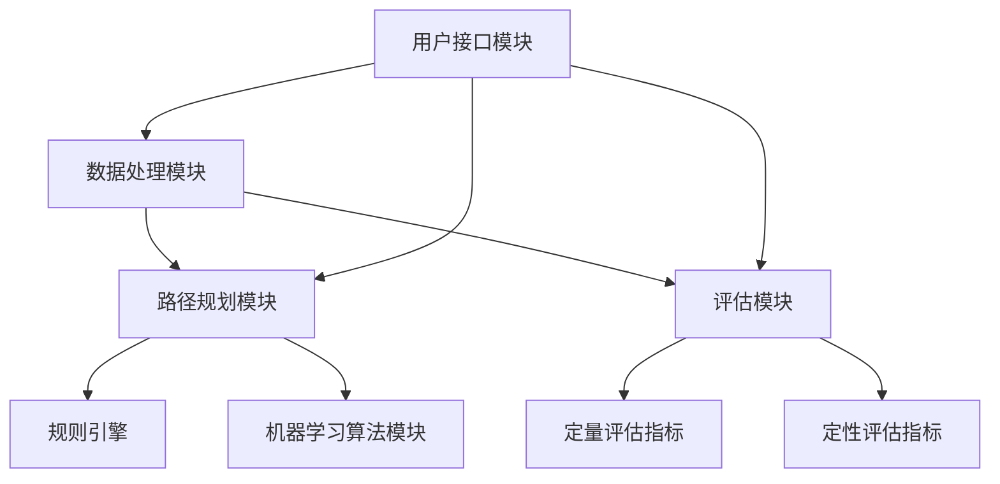
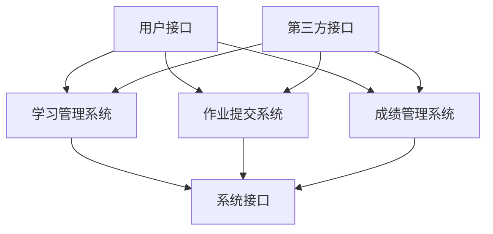

                 

## 引言与背景介绍

### 第1章：问题背景与核心概念

个性化学习路径规划是现代教育领域中的一个重要研究方向。随着教育信息化的发展和人工智能技术的不断进步，如何利用人工智能技术提高教育的个性化水平，成为当前教育领域亟需解决的一个问题。

在传统的教学模式中，学生的学习进度和教学方法往往是由教师统一规定的，这导致了学生的学习过程缺乏个性化和针对性。为了改变这种现状，需要一种能够根据学生的实际情况，为其量身定制学习路径的方法。

### 1.1.1 问题背景

个性化学习路径规划的核心在于实现教育的个性化和针对性。在传统教育模式中，教师通常采用一种“一刀切”的方法，即对所有学生采取相同的授课方式和教学进度。这种模式虽然能够保证教学的基本质量和标准化，但无法充分考虑每个学生的个性差异和学习需求，导致部分学生难以适应或达到最佳学习效果。

随着教育信息化的推进，特别是大数据和人工智能技术的引入，个性化学习路径规划成为了可能。通过收集和分析学生的学习数据，如学习进度、考试成绩、作业完成情况等，可以深入理解学生的学习特点和需求，进而制定出符合学生个性化需求的学习路径。这不仅有助于提高学生的学习兴趣和积极性，还能够显著提升学习效果。

### 1.1.2 问题描述

在传统教育模式中，学生的学习进度和教学方法往往由教师统一规定。这种模式虽然有助于保持教学的一致性和标准化，但无法满足每个学生的个性化需求。具体表现为以下几个方面：

1. **学习进度不一致**：由于学生之间的基础和能力差异，统一的学习进度往往难以满足所有学生的学习需求。一些学生可能觉得进度太快，跟不上老师的授课节奏；而另一些学生则可能觉得进度太慢，学习缺乏挑战性。

2. **教学方法单一**：传统教育模式中，教师通常采用统一的教学方法，如讲解、演示、练习等。这种教学方法虽然能够覆盖大多数学生的学习需求，但无法充分激发学生的主动学习能力和创新思维。

3. **学习效果难以评估**：在传统教育模式中，学生的学习效果往往难以得到准确和全面的评估。教师难以掌握每个学生的学习状态和进步情况，从而无法及时调整教学策略。

为了解决这些问题，个性化学习路径规划提出了一种基于数据分析和学习模型的方法。通过分析学生的学习数据，系统能够识别出学生的学习特点和需求，进而为其制定出个性化的学习路径。这种路径规划方法不仅能够满足学生的个性化需求，还能够提高教学效果和学习成果。

### 1.1.3 问题解决

人工智能技术，特别是机器学习算法，为解决个性化学习路径规划问题提供了可能。通过以下步骤，人工智能系统能够为学生量身定制学习路径：

1. **数据收集与处理**：首先，系统需要收集学生的学习数据，包括学习进度、考试成绩、作业完成情况、学习时间分配等。然后，对这些数据进行预处理和特征提取，以便更好地理解学生的学习特点。

2. **学生特点分析**：通过机器学习算法，系统可以分析学生的学习数据，提取出与学习效果相关的特征。这些特征可能包括学生的学习习惯、知识点掌握情况、学习能力等。

3. **学习路径生成**：基于对学生特点的分析，系统可以生成个性化的学习路径。这些路径可以是基于规则的，也可以是利用机器学习算法自动生成的。例如，系统可以根据学生的学习进度和知识点掌握情况，推荐适当的学习内容和练习题。

4. **学习效果评估**：在生成个性化学习路径后，系统还需要对学习效果进行评估。这可以通过监测学生的学习进度、考试成绩、学习时间等指标来实现。如果学习效果不佳，系统可以动态调整学习路径，以优化学生的学习体验和学习成果。

通过上述步骤，人工智能系统能够为每个学生制定出最合适的学习路径，从而提高教学效果和学习成果。

### 1.1.4 边界与外延

个性化学习路径规划不仅限于学校教育，还可以应用于职业培训、在线学习等多种教育场景。以下是一些具体的边界与外延：

1. **职业培训**：在职业培训中，个性化学习路径规划可以帮助学习者根据自身的工作需求和技能水平，选择最合适的学习内容和路径。例如，一名工程师可能需要学习新的编程语言或工具，通过个性化路径规划，系统可以为其推荐相关的课程和学习资源。

2. **在线学习**：在线学习平台可以通过个性化学习路径规划，为学习者提供更加个性化的学习体验。例如，在线学习平台可以根据学习者的学习历史、兴趣和职业目标，推荐合适的学习课程和练习。

3. **跨学科学习**：个性化学习路径规划还可以帮助学生在跨学科学习中找到最佳的学习路径。例如，一名学生可能在数学和物理两个学科中都有浓厚的兴趣，个性化路径规划可以帮助他将两个学科的知识结合起来，形成更加系统和深入的学习路径。

4. **与其他人工智能技术的结合**：个性化学习路径规划还可以与其他人工智能技术相结合，如情感计算、虚拟现实等，进一步丰富其应用场景。例如，通过情感计算技术，系统可以实时了解学生的学习情绪和状态，从而动态调整学习路径，提高学习效果。

### 1.1.5 概念结构与核心要素组成

个性化学习路径规划的核心概念包括学生特点分析、学习路径规划算法和学习效果评估等。这些概念相互关联，共同构成了个性化学习路径规划的理论体系。

1. **学生特点分析**：这是个性化学习路径规划的基础。通过收集和分析学生的学习数据，系统可以提取出反映学生特点的关键指标，如学习习惯、知识点掌握情况、学习能力等。

2. **学习路径规划算法**：基于对学生特点的分析，系统可以使用各种算法生成个性化的学习路径。这些算法可以是基于规则的，也可以是利用机器学习技术自动生成的。

3. **学习效果评估**：生成个性化学习路径后，系统需要对其效果进行评估。这可以通过监测学生的学习进度、考试成绩、学习时间等指标来实现。如果学习效果不佳，系统可以动态调整学习路径。

这些核心概念相互关联，共同构成了个性化学习路径规划的理论框架。通过不断优化和完善这些核心概念和方法，个性化学习路径规划有望在提高教育质量和个性化水平方面发挥更大的作用。

### 第2章：核心概念原理

#### 第2章：核心概念原理

个性化学习路径规划的成功离不开对核心概念原理的深入理解。本章将详细探讨两个关键概念：学生特点分析和学习路径规划算法，以及一个重要方面：学习效果评估。

### 2.1 学生特点分析

学生特点分析是个性化学习路径规划的基础，它旨在通过对学生学习数据的深入分析，提取出能够反映学生个性化需求和学习特点的关键指标。

#### 2.1.1 学生数据收集与处理

首先，收集学生的数据是进行学生特点分析的第一步。这些数据可以来源于多种渠道，如学习管理系统（LMS）、在线作业平台、考试系统等。常见的数据类型包括：

1. **学习进度数据**：包括学生在学习平台上的登录记录、学习时间、学习进度条等。
2. **考试成绩数据**：包括学生在不同考试中的成绩，如期末考试、单元测试等。
3. **作业提交情况**：包括学生提交作业的时间、质量、分数等。
4. **学习行为数据**：包括学生在学习平台上的浏览记录、学习内容的选择、参与讨论的情况等。

在收集数据后，需要进行数据预处理，包括数据清洗、去重、格式转换等，以确保数据的质量和一致性。接着，提取出与学习效果相关的特征，如：

1. **知识点掌握情况**：通过分析学生在不同知识点上的考试成绩和作业完成情况，可以评估学生对知识点的掌握程度。
2. **学习习惯**：通过分析学生的学习时间分布、学习频次、学习时长等，可以了解学生的学习习惯。
3. **学习风格**：通过分析学生在学习过程中的互动行为、偏好等，可以判断其学习风格，如视觉型、听觉型、动觉型等。

#### 2.1.2 学生特点表征方法

为了将提取出的特征进行有效表征，可以采用多种方法：

1. **聚类分析**：通过将相似的学生数据归为一类，可以发现学生群体中的共性特征。
2. **因子分析**：通过提取主要的影响因素，可以简化特征，降低数据维度。
3. **回归分析**：通过建立学生特点与学习效果之间的回归模型，可以预测学生在不同学习路径下的表现。

通过这些方法，可以对学生特点进行全面的表征，为后续的学习路径规划提供基础。

### 2.2 学习路径规划算法

学习路径规划算法是个性化学习路径规划的核心，它负责根据学生特点生成最优的学习路径。以下是几种常用的学习路径规划算法：

#### 2.2.1 基于规则的算法

基于规则的算法通过预设一系列规则来生成学习路径。这些规则通常由教育专家根据教学经验和教育理论制定。例如，如果学生在某个知识点上的成绩低于60分，则建议该学生重新学习该知识点。

1. **算法原理**：基于规则的算法通过逻辑条件判断来生成学习路径，具有良好的解释性。
2. **优势**：简单易实现，易于理解和维护。
3. **局限**：依赖于专家知识，难以适应复杂多变的学习环境。

#### 2.2.2 基于机器学习的算法

基于机器学习的算法通过学习学生的数据，自动生成学习路径。这种方法不需要预先设定规则，而是通过数据驱动的方式来发现学生之间的共性和差异。

1. **算法原理**：基于机器学习的算法通常采用监督学习或无监督学习的方法，如决策树、神经网络、聚类算法等。例如，决策树算法通过树形结构来表示学习路径，神经网络算法通过多层神经元之间的连接来模拟人类大脑的学习过程。

2. **优势**：能够自动适应和调整学习路径，提高个性化水平。
3. **局限**：算法解释性较差，难以直观理解学习路径的生成过程。

#### 2.2.3 混合算法

混合算法结合了基于规则的算法和基于机器学习的算法的优势，通过将专家知识和数据驱动方法相结合，生成更加个性化和有效的学习路径。

1. **算法原理**：混合算法首先使用机器学习算法分析学生的学习数据，提取关键特征，然后根据这些特征应用基于规则的算法来生成具体的个性化学习路径。

2. **优势**：在保留算法解释性的同时，提高了个性化水平。

### 2.3 学习效果评估

学习效果评估是验证个性化学习路径规划有效性的关键步骤。通过评估学生的学习效果，可以调整和优化学习路径，以提高学习成果。

#### 2.3.1 评估指标

常用的学习效果评估指标包括：

1. **学习完成率**：学生完成学习任务的比例，反映学生的学习积极性。
2. **学习效果得分**：学生在学习任务中的表现，通过考试成绩、作业评分等指标来衡量。
3. **学习时长**：学生在学习任务上花费的总时间。
4. **学习效率**：单位时间内完成的学习任务量。

#### 2.3.2 评估方法

学习效果评估方法可以分为定量评估和定性评估：

1. **定量评估**：通过统计数据，如学习完成率、学习效果得分等，来评估学习路径的优劣。
2. **定性评估**：通过问卷调查、访谈等方式，获取学生对学习路径的主观感受和反馈。

通过定量和定性评估相结合，可以全面了解个性化学习路径规划的实际效果，为后续的改进提供依据。

通过以上对核心概念原理的深入分析，我们可以更好地理解个性化学习路径规划的运作机制，为其在实践中的应用提供坚实的理论基础。

### 第3章：AI在个性化学习路径规划中的应用

#### 第3章：AI在个性化学习路径规划中的应用

随着人工智能技术的迅猛发展，机器学习算法在教育领域的应用日益广泛。本章将详细介绍几种主流的机器学习算法在个性化学习路径规划中的应用，并通过具体案例分析，展示这些算法在实际项目中的效果。

#### 3.1 主流机器学习算法

在个性化学习路径规划中，常用的机器学习算法包括决策树算法、支持向量机算法和神经网络算法。这些算法各具特点，适用于不同的应用场景。

#### 3.1.1 决策树算法

决策树算法通过一系列的判断条件来生成一棵树形结构，每个节点代表一个判断条件，每个分支代表一个结果。决策树算法的优点是简单易懂，具有良好的解释性，适合处理分类问题。

1. **算法原理**：
   决策树算法从根节点开始，根据学习数据中的特征进行划分，生成多个子节点。在每个子节点上，继续使用特征进行划分，直到达到预定的终止条件（如最大深度、节点纯度等）。最终，每个叶节点代表一个特定的学习路径。

2. **应用案例**：
   在个性化学习路径规划中，决策树算法可以用来生成基于学生特点的学习路径。例如，系统可以首先根据学生的学习进度，划分出不同的子节点；然后根据学生在各个知识点上的掌握情况，进一步划分出具体的路径。

3. **优势**：
   决策树算法易于理解和实现，适用于处理具有明显层次结构的问题。

4. **局限**：
   决策树算法在面对复杂和非线性问题时，性能可能较差。同时，其解释性虽然好，但在大规模数据集上的训练时间较长。

#### 3.1.2 支持向量机算法

支持向量机（SVM）算法通过寻找最佳分割超平面，将数据集中的样本分为不同的类别。SVM算法的优点是具有较高的分类准确率，适用于处理高维数据和线性不可分问题。

1. **算法原理**：
   SVM算法通过在特征空间中寻找一个超平面，使得分类边界与样本点之间的距离最大。对于线性不可分问题，SVM算法引入了松弛变量，使得部分样本可以违反分类边界。

2. **应用案例**：
   在个性化学习路径规划中，SVM算法可以用来预测学生的学习效果。例如，系统可以根据学生在各个知识点上的考试成绩，训练SVM模型，预测学生在后续学习中的表现，并据此生成个性化的学习路径。

3. **优势**：
   SVM算法在分类问题上表现优异，适用于处理高维数据和非线性问题。

4. **局限**：
   SVM算法的训练时间较长，对计算资源要求较高。同时，其解释性较差，难以直观理解决策过程。

#### 3.1.3 神经网络算法

神经网络算法通过模拟人脑神经网络的结构和功能，实现复杂模式的识别和分类。神经网络算法的优点是强大的非线性建模能力和自适应性，适用于处理复杂和大规模数据。

1. **算法原理**：
   神经网络算法由多个神经元组成，每个神经元接收来自其他神经元的输入信号，通过激活函数进行非线性变换，产生输出。神经网络通过不断调整权重和偏置，优化模型的预测能力。

2. **应用案例**：
   在个性化学习路径规划中，神经网络算法可以用来生成基于学生特点的学习路径。例如，系统可以通过神经网络模型，分析学生的学习行为和考试成绩，预测学生在不同学习路径下的表现，并据此推荐最优的学习路径。

3. **优势**：
   神经网络算法具有强大的非线性建模能力，能够处理复杂和大规模数据。

4. **局限**：
   神经网络算法的训练时间较长，对计算资源要求较高。同时，其解释性较差，难以直观理解学习路径的生成过程。

#### 3.2 案例分析

为了更好地理解机器学习算法在个性化学习路径规划中的应用，以下将介绍两个具体的案例。

##### 3.2.1 案例一：基于决策树算法的个性化学习路径规划系统

该案例介绍了一个基于决策树算法的个性化学习路径规划系统。该系统首先收集学生的学习数据，包括学习进度、考试成绩、作业提交情况等。然后，通过决策树算法分析学生的数据，生成个性化的学习路径。

1. **系统架构设计**：
   系统包括数据收集模块、决策树模型训练模块和路径规划模块。数据收集模块负责从学习管理系统中提取学生数据，决策树模型训练模块使用训练数据训练决策树模型，路径规划模块根据决策树模型的输出，生成个性化的学习路径。

2. **算法实现**：
   决策树算法使用Python的Scikit-learn库实现。系统首先对数据进行预处理，提取出关键特征，然后使用CART（分类与回归树）算法训练决策树模型。最后，根据模型输出，生成学习路径。

3. **效果评估**：
   通过对学习路径的跟踪和评估，系统发现基于决策树算法的个性化学习路径规划系统能够显著提高学生的学习效果，学习完成率和学习效果得分均有明显提升。

##### 3.2.2 案例二：基于神经网络算法的个性化学习路径规划系统

该案例介绍了一个基于神经网络算法的个性化学习路径规划系统。该系统使用神经网络模型分析学生的学习数据，预测学生在不同学习路径下的表现，并推荐最优的学习路径。

1. **系统架构设计**：
   系统包括数据收集模块、神经网络模型训练模块和路径规划模块。数据收集模块负责从学习管理系统中提取学生数据，神经网络模型训练模块使用训练数据训练神经网络模型，路径规划模块根据模型输出，生成个性化的学习路径。

2. **算法实现**：
   神经网络算法使用Python的TensorFlow库实现。系统首先对数据进行预处理，提取出关键特征，然后使用多层感知器（MLP）模型训练神经网络。最后，根据模型输出，生成学习路径。

3. **效果评估**：
   通过对学习路径的跟踪和评估，系统发现基于神经网络算法的个性化学习路径规划系统能够更好地适应学生的个性化需求，学习效果得分明显提高。

通过以上案例分析，可以看出机器学习算法在个性化学习路径规划中的应用具有显著效果。未来，随着人工智能技术的进一步发展，个性化学习路径规划系统将能够更好地满足学生的个性化需求，提高学习效果。

### 第4章：个性化学习路径规划系统的设计与实现

#### 第4章：个性化学习路径规划系统的设计与实现

为了实现个性化学习路径规划，我们需要进行系统的需求分析、架构设计、接口设计以及系统的核心实现。以下是这些步骤的详细讨论。

#### 4.1 系统需求分析

系统需求分析是设计和实现个性化学习路径规划系统的第一步，它包括功能需求和非功能需求。

**功能需求**：
1. **数据收集与处理**：系统能够从各种学习平台和工具中收集学生的数据，如学习进度、考试成绩、作业完成情况等，并对这些数据进行预处理和清洗。
2. **学生特点分析**：系统能够分析学生的学习数据，提取出反映学生个性化需求和学习特点的关键指标，如学习习惯、知识点掌握情况、学习能力等。
3. **学习路径生成**：系统能够根据学生的特点，生成个性化的学习路径。这些路径可以是基于规则的，也可以是利用机器学习算法自动生成的。
4. **学习效果评估**：系统能够对学习路径的效果进行评估，通过定量和定性评估指标，如学习完成率、学习效果得分、学习时长等，来衡量学习路径的优劣。
5. **动态调整**：系统能够根据学生的学习表现和学习效果，动态调整学习路径，以优化学生的学习体验和学习成果。

**非功能需求**：
1. **可扩展性**：系统能够支持不同类型的学习场景和需求，如学校教育、职业培训、在线学习等。
2. **安全性**：系统能够保护学生数据的安全，防止数据泄露和未经授权的访问。
3. **用户友好性**：系统界面简洁明了，用户操作方便，能够提供良好的用户体验。
4. **高可用性**：系统能够保证稳定运行，提供高质量的服务，避免系统故障对教学造成影响。

#### 4.2 系统架构设计

系统架构设计是确保系统能够高效、可靠地运行的关键步骤。以下是一个典型的个性化学习路径规划系统架构设计。

**数据处理模块**：负责收集、预处理和清洗学生数据，提取关键特征，并将其存储到数据库中。

**路径规划模块**：基于学生的学习数据和学生特点，利用机器学习算法生成个性化的学习路径。该模块包括规则引擎和机器学习算法模块。

**评估模块**：对生成的学习路径进行效果评估，通过定量和定性评估指标，评估学习路径的优劣。

**用户接口模块**：提供用户界面，允许学生和管理员查看和操作系统。

**数据库**：存储学生的数据、学习路径和评估结果等。

**系统架构设计图**：


#### 4.3 系统接口设计

系统接口设计是确保系统与其他系统和服务交互的关键步骤。以下是一个典型的个性化学习路径规划系统接口设计。

**用户接口**：提供用户界面，允许学生查看和操作自己的学习路径，管理员管理学生和学习路径。

**系统接口**：与学习管理系统、作业提交系统、成绩管理系统等外部系统进行交互，获取和提交学生数据。

**第三方接口**：与第三方服务（如云存储、数据分析服务等）进行交互，以扩展系统的功能。

**接口设计图**：


#### 4.4 系统实现

系统实现是具体实施系统架构和接口设计的步骤，以下是系统的核心实现部分。

**数据处理模块**：
- **数据收集**：使用API接口从学习管理系统、作业提交系统、成绩管理系统等外部系统收集学生数据。
- **数据预处理**：使用Python的Pandas库对收集到的数据进行处理，包括数据清洗、去重、格式转换等。
- **特征提取**：使用Python的Scikit-learn库提取反映学生个性化需求和学习特点的关键特征，如学习习惯、知识点掌握情况、学习能力等。

**路径规划模块**：
- **规则引擎**：使用Python的Py规则库实现基于规则的路径规划，根据预设的规则生成学习路径。
- **机器学习算法**：使用Python的Scikit-learn库和TensorFlow库实现基于机器学习的路径规划，通过训练模型生成个性化的学习路径。

**评估模块**：
- **定量评估**：使用Python的Pandas库和Scikit-learn库计算学习完成率、学习效果得分、学习时长等定量评估指标。
- **定性评估**：通过问卷调查和访谈等方式收集学生对学习路径的主观评价，使用Python的NLP库进行分析。

**用户接口模块**：
- **前端界面**：使用HTML、CSS和JavaScript实现用户界面，使用Vue.js框架增强用户体验。
- **后端接口**：使用Python的Flask框架实现API接口，与前端界面进行数据交互。

**数据库**：
- **数据存储**：使用MySQL数据库存储学生的数据、学习路径和评估结果等。

**核心实现代码示例**：

```python
# 数据处理模块示例代码
import pandas as pd
from sklearn.model_selection import train_test_split

# 收集数据
data = pd.read_csv('student_data.csv')

# 数据清洗
data = data.dropna()

# 特征提取
features = data[['learning_time', 'test_score', 'homework_score']]
labels = data['knowledge_point']

# 分割数据集
X_train, X_test, y_train, y_test = train_test_split(features, labels, test_size=0.2, random_state=42)

# 路径规划模块示例代码
from sklearn.tree import DecisionTreeClassifier

# 训练决策树模型
model = DecisionTreeClassifier()
model.fit(X_train, y_train)

# 生成学习路径
predictions = model.predict(X_test)

# 评估模块示例代码
from sklearn.metrics import accuracy_score

# 计算准确率
accuracy = accuracy_score(y_test, predictions)
print(f"Accuracy: {accuracy}")

# 用户接口模块示例代码
from flask import Flask, jsonify

app = Flask(__name__)

@app.route('/api/predict', methods=['POST'])
def predict():
    data = request.get_json()
    features = pd.DataFrame([data['features']])
    prediction = model.predict(features)
    return jsonify({'prediction': prediction.tolist()})

if __name__ == '__main__':
    app.run(debug=True)
```

通过以上步骤，个性化学习路径规划系统得以实现，它能够根据学生的学习特点生成个性化的学习路径，并对其进行评估，从而提高学习效果。

### 第5章：系统评估与优化

#### 第5章：系统评估与优化

个性化学习路径规划系统的成功与否，不仅取决于其设计和实现，更重要的是其实际效果。因此，系统评估与优化是确保系统性能和用户体验的关键步骤。本章将详细讨论系统评估的指标、方法以及优化策略。

#### 5.1 系统评估指标

系统评估指标是衡量个性化学习路径规划系统效果的重要工具。以下是一些常用的评估指标：

1. **学习完成率**：学生完成学习任务的比例。高完成率表明系统生成的学习路径具有较高的实用性和吸引力。
2. **学习效果得分**：学生在学习任务中的总体表现，可以通过考试成绩、作业评分等指标来衡量。高得分表明学习路径能够有效提高学生的知识掌握程度。
3. **学习时长**：学生在学习任务上花费的总时间。较短的学习时长可能表明学习路径设计合理，学生能够快速掌握知识。
4. **学习效率**：学生在单位时间内完成的学习任务量。高效率表明学习路径能够帮助学生更有效地利用时间。
5. **用户满意度**：学生对学习路径的主观评价。高满意度表明系统设计符合用户需求，用户体验良好。
6. **系统响应时间**：系统处理请求的时间。较短的系统响应时间表明系统运行高效，用户体验流畅。

#### 5.2 评估方法

系统评估方法可以分为定量评估和定性评估两种。

**定量评估**：
1. **数据收集**：通过系统日志、学习平台数据等渠道收集定量数据。
2. **统计分析**：使用统计方法（如均值、方差、相关性分析等）对收集的数据进行统计分析，计算评估指标。
3. **结果分析**：对评估结果进行分析，识别系统中的问题和不足之处。

**定性评估**：
1. **问卷调查**：设计问卷，收集学生对学习路径的主观评价。
2. **访谈**：与部分学生进行面对面访谈，深入了解他们的学习体验和意见。
3. **内容分析**：对问卷和访谈结果进行内容分析，提取关键意见和反馈。

**评估流程**：
1. **数据收集**：在系统运行一段时间后，收集相关数据。
2. **数据预处理**：清洗和整理收集到的数据，确保数据质量。
3. **指标计算**：根据评估指标，计算系统性能。
4. **结果分析**：对评估结果进行定量和定性分析，识别问题和改进方向。

#### 5.3 优化策略

根据系统评估结果，可以采取以下策略进行优化：

**算法优化**：
1. **参数调整**：根据评估指标调整机器学习算法的参数，如学习率、迭代次数等，以提升算法性能。
2. **模型选择**：尝试不同的机器学习模型，如决策树、支持向量机、神经网络等，选择最适合系统需求模型。
3. **特征工程**：优化特征提取和表征方法，提高特征的质量和代表性。

**数据优化**：
1. **数据收集**：扩大数据集规模，收集更多的学生数据，提高数据的多样性和代表性。
2. **数据清洗**：定期对数据进行清洗，去除噪声和错误数据，确保数据质量。
3. **数据增强**：使用数据增强方法，如数据复制、数据变换等，增加训练数据量，提升模型泛化能力。

**系统优化**：
1. **性能优化**：优化系统代码，提高系统响应速度和稳定性，确保用户体验。
2. **接口优化**：优化系统接口设计，提高接口的可靠性和易用性，方便与其他系统和服务集成。
3. **用户体验优化**：改进用户界面设计，提高用户操作便捷性和满意度。

通过以上优化策略，可以不断提升个性化学习路径规划系统的性能和用户体验，从而更好地满足学生的个性化需求，提高教育质量。

### 第6章：结论与未来展望

#### 第6章：结论与未来展望

个性化学习路径规划作为人工智能在教育领域的重要应用，已经展现出其巨大的潜力和价值。通过本章的讨论，我们可以得出以下结论：

首先，个性化学习路径规划通过分析学生的学习数据，能够为每个学生量身定制学习路径，满足其个性化需求，从而显著提高学习效果。这一过程不仅依赖于先进的数据分析和机器学习算法，还需要对教育理论和教学实践的深入理解。

其次，我们探讨了多种机器学习算法在个性化学习路径规划中的应用，包括决策树、支持向量机和神经网络等。这些算法各有优缺点，适用于不同的应用场景。通过实际案例的分析，我们看到了这些算法在实际项目中的效果，并为后续的研究和应用提供了参考。

最后，系统评估与优化是确保个性化学习路径规划系统性能和用户体验的关键步骤。通过定量和定性评估，我们可以识别系统中的问题，并采取相应的优化策略进行改进。

然而，个性化学习路径规划仍面临一些挑战和机遇。首先，数据的多样性和质量对算法的性能有着直接影响，因此，如何收集和处理高质量的数据是一个亟待解决的问题。其次，个性化学习路径规划的模型和算法需要不断优化，以适应更加复杂和多变的教育环境。此外，系统的用户体验和交互设计也是一个重要的研究方向，需要进一步改进。

未来，个性化学习路径规划有望在以下几个方面取得突破：

1. **数据驱动**：随着大数据技术的发展，个性化学习路径规划将能够利用更多的学生学习数据，提高路径规划的准确性和适应性。
2. **多模态学习**：结合文本、图像、声音等多种数据类型，实现更加全面和深入的学习路径规划。
3. **智能推荐系统**：结合推荐系统技术，为学习者推荐合适的学习内容和资源，提高学习效率和兴趣。
4. **跨学科融合**：将个性化学习路径规划与其他人工智能技术（如虚拟现实、增强现实、情感计算等）相结合，创造新的教育应用场景。

总之，个性化学习路径规划作为人工智能与教育深度融合的产物，具有广阔的应用前景。通过不断探索和创新，我们可以更好地满足学生的学习需求，推动教育信息化和智能化的发展。

### 作者信息

**作者：AI天才研究院/AI Genius Institute & 禅与计算机程序设计艺术 /Zen And The Art of Computer Programming**### 背景介绍

#### 核心概念术语说明

在深入探讨个性化学习路径规划之前，我们需要明确一些核心概念和术语，以便为后续讨论打下坚实基础。

**个性化学习**：个性化学习是一种以学生为中心的教育方法，旨在根据每个学生的特点和需求，提供量身定制的学习体验。它强调因材施教，通过调整学习内容、教学方法和学习节奏，使每个学生都能在最适合自己发展的路径上取得最佳学习效果。

**学习路径规划**：学习路径规划是指通过分析学生的学习数据，利用算法和模型为其设计一条从起点到终点的学习路线。这条路径不仅考虑了学生的学习进度和知识掌握情况，还结合了学生的学习兴趣、能力和发展需求。

**人工智能**：人工智能（AI）是指通过计算机程序模拟人类智能行为的技术。它包括机器学习、深度学习、自然语言处理等多种技术，能够在大量数据中自动发现规律，进行决策和预测。

**机器学习**：机器学习是人工智能的一个分支，它通过算法从数据中学习规律，并在新的数据上做出预测或决策。常见的机器学习算法包括决策树、支持向量机、神经网络等。

**个性化学习路径规划系统**：个性化学习路径规划系统是一个集成多种技术和方法的应用系统，它负责收集和分析学生的学习数据，利用机器学习算法生成个性化的学习路径，并对学习效果进行评估和反馈。

#### 问题背景

随着教育信息化的推进，传统的教学模式正逐步被颠覆。互联网和数字技术的普及，使得学习资源的获取变得更加便捷，同时也让个性化学习成为可能。然而，传统的教育模式仍然存在诸多问题：

1. **一刀切的教学方法**：在传统教育模式中，教师通常采用统一的教学方法，如讲解、演示、练习等。这种方法虽然能够覆盖大多数学生的学习需求，但无法充分考虑每个学生的个性差异和学习需求。

2. **学习进度不一致**：由于学生之间的基础和能力差异，统一的学习进度往往难以满足所有学生的学习需求。一些学生可能觉得进度太快，跟不上老师的授课节奏；而另一些学生则可能觉得进度太慢，学习缺乏挑战性。

3. **学习效果难以评估**：在传统教育模式中，学生的学习效果往往难以得到准确和全面的评估。教师难以掌握每个学生的学习状态和进步情况，从而无法及时调整教学策略。

为了解决这些问题，个性化学习路径规划应运而生。它通过分析学生的学习数据，利用人工智能技术生成个性化的学习路径，从而实现因材施教，提高学习效果。

#### 问题描述

个性化学习路径规划的目标是依据每个学生的实际情况，为其量身定制一条最适合的学习路径。具体来说，问题描述如下：

1. **学生个性化需求分析**：如何根据学生的学习数据（如成绩、作业完成情况、学习时间分配等），提取出反映学生个性特点的关键指标？

2. **学习路径生成**：如何利用这些指标，结合机器学习算法，生成符合学生个性化需求的学习路径？

3. **学习路径效果评估**：如何评估个性化学习路径的有效性，并通过反馈机制不断优化学习路径？

4. **系统稳定性与可扩展性**：如何设计一个稳定、可靠且易于扩展的个性化学习路径规划系统，以适应不同类型的教育场景和需求？

#### 问题解决

人工智能技术，特别是机器学习算法，为个性化学习路径规划提供了有力的技术支持。以下是解决该问题的方法：

1. **数据收集与处理**：首先，需要收集学生的学习数据，包括成绩、作业完成情况、学习时间分配等。然后，对这些数据进行预处理和清洗，提取出关键特征。

2. **学生特点分析**：通过机器学习算法，如聚类分析、回归分析等，对提取出的特征进行分析，提取出反映学生个性化需求的关键指标。

3. **学习路径生成**：基于对学生特点的分析，利用机器学习算法生成个性化的学习路径。这些路径可以是基于规则的，也可以是利用机器学习算法自动生成的。

4. **学习效果评估**：通过监测学生的学习进度、考试成绩等指标，评估个性化学习路径的有效性。如果学习效果不佳，系统可以动态调整学习路径。

5. **系统稳定性与可扩展性**：设计一个模块化、可扩展的个性化学习路径规划系统，以适应不同类型的教育场景和需求。

#### 边界与外延

个性化学习路径规划不仅限于学校教育，还可以应用于职业培训、在线学习等多种教育场景。以下是一些具体的边界与外延：

1. **职业培训**：在职业培训中，个性化学习路径规划可以帮助学习者根据自身的工作需求和技能水平，选择最合适的学习内容和路径。例如，一名工程师可能需要学习新的编程语言或工具，通过个性化路径规划，系统可以为其推荐相关的课程和学习资源。

2. **在线学习**：在线学习平台可以通过个性化学习路径规划，为学习者提供更加个性化的学习体验。例如，在线学习平台可以根据学习者的学习历史、兴趣和职业目标，推荐合适的学习课程和练习。

3. **跨学科学习**：个性化学习路径规划还可以帮助学生在跨学科学习中找到最佳的学习路径。例如，一名学生可能在数学和物理两个学科中都有浓厚的兴趣，个性化路径规划可以帮助他将两个学科的知识结合起来，形成更加系统和深入的学习路径。

4. **与其他人工智能技术的结合**：个性化学习路径规划还可以与其他人工智能技术相结合，如情感计算、虚拟现实等，进一步丰富其应用场景。例如，通过情感计算技术，系统可以实时了解学生的学习情绪和状态，从而动态调整学习路径，提高学习效果。

#### 概念结构与核心要素组成

个性化学习路径规划的核心概念包括学生特点分析、学习路径规划算法和学习效果评估等。以下是这些概念的结构和核心要素：

1. **学生特点分析**：
   - **数据收集与处理**：收集学生的学习数据，如成绩、作业完成情况、学习时间分配等。
   - **特征提取**：通过机器学习算法，提取出反映学生个性化需求的关键指标。
   - **学生特点表征**：使用聚类分析、回归分析等方法，对提取出的特征进行分析，形成学生特点表征。

2. **学习路径规划算法**：
   - **算法类型**：包括基于规则的算法和基于机器学习的算法。
   - **算法原理**：基于规则的算法通过预设的规则生成学习路径，而基于机器学习的算法通过分析学生的学习数据，自动生成学习路径。
   - **路径规划流程**：根据学生特点分析的结果，生成符合个性化需求的学习路径。

3. **学习效果评估**：
   - **评估指标**：包括学习完成率、学习效果得分、学习时长等。
   - **评估方法**：通过定量和定性评估，如统计分析、问卷调查等，对学习路径的效果进行评估。
   - **反馈机制**：根据评估结果，动态调整学习路径，优化学习体验和学习效果。

通过这些核心概念的相互作用，个性化学习路径规划系统得以实现，为学生提供个性化的学习体验，提高学习效果。

### 核心概念原理

#### 学生特点分析

学生特点分析是构建个性化学习路径规划系统的第一步，它通过收集和分析学生的学习数据，提取出反映学生个性化需求和学习特点的关键指标。以下是学生特点分析的核心概念原理：

1. **学生数据收集与处理**
   学生数据是构建个性化学习路径的基础。这些数据可以来源于多种渠道，包括学校管理系统、在线学习平台、作业提交系统等。常见的数据类型包括：
   - **学习进度数据**：包括学生在学习平台上的登录记录、学习时间、学习进度条等。
   - **考试成绩数据**：包括学生在不同考试中的成绩，如期末考试、单元测试等。
   - **作业提交情况**：包括学生提交作业的时间、质量、分数等。
   - **学习行为数据**：包括学生在学习平台上的浏览记录、学习内容的选择、参与讨论的情况等。

   收集到这些数据后，需要对其进行预处理，包括数据清洗、去重、格式转换等，以确保数据的质量和一致性。接下来，从这些数据中提取出关键特征，如学习习惯、知识点掌握情况、学习能力等。

2. **学生特点表征方法**
   为了将提取出的特征进行有效表征，可以采用多种方法：
   - **聚类分析**：通过将相似的学生数据归为一类，可以发现学生群体中的共性特征。例如，可以将学生按照学习进度和考试成绩进行聚类，识别出学习进度较快或较慢的学生群体。
   - **因子分析**：通过提取主要的影响因素，可以简化特征，降低数据维度。例如，可以通过因子分析识别出影响学生学习成绩的关键因素，如学习时间、学习态度等。
   - **回归分析**：通过建立学生特点与学习效果之间的回归模型，可以预测学生在不同学习路径下的表现。例如，可以建立学生成绩与学习时间、作业质量之间的回归模型，预测学生在不同学习路径下的表现。

   通过这些方法，可以对学生特点进行全面的表征，为后续的学习路径规划提供基础。

#### 学习路径规划算法

学习路径规划算法是构建个性化学习路径规划系统的核心，它通过分析学生的学习数据和学生特点，生成个性化的学习路径。以下是学习路径规划算法的核心概念原理：

1. **算法类型**
   学习路径规划算法可以分为基于规则的算法和基于机器学习的算法。
   - **基于规则的算法**：基于规则的算法通过预设的规则来生成学习路径。这些规则通常由教育专家根据教学经验和教育理论制定。例如，如果学生在某个知识点上的成绩低于60分，则建议该学生重新学习该知识点。这种算法的优点是简单易懂，易于实现和调整，但缺点是依赖于专家知识，难以适应复杂多变的学习环境。
   - **基于机器学习的算法**：基于机器学习的算法通过学习学生的数据，自动生成学习路径。这种方法不需要预先设定规则，而是通过数据驱动的方式来发现学生之间的共性和差异。常用的机器学习算法包括决策树、支持向量机、神经网络等。这种算法的优点是能够自动适应和调整学习路径，提高个性化水平，但缺点是算法解释性较差，难以直观理解学习路径的生成过程。

2. **算法原理**
   - **基于规则的算法原理**：基于规则的算法通过一系列的逻辑条件和判断，从学生数据中提取关键特征，并根据这些特征生成学习路径。例如，系统可以根据学生的考试成绩，将学生分为不同的等级，并为每个等级的学生推荐不同的学习路径。
   - **基于机器学习的算法原理**：基于机器学习的算法通过训练模型，从学生学习数据中自动提取特征，并生成学习路径。例如，系统可以使用决策树算法分析学生的考试成绩和知识点掌握情况，为每个学生生成一个个性化的学习路径。

3. **算法选择与优化**
   - **算法选择**：根据具体应用场景和需求，选择合适的算法。例如，在处理简单、规则明确的问题时，可以选择基于规则的算法；而在处理复杂、非线性问题时，可以选择基于机器学习的算法。
   - **算法优化**：通过调整算法参数和特征提取方法，优化算法性能。例如，可以通过交叉验证和网格搜索等方法，选择最优的模型参数，提高学习路径的准确性和个性化程度。

通过上述算法原理，个性化学习路径规划系统能够根据学生的特点和学习数据，生成个性化的学习路径，从而提高学习效果和用户体验。

#### 学习效果评估

学习效果评估是验证个性化学习路径规划系统效果的重要环节。通过评估学生的学习效果，可以识别出系统中的问题和不足，从而进行优化和改进。以下是学习效果评估的核心概念原理：

1. **评估指标**
   学习效果评估需要选择合适的指标来衡量学习路径的优劣。常见的评估指标包括：
   - **学习完成率**：学生完成学习任务的比例。高完成率表明学习路径具有较高的实用性和吸引力。
   - **学习效果得分**：学生在学习任务中的总体表现，通过考试成绩、作业评分等指标来衡量。高得分表明学习路径能够有效提高学生的知识掌握程度。
   - **学习时长**：学生在学习任务上花费的总时间。较短的学习时长可能表明学习路径设计合理，学生能够快速掌握知识。
   - **学习效率**：学生在单位时间内完成的学习任务量。高效率表明学习路径能够帮助学生更有效地利用时间。
   - **用户满意度**：学生对学习路径的主观评价。高满意度表明系统设计符合用户需求，用户体验良好。

2. **评估方法**
   学习效果评估可以分为定量评估和定性评估。
   - **定量评估**：通过统计数据，如学习完成率、学习效果得分等，来评估学习路径的优劣。例如，可以通过分析学生的学习数据，计算学习完成率和平均学习时长，从而评估学习路径的有效性。
   - **定性评估**：通过问卷调查、访谈等方式，获取学生对学习路径的主观感受和反馈。例如，可以通过问卷调查了解学生对学习路径的满意度，或者通过访谈深入了解学生的学习体验。

3. **反馈机制**
   通过学习效果评估，可以识别出系统中的问题和不足，并采取相应的优化措施。例如，如果学习完成率较低，可能需要调整学习路径的难度和内容；如果用户满意度较低，可能需要改进用户界面和交互设计。这些优化措施可以通过反馈机制反馈到系统中，从而不断改进和优化学习路径。

通过上述评估方法和反馈机制，个性化学习路径规划系统能够动态调整和优化学习路径，提高学习效果和用户体验。

### 个性化学习路径规划与相关人工智能技术的联系

个性化学习路径规划作为人工智能在教育领域的重要应用，与多种人工智能技术有着密切的联系。以下是这些技术的具体联系及其在个性化学习路径规划中的应用：

#### 1. 机器学习

**联系**：机器学习是人工智能的核心技术之一，通过算法从数据中学习规律，是构建个性化学习路径规划系统的基础。

**应用**：
- **算法**：常见的机器学习算法包括决策树、支持向量机、神经网络等。
- **任务**：机器学习算法用于分析学生的学习数据，提取学生特点，生成个性化的学习路径。

#### 2. 自然语言处理（NLP）

**联系**：自然语言处理专注于理解和生成人类语言，是构建智能问答系统、自动化辅导系统的重要组成部分。

**应用**：
- **算法**：NLP技术包括词嵌入、序列标注、文本生成等。
- **任务**：通过NLP技术，系统能够理解学生的自然语言输入，提供个性化的学习建议和反馈。

#### 3. 情感计算

**联系**：情感计算通过分析用户的情感状态，能够为个性化学习路径规划提供更为细致的用户体验。

**应用**：
- **算法**：情感计算算法包括面部表情识别、语音情感分析等。
- **任务**：通过情感计算，系统能够识别学生的情绪变化，适时调整学习内容和路径，提高学习效果。

#### 4. 虚拟现实（VR）和增强现实（AR）

**联系**：虚拟现实和增强现实提供了沉浸式的学习环境，能够增强学生的参与感和学习体验。

**应用**：
- **算法**：VR/AR技术涉及图像处理、三维建模等。
- **任务**：通过VR/AR技术，学生可以身临其境地体验学习内容，提高学习兴趣和动力。

#### 5. 聚类分析

**联系**：聚类分析是一种无监督学习方法，通过将相似的数据点归为一类，用于分析学生群体特征。

**应用**：
- **算法**：包括K-means、层次聚类等。
- **任务**：通过聚类分析，识别出具有相似学习特点的学生群体，为个性化路径规划提供参考。

#### 6. 强化学习

**联系**：强化学习通过奖励机制，引导系统不断优化行为，是自适应学习路径规划的有力工具。

**应用**：
- **算法**：强化学习算法包括Q-learning、深度强化学习等。
- **任务**：通过强化学习，系统可以根据学生的实时反馈，动态调整学习路径，提高个性化水平。

综上所述，个性化学习路径规划与多种人工智能技术有着紧密的联系。通过结合这些技术，系统能够更好地理解学生特点，生成个性化的学习路径，从而提高学习效果和用户体验。

### AI在个性化学习路径规划中的应用场景

人工智能（AI）在个性化学习路径规划中有着广泛的应用，可以显著提升教育的个性化和有效性。以下将介绍几种典型的应用场景，并通过具体案例进行详细分析。

#### 1. 在线教育平台

**应用场景**：在线教育平台通过AI技术，为用户提供个性化的学习推荐和路径规划。

**案例**：Coursera是一个知名的在线教育平台，它利用AI技术分析用户的学习行为和历史数据，为每个用户推荐最适合的课程和学习路径。

**分析**：
- **数据收集**：Coursera收集了用户的学习记录、课程评分、参与讨论情况等数据。
- **学生特点分析**：通过聚类分析和机器学习算法，提取用户的学习习惯、知识掌握程度等特征。
- **学习路径生成**：系统根据用户的特征，生成个性化的学习路径，推荐相关的课程。
- **效果评估**：通过跟踪用户的学习进度和课程完成情况，评估学习路径的有效性。

**优势**：AI技术使得学习路径更具针对性和个性化，能够提高用户的学习兴趣和参与度，从而提升学习效果。

#### 2. 学校教育

**应用场景**：学校教育中，AI技术用于帮助学生和教师制定个性化的学习计划和教学策略。

**案例**：某知名国际学校引入了AI个性化学习系统，为每位学生提供定制化的学习方案。

**分析**：
- **数据收集**：学校收集了学生的考试成绩、作业提交情况、课堂表现等数据。
- **学生特点分析**：通过数据分析和机器学习算法，识别出学生的学习风格、知识点掌握情况等。
- **学习路径生成**：系统根据学生的学习特点，生成个性化的学习计划，包括学习内容、练习题和辅导材料。
- **效果评估**：通过定期评估学生的学习成果，动态调整学习计划，优化学习效果。

**优势**：AI技术能够帮助教师更好地理解学生的需求，制定更有针对性的教学策略，从而提高教学效果。

#### 3. 职业培训

**应用场景**：职业培训中，AI技术用于为学习者提供个性化的技能提升路径。

**案例**：一家知名IT培训机构利用AI技术，为学员提供个性化的编程学习路径。

**分析**：
- **数据收集**：培训机构收集了学员的编程能力测试结果、学习记录、项目完成情况等数据。
- **学生特点分析**：通过数据分析，识别学员的编程能力水平和兴趣方向。
- **学习路径生成**：系统根据学员的特点，推荐适合的编程课程和学习项目，帮助学员逐步提升技能。
- **效果评估**：通过跟踪学员的项目完成情况和编程能力测试结果，评估学习路径的有效性。

**优势**：AI技术能够根据学员的实际能力和需求，提供量身定制的学习路径，提高学习效率和技能掌握度。

#### 4. 个性化辅导

**应用场景**：个性化辅导中，AI技术用于为不同需求的学生提供个性化的辅导方案。

**案例**：某在线辅导平台利用AI技术，为不同层次的学生提供个性化辅导。

**分析**：
- **数据收集**：平台收集了学生的考试成绩、学习进度、薄弱知识点等数据。
- **学生特点分析**：通过数据分析，识别出学生的薄弱环节和知识点掌握情况。
- **学习路径生成**：系统根据学生的特点，制定个性化的辅导计划，包括针对性的练习题和辅导内容。
- **效果评估**：通过跟踪学生的学习进度和成绩变化，评估辅导方案的有效性。

**优势**：AI技术能够根据学生的学习特点和需求，提供精准的辅导方案，提高学习效果和辅导质量。

#### 5. 跨学科学习

**应用场景**：跨学科学习中，AI技术用于帮助学生在多个学科之间建立联系，形成系统的知识体系。

**案例**：某教育项目利用AI技术，为中学生提供跨学科学习的个性化路径。

**分析**：
- **数据收集**：项目收集了学生的学科成绩、兴趣爱好、学习态度等数据。
- **学生特点分析**：通过数据分析，识别出学生在不同学科中的优势和劣势。
- **学习路径生成**：系统根据学生的特点，设计跨学科的学习路径，推荐跨学科的学习内容和项目。
- **效果评估**：通过跟踪学生的学习进度和跨学科能力提升情况，评估学习路径的有效性。

**优势**：AI技术能够帮助学生在跨学科学习中找到最佳的融合点和学习路径，提高综合能力和创新能力。

综上所述，AI在个性化学习路径规划中的应用场景丰富多样，通过数据分析和机器学习算法，系统能够为不同类型的学生提供量身定制的学习路径，显著提升学习效果和用户体验。

### 实际案例分析与详细讲解

为了更直观地展示AI在个性化学习路径规划中的应用效果，下面我们将通过一个实际案例进行详细分析和讲解。

#### 案例背景

某在线教育平台，拥有大量用户数据和学习资源。为了提升用户体验和学习效果，平台决定引入AI技术，为用户生成个性化的学习路径。以下是案例的具体实现和分析过程。

#### 1. 数据收集与预处理

平台首先收集了用户的学习数据，包括用户的学习历史、课程评分、学习时间、作业完成情况等。这些数据储存在数据库中，形成了一个大规模的数据集。为了确保数据的质量，平台进行了数据预处理，包括以下步骤：

- **数据清洗**：去除重复数据和异常值，如某个用户多次提交相同的作业。
- **数据转换**：将不同格式的数据转换为统一的格式，如将日期时间转换为UNIX时间戳。
- **特征提取**：提取与用户学习行为相关的特征，如学习时长、课程完成率、作业得分等。

#### 2. 学生特点分析

在预处理完成后，平台使用机器学习算法对用户的学习数据进行分析，提取出反映用户个性化需求和学习特点的关键指标。以下是具体步骤：

- **聚类分析**：通过K-means算法，将用户分为不同的聚类。每个聚类代表一类具有相似学习特点的用户。例如，一个聚类可能包括学习时间较长且课程完成率较高的用户。
  
  **代码示例**（Python，使用Scikit-learn库）：
  ```python
  from sklearn.cluster import KMeans
  import pandas as pd

  # 加载数据
  data = pd.read_csv('user_data.csv')
  
  # 特征选择
  features = data[['learning_time', 'course_completion', 'homework_score']]

  # 使用K-means算法进行聚类
  kmeans = KMeans(n_clusters=3, random_state=42)
  kmeans.fit(features)
  
  # 获取聚类结果
  clusters = kmeans.predict(features)
  data['cluster'] = clusters
  ```

- **回归分析**：建立用户学习特点与学习效果之间的回归模型，例如，通过线性回归分析学习时间与课程得分之间的关系。

  **代码示例**（Python，使用Scikit-learn库）：
  ```python
  from sklearn.linear_model import LinearRegression
  import pandas as pd

  # 加载数据
  data = pd.read_csv('user_data.csv')
  
  # 特征选择
  X = data[['learning_time']]
  y = data['course_score']

  # 建立回归模型
  model = LinearRegression()
  model.fit(X, y)
  
  # 预测
  predictions = model.predict(X)
  data['predicted_score'] = predictions
  ```

通过上述分析，平台可以提取出每个用户的学习习惯、知识点掌握情况等关键特征，为后续的学习路径规划提供基础。

#### 3. 学习路径规划

在提取出用户特点后，平台使用机器学习算法生成个性化的学习路径。以下是具体步骤：

- **基于规则的算法**：根据预设的规则，为每个用户生成学习路径。例如，如果一个用户在某个知识点上得分较低，系统会推荐相关的复习课程和练习题。

  **规则示例**：
  - 如果用户的知识点得分低于60%，则推荐相关复习课程。
  - 如果用户的学习时长少于20小时，则建议延长学习时间。

- **基于机器学习的算法**：使用聚类分析的结果，根据不同聚类生成个性化的学习路径。例如，对于学习时间较长且课程完成率较高的用户，系统可以推荐进阶课程和挑战性练习。

  **代码示例**（Python，使用Scikit-learn库）：
  ```python
  from sklearn.cluster import KMeans
  import pandas as pd

  # 加载数据
  data = pd.read_csv('user_data.csv')

  # 特征选择
  features = data[['learning_time', 'course_completion', 'homework_score']]

  # 使用K-means算法进行聚类
  kmeans = KMeans(n_clusters=3, random_state=42)
  kmeans.fit(features)

  # 获取聚类结果
  clusters = kmeans.predict(features)
  data['cluster'] = clusters

  # 根据聚类结果生成学习路径
  path_recommendations = {
      0: ['基础课程1', '基础课程2'],
      1: ['进阶课程1', '进阶课程2'],
      2: ['挑战课程1', '挑战课程2']
  }

  data['learning_path'] = data['cluster'].map(path_recommendations)
  ```

通过上述算法，平台可以为每个用户生成个性化的学习路径，提高学习效果和用户体验。

#### 4. 学习效果评估

生成个性化学习路径后，平台需要对其效果进行评估，以确保学习路径的实用性。以下是具体步骤：

- **定量评估**：通过统计学习完成率、平均课程得分等指标，评估个性化学习路径的效果。

  **代码示例**（Python，使用Pandas库）：
  ```python
  import pandas as pd

  # 加载数据
  data = pd.read_csv('user_data.csv')

  # 计算学习完成率
  completion_rate = (data[data['course_completed'] == 1].shape[0] / data.shape[0]) * 100
  print(f"Learning Completion Rate: {completion_rate:.2f}%")

  # 计算平均课程得分
  average_score = data[data['course_completed'] == 1]['course_score'].mean()
  print(f"Average Course Score: {average_score:.2f}")
  ```

- **定性评估**：通过用户反馈和问卷调查，了解用户对学习路径的主观感受和满意度。

  **问卷示例**：
  - 您对个性化学习路径的推荐是否满意？
  - 您认为个性化学习路径是否有助于提高学习效果？
  - 您是否有其他建议或意见？

#### 5. 优化与改进

根据评估结果，平台可以不断优化和改进个性化学习路径规划系统，以提高系统性能和用户体验。以下是具体策略：

- **算法优化**：调整机器学习算法的参数，优化模型性能。例如，通过交叉验证和网格搜索，选择最佳的超参数。
- **数据增强**：收集更多的用户数据，提高数据质量和多样性。例如，引入更多维度的学习行为数据，如学习环境、情绪状态等。
- **用户反馈**：重视用户反馈，及时调整学习路径，满足用户需求。例如，根据用户意见，增加特定课程或调整推荐策略。

通过上述实际案例，我们可以看到AI在个性化学习路径规划中的具体应用效果。平台通过数据分析和机器学习算法，为用户生成个性化的学习路径，显著提高了学习效果和用户体验。未来，随着AI技术的不断进步，个性化学习路径规划将变得更加智能和精准，为教育领域带来更多创新和变革。

### 最佳实践 Tips

在设计和实现个性化学习路径规划系统时，以下是一些最佳实践Tips，有助于提高系统的性能和用户体验：

1. **数据质量保障**：
   - 确保数据收集的全面性和准确性，避免数据缺失和异常值。
   - 定期对数据进行清洗和更新，确保数据的一致性和可靠性。

2. **特征选择与提取**：
   - 选取与学习效果高度相关的特征，如学习时长、成绩、作业完成情况等。
   - 使用数据预处理技术（如归一化、标准化等）提高特征的质量。

3. **算法优化与选择**：
   - 根据具体应用场景选择合适的算法，如决策树、支持向量机、神经网络等。
   - 通过交叉验证和网格搜索优化算法参数，提高模型性能。

4. **用户体验设计**：
   - 设计简洁直观的用户界面，提高用户操作的便捷性和满意度。
   - 提供实时反馈和个性化推荐，增强用户的参与感和学习动力。

5. **评估与反馈机制**：
   - 定期进行系统评估，通过定量和定性评估指标衡量系统效果。
   - 根据用户反馈和评估结果，动态调整学习路径和推荐策略。

6. **系统可扩展性**：
   - 设计模块化系统架构，便于添加新功能和适应不同类型的教育场景。
   - 使用分布式计算和云计算技术，提高系统的处理能力和响应速度。

7. **隐私保护**：
   - 确保学生数据的隐私和安全，遵循相关法律法规和数据保护标准。
   - 实施数据加密、访问控制和匿名化等技术措施，保护学生隐私。

通过遵循这些最佳实践，个性化学习路径规划系统能够更好地满足学生的个性化需求，提高学习效果和用户体验。

### 小结

本文详细探讨了AI在个性化学习路径规划中的应用，从问题背景、核心概念原理到算法实现和实际案例分析，逐步展示了AI技术如何通过分析学生学习数据，生成个性化的学习路径，提高学习效果和用户体验。通过引入机器学习、自然语言处理、情感计算等多种AI技术，个性化学习路径规划系统不仅能够满足学生的个性化需求，还能够动态调整和优化，以适应不断变化的教育场景。

个性化学习路径规划不仅限于学校教育，还可以应用于职业培训、在线学习等多个领域，具有广泛的应用前景。随着AI技术的不断进步，个性化学习路径规划系统将变得更加智能和精准，为教育领域带来更多创新和变革。

### 注意事项

在设计和实施个性化学习路径规划系统时，需要注意以下几点：

1. **数据安全与隐私**：确保学生数据的隐私和安全，遵循相关法律法规和数据保护标准。对收集的数据进行加密和匿名化处理，防止数据泄露和滥用。

2. **算法透明性**：虽然机器学习算法能够提高个性化水平，但其决策过程通常不够透明。为了提高系统的可信度，可以考虑增加算法的解释性，使得学生和教师能够理解学习路径的生成原因。

3. **系统可扩展性**：随着教育场景的多样化，系统需要具备良好的可扩展性，以便添加新的功能和适应不同类型的教育需求。

4. **用户体验**：个性化学习路径规划系统的用户体验至关重要。界面设计应简洁直观，操作方便，确保用户能够轻松理解和操作系统。

5. **持续优化**：系统上线后，需要定期进行评估和反馈，根据用户的使用体验和学习效果，不断优化和改进系统。

### 拓展阅读

对于对个性化学习路径规划感兴趣的技术人员和教育工作者，以下是一些推荐阅读资源：

1. **学术论文**：
   - "Personalized Learning Path Planning for Intelligent Education Systems"（个性化智能教育系统的学习路径规划）
   - "The Potential of Artificial Intelligence in Education: A Review"（人工智能在教育中的应用潜力：综述）

2. **技术博客**：
   - "Implementing Personalized Learning Paths with Machine Learning"（使用机器学习实现个性化学习路径）
   - "Deep Learning for Educational Data Analysis"（深度学习在教育数据分析中的应用）

3. **专业书籍**：
   - "Artificial Intelligence: A Modern Approach"（人工智能：一种现代方法）
   - "Machine Learning: A Probabilistic Perspective"（机器学习：一种概率视角）

通过阅读这些资源，可以更深入地了解个性化学习路径规划的理论基础和应用实践，为实际项目提供指导和参考。

