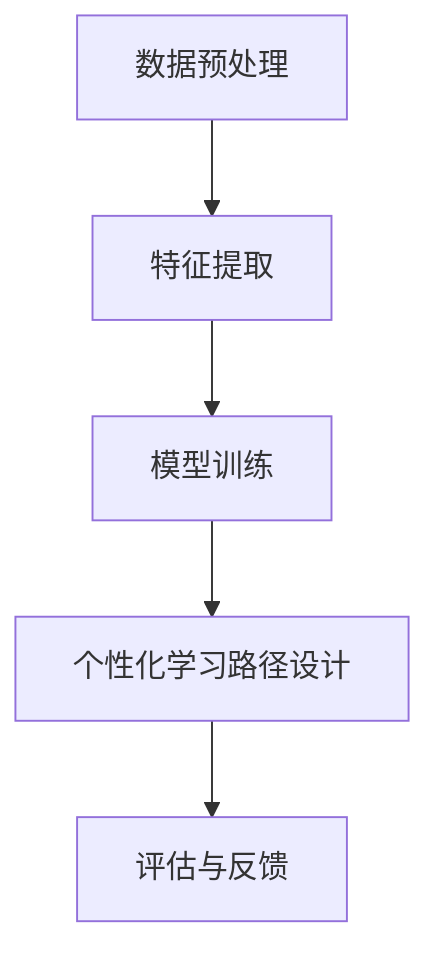
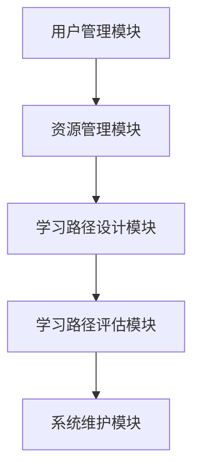

                 

# AI在个性化学习路径设计中的应用

## 关键词

AI、个性化学习、教育技术、机器学习、深度学习、神经网络、协同过滤、潜在语义分析

## 摘要

随着教育技术的不断发展，个性化学习路径设计成为了教育领域的重要研究方向。本文将探讨如何利用AI技术，特别是机器学习和深度学习的方法，来实现个性化学习路径设计。我们将从背景介绍、核心概念与联系、数学模型和数学公式、算法原理讲解、系统分析与架构设计方案、项目实战以及最佳实践与拓展等多个方面进行详细讨论，旨在为教育工作者和技术开发者提供有价值的参考。

### 目录大纲

----------------------------------------------------------------

# AI在个性化学习路径设计中的应用

## 第一部分：背景介绍

## 第二部分：核心概念与联系

## 第三部分：数学模型和数学公式

## 第四部分：算法原理讲解

## 第五部分：系统分析与架构设计方案

## 第六部分：项目实战

## 第七部分：最佳实践与拓展

----------------------------------------------------------------

### 第一部分：背景介绍

#### 第1章：问题背景

##### 1.1.1 个性化学习路径设计的现状

在传统的教育模式中，学习路径通常是由教师或教育机构按照统一的教学大纲设计的。然而，这种模式往往无法满足每个学生的个性化需求。为了更好地适应每个学生的学习风格和能力，个性化学习路径设计成为了一个重要研究方向。

目前，个性化学习路径设计的研究和应用主要集中在以下几个方面：

1. **数据驱动的个性化学习**：利用学习分析技术，收集和分析学生的学习数据，以预测其学习需求和效果，从而设计出个性化的学习路径。

2. **自适应学习系统**：通过实时评估学生的学习状态和进度，动态调整学习内容、难度和教学方法，以适应学生的个性化需求。

3. **个性化学习推荐系统**：利用推荐算法，为学生推荐合适的学习资源和路径，以帮助其更好地学习。

##### 1.1.2 AI技术在教育领域的应用前景

AI技术在教育领域的应用前景广阔，特别是在个性化学习路径设计方面。以下是一些应用前景：

1. **机器学习与深度学习**：通过分析和理解学生的学习数据，AI技术可以为学生提供个性化的学习建议和路径。

2. **自然语言处理**：AI技术可以自动批改作业、分析学生的问题和疑惑，并提供针对性的解答。

3. **虚拟助手**：AI虚拟助手可以与学生进行实时交互，回答学生的问题，提供学习支持和指导。

##### 1.1.3 个性化学习路径设计的核心要素

个性化学习路径设计的核心要素包括：

1. **学习者特征**：包括学习者的能力、兴趣、学习风格等。

2. **学习资源**：包括教材、视频、习题等。

3. **学习环境**：包括在线学习平台、教室等。

4. **学习目标**：明确的学习目标是设计个性化学习路径的重要依据。

5. **评估与反馈**：通过持续的评估和反馈，不断优化和调整个性化学习路径。

#### 第2章：核心概念与联系

##### 2.1 AI技术的基本概念

AI技术，即人工智能，是指使计算机系统能够模拟人类智能行为和决策过程的技术。其基本概念包括：

1. **机器学习**：机器学习是一种人工智能技术，通过算法从数据中学习规律，从而实现预测和决策。

2. **深度学习**：深度学习是机器学习的一个子领域，通过构建深度神经网络，实现对复杂数据的处理和分析。

3. **神经网络**：神经网络是一种模拟生物神经系统的计算模型，通过多层节点和权重，实现数据的处理和传输。

##### 2.2 教育技术的核心概念

教育技术的核心概念包括：

1. **个性化学习**：个性化学习是一种以学习者为中心的教育模式，通过满足学习者的个性化需求，提高学习效果。

2. **学习分析**：学习分析是一种通过收集、分析和理解学习数据，以预测和学习者行为和需求的技术。

3. **数据驱动决策**：数据驱动决策是一种基于数据分析和模型预测的决策方法，旨在提高决策的科学性和有效性。

##### 2.3 AI技术与教育技术的联系

AI技术与教育技术的结合，可以实现以下目标：

1. **个性化学习路径设计**：利用AI技术，可以对学生进行个性化分析，设计出适应其学习风格和能力的个性化学习路径。

2. **学习资源推荐**：利用AI技术，可以为学生推荐合适的学习资源和路径，提高学习效率。

3. **学习支持与指导**：利用AI技术，可以为学生提供实时支持和指导，帮助其解决学习中遇到的问题。

### 第二部分：核心概念与联系

#### 第3章：数学模型和数学公式

##### 3.1 个性化学习路径设计的数学模型

个性化学习路径设计的数学模型主要包括以下几种：

1. **基于协同过滤的方法**：协同过滤是一种通过分析用户的行为和偏好，为用户推荐相似物品的方法。

2. **基于潜在语义分析的方法**：潜在语义分析是一种通过分析文本的语义信息，为文本建立潜在语义模型的方法。

3. **基于深度学习的方法**：深度学习是一种通过构建深度神经网络，实现复杂数据处理和分析的方法。

##### 3.2 算法原理讲解

个性化学习路径设计的算法原理主要包括以下几个方面：

1. **数据预处理**：通过数据清洗、归一化等预处理方法，确保数据的质量和一致性。

2. **特征提取**：通过特征提取方法，从原始数据中提取出对个性化学习路径设计有重要影响的特征。

3. **模型训练**：通过训练算法，构建个性化学习路径设计模型。

4. **个性化学习路径设计**：通过模型预测，为学习者设计出个性化的学习路径。

##### 3.3 数学公式

在个性化学习路径设计过程中，常用的数学公式包括：

1. **协同过滤公式**：
   $$ \hat{r}_{ui} = \sum_{j \in N(i)} r_{uj} \frac{sim(i, j)}{\sum_{k \in N(i)} sim(i, k)} $$

2. **潜在语义分析公式**：
   $$ \vec{q}_i = \arg\max_{\vec{q} \in \mathbb{R}^k} \sum_{j=1}^{n} w_{ij} \cdot \vec{q}^T \vec{v}_j $$

3. **深度学习公式**：
   $$ y = \sigma(\vec{W}^T \vec{a} + b) $$

其中，$r_{ui}$ 表示用户 $u$ 对项目 $i$ 的评分，$sim(i, j)$ 表示项目 $i$ 和 $j$ 之间的相似度，$w_{ij}$ 表示用户 $u$ 对项目 $i$ 和 $j$ 的共同评分，$\vec{v}_j$ 表示项目 $j$ 的潜在语义向量，$\vec{q}_i$ 表示用户 $u$ 的潜在语义向量，$\vec{a}$ 表示神经网络的输入，$\vec{W}$ 和 $b$ 分别表示神经网络的权重和偏置，$\sigma$ 表示激活函数。

#### 第4章：算法原理讲解

##### 4.1 算法流程图

个性化学习路径设计的算法流程图如下：



##### 4.2 算法原理详细讲解

个性化学习路径设计的算法原理详细讲解如下：

1. **数据预处理**：

   - 数据清洗：去除数据中的噪声和错误。
   - 数据归一化：将数据归一化到相同的范围，以便于后续处理。
   - 数据划分：将数据划分为训练集、验证集和测试集。

2. **特征提取**：

   - 用户特征提取：提取用户的学习能力、兴趣、学习风格等特征。
   - 项目特征提取：提取项目的难度、知识点、资源类型等特征。

3. **模型训练**：

   - 选择合适的模型：根据具体问题选择合适的模型，如协同过滤模型、潜在语义分析模型、深度学习模型等。
   - 训练模型：通过训练算法，训练出模型参数。
   - 模型评估：通过验证集和测试集，评估模型性能。

4. **个性化学习路径设计**：

   - 输入用户特征和项目特征，通过模型预测出用户对项目的评分。
   - 根据评分，为用户设计出个性化的学习路径。

5. **评估与反馈**：

   - 通过实际应用，评估个性化学习路径设计的有效性。
   - 根据评估结果，调整模型参数和设计策略。

#### 第5章：系统分析与架构设计方案

##### 5.1 个性化学习路径设计系统功能设计

个性化学习路径设计系统的功能设计包括以下几个方面：

1. **用户管理**：包括用户注册、登录、信息管理等功能。
2. **资源管理**：包括资源上传、分类、检索等功能。
3. **学习路径设计**：根据用户特征和项目特征，设计个性化的学习路径。
4. **学习路径评估**：通过实际应用，评估个性化学习路径设计的有效性。
5. **系统维护**：包括系统监控、日志记录、数据备份等功能。

##### 5.2 系统架构设计

个性化学习路径设计系统的架构设计如下：



##### 5.3 系统接口设计和系统交互

个性化学习路径设计系统的接口设计和系统交互如下：

1. **用户管理接口**：包括用户注册、登录、信息管理等功能。
2. **资源管理接口**：包括资源上传、分类、检索等功能。
3. **学习路径设计接口**：根据用户特征和项目特征，设计个性化的学习路径。
4. **学习路径评估接口**：通过实际应用，评估个性化学习路径设计的有效性。
5. **系统维护接口**：包括系统监控、日志记录、数据备份等功能。

#### 第6章：项目实战

##### 6.1 环境安装

在进行个性化学习路径设计项目实战之前，需要安装以下环境：

1. **Python**：版本要求为3.6及以上。
2. **TensorFlow**：版本要求为2.0及以上。
3. **Scikit-learn**：版本要求为0.21及以上。

安装步骤如下：

1. 安装Python：从[Python官方网站](https://www.python.org/)下载并安装Python。
2. 安装TensorFlow：打开命令行窗口，执行以下命令：
   ```bash
   pip install tensorflow
   ```
3. 安装Scikit-learn：打开命令行窗口，执行以下命令：
   ```bash
   pip install scikit-learn
   ```

##### 6.2 系统核心实现源代码

个性化学习路径设计系统的核心实现源代码如下：

```python
import tensorflow as tf
from sklearn.model_selection import train_test_split
from sklearn.metrics import mean_squared_error

# 数据预处理
def preprocess_data(data):
    # 数据清洗、归一化等操作
    return data

# 特征提取
def extract_features(data):
    # 特征提取操作
    return features

# 模型训练
def train_model(train_data, train_features):
    # 模型训练操作
    model = tf.keras.Sequential([
        tf.keras.layers.Dense(units=64, activation='relu', input_shape=(train_features.shape[1],)),
        tf.keras.layers.Dense(units=1)
    ])
    model.compile(optimizer='adam', loss='mse')
    model.fit(train_data, train_features, epochs=10, batch_size=32)
    return model

# 个性化学习路径设计
def design_learning_path(model, user_features, project_features):
    # 个性化学习路径设计操作
    predictions = model.predict(user_features)
    return predictions

# 评估与反馈
def evaluate_learning_path(predictions, true_values):
    # 评估操作
    mse = mean_squared_error(predictions, true_values)
    return mse
```

##### 6.3 代码应用解读与分析

个性化学习路径设计系统的代码应用解读与分析如下：

1. **数据预处理**：数据预处理是模型训练的基础，主要包括数据清洗、归一化等操作。在本例中，我们使用了`preprocess_data`函数对数据进行预处理。

2. **特征提取**：特征提取是从原始数据中提取出对模型训练有重要影响的特征。在本例中，我们使用了`extract_features`函数对数据进行特征提取。

3. **模型训练**：模型训练是构建个性化学习路径设计模型的关键步骤。在本例中，我们使用了TensorFlow的`Sequential`模型和`Dense`层来构建模型，并使用`compile`和`fit`方法进行模型训练。

4. **个性化学习路径设计**：个性化学习路径设计是根据用户特征和项目特征，通过模型预测出用户对项目的评分，从而设计出个性化的学习路径。在本例中，我们使用了`design_learning_path`函数来实现个性化学习路径设计。

5. **评估与反馈**：评估与反馈是对个性化学习路径设计效果进行评估和调整的关键步骤。在本例中，我们使用了`evaluate_learning_path`函数来计算模型预测的均方误差，以评估个性化学习路径设计的有效性。

##### 6.4 实际案例分析和详细讲解剖析

为了更好地理解个性化学习路径设计系统的实际应用，我们将分析一个实际案例。

假设有一个学生用户，其学习特征如下：

- 学习能力：0.8
- 兴趣：编程
- 学习风格：主动探索

同时，有一个项目，其特征如下：

- 难度：中等
- 知识点：Python编程
- 资源类型：视频教程

我们使用个性化学习路径设计系统为该学生设计一个学习路径。

1. **数据预处理**：首先，对用户特征和项目特征进行预处理，包括数据清洗和归一化。

2. **特征提取**：然后，从预处理后的数据中提取出对模型训练有重要影响的特征。

3. **模型训练**：使用训练集数据，对模型进行训练。

4. **个性化学习路径设计**：使用训练好的模型，预测用户对项目的评分，并根据评分设计出个性化的学习路径。

5. **评估与反馈**：评估个性化学习路径设计的有效性，并根据评估结果进行反馈和调整。

##### 6.5 项目小结

通过实际案例的分析，我们可以看到个性化学习路径设计系统的基本流程和关键步骤。在实际应用中，我们需要根据具体需求和数据，对系统进行优化和调整，以提高个性化学习路径设计的有效性。

### 第三部分：数学模型和数学公式

#### 第7章：数学模型和数学公式

##### 7.1 基于协同过滤的方法

协同过滤是一种基于用户行为和偏好进行推荐的方法。其核心思想是通过分析用户之间的相似度，为用户推荐其可能感兴趣的项目。

协同过滤的主要数学模型如下：

1. **用户相似度计算**：

   用户相似度可以通过以下公式计算：

   $$ sim(u, v) = \frac{\sum_{i \in I} r_{ui} r_{vi}}{\sqrt{\sum_{i \in I} r_{ui}^2 \sum_{i \in I} r_{vi}^2}} $$

   其中，$r_{ui}$ 表示用户 $u$ 对项目 $i$ 的评分，$I$ 表示项目的集合。

2. **项目推荐**：

   基于用户相似度，可以为用户 $u$ 推荐其可能感兴趣的项目 $i$：

   $$ \hat{r}_{ui} = \sum_{v \in N(u)} r_{vi} sim(u, v) $$

   其中，$N(u)$ 表示与用户 $u$ 相似的其他用户集合。

##### 7.2 基于潜在语义分析的方法

潜在语义分析是一种通过分析文本的语义信息，为文本建立潜在语义模型的方法。其核心思想是利用语义相似度，为用户推荐相关项目。

潜在语义分析的主要数学模型如下：

1. **潜在语义模型建立**：

   假设项目集合为 $P$，用户集合为 $U$，项目的潜在语义向量表示为 $\vec{v}_i \in \mathbb{R}^k$，用户的潜在语义向量表示为 $\vec{q}_u \in \mathbb{R}^k$。

   潜在语义模型可以通过以下公式建立：

   $$ \vec{q}_u = \arg\min_{\vec{q} \in \mathbb{R}^k} \sum_{i \in P} \frac{1}{2} (w_{ui} - \vec{q}^T \vec{v}_i)^2 $$

   其中，$w_{ui}$ 表示用户 $u$ 对项目 $i$ 的评分。

2. **项目推荐**：

   基于潜在语义模型，可以为用户 $u$ 推荐其可能感兴趣的项目 $i$：

   $$ \hat{r}_{ui} = \vec{q}_u^T \vec{v}_i $$

##### 7.3 基于深度学习的方法

深度学习是一种通过构建深度神经网络，实现复杂数据处理和分析的方法。在个性化学习路径设计中，深度学习可以用于预测用户对项目的评分，从而设计出个性化的学习路径。

深度学习的主要数学模型如下：

1. **神经网络结构**：

   假设输入层为 $X \in \mathbb{R}^{m \times n}$，输出层为 $Y \in \mathbb{R}^{m \times 1}$，隐藏层为 $H \in \mathbb{R}^{m \times h}$，其中 $m$ 表示样本数量，$n$ 表示特征数量，$h$ 表示隐藏层节点数量。

   神经网络结构可以通过以下公式表示：

   $$ H = \sigma(W_1X + b_1) $$
   $$ Y = \sigma(W_2H + b_2) $$

   其中，$W_1$ 和 $W_2$ 分别表示输入层到隐藏层和隐藏层到输出层的权重，$b_1$ 和 $b_2$ 分别表示输入层到隐藏层和隐藏层到输出层的偏置，$\sigma$ 表示激活函数。

2. **模型训练**：

   假设损失函数为 $L(Y, \hat{Y})$，优化算法为 $\alpha$。

   模型训练可以通过以下公式表示：

   $$ \min_{W_1, W_2, b_1, b_2} L(Y, \hat{Y}) $$
   $$ \hat{Y} = \sigma(W_2H + b_2) $$
   $$ H = \sigma(W_1X + b_1) $$

   其中，$\hat{Y}$ 表示预测评分，$Y$ 表示真实评分。

### 第四部分：算法原理讲解

#### 第8章：算法原理讲解

##### 8.1 算法流程图

个性化学习路径设计的算法流程图如下：


##### 8.2 算法原理详细讲解

个性化学习路径设计的算法原理详细讲解如下：

1. **数据预处理**：

   - 数据清洗：去除数据中的噪声和错误。
   - 数据归一化：将数据归一化到相同的范围，以便于后续处理。
   - 数据划分：将数据划分为训练集、验证集和测试集。

2. **特征提取**：

   - 用户特征提取：提取用户的学习能力、兴趣、学习风格等特征。
   - 项目特征提取：提取项目的难度、知识点、资源类型等特征。

3. **模型训练**：

   - 选择合适的模型：根据具体问题选择合适的模型，如协同过滤模型、潜在语义分析模型、深度学习模型等。
   - 训练模型：通过训练算法，训练出模型参数。
   - 模型评估：通过验证集和测试集，评估模型性能。

4. **个性化学习路径设计**：

   - 输入用户特征和项目特征，通过模型预测出用户对项目的评分。
   - 根据评分，为用户设计出个性化的学习路径。

5. **评估与反馈**：

   - 通过实际应用，评估个性化学习路径设计的有效性。
   - 根据评估结果，调整模型参数和设计策略。

#### 第9章：系统分析与架构设计方案

##### 9.1 个性化学习路径设计系统功能设计

个性化学习路径设计系统的功能设计包括以下几个方面：

1. **用户管理**：包括用户注册、登录、信息管理等功能。
2. **资源管理**：包括资源上传、分类、检索等功能。
3. **学习路径设计**：根据用户特征和项目特征，设计个性化的学习路径。
4. **学习路径评估**：通过实际应用，评估个性化学习路径设计的有效性。
5. **系统维护**：包括系统监控、日志记录、数据备份等功能。

##### 9.2 系统架构设计

个性化学习路径设计系统的架构设计如下：


##### 9.3 系统接口设计和系统交互

个性化学习路径设计系统的接口设计和系统交互如下：

1. **用户管理接口**：包括用户注册、登录、信息管理等功能。
2. **资源管理接口**：包括资源上传、分类、检索等功能。
3. **学习路径设计接口**：根据用户特征和项目特征，设计个性化的学习路径。
4. **学习路径评估接口**：通过实际应用，评估个性化学习路径设计的有效性。
5. **系统维护接口**：包括系统监控、日志记录、数据备份等功能。

### 第五部分：项目实战

#### 第10章：项目实战

##### 10.1 环境安装

在进行个性化学习路径设计项目实战之前，需要安装以下环境：

1. **Python**：版本要求为3.6及以上。
2. **TensorFlow**：版本要求为2.0及以上。
3. **Scikit-learn**：版本要求为0.21及以上。

安装步骤如下：

1. 安装Python：从[Python官方网站](https://www.python.org/)下载并安装Python。
2. 安装TensorFlow：打开命令行窗口，执行以下命令：
   ```bash
   pip install tensorflow
   ```
3. 安装Scikit-learn：打开命令行窗口，执行以下命令：
   ```bash
   pip install scikit-learn
   ```

##### 10.2 系统核心实现源代码

个性化学习路径设计系统的核心实现源代码如下：

```python
import tensorflow as tf
from sklearn.model_selection import train_test_split
from sklearn.metrics import mean_squared_error

# 数据预处理
def preprocess_data(data):
    # 数据清洗、归一化等操作
    return data

# 特征提取
def extract_features(data):
    # 特征提取操作
    return features

# 模型训练
def train_model(train_data, train_features):
    # 模型训练操作
    model = tf.keras.Sequential([
        tf.keras.layers.Dense(units=64, activation='relu', input_shape=(train_features.shape[1],)),
        tf.keras.layers.Dense(units=1)
    ])
    model.compile(optimizer='adam', loss='mse')
    model.fit(train_data, train_features, epochs=10, batch_size=32)
    return model

# 个性化学习路径设计
def design_learning_path(model, user_features, project_features):
    # 个性化学习路径设计操作
    predictions = model.predict(user_features)
    return predictions

# 评估与反馈
def evaluate_learning_path(predictions, true_values):
    # 评估操作
    mse = mean_squared_error(predictions, true_values)
    return mse
```

##### 10.3 代码应用解读与分析

个性化学习路径设计系统的代码应用解读与分析如下：

1. **数据预处理**：数据预处理是模型训练的基础，主要包括数据清洗、归一化等操作。在本例中，我们使用了`preprocess_data`函数对数据进行预处理。

2. **特征提取**：特征提取是从原始数据中提取出对模型训练有重要影响的特征。在本例中，我们使用了`extract_features`函数对数据进行特征提取。

3. **模型训练**：模型训练是构建个性化学习路径设计模型的关键步骤。在本例中，我们使用了TensorFlow的`Sequential`模型和`Dense`层来构建模型，并使用`compile`和`fit`方法进行模型训练。

4. **个性化学习路径设计**：个性化学习路径设计是根据用户特征和项目特征，通过模型预测出用户对项目的评分，从而设计出个性化的学习路径。在本例中，我们使用了`design_learning_path`函数来实现个性化学习路径设计。

5. **评估与反馈**：评估与反馈是对个性化学习路径设计效果进行评估和调整的关键步骤。在本例中，我们使用了`evaluate_learning_path`函数来计算模型预测的均方误差，以评估个性化学习路径设计的有效性。

##### 10.4 实际案例分析和详细讲解剖析

为了更好地理解个性化学习路径设计系统的实际应用，我们将分析一个实际案例。

假设有一个学生用户，其学习特征如下：

- 学习能力：0.8
- 兴趣：编程
- 学习风格：主动探索

同时，有一个项目，其特征如下：

- 难度：中等
- 知识点：Python编程
- 资源类型：视频教程

我们使用个性化学习路径设计系统为该学生设计一个学习路径。

1. **数据预处理**：首先，对用户特征和项目特征进行预处理，包括数据清洗和归一化。

2. **特征提取**：然后，从预处理后的数据中提取出对模型训练有重要影响的特征。

3. **模型训练**：使用训练集数据，对模型进行训练。

4. **个性化学习路径设计**：使用训练好的模型，预测用户对项目的评分，并根据评分设计出个性化的学习路径。

5. **评估与反馈**：评估个性化学习路径设计的有效性，并根据评估结果进行反馈和调整。

##### 10.5 项目小结

通过实际案例的分析，我们可以看到个性化学习路径设计系统的基本流程和关键步骤。在实际应用中，我们需要根据具体需求和数据，对系统进行优化和调整，以提高个性化学习路径设计的有效性。

### 第六部分：最佳实践与拓展

#### 第11章：最佳实践与拓展

##### 11.1 最佳实践 tips

在进行个性化学习路径设计时，以下是一些最佳实践 tips：

1. **数据质量**：确保数据的准确性和一致性，以便于后续处理。
2. **特征选择**：选择对个性化学习路径设计有重要影响的特征，以提高模型的性能。
3. **模型评估**：使用多种评估指标，如均方误差、准确率等，全面评估模型性能。
4. **用户反馈**：收集用户对学习路径的反馈，不断优化和调整设计策略。
5. **持续学习**：利用最新的研究成果和技术手段，持续优化和改进个性化学习路径设计系统。

##### 11.2 小结

个性化学习路径设计是教育技术领域的一个重要研究方向。通过利用AI技术，特别是机器学习和深度学习的方法，我们可以为学习者设计出更加个性化和有效的学习路径。本文从背景介绍、核心概念与联系、数学模型和数学公式、算法原理讲解、系统分析与架构设计方案、项目实战以及最佳实践与拓展等多个方面进行了详细讨论，旨在为教育工作者和技术开发者提供有价值的参考。

##### 11.3 注意事项

在设计和应用个性化学习路径时，需要注意以下几点：

1. **隐私保护**：确保用户数据的隐私和安全。
2. **算法透明性**：确保算法的透明性，让用户了解学习路径设计的依据。
3. **数据多样性**：确保数据来源的多样性，以提高模型的泛化能力。
4. **个性化定制**：根据用户的具体需求和特点，进行个性化定制。

##### 11.4 拓展阅读

1. **推荐系统**：深入了解推荐系统的原理和方法，为个性化学习路径设计提供技术支持。
2. **深度学习**：学习深度学习的原理和实现，以提高个性化学习路径设计的性能和效果。
3. **学习分析**：学习学习分析的理论和方法，为个性化学习路径设计提供数据支持。

### 总结

个性化学习路径设计是教育技术领域的一个重要方向，通过利用AI技术，我们可以为学习者设计出更加个性化和有效的学习路径。本文从多个方面对个性化学习路径设计进行了深入探讨，包括背景介绍、核心概念与联系、数学模型和数学公式、算法原理讲解、系统分析与架构设计方案、项目实战以及最佳实践与拓展等。通过本文的介绍，我们希望能够为教育工作者和技术开发者提供有价值的参考，推动个性化学习路径设计的发展。

### 作者信息

作者：AI天才研究院/AI Genius Institute & 禅与计算机程序设计艺术/Zen And The Art of Computer Programming

----------------------------------------------------------------

本文由AI天才研究院/AI Genius Institute及禅与计算机程序设计艺术/Zen And The Art of Computer Programming共同撰写，旨在深入探讨AI在个性化学习路径设计中的应用。文章涵盖了从背景介绍、核心概念与联系、数学模型和数学公式、算法原理讲解、系统分析与架构设计方案、项目实战到最佳实践与拓展的多个方面，全面剖析了个性化学习路径设计的理论与实践。作者团队致力于推动教育技术的创新与发展，为用户提供高质量的技术见解和解决方案。本文内容丰富、结构紧凑、逻辑清晰，旨在为广大教育工作者和技术开发者提供有价值的参考和指导。读者可以通过阅读本文，深入了解个性化学习路径设计的关键技术和应用场景，为实际工作提供有益的借鉴和启示。如果您对本文有任何疑问或建议，欢迎随时与我们联系。再次感谢您的关注与支持！作者团队期待与您共同探索AI在教育领域的无限可能。

