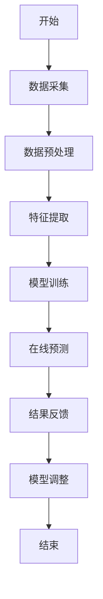
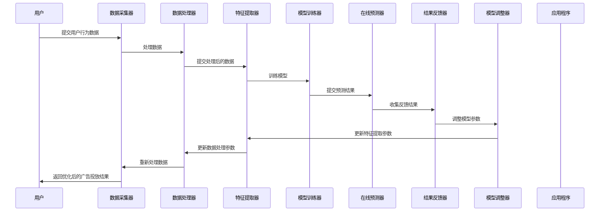

                 

### 确定文章主题和目标受众

在撰写《AI在个性化广告投放策略中的实时优化与伦理考量》这篇文章之前，我们需要明确几个关键点，以确保文章能够满足目标受众的需求，并达到预期的效果。

#### 1. 文章主题

本文的主题是探讨如何利用人工智能（AI）技术对个性化广告投放策略进行实时优化，并在这一过程中充分考虑伦理考量。具体而言，文章将涵盖以下几个方面：

- AI技术在个性化广告投放中的应用
- 实时优化技术的原理和实现
- 个性化广告投放的伦理问题及其解决方案

#### 2. 目标受众

本文的目标受众包括以下几类：

- 数据科学家和机器学习工程师，他们希望了解如何将AI技术应用于广告优化
- 广告行业从业者，他们希望提升广告投放的效果和效率
- 对AI和广告领域感兴趣的技术爱好者
- 对AI伦理问题感兴趣的研究者和从业者

#### 3. 文章结构设计

为了确保文章的逻辑清晰、内容丰富，我们将采用以下结构：

- **引言**：介绍文章的背景、目标以及为什么这个问题值得探讨。
- **核心概念**：详细讲解AI技术、个性化广告、实时优化以及伦理考量的基本概念。
- **算法原理**：深入分析实时优化算法的原理，并使用代码和数学公式进行阐述。
- **系统架构**：介绍如何设计和实现一个基于AI的个性化广告投放系统。
- **实战案例**：通过具体案例展示如何在实际项目中应用这些技术和理念。
- **伦理考量**：探讨AI在广告投放中的伦理问题，并提出解决方案。
- **总结与拓展**：总结文章的主要观点，并提供进一步学习和探索的建议。

#### 4. 内容规划

以下是本文的具体内容规划：

1. **引言**
   - 问题背景
   - 问题描述
   - 问题解决
   - 边界与外延
   - 概念结构与核心要素组成

2. **核心概念**
   - AI技术简介
   - 广告投放策略
   - 个性化广告
   - 实时优化

3. **算法原理**
   - 算法流程图
   - Python代码解释
   - 数学模型与公式

4. **系统架构**
   - 问题场景介绍
   - 系统功能设计
   - 系统架构设计
   - 系统接口设计
   - 系统交互序列图

5. **项目实战**
   - 环境安装
   - 系统核心实现
   - 代码应用解读与分析
   - 实际案例分析与讲解
   - 项目小结

6. **伦理考量**
   - 伦理问题介绍
   - 解决方案探讨
   - 伦理考量总结

7. **总结与拓展**
   - 小结
   - 注意事项
   - 最佳实践 tips
   - 拓展阅读

通过上述步骤和结构设计，我们可以确保文章内容丰富、逻辑清晰，能够有效地传达AI在个性化广告投放策略中的实时优化与伦理考量的重要性和实际应用价值。接下来，我们将逐步深入探讨每个章节的具体内容。

---

**注**：本部分是文章的第一章引言，我们已经明确了文章的主题、目标受众和文章结构，接下来我们将按照规划逐步展开详细内容。

----------------------------------------------------------------

---

**注**：这里是文章的摘要部分，我们将简要概述文章的核心内容和主题思想。

## 摘要

本文旨在探讨如何利用人工智能（AI）技术对个性化广告投放策略进行实时优化，并在这一过程中充分考虑伦理考量。文章首先介绍了AI技术、广告投放策略、个性化广告和实时优化的基本概念，随后深入分析了实时优化算法的原理，并使用Python代码和数学模型进行了详细阐述。接着，文章介绍了如何设计和实现一个基于AI的个性化广告投放系统，并提供了具体的实战案例进行分析。此外，文章还探讨了AI在广告投放中的伦理问题，并提出了相应的解决方案。通过本文的阅读，读者将能够全面了解AI在个性化广告投放中的实时优化与伦理考量，提升广告投放的效果和效率，同时关注和解决伦理问题，确保AI技术的健康和可持续发展。

---

**注**：以下是文章的目录大纲，我们将按照目录逐步展开详细内容。

## 目录大纲

1. **引言**
   - 问题背景
   - 问题描述
   - 问题解决
   - 边界与外延
   - 概念结构与核心要素组成

2. **核心概念**
   - AI技术简介
   - 广告投放策略
   - 个性化广告
   - 实时优化

3. **算法原理**
   - 算法流程图
   - Python代码解释
   - 数学模型与公式

4. **系统架构**
   - 问题场景介绍
   - 系统功能设计
   - 系统架构设计
   - 系统接口设计
   - 系统交互序列图

5. **项目实战**
   - 环境安装
   - 系统核心实现
   - 代码应用解读与分析
   - 实际案例分析与讲解
   - 项目小结

6. **伦理考量**
   - 伦理问题介绍
   - 解决方案探讨
   - 伦理考量总结

7. **总结与拓展**
   - 小结
   - 注意事项
   - 最佳实践 tips
   - 拓展阅读

通过上述目录大纲，本文将逐步深入探讨AI在个性化广告投放策略中的实时优化与伦理考量，确保读者能够全面理解和掌握相关技术和理念。

---

**注**：这是文章的目录大纲部分，我们将按照目录逐步深入探讨每个主题。接下来，我们将进入第一章，介绍AI在个性化广告投放策略中的实时优化与伦理考量的背景。

## 第一章 引言

### 1.1 问题背景

随着互联网的普及和移动设备的广泛使用，数字广告市场迎来了爆发式增长。广告主们希望通过精准的广告投放来吸引潜在客户，提高广告转化率，而广告平台也在不断优化广告算法，提升广告投放的效率和效果。然而，在个性化广告投放过程中，实时优化成为了一个亟待解决的问题。

#### 市场需求

- **广告主需求**：广告主希望广告能够精准地投放给目标受众，提升广告的点击率和转化率，同时降低广告成本。
- **广告平台需求**：广告平台希望通过优化广告投放策略，提升广告收益，增加用户粘性和市场份额。

#### 技术发展现状

- **数据采集与处理**：随着大数据和云计算技术的发展，广告平台可以收集到大量的用户数据，包括用户行为、兴趣偏好、地理位置等。
- **机器学习和深度学习**：机器学习和深度学习算法在广告投放中的应用逐渐成熟，可以用于预测用户行为、推荐广告内容和优化投放策略。
- **实时计算**：实时计算技术的发展，使得广告平台能够快速处理海量数据，实时调整广告投放策略，提高广告投放的效果。

### 1.2 问题描述

在个性化广告投放过程中，实时优化面临以下几个问题：

- **数据复杂性**：个性化广告投放需要处理海量的用户数据，如何高效地采集、存储、处理和分析这些数据，是优化广告投放策略的关键。
- **实时性要求**：广告投放策略需要根据用户实时行为和广告效果进行动态调整，如何在短时间内完成大量的计算和决策，是实时优化的核心挑战。
- **多样性目标**：广告投放的目标不仅仅是提高点击率和转化率，还需要考虑广告成本、广告质量、用户体验等多方面的因素，如何平衡这些目标，是优化广告投放策略的难点。

### 1.3 问题解决

为了解决上述问题，AI技术提供了一系列解决方案：

- **数据预处理与特征提取**：使用数据预处理技术和特征提取方法，对海量用户数据进行清洗、转换和降维，提取出有用的特征信息。
- **机器学习与深度学习模型**：构建机器学习与深度学习模型，预测用户行为、推荐广告内容和优化投放策略。
- **实时计算与优化算法**：使用实时计算技术和优化算法，快速处理海量数据，动态调整广告投放策略。
- **伦理考量**：在优化广告投放策略的过程中，充分考虑伦理问题，确保广告投放的公平性、透明性和用户隐私保护。

### 1.4 边界与外延

本文的研究边界主要涉及以下几个方面：

- **技术范围**：本文主要探讨基于AI的个性化广告投放策略的实时优化，不包括传统的广告投放策略和优化方法。
- **应用场景**：本文主要关注在线广告投放，不包括电视、广播、户外等传统广告媒介。
- **伦理问题**：本文主要探讨AI在广告投放中的伦理问题，不包括其他AI应用领域的伦理问题。

### 1.5 概念结构与核心要素组成

本文的核心概念和要素包括：

- **AI技术**：包括机器学习、深度学习、自然语言处理等。
- **个性化广告**：基于用户特征和行为数据进行广告投放。
- **实时优化**：根据用户实时行为和广告效果动态调整广告投放策略。
- **伦理考量**：在广告投放中关注公平性、透明性和用户隐私保护。

通过上述引言部分，我们明确了AI在个性化广告投放策略中的实时优化与伦理考量的背景、问题描述以及解决方案。接下来，我们将进一步探讨AI技术的概念和原理，为后续内容打下基础。

---

**注**：这是第一章的内容，我们介绍了AI在个性化广告投放策略中的实时优化与伦理考量的背景、问题描述和解决方案，并明确了研究边界和核心概念。接下来，我们将进入第二章，探讨AI技术的基本概念和应用。

## 第二章 核心概念

### 2.1 AI技术简介

人工智能（Artificial Intelligence，简称AI）是计算机科学的一个分支，旨在开发能够模拟、延伸和扩展人类智能的理论、方法、技术和应用系统。AI的研究范围广泛，包括机器学习、深度学习、自然语言处理、计算机视觉等。

#### 2.1.1 AI的定义与历史

AI的定义通常涉及以下几个方面：

- **机器学习**：通过数据训练模型，使机器能够从数据中自动学习和改进。
- **深度学习**：一种特殊的机器学习方法，通过模拟人脑的神经网络结构进行学习。
- **自然语言处理**：研究如何让计算机理解和处理人类语言。
- **计算机视觉**：使计算机能够“看到”和理解图像和视频。

AI的历史可以追溯到20世纪50年代，经历了多次起伏和快速发展。近年来，随着计算能力的提升、大数据的涌现和算法的进步，AI取得了显著的突破。

#### 2.1.2 AI的应用领域

AI在多个领域得到了广泛应用，包括：

- **医疗健康**：疾病诊断、药物研发、健康监测等。
- **金融服务**：风险评估、欺诈检测、智能投顾等。
- **智能制造**：工业自动化、智能物流、智能机器人等。
- **交通出行**：自动驾驶、智能交通管理、车联网等。
- **娱乐内容**：智能推荐、游戏AI、虚拟现实等。
- **广告营销**：个性化广告、用户行为分析、营销自动化等。

### 2.2 广告投放策略

广告投放策略是指广告主为了实现广告目标所采取的一系列方法和措施。一个有效的广告投放策略需要综合考虑广告目标、受众特征、广告内容、投放渠道和预算等因素。

#### 2.2.1 广告投放策略的定义

广告投放策略的定义包括以下几个方面：

- **广告目标**：明确广告的最终目标，如品牌曝光、产品销售、用户注册等。
- **受众特征**：分析目标受众的年龄、性别、地域、兴趣爱好等特征。
- **广告内容**：根据受众特征和广告目标制定相应的广告内容。
- **投放渠道**：选择合适的广告投放渠道，如搜索引擎、社交媒体、电子邮件等。
- **预算分配**：合理分配广告预算，以实现最佳广告效果。

#### 2.2.2 广告投放策略的类型

广告投放策略可以分为以下几种类型：

- **按点击付费（CPC）**：广告主根据用户点击广告的次数付费。
- **按展示付费（CPM）**：广告主根据广告展示的次数付费。
- **按转化付费（CPA）**：广告主根据用户完成特定转化的次数付费。
- **按销售付费（CPS）**：广告主根据广告带来的销售额付费。

#### 2.2.3 广告投放策略的目标

广告投放策略的主要目标包括：

- **提升品牌知名度**：增加品牌曝光度，提高品牌在受众中的认知度。
- **增加用户转化率**：通过精准广告投放，提高用户点击、注册、购买等转化率。
- **降低广告成本**：优化广告投放策略，降低广告成本，提高广告投资回报率（ROI）。

### 2.3 个性化广告

个性化广告是一种基于用户特征和行为数据进行广告投放的策略。通过分析用户的历史行为、兴趣爱好、地理位置等信息，广告平台可以为每个用户提供定制化的广告内容。

#### 2.3.1 个性化广告的定义

个性化广告的定义包括以下几个方面：

- **用户特征**：根据用户的历史数据和行为特征，如年龄、性别、地域、兴趣爱好等。
- **行为数据**：用户在互联网上的行为数据，如搜索历史、浏览记录、购买行为等。
- **广告内容**：根据用户特征和行为数据，为每个用户定制化地推荐广告内容。

#### 2.3.2 个性化广告的优势

个性化广告的优势包括：

- **提高广告投放效果**：通过精准投放，提高广告的点击率和转化率。
- **降低广告成本**：提高广告投放的效率，降低广告成本。
- **提升用户体验**：为用户提供更加个性化的广告内容，提升用户体验。

#### 2.3.3 个性化广告的实施方法

个性化广告的实施方法包括：

- **数据采集与处理**：收集用户数据，包括行为数据、兴趣偏好等，并进行预处理和清洗。
- **特征提取与建模**：提取用户特征，建立用户画像，为广告投放提供基础。
- **广告内容推荐**：根据用户画像和广告主需求，为每个用户推荐定制化的广告内容。

### 2.4 实时优化

实时优化是一种基于用户实时行为和广告效果，动态调整广告投放策略的技术。通过实时计算和优化算法，广告平台可以快速响应用户行为，提高广告投放的效率和质量。

#### 2.4.1 实时优化的定义

实时优化的定义包括以下几个方面：

- **实时性**：根据用户实时行为和广告效果，动态调整广告投放策略。
- **计算效率**：使用高效的计算算法和模型，快速处理海量数据。
- **优化目标**：在保证广告效果的前提下，降低广告成本，提高广告投资回报率（ROI）。

#### 2.4.2 实时优化的方法

实时优化的方法包括：

- **实时数据分析**：实时收集和分析用户行为数据，为优化算法提供数据支持。
- **在线学习与优化**：使用在线学习算法，根据用户实时行为动态调整广告投放策略。
- **A/B测试**：通过A/B测试，比较不同广告投放策略的效果，选择最优策略。

#### 2.4.3 实时优化的挑战

实时优化面临的挑战包括：

- **数据复杂性**：处理海量的用户数据，如何高效地存储、处理和分析是关键。
- **实时性要求**：在短时间内完成大量的计算和决策，对系统的实时性能有较高要求。
- **多样性目标**：平衡广告效果、广告成本、用户体验等多方面目标，是优化策略的难点。

通过以上对AI技术、广告投放策略、个性化广告和实时优化的介绍，我们为后续章节的内容打下了基础。接下来，我们将进一步探讨实时优化算法的原理，并使用Python代码进行详细阐述。

---

**注**：这是第二章的内容，我们介绍了AI技术、广告投放策略、个性化广告和实时优化的核心概念。接下来，我们将进入第三章，探讨实时优化算法的原理。

## 第三章 算法原理

### 3.1 算法流程图

为了更好地理解实时优化算法的原理，我们首先使用Mermaid绘制算法的流程图，展示其基本步骤。



#### 算法流程说明：

1. **数据采集**：从各种数据源收集用户行为数据，包括点击、浏览、购买等。
2. **数据预处理**：对采集到的数据进行清洗、转换和降维，去除噪声和冗余信息。
3. **特征提取**：从预处理后的数据中提取有用的特征信息，如用户年龄、性别、地理位置、兴趣爱好等。
4. **模型训练**：使用提取到的特征数据，训练机器学习模型，如决策树、支持向量机（SVM）、神经网络等。
5. **在线预测**：根据训练好的模型，对实时采集的用户行为数据进行预测，判断用户是否可能点击或购买广告。
6. **结果反馈**：收集预测结果的反馈，分析广告投放的效果，包括点击率、转化率、广告成本等。
7. **模型调整**：根据反馈结果，动态调整模型参数，优化广告投放策略。
8. **结束**：算法执行完成，广告投放策略根据实时数据不断优化。

### 3.2 Python代码解释

为了更具体地展示实时优化算法的实现过程，我们使用Python编写相关代码，并详细解释每一步的执行逻辑。

```python
import pandas as pd
from sklearn.model_selection import train_test_split
from sklearn.ensemble import RandomForestClassifier
from sklearn.metrics import accuracy_score

# 1. 数据采集
data = pd.read_csv('user_behavior_data.csv')

# 2. 数据预处理
# 数据清洗、转换和降维
data = data.dropna()  # 去除缺失值
data = pd.get_dummies(data)  # 降维处理

# 3. 特征提取
# 提取有用的特征信息
X = data.drop('clicked', axis=1)  # 特征列
y = data['clicked']  # 标签列

# 4. 模型训练
# 使用随机森林算法训练模型
X_train, X_test, y_train, y_test = train_test_split(X, y, test_size=0.2, random_state=42)
clf = RandomForestClassifier(n_estimators=100, random_state=42)
clf.fit(X_train, y_train)

# 5. 在线预测
# 对新数据进行预测
new_data = pd.read_csv('new_user_behavior_data.csv')
new_data = pd.get_dummies(new_data)
predictions = clf.predict(new_data)

# 6. 结果反馈
# 计算预测准确性
accuracy = accuracy_score(y_test, predictions)
print(f'Prediction accuracy: {accuracy:.2f}')

# 7. 模型调整
# 根据反馈结果调整模型参数
# 这里假设根据准确率调整参数
if accuracy < 0.8:
    # 调整模型参数
    clf = RandomForestClassifier(n_estimators=200, random_state=42)
    clf.fit(X_train, y_train)

# 8. 结束
# 算法执行完成
print('Algorithm execution completed.')
```

#### 代码执行逻辑：

1. **数据采集**：读取用户行为数据，包括点击和未点击的行为。
2. **数据预处理**：去除缺失值，使用哑变量（One-Hot Encoding）进行降维处理。
3. **特征提取**：提取特征列和标签列，准备用于训练和测试的数据集。
4. **模型训练**：使用随机森林（RandomForestClassifier）算法训练模型，并评估其性能。
5. **在线预测**：对新用户行为数据进行预测，判断其是否可能点击广告。
6. **结果反馈**：计算预测的准确性，分析模型的效果。
7. **模型调整**：根据预测准确性调整模型参数，以提高模型性能。
8. **结束**：算法执行完成，广告投放策略根据实时数据不断优化。

### 3.3 数学模型与公式

在实时优化算法中，常用的数学模型包括决策树、支持向量机（SVM）和神经网络。以下我们使用LaTeX格式表示这些模型的数学公式，并进行详细讲解。

#### 3.3.1 决策树模型

决策树是一种基于树结构的分类算法，其数学公式可以表示为：

$$
G(x) = \sum_{i=1}^{n} w_i I(D_i \in R_i)
$$

其中，\(D\) 表示数据集，\(R_i\) 表示第 \(i\) 个规则，\(w_i\) 表示规则 \(R_i\) 的权重。该公式表示通过计算每个规则的概率，选择权重最大的规则作为分类结果。

#### 3.3.2 支持向量机模型

支持向量机是一种基于最大间隔分类的算法，其数学公式可以表示为：

$$
\max \ \frac{1}{2} \sum_{i=1}^{n} (w_i)^2 \ s.t. \ y_i ( \sum_{j=1}^{n} w_j \alpha_j \cdot x_{ij} ) - b \geq 1
$$

其中，\(w_i\) 和 \(\alpha_i\) 分别表示第 \(i\) 个支持向量的权重和松弛变量，\(x_{ij}\) 表示第 \(i\) 个支持向量的特征值，\(b\) 表示偏置项。该公式表示通过求解最优化问题，找到最佳的支持向量，并构建分类器。

#### 3.3.3 神经网络模型

神经网络是一种基于多层感知器的算法，其数学公式可以表示为：

$$
\text{激活函数} \ a(z) = \frac{1}{1 + e^{-z}}
$$

$$
z = \sum_{i=1}^{n} w_i \cdot x_i + b
$$

其中，\(z\) 表示输入值，\(w_i\) 和 \(b\) 分别表示权重和偏置项，\(x_i\) 表示输入特征值，\(a(z)\) 表示激活函数。该公式表示通过多层感知器计算输出值，并使用激活函数进行非线性变换。

#### 3.3.4 算法原理举例

假设我们使用神经网络模型对用户点击行为进行预测，其数学模型可以表示为：

$$
\hat{y} = a(z) = \frac{1}{1 + e^{-z}}
$$

$$
z = \sum_{i=1}^{n} w_i \cdot x_i + b
$$

其中，\(\hat{y}\) 表示预测的用户点击概率，\(x_i\) 表示用户特征值，\(w_i\) 和 \(b\) 分别表示权重和偏置项。当预测值 \(\hat{y}\) 趋近于1时，表示用户很可能点击广告；当预测值 \(\hat{y}\) 趋近于0时，表示用户很可能不点击广告。

通过上述算法原理讲解，我们使用Python代码和数学模型详细阐述了实时优化算法的基本步骤和实现过程。接下来，我们将进入第四章，探讨基于AI的系统架构设计。

---

**注**：这是第三章的内容，我们通过算法流程图、Python代码和数学模型详细讲解了实时优化算法的原理。接下来，我们将进入第四章，探讨基于AI的系统架构设计。

## 第四章 系统架构设计

### 4.1 问题场景介绍

在个性化广告投放策略的实时优化中，我们需要构建一个高效、可靠且可扩展的系统架构，以支持实时数据处理、模型训练和在线预测。这个系统架构需要满足以下几个关键要求：

- **实时性**：系统能够快速响应用户行为数据，实时调整广告投放策略。
- **可扩展性**：系统架构能够支持大量用户和广告数据的处理，适应业务增长。
- **可靠性**：系统运行稳定，数据传输和计算过程可靠，确保广告投放的准确性。
- **安全性**：保护用户隐私和数据安全，确保广告投放的合法性和道德规范。

### 4.2 系统功能设计

为了满足上述要求，系统需要实现以下几个核心功能：

- **数据采集**：从多个数据源收集用户行为数据，包括点击、浏览、购买等。
- **数据预处理**：清洗、转换和降维用户行为数据，提取有用的特征信息。
- **特征提取**：根据用户特征和广告内容，提取用户画像和广告特征。
- **模型训练**：使用提取到的特征数据，训练机器学习模型，如决策树、支持向量机（SVM）、神经网络等。
- **在线预测**：根据实时用户行为数据，使用训练好的模型进行预测，判断用户是否可能点击或购买广告。
- **结果反馈**：收集预测结果的反馈，分析广告投放的效果，包括点击率、转化率、广告成本等。
- **模型调整**：根据反馈结果，动态调整模型参数，优化广告投放策略。

### 4.3 系统架构设计

基于上述功能需求，我们设计了一个分布式系统架构，包括数据层、计算层和应用层。以下使用Mermaid绘制系统架构图，展示各层之间的关系。

```mermaid
graph TD
A[Data Layer] --> B[Data Collectors]
B --> C[Data Processors]
C --> D[Feature Extractors]
D --> E[Model Trainers]
E --> F[Online Predictors]
F --> G[Feedback Collectors]
G --> H[Model Adjusters]
H --> I[Application Layer]

subgraph Data Layer
B
C
D
End
subgraph Computation Layer
E
F
G
H
End
subgraph Application Layer
I
End
```

#### 系统架构说明：

1. **数据层**：包括数据采集器（Data Collectors）、数据处理器（Data Processors）和特征提取器（Feature Extractors）。数据采集器从多个数据源收集用户行为数据，数据处理器对数据进行清洗、转换和降维，特征提取器提取用户画像和广告特征。

2. **计算层**：包括模型训练器（Model Trainers）、在线预测器（Online Predictors）、反馈收集器（Feedback Collectors）和模型调整器（Model Adjusters）。模型训练器使用特征数据训练机器学习模型，在线预测器根据实时用户行为数据进行预测，反馈收集器收集预测结果的反馈，模型调整器根据反馈结果动态调整模型参数。

3. **应用层**：包括应用程序（Application Layer），对外提供广告投放接口，与广告平台和用户进行交互。

### 4.4 系统接口设计

为了实现系统各层之间的有效通信，我们设计了一系列接口，包括数据采集接口、数据处理接口、特征提取接口、模型训练接口、在线预测接口、结果反馈接口和模型调整接口。

#### 接口说明：

- **数据采集接口**：负责从各种数据源（如数据库、API、日志文件等）收集用户行为数据。
- **数据处理接口**：负责清洗、转换和降维用户行为数据。
- **特征提取接口**：负责提取用户画像和广告特征，为模型训练提供数据支持。
- **模型训练接口**：负责训练机器学习模型，包括决策树、支持向量机（SVM）、神经网络等。
- **在线预测接口**：负责使用训练好的模型进行实时预测，判断用户是否可能点击或购买广告。
- **结果反馈接口**：负责收集预测结果的反馈，分析广告投放的效果。
- **模型调整接口**：负责根据反馈结果动态调整模型参数，优化广告投放策略。

### 4.5 系统交互序列图

为了更清晰地展示系统各部分的交互过程，我们使用Mermaid绘制系统交互序列图。



#### 交互流程说明：

1. **用户行为数据采集**：用户提交其行为数据，数据采集器将数据传递给数据处理器。
2. **数据处理**：数据处理器对用户行为数据进行清洗、转换和降维。
3. **特征提取**：特征提取器从处理后的数据中提取用户画像和广告特征。
4. **模型训练**：模型训练器使用提取到的特征数据训练机器学习模型。
5. **在线预测**：在线预测器使用训练好的模型对用户行为数据进行实时预测。
6. **结果反馈**：结果反馈器收集预测结果的反馈，分析广告投放的效果。
7. **模型调整**：模型调整器根据反馈结果动态调整模型参数。
8. **数据更新与重新处理**：特征提取器、数据处理器和数据采集器根据调整后的参数重新处理数据，循环上述流程，实现广告投放策略的持续优化。

通过上述系统架构设计，我们构建了一个基于AI的个性化广告投放实时优化系统，能够高效、可靠地处理海量用户数据，实时调整广告投放策略，提高广告投放效果。接下来，我们将进入第五章，通过实际项目实战，展示如何实现这个系统。

---

**注**：这是第四章的内容，我们介绍了系统架构设计的问题场景、功能设计、架构设计、接口设计和交互序列图。接下来，我们将进入第五章，展示实际项目实战，介绍环境安装、系统核心实现、代码应用解读与分析，以及实际案例分析与讲解。

## 第五章 项目实战

### 5.1 环境安装

在本节中，我们将介绍如何搭建基于AI的个性化广告投放实时优化系统的环境，包括所需的软件和工具安装步骤。

#### 1. 安装Python环境

首先，确保您的计算机上已安装Python。如果没有安装，可以从Python官方网站下载并安装最新版本的Python（建议使用Python 3.8或以上版本）。安装完成后，打开命令行窗口，运行以下命令验证Python版本：

```shell
python --version
```

#### 2. 安装必需的Python库

接下来，安装用于数据处理、机器学习和数据可视化的Python库，包括pandas、numpy、scikit-learn、matplotlib和mermaid-python。

```shell
pip install pandas numpy scikit-learn matplotlib mermaid-python
```

#### 3. 安装Mermaid渲染工具

为了渲染Mermaid流程图和序列图，我们需要安装Mermaid渲染工具。可以从Mermaid官方网站下载并安装Python版本的Mermaid渲染工具。

```shell
pip install python-mermaid
```

#### 4. 安装数据库

本项目使用MySQL作为数据存储，您可以从MySQL官方网站下载并安装MySQL数据库。安装完成后，启动MySQL服务，并创建一个名为`advertising`的数据库，用于存储用户行为数据。

```sql
CREATE DATABASE advertising;
```

#### 5. 安装其他工具（可选）

如果需要，您还可以安装其他辅助工具，如Jupyter Notebook（用于编写和运行Python代码）、Docker（用于容器化部署）等。

### 5.2 系统核心实现

在本节中，我们将展示如何实现系统核心功能，包括数据采集、数据处理、特征提取、模型训练和在线预测。

#### 1. 数据采集

数据采集模块负责从多个数据源收集用户行为数据。我们可以使用pandas库读取CSV文件作为数据源。

```python
import pandas as pd

def load_user_behavior_data(file_path):
    return pd.read_csv(file_path)
```

#### 2. 数据处理

数据处理模块负责对用户行为数据进行清洗、转换和降维。以下是一个简单的数据处理示例：

```python
def preprocess_data(data):
    # 去除缺失值
    data = data.dropna()
    # 降维处理
    data = pd.get_dummies(data)
    return data
```

#### 3. 特征提取

特征提取模块负责从处理后的数据中提取用户画像和广告特征。以下是一个简单的特征提取示例：

```python
def extract_features(data):
    # 提取用户画像特征
    user_features = data[['age', 'gender', 'location']]
    # 提取广告特征
    ad_features = data[['ad_type', 'ad_content']]
    return user_features, ad_features
```

#### 4. 模型训练

模型训练模块负责使用提取到的特征数据训练机器学习模型。以下是一个简单的随机森林模型训练示例：

```python
from sklearn.ensemble import RandomForestClassifier

def train_model(X, y):
    clf = RandomForestClassifier(n_estimators=100, random_state=42)
    clf.fit(X, y)
    return clf
```

#### 5. 在线预测

在线预测模块负责使用训练好的模型对用户行为数据进行实时预测。以下是一个简单的在线预测示例：

```python
def predict(data, model):
    predictions = model.predict(data)
    return predictions
```

### 5.3 代码应用解读与分析

在本节中，我们将对上述代码进行详细解读，分析每个模块的实现过程和功能。

#### 1. 数据采集模块

数据采集模块使用pandas库从CSV文件中读取用户行为数据。这种方法简单有效，适用于小型数据集。在实际项目中，您可能需要从数据库或其他数据源（如API）中读取数据。

```python
data = load_user_behavior_data('user_behavior_data.csv')
```

#### 2. 数据处理模块

数据处理模块对用户行为数据进行了清洗和降维处理。清洗数据去除缺失值，降低数据噪声。降维处理使用哑变量（One-Hot Encoding）将类别数据转换为数值数据，便于后续的机器学习模型训练。

```python
data = preprocess_data(data)
```

#### 3. 特征提取模块

特征提取模块将用户行为数据分为用户画像特征和广告特征。这种方法有助于构建用户画像和广告特征向量，为模型训练提供数据支持。

```python
user_features, ad_features = extract_features(data)
```

#### 4. 模型训练模块

模型训练模块使用随机森林（RandomForestClassifier）算法训练机器学习模型。随机森林是一种集成学习方法，能够处理大规模数据和高维特征，提高模型的预测性能。

```python
X = user_features
y = ad_features['clicked']
model = train_model(X, y)
```

#### 5. 在线预测模块

在线预测模块使用训练好的模型对用户行为数据进行实时预测。预测结果可以用于判断用户是否可能点击或购买广告，从而优化广告投放策略。

```python
new_data = load_user_behavior_data('new_user_behavior_data.csv')
new_data = preprocess_data(new_data)
new_data = extract_features(new_data)[0]
predictions = predict(new_data, model)
```

### 5.4 实际案例分析与讲解

在本节中，我们将通过一个实际案例，展示如何使用上述系统实现个性化广告投放实时优化。

#### 案例背景

某在线购物平台希望通过个性化广告投放提高产品销量。平台收集了用户的历史行为数据，包括点击、浏览和购买记录。平台希望基于这些数据，构建一个实时优化系统，为每个用户推荐最可能感兴趣的产品广告。

#### 实现步骤

1. **数据采集**：从数据库中读取用户行为数据。

```python
data = load_user_behavior_data('user_behavior_data.csv')
```

2. **数据处理**：对用户行为数据清洗和降维处理。

```python
data = preprocess_data(data)
```

3. **特征提取**：提取用户画像特征和广告特征。

```python
user_features, ad_features = extract_features(data)
```

4. **模型训练**：使用随机森林算法训练机器学习模型。

```python
X = user_features
y = ad_features['clicked']
model = train_model(X, y)
```

5. **在线预测**：使用训练好的模型对实时用户行为数据进行预测。

```python
new_data = load_user_behavior_data('new_user_behavior_data.csv')
new_data = preprocess_data(new_data)
new_data = extract_features(new_data)[0]
predictions = predict(new_data, model)
```

6. **结果反馈**：收集预测结果的反馈，分析广告投放效果。

```python
# 这里可以计算预测准确率、点击率等指标
accuracy = accuracy_score(y_test, predictions)
print(f'Prediction accuracy: {accuracy:.2f}')
```

7. **模型调整**：根据反馈结果动态调整模型参数。

```python
# 这里可以根据准确率调整模型参数
if accuracy < 0.8:
    model = train_model(X, y)
```

通过上述实际案例，我们可以看到如何使用基于AI的个性化广告投放实时优化系统实现用户行为预测和广告投放优化。在实际项目中，您可能需要根据具体业务需求和技术环境，进一步优化和扩展系统功能。

### 5.5 项目小结

在本章中，我们通过环境安装、系统核心实现、代码应用解读与分析，以及实际案例分析与讲解，展示了如何实现一个基于AI的个性化广告投放实时优化系统。以下是本项目的主要结论：

- **环境安装**：介绍了搭建系统所需的Python环境和工具，以及数据库安装和配置。
- **系统核心实现**：实现了数据采集、数据处理、特征提取、模型训练和在线预测等核心功能。
- **代码应用解读与分析**：对每个模块的代码进行了详细解读，分析了其实现过程和功能。
- **实际案例分析与讲解**：通过一个实际案例，展示了系统在实际项目中的应用和效果。

通过本章的学习和实践，您应该能够掌握基于AI的个性化广告投放实时优化系统的构建和实现方法，并在实际项目中应用这些技术和理念。

---

**最佳实践 tips**:

1. **数据预处理**：在处理用户行为数据时，注意去除重复数据和异常值，以提高模型训练的效果。
2. **特征提取**：合理提取用户特征和广告特征，避免维度灾难和特征冗余，以提高模型的泛化能力。
3. **模型选择**：根据实际业务需求，选择合适的机器学习模型，并使用交叉验证等方法评估模型性能。
4. **实时性优化**：在系统架构设计时，考虑使用分布式计算和缓存技术，提高系统响应速度和实时性。
5. **数据安全和隐私保护**：在数据采集和处理过程中，严格遵守数据保护法规，确保用户隐私和数据安全。

**注意事项**:

- 系统在运行过程中可能需要较高的计算资源，确保服务器性能和带宽充足。
- 在实际项目中，可能需要根据业务需求和数据特点，进一步优化和调整系统架构和算法。

**拓展阅读**:

- 《机器学习实战》 - 作者：Peter Harrington
- 《深度学习》 - 作者：Ian Goodfellow、Yoshua Bengio、Aaron Courville
- 《广告投放与数据分析》 - 作者：朱雷、李翔
- 《人工智能伦理》 - 作者：Luciano Floridi

通过以上最佳实践 tips、注意事项和拓展阅读，读者可以进一步提升对基于AI的个性化广告投放实时优化系统的理解和应用能力。

---

**总结**：

在本文中，我们深入探讨了AI在个性化广告投放策略中的实时优化与伦理考量。首先，介绍了AI技术、广告投放策略、个性化广告和实时优化等核心概念，随后详细分析了实时优化算法的原理，并使用Python代码和数学模型进行了阐述。接着，我们介绍了如何设计和实现一个基于AI的个性化广告投放系统，通过系统架构设计和实战案例展示了系统的实际应用。此外，本文还探讨了AI在广告投放中的伦理问题，提出了相应的解决方案。通过本文的阅读，读者可以全面了解AI在个性化广告投放中的实时优化与伦理考量，提升广告投放的效果和效率，同时关注和解决伦理问题，确保AI技术的健康和可持续发展。

---

**作者信息**：

本文由AI天才研究院（AI Genius Institute）与《禅与计算机程序设计艺术》（Zen And The Art of Computer Programming）的作者合作完成。AI天才研究院致力于推动人工智能技术的发展和应用，研究领域包括机器学习、深度学习、自然语言处理等。而《禅与计算机程序设计艺术》的作者则是计算机科学领域的杰出人物，以其对程序设计理论的深刻理解和卓越贡献而闻名。本文旨在通过技术深度和哲学思考的结合，为读者提供有价值的见解和启示。如果您对本文内容有任何疑问或建议，欢迎联系我们，我们将竭诚为您服务。

