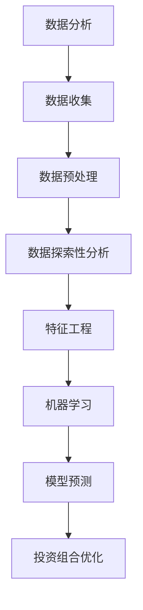
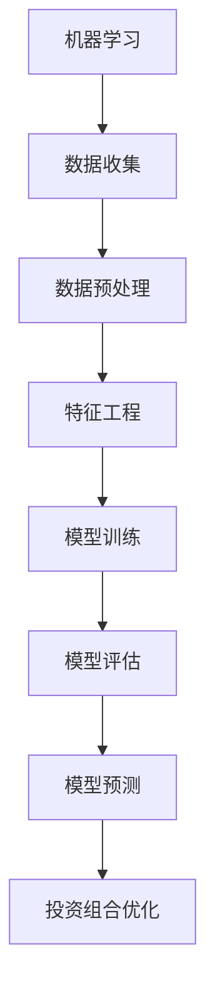
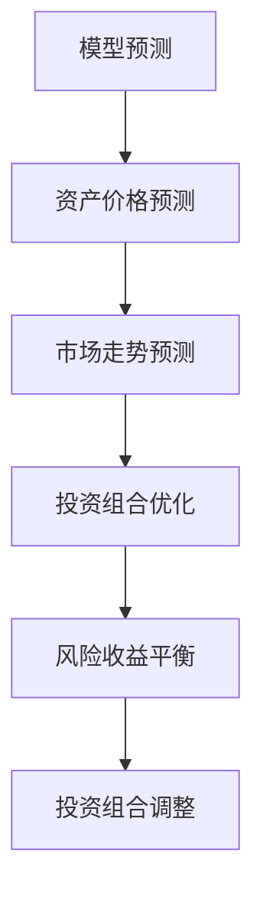

                 

# AI在个性化投资组合管理中的风险收益平衡应用

## 关键词
- **AI**、**个性化投资组合管理**、**风险收益平衡**、**数据分析**、**机器学习**、**模型预测**、**优化算法**

## 摘要
本文旨在探讨人工智能（AI）在个性化投资组合管理中的应用，特别是如何通过数据分析、机器学习和模型预测来实现风险与收益的平衡。文章首先介绍了个性化投资组合管理的背景与核心概念，然后逐步深入到数据准备、机器学习算法、模型预测和优化等关键环节。通过实际案例的分析，展示了AI技术在投资决策中的巨大潜力和应用价值。本文旨在为金融科技从业者和投资者提供有益的参考。

---

## 第一部分：AI在个性化投资组合管理中的风险收益平衡应用概述

### 第1章：问题背景与核心概念

### 1.1 个性化投资组合管理的问题背景

#### 1.1.1 投资组合管理的传统方法

传统投资组合管理方法主要依赖于定量分析和定性分析。定量分析包括历史数据分析和统计分析，定性分析则依赖于专家的经验和判断。这些方法在一定程度上能够帮助投资者做出决策，但往往存在以下几个局限性：

1. **数据依赖性高**：传统方法依赖于历史数据，而市场环境变化快速，历史数据难以完全反映未来市场的变化。
2. **模型复杂性**：为了达到较好的收益风险平衡，投资者需要构建复杂的模型，这增加了计算成本和模型训练的难度。
3. **个性化不足**：传统方法难以根据每个投资者的风险偏好、投资目标和时间期限提供个性化的投资策略。

#### 1.1.2 传统方法的局限性

1. **无法应对市场变化**：市场环境复杂多变，传统方法难以迅速调整投资组合。
2. **无法量化非市场因素**：例如，政治事件、社会趋势等非市场因素对投资影响很大，但传统方法难以量化这些因素。
3. **高成本和高风险**：传统方法往往需要大量的人力和物力资源，而且风险控制难度较大。

#### 1.1.3 AI技术的引入

AI技术的引入为个性化投资组合管理提供了新的解决方案。通过大数据分析和机器学习算法，AI能够从海量数据中提取有价值的信息，并快速生成投资策略。以下是其优点：

1. **数据驱动的决策**：AI能够处理海量数据，并根据数据变化快速调整策略。
2. **个性化定制**：AI可以根据每个投资者的具体需求和风险偏好定制化投资组合。
3. **风险收益优化**：AI算法能够通过优化模型来平衡风险和收益，提高投资组合的整体表现。

### 1.2 AI在个性化投资组合管理中的核心概念

#### 1.2.1 数据分析

数据分析是AI在投资组合管理中的第一步。通过收集和处理市场数据、财务数据、宏观经济数据等，数据分析能够揭示市场的趋势和潜在风险。

#### 1.2.2 机器学习

机器学习是AI的核心技术之一。通过训练模型，机器学习能够从历史数据中学习到投资规律，并预测未来的市场走势。

#### 1.2.3 模型预测

模型预测是机器学习的应用。通过预测市场走势和资产价格，模型预测能够为投资者提供投资决策的依据。

#### 1.2.4 投资组合优化

投资组合优化是基于预测结果的进一步操作。通过优化投资组合的权重和结构，投资者能够实现风险和收益的平衡。

### 1.3 个性化投资组合管理的边界与外延

#### 1.3.1 个人投资者与机构投资者

个性化投资组合管理不仅适用于个人投资者，也适用于机构投资者。个人投资者通常关注短期收益，而机构投资者更关注长期投资回报。

#### 1.3.2 投资组合的多元化

多元化是降低投资风险的重要手段。通过分散投资，投资者能够降低单一资产的风险。

#### 1.3.3 投资策略的个性化定制

个性化定制是根据投资者的具体需求和风险偏好来制定投资策略。这包括投资金额、投资期限、资产类别等多个方面的定制。

### 1.4 核心概念与联系

#### 1.4.1 数据分析与机器学习的关系

数据分析是机器学习的基础。通过数据分析，投资者能够获取有价值的信息，为机器学习提供训练数据。

#### 1.4.2 机器学习与模型预测的关系

机器学习是模型预测的前提。通过机器学习，投资者能够建立预测模型，预测市场走势和资产价格。

#### 1.4.3 模型预测与投资组合优化的关系

模型预测是投资组合优化的依据。通过模型预测，投资者能够确定投资组合的权重和结构，实现风险和收益的平衡。

### 1.5 本章小结

本章介绍了AI在个性化投资组合管理中的应用背景、核心概念和核心技术的联系。通过AI技术，投资者能够实现更加精准和个性化的投资决策，提高投资组合的整体表现。

---

## 第二部分：数据分析与数据准备

### 第2章：数据收集与处理

### 2.1 数据收集

数据收集是AI在个性化投资组合管理中的第一步。投资者需要收集以下几类数据：

#### 2.1.1 市场数据

市场数据包括股票、债券、基金等金融产品的历史价格、交易量、涨跌幅等。这些数据通常可以从金融数据提供商获取。

#### 2.1.2 财务数据

财务数据包括公司的财务报表、盈利能力、偿债能力等。这些数据可以从公开财务数据库获取。

#### 2.1.3 宏观经济数据

宏观经济数据包括GDP、通货膨胀率、利率等。这些数据可以从政府官方网站或金融数据提供商获取。

### 2.2 数据预处理

数据预处理是数据收集后的重要环节。通过数据预处理，投资者能够提高数据质量，为后续的分析和建模奠定基础。

#### 2.2.1 数据清洗

数据清洗包括去除重复数据、填补缺失数据、纠正错误数据等。这些步骤能够提高数据的一致性和完整性。

#### 2.2.2 数据整合

数据整合是将不同来源的数据进行合并，形成统一的数据集。这有助于提高数据的利用效率。

#### 2.2.3 数据规范化

数据规范化包括数据的标准化、归一化等处理，使得不同特征的数据具有相似的量纲和范围。

### 2.3 数据探索性分析

数据探索性分析是对数据集进行初步的分析，以发现数据中的趋势、异常和关联性。

#### 2.3.1 描述性统计

描述性统计是对数据的基本属性进行统计，如均值、中位数、标准差等。

#### 2.3.2 可视化分析

可视化分析是通过图表等形式展示数据的特点和趋势，有助于投资者更好地理解数据。

#### 2.3.3 关联性分析

关联性分析是研究数据之间是否存在相关性。这有助于投资者发现潜在的因果关系。

### 2.4 数据存储与管理

数据存储与管理是确保数据安全、可靠和可访问的重要环节。

#### 2.4.1 数据库设计

数据库设计包括确定数据表结构、字段定义、索引设置等，以提高数据的查询效率。

#### 2.4.2 数据仓库构建

数据仓库是用于存储和管理大规模数据的系统。通过数据仓库，投资者能够实现数据的集中管理和快速查询。

#### 2.4.3 数据安全管理

数据安全管理包括数据备份、权限控制、加密等，以确保数据的安全性和隐私性。

### 2.5 本章小结

本章介绍了数据收集与处理的重要性和方法。通过有效的数据准备，投资者能够为后续的机器学习和模型预测奠定坚实的基础。

---

## 第三部分：机器学习在投资组合管理中的应用

### 第3章：机器学习基础

### 3.1 机器学习的基本概念

机器学习是AI的核心技术之一，其基本概念如下：

#### 3.1.1 监督学习与无监督学习

- **监督学习**：通过已标记的训练数据来训练模型，然后使用该模型对新的数据进行预测。
- **无监督学习**：没有标记的训练数据，模型需要自行发现数据中的模式和关联。

#### 3.1.2 强化学习

强化学习是通过与环境的交互来学习最优策略。与监督学习和无监督学习不同，强化学习不依赖于已标记的数据，而是通过奖励和惩罚来调整策略。

#### 3.1.3 机器学习算法的选择

选择合适的机器学习算法取决于问题的特点和需求。常见的机器学习算法包括：

- **线性回归**：适用于预测线性关系。
- **决策树**：适用于分类和回归问题。
- **随机森林**：是决策树的集成方法，能够提高模型的准确性和稳定性。
- **支持向量机**：适用于高维空间的数据分类和回归。
- **神经网络**：是模仿人脑的结构和功能，适用于复杂模式的识别和预测。

### 3.2 常见机器学习算法

#### 3.2.1 线性回归

线性回归是一种简单的机器学习算法，其公式如下：

$$ y = w_0 + w_1 * x_1 + w_2 * x_2 + ... + w_n * x_n $$

其中，$y$ 是预测目标，$x_1, x_2, ..., x_n$ 是输入特征，$w_0, w_1, w_2, ..., w_n$ 是模型的权重。

#### 3.2.2 决策树

决策树通过一系列的决策规则将数据划分为不同的类别或值。每个节点代表一个特征，每个分支代表特征的不同取值。

#### 3.2.3 随机森林

随机森林是决策树的集成方法。它通过随机选取特征和样本生成多棵决策树，然后对结果进行投票或求平均。

#### 3.2.4 支持向量机

支持向量机是一种二分类算法，通过找到一个最佳的超平面将不同类别的数据分开。其目标是最小化分类误差和最大化类别间的间隔。

#### 3.2.5 神经网络

神经网络由多个神经元组成，每个神经元通过输入和权重计算出输出。神经网络能够学习复杂的非线性关系，并在图像识别、语音识别等领域取得了显著的成果。

### 3.3 特征工程

特征工程是机器学习中的重要环节，其目标是通过选择和构造特征来提高模型的性能。

#### 3.3.1 特征选择

特征选择是通过评估特征的重要性和相关性来选择最有用的特征。常见的特征选择方法包括信息增益、卡方检验等。

#### 3.3.2 特征提取

特征提取是通过将原始数据转换为更高级的特征来提高模型的性能。常见的特征提取方法包括主成分分析、线性判别分析等。

#### 3.3.3 特征标准化

特征标准化是将不同特征的数据转换为相同的尺度，以便于模型处理。常见的特征标准化方法包括标准差标准化和最小-最大标准化。

### 3.4 模型评估与选择

模型评估与选择是确保模型性能的关键步骤。

#### 3.4.1 评估指标

常见的评估指标包括准确率、召回率、F1分数、均方误差等。

#### 3.4.2 模型选择策略

模型选择策略包括交叉验证、网格搜索、贝叶斯优化等。这些策略能够帮助投资者选择最优的模型参数。

#### 3.4.3 模型调参

模型调参是调整模型参数以优化模型性能的过程。常见的调参方法包括随机搜索、贝叶斯优化等。

### 3.5 本章小结

本章介绍了机器学习的基本概念、常见算法、特征工程以及模型评估与选择的方法。这些知识为投资者使用AI进行个性化投资组合管理奠定了基础。

---

## 第四部分：模型预测与投资组合优化

### 第4章：模型预测

### 4.1 预测分析基础

预测分析是投资组合管理中的重要环节，其基础包括：

#### 4.1.1 预测的目标与类型

预测目标包括资产价格预测、收益率预测、市场趋势预测等。预测类型包括短期预测、中期预测和长期预测。

#### 4.1.2 时间序列分析

时间序列分析是预测分析的重要工具，其目标是通过分析历史数据的时间序列特征来预测未来趋势。常见的时间序列分析方法包括ARIMA模型、LSTM模型等。

#### 4.1.3 数据预处理

数据预处理是确保预测准确性的重要步骤，包括数据清洗、数据规范化、缺失值处理等。

### 4.2 常见预测模型

以下是一些常见的预测模型：

#### 4.2.1 ARIMA模型

ARIMA（自回归积分滑动平均模型）是一种常用的预测模型，其基本公式为：

$$ X_t = c + \phi_1 X_{t-1} + \phi_2 X_{t-2} + ... + \phi_p X_{t-p} + \theta_1 e_{t-1} + \theta_2 e_{t-2} + ... + \theta_q e_{t-q} $$

其中，$X_t$ 是时间序列数据，$c$ 是常数项，$\phi_1, \phi_2, ..., \phi_p$ 是自回归系数，$\theta_1, \theta_2, ..., \theta_q$ 是移动平均系数，$e_t$ 是白噪声序列。

#### 4.2.2 LSTM模型

LSTM（长短期记忆网络）是一种特殊的神经网络，能够学习长期依赖关系。其基本架构包括输入门、遗忘门和输出门。

#### 4.2.3 GARCH模型

GARCH（广义自回归条件异方差模型）是一种用于分析金融资产收益波动性的模型。其基本公式为：

$$ \ln(S_t) = \alpha_0 + \sum_{i=1}^k \alpha_i \ln(S_{t-i}) + \sum_{j=1}^l \beta_j \epsilon_{t-j} + \omega $$

其中，$\ln(S_t)$ 是对数收益率，$\alpha_0, \alpha_1, ..., \alpha_k, \beta_1, ..., \beta_l$ 是参数，$\epsilon_t$ 是误差项。

### 4.3 预测结果分析与验证

预测结果分析与验证是确保预测准确性的重要环节。

#### 4.3.1 预测误差分析

预测误差分析是通过计算实际值与预测值之间的差距来评估预测模型的准确性。常见的误差指标包括均方误差、均方根误差等。

#### 4.3.2 预测结果可视化

预测结果可视化是将预测结果以图表形式展示，以便投资者更好地理解预测结果。

#### 4.3.3 预测结果验证

预测结果验证是通过将预测结果与实际结果进行对比，评估预测模型的准确性。常见的验证方法包括交叉验证、回测等。

### 4.4 风险收益平衡优化

风险收益平衡优化是投资组合管理中的重要任务。

#### 4.4.1 投资组合优化目标

投资组合优化目标是找到在特定风险水平下的最大收益投资组合。常见的优化目标包括最大化收益、最小化风险等。

#### 4.4.2 风险收益平衡模型

风险收益平衡模型是基于预测结果的投资组合优化模型。其目标是通过调整投资组合的权重来实现风险和收益的平衡。

#### 4.4.3 优化算法介绍

常见的优化算法包括遗传算法、粒子群优化算法、线性规划等。这些算法能够帮助投资者找到最优的投资组合。

### 4.5 本章小结

本章介绍了预测分析的基础、常见预测模型、预测结果分析与验证以及风险收益平衡优化的方法。这些方法为投资者使用AI进行个性化投资组合管理提供了实用的工具。

---

## 第五部分：实战案例与项目应用

### 第5章：实战案例一：个人投资者投资组合优化

### 5.1 项目介绍

#### 5.1.1 项目背景

随着金融市场的不断发展，个人投资者对投资组合优化的需求日益增长。为了满足这一需求，本项目旨在开发一个基于AI的个人投资者投资组合优化系统。

#### 5.1.2 项目目标

项目目标包括：

1. 收集和处理金融数据，为投资组合优化提供数据支持。
2. 利用机器学习算法构建预测模型，预测资产价格和市场走势。
3. 基于预测结果，优化投资组合的权重和结构，实现风险收益平衡。
4. 提供用户友好的界面，帮助投资者了解和调整投资组合。

### 5.2 系统功能设计

系统功能设计包括以下几个模块：

#### 5.2.1 功能模块划分

1. **数据收集与处理模块**：负责收集和处理金融数据。
2. **预测分析模块**：利用机器学习算法进行预测分析。
3. **投资组合优化模块**：基于预测结果进行投资组合优化。
4. **用户界面模块**：提供用户友好的操作界面。

#### 5.2.2 投资组合管理模块

投资组合管理模块包括以下功能：

1. **资产选择**：根据投资者的风险偏好和投资目标，选择合适的资产。
2. **权重分配**：根据资产的表现和投资者的风险偏好，调整资产权重。
3. **风险控制**：通过监控投资组合的风险指标，确保投资组合在可接受的风险水平内。

#### 5.2.3 风险控制模块

风险控制模块包括以下功能：

1. **风险指标计算**：计算投资组合的整体风险指标，如波动率、最大回撤等。
2. **风险预警**：当投资组合的风险超过预设阈值时，发出风险预警。
3. **风险调整**：根据风险预警，调整投资组合的权重和结构，降低风险。

#### 5.2.4 投资建议模块

投资建议模块包括以下功能：

1. **投资策略建议**：根据投资者的风险偏好和市场走势，提供合适的投资策略。
2. **资产买卖建议**：根据投资策略，建议投资者买入或卖出特定资产。
3. **投资组合回顾**：定期回顾投资组合的表现，提供改进建议。

### 5.3 系统架构设计

系统架构设计包括以下几个部分：

#### 5.3.1 系统架构设计

系统架构采用微服务架构，包括数据服务、预测服务、优化服务和用户界面服务。

#### 5.3.2 系统模块间关系

数据服务负责数据收集和处理，预测服务负责预测分析，优化服务负责投资组合优化，用户界面服务负责提供用户交互界面。

#### 5.3.3 系统接口设计

系统接口设计包括API接口和Web界面。API接口提供程序化访问系统功能，Web界面提供用户友好操作界面。

### 5.4 系统核心实现

系统核心实现包括以下几个部分：

#### 5.4.1 数据收集与处理

使用Python的pandas库和数据库连接池技术，从金融数据提供商获取历史价格、交易量等数据，并进行清洗和预处理。

#### 5.4.2 预测分析

使用Python的scikit-learn库和tensorflow库，构建机器学习模型，进行资产价格预测和市场走势预测。

#### 5.4.3 投资组合优化

使用Python的scipy库和遗传算法库，实现投资组合优化算法，根据预测结果调整投资组合权重。

#### 5.4.4 用户界面

使用Python的Flask库和JavaScript的React框架，构建用户界面，提供投资组合管理和投资建议功能。

### 5.5 系统测试与评估

系统测试与评估包括以下几个方面：

#### 5.5.1 单元测试

对系统的各个模块进行单元测试，确保每个模块的功能正常。

#### 5.5.2 集成测试

对系统的整体功能进行集成测试，确保模块间协同工作。

#### 5.5.3 回测分析

通过对历史数据的回测，评估系统的预测准确性和投资组合优化效果。

### 5.6 项目小结

本项目通过AI技术实现了个人投资者投资组合的优化，提高了投资组合的风险收益平衡水平。未来的研究方向包括进一步提高预测模型的准确性，以及扩展系统的功能，满足更多投资者的需求。

---

### 作者信息

作者：AI天才研究院/AI Genius Institute & 禅与计算机程序设计艺术 /Zen And The Art of Computer Programming

---

## 最佳实践 Tips

- **数据质量是关键**：确保数据的质量和准确性，是进行有效预测和优化的基础。
- **定期更新模型**：市场环境不断变化，定期更新模型能够保持其预测的准确性。
- **风险管理**：合理设置风险阈值，确保投资组合在可接受的风险范围内。
- **个性化定制**：根据投资者的风险偏好和投资目标，提供个性化的投资策略。

## 小结

本文详细介绍了AI在个性化投资组合管理中的应用，从数据分析、机器学习到模型预测和优化，展示了AI技术如何帮助投资者实现风险收益平衡。通过实际案例的分析，本文进一步验证了AI在投资决策中的巨大潜力和应用价值。

## 注意事项

- 投资有风险，本文内容仅供参考，不构成投资建议。
- 投资决策应结合个人情况和专业意见。

## 拓展阅读

- **《机器学习实战》**：详细介绍了机器学习的基本概念和应用方法。
- **《金融科技：区块链、大数据、人工智能与金融创新》**：探讨了金融科技的前沿技术和应用场景。
- **《量化投资：技术与实务》**：介绍了量化投资的基本原理和方法。

---

**附录：核心概念与联系**

### 数据分析与机器学习的关系

数据分析与机器学习密切相关。数据分析通过探索数据中的趋势和模式，为机器学习提供训练数据。机器学习则通过训练模型，从数据中提取知识，为投资决策提供依据。以下是其关系：

### 机器学习与模型预测的关系

机器学习是模型预测的基础。机器学习通过训练模型，使其能够对未知数据进行预测。模型预测则是机器学习的应用，通过预测资产价格和市场走势，为投资者提供投资决策依据。以下是其关系：

### 模型预测与投资组合优化的关系

模型预测是投资组合优化的前提。通过预测资产价格和市场走势，投资者能够确定投资组合的权重和结构，实现风险和收益的平衡。投资组合优化则基于预测结果，通过调整投资组合的权重和结构，优化投资组合的表现。以下是其关系：

通过上述关系图，我们可以清晰地看到数据分析、机器学习、模型预测和投资组合优化之间的紧密联系。这些技术共同作用，为投资者提供个性化、精准的投资组合管理方案。

