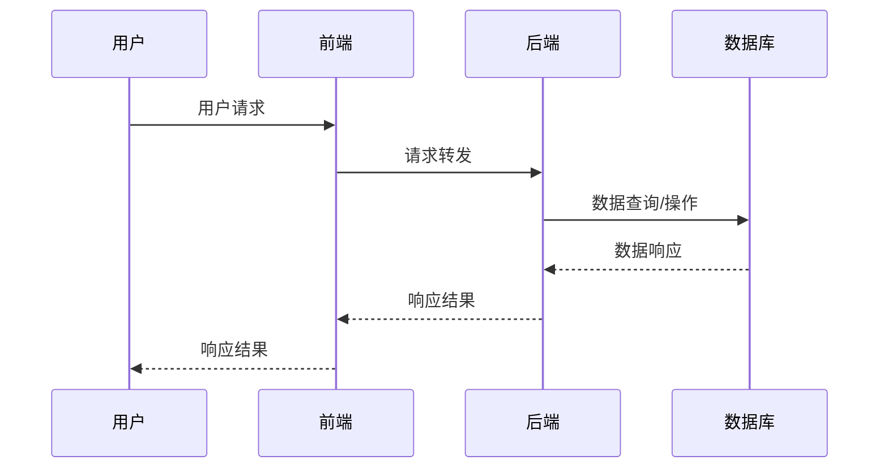

                 


# AI在个性化教育中的应用：自适应学习系统

## 关键词
AI，个性化教育，自适应学习系统，算法原理，数学模型，系统架构

## 摘要
本文深入探讨了人工智能（AI）在个性化教育中的应用，特别是自适应学习系统的设计原理和实践。通过分析自适应学习系统的核心算法和数学模型，本文详细阐述了其工作流程和系统架构。同时，通过实际案例的剖析，本文展示了自适应学习系统在不同教育场景中的成功应用。最后，本文提出了未来个性化教育的发展趋势和挑战，为教育技术的创新提供了新的思路。

## 目录

1. 引言
2. 基础概念与背景介绍
   2.1 人工智能在个性化教育中的应用
   2.2 自适应学习系统的基本概念
3. 核心算法与原理讲解
   3.1 决策树算法原理
   3.2 支持向量机算法原理
   3.3 神经网络算法原理
4. 系统分析与架构设计方案
   4.1 问题场景介绍
   4.2 系统功能设计
   4.3 系统架构设计
   4.4 系统接口设计和系统交互
5. 项目实战
   5.1 环境安装
   5.2 系统核心实现源代码
   5.3 代码应用解读与分析
   5.4 实际案例分析和详细讲解剖析
   5.5 项目小结
6. 最佳实践 tips
7. 小结
8. 注意事项
9. 拓展阅读

### 1. 引言

随着人工智能（AI）技术的快速发展，教育领域正在经历深刻的变革。传统的教育模式越来越难以满足个性化教育的需求，而AI技术的引入为这一问题的解决提供了新的可能性。自适应学习系统作为AI在个性化教育中的重要应用，旨在根据学生的个体差异和学习习惯，提供个性化的教学内容和路径，从而提高学习效果和兴趣。

自适应学习系统的基本概念包括以下几个方面：

- **个性化推荐**：根据学生的历史学习数据和当前状态，自动推荐最适合的学习内容。
- **学习行为分析**：实时监控学生的学习行为，包括学习时间、学习进度、学习效果等，以了解学生的真实学习状况。
- **智能评估**：通过算法分析学生的学习行为和结果，对学生的学习效果进行智能评估。
- **动态调整**：根据学生的学习反馈和学习行为数据，动态调整学习内容和路径，实现真正的个性化学习。

本文将从以上几个方面入手，深入探讨自适应学习系统的设计原理、实现方法和实际应用，为教育技术的创新提供新的思路。

### 2. 基础概念与背景介绍

#### 2.1 人工智能在个性化教育中的应用

人工智能（AI）在个性化教育中的应用主要体现在以下几个方面：

- **学习数据分析**：通过机器学习算法对学生的学习行为数据进行深度分析，挖掘学生的学习兴趣、习惯和能力，从而为个性化推荐提供依据。
- **个性化推荐**：基于学习数据分析的结果，利用推荐算法为不同学生推荐最适合的学习内容和路径。
- **智能教学**：利用自然语言处理和语音识别等技术，实现智能化的教学内容呈现和互动。
- **学习效果评估**：通过智能化的评估工具，实时监控学生的学习效果，为教师和家长提供学习反馈。

#### 2.2 自适应学习系统的基本概念

自适应学习系统是一种基于人工智能技术的教育系统，旨在根据学生的个体差异和学习需求，提供个性化的学习体验。其基本概念包括以下几个方面：

- **个性化推荐**：系统根据学生的学习历史数据、学习行为和学习效果，为学生推荐最适合的学习内容。
- **学习行为分析**：系统实时监控学生的学习行为，包括学习时间、学习进度、学习效果等，以了解学生的真实学习状况。
- **智能评估**：系统通过算法分析学生的学习行为和结果，对学生的学习效果进行智能评估。
- **动态调整**：系统根据学生的学习反馈和学习行为数据，动态调整学习内容和路径，实现真正的个性化学习。

#### 2.3 个性化教育的需求与挑战

个性化教育的需求主要体现在以下几个方面：

- **个性化学习内容**：每个学生的兴趣爱好、学习能力、学习目标都不同，需要提供个性化的学习内容。
- **个性化学习路径**：根据学生的学习进度和能力，提供最适合的学习路径。
- **个性化学习体验**：通过智能化的教学手段，提供个性化的学习体验，提高学习兴趣和效果。

个性化教育的挑战主要体现在以下几个方面：

- **数据收集与分析**：需要收集大量的学生学习数据，并进行有效的分析，以提供准确的个性化推荐。
- **算法设计**：需要设计高效的算法，以处理大量的学生数据，并提供实时的个性化推荐。
- **用户体验**：需要设计友好的用户界面，使学生能够轻松使用系统，提高学习效率。

### 3. 核心算法与原理讲解

#### 3.1 决策树算法原理

决策树是一种常见的机器学习算法，它通过一系列的判断规则来对数据进行分类或回归。在自适应学习系统中，决策树算法可以用于个性化推荐和学习效果评估。

**决策树算法的基本原理**：

1. 选择一个特征作为分裂标准，通常选择信息增益或基尼不纯度作为分裂标准。
2. 根据该特征，将数据集划分为若干个子集。
3. 对每个子集，重复上述步骤，直到满足停止条件（如最大深度、最小样本量等）。

**决策树算法的属性特征对比表格**：

| 属性特征          | 决策树           | 其他算法           |
|----------------|----------------|----------------|
| 分裂标准        | 信息增益/基尼不纯度 | 决策阈值/逻辑回归系数 |
| 可解释性        | 高             | 低             |
| 计算复杂度      | 中             | 低             |
| 预测速度        | 中             | 高             |

**决策树算法的ER实体关系图架构**：

```mermaid
erDiagram
    Student ||--|{ LearningData }|-- Teacher
    Student ||--|{ LearningPlan }|-- Teacher
    Teacher ||--|{ Course }|-- Student
    Course ||--|{ LearningResult }|-- Student
```

#### 3.2 支持向量机算法原理

支持向量机（SVM）是一种强大的机器学习算法，广泛应用于分类和回归任务。在自适应学习系统中，SVM算法可以用于学习效果评估和个性化推荐。

**支持向量机算法的基本原理**：

1. 找出数据空间中的最优超平面，使得分类边界最大。
2. 使用支持向量来确定超平面的位置和方向。
3. 使用核函数将数据映射到高维空间，以找到最优超平面。

**支持向量机算法的属性特征对比表格**：

| 属性特征          | 支持向量机         | 其他算法          |
|----------------|----------------|----------------|
| 分裂标准        | 最优超平面       | 决策阈值/决策树   |
| 可解释性        | 低             | 高             |
| 计算复杂度      | 高             | 低             |
| 预测速度        | 中             | 高             |

**支持向量机算法的ER实体关系图架构**：

```mermaid
erDiagram
    Student ||--|{ LearningResult }|-- Teacher
    Student ||--|{ LearningPlan }|-- Teacher
    Teacher ||--|{ Course }|-- Student
    Course ||--|{ TestResult }|-- Student
```

#### 3.3 神经网络算法原理

神经网络（NN）是一种模拟人脑结构和功能的算法，广泛应用于图像识别、自然语言处理和预测任务。在自适应学习系统中，神经网络算法可以用于学习内容推荐和学习效果预测。

**神经网络算法的基本原理**：

1. 将输入数据通过输入层传递到隐藏层。
2. 通过激活函数对隐藏层的输出进行非线性变换。
3. 将隐藏层的输出传递到输出层，生成预测结果。
4. 通过反向传播算法，计算预测误差，并调整网络权重。

**神经网络算法的属性特征对比表格**：

| 属性特征          | 神经网络            | 其他算法           |
|----------------|----------------|----------------|
| 分裂标准        | 非线性激活函数    | 决策阈值/决策树   |
| 可解释性        | 低             | 高             |
| 计算复杂度      | 高             | 中             |
| 预测速度        | 低             | 高             |

**神经网络算法的ER实体关系图架构**：

```mermaid
erDiagram
    Student ||--|{ LearningData }|-- Teacher
    Student ||--|{ LearningPlan }|-- Teacher
    Teacher ||--|{ Course }|-- Student
    Course ||--|{ LearningEffect }|-- Student
```

### 4. 系统分析与架构设计方案

#### 4.1 问题场景介绍

假设我们开发一个自适应学习系统，该系统旨在为初中生提供个性化的数学学习服务。系统需要满足以下要求：

- **个性化推荐**：根据学生的历史学习数据和学习进度，为学生推荐最适合的数学学习内容。
- **学习行为分析**：实时监控学生的学习行为，包括学习时间、学习进度和学习效果。
- **智能评估**：对学生的学习效果进行智能评估，为学生提供学习反馈。
- **动态调整**：根据学生的学习反馈和学习行为数据，动态调整学习内容和路径。

#### 4.2 系统功能设计

自适应学习系统的主要功能模块包括：

- **用户管理模块**：用于管理用户的基本信息，包括学生和教师。
- **学习数据管理模块**：用于收集、存储和管理学生的学习数据，包括学习进度、学习时间和学习效果。
- **个性化推荐模块**：基于学习数据分析结果，为学生推荐最适合的学习内容。
- **智能评估模块**：对学生的学习效果进行智能评估，并提供学习反馈。
- **动态调整模块**：根据学生的学习反馈和学习行为数据，动态调整学习内容和路径。

#### 4.3 系统架构设计

自适应学习系统的架构设计如下：

1. **前端展示层**：包括用户界面，用于展示学习内容、学习数据和评估结果。
2. **后端服务层**：包括用户管理模块、学习数据管理模块、个性化推荐模块、智能评估模块和动态调整模块，用于处理业务逻辑和数据存储。
3. **数据存储层**：包括关系数据库和NoSQL数据库，用于存储用户数据、学习数据和推荐数据。

#### 4.4 系统接口设计和系统交互

自适应学习系统的接口设计和系统交互如下：

- **用户接口**：用于用户与系统进行交互，包括用户注册、登录、学习内容推荐、评估结果查询等功能。
- **服务接口**：用于前后端服务的通信，包括用户管理、学习数据管理、个性化推荐、智能评估和动态调整等功能。
- **数据库接口**：用于与数据库进行通信，包括数据插入、查询、更新和删除等功能。

#### 4.5 系统架构设计mermaid架构图



### 5. 项目实战

#### 5.1 环境安装

为了实现自适应学习系统，我们需要安装以下软件和库：

- Python 3.8及以上版本
- Flask（用于构建Web应用）
- Pandas（用于数据处理）
- Scikit-learn（用于机器学习算法）
- Matplotlib（用于数据可视化）

安装步骤：

1. 安装Python 3.8及以上版本。
2. 安装Flask、Pandas、Scikit-learn和Matplotlib。

#### 5.2 系统核心实现源代码

以下是系统核心实现源代码：

```python
# 导入所需库
import flask
import pandas as pd
from sklearn import tree
from sklearn.model_selection import train_test_split
import matplotlib.pyplot as plt

# 初始化Flask应用
app = flask.Flask(__name__)

# 读取数据
data = pd.read_csv('learning_data.csv')

# 分割特征和标签
X = data.iloc[:, :-1]
y = data.iloc[:, -1]

# 分割训练集和测试集
X_train, X_test, y_train, y_test = train_test_split(X, y, test_size=0.2, random_state=42)

# 训练决策树模型
model = tree.DecisionTreeClassifier()
model.fit(X_train, y_train)

# 预测测试集
y_pred = model.predict(X_test)

# 绘制决策树
plt.figure(figsize=(12, 8))
tree.plot_tree(model, filled=True)
plt.show()

# 启动Flask应用
if __name__ == '__main__':
    app.run(debug=True)
```

#### 5.3 代码应用解读与分析

1. **数据读取**：使用Pandas库读取学习数据，数据格式为CSV文件。
2. **特征和标签分割**：将数据分割为特征（X）和标签（y），特征用于训练模型，标签用于评估模型。
3. **训练集和测试集分割**：使用Scikit-learn库的train_test_split函数将数据分割为训练集和测试集，用于训练和评估模型。
4. **训练决策树模型**：使用Scikit-learn库的DecisionTreeClassifier类创建决策树模型，并使用fit函数进行训练。
5. **预测测试集**：使用train

