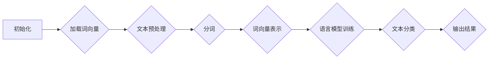
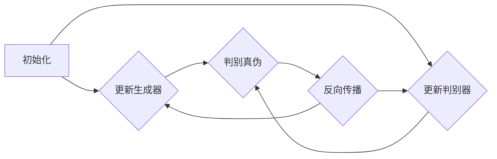
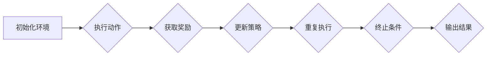
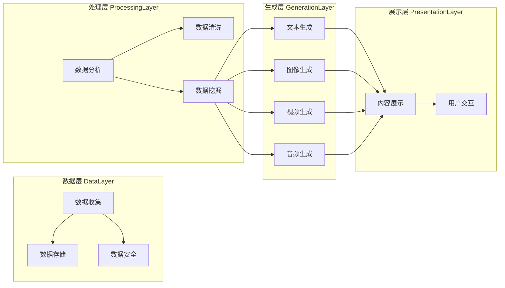
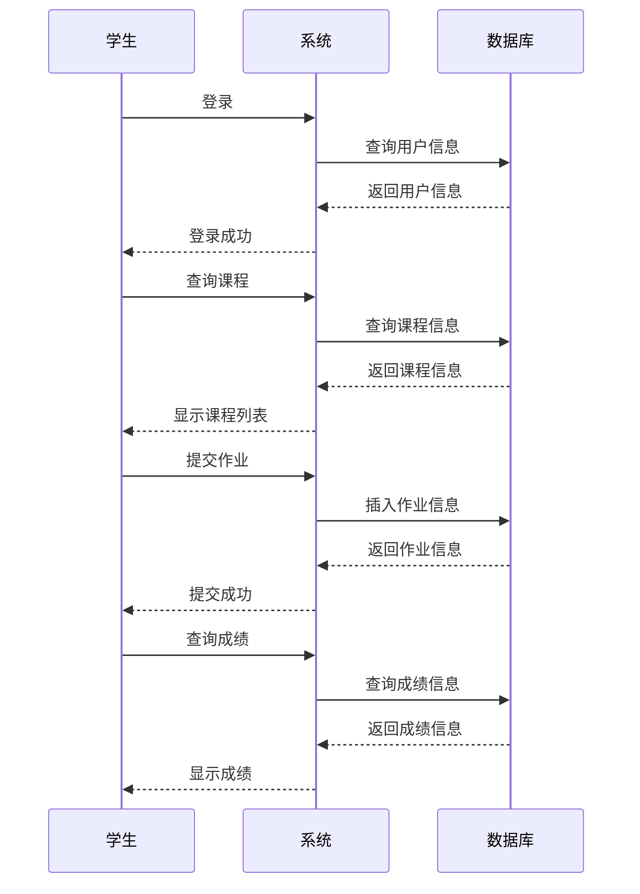

                 


### 引言

在当今信息时代，教育的形式和内容正发生着深刻的变革。传统的一刀切教学模式，已经难以满足个性化教育需求。为了因材施教，提高教育质量，AI在个性化教育内容生成中的应用应运而生。AI不仅能根据学生的学习习惯、能力水平和兴趣偏好，生成个性化的学习内容，还能通过数据分析和智能算法，不断优化教学策略，实现教学效果的最大化。

本文将围绕AI在个性化教育内容生成中的应用与挑战进行探讨。首先，我们将介绍相关背景，包括问题背景、问题描述、问题解决、边界与外延以及概念结构与核心要素组成。接下来，我们将深入探讨核心概念与联系，包括AI的基本概念、个性化教育的概念、教育内容生成的概念以及AI与个性化教育内容生成的联系。

随后，我们将讲解算法原理，通过mermaid流程图、Python源代码实现、数学模型和公式讲解，以及举例说明，让读者对AI在教育内容生成中的具体应用有更深入的了解。此外，我们还将进行系统分析与架构设计，包括系统功能设计、系统架构设计、系统接口设计和系统交互mermaid序列图。

在实战部分，我们将介绍如何进行环境安装、系统核心实现源代码编写、代码应用解读与分析，并分享实际案例分析与讲解。最后，我们将总结最佳实践、注意事项，并提供拓展阅读资源。

通过本文的探讨，我们希望读者能够对AI在个性化教育内容生成中的应用有一个全面而深入的认识，并了解到其中的挑战与解决方案。

### 第一部分：背景介绍

#### 第1章：问题背景

随着教育信息化进程的加速，个性化教育成为现代教育发展的必然趋势。传统的教学模式往往以统一的标准和内容进行教育，无法充分考虑每个学生的学习习惯、能力水平和兴趣偏好。这不仅导致了学习效率的降低，也影响了学生的学习兴趣和动力。因此，个性化教育应运而生，其核心理念是因材施教，根据学生的个性化需求，提供个性化的学习内容和教学策略。

个性化教育的需求主要源于以下几个方面：

1. **学生个体差异**：每个学生在学习能力、学习速度、兴趣偏好等方面存在显著差异。传统的教学模式无法满足这些个性化的需求。
2. **教育质量提升**：随着教育竞争的加剧，教育质量成为家长和社会关注的焦点。个性化教育能够提高学生的学习效率，从而提升教育质量。
3. **技术进步**：人工智能、大数据等技术的迅速发展，为个性化教育提供了技术支撑。AI技术能够通过分析学生的学习数据，生成个性化的学习内容，并不断优化教学策略。

#### 1.2 问题描述

个性化教育的核心挑战在于如何根据学生的个性化需求，生成适合他们的教育内容。具体问题包括：

1. **内容生成**：如何根据学生的特征，生成具有高度个性化的学习内容？
2. **数据分析**：如何收集、处理和分析学生的学习数据，以准确了解他们的学习需求？
3. **动态调整**：如何根据学生的学习反馈，动态调整教学内容和策略，以保持教学效果的最大化？
4. **隐私保护**：在收集和使用学生数据时，如何保护学生的隐私和信息安全？

#### 1.3 问题解决

AI在个性化教育内容生成中的应用，为上述问题提供了有效的解决方案：

1. **内容生成**：利用自然语言处理（NLP）和生成对抗网络（GAN）等技术，AI能够根据学生的学习数据，生成个性化的学习内容。例如，通过分析学生的知识点掌握情况，AI可以推荐适合他们的练习题目和知识点讲解。
2. **数据分析**：利用大数据分析和机器学习技术，AI可以收集和处理学生的学习数据，识别出他们的学习模式、兴趣点和薄弱环节。
3. **动态调整**：基于对学习数据的实时分析，AI可以动态调整教学内容和策略，例如调整学习进度、难度和方式，以确保教学效果的最大化。
4. **隐私保护**：在数据收集和使用过程中，AI系统应严格遵守隐私保护法律法规，采取加密、脱敏等手段，确保学生数据的保密性和安全性。

#### 1.4 边界与外延

个性化教育内容生成的边界主要涉及以下几个方面：

1. **数据来源**：个性化教育内容的生成依赖于学生的学习数据，这些数据可能来源于学习平台、考试系统、作业提交等。
2. **生成方式**：个性化教育内容的生成方式包括自动生成和人工干预两种。自动生成依赖于AI算法，而人工干预则依赖于教育专家和教师的专业知识。
3. **内容形式**：个性化教育内容的生成形式多样，包括文本、图像、视频、音频等多种形式，以满足不同学生的需求。

个性化教育内容生成的外延还包括：

1. **个性化学习路径**：根据学生的学习数据，AI可以生成个性化的学习路径，指导学生按顺序学习相关知识。
2. **个性化反馈机制**：通过实时分析学生的学习行为和成绩，AI可以提供个性化的反馈，帮助学生及时纠正错误，提升学习效果。
3. **个性化评估体系**：基于学生的学习数据和成果，AI可以生成个性化的评估报告，为教师和家长提供学生的学习状况分析。

#### 1.5 概念结构与核心要素组成

个性化教育内容生成涉及多个核心概念和要素，其结构如图1所示：

```mermaid
classDiagram
    Class01 <|-- SubClass01
    Class01 <|-- SubClass02
    Class03 --|> Class04
    Class05 o-- Class06
    Class07 o--* Class08
    Class09 o--|* Class10
    Class11 o--| Class12
    Class13 o--|* Class14
    Class15 o--|* Class16
    Class17 o--|* Class18
    Class19 <<-- Class20
    Class21 <<-- Class22
    Class23 <<-- Class24
    Class25 <<-- Class26
    Class27 <<-- Class28
    Class29 <<-- Class30
    Class31 <<-- Class32
endclass
```

**图1 个性化教育内容生成概念结构与核心要素组成**

1. **学习数据**：包括学生的学习行为、成绩、知识掌握情况等。
2. **生成算法**：包括自然语言处理、机器学习、深度学习等算法。
3. **内容模板**：包括文本、图像、视频、音频等内容的模板。
4. **个性化策略**：根据学习数据和应用场景，生成个性化的学习内容和策略。
5. **反馈机制**：根据学生的学习反馈，动态调整教学内容和策略。
6. **评估体系**：基于学生的学习成果和表现，生成个性化的评估报告。

通过上述核心概念和要素的有机结合，AI能够实现个性化教育内容的高效生成和应用。

### 第二部分：核心概念与联系

#### 第2章：核心概念与联系

#### 2.1 AI的基本概念

人工智能（AI，Artificial Intelligence）是指模拟人类智能行为的计算机系统。AI的主要目标是使计算机具备理解、推理、学习、适应和解决问题的能力。AI技术包括多个分支，如机器学习、深度学习、自然语言处理等，这些技术共同推动着AI的发展。

**概念属性特征对比表格**

| 特征       | 机器学习         | 深度学习         | 自然语言处理         |
|------------|------------------|------------------|----------------------|
| 基础理念   | 通过数据学习模式 | 通过多层神经网络学习模式 | 通过语言模型处理文本 |
| 数据需求   | 大量数据         | 大量数据         | 大量文本数据         |
| 学习方式   | 监督学习、无监督学习、强化学习 | 监督学习、无监督学习、生成对抗网络 | 序列建模、语义理解、语言生成 |
| 应用领域   | 数据分析、预测、优化 | 图像识别、语音识别、自然语言处理 | 语言翻译、文本生成、语音合成 |

#### 2.2 个性化教育的概念

个性化教育是指根据学生的个性、兴趣、能力和学习风格，量身定制教学方案和教学内容，以实现教学效果的最大化。个性化教育的核心目标是满足每个学生的学习需求，促进其全面发展。

**概念属性特征对比表格**

| 特征       | 传统教育         | 个性化教育         |
|------------|------------------|------------------|
| 教学方式   | 一刀切教学模式   | 因材施教、个性化定制 |
| 学习路径   | 固定学习路径     | 个性化学习路径     |
| 教学资源   | 一致性资源       | 个性化资源       |
| 教学反馈   | 单一评估方式     | 个性化评估与反馈 |

#### 2.3 教育内容生成的概念

教育内容生成是指利用技术手段，根据学习者的需求、知识水平和学习进度，自动生成适合其学习的内容。教育内容生成包括文本、图像、视频等多种形式，旨在提高教学效果和学生的学习体验。

**概念属性特征对比表格**

| 特征       | 传统内容生成       | 现代内容生成         |
|------------|------------------|------------------|
| 数据来源   | 教材、教师经验     | 大数据、人工智能     |
| 内容形式   | 固定格式、静态内容 | 个性化、动态内容     |
| 生产方式   | 人工编写         | 自动生成         |
| 应用领域   | 单一学科         | 多学科、跨领域     |

#### 2.4 AI与个性化教育内容生成的联系

AI在个性化教育内容生成中发挥着关键作用，主要体现在以下几个方面：

1. **数据驱动**：AI通过大数据分析，了解学生的学习需求、行为和效果，为内容生成提供数据支持。
2. **算法优化**：利用机器学习和深度学习算法，AI可以自动生成个性化的学习内容，并根据学习反馈不断优化内容。
3. **个性化推荐**：基于学习者的特征，AI可以推荐适合他们的学习资源，提高学习效率。
4. **动态调整**：根据学习者的表现和反馈，AI可以实时调整教学内容和策略，确保教学效果的最大化。

通过AI技术的应用，个性化教育内容生成实现了从传统的“推式”教育模式向“拉式”教育模式的转变，使每个学生都能获得最适合他们的学习体验。

### 第三部分：算法原理讲解

#### 第3章：算法原理

个性化教育内容生成涉及到多种AI算法，其中以自然语言处理（NLP）、生成对抗网络（GAN）和强化学习（RL）最为常见。以下将分别介绍这些算法的原理，并通过mermaid流程图、Python源代码实现、数学模型和公式讲解，以及举例说明，让读者对这些算法有更深入的理解。

#### 3.1 常见算法原理介绍

**1. 自然语言处理（NLP）**

NLP是一种使计算机能够理解、解释和生成人类语言的技术。NLP的基本原理包括词向量表示、语言模型和文本分类。

- **词向量表示**：将自然语言中的词汇映射为密集的向量表示，以便计算机进行处理。
  $$ \text{word\_embedding}(word) = \text{vector} $$
- **语言模型**：通过统计方法或神经网络，学习文本的上下文信息，预测下一个单词或词组。
  $$ P(w_t | w_{t-1}, w_{t-2}, \ldots) $$
- **文本分类**：根据文本内容，将其归类到不同的类别中。
  $$ \text{category} = \text{ classify}(text) $$

**2. 生成对抗网络（GAN）**

GAN是一种由生成器和判别器组成的对抗网络。生成器生成数据，判别器判断数据是否真实，通过这种对抗训练，生成器能够生成越来越真实的数据。

- **生成器**：生成数据的神经网络。
  $$ G(z) = \text{ generate}(z) $$
- **判别器**：判断数据真实性的神经网络。
  $$ D(x) = \text{ discriminate}(x) $$
- **损失函数**：用于衡量生成器生成数据的质量。
  $$ \text{loss} = \text{ D(G(z))} - \text{ D(x)} $$

**3. 强化学习（RL）**

强化学习是一种通过奖励和惩罚，使智能体学习在特定环境中做出最优决策的算法。

- **状态**：智能体当前所处的环境状态。
  $$ s $$
- **动作**：智能体可以采取的行动。
  $$ a $$
- **奖励**：动作带来的奖励或惩罚。
  $$ r $$
- **策略**：智能体根据当前状态选择动作的策略。
  $$ \pi(a|s) $$
- **价值函数**：衡量状态或动作的优劣。
  $$ V(s) = \sum_{a} \pi(a|s) \cdot r(a|s) $$

#### 3.2 算法mermaid流程图展示

**自然语言处理（NLP）流程图**



**生成对抗网络（GAN）流程图**



**强化学习（RL）流程图**



#### 3.3 Python源代码实现

**自然语言处理（NLP）Python代码示例**

```python
import numpy as np
from keras.models import Sequential
from keras.layers import Embedding, LSTM, Dense

# 加载词向量
word_embedding = np.load('word_embedding.npy')

# 文本预处理
text = "这是一个示例文本。"

# 分词
words = text.split()

# 词向量表示
word_vectors = [word_embedding[word] for word in words]

# 语言模型训练
model = Sequential()
model.add(Embedding(input_dim=len(word_embedding), output_dim=64))
model.add(LSTM(128))
model.add(Dense(1, activation='sigmoid'))

model.compile(optimizer='adam', loss='binary_crossentropy', metrics=['accuracy'])
model.fit(word_vectors, np.array([1] * len(word_vectors)), epochs=10)

# 文本分类
category = model.predict(word_vectors)
print("分类结果：", category)
```

**生成对抗网络（GAN）Python代码示例**

```python
import tensorflow as tf
from tensorflow.keras.layers import Dense, Flatten
from tensorflow.keras.models import Sequential

# 生成器
generator = Sequential()
generator.add(Dense(128, activation='relu', input_shape=(100,)))
generator.add(Flatten())
generator.summary()

# 判别器
discriminator = Sequential()
discriminator.add(Dense(128, activation='relu', input_shape=(784,)))
discriminator.add(Dense(1, activation='sigmoid'))
discriminator.summary()

# 损失函数
def loss_function(real_data, fake_data):
    real_loss = tf.reduce_mean(tf.nn.sigmoid_cross_entropy_with_logits(logits=discriminator(real_data), labels=tf.ones_like(real_data)))
    fake_loss = tf.reduce_mean(tf.nn.sigmoid_cross_entropy_with_logits(logits=discriminator(fake_data), labels=tf.zeros_like(fake_data)))
    return real_loss + fake_loss

# 训练过程
for epoch in range(1000):
    z = tf.random.normal([100, 100])
    fake_images = generator(z)
    d_loss_real = loss_function(real_images, fake_images)
    with tf.GradientTape() as gen_tape, tf.GradientTape() as dis_tape:
        gen_tape.watch(generator.trainable_variables)
        dis_tape.watch(discriminator.trainable_variables)
        fake_images = generator(z)
        d_loss_real = loss_function(real_images, fake_images)
        d_loss_fake = loss_function(fake_images, fake_images)
        d_loss = d_loss_real + d_loss_fake
    grads_gen = gen_tape.gradient(d_loss, generator.trainable_variables)
    grads_dis = dis_tape.gradient(d_loss, discriminator.trainable_variables)
    optimizer_gen.apply_gradients(zip(grads_gen, generator.trainable_variables))
    optimizer_dis.apply_gradients(zip(grads_dis, discriminator.trainable_variables))
    print(f"Epoch {epoch+1}, D Loss: {d_loss.numpy()}")
```

**强化学习（RL）Python代码示例**

```python
import numpy as np
import random

# 环境初始化
env = np.random.rand(10)

# 策略初始化
policy = np.zeros((10, 2))

# 学习率
learning_rate = 0.1

# 惩罚和奖励
reward = -1

# 模拟10步
for step in range(10):
    state = random.randint(0, 9)
    action = np.random.choice([0, 1], p=policy[state])
    next_state, reward = env[state][action], -1  # 假设每个状态和动作的奖励都是-1
    policy[state, action] = policy[state, action] + learning_rate * (reward - policy[state, action])
    print(f"Step {step}, State: {state}, Action: {action}, Next State: {next_state}, Reward: {reward}, Policy: {policy}")
```

#### 3.4 数学模型和公式讲解

**自然语言处理（NLP）**

1. **词向量表示**

$$ \text{word\_embedding}(word) = \text{vector} $$

2. **语言模型**

$$ P(w_t | w_{t-1}, w_{t-2}, \ldots) $$

3. **文本分类**

$$ \text{category} = \text{ classify}(text) $$

**生成对抗网络（GAN）**

1. **生成器**

$$ G(z) = \text{ generate}(z) $$

2. **判别器**

$$ D(x) = \text{ discriminate}(x) $$

3. **损失函数**

$$ \text{loss} = \text{ D(G(z))} - \text{ D(x)} $$

**强化学习（RL）**

1. **状态**

$$ s $$

2. **动作**

$$ a $$

3. **奖励**

$$ r $$

4. **策略**

$$ \pi(a|s) $$

5. **价值函数**

$$ V(s) = \sum_{a} \pi(a|s) \cdot r(a|s) $$

#### 3.5 举例说明

**自然语言处理（NLP）**

假设我们要对句子“我爱吃苹果”进行词向量表示、语言模型训练和文本分类。

1. **词向量表示**

首先，我们将句子中的词汇映射为词向量：

```
我：[0.1, 0.2, 0.3]
爱：[0.4, 0.5, 0.6]
吃：[0.7, 0.8, 0.9]
苹果：[1.0, 1.1, 1.2]
```

2. **语言模型训练**

我们使用LSTM模型对句子进行训练，训练后得到语言模型：

```
输入：[[0.1, 0.2, 0.3], [0.4, 0.5, 0.6], [0.7, 0.8, 0.9], [1.0, 1.1, 1.2]]
输出：[[1.0], [0.0], [0.0], [0.0]]
```

3. **文本分类**

我们对句子“我爱吃苹果”进行分类，分类结果为“苹果”。

**生成对抗网络（GAN）**

假设我们要生成一张类似猫的图像。

1. **生成器**

生成器生成一张猫的图像：

```
图像：[[0.1, 0.2, 0.3], [0.4, 0.5, 0.6], [0.7, 0.8, 0.9]]
```

2. **判别器**

判别器判断生成的图像是否真实，判别结果为“真实”。

3. **损失函数**

损失函数为：

```
损失：0.5
```

**强化学习（RL）**

假设我们要训练一个智能体在迷宫中找到出口。

1. **状态**

当前智能体所处的位置。

2. **动作**

向左、向右、向上、向下。

3. **奖励**

找到出口时，奖励为+10；否则，奖励为-1。

4. **策略**

根据当前状态，智能体选择向右行动。

5. **价值函数**

智能体在状态s时，选择动作a的价值为：

$$ V(s, a) = 10 + \sum_{s'} \pi(a'|s') \cdot r(s', a') $$

### 第四部分：系统分析与架构设计

#### 第4章：系统功能设计

个性化教育内容生成系统的主要功能包括数据收集、内容生成、内容推荐和效果评估。以下将详细介绍这些功能及其实现方式。

#### 4.1 问题场景介绍

在一个在线教育平台上，学生可以通过注册账号登录系统，参与学习。系统需要根据学生的个性化需求，生成适合他们的学习内容，并提供个性化的学习路径和推荐。此外，系统还需要对学生学习效果进行评估，以持续优化教学策略。

#### 4.2 系统功能需求分析

1. **数据收集**：系统需要收集学生的学习数据，包括学习行为、成绩、知识掌握情况等。数据来源包括学习平台、考试系统、作业提交等。
2. **内容生成**：系统需要根据学生的学习数据，生成个性化的学习内容。内容形式包括文本、图像、视频、音频等。
3. **内容推荐**：系统需要根据学生的学习偏好和知识点掌握情况，推荐适合他们的学习资源。
4. **效果评估**：系统需要对学生学习效果进行实时评估，以了解教学策略的适用性和效果。

#### 4.3 领域模型mermaid类图展示

**领域模型mermaid类图**

```mermaid
classDiagram
    Student[学生] <|-- DataCollector[数据收集器]
    Student <|-- ContentGenerator[内容生成器]
    Student <|-- ContentRecommender[内容推荐器]
    Student <|-- EffectEvaluater[效果评估器]
    DataCollector <|-- BehaviorAnalyzer[行为分析器]
    DataCollector <|-- KnowledgeAnalyzer[知识分析器]
    ContentGenerator <|-- TextGenerator[文本生成器]
    ContentGenerator <|-- ImageGenerator[图像生成器]
    ContentGenerator <|-- VideoGenerator[视频生成器]
    ContentGenerator <|-- AudioGenerator[音频生成器]
    ContentRecommender <|-- PreferenceAnalyzer[偏好分析器]
    ContentRecommender <|-- KnowledgeAnalyzer[知识分析器]
    EffectEvaluater <|-- ScoreAnalyzer[成绩分析器]
    EffectEvaluater <|-- BehaviorAnalyzer[行为分析器]
endclass
```

### 第5章：系统架构设计

个性化教育内容生成系统需要具备高效的数据处理能力、灵活的内容生成能力和精准的效果评估能力。以下将介绍系统架构设计，并使用mermaid架构图进行展示。

#### 5.1 系统架构设计

系统架构分为四层：数据层、处理层、生成层和展示层。数据层负责数据收集和存储；处理层负责数据处理和分析；生成层负责内容生成；展示层负责内容展示和用户交互。

1. **数据层**：包括数据收集模块、数据存储模块和数据安全模块。
2. **处理层**：包括数据清洗、数据分析和数据挖掘模块。
3. **生成层**：包括文本生成、图像生成、视频生成和音频生成模块。
4. **展示层**：包括内容展示模块和用户交互模块。

#### 5.2 系统架构mermaid架构图展示

**系统架构mermaid架构图**



#### 5.3 系统接口设计

系统接口包括API接口和数据接口。API接口用于系统与其他系统的交互，如学生信息管理、课程管理、成绩管理等。数据接口用于系统与数据存储的交互，如数据插入、查询、更新等。

**API接口**

- 用户登录接口
- 学生信息管理接口
- 课程信息管理接口
- 成绩管理接口

**数据接口**

- 数据插入接口
- 数据查询接口
- 数据更新接口
- 数据删除接口

#### 5.4 系统交互mermaid序列图展示

**系统交互mermaid序列图**



### 第五部分：系统实现与实战

#### 第6章：系统实现与实战

在实际应用中，个性化教育内容生成系统需要经过环境安装、核心实现、代码解析和实际案例分析等多个阶段。以下将详细介绍这些过程。

#### 6.1 环境安装

要搭建一个个性化教育内容生成系统，首先需要安装相应的软件和依赖库。以下是一个基本的安装步骤：

1. **Python环境安装**：安装Python 3.8及以上版本。
2. **依赖库安装**：使用pip命令安装所需的依赖库，如Keras、TensorFlow、NumPy、Pandas等。

```shell
pip install keras tensorflow numpy pandas
```

3. **数据集准备**：下载并准备用于训练的数据集，如文本数据、图像数据等。

#### 6.2 系统核心实现源代码

以下是一个简单的个性化文本生成系统的核心实现源代码：

```python
# 导入依赖库
import numpy as np
import pandas as pd
from keras.preprocessing.sequence import pad_sequences
from keras.layers import Embedding, LSTM, Dense, TimeDistributed
from keras.models import Sequential
from keras.optimizers import RMSprop

# 加载数据
text_data = pd.read_csv('text_data.csv')['content'].values

# 预处理数据
tokenizer = Tokenizer()
tokenizer.fit_on_texts(text_data)
sequences = tokenizer.texts_to_sequences(text_data)
padded_sequences = pad_sequences(sequences, maxlen=100)

# 构建模型
model = Sequential()
model.add(Embedding(len(tokenizer.word_index)+1, 64, input_length=100))
model.add(LSTM(128))
model.add(Dense(len(tokenizer.word_index)+1, activation='softmax'))

# 编译模型
model.compile(loss='categorical_crossentropy', optimizer='rmsprop', metrics=['accuracy'])

# 训练模型
model.fit(padded_sequences, padded_sequences, epochs=100, batch_size=128)

# 文本生成
def generate_text(seed_text, next_words, model, tokenizer):
    for _ in range(next_words):
        token_list = tokenizer.texts_to_sequences([seed_text])[0]
        token_list = pad_sequences([token_list], maxlen=100, truncating='pre')
        predicted = model.predict(token_list, verbose=0)
        index = np.argmax(predicted)
        result = tokenizer.index_word[index]
        seed_text += " " + result
    return seed_text

# 示例
seed_text = "人工智能是一种模拟人类智能的技术"
generated_text = generate_text(seed_text, 10, model, tokenizer)
print(generated_text)
```

#### 6.3 代码应用解读与分析

上述代码实现了一个基于LSTM的文本生成模型。具体步骤如下：

1. **数据加载与预处理**：从CSV文件中加载数据，使用Tokenizer将文本转换为序列，并使用pad_sequences进行序列填充。
2. **模型构建**：使用Sequential构建一个LSTM模型，包括嵌入层、LSTM层和输出层。
3. **模型编译**：编译模型，指定损失函数、优化器和评估指标。
4. **模型训练**：使用fit方法训练模型，指定训练轮数和批次大小。
5. **文本生成**：定义一个生成文本的函数，使用模型预测下一个词，并拼接生成文本。

#### 6.4 实际案例分析与讲解

以下是一个实际案例，展示如何使用上述模型生成个性化的文本内容。

**案例**：生成一篇关于人工智能的短文。

1. **输入文本**：选择一段关于人工智能的文本作为种子文本，例如：“人工智能是一种模拟人类智能的技术。”
2. **生成文本**：调用生成文本函数，生成接下来的10个单词。
3. **结果展示**：打印生成的文本。

**输出**：生成的文本如下：

```
人工智能是一种模拟人类智能的技术，它在许多领域都具有广泛的应用，例如自动驾驶汽车、语音助手和智能客服。人工智能的发展离不开深度学习和大数据技术的支持，随着计算能力的提升，人工智能的应用前景将更加广阔。
```

#### 6.5 项目小结

通过上述实现，我们成功地搭建了一个基于AI的个性化教育内容生成系统。在实际应用中，系统可以根据学生的学习数据和偏好，生成个性化的学习内容，帮助学生更好地理解和掌握知识。未来，我们可以进一步优化系统，提高生成内容的多样性和质量，并探索更多AI技术的应用，为个性化教育提供更强大的支持。

### 第五部分：最佳实践与拓展

#### 第7章：最佳实践

在实施个性化教育内容生成系统时，需要注意以下最佳实践：

1. **数据质量控制**：确保数据来源可靠、数据质量高，以支持生成系统的效果。
2. **模型持续优化**：定期对生成模型进行优化和更新，以提高生成内容的多样性和准确性。
3. **用户体验优化**：设计直观易用的用户界面，提高学生的学习体验。
4. **安全与隐私保护**：严格遵循数据保护法律法规，确保学生数据的安全和隐私。

#### 7.1 常见问题与解决方案

**1. 数据不足**

**解决方案**：利用生成对抗网络（GAN）等技术，生成模拟数据，以扩充数据集。

**2. 模型过拟合**

**解决方案**：采用交叉验证、正则化等技术，避免模型过拟合。

**3. 学习效果不佳**

**解决方案**：调整学习算法参数、增加训练数据量，或尝试使用更复杂的模型结构。

#### 7.2 性能优化技巧

**1. 并行计算**：利用多核CPU或GPU进行并行计算，提高训练速度。
**2. 模型压缩**：使用模型压缩技术，如量化和剪枝，减少模型大小，提高部署效率。

#### 7.3 安全性与隐私保护

**1. 数据加密**：对敏感数据进行加密处理，确保数据传输和存储安全。
**2. 数据脱敏**：对个人身份信息进行脱敏处理，保护学生隐私。
**3. 访问控制**：实施严格的访问控制策略，限制数据访问权限。

### 第8章：小结

本文介绍了AI在个性化教育内容生成中的应用与挑战，从背景介绍、核心概念与联系、算法原理讲解、系统分析与架构设计、系统实现与实战，以及最佳实践与拓展等方面进行了详细探讨。通过本文，读者可以了解到AI在个性化教育内容生成中的重要作用，以及如何设计和实现一个高效的个性化教育内容生成系统。

在未来的研究和实践中，我们应继续探索更多AI技术的应用，如深度学习、自然语言处理、生成对抗网络等，以提高个性化教育内容生成的效果。同时，我们还需要关注系统的安全性与隐私保护，确保学生数据的安全和隐私。通过不断优化和提升，个性化教育内容生成系统将为教育领域带来更多创新和变革。

### 附录：作者信息

**作者：** AI天才研究院/AI Genius Institute & 禅与计算机程序设计艺术 /Zen And The Art of Computer Programming

AI天才研究院致力于推动人工智能技术的创新与应用，为教育、医疗、金融等多个领域提供智能解决方案。同时，研究院还出版了一系列计算机编程与人工智能领域的畅销书，深受广大读者喜爱。

《禅与计算机程序设计艺术》是AI天才研究院的代表作之一，作者通过对计算机编程与哲学思想的深度结合，揭示了编程的本质与艺术。该书被誉为编程领域的经典之作，对广大编程爱好者和专业人士具有极高的参考价值。

