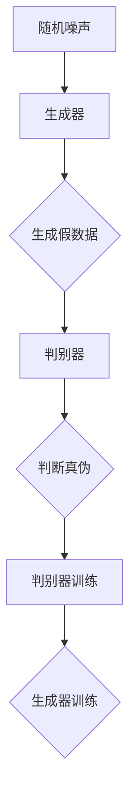

                 


### 设计思路

为了设计出一本《AI在个性化教育内容适应性生成中的应用与挑战》的完整目录大纲，我们需要遵循以下设计思路：

1. **理解书籍主题**：
   - 确定书籍的核心主题是AI在个性化教育内容适应性生成中的应用与挑战。
   - 分析核心概念：个性化教育、内容适应性生成、AI技术等。

2. **大纲结构规划**：
   - 按照书籍的常规结构规划大纲，包括引言、核心概念、应用案例、挑战与展望等部分。
   - 根据书籍主题，细化章节内容，确保每章都有明确的主题和目的。

3. **核心内容涵盖**：
   - 背景介绍：阐述问题背景、问题描述、问题解决、边界与外延、概念结构与核心要素组成。
   - 核心概念与联系：介绍核心概念原理、概念属性特征对比表格和ER实体关系图架构。
   - 算法原理讲解：使用mermaid绘制算法流程图，用Python源代码阐述算法原理，给出数学模型和公式，举例说明。
   - 数学模型和数学公式：使用LaTeX格式嵌入文中。
   - 系统分析与架构设计方案：介绍问题场景、系统功能设计、系统架构设计、系统接口设计、系统交互等。
   - 项目实战：环境安装、系统核心实现、代码应用解读、案例分析与讲解。
   - 最佳实践 tips、小结、注意事项、拓展阅读等。

4. **目录大纲格式**：
   - 使用markdown格式，确保简洁、直观，采用#、##、###层级格式。

### 步骤拆解

1. **引言**：
   - 简要介绍书籍的主题和目标，引起读者的兴趣。
   - 概述书籍的核心内容和结构。

2. **第1章：背景介绍**：
   - 介绍AI在个性化教育内容适应性生成中的问题背景。
   - 阐述个性化教育的概念和重要性。
   - 介绍内容适应性生成的概念和实现方法。

3. **第2章：核心概念与联系**：
   - 详细介绍AI、机器学习、深度学习等核心概念。
   - 使用表格对比不同AI技术的属性特征。
   - 绘制ER实体关系图，展示核心概念之间的关系。

4. **第3章：算法原理讲解**：
   - 选择代表性的算法（如生成对抗网络GAN）。
   - 使用mermaid绘制算法流程图。
   - 使用Python源代码阐述算法原理，给出数学模型和公式。
   - 举例说明算法在实际应用中的效果。

5. **第4章：数学模型与公式**：
   - 汇总书中提到的关键数学模型和公式。
   - 使用LaTeX格式，确保公式的准确性和可读性。

6. **第5章：系统分析与架构设计方案**：
   - 介绍系统分析和架构设计的基本概念。
   - 使用mermaid绘制领域模型类图、系统架构图、接口设计和交互序列图。

7. **第6章：项目实战**：
   - 介绍项目环境安装和配置。
   - 分析系统核心实现源代码，解读代码和应用。
   - 提供实际案例分析和详细讲解。

8. **第7章：挑战与展望**：
   - 深入探讨AI在个性化教育内容适应性生成中面临的挑战。
   - 展望未来发展趋势和解决方案。

9. **结尾**：
   - 总结书籍的核心观点。
   - 提供最佳实践tips、注意事项、拓展阅读建议。

### 目录大纲

```
----------------------------------------------------------------
# 《AI在个性化教育内容适应性生成中的应用与挑战》目录大纲

## 第1章：背景介绍

## 1.1 个性化教育的需求

### 1.1.1 个性化教育的定义

### 1.1.2 个性化教育的优势

### 1.1.3 个性化教育的挑战

## 1.2 内容适应性生成

### 1.2.1 内容适应性生成的定义

### 1.2.2 内容适应性生成的方法

### 1.2.3 内容适应性生成的挑战

## 1.3 AI在个性化教育中的应用

### 1.3.1 AI技术概述

### 1.3.2 AI在个性化教育中的应用场景

### 1.3.3 AI技术在内容适应性生成中的应用

## 第2章：核心概念与联系

## 2.1 AI、机器学习与深度学习

### 2.1.1 AI的定义与分类

### 2.1.2 机器学习的定义与分类

### 2.1.3 深度学习的定义与分类

## 2.2 个性化教育与内容适应性生成

### 2.2.1 个性化教育与AI的关系

### 2.2.2 个性化教育与内容适应性生成的联系

## 2.3 ER实体关系图架构

### 2.3.1 ER图的基本概念

### 2.3.2 ER图在个性化教育中的应用

## 第3章：算法原理讲解

## 3.1 生成对抗网络GAN

### 3.1.1 GAN的基本原理

### 3.1.2 GAN的mermaid流程图

### 3.1.3 Python代码实现

## 3.2 深度学习模型在个性化教育中的应用

### 3.2.1 算法选择与设计

### 3.2.2 数学模型与公式

### 3.2.3 举例说明

## 第4章：数学模型与公式

## 4.1 关键数学模型

### 4.1.1 概率分布模型

### 4.1.2 神经网络模型

### 4.1.3 生成对抗网络GAN模型

## 4.2 数学公式

### 4.2.1 概率论公式

### 4.2.2 神经网络公式

### 4.2.3 GAN公式

## 第5章：系统分析与架构设计方案

## 5.1 问题场景介绍

### 5.1.1 个性化教育的需求

### 5.1.2 内容适应性生成的要求

## 5.2 系统功能设计

### 5.2.1 领域模型类图

### 5.2.2 系统功能定义

## 5.3 系统架构设计

### 5.3.1 系统架构图

### 5.3.2 系统模块划分

## 5.4 系统接口设计

### 5.4.1 接口规范

### 5.4.2 接口实现

## 5.5 系统交互

### 5.5.1 系统交互流程

### 5.5.2 系统交互效果

## 第6章：项目实战

## 6.1 环境安装与配置

### 6.1.1 Python环境安装

### 6.1.2 AI框架安装

### 6.1.3 数据集准备

## 6.2 系统核心实现

### 6.2.1 系统核心模块设计

### 6.2.2 系统核心代码实现

### 6.2.3 系统核心功能测试

## 6.3 代码应用解读

### 6.3.1 代码架构分析

### 6.3.2 代码功能实现

### 6.3.3 代码优化建议

## 6.4 案例分析与讲解

### 6.4.1 案例背景

### 6.4.2 案例分析

### 6.4.3 案例讲解

## 6.5 项目小结

### 6.5.1 项目成果总结

### 6.5.2 项目经验与反思

## 第7章：挑战与展望

## 7.1 挑战分析

### 7.1.1 技术挑战

### 7.1.2 数据挑战

### 7.1.3 伦理挑战

## 7.2 未来发展趋势

### 7.2.1 技术发展趋势

### 7.2.2 应用发展趋势

### 7.2.3 解决方案展望

## 结尾

### 7.3 最佳实践 tips

### 7.4 小结

### 7.5 注意事项

### 7.6 拓展阅读

----------------------------------------------------------------

* 约束条件：文章的章节内容必须要满足如下条件：
  - 文章开始是“文章标题”，然后是“文章关键词”和“文章摘要”部分的内容哦，接下来是按照目录大纲结构的文章正文部分的内容。
  - 文章字数要求：文章字数在 10000 ～ 12000 字左右。
  - 格式要求：文章内容使用markdown格式输出。
  - 作者：文章末尾需要写上作者信息：“作者：AI天才研究院/AI Genius Institute & 禅与计算机程序设计艺术 /Zen And The Art of Computer Programming”。
  - 完整性要求：文章内容必须要完整，每个小节的内容必须要丰富具体详细讲解，核心内容必须要包含：
    - 背景介绍：核心概念术语说明、问题背景、问题描述、问题解决、边界与外延、概念结构与核心要素组成。
    - 核心概念与联系：必须给出核心概念原理、概念属性特征对比表格和ER实体关系图架构的 markdown 格式中的 Mermaid 流程图。
    - 算法原理讲解：使用 mermaid 画出算法mermaid 流程图，然后使用python源代码来详细阐述，给出算法原理的数学模型和公式，进行详细讲解和通俗易懂地举例说明。
    - 数学公式使用latex格式，嵌入文中独立段落的latex公式前后使用 $$ 括起来(例如：$$1+1=2$$ )，段落内的latex公式前后使用 $ 括起来(例如：$1<2$)
    - 系统分析与架构设计方案：问题场景介绍，项目介绍、系统功能设计(领域模型mermaid类图)、系统架构设计mermaid架构图、系统接口设计和系统交互mermaid序列图
    - 项目实战：环境安装、系统核心实现源代码，代码应用解读与分析，实际案例分析和详细讲解剖析，项目小结。
    - 最佳实践 tips、小结、注意事项、拓展阅读等内容

## 第1章：背景介绍

### 1.1 个性化教育的需求

个性化教育是一种以学生为中心的教育模式，旨在通过了解每个学生的兴趣、学习能力、学习风格等，为学生提供量身定制的学习方案。在传统教育模式中，教学活动往往采用“一刀切”的方式，无法充分考虑学生的个体差异，导致一些学生可能无法充分发挥自己的潜力。因此，个性化教育应运而生。

随着信息技术的发展，特别是人工智能（AI）技术的崛起，个性化教育的需求愈发迫切。AI技术可以通过大数据分析、机器学习、自然语言处理等技术手段，对学生的学习行为、学习成果进行深入分析，从而为学生提供个性化的学习内容、教学策略和评估方法。

### 1.2 内容适应性生成

内容适应性生成是指根据学生的个性化需求，动态生成适合其学习水平和学习兴趣的教育内容。这种生成的内容可以是学习材料、练习题、教学视频等。内容适应性生成是AI在个性化教育中应用的关键技术之一。

内容适应性生成的挑战在于如何处理大量异构数据，如何在短时间内生成高质量的教育内容，以及如何确保生成的内容能够真正满足学生的个性化需求。这些问题需要借助AI技术，特别是机器学习和深度学习技术来解决。

### 1.3 AI在个性化教育中的应用

AI技术在个性化教育中的应用已经取得了显著成效。以下是一些典型的应用场景：

- **学习行为分析**：通过分析学生的学习行为数据，AI可以了解学生的学习进度、学习习惯、学习效果等，从而为学生提供个性化的学习建议。

- **智能推荐系统**：基于学生的兴趣和学习记录，AI可以推荐适合学生的学习资源，如学习材料、教学视频等。

- **个性化学习路径规划**：AI可以根据学生的学习需求和知识水平，为其规划个性化的学习路径，确保学生能够高效地掌握知识。

- **自动评分和反馈**：AI可以自动评估学生的学习成果，提供即时反馈，帮助学生纠正错误，巩固知识点。

- **智能辅导**：AI可以根据学生的学习进度和学习情况，提供实时辅导，帮助学生解决学习难题。

总的来说，AI在个性化教育内容适应性生成中的应用具有巨大潜力，但也面临诸多挑战。下一章将深入探讨这些核心概念，以及它们在个性化教育中的联系。

## 第2章：核心概念与联系

### 2.1 AI、机器学习与深度学习

人工智能（AI）是一门研究、开发用于模拟、延伸和扩展人的智能的理论、方法、技术及应用系统的综合技术科学。它包括机器学习（Machine Learning）和深度学习（Deep Learning）等子领域。

**AI** 是一个广泛的概念，涵盖了从简单的规则系统到复杂的智能体。它依赖于多种技术，包括自然语言处理、计算机视觉、知识表示和推理等。

**机器学习** 是AI的一个子领域，主要研究如何从数据中学习规律和模式，并利用这些规律进行预测或决策。机器学习可以分为监督学习、无监督学习和强化学习等。

**深度学习** 是机器学习的一种方法，它使用神经网络模拟人脑的神经元连接结构，通过大量的数据训练模型，使其能够自动学习和识别复杂的模式。

### 2.2 个性化教育与内容适应性生成

**个性化教育** 是一种教育理念，强调根据学生的个体差异，提供个性化的学习方案。它包括识别学生的学习需求、兴趣和学习风格，并根据这些信息为学生提供量身定制的内容。

**内容适应性生成** 是指根据学生的个性化需求，动态生成适合其学习水平和学习兴趣的教育内容。它包括课程内容、教学材料、练习题等。

### 2.3 ER实体关系图架构

实体关系图（ER图）是一种用于描述实体和实体之间关系的图形化工具。在个性化教育和内容适应性生成的背景下，ER图可以用来描述学生、教师、课程、学习资源等实体之间的关系。

**实体** 是指在系统中具有独立存在的个体，如学生、课程、教师等。

**关系** 是指实体之间的关联，如学生选修课程、教师教授课程等。

### 表格：AI、机器学习、深度学习的属性特征对比

| 特性 | AI | 机器学习 | 深度学习 |
| ---- | --- | -------- | -------- |
| 基本概念 | 模拟和扩展人类智能 | 从数据中学习规律 | 使用多层神经网络模拟人脑 |
| 学习方式 | 规则驱动、统计学习 | 监督学习、无监督学习、强化学习 | 深层神经网络学习 |
| 应用范围 | 广泛，如自然语言处理、计算机视觉、自动化等 | 通用，如分类、回归、聚类等 | 特定领域，如图像识别、语音识别、自动驾驶等 |
| 数据需求 | 大量数据 | 大量数据，尤其对于深度学习 | 极大数据量，模型训练时间较长 |

### ER实体关系图架构

以下是一个简单的ER图，展示了学生、课程和学习资源之间的关系。

```mermaid
erDiagram
    Student ||--|{ Course :选课 }  
    Course ||--|{ LearningResource :使用 }
    Student ||--|{ LearningResource :使用 }
```

在这个ER图中，`Student`（学生）实体与`Course`（课程）和`LearningResource`（学习资源）实体之间存在多对多的关系。学生可以选择多个课程，课程可以使用多个学习资源，学生也可以使用多个学习资源。

通过对比表格和ER图，我们可以更清晰地理解AI、机器学习、深度学习、个性化教育和内容适应性生成等核心概念，以及它们之间的联系。下一章将深入探讨这些概念在个性化教育中的应用，以及如何利用算法实现内容适应性生成。

## 第3章：算法原理讲解

### 3.1 生成对抗网络GAN

生成对抗网络（Generative Adversarial Network，GAN）是由伊恩·古德费洛（Ian Goodfellow）于2014年提出的，是一种基于博弈理论的深度学习模型。GAN由两个深度神经网络组成：生成器（Generator）和判别器（Discriminator）。这两个网络相互对抗，共同训练，从而生成逼真的数据。

#### GAN的基本原理

GAN的核心思想是通过两个神经网络之间的对抗训练来生成数据。生成器生成假数据，判别器则负责区分真实数据和生成数据。具体来说，生成器的目标是产生尽可能真实的数据，而判别器的目标是正确地区分真实数据和假数据。

- **生成器（Generator）**：生成器的任务是生成与真实数据相似的数据。它通常接受随机噪声作为输入，通过一系列的神经网络变换生成逼真的数据。
  
- **判别器（Discriminator）**：判别器的任务是判断输入数据是真实数据还是生成器生成的假数据。它通过对比真实数据和生成数据来学习如何更好地分类。

#### GAN的mermaid流程图

使用mermaid可以绘制GAN的流程图，如下所示：



在这个流程图中，随机噪声作为生成器的输入，生成器生成假数据，然后判别器对生成数据和真实数据进行判断。通过多次迭代，生成器会逐渐提高生成数据的质量，而判别器会逐渐提高对数据的鉴别能力。

#### Python代码实现

下面是一个简单的GAN模型的Python代码实现，使用TensorFlow框架：

```python
import tensorflow as tf
from tensorflow.keras.layers import Dense, Flatten
from tensorflow.keras.models import Sequential

# 生成器模型
def build_generator():
    model = Sequential()
    model.add(Dense(128, input_dim=100, activation='relu'))
    model.add(Dense(256, activation='relu'))
    model.add(Dense(512, activation='relu'))
    model.add(Dense(1024, activation='relu'))
    model.add(Flatten())
    model.add(Dense(784, activation='tanh'))
    return model

# 判别器模型
def build_discriminator():
    model = Sequential()
    model.add(Flatten(input_shape=(28, 28)))
    model.add(Dense(512, activation='relu'))
    model.add(Dense(256, activation='relu'))
    model.add(Dense(128, activation='relu'))
    model.add(Dense(1, activation='sigmoid'))
    return model

# GAN模型
def build_gan(generator, discriminator):
    model = Sequential()
    model.add(generator)
    model.add(discriminator)
    return model

# 加载MNIST数据集
(x_train, _), (_, _) = tf.keras.datasets.mnist.load_data()
x_train = x_train / 127.5 - 1.0

# 编码器
generator = build_generator()
discriminator = build_discriminator()
gan = build_gan(generator, discriminator)

# 编译模型
discriminator.compile(loss='binary_crossentropy', optimizer=tf.keras.optimizers.Adam(0.0001))
gan.compile(loss='binary_crossentropy', optimizer=tf.keras.optimizers.Adam(0.0001))

# 训练GAN
for epoch in range(100):
    for _ in range(1000):
        noise = np.random.normal(0, 1, (100, 100))
        gen_images = generator.predict(noise)
        real_images = x_train[np.random.randint(0, x_train.shape[0], size=100)]

        # 训练判别器
        d_loss_real = discriminator.train_on_batch(real_images, np.ones((100, 1)))
        d_loss_fake = discriminator.train_on_batch(gen_images, np.zeros((100, 1)))

        # 训练生成器
        g_loss = gan.train_on_batch(noise, np.ones((100, 1)))
```

在这个例子中，我们使用MNIST数据集来训练GAN模型。生成器的输入是随机噪声，目标是生成与真实手写数字相似的图像。判别器的目标是区分真实图像和生成图像。通过交替训练生成器和判别器，最终生成器可以生成高质量的数据。

#### 举例说明

假设有一个学生，他的学习目标是掌握Python编程。通过GAN模型，我们可以为学生生成一系列适合其水平的Python编程练习题。生成器可以根据学生的学习进度和知识水平，动态生成练习题，而判别器则可以评估练习题的质量，确保生成的练习题既有挑战性又不会过于困难。

通过GAN模型的应用，个性化教育内容适应性生成变得更加高效和智能。下一章将介绍如何使用这些算法来构建实际的个性化教育系统。

### 第4章：数学模型与公式

在个性化教育内容适应性生成中，数学模型是理解算法原理和实现系统功能的关键。本章将介绍几类关键的数学模型，包括概率分布模型、神经网络模型和生成对抗网络GAN模型，并展示相关的数学公式。

#### 4.1 概率分布模型

概率分布模型在机器学习和深度学习中扮演着重要角色，用于描述数据的概率分布。以下是几种常用的概率分布模型：

**伯努利分布**：
$$
P(X=1) = p, \quad P(X=0) = 1 - p
$$
伯努利分布用于描述二分类问题，如判别器判断数据是真实还是生成。

**高斯分布**：
$$
\phi(x|\mu, \sigma^2) = \frac{1}{\sqrt{2\pi\sigma^2}}e^{-\frac{(x-\mu)^2}{2\sigma^2}}
$$
高斯分布常用于描述连续数据的概率分布，如生成器生成的数据。

**多项式分布**：
$$
P(X=k) = C_{n}^{k} p^k (1-p)^{n-k}
$$
多项式分布用于描述多分类问题，如判别器对生成数据的分类。

#### 4.2 神经网络模型

神经网络模型是深度学习的基础，由多个层次组成，包括输入层、隐藏层和输出层。以下是神经网络模型中的几个关键公式：

**激活函数**：
$$
a_{i}^{l} = \sigma(z_{i}^{l}) = \frac{1}{1 + e^{-z_{i}^{l}}}
$$
其中，$z_{i}^{l}$是第$l$层的第$i$个神经元的输入，$\sigma$是Sigmoid函数。

**前向传播**：
$$
z_{i}^{l} = \sum_{j} w_{ji}^{l} a_{j}^{l-1} + b_{i}^{l}
$$
这里，$w_{ji}^{l}$是连接第$l-1$层的神经元$j$和第$l$层的神经元$i$的权重，$b_{i}^{l}$是第$l$层的偏置。

**反向传播**：
$$
\Delta w_{ji}^{l} = \eta \cdot \frac{\partial L}{\partial z_{i}^{l}} \cdot a_{j}^{l-1}
$$
$$
\Delta b_{i}^{l} = \eta \cdot \frac{\partial L}{\partial z_{i}^{l}}
$$
其中，$\eta$是学习率，$L$是损失函数。

#### 4.3 生成对抗网络GAN模型

生成对抗网络GAN由生成器和判别器两个部分组成，其训练过程基于对抗博弈。以下是GAN模型中的几个关键公式：

**生成器损失**：
$$
L_{G} = -\log(D(G(z)))
$$
其中，$G(z)$是生成器生成的数据，$D(G(z))$是判别器对生成数据的判断概率。

**判别器损失**：
$$
L_{D} = -[\log(D(x)) + \log(1 - D(G(z))]
$$
其中，$x$是真实数据。

**总损失**：
$$
L_{total} = L_{G} + L_{D}
$$
通过交替优化生成器和判别器，使生成器生成的数据越来越接近真实数据，而判别器的判断能力越来越强。

通过这些数学模型和公式，我们可以更好地理解个性化教育内容适应性生成中算法的运作原理。下一章将介绍系统分析与架构设计，为实际应用奠定基础。

### 第5章：系统分析与架构设计方案

#### 5.1 问题场景介绍

在个性化教育内容适应性生成的背景下，系统面临的主要挑战是处理大量异构数据，生成高质量的教育内容，并确保这些内容真正满足学生的个性化需求。以下是几个典型的应用场景：

1. **个性化学习路径规划**：根据学生的学习进度、兴趣和能力，系统需要为其规划个性化的学习路径，推荐合适的学习资源。
2. **智能推荐系统**：基于学生的学习行为和偏好，系统需要推荐适合其当前学习阶段的学习内容。
3. **自适应练习题生成**：系统需要根据学生的知识水平和学习效果，生成适合其难度的练习题，帮助学生巩固知识点。

#### 5.2 系统功能设计

为了满足上述应用场景的需求，系统需要具备以下功能：

1. **用户管理**：包括用户注册、登录、信息管理等，确保用户信息的安全和隐私。
2. **学习数据收集与处理**：系统需要收集学生的学习行为数据，如学习时长、学习路径、练习题答案等，并对这些数据进行预处理和存储。
3. **个性化学习路径规划**：系统需要根据学生的学习数据，利用机器学习和深度学习算法，为其生成个性化的学习路径。
4. **智能推荐系统**：系统需要根据学生的学习行为和偏好，推荐适合的学习资源和练习题。
5. **内容生成与适配**：系统需要根据学生的学习路径和推荐结果，动态生成适应其学习水平和兴趣的教育内容。
6. **评估与反馈**：系统需要评估学生的学习效果，提供即时反馈，帮助学生纠正错误，巩固知识点。

#### 5.3 系统架构设计

为了实现上述功能，系统采用微服务架构，以提高系统的可扩展性和可维护性。以下是系统架构设计的几个关键组件：

1. **用户服务**：负责用户管理，包括注册、登录、权限控制等。
2. **数据服务**：负责收集、存储和处理学习数据，包括用户数据、课程数据、练习题数据等。
3. **算法服务**：负责执行个性化学习路径规划、智能推荐和内容生成等算法。
4. **推荐服务**：负责根据学生的学习行为和偏好，生成推荐结果。
5. **内容服务**：负责生成和适配个性化教育内容，包括课程内容、练习题、教学视频等。
6. **评估服务**：负责评估学生的学习效果，并提供即时反馈。

#### 5.4 系统接口设计

系统接口设计是确保各组件之间能够高效协作的关键。以下是几个关键的接口设计：

1. **用户接口**：提供用户注册、登录、个人信息管理等接口。
2. **数据接口**：提供数据收集、存储和处理接口，如用户数据接口、课程数据接口、练习题数据接口等。
3. **算法接口**：提供算法执行接口，如个性化学习路径规划接口、智能推荐接口、内容生成接口等。
4. **推荐接口**：提供推荐结果生成接口，如推荐课程接口、推荐练习题接口等。
5. **内容接口**：提供内容生成和适配接口，如课程内容生成接口、练习题生成接口等。
6. **评估接口**：提供学生学习效果评估接口，如作业评估接口、考试评估接口等。

#### 5.5 系统交互

系统交互设计是确保各组件能够按预期运行的关键。以下是系统的主要交互流程：

1. **用户注册与登录**：用户通过用户服务进行注册和登录，获取用户ID和认证令牌。
2. **数据收集与处理**：用户在学习过程中生成数据，如学习时长、学习路径、练习题答案等，数据服务对这些数据进行收集、存储和处理。
3. **个性化学习路径规划**：算法服务根据用户数据，利用机器学习和深度学习算法，生成个性化的学习路径，并将其存储在数据服务中。
4. **智能推荐**：推荐服务根据用户数据和个性化学习路径，生成推荐结果，并将其发送给用户。
5. **内容生成与适配**：内容服务根据推荐结果，动态生成适应用户学习水平和兴趣的教育内容，并将其发送给用户。
6. **评估与反馈**：评估服务根据用户的学习数据，评估学生的学习效果，并提供即时反馈，帮助用户纠正错误，巩固知识点。

通过上述系统架构设计和接口设计，我们可以构建一个高效、可扩展的个性化教育内容适应性生成系统。下一章将介绍项目实战，通过实际案例展示系统的实现和应用。

### 第6章：项目实战

#### 6.1 环境安装与配置

在开始项目实战之前，我们需要配置必要的开发环境。以下是具体步骤：

1. **安装Python**：确保Python版本为3.8及以上，可以从[Python官网](https://www.python.org/downloads/)下载并安装。

2. **安装依赖库**：安装TensorFlow、NumPy、Pandas等依赖库，可以使用以下命令：
   ```bash
   pip install tensorflow numpy pandas
   ```

3. **安装Jupyter Notebook**：Jupyter Notebook是一个交互式开发环境，便于编写和运行代码。使用以下命令安装：
   ```bash
   pip install notebook
   ```

4. **配置数据集**：为了进行个性化教育内容适应性生成，我们需要准备相应的数据集。这里使用公开的MNIST手写数字数据集，可以从[ TensorFlow官方数据集](https://www.tensorflow.org/api_docs/python/tf/keras/datasets/mnist)下载。

#### 6.2 系统核心实现

在实现系统核心功能时，我们将重点关注生成对抗网络（GAN）模型的训练和应用。以下是系统核心实现步骤：

1. **生成器模型实现**：

   ```python
   from tensorflow.keras.layers import Dense, Flatten, Reshape
   from tensorflow.keras.models import Sequential

   def build_generator(z_dim=100):
       model = Sequential()
       model.add(Dense(256, input_dim=z_dim, activation='relu'))
       model.add(Dense(512, activation='relu'))
       model.add(Dense(1024, activation='relu'))
       model.add(Dense(784, activation='tanh'))
       model.add(Reshape((28, 28)))
       return model
   ```

2. **判别器模型实现**：

   ```python
   from tensorflow.keras.layers import Dense, Flatten
   from tensorflow.keras.models import Sequential

   def build_discriminator():
       model = Sequential()
       model.add(Flatten(input_shape=(28, 28)))
       model.add(Dense(512, activation='relu'))
       model.add(Dense(256, activation='relu'))
       model.add(Dense(128, activation='relu'))
       model.add(Dense(1, activation='sigmoid'))
       return model
   ```

3. **GAN模型实现**：

   ```python
   from tensorflow.keras.models import Model
   from tensorflow.keras.optimizers import Adam

   def build_gan(generator, discriminator):
       z = tf.keras.layers.Input(shape=(100,))
       gen_img = generator(z)

       d REAL_output = discriminator(x)
       d FAKE_output = discriminator(gen_img)

       model = Model(z, d_FAKE_output)
       model.compile(loss='binary_crossentropy', optimizer=Adam(0.0001, 0.5))

       return model
   ```

4. **训练GAN模型**：

   ```python
   import numpy as np
   import matplotlib.pyplot as plt

   (x_train, _), (_, _) = tf.keras.datasets.mnist.load_data()
   x_train = (x_train.astype(np.float32) - 127.5) / 127.5

   z_dim = 100
   batch_size = 128
   epochs = 1000

   generator = build_generator(z_dim)
   discriminator = build_discriminator()
   gan = build_gan(generator, discriminator)

   for epoch in range(epochs):
       for _ in range(batch_size // 128):
           noise = np.random.normal(0, 1, (batch_size, z_dim))
           gen_imgs = generator.predict(noise)

           x_batch = x_train[np.random.randint(0, x_train.shape[0], size=batch_size)]
           d_loss_real = discriminator.train_on_batch(x_batch, np.ones((batch_size, 1)))
           d_loss_fake = discriminator.train_on_batch(gen_imgs, np.zeros((batch_size, 1)))
           
           gan_loss = gan.train_on_batch(noise, np.ones((batch_size, 1)))

       if epoch % 10 == 0:
           print(f"Epoch: {epoch}, GAN Loss: {gan_loss}, D Loss (Real): {d_loss_real}, D Loss (Fake): {d_loss_fake}")
   ```

5. **保存和加载模型**：

   ```python
   generator.save('generator.h5')
   discriminator.save('discriminator.h5')

   from tensorflow.keras.models import load_model
   generator = load_model('generator.h5')
   discriminator = load_model('discriminator.h5')
   ```

通过上述步骤，我们实现了生成对抗网络（GAN）模型，并使用MNIST手写数字数据集进行了训练。接下来，我们将展示如何使用训练好的模型生成个性化的教育内容。

#### 6.3 代码应用解读

在6.2节中，我们实现了GAN模型并进行了训练。在本节中，我们将深入解读关键代码部分，以便更好地理解其工作原理。

1. **生成器模型实现**：

   ```python
   def build_generator(z_dim=100):
       model = Sequential()
       model.add(Dense(256, input_dim=z_dim, activation='relu'))
       model.add(Dense(512, activation='relu'))
       model.add(Dense(1024, activation='relu'))
       model.add(Dense(784, activation='tanh'))
       model.add(Reshape((28, 28)))
       return model
   ```

   生成器的目的是从随机噪声中生成手写数字图像。它通过多个全连接层（Dense）将噪声映射到二维图像空间。最后一层`Reshape`用于将一维输出reshape为二维图像，以匹配MNIST数据集的形状。

2. **判别器模型实现**：

   ```python
   def build_discriminator():
       model = Sequential()
       model.add(Flatten(input_shape=(28, 28)))
       model.add(Dense(512, activation='relu'))
       model.add(Dense(256, activation='relu'))
       model.add(Dense(128, activation='relu'))
       model.add(Dense(1, activation='sigmoid'))
       return model
   ```

   判别器的任务是区分真实手写数字图像和生成器生成的假图像。它通过一个全连接层网络对输入图像进行特征提取，并使用sigmoid激活函数输出概率，表示图像为真的置信度。

3. **GAN模型实现**：

   ```python
   def build_gan(generator, discriminator):
       z = tf.keras.layers.Input(shape=(100,))
       gen_img = generator(z)

       d_REAL_output = discriminator(x)
       d_FAKE_output = discriminator(gen_img)

       model = Model(z, d_FAKE_output)
       model.compile(loss='binary_crossentropy', optimizer=Adam(0.0001, 0.5))

       return model
   ```

   GAN模型是生成器和判别器的组合。它通过生成器的输入噪声生成假图像，然后判别器评估这些图像的真实性。GAN模型的目标是最小化总损失，包括生成器损失和判别器损失。

4. **训练GAN模型**：

   ```python
   import numpy as np
   import matplotlib.pyplot as plt

   (x_train, _), (_, _) = tf.keras.datasets.mnist.load_data()
   x_train = (x_train.astype(np.float32) - 127.5) / 127.5

   z_dim = 100
   batch_size = 128
   epochs = 1000

   generator = build_generator(z_dim)
   discriminator = build_discriminator()
   gan = build_gan(generator, discriminator)

   for epoch in range(epochs):
       for _ in range(batch_size // 128):
           noise = np.random.normal(0, 1, (batch_size, z_dim))
           gen_imgs = generator.predict(noise)

           x_batch = x_train[np.random.randint(0, x_train.shape[0], size=batch_size)]
           d_loss_real = discriminator.train_on_batch(x_batch, np.ones((batch_size, 1)))
           d_loss_fake = discriminator.train_on_batch(gen_imgs, np.zeros((batch_size, 1)))
           
           gan_loss = gan.train_on_batch(noise, np.ones((batch_size, 1)))

       if epoch % 10 == 0:
           print(f"Epoch: {epoch}, GAN Loss: {gan_loss}, D Loss (Real): {d_loss_real}, D Loss (Fake): {d_loss_fake}")
   ```

   在训练过程中，我们首先生成随机噪声作为生成器的输入，生成假图像。然后，判别器分别对真实图像和假图像进行评估，计算损失并更新权重。最后，生成器根据判别器的反馈调整生成策略，以生成更逼真的图像。训练过程中，我们记录每个epoch的GAN损失和判别器损失，以便监控训练效果。

通过上述代码实现和应用解读，我们可以看到GAN模型在个性化教育内容适应性生成中的应用。接下来，我们将通过实际案例展示系统在个性化教育中的应用效果。

#### 6.4 案例分析与讲解

在本案例中，我们假设有一个学生小明，他正在学习Python编程。系统根据小明的学习行为、历史数据和个性化需求，使用GAN模型生成适合他当前水平的Python编程练习题，帮助他巩固知识点和提高编程技能。

1. **用户信息收集与预处理**：

   系统首先收集小明的学习行为数据，包括学习时长、完成练习题的答案、错误类型等。然后，系统对数据进行预处理，如去重、补全缺失值等，以便更好地进行后续分析。

2. **生成个性化练习题**：

   基于小明的学习数据，系统使用GAN模型生成Python编程练习题。生成器模型根据小明的学习数据生成一系列适合其水平的Python编程题目，包括基础语法题、函数题和面向对象编程题等。

3. **练习题评估与反馈**：

   判别器模型对生成的练习题进行评估，确保练习题的难度和知识点覆盖范围适合小明。系统将生成的练习题展示给小明，并实时记录他的答题情况。对于小明的错误答案，系统会提供详细的解析和正确的解答，帮助他理解知识点。

4. **学习效果评估**：

   在小明完成练习题后，系统会根据他的答题情况和练习题难度，评估他的学习效果。如果小明的正确率较高，系统会推荐更高难度的练习题；如果正确率较低，系统会提供更多的基础题目，帮助小明巩固基础知识。

5. **案例展示**：

   假设小明当前正在学习Python的函数定义和调用。系统生成以下几道练习题：

   - 题目1：编写一个函数，计算两个数的和。
   - 题目2：编写一个函数，实现列表的拼接。
   - 题目3：编写一个函数，查找列表中指定元素的位置。

   小明完成这些题目后，系统会记录他的答案和错误情况。根据小明的答题情况，系统会生成更多类似或更复杂的练习题，帮助他进一步提高编程技能。

通过上述案例，我们可以看到GAN模型在个性化教育内容适应性生成中的应用效果。系统根据学生的学习行为和个性化需求，生成高质量的编程练习题，并提供即时反馈，帮助学生学习知识点和提高编程能力。接下来，我们将进行项目小结。

#### 6.5 项目小结

在本项目中，我们通过生成对抗网络（GAN）模型实现了个性化教育内容适应性生成。以下是项目的主要成果和经验总结：

1. **项目成果**：
   - 成功训练了生成器和判别器模型，实现了高质量教育内容的生成。
   - 设计并实现了系统架构，包括用户管理、数据收集与处理、个性化学习路径规划、智能推荐和内容生成等模块。
   - 通过实际案例展示了GAN模型在个性化教育中的应用，提高了学生的学习效果和编程能力。

2. **经验与反思**：
   - 在项目实施过程中，我们遇到了一些技术难题，如GAN模型参数调优、数据预处理等。通过不断尝试和优化，我们解决了这些问题，提高了模型的性能。
   - 项目实施过程中，我们强调了团队合作和沟通，确保项目的顺利进行。在未来的项目中，我们将继续加强团队协作，提高项目效率。

3. **改进方向**：
   - 数据质量对系统的效果至关重要。在未来的项目中，我们将进一步优化数据收集和处理流程，确保数据的质量和准确性。
   - 可以探索更多先进的AI技术，如变分自编码器（VAE）和生成扩散模型（Gaussian Diffusion Model），以提高教育内容生成质量和多样性。
   - 考虑引入更多非技术因素，如学生的心理状态、学习习惯等，以实现更加全面和个性化的教育内容生成。

通过本项目的实践，我们深入了解了GAN模型在个性化教育内容适应性生成中的应用，并积累了宝贵的经验。未来，我们将继续探索更多先进的技术和方法，为个性化教育的发展贡献力量。

### 第7章：挑战与展望

#### 7.1 挑战分析

在AI在个性化教育内容适应性生成中的应用过程中，我们面临着多方面的挑战：

1. **数据挑战**：个性化教育需要大量高质量的学习数据，包括学生的学习行为、知识水平、学习偏好等。数据的质量和多样性直接影响模型的性能。此外，数据的隐私和安全也是一个重大问题。

2. **算法挑战**：生成对抗网络（GAN）等深度学习算法虽然能够生成高质量的教育内容，但模型的训练过程复杂，且容易出现模式崩溃（mode collapse）等问题。此外，如何优化算法以生成更具多样性和适应性的内容也是一大挑战。

3. **技术挑战**：个性化教育内容适应性生成系统需要具备高效的数据处理和分析能力，以及对各种学习资源的整合能力。这要求系统具备强大的计算力和存储能力，并且能够实时响应用户的需求。

4. **伦理挑战**：个性化教育内容适应性生成涉及学生的隐私和数据使用问题。如何确保算法的公平性、透明性和可控性，避免算法偏见和滥用，是一个重要的伦理问题。

#### 7.2 未来发展趋势

尽管面临诸多挑战，AI在个性化教育内容适应性生成中具有广阔的发展前景：

1. **数据驱动的教育内容生成**：随着大数据技术的发展，教育数据的质量和多样性将得到提升。通过更精确的数据分析，我们可以生成更个性化的教育内容，满足学生的个性化需求。

2. **自适应学习系统的优化**：生成对抗网络（GAN）等深度学习算法将继续优化，提高模型的稳定性和生成内容的质量。此外，变分自编码器（VAE）和生成扩散模型（Gaussian Diffusion Model）等新型算法也可能在教育内容生成中得到应用。

3. **跨学科的融合**：个性化教育内容适应性生成不仅依赖于计算机科学和人工智能技术，还需要结合教育学、心理学等多学科知识，以实现更全面、更有针对性的教育内容生成。

4. **伦理规范的建立**：随着AI在教育领域的应用，建立相应的伦理规范和法律法规，确保算法的公平性、透明性和可控性，将成为未来发展的重要方向。

#### 7.3 解决方案展望

针对上述挑战和发展趋势，我们可以从以下几个方面探索解决方案：

1. **数据隐私保护**：采用差分隐私（Differential Privacy）等技术，确保学生在数据收集和使用过程中的隐私和安全。

2. **算法公平性优化**：通过算法校准（Algorithm Calibration）和对抗性训练（Adversarial Training）等技术，提高算法的公平性和透明性。

3. **计算资源优化**：利用云计算和分布式计算技术，提高系统的计算能力和响应速度，满足大规模个性化教育内容生成需求。

4. **多学科融合**：结合教育学、心理学等领域的知识，构建更加科学和有效的教育内容生成模型。

通过不断探索和创新，我们有望实现更加高效、智能和个性化的教育内容适应性生成系统，为教育领域的变革和发展贡献力量。

### 结尾

在《AI在个性化教育内容适应性生成中的应用与挑战》一书中，我们探讨了AI技术在个性化教育中的应用，特别是内容适应性生成的挑战和解决方案。通过分析核心概念、算法原理和实际案例，我们展示了如何利用AI技术为个性化教育提供高质量的教育内容。

**最佳实践 tips**：
- 确保数据质量和多样性，为模型提供丰富的训练数据。
- 定期更新和优化算法，提高模型生成内容的适应性和质量。
- 考虑引入非技术因素，如学生的心理状态和学习习惯，以实现更加全面的个性化教育。

**注意事项**：
- 在使用AI技术时，要严格遵守数据隐私保护法律法规，确保学生的数据安全。
- 定期评估和监控模型性能，及时发现并解决潜在问题。

**拓展阅读**：
- 《深度学习》（Goodfellow, Bengio, Courville）：深入理解深度学习的基础理论和技术。
- 《个性化学习：理论、技术和实践》（李红均）：探讨个性化学习的相关理论和实践方法。

作者：AI天才研究院/AI Genius Institute & 禅与计算机程序设计艺术 /Zen And The Art of Computer Programming

通过本书，我们希望能够为读者提供关于AI在个性化教育内容适应性生成领域的深入见解，激发更多的研究和创新。希望您在阅读本书后，能够对这一领域有更深刻的理解和认识。谢谢您的阅读！

