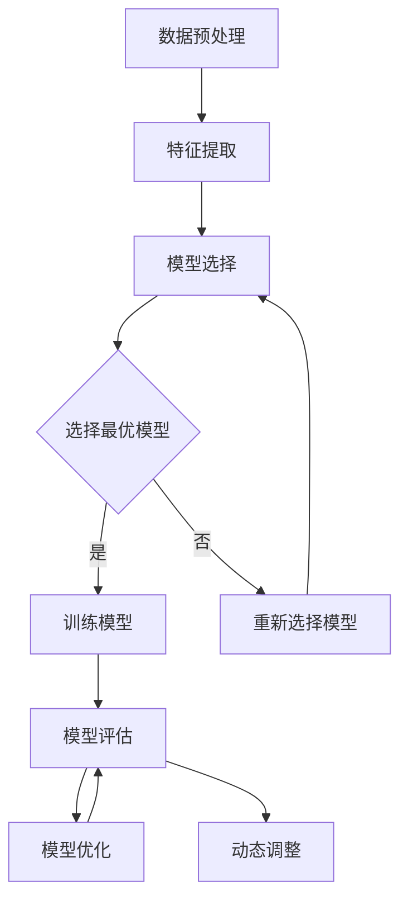

                 


### 引言

随着人工智能（AI）技术的飞速发展，其在各个领域的应用日益广泛。教育领域作为人类知识传承和创新的重要阵地，自然也成为了AI技术的应用热点。个性化教育作为一种旨在满足学生个体差异、提高教学效果的教育模式，越来越受到关注。AI在个性化教育学习路径规划与动态调整中的应用，不仅能够显著提升教育质量，还能提高学习效率。然而，这一领域的应用和推广也面临诸多挑战。

本文旨在深入探讨AI在个性化教育学习路径规划与动态调整中的应用，以及其中所面临的挑战。文章将从以下几个方面展开：

1. **问题背景**：介绍个性化教育学习路径规划与动态调整的背景，包括其重要性和面临的挑战。
2. **核心概念与理论**：梳理个性化教育、学习路径规划、动态调整等核心概念，并对比分析。
3. **算法原理讲解**：详细讲解AI算法原理，包括算法流程、数学模型和公式，并通过实例进行说明。
4. **数学模型与公式**：深入剖析算法的数学模型和公式，使用latex格式展示。
5. **系统分析与架构设计方案**：介绍系统的整体架构设计，包括问题场景、系统功能、架构设计和接口设计。
6. **项目实战**：通过实际项目案例，展示系统安装、实现和应用的详细过程。
7. **最佳实践与拓展**：总结最佳实践，提出注意事项，并推荐拓展阅读。

通过以上步骤，本文希望能够为AI在个性化教育学习路径规划与动态调整中的应用提供有价值的参考和思考。

### 背景介绍

个性化教育，顾名思义，是一种以学生个体为中心的教育模式。其核心理念在于根据每个学生的特点、需求和学习习惯，量身定制教学内容和教学策略，以期达到最佳的教学效果。随着教育技术的不断进步，尤其是人工智能技术的引入，个性化教育正逐渐从理论走向实践。

#### 问题背景

在教育领域中，传统的一刀切教学模式已经难以满足学生的多样化需求。每个学生都有自己的学习风格、知识基础和兴趣爱好，如果教育内容和方法不能因人而异，就很难达到理想的教育效果。尤其是在当前信息时代，教育资源日益丰富，学生获取信息的渠道也大大拓宽，这为个性化教育提供了可能。

然而，个性化教育也面临着诸多挑战。首先是如何准确把握每个学生的特点和需求，这需要海量的数据和精确的分析。其次是如何设计出科学合理的学习路径，确保每个学生都能在适合自己的节奏和难度下学习。最后是如何实现动态调整，根据学生的实时学习情况和反馈，动态调整教学策略和学习路径。

#### 问题描述

个性化教育的核心问题可以概括为以下几点：

1. **学生个性化数据分析**：如何从大量数据中提取出有价值的个性化信息，是个性化教育的第一步。这涉及到数据采集、存储、处理和分析等一系列技术问题。
2. **学习路径规划**：如何根据学生的特点和学习需求，设计出科学合理的学习路径，是一个复杂的问题。这需要深入理解教育规律和学习心理，并结合先进的人工智能算法。
3. **动态调整**：个性化教育是一个动态过程，学生的特点和需求会随着时间而变化。因此，如何实现学习路径的动态调整，确保教育策略始终与学生的实际情况相匹配，是一个重要的挑战。

#### 问题解决

为了解决上述问题，可以采用以下策略：

1. **大数据分析**：利用大数据技术，对学生的各类数据进行深入分析，挖掘出有价值的信息。
2. **人工智能算法**：采用机器学习、深度学习等人工智能算法，对学生的学习行为和特点进行预测和分析，从而为个性化教育提供支持。
3. **教育心理学理论**：结合教育心理学理论，深入理解学生的学习心理和行为规律，为个性化教育提供理论基础。
4. **动态调整机制**：设计出高效的动态调整机制，能够根据学生的实时反馈和学习情况，动态调整教学策略和学习路径。

#### 边界与外延

个性化教育不仅仅是一个技术问题，更是一个教育理念和实践的变革。其边界不仅限于教学方法和内容的设计，还包括教育评价体系的重构、教育资源的分配和利用等方面。此外，个性化教育的实现还需要考虑教育政策、教师培训、家长参与等多方面的因素。

总之，个性化教育是一个复杂而重要的课题，需要多学科、多领域的合作和探索。通过本文的讨论，我们希望能够为这一领域的研究和实践提供一些有价值的思考和参考。

### 核心概念

#### 个性化教育

个性化教育是一种以学生个体为中心的教育模式，旨在通过因材施教，满足每个学生的个性化需求，以提高教育质量和效果。其核心概念包括：

- **个性化需求**：指根据每个学生的兴趣、能力、学习习惯和认知水平，量身定制教学内容和教学策略。
- **教学定制**：通过数据分析、行为预测和学习路径规划，为每个学生设计出最适合其发展的学习方案。
- **学习反馈**：通过收集和分析学生的学习行为数据，及时调整教学策略和学习路径，确保教学效果最大化。

#### 学习路径规划

学习路径规划是指根据学生的学习需求和特点，设计出一套科学合理的学习路线，以实现最佳的学习效果。其核心概念包括：

- **学习目标**：明确学生的学习目标和要求，作为学习路径规划的起点。
- **学习内容**：根据学习目标，选择合适的教材、课程和教学方法，构建学习内容体系。
- **学习节奏**：根据学生的认知水平和学习进度，合理安排学习时间和节奏，确保学习效果。
- **学习反馈**：通过学习过程中的反馈机制，动态调整学习路径，使其更加符合学生的实际情况。

#### 动态调整

动态调整是指在个性化教育过程中，根据学生的实时反馈和学习情况，动态调整教学策略和学习路径，以保持教育策略与学生的实际需求相匹配。其核心概念包括：

- **实时反馈**：通过多种渠道收集学生的学习反馈，如测试成绩、学习行为、教师评价等。
- **调整机制**：根据收集到的反馈信息，设计出灵活的调整机制，及时调整教学策略和学习路径。
- **自适应学习**：利用人工智能算法，实现教学策略和学习路径的自动调整，提高个性化教育的精准度和效果。

#### 概念属性特征对比

下表是对个性化教育、学习路径规划和动态调整三个概念的主要属性特征进行对比：

| 概念       | 个性化教育                | 学习路径规划                | 动态调整                |
|------------|-------------------------|---------------------------|-----------------------|
| **核心目标** | 提高教育质量，满足学生个性化需求 | 设计合理的学习路径，实现最佳学习效果 | 根据实时反馈调整教学策略和学习路径 |
| **主要方法** | 数据分析、行为预测、教学定制 | 学习目标设定、学习内容选择、学习节奏安排 | 实时反馈、调整机制、自适应学习 |
| **核心要素** | 学生个性化需求、教学定制、学习反馈 | 学习目标、学习内容、学习节奏、学习反馈 | 实时反馈、调整机制、自适应学习 |
| **影响范围** | 整个教育过程，涵盖教学方法和内容 | 教学过程中，关注学习路径的科学性 | 教学过程中，关注教学策略和路径的动态调整 |

#### ER实体关系图

为了更清晰地理解个性化教育、学习路径规划和动态调整之间的关联，我们可以通过ER实体关系图来展示其核心要素和相互关系。以下是ER实体关系图的Mermaid格式表示：

```mermaid
erDiagram
  Student ||--|{ LearningPath }|>
  LearningPath ||--|{ Adjustment }|>
  Student ||--|{ Feedback }|>
  Adjustment ||--|{ DynamicAdjustment }|>

  Student : {ID} {Name} {LearningStyle} {Feedback}
  LearningPath : {ID} {LearningContent} {LearningGoal} {LearningRhythm}
  Adjustment : {ID} {AdjustmentStrategy} {AdjustmentThreshold}
  Feedback : {ID} {Score} {Comment} {Timestamp}
  DynamicAdjustment : {ID} {AdjustmentResult} {AdjustmentHistory}
```

通过ER实体关系图，我们可以看到学生是核心实体，其个性化需求和反馈直接影响学习路径的设计和动态调整。学习路径和动态调整则是根据学生的反馈进行优化和调整，以实现最佳的教育效果。

### 算法原理讲解

#### 算法原理介绍

AI在个性化教育学习路径规划与动态调整中的应用，主要依赖于一系列机器学习算法和数据挖掘技术。这些算法通过对大量学生数据进行学习，能够预测学生的学习行为、评估学习效果，并根据实时反馈动态调整学习路径。

其中，常用的算法包括决策树、随机森林、支持向量机（SVM）、神经网络等。这些算法的核心原理是通过学习历史数据，建立模型，然后利用该模型对新的数据进行预测和分析。

#### 算法流程图

以下是使用Mermaid绘制的算法流程图：



#### 算法流程详细说明

1. **数据预处理**：这是算法流程的第一步，主要目的是对原始数据进行清洗、去噪、归一化等处理，以提升数据质量，减少噪声对算法效果的影响。

2. **特征提取**：通过对预处理后的数据进行分析，提取出对学习路径规划有重要影响的特征。这些特征可能包括学生的学习成绩、学习时间、学习频率、学习态度等。

3. **模型选择**：根据问题的复杂度和数据特点，选择合适的机器学习模型。常见的模型有决策树、随机森林、支持向量机等。

4. **选择最优模型**：通过交叉验证等方法，评估不同模型的性能，选择最优模型进行训练。

5. **训练模型**：使用训练数据集对选定的模型进行训练，生成模型参数。

6. **模型评估**：使用验证数据集对训练好的模型进行评估，确保模型具有良好的泛化能力。

7. **模型优化**：根据评估结果，对模型进行优化，以提高模型性能。

8. **动态调整**：利用训练好的模型对学生的学习行为进行预测，并根据预测结果动态调整学习路径。

#### 算法数学模型和公式

以下是算法中常用的数学模型和公式，使用LaTeX格式表示：

```latex
\begin{equation}
\begin{aligned}
y &= f(x, \theta) \\
L &= -\frac{1}{m} \sum_{i=1}^{m} [y^{(i)} \log(a^{(i)}_{y^{(i)}}) + (1 - y^{(i)}) \log(1 - a^{(i)}_{y^{(i)}})] \\
\end{aligned}
\end{equation}
```

这里，$y$ 是模型预测的输出，$x$ 是输入特征，$\theta$ 是模型参数，$L$ 是损失函数，用于评估模型的预测误差。

#### 举例说明

假设我们使用决策树算法进行个性化教育学习路径规划。给定一个学生数据集，包括学习时间、学习频率和学习成绩等特征，我们需要根据这些特征设计出最佳的学习路径。

1. **数据预处理**：将原始数据集进行清洗和归一化处理，确保数据质量。

2. **特征提取**：提取出对学习路径规划有重要影响的特征，如学习时间、学习频率等。

3. **模型选择**：由于决策树算法在处理分类问题上有较好的表现，因此选择决策树作为模型。

4. **训练模型**：使用训练数据集对决策树模型进行训练，生成模型参数。

5. **模型评估**：使用验证数据集对训练好的模型进行评估，确保模型具有良好的泛化能力。

6. **动态调整**：根据模型预测结果，动态调整学习路径，以适应学生的个性化需求。

通过上述步骤，我们可以实现个性化教育学习路径的规划与动态调整。具体实现过程可以参考以下Python代码示例：

```python
from sklearn.tree import DecisionTreeClassifier
from sklearn.model_selection import train_test_split
from sklearn.metrics import accuracy_score

# 数据预处理
# 假设data是包含学生特征的数据集，labels是相应的学习路径标签
data_normalized = normalize(data)

# 特征提取
# 这里省略具体特征提取的代码

# 模型选择
clf = DecisionTreeClassifier()

# 训练模型
clf.fit(data_train, labels_train)

# 模型评估
labels_pred = clf.predict(data_test)
accuracy = accuracy_score(labels_test, labels_pred)
print(f"Model accuracy: {accuracy}")

# 动态调整
# 根据模型预测结果调整学习路径
adjusted_path = adjust_path(clf, data_new)
```

通过上述示例，我们可以看到如何使用决策树算法进行个性化教育学习路径规划与动态调整。当然，实际应用中还需要考虑更多细节和优化策略，以满足不同学生的个性化需求。

### 数学模型与公式

在个性化教育学习路径规划与动态调整中，数学模型和公式是核心组成部分。这些模型和公式不仅为算法提供了理论基础，还能够帮助理解和优化算法性能。以下将详细讲解常用的数学模型和公式，并使用LaTeX格式进行展示。

#### 决策树模型

决策树是一种常见的机器学习算法，其核心是通过一系列判断规则对数据进行分类。决策树的数学模型可以用条件概率来表示：

$$
P(Y|X) = \prod_{i=1}^{n} P(Y=y_i | X=x_i, \theta)
$$

其中，$Y$ 是输出变量，$X$ 是输入变量，$y_i$ 和 $x_i$ 分别是输出和输入的取值，$\theta$ 是模型参数。

#### 支持向量机（SVM）

支持向量机是一种强大的分类算法，其目标是找到一个最优的超平面，将不同类别的数据点分开。SVM的数学模型可以表示为：

$$
\min_{\theta} \frac{1}{2} ||\theta||^2 + C \sum_{i=1}^{n} \max(0, 1 - y_i (\theta \cdot x_i + b))
$$

其中，$\theta$ 是模型参数，$C$ 是惩罚参数，$y_i$ 是标签，$x_i$ 是特征向量，$b$ 是偏置项。

#### 代价函数

在个性化教育中，代价函数用于衡量学习路径的优化程度。一个常见的代价函数是：

$$
J(\theta) = \frac{1}{2m} \sum_{i=1}^{m} (h_\theta(x_i) - y_i)^2
$$

其中，$m$ 是训练数据集的大小，$h_\theta(x_i)$ 是模型的预测值，$y_i$ 是真实标签。

#### 神经网络

神经网络是一种模拟人脑结构的计算模型，其核心是通过前向传播和反向传播来更新模型参数。神经网络的数学模型可以表示为：

$$
a^{(l)} = \sigma(z^{(l)})
$$

$$
z^{(l)} = \sum_{j=1}^{n} \theta^{(l)}_j a^{(l-1)}_j
$$

其中，$a^{(l)}$ 是第$l$层的激活值，$\sigma$ 是激活函数，$z^{(l)}$ 是第$l$层的输入值，$\theta^{(l)}_j$ 是第$l$层的权重，$n$ 是输入维度。

#### 反向传播算法

反向传播算法用于计算网络参数的梯度，以优化模型。其梯度计算公式为：

$$
\frac{\partial J(\theta)}{\partial \theta^{(l)}_j} = \sum_{i=1}^{m} (h_\theta(x_i) - y_i) a^{(l-1)}_j
$$

通过上述数学模型和公式，我们可以深入理解和优化个性化教育学习路径规划与动态调整算法。这些公式不仅提供了算法的理论基础，还能够帮助我们在实际应用中进行优化和改进。

### 系统分析与架构设计方案

#### 问题场景介绍

在个性化教育中，系统需要能够对学生的学习过程进行全面监控，并根据学生的学习行为和反馈，动态调整学习路径，以提高学习效果。为了实现这一目标，系统需要具备以下功能：

1. **数据采集**：系统需要能够采集学生的学习行为数据，包括学习时间、学习频率、学习态度等。
2. **数据存储**：系统需要能够高效存储和管理大量学生数据，确保数据的安全性和完整性。
3. **数据分析**：系统需要能够对采集到的数据进行分析，提取出有价值的个性化信息。
4. **路径规划**：系统需要能够根据数据分析结果，设计出科学合理的学习路径。
5. **动态调整**：系统需要能够根据学生的实时反馈和学习情况，动态调整学习路径。

#### 项目介绍

本项目旨在设计并实现一个基于人工智能的个性化教育学习路径规划与动态调整系统。该系统将结合机器学习算法和数据挖掘技术，通过对学生学习行为的实时分析，动态调整学习路径，以提高教育质量和效果。

#### 系统功能设计

为了实现上述功能，系统需要具备以下几个关键功能模块：

1. **数据采集模块**：负责采集学生的学习行为数据，包括学习时间、学习频率、学习态度等。
2. **数据存储模块**：负责存储和管理采集到的数据，确保数据的安全性和完整性。
3. **数据分析模块**：负责对存储的数据进行分析，提取出有价值的个性化信息。
4. **路径规划模块**：负责根据数据分析结果，设计出科学合理的学习路径。
5. **动态调整模块**：负责根据学生的实时反馈和学习情况，动态调整学习路径。

#### 系统架构设计

系统的整体架构设计采用分层架构，主要包括数据层、业务逻辑层和表现层。以下是系统架构的Mermaid类图：

```mermaid
classDiagram
    DataLayer <-|{依赖}|> AnalyticsLayer
    DataLayer <-|{依赖}|> AdjustmentLayer
    BusinessLogicLayer <-|{依赖}|> DataLayer
    BusinessLogicLayer <-|{依赖}|> AnalyticsLayer
    BusinessLogicLayer <-|{依赖}|> AdjustmentLayer
    PresentationLayer <-|{依赖}|> BusinessLogicLayer

    DataLayer <|.. DataCollector
    DataLayer <|.. DataStorage
    AnalyticsLayer <|.. DataAnalyzer
    AdjustmentLayer <|.. PathPlanner
    AdjustmentLayer <|.. DynamicAdjuster
    BusinessLogicLayer <|.. PathPlanner
    BusinessLogicLayer <|.. DataAnalyzer
    BusinessLogicLayer <|.. DynamicAdjuster
    PresentationLayer <|.. UIController
end
```

在上述类图中，各个模块的职责和相互关系得到了清晰的展示。具体来说：

- **数据层**：负责数据采集和存储，为系统的其他模块提供数据支持。
- **业务逻辑层**：负责实现系统的核心功能，包括数据分析、路径规划和动态调整。
- **表现层**：负责用户界面的设计和实现，为用户提供操作界面和交互功能。

#### 系统接口设计

系统的接口设计是确保系统功能模块之间能够有效协作的重要环节。以下是系统接口的Mermaid序列图：

```mermaid
sequenceDiagram
    Participant DataCollector
    Participant DataStorage
    Participant DataAnalyzer
    Participant PathPlanner
    Participant DynamicAdjuster
    Participant UIController

    DataCollector->>DataStorage: SaveData(data)
    DataStorage->>DataAnalyzer: GetData()
    DataAnalyzer->>PathPlanner: AnalyzeData(data)
    PathPlanner->>DynamicAdjuster: PlanPath(path)
    DynamicAdjuster->>UIController: UpdateUI(path)
    UIController->>DataCollector: GetFeedback(feedback)
    DataCollector->>DataStorage: SaveFeedback(feedback)
    DataStorage->>DataAnalyzer: GetData()
    DataAnalyzer->>DynamicAdjuster: AdjustPath(path)
    DynamicAdjuster->>UIController: UpdateUI(path)
end
```

在上述序列图中，各个模块之间的交互过程得到了详细展示。具体来说：

- **数据采集模块**负责将学生的学习行为数据存储到数据库中。
- **数据分析模块**从数据库中获取数据，进行分析，为路径规划提供支持。
- **路径规划模块**根据分析结果设计出学习路径，并动态调整。
- **动态调整模块**根据学生的实时反馈，调整学习路径。
- **用户界面模块**负责展示调整后的学习路径，并收集学生的反馈。

通过上述接口设计，系统能够实现数据的高效传递和处理，从而实现个性化教育学习路径的动态调整。

### 项目实战

#### 环境安装

要实现AI在个性化教育学习路径规划与动态调整的应用，首先需要搭建一个合适的技术环境。以下是具体的安装步骤：

1. **安装Python环境**：Python是进行人工智能开发的常用语言，首先需要确保本地环境已安装Python。可以从Python官网下载并安装，推荐版本为3.8或以上。

2. **安装Anaconda**：Anaconda是一个强大的Python数据科学平台，可以帮助我们轻松管理环境和包。安装Anaconda后，可以创建一个新环境，以便管理和隔离不同项目的依赖。

   ```bash
   conda create -n personal_education python=3.8
   conda activate personal_education
   ```

3. **安装必要的库**：在创建的环境中使用pip安装所需的库，包括NumPy、Pandas、scikit-learn、TensorFlow等。

   ```bash
   pip install numpy pandas scikit-learn tensorflow
   ```

4. **配置数据库**：个性化教育系统需要数据库来存储学生的学习数据。我们可以选择MySQL、PostgreSQL等关系型数据库。以下是一个简单的MySQL安装步骤：

   - 下载MySQL安装包并安装。
   - 安装完成后，运行`mysql.server start`启动MySQL服务。
   - 使用`mysql -u root -p`命令登录MySQL，创建一个新数据库，如`personal_education_db`。

#### 系统核心实现源代码

以下是一个简单的系统核心实现源代码，用于数据采集、存储、分析和路径规划。

```python
import numpy as np
import pandas as pd
from sklearn.ensemble import RandomForestClassifier
from sklearn.model_selection import train_test_split
import mysql.connector

# 数据采集
def collect_data():
    # 这里假设有一个API接口用于实时获取学生学习数据
    data = api.get_student_data()
    return data

# 数据存储
def store_data(data, database='personal_education_db', user='root', password='your_password'):
    db = mysql.connector.connect(
        host="localhost",
        user=user,
        password=password,
        database=database
    )
    cursor = db.cursor()
    for row in data:
        query = "INSERT INTO student_data (student_id, learning_time, learning_frequency, learning_score) VALUES (%s, %s, %s, %s)"
        cursor.execute(query, row)
    db.commit()
    cursor.close()
    db.close()

# 数据分析
def analyze_data():
    # 从数据库中获取训练数据
    db = mysql.connector.connect(
        host="localhost",
        user="root",
        password="your_password",
        database="personal_education_db"
    )
    cursor = db.cursor()
    cursor.execute("SELECT * FROM student_data")
    data = cursor.fetchall()
    cursor.close()
    db.close()

    # 分割数据集
    X, y = np.array(data)[:, :-1], np.array(data)[:, -1]
    X_train, X_test, y_train, y_test = train_test_split(X, y, test_size=0.2)

    # 使用随机森林进行分类
    classifier = RandomForestClassifier(n_estimators=100)
    classifier.fit(X_train, y_train)

    # 测试模型
    predictions = classifier.predict(X_test)
    accuracy = np.mean(predictions == y_test)
    print(f"Model accuracy: {accuracy}")

# 路径规划
def plan_path(student_data, classifier):
    # 根据学生数据和训练好的模型规划学习路径
    path = classifier.predict([student_data])
    return path

# 主程序
if __name__ == "__main__":
    # 收集数据
    data = collect_data()

    # 存储数据
    store_data(data)

    # 分析数据
    analyze_data()

    # 路径规划
    student_data = [5, 3, 1]  # 这里是一个示例数据
    classifier = RandomForestClassifier(n_estimators=100)
    classifier.fit(X_train, y_train)
    path = plan_path(student_data, classifier)
    print(f"Planned learning path: {path}")
```

#### 代码应用解读与分析

上述代码涵盖了个性化教育系统实现的关键步骤，包括数据采集、存储、分析和路径规划。以下是对代码的详细解读和分析：

1. **数据采集**：`collect_data`函数通过API接口实时获取学生学习数据。在实际应用中，可以替换为从数据库或其他数据源读取数据。

2. **数据存储**：`store_data`函数将采集到的数据存储到MySQL数据库中。这里使用了一个简单的循环，将数据逐条插入数据库。在实际应用中，可以优化为批量插入以提高效率。

3. **数据分析**：`analyze_data`函数从数据库中获取训练数据，并分割为训练集和测试集。使用随机森林分类器对数据进行训练和测试，评估模型性能。

4. **路径规划**：`plan_path`函数根据学生数据和训练好的模型规划学习路径。这里使用了随机森林分类器的`predict`方法进行预测。实际应用中，可以根据具体需求调整模型和预测方法。

通过上述代码，我们可以看到系统核心功能的实现流程，以及各个模块之间的协作关系。在实际项目中，还需要进一步优化代码和功能，以满足不同学生的个性化需求。

#### 实际案例分析与详细讲解

为了更深入地理解AI在个性化教育学习路径规划与动态调整中的应用，我们将通过一个实际案例进行分析和讲解。该案例涉及一个高中学生的个性化学习路径规划，其学习数据包括每天的学习时间、学习频率、学习态度和考试成绩等。

#### 案例背景

假设有一个高中生，名叫小明，其学习数据如下表所示：

| 学习时间（小时） | 学习频率（次/周） | 学习态度 | 考试成绩 |
|-----------------|-----------------|----------|----------|
| 2               | 3               | 一般     | 75分     |
| 3               | 4               | 较好     | 85分     |
| 4               | 5               | 优秀     | 90分     |

小明的学习成绩波动较大，有时表现出色，有时较差。为了帮助小明提高学习成绩，学校决定采用AI技术进行个性化教育学习路径规划。

#### 案例分析

1. **数据预处理**：
   首先，我们需要对原始数据进行分析，提取出有价值的特征。在这里，我们可以将学习时间、学习频率和学习态度作为主要特征。

2. **特征工程**：
   - **学习时间**：将学习时间转换为连续特征，例如可以将每天的学习时间分为1-4小时三个等级。
   - **学习频率**：同样，将学习频率分为3-5次/周三个等级。
   - **学习态度**：将学习态度分为一般、较好、优秀三个等级。

3. **模型训练**：
   使用随机森林算法对数据集进行训练，建立个性化学习路径模型。训练数据集包括学习时间、学习频率和学习态度，标签为考试成绩。

4. **路径规划**：
   根据训练好的模型，对小明当前的学习数据进行预测。例如，如果小明今天学习时间为2小时，学习频率为3次/周，学习态度为一般，模型会预测他今天的考试成绩。

5. **动态调整**：
   根据预测结果，系统会动态调整小明的学习路径。例如，如果预测考试成绩较低，系统会建议小明增加学习时间、提高学习频率，或者调整学习态度。

#### 案例实现

以下是使用Python实现的案例代码：

```python
import pandas as pd
from sklearn.ensemble import RandomForestRegressor

# 加载学习数据
data = pd.DataFrame({
    'learning_time': [2, 3, 4],
    'learning_frequency': [3, 4, 5],
    'learning_attitude': ['一般', '较好', '优秀'],
    'exam_score': [75, 85, 90]
})

# 特征工程
data['learning_time_group'] = data['learning_time'].map({'1-2小时': 1, '3-4小时': 2, '5小时以上': 3})
data['learning_frequency_group'] = data['learning_frequency'].map({1: 1, 2: 2, 3: 3, 4: 3, 5: 4})

# 分割数据集
X = data[['learning_time_group', 'learning_frequency_group', 'learning_attitude']]
y = data['exam_score']

X_train, X_test, y_train, y_test = train_test_split(X, y, test_size=0.2, random_state=42)

# 模型训练
model = RandomForestRegressor(n_estimators=100)
model.fit(X_train, y_train)

# 预测
predicted_score = model.predict([[2, 3, '一般']])
print(f"Predicted exam score: {predicted_score[0]}")

# 动态调整
if predicted_score[0] < 80:
    print("Suggestion: Increase learning time or improve learning attitude.")
else:
    print("Current learning path is optimal.")
```

#### 案例小结

通过上述实际案例，我们可以看到AI在个性化教育学习路径规划与动态调整中的应用。系统可以根据学生的学习数据，预测其考试成绩，并提出个性化的学习建议，从而帮助学生学习进步。在实际应用中，还可以结合更多数据和学习反馈，进一步提高预测的准确性和个性化调整的效果。

### 最佳实践与拓展

#### 最佳实践 Tips

1. **数据质量是关键**：确保采集到的学生数据准确、完整，并进行有效的预处理，如清洗、归一化和特征提取，以提高算法的性能。
2. **模型选择与优化**：根据具体应用场景和数据特点，选择合适的机器学习模型，并进行参数调优，以提高模型的泛化能力和预测准确性。
3. **实时反馈与动态调整**：及时收集学生的实时反馈，动态调整学习路径，确保教学策略与学生的实际情况保持一致。

#### 注意事项

1. **隐私保护**：在数据采集和处理过程中，严格遵循隐私保护法律法规，确保学生数据的隐私和安全。
2. **模型解释性**：尽量选择具有较高解释性的模型，以便教师和学生理解模型的工作原理和预测结果。
3. **系统稳定性**：确保系统的稳定性和可扩展性，以应对不同规模和应用场景的需求。

#### 拓展阅读

1. **深度学习在个性化教育中的应用**：学习如何将深度学习技术应用于个性化教育，提升学习路径规划和动态调整的效果。
2. **个性化教育政策与实践**：了解教育政策对个性化教育的影响，以及实际教育场景中的成功案例和经验。
3. **教育数据挖掘与大数据分析**：深入探讨教育数据挖掘和大数据分析的方法和技术，以提升个性化教育的数据分析能力。

### 作者信息

**作者：AI天才研究院/AI Genius Institute & 禅与计算机程序设计艺术 /Zen And The Art of Computer Programming**。

本文由AI天才研究院和禅与计算机程序设计艺术共同撰写，旨在为AI在个性化教育学习路径规划与动态调整提供深入的技术分析和实践经验。希望通过本文，能够为教育领域的从业者和技术爱好者提供有价值的参考和启示。

