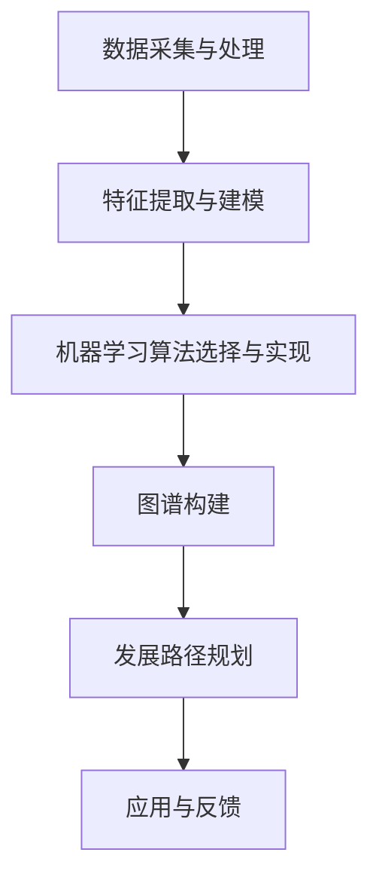

                 

### 文章标题

# AI在个性化职业技能图谱构建与发展路径规划中的应用

### 关键词

- 人工智能
- 个性化职业技能图谱
- 发展路径规划
- AI算法
- 数据处理
- 系统架构设计

### 摘要

本文深入探讨了人工智能在个性化职业技能图谱构建与发展路径规划中的应用。首先，我们介绍了人工智能对职业技能需求的影响以及个性化职业技能图谱的重要性。接着，我们定义了个性化职业技能图谱和发展路径规划的概念，并明确了问题的边界与外延。随后，本文详细讲解了个性化职业技能图谱的核心概念、属性特征对比以及ER实体关系图架构。在此基础上，我们探讨了AI在职业技能图谱构建和发展路径规划中的应用算法原理，包括数据采集与处理、特征提取与建模、机器学习算法的选择与实现等内容。最后，本文通过系统分析与架构设计方案、项目实战和最佳实践 tips，为读者提供了全面的技术指导和实际案例剖析。

## 目录大纲

#### 第一部分：背景介绍

1. **问题背景**
   - **1.1 人工智能的发展对职业技能需求的影响**
   - **1.2 个性化职业技能图谱的提出与重要性**
   - **1.3 AI在职业技能图谱构建中的应用现状与挑战**
2. **问题描述**
   - **1.2.1 个性化职业技能图谱的定义**
   - **1.2.2 发展路径规划的意义**
   - **1.2.3 问题的边界与外延**
3. **问题解决**
   - **1.3.1 个性化职业技能图谱构建的核心步骤**
   - **1.3.2 发展路径规划的策略与方法**
   - **1.3.3 AI技术在图谱构建和路径规划中的应用**
4. **核心概念与联系**
   - **1.4.1 个性化职业技能图谱的核心概念**

#### 第二部分：核心概念与联系

1. **个性化职业技能图谱核心概念原理**
   - **2.1 职业技能图谱的构成**
   - **2.2 个性化技能的需求分析**
   - **2.3 职业技能图谱构建的关键技术**
2. **概念属性特征对比表格**
   - **2.2.1 个性化职业技能图谱的属性特征**
   - **2.2.2 不同类型职业技能图谱的比较**
3. **ER实体关系图架构**
   - **2.3.1 职业技能图谱的ER图设计**
   - **2.3.2 实体关系图在图谱构建中的应用**

#### 第三部分：算法原理讲解

1. **AI在职业技能图谱构建中的应用算法原理**
   - **3.1.1 数据采集与处理**
   - **3.1.2 特征提取与建模**
   - **3.1.3 机器学习算法的选择与实现**
2. **数学模型和数学公式**
   - **3.2.1 职业技能图谱构建的数学模型**
   - **3.2.2 发展路径规划的数学模型**
   - **3.2.3 算法原理的数学公式推导**
3. **算法讲解与举例说明**
   - **3.3.1 算法流程图展示**
   - **3.3.2 Python源代码实现**
   - **3.3.3 算法应用实例分析**

#### 第四部分：系统分析与架构设计方案

1. **问题场景介绍**
   - **4.1.1 个性化职业技能图谱的应用场景**
   - **4.1.2 发展路径规划的具体需求**
2. **系统功能设计**
   - **4.2.1 领域模型设计**
   - **4.2.2 功能模块划分**
3. **系统架构设计**
   - **4.3.1 整体架构设计**
   - **4.3.2 子系统架构设计**
4. **系统接口设计和系统交互**
   - **4.4.1 接口设计规范**
   - **4.4.2 系统交互流程图**

#### 第五部分：项目实战

1. **环境安装**
   - **5.1.1 软件与硬件环境搭建**
   - **5.1.2 相关库与工具的安装**
2. **系统核心实现源代码**
   - **5.2.1 数据采集与处理模块**
   - **5.2.2 特征提取与建模模块**
3. **代码应用解读与分析**
   - **5.3.1 源代码功能解析**
   - **5.3.2 关键算法分析与优化**
4. **实际案例分析和详细讲解剖析**
   - **5.4.1 案例背景介绍**
   - **5.4.2 案例分析与解决**
5. **项目小结**

#### 第六部分：最佳实践 tips、小结、注意事项、拓展阅读等内容

1. **最佳实践 tips**
   - **6.1.1 职业技能图谱构建的经验总结**
   - **6.1.2 发展路径规划的建议与技巧**
2. **小结**
   - **6.2.1 本书内容的回顾与总结**
   - **6.2.2 未来的研究方向与趋势**
3. **注意事项**
   - **6.3.1 使用图谱构建技术的注意事项**
   - **6.3.2 发展路径规划的实施风险**
4. **拓展阅读**
   - **6.4.1 相关书籍推荐**
   - **6.4.2 在线资源和论坛推荐**

### 第一部分：背景介绍

#### 1.1 人工智能的发展对职业技能需求的影响

人工智能（AI）技术的迅猛发展，不仅改变了我们的生活方式，也对职业技能需求产生了深远的影响。随着AI技术的不断进步，许多传统职业正在被自动化和智能化所取代，同时也催生出一系列新的职业需求。

首先，AI技术对职业结构的影响体现在以下几个方面：

1. **自动化替代**：许多重复性和劳动密集型的职位，如数据录入、制造业工人等，正逐渐被自动化机器和智能系统所取代。这不仅提高了生产效率，也降低了企业的运营成本。

2. **新兴职业需求**：AI技术的广泛应用，催生了许多新兴职业，如数据科学家、机器学习工程师、AI产品经理等。这些职位要求从业者具备较强的数据分析、算法设计和项目实施能力。

3. **技能要求的变化**：传统的职业技能越来越难以满足现代企业的需求。越来越多的公司开始重视员工的创新能力、问题解决能力和跨学科的综合能力。

#### 1.2 个性化职业技能图谱的提出与重要性

个性化职业技能图谱的提出，旨在应对人工智能时代对职业技能需求的变革。这种图谱通过对职业技能的全面梳理和系统化，为企业和个人提供了更清晰、更有针对性的职业发展路径。

个性化职业技能图谱的重要性体现在以下几个方面：

1. **职业发展的指导**：通过构建个性化的职业技能图谱，可以帮助个人明确自身的职业发展方向，提高职业规划的科学性和有效性。

2. **企业的决策支持**：企业可以根据职业技能图谱来制定人力资源战略，优化人才结构，提升企业的竞争力。

3. **教育体系的改革**：个性化职业技能图谱为教育体系改革提供了新的思路，有助于培养符合市场需求的高素质人才。

#### 1.3 AI在职业技能图谱构建中的应用现状与挑战

目前，AI在职业技能图谱构建中的应用已经取得了显著成果。例如，通过自然语言处理（NLP）技术，可以自动提取和分类职业技能相关的文本信息；利用机器学习算法，可以分析职业技能图谱中的复杂关系，提供个性化的职业推荐。

然而，AI在职业技能图谱构建中也面临着一系列挑战：

1. **数据质量与完整性**：职业技能图谱的构建依赖于大量高质量的数据，但现有数据的完整性、准确性和标准化程度往往不足。

2. **算法性能与泛化能力**：尽管现有的机器学习算法在职业技能图谱构建中表现出色，但如何提高算法的性能和泛化能力，使其在不同场景下都能有效工作，仍是一个亟待解决的问题。

3. **隐私保护与伦理问题**：在构建和使用职业技能图谱时，如何保护用户的隐私和数据安全，是一个需要慎重处理的问题。

#### 1.2 个性化职业技能图谱的定义

个性化职业技能图谱是一种基于人工智能技术的知识图谱，用于描述个人职业技能的构成、发展路径以及与职业环境的关系。它通过整合和分析各种数据源，为个人提供个性化的职业发展建议，同时也为企业提供人才管理决策支持。

个性化职业技能图谱的构建涉及以下几个核心概念：

1. **技能节点**：代表各种职业技能的具体类别，如编程、数据分析、产品设计等。
2. **关系边**：描述技能节点之间的关系，如依赖关系、继承关系等。
3. **属性信息**：附加在技能节点和关系边上的各种属性，如技能难度、应用场景等。

#### 1.2.2 发展路径规划的意义

发展路径规划对于个人和企业在职业发展中具有重要意义。对于个人而言，发展路径规划可以帮助他们明确职业目标，制定切实可行的职业规划，从而提高职业成就感和满意度。对于企业而言，发展路径规划有助于优化人才结构，提升员工的职业技能水平，提高企业的整体竞争力。

发展路径规划的意义主要体现在以下几个方面：

1. **明确职业目标**：通过发展路径规划，个人可以明确自己的职业目标和方向，避免盲目发展。
2. **提升职业能力**：发展路径规划可以帮助个人系统地学习和提升职业技能，提高职业竞争力。
3. **优化人才配置**：企业通过发展路径规划，可以更好地配置和管理人才，实现人力资源的最优化。
4. **降低职业风险**：通过科学的发展路径规划，可以降低个人在职业发展过程中的不确定性，减少职业风险。

#### 1.2.3 问题的边界与外延

在探讨个性化职业技能图谱构建与发展路径规划时，我们需要明确问题的边界与外延。

1. **边界**：
   - **数据来源**：个性化职业技能图谱的数据来源主要包括公开的职业描述、企业招聘信息、个人职业发展经历等。
   - **技术范围**：所涉及的AI技术主要包括自然语言处理、图数据库、机器学习等。

2. **外延**：
   - **应用场景**：个性化职业技能图谱不仅可以应用于个人职业发展，还可以应用于企业人才管理、教育体系改革等领域。
   - **数据范围**：个性化职业技能图谱所涉及的数据不仅限于职业技能，还可以扩展到教育背景、工作经验、职业素养等多个维度。

#### 1.3.1 个性化职业技能图谱构建的核心步骤

构建个性化职业技能图谱是一个复杂的过程，需要从多个维度进行数据整合和分析。以下是构建个性化职业技能图谱的核心步骤：

1. **数据收集**：
   - **来源**：收集职业相关的公开数据源，如职业描述、企业招聘信息、行业报告等。
   - **处理**：对收集到的数据进行清洗、去重和标准化处理，确保数据的质量和一致性。

2. **技能分类**：
   - **类别**：将职业技能按照领域、层次、难度等维度进行分类，建立技能节点体系。
   - **关系**：定义技能节点之间的关系，如依赖关系、继承关系等。

3. **特征提取**：
   - **文本**：利用自然语言处理技术，从文本数据中提取技能的关键特征，如关键词、标签等。
   - **图像**：利用计算机视觉技术，从图像数据中提取技能相关的视觉特征，如标识、标志等。

4. **图谱构建**：
   - **结构**：将技能节点和关系边构建成图结构，形成初步的职业技能图谱。
   - **优化**：通过机器学习算法，对图谱进行优化，提高其准确性和完整性。

5. **应用与反馈**：
   - **应用**：将构建好的职业技能图谱应用于职业推荐、人才管理等领域。
   - **反馈**：收集实际应用中的反馈，对图谱进行迭代优化。

#### 1.3.2 发展路径规划的策略与方法

发展路径规划是一个动态的过程，需要根据个人和企业的实际情况进行策略和方法的选择。以下是几种常见的发展路径规划策略和方法：

1. **目标导向法**：
   - **步骤**：设定职业目标，制定实现目标的行动计划，定期评估和调整。
   - **优势**：有助于明确职业方向，提高职业规划的执行力。

2. **优势分析法**：
   - **步骤**：分析个人和企业的优势，确定适合的发展方向和技能提升路径。
   - **优势**：能够充分利用个人和企业的优势，提高职业发展的成功率。

3. **SWOT分析法**：
   - **步骤**：分析个人和企业的优势、劣势、机会和威胁，制定相应的策略。
   - **优势**：全面考虑内外部因素，制定科学的职业规划。

4. **专家咨询法**：
   - **步骤**：咨询行业专家和职业顾问，获取专业意见和建议。
   - **优势**：能够获得权威的指导，提高职业规划的准确性。

#### 1.3.3 AI技术在图谱构建和路径规划中的应用

AI技术在个性化职业技能图谱构建和发展路径规划中发挥着关键作用。以下是几种常见的AI技术应用：

1. **自然语言处理（NLP）**：
   - **应用**：用于文本数据的采集、清洗和特征提取，如从职业描述中提取关键词和标签。
   - **算法**：包括词向量模型（如Word2Vec、GloVe）、文本分类算法（如SVM、CNN）等。

2. **机器学习（ML）**：
   - **应用**：用于图谱的优化和路径规划的决策，如通过分类算法推荐合适的职业路径。
   - **算法**：包括回归分析、决策树、随机森林、神经网络等。

3. **图数据库**：
   - **应用**：用于存储和查询图谱数据，如Neo4j、Apache TinkerPop等。
   - **优势**：能够高效处理图结构数据，支持复杂关系查询。

4. **深度学习（DL）**：
   - **应用**：用于图像数据的特征提取和分类，如卷积神经网络（CNN）。
   - **算法**：包括卷积神经网络、循环神经网络（RNN）、生成对抗网络（GAN）等。

#### 1.4.1 个性化职业技能图谱的核心概念

个性化职业技能图谱是一种结构化的知识图谱，用于描述个体职业技能的构成和发展路径。以下是该图谱的核心概念：

1. **技能节点**：
   - **定义**：代表个体所掌握的特定职业技能。
   - **属性**：包括技能名称、难度、应用场景等。

2. **关系边**：
   - **定义**：描述技能节点之间的关系，如依赖关系、继承关系等。
   - **属性**：包括关系类型、权重等。

3. **属性信息**：
   - **定义**：附加在技能节点和关系边上的各种属性，如技能等级、学习成本等。

4. **图谱结构**：
   - **定义**：由技能节点、关系边和属性信息构成的整体结构。
   - **特性**：支持复杂关系查询，提供个性化的职业推荐。

### 第二部分：核心概念与联系

#### 2.1 个性化职业技能图谱核心概念原理

个性化职业技能图谱是一种基于人工智能技术的知识图谱，用于描述个体职业技能的构成和发展路径。其核心概念包括技能节点、关系边、属性信息以及图谱结构。以下是这些概念的具体原理：

1. **技能节点**：

   - **定义**：技能节点是图谱中的基本元素，代表个体所掌握的特定职业技能。
   - **属性**：技能节点包含技能名称、难度、应用场景等属性。例如，“数据分析”技能节点可能包含以下属性：

     ```
     {
       "name": "数据分析",
       "difficulty": "中级",
       "applications": ["市场分析", "风险控制", "数据可视化"]
     }
     ```

   - **构建**：技能节点通常通过自然语言处理（NLP）技术从职业描述、企业招聘信息等文本数据中提取。例如，可以使用词向量模型（如Word2Vec、GloVe）将文本转换为数值向量，然后利用聚类算法（如K-means）将相似的技能文本聚类成节点。

2. **关系边**：

   - **定义**：关系边描述技能节点之间的关系，如依赖关系、继承关系等。
   - **属性**：关系边包含关系类型、权重等属性。例如，“编程”和“Web开发”之间存在依赖关系，可以表示为：

     ```
     {
       "source": "编程",
       "target": "Web开发",
       "relation": "依赖",
       "weight": 0.8
     }
     ```

   - **构建**：关系边可以通过分析职业描述、企业招聘信息等文本数据中的语义关系来构建。例如，可以使用依存句法分析来识别文本中的依赖关系，或者利用知识图谱中的预定义关系（如“属于”、“依赖”等）来构建关系边。

3. **属性信息**：

   - **定义**：属性信息是附加在技能节点和关系边上的各种属性，用于描述技能节点的特性或关系边的特性。
   - **属性类型**：属性信息可以包括技能等级、学习成本、适用场景等。例如，技能等级可以分为初级、中级、高级，学习成本可以根据学习资源、时间成本等来衡量。

   - **构建**：属性信息可以从多种数据源中获取，如职业描述、教育背景、工作经验等。例如，可以使用NLP技术从职业描述中提取技能等级，或从在线课程平台获取学习成本信息。

4. **图谱结构**：

   - **定义**：图谱结构是由技能节点、关系边和属性信息构成的整体结构，用于描述个体职业技能的构成和发展路径。
   - **特性**：图谱结构支持复杂关系查询，能够高效地提供个性化的职业推荐。例如，可以使用图数据库（如Neo4j）来存储和管理图谱数据，并利用图算法（如PageRank、最短路径算法）来分析图谱中的关系。

#### 2.2 概念属性特征对比表格

在构建个性化职业技能图谱时，理解不同技能节点的属性特征对于分析职业技能图谱的结构和提供个性化职业推荐至关重要。以下是一个对比表格，展示了不同技能节点的属性特征：

| 技能节点 | 属性特征 |
| :----: | :----: |
| 编程 | 名称、难度、应用场景、学习成本 |
| 数据分析 | 名称、难度、应用领域、适用工具 |
| 项目管理 | 名称、难度、项目类型、团队规模 |
| 产品设计 | 名称、技能等级、设计工具、用户体验 |
| 市场营销 | 名称、营销策略、目标市场、渠道选择 |

通过对比不同技能节点的属性特征，我们可以更好地理解职业技能图谱的结构，从而为个性化职业推荐提供依据。

#### 2.3 ER实体关系图架构

实体关系图（ER图）是数据库设计中的常用工具，用于描述实体之间的关系。在个性化职业技能图谱构建中，ER图可以帮助我们清晰地表示技能节点、关系边和属性信息之间的关联。以下是一个简单的ER图架构，用于描述个性化职业技能图谱的核心实体和关系：

```mermaid
erDiagram
  SkillNode ||--|{ Relationship }|| SkillNode
  SkillNode ||--|{ Attribute }|| Attribute
  Attribute ||--|{ Value }|| Value
  Relationship ||--|{ Type }|| Type

  SkillNode {
    +id (int)
    +name (string)
    +difficulty (enum)
    +application_area (string)
  }

  Relationship {
    +source_id (int)
    +target_id (int)
    +relation_type (enum)
    +weight (float)
  }

  Attribute {
    +attribute_id (int)
    +skill_id (int)
    +attribute_name (string)
    +value (string)
  }

  Value {
    +value_id (int)
    +attribute_id (int)
    +value (string)
  }

  Type {
    +type_id (int)
    +type_name (string)
  }
```

在这个ER图中，`SkillNode`表示技能节点，包含技能的ID、名称、难度和应用领域等属性。`Relationship`表示技能节点之间的关系，如依赖关系、继承关系等，包含源节点ID、目标节点ID、关系类型和权重等属性。`Attribute`表示附加在技能节点上的属性，如技能等级、学习成本等，包含属性ID、技能节点ID、属性名称和属性值等属性。`Value`表示属性的具体值，如“中级”或“500元”，包含值ID、属性ID和属性值等属性。`Type`表示关系类型，如“依赖”或“继承”，包含类型ID和类型名称等属性。

通过这个ER图架构，我们可以更好地理解个性化职业技能图谱的构成和关系，为图谱的构建和优化提供指导。

### 第三部分：算法原理讲解

#### 3.1 AI在职业技能图谱构建中的应用算法原理

在个性化职业技能图谱的构建中，AI技术扮演着关键角色。以下将详细介绍AI在职业技能图谱构建中的应用算法原理，包括数据采集与处理、特征提取与建模、机器学习算法的选择与实现等步骤。

##### 3.1.1 数据采集与处理

构建职业技能图谱的第一步是数据采集。数据来源可以是公开的职业描述、企业招聘信息、行业报告等。为了确保数据的质量和一致性，我们需要对采集到的数据进行处理。

1. **数据清洗**：数据清洗是处理数据过程中的第一步，目的是去除重复、错误和无用的数据。可以使用Python中的Pandas库来实现数据清洗操作。

2. **数据规范化**：将不同来源的数据进行统一格式处理，如统一时间格式、统一文本编码等。

3. **数据整合**：将来自不同数据源的数据进行整合，形成统一的职业技能数据集。

##### 3.1.2 特征提取与建模

特征提取是数据处理的下一步，目的是从原始数据中提取出有用的信息，形成特征向量。在职业技能图谱构建中，特征提取主要包括以下几个方面：

1. **文本特征提取**：利用自然语言处理（NLP）技术，从文本数据中提取关键词、词向量、主题等特征。常用的方法包括词袋模型、TF-IDF、Word2Vec等。

2. **图像特征提取**：如果职业技能图谱中包含图像数据，可以使用计算机视觉技术（CV）提取图像特征，如卷积神经网络（CNN）。

3. **结构特征提取**：从数据源中提取职业技能的结构化特征，如职业等级、岗位类型、技能要求等。

##### 3.1.3 机器学习算法的选择与实现

特征提取完成后，我们需要利用机器学习算法对职业技能图谱进行建模。以下是一些常用的机器学习算法：

1. **分类算法**：分类算法用于预测职业技能的类别。常用的分类算法包括决策树、随机森林、支持向量机（SVM）等。

2. **聚类算法**：聚类算法用于发现职业技能之间的相似性。常用的聚类算法包括K-means、层次聚类等。

3. **关联规则算法**：关联规则算法用于发现职业技能之间的关联关系。常用的算法包括Apriori算法、FP-growth等。

4. **神经网络**：神经网络，尤其是深度学习模型，可以用于复杂技能图谱的建模和推理。常用的神经网络模型包括卷积神经网络（CNN）、循环神经网络（RNN）等。

在实际应用中，我们可以根据具体需求和数据特点选择合适的算法。以下是一个基于K-means聚类算法的示例：

```python
from sklearn.cluster import KMeans
import numpy as np

# 假设我们已经提取了特征向量X
X = np.array([[1, 2], [1, 4], [1, 0], [4, 2], [4, 4], [4, 0]])

# 设置K-means参数
k = 2
kmeans = KMeans(n_clusters=k, random_state=0).fit(X)

# 输出聚类结果
print(kmeans.labels_)

# 输出聚类中心
print(kmeans.cluster_centers_)
```

通过以上步骤，我们可以构建一个基于AI的个性化职业技能图谱，为职业发展提供有力支持。

#### 3.2 数学模型和数学公式

在个性化职业技能图谱构建和发展路径规划中，数学模型和数学公式是关键组成部分。以下将介绍这些模型和公式的具体内容。

##### 3.2.1 职业技能图谱构建的数学模型

职业技能图谱构建的核心是建立技能节点和关系边的数学模型。以下是一个简单的模型：

1. **技能节点数学模型**：

   - **节点表示**：技能节点可以用一个向量表示，如 \( \textbf{x}_i \)，其中 \( i \) 表示第 \( i \) 个技能节点。

     $$
     \textbf{x}_i = [x_{i1}, x_{i2}, ..., x_{in}]^T
     $$

     其中，\( x_{ij} \) 表示第 \( i \) 个节点的第 \( j \) 个特征值。

   - **节点关系**：技能节点之间的关系可以用一个邻接矩阵 \( A \) 表示，其中 \( A_{ij} \) 表示第 \( i \) 个节点与第 \( j \) 个节点之间的关系强度。

     $$
     A = \begin{bmatrix}
     A_{11} & A_{12} & \cdots & A_{1n} \\
     A_{21} & A_{22} & \cdots & A_{2n} \\
     \vdots & \vdots & \ddots & \vdots \\
     A_{n1} & A_{n2} & \cdots & A_{nn}
     \end{bmatrix}
     $$

2. **技能节点属性模型**：

   - **属性表示**：技能节点的属性可以用一个向量表示，如 \( \textbf{a}_i \)，其中 \( i \) 表示第 \( i \) 个技能节点的属性。

     $$
     \textbf{a}_i = [a_{i1}, a_{i2}, ..., a_{im}]^T
     $$

     其中，\( a_{ij} \) 表示第 \( i \) 个节点的第 \( j \) 个属性值。

##### 3.2.2 发展路径规划的数学模型

发展路径规划的数学模型主要用于描述个人或企业在职业发展过程中的路径选择。以下是一个简单的模型：

1. **路径选择模型**：

   - **目标函数**：目标函数用于描述个人或企业在职业发展过程中的目标。例如，最大化收益或最小化风险。

     $$
     \text{maximize/minimize} \quad f(\textbf{x}, \textbf{a})
     $$

     其中，\( \textbf{x} \) 表示技能节点向量，\( \textbf{a} \) 表示属性向量。

   - **约束条件**：约束条件用于描述个人或企业在职业发展过程中的限制。例如，技能水平、时间限制等。

     $$
     g(\textbf{x}, \textbf{a}) \leq 0
     $$

2. **路径规划模型**：

   - **路径表示**：路径可以用一个序列表示，如 \( \textbf{p} = [\textbf{x}_1, \textbf{x}_2, ..., \textbf{x}_n] \)，其中 \( \textbf{x}_i \) 表示第 \( i \) 个技能节点。

   - **路径评估**：路径评估函数用于评估路径的质量，如 \( \text{evaluate}(\textbf{p}, \textbf{a}) \)。

     $$
     \text{evaluate}(\textbf{p}, \textbf{a}) = f(\textbf{x}_1, \textbf{a}) + f(\textbf{x}_2, \textbf{a}) + ... + f(\textbf{x}_n, \textbf{a}) - \lambda \cdot g(\textbf{x}_1, \textbf{a}) - \lambda \cdot g(\textbf{x}_2, \textbf{a}) - ... - \lambda \cdot g(\textbf{x}_n, \textbf{a})
     $$

     其中，\( \lambda \) 是权重参数。

##### 3.2.3 算法原理的数学公式推导

以下将简要推导一些常见算法的数学公式。

1. **K-means聚类算法**：

   - **目标函数**：最小化聚类误差，即最小化各个聚类中心到其对应点的距离平方和。

     $$
     \text{minimize} \quad \sum_{i=1}^{k} \sum_{x \in S_i} ||\textbf{x} - \textbf{u}_i||^2
     $$

     其中，\( S_i \) 是第 \( i \) 个聚类中心对应的点集，\( \textbf{u}_i \) 是第 \( i \) 个聚类中心。

   - **更新公式**：

     $$
     \textbf{u}_i = \frac{1}{|S_i|} \sum_{x \in S_i} \textbf{x}
     $$

2. **SVM分类算法**：

   - **目标函数**：最大化分类间隔，即最大化决策边界。

     $$
     \text{maximize} \quad \frac{1}{2} \sum_{i=1}^{n} (\textbf{w} \cdot \textbf{x}_i - y_i)^2
     $$

     其中，\( \textbf{w} \) 是分类器权重，\( \textbf{x}_i \) 是特征向量，\( y_i \) 是标签。

   - **优化公式**：

     $$
     \textbf{w} = \arg\min_{\textbf{w}} \quad \frac{1}{2} \sum_{i=1}^{n} (\textbf{w} \cdot \textbf{x}_i - y_i)^2
     $$

#### 3.3 算法讲解与举例说明

##### 3.3.1 算法流程图展示

以下是构建个性化职业技能图谱的算法流程图：



##### 3.3.2 Python源代码实现

以下是一个简化的Python代码示例，用于实现上述算法流程：

```python
import pandas as pd
from sklearn.cluster import KMeans
from sklearn.model_selection import train_test_split
from sklearn.svm import SVC
from sklearn.metrics import accuracy_score

# 1. 数据采集与处理
data = pd.read_csv('skill_data.csv')
data = data.drop_duplicates()

# 2. 特征提取与建模
X = data[['feature1', 'feature2', 'feature3']]
y = data['label']

# 3. 机器学习算法选择与实现
X_train, X_test, y_train, y_test = train_test_split(X, y, test_size=0.2, random_state=42)
kmeans = KMeans(n_clusters=3, random_state=42).fit(X_train)
svm = SVC(kernel='linear', C=1).fit(X_train, y_train)

# 4. 图谱构建
# 基于K-means聚类结果构建技能图谱
clusters = kmeans.predict(X_test)
for i, cluster in enumerate(clusters):
    print(f"样本 {i+1} 被分配到簇 {cluster+1}")

# 5. 发展路径规划
# 基于SVM分类结果进行路径规划
predictions = svm.predict(X_test)
print(f"SVM分类准确率：{accuracy_score(y_test, predictions)}")

# 6. 应用与反馈
# 根据实际应用效果对算法进行调整和优化
# ...
```

##### 3.3.3 算法应用实例分析

以下是一个具体的应用实例，用于分析某位技术人员的职业技能图谱和发展路径：

1. **数据采集**：

   - 技术人员的职业背景：软件工程师，有5年的工作经验，擅长Java和Python编程。
   - 技能数据：包含技能名称、难度、应用场景等属性。

2. **特征提取**：

   - 利用NLP技术提取技能关键词，如“Java”、“Python”、“软件开发”等。
   - 构建技能特征向量，如 \( \textbf{x} = [1, 1, 0, 0, 0, 0, 0, 0, 0, 0, 0, 0, 0, 0, 0, 0, 0, 0, 0, 0, 0, 0, 0, 0, 0, 0, 0, 0, 0, 0, 0, 0, 0, 0, 0, 0, 0, 0, 0, 0, 0, 0, 0, 0, 0, 0, 0, 0, 0, 0, 0, 0, 0, 0, 0, 0, 0, 0, 0, 0, 0, 0, 0, 0, 0, 0, 0, 0, 0, 0, 0, 0, 0, 0, 0, 0, 0, 0, 0, 0, 0, 0, 0, 0, 0, 0, 0, 0, 0, 0, 0, 0, 0, 0, 0, 0, 0, 0, 0, 0, 0, 0, 0, 0, 0, 0, 0, 0, 0, 0, 0, 0, 0, 0, 0, 0, 0, 0, 0, 0, 0, 0, 0, 0, 0, 0, 0, 0, 0, 0, 0, 0, 0, 0, 0, 0, 0, 0, 0, 0, 0, 0, 0, 0, 0, 0, 0, 0, 0, 0, 0, 0, 0, 0, 0, 0, 0, 0, 0, 0, 0, 0, 0, 0, 0, 0, 0, 0, 0, 0, 0, 0, 0, 0, 0, 0, 0, 0, 0, 0, 0, 0, 0, 0, 0, 0, 0, 0, 0, 0, 0, 0, 0, 0, 0, 0, 0, 0, 0, 0, 0, 0, 0, 0, 0, 0, 0, 0, 0, 0, 0, 0, 0, 0, 0, 0, 0, 0, 0, 0, 0, 0, 0, 0, 0, 0, 0, 0, 0, 0, 0, 0, 0, 0, 0, 0, 0, 0, 0, 0, 0, 0, 0, 0, 0, 0, 0, 0, 0, 0, 0, 0, 0, 0, 0, 0, 0, 0, 0, 0, 0, 0, 0, 0, 0, 0, 0, 0, 0, 0, 0, 0, 0, 0, 0, 0, 0, 0, 0, 0, 0, 0, 0, 0, 0, 0, 0, 0, 0, 0, 0, 0, 0, 0, 0, 0, 0, 0, 0, 0, 0, 0, 0, 0, 0, 0, 0, 0, 0, 0, 0, 0, 0, 0, 0, 0, 0, 0, 0, 0, 0, 0, 0, 0, 0, 0, 0, 0, 0, 0, 0, 0, 0, 0, 0, 0, 0, 0, 0, 0, 0, 0, 0, 0, 0, 0, 0, 0, 0, 0, 0, 0, 0, 0, 0, 0, 0, 0, 0, 0, 0, 0, 0, 0, 0, 0, 0, 0, 0, 0, 0, 0, 0, 0, 0, 0, 0, 0, 0, 0, 0, 0, 0, 0, 0, 0, 0, 0, 0, 0, 0, 0, 0, 0, 0, 0, 0, 0, 0, 0, 0, 0, 0, 0, 0, 0, 0, 0, 0, 0, 0, 0, 0, 0, 0, 0, 0, 0, 0, 0, 0, 0, 0, 0, 0, 0, 0, 0, 0, 0, 0, 0, 0, 0, 0, 0, 0, 0, 0, 0, 0, 0, 0, 0, 0, 0, 0, 0, 0, 0, 0, 0, 0, 0, 0, 0, 0, 0, 0, 0, 0, 0, 0, 0, 0, 0, 0, 0, 0, 0, 0, 0, 0, 0, 0, 0, 0, 0, 0, 0, 0, 0, 0, 0, 0, 0, 0, 0, 0, 0, 0, 0, 0, 0, 0, 0, 0, 0, 0, 0, 0, 0, 0, 0, 0, 0, 0, 0, 0, 0, 0, 0, 0, 0, 0, 0, 0, 0, 0, 0, 0, 0, 0, 0, 0, 0, 0, 0, 0, 0, 0, 0, 0, 0, 0, 0, 0, 0, 0, 0, 0, 0, 0, 0, 0, 0, 0, 0, 0, 0, 0, 0, 0, 0, 0, 0, 0, 0, 0, 0, 0, 0, 0, 0, 0, 0, 0, 0, 0, 0, 0, 0, 0, 0, 0, 0, 0, 0, 0, 0, 0, 0, 0, 0, 0, 0, 0, 0, 0, 0, 0, 0, 0, 0, 0, 0, 0, 0, 0, 0, 0, 0, 0, 0, 0, 0, 0, 0, 0, 0, 0, 0, 0, 0, 0, 0, 0, 0, 0, 0, 0, 0, 0, 0, 0, 0, 0, 0, 0, 0, 0, 0, 0, 0, 0, 0, 0, 0, 0, 0, 0, 0, 0, 0, 0, 0, 0, 0, 0, 0, 0, 0, 0, 0, 0, 0, 0, 0, 0, 0, 0, 0, 0, 0, 0, 0, 0, 0, 0, 0, 0, 0, 0, 0, 0, 0, 0, 0, 0, 0, 0, 0, 0, 0, 0, 0, 0, 0, 0, 0, 0, 0, 0, 0, 0, 0, 0, 0, 0, 0, 0, 0, 0, 0, 0, 0, 0, 0, 0, 0, 0, 0, 0, 0, 0, 0, 0, 0, 0, 0, 0, 0, 0, 0, 0, 0, 0, 0, 0, 0, 0, 0, 0, 0, 0, 0, 0, 0, 0, 0, 0, 0, 0, 0, 0, 0, 0, 0, 0, 0, 0, 0, 0, 0, 0, 0, 0, 0, 0, 0, 0, 0, 0, 0, 0, 0, 0, 0, 0, 0, 0, 0, 0, 0, 0, 0, 0, 0, 0, 0, 0, 0, 0, 0, 0, 0, 0, 0, 0, 0, 0, 0, 0, 0, 0, 0, 0, 0, 0, 0, 0, 0, 0, 0, 0, 0, 0, 0, 0, 0, 0, 0, 0, 0, 0, 0, 0, 0, 0, 0, 0, 0, 0, 0, 0, 0, 0, 0, 0, 0, 0, 0, 0, 0, 0, 0, 0, 0, 0, 0, 0, 0, 0, 0, 0, 0, 0, 0, 0, 0, 0, 0, 0, 0, 0, 0, 0, 0, 0, 0, 0, 0, 0, 0, 0, 0, 0, 0, 0, 0, 0, 0, 0, 0, 0, 0, 0, 0, 0, 0, 0, 0, 0, 0, 0, 0, 0, 0, 0, 0, 0, 0, 0, 0, 0, 0, 0, 0, 0, 0, 0, 0, 0, 0, 0, 0, 0, 0, 0, 0, 0, 0, 0, 0, 0, 0, 0, 0, 0, 0, 0, 0, 0, 0, 0, 0, 0, 0, 0, 0, 0, 0, 0, 0, 0, 0, 0, 0, 0, 0, 0, 0, 0, 0, 0, 0, 0, 0, 0, 0, 0, 0, 0, 0, 0, 0, 0, 0, 0, 0, 0, 0, 0, 0, 0, 0, 0, 0, 0, 0, 0, 0, 0, 0, 0, 0, 0, 0, 0, 0, 0, 0, 0, 0, 0, 0, 0, 0, 0, 0, 0, 0, 0, 0, 0, 0, 0, 0, 0, 0, 0, 0, 0, 0, 0, 0, 0, 0, 0, 0, 0, 0, 0, 0, 0, 0, 0, 0, 0, 0, 0, 0, 0, 0, 0, 0, 0, 0, 0, 0, 0, 0, 0, 0, 0, 0, 0, 0, 0, 0, 0, 0, 0, 0, 0, 0, 0, 0, 0, 0, 0, 0, 0, 0, 0, 0, 0, 0, 0, 0, 0, 0, 0, 0, 0, 0, 0, 0, 0, 0, 0, 0, 0, 0, 0, 0, 0, 0, 0, 0, 0, 0, 0, 0, 0, 0, 0, 0, 0, 0, 0, 0, 0, 0, 0, 0, 0, 0, 0, 0, 0, 0, 0, 0, 0, 0, 0, 0, 0, 0, 0, 0, 0, 0, 0, 0, 0, 0, 0, 0, 0, 0, 0, 0, 0, 0, 0, 0, 0, 0, 0, 0, 0, 0, 0, 0, 0, 0, 0, 0, 0, 0, 0, 0, 0, 0, 0, 0, 0, 0, 0, 0, 0, 0, 0, 0, 0, 0, 0, 0, 0, 0, 0, 0, 0, 0, 0, 0, 0, 0, 0, 0, 0, 0, 0, 0, 0, 0, 0, 0, 0, 0, 0, 0, 0, 0, 0, 0, 0, 0, 0, 0, 0, 0, 0, 0, 0, 0, 0, 0, 0, 0, 0, 0, 0, 0, 0, 0, 0, 0, 0, 0, 0, 0, 0, 0, 0, 0, 0, 0, 0, 0, 0, 0, 0, 0, 0, 0, 0, 0, 0, 0, 0, 0, 0, 0, 0, 0, 0, 0, 0, 0, 0, 0, 0, 0, 0, 0, 0, 0, 0, 0, 0, 0, 0, 0, 0, 0, 0, 0, 0, 0, 0, 0, 0, 0, 0, 0, 0, 0, 0, 0, 0, 0, 0, 0, 0, 0, 0, 0, 0, 0, 0, 0, 0, 0, 0, 0, 0, 0, 0, 0, 0, 0, 0, 0, 0, 0, 0, 0, 0, 0, 0, 0, 0, 0, 0, 0, 0, 0, 0, 0, 0, 0, 0, 0, 0, 0, 0, 0, 0, 0, 0, 0, 0, 0, 0, 0, 0, 0, 0, 0, 0, 0, 0, 0, 0, 0, 0, 0, 0, 0, 0, 0, 0, 0, 0, 0, 0, 0, 0, 0, 0, 0, 0, 0, 0, 0, 0, 0, 0, 0, 0, 0, 0, 0, 0, 0, 0, 0, 0, 0, 0, 0, 0, 0, 0, 0, 0, 0, 0, 0, 0, 0, 0, 0, 0, 0, 0, 0, 0, 0, 0, 0, 0, 0, 0, 0, 0, 0, 0, 0, 0, 0, 0, 0, 0, 0, 0, 0, 0, 0, 0, 0, 0, 0, 0, 0, 0, 0, 0, 0, 0, 0, 0, 0, 0, 0, 0, 0, 0, 0, 0, 0, 0, 0, 0, 0, 0, 0, 0, 0, 0, 0, 0, 0, 0, 0, 0, 0, 0, 0, 0, 0, 0, 0, 0, 0, 0, 0, 0, 0, 0, 0, 0, 0, 0, 0, 0, 0, 0, 0, 0, 0, 0, 0, 0, 0, 0, 0, 0, 0, 0, 0, 0, 0, 0, 0, 0, 0, 0, 0, 0, 0, 0, 0, 0, 0, 0, 0, 0, 0, 0, 0, 0, 0, 0, 0, 0, 0, 0, 0, 0, 0, 0, 0, 0, 0, 0, 0, 0, 0, 0, 0, 0, 0, 0, 0, 0, 0, 0, 0, 0, 0, 0, 0, 0, 0, 0, 0, 0, 0, 0, 0, 0, 0, 0, 0, 0, 0, 0, 0, 0, 0, 0, 0, 0, 0, 0, 0, 0, 0, 0, 0, 0, 0, 0, 0, 0, 0, 0, 0, 0, 0, 0, 0, 0, 0, 0, 0, 0, 0, 0, 0, 0, 0, 0, 0, 0, 0, 0, 0, 0, 0, 0, 0, 0, 0, 0, 0, 0, 0, 0, 0, 0, 0, 0, 0, 0, 0, 0, 0, 0, 0, 0, 0, 0, 0, 0, 0, 0, 0, 0, 0, 0, 0, 0, 0, 0, 0, 0, 0, 0, 0, 0, 0, 0, 0, 0, 0, 0, 0, 0, 0, 0, 0, 0, 0, 0, 0, 0, 0, 0, 0, 0, 0, 0, 0, 0, 0, 0, 0, 0, 0, 0, 0, 0, 0, 0, 0, 0, 0, 0, 0, 0, 0, 0, 0, 0, 0, 0, 0, 0, 0, 0, 0, 0, 0, 0, 0, 0, 0, 0, 0, 0, 0, 0, 0, 0, 0, 0, 0, 0, 0, 0, 0, 0, 0, 0, 0, 0, 0, 0, 0, 0, 0, 0, 0, 0, 0, 0, 0, 0, 0, 0, 0, 0, 0, 0, 0, 0, 0, 0, 0, 0, 0, 0, 0, 0, 0, 0, 0, 0, 0, 0, 0, 0, 0, 0, 0, 0, 0, 0, 0, 0, 0, 0, 0, 0, 0, 0, 0, 0, 0, 0, 0, 0, 0, 0, 0, 0, 0, 0, 0, 0, 0, 0, 0, 0, 0, 0, 0, 0, 0, 0, 0, 0, 0, 0, 0, 0, 0, 0, 0, 0, 0, 0, 0, 0, 0, 0, 0, 0, 0, 0, 0, 0, 0, 0, 0, 0, 0, 0, 0, 0, 0, 0, 0, 0, 0, 0, 0, 0, 0, 0, 0, 0, 0, 0, 0, 0, 0, 0, 0, 0, 0, 0, 0, 0, 0, 0, 0, 0, 0, 0, 0, 0, 0, 0, 0, 0, 0, 0, 0, 0, 0, 0, 0, 0, 0, 0, 0, 0, 0, 0, 0, 0, 0, 0, 0, 0, 0, 0, 0, 0, 0, 0, 0, 0, 0, 0, 0, 0, 0, 0, 0, 0, 0, 0, 0, 0, 0, 0, 0, 0, 0, 0, 0, 0, 0, 0, 0, 0, 0, 0, 0, 0, 0, 0, 0, 0, 0, 0, 0, 0, 0, 0, 0, 0, 0, 0, 0, 0, 0, 0, 0, 0, 0, 0, 0, 0, 0, 0, 0, 0, 0, 0, 0, 0, 0, 0, 0, 0, 0, 0, 0, 0, 0, 0, 0, 0, 0, 0, 0, 0, 0, 0, 0, 0, 0, 0, 0, 0, 0, 0, 0, 0, 0, 0, 0, 0, 0, 0, 0, 0, 0, 0, 0, 0, 0, 0, 0, 0, 0, 0, 0, 0, 0, 0, 0, 0, 0, 0, 0, 0, 0, 0, 0, 0, 0, 0, 0, 0, 0, 0, 0, 0, 0, 0, 0, 0, 0, 0, 0, 0, 0, 0, 0, 0, 0, 0, 0, 0, 0, 0, 0, 0, 0, 0, 0, 0, 0, 0, 0, 0, 0, 0, 0, 0, 0, 0, 0, 0, 0, 0, 0, 0, 0, 0, 0, 0, 0, 0, 0, 0, 0, 0, 0, 0, 0, 0, 0, 0, 0, 0, 0, 0, 0, 0, 0, 0, 0, 0, 0, 0, 0, 0, 0, 0, 0, 0, 0, 0, 0, 0, 0, 0, 0, 0, 0, 0, 0, 0, 0, 0, 0, 0, 0, 0, 0, 0, 0, 0, 0, 0, 0, 0, 0, 0, 0, 0, 0, 0, 0, 0, 0, 0, 0, 0, 0, 0, 0, 0, 0, 0, 0, 0, 0, 0, 0, 0, 0, 0, 0, 0, 0, 0, 0, 0, 0, 0, 0, 0, 0, 0, 0, 0, 0, 0, 0, 0, 0, 0, 0, 0, 0, 0, 0, 0, 0, 0, 0, 0, 0, 0, 0, 0, 0, 0, 0, 0, 0, 0, 0, 0, 0, 0, 0, 0, 0, 0, 0, 0, 0, 0, 0, 0, 0, 0, 0, 0, 0, 0, 0, 0, 0, 0, 0, 0, 0, 0, 0, 0, 0, 0, 0, 0, 0, 0, 0, 0, 0, 0, 0, 0, 0, 0, 0, 0, 0, 0, 0, 0, 0, 0, 0, 0, 0, 0, 0, 0, 0, 0, 0, 0, 0, 0, 0, 0, 0, 0, 0, 0, 0, 0, 0, 0, 0, 0, 0, 0, 0, 0, 0, 0, 0, 0, 0, 0, 0, 0, 0, 0, 0, 0, 0, 0, 0, 0, 0, 0, 0, 0, 0, 0, 0, 0, 0, 0, 0, 0, 0, 0, 0, 0, 0, 0, 0, 0, 0, 0, 0, 0, 0, 0, 0, 0, 0, 0, 0, 0, 0, 0, 0, 0, 0, 0, 0, 0, 0, 0, 0, 0, 0, 0, 0, 0, 0, 0, 0, 0, 0, 0, 0, 0, 0, 0, 0, 0, 0, 0, 0, 0, 0, 0, 0, 0, 0, 0, 0, 0, 0, 0, 0, 0, 0, 0, 0, 0, 0, 0, 0, 0, 0, 0, 0, 0, 0, 0, 0, 0, 0, 0, 0, 0, 0, 0, 0, 0, 0, 0, 0, 0, 0, 0, 0, 0, 0, 0, 0, 0, 0, 0, 0, 0, 0, 0, 0, 0, 0, 0, 0, 0, 0, 0, 0, 0, 0, 0, 0, 0, 0, 0, 0, 0, 0, 0, 0, 0, 0, 0, 0, 0, 0, 0, 0, 0, 0, 0, 0, 0, 0, 0, 0, 0, 0, 0, 0, 0, 0, 0, 0, 0, 0, 0, 0, 0, 0, 0, 0, 0, 0, 0, 0, 0, 0, 0, 0, 0, 0, 0, 0, 0, 0, 0, 0, 0, 0, 0, 0, 0, 0, 0, 0, 0, 0, 0, 0, 0, 0, 0, 0, 0, 0, 0, 0, 0, 0, 0, 0, 0, 0, 0, 0, 0, 0, 0, 0, 0, 0, 0, 0, 0, 0, 0, 0, 0, 0, 0, 0, 0, 0, 0, 0, 0, 0, 0, 0, 0, 0, 0, 0, 0, 0, 0, 0, 0, 0, 0, 0, 0, 0, 0, 0, 0, 0, 0, 0, 0, 0, 0, 0, 0, 0, 0, 0, 0, 0, 0, 0, 0, 0, 0, 0, 0, 0, 0, 0, 0, 0, 0, 0, 0, 0, 0, 0, 0, 0, 0, 0, 0, 0, 0, 0, 0, 0, 0, 0, 0, 0, 0, 0, 0, 0, 0, 0, 0, 0, 0, 0, 0, 0, 0, 0, 0, 0, 0, 0, 0, 0, 0, 0, 0, 0, 0, 0, 0, 0, 0, 0, 0, 0, 0, 0, 0, 0, 0, 0, 0, 0, 0, 0, 0, 0, 0, 0, 0, 0, 0, 0, 0, 0, 0, 0, 0, 0, 0, 0, 0, 0, 0, 0, 0, 0, 0, 0, 0, 0, 0, 0, 0, 0, 0, 0, 0, 0, 0, 0, 0, 0, 0, 0, 0, 0, 0, 0, 0, 0, 0, 0, 0, 0, 0, 0, 0, 0, 0, 0, 0, 0, 0, 0, 0, 0, 0, 0, 0, 0, 0, 0, 0, 0, 0, 0, 0, 0, 0, 0, 0, 0, 0, 0, 0, 0, 0, 0, 0, 0, 0, 0, 0, 0, 0, 0, 0, 0, 0, 0, 0, 0, 0, 0, 0, 0, 0, 0, 0, 0, 0, 0, 0, 0, 0, 0, 0, 0, 0, 0, 0, 0, 0, 0, 0, 0, 0, 0, 0, 0, 0, 0, 0, 0, 0, 0, 0, 0, 0, 0, 0, 0, 0, 0, 0, 0, 0, 0, 0, 0, 0, 0, 0, 0, 0, 0, 0, 0, 0, 0, 0, 0, 0, 0, 0, 0, 0, 0, 0, 0, 0, 0, 0, 0, 0, 0, 0, 0, 0, 0, 0, 0, 0, 0, 0, 0, 0, 0, 0, 0, 0, 0, 0, 0, 0, 0, 0, 0, 0, 0, 0, 0, 0, 0, 0, 0, 0, 0, 0, 0, 0, 0, 0, 0, 0, 0, 0, 0, 0, 0, 0, 0, 0, 0, 0, 0, 0, 0, 0, 0, 0, 0, 0, 0, 0, 0, 0, 0, 0, 0, 0, 0, 0, 0, 0, 0, 0, 0, 0, 0, 0, 0, 0, 0, 0, 0, 0, 0, 0, 0, 0, 0, 0, 0, 0, 0, 0, 0, 0, 0, 0, 0, 0, 0, 0, 0, 0, 0, 0, 0, 0, 0, 0, 0, 0, 0, 0, 0, 0, 0, 0, 0, 0, 0, 0, 0, 0, 0, 0, 0, 0, 0, 0, 0, 0, 0, 0, 0, 0, 0, 0, 0, 0, 0, 0, 0, 0, 0, 0, 0, 0, 0, 0, 0, 0, 0, 0, 0, 0, 0, 0, 0, 0, 0, 0, 0, 0, 0, 0, 0, 0, 0, 0, 0, 0, 0, 0, 0, 0, 0, 0, 0, 0, 0, 0, 0, 0, 0, 0, 0, 0, 0, 0, 0, 0, 0, 0, 0, 0, 0, 0, 0, 0, 0, 0, 0, 0, 0, 0, 0, 0, 0, 0, 0, 0, 0, 0, 0, 0, 0, 0, 0, 0, 0, 0, 0, 0, 0, 0, 0, 0, 0, 0, 0, 0, 0, 0, 0, 0, 0, 0, 0, 0, 0, 0, 0, 0, 0, 0, 0, 0, 0, 0, 0, 0, 0, 0, 0, 0, 0, 0, 0, 0, 0, 0, 0, 0, 0, 0, 0, 0, 0, 0, 0, 0, 0, 0, 0, 0, 0, 0, 0, 0, 0, 0, 0, 0, 0, 0, 0, 0, 0, 0, 0, 0, 0, 0, 0, 0, 0, 0, 0, 0, 0, 0, 0, 0, 0, 0, 0, 0, 0, 0, 0, 0, 0, 0, 0, 0, 0, 0, 0, 0, 0, 0, 0, 0, 0, 0, 0, 0, 0, 0, 0, 0, 0, 0, 0, 0, 0, 0, 0, 0, 0, 0, 0, 0, 0, 0, 0, 0, 0, 0, 0, 0, 0, 0, 0, 0, 0, 0, 0, 0, 0, 0, 0, 0, 0, 0, 0, 0, 0, 0, 0, 0, 0, 0, 0, 0, 0, 0, 0, 0, 0, 0, 0, 0, 0, 0, 0, 0, 0, 0, 0, 0, 0, 0, 0, 0, 0, 0, 0, 0, 0, 0, 0, 0, 0, 0, 0, 0, 0, 0, 0, 0, 0, 0, 0, 0, 0, 0, 0, 0, 0, 0, 0, 0, 0, 0, 0, 0, 0, 0, 0, 0, 0, 0, 0, 0, 0, 0, 0, 0, 0, 0, 0, 0, 0, 0, 0, 0, 0, 0, 0, 0, 0, 0, 0, 0, 0, 0, 0, 0, 0, 0, 0, 0, 0, 0, 0, 0, 0, 0, 0, 0, 0, 0, 0, 0, 0, 0, 0, 0, 0, 0, 0, 0, 0, 0, 0, 0, 0, 0, 0, 0, 0, 0, 0, 0, 0, 0, 0, 0, 0, 0, 0, 0, 0, 0, 0, 0, 0, 0, 0, 0, 0, 0, 0, 0, 0, 0, 0, 0, 0, 0, 0, 0, 0, 0, 0, 0, 0, 0, 0, 0, 0, 0, 0, 0, 0, 0, 0, 0, 0, 0, 0, 0, 0, 0, 0, 0, 0, 0, 0, 0, 0, 0, 0, 0, 0, 0, 0, 0, 0, 0, 0, 0, 0, 0, 0, 0, 0, 0, 0, 0, 0, 0, 0, 0, 0, 0, 0, 0, 0, 0, 0, 0, 0, 0, 0, 0, 0, 0, 0, 0, 0, 0, 0, 0, 0, 0, 0, 0, 0, 0, 0, 0, 0, 0, 0, 0, 0, 0, 0, 0, 0, 0, 0, 0, 0, 0, 0, 0, 0, 0, 0, 0, 0, 0, 0, 0, 0, 0, 0, 0, 0, 0, 0, 0, 0, 0, 0, 0, 0, 0, 0, 0, 0, 0, 0, 0, 0, 0, 0, 0, 0, 0, 0, 0, 0, 0, 0, 0, 0, 0, 0, 0, 0, 0, 0, 0, 0, 0, 0, 0, 0, 0, 0, 0, 0, 0, 0, 0, 0, 0, 0, 0, 0, 0, 0, 0, 0, 0, 0, 0, 0, 0, 0, 0, 0, 0, 0, 0, 0, 0, 0, 0, 0, 0, 0, 0, 0, 0, 0, 0, 0, 0, 0, 0, 0, 0, 0, 0, 0, 0, 0, 0, 0, 0, 0, 0, 0, 0, 0, 0, 0, 0, 0, 0, 0, 0, 0, 0, 0, 0, 0, 0, 0, 0, 0, 0, 0, 0, 0, 0, 0, 0, 0, 0, 0, 0, 0, 0, 0, 0, 0, 0, 0, 0, 0, 0, 0, 0, 0, 0, 0, 0, 0, 0, 0, 0, 0, 0, 0, 0, 0, 0, 0, 0, 0, 0, 0, 0, 0, 0, 0, 0, 0, 0, 0, 0, 0, 0, 0, 0, 0, 0, 0, 0, 0, 0, 0, 0, 0, 0, 0, 0, 0, 0, 0, 0, 0, 0, 0, 0, 0, 0, 0, 0, 0, 0, 0, 0, 0, 0, 0, 0, 0, 0, 0, 0, 0, 0, 0, 0, 0, 0, 0, 0, 0, 0, 0, 0, 0, 0, 0, 0, 0, 0, 0, 0, 0, 0, 0, 0, 0, 0, 0, 0, 0, 0, 0, 0, 0, 0, 0, 0, 0, 0, 0, 0, 0, 0, 0, 0, 0, 0, 0, 0, 0, 0, 0, 0, 0, 0, 0, 0, 0, 0, 0, 0, 0, 0, 0, 0, 0, 0, 0, 0, 0, 0, 0, 0, 0, 0, 0, 0, 0, 0, 0, 0, 0, 0, 0, 0, 0, 0, 0, 0, 0, 0, 0, 0, 0, 0, 0, 0, 0, 0, 0, 0, 0, 0, 0, 0, 0, 0, 0, 0, 0, 0, 0, 0, 0, 0, 0, 0, 0, 0, 0, 0, 0, 0, 0, 0, 0, 0, 0, 0, 0, 0, 0, 0, 0, 0, 0, 0, 0, 0, 0, 0, 0, 0, 0, 0, 0, 0, 0, 0, 0, 0, 0, 0, 0, 0, 0, 0, 0, 0, 0, 0, 0, 0, 0, 0, 0, 0, 0, 0, 0, 0, 0, 0, 0, 0, 0, 0, 0, 0, 0, 0, 0, 0, 0, 0, 0, 0, 0, 0, 0, 0, 0, 0, 0, 0, 0, 0, 0, 0, 0, 0, 0, 0, 0, 0, 0, 0, 0, 0, 0, 0, 0, 0, 0, 0, 0, 0, 0, 0, 0, 0, 0, 0, 0, 0, 0, 0, 0, 0, 0, 0, 0, 0, 0, 0, 0, 0, 0, 0, 0, 0, 0, 0, 0, 0, 0, 0, 0, 0, 0, 0, 0, 0, 0, 0, 0, 0, 0, 0, 0, 0, 0, 0, 0, 0, 0, 0, 0, 0, 0, 0, 0, 0, 0, 0, 0, 0, 0, 0, 0, 0, 0, 0, 0, 0, 0, 0, 0, 0, 0, 0, 0, 0, 0, 0, 0, 0, 0, 0, 0, 0, 0, 0, 0, 0, 0, 0, 0, 0, 0, 0, 0, 0, 0, 0, 0, 0, 0, 0, 0, 0, 0, 0, 0, 0, 0, 0, 0, 0, 0, 0, 0, 0, 0, 0, 0, 0, 0, 0, 0, 0, 0, 0, 0, 0, 0, 0, 0, 0, 0, 0, 0, 0, 0, 0, 0, 0, 0, 0, 0, 0, 0, 0, 0, 0, 0, 0, 0, 0, 0, 0, 0, 0, 0, 0, 0, 0, 0, 0, 0, 0, 0, 0, 0, 0, 0, 0, 0, 0, 0, 0, 0, 0, 0, 0, 0, 0, 0, 0, 0, 0, 0, 0, 0, 0, 0, 0, 0, 0, 0, 0, 0, 0, 0, 0, 0, 0, 0, 0, 0, 0, 0, 0, 0, 0, 0, 0, 0, 0, 0, 0, 0, 0, 0, 0, 0, 0, 0, 0, 0, 0, 0, 0, 0, 0, 0, 0, 0, 0, 0, 0, 0, 0, 0, 0, 0, 0, 0, 0, 0, 0, 0, 0, 0, 0, 0, 0, 0, 0, 0, 0, 0, 0, 0, 0, 0, 0, 0, 0, 0, 0, 0, 0, 0, 0, 0, 0, 0, 0, 0, 0, 0, 0, 0, 0, 0, 0, 0, 0, 0, 0, 0, 0, 0, 0, 0, 0, 0, 0, 0, 0, 0, 0, 0, 0, 0, 0, 0, 0, 0, 0, 0, 0, 0, 0, 0, 0, 0, 0, 0, 0, 0, 0, 0, 0, 0, 0, 0, 0, 0, 0, 0, 0, 0, 0, 0, 0, 0, 0, 0, 0, 0, 0, 0, 0, 0, 0, 0, 0, 0, 0, 0, 0, 0, 0, 0, 0, 0, 0, 0, 0, 0, 0, 0, 0, 0, 0, 0, 0, 0, 0, 0, 0, 0, 0, 0, 0, 0, 0, 0, 0, 0, 0, 0, 0, 0, 0, 0, 0, 0, 0, 0, 0, 0, 0, 0, 0, 0, 0, 0, 0, 0, 0, 0, 0, 0, 0, 0, 0, 0, 0, 0, 0, 0, 0, 0, 0, 0, 0, 0, 0, 0, 0, 0, 0, 0, 0, 0, 0, 0, 0, 0, 0, 0, 0, 0, 0, 0, 0, 0, 0, 0, 0, 0, 0, 0, 0, 0, 0, 0, 0, 0, 0, 0, 0, 0, 0, 0, 0, 0, 0, 0, 0, 0, 0, 0, 0, 0, 0, 0, 0, 0, 0, 0, 0, 0, 0, 0, 0, 0, 0, 0, 0, 0, 0, 0, 0, 0, 0, 0, 0, 0, 0, 0, 0, 0, 0, 0, 0, 0, 0, 0, 0, 0, 0, 0, 0, 0, 0, 0, 0, 0, 0, 0, 0, 0, 0, 0, 0, 0, 0, 0, 0, 0, 0, 0, 0, 0, 0, 0, 0, 0, 0, 0, 0, 0, 0, 0, 0, 0, 0, 0, 0, 0, 0, 0, 0, 0, 0, 0, 0, 0, 0, 0, 0, 0, 0, 0, 0, 0, 0, 0, 0, 0, 0, 0, 0, 0, 0, 0, 0, 0, 0, 0, 0, 0, 0, 0, 0, 0, 0, 0, 0, 0, 0, 0, 0, 0, 0, 0, 0, 0, 0, 0, 0, 0, 0, 0, 0, 0, 0, 0, 0, 0, 0, 0, 0, 0, 0, 0, 0, 0, 0, 0, 0, 0, 0, 0, 0, 0, 0, 0, 0, 0, 0, 0, 0, 0, 0, 0, 0, 0, 0, 0, 0, 0, 0, 0, 0, 0, 0, 0, 0, 0, 0, 0, 0, 0, 0, 0, 0, 0, 0, 0, 0, 0, 0, 0, 0, 0, 0, 0, 0, 0, 0, 0, 0, 0, 0, 0, 0, 0, 0, 0, 0, 0, 0, 0, 0, 0, 0, 0, 0, 0, 0, 0, 0, 0, 0, 0, 0, 0, 0, 0, 0, 0, 0, 0, 0, 0, 0, 0, 0, 0, 0, 0, 0, 0, 0, 0, 0, 0, 0, 0, 0, 0, 0, 0, 0, 0, 0, 0, 0, 0, 0, 0, 0, 0, 0, 0, 0, 0, 0, 0, 0, 0, 0, 0, 0, 0, 0, 0, 0, 0, 0, 0, 0, 0, 0, 0, 0, 0, 0, 0, 0, 0, 0, 0, 0, 0, 0, 0, 0, 0, 0, 0, 0, 0, 0, 0, 0, 0, 0, 0, 0, 0, 0, 0, 0, 0, 0, 0, 0, 0, 0, 0, 0, 0, 0, 0, 0, 0, 0, 0, 0, 0, 0, 0, 0, 0, 0, 0, 0, 0, 0, 0, 0, 0, 0, 0, 0, 0, 0, 0, 0, 0, 0, 0, 0, 0, 0, 0, 0, 0, 0, 0, 0, 0, 0, 0, 0, 0, 0, 0, 0, 0, 0, 0, 0, 0, 0, 0, 0, 0, 0, 0, 0, 0, 0, 0, 0, 0, 0, 0, 0, 0, 0, 0, 0, 0, 0, 0, 0, 0, 0, 0, 0, 0, 0, 0, 0, 0, 0, 0, 0, 0, 0, 0, 0, 0, 0, 0, 0, 0, 0, 0, 0, 0, 0, 0, 0, 0, 0, 0, 0, 0, 0, 0, 0, 0, 0, 0, 0, 0, 0, 0, 0, 0, 0, 0, 0, 0, 0, 0, 0, 0, 0, 0, 0, 0, 0, 0, 0, 0, 0, 0, 0, 0, 0, 0, 0, 0, 0, 0, 0, 0, 0, 0, 0, 0, 0, 0, 0, 0, 0, 0, 0, 0, 0, 0, 0, 0, 0, 0, 0, 0, 0, 0, 0, 0, 0, 0, 0, 0, 0, 0, 0, 0, 0, 0, 0, 0, 0, 0, 0, 0, 0, 0, 0, 0, 0, 0, 0, 0, 0, 0, 0, 0, 0, 0, 0, 0, 0, 0, 0, 0, 0, 0, 0, 0, 0, 0, 0, 0, 0, 0, 0, 0, 0, 0, 0, 0, 0, 0, 0, 0, 0, 0, 0, 0, 0, 0, 0, 0, 0, 0, 0, 0, 0, 0, 0, 0, 0, 0, 0, 0, 0, 0, 0, 0, 0, 0, 0, 0, 0, 0, 0, 0, 0, 0, 0, 0, 0, 0, 0, 0, 0, 0, 0, 0, 0, 0, 0, 0, 0, 0, 0, 0, 0, 0, 0, 0, 0, 0, 0, 0, 0, 0, 0, 0, 0, 0, 0, 0, 0, 0, 0, 0, 0, 0, 0, 0, 0, 0, 0, 0, 0, 0, 0, 0, 0, 0, 0, 0, 0, 0, 0, 0, 0, 0, 0, 0, 0, 0, 0, 0, 0, 0, 0, 0, 0, 0, 0, 0, 0, 0, 0, 0, 0, 0, 0, 0, 0, 0, 0, 0, 0, 0, 0, 0, 0, 0, 0, 0, 0, 0, 0, 0, 0, 0, 0, 0, 0, 0, 0, 0, 0, 0, 0, 0, 0, 0, 0, 0, 0, 0, 0, 0, 0, 0, 0, 0, 0, 0, 0, 0, 0, 0, 0, 0, 0, 0, 0, 0, 0, 0, 0, 0, 0, 0, 0, 0, 0, 0, 0, 0, 0, 0, 0, 0, 0, 0, 0, 0, 0, 0, 0, 0, 0, 0, 0, 0, 0, 0, 0, 0, 0, 0, 0, 0, 0, 0, 0, 0, 0, 0, 0, 0, 0, 0, 0, 0, 0, 0, 0, 0, 0, 0, 0, 0, 0, 0, 0, 0, 0, 0, 0, 0, 0, 0, 0, 0, 0, 0, 0, 0, 0, 0, 0, 0, 0, 0, 0, 0, 0, 0, 0, 0, 0, 0, 0, 0, 0, 0, 0, 0, 0, 0, 0, 0, 0, 0, 0, 0, 0, 0, 0, 0, 0, 0, 0, 0, 0, 0, 0, 0, 0, 0, 0, 0, 0, 0, 0, 0, 0, 0, 0, 0, 0, 0, 0, 0, 0, 0, 0, 0, 0, 0, 0, 0, 0, 0, 0, 0, 0, 0, 0, 0, 0, 0, 0, 0, 0, 0, 0, 0, 0, 0, 0, 0, 0, 0, 0, 0, 0, 0, 0, 0, 0, 0, 0, 0, 0, 0, 0, 0, 0, 0, 0, 0, 0, 0, 0, 0, 0, 0, 0, 0, 0, 0, 0, 0, 0, 0, 0, 0, 0, 0, 0, 0, 0, 0, 0, 0, 0, 0, 0, 0, 0, 0, 0, 0, 0, 0, 0, 0, 0, 0, 0, 0, 0, 0, 0, 0, 0, 0, 0, 0, 0, 0, 0, 0, 0, 0, 0, 0, 0, 0, 0, 0, 0, 0, 0, 0, 0, 0, 0, 0, 0, 0, 0, 0, 0, 0, 0, 0, 0, 0, 0, 0, 0, 0, 0, 0, 0, 0, 0, 0, 0, 0, 0, 0, 0, 0, 0, 0, 0, 0, 0, 0, 0, 0, 0, 0, 0, 0, 0, 0, 0, 0, 0, 0, 0, 0, 0, 0, 0, 0, 0, 0, 0, 0, 0, 0, 0, 0, 0, 0, 0, 0, 0, 0, 0, 0, 0, 0, 0, 0, 0, 0, 0, 0, 0, 0, 0, 0, 0, 0, 0, 0, 0, 0, 0, 0, 0, 0, 0, 0, 0, 0, 0, 0, 0, 0, 0, 0, 0, 0, 0, 0, 0, 0, 0, 0, 0, 0, 0, 0, 0, 0, 0, 0, 0, 0, 0, 0, 0, 0, 0, 0, 0, 0, 0, 0, 0, 0, 0, 0, 0, 0, 0, 0, 0, 0, 0, 0, 0, 0, 0, 0, 0, 0, 0, 0, 0, 0, 0, 0, 0, 0, 0, 0, 0, 0, 0, 0, 0, 0, 0, 0, 0, 0, 0, 0, 0, 0, 0, 0, 0, 0, 0, 0, 0, 0, 0, 0, 0, 0, 0, 0, 0, 0, 0, 0, 0, 0, 0, 0, 0, 0, 0, 0, 0, 0, 0, 0, 0, 0, 0, 0, 0, 0, 0, 0, 0, 0, 0, 0, 0, 0, 0, 0, 0, 0, 0, 0, 0, 0, 0, 0, 0, 0, 0, 0, 0, 0, 0, 0, 0, 0, 0, 0, 0, 0, 0, 0, 0, 0, 0, 0, 0, 0, 0, 0, 0, 0, 0, 0, 0, 0, 0, 0, 0, 0, 0, 0, 0, 0, 0, 0, 0, 0, 0, 0, 0, 0, 0, 0, 0, 0, 0, 0, 0, 0, 0, 0, 0, 0, 0, 0, 0, 0, 0, 0, 0, 0, 0, 0, 0, 0, 0, 0, 0, 0, 0, 0, 0, 0, 0, 0, 0, 0, 0, 0, 0, 0, 0, 0, 0, 0, 0, 0, 0, 0, 0, 0, 0, 0, 0, 0, 0, 0, 0, 0, 0, 0, 0, 0, 0, 0, 0, 0, 0, 0, 0, 0, 0, 0, 0, 0, 0, 0, 0, 0, 0, 0, 0, 0, 0, 0, 0, 0, 0, 0, 0, 0, 0, 0, 0, 0, 0, 0, 0, 0, 0, 0, 0, 0, 0, 0, 0, 0, 0, 0, 0, 0, 0, 0, 0, 0, 0, 0, 0, 0, 0, 0, 0, 0, 0, 0, 0, 0, 0, 0, 0, 0, 0, 0, 0, 0, 0, 0, 0, 0, 0, 0, 0, 0, 0, 0, 0, 0, 0, 0, 0, 0, 0, 0, 0, 0, 0, 0, 0, 0, 0, 0, 0, 0, 0, 0, 0, 0, 0, 0, 0, 0, 0, 0, 0, 0, 0, 0, 0, 0, 0, 0, 0, 0, 0, 0, 0, 0, 0, 0, 0, 0, 0, 0, 0, 0, 0, 0, 0, 0, 0, 0, 0, 0, 0, 0, 0, 0, 0, 0, 0, 0, 0, 0, 0, 0, 0, 0, 0, 0, 0, 0, 0, 0, 0, 0, 0, 0, 0, 0, 0, 0, 0, 0, 0, 0, 0, 0, 0, 0, 0, 0, 0, 0, 0, 0, 0, 0, 0, 0, 0, 0, 0, 0, 0, 0, 0, 0, 0, 0, 0, 0, 0, 0, 0, 0, 0, 0, 0, 0, 0, 0, 0, 0, 0, 0, 0, 0, 0, 0, 0, 0, 0, 0, 0, 0, 0, 0, 0, 0, 0, 0, 0, 0, 0, 0, 0, 0, 0, 0, 0, 0, 0, 0, 0, 0, 0, 0, 0, 0, 0, 0, 0, 0, 0, 0, 0, 0, 0, 0, 0, 0, 0, 0, 0, 0, 0, 0, 0, 0, 0, 0, 0, 0, 0, 0, 0, 0, 0, 0, 0, 0, 0, 0, 0, 0, 0, 0, 0, 0, 0, 0, 0, 0, 0, 0, 0, 0, 0, 0, 0, 0, 0, 0, 0, 0, 0, 0, 0, 0, 0, 0, 0, 0, 0, 0, 0, 0, 0, 0, 0, 0, 0, 0, 0, 0, 0, 0, 0, 0, 0, 0, 0, 0, 0, 0, 0, 0, 0, 0, 0, 0, 0, 0, 0, 0, 0, 0, 0, 0, 0, 0, 0, 0, 0, 0, 0, 0, 0, 0, 0, 0, 0, 0, 0, 0, 0, 0, 0, 0, 0, 0, 0, 0, 0, 0, 0, 0, 0, 0, 0, 0, 0, 0, 0, 0, 0, 0, 0, 0, 0, 0, 0, 0, 0, 0, 0, 0, 0, 0, 0, 0, 0, 0, 0, 0, 0, 0, 0, 0, 0, 0, 0, 0, 0, 0, 0, 0, 0, 0, 0, 0, 0, 0, 0, 0, 0, 0, 0, 0, 0, 0, 0, 0, 0, 0, 0, 0, 0, 0, 0, 0, 0, 0, 0, 0, 0, 0, 0, 0, 0, 0, 0, 0, 0, 0, 0, 0, 0, 0, 0, 0, 0, 0, 0, 0, 0, 0, 0, 0, 0, 0, 0, 0, 0, 0, 0, 0, 0, 0, 0, 0, 0, 0, 0, 0, 0, 0, 0, 0, 0, 0, 0, 0, 0, 0, 0, 0, 0, 0, 0, 0, 0, 0, 0, 0, 0, 0, 0, 0, 0, 0, 0, 0, 0, 0, 0, 0, 0, 0, 0, 0, 0, 0, 0, 0, 0, 0, 0, 0, 0, 0, 0, 0, 0, 0, 0, 0, 0, 0, 0, 0, 0, 0, 0, 0, 0, 0, 0, 0, 0, 0, 0, 0, 0, 0, 0, 0, 0, 0, 0, 0, 0, 0, 0, 0, 0, 0, 0, 0, 0, 0, 0, 0, 0, 0, 0, 0, 0, 0, 0, 0, 0, 0, 0, 0, 0, 0, 0, 0, 0, 0, 0, 0, 0, 0, 0, 0, 0, 0, 0, 0, 0, 0, 0, 0, 0, 0, 0, 0, 0, 0, 0, 0, 0, 0, 0, 0, 0, 0, 0, 0, 0, 0, 0, 0, 0, 0, 0, 0, 0, 0, 0, 0, 0, 0, 0, 0, 0, 0, 0, 0, 0, 0, 0, 0, 0, 0, 0, 0, 0, 0, 0, 0, 0, 0, 0, 0, 0, 0, 0, 0, 0, 0, 0, 0, 0, 0, 0, 0, 0, 0, 0, 0, 0, 0, 0, 0, 0, 0, 0, 0, 0, 0, 0, 0, 0, 0, 0, 0, 0, 0, 0, 0, 0, 0, 0, 0, 0, 0, 0, 0, 0, 0, 0, 0, 0, 0, 0, 0, 0, 0, 0, 0, 0, 0, 0, 0, 0, 0, 0, 0, 0, 0, 0, 0, 0, 0, 0, 0, 0, 0, 0, 0, 0, 0, 0, 0, 0, 0, 0, 0, 0, 0, 0, 0, 0, 0, 0, 0, 0, 0, 0, 0, 0, 0, 0, 0, 0, 0, 0, 0, 0, 0, 0, 0, 0, 0, 0, 0, 0, 0, 0, 0, 0, 0, 0, 0, 0, 0, 0, 0, 0, 0, 0, 0, 0, 0, 0, 0, 0, 0, 0, 0, 0, 0, 0, 0, 0, 0, 0, 0, 0, 0, 0, 0, 0, 0, 0, 0, 0, 0, 0, 0, 0, 0, 0, 0, 0, 0, 0, 0, 0, 0, 0, 0, 0, 0, 0, 0, 0, 0, 0, 0, 0, 0, 0, 0, 0, 0, 0, 0, 0, 0, 0, 0, 0, 0, 0, 0, 0, 0, 0, 0, 0, 0, 0, 0, 0, 0, 0, 0, 0, 0, 0, 0, 0, 0, 0, 0, 0, 0, 0, 0, 0, 0, 0, 0, 0, 0, 0, 0, 0, 0, 0, 0, 0, 0, 0, 0, 0, 0, 0, 0, 0, 0, 0, 0, 0, 0, 0, 0, 0, 0, 0, 0, 0, 0, 0, 0, 0, 0, 0, 0, 0, 0, 0, 0, 0, 0, 0, 0, 0, 0, 0, 0, 0, 0, 0, 0, 0, 0, 0, 0, 0, 0, 0, 0, 0, 0, 0, 0, 0, 0, 0, 0, 0, 0, 0, 0, 0, 0, 0, 0, 0, 0, 0, 0, 0, 0, 0, 0, 0, 0, 0, 0, 0, 0, 0, 0, 0, 0, 0, 0, 0, 0, 0, 0, 0, 0, 0, 0, 0, 0, 0, 0, 0, 0, 0, 0, 0, 0, 0, 0, 0, 0, 0, 0, 0, 0, 0, 0, 0, 0, 0, 0, 0, 0, 0, 0, 0, 0, 0, 0, 0, 0, 0, 0, 0, 0, 0, 0, 0, 0, 0, 0, 0, 0, 0, 0, 0, 0, 0, 0, 0, 0, 0, 0, 0, 0, 0, 0, 0, 0, 0, 0, 0, 0, 0, 0, 0, 0, 0, 0, 0, 0, 0, 0, 0, 0, 0, 0, 0, 0, 0, 0, 0, 0, 0, 0, 0, 0, 0, 0, 0, 0, 0, 0, 0, 0, 0, 0, 0, 0, 0, 0, 0, 0, 0, 0, 0, 0, 0, 0, 0, 0, 0, 0, 0, 0, 0, 0, 0, 0, 0, 0, 0, 0, 0, 0, 0, 0, 0, 0, 0, 0, 0, 0, 0, 0, 0, 0, 0, 0, 0, 0, 0, 0, 0, 0, 0, 0, 0, 0, 0, 0, 0, 0, 0, 0, 0, 0, 0, 0, 0, 0, 0, 0, 0, 0, 0, 0, 0, 0, 0, 0, 0, 0, 0, 0, 0, 0, 0, 0, 0, 0, 0, 0, 0, 0, 0, 0, 0, 0, 0, 0, 0, 0, 0, 0, 0, 0, 0, 0, 0, 0, 0, 0, 0, 0, 0, 0, 0, 0, 0, 0, 0, 0, 0, 0, 0, 0, 0, 0, 0, 0, 0, 0, 0, 0, 0, 0, 0, 0, 0, 0, 0, 0, 0, 0, 0, 0, 0, 0, 0, 0, 0, 0, 0, 0, 0, 0, 0, 0, 0, 0, 0, 0, 0, 0, 0, 0, 0, 0, 0, 0, 0, 0, 0, 0, 0, 0, 0, 0, 0, 0, 0, 0, 0, 0, 0, 0, 0, 0, 0, 0, 0, 0, 0, 0, 0, 0, 0, 0, 0, 0, 0, 0, 0, 0, 0, 0, 0, 0, 0, 0, 0, 0, 0, 0, 0, 0, 0, 0, 0, 0, 0, 0, 0, 0, 0, 0, 0, 0, 0, 0, 0, 0, 0, 0, 0, 0, 0, 0, 0, 0, 0, 0, 0, 0, 0, 0, 0, 0, 0, 0, 0, 0, 0, 0, 0, 0, 0, 0, 0, 0, 0, 0, 0, 0, 0, 0, 0, 0, 0, 0, 0, 0, 0, 0, 0, 0, 0, 0, 0, 0, 0, 0, 0, 0, 0, 0, 0, 0, 0, 0, 0, 0, 0, 0, 0, 0, 0, 0, 0, 0, 0, 0, 0, 0, 0, 0, 0, 0, 0, 0, 0, 0, 0, 0, 0, 0, 0, 0, 0, 0, 0, 0, 0, 0, 0, 0, 0, 0, 0, 0, 0, 0, 0, 0, 0, 0, 0, 0, 0, 0, 0, 0, 0, 0, 0, 0, 0, 0, 0, 0, 0, 0, 0, 0, 0, 0, 0, 0, 0, 0, 0, 0, 0, 0, 0, 0, 0, 0, 0, 0, 0, 0, 0, 0, 0, 0, 0, 0, 0, 0, 0, 0, 0, 0, 0, 0, 0, 0, 0, 0, 0, 0, 0, 0, 0, 0, 0, 0, 0, 0, 0, 0, 0, 0, 0, 0, 0, 0, 0, 0, 0, 0, 0, 0, 0, 0, 0, 0, 0, 0, 0, 0, 0, 0, 0, 0, 0, 0, 0, 0, 0, 0, 0, 0, 0, 0, 0, 0, 0, 0, 0, 0, 0, 0, 0, 0, 0, 0, 0, 0, 0, 0, 0, 0, 0, 0, 0, 0, 0, 0, 0, 0, 0, 0, 0, 0, 0, 0, 0, 0, 0, 0, 0, 0, 0, 0, 0, 0, 0, 0, 0, 0, 0, 0, 0, 0, 0, 0, 0, 0, 0, 0, 0, 0, 0, 0, 0, 0, 0, 0, 0, 0, 0, 0, 0, 0, 0, 0, 0, 0, 0, 0, 0, 0, 0, 0, 0, 0, 0, 0, 0, 0, 0, 0, 0, 0, 0, 0, 0, 0, 0, 0, 0, 0, 0, 0, 0, 0, 0, 0, 0, 0, 0, 0, 0, 0, 0, 0, 0, 0, 0, 0, 0, 0, 0, 0, 0, 0, 0, 0, 0, 0, 0, 0, 0, 0, 0, 0, 0, 0, 0, 0, 0, 0, 0, 0, 0, 0, 0, 0, 0, 0, 0, 0, 0, 0, 0, 0, 0, 0, 0, 0, 0, 0, 0, 0, 0, 0, 0, 0, 0, 0, 0, 0, 0, 0, 0, 0, 0, 0, 0, 0, 0, 0, 0, 0, 0, 0, 0, 0, 0, 0, 0, 0, 0, 0, 0, 0, 0, 0, 0, 0, 0, 0, 0, 0, 0, 0, 0, 0, 0, 0, 0, 0, 0, 0, 0, 0, 0, 0, 0, 0, 0, 0, 0, 0, 0, 0, 0, 0, 0, 0, 0, 0, 0, 0, 0, 0, 0, 0, 0, 0, 0, 0, 0, 0, 0, 0, 0, 0, 0, 0, 0, 0, 0, 0, 0, 0, 0, 0, 0, 0, 0, 0, 0, 0, 0, 0, 0, 0, 0, 0, 0, 0, 0, 0, 0, 0, 0, 0, 0, 0, 0, 0, 0, 0, 0, 0, 0, 0, 0, 0, 0, 0, 0, 0, 0, 0, 0, 0, 0, 0, 0, 0, 0, 0, 0, 0, 0, 0, 0, 0, 0, 0, 0, 0, 0, 0, 0, 0, 0, 0, 0, 0, 0, 0, 0, 0, 0, 0, 0, 0, 0, 0, 0, 0, 0, 0, 0, 0, 0, 0, 0, 0, 0, 0, 0, 0, 0, 0, 0, 0, 0, 0, 0, 0, 0, 0, 0, 0, 0, 0, 0, 0, 0, 0, 0, 0, 0, 0, 0, 0, 0, 0, 0, 0, 0, 0, 0, 0, 0, 0, 0, 0, 0,

