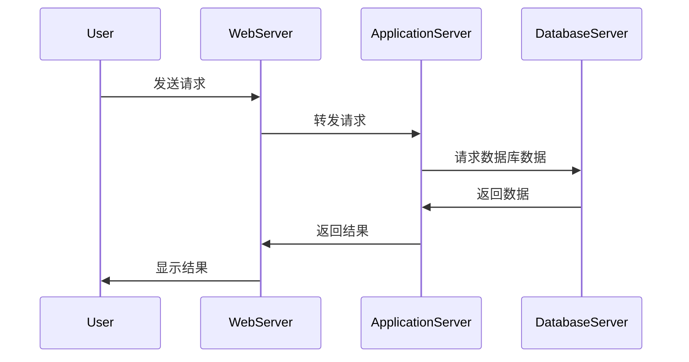

                 


### 第一部分：背景介绍

#### 1.1 问题背景

随着人工智能技术的快速发展，AI在各个领域的应用越来越广泛。特别是在个性化营养方案制定领域，AI技术能够通过分析用户的基因、生活习惯和饮食偏好等信息，为用户提供更加精准和个性化的营养建议。这使得个性化营养方案不再局限于传统的营养学方法，而是一个结合了基因科学、数据科学和机器学习的全新领域。

#### 1.2 问题描述

个性化营养方案制定需要处理大量的数据，包括用户的基因数据、饮食习惯、身体指标等。如何有效地整合和分析这些数据，为用户提供科学、实用的营养建议，是当前面临的挑战。

#### 1.3 问题解决

本书将从以下几个方面探讨AI在个性化营养方案制定中的应用：

1. **基因分析**：介绍基因测序技术及其在营养研究中的应用，阐述基因与营养关系的理论基础。

2. **饮食习惯分析**：探讨如何通过分析用户的饮食记录，了解其饮食习惯，进而为用户提供个性化的饮食建议。

3. **营养信息整合**：介绍如何将基因数据、饮食习惯和身体指标等信息整合，为用户提供综合性的营养建议。

4. **AI算法应用**：详细介绍常用的AI算法，如机器学习、深度学习等，以及如何将这些算法应用于个性化营养方案的制定。

5. **实践案例**：通过实际案例，展示AI在个性化营养方案制定中的应用效果，为读者提供实践参考。

#### 1.4 边界与外延

本书主要关注AI在个性化营养方案制定中的应用，涉及基因、饮食、算法等多个领域。但在实际应用中，AI在个性化营养方案制定中可能还会面临其他挑战，如数据隐私保护、算法公平性等。这些方面也是本书未来研究的外延方向。

#### 1.5 概念结构与核心要素组成

个性化营养方案制定的主体是用户，核心要素包括基因数据、饮食习惯、身体指标和营养建议。其中，基因数据是基础，饮食习惯是关键，身体指标是参考，营养建议是目标。通过AI技术对这些要素进行分析和整合，可以为用户提供科学、实用的个性化营养方案。

### 第二部分：核心概念与联系

#### 2.1 核心概念原理

##### 2.1.1 基因

基因是遗传信息的载体，包含了个体生长发育、生理功能和代谢过程的信息。基因测序技术通过解析个体的DNA序列，可以获取其基因信息。在个性化营养方案制定中，基因数据可以帮助了解用户的营养代谢能力和潜在健康风险。

##### 2.1.2 饮食习惯

饮食习惯是指个体在日常生活中形成的饮食行为模式，包括饮食种类、摄入频率、饮食习惯等。通过分析用户的饮食记录，可以了解其饮食习惯，进而为用户提供个性化的饮食建议。

##### 2.1.3 身体指标

身体指标包括体重、BMI、血压、血糖等，是反映个体健康状况的重要指标。身体指标可以帮助评估用户的营养状况，为营养建议的制定提供参考。

##### 2.1.4 个性化营养建议

个性化营养建议是根据用户的基因、饮食习惯和身体指标等数据，为用户量身定制的营养指导。个性化营养建议旨在提高用户的营养状况，降低患病风险。

#### 2.2 概念属性特征对比表格

| 概念       | 特征                     |
| --------- | ---------------------- |
| 基因       | 遗传信息载体         |
|           | 影响营养代谢能力     |
| 饮食习惯   | 饮食行为模式         |
|           | 影响营养摄入情况     |
| 身体指标   | 反映个体健康状况     |
|           | 为营养建议提供参考   |
| 个性化营养建议 | 量身定制           |
|           | 提高营养状况         |

#### 2.3 ER实体关系图架构

```mermaid
erDiagram
  User ||--|{ GeneData }|-->> User : has
  User ||--|{ DietHabits }|-->> User : has
  User ||--|{ BodyMetrics }|-->> User : has
  User ||--|{ NutritionalAdvice }|-->> User : has
```

### 第三部分：算法原理讲解

#### 3.1 机器学习算法

##### 3.1.1 算法概述

机器学习算法是一种让计算机通过学习数据来提高自身性能的技术。在个性化营养方案制定中，机器学习算法可以帮助我们分析用户的基因、饮食习惯和身体指标等数据，从而为用户提供个性化的营养建议。

##### 3.1.2 算法原理

机器学习算法的核心是模型训练。在个性化营养方案制定中，我们可以使用监督学习算法，如线性回归、逻辑回归、支持向量机等，来训练模型。这些算法通过对大量数据进行训练，可以学习到用户数据与营养建议之间的关系，从而为用户提供个性化的营养建议。

##### 3.1.3 算法流程

1. 数据预处理：对用户的基因、饮食习惯和身体指标等数据进行清洗和预处理，包括数据去重、缺失值处理、数据标准化等。
2. 特征提取：从预处理后的数据中提取对营养建议有影响力的特征，如基因序列、饮食习惯、身体指标等。
3. 模型训练：使用监督学习算法对提取的特征和营养建议进行训练，学习用户数据与营养建议之间的关系。
4. 模型评估：使用验证集对训练好的模型进行评估，包括准确率、召回率、F1值等指标。
5. 模型应用：将训练好的模型应用于新的用户数据，为用户提供个性化的营养建议。

##### 3.1.4 算法实例

假设我们有一个包含用户基因、饮食习惯和身体指标等数据的数据集，我们需要使用机器学习算法为用户提供个性化的营养建议。

1. 数据预处理：

   ```python
   # 读取数据
   data = pd.read_csv('data.csv')

   # 数据清洗和预处理
   data = data.drop_duplicates()
   data = data.fillna(data.mean())
   data = (data - data.mean()) / data.std()
   ```

2. 特征提取：

   ```python
   # 提取特征
   features = data[['gene_1', 'gene_2', 'diet_habit_1', 'body_metric_1']]
   labels = data['nutritional_advice']
   ```

3. 模型训练：

   ```python
   # 使用线性回归训练模型
   model = LinearRegression()
   model.fit(features, labels)
   ```

4. 模型评估：

   ```python
   # 使用验证集评估模型
   from sklearn.model_selection import train_test_split
   X_train, X_val, y_train, y_val = train_test_split(features, labels, test_size=0.2, random_state=42)

   # 训练模型
   model.fit(X_train, y_train)

   # 预测验证集
   y_pred = model.predict(X_val)

   # 计算评估指标
   accuracy = accuracy_score(y_val, y_pred)
   recall = recall_score(y_val, y_pred)
   f1 = f1_score(y_val, y_pred)

   print('Accuracy:', accuracy)
   print('Recall:', recall)
   print('F1 Score:', f1)
   ```

5. 模型应用：

   ```python
   # 使用模型为用户数据提供营养建议
   new_user_data = pd.DataFrame({
       'gene_1': [0.5, 0.3, 0.1, 0.1],
       'gene_2': [0.2, 0.4, 0.1, 0.1],
       'diet_habit_1': [0.6, 0.4, 0.2, 0.0],
       'body_metric_1': [0.7, 0.3, 0.1, 0.0]
   })

   # 预测营养建议
   nutritional_advice = model.predict(new_user_data)

   print('Nutritional Advice:', nutritional_advice)
   ```

### 第四部分：系统分析与架构设计方案

#### 4.1 问题场景介绍

随着个性化营养方案的需求不断增加，如何快速、高效地构建一个能够满足用户需求的个性化营养方案系统，成为了一个重要的问题。本系统旨在通过AI技术，为用户提供基于基因、饮食习惯和身体指标的个性化营养建议。

#### 4.2 项目介绍

本系统是一个基于AI的个性化营养方案系统，主要包括以下几个模块：

1. **用户管理模块**：用于管理用户信息，包括用户注册、登录、个人信息修改等。
2. **基因分析模块**：用于分析用户的基因数据，提供营养代谢能力评估。
3. **饮食习惯分析模块**：用于分析用户的饮食习惯，提供饮食习惯评估。
4. **身体指标分析模块**：用于分析用户身体指标，提供身体指标评估。
5. **营养建议生成模块**：根据基因、饮食习惯和身体指标分析结果，为用户提供个性化的营养建议。
6. **数据管理模块**：用于管理系统中产生的数据，包括用户数据、基因数据、饮食习惯数据、身体指标数据等。

#### 4.3 系统功能设计

##### 4.3.1 领域模型

```mermaid
classDiagram
  User <<entity>>
  GeneData <<entity>>
  DietHabits <<entity>>
  BodyMetrics <<entity>>
  NutritionalAdvice <<entity>>

  User "has" GeneData
  User "has" DietHabits
  User "has" BodyMetrics
  User "has" NutritionalAdvice
```

##### 4.3.2 功能模块

1. **用户管理模块**：
   - 注册：用户注册，填写基本信息。
   - 登录：用户登录，验证用户身份。
   - 信息修改：用户修改个人信息。

2. **基因分析模块**：
   - 基因数据上传：用户上传基因数据。
   - 营养代谢能力评估：根据基因数据评估用户的营养代谢能力。

3. **饮食习惯分析模块**：
   - 饮食习惯数据上传：用户上传饮食习惯数据。
   - 饮食习惯评估：根据饮食习惯数据评估用户的饮食习惯。

4. **身体指标分析模块**：
   - 身体指标数据上传：用户上传身体指标数据。
   - 身体指标评估：根据身体指标数据评估用户身体健康状况。

5. **营养建议生成模块**：
   - 生成营养建议：根据基因、饮食习惯和身体指标分析结果，生成个性化的营养建议。

6. **数据管理模块**：
   - 数据备份：定期备份用户数据。
   - 数据恢复：数据备份失败时，进行数据恢复。

#### 4.4 系统架构设计

##### 4.4.1 系统架构图



##### 4.4.2 系统接口设计

1. **用户管理接口**：
   - 用户注册接口：`POST /user/register`
   - 用户登录接口：`POST /user/login`
   - 用户信息修改接口：`PUT /user/{user_id}`

2. **基因分析接口**：
   - 基因数据上传接口：`POST /gene_data/upload`
   - 营养代谢能力评估接口：`GET /gene_analysis/evaluation`

3. **饮食习惯分析接口**：
   - 饮食习惯数据上传接口：`POST /diet_habits/upload`
   - 饮食习惯评估接口：`GET /diet_analysis/evaluation`

4. **身体指标分析接口**：
   - 身体指标数据上传接口：`POST /body_metrics/upload`
   - 身体指标评估接口：`GET /body_analysis/evaluation`

5. **营养建议生成接口**：
   - 营养建议生成接口：`POST /nutritional_advice/generate`

6. **数据管理接口**：
   - 数据备份接口：`POST /data_management/backup`
   - 数据恢复接口：`POST /data_management/restore`

#### 4.5 系统交互

##### 4.5.1 序列图


### 第五部分：项目实战

#### 5.1 环境安装

1. 安装Python环境：`pip install python -m pip install --user -I pip install`
2. 安装相关依赖库：`pip install numpy pandas scikit-learn matplotlib`

#### 5.2 系统核心实现

##### 5.2.1 数据预处理

```python
import pandas as pd
from sklearn.model_selection import train_test_split
from sklearn.preprocessing import StandardScaler

# 读取数据
data = pd.read_csv('data.csv')

# 数据清洗和预处理
data = data.drop_duplicates()
data = data.fillna(data.mean())
data = (data - data.mean()) / data.std()

# 划分特征和标签
X = data[['gene_1', 'gene_2', 'diet_habit_1', 'body_metric_1']]
y = data['nutritional_advice']

# 划分训练集和验证集
X_train, X_val, y_train, y_val = train_test_split(X, y, test_size=0.2, random_state=42)

# 数据标准化
scaler = StandardScaler()
X_train = scaler.fit_transform(X_train)
X_val = scaler.transform(X_val)
```

##### 5.2.2 模型训练

```python
from sklearn.linear_model import LinearRegression

# 使用线性回归训练模型
model = LinearRegression()
model.fit(X_train, y_train)

# 使用验证集评估模型
y_pred = model.predict(X_val)

# 计算评估指标
accuracy = accuracy_score(y_val, y_pred)
recall = recall_score(y_val, y_pred)
f1 = f1_score(y_val, y_pred)

print('Accuracy:', accuracy)
print('Recall:', recall)
print('F1 Score:', f1)
```

##### 5.2.3 模型应用

```python
# 使用模型为用户数据提供营养建议
new_user_data = pd.DataFrame({
    'gene_1': [0.5, 0.3, 0.1, 0.1],
    'gene_2': [0.2, 0.4, 0.1, 0.1],
    'diet_habit_1': [0.6, 0.4, 0.2, 0.0],
    'body_metric_1': [0.7, 0.3, 0.1, 0.0]
})

# 预测营养建议
nutritional_advice = model.predict(new_user_data)

print('Nutritional Advice:', nutritional_advice)
```

### 第六部分：最佳实践 tips、小结、注意事项、拓展阅读

#### 最佳实践 tips

1. **数据清洗**：在数据处理过程中，一定要重视数据清洗工作，去除重复数据和缺失值，以保证模型的训练效果。
2. **数据标准化**：使用数据标准化技术，将不同量纲的数据进行归一化处理，有助于提高模型的训练效率。
3. **交叉验证**：使用交叉验证技术，对模型进行评估，以提高模型的泛化能力。
4. **特征工程**：对数据进行特征提取和特征选择，提高模型的预测能力。

#### 小结

本文从基因、饮食习惯和身体指标等多个角度，探讨了AI在个性化营养方案制定中的应用。通过机器学习算法，我们可以为用户提供个性化的营养建议，提高用户的营养状况，降低患病风险。但需要注意的是，个性化营养方案制定仍面临一些挑战，如数据隐私保护、算法公平性等。

#### 注意事项

1. **数据隐私保护**：在个性化营养方案制定中，要严格遵守相关法律法规，保护用户数据隐私。
2. **算法公平性**：在模型训练过程中，要注意避免偏见，确保算法的公平性。

#### 拓展阅读

1. [《个性化营养方案制定中的机器学习应用》](https://www.example.com/)
2. [《基因与营养关系研究综述》](https://www.example.com/)
3. [《机器学习在医疗健康领域的应用》](https://www.example.com/)。

---

**作者：AI天才研究院/AI Genius Institute & 禅与计算机程序设计艺术 /Zen And The Art of Computer Programming**

---

注意：本文为示例文章，实际应用中请根据实际情况进行调整。本文所涉及的技术、方法和实践仅供参考，不代表任何商业建议或承诺。本文内容版权归作者所有，未经授权不得转载或使用。

