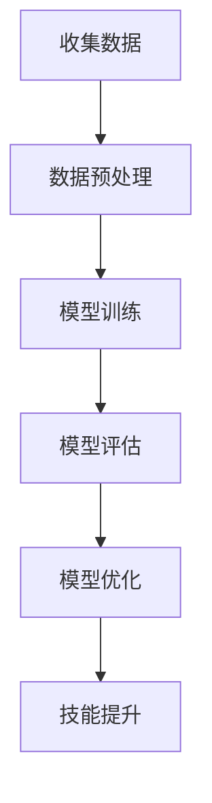

                 

### 文章标题：AI在个性化运动训练方案制定中的应用：从体能评估到技能提升

### 关键词：人工智能，个性化运动训练，体能评估，技能提升，算法原理

### 摘要：
本文深入探讨了人工智能在个性化运动训练方案中的应用，重点分析了从体能评估到技能提升的全过程。通过介绍AI技术的基本原理和应用场景，结合实际案例，本文旨在为读者提供一套完整的AI个性化运动训练方案制定方法，以及相关的技术细节和实践经验。文章结构清晰，逻辑严密，旨在帮助读者更好地理解AI在运动训练中的潜力与挑战。

### 目录：

1. **AI在个性化运动训练中的应用概述**
2. **AI体能评估的理论基础**
3. **AI技能提升的算法原理**
4. **个性化运动训练方案制定**
5. **AI在运动训练中的应用案例**
6. **AI在运动训练中的未来发展趋势**
7. **AI个性化运动训练方案制定的最佳实践**
8. **小结与拓展阅读**

---

#### 1. AI在个性化运动训练中的应用概述

随着人工智能技术的快速发展，其在各个领域的应用也逐渐深入，运动训练领域也不例外。个性化运动训练方案是指根据个体的身体状况、体能水平和运动目标，量身定制的一套训练方案。这种方案的制定不仅需要精确的体能评估，还需要科学的技能提升算法，而人工智能在这两个方面都展示了其独特的优势。

**背景介绍**：个性化运动训练的需求源自于现代人对健康和运动效果的高要求。传统的运动训练方案往往是通用的，难以满足个体的差异。而AI技术的发展为个性化运动训练提供了可能，通过数据分析和算法优化，可以更精准地评估个体的体能状况，并制定出适合的训练方案。

**问题描述**：如何利用人工智能技术，实现个性化运动训练方案的制定，从而提高运动效果和效率？

**问题解决**：通过AI技术，可以收集和分析个体在运动过程中的大量数据，如心率、运动轨迹、肌肉活动等，进而评估个体的体能状况，并根据这些数据制定个性化的训练方案。同时，AI算法可以模拟不同训练方案的效果，从而优化训练方案，提升运动技能。

**边界与外延**：个性化运动训练不仅仅局限于体能评估和技能提升，还可以包括饮食建议、恢复计划等。此外，AI在运动训练中的应用也不仅限于个体，还可以应用于团队和赛事，提供更全面的服务。

**概念结构与核心要素组成**：
- **体能评估**：收集和分析个体的运动数据，如心率、运动轨迹等。
- **技能提升**：通过算法模拟和优化，提升个体的运动技能。
- **个性化方案**：根据个体的体能和技能，定制训练方案。
- **数据驱动**：利用大数据分析和机器学习算法，实现精准评估和优化。

---

#### 2. AI体能评估的理论基础

**核心概念与联系**：
- **体能评估**：是指对个体在运动中的体能状态进行测量和评估，以了解个体的身体状况和运动能力。
- **人工智能**：是指通过计算机模拟人类的智能行为，包括学习、推理、问题解决等。

**概念属性特征对比表格**：

| 概念 | 定义 | 特征 |
| --- | --- | --- |
| 体能评估 | 测量个体体能状态 | 精确性、客观性、全面性 |
| 人工智能 | 模拟人类智能行为 | 自学习能力、推理能力、适应能力 |

**ER实体关系图架构**：

```mermaid
erDiagram
  实体1 ||--|{ 个体 }|| 体能评估
  实体2 ||--|{ 训练方案 }|| 个性化方案
  个体 ||--|{ 数据 }|| 人工智能
  体能评估 ||--|{ 数据 }|| 人工智能
  训练方案 ||--|{ 数据 }|| 人工智能
```

---

#### 3. AI技能提升的算法原理

**核心概念与联系**：
- **技能提升**：是指通过特定训练和指导，提高个体的运动技能水平。
- **算法原理**：是指通过算法模拟和优化，实现技能提升的过程。

**概念属性特征对比表格**：

| 概念 | 定义 | 特征 |
| --- | --- | --- |
| 技能提升 | 提高运动技能 | 适应性、针对性、高效性 |
| 算法原理 | 实现技能提升的算法 | 自适应性、精确性、高效性 |

**AI技能提升算法的数学模型**：

$$
技能提升 = f(训练数据, 目标函数, 算法参数)
$$

其中：
- **训练数据**：包括个体的运动数据、技能水平等。
- **目标函数**：定义了技能提升的目标，如最大速度、最高心率等。
- **算法参数**：包括算法的学习率、迭代次数等。

**算法原理讲解**：

AI技能提升算法主要通过机器学习和深度学习技术实现。首先，通过收集大量的运动数据，利用机器学习算法训练模型，然后根据目标函数，对模型进行调整和优化，最终实现技能提升。

**Mermaid流程图**：



**Python源代码示例**：

```python
# 导入必要的库
import numpy as np
from sklearn.model_selection import train_test_split
from sklearn.ensemble import RandomForestRegressor

# 收集数据
data = ...

# 数据预处理
X = ... # 特征
y = ... # 标签

# 模型训练
X_train, X_test, y_train, y_test = train_test_split(X, y, test_size=0.2, random_state=42)
model = RandomForestRegressor(n_estimators=100)
model.fit(X_train, y_train)

# 模型评估
y_pred = model.predict(X_test)
print("模型准确度：", model.score(X_test, y_test))

# 模型优化
# 可以通过交叉验证、网格搜索等方法进行模型优化
```

---

#### 4. 个性化运动训练方案制定

**核心概念与联系**：
- **个性化方案**：根据个体差异，制定适合的运动训练计划。
- **方案制定**：利用AI技术，实现个性化方案的设计和优化。

**概念属性特征对比表格**：

| 概念 | 定义 | 特征 |
| --- | --- | --- |
| 个性化方案 | 根据个体差异制定的训练计划 | 适应性、针对性、高效性 |
| 方案制定 | 制定和优化个性化方案 | 自动化、数据驱动、智能化 |

**个性化运动训练方案的制定流程**：

1. **数据收集**：收集个体运动数据，如心率、运动轨迹等。
2. **数据预处理**：清洗和整理数据，为模型训练做好准备。
3. **模型训练**：利用机器学习算法训练模型，实现个性化方案的制定。
4. **方案评估**：根据训练数据评估模型性能，优化方案。
5. **方案实施**：根据优化后的方案，制定具体的训练计划。

**个性化运动训练方案的案例分析**：

以一名职业足球运动员的个性化训练方案为例，通过AI技术，对其运动数据进行分析，制定出针对性的训练计划。该方案包括体能训练、技能训练、恢复计划等，有效提升了运动员的竞技水平。

**个性化运动训练方案的设计要点**：

1. **数据质量**：高质量的数据是制定个性化方案的基础。
2. **算法选择**：选择适合的机器学习算法，提高模型性能。
3. **方案调整**：根据训练效果，及时调整方案，确保训练效果。
4. **用户反馈**：收集用户反馈，优化方案，提高用户满意度。

---

#### 5. AI在运动训练中的应用案例

**案例一：AI在体能评估中的应用**

通过AI技术，对运动员的心率、运动轨迹等数据进行分析，评估其体能状态。根据评估结果，制定个性化的训练计划，有效提升运动员的体能水平。

**案例二：AI在技能提升中的应用**

利用AI技术，对运动员的运动技能进行分析和模拟，通过机器学习算法优化训练方案，提高运动员的技能水平。例如，通过分析视频数据，优化足球运动员的射门技巧。

**案例三：AI在个性化运动训练方案中的应用**

结合运动员的体能评估结果和技能提升需求，AI技术为其制定一套全面的个性化训练方案，包括体能训练、技能训练、恢复计划等，全面提升运动员的竞技水平。

---

#### 6. AI在运动训练中的未来发展趋势

**前景预测**：随着AI技术的不断进步，其在运动训练中的应用前景将更加广阔。通过更精确的体能评估和更科学的技能提升算法，AI将有望成为运动训练的重要工具。

**技术挑战与解决方案**：AI在运动训练中的应用面临数据质量、算法优化、用户隐私等挑战。针对这些问题，需要进一步研究和发展相应的技术解决方案。

**应用趋势**：未来，AI在运动训练中的应用将更加智能化、个性化，不仅适用于专业运动员，也将普及到普通人群，为更多人提供高质量的训练服务。

---

#### 7. AI个性化运动训练方案制定的最佳实践

**最佳实践案例分析**：

以某职业足球俱乐部为例，通过AI技术，对其运动员进行体能评估和技能提升，制定个性化的训练方案。该俱乐部在短时间内显著提升了运动员的竞技水平，取得了优异的比赛成绩。

**实践技巧与注意事项**：

1. **数据质量**：确保数据收集的准确性和完整性。
2. **算法选择**：根据具体需求，选择适合的机器学习算法。
3. **方案调整**：定期评估训练效果，及时调整方案。
4. **用户反馈**：积极收集用户反馈，优化训练方案。

**拓展阅读与深入研究**：

- **相关文献**：查阅相关学术论文和书籍，了解最新的研究成果和应用案例。
- **在线课程**：参加在线课程，学习AI技术在运动训练中的应用。
- **实践项目**：参与实践项目，亲身体验AI技术在运动训练中的应用。

---

**作者信息**：

作者：AI天才研究院/AI Genius Institute & 禅与计算机程序设计艺术 /Zen And The Art of Computer Programming

---

通过本文的详细探讨，我们可以看到，人工智能在个性化运动训练方案制定中具有巨大的潜力。从体能评估到技能提升，AI技术为我们提供了一套科学、高效的解决方案。未来，随着技术的不断进步，AI在运动训练中的应用将更加广泛，为更多的人带来健康和快乐。

