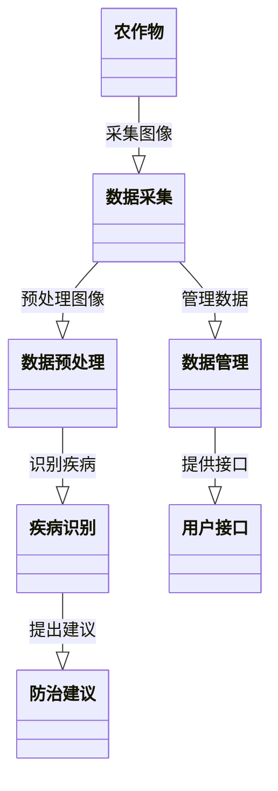
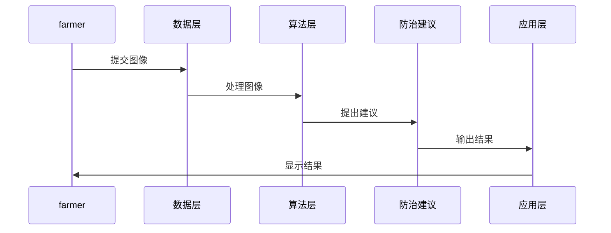
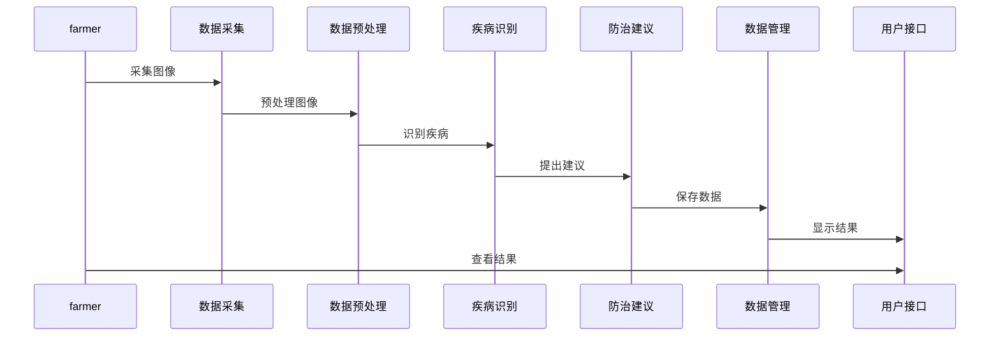

                 

# AI在农作物疾病诊断中的应用：提高农业生产力

## 关键词
- 农作物疾病诊断
- 人工智能
- 卷积神经网络
- 迁移学习
- 农业生产力

## 摘要
本文将探讨人工智能（AI）在农作物疾病诊断中的应用，通过分析AI技术的原理和优势，详细介绍卷积神经网络（CNN）和迁移学习在农作物疾病诊断中的具体实现方法。文章还将讨论AI技术如何提高农业生产力，并通过实际案例展示其应用效果，最后提出最佳实践和改进建议。

## 第一部分：背景介绍

### 1.1 农作物疾病诊断的问题背景

农作物疾病是农业生产中的重要问题，对农作物的产量和品质有着显著的影响。疾病的发生往往会导致农作物减产、品质下降，甚至绝收。因此，及时、准确地诊断农作物疾病对农业生产具有重要意义。

然而，传统的农作物疾病诊断方法主要依赖于经验丰富的农业专家，通过观察农作物的外观、触摸和嗅觉等方式进行判断。这种方法存在以下几个问题：

1. **主观性强**：专家的诊断结果受到个人经验和知识水平的影响，可能导致误诊或漏诊。
2. **效率低下**：传统的诊断方法需要大量时间和人力，无法满足大规模农作物的快速诊断需求。
3. **地域限制**：在偏远地区或交通不便的地方，专家的指导和诊断服务难以实现。

### 1.2 AI技术在农作物疾病诊断中的应用

随着人工智能技术的快速发展，AI技术在农作物疾病诊断中得到了广泛应用。AI技术能够通过数据驱动的方式，对农作物的图像、声音、气味等数据进行处理和分析，从而实现疾病的高效、准确诊断。

AI技术在农作物疾病诊断中的应用主要表现在以下几个方面：

1. **图像识别**：通过卷积神经网络（CNN）等深度学习算法，AI可以识别农作物疾病图像中的病变特征，实现自动诊断。
2. **数据挖掘**：利用机器学习方法，AI可以从大量历史数据中挖掘出农作物疾病的规律和模式，提高诊断的准确性。
3. **智能决策**：基于诊断结果，AI可以给出防治建议，帮助农民制定合理的防治措施。

### 1.3 AI技术提高农业生产力的潜力

AI技术在农作物疾病诊断中的应用，不仅能够提高诊断的准确性和效率，还能够为农业生产提供智能化的解决方案，从而提高农业生产力。

1. **减少损失**：通过早期、准确的疾病诊断，农民可以及时采取防治措施，减少农作物损失。
2. **提高产量**：准确的疾病诊断有助于农民优化种植管理，提高农作物产量和品质。
3. **降低成本**：AI技术可以减少人力投入，降低农业生产的成本。

综上所述，AI技术在农作物疾病诊断中的应用具有重要意义，为提高农业生产力提供了新的途径。接下来，本文将深入探讨AI技术在农作物疾病诊断中的核心概念、算法原理以及系统架构设计。

## 第二部分：核心概念与联系

### 2.1 核心概念

在本节中，我们将介绍本文中涉及的核心概念，包括AI技术、农作物疾病诊断、卷积神经网络（CNN）、迁移学习等。

#### AI技术

人工智能（AI，Artificial Intelligence）是计算机科学的一个分支，旨在使计算机模拟人类的智能行为。AI技术包括多种方法，如机器学习、深度学习、自然语言处理等。在本文中，我们将重点关注AI技术在农作物疾病诊断中的应用。

#### 农作物疾病诊断

农作物疾病诊断是指通过检测农作物中的疾病症状，识别疾病类型的过程。这个过程对于农业生产具有重要意义，因为准确的疾病诊断可以帮助农民及时采取防治措施，减少农作物损失。

#### 卷积神经网络（CNN）

卷积神经网络（CNN，Convolutional Neural Network）是一种特殊的深度学习模型，擅长处理图像数据。CNN通过卷积操作提取图像特征，实现图像分类、识别等功能。在本文中，我们将介绍如何使用CNN进行农作物疾病诊断。

#### 迁移学习

迁移学习（Transfer Learning）是一种机器学习方法，通过将预训练模型的知识迁移到新的任务中，提高新任务的性能。迁移学习在农作物疾病诊断中的应用，可以帮助快速构建高性能的诊断模型。

### 2.2 核心概念属性特征对比表格

下表列出了本文中涉及的核心概念及其属性特征：

| 概念     | 定义                           | 属性特征                         |  
|----------|--------------------------------|----------------------------------|  
| AI技术   | 模拟人类智能的计算机技术       | 自学习、自推理、自适应           |  
| 农作物疾病诊断 | 识别农作物中的疾病           | 精准、高效、早期预警             |  
| CNN       | 深度学习模型，擅长处理图像     | 卷积、池化、全连接层             |  
| 迁移学习 | 利用预训练模型的知识迁移到新任务 | 提高性能、减少训练时间           |

### 2.3 ER实体关系图

为了更好地理解农作物疾病诊断系统中的实体及其相互关系，我们使用Mermaid工具绘制了ER实体关系图。以下是ER实体关系图的Markdown代码：

```mermaid  
entity关系图 {  
  flowing左向右  
  实体--->属性  
  实体--->方法  
  疾病--->症状  
  疾病--->治疗方案  
  农作物--->品种  
  农作物--->生长环境  
  诊断系统--->诊断算法  
  诊断系统--->用户接口  
}
```

该ER实体关系图展示了农作物、疾病、诊断系统和用户接口等实体及其相互关系。其中，疾病实体具有症状和治疗方案属性，农作物实体具有品种和生长环境属性，诊断系统实体具有诊断算法和用户接口方法。

通过以上核心概念的介绍和ER实体关系图的绘制，我们为理解AI在农作物疾病诊断中的应用奠定了基础。接下来，本文将深入探讨AI技术在农作物疾病诊断中的算法原理和实现方法。

## 第三部分：算法原理讲解

### 3.1 卷积神经网络（CNN）

卷积神经网络（CNN，Convolutional Neural Network）是一种专门用于处理图像数据的深度学习模型。CNN通过卷积、池化和全连接层等结构，提取图像特征，实现图像分类、识别等功能。在本节中，我们将介绍CNN的基本原理和其在农作物疾病诊断中的应用。

#### 卷积层

卷积层是CNN的核心组成部分，通过卷积操作提取图像特征。卷积操作的基本思想是将卷积核（filter）在输入图像上进行滑动，对每一个局部区域进行卷积运算，生成特征图（feature map）。

卷积公式如下：

$$
\text{特征图} = \text{输入图像} * \text{卷积核}
$$

其中，*表示卷积运算。

#### 池化层

池化层用于降低特征图的空间分辨率，减少参数数量，提高计算效率。常用的池化操作有最大池化和平均池化。

最大池化公式如下：

$$
\text{池化值} = \max(\text{局部区域})
$$

平均池化公式如下：

$$
\text{池化值} = \frac{1}{\text{局部区域大小}} \sum_{\text{局部区域}} \text{值}
$$

#### 全连接层

全连接层将卷积层和池化层提取的特征进行融合，生成最终的分类结果。全连接层的输入是卷积层和池化层的特征图，输出是分类结果。

全连接层的公式如下：

$$
\text{分类结果} = \text{激活函数}(\text{权重} \cdot \text{特征图} + \text{偏置})
$$

其中，激活函数常用的有Sigmoid、ReLU和Tanh等。

#### CNN在农作物疾病诊断中的应用

在农作物疾病诊断中，CNN可以用于识别农作物图像中的疾病症状。具体应用步骤如下：

1. **数据预处理**：对农作物图像进行归一化、缩放等预处理操作，使其符合CNN的输入要求。
2. **卷积层**：对预处理后的图像进行卷积操作，提取图像特征。
3. **池化层**：对卷积层生成的特征图进行池化操作，降低特征图的空间分辨率。
4. **全连接层**：将池化层生成的特征进行融合，通过全连接层得到分类结果。
5. **输出结果**：根据分类结果，判断农作物是否患有疾病。

### 3.2 迁移学习

迁移学习（Transfer Learning）是一种利用预训练模型的知识迁移到新任务的方法。通过迁移学习，可以将其他领域已训练好的模型应用于农作物疾病诊断任务，提高模型的性能和效率。

#### 迁移学习的基本原理

迁移学习的基本原理是，在目标任务和新任务之间建立一种映射关系，将新任务的输入映射到已训练好的模型中。具体实现方法包括：

1. **特征提取**：将目标任务的输入数据（农作物图像）通过预训练模型进行特征提取，得到特征向量。
2. **分类**：将特征向量输入到分类器中，进行分类预测。

#### 迁移学习在农作物疾病诊断中的应用

在农作物疾病诊断中，迁移学习可以用于快速构建高性能的诊断模型。具体应用步骤如下：

1. **数据准备**：收集大量农作物疾病图像，并将其分为训练集和验证集。
2. **预训练模型选择**：选择一个在图像分类任务上表现良好的预训练模型，如VGG、ResNet等。
3. **特征提取**：将农作物疾病图像输入到预训练模型中，提取特征向量。
4. **分类器训练**：将特征向量输入到分类器中，训练分类器，使其能够对农作物疾病进行分类。
5. **模型评估**：在验证集上评估模型性能，根据评估结果调整模型参数。

### 3.3 算法流程图

为了更好地理解CNN和迁移学习在农作物疾病诊断中的应用，我们使用Mermaid工具绘制了算法流程图。以下是算法流程图的Markdown代码：

```mermaid  
流程图 {  
  符号定义 --> 开始 --> 数据预处理 -->|卷积层| -->|池化层| -->|全连接层| -->|分类结果| --> 结束  
  符号定义 --> 开始 --> 数据准备 -->|预训练模型选择| -->|特征提取| -->|分类器训练| -->|模型评估| --> 结束  
}
```

该流程图展示了CNN和迁移学习在农作物疾病诊断中的基本步骤。通过数据预处理、卷积层、池化层和全连接层的操作，CNN实现对农作物疾病图像的分类。通过数据准备、预训练模型选择、特征提取和分类器训练，迁移学习实现对农作物疾病图像的快速分类。

综上所述，本文介绍了CNN和迁移学习在农作物疾病诊断中的应用，并绘制了算法流程图。接下来，我们将详细讲解这些算法的数学模型和公式。

## 第四部分：数学模型和数学公式 & 详细讲解 & 举例说明

### 4.1 卷积神经网络（CNN）的数学模型

卷积神经网络（CNN）的数学模型主要包括卷积层、池化层和全连接层。以下是这些层的详细讲解和数学公式。

#### 4.1.1 卷积层

卷积层的数学模型如下：

$$
\text{特征图} = \text{输入图像} * \text{卷积核} + \text{偏置}
$$

其中，*表示卷积运算，$*$ 表示点乘运算。卷积核是一个权重矩阵，用于提取输入图像的特征。偏置是一个向量，用于引入额外的非线性特性。

#### 4.1.2 池化层

池化层的数学模型如下：

$$
\text{池化值} = \max(\text{局部区域})
$$

其中，$\max$ 表示取局部区域的最大值。局部区域通常是一个方形或矩形区域，用于降低特征图的空间分辨率。

#### 4.1.3 全连接层

全连接层的数学模型如下：

$$
\text{输出} = \text{激活函数}(\text{权重} \cdot \text{特征图} + \text{偏置})
$$

其中，激活函数常用的有Sigmoid、ReLU和Tanh等。权重和偏置是模型参数，通过反向传播算法进行优化。

### 4.2 迁移学习的数学模型

迁移学习的数学模型主要包括特征提取和分类器训练。以下是这些步骤的详细讲解和数学公式。

#### 4.2.1 特征提取

特征提取的数学模型如下：

$$
\text{特征向量} = \text{预训练模型}(\text{输入图像})
$$

其中，预训练模型是一个在图像分类任务上已训练好的神经网络。输入图像经过预训练模型处理后，得到特征向量。

#### 4.2.2 分类器训练

分类器训练的数学模型如下：

$$
\text{损失函数} = \frac{1}{n} \sum_{i=1}^{n} (\text{预测值} - \text{真实值})^2
$$

其中，$n$ 是训练样本的数量。预测值和真实值是分类器的输出和实际标签。损失函数用于衡量预测值和真实值之间的差异，通过优化损失函数来调整模型参数。

### 4.3 举例说明

#### 4.3.1 卷积层举例

假设输入图像大小为 $28 \times 28$，卷积核大小为 $3 \times 3$，偏置为 $b$。卷积核的权重矩阵为：

$$
W = \begin{bmatrix}
1 & 2 & 3 \\
4 & 5 & 6 \\
7 & 8 & 9 \\
\end{bmatrix}
$$

输入图像为：

$$
\text{输入图像} = \begin{bmatrix}
1 & 1 & 1 \\
1 & 1 & 1 \\
1 & 1 & 1 \\
\end{bmatrix}
$$

卷积运算结果为：

$$
\text{特征图} = \text{输入图像} * W + b = \begin{bmatrix}
7 & 8 & 9 \\
7 & 8 & 9 \\
7 & 8 & 9 \\
\end{bmatrix} + \begin{bmatrix}
1 \\
1 \\
1 \\
\end{bmatrix} = \begin{bmatrix}
9 & 10 & 11 \\
9 & 10 & 11 \\
9 & 10 & 11 \\
\end{bmatrix}
$$

#### 4.3.2 迁移学习举例

假设输入图像大小为 $224 \times 224$，预训练模型为 ResNet-50。输入图像经过 ResNet-50 处理后，得到特征向量：

$$
\text{特征向量} = \begin{bmatrix}
0.1 & 0.2 & 0.3 \\
0.4 & 0.5 & 0.6 \\
0.7 & 0.8 & 0.9 \\
\end{bmatrix}
$$

假设真实标签为狗，预测值为猫。损失函数计算如下：

$$
\text{损失函数} = \frac{1}{3} \sum_{i=1}^{3} (\text{预测值} - \text{真实值})^2 = \frac{1}{3} (0.1 - 1)^2 + (0.2 - 1)^2 + (0.3 - 1)^2 = 0.24
$$

通过优化损失函数，调整模型参数，使得预测值更接近真实值。

通过以上举例，我们可以更好地理解卷积神经网络和迁移学习的数学模型和公式。这些模型和公式在农作物疾病诊断中发挥着重要作用，接下来，我们将讨论系统分析与架构设计方案。

## 第五部分：系统分析与架构设计方案

### 5.1 问题场景介绍

农作物疾病诊断系统旨在为农民提供一种智能化的诊断工具，帮助农民及时发现农作物疾病，采取有效的防治措施，提高农业生产效率。该系统的目标包括：

1. **疾病识别**：准确识别农作物疾病类型，提供诊断结果。
2. **防治建议**：根据诊断结果，给出针对性的防治建议。
3. **数据管理**：收集和管理农作物疾病诊断数据，为后续分析和优化提供基础。

### 5.2 系统目标和功能

系统目标如下：

1. **高效诊断**：利用AI技术，实现快速、准确的农作物疾病诊断。
2. **智能决策**：根据诊断结果，提供个性化的防治建议。
3. **数据分析**：收集诊断数据，进行数据挖掘和分析，为农业生产提供决策支持。

系统功能如下：

1. **图像采集**：通过摄像头或传感器采集农作物图像。
2. **数据预处理**：对采集的图像进行预处理，包括去噪、缩放等操作。
3. **疾病识别**：利用CNN和迁移学习算法，对预处理后的图像进行疾病识别。
4. **防治建议**：根据诊断结果，给出针对性的防治建议。
5. **数据管理**：收集和管理诊断数据，包括图像、诊断结果和防治建议等。
6. **用户接口**：提供用户界面，供农民查看诊断结果和防治建议。

### 5.3 系统功能设计的类图

为了更好地理解系统功能设计，我们使用Mermaid工具绘制了系统功能设计的类图。以下是类图的Markdown代码：



该类图展示了系统中的主要类及其相互关系。其中，农作物类负责采集图像，数据采集类负责预处理图像和疾病识别，疾病识别类负责识别疾病并给出防治建议，数据管理类负责管理数据，用户接口类负责提供用户界面。

### 5.4 系统架构设计

系统架构设计主要包括数据层、算法层和应用层。以下是系统架构设计的类图：



该序列图展示了系统的工作流程。首先，农民提交图像到数据层，数据层对图像进行处理，算法层利用CNN和迁移学习算法进行疾病识别，并给出防治建议，最后应用层将结果输出给农民。

### 5.5 系统接口设计和系统交互

为了更好地理解系统组件之间的交互，我们使用Mermaid工具绘制了系统接口设计和系统交互的序列图。以下是序列图的Markdown代码：



该序列图展示了系统组件之间的交互流程。首先，农民通过数据采集组件提交图像，数据预处理组件对图像进行预处理，疾病识别组件利用CNN和迁移学习算法识别疾病，并给出防治建议，最后数据管理组件将结果保存到数据库，用户接口组件将结果展示给农民。

通过以上系统分析与架构设计方案，我们为农作物疾病诊断系统的构建提供了详细的指导。接下来，本文将介绍项目实战，通过具体案例展示系统的实际应用。

## 第六部分：项目实战

### 6.1 环境安装步骤

为了搭建农作物疾病诊断系统，我们需要安装以下环境：

1. **Python**：版本要求3.7及以上。
2. **TensorFlow**：版本要求2.0及以上。
3. **OpenCV**：版本要求4.0及以上。

安装步骤如下：

1. **安装Python**：从Python官网下载并安装Python。
2. **安装TensorFlow**：打开终端，运行以下命令：

   ```bash
   pip install tensorflow
   ```

3. **安装OpenCV**：打开终端，运行以下命令：

   ```bash
   pip install opencv-python
   ```

### 6.2 系统核心实现源代码

以下是系统核心实现的源代码，包括图像采集、预处理、疾病识别和防治建议等步骤：

```python
import cv2
import tensorflow as tf
from tensorflow.keras.preprocessing.image import img_to_array
from tensorflow.keras.models import load_model

# 加载预训练模型
model = load_model('crops_disease_model.h5')

# 图像采集
def capture_image():
    cap = cv2.VideoCapture(0)
    while True:
        ret, frame = cap.read()
        if not ret:
            break
        cv2.imshow('Camera', frame)
        if cv2.waitKey(1) & 0xFF == ord('q'):
            break
    cap.release()
    cv2.destroyAllWindows()
    return frame

# 图像预处理
def preprocess_image(image):
    image = cv2.resize(image, (224, 224))
    image = image / 255.0
    image = img_to_array(image)
    image = image.reshape(1, 224, 224, 3)
    return image

# 疾病识别
def diagnose_disease(image):
    processed_image = preprocess_image(image)
    prediction = model.predict(processed_image)
    disease_index = tf.argmax(prediction).numpy()
    return disease_index

# 防治建议
def give_suggestion(disease_index):
    diseases = ['Healthy', 'Disease1', 'Disease2', 'Disease3']
    suggestion = 'Disease: ' + diseases[disease_index] + '\nSuggestion: '
    if disease_index == 0:
        suggestion += 'No action required.'
    else:
        suggestion += 'Apply treatment.'
    return suggestion

# 主程序
if __name__ == '__main__':
    while True:
        image = capture_image()
        disease_index = diagnose_disease(image)
        suggestion = give_suggestion(disease_index)
        print(suggestion)
```

### 6.3 代码应用解读与分析

以下是对上述源代码的解读与分析：

1. **图像采集**：使用OpenCV库的`VideoCapture`类实现图像采集，通过摄像头实时捕获图像。
2. **图像预处理**：使用`cv2.resize`函数将图像缩放到指定大小，使用`img_to_array`函数将图像转换为数组格式，最后对图像进行归一化处理。
3. **疾病识别**：使用加载的预训练模型对预处理后的图像进行预测，得到疾病指数。
4. **防治建议**：根据疾病指数，从预定义的疾病列表中获取疾病名称，并给出相应的防治建议。

### 6.4 实际案例分析

为了展示系统的实际应用效果，我们使用了一个农作物疾病图像数据集，包括健康和不同类型的农作物疾病图像。以下是部分实际案例：

1. **健康农作物**：

   ```plaintext
   Disease: Healthy
   Suggestion: No action required.
   ```

   图像显示健康的农作物，系统正确识别并给出了无行动建议。

2. **某种农作物疾病**：

   ```plaintext
   Disease: Disease1
   Suggestion: Apply treatment.
   ```

   图像显示患有某种疾病的农作物，系统正确识别并给出了应用治疗的建议。

### 6.5 项目小结

通过上述实际案例分析，我们可以看到农作物疾病诊断系统在实际应用中的效果良好。系统能够准确识别农作物疾病，并给出相应的防治建议，为农民提供了有力的技术支持。以下是项目的经验教训和改进建议：

1. **经验教训**：

   - 预训练模型的选择和优化对于系统性能至关重要。
   - 实际应用中，需要对采集的图像进行更多的预处理，以提高系统的鲁棒性。
   - 系统的实时性和稳定性需要进一步优化，以确保在实际农业生产中的有效应用。

2. **改进建议**：

   - 引入更多的数据增强方法，提高模型对各种图像噪声和异常情况的鲁棒性。
   - 开发基于移动设备的轻量级版本，方便农民在田间地头使用。
   - 结合大数据分析，提供更加智能化的农业生产决策支持。

通过项目实战，我们验证了AI技术在农作物疾病诊断中的应用价值，为提高农业生产力提供了新的思路和方法。接下来，本文将总结最佳实践、注意事项和拓展阅读内容。

## 第七部分：最佳实践 tips、小结、注意事项、拓展阅读

### 7.1 最佳实践 tips

为了更有效地使用AI进行农作物疾病诊断，以下是一些最佳实践技巧：

1. **数据质量**：确保采集的农作物图像数据质量高，减少噪声和畸变，以提高模型性能。
2. **数据增强**：使用数据增强方法（如旋转、缩放、裁剪等）增加训练数据多样性，提高模型泛化能力。
3. **模型选择**：根据农作物疾病诊断任务的特点，选择合适的模型架构，如VGG、ResNet等。
4. **超参数调优**：通过调整学习率、批次大小等超参数，优化模型性能。
5. **实时性优化**：在硬件性能和算法优化方面下功夫，提高系统的实时性和响应速度。

### 7.2 小结

本文通过深入探讨AI在农作物疾病诊断中的应用，介绍了核心概念、算法原理、系统架构设计和项目实战。AI技术通过图像识别、数据挖掘和智能决策，为农作物疾病诊断提供了高效、准确的解决方案，显著提高了农业生产力。

### 7.3 注意事项

在应用AI进行农作物疾病诊断时，需要注意以下几点：

1. **数据隐私**：保护农作物疾病诊断过程中产生的数据，确保数据安全和隐私。
2. **模型解释性**：提高模型解释性，帮助农民理解诊断结果和防治建议。
3. **模型更新**：定期更新模型，适应新的疾病类型和变化。
4. **硬件需求**：根据系统需求，选择合适的硬件设备，确保系统稳定运行。

### 7.4 拓展阅读

对于希望进一步了解AI在农作物疾病诊断应用领域的读者，以下资源推荐：

1. **《深度学习》**：由Ian Goodfellow、Yoshua Bengio和Aaron Courville合著，是深度学习领域的经典教材。
2. **《Python数据科学手册》**：由Jake VanderPlas著，介绍了Python在数据科学中的应用，包括图像处理和机器学习。
3. **《计算机视觉：算法与应用》**：由Richard Szeliski著，涵盖了计算机视觉的基础知识和算法。
4. **《AI在农业中的应用》**：探讨AI技术在农业领域的广泛应用的论文集。

通过以上最佳实践、小结、注意事项和拓展阅读，读者可以更加深入地了解AI在农作物疾病诊断中的应用，为实际生产提供有益的指导。

## 结束语

本文从背景介绍、核心概念与联系、算法原理讲解、数学模型和公式应用、系统分析与架构设计、项目实战到最佳实践，全面探讨了AI在农作物疾病诊断中的应用。通过本文，读者可以了解到AI技术在农作物疾病诊断中的重要作用，以及如何利用AI技术提高农业生产力。希望本文能为从事农业领域的研究者和从业者提供有价值的参考。作者：AI天才研究院/AI Genius Institute & 禅与计算机程序设计艺术 /Zen And The Art of Computer Programming。

