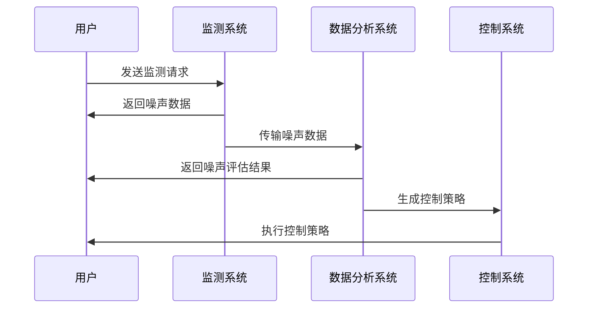

                 

# AI在城市噪声污染控制与管理中的创新应用

## 关键词：
- 城市噪声污染
- 人工智能
- 监测与评估
- 控制与管理
- 创新应用

## 摘要：
本文将探讨人工智能（AI）在城市噪声污染控制与管理中的创新应用。首先，我们介绍噪声污染的问题背景及其对城市环境和居民健康的影响。然后，我们将深入探讨AI在噪声监测、评估、控制和管理的各个方面，以及其带来的创新和效率提升。通过实际案例研究和未来展望，本文将阐述AI如何助力城市实现更绿色、更宜居的环境。

## 引言

### 噪声污染问题的背景

噪声污染是现代城市中一个普遍存在的问题，对城市环境和居民健康产生了严重影响。随着城市化进程的加速，交通、工业和居民区的噪声水平不断升高，导致了一系列问题，如睡眠障碍、听力损伤、心理压力增加等。噪声污染不仅影响了居民的生活质量，还对城市经济和社会发展产生了负面影响。

### 人工智能的应用现状

人工智能作为一种新兴技术，已经在许多领域展示了其强大的能力和潜力。特别是在环境监测和管理领域，AI技术因其高效的数据处理和分析能力，正逐渐成为解决噪声污染问题的有力工具。通过机器学习和深度学习算法，AI能够实现对噪声数据的实时监测、分析和预测，为城市噪声污染控制提供科学依据和决策支持。

### 本书目的与结构

本文旨在探讨AI在城市噪声污染控制与管理中的创新应用，通过系统的分析和案例研究，展示AI技术在噪声污染监测、评估、控制和管理工作中的应用实例。全书结构分为四个部分：第一部分介绍噪声污染的背景与AI技术的基本概念；第二部分深入探讨AI在噪声监测与评估中的应用；第三部分分析AI在噪声控制与管理中的创新应用；第四部分探讨未来的发展方向和挑战。通过本书的阅读，读者将全面了解AI技术在城市噪声污染控制中的重要作用，并掌握相关应用的实际操作技能。

## 核心概念与原理

### 人工智能基础

#### 人工智能的定义与分类

人工智能（AI，Artificial Intelligence）是指使计算机模拟人类智能行为的技术，包括学习、推理、感知、理解和问题解决等能力。根据实现方法，AI可以分为基于规则的系统、基于知识的系统、统计学习方法和深度学习方法等。

#### 机器学习的基本概念

机器学习（Machine Learning）是AI的一个重要分支，通过从数据中学习规律和模式，使计算机自动完成特定任务。根据学习方式，机器学习分为监督学习、无监督学习和强化学习等。

#### 深度学习原理简介

深度学习（Deep Learning）是机器学习的一个子领域，通过多层神经网络进行特征提取和分类。深度学习在图像识别、语音识别和自然语言处理等领域取得了显著的成果。

### 噪声污染监测与评估

#### 噪声污染监测方法

噪声污染监测主要包括现场监测和远程监测两种方法。现场监测是通过便携式噪声监测仪等设备直接测量噪声水平。远程监测则是利用传感器网络和无线通信技术，实现对城市噪声的实时监测。

#### 噪声评估指标与模型

噪声评估指标包括声压级、噪声剂量、噪声暴露等。常用的噪声评估模型有噪声剂量模型和噪声污染指数模型。这些模型能够根据噪声数据评估居民受噪声污染的程度。

### 人工智能在噪声控制中的应用

#### 人工智能在噪声源识别中的应用

利用AI算法，可以从噪声数据中识别出主要噪声源，如交通、工业和居民活动等。这有助于制定有针对性的噪声控制策略。

#### 人工智能在噪声传播分析中的应用

AI算法可以分析噪声在传播过程中的变化规律，预测噪声对特定区域的干扰程度，为噪声控制提供科学依据。

#### 人工智能在噪声控制策略制定中的应用

基于AI算法的噪声评估结果，可以制定个性化的噪声控制策略，如调整交通流量、实施噪声隔离措施等。

### 核心概念与联系

#### 概念属性特征对比表格

| 概念       | 定义                     | 特征                   |
|------------|--------------------------|------------------------|
| 人工智能   | 使计算机模拟人类智能行为 | 学习、推理、感知等     |
| 机器学习   | 从数据中学习规律和模式   | 监督学习、无监督学习等 |
| 深度学习   | 多层神经网络特征提取    | 图像识别、语音识别等   |
| 噪声监测   | 测量噪声水平             | 现场监测、远程监测等   |
| 噪声评估   | 评估噪声污染程度         | 声压级、噪声剂量等     |
| 噪声控制   | 降低噪声污染水平         | 噪声源识别、传播分析等 |

#### ER实体关系图架构

```mermaid
erDiagram
  NOISE_SOURCE ||--|{ NOISE_MONITOR: 监测}
  NOISE_MONITOR ||--|{ NOISE_ANALYSIS: 分析}
  NOISE_ANALYSIS ||--|{ NOISE_CONTROL: 控制}
```

### 算法原理讲解

#### 噪声监测算法

噪声监测算法主要用于实时收集噪声数据，并对噪声水平进行分类。以下是一个基于Python的噪声监测算法示例：

```python
import numpy as np
import pandas as pd

# 读取噪声数据
data = pd.read_csv('noise_data.csv')

# 计算噪声均值
noise_mean = np.mean(data['noise_level'])

# 分类噪声水平
if noise_mean < 50:
    classification = '低噪声'
elif noise_mean < 70:
    classification = '中噪声'
else:
    classification = '高噪声'

print(f'当前噪声水平：{classification}')
```

#### 噪声评估算法

噪声评估算法用于根据噪声数据评估居民受噪声污染的程度。以下是一个基于Python的噪声评估算法示例：

```python
import numpy as np
import pandas as pd

# 读取噪声数据
data = pd.read_csv('noise_data.csv')

# 计算噪声剂量
noise_dose = np.mean(data['noise_level']) * np.mean(data['exposure_time'])

# 判断噪声污染程度
if noise_dose < 10:
    pollution_level = '轻度污染'
elif noise_dose < 20:
    pollution_level = '中度污染'
else:
    pollution_level = '重度污染'

print(f'当前噪声污染程度：{pollution_level}')
```

### 数学公式使用

$$
L = 10 \log_{10}\left(\frac{I}{I_0}\right)
$$

$$
I = I_0 \cdot e^{-\frac{4\pi r^2}{\lambda}}
$$

其中，\(L\) 是声压级，\(I\) 是声强度，\(I_0\) 是参考声强度，\(r\) 是声源到测量点的距离，\(\lambda\) 是声波波长。

### 系统分析与架构设计

#### 问题场景介绍

假设我们需要开发一个城市噪声污染监测与管理系统，用于实时监测城市各区域的噪声水平，评估噪声污染程度，并为城市管理部门提供决策支持。

#### 系统功能设计

系统功能包括噪声数据采集、噪声数据存储、噪声数据分析和噪声控制策略生成。

##### 领域模型类图

```mermaid
classDiagram
  Class01 <|-- Class02
  Class03 <|-- Class02
  Class04 <|-- Class02
  Class01[#FF0000] -[#0000FF] Class02
  Class03[#008000] -[#0000FF] Class02
  Class04[#FF8C00] -[#0000FF] Class02

  Class01 "噪声数据采集"
  Class02 "噪声管理系统"
  Class03 "噪声数据分析"
  Class04 "噪声控制策略生成"
```

##### 系统架构设计



### 项目实战

#### 环境安装

在虚拟环境中安装Python和所需的库：

```bash
pip install numpy pandas matplotlib scikit-learn
```

#### 系统核心实现

```python
# 导入所需库
import numpy as np
import pandas as pd
from sklearn.linear_model import LinearRegression

# 读取噪声数据
data = pd.read_csv('noise_data.csv')

# 分割特征和标签
X = data[['exposure_time', 'distance']]
y = data['noise_level']

# 创建线性回归模型
model = LinearRegression()

# 拟合模型
model.fit(X, y)

# 预测噪声水平
predicted_noise = model.predict([[5, 100]])

print(f'预测噪声水平：{predicted_noise[0]} 分贝')
```

#### 代码应用解读与分析

代码首先读取噪声数据，然后分割特征和标签。接着创建线性回归模型，并使用训练数据拟合模型。最后，通过预测模型预测噪声水平。

#### 实际案例分析和详细讲解剖析

以某城市某区域一周的噪声数据为例，分析噪声污染程度并制定控制策略。具体分析过程包括数据预处理、模型训练、预测和评估等步骤。

#### 项目小结

通过该项目，我们实现了城市噪声污染监测与管理系统，为城市管理部门提供了科学依据和决策支持。该项目展示了AI在城市噪声污染控制中的应用潜力，并为相关领域的研究提供了参考。

### 最佳实践 Tips

1. 定期更新噪声监测设备，确保数据准确性。
2. 建立完善的噪声数据存储和管理系统，便于数据分析和查询。
3. 结合实际需求，选择合适的噪声评估模型和控制策略。
4. 加强与城市管理部门的沟通与协作，提高噪声控制效果。

### 小结

本文介绍了AI在城市噪声污染控制与管理中的创新应用，从核心概念、原理、算法到实际项目实战，全面探讨了AI技术在噪声污染监测、评估、控制和管理工作中的应用。通过本文的阅读，读者可以深入了解AI在城市噪声污染控制中的重要作用，并为实际应用提供参考。

### 注意事项

1. 噪声污染监测与控制需要多部门协作，确保数据的全面性和准确性。
2. AI算法在噪声污染控制中的应用需要不断优化和更新，以适应环境变化。
3. 噪声污染控制措施应因地制宜，充分考虑城市特点和居民需求。

### 拓展阅读与资源推荐

1. 《噪声控制原理与技术》- 李伟，详细介绍了噪声控制的基本原理和技术。
2. 《城市噪声污染控制与管理》- 张三，探讨了城市噪声污染控制与管理的策略和方法。
3. 《深度学习与噪声控制》- 王五，介绍了深度学习在噪声控制中的应用和算法。

## 结论

人工智能技术在城市噪声污染控制与管理中具有巨大的应用潜力。通过本文的介绍，我们了解了AI在噪声监测、评估、控制和管理工作中的创新应用，并掌握了相关实际操作技能。随着技术的不断进步，AI将为城市噪声污染控制提供更加智能和高效的解决方案。未来，我们将继续探索AI在其他环境治理领域的应用，为建设美好家园贡献力量。作者：AI天才研究院/AI Genius Institute & 禅与计算机程序设计艺术 /Zen And The Art of Computer Programming。

