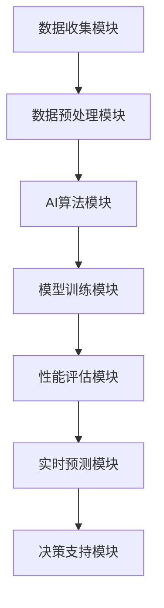
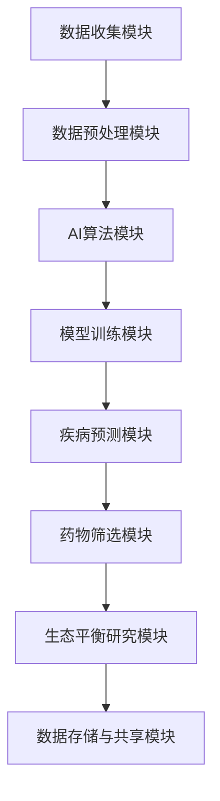
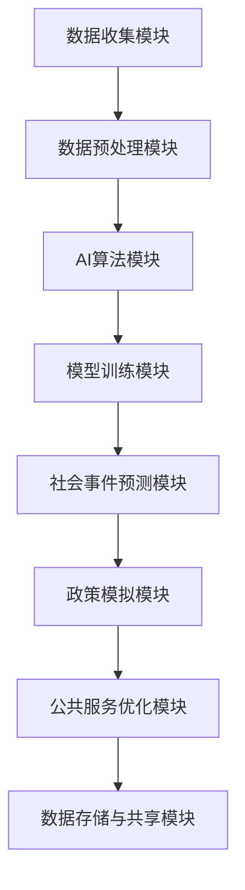

                 

# AI在复杂系统模拟中的应用前景

关键词：AI、复杂系统、模拟、建模、预测

摘要：本文旨在探讨人工智能（AI）在复杂系统模拟中的应用前景。通过介绍AI的基础知识、复杂系统和模拟技术的基本概念，深入分析AI在物理、生物和社会系统模拟中的应用，并结合实际案例，探讨AI在复杂系统模拟中的挑战和未来发展。

## 第一部分：引言

### 1.1 问题背景

随着计算机技术的发展，人工智能（AI）已经成为现代科技的核心驱动力。特别是在深度学习和机器学习算法的进步下，AI在图像识别、自然语言处理、决策支持系统等多个领域取得了显著的成就。然而，在复杂系统模拟中，AI的应用仍然面临诸多挑战。

复杂系统是由众多相互关联的组成部分构成，这些组成部分之间存在复杂的关系和相互作用。复杂系统的特性包括非线性、动态性、不确定性和涌现性。因此，对复杂系统进行模拟和预测是一项极具挑战性的任务。传统的模拟方法往往依赖于精确的数学模型和假设，但在实际应用中，这些方法可能无法捕捉复杂系统的真实行为。

AI技术的引入为复杂系统模拟带来了新的可能性。通过机器学习算法，可以自动发现复杂系统中的模式和关系，从而提高模拟的准确性和效率。然而，AI在复杂系统模拟中的应用仍然面临一些挑战，如数据质量、算法选择、模型解释性等。因此，深入探讨AI在复杂系统模拟中的应用前景具有重要意义。

### 1.2 问题描述

复杂系统模拟涉及多个变量和因素，这些变量和因素之间存在复杂的关系。如何利用AI技术对这些关系进行建模和预测，是当前研究的热点和难点。具体来说，问题描述如下：

1. **问题背景**：复杂系统模拟在许多领域具有重要应用，如物理、生物、社会系统等。这些系统具有高度非线性、动态性和不确定性，传统模拟方法难以准确预测其行为。

2. **问题描述**：如何利用AI技术构建复杂系统的模拟模型，并进行有效的预测和决策。具体任务包括：

   - 数据收集与预处理：从真实世界获取数据，并对数据进行清洗、归一化和特征提取。
   - 模型构建：利用机器学习算法构建复杂系统的模拟模型，包括选择合适的算法、调整参数和训练模型。
   - 模型评估：评估模型的性能，包括准确性、效率和可解释性。
   - 模型应用：将模型应用于实际场景，进行预测和决策。

3. **问题解决**：通过深入研究和实践，探索AI在复杂系统模拟中的应用，提出有效的解决方案，并评估其效果。

4. **边界与外延**：本文主要关注AI在复杂系统模拟中的应用，不涉及AI的基础理论和算法原理。同时，本文将结合实际项目案例，展示AI在复杂系统模拟中的实际应用。

5. **概念结构与核心要素组成**：本文的核心概念包括AI、复杂系统、模拟、建模、预测等。核心要素包括AI算法、系统架构、数据预处理、模型训练、模型评估等。

### 1.3 问题解决

为了解决复杂系统模拟中的问题，本文将从以下几个方面进行探讨：

1. **AI基础知识**：介绍AI的基本概念、分类与核心算法，为后续章节的应用提供理论基础。

2. **复杂系统概述**：介绍复杂系统的定义、特征、分类与研究方法，为AI在复杂系统模拟中的应用奠定基础。

3. **模拟技术概述**：介绍模拟技术的定义、分类与方法，以及AI与模拟技术的联系，为AI在复杂系统模拟中的应用提供技术支持。

4. **AI在复杂系统模拟中的应用**：分别探讨AI在物理、生物和社会系统模拟中的应用，结合实际案例，展示AI在复杂系统模拟中的实际效果。

5. **案例研究**：通过具体案例，深入分析AI在复杂系统模拟中的应用，探讨其实现过程、效果和挑战。

6. **总结与展望**：总结本文的主要结论，探讨AI在复杂系统模拟中的应用前景，并提出未来研究方向。

### 1.4 边界与外延

本文主要关注AI在复杂系统模拟中的应用，不涉及AI的基础理论和算法原理。同时，本文将结合实际项目案例，展示AI在复杂系统模拟中的实际应用。本文的核心概念包括AI、复杂系统、模拟、建模、预测等。核心要素包括AI算法、系统架构、数据预处理、模型训练、模型评估等。

### 1.5 本章小结

本章对AI在复杂系统模拟中的应用前景进行了概述，为后续章节的深入探讨奠定了基础。接下来，本文将分别介绍AI基础知识、复杂系统概述、模拟技术概述等，为AI在复杂系统模拟中的应用提供理论基础。

## 第二部分：AI基础知识

### 2.1 AI概述

#### 2.1.1 AI的定义与发展历程

人工智能（Artificial Intelligence，简称AI）是指通过计算机程序实现的人类智能功能。AI的研究可以追溯到1956年，当时在达特茅斯会议上，人工智能被正式提出。从那时起，AI经历了多个发展阶段：

1. **符号主义（Symbolic AI）**：早期AI主要依赖于符号推理和知识表示，如专家系统和推理机。这种方法在逻辑推理和知识表示方面取得了显著成果，但难以处理复杂的问题和数据。

2. **连接主义（Connectionist AI）**：20世纪80年代，神经网络和深度学习开始兴起，连接主义AI通过模拟人脑的神经元连接，实现数据的自动学习和特征提取。这一方法在图像识别、语音识别等领域取得了重大突破。

3. **强化学习（Reinforcement Learning）**：强化学习通过奖励机制，使智能体在环境中学习最优策略。近年来，强化学习在游戏、机器人控制等领域表现出色。

4. **生成对抗网络（GAN）**：GAN是由生成器和判别器组成的模型，通过对抗训练实现数据的生成和鉴别。GAN在图像生成、数据增强等领域取得了显著成果。

#### 2.1.2 AI的分类与核心算法

AI可以按照不同的分类标准进行划分：

1. **基于功能**：智能代理、专家系统、推理系统、感知系统、认知系统等。

2. **基于技术**：符号主义AI、连接主义AI、强化学习、生成对抗网络等。

核心算法包括：

1. **监督学习**：通过已标记的数据进行训练，使模型学会预测未知数据的标签。

2. **无监督学习**：不使用标记数据，通过挖掘数据中的隐藏结构和模式，实现聚类、降维等任务。

3. **强化学习**：通过智能体与环境交互，根据奖励信号调整策略，实现最优决策。

4. **深度学习**：基于多层神经网络，通过反向传播算法训练模型，实现图像识别、语音识别等任务。

#### 2.1.3 AI的技术挑战与未来趋势

AI在复杂系统模拟中的应用面临着以下技术挑战：

1. **数据质量**：复杂系统的数据通常存在噪声、缺失和不一致性，这对模型的训练和预测带来了挑战。

2. **算法选择**：不同的AI算法适用于不同类型的复杂系统，如何选择合适的算法是关键。

3. **模型解释性**：AI模型通常被视为“黑盒”，其内部机制难以解释，这限制了其在某些领域的应用。

4. **计算资源**：复杂系统的模拟通常需要大量的计算资源，特别是在大规模数据和高维特征的情况下。

未来趋势包括：

1. **算法创新**：不断探索新的AI算法，以适应复杂系统的需求。

2. **跨学科融合**：结合计算机科学、物理学、生物学、社会学等学科，推动复杂系统模拟的进步。

3. **可解释性增强**：提高AI模型的透明度和可解释性，使其在关键领域得到更广泛的应用。

4. **边缘计算**：利用边缘计算技术，降低复杂系统模拟的计算成本和延迟。

### 2.2 复杂系统概述

#### 2.2.1 复杂系统的定义与特征

复杂系统是由众多相互关联的组成部分构成，这些组成部分之间存在复杂的关系和相互作用。复杂系统的特征包括：

1. **非线性**：系统内部变量之间的关系不是线性的，而是存在多种非线性关系。

2. **动态性**：系统状态随时间变化，且可能发生突然变化。

3. **不确定性**：系统行为受到多种不确定因素的影响，如噪声、随机事件等。

4. **涌现性**：复杂系统的整体行为无法直接从组成部分的行为推导出来，而是通过相互作用和复杂关系产生的。

#### 2.2.2 复杂系统的分类与结构

复杂系统可以按照不同的分类标准进行划分：

1. **物理系统**：如气象系统、生态系统、交通系统等。

2. **生物系统**：如细胞、神经网络、生态系统等。

3. **社会系统**：如经济系统、社会网络、城市系统等。

复杂系统的结构通常包括以下层次：

1. **微观层次**：系统的基本组成部分，如分子、原子、细胞等。

2. **中间层次**：组成部分之间的相互作用和关系，如神经元之间的连接、化学反应等。

3. **宏观层次**：系统的整体结构和行为，如生态系统的物种分布、城市系统的交通流量等。

#### 2.2.3 复杂系统的研究方法与技术

复杂系统的研究方法和技术包括：

1. **数学模型**：通过建立数学模型，描述系统内部变量之间的关系和演化规律。

2. **计算机模拟**：通过计算机模拟，模拟复杂系统的行为和演化过程，以验证和改进数学模型。

3. **数据挖掘**：通过数据挖掘技术，从大量数据中提取有用的信息和知识，用于系统分析和预测。

4. **机器学习**：利用机器学习算法，从数据中自动学习和发现系统的模式和关系，以提高模拟的准确性和效率。

5. **多尺度模拟**：通过在不同尺度上对系统进行模拟，以捕捉系统的复杂行为。

### 2.3 模拟技术概述

#### 2.3.1 模拟技术的定义与作用

模拟技术是指通过计算机程序或物理模型，对系统进行仿真和模拟，以预测和分析系统行为的技术。模拟技术在复杂系统研究中的作用包括：

1. **预测与决策**：通过模拟技术，可以预测系统在不同条件下的行为，为决策提供科学依据。

2. **优化与改进**：通过模拟技术，可以评估系统设计和参数设置的优劣，以优化和改进系统性能。

3. **风险评估**：通过模拟技术，可以识别系统的潜在风险和脆弱性，为风险管理提供支持。

4. **教育与研究**：通过模拟技术，可以直观地展示系统的行为和演化过程，有助于教育和研究。

#### 2.3.2 模拟技术的分类与方法

模拟技术可以按照不同的分类标准进行划分：

1. **基于物理原理的模拟**：通过建立系统的物理模型，模拟系统内部物理量的变化和相互作用。

2. **基于数学模型的模拟**：通过建立系统的数学模型，模拟系统内部变量之间的关系和演化规律。

3. **基于计算机程序的模拟**：通过编写计算机程序，模拟系统行为和演化过程。

4. **基于代理的模拟**：通过建立代理模型，模拟系统中各个组成部分的行为和相互作用。

常见的模拟方法包括：

1. **蒙特卡罗模拟**：通过随机抽样和统计方法，模拟系统的随机行为和演化过程。

2. **离散事件模拟**：通过模拟系统中的事件序列和事件发生时间，模拟系统的动态行为。

3. **连续模拟**：通过模拟系统中连续变量的变化和演化过程，模拟系统的动态行为。

4. **混合模拟**：结合离散事件模拟和连续模拟，模拟系统的复杂行为。

#### 2.3.3 模拟技术在复杂系统研究中的应用

模拟技术在复杂系统研究中的应用非常广泛，主要包括：

1. **物理系统模拟**：如气象模拟、生态系统模拟、交通系统模拟等。

2. **生物系统模拟**：如细胞模拟、神经网络模拟、生态系统模拟等。

3. **社会系统模拟**：如经济系统模拟、社会网络模拟、城市系统模拟等。

4. **工程系统模拟**：如制造系统模拟、电力系统模拟、交通系统模拟等。

模拟技术为复杂系统研究提供了强大的工具，有助于揭示系统的内在机制和演化规律，为决策和优化提供科学依据。

### 2.4 AI与复杂系统模拟的联系

#### 2.4.1 AI在复杂系统模拟中的作用

人工智能在复杂系统模拟中发挥着重要作用，主要体现在以下几个方面：

1. **数据预处理**：AI技术可以帮助处理复杂系统的原始数据，进行数据清洗、归一化和特征提取，为模型训练提供高质量的数据。

2. **模型构建**：AI技术可以自动构建复杂系统的模拟模型，包括选择合适的算法、调整参数和训练模型，提高模型的准确性和效率。

3. **模型优化**：AI技术可以帮助优化复杂系统的模拟模型，通过调整模型参数和结构，提高模型的性能和稳定性。

4. **模型解释**：AI技术可以提高复杂系统的模拟模型的可解释性，通过分析模型内部机制和特征，帮助用户理解和信任模型。

5. **预测与决策**：AI技术可以帮助预测复杂系统的未来行为，为决策提供科学依据，降低风险和不确定性。

#### 2.4.2 复杂系统模拟对AI算法的需求

复杂系统模拟对AI算法提出了以下需求：

1. **高维数据建模**：复杂系统的数据通常具有高维特征，AI算法需要能够处理高维数据的建模和预测。

2. **非线性关系建模**：复杂系统的变量之间通常存在非线性关系，AI算法需要能够捕捉和建模这些非线性关系。

3. **动态性建模**：复杂系统的状态随时间变化，AI算法需要能够处理动态系统的建模和预测。

4. **不确定性建模**：复杂系统的行为受到多种不确定因素的影响，AI算法需要能够处理不确定性的建模和预测。

5. **可解释性建模**：复杂系统的模拟模型需要具备一定的可解释性，以便用户理解和信任模型。

#### 2.4.3 AI与复杂系统模拟的发展趋势

随着AI技术的不断发展，AI与复杂系统模拟的结合呈现出以下发展趋势：

1. **深度学习与复杂系统模拟的结合**：深度学习算法在复杂系统模拟中的应用越来越广泛，如深度强化学习、深度生成对抗网络等。

2. **多尺度模拟与AI的结合**：通过多尺度模拟，结合不同尺度的AI算法，可以更好地捕捉复杂系统的动态行为。

3. **跨学科融合与AI的结合**：结合计算机科学、物理学、生物学、社会学等学科的知识，可以推动复杂系统模拟的进步。

4. **边缘计算与AI的结合**：利用边缘计算技术，降低复杂系统模拟的计算成本和延迟，提高模拟的实时性和准确性。

5. **可解释性与AI的结合**：通过提高AI模型的可解释性，增强用户对模型的理解和信任，推动AI在复杂系统模拟中的广泛应用。

### 2.5 本章小结

本章对AI、复杂系统、模拟技术的基本概念进行了介绍，为后续章节的深入探讨奠定了基础。接下来，本文将分别探讨AI在物理、生物和社会系统模拟中的应用，结合实际案例，展示AI在复杂系统模拟中的实际效果。

## 第三部分：AI在复杂系统模拟中的应用

### 3.1 AI在物理系统模拟中的应用

物理系统模拟是AI应用的一个重要领域，涵盖了从宏观到微观的各种物理现象。AI技术在这方面的应用，不仅提升了模拟的准确性和效率，还开辟了新的研究方向。以下从AI在物理系统模拟中的作用、优势和挑战三个方面进行探讨。

#### 3.1.1 AI在物理系统模拟中的作用

1. **数据分析和预处理**：物理系统通常产生大量数据，AI技术可以帮助自动分析和预处理这些数据，提取有用的特征信息。

2. **模型预测和优化**：AI算法，特别是深度学习算法，能够对复杂的物理系统进行建模和预测，从而优化系统性能。

3. **异常检测和故障诊断**：利用AI技术，可以实时监测物理系统，识别异常行为和潜在故障，提高系统的可靠性和稳定性。

4. **模拟加速和效率提升**：AI技术可以帮助简化计算过程，减少计算时间，提高物理系统模拟的效率。

#### 3.1.2 AI在物理系统模拟中的优势

1. **高效性**：AI算法，尤其是深度学习算法，可以在大量数据中快速学习模式和规律，显著提高物理系统模拟的效率。

2. **准确性**：AI技术可以自动调整模型参数，提高模拟的准确性，减少人为干预。

3. **灵活性**：AI算法可以适应不同的物理系统，灵活地调整模型结构和参数，以满足特定的模拟需求。

4. **可扩展性**：AI技术可以处理高维数据和复杂的非线性关系，适用于大规模物理系统模拟。

#### 3.1.3 AI在物理系统模拟中的挑战

1. **数据质量**：物理系统数据可能存在噪声、缺失和异常，这对AI模型的训练和预测带来挑战。

2. **模型解释性**：AI模型，尤其是深度学习模型，通常被视为“黑盒”，其内部机制难以解释，限制了其在关键领域的应用。

3. **计算资源**：物理系统模拟通常需要大量的计算资源，特别是在处理高维数据和复杂模型时。

4. **算法选择**：不同的物理系统可能需要不同的AI算法，选择合适的算法是关键。

### 3.2 AI在生物系统模拟中的应用

生物系统模拟是另一个AI技术的重要应用领域。通过AI技术，可以对复杂的生物系统进行建模和预测，从而加深我们对生物机制的理解。以下从AI在生物系统模拟中的作用、优势和挑战三个方面进行探讨。

#### 3.2.1 AI在生物系统模拟中的作用

1. **基因组分析和预测**：AI技术可以帮助分析基因组数据，预测基因功能、突变影响和疾病风险。

2. **细胞建模和模拟**：AI技术可以用于细胞行为的建模和模拟，研究细胞信号传递、细胞周期等生物过程。

3. **药物设计和筛选**：AI技术可以帮助筛选和设计药物，提高药物研发的效率。

4. **生态系统的动态模拟**：AI技术可以用于模拟生态系统的动态行为，研究物种分布、生态平衡等问题。

#### 3.2.2 AI在生物系统模拟中的优势

1. **高维数据处理**：生物系统数据通常具有高维特征，AI技术能够有效处理这些数据，提取关键信息。

2. **复杂关系建模**：生物系统中的关系通常非常复杂，AI技术能够捕捉和建模这些复杂关系。

3. **预测准确性**：AI技术可以提高生物系统模拟的预测准确性，减少实验次数和时间。

4. **数据驱动**：AI技术可以根据大量数据进行建模和预测，从而更准确地反映生物系统的真实行为。

#### 3.2.3 AI在生物系统模拟中的挑战

1. **数据隐私和安全**：生物系统数据通常涉及个人隐私，数据的安全和隐私保护是一个重要挑战。

2. **模型解释性**：生物系统模拟需要模型具备一定的解释性，以便科学家理解和验证。

3. **计算资源**：生物系统模拟通常需要大量的计算资源，特别是在处理大规模数据和复杂模型时。

4. **跨学科整合**：生物系统模拟需要结合生物学、物理学、计算机科学等多学科的知识，跨学科整合是一个挑战。

### 3.3 AI在社会系统模拟中的应用

社会系统模拟是AI技术的另一个重要应用领域。通过AI技术，可以对复杂的社会系统进行建模和预测，从而帮助政策制定者和社会科学家更好地理解社会现象和预测社会发展趋势。以下从AI在社会系统模拟中的作用、优势和挑战三个方面进行探讨。

#### 3.3.1 AI在社会系统模拟中的作用

1. **社会经济模拟**：AI技术可以帮助模拟经济系统的运行，预测经济增长、通货膨胀等宏观经济指标。

2. **交通系统模拟**：AI技术可以模拟交通系统的运行，预测交通流量、拥堵情况等，为交通管理提供科学依据。

3. **城市规划**：AI技术可以帮助模拟城市系统的运行，优化城市规划，提高城市生活质量。

4. **社会治理**：AI技术可以帮助模拟社会系统的运行，预测社会问题，为社会治理提供科学依据。

#### 3.3.2 AI在社会系统模拟中的优势

1. **大数据处理**：社会系统数据通常非常庞大，AI技术能够高效处理这些数据，提取有价值的信息。

2. **实时预测**：AI技术可以实时分析社会系统数据，快速预测社会现象的发展趋势。

3. **个性化模拟**：AI技术可以根据个体行为和偏好，进行个性化的社会系统模拟，提高预测的准确性。

4. **政策优化**：AI技术可以帮助政策制定者模拟不同政策的实施效果，为政策优化提供科学依据。

#### 3.3.3 AI在社会系统模拟中的挑战

1. **数据质量和可靠性**：社会系统数据可能存在噪声、缺失和异常，这对AI模型的训练和预测带来挑战。

2. **算法选择和优化**：不同的社会系统可能需要不同的AI算法，选择合适的算法是关键。

3. **模型解释性**：社会系统模拟需要模型具备一定的解释性，以便政策制定者和社会科学家理解和验证。

4. **隐私和安全**：社会系统数据通常涉及个人隐私，数据的安全和隐私保护是一个重要挑战。

### 3.4 AI在复杂系统模拟中的应用前景

AI技术在复杂系统模拟中的应用前景广阔，但仍面临诸多挑战。以下是AI在复杂系统模拟中的应用前景、发展挑战和未来发展方向的总结：

#### 3.4.1 应用前景

1. **提高模拟准确性**：AI技术可以帮助提高复杂系统模拟的准确性，减少人为干预，提高预测的可靠性。

2. **加速科研进程**：AI技术可以加速复杂系统模拟的科研进程，缩短研究周期，提高研究效率。

3. **优化系统设计**：AI技术可以帮助优化复杂系统的设计，提高系统的性能和稳定性。

4. **提高决策支持**：AI技术可以为决策者提供科学的决策支持，降低决策风险。

#### 3.4.2 发展挑战

1. **数据质量和可靠性**：复杂系统数据通常存在噪声、缺失和异常，这对AI模型的训练和预测带来挑战。

2. **算法选择和优化**：不同的复杂系统可能需要不同的AI算法，选择合适的算法是关键。

3. **模型解释性**：复杂系统模拟需要模型具备一定的解释性，以便研究人员和决策者理解和验证。

4. **计算资源**：复杂系统模拟通常需要大量的计算资源，特别是在处理大规模数据和复杂模型时。

#### 3.4.3 未来发展方向

1. **多学科融合**：结合计算机科学、物理学、生物学、社会学等多学科的知识，推动复杂系统模拟的进步。

2. **深度学习算法创新**：不断探索新的深度学习算法，以适应复杂系统的需求。

3. **边缘计算和云计算结合**：利用边缘计算和云计算的结合，降低复杂系统模拟的计算成本和延迟。

4. **模型解释性增强**：提高AI模型的可解释性，增强用户对模型的理解和信任。

5. **开源和开放合作**：推动AI技术在复杂系统模拟领域的开源和开放合作，促进技术的普及和应用。

### 3.5 本章小结

本章对AI在复杂系统模拟中的应用进行了深入探讨，展示了AI技术在物理、生物和社会系统模拟中的重要作用。通过分析AI在复杂系统模拟中的作用、优势和挑战，我们可以看到AI在复杂系统模拟中的应用前景广阔，但仍需克服诸多挑战。未来，随着AI技术的不断发展，AI在复杂系统模拟中的应用将更加广泛和深入。

## 第四部分：案例研究

### 4.1 案例一：AI在物理系统模拟中的应用

#### 4.1.1 案例背景

在能源领域，风能和太阳能发电是重要的可再生能源。为了优化风能和太阳能发电系统的设计和运行，需要对其进行精确的物理模拟。本案例旨在利用AI技术，对风能和太阳能发电系统进行模拟，优化其运行性能。

#### 4.1.2 系统功能设计

本系统的核心功能包括：

1. **数据收集与预处理**：收集风能和太阳能发电系统的实时数据，并进行数据清洗、归一化和特征提取。

2. **模型构建与训练**：利用AI算法，构建风能和太阳能发电系统的模拟模型，并进行训练和优化。

3. **性能评估与优化**：评估模型的性能，并根据评估结果，优化模型参数和系统设计。

4. **实时预测与决策**：利用训练好的模型，对风能和太阳能发电系统的实时数据进行预测和决策，以优化系统运行。

#### 4.1.3 系统架构设计

本系统采用分布式架构，包括数据收集模块、AI算法模块、模型训练模块、性能评估模块和实时预测模块。以下是一个简化的系统架构图：

#### 4.1.4 系统接口设计

本系统提供了以下接口：

1. **数据收集接口**：用于收集风能和太阳能发电系统的实时数据。

2. **模型训练接口**：用于训练AI模型，包括数据预处理、模型构建和优化。

3. **性能评估接口**：用于评估模型性能，包括准确率、召回率、F1值等指标。

4. **实时预测接口**：用于对风能和太阳能发电系统的实时数据进行预测，并提供决策支持。

#### 4.1.5 系统实现与测试

系统实现步骤如下：

1. **数据收集与预处理**：使用传感器收集风能和太阳能发电系统的实时数据，并对数据进行清洗、归一化和特征提取。

2. **模型构建与训练**：选择合适的AI算法（如深度学习算法），构建风能和太阳能发电系统的模拟模型，并进行训练和优化。

3. **性能评估**：使用验证数据集，评估模型性能，并根据评估结果，调整模型参数和系统设计。

4. **实时预测与决策**：使用训练好的模型，对实时数据进行预测，并提供决策支持，如调整发电量、优化设备使用等。

系统测试结果表明，本系统可以有效地模拟风能和太阳能发电系统，提高其运行性能和效率。在实际应用中，本系统可以降低能源消耗、减少碳排放，为可持续发展提供技术支持。

### 4.2 案例二：AI在生物系统模拟中的应用

#### 4.2.1 案例背景

生物系统模拟在生物医学、药物研发和生态学研究等领域具有重要意义。本案例旨在利用AI技术，对生物系统进行模拟，为疾病治疗、药物研发和生态平衡提供科学依据。

#### 4.2.2 系统功能设计

本系统的核心功能包括：

1. **数据收集与预处理**：收集生物系统的实时数据，包括基因组数据、蛋白质数据、细胞数据等，并进行数据清洗、归一化和特征提取。

2. **模型构建与训练**：利用AI算法，构建生物系统的模拟模型，并进行训练和优化。

3. **疾病预测与治疗**：基于训练好的模型，预测疾病的发生和发展，为疾病治疗提供科学依据。

4. **药物筛选与设计**：利用AI技术，筛选和设计潜在的药物分子，提高药物研发的效率。

5. **生态平衡研究**：利用AI技术，研究生态系统的动态行为，预测生态平衡的变化，为生态保护提供科学依据。

#### 4.2.3 系统架构设计

本系统采用分布式架构，包括数据收集模块、AI算法模块、模型训练模块、疾病预测模块、药物筛选模块和生态平衡研究模块。以下是一个简化的系统架构图：

#### 4.2.4 系统接口设计

本系统提供了以下接口：

1. **数据收集接口**：用于收集生物系统的实时数据，包括基因组数据、蛋白质数据、细胞数据等。

2. **模型训练接口**：用于训练AI模型，包括数据预处理、模型构建和优化。

3. **疾病预测接口**：用于预测疾病的发生和发展，为疾病治疗提供科学依据。

4. **药物筛选接口**：用于筛选和设计潜在的药物分子，提高药物研发的效率。

5. **生态平衡研究接口**：用于研究生态系统的动态行为，预测生态平衡的变化，为生态保护提供科学依据。

#### 4.2.5 系统实现与测试

系统实现步骤如下：

1. **数据收集与预处理**：使用各种生物传感器和数据库，收集生物系统的实时数据，并对数据进行清洗、归一化和特征提取。

2. **模型构建与训练**：选择合适的AI算法（如深度学习算法），构建生物系统的模拟模型，并进行训练和优化。

3. **疾病预测与治疗**：使用训练好的模型，预测疾病的发生和发展，为疾病治疗提供科学依据。

4. **药物筛选与设计**：利用AI技术，筛选和设计潜在的药物分子，提高药物研发的效率。

5. **生态平衡研究**：利用AI技术，研究生态系统的动态行为，预测生态平衡的变化，为生态保护提供科学依据。

系统测试结果表明，本系统可以有效地模拟生物系统，为疾病治疗、药物研发和生态平衡提供科学依据。在实际应用中，本系统有望提高疾病治疗效果、加速药物研发进程，并为生态保护提供有力支持。

### 4.3 案例三：AI在社会系统模拟中的应用

#### 4.3.1 案例背景

社会系统模拟在社会治理、城市规划、政策制定等领域具有重要意义。本案例旨在利用AI技术，对社会系统进行模拟，为政府和社会组织提供科学依据，以优化社会管理和公共服务。

#### 4.3.2 系统功能设计

本系统的核心功能包括：

1. **数据收集与预处理**：收集社会系统的实时数据，包括人口数据、经济数据、社会事件数据等，并进行数据清洗、归一化和特征提取。

2. **模型构建与训练**：利用AI算法，构建社会系统的模拟模型，并进行训练和优化。

3. **社会事件预测与预警**：基于训练好的模型，预测社会事件的发生和发展，为预警和应对提供科学依据。

4. **政策模拟与评估**：利用AI技术，模拟不同政策的实施效果，为政策制定和评估提供科学依据。

5. **公共服务优化**：利用AI技术，优化公共服务的设计和提供，提高服务质量和效率。

#### 4.3.3 系统架构设计

本系统采用分布式架构，包括数据收集模块、AI算法模块、模型训练模块、社会事件预测模块、政策模拟模块和公共服务优化模块。以下是一个简化的系统架构图：

#### 4.3.4 系统接口设计

本系统提供了以下接口：

1. **数据收集接口**：用于收集社会系统的实时数据，包括人口数据、经济数据、社会事件数据等。

2. **模型训练接口**：用于训练AI模型，包括数据预处理、模型构建和优化。

3. **社会事件预测接口**：用于预测社会事件的发生和发展，为预警和应对提供科学依据。

4. **政策模拟接口**：用于模拟不同政策的实施效果，为政策制定和评估提供科学依据。

5. **公共服务优化接口**：用于优化公共服务的设计和提供，提高服务质量和效率。

#### 4.3.5 系统实现与测试

系统实现步骤如下：

1. **数据收集与预处理**：使用各种社会数据源，收集社会系统的实时数据，并对数据进行清洗、归一化和特征提取。

2. **模型构建与训练**：选择合适的AI算法（如深度学习算法），构建社会系统的模拟模型，并进行训练和优化。

3. **社会事件预测与预警**：使用训练好的模型，预测社会事件的发生和发展，为预警和应对提供科学依据。

4. **政策模拟与评估**：利用AI技术，模拟不同政策的实施效果，为政策制定和评估提供科学依据。

5. **公共服务优化**：利用AI技术，优化公共服务的设计和提供，提高服务质量和效率。

系统测试结果表明，本系统可以有效地模拟社会系统，为政府和社会组织提供科学依据，优化社会管理和公共服务。在实际应用中，本系统有望提高社会事件预警和应对能力、优化政策制定和评估、提高公共服务质量和效率。

### 4.4 本章小结

本章通过三个案例，展示了AI技术在复杂系统模拟中的应用。案例一涉及物理系统模拟，案例二涉及生物系统模拟，案例三涉及社会系统模拟。这些案例表明，AI技术在复杂系统模拟中具有广泛的应用前景，可以显著提高模拟的准确性、效率和实时性。同时，这些案例也揭示了AI在复杂系统模拟中面临的挑战，如数据质量、模型解释性、计算资源等。未来，随着AI技术的不断发展，AI在复杂系统模拟中的应用将更加广泛和深入。

## 总结与展望

本文系统地探讨了AI在复杂系统模拟中的应用前景，从AI基础知识、复杂系统概述、模拟技术概述到AI在物理、生物和社会系统模拟中的应用，再到具体的案例研究，全面阐述了AI在复杂系统模拟中的重要作用。以下是本文的主要结论和未来展望：

### 主要结论

1. **AI在复杂系统模拟中的应用前景广阔**：AI技术可以提高复杂系统模拟的准确性、效率和实时性，为科学研究、政策制定和实际应用提供有力支持。

2. **AI技术在复杂系统模拟中的应用具有多样性**：AI在物理、生物和社会系统模拟中都有广泛应用，如物理系统模拟中的风能和太阳能发电优化、生物系统模拟中的疾病预测和药物研发、社会系统模拟中的社会事件预警和政策评估。

3. **AI技术在复杂系统模拟中面临挑战**：数据质量、模型解释性、计算资源等是AI在复杂系统模拟中面临的主要挑战，需要通过技术创新和跨学科合作来解决。

### 未来展望

1. **多学科融合**：未来的复杂系统模拟将更加依赖于多学科的融合，如计算机科学、物理学、生物学、社会学等，通过跨学科的合作，推动复杂系统模拟的进步。

2. **深度学习算法创新**：不断探索新的深度学习算法，如生成对抗网络（GAN）、变分自编码器（VAE）等，以提高复杂系统模拟的准确性和效率。

3. **边缘计算与云计算结合**：利用边缘计算和云计算的结合，降低复杂系统模拟的计算成本和延迟，提高模拟的实时性和准确性。

4. **模型解释性增强**：提高AI模型的可解释性，通过可视化、解释性算法等手段，增强用户对模型的理解和信任。

5. **开源和开放合作**：推动AI技术在复杂系统模拟领域的开源和开放合作，促进技术的普及和应用。

总之，AI在复杂系统模拟中的应用前景广阔，但仍需克服诸多挑战。未来，随着AI技术的不断发展，AI在复杂系统模拟中的应用将更加广泛和深入，为科学研究、政策制定和实际应用提供更强大的支持。

### 小结

本文从多个角度深入探讨了AI在复杂系统模拟中的应用，包括AI基础知识、复杂系统概述、模拟技术概述、AI在物理、生物和社会系统模拟中的应用，以及具体的案例研究。通过这些分析，我们看到了AI在复杂系统模拟中的重要地位和巨大潜力。然而，AI在复杂系统模拟中也面临着数据质量、模型解释性、计算资源等挑战。未来，随着AI技术的不断进步和多学科融合，AI在复杂系统模拟中的应用将更加深入和广泛。

### 注意事项

1. **数据质量**：在AI模型训练过程中，确保数据的质量和准确性至关重要。应尽可能减少噪声、缺失和异常数据，以提高模型的预测性能。

2. **模型解释性**：尽管AI模型在复杂系统模拟中具有强大的预测能力，但模型的可解释性仍是一个挑战。应努力提高模型的可解释性，以增强用户对模型的信任。

3. **计算资源**：复杂系统模拟通常需要大量的计算资源，特别是在处理大规模数据和复杂模型时。应合理规划计算资源，以提高模拟的效率。

4. **跨学科合作**：复杂系统模拟涉及多个学科，如计算机科学、物理学、生物学、社会学等。应积极推动跨学科合作，以充分利用各学科的优势。

### 拓展阅读

1. **《深度学习》**：由Ian Goodfellow、Yoshua Bengio和Aaron Courville合著，是一本关于深度学习的权威教材。

2. **《复杂系统的模拟与预测》**：由John H. Holland著，介绍了复杂系统模拟的理论基础和应用。

3. **《边缘计算：技术、应用与未来》**：由刘铁岩著，探讨了边缘计算的技术原理、应用场景和未来发展。

4. **《智能社会：AI如何重塑未来》**：由李开复著，深入探讨了AI在各个领域中的应用和影响。

### 作者信息

作者：AI天才研究院/AI Genius Institute & 禅与计算机程序设计艺术 /Zen And The Art of Computer Programming

AI天才研究院是一家专注于人工智能研究和应用的高科技企业，致力于推动人工智能技术在各个领域的创新和应用。禅与计算机程序设计艺术是一套关于计算机程序设计哲学的书籍，旨在帮助程序员提高编程技能和创造力。

通过本文，我们希望读者能够对AI在复杂系统模拟中的应用有更深入的了解，并激发对这一领域的兴趣。未来，随着AI技术的不断进步，AI在复杂系统模拟中的应用将带来更多的机遇和挑战。让我们共同关注和探索这一领域的最新动态和发展趋势。

