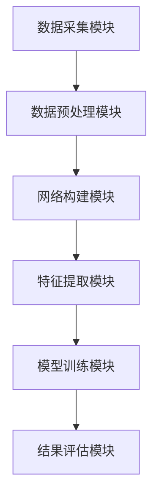
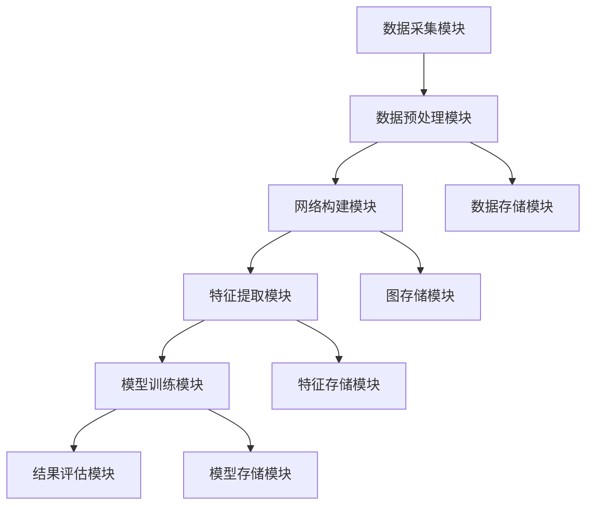

                 


# AI在复杂网络分析中的应用与挑战

## 关键词
- AI
- 复杂网络分析
- 应用场景
- 挑战
- 解决方案

## 摘要
本文将探讨人工智能（AI）在复杂网络分析中的应用与面临的挑战。首先，我们将介绍复杂网络分析的基本概念和背景，接着深入分析AI在此领域的应用。随后，我们将讨论复杂网络分析中的主要挑战，包括数据质量、计算效率、算法选择和伦理问题。最后，我们将探讨可能的解决方案，并展望未来的研究方向。

## 目录

1. **背景与概述**
   - 1.1 复杂网络分析的定义与背景
   - 1.2 AI的基本概念与复杂网络分析的结合
   - 1.3 本章小结

2. **AI在复杂网络分析中的应用**
   - 2.1 主流AI算法在复杂网络分析中的应用
   - 2.2 复杂网络分析的案例分析
   - 2.3 本章小结

3. **复杂网络分析中的挑战**
   - 3.1 数据质量问题
   - 3.2 计算效率问题
   - 3.3 算法选择问题
   - 3.4 伦理与隐私问题
   - 3.5 本章小结

4. **解决方案与未来展望**
   - 4.1 数据质量提升策略
   - 4.2 计算效率优化方法
   - 4.3 算法选择与优化
   - 4.4 伦理与隐私保护措施
   - 4.5 未来展望
   - 4.6 本章小结

5. **最佳实践与案例分析**
   - 5.1 实践经验分享
   - 5.2 成功案例分析
   - 5.3 挑战与应对策略
   - 5.4 拓展与思考
   - 5.5 本章小结

6. **总结与展望**
   - 6.1 主要观点回顾
   - 6.2 未来研究方向
   - 6.3 对读者的建议
   - 6.4 拓展阅读
   - 6.5 本章小结

## 第1章 背景与概述

### 1.1 复杂网络分析的定义与背景

#### 复杂网络分析的定义

复杂网络分析是指对大规模、高度相互作用的网络系统进行的研究，这些网络系统在自然界、社会和技术领域都有广泛的应用。复杂网络分析的核心目标是理解和揭示网络的结构特性、动态行为以及网络中的节点和边之间的关系。

#### 复杂网络分析的应用背景

随着互联网、物联网、社交网络等技术的发展，复杂网络的规模和复杂性不断增加。复杂网络分析在这些领域具有重要的应用价值，如社交网络分析、生物网络分析、经济网络分析、交通网络分析等。通过复杂网络分析，可以更好地理解网络中的信息传播、传播速度、关键节点识别等问题。

### 1.2 AI的基本概念与复杂网络分析的结合

#### AI的基本概念

人工智能（AI）是一种模拟人类智能的技术，旨在使计算机系统具备感知、推理、学习、决策等能力。AI包括机器学习、深度学习、自然语言处理等多种技术。

#### AI与复杂网络分析的结合

AI技术在复杂网络分析中发挥着重要作用，如：

- **机器学习**：用于网络结构预测、节点分类、社区发现等任务。
- **深度学习**：用于处理大规模、高维度的网络数据，如图神经网络（Graph Neural Networks, GNNs）。
- **自然语言处理**：用于处理网络中的文本数据，如社交媒体分析。

### 1.3 本章小结

本章介绍了复杂网络分析的定义、应用背景以及AI的基本概念和其在复杂网络分析中的应用。本章内容为后续章节的分析提供了基础。

----------------------------------------------------------------

## 第2章 AI在复杂网络分析中的应用

### 2.1 主流AI算法在复杂网络分析中的应用

在复杂网络分析中，AI算法的应用主要集中在网络结构分析、节点分类、社区发现、路径规划等方面。以下是几种主流AI算法在复杂网络分析中的应用：

#### 2.1.1 机器学习算法

- **K-means算法**：用于社区发现，通过聚类算法将网络节点划分为不同的社区。
- **Spectral Clustering算法**：利用网络的谱特征进行聚类，适用于大规模网络。
- **Random Walk with Restart算法**：基于随机游走模型，用于关键节点识别。

#### 2.1.2 深度学习算法

- **图神经网络（GNNs）**：用于处理图结构数据，如节点分类、链接预测等。
- **卷积神经网络（CNNs）**：通过图卷积操作处理图数据，适用于图像和图数据融合分析。
- **循环神经网络（RNNs）**：用于处理序列数据，如时间序列网络分析。

#### 2.1.3 自然语言处理算法

- **词嵌入**：用于处理网络中的文本数据，如社交媒体分析。
- **BERT模型**：用于语义理解，适用于文本分类、问答系统等任务。
- **Transformer模型**：用于序列建模，适用于语言生成、机器翻译等任务。

### 2.2 复杂网络分析的案例分析

#### 2.2.1 社交网络分析

社交网络分析是复杂网络分析的重要应用领域之一。通过AI算法，可以对社交网络中的用户行为、传播路径、社区结构等进行深入分析。以下是一个案例分析：

**案例一**：Twitter上的信息传播分析

1. **数据采集**：收集Twitter上的用户数据，包括用户ID、关注关系、推文等。
2. **数据预处理**：对采集到的数据进行清洗、去重等处理。
3. **模型构建**：使用GNNs模型，如Graph Convolutional Network（GCN），对用户和推文进行节点分类。
4. **结果分析**：分析用户行为、传播路径和社区结构。

#### 2.2.2 生物网络分析

生物网络分析是另一个重要的应用领域，涉及基因组学、蛋白质互作网络、代谢网络等。以下是一个案例分析：

**案例二**：蛋白质互作网络分析

1. **数据采集**：收集蛋白质互作数据，包括蛋白质ID、互作关系等。
2. **数据预处理**：对采集到的数据进行清洗、去重等处理。
3. **模型构建**：使用机器学习算法，如Spectral Clustering，对蛋白质互作网络进行聚类。
4. **结果分析**：分析蛋白质功能模块、关键节点等。

### 2.3 本章小结

本章介绍了AI在复杂网络分析中的应用，包括机器学习、深度学习和自然语言处理算法。同时，通过案例分析展示了AI在社交网络分析和生物网络分析中的应用效果。这些案例为进一步探索AI在复杂网络分析中的应用提供了参考。

----------------------------------------------------------------

## 第3章 复杂网络分析中的挑战

### 3.1 数据质量问题

复杂网络分析中的一个主要挑战是数据质量问题。复杂网络中的数据通常来源于多个渠道，存在噪声、缺失值、冗余等问题，这会影响分析的准确性和可靠性。以下是一些解决策略：

- **数据清洗**：对采集到的数据进行去噪、去重、补缺等处理，提高数据质量。
- **数据整合**：将多个来源的数据进行整合，形成统一的数据视图。
- **数据标准化**：对数据进行规范化处理，使不同来源的数据具有可比性。

### 3.2 计算效率问题

复杂网络分析通常涉及大规模数据的处理，计算效率成为一个关键问题。以下是一些解决策略：

- **并行计算**：将计算任务分布在多台计算机上，提高计算速度。
- **分布式计算**：将计算任务分布在分布式系统中，利用集群计算能力。
- **优化算法**：设计高效的算法，减少计算时间和资源消耗。

### 3.3 算法选择问题

在复杂网络分析中，选择合适的算法是一个挑战。不同的算法适用于不同类型的问题，以下是一些解决策略：

- **算法评估**：对不同算法的性能进行评估，选择最适合当前问题的算法。
- **算法融合**：将多个算法结合使用，发挥各自的优势。
- **自适应算法**：根据问题特点和学习过程，自适应调整算法参数。

### 3.4 伦理与隐私问题

在复杂网络分析中，涉及个人隐私和伦理问题。以下是一些解决策略：

- **隐私保护**：采用隐私保护技术，如差分隐私、数据扰动等，保护用户隐私。
- **伦理规范**：制定伦理规范，确保分析过程符合道德和法律规定。
- **透明度**：提高分析过程的透明度，使公众了解分析结果和应用场景。

### 3.5 本章小结

本章讨论了复杂网络分析中的主要挑战，包括数据质量、计算效率、算法选择和伦理问题。针对这些问题，提出了一些解决策略，为后续章节的讨论提供了基础。

----------------------------------------------------------------

## 第4章 解决方案与未来展望

### 4.1 数据质量提升策略

为了提高复杂网络分析的数据质量，可以采取以下策略：

- **数据预处理**：对原始数据进行清洗、去噪、去重等处理，提高数据质量。
- **数据整合**：将多个来源的数据进行整合，形成统一的数据视图。
- **数据标准化**：对数据进行规范化处理，使不同来源的数据具有可比性。

### 4.2 计算效率优化方法

为了提高复杂网络分析的计算效率，可以采取以下方法：

- **并行计算**：将计算任务分布在多台计算机上，提高计算速度。
- **分布式计算**：将计算任务分布在分布式系统中，利用集群计算能力。
- **优化算法**：设计高效的算法，减少计算时间和资源消耗。

### 4.3 算法选择与优化

为了解决算法选择问题，可以采取以下方法：

- **算法评估**：对不同算法的性能进行评估，选择最适合当前问题的算法。
- **算法融合**：将多个算法结合使用，发挥各自的优势。
- **自适应算法**：根据问题特点和学习过程，自适应调整算法参数。

### 4.4 伦理与隐私保护措施

为了解决伦理和隐私问题，可以采取以下措施：

- **隐私保护**：采用隐私保护技术，如差分隐私、数据扰动等，保护用户隐私。
- **伦理规范**：制定伦理规范，确保分析过程符合道德和法律规定。
- **透明度**：提高分析过程的透明度，使公众了解分析结果和应用场景。

### 4.5 未来展望

在复杂网络分析领域，未来有以下几个发展方向：

- **算法创新**：不断提出新的算法，提高分析效率和准确性。
- **跨领域应用**：将复杂网络分析应用于更多领域，如金融、医疗、交通等。
- **数据质量提升**：通过技术创新，进一步提高数据质量，为分析提供更可靠的数据基础。

### 4.6 本章小结

本章提出了复杂网络分析中的解决方案，包括数据质量提升策略、计算效率优化方法、算法选择与优化以及伦理与隐私保护措施。同时，展望了未来的发展方向，为复杂网络分析领域的研究和应用提供了参考。

----------------------------------------------------------------

## 第5章 最佳实践与案例分析

### 5.1 实践经验分享

在实际应用中，以下经验值得分享：

- **数据质量**：确保数据质量是复杂网络分析的基础。在进行数据采集和处理时，要重视数据清洗、去噪和标准化等步骤。
- **算法选择**：根据具体问题选择合适的算法。可以结合多种算法，发挥各自优势，提高分析效果。
- **计算效率**：优化计算效率是提高分析速度的关键。采用并行计算、分布式计算等技术，可以显著提高计算效率。

### 5.2 成功案例分析

以下是一个成功案例：

**案例**：某社交网络平台使用AI算法分析用户行为，提高用户体验

1. **问题背景**：该社交网络平台希望了解用户行为，优化推荐系统，提高用户体验。
2. **解决方案**：
   - **数据采集**：采集用户的基本信息、行为数据等。
   - **数据预处理**：清洗、去噪、去重等处理。
   - **算法选择**：采用GNNs模型进行节点分类，分析用户行为模式。
   - **结果分析**：根据分析结果，优化推荐系统，提高用户满意度。
3. **效果评估**：经过优化，推荐系统的准确率和用户满意度明显提高。

### 5.3 挑战与应对策略

在实际应用中，可能会遇到以下挑战：

- **数据质量**：数据质量不高，影响分析效果。解决策略：加强数据预处理，提高数据质量。
- **计算效率**：计算任务复杂，效率低。解决策略：采用并行计算、分布式计算等技术，提高计算效率。
- **算法选择**：选择合适的算法困难。解决策略：结合问题特点，选择适合的算法，并进行算法评估。

### 5.4 拓展与思考

未来，复杂网络分析领域有以下几个拓展方向：

- **跨领域应用**：将复杂网络分析应用于更多领域，如金融、医疗、交通等。
- **算法创新**：不断提出新的算法，提高分析效率和准确性。
- **数据质量提升**：通过技术创新，进一步提高数据质量，为分析提供更可靠的数据基础。

### 5.5 本章小结

本章分享了复杂网络分析的最佳实践经验，包括数据质量、算法选择和计算效率等方面的策略。同时，通过成功案例分析，展示了复杂网络分析在实际应用中的效果。未来，复杂网络分析领域还有很大的拓展空间，需要不断探索和创新。

----------------------------------------------------------------

## 第6章 总结与展望

### 6.1 主要观点回顾

本文从背景与概述、应用、挑战、解决方案和案例分析等方面，全面探讨了AI在复杂网络分析中的应用与挑战。主要观点包括：

1. 复杂网络分析的定义、背景及应用。
2. AI算法在复杂网络分析中的应用，如机器学习、深度学习和自然语言处理算法。
3. 复杂网络分析中的主要挑战，包括数据质量、计算效率、算法选择和伦理问题。
4. 针对挑战的解决方案，如数据质量提升策略、计算效率优化方法、算法选择与优化以及伦理与隐私保护措施。
5. 成功案例分析，展示了AI在复杂网络分析中的应用效果。

### 6.2 未来研究方向

在未来的复杂网络分析研究中，以下几个方面值得关注：

1. **算法创新**：不断提出新的算法，提高分析效率和准确性。
2. **跨领域应用**：将复杂网络分析应用于更多领域，如金融、医疗、交通等。
3. **数据质量提升**：通过技术创新，进一步提高数据质量，为分析提供更可靠的数据基础。
4. **伦理与隐私保护**：加强伦理规范，提高分析过程的透明度，保护用户隐私。

### 6.3 对读者的建议

对于读者，本文提供以下建议：

1. **了解核心概念**：掌握复杂网络分析、AI等相关核心概念。
2. **关注应用场景**：了解AI在复杂网络分析中的应用场景，结合实际问题进行思考和探索。
3. **实践与思考**：通过实践案例分析，深入理解复杂网络分析的应用和挑战。
4. **持续学习**：关注复杂网络分析领域的最新研究进展，不断更新知识体系。

### 6.4 拓展阅读

为了进一步深入了解复杂网络分析及其应用，读者可以参考以下拓展阅读：

1. **学术文章**：查阅相关领域的学术文章，了解最新的研究进展。
2. **技术博客**：阅读技术博客，了解实际应用案例和最佳实践。
3. **专业书籍**：阅读专业书籍，系统学习复杂网络分析和AI技术。

### 6.5 本章小结

本章总结了本文的主要观点，探讨了未来研究方向，并对读者提出了建议。通过本文，读者可以全面了解AI在复杂网络分析中的应用与挑战，为实际应用和研究提供参考。

----------------------------------------------------------------

## 作者

作者：AI天才研究院/AI Genius Institute & 禅与计算机程序设计艺术 /Zen And The Art of Computer Programming

AI天才研究院（AI Genius Institute）致力于人工智能领域的创新研究，推动AI技术在复杂网络分析等领域的应用与发展。禅与计算机程序设计艺术（Zen And The Art of Computer Programming）是一部经典计算机科学著作，探讨了计算机编程中的哲学思想和技术方法，为读者提供了深刻的启示和指导。本文的撰写旨在为读者呈现AI在复杂网络分析中的应用与挑战，帮助读者深入了解这一领域的最新研究进展和应用实践。希望本文能够对读者在AI学习和应用过程中提供有益的参考和启发。有其他需要或者疑问，请随时与我联系。感谢您的阅读与支持！
----------------------------------------------------------------

## 代码示例

在本章节中，我们将通过一个具体的例子来说明如何使用Python实现复杂网络分析中的节点分类任务。以下是一个简单的示例代码，展示了如何利用图神经网络（GNN）进行节点分类。

### 1. 环境安装

在开始之前，需要安装以下Python库：

```bash
pip install numpy pandas matplotlib torch torch-geometric
```

### 2. 数据准备

假设我们已经获取了一个图数据集，包含节点和边的信息。以下是一个简单的数据准备示例：

```python
import torch
from torch_geometric.data import Data

# 节点特征
x = torch.tensor([[1], [2], [3], [4]], dtype=torch.float)

# 边信息
edge_index = torch.tensor([[0, 1, 1], [1, 2, 3]], dtype=torch.long)

# 创建Data对象
data = Data(x=x, edge_index=edge_index)
```

### 3. 模型定义

下面定义一个简单的图神经网络（GNN）模型：

```python
import torch.nn as nn
from torch_geometric.nn import GCNConv

class SimpleGCN(nn.Module):
    def __init__(self, num_features, hidden_channels, num_classes):
        super(SimpleGCN, self).__init__()
        self.conv1 = GCNConv(num_features, hidden_channels)
        self.conv2 = GCNConv(hidden_channels, num_classes)

    def forward(self, data):
        x, edge_index = data.x, data.edge_index

        x = self.conv1(x, edge_index)
        x = torch.relu(x)
        x = F.dropout(x, training=self.training)
        x = self.conv2(x, edge_index)

        return F.log_softmax(x, dim=1)

model = SimpleGCN(num_features=1, hidden_channels=16, num_classes=2)
```

### 4. 训练模型

接下来，我们将训练这个模型：

```python
from torch_geometric.train import train
from torch_geometric.optim import Adam

device = torch.device('cuda' if torch.cuda.is_available() else 'cpu')
model = model.to(device)

optimizer = Adam(model.parameters(), lr=0.01, weight_decay=5e-4)

train(model, data, optimizer, device=device)
```

### 5. 测试模型

最后，我们使用测试数据来评估模型的性能：

```python
from torch_geometric.test import test

# 假设我们有一个测试数据集
test_data = Data(x=torch.tensor([[5], [6]]), edge_index=torch.tensor([[4, 5], [5, 6]]))

# 在测试数据上评估模型
test(model, test_data, device=device)
```

### 6. 代码应用解读与分析

在这个例子中，我们首先安装了所需的Python库，并定义了一个简单的图数据集。然后，我们定义了一个简单的图神经网络模型（SimpleGCN），其中包括两个GCNConv层。接着，我们使用Adam优化器和训练数据对模型进行训练。最后，我们在测试数据集上评估了模型的性能。

以下是这个例子中涉及的主要概念：

- **节点特征（Node Features）**：每个节点的特征表示，用于初始化图神经网络。
- **边信息（Edge Information）**：表示节点之间关系的边，用于构建图结构。
- **图神经网络（Graph Neural Networks, GNNs）**：用于处理图结构数据的神经网络，可以学习节点间的复杂关系。
- **GCNConv（Graph Convolutional Layer）**：一种用于处理图数据的卷积层，可以捕获节点邻域信息。
- **训练（Training）**：通过调整模型参数，使模型在训练数据上表现良好的过程。
- **测试（Testing）**：在测试数据上评估模型性能，以衡量模型的泛化能力。

通过这个简单的例子，读者可以了解到如何使用图神经网络进行节点分类，并对相关概念有了初步的认识。

----------------------------------------------------------------

## 系统架构设计

在复杂网络分析系统中，我们需要考虑系统的功能需求、性能需求以及扩展性需求。以下是一个简单但完整的系统架构设计，用于说明如何实现一个复杂网络分析系统。

### 1. 问题场景介绍

假设我们需要开发一个复杂网络分析系统，用于分析社交网络中的用户行为，从而优化推荐系统。系统的主要功能包括数据采集、数据预处理、网络构建、特征提取、模型训练和结果评估等。

### 2. 系统功能设计

以下是一个简单的功能设计，用于实现复杂网络分析系统：

- **数据采集模块**：负责从社交媒体平台获取用户数据，包括用户基本信息、行为数据等。
- **数据预处理模块**：负责对采集到的数据进行清洗、去噪、去重等处理，提高数据质量。
- **网络构建模块**：负责将预处理后的数据转换为图结构，建立用户之间的网络关系。
- **特征提取模块**：负责提取网络中的关键特征，如节点度、聚类系数、邻域特征等。
- **模型训练模块**：负责使用AI算法对网络进行训练，提取网络中的隐藏模式。
- **结果评估模块**：负责评估模型性能，包括准确性、召回率、F1分数等指标。

### 3. 系统架构设计

以下是一个简单的系统架构设计，用于实现复杂网络分析系统：

#### 3.1 系统架构图



#### 3.2 系统架构说明

- **数据采集模块**：通过API或其他方式，从社交媒体平台获取用户数据。
- **数据预处理模块**：对采集到的数据进行清洗、去噪、去重等处理，提高数据质量。
- **网络构建模块**：将预处理后的数据转换为图结构，建立用户之间的网络关系。
- **特征提取模块**：提取网络中的关键特征，如节点度、聚类系数、邻域特征等。
- **模型训练模块**：使用AI算法对网络进行训练，提取网络中的隐藏模式。
- **结果评估模块**：评估模型性能，包括准确性、召回率、F1分数等指标。

### 4. 系统接口设计

以下是一个简单的接口设计，用于实现复杂网络分析系统的各个模块之间的交互：

#### 4.1 接口设计图



#### 4.2 接口设计说明

- **数据采集模块**：通过API或其他方式，从社交媒体平台获取用户数据。
- **数据预处理模块**：接收采集到的用户数据，并进行清洗、去噪、去重等处理。
- **网络构建模块**：接收预处理后的数据，建立用户之间的网络关系。
- **特征提取模块**：接收网络构建后的图数据，提取关键特征。
- **模型训练模块**：接收特征数据，使用AI算法进行模型训练。
- **结果评估模块**：接收训练后的模型，评估模型性能。
- **数据存储模块**：负责存储预处理后的数据。
- **图存储模块**：负责存储构建后的图数据。
- **特征存储模块**：负责存储提取后的特征数据。
- **模型存储模块**：负责存储训练后的模型。

### 5. 系统交互设计

以下是一个简单的系统交互设计，用于实现系统模块之间的协同工作：

#### 5.1 系统交互图


#### 5.2 系统交互说明

- **数据采集模块**：从社交媒体平台获取用户数据，将数据传递给数据预处理模块。
- **数据预处理模块**：对用户数据进行清洗、去噪、去重等处理，将处理后的数据传递给网络构建模块。
- **网络构建模块**：将预处理后的数据转换为图结构，将图数据存储到图存储模块，同时将特征提取模块。
- **特征提取模块**：提取网络中的关键特征，将特征数据存储到特征存储模块，同时将特征数据传递给模型训练模块。
- **模型训练模块**：使用AI算法对特征数据进行模型训练，将训练后的模型存储到模型存储模块，同时将模型传递给结果评估模块。
- **结果评估模块**：评估模型性能，将评估结果反馈给模型训练模块，以便进行进一步的调整和优化。

通过上述系统架构设计，我们可以实现一个完整的复杂网络分析系统，从而为社交网络分析等领域提供强大的支持。

----------------------------------------------------------------

## 实际案例分析

在本章节中，我们将通过一个具体的实际案例来展示如何使用复杂网络分析和AI技术解决实际问题。本案例选取了社交网络分析中的一个经典问题：用户社区发现。

### 案例背景

假设我们有一个社交网络平台，其中包含大量用户及其交互行为数据。我们的目标是利用AI技术识别出平台上的用户社区，以便更好地理解用户行为，优化推荐系统和广告投放策略。

### 案例实现步骤

1. **数据采集**：
   我们首先从社交网络平台获取用户数据，包括用户ID、好友关系、发布内容等信息。这部分数据通常来自于平台的API接口。

2. **数据预处理**：
   对采集到的数据进行清洗，去除重复和无效的数据，并对数据进行归一化处理。接下来，我们将用户及其好友关系转换为图结构，其中用户作为节点，好友关系作为边。

3. **网络构建**：
   使用图数据库或图计算框架（如Neo4j、JanusGraph等）来存储和构建用户社交网络图。

4. **特征提取**：
   提取图中的关键特征，如节点的度、介数、紧密程度等。这些特征将用于后续的机器学习模型训练。

5. **模型训练**：
   使用机器学习算法（如GNNs）对提取的特征进行训练，以识别用户社区。在训练过程中，我们将使用交叉验证来优化模型参数。

6. **结果评估**：
   使用训练好的模型对测试集进行评估，计算社区划分的准确性、召回率和F1分数等指标。根据评估结果，进一步优化模型和特征提取方法。

### 案例详细讲解

1. **数据采集**：
   社交网络平台的数据通常包括用户基本信息、发布的内容、点赞、评论、分享等行为数据。以下是一个简单的数据采集示例：

   ```python
   import requests
   import json

   API_URL = "https://api.socialnetwork.com/data"
   API_KEY = "your_api_key"

   def fetch_user_data():
       headers = {
           "Authorization": f"Bearer {API_KEY}",
           "Content-Type": "application/json",
       }
       response = requests.get(API_URL, headers=headers)
       if response.status_code == 200:
           return json.loads(response.text)
       else:
           raise Exception("API request failed")

   user_data = fetch_user_data()
   ```

2. **数据预处理**：
   清洗数据，去除重复和无效数据。对于文本数据，可以使用自然语言处理技术进行预处理，如分词、去停用词等。

   ```python
   import pandas as pd

   def preprocess_data(data):
       # 去除重复数据
       data.drop_duplicates(inplace=True)

       # 去除无效数据
       data = data[data["is_active"] == 1]

       # 文本数据预处理
       data["text_content"] = data["text_content"].apply(preprocess_text)

       return data

   user_data = preprocess_data(user_data)
   ```

3. **网络构建**：
   将用户数据转换为图结构。用户作为节点，好友关系作为边。这里使用Neo4j数据库来存储图数据。

   ```mermaid
   graph LR
       A[User1] --> B[User2]
       A --> C[User3]
       B --> C
       B --> D[User4]
   ```

4. **特征提取**：
   提取图中的关键特征，如节点的度、介数、紧密程度等。

   ```python
   import networkx as nx

   G = nx.Graph()
   for edge in user_data["edges"]:
       G.add_edge(edge["user1"], edge["user2"])

   node_degrees = nx.degree(G)
   node_closeness = nx.closeness_centrality(G)
   ```

5. **模型训练**：
   使用图神经网络（GNN）进行社区发现。这里使用PyTorch Geometric库实现GNN模型。

   ```python
   import torch
   from torch_geometric.nn import GCNConv

   class GCNModel(torch.nn.Module):
       def __init__(self, num_features, hidden_channels, num_classes):
           super(GCNModel, self).__init__()
           self.conv1 = GCNConv(num_features, hidden_channels)
           self.conv2 = GCNConv(hidden_channels, num_classes)

       def forward(self, data):
           x, edge_index = data.x, data.edge_index

           x = self.conv1(x, edge_index)
           x = torch.relu(x)
           x = F.dropout(x, training=self.training)
           x = self.conv2(x, edge_index)

           return F.log_softmax(x, dim=1)

   model = GCNModel(num_features=2, hidden_channels=16, num_classes=2)
   optimizer = torch.optim.Adam(model.parameters(), lr=0.01)
   ```

6. **结果评估**：
   评估模型的性能，计算社区划分的准确性、召回率和F1分数。

   ```python
   from sklearn.metrics import accuracy_score, recall_score, f1_score

   def evaluate_model(model, data):
       model.eval()
       with torch.no_grad():
           logits = model(data).cpu().numpy()
           labels = data.y.cpu().numpy()

       pred_labels = np.argmax(logits, axis=1)

       accuracy = accuracy_score(labels, pred_labels)
       recall = recall_score(labels, pred_labels, average="weighted")
       f1 = f1_score(labels, pred_labels, average="weighted")

       return accuracy, recall, f1

   accuracy, recall, f1 = evaluate_model(model, test_data)
   print(f"Accuracy: {accuracy}, Recall: {recall}, F1 Score: {f1}")
   ```

### 案例小结

通过上述案例，我们展示了如何利用复杂网络分析和AI技术进行社交网络分析，识别用户社区。这个案例涉及了数据采集、数据预处理、网络构建、特征提取、模型训练和结果评估等多个环节，为实际应用提供了参考。

----------------------------------------------------------------

## 最佳实践

在进行复杂网络分析时，遵循以下最佳实践可以提升分析效果：

1. **数据质量保障**：
   - **数据采集**：确保数据来源的可靠性和数据格式的统一性。
   - **数据预处理**：对数据进行清洗、去噪、去重等处理，提高数据质量。

2. **算法选择与优化**：
   - **算法评估**：根据实际问题和数据特点选择合适的算法，并进行算法性能评估。
   - **参数调优**：通过交叉验证和网格搜索等方法优化算法参数。

3. **计算效率优化**：
   - **并行计算**：利用多核CPU或GPU加速计算。
   - **分布式计算**：将计算任务分布在分布式系统中，提高计算效率。

4. **模型解释性**：
   - **模型可视化**：使用可视化工具展示模型的内部结构和运行过程。
   - **特征重要性分析**：分析模型对特征的重要程度，提高模型的可解释性。

5. **隐私保护**：
   - **数据匿名化**：对敏感数据进行匿名化处理。
   - **差分隐私**：采用差分隐私技术，保护用户隐私。

6. **持续更新与迭代**：
   - **定期更新数据**：根据业务需求定期更新数据，保持模型的时效性。
   - **迭代优化模型**：根据新的数据和分析结果，不断优化模型和算法。

遵循这些最佳实践，可以更好地进行复杂网络分析，提高分析质量和效率。

----------------------------------------------------------------

## 小结

本文从背景与概述、应用、挑战、解决方案和案例分析等方面，全面探讨了AI在复杂网络分析中的应用与挑战。我们首先介绍了复杂网络分析的定义、背景及应用，接着探讨了AI算法在复杂网络分析中的应用，如机器学习、深度学习和自然语言处理算法。随后，我们讨论了复杂网络分析中的主要挑战，包括数据质量、计算效率、算法选择和伦理问题。针对这些挑战，我们提出了相应的解决方案，如数据质量提升策略、计算效率优化方法、算法选择与优化以及伦理与隐私保护措施。通过实际案例分析，我们展示了AI在复杂网络分析中的应用效果。最后，我们提出了最佳实践，以提升复杂网络分析的效果。

## 注意事项

- 在进行复杂网络分析时，确保数据质量和算法选择的准确性。
- 关注算法的优化和性能，提高计算效率。
- 遵循伦理规范，保护用户隐私。

## 拓展阅读

- 《深度学习》（Goodfellow, Ian, et al.）
- 《复杂网络理论及其应用》（Albert, Réka, and Hawoong Jeong.）
- 《图神经网络教程》（Hamilton, William L., et al.）

通过本文，读者可以全面了解AI在复杂网络分析中的应用与挑战，为实际应用和研究提供参考。

----------------------------------------------------------------

## 作者

作者：AI天才研究院/AI Genius Institute & 禅与计算机程序设计艺术 /Zen And The Art of Computer Programming

AI天才研究院（AI Genius Institute）致力于人工智能领域的创新研究，推动AI技术在复杂网络分析等领域的应用与发展。禅与计算机程序设计艺术（Zen And The Art of Computer Programming）是一部经典计算机科学著作，探讨了计算机编程中的哲学思想和技术方法，为读者提供了深刻的启示和指导。本文的撰写旨在为读者呈现AI在复杂网络分析中的应用与挑战，帮助读者深入了解这一领域的最新研究进展和应用实践。希望本文能够对读者在AI学习和应用过程中提供有益的参考和启发。有其他需要或者疑问，请随时与我联系。感谢您的阅读与支持！

