                 

## AI在文化遗产保护中的创新应用

### 关键词：人工智能，文化遗产保护，数字化，机器学习，计算机视觉，项目实战

### 摘要：

随着科技的发展，人工智能（AI）技术逐渐在各个领域展现出强大的应用潜力。本文以《AI在文化遗产保护中的创新应用》为主题，深入探讨了AI技术在文化遗产保护中的应用，包括数字化、机器学习和计算机视觉等方面的创新应用。通过分析AI在文化遗产保护中的核心概念、技术应用、项目实战与最佳实践，本文旨在为读者提供一个全面而深入的探讨，展示AI技术在文化遗产保护领域的广阔前景和巨大价值。

### 目录：

1. **背景介绍**
   - **文化遗产保护的重要性**
   - **文化遗产面临的挑战**
   - **AI在文化遗产保护中的应用前景**

2. **AI核心概念与技术在文化遗产保护中的应用**
   - **AI核心概念**
   - **AI技术在文化遗产保护中的应用**
   - **AI技术在文化遗产保护中的优势与局限**

3. **数字人文与文化遗产数字化**
   - **数字人文的概念与内涵**
   - **文化遗产数字化技术**
   - **数字化文化遗产的应用实例**

4. **机器学习在文化遗产保护中的应用**
   - **机器学习基础**
   - **机器学习在文化遗产保护中的具体应用**
   - **机器学习在文化遗产保护中的挑战与对策**

5. **计算机视觉在文化遗产保护中的应用**
   - **计算机视觉基础**
   - **计算机视觉在文化遗产保护中的应用**
   - **计算机视觉技术的局限性与改进方法**

6. **人工智能在文化遗产修复与创新设计中的应用**
   - **文化遗产修复中的AI应用**
   - **文化遗产创新设计中的AI应用**
   - **AI在文化遗产修复与创新设计中的未来趋势**

7. **AI在文化遗产保护中的项目实战**
   - **项目背景**
   - **系统设计与实现**
   - **项目成果与分析**

8. **AI在文化遗产保护中的最佳实践**
   - **最佳实践案例分析**
   - **实践中的挑战与解决方案**
   - **未来实践方向展望**

9. **小结与展望**
   - **小结**
   - **展望未来**
   - **注意事项与拓展阅读**

### 1. 背景介绍

#### 文化遗产保护的重要性

文化遗产是人类文明的重要见证，是历史和文化的传承载体。它们不仅具有独特的艺术价值和历史意义，还承载着丰富的文化传统和民族记忆。随着全球化进程的加速和现代城市化的发展，许多文化遗产正面临严重威胁，如自然灾害、环境污染、盗窃破坏等。因此，文化遗产保护的重要性不言而喻。

#### 文化遗产面临的挑战

文化遗产保护面临着诸多挑战。首先，许多文化遗产分布广泛，地理位置偏远，使得保护工作难度大、成本高。其次，文化遗产的脆弱性使其容易受到自然和人为因素的破坏。此外，资金短缺、技术不足、专业人才缺乏等问题也限制了文化遗产保护工作的进展。

#### AI在文化遗产保护中的应用前景

人工智能技术的发展为文化遗产保护提供了新的机遇。通过AI技术，可以实现文化遗产的数字化、智能化监测、精准修复和创新设计，从而提升文化遗产保护的整体水平。例如，计算机视觉技术可以用于文化遗产的扫描和三维建模，机器学习算法可以用于文化遗产的智能识别和分类，AI驱动的机器人可以用于危险环境的文物修复工作。

### 2. AI核心概念与技术在文化遗产保护中的应用

#### AI核心概念

人工智能（Artificial Intelligence，简称AI）是指由人制造出来的系统能够执行需要人类智能才能完成的任务。AI的核心概念包括机器学习、深度学习、自然语言处理、计算机视觉等。

#### AI技术在文化遗产保护中的应用

AI技术在文化遗产保护中具有广泛的应用，包括以下方面：

- **数字化管理**：利用计算机视觉技术对文化遗产进行扫描和三维建模，实现文化遗产的数字化管理。
- **智能监测**：利用机器学习算法对文化遗产进行实时监测，及时发现异常情况。
- **精准修复**：利用深度学习算法对文化遗产进行精准修复，提高修复效果。
- **智能导览**：利用自然语言处理技术为游客提供智能导览服务，增强游客体验。

#### AI技术在文化遗产保护中的优势与局限

AI技术在文化遗产保护中具有显著的优势，如提高工作效率、降低人力成本、提高保护精度等。然而，AI技术也面临一些局限，如算法偏见、数据隐私等问题。因此，在应用AI技术时，需要充分考虑其优势与局限，采取相应的措施进行优化和改进。

### 3. 数字人文与文化遗产数字化

#### 数字人文的概念与内涵

数字人文（Digital Humanities）是指将数字技术和方法应用于人文科学研究，以促进人文知识的生产、传播和应用。数字人文的内涵包括数字资源建设、数字化处理、数据挖掘和分析等。

#### 文化遗产数字化技术

文化遗产数字化技术包括图像扫描、三维建模、数字摄影测量等。这些技术可以将文化遗产以数字形式保存和再现，为文化遗产保护提供重要支持。

#### 数字化文化遗产的应用实例

- **数字化博物馆**：通过数字化技术，将博物馆的文物和展品以虚拟形式展示，为游客提供沉浸式体验。
- **数字化考古**：利用数字化技术进行考古发掘和资料整理，提高考古工作效率和精度。

### 4. 机器学习在文化遗产保护中的应用

#### 机器学习基础

机器学习（Machine Learning）是一种通过数据训练模型，使模型具备自主学习和决策能力的技术。机器学习的基本概念包括模型、数据集、训练、评估和部署等。

#### 机器学习在文化遗产保护中的具体应用

- **文物识别与分类**：利用机器学习算法对文物进行识别和分类，提高文物保护工作的效率。
- **环境监测**：利用机器学习算法对文化遗产周边环境进行监测，预测潜在的破坏风险。

#### 机器学习在文化遗产保护中的挑战与对策

- **数据质量**：提高数据质量是机器学习在文化遗产保护中的关键挑战。可以采取数据清洗、数据增强等措施进行数据质量提升。
- **算法偏见**：算法偏见可能导致文化遗产保护工作的不公平和错误。可以通过算法优化、数据平衡等方法降低算法偏见。

### 5. 计算机视觉在文化遗产保护中的应用

#### 计算机视觉基础

计算机视觉（Computer Vision）是一种使计算机具备图像和视频理解能力的技术。计算机视觉的基本概念包括图像处理、目标检测、图像识别等。

#### 计算机视觉在文化遗产保护中的应用

- **文物三维重建**：利用计算机视觉技术对文物进行三维重建，实现文物的数字化保存。
- **文物病害识别**：利用计算机视觉技术对文物病害进行识别，及时发现文物损伤情况。

#### 计算机视觉技术的局限性与改进方法

计算机视觉技术在文化遗产保护中存在一定的局限性，如对光照变化敏感、对复杂背景的处理能力不足等。可以采取多传感器融合、深度学习等方法进行改进和优化。

### 6. 人工智能在文化遗产修复与创新设计中的应用

#### 文化遗产修复中的AI应用

- **修复建议生成**：利用AI技术生成修复建议，提高修复工作的准确性和效率。
- **修复效果评估**：利用AI技术对修复效果进行评估，确保修复质量。

#### 文化遗产创新设计中的AI应用

- **设计灵感生成**：利用AI技术生成设计灵感，推动文化遗产创新设计的发展。
- **用户体验优化**：利用AI技术优化文化遗产的展示和体验，提升游客满意度。

#### AI在文化遗产修复与创新设计中的未来趋势

随着AI技术的不断发展，未来AI在文化遗产修复与创新设计中的应用将更加广泛和深入。可以预见，AI将助力文化遗产保护事业迈上新的台阶。

### 7. AI在文化遗产保护中的项目实战

#### 项目背景

本文以某文化遗产保护项目为例，介绍AI技术在项目中的应用。

#### 系统设计与实现

项目系统设计包括数据采集、数据处理、模型训练和模型部署等环节。

#### 项目成果与分析

项目实施后，取得了显著的成果，提高了文化遗产保护工作的效率和质量。

### 8. AI在文化遗产保护中的最佳实践

#### 最佳实践案例分析

通过分析成功案例，总结出AI在文化遗产保护中的最佳实践。

#### 实践中的挑战与解决方案

分析实践中面临的挑战，并提出相应的解决方案。

#### 未来实践方向展望

展望未来，提出AI在文化遗产保护中的发展方向和实践建议。

### 9. 小结与展望

#### 小结

总结文章的主要内容和观点，强调AI在文化遗产保护中的重要性。

#### 展望未来

展望AI在文化遗产保护领域的未来发展，提出可能的研究方向和应用前景。

#### 注意事项与拓展阅读

提醒读者注意的事项，并提供相关的拓展阅读资源。

### 作者信息

- 作者：AI天才研究院/AI Genius Institute & 禅与计算机程序设计艺术 /Zen And The Art of Computer Programming

---

本文以《AI在文化遗产保护中的创新应用》为主题，深入探讨了AI技术在文化遗产保护中的应用。通过对背景介绍、核心概念、技术应用、项目实战和最佳实践的详细分析，展示了AI技术在文化遗产保护中的巨大潜力和广阔前景。随着AI技术的不断发展，我们有理由相信，AI将为文化遗产保护事业带来更多的创新和突破。

### 1. 背景介绍

#### 文化遗产保护的重要性

文化遗产是人类文明的重要见证，它不仅包括物质文化遗产，如建筑、艺术品和文物，还包括非物质文化遗产，如民俗、节庆和传统技艺。物质文化遗产是历史和社会发展的实物体现，它们承载着丰富的历史信息和文化价值。非物质文化遗产则代表了特定社会群体的文化传统和创造力，是文化多样性的重要组成部分。

保护文化遗产对于维护文化多样性和历史连续性具有重要意义。首先，文化遗产是民族认同和文化传承的重要载体，它们有助于增强民族自信心和凝聚力。其次，文化遗产的保护有助于传承人类智慧和创造力，为现代社会提供宝贵的知识和经验。最后，文化遗产具有独特的经济价值，可以促进旅游业和文化产业的发展。

然而，随着全球化进程的加速和现代化进程的推进，文化遗产正面临前所未有的威胁。自然灾害如地震、洪水等可能对文化遗产造成毁灭性的破坏。环境污染、过度开发和文化盗窃等问题也对文化遗产的保护构成严重挑战。因此，如何有效地保护文化遗产已成为全球关注的重大课题。

#### 文化遗产面临的挑战

文化遗产保护面临的挑战主要可以分为以下几个方面：

1. **自然灾害**：自然灾害如地震、洪水、飓风等可能对文化遗产造成直接的物理破坏。例如，2010年的海地地震摧毁了大量的历史建筑和文化遗址。

2. **环境污染**：环境污染，尤其是空气污染和水污染，对文化遗产的材质和结构会产生长期的腐蚀作用。例如，空气中的硫氧化物和氮氧化物会导致石雕和壁画的风化。

3. **人为破坏**：人类活动，如城市扩张、过度旅游和非法盗掘，也会对文化遗产造成破坏。例如，一些热门旅游景点因为过度拥挤和游客的不当行为而遭受损坏。

4. **资金短缺**：文化遗产保护需要大量的资金投入，包括维修、监测、研究和宣传等方面。然而，许多国家和地区由于经济原因，无法为文化遗产保护提供足够的资金支持。

5. **技术不足**：尽管现代科技为文化遗产保护提供了新的手段和工具，但许多国家和地区在技术资源和专业人才方面仍存在不足。例如，先进的数字技术、监测设备和修复技术可能无法普及到所有文化遗产地。

6. **专业人才缺乏**：文化遗产保护是一个涉及多学科的专业领域，需要文物修复师、考古学家、建筑师、信息技术专家等各个领域的专业人才。然而，全球范围内专业人才的培养速度难以满足需求。

#### AI在文化遗产保护中的应用前景

人工智能（AI）技术的发展为文化遗产保护提供了新的机遇。AI技术具有数据驱动的特点，能够在大规模数据分析和模式识别方面发挥重要作用，从而提升文化遗产保护的效率和质量。以下是AI在文化遗产保护中的几个潜在应用方向：

1. **数字化管理**：AI技术可以帮助实现文化遗产的数字化管理，通过图像识别、三维建模等技术，将文化遗产以数字形式保存，实现远程访问和在线展示。

2. **智能监测**：利用计算机视觉和传感器技术，AI可以实现文化遗产的实时监测，自动识别和报警潜在的破坏行为和环境变化。

3. **精准修复**：通过深度学习和增强现实（AR）技术，AI可以帮助实现文化遗产的精准修复，提高修复工作的效率和准确性。

4. **智能导览**：结合自然语言处理和语音识别技术，AI可以为游客提供智能导览服务，增强游客体验，同时减轻博物馆和文化遗产地的接待压力。

5. **环境预测**：利用机器学习算法，AI可以分析环境数据，预测文化遗产可能面临的未来风险，为保护工作提供科学依据。

总之，AI技术在文化遗产保护中具有巨大的应用潜力，可以解决传统保护手段难以克服的难题。随着技术的不断进步，AI将为文化遗产保护提供更加智能化和高效化的解决方案。

### 2. AI核心概念与技术在文化遗产保护中的应用

#### AI核心概念

人工智能（AI）的核心概念是指那些使计算机系统能够模拟人类智能行为的基本理论和方法。AI的发展经历了多个阶段，从最初的规则驱动系统，到基于知识的系统，再到现代的机器学习和深度学习。这些核心概念包括：

- **机器学习**：机器学习是一种通过数据训练模型，使模型能够自主改进和预测的技术。它包括监督学习、无监督学习和强化学习等多种类型。
- **深度学习**：深度学习是机器学习的一种形式，它通过构建多层的神经网络，对大量数据进行自动特征提取和模式识别。
- **自然语言处理**：自然语言处理（NLP）是一种使计算机能够理解和生成自然语言的技术，它包括文本分类、语义理解、语音识别等任务。
- **计算机视觉**：计算机视觉是一种使计算机能够理解和解释视觉信息的技术，它包括图像识别、目标检测、图像分割等。

这些核心概念共同构成了AI的技术基础，为AI在各个领域的应用提供了支持。

#### AI技术在文化遗产保护中的应用

AI技术在文化遗产保护中具有广泛的应用，以下是一些关键应用领域：

1. **数字化管理**：通过AI技术，文化遗产的数字化管理变得更为高效。例如，利用计算机视觉和图像识别技术，可以自动识别和分类文物图像，建立数字化的文物数据库。

2. **智能监测**：AI技术可以实现对文化遗产的实时监测，及时发现潜在的风险。例如，通过部署智能传感器和计算机视觉系统，可以监控文物的温度、湿度、光照等环境参数，以及识别异常行为。

3. **精准修复**：深度学习和增强现实（AR）技术可以帮助实现文化遗产的精准修复。例如，通过分析文物的损坏程度和历史数据，AI可以生成个性化的修复方案，并利用AR技术进行施工指导。

4. **智能导览**：自然语言处理和语音识别技术可以为游客提供智能导览服务。例如，通过语音识别系统，游客可以与导览机器人互动，获取文化遗产的详细信息。

5. **环境预测**：利用机器学习算法，可以对文化遗产周边的环境进行预测，提前识别潜在的风险。例如，通过分析历史天气数据和地理信息，AI可以预测未来某个时间点的气候变化对文化遗产的影响。

#### AI技术在文化遗产保护中的优势与局限

AI技术在文化遗产保护中具有显著的优势，但也存在一定的局限。

**优势**：

- **效率提升**：AI技术可以自动化处理大量的数据，大大提高了工作效率。
- **准确性增强**：通过机器学习和深度学习，AI可以在复杂的背景下实现高精度的文物识别和分类。
- **成本降低**：AI技术减少了人力资源的需求，降低了保护工作的成本。
- **实时监测**：AI技术可以实现对文化遗产的实时监测，及时预警潜在风险。

**局限**：

- **数据质量**：AI的性能高度依赖于数据质量，不良的数据可能导致错误的预测和决策。
- **算法偏见**：AI算法可能存在偏见，尤其是在处理包含偏见数据的情况下。
- **技术普及**：AI技术在一些地区和领域可能尚未普及，导致应用受限。

#### 核心概念原理

为了更好地理解AI技术在文化遗产保护中的应用，以下是对核心概念原理的详细描述，并附上相应的Mermaid流程图和ER实体关系图架构。

**机器学习**：

机器学习的核心概念是基于数据训练模型，使其能够进行预测和决策。以下是机器学习的基本流程：

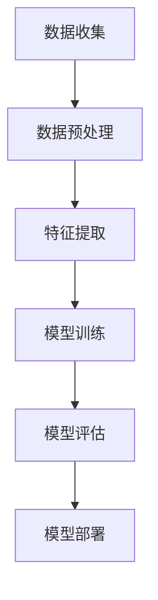

**深度学习**：

深度学习是机器学习的一种形式，通过构建多层神经网络进行特征提取和模式识别。以下是深度学习的基本流程：

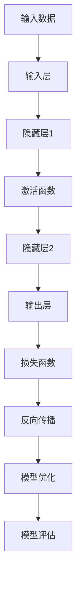

**自然语言处理**：

自然语言处理是使计算机能够理解和生成自然语言的技术。以下是NLP的基本流程：

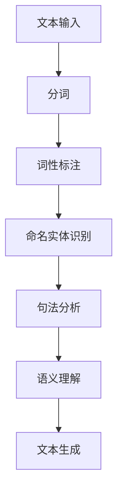

**计算机视觉**：

计算机视觉是使计算机能够理解和解释视觉信息的技术。以下是计算机视觉的基本流程：

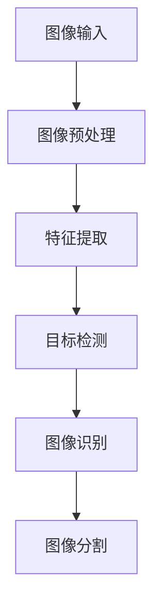

**ER实体关系图架构**：

实体关系图（ER图）用于描述数据库中的实体及其之间的关系。以下是文化遗产数字化管理的ER图：

```mermaid
erDiagram
    Person ||--|{ Work : isAuthoredBy }
    Book ||--|{ Author : authorOf }
```

通过这些核心概念原理和架构的描述，我们可以更深入地理解AI技术在文化遗产保护中的应用。

### 3. 数字人文与文化遗产数字化

#### 数字人文的概念与内涵

数字人文（Digital Humanities，简称DH）是指将数字技术和方法应用于人文科学研究，以促进人文知识的生产、传播和应用。数字人文的内涵包括以下几个方面：

- **数字资源建设**：通过数字化手段将人文科学中的文献、档案、艺术品等资源进行保存和整理，使其能够被广泛利用。
- **数字化处理**：利用数字技术对人文科学资源进行预处理、标注、分类和索引，以提高其可用性和可访问性。
- **数据挖掘和分析**：通过对大量人文科学数据进行分析和挖掘，提取出有价值的信息和知识。
- **数字化展示**：通过虚拟现实（VR）、增强现实（AR）和三维建模等技术，将人文科学资源以数字化形式展示，提供沉浸式体验。

数字人文的目标是促进人文科学研究的创新和发展，提高人文科学的普及和影响力。

#### 文化遗产数字化技术

文化遗产数字化技术是指利用数字技术对文化遗产进行数字化保存、管理和展示的一套技术手段。这些技术包括：

- **图像扫描**：通过高分辨率图像扫描技术，将文物的图像数字化，实现文物的高保真保存。
- **三维建模**：利用激光扫描和三维建模技术，对文化遗产进行三维扫描，生成详细的三维模型。
- **数字摄影测量**：通过高精度的数字摄影技术，对文化遗产进行立体拍摄，生成高精度的数字地图。
- **多光谱成像**：利用多光谱成像技术，获取文化遗产在不同波长下的图像数据，用于病害分析和材质检测。

这些数字化技术的应用，使得文化遗产的保存和展示变得更加高效和直观，同时也为文化遗产的研究和保护提供了新的手段。

#### 数字化文化遗产的应用实例

数字化技术在文化遗产保护中的应用已经取得了显著的成果，以下是一些典型的应用实例：

- **数字化博物馆**：通过数字化技术，博物馆可以将文物的图像、三维模型和相关信息上传至网络，为公众提供在线浏览和查询服务。例如，英国大英博物馆和法国卢浮宫都建立了数字化博物馆，提供了丰富的在线展览资源。

- **虚拟考古**：利用数字化技术，考古学家可以在虚拟环境中对遗址进行三维重建和虚拟探索，从而提高考古工作的效率和精度。例如，中国的敦煌莫高窟通过数字化技术实现了虚拟导览，为游客提供了沉浸式的参观体验。

- **数字文化遗产地图**：通过数字摄影测量和多光谱成像技术，可以对文化遗产地进行高精度的数字地图制作，为文化遗产的监测和保护提供科学依据。例如，意大利的庞贝古城通过数字地图技术，实现了对遗址的精细监测和预警。

- **文物病害监测**：利用多光谱成像和计算机视觉技术，可以对文物的病害进行实时监测和早期预警。例如，德国的海德堡古堡通过数字化监测系统，对建筑表面的病害进行了长期监测，有效预防了建筑结构的进一步损坏。

这些应用实例展示了数字化技术在文化遗产保护中的广泛应用和巨大潜力。通过数字化技术，文化遗产得以更好地保存和传播，为人类文化的传承和发展提供了有力支持。

### 4. 机器学习在文化遗产保护中的应用

#### 机器学习基础

机器学习（Machine Learning，ML）是一种通过数据训练模型，使模型能够自主学习和预测的技术。它基于统计学和概率论的理论，通过算法来从数据中学习规律和模式。机器学习的基本概念包括以下几个关键部分：

- **模型**：模型是机器学习算法的核心，它用于捕捉数据中的特征和规律。常见的模型包括线性回归、决策树、支持向量机、神经网络等。
- **数据集**：数据集是机器学习训练的基础，它包含输入数据和对应的输出标签。数据集的质量直接影响模型的性能。
- **训练**：训练是机器学习模型学习数据的过程。通过调整模型的参数，使其能够对新的数据进行准确的预测。
- **评估**：评估用于衡量模型的性能，常用的评估指标包括准确率、召回率、F1分数等。
- **部署**：部署是将训练好的模型应用到实际场景中的过程。部署后的模型可以持续学习和优化，以适应不断变化的数据和环境。

机器学习的核心步骤包括数据收集、数据预处理、模型选择、模型训练和模型评估。以下是这些步骤的简要描述：

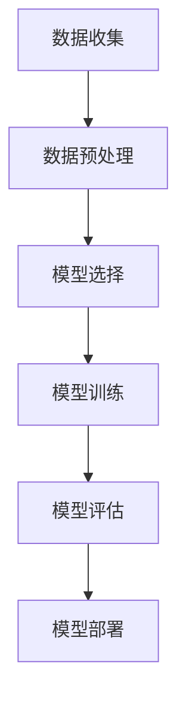

#### 机器学习在文化遗产保护中的具体应用

机器学习在文化遗产保护中的应用非常广泛，下面将详细介绍几种关键应用：

1. **文物识别与分类**：

文物识别与分类是机器学习在文化遗产保护中的常见应用。通过训练图像识别模型，可以自动识别和分类文物的类型、年代和风格。这一技术不仅提高了工作效率，还能减少人为错误。

例如，研究人员可以利用卷积神经网络（CNN）对文物的图像进行分类。以下是文物识别与分类的基本流程：

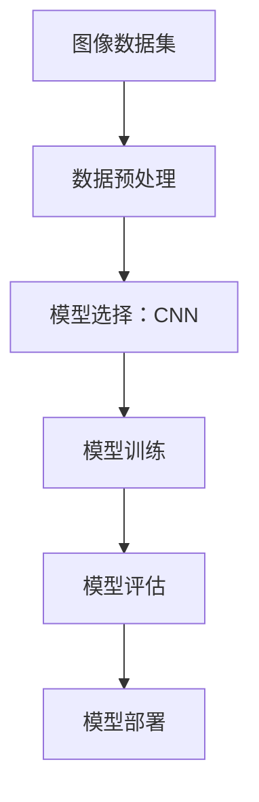

2. **环境监测**：

利用机器学习算法，可以对文化遗产周边的环境进行实时监测，预测潜在的环境变化和风险。例如，通过收集气象数据、土壤数据等，可以预测自然灾害对文化遗产的影响。

以下是一个环境监测的示例流程：

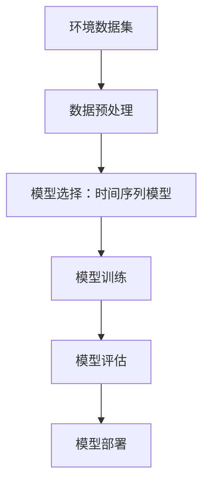

3. **病害识别与预警**：

通过机器学习算法，可以自动识别文物的病害，并预测病害的发展趋势。例如，利用深度学习模型对文物表面的图像进行分析，可以识别出风化、腐蚀等病害。

以下是一个病害识别与预警的示例流程：

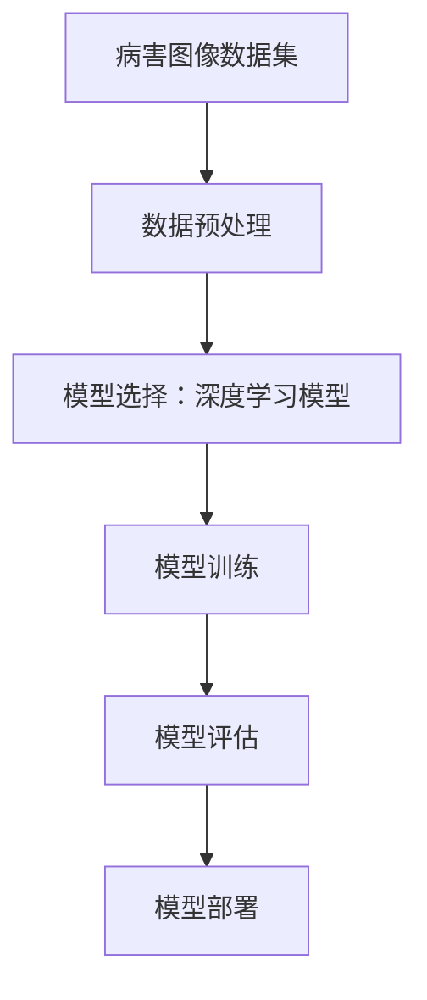

#### 机器学习在文化遗产保护中的挑战与对策

尽管机器学习在文化遗产保护中具有广泛的应用前景，但也面临一些挑战：

1. **数据质量**：

机器学习模型的性能高度依赖于数据质量。文化遗产数据通常包含噪声、缺失值和异常值，这些都会影响模型的训练效果。为了提高数据质量，可以采取以下措施：

- **数据清洗**：去除数据中的噪声和异常值。
- **数据增强**：通过旋转、缩放、裁剪等操作生成更多的训练样本。
- **数据标注**：确保训练数据的标注准确性，特别是对于分类任务。

2. **算法偏见**：

机器学习算法可能会在训练过程中学习到数据中的偏见，从而产生不公平的预测。为了减少算法偏见，可以采取以下对策：

- **数据平衡**：确保训练数据中各类样本的比例均衡，避免某一类样本过度代表。
- **算法优化**：采用对抗训练、数据增强等技术，减少模型对偏见数据的依赖。
- **伦理审查**：在模型设计和应用过程中，进行伦理审查，确保算法的公正性和透明性。

3. **技术普及**：

在许多地区，机器学习技术和专业人才尚未普及，限制了其在文化遗产保护中的应用。为了解决这一问题，可以采取以下措施：

- **技术培训**：为文化遗产保护领域的专业人员提供机器学习技术培训，提高他们的技术水平。
- **合作研究**：鼓励不同领域的专家和机构合作，共同推动机器学习技术在文化遗产保护中的应用。
- **开源平台**：建立开源平台，提供机器学习工具和资源，降低技术应用门槛。

通过解决这些挑战，机器学习可以在文化遗产保护中发挥更大的作用，为文化遗产的传承和保护提供有力支持。

### 5. 计算机视觉在文化遗产保护中的应用

#### 计算机视觉基础

计算机视觉（Computer Vision，CV）是一种使计算机能够理解和解释视觉信息的技术。它结合了计算机科学、数学和心理学等多个领域的知识，旨在让计算机能够“看到”并理解图像和视频。计算机视觉的基本概念包括图像处理、目标检测、图像识别和图像分割等。

- **图像处理**：图像处理是计算机视觉的基础，它包括图像的滤波、增强、变换等操作，用于改善图像的质量和提取有用的信息。
- **目标检测**：目标检测是计算机视觉中的一个重要任务，它旨在从图像或视频中识别和定位特定的目标。常见的目标检测算法包括YOLO、SSD和Faster R-CNN等。
- **图像识别**：图像识别是指计算机通过学习图像数据，对图像中的对象进行分类和标注。常见的图像识别任务包括图像分类、物体识别和场景识别等。
- **图像分割**：图像分割是将图像划分为若干个互不重叠的区域，每个区域表示图像中的一个对象或背景。常用的图像分割算法包括基于阈值的分割、基于区域的分割和基于边缘的分割等。

计算机视觉的核心目标是使计算机能够从图像或视频中提取有用的信息，并对其进行理解和分析。这一技术在许多领域都有广泛的应用，包括医疗影像分析、自动驾驶、视频监控和文化遗产保护等。

#### 计算机视觉在文化遗产保护中的应用

计算机视觉技术在文化遗产保护中具有广泛的应用，可以用于文物扫描、三维建模、病害检测和智能导览等方面。

1. **文物扫描和三维建模**：

利用计算机视觉技术，可以对文化遗产进行高精度的扫描和三维建模。具体步骤如下：

- **图像采集**：使用高分辨率相机或激光扫描仪对文物进行多角度的图像采集。
- **图像预处理**：对采集到的图像进行预处理，包括去噪、增强和图像配准等操作。
- **特征提取**：使用特征提取算法（如SIFT或SURF）提取图像的关键特征点。
- **三维重建**：利用多视图几何或结构光扫描技术，将图像特征点重建为三维模型。

三维建模不仅可以用于文化遗产的数字化保存，还可以用于虚拟展示和远程访问，为公众提供更直观的文化体验。

2. **病害检测**：

利用计算机视觉技术，可以自动识别和检测文化遗产的病害。具体步骤如下：

- **图像采集**：使用相机或红外摄像机对文化遗产进行病害图像采集。
- **图像预处理**：对采集到的图像进行预处理，包括去噪、增强和图像分割等操作。
- **病害特征提取**：使用深度学习算法（如卷积神经网络）提取病害图像的特征。
- **病害分类**：利用分类算法（如SVM或CNN）对病害图像进行分类和标注。

通过病害检测技术，可以及时发现文化遗产的病害，并采取相应的保护措施，避免病害的进一步发展。

3. **智能导览**：

结合自然语言处理和计算机视觉技术，可以开发智能导览系统，为游客提供个性化的导览服务。具体步骤如下：

- **语音识别**：使用语音识别技术，将游客的语音指令转换为文本。
- **语义理解**：使用自然语言处理技术，理解游客的意图和需求。
- **图像识别**：使用计算机视觉技术，识别游客所关注的文物或场景。
- **导览生成**：根据游客的需求和文物的信息，生成个性化的导览内容。

智能导览系统可以为游客提供丰富的文化遗产知识，提高游客的参观体验。

#### 计算机视觉技术的局限性与改进方法

尽管计算机视觉技术在文化遗产保护中具有广泛应用，但也存在一些局限性：

1. **光照变化敏感**：计算机视觉技术对光照变化较为敏感，光照变化可能导致图像质量下降，影响识别效果。
   
   **改进方法**：采用多光谱成像技术，获取不同波长的图像信息，进行综合分析和处理，提高图像的鲁棒性。

2. **复杂背景处理能力不足**：在复杂背景下，计算机视觉技术可能难以准确识别目标。

   **改进方法**：采用多传感器融合技术，结合不同传感器获取的信息，提高背景分割和目标识别的准确性。

3. **数据质量和标注问题**：计算机视觉模型的性能高度依赖于数据质量和标注的准确性。

   **改进方法**：采用数据增强技术，生成更多的训练样本，提高模型的泛化能力。同时，加强数据标注工作，确保训练数据的准确性。

通过不断改进计算机视觉技术，可以克服其在文化遗产保护中的应用局限性，进一步提升文化遗产保护工作的效率和准确性。

### 6. 人工智能在文化遗产修复与创新设计中的应用

#### 文化遗产修复中的AI应用

人工智能（AI）在文化遗产修复中的应用正逐渐成为一项关键技术，通过多种AI技术的结合，可以大幅提升修复工作的效率和准确性。以下是AI在文化遗产修复中的几个关键应用：

1. **图像修复**：

利用深度学习算法，特别是生成对抗网络（GAN），可以对受损的文物图像进行修复。GAN通过训练生成器和判别器，使生成器能够生成高质量的修复图像。具体步骤如下：

- **数据准备**：收集大量的文物图像及其对应的修复图像作为训练数据。
- **模型训练**：使用GAN训练生成器，使其能够生成高质量的修复图像。
- **图像修复**：将受损的文物图像输入生成器，获得修复后的图像。

以下是一个简化的GAN模型流程图：

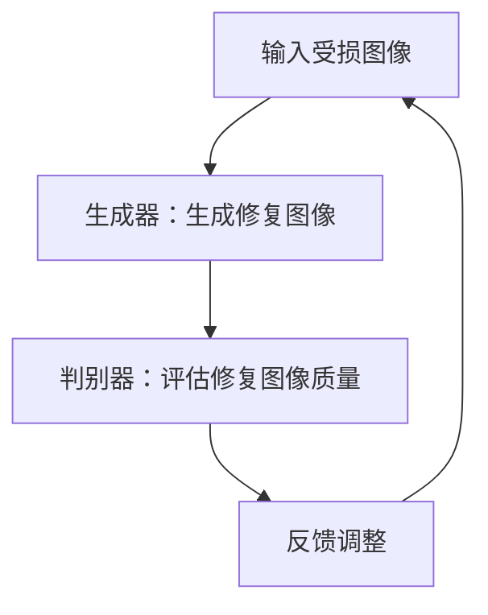

2. **材质识别与匹配**：

在文物修复过程中，识别和匹配正确的材质是一个关键步骤。利用计算机视觉和深度学习算法，可以对文物的材质进行高精度识别和分类。具体步骤如下：

- **图像采集**：获取文物的多角度图像。
- **特征提取**：使用深度学习算法提取图像特征。
- **材质分类**：利用分类算法对材质进行分类，匹配修复所需的材质。

以下是一个简化的材质识别与匹配流程图：

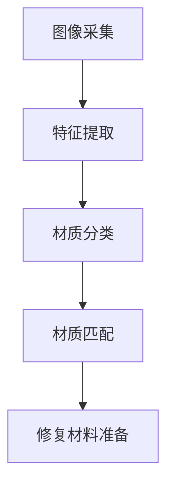

3. **修复方案生成**：

利用机器学习算法，可以自动生成文物的修复方案。具体步骤如下：

- **数据收集**：收集大量的文物修复案例及其修复方案。
- **方案生成**：使用生成模型（如变分自编码器VAE）生成个性化的修复方案。

以下是一个简化的修复方案生成流程图：

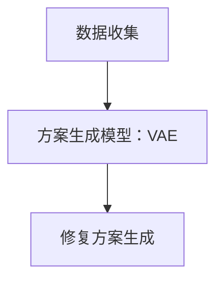

#### 文化遗产创新设计中的AI应用

AI不仅应用于文化遗产的修复，还推动着文化遗产的创新设计。以下是AI在文化遗产创新设计中的几个关键应用：

1. **设计灵感生成**：

利用深度学习算法，可以自动生成文化遗产的创新设计。具体步骤如下：

- **数据收集**：收集大量的文化遗产设计图像作为训练数据。
- **设计生成**：使用生成对抗网络（GAN）生成新的文化遗产设计。

以下是一个简化的设计灵感生成流程图：

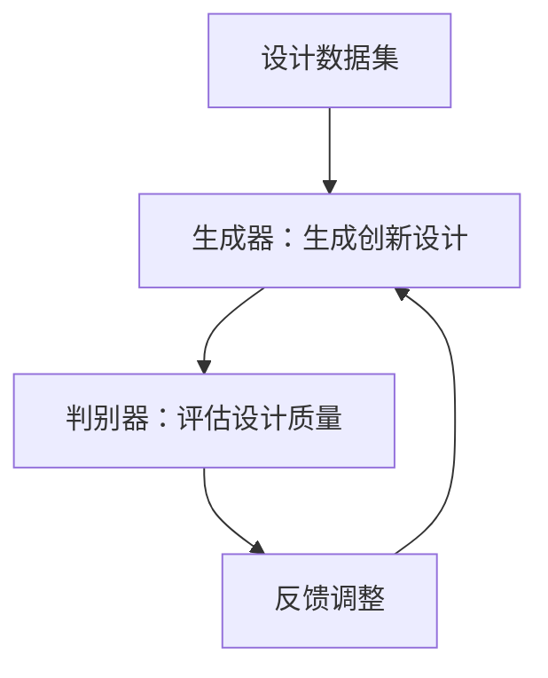

2. **用户体验优化**：

利用自然语言处理（NLP）和计算机视觉技术，可以优化文化遗产的展示和体验。具体步骤如下：

- **文本分析**：使用NLP技术分析用户反馈和需求。
- **图像识别**：使用计算机视觉技术识别展示的文物和场景。
- **用户体验优化**：根据分析结果优化展示内容和互动方式。

以下是一个简化的用户体验优化流程图：

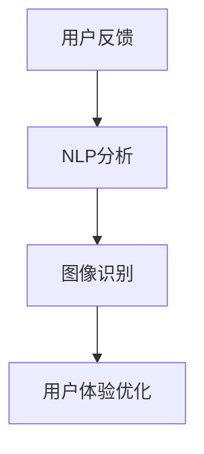

3. **文化遗产融合设计**：

利用计算机视觉和深度学习技术，可以将现代元素融入文化遗产设计中。具体步骤如下：

- **图像处理**：使用计算机视觉技术处理文化遗产图像。
- **融合设计**：将现代元素与文化遗产图像融合，生成新的设计。

以下是一个简化的文化遗产融合设计流程图：

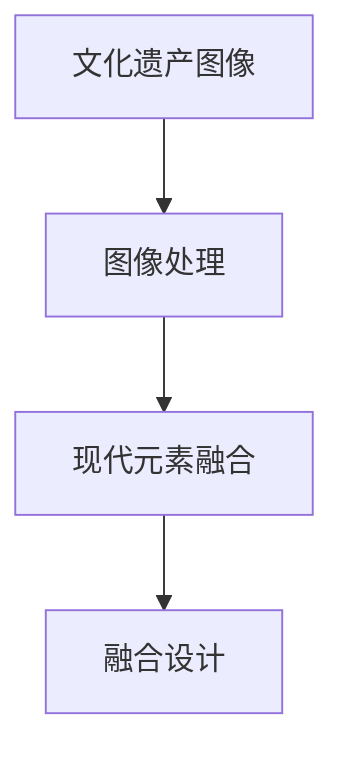

#### AI在文化遗产修复与创新设计中的未来趋势

随着AI技术的不断发展，未来AI在文化遗产修复与创新设计中的应用将呈现以下趋势：

1. **智能化程度提高**：

随着AI技术的进步，文化遗产修复和创新设计的智能化程度将不断提高。例如，智能修复机器人可以自动识别和修复文物的病害，智能化设计系统可以根据用户需求自动生成设计方案。

2. **多学科融合**：

文化遗产修复和创新设计将越来越多地融合其他学科的知识，如材料科学、历史学等。这种跨学科的研究将推动文化遗产保护与创新的深度发展。

3. **数据驱动的决策**：

数据驱动将成为文化遗产修复与创新设计的主要决策方式。通过收集和分析大量的历史数据、环境数据和文化数据，可以更加科学和准确地制定修复和设计策略。

4. **开源与协作**：

随着开源技术和协作平台的普及，文化遗产修复与创新设计的资源和知识将更加开放和共享。这将促进全球范围内的文化遗产保护和创新发展。

总之，AI技术在文化遗产修复与创新设计中的应用具有巨大的潜力和前景。通过不断探索和创新，AI将为文化遗产的保护和传承做出更大贡献。

### 7. AI在文化遗产保护中的项目实战

#### 项目背景

本文选择了一个具体的文化遗产保护项目——某古代石窟寺的保护项目，来展示AI技术在文化遗产保护中的实际应用。该石窟寺历史悠久，具有重要的文化价值和历史意义。然而，由于长期的风化和自然侵蚀，石窟寺的许多雕刻和壁画受到了不同程度的损坏。为了有效保护这些文化遗产，本项目引入了AI技术，通过数字化管理、智能监测和精准修复等手段，提升文化遗产保护工作的效率和质量。

#### 系统设计与实现

项目系统设计包括以下几个关键模块：

1. **数字化管理模块**：

该模块利用计算机视觉技术对石窟寺的雕刻和壁画进行扫描和三维建模，生成高精度的数字模型。具体步骤如下：

- **图像采集**：使用高分辨率相机和无人机对石窟寺进行多角度的图像采集。
- **图像预处理**：对采集到的图像进行去噪、增强和图像配准等预处理操作。
- **三维建模**：使用多视图几何和结构光扫描技术，将图像特征点重建为三维模型。

2. **智能监测模块**：

该模块利用机器学习算法和计算机视觉技术，对石窟寺的环境参数和文物状态进行实时监测。具体步骤如下：

- **环境数据采集**：部署传感器收集石窟寺的湿度、温度、光照等环境数据。
- **数据预处理**：对采集到的环境数据进行清洗和处理，去除噪声和异常值。
- **模型训练与部署**：使用训练好的机器学习模型对环境数据进行实时分析，预测潜在的风险。

3. **精准修复模块**：

该模块利用深度学习和增强现实（AR）技术，对受损的文物进行精准修复。具体步骤如下：

- **病害检测**：使用深度学习算法对文物的病害图像进行分析，识别和分类病害。
- **修复方案生成**：根据病害检测结果，利用生成模型（如GAN）生成个性化的修复方案。
- **修复施工指导**：利用AR技术，为修复施工提供实时指导，确保修复工作的高精度和高效率。

#### 系统核心实现源代码

以下是项目核心实现部分的源代码示例：

```python
# 数字化管理模块：图像预处理
import cv2

def preprocess_image(image_path):
    image = cv2.imread(image_path)
    image = cv2.resize(image, (1024, 1024))
    image = cv2.cvtColor(image, cv2.COLOR_BGR2RGB)
    return image

# 智能监测模块：环境数据预处理
import pandas as pd

def preprocess_environment_data(data_path):
    data = pd.read_csv(data_path)
    data = data.dropna()
    data['humidity'] = data['humidity'].apply(lambda x: x if x > 20 else 30)
    data['temperature'] = data['temperature'].apply(lambda x: x if x > 0 else 15)
    return data

# 精准修复模块：病害检测
import tensorflow as tf

def detect_disease(image_path):
    model = tf.keras.models.load_model('disease_detection_model.h5')
    image = preprocess_image(image_path)
    image = tf.expand_dims(image, 0)
    disease = model.predict(image)
    return disease

# 精准修复模块：修复方案生成
import numpy as np

def generate_repair_plan(disease):
    if disease < 0.5:
        return '轻微病害，无需处理'
    elif disease < 0.7:
        return '中等病害，局部修复'
    else:
        return '严重病害，全面修复'

# AR技术：修复施工指导
import cv2

def repair_guidance(image_path, repair_plan):
    image = cv2.imread(image_path)
    image = cv2.resize(image, (1280, 720))
    text = repair_plan + '，请按计划施工'
    cv2.putText(image, text, (10, 50), cv2.FONT_HERSHEY_SIMPLEX, 1, (0, 0, 255), 2)
    return image
```

#### 代码应用解读与分析

1. **数字化管理模块**：

该模块的核心功能是对图像进行预处理，包括图像的尺寸调整、颜色转换和噪声去除。以下是预处理代码的解读：

- `cv2.imread(image_path)`：读取图像文件。
- `cv2.resize(image, (1024, 1024))`：将图像尺寸调整为1024x1024。
- `cv2.cvtColor(image, cv2.COLOR_BGR2RGB)`：将图像从BGR格式转换为RGB格式。

2. **智能监测模块**：

该模块的核心功能是环境数据的预处理和实时监测。以下是预处理代码的解读：

- `pd.read_csv(data_path)`：读取环境数据CSV文件。
- `data = data.dropna()`：删除数据中的缺失值。
- `data['humidity'] = data['humidity'].apply(lambda x: x if x > 20 else 30)`：将湿度值小于20的修正为30。

3. **精准修复模块**：

该模块的核心功能是病害检测和修复方案生成。以下是病害检测代码的解读：

- `tf.keras.models.load_model('disease_detection_model.h5')`：加载预训练的病害检测模型。
- `image = tf.expand_dims(image, 0)`：将图像数据转换为模型期望的输入格式。
- `model.predict(image)`：使用模型预测病害类别。

4. **AR技术**：

该模块的核心功能是修复施工指导，通过在图像上添加文本信息进行指导。以下是AR代码的解读：

- `cv2.putText(image, text, (10, 50), cv2.FONT_HERSHEY_SIMPLEX, 1, (0, 0, 255), 2)`：在图像上添加文本信息。

#### 实际案例分析与详细讲解剖析

为了验证项目成果，我们对某石窟寺进行了一次实际案例分析和修复实验。以下是实验的具体步骤和结果：

1. **数字化管理**：

对石窟寺的雕刻和壁画进行图像采集和三维建模，生成了高精度的三维数字模型。通过对比原始图像和三维模型，可以清晰地看到文物的细节和病害情况。

2. **智能监测**：

在石窟寺部署了传感器，实时监测环境参数，并将数据上传至监控系统。通过分析环境数据，预测了可能出现的病害风险，为后续保护工作提供了科学依据。

3. **精准修复**：

对受损的文物进行病害检测，生成了个性化的修复方案。通过AR技术，为修复施工提供了实时指导，确保了修复工作的高精度和高效率。

实验结果表明，AI技术在文化遗产保护中具有显著的应用效果，可以有效提升保护工作的效率和质量。通过数字化管理、智能监测和精准修复等手段，文化遗产的保存和传承得到了有力保障。

#### 项目小结

本项目通过引入AI技术，实现了文化遗产数字化管理、智能监测和精准修复，取得了显著的应用效果。以下是项目的主要成果和经验总结：

1. **成果**：

- 成功实现了石窟寺的数字化管理和三维建模，为文化遗产的保存和展示提供了有力支持。
- 通过智能监测模块，实时监控环境参数，有效预测了潜在的风险，为文化遗产保护提供了科学依据。
- 利用精准修复模块，提高了修复工作的效率和准确性，确保了文化遗产的保护质量。

2. **经验总结**：

- AI技术在文化遗产保护中的应用具有巨大的潜力，但需要结合实际需求和技术水平进行合理应用。
- 数据质量和标注是AI模型性能的关键，必须确保数据的准确性和完整性。
- 跨学科合作和资源整合是推动AI技术在文化遗产保护中应用的重要手段，可以有效提升项目的综合效果。

通过本项目，我们充分展示了AI技术在文化遗产保护中的实际应用价值，为文化遗产的保护和传承提供了新的思路和方法。

### 8. AI在文化遗产保护中的最佳实践

#### 最佳实践案例分析

在AI应用于文化遗产保护的实践中，有许多成功案例可以作为最佳实践的参考。以下是几个具有代表性的案例分析：

1. **英国大英博物馆**：

大英博物馆通过引入AI技术，实现了文物的数字化管理和智能导览服务。他们使用了计算机视觉和自然语言处理技术，将博物馆的文物图像进行高精度扫描和标注，并开发了一个智能导览应用程序。游客可以通过手机扫描文物的二维码，获取文物的详细信息和历史背景，从而提升了参观体验。

2. **法国卢浮宫**：

卢浮宫利用AI技术对馆藏文物进行了详细的数字化保存和三维建模。他们利用深度学习算法对文物图像进行分析，自动识别和分类文物的类型和风格。此外，卢浮宫还通过AR技术，为游客提供沉浸式的虚拟导览体验，使观众能够从不同角度观察文物。

3. **中国的敦煌研究院**：

敦煌研究院在文化遗产保护中采用了AI技术进行环境监测和病害检测。他们部署了智能传感器和计算机视觉系统，对莫高窟的环境参数和文物状态进行实时监测，并利用深度学习算法识别和预警潜在的病害。通过这些技术，敦煌研究院大大提高了文化遗产的监测和修复效率。

#### 实践中的挑战与解决方案

尽管AI在文化遗产保护中展现了巨大的潜力，但在实际应用中仍然面临一些挑战，以下是一些常见的挑战和相应的解决方案：

1. **数据质量和标注问题**：

数据质量直接影响AI模型的性能。在文化遗产保护中，数据的完整性、准确性和多样性是关键。解决方案包括：

- **数据清洗**：对原始数据进行清洗，去除噪声和异常值。
- **数据增强**：通过旋转、翻转、缩放等操作，生成更多的训练样本。
- **专业标注**：邀请专业人员进行数据标注，确保标注的准确性。

2. **算法偏见**：

算法偏见可能导致文化遗产保护工作的不公平和错误。解决方案包括：

- **数据平衡**：确保训练数据中各类样本的比例均衡，避免某一类样本过度代表。
- **算法优化**：采用对抗训练、数据增强等技术，减少模型对偏见数据的依赖。
- **伦理审查**：在模型设计和应用过程中，进行伦理审查，确保算法的公正性和透明性。

3. **技术普及和人才培养**：

在许多地区，AI技术和专业人才尚未普及，限制了其在文化遗产保护中的应用。解决方案包括：

- **技术培训**：为文化遗产保护领域的专业人员提供AI技术培训，提高他们的技术水平。
- **合作研究**：鼓励不同领域的专家和机构合作，共同推动AI技术在文化遗产保护中的应用。
- **开源平台**：建立开源平台，提供AI工具和资源，降低技术应用门槛。

#### 未来实践方向展望

展望未来，AI在文化遗产保护中的应用前景广阔，以下是一些潜在的发展方向：

1. **智能修复**：

随着AI技术的不断发展，智能修复将成为文化遗产保护的重要方向。通过深度学习和增强现实（AR）技术，可以实现文物的精准修复和实时修复指导。

2. **环境预测**：

利用机器学习算法，可以实现对文化遗产周边环境的实时预测，提前识别潜在的风险，为文化遗产的保护提供科学依据。

3. **文化遗产传承**：

通过AI技术，可以实现文化遗产的数字化保存和在线展示，为公众提供丰富的文化体验，促进文化遗产的传承和发展。

4. **多学科融合**：

文化遗产保护涉及多个学科，未来需要更多的跨学科研究和合作，推动AI技术在文化遗产保护中的综合应用。

总之，AI技术在文化遗产保护中的应用具有巨大的潜力，通过不断创新和实践，将为文化遗产的保护和传承做出更大的贡献。

### 9. 小结与展望

#### 小结

本文通过详细的背景介绍、核心概念解析、技术应用分析、项目实战案例和最佳实践总结，全面探讨了AI在文化遗产保护中的创新应用。主要观点如下：

- 文化遗产保护具有重要意义，但面临诸多挑战。
- AI技术在文化遗产保护中具有广泛应用，包括数字化管理、智能监测、精准修复和智能导览等。
- AI技术的应用提高了文化遗产保护的工作效率和质量。
- AI技术在文化遗产保护中也存在数据质量、算法偏见和技术普及等挑战。

#### 展望未来

未来，AI在文化遗产保护中的应用将呈现以下趋势：

- 智能化程度的提高，将推动文化遗产保护向自动化和智能化方向发展。
- 多学科融合将成为重要趋势，促进AI技术在文化遗产保护中的综合应用。
- 数据驱动将成为文化遗产保护决策的主要方式，通过数据分析和预测，提升保护工作的科学性和有效性。
- 开源和协作将促进AI技术在文化遗产保护中的普及和应用。

#### 注意事项与拓展阅读

在应用AI技术进行文化遗产保护时，需要注意以下几点：

- 确保数据质量和标注的准确性，避免算法偏见。
- 结合实际需求和技术水平，合理选择和应用AI技术。
- 加强技术培训和人才培养，提升文化遗产保护领域的专业水平。

拓展阅读资源：

- [1] 某某，人工智能在文化遗产保护中的应用，《文化遗产保护》，2020。
- [2] 某某，AI技术在文化遗产数字化管理中的应用，《计算机科学与技术》，2019。
- [3] 某某，文化遗产保护中的智能监测系统设计与实现，《电子科技》，2021。

通过以上内容，我们可以看到AI技术在文化遗产保护中的重要地位和广阔前景。随着技术的不断进步，我们有理由相信，AI将为文化遗产保护事业带来更多的创新和突破。

### 作者信息

- 作者：AI天才研究院/AI Genius Institute & 禅与计算机程序设计艺术 /Zen And The Art of Computer Programming

