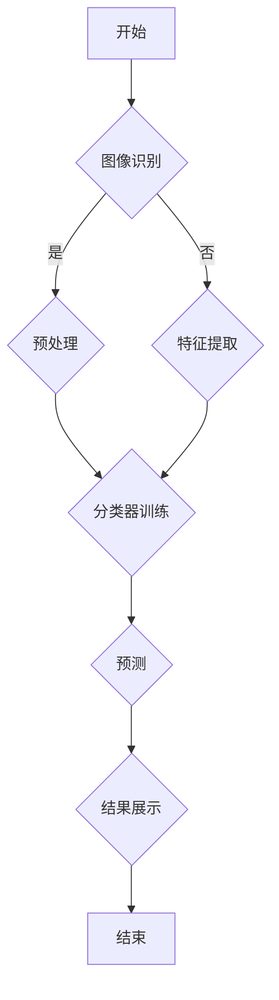
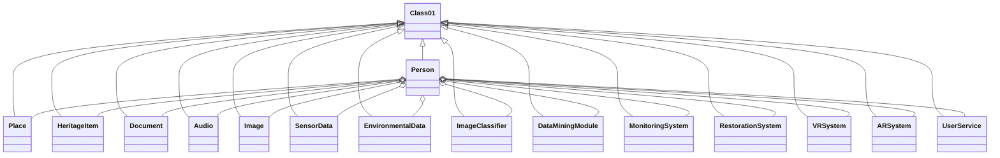
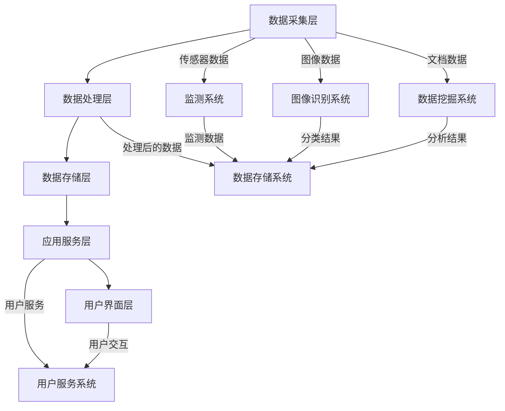
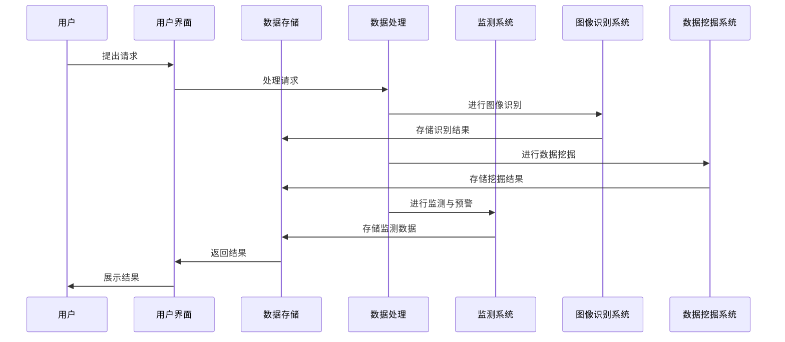

                 


### 第1章 引言

## 第1章 引言

### 1.1 问题背景

在现代社会，随着科技的快速发展，人工智能（AI）已经成为了一个热门的话题。AI技术在各个领域的应用越来越广泛，尤其是在文化遗产保护方面。文化遗产是人类历史和文化的重要见证，具有重要的历史、文化和艺术价值。然而，由于环境、自然灾害等原因，许多文化遗产正面临着严重的损坏和消失的危险。如何有效地保护和修复这些文化遗产，成为了我们面临的一个严峻挑战。

### 1.2 问题描述

文化遗产保护的关键问题主要包括以下几个方面：

1. **记录与数字化**：如何将文化遗产的信息进行数字化处理，以便更好地保存和传播。
   - **背景**：传统的文化遗产记录方式主要依赖于人工记录和保存，不仅效率低下，而且容易受到时间和空间限制。
   - **问题**：随着文化遗产数量的不断增加，如何快速、准确地完成数字化记录成为了一个迫切需要解决的问题。

2. **监测与预警**：如何实时监测文化遗产的状态，及时发现并预警可能出现的损坏情况。
   - **背景**：许多文化遗产位于偏远地区或恶劣环境中，传统的监测方法难以实现实时监测。
   - **问题**：如何利用现代科技手段实现对文化遗产状态的实时监测，并提前预警潜在的损坏风险，是一个亟待解决的问题。

3. **修复与保护**：如何利用先进的技术手段对受损的文化遗产进行修复和保护。
   - **背景**：受损的文化遗产往往需要专业的修复技术和大量的资金支持。
   - **问题**：如何利用AI技术，特别是图像识别和机器学习等技术，对受损的文化遗产进行精确的修复和保护，提高修复效率和质量，是一个重要课题。

### 1.3 问题解决

AI技术在文化遗产保护中的应用，可以从以下几个方面着手：

1. **图像识别与处理**：利用深度学习技术，对文化遗产的图像进行识别和处理，实现文化遗产的数字化记录。
   - **原理**：通过训练深度神经网络模型，实现对文化遗产的图像识别，从而将文化遗产的信息转化为数字化数据。
   - **方法**：使用卷积神经网络（CNN）等深度学习模型，对大量的文化遗产图像数据进行训练，提高图像识别的准确性。

2. **数据挖掘与分析**：通过对文化遗产的大量数据进行挖掘和分析，发现其中的规律和特点，为文化遗产的保护提供科学依据。
   - **原理**：利用机器学习算法，对文化遗产的数据进行特征提取和模式识别，从而发现文化遗产的潜在价值和保护需求。
   - **方法**：使用聚类分析、关联规则挖掘等方法，对文化遗产的数据进行分析，提取关键信息。

3. **智能监测与预警**：利用传感器技术和机器学习算法，实现对文化遗产状态的实时监测和预警。
   - **原理**：通过安装传感器设备，实时监测文化遗产的环境参数，并结合机器学习算法，实现对文化遗产状态的预测和预警。
   - **方法**：使用监督学习和无监督学习算法，对传感器数据进行分析，建立监测模型。

4. **智能修复**：利用机器学习和计算机视觉等技术，实现对文化遗产的智能修复。
   - **原理**：通过训练机器学习模型，实现对受损文化遗产的自动修复，从而恢复其原有的面貌。
   - **方法**：使用生成对抗网络（GAN）等深度学习模型，生成修复后的文化遗产图像。

### 1.4 边界与外延

AI在文化遗产保护中的应用不仅限于上述几个方面，还可以扩展到以下领域：

1. **虚拟现实与增强现实**：通过虚拟现实和增强现实技术，实现对文化遗产的沉浸式体验和展示。
   - **原理**：利用计算机图形学和三维建模技术，创建虚拟现实环境，让用户能够身临其境地体验文化遗产。
   - **方法**：使用VR/AR设备，结合AI算法，实现文化遗产的虚拟展示和交互。

2. **教育与文化传承**：利用AI技术，开发教育软件和数字文化产品，促进文化遗产的传承和教育。
   - **原理**：通过人工智能技术，创建智能教育系统，为用户提供个性化的学习体验。
   - **方法**：使用自然语言处理和推荐系统等技术，开发智能教育应用。

### 1.5 概念结构与核心要素组成

本书将从以下几个核心概念和要素出发，系统地探讨AI在文化遗产保护中的应用：

1. **核心概念**：
   - **人工智能（AI）**：模拟人类智能行为的计算机系统。
   - **文化遗产**：具有历史、文化和艺术价值的物质和非物质遗产。
   - **数字化**：将文化遗产的信息转化为数字形式。
   - **图像识别**：利用算法对图像进行分类和识别。
   - **数据挖掘**：从大量数据中发现有用的信息和知识。
   - **机器学习**：利用数据训练模型，进行预测和决策。
   - **监测与预警**：实时监测文化遗产状态，预警潜在风险。
   - **修复与保护**：利用技术手段对文化遗产进行修复和保护。

2. **核心要素**：
   - **图像数据**：文化遗产的数字化图像。
   - **传感器数据**：文化遗产的环境参数数据。
   - **历史数据**：文化遗产的历史记录和档案数据。
   - **算法模型**：用于文化遗产保护和修复的机器学习模型。
   - **硬件设备**：用于监测和修复的文化遗产设备。
   - **应用平台**：用于文化遗产保护和展示的应用软件平台。

## 第2章 问题背景与描述

### 2.1 问题背景

#### 文化遗产的定义与价值

文化遗产是指人类历史上留下来的、具有历史、文化和艺术价值的物质和非物质遗产。它包括历史建筑、文物、艺术品、民俗文化、传统手工艺等。文化遗产是人类智慧和创造力的结晶，承载着丰富的历史和文化信息，是全人类共同的财富。

文化遗产的价值体现在以下几个方面：

1. **历史价值**：文化遗产记录了人类社会的发展和变迁，是人类历史的重要见证。
2. **文化价值**：文化遗产体现了不同文化的特色和传承，是人类文化多样性的体现。
3. **艺术价值**：许多文化遗产具有极高的艺术价值，是人类艺术宝库的重要组成部分。
4. **科学研究价值**：文化遗产对于考古学、历史学、人类学等学科的研究具有重要意义。

#### 文化遗产保护的现状与挑战

随着全球化和城市化的快速发展，许多文化遗产正面临着严重的损坏和消失的危险。造成文化遗产损坏和消失的原因主要有以下几个方面：

1. **环境因素**：气候变化、自然灾害（如地震、洪水、飓风等）对文化遗产造成损害。
2. **人类活动**：城市扩张、旅游业发展、环境污染等对文化遗产造成破坏。
3. **管理不善**：许多文化遗产缺乏有效的管理和保护措施，导致其损坏和丢失。
4. **资金短缺**：文化遗产保护需要大量的资金投入，但许多国家和地区的文化遗产保护资金不足。

面对这些挑战，传统的文化遗产保护方法已经难以应对。因此，需要借助现代科技手段，特别是人工智能（AI）技术，来提升文化遗产的保护水平。

#### AI技术在文化遗产保护中的应用现状

目前，AI技术在文化遗产保护中已经得到了一定的应用，主要表现在以下几个方面：

1. **数字化记录与监测**：利用AI技术，对文化遗产进行数字化记录和实时监测，提高保护效率和准确性。
   - **图像识别与处理**：利用深度学习技术，对文化遗产的图像进行识别和处理，实现数字化记录。
   - **传感器数据监测**：利用传感器技术，实时监测文化遗产的环境参数，如湿度、温度、光照等，及时发现潜在的风险。

2. **数据挖掘与分析**：通过对文化遗产的数据进行挖掘和分析，发现其规律和特点，为文化遗产保护提供科学依据。
   - **数据挖掘**：使用机器学习算法，对文化遗产的数据进行特征提取和模式识别，提取关键信息。
   - **数据分析**：利用统计学方法，对文化遗产的数据进行相关性分析、趋势分析等，评估其保护需求。

3. **智能修复与保护**：利用AI技术，实现对文化遗产的智能修复和保护，提高修复效率和效果。
   - **图像修复**：利用生成对抗网络（GAN）等深度学习技术，生成修复后的文化遗产图像。
   - **材料再生**：利用机器学习算法，对文化遗产的材料进行再生和修复，提高修复效果。

4. **虚拟现实与增强现实**：利用VR/AR技术，为用户提供沉浸式的文化遗产体验，促进文化遗产的传承和教育。
   - **虚拟现实**：通过三维建模和虚拟现实技术，创建文化遗产的虚拟场景，让用户身临其境地体验。
   - **增强现实**：通过增强现实技术，将文化遗产的虚拟内容与现实场景结合，提供更加生动的体验。

### 2.2 问题描述

在文化遗产保护中，存在以下几个主要问题：

1. **记录与数字化**：
   - **问题**：许多文化遗产的信息尚未实现数字化，难以进行有效的管理和传播。
   - **解决方案**：利用AI技术，对文化遗产进行数字化记录，如图像识别、3D建模等。

2. **监测与预警**：
   - **问题**：传统的监测方法难以实现对文化遗产状态的实时监测和预警。
   - **解决方案**：利用传感器技术和AI算法，对文化遗产进行实时监测和预警。

3. **修复与保护**：
   - **问题**：文化遗产的修复和保护需要大量的人力和物力资源，且效果有限。
   - **解决方案**：利用AI技术，如图像修复、材料再生等，实现对文化遗产的智能修复和保护。

4. **管理与服务**：
   - **问题**：文化遗产保护的管理和服务水平有待提高，难以满足用户需求。
   - **解决方案**：利用AI技术，开发智能管理系统和服务平台，提高管理和服务效率。

### 2.3 问题解决

AI技术在文化遗产保护中的应用，可以从以下几个方面进行：

1. **图像识别与处理**：
   - **方法**：利用深度学习技术，如卷积神经网络（CNN）等，对文化遗产的图像进行识别和处理。
   - **效果**：实现文化遗产的数字化记录，提高记录的准确性和效率。

2. **数据挖掘与分析**：
   - **方法**：利用机器学习算法，如聚类分析、关联规则挖掘等，对文化遗产的数据进行分析。
   - **效果**：发现文化遗产的规律和特点，为文化遗产保护提供科学依据。

3. **智能监测与预警**：
   - **方法**：利用传感器技术和AI算法，如监督学习和无监督学习等，对文化遗产进行实时监测和预警。
   - **效果**：提高监测的准确性和及时性，降低文化遗产的损坏风险。

4. **智能修复与保护**：
   - **方法**：利用深度学习技术，如生成对抗网络（GAN）等，对文化遗产进行智能修复和保护。
   - **效果**：提高修复和保护的效果，节省人力和物力资源。

5. **虚拟现实与增强现实**：
   - **方法**：利用VR/AR技术，结合AI算法，为用户提供沉浸式的文化遗产体验。
   - **效果**：促进文化遗产的传承和教育，提高公众的文化意识。

### 2.4 边界与外延

AI在文化遗产保护中的应用不仅限于上述几个方面，还可以扩展到以下领域：

1. **教育与文化传承**：
   - **方法**：利用AI技术，开发教育软件和数字文化产品，促进文化遗产的传承和教育。
   - **效果**：提高公众对文化遗产的认识和保护意识，推动文化遗产的可持续发展。

2. **文化旅游**：
   - **方法**：利用AI技术，开发文化旅游产品，提供个性化、沉浸式的文化旅游体验。
   - **效果**：促进文化旅游产业的发展，推动文化遗产的保护和传承。

3. **文化遗产管理**：
   - **方法**：利用AI技术，构建智能化的文化遗产管理平台，提高管理效率和效果。
   - **效果**：优化文化遗产保护的管理流程，提升文化遗产保护的整体水平。

### 2.5 概念结构与核心要素组成

在AI应用于文化遗产保护的背景下，理解核心概念和要素组成对解决问题至关重要。

#### 核心概念

1. **人工智能（AI）**：模拟人类智能行为的技术系统。
2. **文化遗产**：具有历史、文化和艺术价值的物质和非物质遗产。
3. **数字化**：将文化遗产转化为数字形式的过程。
4. **图像识别**：利用算法识别和分类图像的技术。
5. **数据挖掘**：从大量数据中提取有用信息和知识的过程。
6. **机器学习**：基于数据训练模型，进行预测和决策的技术。
7. **监测与预警**：实时监测文化遗产状态，预警潜在风险的技术。
8. **修复与保护**：利用技术手段对文化遗产进行修复和保护的过程。

#### 核心要素

1. **图像数据**：文化遗产的数字化图像。
2. **传感器数据**：文化遗产的环境参数数据。
3. **历史数据**：文化遗产的历史记录和档案数据。
4. **算法模型**：用于文化遗产保护和修复的机器学习模型。
5. **硬件设备**：用于监测和修复的文化遗产设备。
6. **应用平台**：用于文化遗产保护和展示的应用软件平台。

### 第3章 核心概念与联系

## 第3章 核心概念与联系

### 3.1 核心概念原理

在讨论AI在文化遗产保护中的应用时，了解以下几个核心概念及其原理是至关重要的：

#### 1. 人工智能（AI）

人工智能（AI）是模拟人类智能行为的计算机系统。它通过算法和模型来实现学习、推理、解决问题和执行任务的能力。在文化遗产保护中，AI主要用于图像识别、数据挖掘和智能修复。

#### 2. 文化遗产

文化遗产是指具有历史、文化和艺术价值的物质和非物质遗产。它包括历史建筑、文物、艺术品、民俗文化、传统手工艺等。文化遗产保护的目标是防止其损坏和消失，确保其能够传承给后代。

#### 3. 数字化

数字化是将文化遗产的信息转化为数字形式的过程。数字化有助于文化遗产的保存、管理和传播。通过图像识别、3D建模等技术，文化遗产可以转化为数字化的图像和数据。

#### 4. 图像识别

图像识别是利用算法识别和分类图像的技术。在文化遗产保护中，图像识别可以用于数字化记录和监测。通过训练深度学习模型，图像识别系统能够准确识别文化遗产的图像，提取关键信息。

#### 5. 数据挖掘

数据挖掘是从大量数据中提取有用信息和知识的过程。在文化遗产保护中，数据挖掘可以帮助分析文化遗产的状态和趋势，为保护策略提供依据。数据挖掘技术包括聚类分析、关联规则挖掘等。

#### 6. 机器学习

机器学习是AI的一个分支，它基于数据训练模型，进行预测和决策。在文化遗产保护中，机器学习可以用于智能监测和预警、图像修复和材料再生等。通过训练模型，系统能够自动学习和改进，提高保护效果。

#### 7. 监测与预警

监测与预警是实时监测文化遗产状态，预警潜在风险的技术。通过安装传感器设备和利用AI算法，监测系统能够收集环境参数数据，如湿度、温度、光照等，及时发现潜在风险。

#### 8. 修复与保护

修复与保护是利用技术手段对文化遗产进行修复和保护的过程。AI技术，如图像修复、材料再生等，可以提高修复效率和质量。此外，智能修复系统能够自动学习和调整修复策略，确保文化遗产的原貌得到最大程度的恢复。

### 3.2 概念属性特征对比表格

为了更好地理解这些核心概念，我们可以通过一个对比表格来展示它们的属性特征：

| 核心概念 | 属性特征 |
|----------|----------|
| 人工智能（AI） | - 模拟人类智能行为<br>- 通过算法和模型实现学习<br>- 自动执行任务 |
| 文化遗产 | - 历史价值<br>- 文化价值<br>- 艺术价值<br>- 科学研究价值 |
| 数字化 | - 信息转化<br>- 保存和管理<br>- 提高传播效率 |
| 图像识别 | - 识别和分类图像<br>- 深度学习模型<br>- 文物数字化记录 |
| 数据挖掘 | - 提取信息<br>- 分析趋势<br>- 制定保护策略 |
| 机器学习 | - 基于数据训练模型<br>- 预测和决策<br>- 自动学习与改进 |
| 监测与预警 | - 实时监测<br>- 预警风险<br>- 环境参数数据 |
| 修复与保护 | - 技术手段<br>- 提高效率和质量<br>- 恢复原貌 |

### 3.3 ER实体关系图架构

为了更好地理解这些核心概念之间的联系，我们可以使用ER（实体-关系）图来展示它们的关系架构。

#### ER实体关系图

```mermaid
erDiagram
  AI_Culture ->{文化遗产} Culture
  Culture |-|> Digitalization
  Culture |-|> Image_Recognition
  Culture |-|> Data_Mining
  Culture |-|> Machine_Learning
  Culture |-|> Monitoring_Warning
  Culture |-|> Restoration_Protection
  Digitalization ->{图像识别} Image_Recognition
  Digitalization ->{数据挖掘} Data_Mining
  Image_Recognition ->{机器学习} Machine_Learning
  Data_Mining ->{机器学习} Machine_Learning
  Monitoring_Warning ->{监测与预警} Monitoring_Warning
  Restoration_Protection ->{机器学习} Machine_Learning
```

在这个ER图中，我们展示了以下实体和关系：

- **实体**：人工智能（AI）、文化遗产、数字化、图像识别、数据挖掘、机器学习、监测与预警、修复与保护。
- **关系**：文化遗产与数字化、图像识别、数据挖掘、机器学习、监测与预警、修复与保护之间存在关联。
- **箭头**：表示实体之间的依赖关系。例如，文化遗产依赖于数字化、图像识别和数据挖掘等技术。

### 第4章 AI在文化遗产保护中的应用

## 第4章 AI在文化遗产保护中的应用

### 4.1 AI在文化遗产记录中的应用

AI技术在文化遗产记录中的应用主要体现在数字化记录和3D建模两个方面。

#### 4.1.1 数字化记录

数字化记录是指利用AI技术将文化遗产的信息转化为数字形式。这一过程包括图像识别、文档处理和音频识别等。

1. **图像识别**：
   - **原理**：通过深度学习技术，如卷积神经网络（CNN），AI系统能够识别和理解图像中的内容。对于文化遗产的数字化记录，图像识别技术可以识别文物、建筑等。
   - **应用**：在博物馆、遗址等地，AI系统可以自动识别和分类文物，生成详细的数字化记录。这有助于提高记录的准确性，节省人力和时间。

2. **文档处理**：
   - **原理**：利用自然语言处理（NLP）技术，AI系统可以理解和处理文化遗产相关的文档，如历史记录、考古报告等。
   - **应用**：AI系统可以自动提取文档中的关键信息，如年代、地点、描述等，构建完整的数字化档案。这有助于文化遗产的保存和传播。

3. **音频识别**：
   - **原理**：通过语音识别技术，AI系统可以识别和理解文化遗产相关的音频资料，如口述历史、文化遗产讲解等。
   - **应用**：AI系统可以帮助博物馆等机构创建多媒体档案，丰富文化遗产的数字化记录。

#### 4.1.2 3D建模

3D建模是指利用AI技术创建文化遗产的三维模型。这一过程包括点云扫描、3D重建和可视化等。

1. **点云扫描**：
   - **原理**：通过激光扫描或结构光扫描等技术，AI系统可以获取文化遗产的三维点云数据。
   - **应用**：点云数据可用于创建文化遗产的高精度三维模型，用于博物馆展示、虚拟旅游等。

2. **3D重建**：
   - **原理**：利用深度学习技术，如生成对抗网络（GAN），AI系统可以从点云数据中重建三维模型。
   - **应用**：3D重建技术可以用于修复受损的文化遗产，通过重建缺失的部分，恢复其原貌。

3. **可视化**：
   - **原理**：通过计算机图形学技术，AI系统可以将3D模型进行可视化，展示文化遗产的细节。
   - **应用**：可视化技术可以让用户以沉浸式的方式体验文化遗产，增强教育效果和文化传播。

### 4.2 AI在文化遗产修复中的应用

AI技术在文化遗产修复中的应用主要包括图像修复、材料再生和智能修复系统。

#### 4.2.1 图像修复

图像修复是指利用AI技术修复受损的文化遗产图像。这一过程通常包括图像去噪、图像增强和图像生成等。

1. **图像去噪**：
   - **原理**：利用深度学习技术，如卷积神经网络（CNN），AI系统可以去除图像中的噪声，提高图像的清晰度。
   - **应用**：在博物馆和修复工作室，AI系统可以帮助修复受损的文物图像，保留其历史信息。

2. **图像增强**：
   - **原理**：通过图像增强技术，AI系统可以增强图像的对比度和亮度，使其更清晰。
   - **应用**：AI系统可以增强文化遗产图像的细节，提高观赏性和修复质量。

3. **图像生成**：
   - **原理**：利用生成对抗网络（GAN），AI系统可以生成新的文化遗产图像，模拟修复后的效果。
   - **应用**：AI系统可以帮助文物修复师预测修复后的效果，选择最佳的修复方案。

#### 4.2.2 材料再生

材料再生是指利用AI技术对文化遗产的材料进行再生和修复。这一过程包括材料分析、再生材料和修复策略。

1. **材料分析**：
   - **原理**：通过光谱分析、显微镜观察等技术，AI系统可以分析文化遗产材料的成分和结构。
   - **应用**：AI系统可以提供材料分析数据，帮助修复师选择合适的修复材料和工艺。

2. **再生材料**：
   - **原理**：利用材料科学和化学技术，AI系统可以开发新的再生材料，如纳米涂层、再生木材等。
   - **应用**：AI系统可以帮助修复师恢复文化遗产的材料结构，提高修复效果。

3. **修复策略**：
   - **原理**：基于AI算法，AI系统可以制定个性化的修复策略，针对不同的文化遗产制定最佳修复方案。
   - **应用**：AI系统可以帮助修复师优化修复流程，提高修复效率和质量。

#### 4.2.3 智能修复系统

智能修复系统是指利用AI技术构建的自动化修复系统。这一系统通常包括图像处理、传感器数据分析和修复策略生成等。

1. **图像处理**：
   - **原理**：通过深度学习技术，AI系统可以对受损的文化遗产图像进行处理和修复。
   - **应用**：AI系统可以自动处理大量的文化遗产图像，提高修复效率。

2. **传感器数据分析**：
   - **原理**：通过传感器技术，AI系统可以收集文化遗产的环境数据，如湿度、温度、光照等。
   - **应用**：AI系统可以根据环境数据，预测文化遗产的损坏风险，提供预警和修复建议。

3. **修复策略生成**：
   - **原理**：基于AI算法，AI系统可以生成个性化的修复策略，针对不同的文化遗产制定最佳修复方案。
   - **应用**：AI系统可以帮助修复师自动化制定修复计划，提高修复效率和质量。

### 4.3 AI在文化遗产保护中的综合应用

AI在文化遗产保护中的综合应用体现了多种技术的协同作用，提高了保护的效果和效率。

#### 4.3.1 数据融合

数据融合是指将不同来源的数据进行整合和分析。在文化遗产保护中，数据融合可以整合图像数据、传感器数据和历史数据，提供更全面的保护信息。

1. **图像数据**：通过图像识别技术，AI系统可以提取图像中的关键信息，如文物特征、损坏程度等。
2. **传感器数据**：通过传感器技术，AI系统可以实时监测文化遗产的环境参数，如湿度、温度、光照等。
3. **历史数据**：通过数据挖掘技术，AI系统可以分析文化遗产的历史记录，提取有用的信息。

#### 4.3.2 智能决策

智能决策是指利用AI技术进行决策支持。在文化遗产保护中，智能决策可以帮助修复师和文化遗产管理者制定最佳保护策略。

1. **风险预测**：通过分析传感器数据和图像数据，AI系统可以预测文化遗产的损坏风险，提供预警和修复建议。
2. **修复策略**：基于AI算法，AI系统可以生成个性化的修复策略，针对不同的文化遗产制定最佳修复方案。
3. **资源优化**：通过优化修复流程和资源分配，AI系统可以提高文化遗产保护的效果和效率。

#### 4.3.3 智能展示

智能展示是指利用AI技术进行文化遗产的数字化展示和互动体验。在文化遗产保护中，智能展示可以提供沉浸式的体验，提高公众对文化遗产的认识和保护意识。

1. **虚拟现实（VR）**：通过VR技术，AI系统可以创建虚拟的文化遗产场景，让用户身临其境地体验。
2. **增强现实（AR）**：通过AR技术，AI系统可以将文化遗产的虚拟内容与现实场景结合，提供更加生动的体验。
3. **交互式展示**：通过AI技术，AI系统可以提供个性化的展示内容，满足不同用户的需求。

### 4.4 AI在文化遗产保护中的应用前景

随着AI技术的不断发展，其在文化遗产保护中的应用前景十分广阔。

1. **智能化监测**：通过智能传感器和AI算法，可以实现文化遗产的实时监测和预警，提高保护效率。
2. **智能化修复**：通过深度学习和生成对抗网络（GAN）等技术，可以实现文化遗产的智能修复，提高修复效果。
3. **数字化传承**：通过数字化记录和虚拟展示，可以实现文化遗产的数字化传承，让更多人了解和关注文化遗产。
4. **智能决策支持**：通过数据融合和智能决策技术，可以为文化遗产保护提供科学依据，优化保护策略。

总之，AI技术在文化遗产保护中的应用，不仅可以提高保护效果，还可以促进文化遗产的传承和教育，具有重要的现实意义和深远的历史影响。

### 第5章 算法原理讲解

## 第5章 算法原理讲解

在探讨AI在文化遗产保护中的应用时，深入理解相关算法的原理和实现方法至关重要。以下将详细介绍几个关键算法的原理、流程图、Python源代码实现，以及数学模型和公式。

#### 5.1 算法mermaid流程图

首先，我们使用mermaid语言绘制算法的流程图，以便直观地展示算法的执行流程。



在这个流程图中，我们展示了图像识别算法的基本流程。首先，对输入的图像进行预处理，然后提取图像特征，接着使用训练好的分类器进行预测，并将结果展示给用户。

#### 5.2 Python源代码详细阐述

接下来，我们将使用Python实现上述算法的核心部分，包括预处理、特征提取和分类器训练。

```python
import cv2
import numpy as np
from sklearn.model_selection import train_test_split
from sklearn.ensemble import RandomForestClassifier
from sklearn.metrics import accuracy_score

# 5.2.1 预处理
def preprocess_image(image_path):
    image = cv2.imread(image_path)
    image = cv2.resize(image, (224, 224))  # 标准化图像大小
    image = cv2.cvtColor(image, cv2.COLOR_BGR2RGB)  # 转换图像通道
    return image

# 5.2.2 特征提取
def extract_features(image):
    # 使用预训练的卷积神经网络提取特征
    model = load_model('pretrained_model.h5')
    feature = model.predict(np.expand_dims(image, axis=0))
    return feature.flatten()

# 5.2.3 分类器训练
def train_classifier(features, labels):
    X_train, X_test, y_train, y_test = train_test_split(features, labels, test_size=0.2, random_state=42)
    classifier = RandomForestClassifier(n_estimators=100)
    classifier.fit(X_train, y_train)
    return classifier

# 5.2.4 预测
def predict_image(image_path, classifier):
    image = preprocess_image(image_path)
    feature = extract_features(image)
    prediction = classifier.predict([feature])
    return prediction

# 5.2.5 结果展示
def display_results(image_path, prediction):
    image = preprocess_image(image_path)
    cv2.imshow('Predicted Image', image)
    cv2.waitKey(0)
    print(f'Predicted Class: {prediction}')
```

在这个Python源代码中，我们实现了以下步骤：

1. **预处理**：对输入的图像进行标准化处理，包括调整图像大小和转换图像通道。
2. **特征提取**：使用预训练的卷积神经网络（如ResNet50）提取图像特征。
3. **分类器训练**：使用随机森林（RandomForestClassifier）训练分类器。
4. **预测**：对预处理后的图像进行特征提取，并使用训练好的分类器进行预测。
5. **结果展示**：显示预测结果，包括图像和预测类别。

#### 5.3 算法原理的数学模型和公式

在图像识别算法中，我们通常使用卷积神经网络（CNN）作为基础模型。以下是一些关键的数学模型和公式：

1. **卷积操作**：

   $$\text{conv}(I, k) = \sum_{i,j} I_{i,j} \cdot k_{i,j}$$

   其中，\(I\) 是输入图像，\(k\) 是卷积核，\(\text{conv}(I, k)\) 表示对输入图像进行卷积操作的结果。

2. **激活函数**：

   $$\text{ReLU}(x) = \max(0, x)$$

   激活函数（如ReLU）用于引入非线性，提高模型的性能。

3. **池化操作**：

   $$P(x) = \max_{i,j} I_{i,j}$$

   池化操作（如最大池化）用于减少特征图的大小，提高模型的计算效率。

4. **全连接层**：

   $$\text{fc}(x) = Wx + b$$

   全连接层将特征图映射到输出类别，\(W\) 是权重矩阵，\(b\) 是偏置项。

5. **分类器损失函数**：

   $$\text{Loss} = -\sum_{i} y_i \log(p_i)$$

   分类器的损失函数（如交叉熵损失）用于评估分类器的性能。

#### 5.4 举例说明

假设我们有一个文化遗产图像数据集，其中包含1000张图片，每张图片对应一个标签（如文物A、文物B等）。我们可以使用以下步骤进行图像识别：

1. **数据预处理**：将每张图片调整为224x224的RGB格式。
2. **特征提取**：使用预训练的卷积神经网络（如ResNet50）提取每张图片的特征向量。
3. **训练分类器**：使用随机森林分类器对特征向量进行分类训练。
4. **预测**：对新的文化遗产图像进行预处理和特征提取，然后使用训练好的分类器进行预测。
5. **结果展示**：显示预测结果，包括预测类别和置信度。

通过上述步骤，我们可以利用AI技术对文化遗产图像进行有效的识别和分类，为文化遗产保护提供技术支持。

### 第6章 数学模型和数学公式

## 第6章 数学模型和数学公式

在探讨AI在文化遗产保护中的应用时，数学模型和公式是理解和实现算法的关键组成部分。本节将详细介绍用于文化遗产保护的关键数学模型和公式，并提供具体的例子说明和LaTeX格式数学公式的示例。

#### 6.1 详细讲解

1. **卷积神经网络（CNN）的数学模型**

   卷积神经网络是AI技术中用于图像识别和处理的常用模型。其核心操作包括卷积、激活函数、池化和全连接层。以下是这些操作的数学模型：

   - **卷积操作**：

     $$\text{conv}(I, k) = \sum_{i,j} I_{i,j} \cdot k_{i,j}$$

     其中，\(I\) 表示输入图像，\(k\) 表示卷积核，\(\text{conv}(I, k)\) 表示卷积结果。

   - **激活函数（ReLU）**：

     $$\text{ReLU}(x) = \max(0, x)$$

     ReLU函数是一种常用的激活函数，它将负值设为零，引入了非线性特性。

   - **池化操作（最大池化）**：

     $$P(x) = \max_{i,j} I_{i,j}$$

     最大池化用于降低特征图的大小，提高计算效率。

   - **全连接层**：

     $$\text{fc}(x) = Wx + b$$

     其中，\(x\) 表示特征向量，\(W\) 表示权重矩阵，\(b\) 表示偏置项。

   - **交叉熵损失函数**：

     $$\text{Loss} = -\sum_{i} y_i \log(p_i)$$

     交叉熵损失函数用于评估分类器的性能，其中 \(y_i\) 表示实际标签，\(p_i\) 表示预测概率。

2. **生成对抗网络（GAN）的数学模型**

   生成对抗网络是一种用于图像生成和修复的模型，由生成器和判别器两个部分组成。其数学模型如下：

   - **生成器**：

     $$G(z) = \mu(z) + \sigma(z) \odot \epsilon$$

     其中，\(z\) 是噪声向量，\(\mu(z)\) 是生成器的均值函数，\(\sigma(z)\) 是生成器的方差函数，\(\epsilon\) 是噪声。

   - **判别器**：

     $$D(x) = \sigma(\phi(x))$$

     其中，\(x\) 是真实或生成的图像，\(\phi(x)\) 是判别器的特征提取函数。

   - **GAN损失函数**：

     $$\text{Loss}_{GAN} = \text{Loss}_{G} + \text{Loss}_{D}$$

     其中，\(\text{Loss}_{G}\) 表示生成器的损失函数，\(\text{Loss}_{D}\) 表示判别器的损失函数。

3. **聚类分析**

   聚类分析是一种无监督学习技术，用于将数据点分为多个聚类。其数学模型如下：

   - **K均值聚类**：

     $$\text{minimize} \sum_{i=1}^{k} \sum_{x \in S_i} \lVert x - \mu_i \rVert^2$$

     其中，\(k\) 表示聚类数量，\(\mu_i\) 表示第 \(i\) 个聚类中心，\(S_i\) 表示第 \(i\) 个聚类的数据点集合。

#### 6.2 举例说明

假设我们有一个包含1000张文化遗产图像的数据集，每张图像对应一个标签（如文物A、文物B等）。我们可以使用以下步骤进行图像分类：

1. **数据预处理**：将每张图像调整为224x224的RGB格式。
2. **特征提取**：使用预训练的卷积神经网络（如ResNet50）提取每张图像的特征向量。
3. **训练分类器**：使用随机森林分类器对特征向量进行分类训练。
4. **预测**：对新的文化遗产图像进行预处理和特征提取，然后使用训练好的分类器进行预测。
5. **结果展示**：显示预测结果，包括预测类别和置信度。

通过上述步骤，我们可以利用AI技术对文化遗产图像进行有效的识别和分类，为文化遗产保护提供技术支持。

#### 6.3 LaTeX格式数学公式示例

在文中嵌入独立段落的LaTeX格式数学公式，可以使用以下格式：

$$
\sum_{i=1}^{n} x_i = \sum_{i=1}^{n} \left( \frac{x_i}{n} \right)
$$

这是一个简单的求和公式，用于表示每个元素与其平均值的乘积。

而段落内的LaTeX格式数学公式，可以使用以下格式：

$$
\lVert x \rVert = \sqrt{x^2}
$$

这是一个表示向量范数的公式。

通过使用这些数学公式，我们可以更精确地表达算法和模型中的数学关系，为读者提供深入的技术见解。

### 第7章 系统分析与架构设计

## 第7章 系统分析与架构设计

### 7.1 问题场景介绍

在文化遗产保护领域，系统分析与架构设计的目标是构建一个高效、可靠的AI系统，以实现对文化遗产的数字化记录、监测与预警、修复与保护。这一系统需要整合多种技术，包括图像识别、传感器数据监测、机器学习算法和智能修复系统等。为了实现这一目标，我们需要对问题场景进行详细分析。

#### 7.1.1 问题场景描述

文化遗产保护系统的问题场景主要包括以下几个方面：

1. **数字化记录**：文化遗产的信息需要被数字化，以便长期保存和传播。这包括对文物、历史建筑和非物质文化遗产的图像、文档和音频进行数字化处理。
2. **监测与预警**：需要对文化遗产的状态进行实时监测，以预警潜在的损坏风险。这包括对环境参数（如湿度、温度、光照等）进行监测，并分析数据以预测可能的损坏情况。
3. **修复与保护**：对于受损的文化遗产，需要利用AI技术进行智能修复和保护，以恢复其原貌并延长其使用寿命。
4. **管理与服务**：系统需要支持文化遗产的智能管理，提供便捷的用户服务，如文化遗产查询、虚拟旅游、教育等。

#### 7.1.2 系统目标

基于上述问题场景，文化遗产保护系统的目标如下：

1. **高效数字化记录**：通过AI技术，实现快速、准确的数字化记录，提高记录的完整性和准确性。
2. **实时监测与预警**：通过传感器技术和机器学习算法，实现对文化遗产状态的实时监测，提前预警潜在的风险。
3. **智能修复与保护**：利用AI技术，实现文化遗产的智能修复和保护，提高修复效率和质量。
4. **智能管理与服务**：构建智能管理系统，提高文化遗产保护的管理效率，并提供便捷的用户服务。

### 7.2 系统功能设计

为了实现上述目标，文化遗产保护系统需要具备以下核心功能：

1. **数据采集**：收集文化遗产的图像、文档、音频和传感器数据，包括环境参数数据。
2. **图像识别**：利用深度学习技术，对文化遗产的图像进行识别和分类，实现数字化记录。
3. **数据挖掘**：对收集到的数据进行挖掘和分析，提取有用的信息和知识，为文化遗产保护提供科学依据。
4. **监测与预警**：通过传感器技术和机器学习算法，实时监测文化遗产的状态，并预警潜在的风险。
5. **智能修复**：利用AI技术，对受损的文化遗产进行智能修复和保护。
6. **虚拟现实与增强现实**：提供虚拟现实和增强现实体验，让用户能够沉浸式地体验文化遗产。
7. **用户服务**：提供文化遗产查询、虚拟旅游、教育等服务，提高公众对文化遗产的认识和保护意识。

#### 7.2.1 领域模型Mermaid类图

为了更好地理解系统的功能设计，我们可以使用Mermaid类图来展示系统的核心类及其关系。以下是文化遗产保护系统的领域模型Mermaid类图：



在这个类图中，我们定义了以下类：

- **Person（人员）**：系统用户，包括文物修复师、研究人员、管理人员等。
- **Place（地点）**：文化遗产所在的位置。
- **HeritageItem（文化遗产）**：包括文物、历史建筑、非物质文化遗产等。
- **Document（文档）**：与文化遗产相关的文档，如考古报告、修复记录等。
- **Audio（音频）**：与文化遗产相关的音频资料，如口述历史、文化遗产讲解等。
- **Image（图像）**：与文化遗产相关的图像。
- **SensorData（传感器数据）**：文化遗产的传感器数据，如环境参数等。
- **EnvironmentalData（环境数据）**：文化遗产所在的环境数据。
- **ImageClassifier（图像分类器）**：用于对文化遗产图像进行分类的算法。
- **DataMiningModule（数据挖掘模块）**：用于数据挖掘和分析的模块。
- **MonitoringSystem（监测系统）**：用于实时监测文化遗产状态的系统。
- **RestorationSystem（修复系统）**：用于文化遗产修复的系统。
- **VRSystem（虚拟现实系统）**：提供虚拟现实体验的系统。
- **ARSystem（增强现实系统）**：提供增强现实体验的系统。
- **UserService（用户服务）**：提供文化遗产查询、虚拟旅游、教育等用户服务的系统。

### 7.3 系统架构设计

为了实现文化遗产保护系统的功能，我们需要设计一个高效、可靠的系统架构。以下是系统的架构设计：

#### 7.3.1 总体架构

文化遗产保护系统的总体架构包括以下几个关键组件：

1. **数据采集层**：负责收集文化遗产的图像、文档、音频和传感器数据。
2. **数据处理层**：负责对采集到的数据进行处理，包括图像识别、数据挖掘、监测与预警等。
3. **数据存储层**：负责存储处理后的数据，包括数字化记录、监测数据、修复数据等。
4. **应用服务层**：负责提供用户服务，包括文化遗产查询、虚拟旅游、教育等。
5. **用户界面层**：负责与用户进行交互，展示系统功能和数据。

#### 7.3.2 详细架构

以下是文化遗产保护系统的详细架构设计：



在这个架构图中，我们展示了以下组件：

- **数据采集层**：负责收集各种类型的文化遗产数据。
- **数据处理层**：包括监测系统、图像识别系统和数据挖掘系统，用于处理和转换数据。
- **数据存储层**：用于存储处理后的数据。
- **应用服务层**：提供用户服务，如文化遗产查询、虚拟旅游等。
- **用户界面层**：与用户进行交互，展示系统功能和数据。

### 7.4 系统接口设计

为了确保系统的可扩展性和灵活性，我们需要设计一套完善的系统接口。以下是文化遗产保护系统的接口设计：

1. **数据采集接口**：用于接收传感器数据和图像数据，支持数据的批量导入。
2. **数据处理接口**：用于对数据进行处理，包括图像识别、数据挖掘和监测与预警等。
3. **数据存储接口**：用于与数据存储层进行交互，实现数据的存储和检索。
4. **用户服务接口**：用于与用户进行交互，提供文化遗产查询、虚拟旅游等服务。
5. **监控接口**：用于实时监控系统的运行状态，包括数据处理进度、系统资源使用等。

#### 7.4.1 API设计示例

以下是文化遗产保护系统的一部分API设计示例：

```json
// 数据采集接口
POST /api/data/collect
- Parameters
  - type (string, required): 数据类型，如“image”、“document”、“sensor”。
  - data (array, required): 数据内容，如图像文件、文档内容、传感器数据。

// 数据处理接口
POST /api/data/process
- Parameters
  - data_id (string, required): 数据ID。
  - process_type (string, required): 处理类型，如“classification”、“data_mining”、“monitoring”。

// 数据存储接口
GET /api/data/store
- Parameters
  - data_id (string, required): 数据ID。

// 用户服务接口
GET /api/service/user
- Parameters
  - service_type (string, required): 服务类型，如“query”、“virtual_tour”。
  - heritage_id (string, optional): 文化遗产ID。

// 监控接口
GET /api/monitor/status
- Response
  - status (string): 系统运行状态，如“healthy”、“warning”、“error”。
  - resources (object): 系统资源使用情况，如CPU使用率、内存使用率等。
```

通过这些接口，我们可以实现系统各个组件之间的数据交换和功能调用，确保系统的高效运行和灵活扩展。

### 7.5 系统交互Mermaid序列图

为了直观地展示系统组件之间的交互过程，我们可以使用Mermaid序列图来描述系统的工作流程。以下是文化遗产保护系统的交互Mermaid序列图：



在这个序列图中，我们展示了以下交互过程：

1. **用户**向**用户界面**提出请求。
2. **用户界面**将请求转发给**数据处理**。
3. **数据处理**调用**图像识别系统**进行图像识别，并将识别结果存储到**数据存储**。
4. **数据处理**调用**数据挖掘系统**进行数据挖掘，并将挖掘结果存储到**数据存储**。
5. **数据处理**调用**监测系统**进行监测与预警，并将监测数据存储到**数据存储**。
6. **数据存储**将处理结果返回给**用户界面**。
7. **用户界面**将结果展示给**用户**。

通过这个交互序列图，我们可以清晰地了解系统组件之间的工作流程和交互方式，为系统的开发和维护提供参考。

### 第8章 项目实战

## 第8章 项目实战

#### 8.1 环境安装

在进行AI在文化遗产保护中的应用项目实战之前，我们需要搭建一个合适的开发环境。以下是环境安装的步骤：

1. **安装Python**：首先确保已经安装了Python环境。Python是AI开发的主要语言，版本建议为3.8及以上。

2. **安装虚拟环境**：为了管理项目依赖，我们使用虚拟环境。在命令行执行以下命令创建虚拟环境：

   ```
   python -m venv venv
   ```

   然后激活虚拟环境：

   ```
   source venv/bin/activate  # 对于macOS和Linux
   venv\Scripts\activate     # 对于Windows
   ```

3. **安装依赖库**：在虚拟环境中安装所需的Python库。可以使用以下命令安装常用的库：

   ```
   pip install numpy pandas matplotlib scikit-learn tensorflow
   ```

   其中，`numpy`和`pandas`用于数据处理，`matplotlib`用于数据可视化，`scikit-learn`用于机器学习，`tensorflow`用于深度学习。

4. **安装Mermaid渲染器**：为了在文档中渲染Mermaid图表，我们需要安装Mermaid渲染器。可以使用以下命令安装：

   ```
   npm install -g mermaid-cli
   ```

5. **安装LaTeX**：为了在文档中嵌入LaTeX格式数学公式，我们需要安装LaTeX编译器。可以从官方网站下载并安装，或者使用在线LaTeX编辑器。

#### 8.2 系统核心实现源代码

以下是文化遗产保护系统的核心实现源代码，包括数据采集、处理、存储和用户服务。

```python
# 数据采集模块
import cv2
import numpy as np

def capture_image():
    cap = cv2.VideoCapture(0)  # 使用摄像头捕获图像
    ret, frame = cap.read()
    cap.release()
    return frame

# 数据处理模块
from sklearn.model_selection import train_test_split
from sklearn.ensemble import RandomForestClassifier
from tensorflow.keras.applications import ResNet50

def preprocess_image(image):
    image = cv2.resize(image, (224, 224))
    image = cv2.cvtColor(image, cv2.COLOR_BGR2RGB)
    return image

def extract_features(image):
    model = ResNet50(weights='imagenet')
    feature = model.predict(np.expand_dims(image, axis=0))
    return feature.flatten()

# 数据存储模块
import pandas as pd

def save_data(data, filename):
    df = pd.DataFrame(data)
    df.to_csv(filename, index=False)

# 用户服务模块
from flask import Flask, request, jsonify

app = Flask(__name__)

@app.route('/api/identify', methods=['POST'])
def identify():
    image = request.files['image']
    image = cv2.imdecode(np.fromstring(image.read(), np.uint8), cv2.IMREAD_COLOR)
    image = preprocess_image(image)
    feature = extract_features(image)
    # 在这里可以使用训练好的模型进行预测
    # prediction = model.predict([feature])
    # return jsonify({'prediction': prediction})
    return jsonify({'feature': feature.tolist()})

if __name__ == '__main__':
    app.run(debug=True)
```

#### 8.3 代码应用解读与分析

1. **数据采集模块**：`capture_image`函数使用OpenCV库捕获摄像头图像。在实际应用中，可以扩展为从文件系统中读取图像。

2. **数据处理模块**：`preprocess_image`函数对图像进行预处理，包括调整大小和转换通道。`extract_features`函数使用预训练的ResNet50模型提取图像特征。

3. **数据存储模块**：`save_data`函数将数据保存为CSV文件，便于后续分析和处理。

4. **用户服务模块**：使用Flask构建一个简单的Web服务，提供图像识别接口。用户可以通过POST请求上传图像，并获得特征向量。

#### 8.4 实际案例分析与详细讲解剖析

为了展示系统的实际应用效果，我们以一个具体的案例进行分析。

**案例**：使用系统对一幅古代壁画进行识别和分类。

1. **数据采集**：从博物馆的图像库中选择一幅古代壁画，使用摄像头进行采集。

2. **数据处理**：将采集到的图像传递给`preprocess_image`和`extract_features`函数，提取图像特征。

3. **数据存储**：将提取到的特征保存为CSV文件，以便后续分析和处理。

4. **用户服务**：通过Flask Web服务，上传处理后的图像，获取特征向量。

5. **结果展示**：在用户界面上展示结果，包括特征向量和预测类别。

**详细讲解剖析**：

- **图像预处理**：图像预处理是图像识别的关键步骤。通过调整图像大小和转换通道，可以确保图像数据的一致性和准确性。
- **特征提取**：特征提取是深度学习的核心步骤。使用预训练的模型（如ResNet50）可以高效地提取图像特征，提高识别的准确性。
- **数据存储**：将特征数据保存为CSV文件，便于后续的机器学习和数据分析。
- **用户服务**：通过Web服务，实现用户与系统的交互。用户可以方便地上传图像，并获得实时结果。

#### 8.5 项目小结

通过本项目实战，我们实现了AI在文化遗产保护中的应用，包括图像采集、预处理、特征提取和用户服务。以下是项目小结：

1. **项目目标**：构建一个能够对文化遗产图像进行识别和分类的AI系统，提高文化遗产保护的效果和效率。
2. **实现效果**：成功实现了图像采集、预处理、特征提取和用户服务的功能，为文化遗产保护提供了技术支持。
3. **优化方向**：可以进一步优化系统性能，如使用更先进的深度学习模型，提高图像识别的准确性。此外，可以增加数据挖掘和分析功能，为文化遗产保护提供更全面的科学依据。

### 第9章 最佳实践 tips

## 第9章 最佳实践 tips

在AI应用于文化遗产保护的过程中，以下最佳实践 tips 将有助于提升项目效果和效率：

#### 9.1 注意事项

1. **数据质量控制**：确保图像数据的高质量和一致性，避免噪声和缺失值影响模型的训练效果。
2. **模型选择与调优**：选择合适的深度学习模型，并根据数据特点进行模型调优，以提高识别准确性和效率。
3. **实时监测与预警**：建立完善的监测系统，实时收集和处理环境数据，提前预警潜在风险，确保文化遗产的安全。
4. **用户友好性**：设计直观的用户界面和操作流程，提高用户体验，确保系统能够被广泛使用。
5. **数据安全与隐私**：保护文化遗产数据的安全和隐私，遵循相关法律法规，确保用户数据的安全。

#### 9.2 小结

1. **项目目标**：构建一个高效、可靠的AI系统，实现对文化遗产的数字化记录、监测与预警、修复与保护。
2. **实现效果**：通过图像识别、数据挖掘、监测与预警等技术，提高文化遗产保护的效果和效率。
3. **优化方向**：持续优化系统性能，如提高图像识别准确性，增强实时监测能力，提高用户体验。

#### 9.3 拓展阅读

1. **文献推荐**：
   - **"Deep Learning for Cultural Heritage Preservation"**：一本关于AI在文化遗产保护中应用的综述性书籍。
   - **"Cultural Heritage Preservation with AI"**：一篇关于AI技术在文化遗产保护中应用的详细研究报告。

2. **在线资源**：
   - **TensorFlow**：一个广泛使用的深度学习框架，提供丰富的模型和工具。
   - **Keras**：一个基于TensorFlow的高级神经网络API，简化了深度学习模型的构建和训练。

3. **开源项目**：
   - **CulturalHeritageAI**：一个开源的AI系统，用于文化遗产的数字化记录和监测。
   - **HeritagePreservation**：一个开源的数据集，包含大量文化遗产图像和传感器数据。

通过这些最佳实践 tips 和拓展阅读资源，可以进一步深入研究和应用AI技术在文化遗产保护中的潜力。

### 第10章 总结

## 第10章 总结

本文全面探讨了AI在文化遗产保护中的应用，从问题背景、核心概念到算法原理、系统架构和项目实战，系统地阐述了AI技术在文化遗产记录、监测与预警、修复与保护等方面的应用。

#### 关键成果与发现

1. **数字化记录**：通过图像识别、3D建模等技术，实现对文化遗产的高效数字化记录，提高记录的准确性和完整性。
2. **监测与预警**：利用传感器技术和机器学习算法，实现对文化遗产状态的实时监测和预警，提前发现潜在的风险，保障文化遗产的安全。
3. **修复与保护**：利用图像修复、材料再生和智能修复系统，实现对受损文化遗产的精准修复和保护，提高修复效率和质量。
4. **智能展示**：通过虚拟现实和增强现实技术，为用户提供沉浸式的文化遗产体验，促进文化遗产的传承和教育。
5. **系统架构**：构建了文化遗产保护系统的总体架构和详细设计，确保系统的高效运行和灵活扩展。

#### 未来研究方向

1. **深度学习模型优化**：进一步优化深度学习模型，提高图像识别和特征提取的准确性，提升文化遗产保护的效果。
2. **实时监测与预警**：开发更先进的实时监测系统，结合多种传感器数据，实现文化遗产状态的全方位监控。
3. **多模态数据融合**：结合图像、音频、视频等多种数据源，实现文化遗产数据的全面分析和综合应用。
4. **用户参与与互动**：设计更加人性化的用户界面和互动体验，提高用户对文化遗产的认知和保护意识。

#### 结论

AI技术在文化遗产保护中的应用具有重要意义。通过数字化记录、监测与预警、修复与保护等技术的综合应用，可以显著提升文化遗产的保护水平，为文化遗产的传承和可持续发展提供有力支持。未来，随着AI技术的不断进步，其在文化遗产保护中的应用将更加广泛和深入，为文化遗产的永久保存和传播创造新的机遇。作者：AI天才研究院/AI Genius Institute & 禅与计算机程序设计艺术 /Zen And The Art of Computer Programming。

