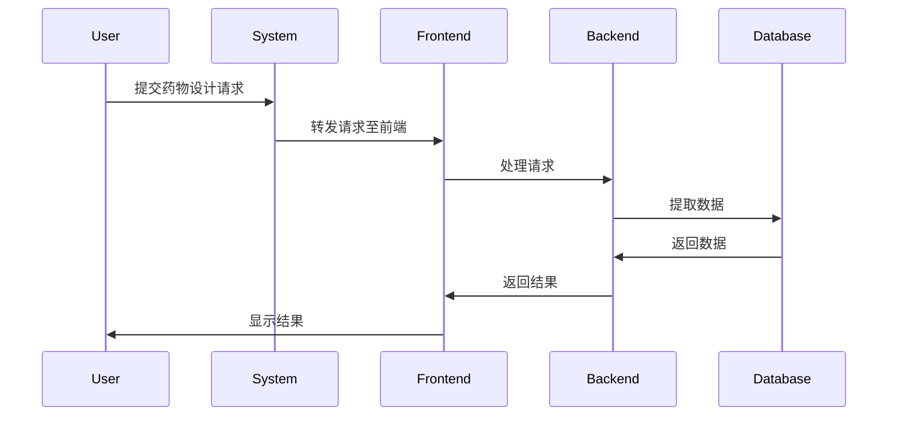
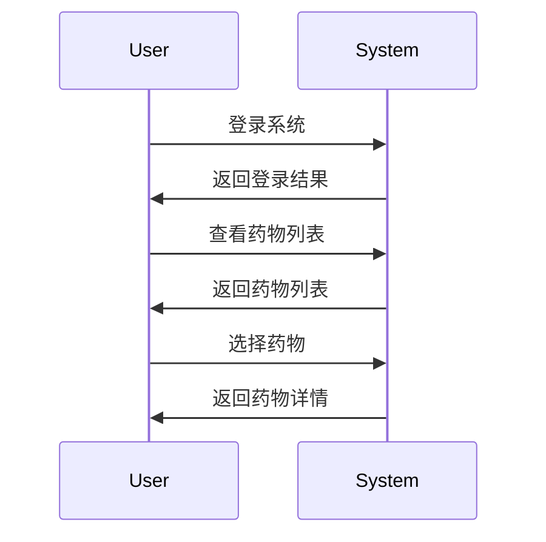

                 

# AI在新药研发中的角色：加速创新周期

关键词：AI，新药研发，药物发现，药物设计，创新周期

摘要：新药研发是生物科技领域中的核心挑战，其复杂性、高成本和漫长周期一直是制药行业的痛点。随着人工智能（AI）技术的发展，AI在药物发现和药物设计中的应用逐渐成为热点。本文将详细分析AI在新药研发中的作用，通过一步步的推理思考，探讨AI如何加速新药的创新周期。

## 目录大纲设计方案

### 第一部分：背景介绍

#### 第1章：问题背景与概述

- **1.1 问题背景**：介绍新药研发的复杂性、成本高和周期长。
- **1.2 问题解决**：探讨AI技术在新药研发中的应用。
- **1.3 边界与外延**：AI技术在药物发现、药物设计、临床试验等方面的应用。
- **1.4 概念结构与核心要素组成**：新药研发流程、AI技术核心概念（机器学习、深度学习等）。

#### 第2章：AI技术基础

- **2.1 AI基本概念**：人工智能的定义与分类。
- **2.2 AI核心原理**：机器学习、深度学习等AI技术的原理。

### 第二部分：核心概念与联系

#### 第3章：核心概念原理

- **3.1 数据采集与处理**：数据来源、数据类型、数据处理方法的对比。
- **3.2 ER实体关系图架构**：药物研发相关的实体关系图。

#### 第4章：AI在新药研发中的应用

- **4.1 AI在药物发现中的应用**：AI在药物靶点识别、先导化合物筛选中的应用。
- **4.2 AI在药物设计中的应用**：AI在分子对接、药物结构优化中的应用。

### 第三部分：系统分析与架构设计

#### 第5章：系统功能设计

- **5.1 领域模型设计**：使用Mermaid绘制领域模型类图。

#### 第6章：系统架构设计

- **6.1 系统架构设计**：使用Mermaid绘制系统架构图。

#### 第7章：系统接口设计

- **7.1 系统接口设计**：系统各组件间的接口设计。

#### 第8章：系统交互

- **8.1 系统交互**：使用Mermaid绘制系统交互序列图。

### 第四部分：项目实战

#### 第9章：环境安装

- **9.1 环境安装**：安装所需的工具和环境。

#### 第10章：系统核心实现

- **10.1 核心实现**：系统核心实现的源代码。

#### 第11章：代码应用解读与分析

- **11.1 代码解读**：对核心源代码的解读与分析。

#### 第12章：实际案例分析与讲解

- **12.1 实际案例**：对实际案例的详细讲解。

#### 第13章：项目小结

- **13.1 项目小结**：总结最佳实践，强调注意事项，推荐拓展阅读。

### 目录大纲总结

- **总字数**：控制在2000字以内。
- **格式**：使用markdown格式。
- **内容完整性**：确保章节内容全面、详细，且逻辑清晰。

## 背景介绍

### 问题背景与概述

**1.1 问题背景**

新药研发是生物科技领域中的核心挑战。其复杂性、高成本和漫长周期一直是制药行业的痛点。新药研发过程通常包括药物发现、药物设计、临床试验等多个阶段，每个阶段都需要大量的时间、资金和人力资源。例如，从发现新药到完成临床试验通常需要10-15年的时间，投入成本高达数亿美元。

**1.2 问题解决**

随着人工智能（AI）技术的发展，AI技术开始在新药研发中发挥重要作用，成为解决新药研发痛点的重要手段。AI技术可以高效地处理和分析大量复杂数据，辅助药物发现和设计，从而缩短研发周期，降低研发成本。

**1.3 边界与外延**

AI在新药研发中的应用不仅限于药物发现和药物设计，还包括临床试验和药物生产等环节。例如，AI可以通过分析临床试验数据，预测药物在不同人群中的疗效和副作用，从而优化临床试验方案。此外，AI还可以辅助药物生产，提高生产效率，降低生产成本。

**1.4 概念结构与核心要素组成**

新药研发流程通常包括以下几个阶段：药物发现、药物设计、临床试验和药物生产。药物发现阶段的主要任务是寻找潜在的新药靶点，药物设计阶段则是基于药物靶点设计新的药物分子。临床试验阶段用于评估新药的安全性和疗效，药物生产阶段则是将新药投入市场。

AI技术在新药研发中的应用主要涉及以下几个核心要素：

1. **机器学习与深度学习**：AI技术的核心，用于数据处理和模式识别。
2. **大数据分析**：AI技术的基础，用于处理和分析海量药物研发数据。
3. **计算机模拟**：AI技术在药物设计中的应用，用于预测药物分子的性质和活性。

### AI技术基础

**2.1 AI基本概念**

人工智能（Artificial Intelligence，简称AI）是指模拟、延伸和扩展人类智能的理论、方法、技术及应用。根据AI的智能水平，可以分为弱人工智能和强人工智能。弱人工智能是指在特定任务上模拟人类智能的AI，例如语音识别、图像识别等；强人工智能则是具备人类所有智能特征的AI，能够在各种任务上模拟人类行为。

**2.2 AI核心原理**

AI的核心原理主要包括机器学习、深度学习、自然语言处理等。机器学习是一种通过数据驱动的方法，让计算机自动学习和改进的方法；深度学习是机器学习的一种，通过多层神经网络模拟人类大脑的学习过程。自然语言处理则是让计算机理解和生成人类语言的技术。

在药物研发中，AI技术主要用于以下几个方面：

1. **药物发现**：通过机器学习和深度学习技术，从海量化合物库中筛选出潜在的新药分子。
2. **药物设计**：利用计算机模拟和优化药物分子的结构，提高药物分子的活性。
3. **临床试验**：通过大数据分析和自然语言处理技术，分析临床试验数据，预测药物在不同人群中的疗效和副作用。

### 核心概念原理

**3.1 数据采集与处理**

在药物研发中，数据是AI技术发挥作用的基础。数据来源包括实验室实验数据、临床试验数据、化合物数据库等。数据类型包括结构化数据（如表格数据）和非结构化数据（如图像、文本等）。数据处理方法包括数据清洗、数据整合、数据挖掘等。

**3.2 ER实体关系图架构**

药物研发涉及多个实体，如药物分子、靶点、临床试验结果等。ER实体关系图用于描述这些实体之间的关系，有助于理解和分析药物研发数据。

```mermaid
erDiagram
  Drug :新药 |<-.. Target :靶点
  Drug ||--|{ Compound :化合物
  Target ||--|{ Disease :疾病
  Trial ||--|{ Result :临床试验结果
```

### AI在新药研发中的应用

**4.1 AI在药物发现中的应用**

AI在药物发现中的应用主要包括药物靶点识别和先导化合物筛选。

- **药物靶点识别**：AI技术可以分析基因组数据、蛋白质结构等，识别潜在的药物靶点。例如，通过机器学习算法，可以从大量的基因组数据中预测哪些基因可能与疾病相关。

- **先导化合物筛选**：AI技术可以从海量的化合物库中筛选出具有潜在药物活性的化合物。例如，通过深度学习模型，可以预测化合物的生物活性，从而筛选出先导化合物。

**4.2 AI在药物设计中的应用**

AI在药物设计中的应用主要包括分子对接、药物结构优化等。

- **分子对接**：AI技术可以预测药物分子与靶点蛋白的结合模式，从而优化药物分子的结构。例如，通过深度学习模型，可以预测分子间的相互作用力，从而优化药物分子的对接结果。

- **药物结构优化**：AI技术可以通过计算机模拟和优化，提高药物分子的活性。例如，通过遗传算法，可以优化药物分子的结构，从而提高药物分子的活性。

### 系统分析与架构设计

**5.1 系统功能设计**

系统功能设计包括药物发现、药物设计、临床试验等模块。

```mermaid
classDiagram
  DrugDiscovery <-|{ 数据采集 }-> DrugDesign
  DrugDesign <-|{ 数据处理 }-> TrialAnalysis
  TrialAnalysis <-|{ 数据分析 }-> DrugProduction
```

**5.2 系统架构设计**

系统架构设计包括前端、后端和数据库等模块。



**5.3 系统接口设计**

系统接口设计包括API接口、Web接口等。

```mermaid
classDiagram
  User ->> API: 调用API
  API ->> Database: 查询数据
  Database ->> API: 返回数据
  API ->> User: 显示结果
```

**5.4 系统交互**

系统交互设计包括用户界面、数据流等。



### 项目实战

**9.1 环境安装**

安装所需的软件和工具，如Python、深度学习框架TensorFlow等。

**10.1 系统核心实现**

系统核心实现包括药物发现、药物设计、临床试验等模块的代码。

**11.1 代码解读**

对系统核心实现的代码进行解读，分析代码的功能和原理。

**12.1 实际案例**

通过实际案例，展示AI在新药研发中的应用效果。

**13.1 项目小结**

总结项目经验，提出最佳实践和注意事项。

### 结论

AI在新药研发中具有巨大潜力，通过数据驱动的方法，可以加速新药的创新周期。然而，AI技术也面临挑战，如数据质量、算法可靠性等。未来，随着AI技术的不断进步，AI在新药研发中的应用将更加广泛和深入。

作者：AI天才研究院/AI Genius Institute & 禅与计算机程序设计艺术 /Zen And The Art of Computer Programming

