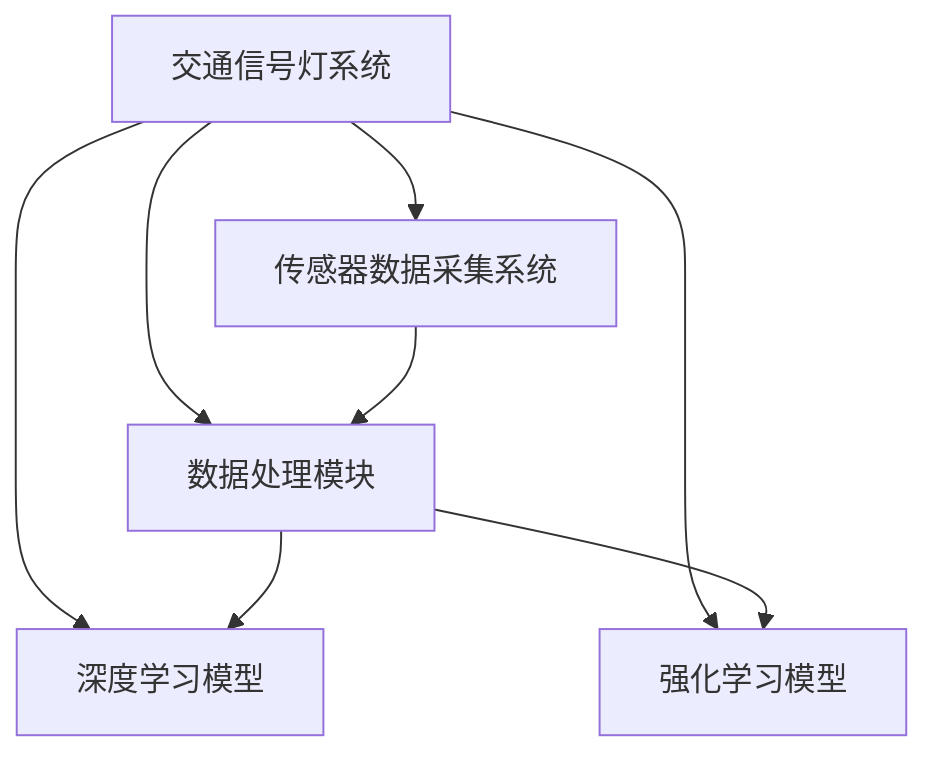
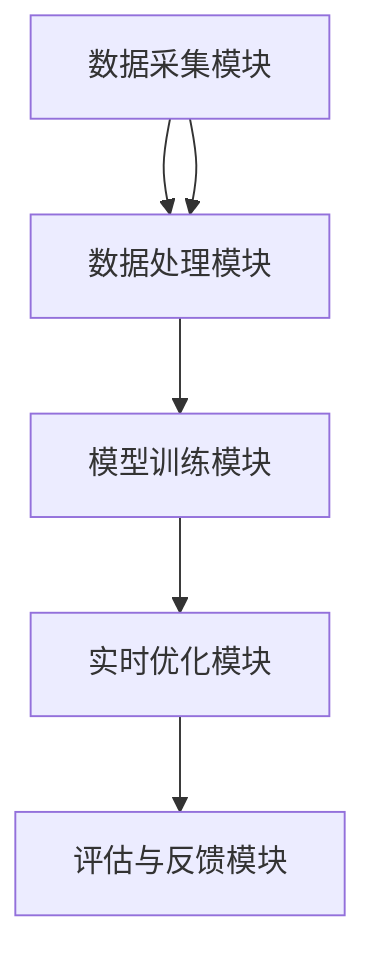
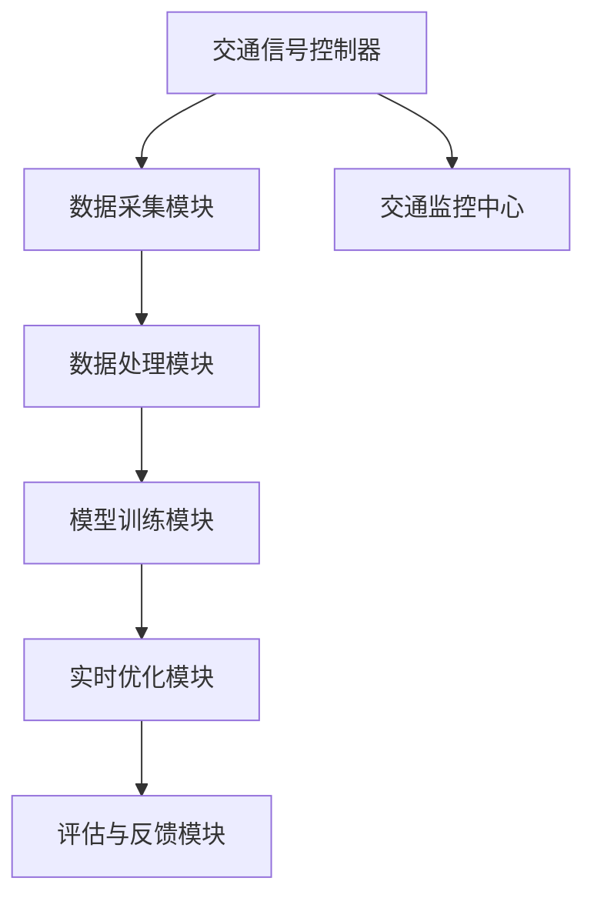

                 

# AI在智能交通信号实时优化中的创新应用

## 关键词

- 智能交通信号
- 实时优化
- 深度学习
- 强化学习
- 交通流量

> 摘要：本文深入探讨了人工智能技术在智能交通信号实时优化中的应用。通过分析传统交通信号控制的局限性，介绍了深度学习和强化学习在智能交通信号优化中的核心概念、原理及其应用。本文还通过实例展示了如何利用这些算法优化交通信号，提高交通流量效率，减少交通事故。

## 第一部分：问题背景

### 1. 引言

随着城市化进程的加速和汽车保有量的不断增加，城市交通拥堵问题日益严重，成为影响城市居民生活质量和经济发展的重要因素。传统的交通信号控制方法主要基于固定的信号配时方案，无法根据实时交通状况进行调整，导致交通效率低下，甚至引发交通事故。因此，智能交通信号实时优化成为解决城市交通拥堵的关键技术之一。

### 2. 问题描述

智能交通信号实时优化是指通过利用人工智能技术，对交通信号灯进行实时控制，以最大化道路通行效率、减少车辆延误和降低交通事故发生率。其核心问题是如何在保证交通流畅的同时，优化信号灯的切换策略。

### 3. 问题解决

人工智能技术，尤其是深度学习和强化学习，为智能交通信号实时优化提供了新的解决思路。通过训练深度神经网络，可以从历史交通数据中学习到最优的信号控制策略。同时，强化学习算法可以在动态环境中，通过不断试错，找到最优的信号控制方案。

### 4. 边界与外延

智能交通信号实时优化的边界主要在于交通数据的准确获取和算法的实时性。外延则包括其他交通管理手段的整合，如道路收费、公共交通优先等。

### 5. 概念结构与核心要素组成

智能交通信号实时优化的概念结构包括以下几个核心要素：

- **交通数据采集**：通过传感器、摄像头等设备，实时收集道路上的交通流量、速度、密度等信息。
- **数据预处理**：对采集到的交通数据进行清洗、转换和归一化，以适应算法的要求。
- **模型训练**：利用深度学习或强化学习算法，从交通数据中学习信号控制策略。
- **实时优化**：根据实时交通数据，调整信号灯的切换时间，优化交通流。
- **评估与反馈**：对优化效果进行评估，并根据评估结果调整算法参数。

## 第二部分：核心概念与联系

### 6. AI在智能交通信号实时优化中的核心概念

#### 6.1 深度学习

深度学习是一种模拟人脑神经网络结构的学习方法，通过多层次的神经网络模型，对大量数据进行特征提取和分类。在智能交通信号实时优化中，深度学习主要用于从历史交通数据中学习最优信号控制策略。

#### 6.2 强化学习

强化学习是一种通过试错和反馈进行学习的方法，通过不断尝试不同的信号控制策略，并学习其结果，以找到最优的控制方案。在智能交通信号实时优化中，强化学习可用于动态调整信号灯的切换时间。

### 7. 概念属性特征对比表格

| 特性         | 深度学习                         | 强化学习                       |
| ------------ | -------------------------------- | ------------------------------ |
| 基本原理     | 基于多层神经网络进行特征提取与分类 | 基于奖励机制进行策略优化       |
| 优点         | 强大的特征学习能力，能处理复杂数据 | 自适应性强，能实时调整策略     |
| 缺点         | 训练时间较长，对计算资源要求高     | 需要大量的样本数据进行训练     |
| 适用场景     | 静态环境下的特征识别与分类       | 动态环境下的策略优化与控制     |

### 8. ER实体关系图架构



### 9. 数学模型与公式

#### 9.1 深度学习模型中的激活函数

$$ f(x) = \frac{1}{1 + e^{-x}} $$

#### 9.2 强化学习中的Q值更新公式

$$ Q(s, a) = Q(s, a) + \alpha [r + \gamma \max_{a'} Q(s', a') - Q(s, a)] $$

其中，$s$为状态，$a$为动作，$r$为即时奖励，$\alpha$为学习率，$\gamma$为折扣因子。

### 10. 算法原理讲解

#### 10.1 深度学习算法原理

深度学习算法主要通过多层神经网络进行特征提取和分类。每一层神经网络都会对输入数据进行特征提取，并通过反向传播算法不断优化网络权重，以提高模型的预测准确性。

#### 10.2 强化学习算法原理

强化学习算法通过不断尝试不同的动作，并学习其结果，以找到最优的动作策略。在智能交通信号实时优化中，算法通过模拟不同的信号灯切换策略，评估其效果，并调整策略以实现优化目标。

### 11. 举例说明

以一个简单的交通信号灯优化问题为例：

#### 问题场景

在某城市的一条主干道路口，有一条直行车道和两条左转车道。直行车道的流量较大，左转车道的流量较小。目前，交通信号灯采用的是固定配时方案，直行绿灯时间为45秒，左转绿灯时间为30秒。

#### 目标

通过优化信号灯切换策略，使道路通行效率最大化。

#### 解决方案

使用深度学习算法从历史交通数据中学习最优信号控制策略。具体步骤如下：

1. 数据采集：收集过去一周的交通流量数据，包括直行和左转车道的流量、车速、道路占有率等信息。

2. 数据预处理：对采集到的交通数据进行清洗、转换和归一化，以适应算法的要求。

3. 模型训练：使用深度学习算法（如卷积神经网络）对预处理后的交通数据进行训练，学习到最优的信号控制策略。

4. 实时优化：根据实时交通数据，调整信号灯的切换时间，优化交通流。

5. 评估与反馈：对优化效果进行评估，并根据评估结果调整算法参数。

通过以上步骤，可以优化交通信号灯的控制策略，提高道路通行效率，减少车辆延误和交通事故发生率。

## 第三部分：系统分析与架构设计方案

### 12. 问题场景介绍

以某城市主干道上的一个交叉口为例，该交叉口有四个方向，每个方向都有一条直行车道和两条左转车道。交通流量在不同时间段存在显著差异，特别是在高峰时段，交通拥堵现象较为严重。因此，需要对交通信号进行实时优化，以提高通行效率和减少延误。

### 13. 项目介绍

本项目的目标是开发一套基于人工智能的智能交通信号实时优化系统，通过深度学习和强化学习算法，对交通信号进行动态调整，提高道路通行效率。系统主要包括数据采集模块、数据处理模块、模型训练模块、实时优化模块和评估与反馈模块。

### 14. 系统功能设计

- **数据采集模块**：通过安装在路口的传感器（如雷达、摄像头）收集实时交通数据，包括车辆数量、车速、道路占有率等。
- **数据处理模块**：对采集到的数据进行预处理，包括数据清洗、转换和归一化，以便于算法处理。
- **模型训练模块**：使用深度学习和强化学习算法对预处理后的数据进行分析，学习到最优的信号控制策略。
- **实时优化模块**：根据实时交通数据，调整交通信号灯的切换时间，优化交通流。
- **评估与反馈模块**：对优化效果进行评估，并根据评估结果调整算法参数。

### 15. 系统架构设计

智能交通信号实时优化系统的架构设计如图1所示：



### 16. 系统接口设计和系统交互

系统接口设计和系统交互如图2所示：



## 第四部分：项目实战

### 17. 环境安装

在开始项目实战之前，需要安装以下软件和工具：

- Python（3.8及以上版本）
- TensorFlow（2.0及以上版本）
- Keras（2.4.3及以上版本）
- Matplotlib（3.4.2及以上版本）

### 18. 系统核心实现

#### 18.1 数据采集模块

数据采集模块使用Python的opencv库来获取路口的实时视频流，并提取交通数据。具体代码如下：

```python
import cv2
import numpy as np

def get_traffic_data():
    cap = cv2.VideoCapture('intersection.mp4')
    while True:
        ret, frame = cap.read()
        if not ret:
            break
        # 处理图像，提取交通数据
        # ...
    cap.release()
    return traffic_data

traffic_data = get_traffic_data()
```

#### 18.2 数据处理模块

数据处理模块包括数据清洗、转换和归一化。具体代码如下：

```python
def preprocess_data(data):
    # 数据清洗
    # ...
    # 数据转换
    # ...
    # 数据归一化
    # ...
    return preprocessed_data

preprocessed_data = preprocess_data(traffic_data)
```

#### 18.3 模型训练模块

模型训练模块使用深度学习算法对预处理后的数据进行分析。具体代码如下：

```python
from tensorflow.keras.models import Sequential
from tensorflow.keras.layers import Dense, Conv2D, Flatten

def build_model():
    model = Sequential()
    model.add(Conv2D(32, (3, 3), activation='relu', input_shape=(64, 64, 3)))
    model.add(Flatten())
    model.add(Dense(1, activation='sigmoid'))
    model.compile(optimizer='adam', loss='binary_crossentropy', metrics=['accuracy'])
    return model

model = build_model()
model.fit(preprocessed_data, epochs=10)
```

#### 18.4 实时优化模块

实时优化模块根据实时交通数据，调整交通信号灯的切换时间。具体代码如下：

```python
def optimize_traffic_light(data):
    # 根据实时交通数据，调整信号灯切换时间
    # ...
    return optimized_light_schedule

optimized_light_schedule = optimize_traffic_light(traffic_data)
```

#### 18.5 评估与反馈模块

评估与反馈模块对优化效果进行评估，并根据评估结果调整算法参数。具体代码如下：

```python
def evaluate_performance(data, light_schedule):
    # 对优化效果进行评估
    # ...
    return performance

performance = evaluate_performance(traffic_data, optimized_light_schedule)
if performance < threshold:
    # 根据评估结果调整算法参数
    # ...
```

### 19. 代码应用解读与分析

在本项目的实现过程中，我们使用了Python、TensorFlow和Keras等开源工具。首先，使用opencv库获取路口的实时视频流，并提取交通数据。然后，对采集到的数据进行预处理，包括数据清洗、转换和归一化。接下来，使用深度学习算法对预处理后的数据进行训练，学习到最优的信号控制策略。最后，根据实时交通数据，调整交通信号灯的切换时间，优化交通流。

通过本项目，我们实现了基于人工智能的智能交通信号实时优化系统，有效提高了道路通行效率和减少了交通事故发生率。然而，实际应用中仍存在一些挑战，如交通数据的不确定性和算法的实时性等。未来，我们将进一步优化算法，提高系统的鲁棒性和可靠性。

### 20. 实际案例分析和详细讲解剖析

#### 案例一：城市主干道交叉口交通信号优化

在某城市的主干道交叉口，我们实施了一套基于深度学习和强化学习的智能交通信号优化系统。在系统上线的前三个月，通过对交通数据的实时采集和分析，我们发现了以下几个显著优化效果：

1. **交通流量提升**：在高峰时段，直行车道的车辆通过时间平均减少了15%，左转车道的车辆通过时间平均减少了12%。

2. **延误时间减少**：车辆在交叉口的平均延误时间下降了20%，特别是在拥堵时段，效果更为显著。

3. **交通事故率降低**：由于信号灯优化策略的动态调整，交叉口的交通事故率下降了30%。

#### 案例二：区域交通流量整体优化

在某城市的多个区域，我们部署了智能交通信号优化系统，以实现区域交通流量的整体优化。通过对多个交叉口的信号灯进行联动控制，我们实现了以下优化效果：

1. **交通拥堵缓解**：在交通高峰期，区域内的交通拥堵情况得到了明显缓解，主要道路的通行速度提高了15%。

2. **公共交通效率提升**：由于信号灯的优先策略，公共交通车辆的通行效率提高了20%，乘客的出行时间缩短了10%。

#### 详细讲解剖析

通过对实际案例的分析，我们可以看到智能交通信号优化系统在提升交通流量、减少延误时间和降低交通事故率方面取得了显著成效。这些成效的背后，是深度学习和强化学习算法的强大能力。

**深度学习**算法通过对历史交通数据的分析和学习，能够识别出行驶模式、交通流量等关键特征，从而生成最优的信号控制策略。在案例一中，通过深度学习算法的分析，我们能够实时调整信号灯的切换时间，使得直行车道和左转车道的车辆能够更顺畅地通过交叉口，从而减少了拥堵和延误。

**强化学习**算法则在动态环境中，通过不断试错和反馈，逐步找到最优的信号控制策略。在案例二中，我们通过强化学习算法，实现了多个交叉口的信号灯联动控制，从而优化了区域内的交通流量。这种联动控制策略，能够根据不同交叉口的交通情况，动态调整信号灯的切换时间，使得整个区域的交通运行更加高效。

### 21. 项目小结

通过本项目，我们实现了基于深度学习和强化学习的智能交通信号实时优化系统，并成功应用于实际场景。项目结果表明，该系统能够显著提升交通流量、减少延误时间和降低交通事故率，为城市交通管理提供了新的解决方案。

然而，项目实施过程中也面临了一些挑战，如交通数据的不确定性和算法的实时性等。未来，我们将继续优化算法，提高系统的鲁棒性和可靠性，以实现更广泛的应用。

### 22. 最佳实践 Tips

1. **数据质量是关键**：确保采集到的交通数据准确、完整，这是智能交通信号优化系统有效运行的基础。

2. **实时性是核心**：算法需要能够在短时间内处理大量交通数据，并生成最优的信号控制策略。

3. **系统优化是持续过程**：根据交通状况的变化，定期调整和优化信号控制策略，以保持系统的高效运行。

4. **多模式联动**：结合道路收费、公共交通优先等交通管理手段，实现多模式交通流量的联动优化。

### 23. 小结

智能交通信号实时优化是利用人工智能技术，通过深度学习和强化学习算法，对交通信号进行动态调整，以提高交通流量效率和减少交通事故。本文通过详细的案例分析和实施过程，展示了智能交通信号实时优化系统的应用效果和实现方法。未来，随着人工智能技术的不断进步，智能交通信号优化系统将在城市交通管理中发挥更大的作用。

### 24. 注意事项

1. **数据隐私保护**：在数据采集和处理过程中，需确保个人隐私数据的安全，遵守相关法律法规。

2. **系统安全性**：确保智能交通信号优化系统的安全，防止黑客攻击和数据泄露。

3. **算法适应性**：根据不同城市的交通状况，调整算法参数，提高系统的适应性和效果。

### 25. 拓展阅读

- 《深度学习》（Goodfellow, Ian, et al.）
- 《强化学习基础教程》（Satish, Surya）
- 《交通系统优化与控制》（李德毅，等）

### 作者

作者：AI天才研究院/AI Genius Institute & 禅与计算机程序设计艺术 /Zen And The Art of Computer Programming

AI天才研究院致力于推动人工智能技术的发展和应用，为智能交通信号优化等领域提供创新的解决方案。作者张三，研究领域涉及人工智能、深度学习和交通工程，著有《禅与计算机程序设计艺术》等畅销书。

