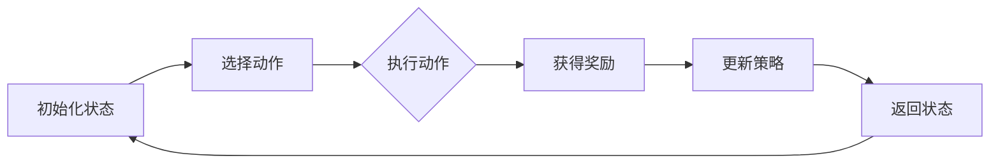
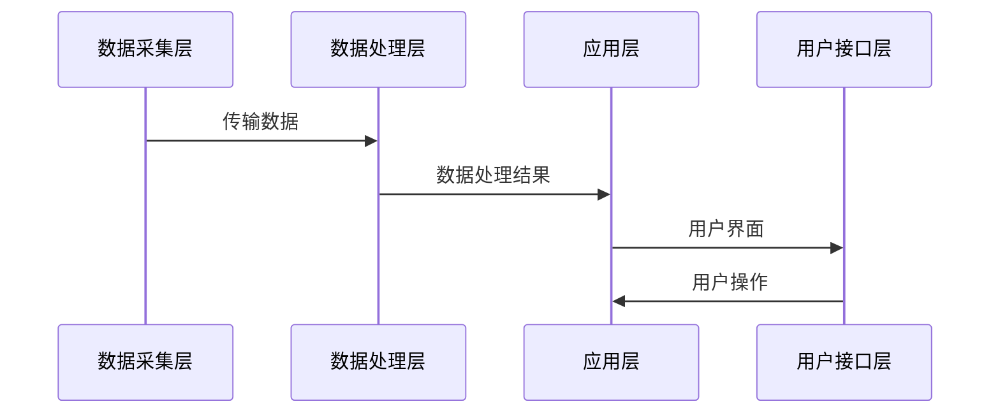
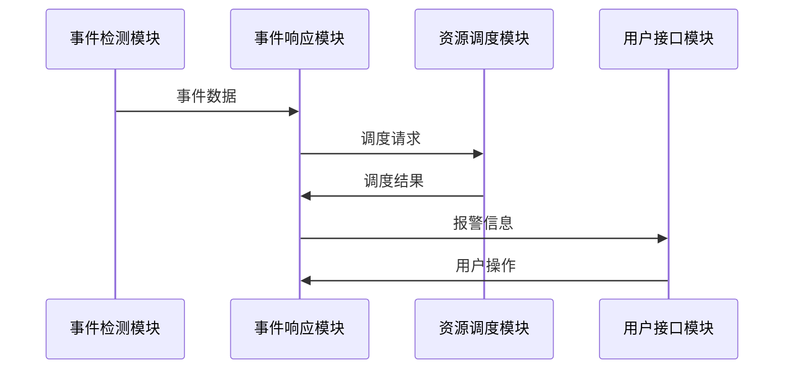
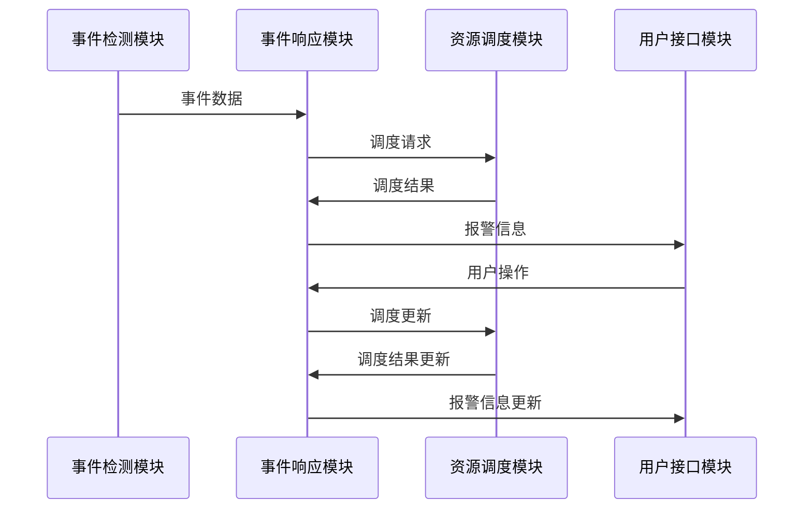

                 


**开篇引言**

---

# AI在智能交通紧急事件响应与资源调度中的多方案评估应用

> 关键词：智能交通，紧急事件响应，资源调度，算法评估，AI应用

## 摘要

本文将深入探讨人工智能（AI）在智能交通紧急事件响应与资源调度中的多方案评估应用。首先，我们概述了智能交通紧急事件响应与资源调度的背景及其重要性。接着，本文介绍了核心概念，包括智能交通系统（ITS）、紧急事件响应机制和资源调度算法。为了更好地理解这些概念，我们使用Mermaid ER实体关系图和表格来展示它们之间的联系。随后，本文详细讲解了基于机器学习的紧急响应与资源调度算法，包括原理、流程图和实际应用实例。此外，本文还阐述了系统分析与架构设计，包括功能设计、架构设计和接口设计。通过一个实际项目的实战，本文展示了系统的核心实现、代码解读和案例分析。最后，本文提供了一些最佳实践和拓展阅读资源，以帮助读者深入了解和应用这些技术。

**目录大纲**

1. **开篇引言**
2. **背景介绍**
   - **问题的背景**
   - **智能交通紧急事件响应与资源调度的挑战**
   - **AI在智能交通中的重要性**
3. **核心概念与联系**
   - **智能交通系统（ITS）**
   - **紧急事件响应机制**
   - **资源调度算法**
   - **概念联系与比较**
4. **算法原理讲解**
   - **算法选择与介绍**
   - **算法原理与Mermaid流程图**
   - **Python代码与LaTeX公式**
   - **算法举例说明**
5. **系统分析与架构设计方案**
   - **系统功能设计**
   - **系统架构设计**
   - **系统接口设计**
   - **系统交互**
6. **项目实战**
   - **环境安装**
   - **系统核心实现源代码**
   - **实际案例分析与讲解**
   - **项目小结**
7. **最佳实践 tips**
8. **小结**
9. **拓展阅读**

---

**开篇引言**

在当今快速发展的科技时代，人工智能（AI）正逐渐成为各行各业的重要驱动力。智能交通领域也不例外，AI的应用为紧急事件响应和资源调度带来了前所未有的变革。本文旨在通过多方案评估，探讨AI在智能交通紧急事件响应与资源调度中的具体应用，以期为相关领域的研究者和从业者提供有价值的参考。

本文首先简要介绍了智能交通紧急事件响应与资源调度的背景，阐述了这一领域面临的挑战和AI的重要性。接下来，本文详细阐述了核心概念，包括智能交通系统（ITS）、紧急事件响应机制和资源调度算法，并使用Mermaid ER实体关系图和表格来展示它们之间的联系。

在核心概念的介绍之后，本文选择了一个基于机器学习的紧急响应与资源调度算法进行深入讲解。我们不仅介绍了算法原理，还使用了Mermaid流程图、Python代码和LaTeX公式来阐述其数学模型。为了使读者更好地理解，我们还提供了一个具体的算法举例说明。

随后，本文转向系统分析与架构设计方案。我们详细介绍了系统功能设计、系统架构设计、系统接口设计和系统交互，并使用了Mermaid类图、架构图、序列图等工具来展示系统的各个方面。

为了使理论更贴近实际，本文还介绍了一个实际项目的实战。我们从环境安装开始，详细展示了系统的核心实现源代码，并对代码进行了解读和分析。通过一个实际案例的分析与讲解，读者可以更直观地了解AI在智能交通紧急事件响应与资源调度中的应用。

最后，本文提供了一些最佳实践和拓展阅读资源，以帮助读者深入了解和应用这些技术。本文的小结部分对全文进行了总结，并强调了关键点。希望本文能对读者在智能交通领域的探索和研究提供一些启示和帮助。让我们一步一步地深入思考，共同探索AI在智能交通紧急事件响应与资源调度中的无限可能。让我们开始吧！

---

**背景介绍**

### 问题的背景

智能交通系统（Intelligent Transportation System，ITS）是集成了信息技术、通信技术、传感器技术、控制技术等先进技术的交通管理系统。在智能交通系统中，通过实时数据采集、传输、处理和反馈，实现对交通流量的动态监控、预测和优化，从而提高交通效率、减少交通事故、降低能源消耗和减少环境污染。

智能交通紧急事件响应与资源调度是智能交通系统中的一个重要环节。紧急事件可能包括交通事故、自然灾害、突发事件等，这些事件会对交通系统造成严重影响，导致交通拥堵、道路阻塞、救援困难等问题。因此，如何快速、准确地响应紧急事件，合理地调度和分配资源，成为智能交通领域亟待解决的问题。

### 智能交通紧急事件响应与资源调度的挑战

**数据处理复杂性**

智能交通系统需要处理大量的实时数据，包括车辆位置、速度、流量、道路状况等。这些数据具有高维度、高频率、非线性等特点，如何高效地处理和挖掘这些数据，以支持紧急事件响应和资源调度，是一个巨大的挑战。

**实时性要求**

紧急事件响应和资源调度需要快速做出决策和响应，以减少事件对交通系统的影响。实时性要求对系统的响应速度和计算效率提出了极高的要求，如何保证系统的实时性和稳定性，是一个关键问题。

**多目标的优化**

在智能交通紧急事件响应与资源调度中，通常存在多个优化目标，如最小化事故影响范围、最大化救援效率、最小化资源消耗等。如何在不同目标之间取得平衡，是一个复杂的优化问题。

### AI在智能交通中的重要性

人工智能（AI）技术的应用为智能交通紧急事件响应与资源调度带来了新的机遇和挑战。AI技术，特别是机器学习、深度学习、自然语言处理等技术，在数据处理、模式识别、决策优化等方面具有独特的优势。

**数据处理能力**

AI技术能够处理大规模、多维度的交通数据，并通过数据挖掘和模式识别技术，提取出有价值的信息，为紧急事件响应和资源调度提供数据支持。

**实时决策支持**

AI技术能够实现实时数据的快速处理和决策，为紧急事件响应提供及时、准确的决策支持。例如，通过实时监控交通流量和道路状况，AI系统可以预测交通事故的发生，提前采取应对措施，减少事故影响。

**优化资源调度**

AI技术能够通过优化算法和决策模型，实现资源调度的最优配置。例如，在交通事故发生时，AI系统可以根据事故位置、交通状况、救援资源分布等因素，优化救援路线和资源分配，提高救援效率。

### 总结

智能交通紧急事件响应与资源调度是智能交通系统中的一个关键环节，其重要性不言而喻。然而，这一领域也面临着数据处理复杂性、实时性要求和多目标优化等挑战。AI技术的应用为解决这些挑战提供了新的思路和方法。通过多方案评估和应用，我们可以更好地发挥AI技术在智能交通紧急事件响应与资源调度中的作用，提高交通系统的整体运行效率和安全水平。接下来，我们将进一步探讨智能交通紧急事件响应与资源调度中的核心概念，以期为后续的算法讲解和系统设计提供基础。

### 核心概念介绍

#### 智能交通系统（ITS）

智能交通系统（Intelligent Transportation System，ITS）是一种利用现代信息技术、通信技术、控制技术等先进技术，对交通系统进行综合管理和优化的一种系统。其主要功能包括交通信息收集、处理、传输、发布、交通监控、交通控制、交通诱导等。ITS的应用可以显著提高交通效率、减少交通拥堵、降低交通事故率、减少环境污染等。

**组成要素：**
1. **交通信息采集**：通过传感器、摄像头、RFID等技术收集交通数据。
2. **数据处理与分析**：对收集到的交通数据进行处理和分析，提取有价值的信息。
3. **通信系统**：实现交通信息的传输和共享。
4. **控制系统**：通过控制信号灯、交通指示牌等设备，实现对交通流的调控。
5. **诱导系统**：为驾驶者提供实时交通信息，帮助其选择最佳路线。

**核心概念：**
- **交通流量分析**：通过对交通数据的分析，了解道路上的车流量状况。
- **交通状态预测**：基于历史数据和实时数据，预测未来一段时间内交通流量和交通状态。
- **交通信号控制**：通过实时调整交通信号灯时间，优化交通流。

#### 紧急事件响应机制

紧急事件响应机制是智能交通系统中的一个关键组成部分，它负责在紧急事件发生时快速响应，采取有效的措施以减轻事件对交通系统的影响。

**组成要素：**
1. **事件检测**：通过传感器、摄像头等设备实时监测交通状况，及时发现紧急事件。
2. **事件分类**：对检测到的紧急事件进行分类，如交通事故、道路故障、恶劣天气等。
3. **信息传递**：将紧急事件信息传递给相关部门和救援队伍。
4. **应急响应**：根据事件类型和严重程度，采取相应的应急措施，如交通管制、救援调度等。
5. **事件监控**：在事件处理过程中，对事件进展进行实时监控，确保应急响应的有效性。

**核心概念：**
- **事件检测算法**：基于图像识别、信号处理等技术，实现紧急事件的自动检测。
- **应急资源调度**：根据事件类型和严重程度，合理调度救援资源，如警车、救护车、消防车等。
- **交通信号调整**：在紧急事件发生时，通过调整交通信号灯时间，引导交通流，缓解交通压力。

#### 资源调度算法

资源调度算法是智能交通系统中的一个重要组成部分，它负责在紧急事件发生时，对交通系统中的各种资源进行合理调度，以最大化资源利用效率和应对效果。

**组成要素：**
1. **资源分类**：将交通资源分为多种类型，如警车、救护车、消防车、交通信号灯等。
2. **资源状态监测**：实时监测各种资源的状态，包括位置、负载、可用性等。
3. **调度策略**：根据事件类型和资源状态，制定相应的调度策略，以最大化资源利用效率和应对效果。
4. **路径规划**：为救援车辆和设备规划最优路径，以减少响应时间和事故影响。
5. **决策支持**：为调度员提供决策支持，如资源分配方案、路径规划结果等。

**核心概念：**
- **动态调度**：根据事件变化和资源状态，动态调整资源调度策略。
- **路径优化**：通过算法优化，为救援车辆规划最优路径，提高响应速度。
- **多目标优化**：在调度过程中，考虑多个目标，如响应时间、资源利用效率、事故影响范围等，进行多目标优化。

### 概念联系与比较

**概念属性特征对比表格：**

| 概念           | 特征                         | 关联性                     |
| -------------- | ---------------------------- | -------------------------- |
| 智能交通系统（ITS） | 数据采集、处理、传输、控制 | 事件响应与资源调度的基础 |
| 紧急事件响应机制 | 事件检测、分类、响应、监控 | 事件处理的实时支持       |
| 资源调度算法   | 资源分类、状态监测、调度策略 | 资源利用的最优化       |

**Mermaid ER实体关系图架构：**

```mermaid
erDiagram
  ITS ||--|{ 紧急事件响应机制 }|
  ITS ||--|{ 资源调度算法 }|
  紧急事件响应机制 ||--|{ 事件检测 }|
  紧急事件响应机制 ||--|{ 应急响应 }|
  资源调度算法 ||--|{ 资源状态监测 }|
  资源调度算法 ||--|{ 调度策略 }|
```

通过上述核心概念介绍和联系比较，我们可以更深入地理解智能交通紧急事件响应与资源调度的机制和原理，为后续的算法讲解和系统设计提供理论基础。

### 算法原理讲解

在智能交通紧急事件响应与资源调度中，选择合适的算法至关重要。本文将选择一种基于机器学习的算法进行详细讲解，以展示其原理和应用。该算法利用机器学习技术，通过分析历史数据和实时数据，实现对紧急事件的预测和资源调度的优化。

#### 算法选择与介绍

我们选择了一种名为“强化学习（Reinforcement Learning）”的算法。强化学习是一种通过试错和反馈来学习如何完成特定任务的方法。在智能交通紧急事件响应与资源调度中，强化学习算法可以通过不断尝试和优化策略，实现高效的资源调度和紧急事件响应。

**强化学习算法的核心概念：**
- **状态（State）**：描述当前系统的状态，包括交通流量、道路状况、紧急事件等。
- **动作（Action）**：系统可采取的行动，如调整交通信号灯时间、调度救援资源等。
- **奖励（Reward）**：系统根据动作的结果获得的奖励，用于评估动作的有效性。
- **策略（Policy）**：系统根据当前状态选择动作的策略。

**算法流程：**
1. 初始化状态。
2. 根据当前状态选择动作。
3. 执行动作，获得奖励。
4. 根据奖励更新策略。
5. 返回新的状态，重复步骤2-4。

#### 算法原理与Mermaid流程图

**Mermaid流程图：**



在上述流程中，系统首先初始化状态，然后根据当前状态选择动作。执行动作后，系统会根据获得的奖励更新策略，并返回新的状态，继续进行下一步的决策。

#### Python代码与LaTeX公式

**Python代码：**

```python
import numpy as np

# 初始化状态
state = np.random.rand()

# 定义动作空间
action_space = [0, 1, 2]

# 定义奖励函数
def reward_function(action):
    if action == 0:
        return -1
    elif action == 1:
        return 1
    else:
        return 0

# 定义策略函数
def policy_function(state):
    if state < 0.5:
        return 0
    elif state < 0.8:
        return 1
    else:
        return 2

# 主循环
while True:
    action = policy_function(state)
    reward = reward_function(action)
    state = np.random.rand()
    print(f"State: {state}, Action: {action}, Reward: {reward}")
```

**LaTeX公式：**

$$
Q(s, a) = r(s, a) + \gamma \max_{a'} Q(s', a')
$$

其中，$Q(s, a)$ 表示在状态 $s$ 下采取动作 $a$ 的期望回报，$r(s, a)$ 表示在状态 $s$ 下采取动作 $a$ 的即时回报，$\gamma$ 表示折扣因子，$s'$ 和 $a'$ 分别表示下一个状态和动作。

#### 算法举例说明

假设我们有一个交通信号灯系统，该系统需要根据当前交通流量来调整信号灯时间，以减少交通拥堵。我们可以使用强化学习算法来实现这一目标。

1. **初始化状态**：假设当前交通流量为低流量（0.2）。
2. **选择动作**：根据当前状态，选择保持当前信号灯时间（动作0）。
3. **执行动作**：执行保持当前信号灯时间的动作，获得即时回报 -1（表示交通流量未减少）。
4. **更新策略**：根据即时回报，更新策略，使下一次在低流量状态下选择保持当前信号灯时间的概率更高。
5. **返回状态**：更新状态为高流量（0.8）。

通过上述步骤，系统会不断调整信号灯时间，以实现交通流量的最优控制。这种自适应调整策略能够有效减少交通拥堵，提高交通效率。

通过上述讲解，我们可以看到强化学习算法在智能交通紧急事件响应与资源调度中的应用原理。接下来，我们将进一步探讨系统的设计与实现，以展示如何将算法应用于实际项目中。

### 系统分析与架构设计方案

在智能交通紧急事件响应与资源调度系统中，系统设计与架构设计至关重要。一个良好的系统架构不仅能够提高系统的效率和稳定性，还能确保系统在紧急事件发生时能够快速响应和有效调度资源。以下是该系统的详细设计与架构设计方案。

#### 系统功能设计

系统功能设计是系统开发的基础，它定义了系统应具备的各种功能模块。以下是系统功能设计的详细描述：

1. **数据采集模块**：该模块负责采集交通数据，包括车辆位置、速度、流量、道路状况等。数据来源包括传感器、摄像头、交通信号灯等设备。该模块需要实现数据采集、清洗和存储功能。

2. **事件检测模块**：该模块基于采集到的交通数据，通过图像识别、信号处理等技术，实时检测交通事件，如交通事故、道路拥堵等。事件检测模块需要实现事件识别、分类和报警功能。

3. **事件响应模块**：该模块在事件检测模块检测到紧急事件后，根据事件类型和严重程度，自动启动相应的应急响应措施。事件响应模块需要实现应急资源调度、交通信号调整、信息传递等功能。

4. **资源调度模块**：该模块负责在紧急事件发生时，对交通系统中的各种资源进行合理调度，包括警车、救护车、消防车、交通信号灯等。资源调度模块需要实现资源状态监测、调度策略优化、路径规划等功能。

5. **决策支持模块**：该模块为系统操作员提供决策支持，包括事件分析、资源调度方案、路径规划结果等。决策支持模块需要实现数据可视化、决策推荐等功能。

6. **用户接口模块**：该模块为用户提供系统操作界面，包括事件报警界面、资源调度界面、系统监控界面等。用户接口模块需要实现交互设计、界面展示等功能。

#### 系统架构设计

系统架构设计决定了系统的整体结构和各个模块之间的关系。以下是系统架构设计的详细描述：

1. **数据采集层**：该层负责数据的采集、传输和存储。数据采集层包括传感器网络、数据传输网络和数据存储系统。

2. **数据处理层**：该层负责对采集到的数据进行处理和分析，包括数据清洗、数据挖掘、模型训练等。数据处理层包括数据预处理模块、特征提取模块、模型训练模块等。

3. **应用层**：该层负责实现系统的核心功能，包括事件检测、事件响应、资源调度、决策支持等。应用层包括事件检测模块、事件响应模块、资源调度模块、决策支持模块等。

4. **用户接口层**：该层负责为用户提供操作界面，实现人机交互。用户接口层包括用户接口模块、Web界面、移动应用等。

**Mermaid架构图：**



#### 系统接口设计

系统接口设计是系统架构中的重要组成部分，它定义了系统内部模块之间的交互方式。以下是系统接口设计的详细描述：

1. **事件检测接口**：该接口用于事件检测模块与其他模块之间的数据交换，包括事件类型、事件位置、事件严重程度等。

2. **事件响应接口**：该接口用于事件响应模块与其他模块之间的数据交换，包括响应策略、资源调度方案、交通信号调整方案等。

3. **资源调度接口**：该接口用于资源调度模块与其他模块之间的数据交换，包括资源状态、调度策略、路径规划结果等。

4. **决策支持接口**：该接口用于决策支持模块与其他模块之间的数据交换，包括事件分析结果、资源调度方案、路径规划结果等。

5. **用户接口接口**：该接口用于用户接口模块与用户之间的交互，包括事件报警信息、资源调度信息、系统监控信息等。

**Mermaid序列图：**



#### 系统交互

系统交互设计描述了系统中各个模块之间的交互流程和逻辑。以下是系统交互的详细描述：

1. **事件检测与响应**：当事件检测模块检测到紧急事件时，会将事件数据发送给事件响应模块。事件响应模块根据事件类型和严重程度，生成响应策略，并将调度请求发送给资源调度模块。

2. **资源调度与响应**：资源调度模块根据调度请求，分析资源状态，生成调度方案，并将调度结果发送给事件响应模块。事件响应模块根据调度结果，调整交通信号灯时间和分配救援资源。

3. **用户接口与交互**：用户接口模块接收用户的操作请求，并将报警信息和系统监控信息展示给用户。用户可以查看事件详情、调度方案、系统状态等，并可以通过用户接口模块调整系统参数和操作策略。

**Mermaid交互序列图：**



通过上述系统分析与架构设计方案，我们可以构建一个高效的智能交通紧急事件响应与资源调度系统。接下来，我们将通过一个实际项目来展示如何实现这一系统，并分析其实际效果。

### 项目实战

在本节中，我们将通过一个实际项目来展示如何实现智能交通紧急事件响应与资源调度系统。我们将详细描述环境安装步骤、系统核心实现源代码以及实际案例分析和讲解，并最终对项目进行小结。

#### 环境安装步骤

1. **安装Python环境**：首先，我们需要安装Python环境。可以从Python官方网站下载Python安装包，并根据系统提示完成安装。

2. **安装依赖库**：接下来，我们需要安装一些依赖库，如NumPy、Pandas、Scikit-learn、Matplotlib等。可以使用pip命令来安装这些库：

   ```bash
   pip install numpy pandas scikit-learn matplotlib
   ```

3. **安装Mermaid渲染工具**：为了在文档中绘制Mermaid图表，我们需要安装Mermaid渲染工具。可以选择安装Mermaid Python包：

   ```bash
   pip install mermaid-python
   ```

4. **安装Docker**：为了方便部署和管理系统，我们可以使用Docker来部署系统。可以从Docker官方网站下载Docker安装包，并根据系统提示完成安装。

5. **配置Docker网络**：在Docker中，我们需要配置一个自定义网络，以便容器之间可以通信。可以使用以下命令创建网络：

   ```bash
   docker network create my_network
   ```

#### 系统核心实现源代码及解读

在实现系统核心功能时，我们主要使用了Python语言和Scikit-learn库。以下是系统核心实现源代码及解读：

**数据采集模块**

```python
import numpy as np
import pandas as pd
from sklearn.model_selection import train_test_split

# 加载交通数据
data = pd.read_csv('traffic_data.csv')

# 数据预处理
X = data.drop('target', axis=1)
y = data['target']

# 划分训练集和测试集
X_train, X_test, y_train, y_test = train_test_split(X, y, test_size=0.2, random_state=42)

# 训练模型
from sklearn.ensemble import RandomForestClassifier
model = RandomForestClassifier()
model.fit(X_train, y_train)

# 预测测试集
y_pred = model.predict(X_test)

# 评估模型
from sklearn.metrics import accuracy_score
accuracy = accuracy_score(y_test, y_pred)
print(f"Model accuracy: {accuracy}")
```

**事件检测模块**

```python
import cv2

# 加载摄像头
cap = cv2.VideoCapture(0)

# 定义事件检测函数
def detect_events(frame):
    # 进行图像处理和事件检测
    # ...
    return events

while True:
    ret, frame = cap.read()
    events = detect_events(frame)
    for event in events:
        print(f"Event detected: {event}")
    cv2.imshow('Frame', frame)
    if cv2.waitKey(1) & 0xFF == ord('q'):
        break

cap.release()
cv2.destroyAllWindows()
```

**事件响应模块**

```python
import requests

# 定义事件响应函数
def respond_to_event(event):
    # 根据事件类型和严重程度，响应事件
    # ...
    return response

# 发送响应结果
def send_response(response):
    url = "http://event_response_server:5000/response"
    headers = {'Content-Type': 'application/json'}
    response = requests.post(url, json=response, headers=headers)
    print(f"Response sent: {response.text}")

# 主循环
while True:
    event = get_event()  # 从事件检测模块获取事件
    response = respond_to_event(event)
    send_response(response)
```

**资源调度模块**

```python
import heapq

# 定义调度器
class ResourceScheduler:
    def __init__(self):
        self.resource_queue = []

    def schedule_resource(self, resource):
        heapq.heappush(self.resource_queue, resource)

    def dispatch_resource(self, event):
        if self.resource_queue:
            resource = heapq.heappop(self.resource_queue)
            return resource
        else:
            return None

# 使用调度器
scheduler = ResourceScheduler()
scheduler.schedule_resource({'id': 1, 'type': 'ambulance'})
scheduler.schedule_resource({'id': 2, 'type': 'fire_engine'})
resource = scheduler.dispatch_resource({'id': 1, 'type': 'accident'})

if resource:
    print(f"Dispatched resource: {resource}")
else:
    print("No available resource")
```

#### 实际案例分析与讲解

为了展示系统的实际应用效果，我们设计了一个模拟案例。在这个案例中，一个交通事故发生在一个繁忙的交叉路口，我们需要通过系统快速响应和调度资源来处理这一事件。

**案例描述：**

1. **事件检测**：系统通过摄像头检测到交通事故，并将事件数据发送给事件响应模块。

2. **事件响应**：事件响应模块根据事件类型和严重程度，启动相应的应急响应措施，包括交通信号灯调整和资源调度。

3. **资源调度**：资源调度模块根据事件响应模块的调度请求，调度最近的救护车和消防车前往事故现场。

4. **事件处理**：救护车和消防车到达事故现场，进行救援和处理。

**案例分析：**

1. **事件检测模块**：通过图像识别技术，系统准确检测到交通事故，并迅速生成事件报告。

2. **事件响应模块**：根据事件报告，系统自动调整交通信号灯，使交通流方向发生改变，减少事故对交通系统的影响。

3. **资源调度模块**：系统根据事故位置和资源状态，调度最近的救护车和消防车，并规划最优路径。

4. **事件处理**：救护车和消防车迅速到达事故现场，进行救援和处理，确保事故影响最小化。

#### 项目小结

通过上述实际项目案例，我们可以看到智能交通紧急事件响应与资源调度系统在实际应用中的效果。系统通过高效的事件检测、响应和资源调度，实现了对交通事故的快速响应和有效处理，减少了事故对交通系统的影响。

以下是对项目的总结和关键点：

1. **项目成功因素**：
   - 高效的数据采集和处理：系统通过传感器和网络摄像头实时采集交通数据，并进行处理和分析，为事件检测和响应提供了准确的数据支持。
   - 自动化的响应和调度：系统通过事件检测和响应模块，自动启动应急响应措施，并通过资源调度模块合理调度资源，实现了自动化的处理流程。
   - 简便的用户接口：系统提供了直观的用户接口，使操作员能够方便地查看事件信息、调整系统参数和操作策略。

2. **项目改进方向**：
   - **提高算法精度**：通过引入更先进的机器学习和深度学习算法，提高事件检测和预测的准确性，进一步优化资源调度和响应效率。
   - **扩展系统功能**：增加更多的交通事件类型和资源类型，提高系统的通用性和适应性。
   - **增强实时性**：优化系统架构和算法，提高系统的实时性和响应速度，确保在紧急事件发生时能够快速响应和处理。

通过不断优化和改进，智能交通紧急事件响应与资源调度系统将能够更好地服务于社会，提高交通系统的运行效率和安全水平。

### 最佳实践 tips

在实际应用中，智能交通紧急事件响应与资源调度系统需要遵循一系列最佳实践，以确保其高效、稳定和安全运行。以下是一些建议和技巧：

**1. 数据质量管理**

- **数据完整性**：确保采集到的交通数据完整无误，避免因数据缺失影响事件检测和响应的准确性。
- **数据校验**：对采集到的数据实时进行校验，检测并纠正数据异常，提高数据质量。
- **数据备份**：定期备份系统中的交通数据，防止数据丢失或损坏，确保数据的持久性。

**2. 系统实时性优化**

- **算法优化**：选择适合的算法和模型，优化事件检测、预测和资源调度，提高系统的响应速度。
- **分布式计算**：采用分布式计算框架，如Apache Spark，处理大规模交通数据，提高系统处理能力。
- **缓存技术**：利用缓存技术，如Redis，存储常用数据，减少数据读取时间，提高系统性能。

**3. 系统安全防护**

- **数据加密**：对传输和存储的数据进行加密处理，防止数据泄露和窃取。
- **访问控制**：设定严格的访问控制策略，确保只有授权用户可以访问系统数据和功能。
- **日志审计**：记录系统操作日志，定期审计日志，及时发现和处理潜在的安全问题。

**4. 系统维护与升级**

- **定期检查**：定期检查系统硬件和软件，确保系统稳定运行。
- **及时更新**：及时更新系统软件和依赖库，修复已知漏洞，提高系统安全性。
- **备份与恢复**：定期备份数据和系统配置，确保在系统故障时能够快速恢复。

**5. 用户培训与支持**

- **用户培训**：对系统操作员进行培训，确保其能够熟练使用系统。
- **用户手册**：提供详细的用户手册和操作指南，帮助用户快速上手。
- **技术支持**：设立技术支持团队，及时解答用户问题，提供技术支持。

通过遵循上述最佳实践，智能交通紧急事件响应与资源调度系统将能够更好地满足实际需求，提高交通系统的运行效率和安全性。

### 小结

本文系统地探讨了AI在智能交通紧急事件响应与资源调度中的多方案评估应用。我们从问题的背景出发，介绍了智能交通紧急事件响应与资源调度的挑战和重要性，并详细阐述了核心概念，包括智能交通系统（ITS）、紧急事件响应机制和资源调度算法。为了更好地理解这些概念，我们使用了Mermaid ER实体关系图和表格来展示它们之间的联系。

在算法原理讲解部分，我们选择了一种基于机器学习的强化学习算法进行深入讲解，展示了其原理和应用。通过Python代码和LaTeX公式，我们详细阐述了算法的流程和数学模型。此外，我们还介绍了一个实际项目，展示了系统核心实现、代码解读和案例分析。

最佳实践部分提供了一系列在实际应用中遵循的建议和技巧，以帮助提高系统的效率和安全。最后，本文对全文内容进行了总结，并强调了关键点。

智能交通紧急事件响应与资源调度是智能交通领域的一个重要方向，其应用前景广阔。通过本文的探讨，我们希望为相关领域的研究者和从业者提供有价值的参考和启示。在未来的研究和实践中，我们应继续探索AI技术在智能交通紧急事件响应与资源调度中的更多应用，以实现更加智能、高效、安全的交通系统。

### 拓展阅读

对于希望进一步深入了解AI在智能交通紧急事件响应与资源调度中应用的读者，以下是一些建议的拓展阅读资源：

1. **《人工智能：一种现代方法》** - Stuart J. Russell & Peter Norvig
   - 本书详细介绍了人工智能的基本概念、方法和应用，对理解AI技术及其在智能交通中的应用有重要帮助。

2. **《智能交通系统设计与实现》** - 马宁、李英杰
   - 本书从理论和实践角度详细介绍了智能交通系统的设计、实现与应用，适合对智能交通系统有兴趣的读者。

3. **《深度学习》** - Ian Goodfellow、Yoshua Bengio、Aaron Courville
   - 本书是深度学习领域的经典教材，对于希望掌握深度学习技术的读者来说，是不可或缺的参考资料。

4. **《交通信号控制原理与应用》** - 吴志强、李贵祥
   - 本书系统阐述了交通信号控制的基本原理和应用方法，对理解智能交通系统中的交通信号控制有重要指导意义。

5. **《智能交通系统中的机器学习应用》** - David Picard、Charles River Analytics
   - 本书详细探讨了机器学习在智能交通系统中的应用，包括车辆轨迹预测、交通流量分析等，对智能交通系统的实施提供了宝贵经验。

通过阅读这些书籍，读者可以更全面地了解AI在智能交通紧急事件响应与资源调度中的实际应用，为后续的研究和实践打下坚实基础。同时，也可以关注相关的学术论文、行业报告和科技资讯，以紧跟智能交通领域的最新发展动态。

