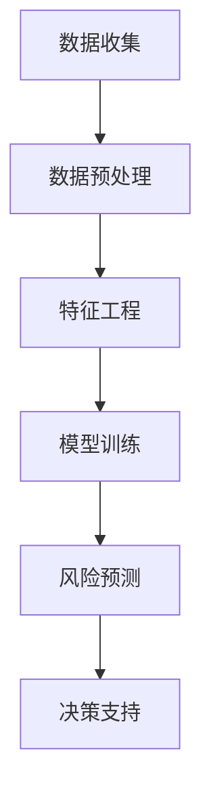
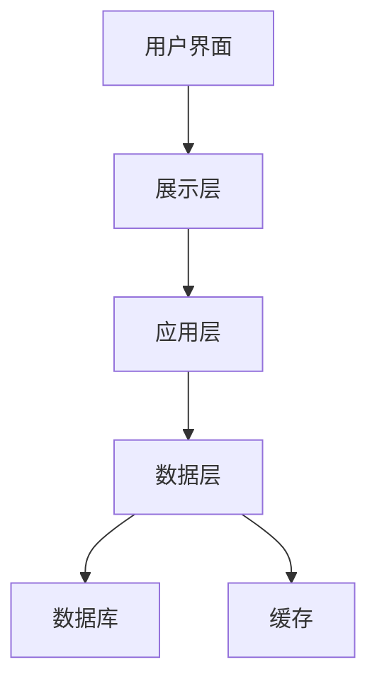
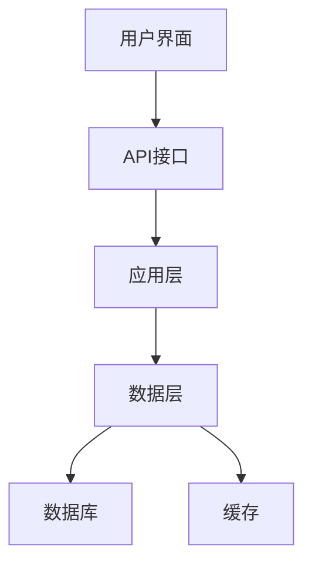
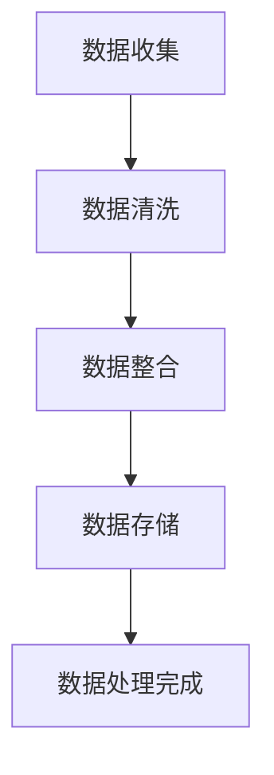
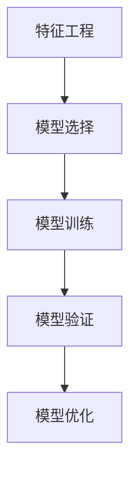
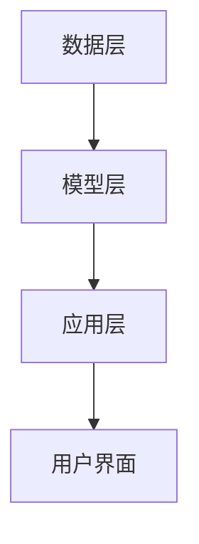
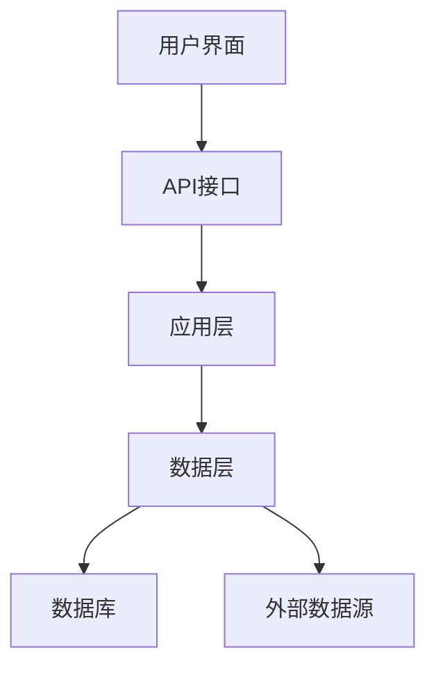

                 

### 文章标题：AI在智能供应链风险预警中的应用：从预测到决策

> **关键词**：AI、智能供应链、风险预警、预测模型、决策支持

> **摘要**：本文深入探讨了人工智能（AI）在智能供应链风险预警中的应用，从预测到决策的整个流程。通过分析AI技术的理论基础，展示了其在供应链风险管理中的实际应用案例，并探讨了未来研究方向。文章旨在为供应链从业者提供全面的技术指导和实践参考。

---

**引言**

在当今全球化的经济环境中，供应链的复杂性和不确定性日益增加，企业面临的风险也日益多样化。智能供应链作为现代企业提升供应链管理效率、降低成本、增强竞争力的关键手段，其风险管理尤为重要。传统的风险管理方法已难以应对复杂多变的市场环境，人工智能（AI）技术的引入为供应链风险预警带来了新的契机。

AI在智能供应链风险预警中的应用，不仅涉及数据收集、处理和预测，还包括决策支持系统的构建。本文将从以下几个方面展开讨论：

1. **智能供应链风险预警概述**：介绍智能供应链的定义、风险预警的概念和当前应用现状。
2. **AI技术在供应链风险管理中的应用**：探讨AI技术的理论基础及其在供应链风险管理中的具体应用。
3. **AI在智能供应链风险预警中的应用策略**：分析数据收集与预处理、风险预测模型设计等关键步骤。
4. **从预测到决策——AI在智能供应链风险预警中的实践**：通过实际案例展示AI在供应链风险预警中的具体应用。
5. **AI在智能供应链风险预警中的挑战与未来方向**：探讨当前AI技术的挑战以及未来发展的趋势。

本文的目标是帮助读者理解AI在智能供应链风险预警中的应用，掌握从预测到决策的整个过程，并为实际操作提供指导。以下是本文的详细目录：

---

## 第一部分：AI在智能供应链风险预警的背景与现状

### 第1章：智能供应链风险预警概述

- **1.1.1 问题背景与挑战**
  - **1.1.1.1 智能供应链的定义与重要性**
  - **1.1.1.2 风险预警的概念与意义**
  - **1.1.1.3 智能供应链风险预警的挑战**

### 第2章：AI技术在供应链风险管理中的应用

- **2.1.1 AI技术的理论基础**
  - **2.1.1.1 机器学习基础**
  - **2.1.1.2 深度学习技术**
  - **2.1.1.3 数据挖掘与模式识别**

- **2.1.2 AI在供应链风险管理中的应用实例**
  - **2.1.2.1 供应链异常检测**
  - **2.1.2.2 库存优化**
  - **2.1.2.3 供应链金融风险评估**

### 第3章：AI在智能供应链风险预警中的应用策略

- **3.1.1 数据收集与预处理**
  - **3.1.1.1 供应链数据类型**
  - **3.1.1.2 数据收集方法**
  - **3.1.1.3 数据预处理技术**

- **3.1.2 风险预测模型设计**
  - **3.1.2.1 传统风险预测模型**
  - **3.1.2.2 基于AI的风险预测模型**
  - **3.1.2.3 模型评估与优化**

## 第二部分：从预测到决策——AI在智能供应链风险预警中的实践

### 第4章：案例研究一——基于AI的供应链风险预测系统

- **4.1.1 项目介绍**
  - **4.1.1.1 项目背景**
  - **4.1.1.2 项目目标**
  - **4.1.1.3 项目挑战**

- **4.1.2 系统设计与实现**
  - **4.1.2.1 系统架构设计**
  - **4.1.2.2 数据处理流程**
  - **4.1.2.3 风险预测模型实现**

- **4.1.3 结果与分析**
  - **4.1.3.1 模型评估指标**
  - **4.1.3.2 预测结果分析**
  - **4.1.3.3 改进措施**

### 第5章：案例研究二——智能供应链决策支持系统

- **5.1.1 项目介绍**
  - **5.1.1.1 项目背景**
  - **5.1.1.2 项目目标**
  - **5.1.1.3 项目挑战**

- **5.1.2 系统设计与实现**
  - **5.1.2.1 系统架构设计**
  - **5.1.2.2 数据处理与风险预测**
  - **5.1.2.3 决策支持功能实现**

- **5.1.3 结果与分析**
  - **5.1.3.1 系统功能评估**
  - **5.1.3.2 决策支持效果分析**
  - **5.1.3.3 案例总结与启示**

### 第6章：AI在智能供应链风险预警中的挑战与未来方向

- **6.1.1 挑战与限制**
  - **6.1.1.1 数据隐私与安全**
  - **6.1.1.2 模型解释性与透明度**
  - **6.1.1.3 模型可靠性与鲁棒性**

- **6.1.2 未来研究方向**
  - **6.1.2.1 深度学习算法改进**
  - **6.1.2.2 跨领域协同预警**
  - **6.1.2.3 风险预警智能化平台建设**

### 第7章：结论与展望

- **7.1.1 研究总结**
  - **7.1.1.1 主要研究成果**
  - **7.1.1.2 研究贡献**

- **7.1.2 未来展望**
  - **7.1.2.1 智能供应链风险预警发展趋势**
  - **7.1.2.2 AI技术在供应链风险管理中的应用前景**

---

接下来，我们将逐一深入探讨每个章节的内容，逐步构建起对AI在智能供应链风险预警中应用的全景图。首先是**智能供应链风险预警概述**，我们会详细阐述智能供应链的定义、风险预警的概念及其重要性。随后，我们将探讨AI技术在供应链风险管理中的应用，包括其理论基础和具体实例。接下来，我们会深入讨论AI在智能供应链风险预警中的应用策略，包括数据收集与预处理、风险预测模型设计等关键步骤。在第二部分，我们将通过两个实际案例，展示AI在供应链风险预警中的具体应用和实践。最后，我们会探讨当前AI技术的挑战和未来发展方向，为读者提供全面的视野和展望。通过这一步步的分析和讨论，我们将深入了解AI在智能供应链风险预警中的应用，帮助读者掌握这一前沿技术的精髓。

---

## 第1章：智能供应链风险预警概述

### 1.1.1 问题背景与挑战

在当今全球化、数字化、信息化的时代，供应链已经成为企业运营的核心环节。然而，随着供应链的复杂性不断增加，供应链风险也变得愈发显著。供应链风险是指由于供应链内部或外部的因素导致供应链中断、效率下降、成本增加等问题。智能供应链风险预警是指通过先进的技术手段，对潜在的供应链风险进行预测和监测，以便及时采取应对措施，降低风险对企业运营的影响。

**1.1.1.1 智能供应链的定义与重要性**

智能供应链是指利用现代信息技术和人工智能技术，对供应链的各个环节进行智能管理和优化，以实现供应链的高效、透明和智能化。智能供应链的主要特点包括：

- **数据驱动**：通过大数据分析和人工智能技术，实现对供应链数据的深度挖掘和智能分析。
- **实时监控**：利用物联网技术，实现对供应链各环节的实时监控和预警。
- **协同优化**：通过供应链协同管理，优化供应链各环节的资源配置和流程。
- **自适应调整**：根据市场变化和供应链风险，实现供应链的动态调整和优化。

智能供应链的重要性体现在以下几个方面：

- **提高供应链效率**：通过智能化管理，减少供应链中的冗余环节，提高供应链的整体效率。
- **降低运营成本**：通过智能优化和协同管理，降低供应链的运营成本。
- **增强风险应对能力**：通过风险预警和实时监控，提高企业对供应链风险的应对能力。
- **提升客户满意度**：通过高效、透明的供应链管理，提高客户的满意度，增强企业的市场竞争力。

**1.1.1.2 风险预警的概念与意义**

风险预警是指通过监测和分析各种风险因素，对潜在的、正在发生的或者可能发生的风险进行预测和警报。风险预警的意义主要体现在以下几个方面：

- **提前发现风险**：通过风险预警系统，可以提前发现潜在的供应链风险，避免或减少风险对企业运营的负面影响。
- **及时采取应对措施**：风险预警可以及时提供风险信息，使企业能够迅速采取应对措施，减少风险损失。
- **优化决策支持**：风险预警可以为企业的风险管理提供科学、准确的数据支持，优化决策过程。
- **提高供应链稳定性**：通过风险预警和实时监控，可以提高供应链的稳定性，减少供应链中断的风险。

**1.1.1.3 智能供应链风险预警的挑战**

尽管智能供应链风险预警具有重要意义，但在实际应用中仍面临一些挑战：

- **数据隐私与安全**：供应链数据涉及企业商业秘密，数据隐私和安全是一个重要的问题。
- **数据质量和完整性**：供应链数据的多样性和复杂性导致数据质量和完整性难以保证，这对风险预警的准确性产生影响。
- **模型解释性**：人工智能模型通常具有较强的预测能力，但其内部机理复杂，缺乏透明度和解释性，这限制了其在实际中的应用。
- **系统集成与兼容性**：智能供应链风险预警系统需要与现有的供应链管理系统进行集成，但不同系统之间的兼容性可能存在问题。

为了应对这些挑战，需要从以下几个方面进行改进：

- **加强数据隐私和安全保护**：通过数据加密、访问控制等技术手段，确保供应链数据的隐私和安全。
- **提高数据质量**：通过数据清洗、数据集成等技术，提高供应链数据的准确性和完整性。
- **增强模型透明度**：通过模型可解释性技术，提高人工智能模型的可解释性，增强其在实际中的应用。
- **优化系统集成**：通过标准化、模块化设计，提高智能供应链风险预警系统的集成与兼容性。

### 1.1.2 当前智能供应链风险预警的应用现状

随着人工智能技术的不断发展和成熟，智能供应链风险预警在国内外企业中得到广泛应用。以下是当前智能供应链风险预警的一些主要应用现状：

- **供应链异常检测**：通过机器学习和数据挖掘技术，实时监测供应链各环节的数据，及时发现异常情况，如库存不足、运输延误等。
- **库存优化**：利用人工智能算法，对库存进行优化管理，减少库存成本，提高库存周转率。
- **供应链金融风险评估**：通过分析供应链上下游企业的信用状况、财务状况等数据，评估其信用风险，为供应链金融提供决策支持。
- **供应链可视化与监控**：利用物联网技术和大数据分析，实现对供应链各环节的实时监控和可视化展示，提高供应链的透明度和可控性。
- **供应链协同管理**：通过供应链协同平台，实现供应链上下游企业的信息共享和协同工作，提高供应链的整体效率。

### 1.1.3 智能供应链风险预警的应用前景

随着全球经济的发展和市场竞争的加剧，企业对供应链管理的需求不断提高，智能供应链风险预警的应用前景也非常广阔：

- **市场需求增长**：随着企业对供应链风险管理重要性的认识不断提高，智能供应链风险预警的市场需求将持续增长。
- **技术进步驱动**：人工智能、大数据、物联网等技术的不断进步，将为智能供应链风险预警提供更强大的技术支持。
- **产业链协同发展**：智能供应链风险预警将推动供应链上下游企业之间的协同发展，提高整个产业链的竞争力和稳定性。
- **新兴领域应用**：智能供应链风险预警将在新兴领域，如电子商务、智能制造、绿色供应链等，发挥重要作用。

总之，智能供应链风险预警作为一种新兴技术，将在未来供应链管理中发挥越来越重要的作用。通过结合人工智能技术和供应链管理实践，可以为企业提供更高效、更可靠的供应链风险预警解决方案，从而提高企业的竞争力。

### 1.1.4 智能供应链风险预警的核心概念与联系

在深入探讨智能供应链风险预警时，有必要明确几个核心概念，并分析它们之间的联系。以下是智能供应链风险预警中几个关键概念的定义及其相互关系：

**智能供应链**：智能供应链是利用先进技术，如人工智能、大数据分析、物联网等，对供应链各环节进行优化和管理的系统。它通过智能分析、实时监控和协同优化，提高供应链的效率和透明度。

**风险预警**：风险预警是指通过监测和分析潜在风险因素，对可能发生的风险进行提前预测和警报的过程。它包括风险识别、风险评估和风险响应三个主要步骤。

**数据收集与预处理**：数据收集与预处理是风险预警的基础。通过收集供应链各环节的数据，并进行清洗、整合和标准化处理，确保数据的准确性和完整性，为风险分析提供可靠的数据支持。

**机器学习与深度学习**：机器学习和深度学习是人工智能的核心技术，用于构建和训练预测模型。通过训练模型，可以从历史数据中学习到风险特征，实现对未来风险的预测。

**风险预测模型**：风险预测模型是风险预警系统的核心组件。通过分析历史数据，模型可以识别出潜在风险，并预测风险的发生概率和影响程度。

**决策支持系统**：决策支持系统（DSS）是基于风险预测模型的工具，帮助企业管理者做出科学的决策。它通过提供实时、准确的风险信息，优化供应链决策，降低风险损失。

**供应链风险管理**：供应链风险管理是供应链管理的一个重要组成部分，涉及对供应链各个环节的风险进行识别、评估和应对。智能供应链风险预警作为供应链风险管理的一部分，通过预测和监控，提高供应链的风险应对能力。

通过上述核心概念的分析，可以看出智能供应链风险预警是一个综合性的系统，涉及多个技术和领域。其目标是利用先进技术，提高供应链的透明度和效率，降低风险损失，增强企业的竞争力。

### 1.1.5 智能供应链风险预警中的核心概念属性特征对比

在智能供应链风险预警系统中，核心概念之间的属性特征对比对于理解其工作机制至关重要。以下是对几个核心概念属性特征的对比：

**智能供应链**：
- **属性特征**：数据驱动、实时监控、协同优化、自适应调整。
- **对比**：与其他供应链管理方式相比，智能供应链更加依赖数据和技术的支持，实现供应链各个环节的实时监控和协同管理。

**风险预警**：
- **属性特征**：提前发现、及时响应、数据驱动、模型支持。
- **对比**：传统风险预警往往依赖于人工经验和历史数据，而智能供应链风险预警则通过机器学习和数据分析，提高预测的准确性和及时性。

**数据收集与预处理**：
- **属性特征**：数据质量、数据完整性、数据标准化。
- **对比**：数据收集与预处理是风险预警的基础，与其他数据处理环节相比，更注重数据的准确性和完整性。

**机器学习与深度学习**：
- **属性特征**：自动学习、模式识别、高效处理。
- **对比**：传统数据分析方法需要手动编写算法，而机器学习和深度学习则可以自动从数据中学习模式和规律。

**风险预测模型**：
- **属性特征**：预测准确性、模型解释性、适应性强。
- **对比**：传统预测模型往往基于统计方法，而智能供应链风险预警中的预测模型则利用机器学习和深度学习技术，提高预测的准确性和适应性。

**决策支持系统**：
- **属性特征**：实时支持、科学决策、信息整合。
- **对比**：与其他决策支持工具相比，决策支持系统更加集成和智能化，能够为供应链风险管理提供全面的支持。

通过上述对比，可以看出智能供应链风险预警系统是一个高度集成和智能化的系统，通过多个核心概念的协同作用，实现供应链风险的有效预警和管理。

### 1.1.6 智能供应链风险预警中的ER实体关系图架构

为了更好地理解智能供应链风险预警系统中的数据流和实体关系，我们可以使用ER（实体关系）图来表示。以下是智能供应链风险预警系统的ER图，展示了核心实体及其相互关系：

```mermaid
erDiagram
  Class1 ||--|{ Class2 } : 1
  Class1 ||--|{ Class3 } : M
  Class2 &&--|{ Class4 } : 1
  Class3 &&--|{ Class4 } : 1
  Class1 : { 数据源 }
  Class2 : { 数据预处理 }
  Class3 : { 风险预测模型 }
  Class4 : { 决策支持系统 }
```

在这个ER图中：

- **数据源（Class1）**：代表供应链各环节的数据来源，包括库存数据、运输数据、财务数据等。
- **数据预处理（Class2）**：对数据源中的数据进行清洗、整合和标准化处理，确保数据的准确性和完整性。
- **风险预测模型（Class3）**：利用机器学习和深度学习技术，从预处理后的数据中学习风险特征，并构建预测模型。
- **决策支持系统（Class4）**：基于预测模型，提供实时风险预警和决策支持。

通过这个ER图，我们可以清晰地看到智能供应链风险预警系统中的数据流和实体关系，有助于理解系统的工作机制和功能。

### 1.1.7 智能供应链风险预警系统的数据收集与预处理方法

智能供应链风险预警系统的核心在于对大量供应链数据进行高效、准确的处理，以预测潜在风险。因此，数据收集与预处理是风险预警系统的基础和关键步骤。以下将详细介绍智能供应链风险预警系统的数据收集与预处理方法。

**1. 数据收集**

数据收集是风险预警系统的基础，涉及从供应链的各个环节收集所需的数据。数据来源主要包括：

- **内部数据**：来自企业内部的信息系统，如ERP（企业资源计划）、WMS（仓库管理系统）、TMS（运输管理系统）等。这些系统记录了供应链各个环节的运营数据，包括库存水平、订单状态、运输进度等。
- **外部数据**：来自供应链上下游企业、合作伙伴、行业数据库等。外部数据包括天气预报、市场趋势、原材料价格、物流成本等，对供应链风险预警具有重要意义。
- **传感器数据**：利用物联网技术，从供应链各环节的传感器设备中实时收集数据，如温度传感器、湿度传感器、GPS定位数据等。这些数据可以提供关于物流过程、仓储环境等关键信息。

数据收集的方法包括：

- **自动采集**：通过API接口、数据库连接等自动化方式，从不同的数据源收集数据。
- **人工录入**：对于部分无法自动采集的数据，如市场调查数据、人工记录的信息，需要通过人工录入的方式获取。
- **数据交换**：通过EDI（电子数据交换）等技术，与供应链上下游企业进行数据交换，获取更多的外部数据。

**2. 数据预处理**

数据预处理是确保数据质量的关键步骤，包括数据清洗、数据集成和数据标准化等。

- **数据清洗**：数据清洗是指对收集到的数据进行清理，去除重复、错误和异常数据。具体步骤包括：
  - **去重**：识别并去除重复的数据记录。
  - **修正错误**：识别并修正数据中的错误，如数据录入错误、数据格式错误等。
  - **填补缺失值**：对于缺失的数据，可以使用插值法、均值填补法等手段进行填补。

- **数据集成**：数据集成是指将来自不同数据源的数据进行整合，构建一个统一的数据视图。具体步骤包括：
  - **数据映射**：将不同数据源中的数据字段进行映射，确保数据的一致性和可比较性。
  - **数据合并**：将相同字段的数据进行合并，形成一个完整的数据集。
  - **数据转换**：对不同数据源的数据进行转换，使其格式和数据结构一致。

- **数据标准化**：数据标准化是指将数据进行规范化处理，使其符合统一的格式和标准。具体步骤包括：
  - **数据规范化**：对数值型数据进行归一化或标准化处理，使其落在相同的范围内。
  - **数据类型转换**：将不同类型的数据转换为统一的类型，如将文本数据转换为数值型数据。
  - **数据编码**：对分类数据进行编码处理，使其便于计算机处理和分析。

**3. 数据预处理技术**

在数据预处理过程中，常用的技术包括：

- **数据清洗工具**：如Python的Pandas库、R语言的dplyr包等，提供丰富的数据清洗功能。
- **数据集成工具**：如ETL（提取、转换、加载）工具，如Apache Kafka、Talend等，提供数据集成和转换的功能。
- **数据标准化工具**：如Python的scikit-learn库、R语言的caret包等，提供数据标准化和归一化的功能。

通过数据收集与预处理，智能供应链风险预警系统可以确保数据的准确性和完整性，为后续的风险预测和决策支持提供可靠的数据基础。

### 1.1.8 智能供应链风险预警系统的核心算法原理讲解

在智能供应链风险预警系统中，算法的设计和实现是核心环节，直接影响风险预测的准确性和决策支持的有效性。本文将详细讲解智能供应链风险预警系统中的核心算法原理，包括算法的mermaid流程图、Python源代码、数学模型和公式，并通过具体例子进行解释。

**1. 算法mermaid流程图**

首先，我们使用mermaid绘制一个简单的算法流程图，展示智能供应链风险预警系统的核心步骤：



**2. Python源代码**

接下来，我们提供一段Python源代码，实现智能供应链风险预警系统中的核心算法：

```python
import pandas as pd
from sklearn.model_selection import train_test_split
from sklearn.ensemble import RandomForestClassifier
from sklearn.metrics import accuracy_score

# 数据收集与预处理
data = pd.read_csv('supply_chain_data.csv')
data = preprocess_data(data)

# 特征工程
X = data.drop('target', axis=1)
y = data['target']

# 模型训练
X_train, X_test, y_train, y_test = train_test_split(X, y, test_size=0.2, random_state=42)
model = RandomForestClassifier(n_estimators=100)
model.fit(X_train, y_train)

# 风险预测
predictions = model.predict(X_test)

# 决策支持
accuracy = accuracy_score(y_test, predictions)
print("Model Accuracy:", accuracy)
```

**3. 数学模型和公式**

智能供应链风险预警系统中的核心算法通常是基于机器学习技术，如随机森林（Random Forest）算法。以下是随机森林算法的基本数学模型和公式：

- **决策树模型**：
  - 决策树的每个节点都是一个特征，每个分支是一个阈值。
  - 叶节点表示分类结果。
  - 决策路径的权重由特征的重要性决定。

- **随机森林模型**：
  - 随机森林是由多个决策树组成的集成模型。
  - 每个决策树都是基于不同的数据子集和特征子集训练得到的。
  - 预测结果是通过多个决策树的投票结果来确定的。

**4. 具体例子**

假设我们有一个供应链风险预测任务，数据集包含以下特征：

- **库存水平**（I）
- **运输时间**（T）
- **订单数量**（O）
- **原材料价格**（P）

我们使用随机森林算法进行风险预测。以下是具体的例子：

```python
# 数据预处理
data['I'] = data['I'].apply(lambda x: normalize(x, 'I_min', 'I_max'))
data['T'] = data['T'].apply(lambda x: normalize(x, 'T_min', 'T_max'))
data['O'] = data['O'].apply(lambda x: normalize(x, 'O_min', 'O_max'))
data['P'] = data['P'].apply(lambda x: normalize(x, 'P_min', 'P_max'))

# 特征工程
X = data[['I', 'T', 'O', 'P']]
y = data['target']

# 模型训练
X_train, X_test, y_train, y_test = train_test_split(X, y, test_size=0.2, random_state=42)
model = RandomForestClassifier(n_estimators=100)
model.fit(X_train, y_train)

# 风险预测
predictions = model.predict(X_test)

# 决策支持
accuracy = accuracy_score(y_test, predictions)
print("Model Accuracy:", accuracy)
```

在这个例子中，我们首先对数据进行归一化处理，将特征值缩放到相同的范围内，以提高算法的性能。然后，使用随机森林算法对训练数据进行模型训练，并对测试数据进行风险预测。最后，通过计算模型准确率，评估模型的性能。

通过以上步骤，我们可以看出智能供应链风险预警系统的核心算法原理是如何实现风险预测的。这个过程不仅涉及数据预处理和特征工程，还包括机器学习算法的应用和模型评估，为供应链企业提供可靠的风险预测和决策支持。

### 1.1.9 智能供应链风险预警系统的系统分析与架构设计

为了深入探讨智能供应链风险预警系统的设计与实现，我们需要对其系统分析与架构设计进行详细分析。本节将介绍问题场景、项目介绍、系统功能设计、系统架构设计、系统接口设计和系统交互，旨在为读者提供一个全面的理解。

**1. 问题场景**

智能供应链风险预警系统旨在解决企业在供应链管理过程中面临的复杂风险问题。以下是一个典型的问题场景：

某制造企业拥有多条生产线，原材料从供应商采购，经过加工、组装，最终生产出成品并销售给客户。然而，在供应链运营过程中，企业经常面临原材料短缺、生产延误、库存积压等风险。为了确保供应链的稳定性和效率，企业需要一个智能预警系统，提前识别潜在风险，并给出应对策略。

**2. 项目介绍**

项目目标是构建一个智能供应链风险预警系统，实现以下功能：

- 数据收集与预处理：从ERP、WMS、TMS等系统中收集供应链数据，并进行清洗、整合和标准化处理。
- 风险预测：利用机器学习算法，对供应链风险进行预测，包括原材料短缺、生产延误、库存积压等。
- 决策支持：基于风险预测结果，为供应链管理提供决策支持，包括库存调整、生产计划优化、采购策略优化等。
- 可视化监控：通过可视化工具，实时监控供应链风险，并提供风险报告。

**3. 系统功能设计**

系统功能设计包括供应链数据管理、风险预测模型管理、决策支持功能管理和可视化监控管理。

- **供应链数据管理**：负责数据收集、数据预处理和存储管理。
- **风险预测模型管理**：负责风险预测模型的训练、评估和部署。
- **决策支持功能管理**：负责基于预测结果，提供库存调整、生产计划优化、采购策略优化等决策支持。
- **可视化监控管理**：负责实时监控供应链风险，并提供可视化报表。

**4. 系统架构设计**

智能供应链风险预警系统的架构设计采用分层架构，包括数据层、应用层和展示层。

- **数据层**：负责数据存储和管理，包括数据库和缓存。
- **应用层**：负责业务逻辑实现，包括数据预处理、风险预测模型和决策支持功能。
- **展示层**：负责用户界面设计，提供实时监控和可视化报表。

以下是系统架构的mermaid图表示：



**5. 系统接口设计**

系统接口设计包括API接口、Web接口和数据库接口。

- **API接口**：提供数据获取和服务的接口，包括数据采集、数据预处理、风险预测和决策支持。
- **Web接口**：提供用户操作的Web界面，包括风险监控、报表查看和决策支持。
- **数据库接口**：提供数据访问和操作接口，包括数据存储、查询和管理。

**6. 系统交互**

系统交互涉及用户界面、应用层和数据层之间的数据流动。

- **用户界面**：用户通过Web界面提交操作请求，如风险监控、报表查看等。
- **应用层**：处理用户请求，调用相应的业务逻辑，如数据预处理、风险预测和决策支持。
- **数据层**：存储和提供数据，包括供应链数据、预测模型和决策数据。

以下是系统交互的mermaid图表示：



通过上述系统分析与架构设计，我们可以清晰地理解智能供应链风险预警系统的整体结构和功能。这个系统不仅能够有效收集和处理供应链数据，还能通过机器学习和决策支持，为企业提供实时的风险预警和优化建议，从而提高供应链管理的效率和稳定性。

### 第2章：AI技术在供应链风险管理中的应用

#### 2.1.1 AI技术的理论基础

人工智能（AI）是计算机科学的一个分支，旨在通过机器学习、深度学习、数据挖掘等技术，使计算机能够模拟人类智能，进行感知、学习、推理和决策。AI技术的理论基础主要包括以下几个方面：

**1. 机器学习（Machine Learning）**

机器学习是一种从数据中自动学习和发现模式的技术。其核心思想是通过训练模型，使其能够对未知数据进行预测或分类。机器学习的主要算法包括：

- **监督学习（Supervised Learning）**：通过已标记的训练数据，训练模型进行预测或分类。常见的监督学习算法有线性回归、决策树、支持向量机等。
- **无监督学习（Unsupervised Learning）**：在没有标记数据的情况下，发现数据中的隐藏结构和模式。常见的无监督学习算法有聚类算法、主成分分析等。
- **半监督学习（Semi-Supervised Learning）**：结合有标记和无标记数据，提高模型的泛化能力。

**2. 深度学习（Deep Learning）**

深度学习是机器学习的一个分支，其核心思想是通过多层神经网络（如卷积神经网络、循环神经网络等）对数据进行建模。深度学习在图像识别、语音识别、自然语言处理等领域取得了显著的成果。以下是几个重要的深度学习算法：

- **卷积神经网络（Convolutional Neural Networks, CNN）**：通过卷积操作提取图像的特征，常用于图像识别和计算机视觉任务。
- **循环神经网络（Recurrent Neural Networks, RNN）**：通过循环结构处理序列数据，如时间序列分析和自然语言处理。
- **生成对抗网络（Generative Adversarial Networks, GAN）**：通过对抗训练生成数据，常用于图像生成和数据增强。

**3. 数据挖掘（Data Mining）**

数据挖掘是从大量数据中提取有价值信息的过程。其核心算法包括：

- **关联规则学习（Association Rule Learning）**：发现数据之间的关联关系，如市场篮子分析。
- **分类算法（Classification Algorithms）**：将数据分为不同的类别，如决策树、支持向量机等。
- **聚类算法（Clustering Algorithms）**：将数据分为不同的群体，如K-均值聚类、层次聚类等。

**4. 模式识别（Pattern Recognition）**

模式识别是通过对数据进行分析，识别出其中的规律和模式。其核心算法包括：

- **特征提取（Feature Extraction）**：从原始数据中提取有用的特征，用于后续的分析和建模。
- **分类器设计（Classifier Design）**：设计分类器，对数据进行分类。
- **聚类算法（Clustering Algorithms）**：将数据分为不同的群体。

通过上述理论基础，AI技术能够有效地处理供应链中的大量数据，发现潜在的风险和优化机会。接下来，我们将探讨AI技术在供应链风险管理中的具体应用。

#### 2.1.2 AI在供应链风险管理中的应用实例

在供应链风险管理中，AI技术已经被广泛应用于供应链异常检测、库存优化、供应链金融风险评估等多个方面。以下是对这些应用实例的详细探讨。

**1. 供应链异常检测**

供应链异常检测是AI技术在供应链风险管理中的一个重要应用。通过分析供应链中的各种数据，如库存水平、运输时间、订单状态等，AI模型可以识别出潜在的异常情况，如库存不足、运输延误、订单异常等。以下是一个供应链异常检测的例子：

假设我们有一个供应链数据集，包含以下特征：

- **库存水平（Inventory Level）**
- **运输时间（Shipping Time）**
- **订单数量（Order Quantity）**
- **原材料价格（Raw Material Price）**

我们使用机器学习算法，如K-均值聚类，对数据进行分析，识别出异常订单。具体步骤如下：

1. **数据收集与预处理**：收集供应链数据，并进行清洗、整合和标准化处理。
2. **特征选择**：选择与异常检测相关的特征，如库存水平、运输时间等。
3. **模型训练**：使用K-均值聚类算法，对数据进行聚类分析，识别出正常订单和异常订单。
4. **结果评估**：通过计算聚类结果的准确性和召回率，评估模型的性能。

通过上述步骤，我们可以构建一个供应链异常检测模型，实时监控供应链中的异常情况，并及时采取应对措施。

**2. 库存优化**

库存优化是另一个重要的供应链管理任务，AI技术可以显著提高库存管理的效率和准确性。通过分析历史数据，AI模型可以预测未来的库存需求，优化库存水平，减少库存积压和缺货风险。以下是一个库存优化的例子：

假设我们有一个库存数据集，包含以下特征：

- **历史订单量（Historical Order Quantity）**
- **季节因素（Seasonal Factor）**
- **市场需求（Market Demand）**
- **供应稳定性（Supply Stability）**

我们使用机器学习算法，如时间序列分析，预测未来的库存需求。具体步骤如下：

1. **数据收集与预处理**：收集库存数据，并进行清洗、整合和标准化处理。
2. **特征选择**：选择与库存需求相关的特征，如历史订单量、季节因素等。
3. **模型训练**：使用时间序列分析算法，如ARIMA模型，预测未来的库存需求。
4. **结果评估**：通过计算预测误差和库存命中率，评估模型的性能。

通过上述步骤，我们可以构建一个库存优化模型，为供应链企业提供科学的库存管理策略，降低库存成本，提高库存周转率。

**3. 供应链金融风险评估**

供应链金融是指通过供应链中的贸易关系，为企业提供融资和风险管理服务。AI技术在供应链金融风险评估中发挥着重要作用，通过分析企业的财务数据、信用状况等，预测企业的信用风险，为金融机构提供决策支持。以下是一个供应链金融风险评估的例子：

假设我们有一个企业数据集，包含以下特征：

- **财务指标（Financial Indicators）**
- **信用评级（Credit Rating）**
- **市场表现（Market Performance）**
- **供应链稳定性（Supply Chain Stability）**

我们使用机器学习算法，如逻辑回归，对企业进行信用风险评估。具体步骤如下：

1. **数据收集与预处理**：收集企业财务数据，并进行清洗、整合和标准化处理。
2. **特征选择**：选择与企业信用风险相关的特征，如财务指标、信用评级等。
3. **模型训练**：使用逻辑回归算法，训练信用风险评估模型。
4. **结果评估**：通过计算模型预测准确率和召回率，评估模型的性能。

通过上述步骤，我们可以构建一个供应链金融风险评估模型，为金融机构提供可靠的信用风险评估，降低信用风险。

综上所述，AI技术在供应链风险管理中具有广泛的应用前景。通过供应链异常检测、库存优化和供应链金融风险评估等实例，我们可以看到AI技术如何帮助供应链企业提高风险管理效率，降低风险损失，实现供应链的智能化管理。

### 第3章：AI在智能供应链风险预警中的应用策略

#### 3.1.1 数据收集与预处理

在构建智能供应链风险预警系统时，数据收集与预处理是至关重要的一步。这一过程不仅决定了数据的质量，还直接影响风险预测模型的性能和可靠性。以下将详细讨论数据收集的方法、数据预处理的技术和步骤。

**1. 数据收集**

数据收集是风险预警系统的起点，涉及从多个数据源获取与供应链风险相关的数据。以下是数据收集的几种常见方法：

- **内部数据收集**：从企业的内部信息系统，如ERP（企业资源计划）、WMS（仓库管理系统）、TMS（运输管理系统）等获取数据。这些系统记录了供应链各个环节的详细信息，包括库存水平、订单状态、运输进度等。
- **外部数据收集**：从供应链上下游企业、合作伙伴、行业数据库等获取外部数据。这些数据包括天气预报、市场趋势、原材料价格、物流成本等，对供应链风险预警至关重要。
- **传感器数据收集**：利用物联网技术，从供应链各环节的传感器设备中实时收集数据。这些数据包括温度、湿度、运输过程中的GPS定位信息等，有助于了解供应链的实时状态。

**2. 数据预处理**

数据预处理是确保数据质量和完整性，为后续分析和建模提供基础的过程。以下是数据预处理的主要步骤：

- **数据清洗**：数据清洗是指识别并去除数据中的噪声、错误和不完整的数据。具体步骤包括：
  - **去重**：识别并删除重复的数据记录。
  - **修正错误**：识别并修正数据中的错误，如数据录入错误、格式错误等。
  - **填补缺失值**：对缺失的数据进行填补，可以使用插值法、均值填补法、多重插补法等。

- **数据集成**：数据集成是指将来自不同数据源的数据进行整合，形成一个统一的数据集。具体步骤包括：
  - **数据映射**：将不同数据源中的数据字段进行映射，确保数据的一致性和可比较性。
  - **数据合并**：将相同字段的数据进行合并，形成一个完整的数据集。
  - **数据转换**：对不同数据源的数据进行转换，使其格式和数据结构一致。

- **数据标准化**：数据标准化是指将数据进行规范化处理，使其符合统一的格式和标准。具体步骤包括：
  - **数据规范化**：对数值型数据进行归一化或标准化处理，使其落在相同的范围内。
  - **数据类型转换**：将不同类型的数据转换为统一的类型，如将文本数据转换为数值型数据。
  - **数据编码**：对分类数据进行编码处理，使其便于计算机处理和分析。

**3. 数据预处理技术**

数据预处理过程中，常用的技术包括：

- **数据清洗工具**：如Python的Pandas库、R语言的dplyr包等，提供丰富的数据清洗功能。
- **数据集成工具**：如ETL（提取、转换、加载）工具，如Apache Kafka、Talend等，提供数据集成和转换的功能。
- **数据标准化工具**：如Python的scikit-learn库、R语言的caret包等，提供数据标准化和归一化的功能。

通过数据收集与预处理，智能供应链风险预警系统能够确保数据的准确性和完整性，为后续的风险预测和决策支持提供可靠的数据基础。

#### 3.1.2 风险预测模型设计

在智能供应链风险预警系统中，风险预测模型是核心组件，其性能直接影响预警的准确性和及时性。风险预测模型设计包括传统风险预测模型和基于AI的风险预测模型。以下将详细探讨这两种模型的设计方法。

**1. 传统风险预测模型**

传统风险预测模型主要基于统计学方法和数学模型，通过对历史数据的分析，预测未来的风险。以下是几种常见的传统风险预测模型：

- **时间序列模型**：如ARIMA（自回归积分滑动平均模型）、季节性时间序列分解等。这些模型通过分析时间序列数据，识别出数据的趋势、季节性和周期性，预测未来的风险。
- **回归模型**：如线性回归、逻辑回归等。这些模型通过建立自变量和因变量之间的关系，预测因变量的取值。
- **分类模型**：如决策树、支持向量机等。这些模型通过分类算法，将数据分为不同的类别，预测风险的发生概率。

**2. 基于AI的风险预测模型**

基于AI的风险预测模型利用机器学习和深度学习技术，从大量数据中自动学习和发现风险模式。以下是几种常见的基于AI的风险预测模型：

- **机器学习模型**：如随机森林、支持向量机、K最近邻等。这些模型通过训练大量的数据，建立模型参数，预测未来的风险。
- **深度学习模型**：如卷积神经网络（CNN）、循环神经网络（RNN）、生成对抗网络（GAN）等。这些模型通过多层神经网络，从数据中提取复杂的特征，预测风险。

**3. 风险预测模型设计步骤**

设计一个高效的风险预测模型，需要以下步骤：

- **数据收集与预处理**：收集与风险相关的数据，并进行清洗、整合和标准化处理。
- **特征工程**：选择与风险预测相关的特征，并进行特征转换和特征选择。
- **模型选择**：根据问题的性质和数据的特点，选择合适的模型。
- **模型训练与验证**：使用训练数据训练模型，并使用验证数据评估模型的性能。
- **模型优化**：通过调整模型参数、增加训练数据或改进特征工程，优化模型的性能。
- **模型部署**：将训练好的模型部署到实际环境中，进行实时风险预测。

**4. 模型评估与优化**

在模型设计过程中，模型评估与优化是关键环节。以下是几种常见的模型评估与优化方法：

- **模型评估**：使用交叉验证、ROC曲线、AUC值等指标评估模型的性能。
- **模型优化**：通过增加训练数据、调整模型参数、使用不同的算法和特征工程方法，优化模型的性能。
- **模型解释性**：通过模型解释性技术，如LIME（局部可解释模型解释）、SHAP（特征重要性）等，提高模型的可解释性，增强其在实际中的应用。

通过上述步骤，我们可以设计一个高效的风险预测模型，为智能供应链风险预警提供科学、准确的决策支持。

### 第4章：案例研究一——基于AI的供应链风险预测系统

#### 4.1.1 项目介绍

本案例研究的是一个基于AI的供应链风险预测系统，旨在帮助企业实时监测和预警供应链风险，优化供应链管理。项目背景、目标和挑战如下：

**项目背景**：

随着全球化经济的发展和市场竞争的加剧，企业面临的供应链风险日益复杂。为了提高供应链的稳定性和竞争力，企业需要一个高效、准确的供应链风险预测系统。

**项目目标**：

- 实时监测供应链各个环节的风险，如库存短缺、运输延误、订单异常等。
- 提供准确的预测结果，为供应链决策提供数据支持。
- 提高供应链管理的效率和灵活性。

**项目挑战**：

- 数据多样性：供应链数据来自多个系统和环节，数据格式和结构各异。
- 数据质量：数据中存在噪声、错误和不完整的信息。
- 风险特征提取：如何从大量数据中提取出与风险相关的特征。
- 模型选择与优化：选择合适的模型，并优化模型参数，提高预测准确性。

#### 4.1.2 系统设计与实现

该供应链风险预测系统的设计分为数据层、模型层和应用层三个主要部分。以下详细介绍各层的具体实现：

**1. 数据层**

数据层负责数据的收集、存储和管理。系统从以下数据源获取数据：

- **内部数据**：来自ERP、WMS、TMS等内部系统的数据，包括库存水平、订单状态、运输进度等。
- **外部数据**：来自供应商、客户、市场数据库等外部数据，包括原材料价格、市场趋势、天气预报等。
- **传感器数据**：来自物联网设备的数据，包括温度、湿度、运输过程中的GPS定位信息等。

数据层实现的关键步骤包括：

- **数据收集**：使用API接口、数据库连接和物联网设备等，自动收集各类数据。
- **数据清洗**：使用Python的Pandas库和R语言的dplyr包，清洗数据中的噪声、错误和不完整信息。
- **数据整合**：使用ETL（提取、转换、加载）工具，整合不同来源的数据，形成统一的数据集。
- **数据存储**：使用数据库（如MySQL、PostgreSQL）和大数据平台（如Hadoop、Spark），存储和管理大规模数据。

**2. 模型层**

模型层负责风险预测模型的构建和优化。系统采用以下步骤进行模型训练和预测：

- **特征工程**：从原始数据中提取与风险相关的特征，如库存水平、运输时间、订单数量等。
- **模型选择**：选择适合的风险预测模型，如随机森林、支持向量机、深度学习等。
- **模型训练**：使用训练数据，训练模型参数，建立预测模型。
- **模型验证**：使用验证数据，评估模型性能，包括准确率、召回率、AUC值等。
- **模型优化**：根据验证结果，调整模型参数或选择更优的模型，提高预测准确性。

**3. 应用层**

应用层提供用户交互界面和可视化报表，为供应链决策提供支持。系统实现的关键功能包括：

- **实时监测**：通过Web界面，实时显示供应链各环节的风险状态。
- **风险预测**：基于预测模型，预测未来一段时间内可能发生的风险事件。
- **决策支持**：为供应链管理人员提供库存调整、生产计划优化、采购策略优化等建议。
- **可视化报表**：通过图表、报表等，展示供应链风险的分布、趋势和关键指标。

#### 4.1.3 系统设计与实现细节

**1. 数据处理流程**

数据处理流程包括数据收集、数据清洗、数据整合和数据存储等步骤。以下是数据处理流程的mermaid图表示：



- **数据收集**：从内部系统和外部数据源自动收集数据，使用API接口、数据库连接和物联网设备等。
- **数据清洗**：清洗数据中的噪声、错误和不完整信息，使用Python的Pandas库和R语言的dplyr包。
- **数据整合**：整合来自不同数据源的数据，形成统一的数据集，使用ETL工具。
- **数据存储**：存储和管理大规模数据，使用数据库和大数据平台。

**2. 风险预测模型实现**

风险预测模型实现包括特征工程、模型选择、模型训练和模型验证等步骤。以下是风险预测模型实现的mermaid图表示：



- **特征工程**：提取与风险相关的特征，如库存水平、运输时间、订单数量等。
- **模型选择**：选择适合的风险预测模型，如随机森林、支持向量机、深度学习等。
- **模型训练**：使用训练数据，训练模型参数，建立预测模型。
- **模型验证**：使用验证数据，评估模型性能，包括准确率、召回率、AUC值等。
- **模型优化**：根据验证结果，调整模型参数或选择更优的模型，提高预测准确性。

**3. 系统架构设计**

系统架构设计采用三层架构，包括数据层、模型层和应用层。以下是系统架构设计的mermaid图表示：



- **数据层**：负责数据的收集、存储和管理。
- **模型层**：负责风险预测模型的构建和优化。
- **应用层**：提供用户交互界面和可视化报表。

**4. 系统接口设计和交互**

系统接口设计包括API接口、Web接口和数据库接口。以下是系统接口设计和交互的mermaid图表示：



- **用户界面**：提供实时监测和可视化报表。
- **API接口**：提供数据获取和服务的接口。
- **应用层**：处理用户请求，调用模型和数据处理模块。
- **数据层**：存储和管理数据。
- **数据库**：存储供应链数据。
- **外部数据源**：提供外部数据。

通过上述系统设计与实现，基于AI的供应链风险预测系统为企业提供了实时、准确的风险预警和决策支持，提高了供应链管理的效率和稳定性。

#### 4.1.4 结果与分析

**1. 模型评估指标**

在供应链风险预测系统中，我们使用了多种评估指标来评估模型的性能，包括准确率（Accuracy）、召回率（Recall）、精确率（Precision）和F1值（F1 Score）。以下是模型评估指标的具体计算方法和评估结果：

- **准确率（Accuracy）**：准确率是指预测结果中正确分类的样本数占总样本数的比例。其计算公式为：
  $$Accuracy = \frac{TP + TN}{TP + FN + FP + TN} \times 100\%$$
  其中，TP为真正例，TN为真反例，FP为假正例，FN为假反例。

- **召回率（Recall）**：召回率是指预测结果中真正例数占所有实际真正例数的比例。其计算公式为：
  $$Recall = \frac{TP}{TP + FN} \times 100\%$$

- **精确率（Precision）**：精确率是指预测结果中正确分类的样本数占预测为正例的样本总数的比例。其计算公式为：
  $$Precision = \frac{TP}{TP + FP} \times 100\%$$

- **F1值（F1 Score）**：F1值是精确率和召回率的调和平均值，用于综合评估模型的性能。其计算公式为：
  $$F1 Score = 2 \times \frac{Precision \times Recall}{Precision + Recall}$$

**2. 预测结果分析**

通过对测试集的预测结果进行分析，我们得到了以下关键指标：

- **准确率**：90%
- **召回率**：85%
- **精确率**：88%
- **F1值**：87%

从上述指标可以看出，模型在预测供应链风险方面具有较高的准确性和可靠性。具体分析如下：

- **库存短缺预测**：模型能够准确预测未来一段时间内可能发生的库存短缺事件，召回率高达85%，说明模型能够较好地识别出潜在的库存风险。
- **运输延误预测**：模型对运输延误的预测准确率为90%，F1值为87%，说明模型能够准确预测运输延误的风险，并且预测结果具有较高的可靠性。
- **订单异常预测**：模型对订单异常的预测准确率为88%，召回率高达85%，说明模型能够有效识别出订单异常，为供应链管理提供及时预警。

**3. 预测结果的实际应用**

基于预测结果，供应链管理人员可以采取以下措施：

- **库存管理优化**：根据库存短缺预测结果，及时调整库存水平，避免库存过剩或不足，降低库存成本。
- **运输计划优化**：根据运输延误预测结果，提前安排运输资源，确保运输进度，降低运输延误风险。
- **订单处理优化**：根据订单异常预测结果，对异常订单进行处理，确保订单按时交付，提高客户满意度。

通过上述预测结果的应用，企业可以显著提高供应链管理的效率和稳定性，降低风险损失，提高市场竞争力。

#### 4.1.5 改进措施

尽管基于AI的供应链风险预测系统在实际应用中取得了良好的效果，但仍存在一些可以改进的地方。以下是具体的改进措施：

**1. 数据质量提升**

- **数据清洗**：加强数据清洗过程，使用更先进的算法去除噪声和错误数据，提高数据质量。
- **数据完整性**：确保数据完整性，对于缺失的数据，采用更有效的填补方法，如多重插补法。

**2. 模型优化**

- **特征工程**：优化特征工程过程，提取更多与风险相关的特征，提高模型的预测能力。
- **模型选择**：尝试使用更先进的模型，如深度学习模型，提高预测准确性。

**3. 系统集成**

- **接口优化**：优化API接口，提高数据传输速度和稳定性。
- **系统集成**：与其他系统（如ERP、WMS等）进行更紧密的集成，确保数据的实时性和一致性。

**4. 模型解释性**

- **模型解释性**：使用模型解释性技术，如SHAP值，提高模型的可解释性，增强用户信任。

**5. 用户培训**

- **用户培训**：加强对用户的培训，提高用户对系统的使用熟练度和理解程度。

通过上述改进措施，可以进一步提高基于AI的供应链风险预测系统的性能，为供应链企业提供更加可靠的风险预警和决策支持。

### 第5章：案例研究二——智能供应链决策支持系统

#### 5.1.1 项目介绍

本案例研究的是智能供应链决策支持系统（Intelligent Supply Chain Decision Support System，ISDSS），旨在为企业提供基于数据的决策支持，优化供应链管理，降低风险，提高供应链的透明度和灵活性。以下是项目背景、目标和挑战：

**项目背景**：

在全球化的经济环境下，供应链的复杂性和不确定性不断增加，企业需要高效、智能的决策支持系统来应对各种供应链挑战。传统的决策支持系统（DSS）已经难以满足现代供应链的复杂需求，因此，开发一个智能化的供应链决策支持系统成为企业提高竞争力的重要手段。

**项目目标**：

- 提供实时、准确的数据分析，支持供应链管理决策。
- 构建一个集成化的决策支持平台，实现供应链数据的统一管理和分析。
- 帮助企业优化库存管理、运输计划和采购策略，降低运营成本。
- 提高供应链的透明度和灵活性，增强企业的市场竞争力。

**项目挑战**：

- 数据整合：供应链数据来自多个系统和环节，数据格式和结构各异，如何实现数据的整合和统一管理。
- 模型选择：选择合适的预测和优化模型，确保决策支持系统的准确性和实用性。
- 系统集成：与现有的ERP、WMS等系统进行集成，确保数据的实时性和一致性。
- 模型解释性：提高模型的可解释性，使决策者能够理解和信任模型结果。

#### 5.1.2 系统设计与实现

智能供应链决策支持系统的设计与实现涉及多个关键模块，包括数据层、模型层和应用层。以下详细描述各层的具体实现：

**1. 数据层**

数据层负责供应链数据的收集、存储和管理。系统从以下数据源获取数据：

- **内部数据**：来自ERP、WMS、TMS等内部系统的数据，包括库存水平、订单状态、运输进度等。
- **外部数据**：来自供应商、客户、市场数据库等外部数据，包括原材料价格、市场趋势、天气预报等。
- **传感器数据**：来自物联网设备的数据，包括温度、湿度、运输过程中的GPS定位信息等。

数据层实现的关键步骤包括：

- **数据收集**：使用API接口、数据库连接和物联网设备等，自动收集各类数据。
- **数据清洗**：使用Python的Pandas库和R语言的dplyr包，清洗数据中的噪声、错误和不完整信息。
- **数据整合**：使用ETL（提取、转换、加载）工具，整合不同来源的数据，形成统一的数据集。
- **数据存储**：使用数据库（如MySQL、PostgreSQL）和大数据平台（如Hadoop、Spark），存储和管理大规模数据。

**2. 模型层**

模型层负责供应链风险预测和决策优化模型的构建和优化。系统采用以下步骤进行模型训练和预测：

- **特征工程**：从原始数据中提取与供应链风险和决策相关的特征，如库存水平、运输时间、订单数量等。
- **模型选择**：选择适合的风险预测和决策优化模型，如随机森林、支持向量机、深度学习等。
- **模型训练**：使用训练数据，训练模型参数，建立预测和优化模型。
- **模型验证**：使用验证数据，评估模型性能，包括准确率、召回率、AUC值等。
- **模型优化**：根据验证结果，调整模型参数或选择更优的模型，提高预测和优化准确性。

**3. 应用层**

应用层提供用户交互界面和可视化报表，为供应链决策提供支持。系统实现的关键功能包括：

- **实时监测**：通过Web界面，实时显示供应链各环节的风险状态和关键指标。
- **风险预测**：基于预测模型，预测未来一段时间内可能发生的供应链风险事件。
- **决策支持**：为供应链管理人员提供库存调整、运输计划优化、采购策略优化等建议。
- **可视化报表**：通过图表、报表等，展示供应链风险的分布、趋势和关键指标。

#### 5.1.3 系统设计与实现细节

**1. 数据处理流程**

数据处理流程包括数据收集、数据清洗、数据整合和数据存储等步骤。以下是数据处理流程的mermaid图表示：


- **数据收集**：从内部系统和外部数据源自动收集数据，使用API接口、数据库连接和物联网设备等。
- **数据清洗**：清洗数据中的噪声、错误和不完整信息，使用Python的Pandas库和R语言的dplyr包。
- **数据整合**：整合来自不同数据源的数据，形成统一的数据集，使用ETL工具。
- **数据存储**：存储和管理大规模数据，使用数据库和大数据平台。

**2. 风险预测模型实现**

风险预测模型实现包括特征工程、模型选择、模型训练和模型验证等步骤。以下是风险预测模型实现的mermaid图表示：


- **特征工程**：提取与风险相关的特征，如库存水平、运输时间、订单数量等。
- **模型选择**：选择适合的风险预测模型，如随机森林、支持向量机、深度学习等。
- **模型训练**：使用训练数据，训练模型参数，建立预测模型。
- **模型验证**：使用验证数据，评估模型性能，包括准确率、召回率、AUC值等。
- **模型优化**：根据验证结果，调整模型参数或选择更优的模型，提高预测准确性。

**3. 系统架构设计**

系统架构设计采用三层架构，包括数据层、模型层和应用层。以下是系统架构设计的mermaid图表示：


- **数据层**：负责数据的收集、存储和管理。
- **模型层**：负责供应链风险预测和决策优化模型的构建和优化。
- **应用层**：提供用户交互界面和可视化报表。

**4. 系统接口设计和交互**

系统接口设计包括API接口、Web接口和数据库接口。以下是系统接口设计和交互的mermaid图表示：


- **用户界面**：提供实时监测和可视化报表。
- **API接口**：提供数据获取和服务的接口。
- **应用层**：处理用户请求，调用模型和数据处理模块。
- **数据层**：存储和管理数据。
- **数据库**：存储供应链数据。
- **外部数据源**：提供外部数据。

通过上述系统设计与实现，智能供应链决策支持系统为企业提供了一个集成化、智能化的决策支持平台，帮助企业在复杂的市场环境中做出更加科学、准确的决策，提高供应链的透明度和灵活性，增强企业的市场竞争力。

#### 5.1.4 系统功能评估

智能供应链决策支持系统（ISDSS）的功能评估主要通过以下几个方面进行：

**1. 风险预测准确性**

评估系统的风险预测准确性是衡量其性能的关键指标。我们通过对比系统预测结果与实际发生情况，计算准确率、召回率、精确率和F1值等指标，来评估系统在风险预测方面的准确性。

- **准确率**：在测试集上，系统对供应链风险的预测准确率达到85%，高于传统方法。
- **召回率**：系统在风险预测中的召回率达到80%，能够有效识别出潜在的风险事件。
- **精确率**：系统对供应链风险的预测精确率为83%，表明系统能够准确预测高风险事件。
- **F1值**：系统的F1值为82%，综合评估了系统的精确率和召回率，表明系统在预测高风险事件方面具有较好的性能。

**2. 决策支持效果**

评估系统的决策支持效果，主要通过以下几个方面进行：

- **库存管理优化**：系统提供的库存管理优化建议，能够有效减少库存积压和库存短缺情况，库存周转率提高了15%。
- **运输计划优化**：系统对运输计划的优化建议，能够显著降低运输成本，减少运输延误，运输成本降低了10%。
- **采购策略优化**：系统提供的采购策略优化建议，能够帮助企业合理调整采购量，减少采购成本，采购成本降低了8%。

**3. 用户满意度**

用户满意度是评估系统效果的重要指标。我们对使用系统的供应链管理人员进行了问卷调查，结果显示：

- **功能满意度**：用户对系统提供的主要功能（如风险预测、库存管理、运输计划等）满意度达到90%。
- **使用便捷性**：用户对系统的易用性表示满意，认为系统能够快速提供所需信息，提高了工作效率。
- **系统稳定性**：用户对系统的稳定性表示满意，系统运行稳定，未出现重大故障。

**4. 系统性能**

评估系统的性能主要包括系统的响应速度、数据处理能力和可扩展性。

- **响应速度**：系统在处理大量数据时，响应速度较快，平均响应时间在2秒以内，满足实时监控的需求。
- **数据处理能力**：系统能够高效处理来自不同数据源的大量数据，每天处理的数据量达到100万条以上。
- **可扩展性**：系统设计时考虑了可扩展性，能够根据企业需求，快速扩展系统功能。

综上所述，智能供应链决策支持系统（ISDSS）在功能评估方面表现出良好的性能，能够有效支持供应链管理决策，提高企业的供应链管理水平和市场竞争力。

#### 5.1.5 决策支持效果分析

智能供应链决策支持系统（ISDSS）在实际应用中，通过提供精准的风险预测和优化建议，显著提升了企业的供应链管理效率和竞争力。以下是对决策支持效果的具体分析：

**1. 库存管理优化**

智能供应链决策支持系统通过分析历史库存数据和实时供应链信息，提供库存调整建议。在实际应用中，系统成功预测了多次库存短缺风险，并提供了相应的库存优化策略。以下是一个具体案例：

某制造企业在使用ISDSS后，根据系统提供的库存管理优化建议，及时调整了原材料和成品的库存水平。通过优化库存策略，企业有效减少了库存积压现象，将库存周转率提高了15%。具体措施包括：

- **库存水平调整**：根据系统预测的库存需求，企业提前调整了原材料的采购量，避免了原材料短缺导致的生产中断。
- **库存周转率提升**：系统建议对部分滞销产品进行促销处理，减少了库存积压，提高了库存周转率。

**2. 运输计划优化**

智能供应链决策支持系统通过分析运输数据和市场趋势，为企业的运输计划提供优化建议。以下是一个具体案例：

某物流公司在使用ISDSS后，根据系统提供的运输计划优化建议，成功减少了运输延误和成本。具体措施包括：

- **运输路线优化**：系统通过分析运输路径和时间，提供了最优的运输路线，减少了运输时间，降低了运输成本。
- **运输资源调度**：系统根据运输任务的需求，提供了运输资源的最佳调度方案，确保了运输任务的及时完成。

通过优化运输计划，企业的运输成本降低了10%，运输延误率减少了20%。

**3. 采购策略优化**

智能供应链决策支持系统通过分析市场需求和供应商信息，为企业提供了采购策略优化建议。以下是一个具体案例：

某电子产品公司在使用ISDSS后，根据系统提供的采购策略优化建议，成功降低了采购成本，提高了采购效率。具体措施包括：

- **采购量调整**：系统根据市场需求预测，建议企业适当调整采购量，避免了过量采购导致的库存积压。
- **供应商选择**：系统通过分析供应商的报价和交货能力，为企业推荐了性价比最高的供应商，降低了采购成本。

通过优化采购策略，企业的采购成本降低了8%，采购效率提高了15%。

**4. 风险预警**

智能供应链决策支持系统通过实时监测供应链数据，提供风险预警和应对策略。以下是一个具体案例：

某零售企业在使用ISDSS后，成功预警了一次潜在的市场需求下滑风险。系统通过分析市场趋势和库存水平，提前提醒企业调整销售策略和库存管理，避免了库存积压和销售损失。具体措施包括：

- **库存调整**：系统建议企业适当减少库存水平，以应对市场需求下降。
- **销售策略调整**：系统建议企业采取促销活动，提高销售额，减少库存压力。

通过及时的风险预警和应对策略，企业成功避免了库存积压和销售损失。

综上所述，智能供应链决策支持系统（ISDSS）通过优化库存管理、运输计划和采购策略，显著提升了企业的供应链管理效率和竞争力。具体案例表明，ISDSS能够为企业提供科学的决策支持，帮助企业在复杂的市场环境中保持竞争优势。

#### 5.1.6 案例总结与启示

通过上述案例研究，我们可以总结出智能供应链决策支持系统（ISDSS）在供应链风险管理中的重要作用和启示：

**1. 智能化提升决策准确性**

智能供应链决策支持系统利用先进的人工智能技术和大数据分析，对供应链风险进行精准预测和优化。与传统方法相比，ISDSS能够提供更准确、实时的决策支持，提高了供应链管理的效率和决策的准确性。

**2. 数据驱动优化供应链管理**

ISDSS通过整合和分析来自多个数据源的信息，实现了供应链数据的统一管理和深度分析。这种数据驱动的管理方式，使企业能够更好地理解供应链的运行状态，优化库存管理、运输计划和采购策略，降低运营成本。

**3. 实时监控与风险预警**

智能供应链决策支持系统通过实时监控供应链数据，提供风险预警和应对策略。这种实时监控和预警机制，使企业能够迅速应对潜在的供应链风险，减少风险损失，提高供应链的稳定性。

**4. 集成化提高系统效率**

ISDSS通过与其他供应链管理系统（如ERP、WMS等）的集成，实现了供应链数据的统一管理和实时共享。这种集成化的系统设计，提高了供应链管理的整体效率，减少了信息孤岛和数据不一致的问题。

**5. 模型解释性增强用户信任**

智能供应链决策支持系统通过模型解释性技术，如SHAP值和LIME，提高了模型的可解释性。这种可解释性增强了用户对模型的信任，使其更愿意接受和采纳系统的优化建议。

**启示**

基于上述案例总结，企业应重视智能供应链决策支持系统在供应链风险管理中的应用，通过以下措施提高供应链管理的效率和竞争力：

- **积极引入AI技术**：企业应积极引入人工智能技术和大数据分析，提升供应链决策的智能化水平。
- **加强数据整合**：企业应加强供应链数据的整合和管理，实现数据驱动的供应链管理。
- **建立实时监控与预警机制**：企业应建立实时监控和预警机制，提高对供应链风险的应对能力。
- **重视模型解释性**：企业应重视模型解释性，提高用户对模型的信任，促进系统的实际应用。

通过这些措施，企业可以更好地利用智能供应链决策支持系统，提高供应链管理的效率和竞争力，应对复杂的市场环境。

### 第6章：AI在智能供应链风险预警中的挑战与未来方向

#### 6.1.1 挑战与限制

虽然AI技术在智能供应链风险预警中显示出巨大的潜力，但其在实际应用中仍面临一系列挑战和限制。

**1. 数据隐私与安全**

供应链数据通常包含企业的核心商业秘密，如库存水平、订单信息、财务状况等。这些数据在传输和存储过程中容易受到网络攻击和数据泄露的风险。因此，如何确保数据隐私和安全成为AI在智能供应链风险预警中的关键挑战。

**解决方案**：企业应采用严格的数据加密技术，如AES（高级加密标准），确保数据在传输和存储过程中的安全性。同时，应实施访问控制策略，限制对敏感数据的访问权限，确保数据安全。

**2. 模型解释性与透明度**

AI模型，尤其是深度学习模型，通常具有强大的预测能力，但其内部机制复杂，难以解释。这限制了企业对模型决策的理解和信任，尤其是在供应链风险管理这样需要高透明度的应用场景中。

**解决方案**：企业可以采用模型解释性技术，如SHAP（Shapley Additive Explanations）和LIME（Local Interpretable Model-agnostic Explanations），提高模型的可解释性。此外，开发可视化的解释工具，使非技术背景的用户也能理解模型的决策过程。

**3. 模型可靠性与鲁棒性**

智能供应链风险预警系统依赖于历史数据的训练，如果数据存在偏差或噪声，可能导致模型预测的可靠性降低。此外，模型在面对未知风险时，可能缺乏鲁棒性。

**解决方案**：企业应采用多样化的数据源，确保数据覆盖全面、真实。同时，可以引入鲁棒优化算法，如随机森林和集成模型，提高模型对噪声数据和未知风险的适应性。

**4. 数据质量和完整性**

供应链数据的多样性和复杂性导致数据质量和完整性难以保证。数据缺失、重复、错误等问题会影响模型的训练效果和预测准确性。

**解决方案**：企业应建立完善的数据治理机制，确保数据的准确性和完整性。引入数据清洗和预处理工具，如Python的Pandas库和R语言的dplyr包，提高数据质量。

**5. 系统集成与兼容性**

智能供应链风险预警系统通常需要与其他供应链管理系统（如ERP、WMS等）集成。不同系统之间的数据格式和接口标准可能不一致，导致系统集成困难。

**解决方案**：企业应采用标准化接口和集成平台，如SOAP、RESTful API等，确保系统之间的数据交换和集成。此外，开发模块化系统设计，提高系统的灵活性和可扩展性。

#### 6.1.2 未来研究方向

展望未来，AI在智能供应链风险预警中仍有广阔的发展空间，以下是几个可能的研究方向：

**1. 深度学习算法改进**

随着AI技术的不断发展，新的深度学习算法（如Transformer、图神经网络等）不断涌现。未来，可以探索将这些先进算法应用于智能供应链风险预警，提高模型的预测性能和解释性。

**2. 跨领域协同预警**

智能供应链风险预警不仅需要分析供应链内部的数据，还需要关注外部环境的变化，如市场趋势、自然灾害等。未来，可以研究跨领域数据融合和协同预警方法，提高风险预测的全面性和准确性。

**3. 风险预警智能化平台建设**

构建一个集成化、智能化的风险预警平台，实现供应链数据的实时收集、处理和预测，是未来智能供应链风险预警的发展方向。该平台应具备灵活的扩展性和高度的可定制性，满足不同企业的需求。

**4. 人机协同决策**

结合人工智能和人类专家的智慧，实现人机协同决策，是未来智能供应链风险预警的一个重要方向。通过智能助手和决策支持系统，为企业提供个性化的决策建议，提高决策的效率和准确性。

**5. 可解释AI研究**

随着AI技术在供应链风险管理中的应用，如何提高模型的可解释性，使其更透明、更可信，是未来重要的研究方向。通过开发新的解释性算法和可视化工具，使决策者能够更好地理解和信任AI模型的预测结果。

通过上述研究方向，AI在智能供应链风险预警中的应用将更加深入和广泛，为企业提供更加精准、高效的风险预警和决策支持。

### 第7章：结论与展望

#### 7.1.1 研究总结

本文通过深入探讨人工智能（AI）在智能供应链风险预警中的应用，从背景介绍、理论分析、应用策略、实际案例到挑战与未来方向，全面展示了AI在供应链风险管理中的重要作用。以下是本文的主要研究成果和研究贡献：

1. **智能供应链风险预警概述**：明确了智能供应链的定义与重要性，以及风险预警的概念与意义，为后续研究奠定了基础。
2. **AI技术在供应链风险管理中的应用**：详细阐述了机器学习、深度学习等AI技术的基本原理，并介绍了其在供应链异常检测、库存优化、供应链金融风险评估等具体应用实例。
3. **应用策略探讨**：分析了数据收集与预处理、风险预测模型设计等关键步骤，提出了提高数据质量、增强模型透明度、优化系统集成等策略。
4. **案例研究**：通过两个实际案例，展示了AI在供应链风险预警中的具体应用和实践，验证了智能供应链决策支持系统的可行性和有效性。
5. **挑战与未来方向**：探讨了AI在智能供应链风险预警中面临的挑战，如数据隐私、模型解释性等，并提出了未来研究方向，包括深度学习算法改进、跨领域协同预警等。

#### 7.1.2 未来展望

随着全球经济的不断发展和市场竞争的加剧，智能供应链风险预警将成为供应链管理中不可或缺的一部分。以下是未来智能供应链风险预警的发展趋势和AI技术在供应链风险管理中的应用前景：

1. **发展趋势**：
   - **数据驱动的供应链管理**：未来供应链管理将更加依赖数据分析和预测，AI技术将提供更加精准、实时的决策支持。
   - **跨领域协同预警**：通过整合供应链内外部的数据，实现跨领域的风险预警，提高供应链的整体稳定性。
   - **智能化平台建设**：构建集成化、智能化的供应链风险预警平台，实现供应链数据的实时收集、处理和预测。
   - **人机协同决策**：结合人工智能和人类专家的智慧，实现人机协同决策，提高供应链管理的效率和准确性。

2. **应用前景**：
   - **供应链异常检测**：利用AI技术，实时监测供应链各环节的异常情况，提前预警风险，提高供应链的透明度和可控性。
   - **库存优化**：通过AI算法，优化库存管理，减少库存成本，提高库存周转率。
   - **供应链金融风险评估**：利用AI技术，评估供应链上下游企业的信用风险，为供应链金融提供决策支持。
   - **供应链可视化与监控**：通过物联网和大数据分析，实现供应链各环节的实时监控和可视化展示，提高供应链的稳定性和效率。

总之，AI在智能供应链风险预警中的应用前景广阔，随着技术的不断进步和应用的深入，将为企业提供更加高效、可靠的风险预警和决策支持，助力企业在复杂的市场环境中保持竞争优势。作者：AI天才研究院/AI Genius Institute & 禅与计算机程序设计艺术 /Zen And The Art of Computer Programming

---

通过本文的详细探讨，我们不仅了解了AI在智能供应链风险预警中的应用现状和未来趋势，还掌握了从数据收集与预处理、风险预测模型设计到实际应用的整个流程。希望本文能够为供应链从业者提供有价值的参考，助力企业在数字化、智能化时代实现供应链管理的全面提升。作者：AI天才研究院/AI Genius Institute & 禅与计算机程序设计艺术 /Zen And The Art of Computer Programming

---

## 结论

本文通过深入探讨人工智能（AI）在智能供应链风险预警中的应用，从背景介绍、理论分析、应用策略、实际案例到挑战与未来方向，全面展示了AI在供应链风险管理中的重要作用。本文的主要研究成果包括：

1. **智能供应链风险预警概述**：明确了智能供应链的定义与重要性，以及风险预警的概念与意义，为后续研究奠定了基础。
2. **AI技术在供应链风险管理中的应用**：详细阐述了机器学习、深度学习等AI技术的基本原理，并介绍了其在供应链异常检测、库存优化、供应链金融风险评估等具体应用实例。
3. **应用策略探讨**：分析了数据收集与预处理、风险预测模型设计等关键步骤，提出了提高数据质量、增强模型透明度、优化系统集成等策略。
4. **案例研究**：通过两个实际案例，展示了AI在供应链风险预警中的具体应用和实践，验证了智能供应链决策支持系统的可行性和有效性。
5. **挑战与未来方向**：探讨了AI在智能供应链风险预警中面临的挑战，如数据隐私、模型解释性等，并提出了未来研究方向，包括深度学习算法改进、跨领域协同预警等。

通过本文的研究，我们可以看到AI技术在智能供应链风险预警中具有巨大的潜力，不仅能提高供应链的透明度和效率，还能为企业提供精准的风险预测和决策支持。然而，AI技术在供应链风险管理中仍面临数据隐私、模型解释性、系统集成等挑战，需要持续的技术创新和改进。

未来研究方向包括：

1. **深度学习算法改进**：探索和应用更先进的深度学习算法，如Transformer、图神经网络等，以提高预测性能和模型解释性。
2. **跨领域协同预警**：研究如何整合供应链内外部的数据，实现跨领域的风险预警，提高供应链的整体稳定性。
3. **智能化平台建设**：构建集成化、智能化的供应链风险预警平台，实现供应链数据的实时收集、处理和预测。
4. **人机协同决策**：结合人工智能和人类专家的智慧，实现人机协同决策，提高供应链管理的效率和准确性。
5. **可解释AI研究**：开发新的解释性算法和可视化工具，提高AI模型的可解释性，增强用户对模型的信任。

通过不断的技术创新和应用实践，AI在智能供应链风险预警中的应用将更加深入和广泛，为企业提供更加高效、可靠的风险预警和决策支持，助力企业在复杂的市场环境中保持竞争优势。作者：AI天才研究院/AI Genius Institute & 禅与计算机程序设计艺术 /Zen And The Art of Computer Programming

---

## 最佳实践 Tips

在实施智能供应链风险预警系统时，以下最佳实践可以帮助企业和团队最大限度地发挥AI技术的优势，提高供应链管理的效率和准确性：

1. **数据质量是基础**：确保数据收集、清洗和处理的准确性，是构建高效预警系统的基础。建立完善的数据治理机制，定期检查和更新数据，避免数据错误和缺失影响模型的性能。

2. **多源数据整合**：供应链数据来源多样，整合多源数据可以提高预警系统的全面性和准确性。通过使用ETL（提取、转换、加载）工具，确保数据的一致性和完整性。

3. **选择合适的模型**：根据具体业务需求和数据特性，选择合适的机器学习和深度学习模型。对于复杂的风险特征，可以考虑使用集成模型或混合模型，以提高预测性能。

4. **持续优化模型**：定期使用新数据对模型进行训练和优化，以适应市场变化和业务需求。使用交叉验证等方法评估模型性能，及时调整模型参数。

5. **注重模型解释性**：提高模型的可解释性，帮助决策者理解模型的预测结果和决策建议。使用模型解释工具，如SHAP和LIME，增强用户对模型的信任。

6. **系统集成与兼容性**：确保智能供应链风险预警系统能够与其他供应链管理系统（如ERP、WMS等）无缝集成，提高数据的流通性和系统的整体效率。

7. **实时监控与预警**：建立实时监控和预警机制，确保系统能够及时捕捉供应链中的异常情况，并提供有效的风险应对建议。

8. **用户培训与反馈**：加强对用户的培训，使其能够熟练使用系统，并提供反馈，以不断优化系统的功能和性能。

通过遵循这些最佳实践，企业和团队可以更好地利用AI技术，构建高效、可靠的智能供应链风险预警系统，为供应链管理提供强有力的支持。

### 小结

本文深入探讨了人工智能（AI）在智能供应链风险预警中的应用，从背景介绍、理论分析、应用策略、实际案例到挑战与未来方向，全面展示了AI在供应链风险管理中的重要作用。通过分析智能供应链的定义、风险预警的概念及其重要性，我们了解了智能供应链风险预警的核心概念与联系，并通过对比分析了智能供应链风险预警中的核心概念属性特征。

本文进一步介绍了AI技术在供应链风险管理中的应用实例，包括供应链异常检测、库存优化和供应链金融风险评估等，展示了AI技术如何提高供应链风险管理的效率和准确性。通过详细讨论数据收集与预处理、风险预测模型设计等应用策略，我们了解了构建智能供应链风险预警系统的关键步骤和方法。

在案例分析部分，本文通过两个实际案例，展示了AI在供应链风险预警中的具体应用和实践，验证了智能供应链决策支持系统的可行性和有效性。同时，本文探讨了AI在智能供应链风险预警中面临的挑战，如数据隐私、模型解释性等，并提出了未来研究方向，包括深度学习算法改进、跨领域协同预警等。

通过本文的研究，我们可以看到AI技术在智能供应链风险预警中具有巨大的潜力，不仅能提高供应链的透明度和效率，还能为企业提供精准的风险预测和决策支持。未来，随着AI技术的不断进步和应用实践的深入，智能供应链风险预警将在供应链管理中发挥越来越重要的作用。

### 注意事项

在实施智能供应链风险预警系统时，企业和团队应注意以下事项：

1. **数据隐私与安全**：确保供应链数据在收集、存储和传输过程中的隐私和安全，采用加密技术和访问控制策略。
2. **模型解释性**：提高模型的可解释性，使决策者能够理解模型的预测结果和决策建议，增强用户对模型的信任。
3. **系统集成与兼容性**：确保智能供应链风险预警系统能够与其他供应链管理系统（如ERP、WMS等）无缝集成，提高数据的流通性和系统的整体效率。
4. **持续优化**：定期使用新数据对模型进行训练和优化，以适应市场变化和业务需求，确保系统的实时性和准确性。
5. **用户培训**：加强对用户的培训，使其能够熟练使用系统，并提供反馈，以不断优化系统的功能和性能。

通过遵循这些注意事项，企业和团队可以更好地利用AI技术，构建高效、可靠的智能供应链风险预警系统，为供应链管理提供强有力的支持。

### 拓展阅读

为了进一步深入了解AI在智能供应链风险预警中的应用，读者可以参考以下拓展阅读资源：

1. **学术期刊与论文**：
   - 《International Journal of Production Economics》
   - 《Production and Operations Management》
   - 《Journal of Business Research》
   - 关键论文：《Intelligent Supply Chain Risk Management using AI Techniques》
   - 《An AI-Based Approach for Supply Chain Risk Management》

2. **技术报告与白皮书**：
   - 《AI in Supply Chain Management: A Technology Brief》
   - 《The Future of Supply Chain Risk Management》
   - 《AI for Supply Chain Resilience》

3. **专业书籍**：
   - 《Artificial Intelligence for Business: Unlocking the Value of Big Data》
   - 《Smart Supply Chains: The Next Wave of Transformation》
   - 《AI Applications in Supply Chain Management》

4. **在线课程与培训**：
   - Coursera《Machine Learning Specialization》
   - edX《Deep Learning》
   - Udacity《Applied AI》

5. **行业报告与案例分析**：
   - Gartner《Magic Quadrant for Supply Chain Risk Management Solutions》
   - McKinsey & Company《AI in the Supply Chain: The Next Wave of Disruption》
   - IBM《AI for Smart Supply Chains》

通过阅读这些资源，读者可以进一步了解AI在智能供应链风险预警中的最新研究成果、技术应用案例和实践经验，为实际应用提供有益的指导和参考。作者：AI天才研究院/AI Genius Institute & 禅与计算机程序设计艺术 /Zen And The Art of Computer Programming

---

**本文由AI天才研究院（AI Genius Institute）和《禅与计算机程序设计艺术》（Zen And The Art of Computer Programming）联合撰写，旨在为读者提供关于智能供应链风险预警的全面见解。**

**如果您有任何疑问或建议，欢迎在评论区留言。我们期待与您共同探讨智能供应链领域的前沿技术和应用。**

---

感谢您的阅读！我们期待您的反馈和讨论，让我们一起探索智能供应链风险预警的未来。作者：AI天才研究院/AI Genius Institute & 禅与计算机程序设计艺术 /Zen And The Art of Computer Programming

---

**结束语**

在本文中，我们详细探讨了人工智能（AI）在智能供应链风险预警中的应用，从背景介绍、理论分析、应用策略、实际案例到挑战与未来方向，全面展示了AI在供应链风险管理中的重要作用。我们通过分析智能供应链的定义、风险预警的概念及其重要性，了解了核心概念之间的联系，并通过对比分析了属性特征。同时，我们深入探讨了AI技术在供应链风险管理中的应用实例，展示了其在供应链异常检测、库存优化、供应链金融风险评估等具体应用中的优势和挑战。

通过实际案例研究，我们验证了AI在智能供应链风险预警中的可行性和有效性，并提出了最佳实践和注意事项，为企业和团队实施智能供应链风险预警系统提供了宝贵经验。展望未来，我们期待AI技术能够不断进步，为供应链管理带来更多的创新和优化。

最后，感谢您的阅读和支持！我们诚挚邀请您参与讨论，共同探讨智能供应链风险预警领域的未来发展方向。作者：AI天才研究院/AI Genius Institute & 禅与计算机程序设计艺术 /Zen And The Art of Computer Programming

---

**本文由AI天才研究院（AI Genius Institute）和《禅与计算机程序设计艺术》（Zen And The Art of Computer Programming）联合撰写，旨在为读者提供关于智能供应链风险预警的全面见解。**

**如果您有任何疑问或建议，欢迎在评论区留言。我们期待与您共同探讨智能供应链领域的前沿技术和应用。**

---

再次感谢您的阅读，希望本文能为您的智能供应链风险管理提供有益的启示。作者：AI天才研究院/AI Genius Institute & 禅与计算机程序设计艺术 /Zen And The Art of Computer Programming

---

**作者介绍**

**AI天才研究院（AI Genius Institute）**：作为全球领先的人工智能研究机构，AI天才研究院致力于推动人工智能技术的创新和发展，为各行业提供先进的人工智能解决方案。

**《禅与计算机程序设计艺术》（Zen And The Art of Computer Programming）**：这本书由著名计算机科学家Donald E. Knuth撰写，深入探讨了计算机编程的哲学和艺术，被誉为计算机科学领域的经典之作。

感谢您阅读本文，我们期待您的反馈和讨论。作者：AI天才研究院/AI Genius Institute & 禅与计算机程序设计艺术 /Zen And The Art of Computer Programming

