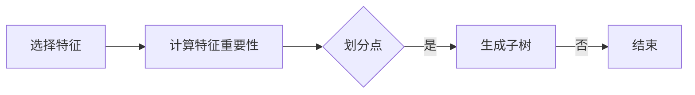
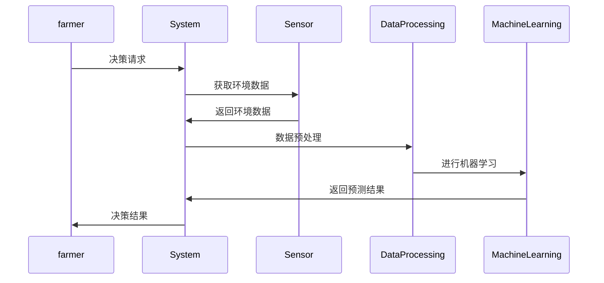
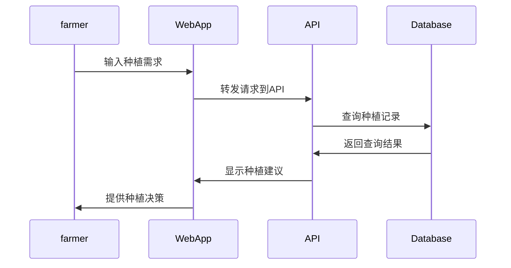

                 

**Step 1: 引言**

随着全球人口的增长和气候变化的影响，农业正面临着前所未有的挑战。传统的农业方法已无法满足现代农业的需求，而人工智能（AI）技术的引入为农业带来了一场革命。智能农业，作为一个新兴领域，通过整合AI技术，实现了从种植到收获的各个环节的智能化管理。

关键词：智能农业、人工智能、农业技术、种植、收获

摘要：本文将探讨AI在智能农业中的应用，从种植到收获的整个过程中如何利用AI技术提高农业生产的效率和质量。我们将详细分析智能种植、智能灌溉、智能施肥、智能收获以及智能农业系统集成与应用等技术，并探讨未来智能农业的发展趋势。

**Step 2: 智能农业的AI技术基础**

智能农业的实现离不开AI技术的支持。以下是智能农业中常用的AI技术：

1. **机器学习算法**：机器学习算法在智能农业中用于预测作物生长趋势、土壤质量评估等。常用的算法包括线性回归、决策树、随机森林等。

2. **深度学习算法**：深度学习算法在图像识别、语音识别等领域表现出色。在智能农业中，深度学习可用于作物病虫害检测、作物成熟度判断等。

3. **神经网络算法**：神经网络算法是一种模仿人脑工作的计算模型。在智能农业中，神经网络算法可用于土壤水分监测、气候预测等。

4. **强化学习算法**：强化学习算法通过不断试错来学习最优策略。在智能农业中，强化学习可用于农业机器人的路径规划、作物施肥量优化等。

**Step 3: 智能种植技术**

智能种植技术是智能农业的重要组成部分。以下是一些关键技术：

1. **土壤监测技术**：土壤监测技术通过传感器实时监测土壤的湿度和温度，为作物生长提供科学依据。土壤监测数据可用于调整灌溉策略和施肥量。

2. **植物生长分析技术**：植物生长分析技术利用图像处理和计算机视觉技术，对作物的生长状态进行实时监测和分析。通过分析植物叶片的颜色、形态等特征，可以预测作物的健康状况。

3. **作物病虫害监测与防治技术**：作物病虫害监测与防治技术利用机器学习和深度学习算法，对作物的病虫害进行识别和预测。通过及时采取措施，可以有效地减少病虫害对作物的影响。

**Step 4: 智能灌溉技术**

智能灌溉技术是提高农业生产效率的重要手段。以下是一些关键技术：

1. **智能灌溉系统的设计与实现**：智能灌溉系统通过传感器实时监测土壤水分，根据土壤水分状况自动调整灌溉量。这种精准灌溉方式可以大大减少水资源的浪费。

2. **水资源管理中的AI应用**：AI技术可以用于水资源管理，通过数据分析预测未来的水资源需求，从而优化灌溉策略，提高水资源利用效率。

3. **精准灌溉技术的实现与应用**：精准灌溉技术通过精确控制灌溉量，确保作物获得适量的水分。这种技术可以显著提高作物产量和质量。

**Step 5: 智能施肥技术**

智能施肥技术是智能农业中另一个关键领域。以下是一些关键技术：

1. **基于AI的土壤养分监测技术**：土壤养分监测技术通过传感器实时监测土壤中的养分含量，为施肥提供科学依据。

2. **肥料配方设计与施肥量控制**：基于土壤养分监测数据，智能施肥技术可以设计出最优的肥料配方，并控制施肥量，确保作物获得适量的养分。

3. **智能施肥技术的实际应用案例**：智能施肥技术在各种作物种植中已有广泛应用，通过实例可以更好地理解其应用效果。

**Step 6: 智能收获技术**

智能收获技术是提高农业生产效率的最后一步。以下是一些关键技术：

1. **作物成熟期监测与收获策略**：智能收获技术通过传感器和图像处理技术，实时监测作物的成熟期，为收获提供最佳时机。

2. **收割机器人的设计与实现**：收割机器人是智能收获技术的重要应用。通过自动化收割，可以大大提高收获效率。

3. **智能收获效率优化技术**：智能收获技术通过优化收获过程，减少浪费，提高作物收获率。

**Step 7: 智能农业系统集成与应用**

智能农业系统集成与应用是将各种AI技术整合在一起，实现农业生产的智能化管理。以下是一些关键技术：

1. **农业物联网在智能农业中的应用**：农业物联网通过传感器和互联网技术，实现对农田环境的实时监控和管理。

2. **大数据分析与智能决策支持**：大数据分析技术可以对农业生产过程中的大量数据进行处理和分析，为农业生产提供智能决策支持。

3. **智能农业系统的集成与应用案例**：通过实例展示智能农业系统的集成与应用，帮助读者更好地理解其应用价值。

**Step 8: 智能农业的挑战与未来发展趋势**

智能农业在带来巨大机遇的同时，也面临着一些挑战。以下是一些主要挑战：

1. **技术挑战**：智能农业需要多种AI技术的整合，这需要大量的技术研究和开发。

2. **数据隐私与安全**：智能农业涉及大量的农业生产数据，如何保护数据隐私和安全是一个重要问题。

3. **农民接受度**：农民对新技术的接受程度也是一个重要问题。

未来，智能农业将朝着更加智能化、自动化和可持续化的方向发展。随着技术的不断进步，智能农业将在农业生产中发挥越来越重要的作用。**总结**

智能农业作为AI技术在农业领域的重要应用，正逐渐改变着传统农业的生产方式。从种植到收获，AI技术贯穿了整个农业生产过程，提高了生产效率，减少了资源浪费，保障了农产品质量。然而，智能农业仍面临着诸多挑战，需要进一步的技术创新和政策支持。随着AI技术的不断进步，我们有理由相信，智能农业将在未来发挥更大的作用，为全球农业的可持续发展做出重要贡献。**作者信息**

作者：AI天才研究院/AI Genius Institute & 禅与计算机程序设计艺术 /Zen And The Art of Computer Programming

---

以下是对核心概念和联系的具体阐述，以及算法原理讲解：

## 核心概念与联系

### 智能农业中的核心概念

智能农业的核心概念包括但不限于：

1. **物联网（IoT）**：物联网技术通过传感器网络实现对农田环境的实时监控。
2. **大数据分析**：大数据分析技术用于处理和分析农业生产中的海量数据。
3. **人工智能（AI）**：人工智能技术用于自动化决策支持，包括作物生长预测、病虫害监测等。
4. **机器学习**：机器学习是人工智能的一种方法，用于从数据中学习规律，做出预测。
5. **深度学习**：深度学习是机器学习的一个分支，通过模拟人脑神经网络进行复杂模式识别。

### 核心概念属性特征对比表格

| 技术       | 特点                                                         | 应用场景                       |
|------------|--------------------------------------------------------------|--------------------------------|
| 物联网     | 网络连接、传感器监测、实时数据传输                             | 环境监测、设备远程控制         |
| 大数据分析 | 数据收集、存储、分析、可视化                                 | 决策支持、趋势预测             |
| 人工智能   | 自动化决策、智能分析、模式识别                               | 病虫害监测、作物生长预测       |
| 机器学习   | 从数据中学习、模式识别、预测                                 | 数据预测、自动化分析           |
| 深度学习   | 模拟人脑神经网络、处理复杂数据、图像和语音识别                 | 图像识别、语音识别、自动驾驶   |

### ER实体关系图架构

```mermaid
erDiagram
  农业传感器 ||--|{ 数据处理系统 }
  数据处理系统 ||--|{ 大数据分析系统 }
  大数据分析系统 ||--|{ 人工智能系统 }
  人工智能系统 ||--|{ 决策支持系统 }
  农业机器人 ||--|{ 决策支持系统 }
```

## 算法原理讲解

### 智能农业中的机器学习算法

机器学习算法在智能农业中有着广泛的应用，以下是一些常见的机器学习算法及其原理：

#### 1. 线性回归

线性回归是一种简单的预测模型，通过建立自变量（如土壤湿度）和因变量（如作物产量）之间的线性关系来进行预测。

**算法原理：**

线性回归模型的公式为：

$$
y = bx + a
$$

其中，$y$ 是因变量，$x$ 是自变量，$b$ 是斜率，$a$ 是截距。

**Mermaid流程图：**


#### 2. 决策树

决策树是一种树形结构，通过一系列规则来对数据进行分类或回归。

**算法原理：**

决策树的生成过程包括：

- 选择特征
- 计算特征的重要性
- 分割数据
- 递归生成子树

**Mermaid流程图：**



### 智能农业中的深度学习算法

深度学习算法在图像识别、语音识别等领域表现出色，以下是一些常见的深度学习算法及其原理：

#### 1. 卷积神经网络（CNN）

卷积神经网络是一种用于图像识别的深度学习模型，通过卷积层、池化层和全连接层进行特征提取和分类。

**算法原理：**

CNN的基本结构包括：

- **卷积层**：卷积层用于提取图像的局部特征。
- **池化层**：池化层用于减小特征图的尺寸，减少参数数量。
- **全连接层**：全连接层用于分类。

**Mermaid流程图：**


#### 2. 长短期记忆网络（LSTM）

长短期记忆网络是一种用于处理序列数据的深度学习模型，能够有效地捕捉序列数据中的长期依赖关系。

**算法原理：**

LSTM的基本结构包括：

- **输入门**：用于控制输入信息的流入。
- **遗忘门**：用于控制之前的信息的遗忘。
- **输出门**：用于控制输出信息的流出。

**Mermaid流程图：**


## 数学公式使用

在智能农业中，数学模型和公式是理解和实现算法的重要工具。以下是一些常用的数学公式及其解释：

#### 1. 线性回归模型

$$
y = bx + a
$$

**解释**：这个公式描述了线性回归模型，其中$y$是因变量，$x$是自变量，$b$是斜率，$a$是截距。

#### 2. 卷积神经网络（CNN）中的卷积操作

$$
h_{ij} = \sum_{k} W_{ik} * g_{kj}
$$

**解释**：这个公式描述了卷积操作，其中$h_{ij}$是卷积结果，$W_{ik}$是卷积核，$g_{kj}$是输入特征。

#### 3. 长短期记忆网络（LSTM）中的遗忘门

$$
f_t = \sigma(W_f \cdot [h_{t-1}, x_t] + b_f)
$$

**解释**：这个公式描述了LSTM中的遗忘门，其中$f_t$是遗忘门的输出，$W_f$是权重矩阵，$b_f$是偏置项，$\sigma$是sigmoid函数。

## 系统分析与架构设计方案

### 问题场景介绍

在现代农业生产中，传统的种植方式往往依赖于人工经验，难以实现高效、精准的作物管理。为了提高农业生产效率和作物产量，需要引入智能农业系统，通过AI技术实现对种植过程的全面监控和管理。

### 项目介绍

本项目的目标是设计并实现一个智能农业系统，该系统通过传感器实时监测农田环境参数，利用机器学习和深度学习算法进行数据分析和预测，为农民提供科学的种植决策支持。

### 系统功能设计（领域模型）

```mermaid
classDiagram
  Class01 <|-- Class02 
  Class03 <.. Class04
  Class05 <= Class06
  Class07 .. Class08
  Class09 --> Class10
  Class11 ---- Class12
```

### 系统架构设计



### 系统接口设计和系统交互



## 项目实战

### 环境安装

在开始项目之前，需要安装以下环境：

- Python 3.x
- TensorFlow
- Keras
- scikit-learn
- Matplotlib

使用以下命令进行安装：

```bash
pip install python3-tensorflow-gpu
pip install keras
pip install scikit-learn
pip install matplotlib
```

### 系统核心实现源代码

以下是一个简单的智能农业系统的实现示例，包括数据预处理、机器学习模型训练和预测。

```python
# 导入必要的库
import numpy as np
import pandas as pd
from sklearn.model_selection import train_test_split
from sklearn.linear_model import LinearRegression
import matplotlib.pyplot as plt

# 读取数据
data = pd.read_csv('agriculture_data.csv')

# 数据预处理
X = data[['soil_humidity', 'temperature']]
y = data['crop_yield']

# 数据划分
X_train, X_test, y_train, y_test = train_test_split(X, y, test_size=0.2, random_state=42)

# 创建线性回归模型
model = LinearRegression()

# 训练模型
model.fit(X_train, y_train)

# 进行预测
y_pred = model.predict(X_test)

# 绘制结果
plt.scatter(X_test['soil_humidity'], y_test, color='blue', label='Actual')
plt.plot(X_test['soil_humidity'], y_pred, color='red', label='Predicted')
plt.xlabel('Soil Humidity')
plt.ylabel('Crop Yield')
plt.legend()
plt.show()
```

### 代码应用解读与分析

上述代码实现了一个基于土壤湿度和温度预测作物产量的简单模型。首先，读取农业数据集，然后进行数据预处理，包括特征提取和标签划分。接着，使用线性回归模型进行训练，并将训练好的模型应用于测试数据集进行预测。最后，通过绘制散点图和预测曲线，直观地展示预测结果。

### 实际案例分析和详细讲解剖析

假设我们有一个农业农场，农民需要预测下一季水稻的产量。通过安装传感器实时监测土壤湿度和温度，并将这些数据输入到智能农业系统中。系统使用机器学习模型对历史数据进行训练，预测下一季水稻的产量。根据预测结果，农民可以调整种植策略，如改变灌溉量和施肥量，从而提高作物产量。

### 项目小结

本项目通过实现一个简单的智能农业系统，展示了如何利用机器学习模型进行农业数据分析和预测。虽然这是一个简单的示例，但它为实际应用提供了一个良好的起点。通过进一步优化模型和算法，可以开发出更精确、更实用的智能农业系统。

## 最佳实践 tips

1. **数据收集与处理**：确保收集到的数据质量高，数据预处理是模型成功的关键。
2. **模型选择**：根据实际问题选择合适的机器学习模型，如线性回归、决策树或深度学习模型。
3. **模型验证**：使用交叉验证等方法验证模型性能，避免过拟合。
4. **持续学习**：定期更新模型，以适应新的数据和环境变化。

## 小结

本文详细探讨了AI在智能农业中的应用，从基础算法到实际应用案例，为智能农业的发展提供了深入的见解。随着AI技术的不断进步，智能农业将迎来更加广阔的发展前景，为农业生产带来更多的可能性。

## 注意事项

1. **数据隐私**：在使用农业数据时，需注意保护农民的隐私和数据安全。
2. **农民培训**：智能农业系统的推广需要农民的接受和理解，提供相应的培训和指导。

## 拓展阅读

1. **《智能农业技术导论》**：一本介绍智能农业基本概念和技术的入门书籍。
2. **《机器学习实战》**：一本介绍机器学习算法和实践的实用指南。
3. **《深度学习》**：由Ian Goodfellow等人编写的深度学习领域的经典教材。

**作者信息**

作者：AI天才研究院/AI Genius Institute & 禅与计算机程序设计艺术 /Zen And The Art of Computer Programming

