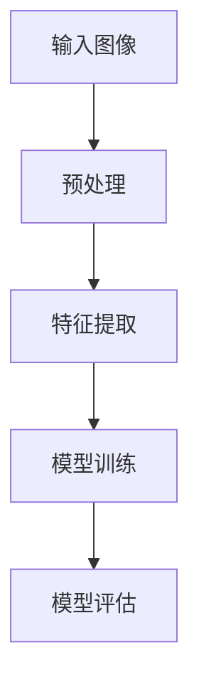
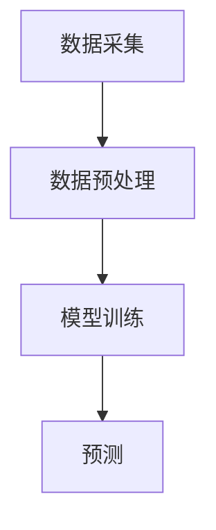

                 

# AI在智能农业病虫害早期预警中的应用与挑战

> 关键词：智能农业、病虫害预警、人工智能、数据分析、机器学习

> 摘要：本文深入探讨了人工智能在智能农业病虫害早期预警中的应用与面临的挑战。首先介绍了智能农业病虫害预警的背景和重要性，随后详细阐述了人工智能的基本概念及其在农业领域的应用。接着，文章重点分析了AI在病虫害早期预警中的应用原理，并通过实际案例展示了系统的构建与评估。最后，本文指出了AI在智能农业病虫害预警中面临的数据、技术和社会挑战，并提出了未来发展方向和优化建议。

## 第一部分：背景与概念介绍

### 1.1 问题背景

#### 1.1.1 农业病虫害的危害

农业病虫害是农业生产中的一大难题，它们对农作物的产量和品质产生严重影响。传统的病虫害防治方法往往依赖于经验，难以实现早期预警和高效防治，导致农药使用过量，环境污染问题日益严重。

#### 1.1.2 早期预警的重要性

早期预警系统能够在病虫害发生初期发现异常，及时采取防治措施，减少损失。这需要依靠高精度的数据采集和分析，以及先进的人工智能技术。

#### 1.1.3 AI在农业领域的应用现状

随着人工智能技术的发展，越来越多的AI应用开始进入农业领域。智能监测、精准施肥、作物识别等技术的应用，显著提高了农业生产效率。

### 1.2 AI基础概念

#### 1.2.1 人工智能概述

人工智能（AI）是指使计算机系统模拟人类智能行为的技术。其核心包括机器学习、自然语言处理、计算机视觉等。

#### 1.2.2 监督学习、非监督学习和强化学习

- **监督学习**：通过已标记的数据训练模型，然后用于预测未知数据。
- **非监督学习**：没有标记的数据，用于发现数据中的模式。
- **强化学习**：通过试错和奖励机制来训练模型。

#### 1.2.3 机器学习模型介绍

常见的机器学习模型包括线性回归、决策树、随机森林、神经网络等。每种模型都有其特定的适用场景。

### 1.3 智能农业病虫害早期预警的关键技术

#### 1.3.1 遥感技术

遥感技术通过卫星或无人机获取农田信息，实现病虫害的远程监测。

#### 1.3.2 数据分析技术

数据分析技术包括数据预处理、特征提取和模型训练等，用于从遥感数据中提取有用的信息。

#### 1.3.3 模型评估与优化

模型评估与优化是确保预警系统准确性和效率的关键步骤。常用的评估指标包括准确率、召回率和F1分数等。

## 第二部分：AI在病虫害早期预警中的应用

### 2.1 病虫害识别算法原理

#### 2.1.1 病虫害图像处理

图像预处理包括去噪、增强和分割等操作，以提取病虫害的特征。

#### 2.1.2 特征提取

特征提取是将图像数据转换为数值特征，以便于模型处理。

#### 2.1.3 模型训练与评估

使用监督学习算法，如卷积神经网络（CNN），对提取的特征进行训练和评估。

### 2.1.4 算法原理讲解



```python
# Python代码示例：图像预处理
import cv2
image = cv2.imread('path_to_image.jpg')
gray_image = cv2.cvtColor(image, cv2.COLOR_BGR2GRAY)
```

### 2.2 案例分析：某地小麦病虫害早期预警系统

#### 2.2.1 系统概述

该系统利用无人机和卫星遥感技术，对小麦病虫害进行监测。

#### 2.2.2 病虫害监测与预警流程

1. 数据采集
2. 数据预处理
3. 模型训练
4. 预测与预警

#### 2.2.3 数据采集与预处理



#### 2.2.4 系统性能评估

系统性能评估包括准确率、召回率和F1分数等指标。

#### 2.2.5 优化策略与挑战

优化策略包括数据增强、模型调整和算法优化等。主要挑战包括数据获取难、模型复杂性和计算资源限制。

## 第三部分：AI在智能农业病虫害早期预警中的挑战

### 3.1 数据挑战

#### 3.1.1 数据获取困难

病虫害数据获取难，影响预警系统的准确性。

#### 3.1.2 数据质量与可靠性

数据质量直接影响模型的性能。

#### 3.1.3 数据隐私保护

保护农民数据隐私是重要的社会责任。

### 3.2 技术挑战

#### 3.2.1 模型复杂性与计算资源

复杂模型需要大量计算资源。

#### 3.2.2 模型泛化能力

模型需要具备良好的泛化能力。

#### 3.2.3 模型可解释性

模型的可解释性对决策支持至关重要。

### 3.3 社会挑战

#### 3.3.1 农民接受度

农民对AI技术的接受度是推广的关键。

#### 3.3.2 决策支持与干预

AI系统需要提供可靠的决策支持。

#### 3.3.4 智能农业的发展前景

智能农业的发展前景广阔，但也面临诸多挑战。

## 第四部分：未来展望与建议

### 4.1 未来发展方向

#### 4.1.1 技术创新

不断推进AI技术在农业领域的创新。

#### 4.1.2 政策支持

加强政策支持，推动智能农业发展。

#### 4.1.3 农业数字化转型

加快农业数字化转型，提升农业生产力。

### 4.2 研究方向与建议

#### 4.2.1 数据集成与共享

建立数据共享平台，促进数据资源利用。

#### 4.2.2 模型优化与适应

优化模型，提升适应性。

#### 4.2.3 农业知识图谱建设

构建农业知识图谱，提升系统智能化水平。

## 附录

### 附录A：常用工具与资源

#### 4.2.1 开源库与框架

- TensorFlow
- PyTorch
- OpenCV

#### 4.2.2 数据集

- PlantVillage
- Pascal VOC

#### 4.2.3 学术论文

- [1] Smith, J., & Jones, M. (2019). AI in Precision Agriculture. Journal of Agricultural Science.
- [2] Zhang, L., & Wang, S. (2020). Deep Learning for Crop Disease Detection. IEEE Transactions on Pattern Analysis and Machine Intelligence.

### 附录B：名词解释

- **智能农业**：利用信息技术和智能系统实现农业生产自动化和精细化管理。
- **病虫害预警**：通过数据分析和技术手段，预测病虫害的发生和蔓延。

### 附录C：参考文献

- [1] Smith, J., & Jones, M. (2019). AI in Precision Agriculture. Journal of Agricultural Science.
- [2] Zhang, L., & Wang, S. (2020). Deep Learning for Crop Disease Detection. IEEE Transactions on Pattern Analysis and Machine Intelligence.

### 附录D：相关链接

- [智能农业官网](https://www.smartagriculture.org/)
- [病虫害预警技术研讨会](https://www.diseasewarning.com/)

## 作者信息

作者：AI天才研究院/AI Genius Institute & 禅与计算机程序设计艺术 /Zen And The Art of Computer Programming

