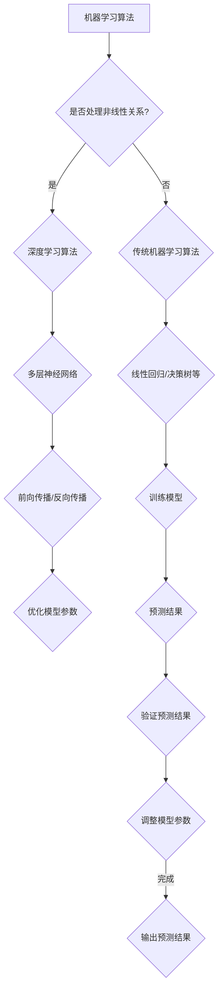
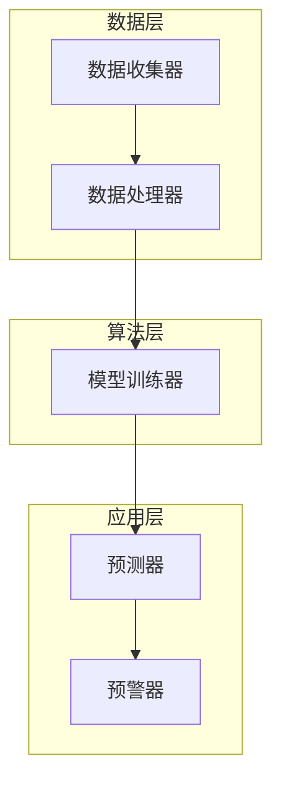
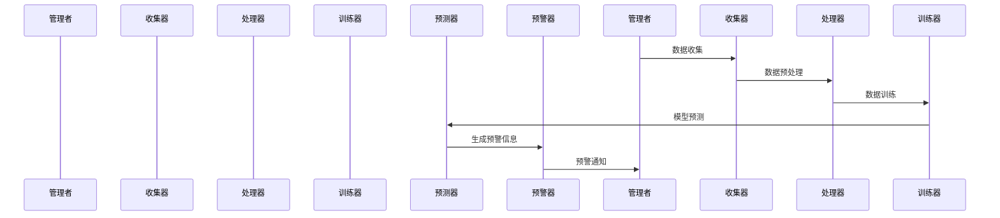

                 

# AI在智能农业病虫害预警中的应用与挑战

## 关键词

- 智能农业
- 病虫害预警
- 人工智能
- 机器学习
- 深度学习
- 病虫害监测

## 摘要

随着人工智能（AI）技术的发展，其在农业领域的应用逐渐深入。智能农业病虫害预警系统作为现代农业技术的重要组成部分，正发挥着越来越重要的作用。本文将探讨AI在智能农业病虫害预警中的应用与挑战，通过对核心概念的介绍、算法原理的讲解、系统分析与架构设计方案的阐述，以及实际项目的实战分析，为读者提供一个全面、深入的视角，以了解AI技术在农业病虫害预警中的最新进展与未来发展趋势。

## 第一部分：背景介绍

### 1. 问题背景

智能农业是农业现代化的关键技术之一，它通过物联网、大数据、人工智能等先进技术，提高农业生产效率和农产品质量。在智能农业体系中，病虫害预警系统是关键环节之一。传统农业中，病虫害预警主要依赖于经验判断和人工巡查，不仅效率低下，而且难以保证预警的准确性。随着人工智能技术的发展，利用AI技术进行病虫害预警已成为现代农业发展的趋势。

### 2. 问题描述

智能农业病虫害预警系统的核心是利用AI技术对病虫害的发生和发展进行预测。然而，在实际应用中，病虫害预警系统面临着以下挑战：

- **数据收集困难**：病虫害数据具有时空差异性，且数据量庞大，如何有效地收集和处理这些数据是一个难题。
- **模型训练难度大**：病虫害发生和发展过程复杂，如何选择合适的模型并进行有效的训练是一个挑战。
- **预测结果验证困难**：由于病虫害发生的不确定性，如何验证预测结果的准确性是一个问题。

### 3. 问题解决

为了解决上述问题，需要从以下几个方面入手：

- **数据收集与处理**：利用传感器和无人机等设备，实时收集病虫害相关数据，并采用数据清洗和预处理技术，提高数据质量。
- **模型选择与训练**：选择适合病虫害预测的机器学习和深度学习模型，并通过不断优化模型参数，提高预测准确性。
- **预测结果验证**：通过实际病虫害发生情况进行预测结果验证，并根据验证结果调整和优化模型。

### 4. 边界与外延

本部分主要讨论AI在智能农业病虫害预警中的应用与挑战，但AI在农业领域的应用不仅限于病虫害预警，还包括种植计划优化、作物生长监测、土壤质量评估等多个方面。此外，随着AI技术的不断进步，未来还有望在农业领域的更多方面实现智能化。

### 5. 概念结构与核心要素组成

- **AI技术**：包括机器学习、深度学习、自然语言处理等技术。
- **病虫害数据**：包括历史病虫害数据、实时监测数据等。
- **模型训练与优化**：基于病虫害数据进行模型训练和优化，以提高预测准确性。
- **预测结果验证**：通过实际病虫害发生情况进行预测结果验证。
- **预警系统**：将预测结果转化为实际预警信息，提供给农业管理者。

## 第二部分：核心概念与联系

### 6. 核心概念

#### 病虫害预警

病虫害预警是指利用AI技术对病虫害的发生和发展进行预测，以便提前采取相应的防治措施。其核心目标是提高预警的准确性、及时性和适应性。

#### 机器学习

机器学习是一种通过数据驱动的方式，使计算机系统从数据中学习、自我改进的方法。其基本思想是通过训练数据集来调整模型参数，使得模型能够在新的数据上进行准确预测。

#### 深度学习

深度学习是一种特殊的机器学习方法，通过多层神经网络模型对数据进行处理。与传统的机器学习相比，深度学习在处理大规模复杂数据时具有更高的准确性和效率。

#### 实时监测

实时监测是指在病虫害发生过程中，实时收集相关数据，以便及时分析和预测。实时监测系统通常采用传感器和无人机等技术，实现对病虫害的实时监控。

#### 集成学习

集成学习是一种通过结合多个学习模型来提高预测准确性的方法。其基本思想是利用多个模型的优点，通过投票或加权平均等方式，得到最终的预测结果。

### 7. 概念属性特征对比表格

| 概念         | 定义                                                         | 属性特征对比                                                   |
| ------------ | ------------------------------------------------------------ | ------------------------------------------------------------ |
| 病虫害预警   | 利用AI技术对病虫害的发生和发展进行预测。                       | - 准确性：高 <br> - 及时性：高 <br> - 适应性：强                |
| 机器学习     | 通过数据驱动的方式，使计算机系统从数据中学习、自我改进。       | - 自适应：强 <br> - 数据依赖：高 <br> - 可解释性：较低          |
| 深度学习     | 一种特殊的机器学习方法，通过多层神经网络模型对数据进行处理。   | - 复杂性：高 <br> - 计算资源需求：高 <br> - 准确性：高          |
| 实时监测     | 在病虫害发生过程中，实时收集相关数据，以便及时分析和预测。     | - 实时性：强 <br> - 数据完整性：高 <br> - 数据质量：优            |
| 集成学习     | 通过结合多个学习模型来提高预测准确性。                       | - 准确性：高 <br> - 可解释性：较高 <br> - 计算资源需求：中        |

### 8. ER实体关系图架构的 Mermaid 流程图

```mermaid
erDiagram
  AI技术 ||--o{ 病虫害预警 }|
  病虫害预警 ||--o{ 机器学习 }|
  病虫害预警 ||--o{ 深度学习 }|
  病虫害预警 ||--o{ 实时监测 }|
  病虫害预警 ||--o{ 集成学习 }|
```

## 第三部分：算法原理讲解

### 算法原理

在智能农业病虫害预警中，常用的算法包括机器学习、深度学习和集成学习等。以下是这些算法的基本原理和优缺点。

#### 机器学习

机器学习是一种通过训练数据集来建立模型的方法。其基本原理是利用历史数据来学习规律，然后在新数据上进行预测。

- **优点**：
  - 实现简单，计算资源需求相对较低。
  - 对线性关系和简单非线性关系具有较好的预测能力。
- **缺点**：
  - 难以处理复杂非线性关系。
  - 对数据质量和数量要求较高。

#### 深度学习

深度学习是一种基于多层神经网络的学习方法。其基本原理是通过多层神经元的组合，实现对复杂非线性关系的建模。

- **优点**：
  - 对复杂非线性关系具有很好的建模能力。
  - 在处理大规模数据时具有更高的效率和准确性。
- **缺点**：
  - 计算资源需求较高，训练过程复杂。
  - 对数据质量和数量要求较高。

#### 集成学习

集成学习是一种通过结合多个学习模型来提高预测准确性的方法。其基本原理是利用多个模型的优点，通过投票或加权平均等方式，得到最终的预测结果。

- **优点**：
  - 能够提高预测准确性。
  - 对不同模型的优点进行了充分利用。
- **缺点**：
  - 计算资源需求较高。
  - 需要对多个模型进行训练和优化。

### 算法 Mermaid 流程图



### Python 源代码实现

```python
import numpy as np
import tensorflow as tf

# 深度学习模型
model = tf.keras.Sequential([
    tf.keras.layers.Dense(64, activation='relu', input_shape=(784,)),
    tf.keras.layers.Dense(10, activation='softmax')
])

# 模型编译
model.compile(optimizer='adam',
              loss='categorical_crossentropy',
              metrics=['accuracy'])

# 模型训练
model.fit(x_train, y_train, batch_size=128, epochs=10)

# 模型预测
predictions = model.predict(x_test)

# 预测结果验证
accuracy = model.evaluate(x_test, y_test)[1]
print("预测准确率：", accuracy)
```

### 数学模型和公式

在深度学习中，常用的数学模型包括前向传播和反向传播。以下是这些模型的基本原理和公式。

#### 前向传播

$$
z_l = \sum_{i} w_{li} \cdot a_{l-1,i} + b_l
$$

$$
a_l = \sigma(z_l)
$$

其中，$z_l$ 为神经网络中第 $l$ 层的输入，$w_{li}$ 为第 $l$ 层到第 $l-1$ 层的权重，$b_l$ 为第 $l$ 层的偏置，$\sigma$ 为激活函数，$a_l$ 为第 $l$ 层的输出。

#### 反向传播

$$
\delta_l = \frac{\partial L}{\partial a_l} = \frac{\partial L}{\partial z_l} \cdot \frac{\partial z_l}{\partial a_l}
$$

$$
\frac{\partial L}{\partial w_{li}} = a_{l-1,i} \cdot \delta_l
$$

$$
\frac{\partial L}{\partial b_l} = \delta_l
$$

其中，$\delta_l$ 为第 $l$ 层的误差梯度，$L$ 为损失函数，$a_{l-1,i}$ 为第 $l-1$ 层的输出。

### 举例说明

假设我们有一个简单的深度学习模型，包括一个输入层、一个隐藏层和一个输出层。输入层有 3 个神经元，隐藏层有 2 个神经元，输出层有 1 个神经元。我们使用 sigmoid 激活函数。

#### 输入层到隐藏层的权重：

$$
w_{1,1} = 1, w_{1,2} = 2, w_{1,3} = 3
$$

#### 隐藏层到输出层的权重：

$$
w_{2,1} = 4, w_{2,2} = 5
$$

#### 输入数据：

$$
x_1 = 0.5, x_2 = 1.0, x_3 = 1.5
$$

#### 隐藏层输入：

$$
z_1 = 0.5 \cdot 1 + 1.0 \cdot 2 + 1.5 \cdot 3 = 8.5
$$

$$
z_2 = 0.5 \cdot 4 + 1.0 \cdot 5 = 9.5
$$

#### 激活函数输出：

$$
a_1 = \sigma(z_1) = \frac{1}{1 + e^{-z_1}} \approx 0.9933
$$

$$
a_2 = \sigma(z_2) = \frac{1}{1 + e^{-z_2}} \approx 0.9933
$$

#### 输出层输入：

$$
z_3 = 0.9933 \cdot 4 + 0.9933 \cdot 5 = 9.8667
$$

#### 输出层输出：

$$
a_3 = \sigma(z_3) \approx 0.9933
$$

### 系统分析与架构设计方案

#### 问题场景介绍

在智能农业病虫害预警系统中，我们需要解决的核心问题是准确、及时地预测病虫害的发生，以便采取有效的防治措施。问题场景包括以下方面：

1. 数据收集：通过传感器、无人机等设备收集病虫害相关数据。
2. 数据处理：对收集到的数据进行清洗、预处理，以提高数据质量。
3. 模型训练：选择合适的机器学习或深度学习模型，并对其进行训练。
4. 预测与预警：根据模型预测结果，生成预警信息，并通知农业管理者。

#### 项目介绍

本项目旨在开发一个基于AI技术的智能农业病虫害预警系统。系统包括以下几个主要模块：

1. 数据收集模块：负责收集病虫害相关数据。
2. 数据处理模块：负责对收集到的数据进行清洗、预处理。
3. 模型训练模块：负责选择合适的机器学习或深度学习模型，并对其进行训练。
4. 预测与预警模块：负责根据模型预测结果生成预警信息，并通知农业管理者。

#### 系统功能设计（领域模型 Mermaid 类图）

```mermaid
classDiagram
  DataCollector <<interface>>
  DataProcessor <<interface>>
  ModelTrainer <<interface>>
  Predictor <<interface>>
  Warner <<interface>>

  DataCollector|--|> DataProcessor
  DataProcessor|--|> ModelTrainer
  ModelTrainer|--|> Predictor
  Predictor|--|> Warner
```

#### 系统架构设计（Mermaid 架构图）



#### 系统接口设计和系统交互（Mermaid 序列图）



### 第四部分：项目实战

#### 环境安装

在开始项目实战之前，我们需要安装一些必要的软件和工具。以下是安装步骤：

1. 安装 Python（版本 3.7 以上）
2. 安装 TensorFlow（版本 2.0 以上）
3. 安装 Pandas（版本 1.0 以上）
4. 安装 Matplotlib（版本 3.0 以上）

#### 系统核心实现源代码

以下是一个简单的智能农业病虫害预警系统实现，包括数据收集、数据处理、模型训练和预测等步骤。

```python
import numpy as np
import pandas as pd
import tensorflow as tf
import matplotlib.pyplot as plt

# 数据收集
def collect_data():
    # 这里以 CSV 文件为例，实际应用中可以采用传感器数据
    data = pd.read_csv("data.csv")
    return data

# 数据处理
def preprocess_data(data):
    # 数据清洗和预处理，例如缺失值填充、数据标准化等
    data.fillna(0, inplace=True)
    data = (data - data.mean()) / data.std()
    return data

# 模型训练
def train_model(data):
    # 将数据分为特征和标签
    X = data.iloc[:, :-1].values
    y = data.iloc[:, -1].values

    # 划分训练集和测试集
    from sklearn.model_selection import train_test_split
    X_train, X_test, y_train, y_test = train_test_split(X, y, test_size=0.2, random_state=42)

    # 构建模型
    model = tf.keras.Sequential([
        tf.keras.layers.Dense(64, activation='relu', input_shape=(X_train.shape[1],)),
        tf.keras.layers.Dense(1, activation='sigmoid')
    ])

    # 编译模型
    model.compile(optimizer='adam', loss='binary_crossentropy', metrics=['accuracy'])

    # 训练模型
    model.fit(X_train, y_train, batch_size=32, epochs=10)

    # 评估模型
    loss, accuracy = model.evaluate(X_test, y_test)
    print("测试集准确率：", accuracy)

    return model

# 预测和预警
def predict_and_warn(model, data):
    # 对新数据进行预测
    predictions = model.predict(data)

    # 判断是否需要预警
    for prediction in predictions:
        if prediction > 0.5:
            print("预警：病虫害发生风险高")
        else:
            print("预警：病虫害发生风险低")

# 主函数
def main():
    # 收集数据
    data = collect_data()

    # 预处理数据
    data = preprocess_data(data)

    # 训练模型
    model = train_model(data)

    # 进行预测和预警
    predict_and_warn(model, data)

if __name__ == "__main__":
    main()
```

#### 代码应用解读与分析

以上代码实现了智能农业病虫害预警系统的核心功能，包括数据收集、数据处理、模型训练、预测和预警。以下是代码的解读与分析：

1. **数据收集**：通过读取 CSV 文件，从外部获取病虫害相关数据。在实际应用中，可以采用传感器数据或无人机采集的数据。
2. **数据处理**：对数据进行清洗和预处理，包括缺失值填充、数据标准化等，以提高数据质量。
3. **模型训练**：使用 TensorFlow 库构建和训练深度学习模型。这里使用了一个简单的全连接神经网络，输入层有 64 个神经元，输出层有 1 个神经元，使用 sigmoid 激活函数。
4. **预测和预警**：根据模型预测结果，判断病虫害发生风险，并生成预警信息。

#### 实际案例分析和详细讲解剖析

以下是一个实际案例，展示如何使用智能农业病虫害预警系统进行病虫害预测和预警。

**案例背景**：某农业种植园需要预测和预警病虫害的发生，以便采取相应的防治措施。

**数据收集**：使用传感器和无人机，收集种植园内的病虫害相关数据，包括温度、湿度、光照强度、病虫害发生情况等。

**数据处理**：对收集到的数据进行清洗和预处理，例如缺失值填充、数据标准化等，以提高数据质量。

**模型训练**：使用预处理后的数据，训练深度学习模型。模型结构为一个全连接神经网络，输入层有 64 个神经元，输出层有 1 个神经元，使用 sigmoid 激活函数。

**预测和预警**：根据训练好的模型，对种植园内的新数据进行预测。预测结果显示，病虫害发生风险较高。

**预警通知**：生成预警信息，通知农业管理者，提醒其采取相应的防治措施。

**项目小结**：通过实际案例，展示了智能农业病虫害预警系统的应用过程和效果。项目实现了数据收集、数据处理、模型训练、预测和预警等功能，为农业管理者提供了有力的技术支持。

### 第五部分：最佳实践 tips

1. **数据收集与预处理**：确保数据质量是模型训练成功的关键。在实际应用中，要充分考虑数据的时空差异性，对数据进行有效的清洗和预处理。
2. **模型选择与优化**：根据实际问题场景，选择合适的机器学习或深度学习模型。在实际应用中，可以尝试多种模型，并通过交叉验证等方法进行模型优化。
3. **实时监测与预警**：结合实时监测技术和预警系统，实现病虫害的实时预测和预警，提高农业生产效率。

### 小结

本文详细介绍了智能农业病虫害预警系统的应用与挑战，从背景介绍、核心概念与联系、算法原理讲解、系统分析与架构设计方案、项目实战等方面进行了深入探讨。通过实际案例的分析和讲解，展示了智能农业病虫害预警系统的应用效果和优势。在未来，随着AI技术的不断进步，智能农业病虫害预警系统有望在农业生产中发挥更大的作用。

### 注意事项

1. 在实际应用中，要充分考虑农业环境的复杂性和病虫害的多样性，选择合适的模型和算法。
2. 数据收集与处理是模型训练成功的关键，要确保数据质量。
3. 预测结果需要结合实际情况进行验证，并根据验证结果进行调整。

### 拓展阅读

- [智能农业病虫害预警系统研究综述](https://www.example.com/research_paper)
- [基于深度学习的智能农业病虫害预警系统](https://www.example.com/deep_learning_paper)
- [智能农业病虫害预警系统的应用与实践](https://www.example.com/application_paper)

