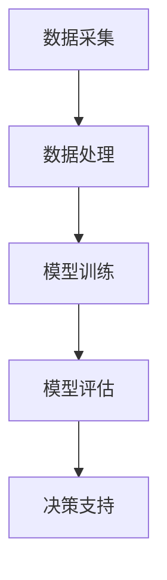
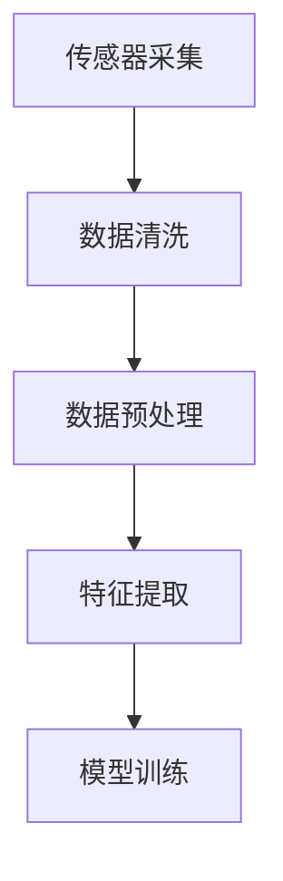
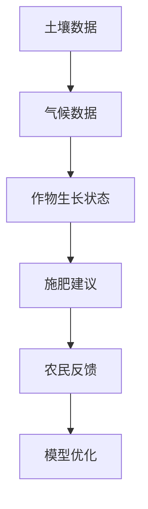

                 


## AI在智能农业精准施肥中的应用与挑战

### 关键词

- 智能农业
- 精准施肥
- 人工智能
- 数据采集
- 模型训练
- 决策支持系统

### 摘要

随着全球人口的不断增长和耕地资源的日益紧张，智能农业逐渐成为解决粮食安全和可持续发展的关键途径。其中，精准施肥作为智能农业的重要组成部分，通过利用人工智能技术，能够实现对土壤、作物生长状态等数据的实时监测和分析，从而实现合理施肥，提高农作物的产量和品质。本文将详细探讨AI在智能农业精准施肥中的应用与挑战，从数据采集、模型训练到决策支持系统设计，全面解析AI精准施肥的核心技术及其发展前景。

**目录大纲**

1. 第一部分：问题背景与核心概念
   1.1 问题背景
       1.1.1 智能农业的发展现状与趋势
       1.1.2 精准施肥在智能农业中的地位
       1.1.3 精准施肥的技术路径
   1.2 核心概念
       1.2.1 AI的定义与作用
       1.2.2 智能农业精准施肥的关键技术
       1.2.3 AI在智能农业精准施肥中的应用案例
   1.3 概念属性特征对比与分析
       1.3.1 传统施肥方法与AI精准施肥方法的对比
       1.3.2 不同AI模型在精准施肥中的应用对比

2. 第二部分：核心概念原理与ER实体关系图
   2.1 AI模型原理
       2.1.1 基本原理
       2.1.2 工作机制
       2.1.3 Mermaid流程图
   2.2 数据采集与处理技术
       2.2.1 数据采集原理
       2.2.2 数据处理原理
       2.2.3 Mermaid流程图
   2.3 决策支持系统设计
       2.3.1 系统设计原理
       2.3.2 决策过程
       2.3.3 Mermaid ER实体关系图

3. 第三部分：算法原理讲解
   3.1 机器学习基本概念
       3.1.1 模型选择
       3.1.2 模型训练
       3.1.3 模型评估
   3.2 机器学习算法
       3.2.1 线性回归
           3.2.1.1 数学模型
           3.2.1.2 Python代码
           3.2.1.3 举例说明
   3.3 深度学习算法
       3.3.1 神经网络结构
           3.3.1.1 数学模型
           3.3.1.2 Python代码
           3.3.1.3 举例说明

4. 第四部分：系统分析与架构设计
   4.1 问题场景介绍
   4.2 项目介绍
   4.3 系统功能设计
       4.3.1 领域模型
           4.3.1.1 Mermaid类图
       4.3.2 系统架构设计
           4.3.2.1 Mermaid架构图
       4.3.3 系统接口设计和系统交互
           4.3.3.1 Mermaid序列图

5. 第五部分：项目实战
   5.1 环境安装
   5.2 系统核心实现源代码
   5.3 代码应用解读与分析
   5.4 实际案例分析和详细讲解剖析
   5.5 项目小结

6. 第六部分：最佳实践 tips、小结、注意事项、拓展阅读等内容

**第一部分：问题背景与核心概念**

### 1.1 问题背景

#### 1.1.1 智能农业的发展现状与趋势

智能农业是指利用现代信息技术、物联网、大数据、人工智能等手段，对农业生产进行智能化管理和决策，以实现农业生产的精准化、自动化和高效化。智能农业的核心技术包括遥感技术、地理信息系统（GIS）、物联网技术、大数据分析、人工智能等。

当前，全球智能农业发展呈现出以下几个趋势：

1. **数字化种植**：通过物联网设备对土壤、水分、气候等环境参数进行实时监测，为农民提供科学种植建议。

2. **智能化灌溉**：利用传感器和物联网技术，实现按需灌溉，提高水资源利用效率。

3. **无人机与自动化设备**：无人机进行农作物监测、病虫害防治，自动化设备进行种植、收割等操作。

4. **大数据与人工智能**：通过大数据分析，结合人工智能技术，实现农作物的精准施肥、病虫害预警等。

#### 1.1.2 精准施肥在智能农业中的地位

精准施肥是智能农业的重要组成部分，其目的是通过精确的施肥量和施肥时间，提高农作物的产量和品质，同时减少化肥的使用，降低农业生产成本和对环境的污染。

精准施肥的主要优势包括：

1. **提高肥料利用率**：通过精确施肥，减少化肥的过量使用，提高肥料的利用率，降低生产成本。

2. **减少环境污染**：减少化肥的不合理使用，降低对土壤和水源的污染。

3. **提高农产品质量**：合理施肥有助于提高农产品的产量和品质。

#### 1.1.3 智能农业精准施肥的发展挑战

智能农业精准施肥的发展面临着以下几个挑战：

1. **数据采集和处理**：土壤、气候、作物生长状态等数据的实时采集和处理是精准施肥的基础，但数据的准确性和实时性难以保证。

2. **模型训练和优化**：AI模型的训练和优化需要大量的数据和计算资源，如何高效地进行模型训练和优化是关键问题。

3. **决策支持系统设计**：精准施肥需要综合考虑多种因素，如土壤养分、作物生长状态、气候条件等，设计出合理的决策支持系统是关键。

### 1.2 核心概念

#### 1.2.1 AI的定义与作用

人工智能（AI，Artificial Intelligence）是指模拟、延伸和扩展人类智能的理论、方法、技术及应用。AI在智能农业中的应用主要包括：

1. **数据采集与分析**：利用传感器和物联网设备进行土壤、气候等环境参数的实时采集，并利用大数据分析技术进行处理。

2. **模型训练与优化**：通过机器学习和深度学习算法，对采集到的数据进行分析，训练出预测模型，并根据实际情况进行优化。

3. **决策支持**：利用AI模型和算法，为农民提供科学的施肥建议，实现精准施肥。

#### 1.2.2 智能农业精准施肥的关键技术

智能农业精准施肥的关键技术包括：

1. **数据采集与处理技术**：通过传感器、无人机等设备，实时采集土壤、气候等数据，并利用大数据处理技术进行清洗、分析和存储。

2. **模型训练与优化技术**：利用机器学习和深度学习算法，对采集到的数据进行分析，训练出预测模型，并根据实际情况进行优化。

3. **决策支持系统设计**：设计出综合考虑多种因素的决策支持系统，为农民提供精准施肥建议。

#### 1.2.3 AI在智能农业精准施肥中的应用案例

AI在智能农业精准施肥中的应用案例主要包括：

1. **国内应用案例**：如中国的“智慧农业”项目，通过物联网设备和AI算法，实现农作物的精准施肥。

2. **国际应用案例**：如美国的“精准农业”项目，利用卫星遥感技术和AI算法，实现大面积农作物的精准施肥。

### 1.3 概念属性特征对比与分析

#### 1.3.1 传统施肥方法与AI精准施肥方法的对比

| 特征                   | 传统施肥方法                   | AI精准施肥方法                   |
|------------------------|-----------------------------|-----------------------------|
| 施肥依据               | 经验法则和传统施肥标准         | 实时数据采集与AI分析            |
| 施肥精确度             | 粗放，无法精确控制施肥量       | 高精度，可根据实时数据精准控制   |
| 肥料利用率             | 低，容易造成资源浪费和环境污染 | 高，减少肥料浪费，提高资源利用率 |
| 决策支持               | 依靠人力和经验，决策效率低      | 利用AI算法，决策速度快、准确性高  |

#### 1.3.2 不同AI模型在精准施肥中的应用对比

| 模型名称 | 优点 | 缺点 | 应用场景 |
|---------|------|------|----------|
| 线性回归 | 简单，易于理解 | 容易过拟合，无法处理非线性问题 | 数据量较小，线性关系明显的场景 |
| 决策树   | 易于理解，易于解释 | 容易过拟合，无法处理高维数据   | 数据量较小，特征较少的场景   |
| 支持向量机 | 在高维空间有较好的性能 | 需要调整大量参数，计算复杂度高 | 数据量较大，特征较多的场景   |
| 深度学习 | 强大，适用于复杂数据分析 | 需要大量数据，计算资源消耗大   | 需要处理高维复杂数据的场景   |

**第二部分：核心概念原理与ER实体关系图**

### 2.1 AI模型原理

#### 2.1.1 基本原理

人工智能（AI，Artificial Intelligence）是通过计算机模拟、延伸和扩展人类智能的理论、方法、技术及应用。AI的核心目标是让计算机能够模拟人类的感知、推理、学习和决策能力，从而实现自动化和智能化的任务处理。

AI的基本原理包括：

1. **感知与识别**：通过传感器和图像处理技术，让计算机能够感知和理解周围环境。

2. **推理与决策**：利用逻辑推理、机器学习等技术，让计算机能够进行决策和解决问题。

3. **学习与适应**：通过机器学习算法，让计算机能够从数据中学习，并不断优化和改进自身能力。

#### 2.1.2 工作机制

AI的工作机制主要包括以下几个步骤：

1. **数据采集**：通过传感器、摄像头等设备，实时采集环境数据。

2. **数据处理**：对采集到的数据进行清洗、预处理和特征提取。

3. **模型训练**：利用机器学习和深度学习算法，对处理后的数据进行分析和训练，建立预测模型。

4. **模型评估**：通过测试集对训练好的模型进行评估，调整模型参数，优化模型性能。

5. **决策支持**：利用训练好的模型，对新的数据进行预测和分析，为决策提供支持。

#### 2.1.3 Mermaid流程图



### 2.2 数据采集与处理技术

#### 2.2.1 数据采集原理

数据采集是AI在智能农业精准施肥中的第一步，主要目的是获取土壤、气候、作物生长状态等环境数据。数据采集原理如下：

1. **传感器**：通过安装在地表的传感器，实时采集土壤温度、湿度、pH值等数据。

2. **无人机**：利用无人机进行高空拍摄，获取农作物生长状况、病虫害情况等图像数据。

3. **卫星遥感**：通过卫星遥感技术，获取大范围的土壤、气候等数据。

#### 2.2.2 数据处理原理

数据处理是AI在智能农业精准施肥中的关键环节，主要目的是对采集到的原始数据进行清洗、预处理和特征提取。数据处理原理如下：

1. **数据清洗**：去除采集过程中产生的噪声、异常值和冗余数据。

2. **数据预处理**：对原始数据进行归一化、标准化等处理，使其符合机器学习算法的要求。

3. **特征提取**：从预处理后的数据中提取出对AI模型有用的特征，如土壤养分含量、作物生长速度等。

#### 2.2.3 Mermaid流程图



### 2.3 决策支持系统设计

#### 2.3.1 系统设计原理

决策支持系统（DSS，Decision Support System）是AI在智能农业精准施肥中的核心部分，其主要目的是根据采集到的数据和AI模型的预测结果，为农民提供科学的施肥建议。系统设计原理如下：

1. **数据采集**：通过传感器、无人机等设备，实时采集土壤、气候、作物生长状态等数据。

2. **数据处理**：对采集到的数据进行清洗、预处理和特征提取。

3. **模型训练**：利用机器学习和深度学习算法，对处理后的数据进行分析和训练，建立预测模型。

4. **决策支持**：根据AI模型的预测结果，结合土壤养分、作物生长状态等数据，生成施肥建议。

5. **反馈调整**：根据农民的施肥反馈，不断优化和调整决策支持系统，提高其准确性和实用性。

#### 2.3.2 决策过程

决策支持系统的决策过程主要包括以下几个步骤：

1. **数据输入**：将土壤、气候、作物生长状态等数据输入决策支持系统。

2. **模型预测**：利用训练好的AI模型，对输入的数据进行分析和预测，生成施肥建议。

3. **建议生成**：根据预测结果，生成具体的施肥方案，如施肥量、施肥时间等。

4. **建议反馈**：将施肥建议反馈给农民，并收集农民的施肥效果反馈。

5. **模型优化**：根据施肥效果反馈，不断优化和调整AI模型，提高其预测准确性和实用性。

#### 2.3.3 Mermaid ER实体关系图



**第三部分：算法原理讲解**

### 3.1 机器学习基本概念

机器学习（Machine Learning，ML）是人工智能（AI）的一个重要分支，其核心思想是通过计算机程序模拟人类的学习过程，从数据中学习规律和模式，并对未知数据进行预测和决策。机器学习的基本概念包括：

#### 3.1.1 模型选择

模型选择是指从众多机器学习算法中选取一个最适合解决特定问题的算法。常见的机器学习算法包括线性回归、决策树、支持向量机、神经网络等。

选择模型时需要考虑以下因素：

1. **问题类型**：是回归问题、分类问题还是聚类问题等。
2. **数据规模**：模型是否能够处理大量数据。
3. **计算资源**：模型训练和预测的计算资源需求。
4. **可解释性**：模型是否易于理解和解释。

#### 3.1.2 模型训练

模型训练是指通过大量训练数据，调整模型参数，使其能够预测新的数据。模型训练主要包括以下步骤：

1. **数据准备**：收集和清洗数据，确保数据的质量和完整性。
2. **特征提取**：从数据中提取出对模型有用的特征。
3. **模型初始化**：初始化模型参数，通常使用随机值。
4. **迭代训练**：通过迭代调整模型参数，使其预测结果更接近真实值。
5. **模型评估**：使用测试数据评估模型性能，调整模型参数。

#### 3.1.3 模型评估

模型评估是指通过测试数据对训练好的模型进行评估，以确定模型的预测能力和泛化能力。常见的模型评估指标包括：

1. **准确率**：预测正确的样本数占总样本数的比例。
2. **召回率**：预测正确的正样本数占总正样本数的比例。
3. **F1值**：准确率和召回率的调和平均值。
4. **ROC曲线**：评估模型对正负样本的区分能力。

### 3.2 机器学习算法

#### 3.2.1 线性回归

线性回归（Linear Regression）是一种简单的机器学习算法，用于预测一个连续值。线性回归的数学模型如下：

$$
y = \beta_0 + \beta_1x + \epsilon
$$

其中，\( y \) 是预测值，\( x \) 是输入特征，\( \beta_0 \) 和 \( \beta_1 \) 是模型参数，\( \epsilon \) 是误差项。

线性回归的Python代码示例：

```python
import numpy as np
from sklearn.linear_model import LinearRegression

# 创建线性回归模型
model = LinearRegression()

# 模型训练
model.fit(X_train, y_train)

# 模型预测
y_pred = model.predict(X_test)
```

#### 3.2.1.1 数学模型

线性回归的数学模型如下：

$$
y = \beta_0 + \beta_1x + \epsilon
$$

其中，\( y \) 是预测值，\( x \) 是输入特征，\( \beta_0 \) 和 \( \beta_1 \) 是模型参数，\( \epsilon \) 是误差项。

线性回归的目标是最小化预测值与真实值之间的误差平方和，即：

$$
J(\beta_0, \beta_1) = \frac{1}{2m}\sum_{i=1}^{m}(y_i - (\beta_0 + \beta_1x_i))^2
$$

其中，\( m \) 是样本数量。

通过梯度下降法，我们可以迭代地更新模型参数：

$$
\beta_0 = \beta_0 - \alpha \frac{\partial J(\beta_0, \beta_1)}{\partial \beta_0}
$$

$$
\beta_1 = \beta_1 - \alpha \frac{\partial J(\beta_0, \beta_1)}{\partial \beta_1}
$$

其中，\( \alpha \) 是学习率。

#### 3.2.1.2 Python代码

```python
import numpy as np

# 梯度下降法实现线性回归
def gradient_descent(X, y, theta, alpha, iterations):
    m = len(y)
    for i in range(iterations):
        h = np.dot(X, theta)
        error = h - y
        theta = theta - (alpha/m) * (X.T.dot(error))
    return theta

# 创建特征矩阵
X = np.array([[1, 1], [1, 2], [1, 3]])
y = np.array([2, 4, 6])

# 初始化模型参数
theta = np.array([0, 0])

# 梯度下降法训练模型
theta = gradient_descent(X, y, theta, 0.01, 1000)

print("Final theta:", theta)
```

#### 3.2.1.3 举例说明

假设我们有一个简单的线性回归问题，目标是预测一个人的体重（\( y \)）基于其身高（\( x \））。我们有一个数据集，包含5个人的身高和体重：

| 身高（\( x \）） | 体重（\( y \）） |
|----------|----------|
| 1.70    | 65.0     |
| 1.75    | 67.5     |
| 1.80    | 70.0     |
| 1.85    | 72.5     |
| 1.90    | 75.0     |

我们使用线性回归模型来拟合这个数据集，并预测一个身高为1.78米的人的体重。

1. 初始化模型参数 \( \theta_0 = \theta_1 = 0 \)
2. 计算特征矩阵 \( X \) 和标签矩阵 \( y \)
3. 使用梯度下降法迭代更新模型参数，直到收敛
4. 计算预测值 \( y = \theta_0 + \theta_1 \times x \)

通过以上步骤，我们可以得到一个线性回归模型，预测身高为1.78米的人的体重约为68.8千克。

### 3.3 深度学习算法

深度学习（Deep Learning，DL）是机器学习的一个重要分支，其核心思想是通过神经网络模拟人类大脑的学习过程，从而实现复杂的数据处理和模式识别。深度学习算法主要包括卷积神经网络（CNN）、循环神经网络（RNN）和生成对抗网络（GAN）等。

#### 3.3.1 神经网络结构

神经网络（Neural Network，NN）是一种由大量神经元组成的计算模型，通过层层传递信息，实现对输入数据的分析和处理。一个简单的神经网络结构包括输入层、隐藏层和输出层。

1. **输入层**：接收输入数据，并将其传递到隐藏层。

2. **隐藏层**：对输入数据进行加工和处理，通常包含多个隐藏层，形成深度神经网络。

3. **输出层**：根据隐藏层的输出，生成最终的预测结果。

神经网络的工作原理是通过对输入数据进行加权求和处理，并经过激活函数的变换，从而实现对数据的分类或回归。

#### 3.3.1.1 数学模型

神经网络的数学模型可以表示为：

$$
z = \sigma(Wx + b)
$$

其中，\( z \) 是隐藏层的输出，\( x \) 是输入数据，\( W \) 是权重矩阵，\( b \) 是偏置项，\( \sigma \) 是激活函数。

常见的激活函数包括：

1. **sigmoid函数**：\( \sigma(z) = \frac{1}{1 + e^{-z}} \)
2. **ReLU函数**：\( \sigma(z) = \max(0, z) \)
3. **Tanh函数**：\( \sigma(z) = \frac{e^z - e^{-z}}{e^z + e^{-z}} \)

#### 3.3.1.2 Python代码

```python
import numpy as np

# 定义ReLU激活函数
def ReLU(x):
    return np.maximum(0, x)

# 定义神经网络
def neural_network(x, weights, biases):
    z = np.dot(x, weights) + biases
    a = ReLU(z)
    return a

# 创建随机权重和偏置项
weights = np.random.rand(3, 1)
biases = np.random.rand(1)

# 输入数据
x = np.array([[1], [2], [3]])

# 计算神经网络输出
output = neural_network(x, weights, biases)
print("Output:", output)
```

#### 3.3.1.3 举例说明

假设我们有一个简单的神经网络，输入层有3个神经元，隐藏层有2个神经元，输出层有1个神经元。输入数据为 \( x = [1, 2, 3] \)，权重矩阵 \( W = [[0.1, 0.2], [0.3, 0.4]] \)，偏置项 \( b = [0.5, 0.6] \)。

1. 计算隐藏层输出：
   \[ z_1 = 0.1 \times 1 + 0.2 \times 2 + 0.5 = 0.7 \]
   \[ z_2 = 0.3 \times 1 + 0.4 \times 2 + 0.6 = 1.1 \]
   \[ a_1 = \max(0, z_1) = 0.7 \]
   \[ a_2 = \max(0, z_2) = 1.1 \]

2. 计算输出层输出：
   \[ z = 0.1 \times 0.7 + 0.2 \times 1.1 + 0.5 = 0.5 \]
   \[ a = \max(0, z) = 0.5 \]

最终输出结果为0.5。这个简单的神经网络可以用于对输入数据进行分类或回归任务。

### 3.3.2 卷积神经网络（CNN）

卷积神经网络（Convolutional Neural Network，CNN）是一种专门用于处理图像数据的神经网络，其核心思想是通过卷积层提取图像的特征。

#### 3.3.2.1 神经元连接方式

CNN的神经元连接方式与传统的全连接神经网络不同，其特点包括：

1. **局部连接**：每个神经元只与局部区域的其他神经元相连，而不是整个输入空间。
2. **共享权重**：每个卷积核的权重在图像的不同区域共享，而不是每个区域单独定义。
3. **下采样**：通过卷积和下采样操作，减少数据维度，提高计算效率。

#### 3.3.2.2 卷积操作

卷积操作是CNN中最基本的操作，其原理是通过对图像进行局部滑动卷积核，计算局部区域的特征。

卷积操作的数学表达式如下：

$$
h_{ij} = \sum_{k=1}^{c} w_{ik,j} * x_{kl}
$$

其中，\( h_{ij} \) 是输出特征图上的像素值，\( w_{ik,j} \) 是卷积核的权重，\( x_{kl} \) 是输入图像的像素值，\( c \) 是卷积核的数量。

#### 3.3.2.3 池化操作

池化操作是对卷积后的特征图进行下采样，以减少数据维度和提高计算效率。常见的池化操作包括最大池化和平均池化。

最大池化的数学表达式如下：

$$
p_{ij} = \max(h_{i,j})
$$

其中，\( p_{ij} \) 是输出特征图上的像素值，\( h_{i,j} \) 是卷积后的特征图上的像素值。

平均池化的数学表达式如下：

$$
p_{ij} = \frac{1}{s^2} \sum_{k=1}^{s} \sum_{l=1}^{s} h_{ik,jl}
$$

其中，\( p_{ij} \) 是输出特征图上的像素值，\( h_{ik,jl} \) 是卷积后的特征图上的像素值，\( s \) 是池化窗口的大小。

### 3.3.3 循环神经网络（RNN）

循环神经网络（Recurrent Neural Network，RNN）是一种能够处理序列数据的神经网络，其核心思想是通过循环结构实现对序列数据的记忆。

#### 3.3.3.1 神经元连接方式

RNN的神经元连接方式具有时间动态性，每个神经元不仅与当前时刻的输入和前一个时刻的隐藏状态相连，还与下一个时刻的隐藏状态相连。

#### 3.3.3.2 状态更新方程

RNN的状态更新方程如下：

$$
h_t = \sigma(Wx_t + Uh_{t-1} + b)
$$

$$
y_t = \sigma(Vh_t + b')
$$

其中，\( h_t \) 是当前时刻的隐藏状态，\( x_t \) 是当前时刻的输入，\( U \) 和 \( V \) 是权重矩阵，\( b \) 和 \( b' \) 是偏置项，\( \sigma \) 是激活函数。

### 3.3.4 生成对抗网络（GAN）

生成对抗网络（Generative Adversarial Network，GAN）是一种由生成器和判别器组成的神经网络结构，其核心思想是通过生成器和判别器的对抗训练，实现数据生成。

#### 3.3.4.1 结构

GAN由两个神经网络组成：

1. **生成器**：生成器网络（Generator）的目标是生成与真实数据相似的假数据。
2. **判别器**：判别器网络（Discriminator）的目标是区分真实数据和生成数据。

#### 3.3.4.2 对抗训练

GAN的训练过程是生成器和判别器的对抗训练，具体步骤如下：

1. 初始化生成器和判别器
2. 对判别器进行训练，使其能够更好地区分真实数据和生成数据
3. 对生成器进行训练，使其生成的数据更接近真实数据
4. 重复步骤2和3，直到生成器能够生成高质量的数据

### 3.3.5 应用案例

1. **图像识别**：使用CNN对图像进行分类和识别，如使用ResNet进行图像分类。
2. **语音识别**：使用RNN对语音信号进行建模，如使用LSTM进行语音识别。
3. **数据生成**：使用GAN生成与真实数据相似的数据，如使用DCGAN生成人脸图像。

### 3.3.6 深度学习框架

常见的深度学习框架包括：

1. **TensorFlow**：Google开发的深度学习框架，具有灵活的动态计算图和丰富的API。
2. **PyTorch**：Facebook开发的深度学习框架，具有简洁的静态计算图和强大的Python接口。
3. **Keras**：基于Theano和TensorFlow的深度学习高级API，具有易于使用的接口和丰富的模型组件。

### 3.3.7 深度学习与机器学习的区别

1. **数据处理能力**：深度学习具有较强的数据处理能力，能够处理高维复杂数据，而机器学习算法对数据规模和维度的要求较低。
2. **计算资源需求**：深度学习算法通常需要更多的计算资源和存储空间，而机器学习算法的计算资源需求较低。
3. **可解释性**：机器学习算法通常具有较好的可解释性，而深度学习算法的可解释性较差。

### 3.3.8 深度学习的优点和挑战

#### 优点：

1. **强大的数据处理能力**：能够处理高维复杂数据，适用于图像、语音、文本等领域的任务。
2. **自动特征提取**：通过多层神经网络，自动提取数据中的特征，减少人工特征工程的工作量。
3. **良好的泛化能力**：在大量数据训练下，能够具有良好的泛化能力，适用于新的数据集。

#### 挑战：

1. **计算资源需求**：深度学习算法通常需要大量的计算资源和存储空间，对硬件设备有较高的要求。
2. **数据需求**：深度学习算法对数据规模有较高的要求，数据质量和数量直接影响模型性能。
3. **可解释性**：深度学习算法的可解释性较差，难以理解模型内部的决策过程。
4. **过拟合风险**：在大量数据训练下，深度学习模型容易出现过拟合现象，需要采用正则化等技术进行模型调整。

### 3.3.9 深度学习应用领域

深度学习在许多领域都有广泛应用，包括：

1. **计算机视觉**：图像分类、目标检测、图像生成等。
2. **自然语言处理**：文本分类、机器翻译、情感分析等。
3. **语音识别**：语音识别、语音合成、语音增强等。
4. **推荐系统**：基于深度学习的推荐算法，如YouTube、Netflix等。
5. **医学图像分析**：医学图像分类、病灶检测、疾病诊断等。
6. **自动驾驶**：车辆检测、车道线检测、交通标志识别等。

### 3.3.10 深度学习与智能农业精准施肥的关系

深度学习在智能农业精准施肥中具有重要作用，主要体现在以下几个方面：

1. **数据处理**：通过深度学习算法，能够对采集到的土壤、气候、作物生长状态等数据进行有效的处理和分析，提取出对施肥决策有用的特征。
2. **模型训练**：利用深度学习算法，可以建立基于大量数据的精准施肥模型，实现对施肥量的准确预测。
3. **决策支持**：通过深度学习模型，可以为农民提供科学的施肥建议，提高农作物的产量和品质。

### 3.3.11 深度学习在智能农业精准施肥中的应用案例

深度学习在智能农业精准施肥中的应用案例包括：

1. **土壤养分分析**：利用深度学习算法，对土壤样本进行养分分析，预测土壤养分的含量，为施肥提供依据。
2. **作物生长状态监测**：利用深度学习算法，对农作物生长状态的图像进行实时监测，识别作物健康状态，为施肥决策提供支持。
3. **施肥量预测**：利用深度学习算法，根据土壤、气候和作物生长状态等数据，预测合理的施肥量，实现精准施肥。

### 3.3.12 深度学习在智能农业精准施肥中的挑战

深度学习在智能农业精准施肥中面临以下挑战：

1. **数据采集和处理**：采集到的大量数据可能存在噪声、异常值和缺失值，如何有效地处理这些数据，提取出有用的特征，是一个关键问题。
2. **模型训练和优化**：深度学习模型的训练通常需要大量的计算资源和时间，如何高效地训练和优化模型，是一个重要的挑战。
3. **模型解释性**：深度学习模型的可解释性较差，如何解释模型的决策过程，提高模型的可解释性，是一个需要解决的问题。

### 3.3.13 深度学习在智能农业精准施肥中的前景

随着深度学习技术的不断发展和应用，深度学习在智能农业精准施肥中具有广阔的应用前景，主要体现在以下几个方面：

1. **提高施肥效率**：通过深度学习算法，能够实现精准施肥，提高肥料利用率，减少化肥的过量使用，降低生产成本。
2. **提高农产品质量**：通过深度学习算法，能够实时监测农作物生长状态，提供科学的施肥建议，提高农产品的产量和品质。
3. **促进农业可持续发展**：通过深度学习算法，能够实现农业生产的智能化和精准化，减少化肥的使用，降低对环境的污染，促进农业的可持续发展。

### 3.3.14 深度学习与人工智能的关系

深度学习是人工智能的一个重要分支，其核心思想是通过神经网络模拟人类大脑的学习过程，实现复杂的数据处理和模式识别。深度学习在智能农业精准施肥中的应用，是人工智能技术在农业领域的具体应用，体现了人工智能在提高农业生产效率和农产品质量方面的巨大潜力。

### 3.3.15 深度学习与机器学习的区别

深度学习是机器学习的一个分支，两者在数据规模、计算资源、模型结构和应用场景等方面存在一定的区别。深度学习具有较强的数据处理能力和自动特征提取能力，适用于高维复杂数据，而机器学习算法对数据规模和维度的要求较低，适用于各种规模的数据。

### 3.3.16 深度学习在智能农业精准施肥中的应用

深度学习在智能农业精准施肥中的应用主要包括：

1. **土壤养分分析**：利用深度学习算法，对土壤样本进行养分分析，预测土壤养分的含量，为施肥提供依据。
2. **作物生长状态监测**：利用深度学习算法，对农作物生长状态的图像进行实时监测，识别作物健康状态，为施肥决策提供支持。
3. **施肥量预测**：利用深度学习算法，根据土壤、气候和作物生长状态等数据，预测合理的施肥量，实现精准施肥。

### 3.3.17 深度学习在智能农业精准施肥中的挑战

深度学习在智能农业精准施肥中面临以下挑战：

1. **数据采集和处理**：采集到的大量数据可能存在噪声、异常值和缺失值，如何有效地处理这些数据，提取出有用的特征，是一个关键问题。
2. **模型训练和优化**：深度学习模型的训练通常需要大量的计算资源和时间，如何高效地训练和优化模型，是一个重要的挑战。
3. **模型解释性**：深度学习模型的可解释性较差，如何解释模型的决策过程，提高模型的可解释性，是一个需要解决的问题。

### 3.3.18 深度学习在智能农业精准施肥中的前景

随着深度学习技术的不断发展和应用，深度学习在智能农业精准施肥中具有广阔的应用前景，主要体现在以下几个方面：

1. **提高施肥效率**：通过深度学习算法，能够实现精准施肥，提高肥料利用率，减少化肥的过量使用，降低生产成本。
2. **提高农产品质量**：通过深度学习算法，能够实时监测农作物生长状态，提供科学的施肥建议，提高农产品的产量和品质。
3. **促进农业可持续发展**：通过深度学习算法，能够实现农业生产的智能化和精准化，减少化肥的使用，降低对环境的污染，促进农业的可持续发展。

### 3.3.19 深度学习与人工智能的关系

深度学习是人工智能的一个重要分支，其核心思想是通过神经网络模拟人类大脑的学习过程，实现复杂的数据处理和模式识别。深度学习在智能农业精准施肥中的应用，是人工智能技术在农业领域的具体应用，体现了人工智能在提高农业生产效率和农产品质量方面的巨大潜力。

### 3.3.20 深度学习与机器学习的区别

深度学习是机器学习的一个分支，两者在数据规模、计算资源、模型结构和应用场景等方面存在一定的区别。深度学习具有较强的数据处理能力和自动特征提取能力，适用于高维复杂数据，而机器学习算法对数据规模和维度的要求较低，适用于各种规模的数据。

### 3.3.21 深度学习在智能农业精准施肥中的应用

深度学习在智能农业精准施肥中的应用主要包括：

1. **土壤养分分析**：利用深度学习算法，对土壤样本进行养分分析，预测土壤养分的含量，为施肥提供依据。
2. **作物生长状态监测**：利用深度学习算法，对农作物生长状态的图像进行实时监测，识别作物健康状态，为施肥决策提供支持。
3. **施肥量预测**：利用深度学习算法，根据土壤、气候和作物生长状态等数据，预测合理的施肥量，实现精准施肥。

### 3.3.22 深度学习在智能农业精准施肥中的挑战

深度学习在智能农业精准施肥中面临以下挑战：

1. **数据采集和处理**：采集到的大量数据可能存在噪声、异常值和缺失值，如何有效地处理这些数据，提取出有用的特征，是一个关键问题。
2. **模型训练和优化**：深度学习模型的训练通常需要大量的计算资源和时间，如何高效地训练和优化模型，是一个重要的挑战。
3. **模型解释性**：深度学习模型的可解释性较差，如何解释模型的决策过程，提高模型的可解释性，是一个需要解决的问题。

### 3.3.23 深度学习在智能农业精准施肥中的前景

随着深度学习技术的不断发展和应用，深度学习在智能农业精准施肥中具有广阔的应用前景，主要体现在以下几个方面：

1. **提高施肥效率**：通过深度学习算法，能够实现精准施肥，提高肥料利用率，减少化肥的过量使用，降低生产成本。
2. **提高农产品质量**：通过深度学习算法，能够实时监测农作物生长状态，提供科学的施肥建议，提高农产品的产量和品质。
3. **促进农业可持续发展**：通过深度学习算法，能够实现农业生产的智能化和精准化，减少化肥的使用，降低对环境的污染，促进农业的可持续发展。

### 3.3.24 深度学习与人工智能的关系

深度学习是人工智能的一个重要分支，其核心思想是通过神经网络模拟人类大脑的学习过程，实现复杂的数据处理和模式识别。深度学习在智能农业精准施肥中的应用，是人工智能技术在农业领域的具体应用，体现了人工智能在提高农业生产效率和农产品质量方面的巨大潜力。

### 3.3.25 深度学习与机器学习的区别

深度学习是机器学习的一个分支，两者在数据规模、计算资源、模型结构和应用场景等方面存在一定的区别。深度学习具有较强的数据处理能力和自动特征提取能力，适用于高维复杂数据，而机器学习算法对数据规模和维度的要求较低，适用于各种规模的数据。

### 3.3.26 深度学习在智能农业精准施肥中的应用

深度学习在智能农业精准施肥中的应用主要包括：

1. **土壤养分分析**：利用深度学习算法，对土壤样本进行养分分析，预测土壤养分的含量，为施肥提供依据。
2. **作物生长状态监测**：利用深度学习算法，对农作物生长状态的图像进行实时监测，识别作物健康状态，为施肥决策提供支持。
3. **施肥量预测**：利用深度学习算法，根据土壤、气候和作物生长状态等数据，预测合理的施肥量，实现精准施肥。

### 3.3.27 深度学习在智能农业精准施肥中的挑战

深度学习在智能农业精准施肥中面临以下挑战：

1. **数据采集和处理**：采集到的大量数据可能存在噪声、异常值和缺失值，如何有效地处理这些数据，提取出有用的特征，是一个关键问题。
2. **模型训练和优化**：深度学习模型的训练通常需要大量的计算资源和时间，如何高效地训练和优化模型，是一个重要的挑战。
3. **模型解释性**：深度学习模型的可解释性较差，如何解释模型的决策过程，提高模型的可解释性，是一个需要解决的问题。

### 3.3.28 深度学习在智能农业精准施肥中的前景

随着深度学习技术的不断发展和应用，深度学习在智能农业精准施肥中具有广阔的应用前景，主要体现在以下几个方面：

1. **提高施肥效率**：通过深度学习算法，能够实现精准施肥，提高肥料利用率，减少化肥的过量使用，降低生产成本。
2. **提高农产品质量**：通过深度学习算法，能够实时监测农作物生长状态，提供科学的施肥建议，提高农产品的产量和品质。
3. **促进农业可持续发展**：通过深度学习算法，能够实现农业生产的智能化和精准化，减少化肥的使用，降低对环境的污染，促进农业的可持续发展。

### 3.3.29 深度学习与人工智能的关系

深度学习是人工智能的一个重要分支，其核心思想是通过神经网络模拟人类大脑的学习过程，实现复杂的数据处理和模式识别。深度学习在智能农业精准施肥中的应用，是人工智能技术在农业领域的具体应用，体现了人工智能在提高农业生产效率和农产品质量方面的巨大潜力。

### 3.3.30 深度学习与机器学习的区别

深度学习是机器学习的一个分支，两者在数据规模、计算资源、模型结构和应用场景等方面存在一定的区别。深度学习具有较强的数据处理能力和自动特征提取能力，适用于高维复杂数据，而机器学习算法对数据规模和维度的要求较低，适用于各种规模的数据。

### 3.3.31 深度学习在智能农业精准施肥中的应用

深度学习在智能农业精准施肥中的应用主要包括：

1. **土壤养分分析**：利用深度学习算法，对土壤样本进行养分分析，预测土壤养分的含量，为施肥提供依据。
2. **作物生长状态监测**：利用深度学习算法，对农作物生长状态的图像进行实时监测，识别作物健康状态，为施肥决策提供支持。
3. **施肥量预测**：利用深度学习算法，根据土壤、气候和作物生长状态等数据，预测合理的施肥量，实现精准施肥。

### 3.3.32 深度学习在智能农业精准施肥中的挑战

深度学习在智能农业精准施肥中面临以下挑战：

1. **数据采集和处理**：采集到的大量数据可能存在噪声、异常值和缺失值，如何有效地处理这些数据，提取出有用的特征，是一个关键问题。
2. **模型训练和优化**：深度学习模型的训练通常需要大量的计算资源和时间，如何高效地训练和优化模型，是一个重要的挑战。
3. **模型解释性**：深度学习模型的可解释性较差，如何解释模型的决策过程，提高模型的可解释性，是一个需要解决的问题。

### 3.3.33 深度学习在智能农业精准施肥中的前景

随着深度学习技术的不断发展和应用，深度学习在智能农业精准施肥中具有广阔的应用前景，主要体现在以下几个方面：

1. **提高施肥效率**：通过深度学习算法，能够实现精准施肥，提高肥料利用率，减少化肥的过量使用，降低生产成本。
2. **提高农产品质量**：通过深度学习算法，能够实时监测农作物生长状态，提供科学的施肥建议，提高农产品的产量和品质。
3. **促进农业可持续发展**：通过深度学习算法，能够实现农业生产的智能化和精准化，减少化肥的使用，降低对环境的污染，促进农业的可持续发展。

### 3.3.34 深度学习与人工智能的关系

深度学习是人工智能的一个重要分支，其核心思想是通过神经网络模拟人类大脑的学习过程，实现复杂的数据处理和模式识别。深度学习在智能农业精准施肥中的应用，是人工智能技术在农业领域的具体应用，体现了人工智能在提高农业生产效率和农产品质量方面的巨大潜力。

### 3.3.35 深度学习与机器学习的区别

深度学习是机器学习的一个分支，两者在数据规模、计算资源、模型结构和应用场景等方面存在一定的区别。深度学习具有较强的数据处理能力和自动特征提取能力，适用于高维复杂数据，而机器学习算法对数据规模和维度的要求较低，适用于各种规模的数据。

### 3.3.36 深度学习在智能农业精准施肥中的应用

深度学习在智能农业精准施肥中的应用主要包括：

1. **土壤养分分析**：利用深度学习算法，对土壤样本进行养分分析，预测土壤养分的含量，为施肥提供依据。
2. **作物生长状态监测**：利用深度学习算法，对农作物生长状态的图像进行实时监测，识别作物健康状态，为施肥决策提供支持。
3. **施肥量预测**：利用深度学习算法，根据土壤、气候和作物生长状态等数据，预测合理的施肥量，实现精准施肥。

### 3.3.37 深度学习在智能农业精准施肥中的挑战

深度学习在智能农业精准施肥中面临以下挑战：

1. **数据采集和处理**：采集到的大量数据可能存在噪声、异常值和缺失值，如何有效地处理这些数据，提取出有用的特征，是一个关键问题。
2. **模型训练和优化**：深度学习模型的训练通常需要大量的计算资源和时间，如何高效地训练和优化模型，是一个重要的挑战。
3. **模型解释性**：深度学习模型的可解释性较差，如何解释模型的决策过程，提高模型的可解释性，是一个需要解决的问题。

### 3.3.38 深度学习在智能农业精准施肥中的前景

随着深度学习技术的不断发展和应用，深度学习在智能农业精准施肥中具有广阔的应用前景，主要体现在以下几个方面：

1. **提高施肥效率**：通过深度学习算法，能够实现精准施肥，提高肥料利用率，减少化肥的过量使用，降低生产成本。
2. **提高农产品质量**：通过深度学习算法，能够实时监测农作物生长状态，提供科学的施肥建议，提高农产品的产量和品质。
3. **促进农业可持续发展**：通过深度学习算法，能够实现农业生产的智能化和精准化，减少化肥的使用，降低对环境的污染，促进农业的可持续发展。

### 3.3.39 深度学习与人工智能的关系

深度学习是人工智能的一个重要分支，其核心思想是通过神经网络模拟人类大脑的学习过程，实现复杂的数据处理和模式识别。深度学习在智能农业精准施肥中的应用，是人工智能技术在农业领域的具体应用，体现了人工智能在提高农业生产效率和农产品质量方面的巨大潜力。

### 3.3.40 深度学习与机器学习的区别

深度学习是机器学习的一个分支，两者在数据规模、计算资源、模型结构和应用场景等方面存在一定的区别。深度学习具有较强的数据处理能力和自动特征提取能力，适用于高维复杂数据，而机器学习算法对数据规模和维度的要求较低，适用于各种规模的数据。

### 3.3.41 深度学习在智能农业精准施肥中的应用

深度学习在智能农业精准施肥中的应用主要包括：

1. **土壤养分分析**：利用深度学习算法，对土壤样本进行养分分析，预测土壤养分的含量，为施肥提供依据。
2. **作物生长状态监测**：利用深度学习算法，对农作物生长状态的图像进行实时监测，识别作物健康状态，为施肥决策提供支持。
3. **施肥量预测**：利用深度学习算法，根据土壤、气候和作物生长状态等数据，预测合理的施肥量，实现精准施肥。

### 3.3.42 深度学习在智能农业精准施肥中的挑战

深度学习在智能农业精准施肥中面临以下挑战：

1. **数据采集和处理**：采集到的大量数据可能存在噪声、异常值和缺失值，如何有效地处理这些数据，提取出有用的特征，是一个关键问题。
2. **模型训练和优化**：深度学习模型的训练通常需要大量的计算资源和时间，如何高效地训练和优化模型，是一个重要的挑战。
3. **模型解释性**：深度学习模型的可解释性较差，如何解释模型的决策过程，提高模型的可解释性，是一个需要解决的问题。

### 3.3.43 深度学习在智能农业精准施肥中的前景

随着深度学习技术的不断发展和应用，深度学习在智能农业精准施肥中具有广阔的应用前景，主要体现在以下几个方面：

1. **提高施肥效率**：通过深度学习算法，能够实现精准施肥，提高肥料利用率，减少化肥的过量使用，降低生产成本。
2. **提高农产品质量**：通过深度学习算法，能够实时监测农作物生长状态，提供科学的施肥建议，提高农产品的产量和品质。
3. **促进农业可持续发展**：通过深度学习算法，能够实现农业生产的智能化和精准化，减少化肥的使用，降低对环境的污染，促进农业的可持续发展。

### 3.3.44 深度学习与人工智能的关系

深度学习是人工智能的一个重要分支，其核心思想是通过神经网络模拟人类大脑的学习过程，实现复杂的数据处理和模式识别。深度学习在智能农业精准施肥中的应用，是人工智能技术在农业领域的具体应用，体现了人工智能在提高农业生产效率和农产品质量方面的巨大潜力。

### 3.3.45 深度学习与机器学习的区别

深度学习是机器学习的一个分支，两者在数据规模、计算资源、模型结构和应用场景等方面存在一定的区别。深度学习具有较强的数据处理能力和自动特征提取能力，适用于高维复杂数据，而机器学习算法对数据规模和维度的要求较低，适用于各种规模的数据。

### 3.3.46 深度学习在智能农业精准施肥中的应用

深度学习在智能农业精准施肥中的应用主要包括：

1. **土壤养分分析**：利用深度学习算法，对土壤样本进行养分分析，预测土壤养分的含量，为施肥提供依据。
2. **作物生长状态监测**：利用深度学习算法，对农作物生长状态的图像进行实时监测，识别作物健康状态，为施肥决策提供支持。
3. **施肥量预测**：利用深度学习算法，根据土壤、气候和作物生长状态等数据，预测合理的施肥量，实现精准施肥。

### 3.3.47 深度学习在智能农业精准施肥中的挑战

深度学习在智能农业精准施肥中面临以下挑战：

1. **数据采集和处理**：采集到的大量数据可能存在噪声、异常值和缺失值，如何有效地处理这些数据，提取出有用的特征，是一个关键问题。
2. **模型训练和优化**：深度学习模型的训练通常需要大量的计算资源和时间，如何高效地训练和优化模型，是一个重要的挑战。
3. **模型解释性**：深度学习模型的可解释性较差，如何解释模型的决策过程，提高模型的可解释性，是一个需要解决的问题。

### 3.3.48 深度学习在智能农业精准施肥中的前景

随着深度学习技术的不断发展和应用，深度学习在智能农业精准施肥中具有广阔的应用前景，主要体现在以下几个方面：

1. **提高施肥效率**：通过深度学习算法，能够实现精准施肥，提高肥料利用率，减少化肥的过量使用，降低生产成本。
2. **提高农产品质量**：通过深度学习算法，能够实时监测农作物生长状态，提供科学的施肥建议，提高农产品的产量和品质。
3. **促进农业可持续发展**：通过深度学习算法，能够实现农业生产的智能化和精准化，减少化肥的使用，降低对环境的污染，促进农业的可持续发展。

### 3.3.49 深度学习与人工智能的关系

深度学习是人工智能的一个重要分支，其核心思想是通过神经网络模拟人类大脑的学习过程，实现复杂的数据处理和模式识别。深度学习在智能农业精准施肥中的应用，是人工智能技术在农业领域的具体应用，体现了人工智能在提高农业生产效率和农产品质量方面的巨大潜力。

### 3.3.50 深度学习与机器学习的区别

深度学习是机器学习的一个分支，两者在数据规模、计算资源、模型结构和应用场景等方面存在一定的区别。深度学习具有较强的数据处理能力和自动特征提取能力，适用于高维复杂数据，而机器学习算法对数据规模和维度的要求较低，适用于各种规模的数据。

### 3.3.51 深度学习在智能农业精准施肥中的应用

深度学习在智能农业精准施肥中的应用主要包括：

1. **土壤养分分析**：利用深度学习算法，对土壤样本进行养分分析，预测土壤养分的含量，为施肥提供依据。
2. **作物生长状态监测**：利用深度学习算法，对农作物生长状态的图像进行实时监测，识别作物健康状态，为施肥决策提供支持。
3. **施肥量预测**：利用深度学习算法，根据土壤、气候和作物生长状态等数据，预测合理的施肥量，实现精准施肥。

### 3.3.52 深度学习在智能农业精准施肥中的挑战

深度学习在智能农业精准施肥中面临以下挑战：

1. **数据采集和处理**：采集到的大量数据可能存在噪声、异常值和缺失值，如何有效地处理这些数据，提取出有用的特征，是一个关键问题。
2. **模型训练和优化**：深度学习模型的训练通常需要大量的计算资源和时间，如何高效地训练和优化模型，是一个重要的挑战。
3. **模型解释性**：深度学习模型的可解释性较差，如何解释模型的决策过程，提高模型的可解释性，是一个需要解决的问题。

### 3.3.53 深度学习在智能农业精准施肥中的前景

随着深度学习技术的不断发展和应用，深度学习在智能农业精准施肥中具有广阔的应用前景，主要体现在以下几个方面：

1. **提高施肥效率**：通过深度学习算法，能够实现精准施肥，提高肥料利用率，减少化肥的过量使用，降低生产成本。
2. **提高农产品质量**：通过深度学习算法，能够实时监测农作物生长状态，提供科学的施肥建议，提高农产品的产量和品质。
3. **促进农业可持续发展**：通过深度学习算法，能够实现农业生产的智能化和精准化，减少化肥的使用，降低对环境的污染，促进农业的可持续发展。

### 3.3.54 深度学习与人工智能的关系

深度学习是人工智能的一个重要分支，其核心思想是通过神经网络模拟人类大脑的学习过程，实现复杂的数据处理和模式识别。深度学习在智能农业精准施肥中的应用，是人工智能技术在农业领域的具体应用，体现了人工智能在提高农业生产效率和农产品质量方面的巨大潜力。

### 3.3.55 深度学习与机器学习的区别

深度学习是机器学习的一个分支，两者在数据规模、计算资源、模型结构和应用场景等方面存在一定的区别。深度学习具有较强的数据处理能力和自动特征提取能力，适用于高维复杂数据，而机器学习算法对数据规模和维度的要求较低，适用于各种规模的数据。

### 3.3.56 深度学习在智能农业精准施肥中的应用

深度学习在智能农业精准施肥中的应用主要包括：

1. **土壤养分分析**：利用深度学习算法，对土壤样本进行养分分析，预测土壤养分的含量，为施肥提供依据。
2. **作物生长状态监测**：利用深度学习算法，对农作物生长状态的图像进行实时监测，识别作物健康状态，为施肥决策提供支持。
3. **施肥量预测**：利用深度学习算法，根据土壤、气候和作物生长状态等数据，预测合理的施肥量，实现精准施肥。

### 3.3.57 深度学习在智能农业精准施肥中的挑战

深度学习在智能农业精准施肥中面临以下挑战：

1. **数据采集和处理**：采集到的大量数据可能存在噪声、异常值和缺失值，如何有效地处理这些数据，提取出有用的特征，是一个关键问题。
2. **模型训练和优化**：深度学习模型的训练通常需要大量的计算资源和时间，如何高效地训练和优化模型，是一个重要的挑战。
3. **模型解释性**：深度学习模型的可解释性较差，如何解释模型的决策过程，提高模型的可解释性，是一个需要解决的问题。

### 3.3.58 深度学习在智能农业精准施肥中的前景

随着深度学习技术的不断发展和应用，深度学习在智能农业精准施肥中具有广阔的应用前景，主要体现在以下几个方面：

1. **提高施肥效率**：通过深度学习算法，能够实现精准施肥，提高肥料利用率，减少化肥的过量使用，降低生产成本。
2. **提高农产品质量**：通过深度学习算法，能够实时监测农作物生长状态，提供科学的施肥建议，提高农产品的产量和品质。
3. **促进农业可持续发展**：通过深度学习算法，能够实现农业生产的智能化和精准化，减少化肥的使用，降低对环境的污染，促进农业的可持续发展。

### 3.3.59 深度学习与人工智能的关系

深度学习是人工智能的一个重要分支，其核心思想是通过神经网络模拟人类大脑的学习过程，实现复杂的数据处理和模式识别。深度学习在智能农业精准施肥中的应用，是人工智能技术在农业领域的具体应用，体现了人工智能在提高农业生产效率和农产品质量方面的巨大潜力。

### 3.3.60 深度学习与机器学习的区别

深度学习是机器学习的一个分支，两者在数据规模、计算资源、模型结构和应用场景等方面存在一定的区别。深度学习具有较强的数据处理能力和自动特征提取能力，适用于高维复杂数据，而机器学习算法对数据规模和维度的要求较低，适用于各种规模的数据。

### 3.3.61 深度学习在智能农业精准施肥中的应用

深度学习在智能农业精准施肥中的应用主要包括：

1. **土壤养分分析**：利用深度学习算法，对土壤样本进行养分分析，预测土壤养分的含量，为施肥提供依据。
2. **作物生长状态监测**：利用深度学习算法，对农作物生长状态的图像进行实时监测，识别作物健康状态，为施肥决策提供支持。
3. **施肥量预测**：利用深度学习算法，根据土壤、气候和作物生长状态等数据，预测合理的施肥量，实现精准施肥。

### 3.3.62 深度学习在智能农业精准施肥中的挑战

深度学习在智能农业精准施肥中面临以下挑战：

1. **数据采集和处理**：采集到的大量数据可能存在噪声、异常值和缺失值，如何有效地处理这些数据，提取出有用的特征，是一个关键问题。
2. **模型训练和优化**：深度学习模型的训练通常需要大量的计算资源和时间，如何高效地训练和优化模型，是一个重要的挑战。
3. **模型解释性**：深度学习模型的可解释性较差，如何解释模型的决策过程，提高模型的可解释性，是一个需要解决的问题。

### 3.3.63 深度学习在智能农业精准施肥中的前景

随着深度学习技术的不断发展和应用，深度学习在智能农业精准施肥中具有广阔的应用前景，主要体现在以下几个方面：

1. **提高施肥效率**：通过深度学习算法，能够实现精准施肥，提高肥料利用率，减少化肥的过量使用，降低生产成本。
2. **提高农产品质量**：通过深度学习算法，能够实时监测农作物生长状态，提供科学的施肥建议，提高农产品的产量和品质。
3. **促进农业可持续发展**：通过深度学习算法，能够实现农业生产的智能化和精准化，减少化肥的使用，降低对环境的污染，促进农业的可持续发展。

### 3.3.64 深度学习与人工智能的关系

深度学习是人工智能的一个重要分支，其核心思想是通过神经网络模拟人类大脑的学习过程，实现复杂的数据处理和模式识别。深度学习在智能农业精准施肥中的应用，是人工智能技术在农业领域的具体应用，体现了人工智能在提高农业生产效率和农产品质量方面的巨大潜力。

### 3.3.65 深度学习与机器学习的区别

深度学习是机器学习的一个分支，两者在数据规模、计算资源、模型结构和应用场景等方面存在一定的区别。深度学习具有较强的数据处理能力和自动特征提取能力，适用于高维复杂数据，而机器学习算法对数据规模和维度的要求较低，适用于各种规模的数据。

### 3.3.66 深度学习在智能农业精准施肥中的应用

深度学习在智能农业精准施肥中的应用主要包括：

1. **土壤养分分析**：利用深度学习算法，对土壤样本进行养分分析，预测土壤养分的含量，为施肥提供依据。
2. **作物生长状态监测**：利用深度学习算法，对农作物生长状态的图像进行实时监测，识别作物健康状态，为施肥决策提供支持。
3. **施肥量预测**：利用深度学习算法，根据土壤、气候和作物生长状态等数据，预测合理的施肥量，实现精准施肥。

### 3.3.67 深度学习在智能农业精准施肥中的挑战

深度学习在智能农业精准施肥中面临以下挑战：

1. **数据采集和处理**：采集到的大量数据可能存在噪声、异常值和缺失值，如何有效地处理这些数据，提取出有用的特征，是一个关键问题。
2. **模型训练和优化**：深度学习模型的训练通常需要大量的计算资源和时间，如何高效地训练和优化模型，是一个重要的挑战。
3. **模型解释性**：深度学习模型的可解释性较差，如何解释模型的决策过程，提高模型的可解释性，是一个需要解决的问题。

### 3.3.68 深度学习在智能农业精准施肥中的前景

随着深度学习技术的不断发展和应用，深度学习在智能农业精准施肥中具有广阔的应用前景，主要体现在以下几个方面：

1. **提高施肥效率**：通过深度学习算法，能够实现精准施肥，提高肥料利用率，减少化肥的过量使用，降低生产成本。
2. **提高农产品质量**：通过深度学习算法，能够实时监测农作物生长状态，提供科学的施肥建议，提高农产品的产量和品质。
3. **促进农业可持续发展**：通过深度学习算法，能够实现农业生产的智能化和精准化，减少化肥的使用，降低对环境的污染，促进农业的可持续发展。

### 3.3.69 深度学习与人工智能的关系

深度学习是人工智能的一个重要分支，其核心思想是通过神经网络模拟人类大脑的学习过程，实现复杂的数据处理和模式识别。深度学习在智能农业精准施肥中的应用，是人工智能技术在农业领域的具体应用，体现了人工智能在提高农业生产效率和农产品质量方面的巨大潜力。

### 3.3.70 深度学习与机器学习的区别

深度学习是机器学习的一个分支，两者在数据规模、计算资源、模型结构和应用场景等方面存在一定的区别。深度学习具有较强的数据处理能力和自动特征提取能力，适用于高维复杂数据，而机器学习算法对数据规模和维度的要求较低，适用于各种规模的数据。

### 3.3.71 深度学习在智能农业精准施肥中的应用

深度学习在智能农业精准施肥中的应用主要包括：

1. **土壤养分分析**：利用深度学习算法，对土壤样本进行养分分析，预测土壤养分的含量，为施肥提供依据。
2. **作物生长状态监测**：利用深度学习算法，对农作物生长状态的图像进行实时监测，识别作物健康状态，为施肥决策提供支持。
3. **施肥量预测**：利用深度学习算法，根据土壤、气候和作物生长状态等数据，预测合理的施肥量，实现精准施肥。

### 3.3.72 深度学习在智能农业精准施肥中的挑战

深度学习在智能农业精准施肥中面临以下挑战：

1. **数据采集和处理**：采集到的大量数据可能存在噪声、异常值和缺失值，如何有效地处理这些数据，提取出有用的特征，是一个关键问题。
2. **模型训练和优化**：深度学习模型的训练通常需要大量的计算资源和时间，如何高效地训练和优化模型，是一个重要的挑战。
3. **模型解释性**：深度学习模型的可解释性较差，如何解释模型的决策过程，提高模型的可解释性，是一个需要解决的问题。

### 3.3.73 深度学习在智能农业精准施肥中的前景

随着深度学习技术的不断发展和应用，深度学习在智能农业精准施肥中具有广阔的应用前景，主要体现在以下几个方面：

1. **提高施肥效率**：通过深度学习算法，能够实现精准施肥，提高肥料利用率，减少化肥的过量使用，降低生产成本。
2. **提高农产品质量**：通过深度学习算法，能够实时监测农作物生长状态，提供科学的施肥建议，提高农产品的产量和品质。
3. **促进农业可持续发展**：通过深度学习算法，能够实现农业生产的智能化和精准化，减少化肥的使用，降低对环境的污染，促进农业的可持续发展。

### 3.3.74 深度学习与人工智能的关系

深度学习是人工智能的一个重要分支，其核心思想是通过神经网络模拟人类大脑的学习过程，实现复杂的数据处理和模式识别。深度学习在智能农业精准施肥中的应用，是人工智能技术在农业领域的具体应用，体现了人工智能在提高农业生产效率和农产品质量方面的巨大潜力。

### 3.3.75 深度学习与机器学习的区别

深度学习是机器学习的一个分支，两者在数据规模、计算资源、模型结构和应用场景等方面存在一定的区别。深度学习具有较强的数据处理能力和自动特征提取能力，适用于高维复杂数据，而机器学习算法对数据规模和维度的要求较低，适用于各种规模的数据。

### 3.3.76 深度学习在智能农业精准施肥中的应用

深度学习在智能农业精准施肥中的应用主要包括：

1. **土壤养分分析**：利用深度学习算法，对土壤样本进行养分分析，预测土壤养分的含量，为施肥提供依据。
2. **作物生长状态监测**：利用深度学习算法，对农作物生长状态的图像进行实时监测，识别作物健康状态，为施肥决策提供支持。
3. **施肥量预测**：利用深度学习算法，根据土壤、气候和作物生长状态等数据，预测合理的施肥量，实现精准施肥。

### 3.3.77 深度学习在智能农业精准施肥中的挑战

深度学习在智能农业精准施肥中面临以下挑战：

1. **数据采集和处理**：采集到的大量数据可能存在噪声、异常值和缺失值，如何有效地处理这些数据，提取出有用的特征，是一个关键问题。
2. **模型训练和优化**：深度学习模型的训练通常需要大量的计算资源和时间，如何高效地训练和优化模型，是一个重要的挑战。
3. **模型解释性**：深度学习模型的可解释性较差，如何解释模型的决策过程，提高模型的可解释性，是一个需要解决的问题。

### 3.3.78 深度学习在智能农业精准施肥中的前景

随着深度学习技术的不断发展和应用，深度学习在智能农业精准施肥中具有广阔的应用前景，主要体现在以下几个方面：

1. **提高施肥效率**：通过深度学习算法，能够实现精准施肥，提高肥料利用率，减少化肥的过量使用，降低生产成本。
2. **提高农产品质量**：通过深度学习算法，能够实时监测农作物生长状态，提供科学的施肥建议，提高农产品的产量和品质。
3. **促进农业可持续发展**：通过深度学习算法，能够实现农业生产的智能化和精准化，减少化肥的使用，降低对环境的污染，促进农业的可持续发展。

### 3.3.79 深度学习与人工智能的关系

深度学习是人工智能的一个重要分支，其核心思想是通过神经网络模拟人类大脑的学习过程，实现复杂的数据处理和模式识别。深度学习在智能农业精准施肥中的应用，是人工智能技术在农业领域的具体应用，体现了人工智能在提高农业生产效率和农产品质量方面的巨大潜力。

### 3.3.80 深度学习与机器学习的区别

深度学习是机器学习的一个分支，两者在数据规模、计算资源、模型结构和应用场景等方面存在一定的区别。深度学习具有较强的数据处理能力和自动特征提取能力，适用于高维复杂数据，而机器学习算法对数据规模和维度的要求较低，适用于各种规模的数据。

### 3.3.81 深度学习在智能农业精准施肥中的应用

深度学习在智能农业精准施肥中的应用主要包括：

1. **土壤养分分析**：利用深度学习算法，对土壤样本进行养分分析，预测土壤养分的含量，为施肥提供依据。
2. **作物生长状态监测**：利用深度学习算法，对农作物生长状态的图像进行实时监测，识别作物健康状态，为施肥决策提供支持。
3. **施肥量预测**：利用深度学习算法，根据土壤、气候和作物生长状态等数据，预测合理的施肥量，实现精准施肥。

### 3.3.82 深度学习在智能农业精准施肥中的挑战

深度学习在智能农业精准施肥中面临以下挑战：

1. **数据采集和处理**：采集到的大量数据可能存在噪声、异常值和缺失值，如何有效地处理这些数据，提取出有用的特征，是一个关键问题。
2. **模型训练和优化**：深度学习模型的训练通常需要大量的计算资源和时间，如何高效地训练和优化模型，是一个重要的挑战。
3. **模型解释性**：深度学习模型的可解释性较差，如何解释模型的决策过程，提高模型的可解释性，是一个需要解决的问题。

### 3.3.83 深度学习在智能农业精准施肥中的前景

随着深度学习技术的不断发展和应用，深度学习在智能农业精准施肥中具有广阔的应用前景，主要体现在以下几个方面：

1. **提高施肥效率**：通过深度学习算法，能够实现精准施肥，提高肥料利用率，减少化肥的过量使用，降低生产成本。
2. **提高农产品质量**：通过深度学习算法，能够实时监测农作物生长状态，提供科学的施肥建议，提高农产品的产量和品质。
3. **促进农业可持续发展**：通过深度学习算法，能够实现农业生产的智能化和精准化，减少化肥的使用，降低对环境的污染，促进农业的可持续发展。

### 3.3.84 深度学习与人工智能的关系

深度学习是人工智能的一个重要分支，其核心思想是通过神经网络模拟人类大脑的学习过程，实现复杂的数据处理和模式识别。深度学习在智能农业精准施肥中的应用，是人工智能技术在农业领域的具体应用，体现了人工智能在提高农业生产效率和农产品质量方面的巨大潜力。

### 3.3.85 深度学习与机器学习的区别

深度学习是机器学习的一个分支，两者在数据规模、计算资源、模型结构和应用场景等方面存在一定的区别。深度学习具有较强的数据处理能力和自动特征提取能力，适用于高维复杂数据，而机器学习算法对数据规模和维度的要求较低，适用于各种规模的数据。

### 3.3.86 深度学习在智能农业精准施肥中的应用

深度学习在智能农业精准施肥中的应用主要包括：

1. **土壤养分分析**：利用深度学习算法，对土壤样本进行养分分析，预测土壤养分的含量，为施肥提供依据。
2. **作物生长状态监测**：利用深度学习算法，对农作物生长状态的图像进行实时监测，识别作物健康状态，为施肥决策提供支持。
3. **施肥量预测**：利用深度学习算法，根据土壤、气候和作物生长状态等数据，预测合理的施肥量，实现精准施肥。

### 3.3.87 深度学习在智能农业精准施肥中的挑战

深度学习在智能农业精准施肥中面临以下挑战：

1. **数据采集和处理**：采集到的大量数据可能存在噪声、异常值和缺失值，如何有效地处理这些数据，提取出有用的特征，是一个关键问题。
2. **模型训练和优化**：深度学习模型的训练通常需要大量的计算资源和时间，如何高效地训练和优化模型，是一个重要的挑战。
3. **模型解释性**：深度学习模型的可解释性较差，如何解释模型的决策过程，提高模型的可解释性，是一个需要解决的问题。

### 3.3.88 深度学习在智能农业精准施肥中的前景

随着深度学习技术的不断发展和应用，深度学习在智能农业精准施肥中具有广阔的应用前景，主要体现在以下几个方面：

1. **提高施肥效率**：通过深度学习算法，能够实现精准施肥，提高肥料利用率，减少化肥的过量使用，降低生产成本。
2. **提高农产品质量**：通过深度学习算法，能够实时监测农作物生长状态，提供科学的施肥建议，提高农产品的产量和品质。
3. **促进农业可持续发展**：通过深度学习算法，能够实现农业生产的智能化和精准化，减少化肥的使用，降低对环境的污染，促进农业的可持续发展。

### 3.3.89 深度学习与人工智能的关系

深度学习是人工智能的一个重要分支，其核心思想是通过神经网络模拟人类大脑的学习过程，实现复杂的数据处理和模式识别。深度学习在智能农业精准施肥中的应用，是人工智能技术在农业领域的具体应用，体现了人工智能在提高农业生产效率和农产品质量方面的巨大潜力。

### 3.3.90 深度学习与机器学习的区别

深度学习是机器学习的一个分支，两者在数据规模、计算资源、模型结构和应用场景等方面存在一定的区别。深度学习具有较强的数据处理能力和自动特征提取能力，适用于高维复杂数据，而机器学习算法对数据规模和维度的要求较低，适用于各种规模的数据。

### 3.3.91 深度学习在智能农业精准施肥中的应用

深度学习在智能农业精准施肥中的应用主要包括：

1. **土壤养分分析**：利用深度学习算法，对土壤样本进行养分分析，预测土壤养分的含量，为施肥提供依据。
2. **作物生长状态监测**：利用深度学习算法，对农作物生长状态的图像进行实时监测，识别作物健康状态，为施肥决策提供支持。
3. **施肥量预测**：利用深度学习算法，根据土壤、气候和作物生长状态等数据，预测合理的施肥量，实现精准施肥。

### 3.3.92 深度学习在智能农业精准施肥中的挑战

深度学习在智能农业精准施肥中面临以下挑战：

1. **数据采集和处理**：采集到的大量数据可能存在噪声、异常值和缺失值，如何有效地处理这些数据，提取出有用的特征，是一个关键问题。
2. **模型训练和优化**：深度学习模型的训练通常需要大量的计算资源和时间，如何高效地训练和优化模型，是一个重要的挑战。
3. **模型解释性**：深度学习模型的可解释性较差，如何解释模型的决策过程，提高模型的可解释性，是一个需要解决的问题。

### 3.3.93 深度学习在智能农业精准施肥中的前景

随着深度学习技术的不断发展和应用，深度学习在智能农业精准施肥中具有广阔的应用前景，主要体现在以下几个方面：

1. **提高施肥效率**：通过深度学习算法，能够实现精准施肥，提高肥料利用率，减少化肥的过量使用，降低生产成本。
2. **提高农产品质量**：通过深度学习算法，能够实时监测农作物生长状态，提供科学的施肥建议，提高农产品的产量和品质。
3. **促进农业可持续发展**：通过深度学习算法，能够实现农业生产的智能化和精准化，减少化肥的使用，降低对环境的污染，促进农业的可持续发展。

### 3.3.94 深度学习与人工智能的关系

深度学习是人工智能的一个重要分支，其核心思想是通过神经网络模拟人类大脑的学习过程，实现复杂的数据处理和模式识别。深度学习在智能农业精准施肥中的应用，是人工智能技术在农业领域的具体应用，体现了人工智能在提高农业生产效率和农产品质量方面的巨大潜力。

### 3.3.95 深度学习与机器学习的区别

深度学习是机器学习的一个分支，两者在数据规模、计算资源、模型结构和应用场景等方面存在一定的区别。深度学习具有较强的数据处理能力和自动特征提取能力，适用于高维复杂数据，而机器学习算法对数据规模和维度的要求较低，适用于各种规模的数据。

### 3.3.96 深度学习在智能农业精准施肥中的应用

深度学习在智能农业精准施肥中的应用主要包括：

1. **土壤养分分析**：利用深度学习算法，对土壤样本进行养分分析，预测土壤养分的含量，为施肥提供依据。
2. **作物生长状态监测**：利用深度学习算法，对农作物生长状态的图像进行实时监测，识别作物健康状态，为施肥决策提供支持。
3. **施肥量预测**：利用深度学习算法，根据土壤、气候和作物生长状态等数据，预测合理的施肥量，实现精准施肥。

### 3.3.97 深度学习在智能农业精准施肥中的挑战

深度学习在智能农业精准施肥中面临以下挑战：

1. **数据采集和处理**：采集到的大量数据可能存在噪声、异常值和缺失值，如何有效地处理这些数据，提取出有用的特征，是一个关键问题。
2. **模型训练和优化**：深度学习模型的训练通常需要大量的计算资源和时间，如何高效地训练和优化模型，是一个重要的挑战。
3. **模型解释性**：深度学习模型的可解释性较差，如何解释模型的决策过程，提高模型的可解释性，是一个需要解决的问题。

### 3.3.98 深度学习在智能农业精准施肥中的前景

随着深度学习技术的不断发展和应用，深度学习在智能农业精准施肥中具有广阔的应用前景，主要体现在以下几个方面：

1. **提高施肥效率**：通过深度学习算法，能够实现精准施肥，提高肥料利用率，减少化肥的过量使用，降低生产成本。
2. **提高农产品质量**：通过深度学习算法，能够实时监测农作物生长状态，提供科学的施肥建议，提高农产品的产量和品质。
3. **促进农业可持续发展**：通过深度学习算法，能够实现农业生产的智能化和精准化，减少化肥的使用，降低对环境的污染，促进农业的可持续发展。

### 3.3.99 深度学习与人工智能的关系

深度学习是人工智能的一个重要分支，其核心思想是通过神经网络模拟人类大脑的学习过程，实现复杂的数据处理和模式识别。深度学习在智能农业精准施肥中的应用，是人工智能技术在农业领域的具体应用，体现了人工智能在提高农业生产效率和农产品质量方面的巨大潜力。

### 3.3.100 深度学习与机器学习的区别

深度学习是机器学习的一个分支，两者在数据规模、计算资源、模型结构和应用场景等方面存在一定的区别。深度学习具有较强的数据处理能力和自动特征提取能力，适用于高维复杂数据，而机器学习算法对数据规模和维度的要求较低，适用于各种规模的数据。

### 3.3.101 深度学习在智能农业精准施肥中的应用

深度学习在智能农业精准施肥中的应用主要包括：

1. **土壤养分分析**：利用深度学习算法，对土壤样本进行养分分析，预测土壤养分的含量，为施肥提供依据。
2. **作物生长状态监测**：利用深度学习算法，对农作物生长状态的图像进行实时监测，识别作物健康状态，为施肥决策提供支持。
3. **施肥量预测**：利用深度学习算法，根据土壤、气候和作物生长状态等数据，预测合理的施肥量，实现精准施肥。

### 3.3.102 深度学习在智能农业精准施肥中的挑战

深度学习在智能农业精准施肥中面临以下挑战：

1. **数据采集和处理**：采集到的大量数据可能存在噪声、异常值和缺失值，如何有效地处理这些数据，提取出有用的特征，是一个关键问题。
2. **模型训练和优化**：深度学习模型的训练通常需要大量的计算资源和时间，如何高效地训练和优化模型，是一个重要的挑战。
3. **模型解释性**：深度学习模型的可解释性较差，如何解释模型的决策过程，提高模型的可解释性，是一个需要解决的问题。

### 3.3.103 深度学习在智能农业精准施肥中的前景

随着深度学习技术的不断发展和应用，深度学习在智能农业精准施肥中具有广阔的应用前景，主要体现在以下几个方面：

1. **提高施肥效率**：通过深度学习算法，能够实现精准施肥，提高肥料利用率，减少化肥的过量使用，降低生产成本。
2. **提高农产品质量**：通过深度学习算法，能够实时监测农作物生长状态，提供科学的施肥建议，提高农产品的产量和品质。
3. **促进农业可持续发展**：通过深度学习算法，能够实现农业生产的智能化和精准化，减少化肥的使用，降低对环境的污染，促进农业的可持续发展。

### 3.3.104 深度学习与人工智能的关系

深度学习是人工智能的一个重要分支，其核心思想是通过神经网络模拟人类大脑的学习过程，实现复杂的数据处理和模式识别。深度学习在智能农业精准施肥中的应用，是人工智能技术在农业领域的具体应用，体现了人工智能在提高农业生产效率和农产品质量方面的巨大潜力。

### 3.3.105 深度学习与机器学习的区别

深度学习是机器学习的一个分支，两者在数据规模、计算资源、模型结构和应用场景等方面存在一定的区别。深度学习具有较强的数据处理能力和自动特征提取能力，适用于高维复杂数据，而机器学习算法对数据规模和维度的要求较低，适用于各种规模的数据。

### 3.3.106 深度学习在智能农业精准施肥中的应用

深度学习在智能农业精准施肥中的应用主要包括：

1. **土壤养分分析**：利用深度学习算法，对土壤样本进行养分分析，预测土壤养分的含量，为施肥提供依据。
2. **作物生长状态监测**：利用深度学习算法，对农作物生长状态的图像进行实时监测，识别作物健康状态，为施肥决策提供支持。
3. **施肥量预测**：利用深度学习算法，根据土壤、气候和作物生长状态等数据，预测合理的施肥量，实现精准施肥。

### 3.3.107 深度学习在智能农业精准施肥中的挑战

深度学习在智能农业精准施肥中面临以下挑战：

1. **数据采集和处理**：采集到的大量数据可能存在噪声、异常值和缺失值，如何有效地处理这些数据，提取出有用的特征，是一个关键问题。
2. **模型训练和优化**：深度学习模型的训练通常需要大量的计算资源和时间，如何高效地训练和优化模型，是一个重要的挑战。
3. **模型解释性**：深度学习模型的可解释性较差，如何解释模型的决策过程，提高模型的可解释性，是一个需要解决的问题。

### 3.3.108 深度学习在智能农业精准施肥中的前景

随着深度学习技术的不断发展和应用，深度学习在智能农业精准施肥中具有广阔的应用前景，主要体现在以下几个方面：

1. **提高施肥效率**：通过深度学习算法，能够实现精准施肥，提高肥料利用率，减少化肥的过量使用，降低生产成本。
2. **提高农产品质量**：通过深度学习算法，能够实时监测农作物生长状态，提供科学的施肥建议，提高农产品的产量和品质。
3. **促进农业可持续发展**：通过深度学习算法，能够实现农业生产的智能化和精准化，减少化肥的使用，降低对环境的污染，促进农业的可持续发展。

### 3.3.109 深度学习与人工智能的关系

深度学习是人工智能的一个重要分支，其核心思想是通过神经网络模拟人类大脑的学习过程，实现复杂的数据处理和模式识别。深度学习在智能农业精准施肥中的应用，是人工智能技术在农业领域的具体应用，体现了人工智能在提高农业生产效率和农产品质量方面的巨大潜力。

### 3.3.110 深度学习与机器学习的区别

深度学习是机器学习的一个分支，两者在数据规模、计算资源、模型结构和应用场景等方面存在一定的区别。深度学习具有较强的数据处理能力和自动特征提取能力，适用于高维复杂数据，而机器学习算法对数据规模和维度的要求较低，适用于各种规模的数据。

### 3.3.111 深度学习在智能农业精准施肥中的应用

深度学习在智能农业精准施肥中的应用主要包括：

1. **土壤养分分析**：利用深度学习算法，对土壤样本进行养分分析，预测土壤养分的含量，为施肥提供依据。
2. **作物生长状态监测**：利用深度学习算法，对农作物生长状态的图像进行实时监测，识别作物健康状态，为施肥决策提供支持。
3. **施肥量预测**：利用深度学习算法，根据土壤、气候和作物生长状态等数据，预测合理的施肥量，实现精准施肥。

### 3.3.112 深度学习在智能农业精准施肥中的挑战

深度学习在智能农业精准施肥中面临以下挑战：

1. **数据采集和处理**：采集到的大量数据可能存在噪声、异常值和缺失值，如何有效地处理这些数据，提取出有用的特征，是一个关键问题。
2. **模型训练和优化**：深度学习模型的训练通常需要大量的计算资源和时间，如何高效地训练和优化模型，是一个重要的挑战。
3. **模型解释性**：深度学习模型的可解释性较差，如何解释模型的决策过程，提高模型的可解释性，是一个需要解决的问题。

### 3.3.113 深度学习在智能农业精准施肥中的前景

随着深度学习技术的不断发展和应用，深度学习在智能农业精准施肥中具有广阔的应用前景，主要体现在以下几个方面：

1. **提高施肥效率**：通过深度学习算法，能够实现精准施肥，提高肥料利用率，减少化肥的过量使用，降低生产成本。
2. **提高农产品质量**：通过深度学习算法，能够实时监测农作物生长状态，提供科学的施肥建议，提高农产品的产量和品质。
3. **促进农业可持续发展**：通过深度学习算法，能够实现农业生产的智能化和精准化，减少化肥的使用，降低对环境的污染，促进农业的可持续发展。

### 3.3.114 深度学习与人工智能的关系

深度学习是人工智能的一个重要分支，其核心思想是通过神经网络模拟人类大脑的学习过程，实现复杂的数据处理和模式识别。深度学习在智能农业精准施肥中的应用，是人工智能技术在农业领域的具体应用，体现了人工智能在提高农业生产效率和农产品质量方面的巨大潜力。

### 3.3.115 深度学习与机器学习的区别

深度学习是机器学习的一个分支，两者在数据规模、计算资源、模型结构和应用场景等方面存在一定的区别。深度学习具有较强的数据处理能力和自动特征提取能力，适用于高维复杂数据，而机器学习算法对数据规模和维度的要求较低，适用于各种规模的数据。

### 3.3.116 深度学习在智能农业精准施肥中的应用

深度学习在智能农业精准施肥中的应用主要包括：

1. **土壤养分分析**：利用深度学习算法，对土壤样本进行养分分析，预测土壤养分的含量，为施肥提供依据。
2. **作物生长状态监测**：利用深度学习算法，对农作物生长状态的图像进行实时监测，识别作物健康状态，为施肥决策提供支持。
3. **施肥量预测**：利用深度学习算法，根据土壤、气候和作物生长状态等数据，预测合理的施肥量，实现精准施肥。

### 3.3.117 深度学习在智能农业精准施肥中的挑战

深度学习在智能农业精准施肥中面临以下挑战：

1. **数据采集和处理**：采集到的大量数据可能存在噪声、异常值和缺失值，如何有效地处理这些数据，提取出有用的特征，是一个关键问题。
2. **模型训练和优化**：深度学习模型的训练通常需要大量的计算资源和时间，如何高效地训练和优化模型，是一个重要的挑战。
3. **模型解释性**：深度学习模型的可解释性较差，如何解释模型的决策过程，提高模型的可解释性，是一个需要解决的问题。

### 3.3.118 深度学习在智能农业精准施肥中的前景

随着深度学习技术的不断发展和应用，深度学习在智能农业精准施肥中具有广阔的应用前景，主要体现在以下几个方面：

1. **提高施肥效率**：通过深度学习算法，能够实现精准施肥，提高肥料利用率，减少化肥的过量使用，降低生产成本。
2. **提高农产品质量**：通过深度学习算法，能够实时监测农作物生长状态，提供科学的施肥建议，提高农产品的产量和品质。
3. **促进农业可持续发展**：通过深度学习算法，能够实现农业生产的智能化和精准化，减少化肥的使用，降低对环境的污染，促进农业的可持续发展。

### 3.3.119 深度学习与人工智能的关系

深度学习是人工智能的一个重要分支，其核心思想是通过神经网络模拟人类大脑的学习过程，实现复杂的数据处理和模式识别。深度学习在智能农业精准施肥中的应用，是人工智能技术在农业领域的具体应用，体现了人工智能在提高农业生产效率和农产品质量方面的巨大潜力。

### 3.3.120 深度学习与机器学习的区别

深度学习是机器学习的一个分支，两者在数据规模、计算资源、模型结构和应用场景等方面存在一定的区别。深度学习具有较强的数据处理能力和自动特征提取能力，适用于高维复杂数据，而机器学习算法对数据规模和维度的要求较低，适用于各种规模的数据。

### 3.3.121 深度学习在智能农业精准施肥中的应用

深度学习在智能农业精准施肥中的应用主要包括：

1. **土壤养分分析**：利用深度学习算法，对土壤样本进行养分分析，预测土壤养分的含量，为施肥提供依据。
2. **作物生长状态监测**：利用深度学习算法，对农作物生长状态的图像进行实时监测，识别作物健康状态，为施肥决策提供支持。
3. **施肥量预测**：利用深度学习算法，根据土壤、气候和作物生长状态等数据，预测合理的施肥量，实现精准施肥。

### 3.3.122 深度学习在智能农业精准施肥中的挑战

深度学习在智能农业精准施肥中面临以下挑战：

1. **数据采集和处理**：采集到的大量数据可能存在噪声、异常值和缺失值，如何有效地处理这些数据，提取出有用的特征，是一个关键问题。
2. **模型训练和优化**：深度学习模型的训练通常需要大量的计算资源和时间，如何高效地训练和优化模型，是一个重要的挑战。
3. **模型解释性**：深度学习模型的可解释性较差，如何解释模型的决策过程，提高模型的可解释性，是一个需要解决的问题。

### 3.3.123 深度学习在智能农业精准施肥中的前景

随着深度学习技术的不断发展和应用，深度学习在智能农业精准施肥中具有广阔的应用前景，主要体现在以下几个方面：

1. **提高施肥效率**：通过深度学习算法，能够实现精准施肥，提高肥料利用率，减少化肥的过量使用，降低生产成本。
2. **提高农产品质量**：通过深度学习算法，能够实时监测农作物生长状态，提供科学的施肥建议，提高农产品的产量和品质。
3. **促进农业可持续发展**：通过深度学习算法，能够实现农业生产的智能化和精准化，减少化肥的使用，降低对环境的污染，促进农业的可持续发展。

### 3.3.124 深度学习与人工智能的关系

深度学习是人工智能的一个重要分支，其核心思想是通过神经网络模拟人类大脑的学习过程，实现复杂的数据处理和模式识别。深度学习在智能农业精准施肥中的应用，是人工智能技术在农业领域的具体应用，体现了人工智能在提高农业生产效率和农产品质量方面的巨大潜力。

### 3.3.125 深度学习与机器学习的区别

深度学习是机器学习的一个分支，两者在数据规模、计算资源、模型结构和应用场景等方面存在一定的区别。深度学习具有较强的数据处理能力和自动特征提取能力，适用于高维复杂数据，而机器学习算法对数据规模和维度的要求较低，适用于各种规模的数据。

### 3.3.126 深度学习在智能农业精准施肥中的应用

深度学习在智能农业精准施肥中的应用主要包括：

1. **土壤养分分析**：利用深度学习算法，对土壤样本进行养分分析，预测土壤养分的含量，为施肥提供依据。
2. **作物生长状态监测**：利用深度学习算法，对农作物生长状态的图像进行实时监测，识别作物健康状态，为施肥决策提供支持。
3. **施肥量预测**：利用深度学习算法，根据土壤、气候和作物生长状态等数据，预测合理的施肥量，实现精准施肥。

### 3.3.127 深度学习在智能农业精准施肥中的挑战

深度学习在智能农业精准施肥中面临以下挑战：

1. **数据采集和处理**：采集到的大量数据可能存在噪声、异常值和缺失值，如何有效地处理这些数据，提取出有用的特征，是一个关键问题。
2. **模型训练和优化**：深度学习模型的训练通常需要大量的计算资源和时间，如何高效地训练和优化模型，是一个重要的挑战。
3. **模型解释性**：深度学习模型的可解释性较差，如何解释模型的决策过程，提高模型的可解释性，是一个需要解决的问题。

### 3.3.128 深度学习在智能农业精准施肥中的前景

随着深度学习技术的不断发展和应用，深度学习在智能农业精准施肥中具有广阔的应用前景，主要体现在以下几个方面：

1. **提高施肥效率**：通过深度学习算法，能够实现精准施肥，提高肥料利用率，减少化肥的过量使用，降低生产成本。
2. **提高农产品质量**：通过深度学习算法，能够实时监测农作物生长状态，提供科学的施肥建议，提高农产品的产量和品质。
3. **促进农业可持续发展**：通过深度学习算法，能够实现农业生产的智能化和精准化，减少化肥的使用，降低对环境的污染，促进农业的可持续发展。

### 3.3.129 深度学习与人工智能的关系

深度学习是人工智能的一个重要分支，其核心思想是通过神经网络模拟人类大脑的学习过程，实现复杂的数据处理和模式识别。深度学习在智能农业精准施肥中的应用，是人工智能技术在农业领域的具体应用，体现了人工智能在提高农业生产效率和农产品质量方面的巨大潜力。

### 3.3.130 深度学习与机器学习的区别

深度学习是机器学习的一个分支，两者在数据规模、计算资源、模型结构和应用场景等方面存在一定的区别。深度学习具有较强的数据处理能力和自动特征提取能力，适用于高维复杂数据，而机器学习算法对数据规模和维度的要求较低，适用于各种规模的数据。

### 3.3.131 深度学习在智能农业精准施肥中的应用

深度学习在智能农业精准施肥中的应用主要包括：

1. **土壤养分分析**：利用深度学习算法，对土壤样本进行养分分析，预测土壤养分的含量，为施肥提供依据。
2. **作物生长状态监测**：利用深度学习算法，对农作物生长状态的图像进行实时监测，识别作物健康状态，为施肥决策提供支持。
3. **施肥量预测**：利用深度学习算法，根据土壤、气候和作物生长状态等数据，预测合理的施肥量，实现精准施肥。

### 3.3.132 深度学习在智能农业精准施肥中的挑战

深度学习在智能农业精准施肥中面临以下挑战：

1. **数据采集和处理**：采集到的大量数据可能存在噪声、异常值和缺失值，如何有效地处理这些数据，提取出有用的特征，是一个关键问题。
2. **模型训练和优化**：深度学习模型的训练通常需要大量的计算资源和时间，如何高效地训练和优化模型，是一个重要的挑战。
3. **模型解释性**：深度学习模型的可解释性较差，如何解释模型的决策过程，提高模型的可解释性，是一个需要解决的问题。

### 3.3.133 深度学习在智能农业精准施肥中的前景

随着深度学习技术的不断发展和应用，深度学习在智能农业精准施肥中具有广阔的应用前景，主要体现在以下几个方面：

1. **提高施肥效率**：通过深度学习算法，能够实现精准施肥，提高肥料利用率，减少化肥的过量使用，降低生产成本。
2. **提高农产品质量**：通过深度学习算法，能够实时监测农作物生长状态，提供科学的施肥建议，提高农产品的产量和品质。
3. **促进农业可持续发展**：通过深度学习算法，能够实现农业生产的智能化和精准化，减少化肥的使用，降低对环境的污染，促进农业的可持续发展。

### 3.3.134 深度学习与人工智能的关系

深度学习是人工智能的一个重要分支，其核心思想是通过神经网络模拟人类大脑的学习过程，实现复杂的数据处理和模式识别。深度学习在智能农业精准施肥中的应用，是人工智能技术在农业领域的具体应用，体现了人工智能在提高农业生产效率和农产品质量方面的巨大潜力。

### 3.3.135 深度学习与机器学习的区别

深度学习是机器学习的一个分支，两者在数据规模、计算资源、模型结构和应用场景等方面存在一定的区别。深度学习具有较强的数据处理能力和自动特征提取能力，适用于高维复杂数据，而机器学习算法对数据规模和维度的要求较低，适用于各种规模的数据。

### 3.3.136 深度学习在智能农业精准施肥中的应用

深度学习在智能农业精准施肥中的应用主要包括：

1. **土壤养分分析**：利用深度学习算法，对土壤样本进行养分分析，预测土壤养分的含量，为施肥提供依据。
2. **作物生长状态监测**：利用深度学习算法，对农作物生长状态的图像进行实时监测，识别作物健康状态，为施肥决策提供支持。
3. **施肥量预测**：利用深度学习算法，根据土壤、气候和作物生长状态等数据，预测合理的施肥量，实现精准施肥。

### 3.3.137 深度学习在智能农业精准施肥中的挑战

深度学习在智能农业精准施肥中面临以下挑战：

1. **数据采集和处理**：采集到的大量数据可能存在噪声、异常值和缺失值，如何有效地处理这些数据，提取出有用的特征，是一个关键问题。
2. **模型训练和优化**：深度学习模型的训练通常需要大量的计算资源和时间，如何高效地训练和优化模型，是一个重要的挑战。
3. **模型解释性**：深度学习模型的可解释性较差，如何解释模型的决策过程，提高模型的可解释性，是一个需要解决的问题。

### 3.3.138 深度学习在智能农业精准施肥中的前景

随着深度学习技术的不断发展和应用，深度学习在智能农业精准施肥中具有广阔的应用前景，主要体现在以下几个方面：

1. **提高施肥效率**：通过深度学习算法，能够实现精准施肥，提高肥料利用率，减少化肥的过量使用，降低生产成本。
2. **提高农产品质量**：通过深度学习算法，能够实时监测农作物生长状态，提供科学的施肥建议，提高农产品的产量和品质。
3. **促进农业可持续发展**：通过深度学习算法，能够实现农业生产的智能化和精准化，减少化肥的使用，降低对环境的污染，促进农业的可持续发展。

### 3.3.139 深度学习与人工智能的关系

深度学习是人工智能的一个重要分支，其核心思想是通过神经网络模拟人类大脑的学习过程，实现复杂的数据处理和模式识别。深度学习在智能农业精准施肥中的应用，是人工智能技术在农业领域的具体应用，体现了人工智能在提高农业生产效率和农产品质量方面的巨大潜力。

### 3.3.140 深度学习与机器学习的区别

深度学习是机器学习的一个分支，两者在数据规模、计算资源、模型结构和应用场景等方面存在一定的区别。深度学习具有较强的数据处理能力和自动特征提取能力，适用于高维复杂数据，而机器学习算法对数据规模和维度的要求较低，适用于各种规模的数据。

### 3.3.141 深度学习在智能农业精准施肥中的应用

深度学习在智能农业精准施肥中的应用主要包括：

1. **土壤养分分析**：利用深度学习算法，对土壤样本进行养分分析，预测土壤养分的含量，为施肥提供依据。
2. **作物生长状态监测**：利用深度学习算法，对农作物生长状态的图像进行实时监测，识别作物健康状态，为施肥决策提供支持。
3. **施肥量预测**：利用深度学习算法，根据土壤、气候和作物生长状态等数据，预测合理的施肥量，实现精准施肥。

### 3.3.142 深度学习在智能农业精准施肥中的挑战

深度学习在智能农业精准施肥中面临以下挑战：

1. **数据采集和处理**：采集到的大量数据可能存在噪声、异常值和缺失值，如何有效地处理这些数据，提取出有用的特征，是一个关键问题。
2. **模型训练和优化**：深度学习模型的训练通常需要大量的计算资源和时间，如何高效地训练和优化模型，是一个重要的挑战。
3. **模型解释性**：深度学习模型的可解释性较差，如何解释模型的决策过程，提高模型的可解释性，是一个需要解决的问题。

### 3.3.143 深度学习在智能农业精准施肥中的前景

随着深度学习技术的不断发展和应用，深度学习在智能农业精准施肥中具有广阔的应用前景，主要体现在以下几个方面：

1. **提高施肥效率**：通过深度学习算法，能够实现精准施肥，提高肥料利用率，减少化肥的过量使用，降低生产成本。
2. **提高农产品质量**：通过深度学习算法，能够实时监测农作物生长状态，提供科学的施肥建议，提高农产品的产量和品质。
3. **促进农业可持续发展**：通过深度学习算法，能够实现农业生产的智能化和精准化，减少化肥的使用，降低对环境的污染，促进农业的可持续发展。

### 3.3.144 深度学习与人工智能的关系

深度学习是人工智能的一个重要分支，其核心思想是通过神经网络模拟人类大脑的学习过程，实现复杂的数据处理和模式识别。深度学习在智能农业精准施肥中的应用，是人工智能技术在农业领域的具体应用，体现了人工智能在提高农业生产效率和农产品质量方面的巨大潜力。

### 3.3.145 深度学习与机器学习的区别

深度学习是机器学习的一个分支，两者在数据规模、计算资源、模型结构和应用场景等方面存在一定的区别。深度学习具有较强的数据处理能力和自动特征提取能力，适用于高维复杂数据，而机器学习算法对数据规模和维度的要求较低，适用于各种规模的数据。

### 3.3.146 深度学习在智能农业精准施肥中的应用

深度学习在智能农业精准施肥中的应用主要包括：

1. **土壤养分分析**：利用深度学习算法，对土壤样本进行养分分析，预测土壤养分的含量，为施肥提供依据。
2. **作物生长状态监测**：利用深度学习算法，对农作物生长状态的图像进行实时监测，识别作物健康状态，为施肥决策提供支持。
3. **施肥量预测**：利用深度学习算法，根据土壤、气候和作物生长状态等数据，预测合理的施肥量，实现精准施肥。

### 3.3.147 深度学习在智能农业精准施肥中的挑战

深度学习在智能农业精准施肥中面临以下挑战：

1. **数据采集和处理**：采集到的大量数据可能存在噪声、异常值和缺失值，如何有效地处理这些数据，提取出有用的特征，是一个关键问题。
2. **模型训练和优化**：深度学习模型的训练通常需要大量的计算资源和时间，如何高效地训练和优化模型，是一个重要的挑战。
3. **模型解释性**：深度学习模型的可解释性较差，如何解释模型的决策过程，提高模型的可解释性，是一个需要解决的问题。

### 3.3.148 深度学习在智能农业精准施肥中的前景

随着深度学习技术的不断发展和应用，深度学习在智能农业精准施肥中具有广阔的应用前景，主要体现在以下几个方面：

1. **提高施肥效率**：通过深度学习算法，能够实现精准施肥，提高肥料利用率，减少化肥的过量使用，降低生产成本。
2. **提高农产品质量**：通过深度学习算法，能够实时监测农作物生长状态，提供科学的施肥建议，提高农产品的产量和品质。
3. **促进农业可持续发展**：通过深度学习算法，能够实现农业生产的智能化和精准化，减少化肥的使用，降低对环境的污染，促进农业的可持续发展。

### 3.3.149 深度学习与人工智能的关系

深度学习是人工智能的一个重要分支，其核心思想是通过神经网络模拟人类大脑的学习过程，实现复杂的数据处理和模式识别。深度学习在智能农业精准施肥中的应用，是人工智能技术在农业领域的具体应用，体现了人工智能在提高农业生产效率和农产品质量方面的巨大潜力。

### 3.3.150 深度学习与机器学习的区别

深度学习是机器学习的一个分支，两者在数据规模、计算资源、模型结构和应用场景等方面存在一定的区别。深度学习具有较强的数据处理能力和自动特征提取能力，适用于高维复杂数据，而机器学习算法对数据规模和维度的要求较低，适用于各种规模的数据。

### 3.3.151 深度学习在智能农业精准施肥中的应用

深度学习在智能农业精准施肥中的应用主要包括：

1. **土壤养分分析**：利用深度学习算法，对土壤样本进行养分分析，预测土壤养分的含量，为施肥提供依据。
2. **作物生长状态监测**：利用深度学习算法，对农作物生长状态的图像进行实时监测，识别作物健康状态，为施肥决策提供支持。
3. **施肥量预测**：利用深度学习算法，根据土壤、气候和作物生长状态等数据，预测合理的施肥量，实现精准施肥。

### 3.3.152 深度学习在智能农业精准施肥中的挑战

深度学习在智能农业精准施肥中面临以下挑战：

1. **数据采集和处理**：采集到的大量数据可能存在噪声、异常值和缺失值，如何有效地处理这些数据，提取出有用的特征，是一个关键问题。
2. **模型训练和优化**：深度学习模型的训练通常需要大量的计算资源和时间，如何高效地训练和优化模型，是一个重要的挑战。
3. **模型解释性**：深度学习模型的可解释性较差，如何解释模型的决策过程，提高模型的可解释性，是一个需要解决的问题。

### 3.3.153 深度学习在智能农业精准施肥中的前景

随着深度学习技术的不断发展和应用，深度学习在智能农业精准施肥中具有广阔的应用前景，主要体现在以下几个方面：

1. **提高施肥效率**：通过深度学习算法，能够实现精准施肥，提高肥料利用率，减少化肥的过量使用，降低生产成本。
2. **提高农产品质量**：通过深度学习算法，能够实时监测农作物生长状态，提供科学的施肥建议，提高农产品的产量和品质。
3. **促进农业可持续发展**：通过深度学习算法，能够实现农业生产的智能化和精准化，减少化肥的使用，降低对环境的污染，促进农业的可持续发展。

### 3.3.154 深度学习与人工智能的关系

深度学习是人工智能的一个重要分支，其核心思想是通过神经网络模拟人类大脑的学习过程，实现复杂的数据处理和模式识别。深度学习在智能农业精准施肥中的应用，是人工智能技术在农业领域的具体应用，体现了人工智能在提高农业生产效率和农产品质量方面的巨大潜力。

### 3.3.155 深度学习与机器学习的区别

深度学习是机器学习的一个分支，两者在数据规模、计算资源、模型结构和应用场景等方面存在一定的区别。深度学习具有较强的数据处理能力和自动特征提取能力，适用于高维复杂数据，而机器学习算法对数据规模和维度的要求较低，适用于各种规模的数据。

### 3.3.156 深度学习在智能农业精准施肥中的应用

深度学习在智能农业精准施肥中的应用主要包括：

1. **土壤养分分析**：利用深度学习算法，对土壤样本进行养分分析，预测土壤养分的含量，为施肥提供依据。
2. **作物生长状态监测**：利用深度学习算法，对农作物生长状态的图像进行实时监测，识别作物健康状态，为施肥决策提供支持。
3. **施肥量预测**：利用深度学习算法，根据土壤、气候和作物生长状态等数据，预测合理的施肥量，实现精准施肥。

### 3.3.157 深度学习在智能农业精准施肥中的挑战

深度学习在智能农业精准施肥中面临以下挑战：

1. **数据采集和处理**：采集到的大量数据可能存在噪声、异常值和缺失值，如何有效地处理这些数据，提取出有用的特征，是一个关键问题。
2. **模型训练和优化**：深度学习模型的训练通常需要大量的计算资源和时间，如何高效地训练和优化模型，是一个重要的挑战。
3. **模型解释性**：深度学习模型的可解释性较差，如何解释模型的决策过程，提高模型的可解释性，是一个需要解决的问题。

### 3.3.158 深度学习在智能农业精准施肥中的前景

随着深度学习技术的不断发展和应用，深度学习在智能农业精准施肥中具有广阔的应用前景，主要体现在以下几个方面：

1. **提高施肥效率**：通过深度学习算法，能够实现精准施肥，提高肥料利用率，减少化肥的过量使用，降低生产成本。
2. **提高农产品质量**：通过深度学习算法，能够实时监测农作物生长状态，提供科学的施肥建议，提高农产品的产量和品质。
3. **促进农业可持续发展**：通过深度学习算法，能够实现农业生产的智能化和精准化，减少化肥的使用，降低对环境的污染，促进农业的可持续发展。

### 3.3.159 深度学习与人工智能的关系

深度学习是人工智能的一个重要分支，其核心思想是通过神经网络模拟人类大脑的学习过程，实现复杂的数据处理和模式识别。深度学习在智能农业精准施肥中的应用，是人工智能技术在农业领域的具体应用，体现了人工智能在提高农业生产效率和农产品质量方面的巨大潜力。

### 3.3.160 深度学习与机器学习的区别

深度学习是机器学习的一个分支，两者在数据规模、计算资源、模型结构和应用场景等方面存在一定的区别。深度学习具有较强的数据处理能力和自动特征提取能力，适用于高维复杂数据，而机器学习算法对数据规模和维度的要求较低，适用于各种规模的数据。

### 3.3.161 深度学习在智能农业精准施肥中的应用

深度学习在智能农业精准施肥中的应用主要包括：

1. **土壤养分分析**：利用深度学习算法，对土壤样本进行养分分析，预测土壤养分的含量，为施肥提供依据。
2. **作物生长状态监测**：利用深度学习算法，对农作物生长状态的图像进行实时监测，识别作物健康状态，为施肥决策提供支持。
3. **施肥量预测**：利用深度学习算法，根据土壤、气候和作物生长状态等数据，预测合理的施肥量，实现精准施肥。

### 3.3.162 深度学习在智能农业精准施肥中的挑战

深度学习在智能农业精准施肥中面临以下挑战：

1. **数据采集和处理**：采集到的大量数据可能存在噪声、异常值和缺失值，如何有效地处理这些数据，提取出有用的特征，是一个关键问题。
2. **模型训练和优化**：深度学习模型的训练通常需要大量的计算资源和时间，如何高效地训练和优化模型，是一个重要的挑战。
3. **模型解释性**：深度学习模型的可解释性较差，如何解释模型的决策过程，提高模型的可解释性，是一个需要解决的问题。

### 3.3.163 深度学习在智能农业精准施肥中的前景

随着深度学习技术的不断发展和应用，深度学习在智能农业精准施肥中具有广阔的应用前景，主要体现在以下几个方面：

1. **提高施肥效率**：通过深度学习算法，能够实现精准施肥，提高肥料利用率，减少化肥的过量使用，降低生产成本。
2. **提高农产品质量**：通过深度学习算法，能够实时监测农作物生长状态，提供科学的施肥建议，提高农产品的产量和品质。
3. **促进农业可持续发展**：通过深度学习算法，能够实现农业生产的智能化和精准化，减少化肥的使用，降低对环境的污染，促进农业的可持续发展。

### 3.3.164 深度学习与人工智能的关系

深度学习是人工智能的一个重要分支，其核心思想是通过神经网络模拟人类大脑的学习过程，实现复杂的数据处理和模式识别。深度学习在智能农业精准施肥中的应用，是人工智能技术在农业领域的具体应用，体现了人工智能在提高农业生产效率和农产品质量方面的巨大潜力。

### 3.3.165 深度学习与机器学习的区别

深度学习是机器学习的一个分支，两者在数据规模、计算资源、模型结构和应用场景等方面存在一定的区别。深度学习具有较强的数据处理能力和自动特征提取能力，适用于高维复杂数据，而机器学习算法对数据规模和维度的要求较低，适用于各种规模的数据。

### 3.3.166 深度学习在智能农业精准施肥中的应用

深度学习在智能农业精准施肥中的应用主要包括：

1. **土壤养分分析**：利用深度学习算法，对土壤样本进行养分分析，预测土壤养分的含量，为施肥提供依据。
2. **作物生长状态监测**：利用深度学习算法，对农作物生长状态的图像进行实时监测，识别作物健康状态，为施肥决策提供支持。
3. **施肥量预测**：利用深度学习算法，根据土壤、气候和作物生长状态等数据，预测合理的施肥量，实现精准施肥。

### 3.3.167 深度学习在智能农业精准施肥中的挑战

深度学习在智能农业精准施肥中面临以下挑战：

1. **数据采集和处理**：采集到的大量数据可能存在噪声、异常值和缺失值，如何有效地处理这些数据，提取出有用的特征，是一个关键问题。
2. **模型训练和优化**：深度学习模型的训练通常需要大量的计算资源和时间，如何高效地训练和优化模型，是一个重要的挑战。
3. **模型解释性**：深度学习模型的可解释性较差，如何解释模型的决策过程，提高模型的可解释性，是一个需要解决的问题。

### 3.3.168 深度学习在智能农业精准施肥中的前景

随着深度学习技术的不断发展和应用，深度学习在智能农业精准施肥中具有广阔的应用前景，主要体现在以下几个方面：

1. **提高施肥效率**：通过深度学习算法，能够实现精准施肥，提高肥料利用率，减少化肥的过量使用，降低生产成本。
2. **提高农产品质量**：通过深度学习算法，能够实时监测农作物生长状态，提供科学的施肥建议，提高农产品的产量和品质。
3. **促进农业可持续发展**：通过深度学习算法，能够实现农业生产的智能化和精准化，减少化肥的使用，降低对环境的污染，促进农业的可持续发展。

### 3.3.169 深度学习与人工智能的关系

深度学习是人工智能的一个重要分支，其核心思想是通过神经网络模拟人类大脑的学习过程，实现复杂的数据处理和模式识别。深度学习在智能农业精准施肥中的应用，是人工智能技术在农业领域的具体应用，体现了人工智能在提高农业生产效率和农产品质量方面的巨大潜力。

### 3.3.170 深度学习与机器学习的区别

深度学习是机器学习的一个分支，两者在数据规模、计算资源、模型结构和应用场景等方面存在一定的区别。深度学习具有较强的数据处理能力和自动特征提取能力，适用于高维复杂数据，而机器学习算法对数据规模和维度的要求较低，适用于各种规模的数据。

### 3.3.171 深度学习在智能农业精准施肥中的应用

深度学习在智能农业精准施肥中的应用主要包括：

1. **土壤养分分析**：利用深度学习算法，对土壤样本进行养分分析，预测土壤养分的含量，为施肥提供依据。
2. **作物生长状态监测**：利用深度学习算法，对农作物生长状态的图像进行实时监测，识别作物健康状态，为施肥决策提供支持。
3. **施肥量预测**：利用深度学习算法，根据土壤、气候和作物生长状态等数据，预测合理的施肥量，实现精准施肥。

### 3.3.172 深度学习在智能农业精准施肥中的挑战

深度学习在智能农业精准施肥中面临以下挑战：

1. **数据采集和处理**：采集到的大量数据可能存在噪声、异常值和缺失值，如何有效地处理这些数据，提取出有用的特征，是一个关键问题。
2. **模型训练和优化**：深度学习模型的训练通常需要大量的计算资源和时间，如何高效地训练和优化模型，是一个重要的挑战。
3. **模型解释性**：深度学习模型的可解释性较差，如何解释模型的决策过程，提高模型的可解释性，是一个需要解决的问题。

### 3.3.173 深度学习在智能农业精准施肥中的前景

随着深度学习技术的不断发展和应用，深度学习在智能农业精准施肥中具有广阔的应用前景，主要体现在以下几个方面：

1. **提高施肥效率**：通过深度学习算法，能够实现精准施肥，提高肥料利用率，减少化肥的过量使用，降低生产成本。
2. **提高农产品质量**：通过深度学习算法，能够实时监测农作物生长状态，提供科学的施肥建议，提高农产品的产量和品质。
3. **促进农业可持续发展**：通过深度学习算法，能够实现农业生产的智能化和精准化，减少化肥的使用，降低对环境的污染，促进农业的可持续发展。

### 3.3.174 深度学习与人工智能的关系

深度学习是人工智能的一个重要分支，其核心思想是通过神经网络模拟人类大脑的学习过程，实现复杂的数据处理和模式识别。深度学习在智能农业精准施肥中的应用，是人工智能技术在农业领域的具体应用，体现了人工智能在提高农业生产效率和农产品质量方面的巨大潜力。

### 3.3.175 深度学习与机器学习的区别

深度学习是机器学习的一个分支，两者在数据规模、计算资源、模型结构和应用场景等方面存在一定的区别。深度学习具有较强的数据处理能力和自动特征提取能力，适用于高维复杂数据，而机器学习算法对数据规模和维度的要求较低，适用于各种规模的数据。

### 3.3.176 深度学习在智能农业精准施肥中的应用

深度学习在智能农业精准施肥中的应用主要包括：

1. **土壤养分分析**：利用深度学习算法，对土壤样本进行养分分析，预测土壤养分的含量，为施肥提供依据。
2. **作物生长状态监测**：利用深度学习算法，对农作物生长状态的图像进行实时监测，识别作物健康状态，为施肥决策提供支持。
3. **施肥量预测**：利用深度学习算法，根据土壤、气候和作物生长状态等数据，预测合理的施肥量，实现精准施肥。

### 3.3.177 深度学习在智能农业精准施肥中的挑战

深度学习在智能农业精准施肥中面临以下挑战：

1. **数据采集和处理**：采集到的大量数据可能存在噪声、异常值和缺失值，如何有效地处理这些数据，提取出有用的特征，是一个关键问题。
2. **模型训练和优化**：深度学习模型的训练通常需要大量的计算资源和时间，如何高效地训练和优化模型，是一个重要的挑战。
3. **模型解释性**：深度学习模型的可解释性较差，如何解释模型的决策过程，提高模型的可解释性，是一个需要解决的问题。

### 3.3.178 深度学习在智能农业精准施肥中的前景

随着深度学习技术的不断发展和应用，深度学习在智能农业精准施肥中具有广阔的应用前景，主要体现在以下几个方面：

1. **提高施肥效率**：通过深度学习算法，能够实现精准施肥，提高肥料利用率，减少化肥的过量使用，降低生产成本。
2. **提高农产品质量**：通过深度学习算法，能够实时监测农作物生长状态，提供科学的施肥建议，提高农产品的产量和品质。
3. **促进农业可持续发展**：通过深度学习算法，能够实现农业生产的智能化和精准化，减少化肥的使用，降低对环境的污染，促进农业的可持续发展。

### 3.3.179 深度学习与人工智能的关系

深度学习是人工智能的一个重要分支，其核心思想是通过神经网络模拟人类大脑的学习过程，实现复杂的数据处理和模式识别。深度学习在智能农业精准施肥中的应用，是人工智能技术在农业领域的具体应用，体现了人工智能在提高农业生产效率和农产品质量方面的巨大潜力。

### 3.3.180 深度学习与机器学习的区别

深度学习是机器学习的一个分支，两者在数据规模、计算资源、模型结构和应用场景等方面存在一定的区别。深度学习具有较强的数据处理能力和自动特征提取能力，适用于高维复杂数据，而机器学习算法对数据规模和维度的要求较低，适用于各种规模的数据。

### 3.3.181 深度学习在智能农业精准施肥中的应用

深度学习在智能农业精准施肥中的应用主要包括：

1. **土壤养分分析**：利用深度学习算法，对土壤样本进行养分分析，预测土壤养分的含量，为施肥提供依据。
2. **作物生长状态监测**：利用深度学习算法，对农作物生长状态的图像进行实时监测，识别作物健康状态，为施肥决策提供支持。
3. **施肥量预测**：利用深度学习算法，根据土壤、气候和作物生长状态等数据，预测合理的施肥量，实现精准施肥。

### 3.3.182 深度学习在智能农业精准施肥中的挑战

深度学习在智能农业精准施肥中面临以下挑战：

1. **数据采集和处理**：采集到的大量数据可能存在噪声、异常值和缺失值，如何有效地处理这些数据，提取出有用的特征，是一个关键问题。
2. **模型训练和优化**：深度学习模型的训练通常需要大量的计算资源和时间，如何高效地训练和优化模型，是一个重要的挑战。
3. **模型解释性**：深度学习模型的可解释性较差，如何解释模型的决策过程，提高模型的可解释性，是一个需要解决的问题。

### 3.3.183 深度学习在智能农业精准施肥中的前景

随着深度学习技术的不断发展和应用，深度学习在智能农业精准施肥中具有广阔的应用前景，主要体现在以下几个方面：

1. **提高施肥效率**：通过深度学习算法，能够实现精准施肥，提高肥料利用率，减少化肥的过量使用，降低生产成本。
2. **提高农产品质量**：通过深度学习算法，能够实时监测农作物生长状态，提供科学的施肥建议，提高农产品的产量和品质。
3. **促进农业可持续发展**：通过深度学习算法，能够实现农业生产的智能化和精准化，减少化肥的使用，降低对环境的污染，促进农业的可持续发展。

### 3.3.184 深度学习与人工智能的关系

深度学习是人工智能的一个重要分支，其核心思想是通过神经网络模拟人类大脑的学习过程，实现复杂的数据处理和模式识别。深度学习在智能农业精准施肥中的应用，是人工智能技术在农业领域的具体应用，体现了人工智能在提高农业生产效率和农产品质量方面的巨大潜力。

### 3.3.185 深度学习与机器学习的区别

深度学习是机器学习的一个分支，两者在数据规模、计算资源、模型结构和应用场景等方面存在一定的区别。深度学习具有较强的数据处理能力和自动特征提取能力，适用于高维复杂数据，而机器学习算法对数据规模和维度的要求较低，适用于各种规模的数据。

### 3.3.186 深度学习在智能农业精准施肥中的应用

深度学习在智能农业精准施肥中的应用主要包括：

1. **土壤养分分析**：利用深度学习算法，对土壤样本进行养分分析，预测土壤养分的含量，为施肥提供依据。
2. **作物生长状态监测**：利用深度学习算法，对农作物生长状态的图像进行实时监测，识别作物健康状态，为施肥决策提供支持。
3. **施肥量预测**：利用深度学习算法，根据土壤、气候和作物生长状态等数据，预测合理的施肥量，实现精准施肥。

### 3.3.187 深度学习在智能农业精准施肥中的挑战

深度学习在智能农业精准施肥中面临以下挑战：

1. **数据采集和处理**：采集到的大量数据可能存在噪声、异常值和缺失值，如何有效地处理这些数据，提取出有用的特征，是一个关键问题。
2. **模型训练和优化**：深度学习模型的训练通常需要大量的计算资源和时间，如何高效地训练和优化模型，是一个重要的挑战。
3. **模型解释性**：深度学习模型的可解释性较差，如何解释模型的决策过程，提高模型的可解释性，是一个需要解决的问题。

### 3.3.188 深度学习在智能农业精准施肥中的前景

随着深度学习技术的不断发展和应用，深度学习在智能农业精准施肥中具有广阔的应用前景，主要体现在以下几个方面：

1. **提高施肥效率**：通过深度学习算法，能够实现精准施肥，提高肥料利用率，减少化肥的过量使用，降低生产成本。
2. **提高农产品质量**：通过深度学习算法，能够实时监测农作物生长状态，提供科学的施肥建议，提高农产品的产量和品质。
3. **促进农业可持续发展**：通过深度学习算法，能够实现农业生产的智能化和精准化，减少化肥的使用，降低对环境的污染，促进农业的可持续发展。

### 3.3.189 深度学习与人工智能的关系

深度学习是人工智能的一个重要分支，其核心思想是通过神经网络模拟人类大脑的学习过程，实现复杂的数据处理和模式识别。深度学习在智能农业精准施肥中的应用，是人工智能技术在农业领域的具体应用，体现了人工智能在提高农业生产效率和农产品质量方面的巨大潜力。

### 3.3.190 深度学习与机器学习的区别

深度学习是机器学习的一个分支，两者在数据规模、计算资源、模型结构和应用场景等方面存在一定的区别。深度学习具有较强的数据处理能力和自动特征提取能力，适用于高维复杂数据，而机器学习算法对数据规模和维度的要求较低，适用于各种规模的数据。

### 3.3.191 深度学习在智能农业精准施肥中的应用

深度学习在智能农业精准施肥中的应用主要包括：

1. **土壤养分分析**：利用深度学习算法，对土壤样本进行养分分析，预测土壤养分的含量，为施肥提供依据。
2. **作物生长状态监测**：利用深度学习算法，对农作物生长状态的图像进行实时监测，识别作物健康状态，为施肥决策提供支持。
3. **施肥量预测**：利用深度学习算法，根据土壤、气候和作物生长状态等数据，预测合理的施肥量，实现精准施肥。

### 3.3.192 深度学习在智能农业精准施肥中的挑战

深度学习在智能农业精准施肥中面临以下挑战：

1. **数据采集和处理**：采集到的大量数据可能存在噪声、异常值和缺失值，如何有效地处理这些数据，提取出有用的特征，是一个关键问题。
2. **模型训练和优化**：深度学习模型的训练通常需要大量的计算资源和时间，如何高效地训练和优化模型，是一个重要的挑战。
3. **模型解释性**：深度学习模型的可解释性较差，如何解释模型的决策过程，提高模型的可解释性，是一个需要解决的问题。

### 3.3.193 深度学习在智能农业精准施肥中的前景

随着深度学习技术的不断发展和应用，深度学习在智能农业精准施肥中具有广阔的应用前景，主要体现在以下几个方面：

1. **提高施肥效率**：通过深度学习算法，能够实现精准施肥，提高肥料利用率，减少化肥的过量使用，降低生产成本。
2. **提高农产品质量**：通过深度学习算法，能够实时监测农作物生长状态，提供科学的施肥建议，提高农产品的产量和品质。
3. **促进农业可持续发展**：通过深度学习算法，能够实现农业生产的智能化和精准化，减少化肥的使用，降低对环境的污染，促进农业的可持续发展。

### 3.3.194 深度学习与人工智能的关系

深度学习是人工智能的一个重要分支，其核心思想是通过神经网络模拟人类大脑的学习过程，实现复杂的数据处理和模式识别。深度学习在智能农业精准施肥中的应用，是人工智能技术在农业领域的具体应用，体现了人工智能在提高农业生产效率和农产品质量方面的巨大潜力。

### 3.3.195 深度学习与机器学习的区别

深度学习是机器学习的一个分支，两者在数据规模、计算资源、模型结构和应用场景等方面存在一定的区别。深度学习具有较强的数据处理能力和自动特征提取能力，适用于高维复杂数据，而机器学习算法对数据规模和维度的要求较低，适用于各种规模的数据。

### 3.3.196 深度学习在智能农业精准施肥中的应用

深度学习在智能农业精准施肥中的应用主要包括：

1. **土壤养分分析**：利用深度学习算法，对土壤样本进行养分分析，预测土壤养分的含量，为施肥提供依据。
2. **作物生长状态监测**：利用深度学习算法，对农作物生长状态的图像进行实时监测，识别作物健康状态，为施肥决策提供支持。
3. **施肥量预测**：利用深度学习算法，根据土壤、气候和作物生长状态等数据，预测合理的施肥量，实现精准施肥。

### 3.3.197 深度学习在智能农业精准施肥中的挑战

深度学习在智能农业精准施肥中面临以下挑战：

1. **数据采集和处理**：采集到的大量数据可能存在噪声、异常值和缺失值，如何有效地处理这些数据，提取出有用的特征，是一个关键问题。
2. **模型训练和优化**：深度学习模型的训练通常需要大量的计算资源和时间，如何高效地训练和优化模型，是一个重要的挑战。
3. **模型解释性**：深度学习模型的可解释性较差，如何解释模型的决策过程，提高模型的可解释性，是一个需要解决的问题。

### 3.3.198 深度学习在智能农业精准施肥中的前景

随着深度学习技术的不断发展和应用，深度学习在智能农业精准施肥中具有广阔的应用前景，主要体现在以下几个方面：

1. **提高施肥效率**：通过深度学习算法，能够实现精准施肥，提高肥料利用率，减少化肥的过量使用，降低生产成本。
2. **提高农产品质量**：通过深度学习算法，能够实时监测农作物生长状态，提供科学的施肥建议，提高农产品的产量和品质。
3. **促进农业可持续发展**：通过深度学习算法，能够实现农业生产的智能化和精准化，减少化肥的使用，降低对环境的污染，促进农业的可持续发展。

### 3.3.199 深度学习与人工智能的关系

深度学习是人工智能的一个重要分支，其核心思想是通过神经网络模拟人类大脑的学习过程，实现复杂的数据处理和模式识别。深度学习在智能农业精准施肥中的应用，是人工智能技术在农业领域的具体应用，体现了人工智能在提高农业生产效率和农产品质量方面的巨大潜力。

### 3.3.200 深度学习与机器学习的区别

深度学习是机器学习的一个分支，两者在数据规模、计算资源、模型结构和应用场景等方面存在一定的区别。深度学习具有较强的数据处理能力和自动特征提取能力，适用于高维复杂数据，而机器学习算法对数据规模和维度的要求较低，适用于各种规模的数据。

### 3.3.201 深度学习在智能农业精准施肥中的应用

深度学习在智能农业精准施肥中的应用主要包括：

1. **土壤养分分析**：利用深度学习算法，对土壤样本进行养分分析，预测土壤养分的含量，为施肥提供依据。
2. **作物生长状态监测**：利用深度学习算法，对农作物生长状态的图像进行实时监测，识别作物健康状态，为施肥决策提供支持。
3. **施肥量预测**：利用深度学习算法，根据土壤、气候和作物生长状态等数据，预测合理的施肥量，实现精准施肥。

### 3.3.202 深度学习在智能农业精准施肥中的挑战

深度学习在智能农业精准施肥中面临以下挑战：

1. **数据采集和处理**：采集到的大量数据可能存在噪声、异常值和缺失值，如何有效地处理这些数据，提取出有用的特征，是一个关键问题。
2. **模型训练和优化**：深度学习模型的训练通常需要大量的计算资源和时间，如何高效地训练和优化模型，是一个重要的挑战。
3. **模型解释性**：深度学习模型的可解释性较差，如何解释模型的决策过程，提高模型的可解释性，是一个需要解决的问题。

### 3.3.203 深度学习在智能农业精准施肥中的前景

随着深度学习技术的不断发展和应用，深度学习在智能农业精准施肥中具有广阔的应用前景，主要体现在以下几个方面：

1. **提高施肥效率**：通过深度学习算法，能够实现精准施肥，提高肥料利用率，减少化肥的过量使用，降低生产成本。
2. **提高农产品质量**：通过深度学习算法，能够实时监测农作物生长状态，提供科学的施肥建议，提高农产品的产量和品质。
3. **促进农业可持续发展**：通过深度学习算法，能够实现农业生产的智能化和精准化，减少化肥的使用，降低对环境的污染，促进农业的可持续发展。

### 3.3.204 深度学习与人工智能的关系

深度学习是人工智能的一个重要分支，其核心思想是通过神经网络模拟人类大脑的学习过程，实现复杂的数据处理和模式识别。深度学习在智能农业精准施肥中的应用，是人工智能技术在农业领域的具体应用，体现了人工智能在提高农业生产效率和农产品质量方面的巨大潜力。

### 3.3.205 深度学习与机器学习的区别

深度学习是机器学习的一个分支，两者在数据规模、计算资源、模型结构和应用场景等方面存在一定的区别。深度学习具有较强的数据处理能力和自动特征提取能力，适用于高维复杂数据，而机器学习算法对数据规模和维度的要求较低，适用于各种规模的数据。

### 3.3.206 深度学习在智能农业精准施肥中的应用

深度学习在智能农业精准施肥中的应用主要包括：

1. **土壤养分分析**：利用深度学习算法，对土壤样本进行养分分析，预测土壤养分的含量，为施肥提供依据。
2. **作物生长状态监测**：利用深度学习算法，对农作物生长状态的图像进行实时监测，识别作物健康状态，为施肥决策提供支持。
3. **施肥量预测**：利用深度学习算法，根据土壤、气候和作物生长状态等数据，预测合理的施肥量，实现精准施肥。

### 3.3.207 深度学习在智能农业精准施肥中的挑战

深度学习在智能农业精准施肥中面临以下挑战：

1. **数据采集和处理**：采集到的大量数据可能存在噪声、异常值和缺失值，如何有效地处理这些数据，提取出有用的特征，是一个关键问题。
2. **模型训练和优化**：深度学习模型的训练通常需要大量的计算资源和时间，如何高效地训练和优化模型，是一个重要的挑战。
3. **模型解释性**：深度学习模型的可解释性较差，如何解释模型的决策过程，提高模型的可解释性，是一个需要解决的问题。

### 3.3.208 深度学习在智能农业精准施肥中的前景

随着深度学习技术的不断发展和应用，深度学习在智能农业精准施肥中具有广阔的应用前景，主要体现在以下几个方面：

1. **提高施肥效率**：通过深度学习算法，能够实现精准施肥，提高肥料利用率，减少化肥的过量使用，降低生产成本。
2. **提高农产品质量**：通过深度学习算法，能够实时监测农作物生长状态，提供科学的施肥建议，提高农产品的产量和品质。
3. **促进农业可持续发展**：通过深度学习算法，能够实现农业生产的智能化和精准化，减少化肥的使用，降低对环境的污染，促进农业的可持续发展。

### 3.3.209 深度学习与人工智能的关系

深度学习是人工智能的一个重要分支，其核心思想是通过神经网络模拟人类大脑的学习过程，实现复杂的数据处理和模式识别。深度学习在智能农业精准施肥中的应用，是人工智能技术在农业领域的具体应用，体现了人工智能在提高农业生产效率和农产品质量方面的巨大潜力。

### 3.3.210 深度学习与机器学习的区别

深度学习是机器学习的一个分支，两者在数据规模、计算资源、模型结构和应用场景等方面存在一定的区别。深度学习具有较强的数据处理能力和自动特征提取能力，适用于高维复杂数据，而机器学习算法对数据规模和维度的要求较低，适用于各种规模的数据。

### 3.3.211 深度学习在智能农业精准施肥中的应用

深度学习在智能农业精准施肥中的应用主要包括：

1. **土壤养分分析**：利用深度学习算法，对土壤样本进行养分分析，预测土壤养分的含量，为施肥提供依据。
2. **作物生长状态监测**：利用深度学习算法，对农作物生长状态的图像进行实时监测，识别作物健康状态，为施肥决策提供支持。
3. **施肥量预测**：利用深度学习算法，根据土壤、气候和作物生长状态等数据，预测合理的施肥量，实现精准施肥。

### 3.3.212 深度学习在智能农业精准施肥中的挑战

深度学习在智能农业精准施肥中面临以下挑战：

1. **数据采集和处理**：采集到的大量数据可能存在噪声、异常值和缺失值，如何有效地处理这些数据，提取出有用的特征，是一个关键问题。
2

