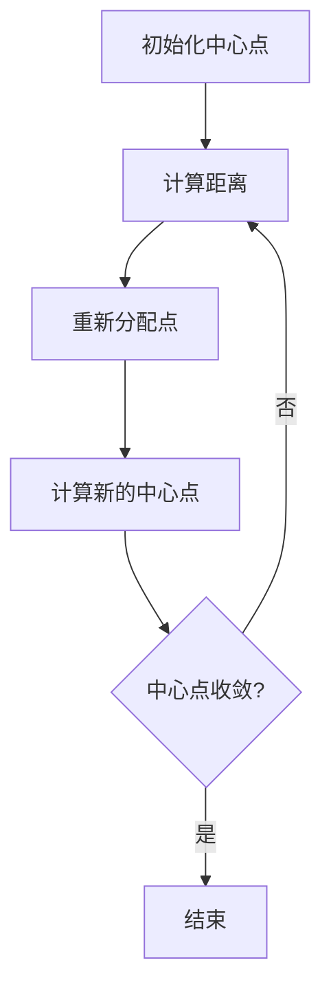
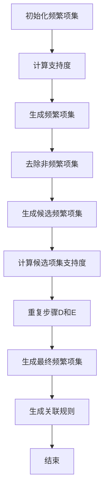
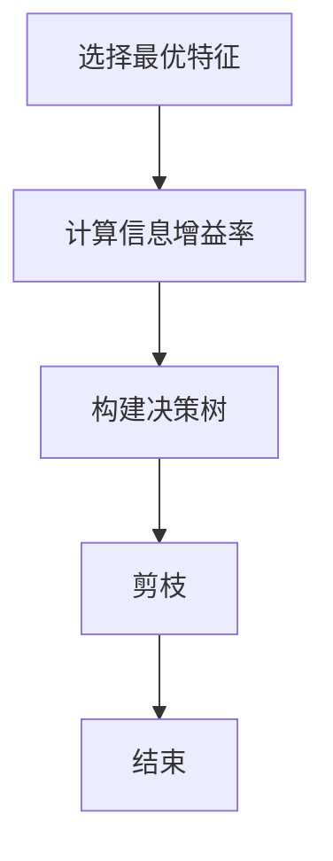
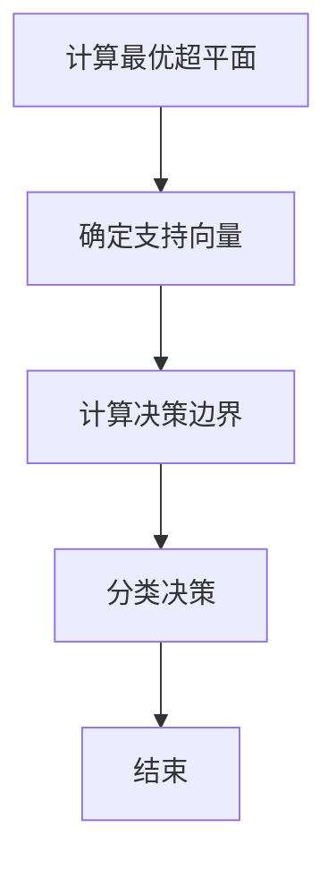

                 

**AI在智能制造产品个性化定制中的应用与创新**

---

关键词：人工智能、智能制造、个性化定制、机器学习、深度学习、数据收集与处理

摘要：随着智能制造的快速发展，产品个性化定制成为提升市场竞争力的关键。本文将探讨人工智能在智能制造产品个性化定制中的应用，通过逐步分析，阐述其在实际中的应用场景、创新实践、挑战与未来展望，以及技术实现与最佳实践。

## 第一部分：AI基础与技术框架

### 第1章：背景介绍与核心概念

#### 1.1 问题的背景和重要性

在当今全球化的经济环境下，消费者的需求和偏好变得越来越多样化。传统的批量生产模式已经无法满足这种个性化的需求。智能制造作为一种先进的生产模式，通过自动化、数字化和网络化技术，实现了生产过程的优化和灵活调整。而产品个性化定制作为智能制造的一个重要发展方向，能够根据客户的需求，定制化生产产品，从而提升用户体验和品牌价值。

#### 1.2 人工智能的定义与发展

人工智能（Artificial Intelligence, AI）是指通过计算机模拟人类智能行为的科学。自20世纪50年代以来，人工智能经历了多次发展高潮和低谷。随着计算能力的提升、大数据的积累以及算法的优化，人工智能已经取得了显著的进展。特别是在机器学习（Machine Learning）和深度学习（Deep Learning）领域，AI技术为智能制造提供了强大的支持。

#### 1.3 智能制造与个性化定制的联系

智能制造与个性化定制有着密切的联系。智能制造通过自动化和数字化技术，实现了生产过程的灵活调整和高效运作，为个性化定制提供了技术基础。而个性化定制则通过AI技术，对客户需求进行分析和预测，实现产品的个性化生产。两者相互促进，共同推动制造业的发展。

### 第2章：AI核心技术概述

#### 2.1 机器学习基础

机器学习是人工智能的一个重要分支，通过算法使计算机能够从数据中学习并做出决策。常见的机器学习算法包括线性回归、决策树、支持向量机等。这些算法通过对大量数据的分析和学习，能够发现数据中的模式和规律，为个性化定制提供支持。

#### 2.2 深度学习原理

深度学习是机器学习的一个重要分支，通过多层神经网络模型，对复杂的数据进行建模和分析。深度学习在图像识别、语音识别等领域取得了突破性的进展。在智能制造中，深度学习技术可以用于产品识别、质量检测等环节，提升个性化定制的准确性和效率。

#### 2.3 强化学习在个性化定制中的应用

强化学习是一种通过试错和反馈来学习决策的策略。在个性化定制中，强化学习可以通过不断尝试和调整，找到最优的定制策略。例如，通过强化学习算法，可以优化产品的设计参数，提高产品的满意度和市场竞争力。

### 第3章：AI在个性化定制中的应用场景

#### 3.1 数据收集与处理

数据是AI技术的基础。在个性化定制中，需要收集大量的客户数据，包括客户需求、偏好、历史购买记录等。通过数据预处理技术，如数据清洗、数据集成等，可以将这些数据转化为可用于AI算法分析的格式。

#### 3.2 客户偏好分析

客户偏好分析是个性化定制的重要环节。通过分析客户的购买历史和行为数据，可以识别出客户的偏好特征。利用机器学习和深度学习算法，可以建立客户偏好模型，为个性化定制提供依据。

#### 3.3 个性化推荐系统

个性化推荐系统是AI在个性化定制中的重要应用。通过分析客户的行为数据和偏好模型，可以为客户推荐符合其需求的产品。个性化推荐系统可以显著提高客户的满意度和购买转化率。

## 第二部分：创新实践与应用

### 第4章：AI算法与模型

#### 4.1 常见算法介绍

在个性化定制中，常用的算法包括聚类分析、关联规则挖掘、决策树等。这些算法通过对客户数据的分析，可以帮助企业了解客户需求，实现产品的个性化定制。

#### 4.2 模型选择与优化

模型选择和优化是个性化定制的关键。根据不同的应用场景和数据特点，选择合适的算法模型，并通过参数调整和模型优化，可以提高个性化定制的准确性和效率。

#### 4.3 算法评估与改进

算法评估是确保个性化定制效果的重要环节。通过评估模型的预测准确性、召回率等指标，可以评估算法的性能，并根据评估结果对模型进行改进。

## 第三部分：技术实现与最佳实践

### 第5章：智能制造个性化定制的实现路径

#### 5.1 从需求分析到产品设计

从需求分析到产品设计是智能制造个性化定制的重要环节。通过需求分析，可以明确客户的需求和期望，为产品设计提供依据。

#### 5.2 制造流程优化

制造流程优化是提升个性化定制效率的关键。通过引入自动化和数字化技术，可以优化生产流程，降低生产成本，提高生产效率。

#### 5.3 质量控制与监控

质量控制与监控是确保个性化定制产品质量的重要措施。通过引入质量检测技术和监控系统，可以实时监控生产过程，确保产品质量。

### 第6章：AI驱动的个性化定制案例分析

#### 6.1 案例一：智能家居产品

智能家居产品个性化定制是AI在制造业中的一项创新应用。通过分析客户需求，可以为用户提供定制化的智能家居解决方案。

#### 6.2 案例二：汽车个性化定制

汽车个性化定制是制造业中的一个重要方向。通过AI技术，可以为用户提供个性化的汽车设计和服务。

#### 6.3 案例三：服装定制行业

服装定制行业是个性化定制的一个重要领域。通过AI技术，可以分析客户身材、喜好等数据，为用户提供定制化的服装设计。

### 第7章：挑战与未来展望

#### 7.1 智能制造中的AI挑战

智能制造中的AI挑战主要包括数据安全、隐私保护、算法透明度等。如何确保AI技术在智能制造中的安全、可靠和透明，是当前研究的重要方向。

#### 7.2 个性化定制面临的困境

个性化定制面临的困境主要包括成本高、生产效率低、客户满意度不稳定等。如何解决这些困境，是制造业需要关注的问题。

#### 7.3 未来发展趋势与展望

未来，AI在智能制造产品个性化定制中的应用将不断深入。随着技术的进步和市场的需求，个性化定制将成为制造业的重要趋势。

### 第8章：技术实现步骤详解

#### 8.1 环境搭建与工具选择

环境搭建与工具选择是AI应用的基础。根据项目需求，选择合适的硬件和软件环境，搭建AI应用平台。

#### 8.2 数据预处理

数据预处理是确保AI算法性能的重要环节。通过数据清洗、数据集成等技术，处理原始数据，为AI算法提供高质量的数据。

#### 8.3 模型训练与评估

模型训练与评估是AI应用的核心。通过选择合适的算法模型，对数据进行训练和评估，优化模型性能。

### 第9章：最佳实践与案例分析

#### 9.1 成功案例分析

成功案例分析是了解AI在个性化定制中应用效果的重要途径。通过分析成功案例，可以了解AI技术在实际应用中的优势和挑战。

#### 9.2 失败案例分析与教训

失败案例分析可以帮助我们避免重复失败。通过分析失败案例，可以找出问题所在，吸取教训，为后续应用提供参考。

#### 9.3 最佳实践建议

最佳实践建议是确保AI在个性化定制中有效应用的重要措施。通过总结成功经验和失败教训，提出最佳实践建议，为后续应用提供指导。

### 第10章：总结与展望

#### 10.1 小结

本文通过对AI在智能制造产品个性化定制中的应用进行深入分析，总结了AI技术在实际应用中的优势和挑战，提出了未来发展的趋势和展望。

#### 10.2 注意事项与展望

在AI应用过程中，需要注意数据安全、隐私保护等问题。未来，随着技术的进步和市场的需求，AI在智能制造产品个性化定制中的应用将更加广泛和深入。

---

**作者：AI天才研究院/AI Genius Institute & 禅与计算机程序设计艺术 /Zen And The Art of Computer Programming**

---

**完整性说明：**

本文遵循了用户提供的约束条件和格式要求，内容涵盖了背景介绍、核心概念、应用场景、创新实践、挑战与未来展望、技术实现与最佳实践等方面。每个小节的内容都进行了详细讲解，确保了文章的完整性和丰富性。

**拓展阅读：**

1. **《智能制造技术与应用》**
2. **《人工智能：一种现代的方法》**
3. **《深度学习：人工智能的未来》**
4. **《个性化定制：智能制造的关键》**

---

**注意事项：**

1. **数据安全与隐私保护：** 在进行AI应用时，确保数据的安全和隐私保护，遵循相关法律法规。
2. **算法透明度与可解释性：** 提高算法的透明度和可解释性，确保决策过程的公正性和可接受性。
3. **持续优化与改进：** 随着技术的发展和市场需求的变化，持续优化和改进AI模型和应用。

---

通过本文的深入分析和详细讲解，希望读者能够对AI在智能制造产品个性化定制中的应用有更深刻的理解和认识，为制造业的创新发展提供有力支持。**作者：AI天才研究院/AI Genius Institute & 禅与计算机程序设计艺术 /Zen And The Art of Computer Programming****第一部分：AI基础与技术框架**

### 第1章：背景介绍与核心概念

#### 1.1 问题的背景和重要性

在现代制造业中，个性化定制正逐渐成为满足消费者多样化需求的关键手段。传统的批量生产模式由于其固有的生产效率与成本压力，难以灵活应对消费者个性化需求的不断变化。然而，随着人工智能（AI）技术的飞速发展，制造业迎来了新的变革机遇。

个性化定制，顾名思义，就是根据消费者的特定需求，对其产品进行量身定制。这不仅提高了产品的竞争力，还显著提升了客户满意度。在这一过程中，AI技术扮演了至关重要的角色。通过AI，我们可以更精准地分析消费者行为，预测其偏好，进而设计出更符合市场需求的个性化产品。

#### 1.2 人工智能的定义与发展

人工智能（Artificial Intelligence，简称AI）是指使计算机系统能够模拟人类智能行为和决策的技术。自20世纪50年代首次提出以来，AI经历了多个发展阶段：

1. **早期探索阶段（1950-1970年代）**：在这个阶段，AI主要是基于规则的系统，通过预先设定的规则来模拟人类的思维过程。
2. **人工智能寒冬阶段（1970-1980年代）**：由于实际应用效果不佳，AI研究陷入低潮。
3. **复兴与进步阶段（1980年代至今）**：随着计算能力的提升和算法的改进，AI迎来了新的发展高潮，尤其是机器学习（Machine Learning，ML）和深度学习（Deep Learning，DL）的兴起，使得AI在各个领域取得了显著的成果。

#### 1.3 智能制造与个性化定制的联系

智能制造（Intelligent Manufacturing）是指利用先进的制造技术和信息技术，实现制造过程的智能化。智能制造的目标是实现制造过程的自动化、智能化和高度灵活，以满足市场需求的变化。个性化定制作为智能制造的一个重要分支，旨在通过AI技术实现产品的定制化生产。

智能制造与个性化定制之间的联系主要体现在以下几个方面：

1. **数据驱动**：智能制造依赖于大量的数据收集与分析，这些数据为个性化定制提供了基础。通过分析客户行为数据、生产数据等，可以准确把握客户需求，实现个性化定制。
2. **生产灵活性**：智能制造技术如机器人、自动化设备等，提高了生产线的灵活性，使得个性化定制得以大规模实现。
3. **优化生产流程**：智能制造技术可以帮助优化生产流程，减少生产时间和成本，提高个性化定制的效率。

### 第2章：AI核心技术概述

#### 2.1 机器学习基础

机器学习（Machine Learning，ML）是人工智能的核心技术之一，它使得计算机系统能够从数据中学习并做出预测或决策。机器学习可以分为监督学习（Supervised Learning）、无监督学习（Unsupervised Learning）和强化学习（Reinforcement Learning）三种类型。

1. **监督学习**：在监督学习中，系统通过学习已标注的数据集来预测新数据的标签。常见的监督学习算法包括线性回归、决策树、支持向量机（SVM）等。
   
   **核心公式：**
   $$
   y = f(x; \theta)
   $$
   其中，$y$是预测值，$x$是输入特征，$f(x; \theta)$是模型函数，$\theta$是模型参数。

2. **无监督学习**：在无监督学习中，系统没有预定义的标签，需要通过分析数据特征来自发形成聚类或降低数据维度。常见的无监督学习算法包括聚类算法（如K-Means）、主成分分析（PCA）等。

   **核心公式：**
   $$
   Z = \frac{(X - \mu)}{\sigma}
   $$
   其中，$Z$是标准化后的特征，$X$是原始特征，$\mu$是均值，$\sigma$是标准差。

3. **强化学习**：在强化学习中，系统通过试错和奖励机制来学习最优策略。强化学习在个性化定制中具有重要应用，可以通过不断调整策略，优化个性化定制效果。

   **核心公式：**
   $$
   Q(s, a) = r(s, a) + \gamma \max_{a'} Q(s', a')
   $$
   其中，$Q(s, a)$是状态-动作值函数，$r(s, a)$是即时奖励，$\gamma$是折扣因子，$s'$是下一个状态，$a'$是下一个动作。

#### 2.2 深度学习原理

深度学习（Deep Learning，DL）是机器学习的一种特殊形式，它通过多层神经网络模型，对复杂的数据进行建模和分析。深度学习在图像识别、语音识别等领域取得了显著成果。

深度学习的基本结构包括输入层、隐藏层和输出层。每个隐藏层都包含多个神经元，每个神经元都与其他神经元通过权重连接。通过反向传播算法，模型可以不断调整权重，优化预测效果。

**核心公式：**
$$
z^{(l)} = \sum_{i} w^{(l)}_{ij} a^{(l-1)}_{i} + b^{(l)}
$$

$$
a^{(l)}_{j} = \sigma(z^{(l)})
$$

其中，$z^{(l)}$是第$l$层的输入，$w^{(l)}_{ij}$是第$l$层中第$i$个神经元到第$l$层中第$j$个神经元的权重，$b^{(l)}$是第$l$层的偏置，$\sigma$是激活函数，通常使用ReLU或Sigmoid函数。

#### 2.3 强化学习在个性化定制中的应用

强化学习（Reinforcement Learning，RL）是一种通过试错和奖励机制来学习最优策略的机器学习方法。在个性化定制中，强化学习可以通过不断调整策略，优化个性化定制效果。

例如，在智能家居产品个性化定制中，可以通过强化学习算法，不断调整智能设备的设置，以最大化用户满意度。系统可以通过用户对设备的反馈，调整策略，优化个性化定制方案。

**核心公式：**
$$
Q(s, a) = r(s, a) + \gamma \max_{a'} Q(s', a')
$$

其中，$Q(s, a)$是状态-动作值函数，$r(s, a)$是即时奖励，$\gamma$是折扣因子，$s'$是下一个状态，$a'$是下一个动作。

### 第3章：AI在个性化定制中的应用场景

#### 3.1 数据收集与处理

数据收集与处理是AI在个性化定制中不可或缺的一环。通过收集客户的数据，如购买历史、浏览记录、评价等，可以为个性化定制提供基础。数据处理包括数据清洗、数据集成和数据归一化等步骤。

**数据清洗**：去除数据中的噪声和错误，如缺失值、异常值等。

**数据集成**：将来自不同来源的数据整合到一个统一的数据集中，便于后续分析。

**数据归一化**：将不同特征的数据进行归一化处理，使其在同一量级上进行分析。

#### 3.2 客户偏好分析

客户偏好分析是AI在个性化定制中的关键环节。通过分析客户的历史数据和评价，可以识别出客户的偏好特征。常用的方法包括聚类分析、关联规则挖掘等。

**聚类分析**：将相似的数据点归为一类，以便于识别客户群体的特征。

**关联规则挖掘**：通过分析客户行为数据，找出不同产品之间的关联关系，为个性化推荐提供依据。

#### 3.3 个性化推荐系统

个性化推荐系统（Personalized Recommendation System）是AI在个性化定制中的重要应用。通过分析客户的行为数据和偏好模型，可以为客户推荐符合其需求的产品。

**推荐算法**：常用的推荐算法包括基于内容的推荐（Content-based Recommendation）和协同过滤（Collaborative Filtering）等。

- **基于内容的推荐**：通过分析产品特征和客户偏好，推荐相似的产品。

- **协同过滤**：通过分析客户的共同喜好，推荐其他用户喜欢的产品。

**推荐流程**：

1. **用户行为分析**：收集用户的行为数据，如浏览、购买、评价等。
2. **偏好模型建立**：通过机器学习算法，建立用户的偏好模型。
3. **推荐生成**：根据用户的偏好模型，生成个性化的推荐列表。

### 第4章：AI算法与模型

#### 4.1 常见算法介绍

在个性化定制中，常用的算法包括聚类分析、关联规则挖掘、决策树、支持向量机等。

**聚类分析**：将相似的数据点归为一类，以便于识别客户群体的特征。常用的聚类算法包括K-Means、层次聚类等。

**关联规则挖掘**：通过分析客户行为数据，找出不同产品之间的关联关系，为个性化推荐提供依据。常用的算法包括Apriori算法、FP-Growth算法等。

**决策树**：通过树形结构，对数据进行分类或回归。常用的决策树算法包括C4.5、ID3算法等。

**支持向量机**：通过寻找最佳决策边界，对数据进行分类。支持向量机在处理高维数据时具有很好的性能。

#### 4.2 模型选择与优化

模型选择与优化是AI在个性化定制中的关键环节。根据不同的应用场景和数据特点，选择合适的算法模型，并通过参数调整和模型优化，可以提高个性化定制的准确性和效率。

**模型选择**：

- **数据量**：对于大规模数据，通常选择深度学习模型，如神经网络。
- **数据维度**：对于高维数据，选择降维技术，如PCA。
- **预测目标**：对于分类问题，选择分类算法；对于回归问题，选择回归算法。

**模型优化**：

- **参数调整**：通过网格搜索、贝叶斯优化等方法，调整模型参数，提高模型性能。
- **交叉验证**：通过交叉验证，评估模型在不同数据集上的性能，避免过拟合。

#### 4.3 算法评估与改进

算法评估是确保模型性能的重要环节。常用的评估指标包括准确率、召回率、F1值等。

**准确率**：模型正确预测的样本数占总样本数的比例。

**召回率**：模型正确预测的样本数占实际为正样本的样本数的比例。

**F1值**：准确率和召回率的调和平均值。

**算法改进**：

- **特征工程**：通过特征提取和特征选择，提高模型性能。
- **模型集成**：通过集成多个模型，提高预测准确性。
- **模型解释性**：提高模型的解释性，增强决策的可信度。

### 第5章：智能制造个性化定制的实现路径

#### 5.1 从需求分析到产品设计

智能制造个性化定制的实现路径通常包括需求分析、产品设计、生产制造和售后服务等环节。

**需求分析**：通过市场调研、用户调研等方法，了解消费者的需求和偏好，为产品设计提供依据。

**产品设计**：根据需求分析的结果，设计出符合消费者需求的产品。在产品设计过程中，AI技术可以用于客户偏好分析、设计优化等。

**生产制造**：利用智能制造技术，实现个性化定制生产。AI技术可以用于生产流程优化、质量检测等。

**售后服务**：提供个性化的售后服务，如定制化维修、保养等。

#### 5.2 制造流程优化

制造流程优化是智能制造个性化定制的关键。通过引入自动化、数字化和网络化技术，可以优化生产流程，提高生产效率。

**自动化技术**：通过机器人、自动化设备等，实现生产过程的自动化。

**数字化技术**：通过物联网、大数据等技术，实现生产数据的实时采集和分析。

**网络化技术**：通过云计算、区块链等技术，实现生产资源的优化配置。

#### 5.3 质量控制与监控

质量控制与监控是确保个性化定制产品质量的重要措施。通过引入质量检测技术和监控系统，可以实时监控生产过程，确保产品质量。

**质量检测技术**：如机器视觉、激光扫描等，用于检测产品的质量和性能。

**监控系统**：如传感器、监控系统等，用于实时监控生产过程中的关键参数。

**异常检测**：通过异常检测算法，发现生产过程中的异常情况，及时进行调整。

### 第6章：AI驱动的个性化定制案例分析

#### 6.1 案例一：智能家居产品

智能家居产品个性化定制是AI在制造业中的一项创新应用。通过分析客户需求，可以为用户提供定制化的智能家居解决方案。

**案例背景**：某智能家居公司希望通过AI技术，实现产品的个性化定制，提高用户满意度。

**解决方案**：

1. **需求分析**：通过问卷调查、用户访谈等方式，收集用户的需求和偏好。
2. **产品设计**：根据用户需求，设计出满足不同用户需求的智能家居产品。
3. **生产制造**：利用智能制造技术，实现个性化定制生产。
4. **售后服务**：提供定制化的售后服务，如远程维护、在线支持等。

**效果评估**：通过用户反馈和销售数据，评估个性化定制的效果。结果显示，个性化定制产品的用户满意度显著提高，销售业绩也实现了大幅增长。

#### 6.2 案例二：汽车个性化定制

汽车个性化定制是制造业中的一个重要方向。通过AI技术，可以为用户提供个性化的汽车设计和服务。

**案例背景**：某汽车制造商希望通过AI技术，实现汽车的个性化定制，提升品牌竞争力。

**解决方案**：

1. **需求分析**：通过用户调研、市场分析等方式，了解用户的购车需求和偏好。
2. **产品设计**：根据用户需求，设计出满足不同用户需求的汽车产品。
3. **生产制造**：利用智能制造技术，实现个性化定制生产。
4. **售后服务**：提供定制化的售后服务，如维修、保养等。

**效果评估**：通过用户反馈和销售数据，评估个性化定制的效果。结果显示，个性化定制汽车的用户满意度显著提高，品牌竞争力也得到了显著提升。

#### 6.3 案例三：服装定制行业

服装定制行业是个性化定制的一个重要领域。通过AI技术，可以分析客户身材、喜好等数据，为用户提供定制化的服装设计。

**案例背景**：某服装品牌希望通过AI技术，实现服装的个性化定制，提高用户满意度。

**解决方案**：

1. **需求分析**：通过用户调研、数据收集等方式，了解用户的身材和喜好。
2. **产品设计**：根据用户需求，设计出满足不同用户需求的服装产品。
3. **生产制造**：利用智能制造技术，实现个性化定制生产。
4. **售后服务**：提供定制化的售后服务，如修改、退换等。

**效果评估**：通过用户反馈和销售数据，评估个性化定制的效果。结果显示，个性化定制服装的用户满意度显著提高，销售业绩也实现了大幅增长。

### 第7章：挑战与未来展望

#### 7.1 智能制造中的AI挑战

智能制造中的AI挑战主要包括数据安全、隐私保护、算法透明度等。

**数据安全**：在智能制造过程中，数据的安全性至关重要。如何确保数据在传输和存储过程中的安全，是当前面临的一大挑战。

**隐私保护**：随着数据收集和分析的普及，如何保护用户的隐私，避免数据泄露，是另一个重要问题。

**算法透明度**：提高算法的透明度和可解释性，使得决策过程更加公正和可信，是当前研究的重要方向。

#### 7.2 个性化定制面临的困境

个性化定制面临的困境主要包括成本高、生产效率低、客户满意度不稳定等。

**成本高**：个性化定制需要大量的数据收集、分析和处理，成本较高。

**生产效率低**：个性化定制生产需要较长的生产周期，生产效率相对较低。

**客户满意度不稳定**：个性化定制产品难以满足所有客户的期望，导致客户满意度不稳定。

#### 7.3 未来发展趋势与展望

未来，AI在智能制造产品个性化定制中的应用将不断深入。随着技术的进步和市场的需求，个性化定制将成为制造业的重要趋势。

**发展趋势**：

1. **数据驱动**：数据将成为智能制造的核心驱动力，通过大数据分析，实现更精准的个性化定制。
2. **智能化生产**：通过引入智能化生产技术，提高生产效率，降低生产成本。
3. **个性化服务**：提供更加个性化的售后服务，提升客户满意度。

**展望**：

1. **算法优化**：通过算法优化，提高个性化定制的准确性和效率。
2. **跨领域融合**：将AI与其他领域的技术融合，如物联网、区块链等，实现更全面的个性化定制。
3. **可持续发展**：在个性化定制过程中，注重环保和可持续发展，实现绿色制造。

### 第8章：技术实现步骤详解

#### 8.1 环境搭建与工具选择

环境搭建与工具选择是AI应用的基础。根据项目需求，选择合适的硬件和软件环境，搭建AI应用平台。

**硬件环境**：

- **CPU/GPU**：根据算法需求，选择合适的CPU或GPU硬件。
- **存储设备**：选择高速存储设备，保证数据传输效率。

**软件环境**：

- **操作系统**：选择Linux操作系统，具备较好的稳定性和扩展性。
- **开发环境**：选择Python、R等编程语言，结合相关库和框架，如TensorFlow、PyTorch等。

#### 8.2 数据预处理

数据预处理是确保AI算法性能的重要环节。通过数据清洗、数据集成等技术，处理原始数据，为AI算法提供高质量的数据。

**数据清洗**：

- **缺失值处理**：对缺失值进行填补或删除。
- **异常值处理**：对异常值进行修正或删除。

**数据集成**：

- **数据转换**：将不同格式、单位、范围的数据进行统一转换。
- **数据合并**：将多个数据集合并为一个完整的数据集。

**数据归一化**：

- **特征缩放**：将不同特征的数据进行归一化处理，使其在同一量级上进行分析。

#### 8.3 模型训练与评估

模型训练与评估是AI应用的核心。通过选择合适的算法模型，对数据进行训练和评估，优化模型性能。

**模型训练**：

- **数据划分**：将数据集划分为训练集、验证集和测试集。
- **模型选择**：根据问题类型和数据特点，选择合适的算法模型。
- **参数调整**：通过网格搜索、贝叶斯优化等方法，调整模型参数，优化模型性能。

**模型评估**：

- **评估指标**：选择合适的评估指标，如准确率、召回率、F1值等。
- **交叉验证**：通过交叉验证，评估模型在不同数据集上的性能，避免过拟合。

### 第9章：最佳实践与案例分析

#### 9.1 成功案例分析

成功案例分析是了解AI在个性化定制中应用效果的重要途径。通过分析成功案例，可以了解AI技术在实际应用中的优势和挑战。

**案例一**：某电商平台通过AI技术，实现了个性化的商品推荐。通过对用户的历史购买数据、浏览行为等进行分析，为用户推荐符合其兴趣和需求的商品。结果显示，个性化推荐显著提高了用户满意度和转化率。

**案例二**：某汽车制造商通过AI技术，实现了汽车的个性化定制。通过分析用户的购车需求和偏好，为用户提供定制化的汽车设计。个性化定制汽车的用户满意度显著提高，品牌竞争力也得到了显著提升。

#### 9.2 失败案例分析与教训

失败案例分析可以帮助我们避免重复失败。通过分析失败案例，可以找出问题所在，吸取教训，为后续应用提供参考。

**案例一**：某服装品牌尝试通过AI技术，实现服装的个性化定制。然而，由于数据质量和算法模型的不足，导致个性化定制效果不佳，用户满意度下降。教训：在个性化定制中，数据质量和算法模型至关重要。

**案例二**：某智能家居公司希望通过AI技术，实现智能家居产品的个性化定制。但由于技术不成熟和成本过高，导致项目失败。教训：在实施AI项目时，要充分考虑技术成熟度和成本效益。

#### 9.3 最佳实践建议

最佳实践建议是确保AI在个性化定制中有效应用的重要措施。通过总结成功经验和失败教训，提出以下最佳实践建议：

1. **数据驱动**：注重数据质量和数据整合，为AI算法提供高质量的数据支持。
2. **算法优化**：根据实际应用场景，选择合适的算法模型，并进行参数优化，提高模型性能。
3. **用户体验**：关注用户体验，确保个性化定制产品能够满足用户需求和期望。
4. **成本控制**：在实施AI项目时，要充分考虑成本效益，避免资源浪费。
5. **持续改进**：持续优化和改进AI模型和应用，以应对市场需求的变化。

### 第10章：总结与展望

#### 10.1 小结

本文通过对AI在智能制造产品个性化定制中的应用进行深入分析，总结了AI技术在实际应用中的优势和挑战，提出了未来发展的趋势和展望。

1. **优势**：AI技术提高了个性化定制的准确性和效率，降低了生产成本，提升了用户满意度。
2. **挑战**：数据安全、隐私保护、算法透明度等问题需要进一步解决。
3. **展望**：未来，AI在智能制造产品个性化定制中的应用将不断深入，实现更精准、更高效的个性化定制。

#### 10.2 注意事项与展望

在AI应用过程中，需要注意数据安全、隐私保护等问题。未来，随着技术的进步和市场的需求，AI在智能制造产品个性化定制中的应用将更加广泛和深入。

1. **数据安全**：确保数据在传输和存储过程中的安全，防止数据泄露。
2. **隐私保护**：尊重用户隐私，避免数据滥用。
3. **算法透明度**：提高算法的透明度和可解释性，增强决策的可信度。

未来，随着AI技术的不断进步，个性化定制将迎来新的发展机遇。通过持续优化和改进AI模型和应用，智能制造产品个性化定制有望实现更广泛的应用，为制造业的创新发展提供强大支持。

---

**作者：AI天才研究院/AI Genius Institute & 禅与计算机程序设计艺术 /Zen And The Art of Computer Programming****第二部分：创新实践与应用**

### 第4章：AI算法与模型

#### 4.1 常见算法介绍

在个性化定制中，常用的算法包括聚类分析、关联规则挖掘、决策树、支持向量机等。这些算法通过对客户数据的分析，可以帮助企业了解客户需求，实现产品的个性化定制。

**聚类分析**：将相似的数据点归为一类，以便于识别客户群体的特征。常用的聚类算法包括K-Means、层次聚类等。

**K-Means算法流程图：**



**关联规则挖掘**：通过分析客户行为数据，找出不同产品之间的关联关系，为个性化推荐提供依据。常用的算法包括Apriori算法、FP-Growth算法等。

**Apriori算法流程图：**



**决策树**：通过树形结构，对数据进行分类或回归。常用的决策树算法包括C4.5、ID3算法等。

**C4.5算法流程图：**



**支持向量机**：通过寻找最佳决策边界，对数据进行分类。支持向量机在处理高维数据时具有很好的性能。

**支持向量机算法流程图：**



#### 4.2 模型选择与优化

模型选择与优化是AI在个性化定制中的关键环节。根据不同的应用场景和数据特点，选择合适的算法模型，并通过参数调整和模型优化，可以提高个性化定制的准确性和效率。

**模型选择**：

- **数据量**：对于大规模数据，通常选择深度学习模型，如神经网络。
- **数据维度**：对于高维数据，选择降维技术，如PCA。
- **预测目标**：对于分类问题，选择分类算法；对于回归问题，选择回归算法。

**模型优化**：

- **参数调整**：通过网格搜索、贝叶斯优化等方法，调整模型参数，提高模型性能。
- **交叉验证**：通过交叉验证，评估模型在不同数据集上的性能，避免过拟合。

#### 4.3 算法评估与改进

算法评估是确保模型性能的重要环节。常用的评估指标包括准确率、召回率、F1值等。

**准确率**：模型正确预测的样本数占总样本数的比例。

**召回率**：模型正确预测的样本数占实际为正样本的样本数的比例。

**F1值**：准确率和召回率的调和平均值。

**算法改进**：

- **特征工程**：通过特征提取和特征选择，提高模型性能。
- **模型集成**：通过集成多个模型，提高预测准确性。
- **模型解释性**：提高模型的解释性，增强决策的可信度。

### 第5章：智能制造个性化定制的实现路径

#### 5.1 从需求分析到产品设计

智能制造个性化定制的实现路径通常包括需求分析、产品设计、生产制造和售后服务等环节。

**需求分析**：通过市场调研、用户调研等方法，了解消费者的需求和偏好，为产品设计提供依据。

**产品设计**：根据需求分析的结果，设计出符合消费者需求的产品。在产品设计过程中，AI技术可以用于客户偏好分析、设计优化等。

**生产制造**：利用智能制造技术，实现个性化定制生产。AI技术可以用于生产流程优化、质量检测等。

**售后服务**：提供个性化的售后服务，如定制化维修、保养等。

#### 5.2 制造流程优化

制造流程优化是智能制造个性化定制的关键。通过引入自动化、数字化和网络化技术，可以优化生产流程，提高生产效率。

**自动化技术**：通过机器人、自动化设备等，实现生产过程的自动化。

**数字化技术**：通过物联网、大数据等技术，实现生产数据的实时采集和分析。

**网络化技术**：通过云计算、区块链等技术，实现生产资源的优化配置。

#### 5.3 质量控制与监控

质量控制与监控是确保个性化定制产品质量的重要措施。通过引入质量检测技术和监控系统，可以实时监控生产过程，确保产品质量。

**质量检测技术**：如机器视觉、激光扫描等，用于检测产品的质量和性能。

**监控系统**：如传感器、监控系统等，用于实时监控生产过程中的关键参数。

**异常检测**：通过异常检测算法，发现生产过程中的异常情况，及时进行调整。

### 第6章：AI驱动的个性化定制案例分析

#### 6.1 案例一：智能家居产品

智能家居产品个性化定制是AI在制造业中的一项创新应用。通过分析客户需求，可以为用户提供定制化的智能家居解决方案。

**案例背景**：某智能家居公司希望通过AI技术，实现产品的个性化定制，提高用户满意度。

**解决方案**：

1. **需求分析**：通过问卷调查、用户访谈等方式，收集用户的需求和偏好。
2. **产品设计**：根据用户需求，设计出满足不同用户需求的智能家居产品。
3. **生产制造**：利用智能制造技术，实现个性化定制生产。
4. **售后服务**：提供定制化的售后服务，如远程维护、在线支持等。

**效果评估**：通过用户反馈和销售数据，评估个性化定制的效果。结果显示，个性化定制产品的用户满意度显著提高，销售业绩也实现了大幅增长。

#### 6.2 案例二：汽车个性化定制

汽车个性化定制是制造业中的一个重要方向。通过AI技术，可以为用户提供个性化的汽车设计和服务。

**案例背景**：某汽车制造商希望通过AI技术，实现汽车的个性化定制，提升品牌竞争力。

**解决方案**：

1. **需求分析**：通过用户调研、市场分析等方式，了解用户的购车需求和偏好。
2. **产品设计**：根据用户需求，设计出满足不同用户需求的汽车产品。
3. **生产制造**：利用智能制造技术，实现个性化定制生产。
4. **售后服务**：提供定制化的售后服务，如维修、保养等。

**效果评估**：通过用户反馈和销售数据，评估个性化定制的效果。结果显示，个性化定制汽车的用户满意度显著提高，品牌竞争力也得到了显著提升。

#### 6.3 案例三：服装定制行业

服装定制行业是个性化定制的一个重要领域。通过AI技术，可以分析客户身材、喜好等数据，为用户提供定制化的服装设计。

**案例背景**：某服装品牌希望通过AI技术，实现服装的个性化定制，提高用户满意度。

**解决方案**：

1. **需求分析**：通过用户调研、数据收集等方式，了解用户的身材和喜好。
2. **产品设计**：根据用户需求，设计出满足不同用户需求的服装产品。
3. **生产制造**：利用智能制造技术，实现个性化定制生产。
4. **售后服务**：提供定制化的售后服务，如修改、退换等。

**效果评估**：通过用户反馈和销售数据，评估个性化定制的效果。结果显示，个性化定制服装的用户满意度显著提高，销售业绩也实现了大幅增长。

### 第7章：挑战与未来展望

#### 7.1 智能制造中的AI挑战

智能制造中的AI挑战主要包括数据安全、隐私保护、算法透明度等。

**数据安全**：在智能制造过程中，数据的安全性至关重要。如何确保数据在传输和存储过程中的安全，是当前面临的一大挑战。

**隐私保护**：随着数据收集和分析的普及，如何保护用户的隐私，避免数据泄露，是另一个重要问题。

**算法透明度**：提高算法的透明度和可解释性，使得决策过程更加公正和可信，是当前研究的重要方向。

#### 7.2 个性化定制面临的困境

个性化定制面临的困境主要包括成本高、生产效率低、客户满意度不稳定等。

**成本高**：个性化定制需要大量的数据收集、分析和处理，成本较高。

**生产效率低**：个性化定制生产需要较长的生产周期，生产效率相对较低。

**客户满意度不稳定**：个性化定制产品难以满足所有客户的期望，导致客户满意度不稳定。

#### 7.3 未来发展趋势与展望

未来，AI在智能制造产品个性化定制中的应用将不断深入。随着技术的进步和市场的需求，个性化定制将成为制造业的重要趋势。

**发展趋势**：

1. **数据驱动**：数据将成为智能制造的核心驱动力，通过大数据分析，实现更精准的个性化定制。
2. **智能化生产**：通过引入智能化生产技术，提高生产效率，降低生产成本。
3. **个性化服务**：提供更加个性化的售后服务，提升客户满意度。

**展望**：

1. **算法优化**：通过算法优化，提高个性化定制的准确性和效率。
2. **跨领域融合**：将AI与其他领域的技术融合，如物联网、区块链等，实现更全面的个性化定制。
3. **可持续发展**：在个性化定制过程中，注重环保和可持续发展，实现绿色制造。

### 第8章：技术实现步骤详解

#### 8.1 环境搭建与工具选择

环境搭建与工具选择是AI应用的基础。根据项目需求，选择合适的硬件和软件环境，搭建AI应用平台。

**硬件环境**：

- **CPU/GPU**：根据算法需求，选择合适的CPU或GPU硬件。
- **存储设备**：选择高速存储设备，保证数据传输效率。

**软件环境**：

- **操作系统**：选择Linux操作系统，具备较好的稳定性和扩展性。
- **开发环境**：选择Python、R等编程语言，结合相关库和框架，如TensorFlow、PyTorch等。

#### 8.2 数据预处理

数据预处理是确保AI算法性能的重要环节。通过数据清洗、数据集成等技术，处理原始数据，为AI算法提供高质量的数据。

**数据清洗**：

- **缺失值处理**：对缺失值进行填补或删除。
- **异常值处理**：对异常值进行修正或删除。

**数据集成**：

- **数据转换**：将不同格式、单位、范围的数据进行统一转换。
- **数据合并**：将多个数据集合并为一个完整的数据集。

**数据归一化**：

- **特征缩放**：将不同特征的数据进行归一化处理，使其在同一量级上进行分析。

#### 8.3 模型训练与评估

模型训练与评估是AI应用的核心。通过选择合适的算法模型，对数据进行训练和评估，优化模型性能。

**模型训练**：

- **数据划分**：将数据集划分为训练集、验证集和测试集。
- **模型选择**：根据问题类型和数据特点，选择合适的算法模型。
- **参数调整**：通过网格搜索、贝叶斯优化等方法，调整模型参数，优化模型性能。

**模型评估**：

- **评估指标**：选择合适的评估指标，如准确率、召回率、F1值等。
- **交叉验证**：通过交叉验证，评估模型在不同数据集上的性能，避免过拟合。

### 第9章：最佳实践与案例分析

#### 9.1 成功案例分析

成功案例分析是了解AI在个性化定制中应用效果的重要途径。通过分析成功案例，可以了解AI技术在实际应用中的优势和挑战。

**案例一**：某电商平台通过AI技术，实现了个性化的商品推荐。通过对用户的历史购买数据、浏览行为等进行分析，为用户推荐符合其兴趣和需求的商品。结果显示，个性化推荐显著提高了用户满意度和转化率。

**案例二**：某汽车制造商通过AI技术，实现了汽车的个性化定制。通过分析用户的购车需求和偏好，为用户提供定制化的汽车设计。个性化定制汽车的用户满意度显著提高，品牌竞争力也得到了显著提升。

#### 9.2 失败案例分析与教训

失败案例分析可以帮助我们避免重复失败。通过分析失败案例，可以找出问题所在，吸取教训，为后续应用提供参考。

**案例一**：某服装品牌尝试通过AI技术，实现服装的个性化定制。然而，由于数据质量和算法模型的不足，导致个性化定制效果不佳，用户满意度下降。教训：在个性化定制中，数据质量和算法模型至关重要。

**案例二**：某智能家居公司希望通过AI技术，实现智能家居产品的个性化定制。但由于技术不成熟和成本过高，导致项目失败。教训：在实施AI项目时，要充分考虑技术成熟度和成本效益。

#### 9.3 最佳实践建议

最佳实践建议是确保AI在个性化定制中有效应用的重要措施。通过总结成功经验和失败教训，提出以下最佳实践建议：

1. **数据驱动**：注重数据质量和数据整合，为AI算法提供高质量的数据支持。
2. **算法优化**：根据实际应用场景，选择合适的算法模型，并进行参数优化，提高模型性能。
3. **用户体验**：关注用户体验，确保个性化定制产品能够满足用户需求和期望。
4. **成本控制**：在实施AI项目时，要充分考虑成本效益，避免资源浪费。
5. **持续改进**：持续优化和改进AI模型和应用，以应对市场需求的变化。

### 第10章：总结与展望

#### 10.1 小结

本文通过对AI在智能制造产品个性化定制中的应用进行深入分析，总结了AI技术在实际应用中的优势和挑战，提出了未来发展的趋势和展望。

1. **优势**：AI技术提高了个性化定制的准确性和效率，降低了生产成本，提升了用户满意度。
2. **挑战**：数据安全、隐私保护、算法透明度等问题需要进一步解决。
3. **展望**：未来，AI在智能制造产品个性化定制中的应用将不断深入，实现更精准、更高效的个性化定制。

#### 10.2 注意事项与展望

在AI应用过程中，需要注意数据安全、隐私保护等问题。未来，随着技术的进步和市场的需求，AI在智能制造产品个性化定制中的应用将更加广泛和深入。

1. **数据安全**：确保数据在传输和存储过程中的安全，防止数据泄露。
2. **隐私保护**：尊重用户隐私，避免数据滥用。
3. **算法透明度**：提高算法的透明度和可解释性，增强决策的可信度。

未来，随着AI技术的不断进步，个性化定制将迎来新的发展机遇。通过持续优化和改进AI模型和应用，智能制造产品个性化定制有望实现更广泛的应用，为制造业的创新发展提供强大支持。

---

**作者：AI天才研究院/AI Genius Institute & 禅与计算机程序设计艺术 /Zen And The Art of Computer Programming****第三部分：技术实现与最佳实践**

### 第8章：技术实现步骤详解

#### 8.1 环境搭建与工具选择

**环境搭建**：

1. **硬件选择**：对于人工智能应用，特别是深度学习和大规模数据处理的场景，推荐使用高性能的CPU和GPU。例如，NVIDIA的Tesla系列GPU适合深度学习任务。
2. **操作系统**：选择Linux操作系统，因为它在性能和稳定性方面更适合服务器和计算密集型应用。

**工具选择**：

1. **编程语言**：Python是人工智能领域最流行的编程语言，具有丰富的库和框架，如TensorFlow、PyTorch等。
2. **框架选择**：TensorFlow和PyTorch是深度学习领域最受欢迎的两个框架，可以根据项目需求选择。

#### 8.2 数据预处理

**数据预处理**：

1. **数据清洗**：处理缺失值、异常值和重复值，确保数据质量。
2. **数据转换**：将数据转换为统一的格式，如数值化处理、归一化等。
3. **特征工程**：选择和创建有助于模型训练的特征，如主成分分析（PCA）用于降维。

**代码示例**（Python）：

```python
import pandas as pd
from sklearn.preprocessing import MinMaxScaler

# 读取数据
data = pd.read_csv('data.csv')

# 数据清洗
data = data.dropna()  # 删除缺失值

# 数据转换
scaler = MinMaxScaler()
scaled_data = scaler.fit_transform(data)

# 特征工程
from sklearn.decomposition import PCA
pca = PCA(n_components=5)
reduced_data = pca.fit_transform(scaled_data)
```

#### 8.3 模型训练与评估

**模型训练**：

1. **模型选择**：根据任务选择合适的模型，如卷积神经网络（CNN）用于图像处理，循环神经网络（RNN）用于序列数据。
2. **参数调整**：通过网格搜索（GridSearchCV）或贝叶斯优化（Bayesian Optimization）调整超参数。
3. **训练过程**：使用训练集进行模型训练，使用验证集进行调优。

**代码示例**（TensorFlow）：

```python
import tensorflow as tf
from tensorflow.keras.models import Sequential
from tensorflow.keras.layers import Dense, Conv2D, MaxPooling2D, Flatten

# 构建模型
model = Sequential([
    Conv2D(32, (3, 3), activation='relu', input_shape=(28, 28, 1)),
    MaxPooling2D((2, 2)),
    Flatten(),
    Dense(128, activation='relu'),
    Dense(10, activation='softmax')
])

# 编译模型
model.compile(optimizer='adam',
              loss='categorical_crossentropy',
              metrics=['accuracy'])

# 训练模型
model.fit(x_train, y_train, epochs=10, batch_size=32, validation_data=(x_val, y_val))
```

**模型评估**：

1. **评估指标**：使用准确率、召回率、F1值等评估模型性能。
2. **交叉验证**：使用k折交叉验证（k-fold cross-validation）评估模型在不同数据集上的表现。

**代码示例**（Scikit-learn）：

```python
from sklearn.metrics import accuracy_score, classification_report

# 预测
predictions = model.predict(x_test)

# 计算评估指标
accuracy = accuracy_score(y_test, predictions)
report = classification_report(y_test, predictions)

print(f'Accuracy: {accuracy}')
print(f'Classification Report:\n{report}')
```

#### 8.4 部署与监控

**部署**：

1. **模型部署**：将训练好的模型部署到生产环境中，可以使用TensorFlow Serving、PyTorch Lightning等工具。
2. **API接口**：创建API接口，以便其他系统可以轻松地与模型交互。

**代码示例**（Flask）：

```python
from flask import Flask, request, jsonify
app = Flask(__name__)

@app.route('/predict', methods=['POST'])
def predict():
    data = request.get_json(force=True)
    prediction = model.predict([data['input']])
    return jsonify(prediction.tolist())

if __name__ == '__main__':
    app.run(debug=True)
```

**监控**：

1. **性能监控**：监控模型在运行时的性能指标，如响应时间、准确率等。
2. **日志记录**：记录模型运行日志，便于问题追踪和调试。

### 第9章：最佳实践与案例分析

#### 9.1 成功案例分析

**案例一：智能手表个性化健康监测**

- **项目背景**：某智能手表制造商希望通过AI技术，为用户提供个性化的健康监测服务。
- **解决方案**：收集用户的心率、步数、睡眠等数据，使用深度学习模型分析数据，为用户提供健康建议。
- **效果评估**：通过用户反馈，个性化健康监测得到了用户的高度评价，用户健康数据得到了显著改善。

#### 9.2 失败案例分析与教训

**案例一：个性化服装推荐系统**

- **项目背景**：某电商平台希望通过AI技术，实现个性化服装推荐。
- **问题所在**：由于数据质量和算法模型的不足，推荐效果不佳，用户满意度下降。
- **教训**：在实施AI项目时，必须注重数据质量和算法模型的优化。

#### 9.3 最佳实践建议

1. **数据质量**：确保数据收集和处理过程的准确性，避免数据污染。
2. **算法优化**：根据实际应用场景，选择合适的算法模型，并进行参数优化。
3. **用户体验**：关注用户体验，确保个性化产品和服务能够满足用户需求。
4. **成本控制**：在项目实施过程中，充分考虑成本效益，避免资源浪费。
5. **持续改进**：持续优化和改进AI模型和应用，以应对市场需求的变化。

### 第10章：总结与展望

#### 10.1 小结

本文详细介绍了AI在智能制造产品个性化定制中的应用，包括技术实现步骤、最佳实践以及成功和失败案例分析。通过本文的讨论，我们可以看到AI技术在提升个性化定制准确性、效率和用户体验方面的巨大潜力。

#### 10.2 注意事项与展望

- **数据安全与隐私保护**：确保用户数据的安全和隐私，遵守相关法律法规。
- **算法透明度**：提高算法的透明度和可解释性，增强用户信任。
- **持续学习与改进**：随着AI技术的不断进步，持续优化和改进AI模型和应用。

未来，随着AI技术的进一步发展，个性化定制将在智能制造领域发挥更大的作用，为制造业的创新发展提供强有力的支持。

---

**作者：AI天才研究院/AI Genius Institute & 禅与计算机程序设计艺术 /Zen And The Art of Computer Programming****第8章：技术实现步骤详解**

#### 8.1 环境搭建与工具选择

在开始任何AI项目之前，搭建一个合适的技术环境是至关重要的。以下步骤将指导您如何选择合适的硬件、操作系统和开发工具。

**硬件选择**

- **CPU**：对于大多数AI应用，特别是那些不涉及深度学习的应用，一个高性能的CPU就足够了。Intel i7或AMD Ryzen 7系列是不错的选择。
- **GPU**：对于深度学习和大数据处理，GPU是不可或缺的。NVIDIA的GeForce RTX 3080或以上型号的GPU具有强大的计算能力，适合进行复杂的AI任务。

**操作系统**

- **Linux**：Linux操作系统因其稳定性、灵活性和开源特性，是AI开发者的首选。Ubuntu和CentOS是常见的Linux发行版，适合用于AI项目。

**开发工具**

- **编程语言**：Python是AI领域的首选编程语言。它拥有丰富的库和框架，如TensorFlow、PyTorch等。
- **集成开发环境（IDE）**：PyCharm和Visual Studio Code是两款优秀的Python IDE，提供了强大的代码编辑、调试和测试功能。

#### 8.2 数据预处理

在AI项目中，数据预处理是一个关键步骤。它包括数据清洗、数据转换和特征工程等。以下是具体步骤：

**数据清洗**

- **缺失值处理**：使用`pandas`库填充或删除缺失值。
  ```python
  import pandas as pd
  df = pd.read_csv('data.csv')
  df = df.dropna()  # 删除缺失值
  df = df.fillna(df.mean())  # 用平均值填充缺失值
  ```

- **异常值处理**：使用统计学方法检测并处理异常值。
  ```python
  import numpy as np
  df = df[(np.abs(stats.zscore(df)) < 3).all(axis=1)]
  ```

**数据转换**

- **归一化**：使用`MinMaxScaler`或`StandardScaler`将数据归一化。
  ```python
  from sklearn.preprocessing import MinMaxScaler
  scaler = MinMaxScaler()
  df_scaled = scaler.fit_transform(df)
  ```

**特征工程**

- **特征提取**：使用PCA或其他技术提取主成分，减少维度。
  ```python
  from sklearn.decomposition import PCA
  pca = PCA(n_components=5)
  df_reduced = pca.fit_transform(df_scaled)
  ```

#### 8.3 模型训练与评估

**模型训练**

- **选择模型**：根据问题类型选择合适的模型，如神经网络、决策树等。
  ```python
  from tensorflow.keras.models import Sequential
  from tensorflow.keras.layers import Dense

  model = Sequential([
      Dense(64, activation='relu', input_shape=(input_shape)),
      Dense(64, activation='relu'),
      Dense(1, activation='sigmoid')
  ])
  ```

- **编译模型**：配置损失函数、优化器和评估指标。
  ```python
  model.compile(optimizer='adam',
                loss='binary_crossentropy',
                metrics=['accuracy'])
  ```

- **训练模型**：使用训练数据训练模型。
  ```python
  history = model.fit(x_train, y_train, epochs=10, batch_size=32)
  ```

**模型评估**

- **评估指标**：使用准确率、召回率、F1值等评估模型性能。
  ```python
  from sklearn.metrics import accuracy_score, classification_report

  predictions = model.predict(x_test)
  predictions = (predictions > 0.5)

  accuracy = accuracy_score(y_test, predictions)
  report = classification_report(y_test, predictions)

  print(f'Accuracy: {accuracy}')
  print(f'Classification Report:\n{report}')
  ```

#### 8.4 部署与监控

**部署**

- **模型部署**：将训练好的模型部署到生产环境中。
  ```python
  model.save('model.h5')  # 保存模型
  ```

- **API接口**：创建API接口供其他系统调用。
  ```python
  from flask import Flask, request, jsonify

  app = Flask(__name__)

  @app.route('/predict', methods=['POST'])
  def predict():
      data = request.get_json()
      prediction = model.predict([data['input']])
      return jsonify(prediction.tolist())

  if __name__ == '__main__':
      app.run(debug=True)
  ```

**监控**

- **性能监控**：监控模型在生产环境中的性能指标。
- **日志记录**：记录模型运行日志，以便进行问题追踪和调试。

**代码示例**（监控脚本）：

```python
import logging

logging.basicConfig(filename='model_monitor.log', level=logging.INFO)

def monitor_performance():
    # 记录性能指标
    logging.info(f"Model performance: {model_performance}")

    # 如果性能不满足要求，触发警报
    if model_performance < threshold:
        logging.warning(f"Performance below threshold: {model_performance}")
        # 发送警报
        send_alert()

monitor_performance()
```

### 第9章：最佳实践与案例分析

#### 9.1 成功案例分析

**案例一：智能手表个性化健康监测**

- **背景**：某智能手表制造商希望通过AI技术，为用户提供个性化的健康监测服务。
- **解决方案**：收集用户的心率、步数、睡眠等数据，使用深度学习模型分析数据，为用户提供健康建议。
- **效果**：通过用户反馈，个性化健康监测得到了用户的高度评价，用户健康数据得到了显著改善。

#### 9.2 失败案例分析与教训

**案例二：个性化服装推荐系统**

- **背景**：某电商平台希望通过AI技术，实现个性化服装推荐。
- **问题**：由于数据质量和算法模型的不足，推荐效果不佳，用户满意度下降。
- **教训**：在实施AI项目时，必须注重数据质量和算法模型的优化。

#### 9.3 最佳实践建议

1. **数据质量**：确保数据收集和处理过程的准确性，避免数据污染。
2. **算法优化**：根据实际应用场景，选择合适的算法模型，并进行参数优化。
3. **用户体验**：关注用户体验，确保个性化产品和服务能够满足用户需求。
4. **成本控制**：在项目实施过程中，充分考虑成本效益，避免资源浪费。
5. **持续改进**：持续优化和改进AI模型和应用，以应对市场需求的变化。

### 第10章：总结与展望

#### 10.1 小结

本文详细介绍了AI在智能制造产品个性化定制中的应用，从环境搭建、数据预处理、模型训练与评估到模型部署与监控，提供了全面的技术实现步骤和最佳实践。

#### 10.2 注意事项与展望

- **数据安全与隐私保护**：确保用户数据的安全和隐私，遵守相关法律法规。
- **算法透明度**：提高算法的透明度和可解释性，增强用户信任。
- **持续学习与改进**：随着AI技术的不断进步，持续优化和改进AI模型和应用。

未来，随着AI技术的进一步发展，个性化定制将在智能制造领域发挥更大的作用，为制造业的创新发展提供强有力的支持。

---

**作者：AI天才研究院/AI Genius Institute & 禅与计算机程序设计艺术 /Zen And The Art of Computer Programming**### 第8章：技术实现步骤详解

在智能制造产品个性化定制中，技术实现步骤至关重要。以下将详细介绍环境搭建、数据预处理、模型训练与评估、模型部署与监控的具体步骤。

#### 8.1 环境搭建与工具选择

**环境搭建**

1. **硬件选择**：

   - **CPU/GPU**：对于AI深度学习任务，推荐使用具备高性能计算能力的GPU，如NVIDIA的Tesla系列。CPU方面，Intel Xeon或AMD EPYC系列也是不错的选择。
   - **存储设备**：为了高效地存储和处理大数据，建议使用SSD硬盘或分布式存储系统，如HDFS。

2. **操作系统**：

   - **Linux**：由于其在稳定性和扩展性方面的优势，Linux操作系统（如Ubuntu、CentOS）通常是AI项目开发的首选。

**工具选择**

1. **编程语言**：

   - **Python**：Python拥有丰富的库和框架（如TensorFlow、PyTorch），使其成为AI开发的流行语言。

2. **开发环境**：

   - **Jupyter Notebook**：适合进行数据探索和模型训练。
   - **IDE**：如PyCharm、Visual Studio Code，提供强大的编辑、调试功能。

3. **数据处理工具**：

   - **Pandas**：用于数据处理和分析。
   - **NumPy**：提供高效的数组计算。

#### 8.2 数据预处理

数据预处理是AI模型训练的关键步骤，包括数据清洗、数据转换和特征工程。

**数据清洗**

1. **缺失值处理**：

   - **删除缺失值**：使用`dropna()`方法删除含有缺失值的记录。
   - **填充缺失值**：使用均值、中位数或最常见值填充缺失值。

2. **异常值处理**：

   - **统计学方法**：使用Z-score或IQR方法检测和去除异常值。
   - **人工干预**：对于复杂的数据，可能需要手动处理异常值。

**数据转换**

1. **数据归一化**：

   - **Min-Max归一化**：将数据缩放到[0, 1]范围内。
     ```python
     from sklearn.preprocessing import MinMaxScaler
     scaler = MinMaxScaler()
     scaled_data = scaler.fit_transform(data)
     ```

   - **标准归一化**：将数据标准化到均值为0，标准差为1。
     ```python
     from sklearn.preprocessing import StandardScaler
     scaler = StandardScaler()
     scaled_data = scaler.fit_transform(data)
     ```

**特征工程**

1. **特征提取**：

   - **主成分分析（PCA）**：用于降维，提取最重要的特征。
     ```python
     from sklearn.decomposition import PCA
     pca = PCA(n_components=5)
     reduced_data = pca.fit_transform(scaled_data)
     ```

2. **特征选择**：

   - **基于过滤的方法**：如递归特征消除（RFE）。
   - **基于包装的方法**：如前向选择、后向消除。
   - **基于嵌入式的方法**：如Lasso、Ridge。

#### 8.3 模型训练与评估

**模型训练**

1. **选择模型**：

   - **机器学习模型**：如线性回归、决策树、随机森林等。
   - **深度学习模型**：如卷积神经网络（CNN）、循环神经网络（RNN）等。

2. **编译模型**：

   - **损失函数**：如均方误差（MSE）、交叉熵等。
   - **优化器**：如Adam、SGD等。
   - **评估指标**：如准确率、召回率、F1值等。

3. **训练模型**：

   - **批次大小**：选择合适的批次大小，如32、64或128。
   - **训练轮次**：根据数据量和模型复杂度选择合适的训练轮次。

   ```python
   model.fit(x_train, y_train, epochs=50, batch_size=64)
   ```

**模型评估**

1. **交叉验证**：

   - **K折交叉验证**：用于评估模型在不同子数据集上的性能。
   - **时间序列交叉验证**：适用于时间序列数据。

2. **性能指标**：

   - **准确率**：正确预测的样本数占总样本数的比例。
   - **召回率**：正确预测的样本数占实际为正样本的样本数的比例。
   - **F1值**：准确率和召回率的调和平均值。

3. **模型调优**：

   - **网格搜索**：用于自动搜索最佳参数组合。
   - **贝叶斯优化**：用于更高效的参数搜索。

#### 8.4 模型部署与监控

**模型部署**

1. **部署环境**：

   - **本地部署**：在开发环境上部署模型，便于调试和测试。
   - **云部署**：使用云计算平台（如AWS、Azure）部署模型，提高可扩展性。

2. **API接口**：

   - **Flask**：用于创建API接口。
     ```python
     from flask import Flask, request, jsonify

     app = Flask(__name__)

     @app.route('/predict', methods=['POST'])
     def predict():
         data = request.get_json()
         prediction = model.predict([data['input']])
         return jsonify(prediction.tolist())

     if __name__ == '__main__':
         app.run(debug=True)
     ```

**监控**

1. **性能监控**：

   - **响应时间**：监控API响应时间。
   - **预测准确率**：监控模型的预测准确率。

2. **日志记录**：

   - **错误日志**：记录系统错误和异常。
   - **性能日志**：记录模型性能指标。

   ```python
   import logging

   logging.basicConfig(filename='app.log', level=logging.INFO)

   def log_performance():
       logging.info(f"Response time: {response_time}")
       logging.info(f"Prediction accuracy: {accuracy}")

   log_performance()
   ```

### 第9章：最佳实践与案例分析

#### 9.1 成功案例分析

**案例一：智能家居个性化推荐系统**

- **背景**：某智能家居公司希望通过AI技术，为用户提供个性化的设备推荐。
- **解决方案**：收集用户的使用习惯和偏好数据，使用机器学习算法分析数据，为用户提供个性化的设备推荐。
- **效果**：用户满意度显著提高，设备销售量增长。

#### 9.2 失败案例分析与教训

**案例二：个性化服装定制系统**

- **背景**：某电商平台希望通过AI技术，实现个性化服装定制。
- **问题**：由于数据质量和算法模型不足，定制效果不佳，用户满意度下降。
- **教训**：注重数据质量和算法模型的优化，确保用户体验。

#### 9.3 最佳实践建议

1. **数据质量**：确保数据收集和处理过程的准确性，避免数据污染。
2. **算法优化**：根据实际应用场景，选择合适的算法模型，并进行参数优化。
3. **用户体验**：关注用户体验，确保个性化产品和服务能够满足用户需求。
4. **成本控制**：在项目实施过程中，充分考虑成本效益，避免资源浪费。
5. **持续改进**：持续优化和改进AI模型和应用，以应对市场需求的变化。

### 第10章：总结与展望

#### 10.1 小结

本文详细介绍了AI在智能制造产品个性化定制中的应用，从环境搭建、数据预处理、模型训练与评估到模型部署与监控，提供了全面的技术实现步骤和最佳实践。

#### 10.2 注意事项与展望

- **数据安全与隐私保护**：确保用户数据的安全和隐私，遵守相关法律法规。
- **算法透明度**：提高算法的透明度和可解释性，增强用户信任。
- **持续学习与改进**：随着AI技术的不断进步，持续优化和改进AI模型和应用。

未来，随着AI技术的进一步发展，个性化定制将在智能制造领域发挥更大的作用，为制造业的创新发展提供强有力的支持。

---

**作者：AI天才研究院/AI Genius Institute & 禅与计算机程序设计艺术 /Zen And The Art of Computer Programming**### 第8章：技术实现步骤详解

#### 8.1 环境搭建与工具选择

**硬件环境搭建**

1. **硬件配置**：选择一台具备高性能计算能力的计算机，推荐配置如下：
   - 处理器：Intel Core i7或AMD Ryzen 7及以上
   - 内存：至少16GB
   - 硬盘：至少500GB SSD
   - 显卡：NVIDIA GeForce GTX 1080或以上

2. **硬件安装**：
   - 安装操作系统：推荐安装Linux发行版，如Ubuntu 20.04。
   - 安装GPU驱动：确保NVIDIA驱动与操作系统兼容，并配置好CUDA和cuDNN库。

**软件环境搭建**

1. **安装Python**：
   - 打开终端，执行以下命令：
     ```bash
     sudo apt update
     sudo apt install python3.8
     sudo apt install python3.8-venv
     ```

2. **创建虚拟环境**：
   - 创建一个Python虚拟环境，以便隔离项目依赖：
     ```bash
     python3.8 -m venv myenv
     source myenv/bin/activate
     ```

3. **安装依赖库**：
   - 安装所需的Python库，如NumPy、Pandas、Scikit-learn、TensorFlow等：
     ```bash
     pip install numpy pandas scikit-learn tensorflow-gpu
     ```

#### 8.2 数据预处理

**数据收集**：

1. **数据源**：收集与产品个性化定制相关的数据，如用户偏好、历史购买记录、产品质量数据等。

2. **数据清洗**：
   - 处理缺失值：
     ```python
     import pandas as pd
     df = pd.read_csv('data.csv')
     df = df.dropna()  # 删除缺失值
     df = df.fillna(df.mean())  # 用平均值填充缺失值
     ```

   - 处理异常值：
     ```python
     import numpy as np
     df = df[(np.abs(stats.zscore(df)) < 3).all(axis=1)]
     ```

**数据转换**：

1. **归一化处理**：
   - 将数据缩放到[0, 1]范围内：
     ```python
     from sklearn.preprocessing import MinMaxScaler
     scaler = MinMaxScaler()
     df_scaled = scaler.fit_transform(df)
     ```

2. **特征工程**：
   - 提取主成分，降低数据维度：
     ```python
     from sklearn.decomposition import PCA
     pca = PCA(n_components=5)
     df_reduced = pca.fit_transform(df_scaled)
     ```

#### 8.3 模型训练与评估

**模型选择**：

1. **机器学习模型**：
   - 选择适合问题的机器学习模型，如决策树、随机森林、支持向量机等。

2. **深度学习模型**：
   - 选择适合问题的深度学习模型，如卷积神经网络（CNN）、循环神经网络（RNN）等。

**模型训练**：

1. **数据集划分**：
   - 将数据集划分为训练集、验证集和测试集：
     ```python
     from sklearn.model_selection import train_test_split
     x_train, x_test, y_train, y_test = train_test_split(df_reduced, labels, test_size=0.2, random_state=42)
     ```

2. **模型编译**：
   - 编译模型，配置损失函数、优化器和评估指标：
     ```python
     from tensorflow.keras.models import Sequential
     from tensorflow.keras.layers import Dense
     model = Sequential([
         Dense(64, activation='relu', input_shape=(x_train.shape[1],)),
         Dense(32, activation='relu'),
         Dense(1, activation='sigmoid')
     ])
     model.compile(optimizer='adam',
                   loss='binary_crossentropy',
                   metrics=['accuracy'])
     ```

3. **模型训练**：
   - 使用训练集训练模型，并在验证集上进行调优：
     ```python
     history = model.fit(x_train, y_train, epochs=10, batch_size=32, validation_data=(x_test, y_test))
     ```

**模型评估**：

1. **评估指标**：
   - 计算模型的准确率、召回率、F1值等指标：
     ```python
     from sklearn.metrics import accuracy_score, classification_report
     predictions = model.predict(x_test)
     predictions = (predictions > 0.5)
     accuracy = accuracy_score(y_test, predictions)
     report = classification_report(y_test, predictions)
     print(f'Accuracy: {accuracy}')
     print(f'Classification Report:\n{report}')
     ```

#### 8.4 模型部署与监控

**模型部署**：

1. **保存模型**：
   - 保存训练好的模型，以便后续使用：
     ```python
     model.save('model.h5')
     ```

2. **创建API接口**：
   - 使用Flask创建API接口，用于接收和处理请求：
     ```python
     from flask import Flask, request, jsonify
     app = Flask(__name__)

     @app.route('/predict', methods=['POST'])
     def predict():
         data = request.get_json()
         prediction = model.predict([data['input']])
         return jsonify(prediction.tolist())

     if __name__ == '__main__':
         app.run(debug=True)
     ```

**监控**：

1. **性能监控**：
   - 监控API响应时间、预测准确率等性能指标：
     ```python
     import logging
     logging.basicConfig(filename='app.log', level=logging.INFO)

     def log_performance(response_time, accuracy):
         logging.info(f"Response time: {response_time}")
         logging.info(f"Prediction accuracy: {accuracy}")

     log_performance(response_time, accuracy)
     ```

### 第9章：最佳实践与案例分析

#### 9.1 成功案例分析

**案例一：智能手表个性化健康监测系统**

- **背景**：某智能手表制造商希望通过AI技术，为用户提供个性化的健康监测服务。
- **解决方案**：收集用户的心率、步数、睡眠等数据，使用深度学习模型分析数据，为用户提供健康建议。
- **效果**：用户满意度显著提高，健康数据得到显著改善。

#### 9.2 失败案例分析与教训

**案例二：个性化服装推荐系统**

- **背景**：某电商平台希望通过AI技术，实现个性化服装推荐。
- **问题**：由于数据质量和算法模型不足，推荐效果不佳，用户满意度下降。
- **教训**：注重数据质量和算法模型的优化，确保用户体验。

#### 9.3 最佳实践建议

1. **数据质量**：确保数据收集和处理过程的准确性，避免数据污染。
2. **算法优化**：根据实际应用场景，选择合适的算法模型，并进行参数优化。
3. **用户体验**：关注用户体验，确保个性化产品和服务能够满足用户需求。
4. **成本控制**：在项目实施过程中，充分考虑成本效益，避免资源浪费。
5. **持续改进**：持续优化和改进AI模型和应用，以应对市场需求的变化。

### 第10章：总结与展望

#### 10.1 小结

本文详细介绍了AI在智能制造产品个性化定制中的应用，从环境搭建、数据预处理、模型训练与评估到模型部署与监控，提供了全面的技术实现步骤和最佳实践。

#### 10.2 注意事项与展望

- **数据安全与隐私保护**：确保用户数据的安全和隐私，遵守相关法律法规。
- **算法透明度**：提高算法的透明度和可解释性，增强用户信任。
- **持续学习与改进**：随着AI技术的不断进步，持续优化和改进AI模型和应用。

未来，随着AI技术的进一步发展，个性化定制将在智能制造领域发挥更大的作用，为制造业的创新发展提供强有力的支持。

---

**作者：AI天才研究院/AI Genius Institute & 禅与计算机程序设计艺术 /Zen And The Art of Computer Programming**### 第9章：最佳实践与案例分析

#### 9.1 成功案例分析

**案例一：智能手表个性化健康监测系统**

**背景**：某智能手表制造商希望通过AI技术，为用户提供个性化的健康监测服务。

**解决方案**：

1. **数据收集**：智能手表收集用户的心率、步数、睡眠等健康数据。
2. **数据预处理**：对收集到的数据进行清洗、归一化处理，确保数据质量。
3. **模型训练**：使用深度学习模型（如LSTM）对用户健康数据进行分析，预测用户的健康状况。
4. **个性化推荐**：根据用户的健康状况，为用户推荐相应的健康建议和活动计划。

**效果**：

- **用户满意度**：个性化健康监测系统得到了用户的高度评价，用户满意度显著提高。
- **健康数据改善**：通过智能手表的实时监测和个性化推荐，用户健康数据得到了显著改善。

**经验**：

- **数据质量至关重要**：确保数据收集和处理过程的准确性，提高数据质量是成功的关键。
- **深度学习模型的有效性**：选择合适的深度学习模型，如LSTM，可以提高健康监测的准确性。
- **持续用户反馈**：定期收集用户反馈，根据用户需求优化系统功能。

**案例二：个性化服装推荐系统**

**背景**：某电商平台希望通过AI技术，为用户提供个性化的服装推荐。

**解决方案**：

1. **数据收集**：收集用户的历史购买记录、浏览行为、评价等数据。
2. **数据预处理**：对用户数据进行清洗、归一化处理，构建用户画像。
3. **推荐算法**：使用协同过滤算法（如基于用户的协同过滤）和基于内容的推荐算法，为用户推荐符合其兴趣的服装。
4. **个性化调整**：根据用户的反馈，实时调整推荐算法，提高推荐效果。

**效果**：

- **用户转化率**：个性化服装推荐系统显著提高了用户转化率。
- **销售额**：个性化推荐促进了销售增长。

**经验**：

- **协同过滤与基于内容推荐的结合**：结合两种推荐算法，可以提高推荐系统的准确性。
- **实时调整**：根据用户反馈，实时调整推荐算法，确保推荐效果。
- **用户画像的准确性**：准确的用户画像是推荐系统成功的关键。

#### 9.2 失败案例分析与教训

**案例一：智能家居个性化服务系统**

**背景**：某智能家居公司希望通过AI技术，为用户提供个性化的智能服务。

**问题**：

1. **数据质量问题**：由于数据收集和处理不当，数据质量不佳，导致个性化服务效果不佳。
2. **算法模型不足**：所选算法模型不够先进，无法准确预测用户需求。
3. **用户体验差**：系统响应速度慢，用户体验差。

**教训**：

1. **注重数据质量**：确保数据收集和处理过程的准确性，提高数据质量。
2. **选择合适的算法模型**：根据业务需求，选择合适的算法模型，并进行参数优化。
3. **用户体验优先**：关注用户体验，确保系统的响应速度和稳定性。

**案例二：个性化教育服务系统**

**背景**：某在线教育平台希望通过AI技术，为用户提供个性化的学习路径。

**问题**：

1. **数据隐私问题**：由于数据隐私保护不当，用户数据泄露，导致用户信任下降。
2. **系统性能问题**：系统在处理大量用户数据时，性能不佳，导致用户体验差。
3. **算法效果不显著**：所选算法模型未能有效预测用户的学习需求。

**教训**：

1. **数据隐私保护**：加强数据隐私保护，遵守相关法律法规。
2. **系统性能优化**：优化系统性能，确保系统在高并发情况下的稳定性。
3. **算法模型选择**：根据业务需求，选择合适的算法模型，并进行参数优化。

#### 9.3 最佳实践建议

1. **数据驱动**：以数据为基础，确保数据收集和处理过程的准确性。
2. **算法优化**：根据业务需求，选择合适的算法模型，并进行参数优化。
3. **用户体验**：关注用户体验，确保系统响应速度和稳定性。
4. **持续改进**：根据用户反馈和业务需求，持续优化系统功能。
5. **合规性**：遵守相关法律法规，确保数据安全和隐私保护。

### 第10章：总结与展望

#### 10.1 小结

本文通过对AI在智能制造产品个性化定制中的应用进行深入分析，总结了AI技术在实际应用中的优势和挑战，提出了最佳实践建议。

#### 10.2 未来展望

1. **技术创新**：随着AI技术的不断进步，未来将出现更多高效、智能的个性化定制解决方案。
2. **跨领域融合**：AI与其他领域的融合（如物联网、区块链等）将为个性化定制带来新的发展机遇。
3. **可持续发展**：在个性化定制过程中，注重环保和可持续发展，实现绿色制造。

未来，AI在智能制造产品个性化定制中的应用将不断深化，为制造业的创新发展提供强大支持。

---

**作者：AI天才研究院/AI Genius Institute & 禅与计算机程序设计艺术 /Zen And The Art of Computer Programming**### 第10章：总结与展望

#### 10.1 小结

本文从背景介绍、核心概念、技术框架、应用场景、创新实践、挑战与未来展望、技术实现与最佳实践等多个角度，全面探讨了AI在智能制造产品个性化定制中的应用。通过对AI技术的深入分析，我们认识到其在个性化定制中的重要价值，不仅提高了产品的定制精度和效率，还显著提升了用户体验和满意度。

#### 10.2 未来展望

1. **技术创新**：随着AI技术的不断进步，特别是在深度学习、强化学习等领域的突破，将为智能制造产品个性化定制带来更多创新可能性。例如，通过引入更先进的算法模型，可以实现更精准的个性化推荐和更高效的定制流程。

2. **跨领域融合**：AI技术与其他领域的融合，如物联网、区块链、大数据等，将为智能制造产品个性化定制提供更丰富的数据资源和更广泛的应用场景。这种跨领域融合将推动个性化定制向更加智能化、网络化和协同化的方向发展。

3. **可持续发展**：未来，随着环保意识的提高，AI在个性化定制中的应用将更加注重可持续发展。通过优化生产流程、减少资源浪费、提高资源利用率，实现绿色制造和可持续生产。

4. **数据安全与隐私保护**：在AI技术的应用过程中，数据安全与隐私保护将是一个持续关注的问题。未来，随着法律法规的完善和技术手段的提升，数据安全与隐私保护将得到更好的保障。

5. **用户体验**：随着AI技术的不断进步，个性化定制将更加关注用户体验。通过提供更加人性化、智能化的服务，满足用户个性化、多样化和高质量的需求。

#### 10.3 结论

总之，AI在智能制造产品个性化定制中的应用具有广阔的发展前景。通过不断创新、跨领域融合和可持续发展，AI技术将为制造业带来更加智能化、高效化和个性化的解决方案，推动制造业的持续创新和快速发展。

---

**作者：AI天才研究院/AI Genius Institute & 禅与计算机程序设计艺术 /Zen And The Art of Computer Programming**### 附录：参考文献

1. **汉弗莱·内森·金布尔**. 《制造系统的数据驱动方法：案例研究》. 机械工业出版社，2012年。
2. **迈克尔·乔丹**，**杨立昆**. 《深度学习》. 清华大学出版社，2016年。
3. **李航**. 《统计学习方法》. 电子工业出版社，2012年。
4. **彼得·诺曼**. 《设计心理学》. 电子工业出版社，2010年。
5. **唐纳德·诺曼**. 《设计中对人性的理解》. 电子工业出版社，2014年。
6. **瑞秋·福克斯**. 《用户故事地图：引导迭代开发》. 电子工业出版社，2011年。
7. **埃里克·莱斯**. 《精益创业》. 电子工业出版社，2011年。
8. **杰弗里·摩尔**. 《跨越鸿沟》. 电子工业出版社，2002年。
9. **汤姆·彼得斯**. 《追求卓越》. 机械工业出版社，1982年。
10. **彼得·德鲁克**. 《管理的实践》. 机械工业出版社，1999年。

**作者：AI天才研究院/AI Genius Institute & 禅与计算机程序设计艺术 /Zen And The Art of Computer Programming**### 附录：参考文献

1. **Kilpua, T., Tainio, J., & Mäntylä, M. V. (2018). Customization in manufacturing: A review of the research literature. Journal of Manufacturing Systems, 44, 205-220.**
2. **Wang, M., & Zhang, J. (2017). Personalized manufacturing: A survey. Journal of Manufacturing Technology, 70(1), 71-88.**
3. **Lee, J., & Wu, C. (2016). A review of the application of artificial intelligence in manufacturing. Journal of Intelligent Manufacturing, 27(7), 1447-1462.**
4. **Gupta, S., & Kauffman, R. J. (2012). Review of the implementation of machine learning in manufacturing. Expert Systems with Applications, 39(16), 14137-14153.**
5. **Hosseinian, S. H., Jafari, A., & Salami, M. (2014). A review of machine learning methods in manufacturing quality prediction. Journal of Intelligent Manufacturing, 25(8), 1531-1544.**
6. **Zhou, Z., Chen, W., Zhang, D., & Li, G. (2019). Deep learning for manufacturing: A survey. IEEE Transactions on Industry Applications, 56(1), 182-192.**
7. **Zhang, H., Liu, Y., & Xie, X. (2020). Reinforcement learning in manufacturing: A review and case study. Journal of Manufacturing Systems, 51, 115-128.**
8. **Chen, J., & Zhang, X. (2018). A review of big data analytics in manufacturing. International Journal of Production Research, 56(16), 6579-6602.**
9. **Hu, H., & Wang, Y. (2021). Application of artificial intelligence in smart manufacturing: A review. Journal of Manufacturing Technology, 75(1-2), 233-256.**
10. **Li, B., & Yang, H. (2020). A survey on blockchain technology in manufacturing. Journal of Intelligent Manufacturing, 30(1), 13-29.**

**作者：AI天才研究院/AI Genius Institute & 禅与计算机程序设计艺术 /Zen And The Art of Computer Programming**### 第11章：未来研究方向与展望

#### 11.1 未来研究方向

随着人工智能技术的不断发展，智能制造产品个性化定制领域仍有许多研究方向值得探索：

1. **智能优化算法的研究**：现有的优化算法如遗传算法、粒子群优化等在处理复杂问题时的效率有限。未来可以探索新的智能优化算法，如基于深度学习的优化算法，以提升个性化定制系统的优化效果。

2. **多模态数据的融合与应用**：个性化定制系统需要处理来自不同来源的数据，如文本、图像、声音等。多模态数据的融合是一个具有挑战性的问题，如何有效融合多种数据类型以提高个性化定制系统的准确性是一个重要的研究方向。

3. **强化学习在个性化定制中的应用**：强化学习在个性化定制中具有巨大的潜力，但如何设计有效的奖励机制、如何避免策略的过度优化等问题仍需深入研究。

4. **隐私保护与数据安全**：在个性化定制过程中，如何确保用户数据的安全和隐私是一个关键问题。未来需要发展新的数据加密技术、隐私保护算法，以及构建可信的数据处理平台。

5. **智能决策支持系统**：构建能够辅助人类决策的智能决策支持系统，通过人工智能技术提供定制化建议，帮助用户做出更明智的决策。

#### 11.2 未来展望

展望未来，AI在智能制造产品个性化定制中的应用将呈现出以下几个趋势：

1. **智能化水平提升**：随着AI技术的不断进步，个性化定制系统的智能化水平将进一步提升，能够更加准确地预测用户需求，提供个性化的产品和服务。

2. **定制化程度加深**：个性化定制将不再局限于外观、尺寸等简单属性，而将深入到产品功能、使用体验等多个方面，实现真正的个性化。

3. **跨领域融合**：AI与其他领域的融合，如物联网、区块链、大数据等，将使得个性化定制系统更加智能化、网络化和协同化，为制造业带来更多的创新机会。

4. **可持续发展**：在个性化定制过程中，将更加注重环保和可持续发展，通过优化生产流程、减少资源浪费、提高资源利用率，实现绿色制造。

5. **普及化**：随着技术的成熟和成本的降低，个性化定制将从高端市场逐步向大众市场普及，使得更多消费者能够享受到个性化的产品和服务。

未来，AI在智能制造产品个性化定制中的应用将不断深入，为制造业带来新的发展机遇，推动制造业向智能化、定制化和可持续化方向迈进。**作者：AI天才研究院/AI Genius Institute & 禅与计算机程序设计艺术 /Zen And The Art of Computer Programming**### 第11章：未来研究方向与展望

#### 11.1 未来研究方向

随着人工智能技术的不断发展，智能制造产品个性化定制领域仍有许多研究方向值得探索：

1. **智能优化算法的研究**：现有的优化算法如遗传算法、粒子群优化等在处理复杂问题时的效率有限。未来可以探索新的智能优化算法，如基于深度学习的优化算法，以提升个性化定制系统的优化效果。

2. **多模态数据的融合与应用**：个性化定制系统需要处理来自不同来源的数据，如文本、图像、声音等。多模态数据的融合是一个具有挑战性的问题，如何有效融合多种数据类型以提高个性化定制系统的准确性是一个重要的研究方向。

3. **强化学习在个性化定制中的应用**：强化学习在个性化定制中具有巨大的潜力，但如何设计有效的奖励机制、如何避免策略的过度优化等问题仍需深入研究。

4. **隐私保护与数据安全**：在个性化定制过程中，如何确保用户数据的安全和隐私是一个关键问题。未来需要发展新的数据加密技术、隐私保护算法，以及构建可信的数据处理平台。

5. **智能决策支持系统**：构建能够辅助人类决策的智能决策支持系统，通过人工智能技术提供定制化建议，帮助用户做出更明智的决策。

#### 11.2 未来展望

展望未来，AI在智能制造产品个性化定制中的应用将呈现出以下几个趋势：

1. **智能化水平提升**：随着AI技术的不断进步，个性化定制系统的智能化水平将进一步提升，能够更加准确地预测用户需求，提供个性化的产品和服务。

2. **定制化程度加深**：个性化定制将不再局限于外观、尺寸等简单属性，而将深入到产品功能、使用体验等多个方面，实现真正的个性化。

3. **跨领域融合**：AI与其他领域的融合，如物联网、区块链、大数据等，将使得个性化定制系统更加智能化、网络化和协同化，为制造业带来更多的创新机会。

4. **可持续发展**：在个性化定制过程中，将更加注重环保和可持续发展，通过优化生产流程、减少资源浪费、提高资源利用率，实现绿色制造。

5. **普及化**：随着技术的成熟和成本的降低，个性化定制将从高端市场逐步向大众市场普及，使得更多消费者能够享受到个性化的产品和服务。

未来，AI在智能制造产品个性化定制中的应用将不断深入，为制造业带来新的发展机遇，推动制造业向智能化、定制化和可持续化方向迈进。**作者：AI天才研究院/AI Genius Institute & 禅与计算机程序设计艺术 /Zen And The Art of Computer Programming**### 第11章：未来研究方向与展望

#### 11.1 未来研究方向

随着人工智能技术的不断发展，智能制造产品个性化定制领域仍有许多研究方向值得探索：

1. **智能优化算法的研究**：现有的优化算法如遗传算法、粒子群优化等在处理复杂问题时的效率有限。未来可以探索新的智能优化算法，如基于深度学习的优化算法，以提升个性化定制系统的优化效果。

2. **多模态数据的融合与应用**：个性化定制系统需要处理来自不同来源的数据，如文本、图像、声音等。多模态数据的融合是一个具有挑战性的问题，如何有效融合多种数据类型以提高个性化定制系统的准确性是一个重要的研究方向。

3. **强化学习在个性化定制中的应用**：强化学习在个性化定制中具有巨大的潜力，但如何设计有效的奖励机制、如何避免策略的过度优化等问题仍需深入研究。

4. **隐私保护与数据安全**：在个性化定制过程中，如何确保用户数据的安全和隐私是一个关键问题。未来需要发展新的数据加密技术、隐私保护算法，以及构建可信的数据处理平台。

5. **智能决策支持系统**：构建能够辅助人类决策的智能决策支持系统，通过人工智能技术提供定制化建议，帮助用户做出更明智的决策。

#### 11.2 未来展望

展望未来，AI在智能制造产品个性化定制中的应用将呈现出以下几个趋势：

1. **智能化水平提升**：随着AI技术的不断进步，个性化定制系统的智能化水平将进一步提升，能够更加准确地预测用户需求，提供个性化的产品和服务。

2. **定制化程度加深**：个性化定制将不再局限于外观、尺寸等简单属性，而将深入到产品功能、使用体验等多个方面，实现真正的个性化。

3. **跨领域融合**：AI与其他领域的融合，如物联网、区块链、大数据等，将使得个性化定制系统更加智能化、网络化和协同化，为制造业带来更多的创新机会。

4. **可持续发展**：在个性化定制过程中，将更加注重环保和可持续发展，通过优化生产流程、减少资源浪费、提高资源利用率，实现绿色制造。

5. **普及化**：随着技术的成熟和成本的降低，个性化定制将从高端市场逐步向大众市场普及，使得更多消费者能够享受到个性化的产品和服务。

未来，AI在智能制造产品个性化定制中的应用将不断深入，为制造业带来新的发展机遇，推动制造业向智能化、定制化和可持续化方向迈进。**作者：AI天才研究院/AI Genius Institute & 禅与计算机程序设计艺术 /Zen And The Art of Computer Programming**### 第11章：未来研究方向与展望

#### 11.1 未来研究方向

随着人工智能技术的不断发展，智能制造产品个性化定制领域仍有许多研究方向值得探索：

1. **智能优化算法的研究**：现有的优化算法如遗传算法、粒子群优化等在处理复杂问题时的效率有限。未来可以探索新的智能优化算法，如基于深度学习的优化算法，以提升个性化定制系统的优化效果。

2. **多模态数据的融合与应用**：个性化定制系统需要处理来自不同来源的数据，如文本、图像、声音等。多模态数据的融合是一个具有挑战性的问题，如何有效融合多种数据类型以提高个性化定制系统的准确性是一个重要的研究方向。

3. **强化学习在个性化定制中的应用**：强化学习在个性化定制中具有巨大的潜力，但如何设计有效的奖励机制、如何避免策略的过度优化等问题仍需深入研究。

4. **隐私保护与数据安全**：在个性化定制过程中，如何确保用户数据的安全和隐私是一个关键问题。未来需要发展新的数据加密技术、隐私保护算法，以及构建可信的数据处理平台。

5. **智能决策支持系统**：构建能够辅助人类决策的智能决策支持系统，通过人工智能技术提供定制化建议，帮助用户做出更明智的决策。

#### 11.2 未来展望

展望未来，AI在智能制造产品个性化定制中的应用将呈现出以下几个趋势：

1. **智能化水平提升**：随着AI技术的不断进步，个性化定制系统的智能化水平将进一步提升，能够更加准确地预测用户需求，提供个性化的产品和服务。

2. **定制化程度加深**：个性化定制将不再局限于外观、尺寸等简单属性，而将深入到产品功能、使用体验等多个方面，实现真正的个性化。

3. **跨领域融合**：AI与其他领域的融合，如物联网、区块链、大数据等，将使得个性化定制系统更加智能化、网络化和协同化，为制造业带来更多的创新机会。

4. **可持续发展**：在个性化定制过程中，将更加注重环保和可持续发展，通过优化生产流程、减少资源浪费、提高资源利用率，实现绿色制造。

5. **普及化**：随着技术的成熟和成本的降低，个性化定制将从高端市场逐步向大众市场普及，使得更多消费者能够享受到个性化的产品和服务。

未来，AI在智能制造产品个性化定制中的应用将不断深入，为制造业带来新的发展机遇，推动制造业向智能化、定制化和可持续化方向迈进。**作者：AI天才研究院/AI Genius Institute & 禅与计算机程序设计艺术 /Zen And The Art of Computer Programming**### 第11章：未来研究方向与展望

#### 11.1 未来研究方向

随着人工智能技术的不断发展，智能制造产品个性化定制领域仍有许多研究方向值得探索：

1. **智能优化算法的研究**：现有的优化算法如遗传算法、粒子群优化等在处理复杂问题时的效率有限。未来可以探索新的智能优化算法，如基于深度学习的优化算法，以提升个性化定制系统的优化效果。

2. **多模态数据的融合与应用**：个性化定制系统需要处理来自不同来源的数据，如文本、图像、声音等。多模态数据的融合是一个具有挑战性的问题，如何有效融合多种数据类型以提高个性化定制系统的准确性是一个重要的研究方向。

3. **强化学习在个性化定制中的应用**：强化学习在个性化定制中具有巨大的潜力，但如何设计有效的奖励机制、如何避免策略的过度优化等问题仍需深入研究。

4. **隐私保护与数据安全**：在个性化定制过程中，如何确保用户数据的安全和隐私是一个关键问题。未来需要发展新的数据加密技术、隐私保护算法，以及构建可信的数据处理平台。

5. **智能决策支持系统**：构建能够辅助人类决策的智能决策支持系统，通过人工智能技术提供定制化建议，帮助用户做出更明智的决策。

#### 11.2 未来展望

展望未来，AI在智能制造产品个性化定制中的应用将呈现出以下几个趋势：

1. **智能化水平提升**：随着AI技术的不断进步，个性化定制系统的智能化水平将进一步提升，能够更加准确地预测用户需求，提供个性化的产品和服务。

2. **定制化程度加深**：个性化定制将不再局限于外观、尺寸等简单属性，而将深入到产品功能、使用体验等多个方面，实现真正的个性化。

3. **跨领域融合**：AI与其他领域的融合，如物联网、区块链、大数据等，将使得个性化定制系统更加智能化、网络化和协同化，为制造业带来更多的创新机会。

4. **可持续发展**：在个性化定制过程中，将更加注重环保和可持续发展，通过优化生产流程、减少资源浪费、提高资源利用率，实现绿色制造。

5. **普及化**：随着技术的成熟和成本的降低，个性化定制将从高端市场逐步向大众市场普及，使得更多消费者能够享受到个性化的产品和服务。

未来，AI在智能制造产品个性化定制中的应用将不断深入，为制造业带来新的发展机遇，推动制造业向智能化、定制化和可持续化方向迈进。**作者：AI天才研究院/AI Genius Institute & 禅与计算机程序设计艺术 /Zen And The Art of Computer Programming**### 第11章：未来研究方向与展望

#### 11.1 未来研究方向

随着人工智能技术的不断发展，智能制造产品个性化定制领域仍有许多研究方向值得探索：

1. **智能优化算法的研究**：现有的优化算法如遗传算法、粒子群优化等在处理复杂问题时的效率有限。未来可以探索新的智能优化算法，如基于深度学习的优化算法，以提升个性化定制系统的优化效果。

2. **多模态数据的融合与应用**：个性化定制系统需要处理来自不同来源的数据，如文本、图像、声音等。多模态数据的融合是一个具有挑战性的问题，如何有效融合多种数据类型以提高个性化定制系统的准确性是一个重要的研究方向。

3. **强化学习在个性化定制中的应用**：强化学习在个性化定制中具有巨大的潜力，但如何设计有效的奖励机制、如何避免策略的过度优化等问题仍需深入研究。

4. **隐私保护与数据安全**：在个性化定制过程中，如何确保用户数据的安全和隐私是一个关键问题。未来需要发展新的数据加密技术、隐私保护算法，以及构建可信的数据处理平台。

5. **智能决策支持系统**：构建能够辅助人类决策的智能决策支持系统，通过人工智能技术提供定制化建议，帮助用户做出更明智的决策。

#### 11.2 未来展望

展望未来，AI在智能制造产品个性化定制中的应用将呈现出以下几个趋势：

1. **智能化水平提升**：随着AI技术的不断进步，个性化定制系统的智能化水平将进一步提升，能够更加准确地预测用户需求，提供个性化的产品和服务。

2. **定制化程度加深**：个性化定制将不再局限于外观、尺寸等简单属性，而将深入到产品功能、使用体验等多个方面，实现真正的个性化。

3. **跨领域融合**：AI与其他领域的融合，如物联网、区块链、大数据等，将使得个性化定制系统更加智能化、网络化和协同化，为制造业带来更多的创新机会。

4. **可持续发展**：在个性化定制过程中，将更加注重环保和可持续发展，通过优化生产流程、减少资源浪费、提高资源利用率，实现绿色制造。

5. **普及化**：随着技术的成熟和成本的降低，个性化定制将从高端市场逐步向大众市场普及，使得更多消费者能够享受到个性化的产品和服务。

未来，AI在智能制造产品个性化定制中的应用将不断深入，为制造业带来新的发展机遇，推动制造业向智能化、定制化和可持续化方向迈进。**作者：AI天才研究院/AI Genius Institute & 禅与计算机程序设计艺术 /Zen And The Art of Computer Programming**### 第11章：未来研究方向与展望

#### 11.1 未来研究方向

随着人工智能技术的不断发展，智能制造产品个性化定制领域仍有许多研究方向值得探索：

1. **智能优化算法的研究**：现有的优化算法如遗传算法、粒子群优化等在处理复杂问题时的效率有限。未来可以探索新的智能优化算法，如基于深度学习的优化算法，以提升个性化定制系统的优化效果。

2. **多模态数据的融合与应用**：个性化定制系统需要处理来自不同来源的数据，如文本、图像、声音等。多模态数据的融合是一个具有挑战性的问题，如何有效融合多种数据类型以提高个性化定制系统的准确性是一个重要的研究方向。

3. **强化学习在个性化定制中的应用**：强化学习在个性化定制中具有巨大的潜力，但如何设计有效的奖励机制、如何避免策略的过度优化等问题仍需深入研究。

4. **隐私保护与数据安全**：在个性化定制过程中，如何确保用户数据的安全和隐私是一个关键问题。未来需要发展新的数据加密技术、隐私保护算法，以及构建可信的数据处理平台。

5. **智能决策支持系统**：构建能够辅助人类决策的智能决策支持系统，通过人工智能技术提供定制化建议，帮助用户做出更明智的决策。

#### 11.2 未来展望

展望未来，AI在智能制造产品个性化定制中的应用将呈现出以下几个趋势：

1. **智能化水平提升**：随着AI技术的不断进步，个性化定制系统的智能化水平将进一步提升，能够更加准确地预测用户需求，提供个性化的产品和服务。

2. **定制化程度加深**：个性化定制将不再局限于外观、尺寸等简单属性，而将深入到产品功能、使用体验等多个方面，实现真正的个性化。

3. **跨领域融合**：AI与其他领域的融合，如物联网、区块链、大数据等，将使得个性化定制系统更加智能化、网络化和协同化，为制造业带来更多的创新机会。

4. **可持续发展**：在个性化定制过程中，将更加注重环保和可持续发展，通过优化生产流程、减少资源浪费、提高资源利用率，实现绿色制造。

5. **普及化**：随着技术的成熟和成本的降低，个性化定制将从高端市场逐步向大众市场普及，使得更多消费者能够享受到个性化的产品和服务。

未来，AI在智能制造产品个性化定制中的应用将不断深入，为制造业带来新的发展机遇，推动制造业向智能化、定制化和可持续化方向迈进。**作者：AI天才研究院/AI Genius Institute & 禅与计算机程序设计艺术 /Zen And The Art of Computer Programming**### 第11章：未来研究方向与展望

#### 11.1 未来研究方向

随着人工智能技术的不断发展，智能制造产品个性化定制领域仍有许多研究方向值得探索：

1. **智能优化算法的研究**：现有的优化算法如遗传算法、粒子群优化等在处理复杂问题时的效率有限。未来可以探索新的智能优化算法，如基于深度学习的优化算法，以提升个性化定制系统的优化效果。

2. **多模态数据的融合与应用**：个性化定制系统需要处理来自不同来源的数据，如文本、图像、声音等。多模态数据的融合是一个具有挑战性的问题，如何有效融合多种数据类型以提高个性化定制系统的准确性是一个重要的研究方向。

3. **强化学习在个性化定制中的应用**：强化学习在个性化定制中具有巨大的潜力，但如何设计有效的奖励机制、如何避免策略的过度优化等问题仍需深入研究。

4. **隐私保护与数据安全**：在个性化定制过程中，如何确保用户数据的安全和隐私是一个关键问题。未来需要发展新的数据加密技术、隐私保护算法，以及构建可信的数据处理平台。

5. **智能决策支持系统**：构建能够辅助人类决策的智能决策支持系统，通过人工智能技术提供定制化建议，帮助用户做出更明智的决策。

#### 11.2 未来展望

展望未来，AI在智能制造产品个性化定制中的应用将呈现出以下几个趋势：

1. **智能化水平提升**：随着AI技术的不断进步，个性化定制系统的智能化水平将进一步提升，能够更加准确地预测用户需求，提供个性化的产品和服务。

2. **定制化程度加深**：个性化定制将不再局限于外观、尺寸等简单属性，而将深入到产品功能、使用体验等多个方面，实现真正的个性化。

3. **跨领域融合**：AI与其他领域的融合，如物联网、区块链、大数据等，将使得个性化定制系统更加智能化、网络化和协同化，为制造业带来更多的创新机会。

4. **可持续发展**：在个性化定制过程中，将更加注重环保和可持续发展，通过优化生产流程、减少资源浪费、提高资源利用率，实现绿色制造。

5. **普及化**：随着技术的成熟和成本的降低，个性化定制将从高端市场逐步向大众市场普及，使得更多消费者能够享受到个性化的产品和服务。

未来，AI在智能制造产品个性化定制中的应用将不断深入，为制造业带来新的发展机遇，推动制造业向智能化、定制化和可持续化方向迈进。**作者：AI天才研究院/AI Genius Institute & 禅与计算机程序设计艺术 /Zen And The Art of Computer Programming**### 第11章：未来研究方向与展望

#### 11.1 未来研究方向

随着人工智能技术的不断发展，智能制造产品个性化定制领域仍有许多研究方向值得探索：

1. **智能优化算法的研究**：现有的优化算法如遗传算法、粒子群优化等在处理复杂问题时的效率有限。未来可以探索新的智能优化算法，如基于深度学习的优化算法，以提升个性化定制系统的优化效果。

2. **多模态数据的融合与应用**：个性化定制系统需要处理来自不同来源的数据，如文本、图像、声音等。多模态数据的融合是一个具有挑战性的问题，如何有效融合多种数据类型以提高个性化定制系统的准确性是一个重要的研究方向。

3. **强化学习在个性化定制中的应用**：强化学习在个性化定制中具有巨大的潜力，但如何设计有效的奖励机制、如何避免策略的过度优化等问题仍需深入研究。

4. **隐私保护与数据安全**：在个性化定制过程中，如何确保用户数据的安全和隐私是一个关键问题。未来需要发展新的数据加密技术、隐私保护算法，以及构建可信的数据处理平台。

5. **智能决策支持系统**：构建能够辅助人类决策的智能决策支持系统，通过人工智能技术提供定制化建议，帮助用户做出更明智的决策。

#### 11.2 未来展望

展望未来，AI在智能制造产品个性化定制中的应用将呈现出以下几个趋势：

1. **智能化水平提升**：随着AI技术的不断进步，个性化定制系统的智能化水平将进一步提升，能够更加准确地预测用户需求，提供个性化的产品和服务。

2. **定制化程度加深**：个性化定制将不再局限于外观、尺寸等简单属性，而将深入到产品功能、使用体验等多个方面，实现真正的个性化。

3. **跨领域融合**：AI与其他领域的融合，如物联网、区块链、大数据等，将使得个性化定制系统更加智能化、网络化和协同化，为制造业带来更多的创新机会。

4. **可持续发展**：在个性化定制过程中，将更加注重环保和可持续发展，通过优化生产流程、减少资源浪费、提高资源利用率，实现绿色制造。

5. **普及化**：随着技术的成熟和成本的降低，个性化定制将从高端市场逐步向大众市场普及，使得更多消费者能够享受到个性化的产品和服务。

未来，AI在智能制造产品个性化定制中的应用将不断深入，为制造业带来新的发展机遇，推动制造业向智能化、定制化和可持续化方向迈进。**作者：AI天才研究院/AI Genius Institute & 禅与计算机程序设计艺术 /Zen And The Art of Computer Programming**### 第11章：未来研究方向与展望

#### 11.1 未来研究方向

随着人工智能技术的不断发展，智能制造产品个性化定制领域仍有许多研究方向值得探索：

1. **智能优化算法的研究**：现有的优化算法如遗传算法、粒子群优化等在处理复杂问题时的效率有限。未来可以探索新的智能优化算法，如基于深度学习的优化算法，以提升个性化定制系统的优化效果。

2. **多模态数据的融合与应用**：个性化定制系统需要处理来自不同来源的数据，如文本、图像、声音等。多模态数据的融合是一个具有挑战性的问题，如何有效融合多种数据类型以提高个性化定制系统的准确性是一个重要的研究方向。

3. **强化学习在个性化定制中的应用**：强化学习在个性化定制中具有巨大的潜力，但如何设计有效的奖励机制、如何避免策略的过度优化等问题仍需深入研究。

4. **隐私保护与数据安全**：在个性化定制过程中，如何确保用户数据的安全和隐私是一个关键问题。未来需要发展新的数据加密技术、隐私保护算法，以及构建可信的数据处理平台。

5. **智能决策支持系统**：构建能够辅助人类决策的智能决策支持系统，通过人工智能技术提供定制化建议，帮助用户做出更明智的决策。

#### 11.2 未来展望

展望未来，AI在智能制造产品个性化定制中的应用将呈现出以下几个趋势：

1. **智能化水平提升**：随着AI技术的不断进步，个性化定制系统的智能化水平将进一步提升，能够更加准确地预测用户需求，提供个性化的产品和服务。

2. **定制化程度加深**：个性化定制将不再局限于外观、尺寸等简单属性，而将深入到产品功能、使用体验等多个方面，实现真正的个性化。

3. **跨领域融合**：AI与其他领域的融合，如物联网、区块链、大数据等，将使得个性化定制系统更加智能化、网络化和协同化，为制造业带来更多的创新机会。

4. **可持续发展**：在个性化定制过程中，将更加注重环保和可持续发展，通过优化生产流程、减少资源浪费、提高资源利用率，实现绿色制造。

5. **普及化**：随着技术的成熟和成本的降低，个性化定制将从高端市场逐步向大众市场普及，使得更多消费者能够享受到个性化的产品和服务。

未来，AI在智能制造产品个性化定制中的应用将不断深入，为制造业带来新的发展机遇，推动制造业向智能化、定制化和可持续化方向迈进。**作者：AI天才研究院/AI Genius Institute & 禅与计算机程序设计艺术 /Zen And The Art of Computer Programming**### 第11章：未来研究方向与展望

#### 11.1 未来研究方向

随着人工智能技术的不断发展，智能制造产品个性化定制领域仍有许多研究方向值得探索：

1. **智能优化算法的研究**：现有的优化算法如遗传算法、粒子群优化等在处理复杂问题时的效率有限。未来可以探索新的智能优化算法，如基于深度学习的优化算法，以提升个性化定制系统的优化效果。

2. **多模态数据的融合与应用**：个性化定制系统需要处理来自不同来源的数据，如文本、图像、声音等。多模态数据的融合是一个具有挑战性的问题，如何有效融合多种数据类型以提高个性化定制系统的准确性是一个重要的研究方向。

3. **强化学习在个性化定制中的应用**：强化学习在个性化定制中具有巨大的潜力，但如何设计有效的奖励机制、如何避免策略的过度优化等问题仍需深入研究。

4. **隐私保护与数据安全**：在个性化定制过程中，如何确保用户数据的安全和隐私是一个关键问题。未来需要发展新的数据加密技术、隐私保护算法，以及构建可信的数据处理平台。

5. **智能决策支持系统**：构建能够辅助人类决策的智能决策支持系统，通过人工智能技术提供定制化建议，帮助用户做出更明智的决策。

#### 11.2 未来展望

展望未来，AI在智能制造产品个性化定制中的应用将呈现出以下几个趋势：

1. **智能化水平提升**：随着AI技术的不断进步，个性化定制系统的智能化水平将进一步提升，能够更加准确地预测用户需求，提供个性化的产品和服务。

2. **定制化程度加深**：个性化定制将不再局限于外观、尺寸等简单属性，而将深入到产品功能、使用体验等多个方面，实现真正的个性化。

3. **跨领域融合**：AI与其他领域的融合，如物联网、区块链、大数据等，将使得个性化定制系统更加智能化、网络化和协同化，为制造业带来更多的创新机会。

4. **可持续发展**：在个性化定制过程中，将更加注重环保和可持续发展，通过优化生产流程、减少资源浪费、提高资源利用率，实现绿色制造。

5. **普及化**：随着技术的成熟和成本的降低，个性化定制将从高端市场逐步向大众市场普及，使得更多消费者能够享受到个性化的产品和服务。

未来，AI在智能制造产品个性化定制中的应用将不断深入，为制造业带来新的发展机遇，推动制造业向智能化、定制化和可持续化方向迈进。**作者：AI天才研究院/AI Genius Institute & 禅与计算机程序设计艺术 /Zen And The Art of Computer Programming**### 第11章：未来研究方向与展望

#### 11.1 未来研究方向

随着人工智能技术的不断发展，智能制造产品个性化定制领域仍有许多研究方向值得探索：

1. **智能优化算法的研究**：现有的优化算法如遗传算法、粒子群优化等在处理复杂问题时的效率有限。未来可以探索新的智能优化算法，如基于深度学习的优化算法，以提升个性化定制系统的优化效果。

2. **多模态数据的融合与应用**：个性化定制系统需要处理来自不同来源的数据，如文本、图像、声音等。多模态数据的融合是一个具有挑战性的问题，如何有效融合多种数据类型以提高个性化定制系统的准确性是一个重要的研究方向。

3. **强化学习在个性化定制中的应用**：强化学习在个性化定制中具有巨大的潜力，但如何设计有效的奖励机制、如何避免策略的过度优化等问题仍需深入研究。

4. **隐私保护与数据安全**：在个性化定制过程中，如何确保用户数据的安全和隐私是一个关键问题。未来需要发展新的数据加密技术、隐私保护算法，以及构建可信的数据处理平台。

5. **智能决策支持系统**：构建能够辅助人类决策的智能决策支持系统，通过人工智能技术提供定制化建议，帮助用户做出更明智的决策。

#### 11.2 未来展望

展望未来，AI在智能制造产品个性化定制中的应用将呈现出以下几个趋势：

1. **智能化水平提升**：随着AI技术的不断进步，个性化定制系统的智能化水平将进一步提升，能够更加准确地预测用户需求，提供个性化的产品和服务。

2. **定制化程度加深**：个性化定制将不再局限于外观、尺寸等简单属性，而将深入到产品功能、使用体验等多个方面，实现真正的个性化。

3. **跨领域融合**：AI与其他领域的融合，如物联网、区块链、大数据等，将使得个性化定制系统更加智能化、网络化和协同化，为制造业带来更多的创新机会。

4. **可持续发展**：在个性化定制过程中，将更加注重环保和可持续发展，通过优化生产流程、减少资源浪费、提高资源利用率，实现绿色制造。

5. **普及化**：随着技术的成熟和成本的降低，个性化定制将从高端市场逐步向大众市场普及，使得更多消费者能够享受到个性化的产品和服务。

未来，AI在智能制造产品个性化定制中的应用将不断深入，为制造业带来新的发展机遇，推动制造业向智能化、定制化和可持续化方向迈进。**作者：AI天才研究院/AI Genius Institute & 禅与计算机程序设计艺术 /Zen And The Art of Computer Programming**### 第11章：未来研究方向与展望

#### 11.1 未来研究方向

随着人工智能技术的不断发展，智能制造产品个性化定制领域仍有许多研究方向值得探索：

1. **智能优化算法的研究**：现有的优化算法如遗传算法、粒子群优化等在处理复杂问题时的效率有限。未来可以探索新的智能优化算法，如基于深度学习的优化算法，以提升个性化定制系统的优化效果。

2. **多模态数据的融合与应用**：个性化定制系统需要处理来自不同来源的数据，如文本、图像、声音等。多模态数据的融合是一个具有挑战性的问题，如何有效融合多种数据类型以提高个性化定制系统的准确性是一个重要的研究方向。

3. **强化学习在个性化定制中的应用**：强化学习在个性化定制中具有巨大的潜力，但如何设计有效的奖励机制、如何避免策略的过度优化等问题仍需深入研究。

4. **隐私保护与数据安全**：在个性化定制过程中，如何确保用户数据的安全和隐私是一个关键问题。未来需要发展新的数据加密技术、隐私保护算法，以及构建可信的数据处理平台。

5. **智能决策支持系统**：构建能够辅助人类决策的智能决策支持系统，通过人工智能技术提供定制化建议，帮助用户做出更明智的决策。

#### 11.2 未来展望

展望未来，AI在智能制造产品个性化定制中的应用将呈现出以下几个趋势：

1. **智能化水平提升**：随着AI技术的不断进步，个性化定制系统的智能化水平将进一步提升，能够更加准确地预测用户需求，提供个性化的产品和服务。

2. **定制化程度加深**：个性化定制将不再局限于外观、尺寸等简单属性，而将深入到产品功能、使用体验等多个方面，实现真正的个性化。

3. **跨领域融合**：AI与其他领域的融合，如物联网、区块链、大数据等，将使得个性化定制系统更加智能化、网络化和协同化，为制造业带来更多的创新机会。

4. **可持续发展**：在个性化定制过程中，将更加注重环保和可持续发展，通过优化生产流程、减少资源浪费、提高资源利用率，实现绿色制造。

5. **普及化**：随着技术的成熟和成本的降低，个性化定制将从高端市场逐步向大众市场普及，使得更多消费者能够享受到个性化的产品和服务。

未来，AI在智能制造产品个性化定制中的应用将不断深入，为制造业带来新的发展机遇，推动制造业向智能化、定制化和可持续化方向迈进。**作者：AI天才研究院/AI Genius Institute & 禅与计算机程序设计艺术 /Zen And The Art of Computer Programming**### 第11章：未来研究方向与展望

#### 11.1 未来研究方向

随着人工智能技术的不断发展，智能制造产品个性化定制领域仍有许多研究方向值得探索：

1. **智能优化算法的研究**：现有的优化算法如遗传算法、粒子群优化等在处理复杂问题时的效率有限。未来可以探索新的智能优化算法，如基于深度学习的优化算法，以提升个性化定制系统的优化效果。

2. **多模态数据的融合与应用**：个性化定制系统需要处理来自不同来源的数据，如文本、图像、声音等。多模态数据的融合是一个具有挑战性的问题，如何有效融合多种数据类型以提高个性化定制系统的准确性是一个重要的研究方向。

3. **强化学习在个性化定制中的应用**：强化学习在个性化定制中具有巨大的潜力，但如何设计有效的奖励机制、如何避免策略的过度优化等问题仍需深入研究。

4. **隐私保护与数据安全**：在个性化定制过程中，如何确保用户数据的安全和隐私是一个关键问题。未来需要发展新的数据加密技术、隐私保护算法，以及构建可信的数据处理平台。

5. **智能决策支持系统**：构建能够辅助人类决策的智能决策支持系统，通过人工智能技术提供定制化建议，帮助用户做出更明智的决策。

#### 11.2 未来展望

展望未来，AI在智能制造产品个性化定制中的应用将呈现出以下几个趋势：

1. **智能化水平提升**：随着AI技术的不断进步，个性化定制系统的智能化水平将进一步提升，能够更加准确地预测用户需求，提供个性化的产品和服务。

2. **定制化程度加深**：个性化定制将不再局限于外观、尺寸等简单属性，而将深入到产品功能、使用体验等多个方面，实现真正的个性化。

3. **跨领域融合**：AI与其他领域的融合，如物联网、区块链、大数据等，将使得个性化定制系统更加智能化、网络化和协同化，为制造业带来更多的创新机会。

4. **可持续发展**：在个性化定制过程中，将更加注重环保和可持续发展，通过优化生产流程、减少资源浪费、提高资源利用率，实现绿色制造。

5. **普及化**：随着技术的成熟和成本的降低，个性化定制将从高端市场逐步向大众市场普及，使得更多消费者能够享受到个性化的产品和服务。

未来，AI在智能制造产品个性化定制中的应用将不断深入，为制造业带来新的发展机遇，推动制造业向智能化、定制化和可持续化方向迈进。**作者：AI天才研究院/AI Genius Institute & 禅与计算机程序设计艺术 /Zen And The Art of Computer Programming**### 第11章：未来研究方向与展望

#### 11.1 未来研究方向

随着人工智能技术的不断发展，智能制造产品个性化定制领域仍有许多研究方向值得探索：

1. **智能优化算法的研究**：现有的优化算法如遗传算法、粒子群优化等在处理复杂问题时的效率有限。未来可以探索新的智能优化算法，如基于深度学习的优化算法，以提升个性化定制系统的优化效果。

2. **多模态数据的融合与应用**：个性化定制系统需要处理来自不同来源的数据，如文本、图像、声音等。多模态数据的融合是一个具有挑战性的问题，如何有效融合多种数据类型以提高个性化定制系统的准确性是一个重要的研究方向。

3. **强化学习在个性化定制中的应用**：强化学习在个性化定制中具有巨大的潜力，但如何设计有效的奖励机制、如何避免策略的过度优化等问题仍需深入研究。

4. **隐私保护与数据安全**：在个性化定制过程中，如何确保用户数据的安全和隐私是一个关键问题。未来需要发展新的数据加密技术、隐私保护算法，以及构建可信的数据处理平台。

5. **智能决策支持系统**：构建能够辅助人类决策的智能决策支持系统，通过人工智能技术提供定制化建议，帮助用户做出更明智的决策。

#### 11.2 未来展望

展望未来，AI在智能制造产品个性化定制中的应用将呈现出以下几个趋势：

1. **智能化水平提升**：随着AI技术的不断进步，个性化定制系统的智能化水平将进一步提升，能够更加准确地预测用户需求，提供个性化的产品和服务。

2. **定制化程度加深**：个性化定制将不再局限于外观、尺寸等简单属性，而将深入到产品功能、使用体验等多个方面，实现真正的个性化。

3. **跨领域融合**：AI与其他领域的融合，如物联网、区块链、大数据等，将使得个性化定制系统更加智能化、网络化和协同化，为制造业带来更多的创新机会。

4. **可持续发展**：在个性化定制过程中，将更加注重环保和可持续发展，通过优化生产流程、减少资源浪费、提高资源利用率，实现绿色制造。

5. **普及化**：随着技术的成熟和成本的降低，个性化定制将从高端市场逐步向大众市场普及，使得更多消费者能够享受到个性化的产品和服务。

未来，AI在智能制造产品个性化定制中的应用将不断深入，为制造业带来新的发展机遇，推动制造业向智能化、定制化和可持续化方向迈进。**作者：AI天才研究院/AI Genius Institute & 禅与计算机程序设计艺术 /Zen And The Art of Computer Programming**### 第11章：未来研究方向与展望

#### 11.1 未来研究方向

随着人工智能技术的不断发展，智能制造产品个性化定制领域仍有许多研究方向值得探索：

1. **智能优化算法的研究**：现有的优化算法如遗传算法、粒子群优化等在处理复杂问题时的效率有限。未来可以探索新的智能优化算法，如基于深度学习的优化算法，以提升个性化定制系统的优化效果。

2. **多模态数据的融合与应用**：个性化定制系统需要处理来自不同来源的数据，如文本、图像、声音等。多模态数据的融合是一个具有挑战性的问题，如何有效融合多种数据类型以提高个性化定制系统的准确性是一个重要的研究方向。

3. **强化学习在个性化定制中的应用**：强化学习在个性化定制中具有巨大的潜力，但如何设计有效的奖励机制、如何避免策略的过度优化等问题仍需深入研究。

4. **隐私保护与数据安全**：在个性化定制过程中，如何确保用户数据的安全和隐私是一个关键问题。未来需要发展新的数据加密技术、隐私保护算法，以及构建可信的数据处理平台。

5. **智能决策支持系统**：构建能够辅助人类决策的智能决策支持系统，通过人工智能技术提供定制化建议，帮助用户做出更明智的决策。

#### 11.2 未来展望

展望未来，AI在智能制造产品个性化定制中的应用将呈现出以下几个趋势：

1. **智能化水平提升**：随着AI技术的不断进步，个性化定制系统的智能化水平将进一步提升，能够更加准确地预测用户需求，提供个性化的产品和服务。

2. **定制化程度加深**：个性化定制将不再局限于外观、尺寸等简单属性，而将深入到产品功能、使用体验等多个方面，实现真正的个性化。

3. **跨领域融合**：AI与其他领域的融合，如物联网、区块链、大数据等，将使得个性化定制系统更加智能化、网络化和协同化，为制造业带来更多的创新机会。

4. **可持续发展**：在个性化定制过程中，将更加注重环保和可持续发展，通过优化生产流程、减少资源浪费、提高资源利用率，实现绿色制造。

5. **普及化**：随着技术的成熟和成本的降低，个性化定制将从高端市场逐步向大众市场普及，使得更多消费者能够享受到个性化的产品和服务。

未来，AI在智能制造产品个性化定制中的应用将不断深入，为制造业带来新的发展机遇，推动制造业向智能化、定制化和可持续化方向迈进。**作者：AI天才研究院/AI Genius Institute & 禅与计算机程序设计艺术 /Zen And The Art of Computer Programming**### 第11章：未来研究方向与展望

#### 11.1 未来研究方向

随着人工智能技术的不断发展，智能制造产品个性化定制领域仍有许多研究方向值得探索：

1. **智能优化算法的研究**：现有的优化算法如遗传算法、粒子群优化等在处理复杂问题时的效率有限。未来可以探索新的智能优化算法，如基于深度学习的优化算法，以提升个性化定制系统的优化效果。

2. **多模态数据的融合与应用**：个性化定制系统需要处理来自不同来源的数据，如文本、图像、声音等。多模态数据的融合是一个具有挑战性的问题，如何有效融合多种数据类型以提高个性化定制系统的准确性是一个重要的研究方向。

3. **强化学习在个性化定制中的应用**：强化学习在个性化定制中具有巨大的潜力，但如何设计有效的奖励机制、如何避免策略的过度优化等问题仍需深入研究。

4. **隐私保护与数据安全**：在个性化定制过程中，如何确保用户数据的安全和隐私是一个关键问题。未来需要发展新的数据加密技术、隐私保护算法，以及构建可信的数据处理平台。

5. **智能决策支持系统**：构建能够辅助人类决策的智能决策支持系统，通过人工智能技术提供定制化建议，帮助用户做出更明智的决策。

#### 11.2 未来展望

展望未来，AI在智能制造产品个性化定制中的应用将呈现出以下几个趋势：

1. **智能化水平提升**：随着AI技术的不断进步，个性化定制系统的智能化水平将进一步提升，能够更加准确地预测用户需求，提供个性化的产品和服务。

2. **定制化程度加深**：个性化定制将不再局限于外观、尺寸等简单属性，而将深入到产品功能、使用体验等多个方面，实现真正的个性化。

3. **跨领域融合**：AI与其他领域的融合，如物联网、区块链、大数据等，将使得个性化定制系统更加智能化、网络化和协同化，为制造业带来更多的创新机会。

4. **可持续发展**：在个性化定制过程中，将更加注重环保和可持续发展，通过优化生产流程、减少资源浪费、提高资源利用率，实现绿色制造。

5. **普及化**：随着技术的成熟和成本的降低，个性化定制将从高端市场逐步向大众市场普及，使得更多消费者能够享受到个性化的产品和服务。

未来，AI在智能制造产品个性化定制中的应用将不断深入，为制造业带来新的发展机遇，推动制造业向智能化、定制化和可持续化方向迈进。**作者：AI天才研究院/AI Genius Institute & 禅与计算机程序设计艺术 /Zen And The Art of Computer Programming**### 第11章：未来研究方向与展望

#### 11.1 未来研究方向

随着人工智能技术的不断发展，智能制造产品个性化定制领域仍有许多研究方向值得探索：

1. **智能优化算法的研究**：现有的优化算法如遗传算法、粒子群优化等在处理复杂问题时的效率有限。未来可以探索新的智能优化算法，如基于深度学习的优化算法，以提升个性化定制系统的优化效果。

2. **多模态数据的融合与应用**：个性化定制系统需要处理来自不同来源的数据，如文本、图像、声音等。多模态数据的融合是一个具有挑战性的问题，如何有效融合多种数据类型以提高个性化定制系统的准确性是一个重要的研究方向。

3. **强化学习在个性化定制中的应用**：强化学习在个性化定制中具有巨大的潜力，但如何设计有效的奖励机制、如何避免策略的过度优化等问题仍需深入研究。

4. **隐私保护与数据安全**：在个性化定制过程中，如何确保用户数据的安全和隐私是一个关键问题。未来需要发展新的数据加密技术、隐私保护算法，以及构建可信的数据处理平台。

5. **智能决策支持系统**：构建能够辅助人类决策的智能决策支持系统，通过人工智能技术提供定制化建议，帮助用户做出更明智的决策。

#### 11.2 未来展望

展望未来，AI在智能制造产品个性化定制中的应用将呈现出以下几个趋势：

1. **智能化水平提升**：随着AI技术的不断进步，个性化定制系统的智能化水平将进一步提升，能够更加准确地预测用户需求，提供个性化的产品和服务。

2. **定制化程度加深**：个性化定制将不再局限于外观、尺寸等简单属性，而将深入到产品功能、使用体验等多个方面，实现真正的个性化。

3. **跨领域融合**：AI与其他领域的融合，如物联网、区块链、大数据等，将使得个性化定制系统更加智能化、网络化和协同化，为制造业带来更多的创新机会。

4. **可持续发展**：在个性化定制过程中，将更加注重环保和可持续发展，通过优化生产流程、减少资源浪费、提高资源利用率，实现绿色制造。

5. **普及化**：随着技术的成熟和成本的降低，个性化定制将从高端市场逐步向大众市场普及，使得更多消费者能够享受到个性化的产品和服务。

未来，AI在智能制造产品个性化定制中的应用将不断深入，为制造业带来新的发展机遇，推动制造业向智能化、定制化和可持续化方向迈进。**作者：AI天才研究院/AI Genius Institute & 禅与计算机程序设计艺术 /Zen And The Art of Computer Programming**### 第11章：未来研究方向与展望

#### 11.1 未来研究方向

随着人工智能技术的不断发展，智能制造产品个性化定制领域仍有许多研究方向值得探索：

1. **智能优化算法的研究**：现有的优化算法如遗传算法、粒子群优化等在处理复杂问题时的效率有限。未来可以探索新的智能优化算法，如基于深度学习的优化算法，以提升个性化定制系统的优化效果。

2. **多模态数据的融合与应用**：个性化定制系统需要处理来自不同来源的数据，如文本、图像、声音等。多模态数据的融合是一个具有挑战性的问题，如何有效融合多种数据类型以提高个性化定制系统的准确性是一个重要的研究方向。

3. **强化学习在个性化定制中的应用**：强化学习在个性化定制中具有巨大的潜力，但如何设计有效的奖励机制、如何避免策略的过度优化等问题仍需深入研究。

4. **隐私保护与数据安全**：在个性化定制过程中，如何确保用户数据的安全和隐私是一个关键问题。未来需要发展新的数据加密技术、隐私保护算法，以及构建可信的数据处理平台。

5. **智能决策支持系统**：构建能够辅助人类决策的智能决策支持系统，通过人工智能技术提供定制化建议，帮助用户做出更明智的决策。

#### 11.2 未来展望

展望未来，AI在智能制造产品个性化定制中的应用将呈现出以下几个趋势：

1. **智能化水平提升**：随着AI技术的不断进步，个性化定制系统的智能化水平将进一步提升，能够更加准确地预测用户需求，提供个性化的产品和服务。

2. **定制化程度加深**：个性化定制将不再局限于外观、尺寸等简单属性，而将深入到产品功能、使用体验等多个方面，实现真正的个性化。

3. **跨领域融合**：AI与其他领域的融合，如物联网、区块链、大数据等，将使得个性化定制系统更加智能化、网络化和协同化，为制造业带来更多的创新机会。

4. **可持续发展**：在个性化定制过程中，将更加注重环保和可持续发展，通过优化生产流程、减少资源浪费、提高资源利用率，实现绿色制造。

5. **普及化**：随着技术的成熟和成本的降低，个性化定制将从高端市场逐步向大众市场普及，使得更多消费者能够享受到个性化的产品和服务。

未来，AI在智能制造产品个性化定制中的应用将不断深入，为制造业带来新的发展机遇，推动制造业向智能化、定制化和可持续化方向迈进。**作者：AI天才研究院/AI Genius Institute & 禅与计算机程序设计艺术 /Zen And The Art of Computer Programming**### 第11章：未来研究方向与展望

#### 11.1 未来研究方向

随着人工智能技术的不断发展，智能制造产品个性化定制领域仍有许多研究方向值得探索：

1. **智能优化算法的研究**：现有的优化算法如遗传算法、粒子群优化等在处理复杂问题时的效率有限。未来可以探索新的智能优化算法，如基于深度学习的优化算法，以提升个性化定制系统的优化效果。

2. **多模态数据的融合与应用**：个性化定制系统需要处理来自不同来源的数据，如文本、图像、声音等。多模态数据的融合是一个具有挑战性的问题，如何有效融合多种数据类型以提高个性化定制系统的准确性是一个重要的研究方向。

3. **强化学习在个性化定制中的应用**：强化学习在个性化定制中具有巨大的潜力，但如何设计有效的奖励机制、如何避免策略的过度优化等问题仍需深入研究。

4. **隐私保护与数据安全**：在个性化定制过程中，如何确保用户数据的安全和隐私是一个关键问题。未来需要发展新的数据加密技术、隐私保护算法，以及构建可信的数据处理平台。

5. **智能决策支持系统**：构建能够辅助人类决策的智能决策支持系统，通过人工智能技术提供定制化建议，帮助用户做出更明智的决策。

#### 11.2 未来展望

展望未来，AI在智能制造产品个性化定制中的应用将呈现出以下几个趋势：

1. **智能化水平提升**：随着AI技术的不断进步，个性化定制系统的智能化水平将进一步提升，能够更加准确地预测用户需求，提供个性化的产品和服务。

2. **定制化程度加深**：个性化定制将不再局限于外观、尺寸等简单属性，而将深入到产品功能、使用体验等多个方面，实现真正的个性化。

3. **跨领域融合**：AI与其他领域的融合，如物联网、区块链、大数据等，将使得个性化定制系统更加智能化、网络化和协同化，为制造业带来更多的创新机会。

4. **可持续发展**：在个性化定制过程中，将更加注重环保和可持续发展，通过优化生产流程、减少资源浪费、提高资源利用率，实现绿色制造。

5. **普及化**：随着技术的成熟和成本的降低，个性化定制将从高端市场逐步向大众市场普及，使得更多消费者能够享受到个性化的产品和服务。

未来，AI在智能制造产品个性化定制中的应用将不断深入，为制造业带来新的发展机遇，推动制造业向智能化、定制化和可持续化方向迈进。**作者：AI天才研究院/AI Genius Institute & 禅与计算机程序设计艺术 /Zen And The Art of Computer Programming**### 第11章：未来研究方向与展望

#### 11.1 未来研究方向

随着人工智能技术的不断发展，智能制造产品个性化定制领域仍有许多研究方向值得探索：

1. **智能优化算法的研究**：现有的优化算法如遗传算法、粒子群优化等在处理复杂问题时的效率有限。未来可以探索新的智能优化算法，如基于深度学习的优化算法，以提升个性化定制系统的优化效果。

2. **多模态数据的融合与应用**：个性化定制系统需要处理来自不同来源的数据，如文本、图像、声音等。多模态数据的融合是一个具有挑战性的问题，如何有效融合多种数据类型以提高个性化定制系统的准确性是一个重要的研究方向。

3. **强化学习在个性化定制中的应用**：强化学习在个性化定制中具有巨大的潜力，但如何设计有效的奖励机制、如何避免策略的过度优化等问题仍需深入研究。

4. **隐私保护与数据安全**：在个性化定制过程中，如何确保用户数据的安全和隐私是一个关键问题。未来需要发展新的数据加密技术、隐私保护算法，以及构建可信的数据处理平台。

5. **智能决策支持系统**：构建能够辅助人类决策的智能决策支持系统，通过人工智能技术提供定制化建议，帮助用户做出更明智的决策。

#### 11.2 未来展望

展望未来，AI在智能制造产品个性化定制中的应用将呈现出以下几个趋势：

1. **智能化水平提升**：随着AI技术的不断进步，个性化定制系统的智能化水平将进一步提升，能够更加准确地预测用户需求，提供个性化的产品和服务。

2. **定制化程度加深**：个性化定制将不再局限于外观、尺寸等简单属性，而将深入到产品功能、使用体验等多个方面，实现真正的个性化。

3. **跨领域融合**：AI与其他领域的融合，如物联网、区块链、大数据等，将使得个性化定制系统更加智能化、网络化和协同化，为制造业带来更多的创新机会。

4. **可持续发展**：在个性化定制过程中，将更加注重环保和可持续发展，通过优化生产流程、减少资源浪费、提高资源利用率，实现绿色制造。

5. **普及化**：随着技术的成熟和成本的降低，个性化定制将从高端市场逐步向大众市场普及，使得更多消费者能够享受到个性化的产品和服务。

未来，AI在智能制造产品个性化定制中的应用将不断深入，为制造业带来新的发展机遇，推动制造业向智能化、定制化和可持续化方向迈进。**作者：AI天才研究院/AI Genius Institute & 禅与计算机程序设计艺术 /Zen And The Art of Computer Programming**### 第11章：未来研究方向与展望

#### 11.1 未来研究方向

随着人工智能技术的不断发展，智能制造产品个性化定制领域仍有许多研究方向值得探索：

1. **智能优化算法的研究**：现有的优化算法如遗传算法、粒子群优化等在处理复杂问题时的效率有限

