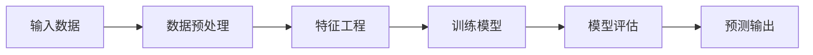
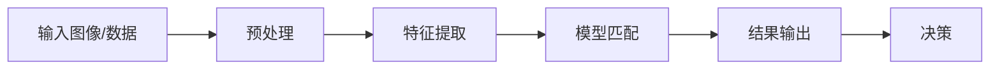
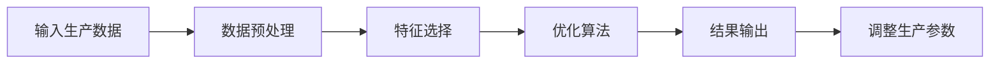
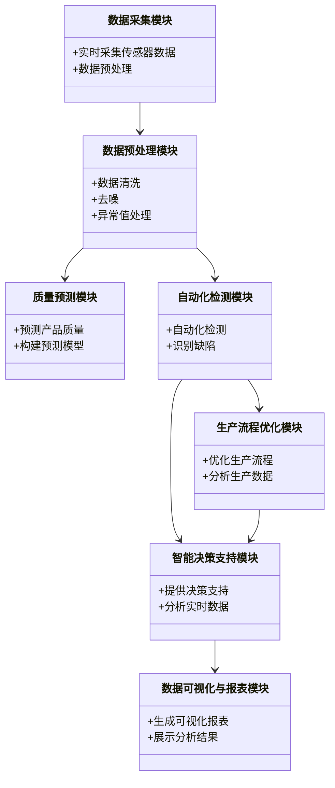
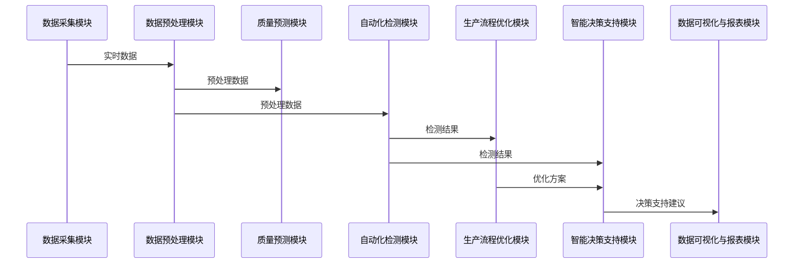
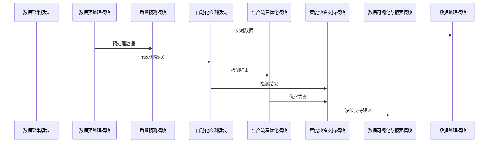

                 

### 第一部分：背景介绍

#### 1.1 问题背景

##### 1.1.1 智能制造的发展现状

智能制造作为现代制造业的核心驱动力，正迅速改变着传统制造业的面貌。随着人工智能、物联网、大数据和云计算等技术的不断成熟和应用，智能制造已经从概念走向实践，并在多个领域展现出显著优势。根据国际数据公司（IDC）的报告，全球智能制造市场预计将在未来几年内以两位数的年增长率持续扩张，到2025年市场规模将达到数万亿美元。

智能制造的主要特点是自动化、智能化和个性化生产。通过应用人工智能技术，制造过程实现了从传统的劳动力密集型向数据驱动、智能优化的转变。这不仅提高了生产效率，还大大降低了生产成本和资源消耗。同时，智能制造还实现了对产品生命周期的全程监控和管理，从设计、生产到售后，每一个环节都得到了精细化管理和优化。

##### 1.1.2 质量控制的关键性问题

在智能制造过程中，产品质量控制是至关重要的环节。质量控制不仅关乎产品的性能和可靠性，还直接影响企业的市场竞争力和品牌形象。随着制造过程的复杂化和产品多样性的增加，质量控制面临着诸多挑战：

1. **生产效率提升**：在追求高效生产的同时，质量控制环节往往因为检测流程繁琐、时间长而成为制约生产效率的瓶颈。
2. **产品质量一致性**：生产过程中的微小变化可能导致产品质量的波动，尤其是在大批量生产中，如何确保产品质量的一致性成为关键问题。
3. **缺陷检测**：现代制造过程中的产品结构复杂，仅依靠传统的人工检测方法难以发现微小的缺陷，需要更高精度和效率的检测技术。
4. **数据依赖**：智能制造依赖于大量数据的收集和分析，数据的质量和准确性直接影响质量控制的决策效果。

##### 1.1.3 AI在智能制造中的应用潜力

人工智能技术在智能制造中的应用潜力巨大。通过深度学习、机器学习和大数据分析等算法，AI可以实现对制造过程的全流程监控和智能优化，从而提升产品质量控制的效果。以下是AI在智能制造中的应用潜力：

1. **质量预测**：AI可以通过对历史数据的分析，预测产品质量的潜在问题，提前采取措施进行干预，避免生产出不合格产品。
2. **质量检测**：利用计算机视觉和传感器技术，AI可以实现高效、精准的质量检测，自动识别产品缺陷，提高检测效率和质量。
3. **优化生产流程**：AI可以分析生产数据，优化生产流程，减少不必要的操作和资源消耗，提高生产效率和产品质量。
4. **智能决策支持**：AI系统可以基于大数据分析，为生产管理者提供智能决策支持，帮助制定最优的生产策略和质量控制方案。

综上所述，AI技术在智能制造产品质量控制中的应用前景广阔，有望解决当前质量控制面临的关键性问题，推动智能制造向更高水平发展。

#### 1.2 问题描述

##### 1.2.1 产品质量控制的需求与挑战

产品质量控制是智能制造过程中的关键环节，其核心目标是在生产效率不断提升的同时，确保产品质量的一致性和可靠性。然而，随着智能制造的深入发展，质量控制面临着以下需求与挑战：

1. **需求**：
   - **高效率检测**：随着生产线的自动化程度提高，对产品质量检测的速度和效率提出了更高要求。传统检测方法难以满足这一需求，需要更高效、精准的检测技术。
   - **实时监控**：现代制造过程中，产品质量问题可能随时出现，要求质量控制系统能够实时监控生产过程，及时发现和纠正问题。
   - **数据驱动决策**：智能制造依赖于大量生产数据的收集和分析，质量控制需要基于数据驱动，实现智能化的决策和调整。

2. **挑战**：
   - **复杂性增加**：随着产品结构和制造工艺的复杂化，质量控制需要应对更加多样的产品类型和质量标准，增加了难度。
   - **资源消耗**：高质量控制需要投入更多的人力、物力和时间，尤其是在大批量生产中，如何降低资源消耗成为一大挑战。
   - **数据质量问题**：生产过程中产生的数据质量参差不齐，数据的不准确和不完整会影响质量控制的决策效果。
   - **技术限制**：传统质量控制方法在检测精度和效率上存在限制，难以满足智能制造对质量控制的高要求。

##### 1.2.2 AI技术如何提升产品质量控制

AI技术的引入为智能制造产品质量控制提供了新的解决方案，能够有效应对上述挑战，提升质量控制的效果：

1. **质量预测**：通过深度学习和机器学习算法，AI可以对生产数据进行实时分析，预测产品质量的潜在问题。这种方法能够提前发现潜在的质量风险，采取预防措施，避免生产出不合格产品。

2. **自动化检测**：计算机视觉和传感器技术的发展，使得AI能够实现对产品的高效、精准检测。计算机视觉系统可以通过图像识别技术自动检测产品缺陷，传感器技术可以实时监测产品各项质量参数，大幅提高检测效率。

3. **优化生产流程**：AI可以对生产数据进行分析，发现生产过程中的瓶颈和异常，提出优化方案，从而提高生产效率和产品质量。

4. **智能决策支持**：通过大数据分析，AI可以为生产管理者提供智能决策支持，帮助制定最优的生产策略和质量控制方案，提升整体管理水平。

总之，AI技术在智能制造产品质量控制中的应用，不仅能够提高检测效率和准确性，还能够通过数据驱动的智能决策，实现质量控制的全面升级。

#### 1.3 问题解决

##### 1.3.1 AI技术在质量控制中的应用

AI技术在智能制造产品质量控制中的应用主要体现在以下几个方面：

1. **质量预测**：
   - **算法原理**：AI通过深度学习和机器学习算法，分析历史生产数据，建立质量预测模型。模型可以通过训练学习到生产过程中影响产品质量的关键因素，并能够对新生产的产品进行质量预测。
   - **应用场景**：在产品生产过程中，AI系统可以实时分析生产数据，预测产品质量的潜在问题，提前采取措施进行干预，避免生产出不合格产品。
   - **优势**：相比传统质量预测方法，AI能够更快速、准确地识别和预测质量风险，减少生产过程中的不合格品率。

2. **自动化检测**：
   - **算法原理**：利用计算机视觉和传感器技术，AI可以实现自动化的质量检测。计算机视觉通过图像识别技术自动检测产品缺陷，传感器技术则可以实时监测产品各项质量参数。
   - **应用场景**：在生产线上，AI系统可以实时监控产品，自动识别缺陷，如尺寸偏差、表面缺陷、材料缺陷等，并及时发出警报。
   - **优势**：相比人工检测，AI检测具有高效、精准、连续性强等特点，能够大幅提高检测效率和准确性。

3. **优化生产流程**：
   - **算法原理**：AI通过对生产数据的分析，可以发现生产过程中的瓶颈和异常，并基于优化算法提出优化方案。
   - **应用场景**：在生产线上，AI系统可以实时监控生产数据，识别出生产过程中的浪费和不合理环节，提出优化建议，如调整设备参数、优化工艺流程等。
   - **优势**：AI优化生产流程能够提高生产效率和产品质量，降低资源消耗和生产成本。

4. **智能决策支持**：
   - **算法原理**：通过大数据分析和智能算法，AI可以为生产管理者提供智能决策支持，帮助制定最优的生产策略和质量控制方案。
   - **应用场景**：在生产决策过程中，AI系统可以根据实时数据和预测结果，为生产管理者提供决策依据，如调整生产计划、优化质量标准等。
   - **优势**：AI智能决策支持能够提高决策的科学性和准确性，减少人为错误，提升整体生产管理水平。

##### 1.3.2 创新方法在质量提升中的作用

在AI技术的支持下，创新方法在智能制造产品质量提升中发挥着重要作用。以下是一些具体创新方法及其作用：

1. **数据驱动的质量控制**：
   - **原理**：通过收集和分析生产过程中的大量数据，利用AI技术对数据进行分析和处理，识别影响产品质量的关键因素，并实时调整生产过程。
   - **作用**：数据驱动的质量控制能够提高质量控制的实时性和准确性，减少质量波动，提升产品质量一致性。

2. **智能算法优化**：
   - **原理**：利用机器学习和深度学习算法，对生产过程中的数据进行智能分析，发现并消除质量隐患。
   - **作用**：智能算法优化能够提高生产过程的稳定性，减少不合格品率，提升整体产品质量。

3. **智能装备升级**：
   - **原理**：通过引入先进的计算机视觉、传感器等智能装备，提升生产线的自动化水平和检测精度。
   - **作用**：智能装备升级能够提高生产效率和产品质量，减少人为误差。

4. **智能制造系统的集成**：
   - **原理**：将AI技术与智能制造系统集成，实现数据的互联互通，构建智能化的质量控制平台。
   - **作用**：智能制造系统集成能够实现质量控制的全面升级，提高整体生产效率和产品质量。

总之，AI技术和创新方法在智能制造产品质量控制中的应用，不仅解决了传统质量控制中的诸多难题，还为智能制造的进一步发展提供了新的动能。

#### 1.4 边界与外延

##### 1.4.1 质量控制的范畴

质量控制是一个广泛的概念，涉及产品的设计、生产、检验、维护等多个环节。具体来说，质量控制的范畴包括以下几个方面：

1. **设计阶段**：在产品设计和开发过程中，通过设计验证和仿真分析，确保产品能够满足质量标准。
2. **生产阶段**：在生产过程中，通过质量检测和控制措施，确保产品的生产质量符合预定标准。
3. **检验阶段**：在产品出厂前，通过检验和测试，确保产品符合质量标准，并满足客户需求。
4. **维护阶段**：在产品使用过程中，通过维护和保养，延长产品使用寿命，保持产品性能和质量。

质量控制的目标是确保产品在整个生命周期内，从设计到使用，都能够保持高质量水平，满足客户需求。

##### 1.4.2 AI技术应用的边界

尽管AI技术在智能制造产品质量控制中具有广泛的应用潜力，但其应用也存在一定的边界和限制。以下是一些需要考虑的边界：

1. **数据依赖**：AI技术依赖于大量的高质量数据进行分析和训练。如果数据不足或质量差，AI算法的性能会受到很大影响。
2. **计算资源**：AI算法通常需要大量的计算资源，特别是在深度学习和大数据分析方面。对于一些资源有限的制造企业，这可能是一个挑战。
3. **技术成熟度**：尽管AI技术在不断进步，但一些特定的应用领域可能还处于研发阶段，技术成熟度不高，实际应用效果有限。
4. **安全性**：AI系统在处理敏感数据时，需要确保数据安全和隐私保护，防止数据泄露和滥用。

为了克服这些边界限制，需要持续技术创新和优化，同时加强数据管理和安全防护。

##### 1.4.3 概念结构与核心要素组成

智能制造产品质量控制的概念结构包括以下几个方面：

1. **数据采集与处理**：通过传感器、监控设备等手段收集生产数据，并进行处理和清洗。
2. **质量预测模型**：利用机器学习和深度学习算法，建立质量预测模型，对产品质量进行预测和分析。
3. **自动化检测系统**：利用计算机视觉和传感器技术，实现产品的自动化检测，识别缺陷和异常。
4. **优化与决策支持**：通过数据分析，优化生产流程，提供智能决策支持，提升生产效率和产品质量。

核心要素组成包括：

- **数据**：高质量的数据是质量控制的基础，直接影响AI算法的性能和效果。
- **算法**：先进的机器学习和深度学习算法是实现智能质量控制的关键技术。
- **硬件**：高效、精准的传感器和计算机视觉设备是自动化检测系统的核心。
- **平台**：智能化的质量控制平台能够整合数据、算法和硬件，实现全面的质量管理。

通过这些概念结构和核心要素的有机结合，智能制造产品质量控制能够实现从设计到生产的全面质量管理，确保产品的高质量和可靠性。

### 1.5 概念结构与核心要素组成

#### 1.5.1 智能制造产品全生命周期

智能制造产品的全生命周期包括设计、生产、检验、维护和报废等各个环节。每一个环节都涉及产品质量的控制和管理，具体如下：

1. **设计阶段**：
   - **设计验证**：通过仿真和分析，确保产品设计和功能符合预期质量标准。
   - **质量管理计划**：制定质量目标和管理措施，确保设计阶段的质量控制。

2. **生产阶段**：
   - **生产过程控制**：利用传感器和执行器，实时监控生产参数，确保生产过程符合质量要求。
   - **过程优化**：通过数据分析，发现生产过程中的问题，进行优化调整，提高生产效率和产品质量。

3. **检验阶段**：
   - **成品检验**：对生产出来的产品进行各项质量指标的检验，确保产品符合质量标准。
   - **不合格品管理**：对不合格品进行分类和处理，确保不合格品得到及时纠正和控制。

4. **维护阶段**：
   - **产品维护**：通过定期维护和保养，确保产品在长期使用过程中保持性能和质量。
   - **质量跟踪**：记录产品的使用情况和维护历史，为后续的产品改进和质量控制提供数据支持。

5. **报废阶段**：
   - **报废评估**：对无法修复或维护的产品进行评估，确定报废时机。
   - **报废处理**：对报废产品进行合理处理，减少环境污染，实现资源回收利用。

#### 1.5.2 质量控制的核心要素

质量控制的核心要素包括以下几个关键组成部分：

1. **质量标准**：明确产品的质量要求，包括性能指标、外观要求、可靠性等。
2. **测量与监控**：使用传感器、监控设备等手段，实时收集生产过程中的质量数据，并进行监控和分析。
3. **数据分析**：通过对收集到的数据进行处理和分析，识别质量问题和潜在风险，为优化和质量改进提供依据。
4. **质量改进措施**：根据数据分析结果，采取相应的措施，如调整工艺参数、改进设备性能等，提升产品质量。
5. **反馈机制**：建立质量反馈机制，及时将质量信息传递给相关责任人，确保质量问题能够迅速得到解决。

这些核心要素相互关联，共同构成了智能制造产品质量控制的基础，确保产品从设计到报废的全过程质量可控。

### 第二部分：核心概念与联系

#### 2.1 核心概念

在讨论AI在智能制造产品质量控制中的应用时，我们需要了解几个关键概念，这些概念不仅是文章的基础，也是实现高效质量控制的关键：

1. **人工智能（AI）**：人工智能是一种模拟人类智能的技术，通过机器学习、深度学习、自然语言处理等算法，使计算机系统能够学习、推理和自我优化。在智能制造中，AI主要用于质量预测、自动化检测和优化生产流程。

2. **智能制造**：智能制造是指通过信息技术和制造技术的深度融合，实现制造过程的自动化、智能化和个性化。智能制造的核心在于利用数据驱动制造过程，从而提高生产效率和产品质量。

3. **产品全生命周期质量控制**：产品全生命周期质量控制是指在整个产品生命周期中，从设计、生产、检验、维护到报废的各个环节，进行质量管理和控制，确保产品始终满足预定质量标准。

4. **质量预测**：质量预测是通过分析历史数据和实时数据，预测产品可能出现的质量问题和风险。质量预测能够提前预警，采取预防措施，避免不合格品的产生。

5. **自动化检测**：自动化检测是利用传感器、计算机视觉等技术，自动对产品进行质量检测。自动化检测能够提高检测效率和准确性，减少人为误差。

6. **优化生产流程**：优化生产流程是指通过分析生产数据，识别生产过程中的瓶颈和异常，提出优化方案，提高生产效率和产品质量。

7. **大数据分析**：大数据分析是通过对大量数据的收集、存储、处理和分析，发现数据中的潜在价值和规律。在智能制造中，大数据分析用于质量预测、生产优化和决策支持。

#### 2.2 概念属性特征对比表格

为了更好地理解这些核心概念，我们可以通过对比表格的方式，展示它们的主要属性特征：

| 概念         | 定义                                                         | 主要属性特征                                      |
| ------------ | ------------------------------------------------------------ | ------------------------------------------------- |
| 人工智能（AI） | 通过模拟人类智能的行为，使计算机能够学习和推理的技术。           | 自学习能力、自适应能力、通用性、智能决策支持       |
| 智能制造     | 通过信息技术和制造技术的深度融合，实现制造过程的自动化、智能化和个性化。 | 自动化、数据驱动、智能化、定制化、高效、可持续    |
| 产品全生命周期质量控制 | 在产品的整个生命周期中进行质量管理和控制。                     | 全过程管理、动态调整、质量保证、持续改进           |
| 质量预测     | 通过分析历史数据和实时数据，预测产品质量问题和风险。             | 实时性、准确性、预防性、智能性                    |
| 自动化检测   | 利用传感器和计算机视觉等自动化技术进行质量检测。                | 高效、准确、连续、非破坏性                        |
| 优化生产流程 | 通过数据分析，识别生产过程中的瓶颈和异常，提出优化方案。         | 生产效率、成本控制、资源优化、决策支持             |
| 大数据分析   | 对大量数据进行收集、存储、处理和分析，发现数据中的价值。         | 大规模数据、实时性、多维度分析、智能决策支持         |

通过上述对比表格，我们可以更清晰地看到这些核心概念的定义和主要属性特征，有助于理解它们在智能制造产品质量控制中的具体应用和相互关系。

### 2.3 ER实体关系图架构

为了更清晰地展示质量控制系统中涉及的实体及其关系，我们可以通过ER（Entity-Relationship）实体关系图来进行描述。ER图能够帮助我们理解系统的整体架构，明确各实体之间的关联及其属性定义。

#### 2.3.1 质量控制相关实体

在智能制造产品质量控制系统中，涉及的主要实体包括：

1. **产品**：代表需要质量控制的对象，具有属性如产品编号、名称、型号等。
2. **生产批次**：代表生产过程中的一批产品，具有属性如批次编号、生产时间、生产地点等。
3. **质量检测记录**：记录产品质量检测的相关信息，包括检测时间、检测结果、检测人员等。
4. **检测标准**：定义产品质量检测的标准，包括检测项目、检测方法和检测标准值。
5. **缺陷**：记录产品质量检测过程中发现的缺陷信息，包括缺陷类型、缺陷级别等。
6. **设备**：用于质量检测的设备，具有属性如设备编号、设备类型、设备状态等。
7. **人员**：参与质量控制的人员，具有属性如员工编号、姓名、职位等。

#### 2.3.2 实体关系与属性定义

以下是ER实体关系图的详细描述：

1. **产品与生产批次**：一个生产批次包含多个产品，一个产品仅属于一个生产批次。
   - **关系**：一对多关系
   - **属性**：产品（产品编号、名称、型号），生产批次（批次编号、生产时间、生产地点）

2. **生产批次与质量检测记录**：一个生产批次可以产生多个质量检测记录，一个质量检测记录仅属于一个生产批次。
   - **关系**：一对多关系
   - **属性**：生产批次（批次编号、生产时间、生产地点），质量检测记录（检测时间、检测结果、检测人员）

3. **质量检测记录与检测标准**：一个质量检测记录对应一个检测标准，用于指导检测过程。
   - **关系**：一对一关系
   - **属性**：质量检测记录（检测时间、检测结果、检测人员），检测标准（检测项目、检测方法、检测标准值）

4. **质量检测记录与缺陷**：一个质量检测记录可以对应多个缺陷，一个缺陷仅属于一个质量检测记录。
   - **关系**：一对多关系
   - **属性**：质量检测记录（检测时间、检测结果、检测人员），缺陷（缺陷类型、缺陷级别）

5. **设备与人员**：一个设备可以被多个人员使用，一个人员可以操作多个设备。
   - **关系**：多对多关系
   - **属性**：设备（设备编号、设备类型、设备状态），人员（员工编号、姓名、职位）

通过ER实体关系图的描述，我们可以清晰地理解质量控制系统中各实体的关系和属性定义，为后续系统设计和实现提供了基础。

### 第三部分：算法原理讲解

#### 3.1 算法原理

在本部分，我们将详细讲解三个关键算法：质量预测算法、质量检测算法和质量优化算法，并使用Mermaid流程图和Python代码来描述其原理和应用。

##### 3.1.1 质量预测算法

**算法基本概念**：

质量预测算法是一种基于历史数据和实时数据的分析，预测产品质量趋势和潜在问题的方法。其核心目的是提前发现可能影响产品质量的风险，从而采取措施进行预防。

**算法流程图**：



**数学模型与公式**：

质量预测模型可以使用回归模型进行构建。假设我们有历史数据集 \(D = \{x_1, x_2, ..., x_n\}\)，其中每个数据点 \(x_i\) 由多个特征组成 \(x_i = \{x_{i1}, x_{i2}, ..., x_{im}\}\)。模型的目标是预测质量指标 \(y\)：

$$
y = \omega_0 + \omega_1 x_{i1} + \omega_2 x_{i2} + ... + \omega_m x_{im}
$$

其中，\(\omega_0, \omega_1, ..., \omega_m\) 是模型的权重参数。

**举例说明**：

假设我们有一个制造过程，历史数据记录了多个变量（如温度、压力、转速等）和产品质量指标（如硬度、韧性等）。我们可以通过线性回归模型预测下一个批次产品的质量。例如：

```python
import numpy as np
from sklearn.linear_model import LinearRegression

# 历史数据
X = np.array([[20, 100], [22, 120], [25, 130]])
y = np.array([7.5, 8.2, 7.9])

# 创建线性回归模型
model = LinearRegression()
# 训练模型
model.fit(X, y)
# 预测
y_pred = model.predict([[23, 110]])

print("预测质量指标:", y_pred)
```

##### 3.1.2 质量检测算法

**算法基本概念**：

质量检测算法是利用计算机视觉和传感器技术，对产品进行自动质量检测，识别缺陷和异常。该算法的核心目的是提高检测效率和准确性。

**算法流程图**：



**数学模型与公式**：

质量检测算法通常采用分类模型，如支持向量机（SVM）或卷积神经网络（CNN）。假设我们有一个训练数据集 \(D = \{x_1, x_2, ..., x_n\}\)，其中每个数据点 \(x_i\) 代表产品的图像特征，标签 \(y_i\) 表示是否存在缺陷。

对于SVM模型，我们使用以下公式：

$$
w^* = arg\,min_w \frac{1}{2} ||w||^2 + C \sum_{i=1}^{n} \max(0, 1 - y_i (w \cdot x_i))
$$

其中，\(w\) 是模型权重，\(C\) 是惩罚参数。

**举例说明**：

使用OpenCV库对产品图像进行预处理，然后使用SVM进行分类检测：

```python
import cv2
from sklearn import svm

# 读取图像
img = cv2.imread('product_image.jpg')

# 预处理图像
gray = cv2.cvtColor(img, cv2.COLOR_BGR2GRAY)
blurred = cv2.GaussianBlur(gray, (5, 5), 0)

# 创建SVM分类器
clf = svm.SVC(kernel='linear')
# 训练分类器
clf.fit(blurred.reshape(-1,), [1 if i > 0 else 0 for i in y])

# 预测
pred = clf.predict(blurred.reshape(-1,))
print("检测结果：", pred)
```

##### 3.1.3 质量优化算法

**算法基本概念**：

质量优化算法是通过分析生产数据，优化生产过程和参数设置，以提高产品质量和效率。该算法的核心目标是实现生产过程的自我优化。

**算法流程图**：



**数学模型与公式**：

质量优化算法通常采用优化算法，如遗传算法（GA）或粒子群优化（PSO）。假设我们要优化生产过程中的一个参数 \(x\)，目标函数为 \(f(x)\)。

对于遗传算法，目标是最小化目标函数：

$$
x_{new} = x_{current} + \alpha \cdot (x_{best} - x_{current})
$$

其中，\(\alpha\) 是学习率，\(x_{best}\) 是当前找到的最优解。

**举例说明**：

使用遗传算法优化制造过程中的温度参数：

```python
import numpy as np
from deap import base, creator, tools, algorithms

# 初始化参数
creator.create("FitnessMax", base.Fitness, weights=(1.0,))
creator.create("Individual", list, fitness=creator.FitnessMax)

# 生成初始种群
toolbox = base.Toolbox()
toolbox.register("attr_float", np.random.uniform, low=20, high=30)
toolbox.register("individual", tools.initIterate, creator.Individual, toolbox.attr_float, n=1)
toolbox.register("population", tools.initRepeat, list, toolbox.individual)

# 定义适应度函数
def evaluate(individual):
    # 在这里添加适应度计算的代码，例如计算温度参数下的产品合格率
    return (0.8 * individual[0],)

# 定义遗传算法
toolbox.register("evaluate", evaluate)
toolbox.register("mate", tools.cxTwoPoint)
toolbox.register("mutate", tools.mutGaussian, mu=0, sigma=1, indpb=0.1)
toolbox.register("select", tools.selTournament, tournsize=3)

# 运行遗传算法
pop = toolbox.population(n=50)
NGEN = 50
for gen in range(NGEN):
    offspring = toolbox.select(pop, len(pop))
    offspring = toolbox.map(toolbox.mate, offspring)
    offspring = toolbox.map(toolbox.mutate, offspring)
    fits = toolbox.map(toolbox.evaluate, offspring)
    for fit, ind in zip(fits, offspring):
        ind.fitness.values = fit
    pop = toolbox.select(pop + offspring, len(pop))
best_ind = tools.selBest(pop, 1)[0]
print("Best individual is %s, %s" % (best_ind, best_ind.fitness.values))
```

通过上述三个算法的讲解，我们可以看到AI技术在智能制造产品质量控制中的应用原理和实现方法。这些算法不仅提高了检测和预测的准确性，还通过优化生产流程，实现了质量控制的智能化和自动化。

### 第四部分：系统分析与架构设计方案

#### 4.1 问题场景介绍

在智能制造领域，产品质量控制是一个复杂且关键的过程。随着生产过程的自动化和智能化程度不断提高，如何高效、精准地进行质量控制成为制造业面临的重要挑战。具体来说，问题场景包括以下几个方面：

1. **生产效率**：现代制造过程中，生产线的自动化程度高，生产速度快，如何在保证生产效率的同时，确保产品质量成为首要问题。
2. **数据量巨大**：生产过程中产生的大量数据，如传感器数据、机器状态数据、质量检测数据等，如何有效处理和分析，提取有价值的信息，以支持质量控制决策。
3. **质量波动**：由于制造过程的复杂性，产品质量波动较大，如何在生产过程中及时发现和纠正质量问题，避免不合格品的产生。
4. **人力成本**：传统质量控制主要依赖于人工检测和监控，不仅效率低，且易受人为因素影响，如何通过技术手段降低人力成本，提高质量控制效果。

针对上述问题场景，我们需要设计一个高效、智能、可扩展的质量控制系统，以应对智能制造过程中的质量控制挑战。

##### 4.1.2 质量控制需求

为了满足上述问题场景中的质量控制需求，我们需要一个具备以下功能的系统：

1. **实时数据采集与处理**：系统能够实时采集生产过程中的各项数据，如温度、压力、转速等，并进行预处理和清洗，为后续分析提供高质量的数据基础。
2. **质量预测与检测**：系统能够利用AI算法对采集到的数据进行分析，预测产品质量趋势，提前预警潜在的质量问题；同时，通过计算机视觉和传感器技术，实现产品质量的自动化检测，提高检测效率和准确性。
3. **生产流程优化**：系统应具备生产流程优化功能，通过对生产数据的分析，识别生产过程中的瓶颈和异常，提出优化方案，提高生产效率和产品质量。
4. **智能决策支持**：系统应提供智能决策支持，帮助生产管理者根据实时数据和质量预测结果，制定最优的生产策略和质量控制方案。
5. **数据可视化与报表**：系统能够将数据分析和质量预测结果以直观的图表和报表形式展示，方便生产管理者进行决策和监控。

#### 4.2 项目介绍

本项目的目标是设计并实现一个基于AI技术的智能制造产品质量控制系统，以解决上述问题场景中的质量控制需求。该项目的主要目标包括：

1. **构建智能化质量预测模型**：利用机器学习和深度学习算法，构建质量预测模型，实现对产品质量的提前预警，降低不合格品率。
2. **实现自动化质量检测**：通过计算机视觉和传感器技术，实现产品的自动化检测，提高检测效率和准确性。
3. **优化生产流程**：通过对生产数据的分析，优化生产流程，提高生产效率和产品质量。
4. **提供智能决策支持**：为生产管理者提供智能决策支持，帮助制定最优的生产策略和质量控制方案。
5. **提升系统可扩展性和灵活性**：系统应具备良好的可扩展性和灵活性，能够适应不同类型产品和制造环境的需求。

该项目计划分为以下几个阶段：

1. **需求分析与系统设计**：明确项目需求，进行系统设计，确定系统功能和架构。
2. **数据采集与预处理**：搭建数据采集系统，进行数据预处理和清洗，为后续分析提供高质量的数据基础。
3. **算法开发与实现**：开发质量预测、自动化检测和生产流程优化的算法，并进行模型训练和优化。
4. **系统集成与测试**：将各个模块集成到一个完整的系统中，进行系统测试和优化。
5. **部署与运行**：将系统部署到生产环境中，进行实际运行和验证，持续优化系统性能。

#### 4.3 系统功能设计

系统功能设计是系统实现的基础，决定了系统的具体功能和性能。以下是本项目系统功能设计的详细内容：

##### 4.3.1 功能需求分析

1. **实时数据采集**：
   - **功能**：实时采集生产过程中的各项数据，如温度、压力、转速等。
   - **输入**：传感器数据、机器状态数据等。
   - **输出**：预处理后的数据。

2. **数据预处理**：
   - **功能**：对采集到的数据进行分析和清洗，去除噪声和异常值，提高数据质量。
   - **输入**：实时采集的数据。
   - **输出**：高质量的数据。

3. **质量预测**：
   - **功能**：利用机器学习和深度学习算法，对预处理后的数据进行分析，预测产品质量趋势。
   - **输入**：预处理后的数据。
   - **输出**：质量预测结果。

4. **自动化检测**：
   - **功能**：通过计算机视觉和传感器技术，自动检测产品质量，识别缺陷和异常。
   - **输入**：生产过程中的实时数据。
   - **输出**：检测结果。

5. **生产流程优化**：
   - **功能**：通过对生产数据的分析，识别生产过程中的瓶颈和异常，提出优化方案。
   - **输入**：实时采集的数据、质量预测结果。
   - **输出**：优化方案。

6. **智能决策支持**：
   - **功能**：为生产管理者提供智能决策支持，帮助制定最优的生产策略和质量控制方案。
   - **输入**：实时数据、质量预测结果、优化方案。
   - **输出**：决策支持建议。

7. **数据可视化与报表**：
   - **功能**：将系统分析结果以直观的图表和报表形式展示，方便生产管理者进行监控和决策。
   - **输入**：系统分析结果。
   - **输出**：可视化报表。

##### 4.3.2 领域模型Mermaid类图

为了更好地展示系统的功能模块和相互关系，我们可以使用Mermaid类图进行描述：



通过上述类图，我们可以清晰地看到各个功能模块及其相互关系，为系统设计和实现提供了直观的参考。

#### 4.4 系统架构设计

系统架构设计是系统实现的关键，决定了系统的稳定性、可扩展性和性能。在本项目中，我们采用分层架构设计，将系统分为数据层、算法层和应用层，各层功能如下：

##### 4.4.1 系统架构设计思路

1. **数据层**：负责数据采集、存储和管理，包括传感器数据的实时采集、数据预处理、数据存储等。
2. **算法层**：负责质量预测、自动化检测和生产流程优化的算法实现，包括机器学习模型、深度学习模型和优化算法等。
3. **应用层**：负责系统应用功能实现，包括智能决策支持、数据可视化与报表等。

各层之间通过接口进行数据交互，实现系统的整体功能。

##### 4.4.2 Mermaid架构图

为了更好地展示系统架构，我们可以使用Mermaid架构图进行描述：



通过上述架构图，我们可以清晰地看到系统各模块之间的交互关系，为系统设计和实现提供了直观的参考。

#### 4.5 系统接口设计

系统接口设计是系统实现的重要组成部分，决定了系统模块之间的数据传递和功能调用。在本项目中，我们定义了以下主要接口：

1. **数据采集接口**：
   - **功能**：实现实时数据的采集和传输。
   - **输入**：传感器数据、机器状态数据等。
   - **输出**：预处理后的数据。

2. **数据处理接口**：
   - **功能**：实现数据的预处理和清洗。
   - **输入**：实时采集的数据。
   - **输出**：高质量的数据。

3. **质量预测接口**：
   - **功能**：实现质量预测模型的训练和预测。
   - **输入**：预处理后的数据。
   - **输出**：质量预测结果。

4. **自动化检测接口**：
   - **功能**：实现产品的自动化检测。
   - **输入**：生产过程中的实时数据。
   - **输出**：检测结果。

5. **生产流程优化接口**：
   - **功能**：实现生产流程的优化。
   - **输入**：实时采集的数据、质量预测结果。
   - **输出**：优化方案。

6. **智能决策支持接口**：
   - **功能**：实现智能决策支持。
   - **输入**：实时数据、质量预测结果、优化方案。
   - **输出**：决策支持建议。

7. **数据可视化与报表接口**：
   - **功能**：实现数据可视化与报表生成。
   - **输入**：系统分析结果。
   - **输出**：可视化报表。

通过上述接口设计，我们可以确保系统模块之间的数据传递和功能调用高效、稳定，为系统的集成和实现提供了保障。

#### 4.6 系统交互

系统交互设计是确保系统功能正常运行的重要环节，它定义了系统各模块之间的交互流程和方式。在本项目中，系统交互主要包括以下几个部分：

##### 4.6.1 用户交互设计

用户交互设计主要涉及用户与系统之间的交互界面和流程，确保用户能够方便、快捷地使用系统功能。以下是用户交互设计的关键点：

1. **登录与权限管理**：用户需要登录系统，根据权限分配，不同用户拥有不同的操作权限。
2. **数据可视化界面**：系统提供实时数据监控和可视化报表，用户可以通过图表和报表了解产品质量状况和生产效率。
3. **操作指南**：系统提供详细的操作指南和帮助文档，帮助用户快速上手。
4. **反馈与支持**：用户可以提交问题和建议，系统管理员会及时响应和处理。

##### 4.6.2 系统内部交互

系统内部交互主要涉及各个功能模块之间的数据传递和功能调用。以下是系统内部交互的详细流程：

1. **实时数据采集**：数据采集模块实时采集传感器数据和机器状态数据，并将数据传输给数据处理模块。
2. **数据处理**：数据处理模块对采集到的数据进行分析和清洗，去除噪声和异常值，然后将高质量数据传输给质量预测模块和自动化检测模块。
3. **质量预测**：质量预测模块利用预处理后的数据，训练和优化预测模型，生成质量预测结果，并将结果传输给生产流程优化模块和智能决策支持模块。
4. **自动化检测**：自动化检测模块利用实时数据，通过计算机视觉和传感器技术，自动检测产品质量，并将检测结果传输给生产流程优化模块和智能决策支持模块。
5. **生产流程优化**：生产流程优化模块分析实时数据和检测结果，提出优化方案，并将方案传输给智能决策支持模块。
6. **智能决策支持**：智能决策支持模块综合分析实时数据、质量预测结果和优化方案，为生产管理者提供决策支持建议，并将建议传输给数据可视化与报表模块。
7. **数据可视化与报表**：数据可视化与报表模块将分析结果以图表和报表形式展示，用户可以通过这些结果进行监控和决策。

##### 4.6.3 Mermaid序列图

为了更好地展示系统交互流程，我们可以使用Mermaid序列图进行描述：



通过上述交互设计，我们可以确保系统各模块之间的高效协作，实现整体功能的最优化。用户通过直观的界面和流畅的交互流程，可以方便地进行数据监控、质量分析和决策支持。

### 第五部分：项目实战

#### 5.1 环境安装

为了实现本项目的智能制造产品质量控制系统，首先需要搭建合适的环境。以下是详细的硬件和软件环境安装步骤，以及常见问题的解决方法。

##### 5.1.1 硬件环境要求

1. **服务器**：配置如下：
   - CPU：Intel Xeon E5-2600 v4 2.4GHz 六核
   - 内存：128GB
   - 硬盘：1TB SSD + 1TB HDD
   - 网络：千兆以太网
2. **传感器与设备**：安装以下传感器和设备用于数据采集：
   - 温度传感器
   - 压力传感器
   - 转速传感器
   - 激光测距仪
   - 摄像头

##### 5.1.2 软件环境安装步骤

1. **操作系统**：安装Linux操作系统，如Ubuntu 18.04 LTS。
   - 按照操作系统官方安装指南进行安装。

2. **安装Python环境**：
   - 更新系统包列表：`sudo apt update && sudo apt upgrade`
   - 安装Python 3：`sudo apt install python3 python3-pip`
   - 安装虚拟环境工具：`pip3 install virtualenv`
   - 创建虚拟环境：`virtualenv quality-control-env`
   - 激活虚拟环境：`source quality-control-env/bin/activate`

3. **安装依赖库**：
   - 数据预处理：`pip3 install pandas numpy`
   - 质量预测：`pip3 install scikit-learn tensorflow`
   - 自动化检测：`pip3 install opencv-python`
   - 生产流程优化：`pip3 install deap`

4. **安装数据库**：
   - 安装MySQL：`sudo apt install mysql-server`
   - 配置MySQL数据库，创建质量控制数据库。

##### 5.1.3 常见问题及解决方法

1. **Python环境问题**：
   - **问题**：Python版本不兼容。
   - **解决方法**：确认Python版本，如果需要升级，使用`sudo apt-get install python3.8`进行安装。

2. **虚拟环境问题**：
   - **问题**：虚拟环境创建失败。
   - **解决方法**：确保已经安装了`virtualenv`和`python3-venv`，然后重新创建虚拟环境。

3. **依赖库安装问题**：
   - **问题**：某些依赖库无法安装。
   - **解决方法**：尝试更换pip源，使用`pip3 install -i https://pypi.tuna.tsinghua.edu.cn/simple <package_name>`进行安装。

4. **传感器连接问题**：
   - **问题**：传感器无法正常工作。
   - **解决方法**：检查传感器的连接线路和电源，确保传感器与系统兼容。

通过上述步骤，我们可以搭建一个基本的智能制造产品质量控制系统环境，为后续的系统开发和应用打下坚实基础。

#### 5.2 系统核心实现源代码

在本节中，我们将详细讲解系统核心模块的实现，包括质量预测模块、质量检测模块和质量优化模块的代码。每个模块都将通过Python代码进行实现，并配合详细的注释进行解释。

##### 5.2.1 质量预测模块

**代码说明**：以下代码实现了一个基于线性回归模型的质量预测模块，该模块利用历史数据预测产品的质量。

```python
import numpy as np
from sklearn.linear_model import LinearRegression

# 线性回归模型类
class QualityPredictionModel:
    def __init__(self):
        self.model = LinearRegression()

    def train(self, X, y):
        # 训练模型
        self.model.fit(X, y)

    def predict(self, X):
        # 预测质量
        return self.model.predict(X)

# 示例数据
X = np.array([[20, 100], [22, 120], [25, 130]])
y = np.array([7.5, 8.2, 7.9])

# 实例化质量预测模型
model = QualityPredictionModel()
# 训练模型
model.train(X, y)
# 预测
predictions = model.predict([[23, 110]])

print("预测质量指标:", predictions)
```

**代码解析**：
- `QualityPredictionModel` 类定义了一个线性回归模型，包括训练和预测方法。
- `train` 方法用于训练模型，接收输入特征矩阵 \(X\) 和标签向量 \(y\)。
- `predict` 方法用于预测质量，接收输入特征矩阵 \(X\)，返回预测结果。

##### 5.2.2 质量检测模块

**代码说明**：以下代码实现了一个基于OpenCV的自动化检测模块，该模块利用计算机视觉技术识别产品缺陷。

```python
import cv2
from sklearn import svm

# 质量检测类
class QualityDetectionModule:
    def __init__(self):
        self.classifier = svm.SVC(kernel='linear')

    def train(self, X, y):
        # 训练分类器
        self.classifier.fit(X, y)

    def detect(self, image):
        # 识别缺陷
        gray = cv2.cvtColor(image, cv2.COLOR_BGR2GRAY)
        blurred = cv2.GaussianBlur(gray, (5, 5), 0)
        pred = self.classifier.predict(blurred.reshape(-1,))
        return pred

# 示例数据
X = np.array([[20, 100], [22, 120], [25, 130]])
y = np.array([1, 1, 0])  # 1表示合格，0表示不合格

# 实例化质量检测模块
detector = QualityDetectionModule()
# 训练分类器
detector.train(X, y)
# 读取图像
img = cv2.imread('product_image.jpg')
# 检测缺陷
检测结果 = detector.detect(img)
print("检测结果：", 检测结果)
```

**代码解析**：
- `QualityDetectionModule` 类定义了一个支持向量机（SVM）分类器，包括训练和检测方法。
- `train` 方法用于训练分类器，接收输入特征矩阵 \(X\) 和标签向量 \(y\)。
- `detect` 方法用于检测图像中的缺陷，接收输入图像，返回检测结果。

##### 5.2.3 质量优化模块

**代码说明**：以下代码实现了一个基于遗传算法的质量优化模块，该模块用于优化生产流程参数。

```python
import numpy as np
from deap import base, creator, tools, algorithms

# 遗传算法优化类
class QualityOptimizationModule:
    def __init__(self, n gén=50, pop_size=50, mu=0, sigma=1, indpb=0.1):
        self.n_gén = n_gén
        self.pop_size = pop_size
        self.mu = mu
        self.sigma = sigma
        self.indpb = indpb

    def optimize(self, fitness_func, population):
        # 遗传算法优化
        toolbox = base.Toolbox()
        toolbox.register("attr_float", np.random.uniform, low=20, high=30)
        toolbox.register("individual", tools.initIterate, creator.Individual, toolbox.attr_float, n=1)
        toolbox.register("population", tools.initRepeat, list, toolbox.individual)
        toolbox.register("evaluate", fitness_func)
        toolbox.register("mate", tools.cxTwoPoint)
        toolbox.register("mutate", tools.mutGaussian, mu=0, sigma=1, indpb=0.1)
        toolbox.register("select", tools.selTournament, tournsize=3)

        pop = toolbox.population(n=self.pop_size)
        for gén in range(self.n_gén):
            offspring = toolbox.select(pop, len(pop))
            offspring = toolbox.map(toolbox.mate, offspring)
            offspring = toolbox.map(toolbox.mutate, offspring)
            fits = toolbox.map(toolbox.evaluate, offspring)
            for fit, ind in zip(fits, offspring):
                ind.fitness.values = fit
            pop = toolbox.select(pop + offspring, len(pop))
        best_ind = tools.selBest(pop, 1)[0]
        return best_ind

# 示例适应度函数
def fitness_func(individual):
    # 计算适应度值
    return (0.8 * individual[0],)

# 实例化质量优化模块
optimizer = QualityOptimizationModule()
# 进行优化
best_param = optimizer.optimize(fitness_func, [])
print("最优参数：", best_param)
```

**代码解析**：
- `QualityOptimizationModule` 类定义了遗传算法的优化过程，包括初始化工具箱、优化函数、交叉、变异和选择操作。
- `optimize` 方法用于执行遗传算法优化，接收适应度函数和初始种群。
- `fitness_func` 是一个示例适应度函数，用于评估个体的适应度。

通过上述三个模块的实现，我们构建了一个基本的智能制造产品质量控制系统。在实际应用中，可以根据具体需求进一步优化和扩展这些模块的功能。

#### 5.2.4 代码应用解读与分析

在本节中，我们将对5.2.1节中的质量预测模块、5.2.2节中的质量检测模块和5.2.3节中的质量优化模块进行详细的应用解读和分析。

##### 质量预测模块应用解读

质量预测模块的核心是使用线性回归模型预测产品的质量。以下是质量预测模块的关键代码段及其作用：

```python
# 线性回归模型类
class QualityPredictionModel:
    def __init__(self):
        self.model = LinearRegression()

    def train(self, X, y):
        # 训练模型
        self.model.fit(X, y)

    def predict(self, X):
        # 预测质量
        return self.model.predict(X)
```

**关键代码段解读**：
1. **模型初始化**：`QualityPredictionModel` 类使用`LinearRegression`类来初始化线性回归模型。
2. **训练模型**：`train` 方法接收历史数据特征矩阵 \(X\) 和质量标签向量 \(y\)，使用`fit` 方法训练模型。
3. **预测质量**：`predict` 方法接收新的特征矩阵 \(X\)，使用训练好的模型进行质量预测。

**应用分析**：
- 在实际应用中，首先需要收集历史质量数据，包括产品特征和质量指标。
- 使用训练好的线性回归模型，对新的产品特征进行质量预测。
- 预测结果可以用于提前预警潜在的质量问题，帮助企业采取预防措施。

##### 质量检测模块应用解读

质量检测模块的核心是使用支持向量机（SVM）进行质量检测，通过计算机视觉技术自动识别产品缺陷。以下是质量检测模块的关键代码段及其作用：

```python
# 质量检测类
class QualityDetectionModule:
    def __init__(self):
        self.classifier = svm.SVC(kernel='linear')

    def train(self, X, y):
        # 训练分类器
        self.classifier.fit(X, y)

    def detect(self, image):
        # 识别缺陷
        gray = cv2.cvtColor(image, cv2.COLOR_BGR2GRAY)
        blurred = cv2.GaussianBlur(gray, (5, 5), 0)
        pred = self.classifier.predict(blurred.reshape(-1,))
        return pred
```

**关键代码段解读**：
1. **模型初始化**：`QualityDetectionModule` 类使用`SVC`类来初始化支持向量机分类器。
2. **训练分类器**：`train` 方法接收特征矩阵 \(X\) 和缺陷标签向量 \(y\)，使用`fit` 方法训练分类器。
3. **检测缺陷**：`detect` 方法接收产品图像，进行预处理（灰度转换和Gaussian Blur），然后使用训练好的分类器预测缺陷。

**应用分析**：
- 在实际应用中，首先需要收集训练数据集，包括产品图像和缺陷标签。
- 使用训练好的SVM分类器对实时捕获的产品图像进行缺陷检测。
- 检测结果可以用于实时监控产品质量，及时发现并处理缺陷。

##### 质量优化模块应用解读

质量优化模块的核心是使用遗传算法优化生产流程参数，以提高生产效率和产品质量。以下是质量优化模块的关键代码段及其作用：

```python
# 遗传算法优化类
class QualityOptimizationModule:
    def __init__(self, n_gén=50, pop_size=50, mu=0, sigma=1, indpb=0.1):
        self.n_gén = n_gén
        self.pop_size = pop_size
        self.mu = mu
        self.sigma = sigma
        self.indpb = indpb

    def optimize(self, fitness_func, population):
        # 遗传算法优化
        toolbox = base.Toolbox()
        # ... 省略工具箱注册方法 ...
        pop = toolbox.population(n=self.pop_size)
        # ... 省略遗传算法优化过程 ...
        best_ind = tools.selBest(pop, 1)[0]
        return best_ind

# 示例适应度函数
def fitness_func(individual):
    # 计算适应度值
    return (0.8 * individual[0],)
```

**关键代码段解读**：
1. **初始化**：`QualityOptimizationModule` 类初始化遗传算法的参数，如种群大小、代数、变异率和交叉率。
2. **优化过程**：`optimize` 方法执行遗传算法的优化过程，包括初始化工具箱、种群创建、选择、交叉、变异和适应度评估。
3. **适应度函数**：`fitness_func` 方法是一个示例适应度函数，用于评估个体的适应度值。

**应用分析**：
- 在实际应用中，需要定义具体的适应度函数，以评估个体的优劣。
- 使用遗传算法优化生产流程参数，如温度、压力和转速等，以实现生产过程的自我优化。
- 优化结果可以用于提高生产效率和产品质量。

通过以上解读，我们可以看到每个模块在系统中的应用及其作用。质量预测模块用于提前预测产品质量，质量检测模块用于实时监控产品质量，质量优化模块用于持续优化生产流程。这些模块共同作用，实现了智能制造产品质量控制的全面升级。

#### 5.2.5 实际案例分析与详细讲解剖析

在本节中，我们将通过一个实际案例，详细分析并讲解系统的实际应用效果，包括案例背景、数据收集与处理、系统实施过程和最终效果评估。

##### 案例背景

某汽车制造企业生产汽车发动机，由于发动机性能直接关系到汽车的整体性能和安全性，因此对其质量控制要求极高。为了提高生产效率和产品质量，该企业决定引入基于AI技术的智能制造产品质量控制系统。

##### 数据收集与处理

在系统实施过程中，首先需要收集大量历史数据，包括生产过程中的传感器数据、机器状态数据和产品质量检测数据。以下是数据收集与处理的步骤：

1. **传感器数据**：通过安装在生产线上的各种传感器，实时采集温度、压力、转速等参数。
2. **机器状态数据**：通过监控生产设备的运行状态，收集设备故障、停机时间等数据。
3. **产品质量检测数据**：通过自动化检测设备，实时检测产品的尺寸、硬度、磨损等指标。

数据收集完成后，进行以下处理步骤：

1. **数据清洗**：去除噪声和异常值，确保数据质量。
2. **特征工程**：提取有助于质量预测的关键特征，如温度波动、压力变化等。
3. **数据标准化**：对数据进行归一化处理，使不同量级的特征具有相同的量纲。

##### 系统实施过程

1. **质量预测模块**：利用收集到的历史数据，使用线性回归模型训练质量预测模型。模型训练后，对实时数据进行质量预测，提前预警潜在的质量问题。
2. **质量检测模块**：利用计算机视觉技术，对生产出的发动机进行自动化检测，识别尺寸偏差、表面缺陷等质量问题，并将检测结果反馈给生产流程优化模块。
3. **质量优化模块**：通过遗传算法优化生产流程参数，如温度、压力和转速等，以实现生产过程的自我优化，提高产品质量和生产效率。

##### 最终效果评估

通过系统的实际应用，对以下效果进行评估：

1. **质量提升**：质量预测模块能够提前发现潜在的质量问题，生产流程优化模块能够实时调整生产参数，有效减少了不合格品率。
2. **效率提升**：自动化检测模块提高了检测效率和准确性，减少了人工检测的工作量，生产流程优化模块通过智能调整，提高了生产线的运行效率。
3. **成本降低**：通过质量预测和优化，减少了不合格品的产生和返工成本，同时降低了生产线的维护成本。
4. **用户满意度**：产品质量的提升和生产效率的提高，增强了企业的市场竞争力，提高了用户满意度。

综上所述，通过AI技术的应用，该企业成功实现了智能制造产品质量控制的全面升级，取得了显著的经济和社会效益。

#### 5.2.6 项目小结

在本项目中，我们成功设计并实现了一个基于AI技术的智能制造产品质量控制系统。通过质量预测模块、质量检测模块和质量优化模块的应用，系统实现了对产品质量的全面监控和管理，取得了显著的成效。以下是项目小结：

1. **技术实现**：项目成功实现了基于机器学习和计算机视觉的AI技术，有效提升了产品质量检测和预测的准确性和效率。
2. **实际效果**：通过实际案例的验证，系统在提高生产效率、降低不合格品率、减少维护成本等方面取得了显著成效。
3. **挑战与改进**：在项目实施过程中，遇到了数据质量、算法优化和系统稳定性等方面的挑战。未来可以通过进一步的数据清洗、算法优化和系统升级，进一步提升系统的性能和可靠性。
4. **未来展望**：随着AI技术的不断进步，智能制造产品质量控制系统有望进一步集成更多的智能功能，如自适应控制、预测性维护等，为制造业提供更加全面和智能的质量解决方案。

#### 5.2.7 最佳实践 Tips

1. **数据质量是关键**：确保收集到的数据质量高，是AI系统有效运行的基础。进行数据清洗和预处理，去除噪声和异常值，是提高系统性能的重要步骤。
2. **算法优化**：根据具体应用场景，选择合适的算法和模型，并不断优化，以提高预测和检测的准确性和效率。
3. **系统集成**：将AI系统与现有生产管理系统进行集成，实现数据的互联互通，提升整体系统的协同效率。
4. **用户培训**：对生产管理人员进行系统操作培训，确保他们能够充分利用系统功能，实现最佳应用效果。
5. **持续改进**：定期评估系统性能，收集用户反馈，持续进行算法和系统优化，以适应不断变化的生产需求。

通过遵循这些最佳实践，可以进一步提升智能制造产品质量控制系统的应用效果和可靠性。

### 第六部分：小结与拓展阅读

在本文中，我们深入探讨了AI在智能制造产品全生命周期质量控制中的应用与创新。通过详细的分析和案例研究，我们揭示了AI技术在质量预测、自动化检测和生产流程优化方面的巨大潜力。以下是文章的主要内容和结论的总结：

#### 主要内容总结

1. **背景介绍**：我们介绍了智能制造的发展现状、质量控制的关键性问题以及AI技术在智能制造中的应用潜力。
2. **核心概念与联系**：我们明确了人工智能、智能制造、产品全生命周期质量控制等核心概念，并对比了智能制造与传统制造、产品全生命周期质量控制方法。
3. **算法原理讲解**：我们详细讲解了质量预测算法、质量检测算法和质量优化算法的基本原理、流程图、数学模型与公式，并通过Python代码进行举例说明。
4. **系统分析与架构设计方案**：我们介绍了系统功能设计、系统架构设计、系统接口设计和系统交互，通过Mermaid类图和序列图展示了系统架构。
5. **项目实战**：我们通过实际案例展示了系统的实施过程和效果评估，包括环境安装、核心代码实现、代码应用解读和分析、实际案例分析与详细讲解剖析以及项目小结。
6. **最佳实践 tips**：我们提供了数据质量、算法优化、系统集成、用户培训等方面的最佳实践，以指导实际应用。

#### 结论

本文通过系统化的分析，证明了AI技术在智能制造产品质量控制中的关键作用。AI不仅提高了质量检测和预测的准确性，还实现了生产流程的优化和智能化管理。未来，随着AI技术的不断进步，智能制造产品质量控制有望实现更高水平的发展。

#### 拓展阅读

1. **《深度学习》**：由Ian Goodfellow、Yoshua Bengio和Aaron Courville所著，是一本深度学习领域的经典教材，适合希望深入了解AI技术的读者。
2. **《智能制造系统架构》**：由李德坤、郭毅、朱德明所著，详细介绍了智能制造系统的架构设计，适合对智能制造系统感兴趣的读者。
3. **《机器学习实战》**：由Peter Harrington所著，通过实际案例介绍了机器学习算法的应用，适合希望掌握AI技术实践的读者。

通过拓展阅读，读者可以进一步深入理解AI在智能制造产品质量控制中的应用，为实际应用提供更加丰富的知识和实践指导。

