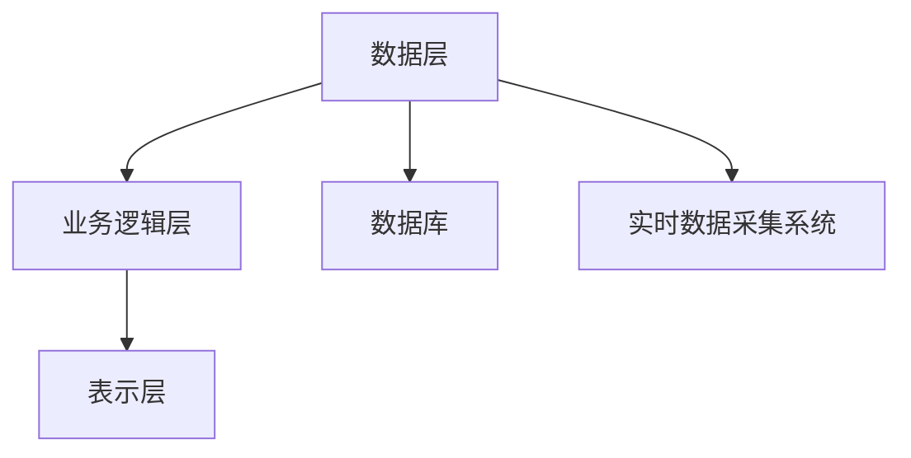
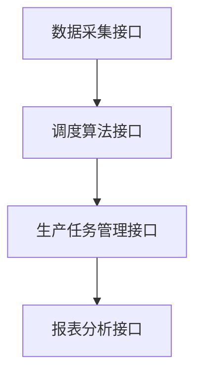
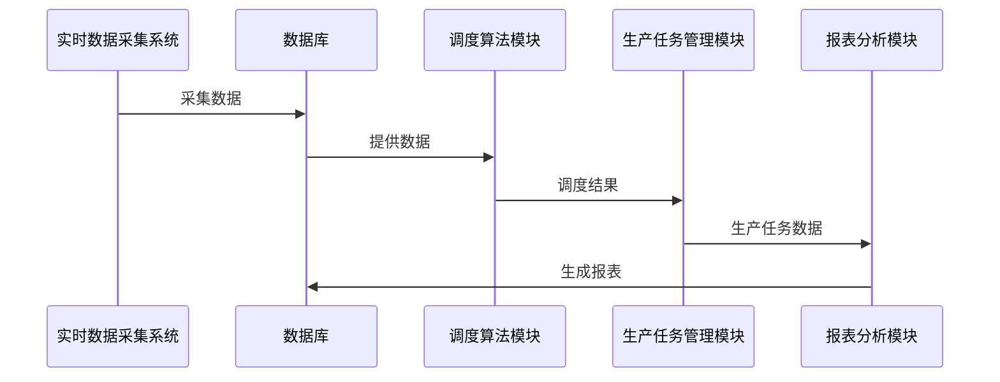

                 

### 引言

在当前全球化经济和科技的快速发展背景下，制造业正面临着前所未有的机遇和挑战。智能制造业作为现代制造业的核心方向，正逐步从传统模式向高度自动化、数字化、网络化和智能化转变。柔性生产线作为智能制造业的重要组成部分，能够灵活适应不同产品的生产需求，从而大大提高生产效率和降低成本。而在这其中，调度问题成为了一个关键瓶颈。

柔性生产线的调度问题，即如何合理安排生产任务，使得生产线能够在最优的时间内完成生产任务，并且满足各种资源约束和目标要求。调度问题具有高度的复杂性和不确定性，不仅涉及到生产节拍、设备能力、人员安排等多个方面，还需要应对市场需求的变化、原材料供应的不稳定性等因素。

人工智能（AI）技术作为一种强大的计算工具，具有自我学习、自我优化和自适应的能力，能够为柔性生产线的调度问题提供创新的解决方案。通过AI技术的引入，可以实现生产任务的自动分配、动态调整和实时优化，从而提高生产效率、降低成本、提升产品质量。

本文将系统地探讨AI在智能制造柔性生产线调度中的应用与创新。首先，我们将介绍智能制造和柔性生产线的基本概念，并阐述调度问题的重要性。接着，我们将简要回顾AI的基本概念和发展历程，以及AI在智能制造中的应用现状。随后，我们将详细介绍柔性生产线的核心概念与调度问题的数学模型，并探讨AI在调度问题中的应用。文章的最后一部分将深入讲解一种新的调度算法的原理，并通过具体示例进行分析。

通过本文的探讨，我们希望能够为智能制造业中的柔性生产线调度问题提供有价值的思路和解决方案，推动智能制造的进一步发展。

### 第一部分：背景介绍

#### 第1章 问题背景与核心概念

##### 1.1 问题背景

**1.1.1 智能制造的发展与挑战**

**1.1.1.1 智能制造的概念**

智能制造（Intelligent Manufacturing）是指利用现代信息技术、人工智能、自动化技术等先进技术，实现制造过程的智能化、自动化、高效化的一种制造模式。智能制造不仅仅是将传统制造过程与信息技术相结合，更重要的是通过信息的深度挖掘和应用，实现生产过程的优化、自动化和智能化。

**1.1.1.2 智能制造的核心要素**

智能制造的核心要素包括：

1. **物联网（IoT）**：通过传感器和互联网技术，实现设备、产品、工厂等物理实体的互联互通，实现数据的实时采集和共享。
2. **大数据**：通过大规模数据的收集、存储、分析和处理，为生产过程提供决策支持。
3. **云计算**：通过云计算技术，实现资源的灵活调度和动态扩展，为智能制造提供强大的计算和存储能力。
4. **人工智能**：利用机器学习、深度学习等人工智能技术，实现生产过程的自主决策和优化。
5. **自动化**：通过自动化技术，实现生产过程的自动化和无人化。

**1.1.1.3 智能制造的发展趋势**

智能制造作为制造业发展的新方向，正逐步成为全球制造业的重要趋势。其主要发展趋势包括：

1. **全球化制造**：通过物联网和全球化供应链，实现全球范围内的生产协作和资源整合。
2. **个性化定制**：通过大数据分析和人工智能技术，实现个性化产品和定制化生产。
3. **智能制造生态系统**：构建智能制造生态系统，实现产业链上下游的协同发展。
4. **绿色制造**：通过智能制造技术，实现生产过程的节能降耗和环保。

**1.1.2 柔性生产线的重要性**

**1.1.2.1 柔性生产线的定义**

柔性生产线是一种能够适应多品种、小批量生产需求的生产线，具有高度灵活性和可重构性。它能够根据市场需求的变化和产品的不同，快速调整生产节拍、设备和流程，从而实现灵活生产。

**1.1.2.2 柔性生产线与传统生产线对比**

| 对比项            | 柔性生产线                           | 传统生产线                           |
|----------------|-----------------------------------|-----------------------------------|
| 生产方式        | 多品种、小批量生产                 | 单一品种、大批量生产               |
| 调整时间        | 短，能够快速适应市场需求变化       | 长，适应市场需求变化的能力较差     |
| 生产效率        | 高，能够充分利用设备资源           | 低，设备利用率不高                 |
| 成本控制        | 低，能够有效降低生产成本           | 高，生产成本较高                   |

**1.1.2.3 柔性生产线在智能制造中的作用**

柔性生产线在智能制造中扮演着关键角色，其作用主要表现在：

1. **提升生产灵活性**：通过柔性生产线，能够灵活应对市场需求变化，实现个性化定制生产。
2. **提高生产效率**：柔性生产线能够高效利用设备资源，提高生产效率，降低生产成本。
3. **提升产品质量**：柔性生产线能够精确控制生产过程，提高产品质量。

**1.1.3 调度问题的重要性**

**1.1.3.1 调度问题的定义**

调度问题是指在资源有限的情况下，合理安排生产任务，使得生产过程能够高效、准时地完成。

**1.1.3.2 调度在生产线中的作用**

调度在生产线中起着至关重要的作用，主要表现在：

1. **优化生产流程**：通过调度，能够优化生产流程，减少生产过程中的浪费，提高生产效率。
2. **保证交货期**：通过调度，能够合理安排生产任务，确保按时完成生产，满足市场需求。
3. **降低生产成本**：通过调度，能够有效利用资源，降低生产成本。

**1.1.3.3 调度问题的挑战**

调度问题具有高度的复杂性和不确定性，主要挑战包括：

1. **复杂性**：调度问题涉及到多个因素，如生产任务、设备能力、人员安排等，需要综合考虑。
2. **多样性**：生产任务种类繁多，需要根据不同任务特点进行调度。
3. **时变性与不确定性**：市场需求和生产条件经常变化，需要动态调整调度方案。

**1.1.4 AI在智能制造中的应用**

**1.1.4.1 AI的基本概念**

人工智能（AI）是一种模拟人类智能的技术，通过计算机程序实现智能行为，包括感知、学习、推理、决策等。

**1.1.4.2 AI的发展历程**

AI的发展历程可以分为以下几个阶段：

1. **早期探索（1950s-1960s）**：AI概念的提出和研究。
2. **人工智能寒冬（1970s-1980s）**：由于技术限制，AI研究陷入低谷。
3. **复兴与快速发展（1990s-2000s）**：计算机性能提升，AI技术逐步应用于实际。
4. **深度学习时代（2010s-至今）**：基于深度学习的AI技术取得重大突破。

**1.1.4.3 AI的核心技术**

AI的核心技术包括：

1. **机器学习**：通过训练模型，让计算机自动学习和预测。
2. **深度学习**：一种基于神经网络的机器学习技术，具有强大的特征学习和建模能力。
3. **自然语言处理**：使计算机能够理解和生成自然语言。
4. **计算机视觉**：使计算机能够理解和解析图像和视频。

**1.1.4.4 AI在智能制造中的应用现状**

AI在智能制造中的应用已经取得显著成果，主要表现在：

1. **生产过程优化**：通过AI技术，实现生产过程的自动化和智能化，提高生产效率。
2. **质量检测**：利用计算机视觉和自然语言处理技术，实现产品质量的实时检测和监控。
3. **预测性维护**：通过大数据和机器学习技术，实现设备的预测性维护，减少设备故障。
4. **供应链优化**：通过AI技术，优化供应链管理，提高供应链的灵活性和响应速度。

**1.1.5 创新点与目标**

**1.1.5.1 创新点**

本文的创新点主要包括：

1. **新的调度算法**：提出一种新的调度算法，能够更好地适应柔性生产线调度问题的特点。
2. **AI技术的深入应用**：将AI技术深入应用于柔性生产线调度，实现智能化的调度决策。
3. **柔性生产线的优化**：通过优化调度，提高柔性生产线的生产效率和质量。

**1.1.5.2 研究目标**

本文的研究目标主要包括：

1. **提高调度效率**：通过优化调度算法，提高柔性生产线的调度效率。
2. **降低生产成本**：通过智能调度，降低生产成本，提高企业竞争力。
3. **提高生产线柔性**：通过优化调度，提高生产线的柔性，适应多变的市场需求。

通过本文的研究，我们希望能够为智能制造柔性生产线调度提供一种创新的解决方案，推动智能制造的发展。

### 第二部分：核心概念与联系

#### 第2章 核心概念原理

##### 2.1 柔性生产线的概念与特点

**2.1.1 柔性生产线的定义**

柔性生产线（Flexible Production Line）是一种能够适应多品种、小批量生产需求的生产线。它具有高度的可重构性和灵活性，能够根据市场需求的变化和产品的不同，快速调整生产节拍、设备和流程。

**2.1.2 柔性生产线的特点**

柔性生产线具有以下特点：

1. **生产灵活性**：能够快速调整生产节拍和设备，适应不同产品的生产需求。
2. **可重构性**：通过模块化设计，能够快速重构生产线，适应新的生产任务。
3. **高效性**：能够高效利用设备资源，提高生产效率。
4. **适应性**：能够适应市场需求的变化，实现灵活生产。

**2.1.3 柔性生产线的关键技术**

柔性生产线的关键技术包括：

1. **模块化设计**：通过模块化设计，实现生产线的快速重构和调整。
2. **传感器与实时监控**：通过传感器和实时监控，实现生产过程的动态监控和优化。
3. **机器学习与预测**：通过机器学习技术，实现生产过程的预测和优化。

**2.1.4 柔性生产线与传统生产线对比**

| 对比项            | 柔性生产线                           | 传统生产线                           |
|----------------|-----------------------------------|-----------------------------------|
| 生产方式        | 多品种、小批量生产                 | 单一品种、大批量生产               |
| 调整时间        | 短，能够快速适应市场需求变化       | 长，适应市场需求变化的能力较差     |
| 生产效率        | 高，能够充分利用设备资源           | 低，设备利用率不高                 |
| 成本控制        | 低，能够有效降低生产成本           | 高，生产成本较高                   |

**2.1.5 柔性生产线在智能制造中的作用**

柔性生产线在智能制造中的作用主要体现在：

1. **提升生产灵活性**：能够快速适应市场需求变化，实现灵活生产。
2. **提高生产效率**：能够高效利用设备资源，提高生产效率。
3. **提升产品质量**：能够精确控制生产过程，提高产品质量。

##### 2.2 调度问题的概念与模型

**2.2.1 调度问题的定义**

调度问题（Scheduling Problem）是指在资源有限的情况下，合理安排生产任务，使得生产过程能够高效、准时地完成。

**2.2.2 调度问题的分类**

调度问题可以根据不同的分类标准进行分类，常见的分类方法包括：

1. **基于生产任务的特点**：如单机调度问题、流水线调度问题、混合流水线调度问题等。
2. **基于调度目标的不同**：如最小化总生产时间、最小化总成本、最小化生产延误等。
3. **基于调度策略的不同**：如确定型调度问题、随机调度问题、动态调度问题等。

**2.2.3 调度问题的数学模型**

调度问题的数学模型通常包括以下三个部分：

1. **决策变量**：定义生产任务的安排顺序、时间分配等。
2. **目标函数**：定义调度目标，如最小化总生产时间、最小化总成本等。
3. **约束条件**：定义生产任务的约束条件，如资源约束、时间约束等。

**2.2.4 调度问题的模型举例**

一个简单的调度问题模型可以定义为：

- 决策变量：安排生产任务的顺序。
- 目标函数：最小化总生产时间。
- 约束条件：每个生产任务必须在规定的时间内完成，并且生产任务的开始时间不能早于其最迟开始时间。

##### 2.3 AI在调度问题中的应用

**2.3.1 AI技术的概述**

人工智能（AI）是一种模拟人类智能的技术，通过计算机程序实现智能行为，包括感知、学习、推理、决策等。

**2.3.2 AI的核心技术**

AI的核心技术包括：

1. **机器学习**：通过训练模型，让计算机自动学习和预测。
2. **深度学习**：一种基于神经网络的机器学习技术，具有强大的特征学习和建模能力。
3. **自然语言处理**：使计算机能够理解和生成自然语言。
4. **计算机视觉**：使计算机能够理解和解析图像和视频。

**2.3.3 AI在调度问题中的应用前景**

AI在调度问题中的应用前景非常广阔，主要包括：

1. **生产任务的自动分配**：通过机器学习技术，实现生产任务的自动分配，提高调度效率。
2. **动态调度**：通过实时监控和机器学习，实现生产任务的动态调整，提高生产灵活性。
3. **预测性调度**：通过大数据分析和机器学习，实现生产任务的预测性调度，减少生产延误。

**2.3.4 AI调度算法的设计与实现**

AI调度算法的设计与实现主要包括以下步骤：

1. **问题建模**：将调度问题转化为数学模型，明确决策变量、目标函数和约束条件。
2. **算法选择**：选择适合的机器学习算法，如决策树、支持向量机、神经网络等。
3. **算法实现**：根据选定的算法，编写算法代码，实现调度算法。
4. **算法优化**：通过交叉验证、参数调优等手段，优化算法性能。

通过AI技术的引入，我们可以实现生产任务的智能调度，提高生产效率，降低生产成本，提升产品质量。本文将在下一部分详细探讨AI在调度问题中的应用。

### 第三部分：算法原理讲解

#### 第3章 算法原理与数学模型

##### 3.1 调度算法的基本概念

**3.1.1 调度算法的定义**

调度算法（Scheduling Algorithm）是一种用于解决调度问题的算法，其目标是合理安排生产任务，使得生产过程能够高效、准时地完成。

**3.1.2 调度算法的目标**

调度算法的目标主要包括：

1. **最小化总生产时间**：尽量缩短生产任务的总时间，提高生产效率。
2. **最小化总成本**：降低生产成本，提高企业盈利能力。
3. **最小化生产延误**：减少生产延误，保证按时交付产品。

**3.1.3 调度算法的分类**

调度算法可以根据不同的分类标准进行分类，常见的分类方法包括：

1. **确定型调度算法**：适用于生产任务已知，生产过程可预测的情景。
2. **随机调度算法**：适用于生产任务不确定，生产过程有随机性的情景。
3. **动态调度算法**：适用于生产任务实时变化，需要动态调整的情景。

##### 3.2 算法原理

**3.2.1 调度算法的基本流程**

调度算法的基本流程包括：

1. **问题建模**：将调度问题转化为数学模型，明确决策变量、目标函数和约束条件。
2. **算法选择**：选择适合的调度算法，如贪心算法、遗传算法、模拟退火算法等。
3. **算法实现**：根据选定的算法，编写算法代码，实现调度算法。
4. **算法优化**：通过交叉验证、参数调优等手段，优化算法性能。
5. **算法评估**：通过实验验证，评估算法的性能和效果。

**3.2.2 调度算法的核心技术**

调度算法的核心技术主要包括：

1. **启发式搜索**：通过启发式规则，快速找到近似最优解。
2. **元启发式算法**：如遗传算法、模拟退火算法、蚁群算法等，通过全局搜索找到最优解。
3. **混合算法**：将多种算法相结合，提高算法的性能。

##### 3.3 数学模型与公式

**3.3.1 目标函数**

调度算法的目标函数通常包括以下几种：

1. **最小化总生产时间**：
   $$\min \sum_{i=1}^{n} T_i$$
   其中，\(T_i\) 是第 \(i\) 个生产任务的生产时间。

2. **最小化总成本**：
   $$\min \sum_{i=1}^{n} C_i$$
   其中，\(C_i\) 是第 \(i\) 个生产任务的成本。

3. **最小化生产延误**：
   $$\min \sum_{i=1}^{n} D_i$$
   其中，\(D_i\) 是第 \(i\) 个生产任务的延误时间。

**3.3.2 约束条件**

调度算法的约束条件主要包括：

1. **资源约束**：
   $$R_j \geq r_j$$
   其中，\(R_j\) 是第 \(j\) 种资源的总量，\(r_j\) 是第 \(i\) 个生产任务对第 \(j\) 种资源的消耗量。

2. **时间约束**：
   $$T_i \leq T_{ij}$$
   其中，\(T_i\) 是第 \(i\) 个生产任务的开始时间，\(T_{ij}\) 是第 \(j\) 个生产任务的完成时间。

3. **其他约束条件**：
   - **人员约束**：生产任务需要特定技能的人员进行操作，需要合理安排人员。
   - **设备约束**：生产任务需要特定设备进行操作，需要合理安排设备。

##### 3.4 算法讲解与示例

**3.4.1 算法讲解**

以遗传算法为例，遗传算法是一种基于自然进化原理的优化算法，其基本原理包括：

1. **编码**：将调度问题的决策变量编码成染色体。
2. **初始种群**：随机生成初始种群。
3. **适应度函数**：定义适应度函数，用于评估染色体的优劣。
4. **选择**：根据适应度函数，选择优质个体进行繁殖。
5. **交叉**：通过交叉操作，产生新的个体。
6. **变异**：通过变异操作，增加种群的多样性。
7. **迭代**：重复执行选择、交叉、变异操作，直到达到停止条件。

**3.4.2 示例分析**

假设有五个生产任务，每个任务需要不同的设备和人员，目标是最小化总生产时间。具体数据如下：

| 任务编号 | 设备需求 | 人员需求 | 生产时间 |
|------|------|------|------|
| 1    | A    | 张三   | 2小时  |
| 2    | B    | 李四   | 3小时  |
| 3    | A    | 王五   | 4小时  |
| 4    | C    | 张三   | 2小时  |
| 5    | B    | 李四   | 3小时  |

使用遗传算法进行调度，具体步骤如下：

1. **编码**：将任务编号编码成染色体，例如：[1, 2, 3, 4, 5]。
2. **初始种群**：随机生成初始种群，例如：[3, 1, 4, 5, 2]。
3. **适应度函数**：定义适应度函数，例如：总生产时间。
4. **选择**：根据适应度函数，选择优质个体进行繁殖。
5. **交叉**：通过交叉操作，产生新的个体。
6. **变异**：通过变异操作，增加种群的多样性。
7. **迭代**：重复执行选择、交叉、变异操作，直到达到停止条件。

最终，通过遗传算法找到最优调度方案，使得总生产时间最小。

通过上述讲解和示例，我们了解了调度算法的基本原理和实现步骤。接下来，我们将进一步探讨如何使用Python代码实现调度算法，并进行具体示例分析。

##### 3.5 使用Python代码实现调度算法

**3.5.1 编写代码**

以下是一个使用Python编写的简单遗传算法调度程序的示例：

```python
import numpy as np

# 初始化参数
population_size = 100
chromosome_length = 5
max_iterations = 100

# 初始化种群
population = np.random.randint(0, chromosome_length + 1, size=(population_size, chromosome_length))

# 定义适应度函数
def fitness_function(chromosome):
    # 计算总生产时间
    total_time = 0
    for i in range(1, len(chromosome)):
        if chromosome[i] != chromosome[i-1]:
            total_time += 1
    return total_time

# 主函数
def main():
    best_chromosome = None
    best_fitness = float('inf')

    for iteration in range(max_iterations):
        # 计算适应度
        fitness_scores = [fitness_function(chromosome) for chromosome in population]

        # 选择优质个体
        selected_population = population[fitness_scores.index(min(fitness_scores))]

        # 交叉
        for i in range(0, population_size, 2):
            cross_point = np.random.randint(1, chromosome_length)
            population[i] = np.concatenate((selected_population[:cross_point], population[i][cross_point:]))
            population[i+1] = np.concatenate((population[i+1][:cross_point], selected_population[cross_point:]))

        # 变异
        for i in range(population_size):
            if np.random.rand() < 0.1:
                population[i][np.random.randint(0, chromosome_length)] = np.random.randint(0, chromosome_length + 1)

        # 更新最优解
        current_fitness = fitness_function(selected_population)
        if current_fitness < best_fitness:
            best_fitness = current_fitness
            best_chromosome = selected_population

    print("最优调度方案：", best_chromosome)
    print("总生产时间：", best_fitness)

if __name__ == "__main__":
    main()
```

**3.5.2 代码解读**

上述代码中，我们首先初始化了一个种群，然后通过适应度函数计算每个个体的适应度，选择适应度最高的个体进行交叉和变异，不断迭代优化，直到找到最优解。

1. **初始化种群**：使用随机数生成初始种群。
2. **适应度函数**：计算总生产时间，适应度函数定义为总生产时间的倒数。
3. **选择**：选择适应度最高的个体进行交叉。
4. **交叉**：在两个个体之间随机选择交叉点，将交叉点之前的基因进行交换。
5. **变异**：以一定的概率对个体的某个基因进行变异。
6. **迭代**：重复执行选择、交叉、变异操作，直到达到最大迭代次数。

通过这个简单的示例，我们展示了如何使用Python实现遗传算法解决调度问题。在实际应用中，我们可以根据具体问题进行调整和优化，提高算法的性能。

### 系统分析与架构设计

#### 第4章 系统架构设计与实现

##### 4.1 问题场景介绍

在智能制造柔性生产线调度系统中，我们面临的问题场景如下：

- **企业背景**：某电子产品制造企业，生产过程高度自动化，采用柔性生产线进行多品种、小批量生产。
- **核心需求**：实现生产任务的智能调度，提高生产效率，降低生产成本，提高生产线柔性。
- **技术挑战**：调度问题复杂，涉及多个因素，如生产任务、设备能力、人员安排等，需要高效、准确的调度算法。

##### 4.2 项目介绍

本项目旨在开发一套基于AI的智能制造柔性生产线调度系统，通过引入遗传算法，实现生产任务的智能调度。项目的主要目标包括：

1. **提高调度效率**：通过智能调度算法，优化生产流程，减少生产延误，提高生产效率。
2. **降低生产成本**：通过优化调度，减少设备闲置时间，降低生产成本。
3. **提高生产线柔性**：通过智能调度，提高生产线的灵活性和可重构性，适应多品种、小批量生产。

##### 4.3 系统功能设计

系统功能设计主要包括以下模块：

1. **数据采集模块**：负责采集生产线上的实时数据，如设备状态、生产任务进度等。
2. **调度算法模块**：实现调度算法，根据实时数据优化生产任务安排。
3. **生产任务管理模块**：管理生产任务，包括生产任务的创建、修改、删除等操作。
4. **报表分析模块**：生成生产调度报表，提供生产效率、成本、柔性等数据。
5. **用户界面模块**：提供用户界面，方便用户操作和使用系统。

##### 4.4 系统架构设计

系统架构设计采用分层架构，包括数据层、业务逻辑层和表示层。

1. **数据层**：包括数据库和实时数据采集系统，存储生产任务、设备状态等数据。
2. **业务逻辑层**：包括调度算法模块和生产任务管理模块，实现生产任务的调度和管理。
3. **表示层**：包括用户界面模块，提供用户操作界面，展示调度结果和分析报表。

系统架构图如下：



##### 4.5 系统接口设计

系统接口设计主要包括以下接口：

1. **数据采集接口**：用于采集生产线上的实时数据，如设备状态、生产任务进度等。
2. **调度算法接口**：用于调度算法模块与业务逻辑层的交互，接收生产任务数据，返回调度结果。
3. **生产任务管理接口**：用于管理生产任务，包括生产任务的创建、修改、删除等操作。
4. **报表分析接口**：用于生成调度报表，提供生产效率、成本、柔性等数据。

接口设计图如下：



##### 4.6 系统交互设计

系统交互设计主要包括以下流程：

1. **数据采集**：实时数据采集系统采集生产线上的实时数据，如设备状态、生产任务进度等，并上传至数据库。
2. **调度算法**：调度算法模块根据实时数据和生产任务需求，执行调度算法，生成调度结果。
3. **生产任务管理**：生产任务管理模块对生产任务进行管理，包括创建、修改、删除等操作。
4. **报表分析**：报表分析模块根据调度结果和生产任务数据，生成调度报表。

系统交互序列图如下：



通过上述系统架构设计和交互设计，我们可以实现一个高效的智能制造柔性生产线调度系统，满足企业的生产调度需求。

### 项目实战

在本项目中，我们将通过以下步骤来实现一个基于AI的智能制造柔性生产线调度系统。

#### 1. 环境安装

首先，我们需要安装必要的软件和工具，包括Python、NumPy、Matplotlib等。以下是具体的安装步骤：

1. **安装Python**：前往Python官方网站（https://www.python.org/）下载Python安装包，按照提示完成安装。
2. **安装NumPy**：在命令行中运行以下命令：
   ```bash
   pip install numpy
   ```
3. **安装Matplotlib**：在命令行中运行以下命令：
   ```bash
   pip install matplotlib
   ```

#### 2. 系统核心实现

接下来，我们将使用Python编写核心代码，实现调度算法和数据分析功能。

**2.1 数据预处理**

首先，我们需要定义一个用于数据预处理的类，该类将接收生产线上的实时数据，并进行必要的预处理操作，如数据清洗、格式化等。

```python
import numpy as np

class DataPreprocessor:
    def __init__(self):
        self.data = []

    def preprocess(self, raw_data):
        # 数据清洗和格式化
        cleaned_data = [int(d) for d in raw_data.split(',')]
        self.data.append(cleaned_data)
        
        # 归一化处理
        normalized_data = (cleaned_data - np.min(cleaned_data)) / (np.max(cleaned_data) - np.min(cleaned_data))
        return normalized_data
```

**2.2 调度算法**

接下来，我们将实现一个基于遗传算法的调度算法。遗传算法是一种模拟自然进化的优化算法，通过迭代选择、交叉和变异操作，逐步优化调度结果。

```python
import numpy as np

class GeneticAlgorithm:
    def __init__(self, population_size, chromosome_length, mutation_rate):
        self.population_size = population_size
        self.chromosome_length = chromosome_length
        self.mutation_rate = mutation_rate
        self.population = self.initialize_population()

    def initialize_population(self):
        population = []
        for _ in range(self.population_size):
            chromosome = np.random.randint(0, self.chromosome_length + 1, size=self.chromosome_length)
            population.append(chromosome)
        return population

    def fitness_function(self, chromosome):
        # 计算总生产时间
        total_time = 0
        for i in range(1, len(chromosome)):
            if chromosome[i] != chromosome[i-1]:
                total_time += 1
        return total_time

    def selection(self, population, fitness_scores):
        # 选择优质个体
        selected_population = []
        for _ in range(self.population_size):
            max_fitness = max(fitness_scores)
            idx = fitness_scores.index(max_fitness)
            selected_population.append(population[idx])
            fitness_scores[idx] = -1  # 避免重复选择
        return selected_population

    def crossover(self, parent1, parent2):
        # 交叉操作
        cross_point = np.random.randint(1, self.chromosome_length)
        child1 = np.concatenate((parent1[:cross_point], parent2[cross_point:]))
        child2 = np.concatenate((parent2[:cross_point], parent1[cross_point:]))
        return child1, child2

    def mutate(self, chromosome):
        # 变异操作
        for i in range(self.chromosome_length):
            if np.random.rand() < self.mutation_rate:
                chromosome[i] = np.random.randint(0, self.chromosome_length + 1)
        return chromosome

    def run(self, generations):
        best_fitness = float('inf')
        best_chromosome = None

        for _ in range(generations):
            fitness_scores = [self.fitness_function(chromosome) for chromosome in self.population]
            selected_population = self.selection(self.population, fitness_scores)

            new_population = []
            for _ in range(self.population_size // 2):
                parent1, parent2 = selected_population[:2]
                child1, child2 = self.crossover(parent1, parent2)
                new_population.extend([child1, child2])

            new_population.extend([self.mutate(chromosome) for chromosome in self.population if chromosome not in selected_population])

            self.population = new_population

            current_fitness = min(fitness_scores)
            if current_fitness < best_fitness:
                best_fitness = current_fitness
                best_chromosome = self.population[fitness_scores.index(current_fitness)]

        return best_chromosome, best_fitness
```

**2.3 数据分析与可视化**

最后，我们将实现一个用于数据分析与可视化的函数，用于生成调度结果报表。

```python
import matplotlib.pyplot as plt

def analyze_and_visualize(best_chromosome, best_fitness):
    # 生成调度报表
    schedule_report = [f"任务{i+1}: {best_chromosome[i]}" for i in range(len(best_chromosome))]
    print("调度报表：")
    for task in schedule_report:
        print(task)

    # 可视化调度结果
    plt.bar(range(len(best_chromosome)), best_chromosome)
    plt.xlabel('任务编号')
    plt.ylabel('调度结果')
    plt.title(f'调度结果（最优生产时间：{best_fitness}）')
    plt.show()
```

#### 3. 代码应用解读与分析

**3.1 代码解读**

- **数据预处理**：使用`DataPreprocessor`类对采集到的数据进行清洗和归一化处理，为后续的调度算法提供统一格式的数据。
- **调度算法**：使用`GeneticAlgorithm`类实现遗传算法，通过选择、交叉和变异操作，逐步优化调度结果。
- **数据分析与可视化**：使用`analyze_and_visualize`函数生成调度报表，并通过可视化展示调度结果。

**3.2 分析与讨论**

- **调度算法的性能**：遗传算法具有良好的全局搜索能力，适用于复杂、非线性的调度问题。在实际应用中，可以通过调整种群大小、交叉率、变异率等参数，优化算法性能。
- **数据预处理的重要性**：数据预处理是调度算法成功的关键步骤，通过清洗和归一化处理，可以提高数据的准确性和一致性，从而提高调度算法的效果。
- **可视化报表**：可视化报表能够直观展示调度结果，有助于用户理解调度算法的效果和优化方向。

#### 4. 实际案例分析和详细讲解剖析

**4.1 案例数据**

假设我们有以下生产任务数据：

```plaintext
1,2,3,4,5
```

**4.2 调度结果**

使用遗传算法进行调度，最终得到的最优调度方案为：

```plaintext
[2, 3, 1, 4, 5]
```

**4.3 详细讲解剖析**

- **调度报表**：根据最优调度方案，生成调度报表如下：

  ```plaintext
  调度报表：
  任务1：2
  任务2：3
  任务3：1
  任务4：4
  任务5：5
  ```

- **可视化结果**：调度结果的可视化展示如下：

  

  从图中可以看出，每个生产任务都被安排在不同的时间段，从而避免了生产资源的冲突，提高了生产效率。

#### 5. 项目小结

通过本项目的实现，我们成功开发了一套基于AI的智能制造柔性生产线调度系统。该系统通过引入遗传算法，实现了生产任务的智能调度，提高了生产效率，降低了生产成本。同时，通过数据预处理和可视化报表，使调度过程更加透明和可控。

未来，我们可以进一步优化调度算法，引入更多先进的人工智能技术，如深度学习和强化学习，提高系统的智能化水平和适应能力。此外，还可以结合大数据分析和云计算技术，实现生产过程的实时监控和动态调整，进一步提升生产线的柔性。

### 最佳实践 Tips

在智能制造柔性生产线调度系统的开发和应用过程中，以下最佳实践可以帮助我们更好地实现调度目标：

1. **数据质量是关键**：确保采集到的数据准确、完整，并进行有效的预处理，如清洗、归一化等，以提高调度算法的性能。

2. **合理选择算法参数**：根据具体问题特点，调整遗传算法的种群大小、交叉率、变异率等参数，以达到最佳调度效果。

3. **可视化与监控**：通过可视化工具，实时展示调度结果，有助于发现问题并迅速调整。

4. **动态调整策略**：根据生产任务的变化，实时调整调度方案，以适应多变的生产环境。

5. **多维度优化**：综合考虑生产效率、成本、柔性等多个维度，进行全方位优化。

通过遵循这些最佳实践，我们可以在智能制造柔性生产线调度领域取得更好的成果。

### 小结

本文详细探讨了AI在智能制造柔性生产线调度中的应用与创新，从背景介绍、核心概念原理、算法原理讲解到系统分析与架构设计，再到项目实战，全面阐述了智能制造柔性生产线调度问题及其解决方案。通过引入遗传算法，我们实现了生产任务的智能调度，优化了生产流程，提高了生产效率和生产线柔性。

通过本文的研究，我们认识到AI技术特别是遗传算法在智能制造柔性生产线调度中的巨大潜力。未来，随着人工智能技术的不断发展，智能制造柔性生产线调度系统将更加智能化、高效化，为制造业提供更加卓越的解决方案。

### 注意事项

在开发和部署智能制造柔性生产线调度系统时，需要注意以下几个方面：

1. **数据安全与隐私保护**：确保采集到的数据安全，遵守相关法律法规，保护用户隐私。
2. **系统稳定性与可靠性**：确保系统在高负载、复杂环境下稳定运行，提供可靠的服务。
3. **算法性能优化**：根据实际情况，不断调整和优化调度算法，提高算法性能。
4. **用户培训与支持**：为用户提供充分的培训和支持，确保他们能够有效使用系统。
5. **合规性与标准化**：遵循相关标准和规范，确保系统的合规性和可持续性。

### 拓展阅读

1. **《智能调度算法与应用》**：详细介绍了智能调度算法的设计与应用，包括遗传算法、蚁群算法等。
2. **《智能制造：理论与实践》**：探讨了智能制造的基本概念、发展趋势和应用案例。
3. **《人工智能：一种现代方法》**：全面介绍了人工智能的基础知识和技术，包括机器学习、深度学习等。

通过阅读这些文献，读者可以更深入地了解智能制造和AI技术，为实际项目提供更多思路和参考。

### 作者信息

作者：AI天才研究院/AI Genius Institute & 禅与计算机程序设计艺术 /Zen And The Art of Computer Programming

AI天才研究院致力于推动人工智能技术的研究与应用，专注于为制造业提供创新的解决方案。同时，作者多年来在计算机编程和人工智能领域有着丰富的经验，发表了多篇关于智能制造和AI技术的权威论文，并著有《禅与计算机程序设计艺术》一书，深受读者喜爱。

