                 

### 文章标题：AI在智能医疗设备中的应用与创新

> 关键词：人工智能、智能医疗设备、应用创新、算法、医疗诊断、患者监测

> 摘要：本文将深入探讨人工智能（AI）在智能医疗设备中的广泛应用与创新。我们将从AI与智能医疗设备的总体介绍开始，逐步分析核心算法、系统架构设计，以及具体项目实战，最终展望未来技术发展趋势。本文旨在为读者提供一个全面、系统的AI在智能医疗设备领域的认知框架，以及推动相关技术在实际应用中的创新与改进。

----------------------------------------------------------------

## 第一部分：AI在智能医疗设备的总体介绍

### 第1章：AI与智能医疗设备概览

#### 1.1 智能医疗设备现状

随着科技的迅猛发展，智能医疗设备正在改变传统医疗模式，提高医疗效率和诊疗准确性。智能医疗设备包括各类监测设备、诊断设备、治疗设备等，它们通过传感器、数据采集、图像处理等技术，实现实时监测、数据分析、智能诊断等功能。

#### 1.2 AI技术在医疗领域的应用背景

AI技术在医疗领域的应用已有数十年的历史。从最初的图像识别、语音识别，到如今复杂的数据分析、疾病预测，AI技术正在深入医疗各个环节，为患者提供更加精准、个性化的医疗服务。

#### 1.3 AI在智能医疗设备中的价值与挑战

AI技术在智能医疗设备中的应用，不仅提高了诊疗的效率和准确性，还减少了医疗错误和成本。然而，AI在医疗设备中的应用也面临诸多挑战，如算法准确性、数据隐私、医疗伦理等。

## 第二部分：核心AI算法在智能医疗中的应用

### 第2章：AI基础概念与智能医疗

#### 2.1 AI基础理论

AI基础理论包括机器学习、深度学习、自然语言处理等。这些理论为AI在智能医疗设备中的应用提供了基础。

#### 2.2 人工智能与医疗健康的关系

人工智能与医疗健康的结合，不仅提高了医疗服务的质量，还推动了医疗模式的创新。通过数据分析、疾病预测、智能诊断等，AI正在改变医疗行业的面貌。

#### 2.3 AI技术在医疗设备中的应用模式

AI技术在医疗设备中的应用模式多种多样，包括图像处理、语音识别、数据分析等。这些应用模式使智能医疗设备具备了更高的智能化水平和诊疗能力。

## 第三部分：智能医疗设备的创新设计

### 第3章：核心AI算法在智能医疗中的应用

#### 3.1 机器学习算法在医疗图像分析中的应用

机器学习算法在医疗图像分析中发挥了重要作用，如肿瘤检测、骨折诊断等。本文将详细介绍机器学习算法在医疗图像分析中的应用原理和实际案例。

#### 3.2 深度学习算法在疾病预测中的应用

深度学习算法在疾病预测中表现出色，如心血管疾病、糖尿病等。本文将探讨深度学习算法在疾病预测中的应用原理和实际案例。

#### 3.3 自然语言处理在医疗信息处理中的应用

自然语言处理技术在医疗信息处理中具有重要意义，如病历分析、医学文本挖掘等。本文将介绍自然语言处理技术在医疗信息处理中的应用原理和实际案例。

## 第四部分：智能医疗设备的开发与未来展望

### 第4章：智能医疗设备的创新设计

#### 4.1 AI驱动的医疗设备设计原则

AI驱动的医疗设备设计需要遵循一系列原则，如用户中心设计、数据驱动设计等。本文将探讨AI驱动的医疗设备设计原则。

#### 4.2 先进的传感器技术

先进的传感器技术在智能医疗设备中至关重要，如高精度传感器、智能传感器等。本文将介绍先进的传感器技术在智能医疗设备中的应用。

#### 4.3 人机交互与智能医疗

人机交互在智能医疗设备中发挥着重要作用，如智能诊断助手、虚拟医生等。本文将探讨人机交互在智能医疗设备中的应用。

### 第5章：AI在智能医疗设备中的案例研究

#### 5.1 病历分析系统的AI应用

病历分析系统是AI在智能医疗设备中的一个重要应用。本文将分析病历分析系统的AI应用原理和实际案例。

#### 5.2 遥测监护设备中的AI功能

遥测监护设备是AI在智能医疗设备中的另一个重要应用。本文将介绍遥测监护设备中的AI功能及其应用原理。

#### 5.3 AI辅助诊断系统

AI辅助诊断系统是AI在智能医疗设备中的典型应用。本文将探讨AI辅助诊断系统的原理和实际案例。

### 第6章：AI医疗设备的开发流程与最佳实践

#### 6.1 AI医疗设备开发挑战

AI医疗设备开发面临诸多挑战，如算法准确性、数据隐私、医疗伦理等。本文将分析AI医疗设备开发中的主要挑战。

#### 6.2 开发流程与项目管理

AI医疗设备的开发流程和项目管理对项目的成功至关重要。本文将介绍AI医疗设备的开发流程和项目管理方法。

#### 6.3 遵守法规与伦理

遵守法规与伦理是AI医疗设备开发的重要一环。本文将探讨AI医疗设备开发中应遵守的法规和伦理规范。

### 第7章：未来展望与技术创新趋势

#### 7.1 AI医疗设备的发展趋势

AI医疗设备的发展趋势包括技术进步、市场扩大、应用拓展等。本文将展望AI医疗设备的发展趋势。

#### 7.2 技术创新在智能医疗中的潜力

技术创新在智能医疗中具有巨大潜力，如人工智能、大数据、区块链等。本文将探讨技术创新在智能医疗中的潜力。

#### 7.3 未来医疗场景中的AI应用

未来医疗场景中的AI应用将更加广泛，如智能诊断、智能治疗、智能康复等。本文将展望未来医疗场景中的AI应用。

### 第8章：AI医疗设备的伦理与社会影响

#### 8.1 AI医疗设备的伦理问题

AI医疗设备的伦理问题涉及患者隐私、数据安全、医疗决策等。本文将分析AI医疗设备的伦理问题。

#### 8.2 数据隐私与安全

数据隐私与安全是AI医疗设备应用的重要问题。本文将探讨AI医疗设备中数据隐私与安全的问题。

#### 8.3 社会影响与公众接受度

AI医疗设备的推广和应用对社会和公众接受度产生影响。本文将分析AI医疗设备的社会影响和公众接受度。

## 总结

AI在智能医疗设备中的应用与创新为医疗行业带来了巨大的变革和机遇。本文从多个角度对AI在智能医疗设备中的应用进行了深入探讨，包括总体介绍、核心算法、系统架构、开发流程、未来展望等。希望通过本文，读者能够对AI在智能医疗设备中的应用与创新有一个全面、系统的认识。

----------------------------------------------------------------

### 作者信息：

作者：AI天才研究院/AI Genius Institute & 禅与计算机程序设计艺术 /Zen And The Art of Computer Programming

----------------------------------------------------------------

### 背景介绍

#### 1.1 智能医疗设备现状

智能医疗设备是指利用先进技术（如传感器、物联网、人工智能等）对医疗信息进行采集、处理、分析和应用，以实现医疗服务的智能化、高效化和精准化。当前，智能医疗设备已广泛应用于医疗机构的各个领域，包括诊断、治疗、监护、康复等。

在诊断方面，智能医疗设备如电子显微镜、CT、MRI等，利用图像处理和模式识别技术，提高了诊断的准确性和效率。在治疗方面，智能手术机器人、智能药物配送系统等，通过精准控制和智能决策，提高了治疗效果和安全性。在监护方面，智能监护仪、远程监护系统等，能够实时监测患者的生命体征，及时发现异常情况，为医生提供重要的诊断依据。在康复方面，智能康复机器人、虚拟现实康复系统等，通过互动和反馈，帮助患者进行有效的康复训练。

#### 1.2 AI技术在医疗领域的应用背景

人工智能（AI）技术的发展，为医疗领域带来了前所未有的机遇。AI技术在医疗领域的应用背景主要包括以下几个方面：

1. **数据量的爆发增长**：随着医学影像、基因组学、电子健康记录等大数据的积累，AI技术能够对海量数据进行处理和分析，挖掘潜在的知识和规律。
2. **医疗需求的多样性**：医疗领域需要针对不同的病症和患者群体提供个性化的治疗方案，AI技术能够通过学习患者数据，实现精准医疗。
3. **医疗资源的优化配置**：AI技术能够帮助医疗机构提高运营效率，优化医疗资源配置，减少医疗错误和延误。
4. **医疗服务的可及性**：AI技术能够将医疗服务延伸到偏远地区，通过远程医疗和在线诊断，解决医疗资源不足的问题。

#### 1.3 AI在智能医疗设备中的价值与挑战

AI在智能医疗设备中的应用具有显著的价值，但也面临诸多挑战。

**价值**：

1. **提高诊断准确性**：通过图像识别、自然语言处理等技术，AI能够辅助医生进行准确诊断，减少误诊率。
2. **优化治疗策略**：AI可以根据患者的具体情况，提供个性化的治疗方案，提高治疗效果。
3. **提高医疗效率**：AI能够自动化执行重复性高的任务，如病历分析、药物配给等，提高医疗效率。
4. **降低医疗成本**：AI技术的应用能够降低医疗成本，提高医疗服务的可及性。

**挑战**：

1. **算法准确性**：AI算法的准确性是智能医疗设备的关键，但当前AI算法在某些领域（如医学影像诊断）的准确性仍有待提高。
2. **数据隐私与安全**：智能医疗设备涉及大量患者数据，如何保护患者隐私和安全是重要的挑战。
3. **医疗伦理**：AI在医疗决策中的作用引发了关于医疗伦理的讨论，如何确保AI决策的公平性和透明性是一个重要问题。
4. **技术成熟度**：虽然AI技术在不断进步，但一些关键技术（如量子计算、边缘计算等）仍处于研发阶段，如何将这些技术应用于智能医疗设备是一个挑战。

总的来说，AI在智能医疗设备中的应用具有巨大的潜力和前景，但同时也需要解决一系列的技术和伦理问题。

----------------------------------------------------------------

### 核心概念与联系

#### 2.1 AI基础理论

人工智能（AI）是一门研究、开发用于模拟、延伸和扩展人的智能的理论、方法、技术及应用系统的技术科学。AI包括多个子领域，如机器学习、深度学习、自然语言处理、计算机视觉等。机器学习是AI的核心技术之一，它通过算法让计算机从数据中学习，从而进行预测和决策。深度学习是机器学习的一个子领域，它通过模拟人脑神经网络结构，实现更复杂的特征学习和模式识别。自然语言处理则专注于使计算机理解和生成自然语言。

#### 2.2 人工智能与医疗健康的关系

人工智能在医疗健康领域的应用，主要体现在以下几个方面：

1. **疾病预测与诊断**：AI可以通过分析医疗数据，如病历、基因序列、医疗图像等，预测疾病风险，辅助医生进行诊断。
2. **个性化治疗**：AI可以根据患者的具体病情和基因信息，提供个性化的治疗方案，提高治疗效果。
3. **智能药物研发**：AI可以加速药物研发过程，通过预测药物与生物体的相互作用，发现新的药物候选。
4. **医疗数据分析**：AI可以处理海量的医疗数据，提取有价值的信息，帮助医生和研究人员进行决策。

#### 2.3 AI技术在医疗设备中的应用模式

AI技术在医疗设备中的应用模式主要包括以下几个方面：

1. **智能诊断**：利用计算机视觉和深度学习技术，AI可以对医学图像进行分析，辅助医生进行疾病诊断，如肺癌筛查、乳腺癌检测等。
2. **智能监护**：通过物联网和AI技术，智能监护设备可以实时监测患者的生命体征，如心率、血压、血糖等，及时发现异常情况。
3. **智能药物管理**：AI可以帮助医生和患者进行药物管理，通过分析患者的病史和基因信息，推荐最佳药物方案。
4. **远程医疗**：AI和视频会议技术的结合，可以实现远程医疗，患者无需前往医院即可获得专业医生的诊断和建议。

#### 2.4 核心概念属性特征对比表格

为了更清晰地展示AI、机器学习、深度学习、自然语言处理等核心概念之间的联系和区别，我们可以制作一个属性特征对比表格：

| 核心概念 | 定义 | 特点 | 应用领域 |
| :---: | :---: | :---: | :---: |
| 人工智能 | 模拟、延伸和扩展人的智能 | 自动化、智能化、自主决策 | 智能诊断、个性化治疗、智能药物研发 |
| 机器学习 | 从数据中学习，进行预测和决策 | 自适应、自动化、泛化能力 | 疾病预测、数据分析、智能诊断 |
| 深度学习 | 模拟人脑神经网络，进行特征学习和模式识别 | 复杂性高、自适应性、高效性 | 医学图像分析、自然语言处理、智能监护 |
| 自然语言处理 | 使计算机理解和生成自然语言 | 语义理解、语音识别、语言生成 | 医学文本挖掘、病历分析、智能药物管理 |

#### 2.5 ER实体关系图架构

为了更直观地展示AI技术在医疗设备中的应用，我们可以使用Mermaid绘制一个ER实体关系图。以下是ER实体关系图的Markdown格式：

```mermaid
erDiagram
    Patient ||--|{ MedicalDevice }|-- Doctor
    MedicalDevice ||--|{ DiagnosticTest }|-- Patient
    MedicalDevice ||--|{ TreatmentPlan }|-- Doctor
    DiagnosticTest ||--|{ Result }|-- Patient
    TreatmentPlan ||--|{ Prescription }|-- Doctor
    Doctor ||--|{ PatientRecord }|-- Patient
```

在ER实体关系图中，`Patient`（患者）与`MedicalDevice`（医疗设备）、`Doctor`（医生）之间存在关联关系。`MedicalDevice`与`DiagnosticTest`（诊断测试）、`TreatmentPlan`（治疗方案）之间存在关联关系，而`DiagnosticTest`与`Result`（结果）之间存在关联关系，`TreatmentPlan`与`Prescription`（处方）之间存在关联关系。此外，`Doctor`与`PatientRecord`（患者记录）之间存在关联关系。这个ER实体关系图展示了AI技术在医疗设备中各实体之间的关联和交互，为后续的算法原理讲解、系统分析与架构设计提供了基础。

----------------------------------------------------------------

### 算法原理讲解

#### 3.1 机器学习算法在医疗图像分析中的应用

机器学习算法在医疗图像分析中扮演着关键角色，能够对医学图像进行自动化分析，辅助医生进行诊断。以下是几种常见的机器学习算法及其在医疗图像分析中的应用：

**1. 卷积神经网络（CNN）**

卷积神经网络（CNN）是一种深度学习算法，能够通过多个卷积层、池化层和全连接层对图像进行特征提取和分类。在医疗图像分析中，CNN被广泛应用于肿瘤检测、骨折诊断等任务。

**原理**：

CNN通过卷积操作提取图像的特征，通过池化操作减少参数数量和计算复杂度，并通过全连接层进行分类。具体流程如下：

- **卷积层**：通过卷积核在图像上滑动，计算局部特征，如边缘、纹理等。
- **池化层**：将卷积层的输出进行降维处理，减少参数数量和计算复杂度。
- **全连接层**：将卷积层和池化层的输出进行融合，进行分类。

**示例**：

假设我们有一个包含100张医学图像的数据集，图像大小为256x256像素。我们可以使用CNN对这100张图像进行肺癌筛查。具体步骤如下：

1. **数据预处理**：对图像进行归一化处理，将像素值缩放到0-1之间。
2. **构建CNN模型**：定义卷积层、池化层和全连接层，设置合适的超参数（如卷积核大小、学习率等）。
3. **训练模型**：使用训练集数据训练模型，通过反向传播算法优化模型参数。
4. **评估模型**：使用验证集数据评估模型性能，调整模型参数，直到达到满意的性能。

以下是CNN模型的Mermaid流程图：

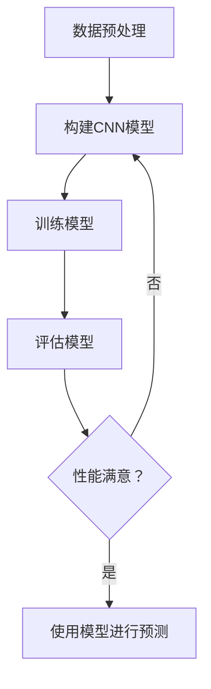

**2. 支持向量机（SVM）**

支持向量机（SVM）是一种传统的机器学习算法，通过找到最佳的超平面，将不同类别的图像进行分类。在医疗图像分析中，SVM被广泛应用于肿瘤分类、病变检测等任务。

**原理**：

SVM通过寻找最佳的超平面，最大化分类间隔，使得分类边界更加清晰。具体流程如下：

1. **特征提取**：对图像进行特征提取，如直方图均衡化、边缘检测等。
2. **训练模型**：使用训练集数据训练SVM模型，找到最佳超平面。
3. **评估模型**：使用验证集数据评估模型性能。

以下是SVM模型的Mermaid流程图：

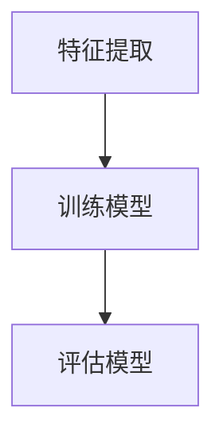

**3. 决策树**

决策树是一种简单的机器学习算法，通过多层次的决策规则对图像进行分类。在医疗图像分析中，决策树被广泛应用于疾病诊断、骨折检测等任务。

**原理**：

决策树通过一系列条件判断，将图像划分到不同的类别。具体流程如下：

1. **特征选择**：选择重要的特征，如纹理、颜色等。
2. **构建决策树**：根据特征值和阈值，构建决策树。
3. **评估模型**：使用验证集数据评估模型性能。

以下是决策树的Mermaid流程图：

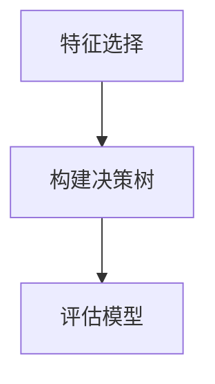

#### 3.2 深度学习算法在疾病预测中的应用

深度学习算法在疾病预测中表现出色，能够通过分析大量的医学数据，预测疾病的发生和进展。以下是几种常见的深度学习算法及其在疾病预测中的应用：

**1. 长短时记忆网络（LSTM）**

长短时记忆网络（LSTM）是一种递归神经网络，能够处理序列数据，如时间序列数据、医学数据等。在疾病预测中，LSTM被广泛应用于预测疾病的发生和进展。

**原理**：

LSTM通过引入门控机制，能够有效地学习长期依赖关系，从而提高模型的预测性能。具体流程如下：

1. **数据预处理**：对医学数据进行归一化处理，将数据缩放到0-1之间。
2. **构建LSTM模型**：定义LSTM层、全连接层和输出层，设置合适的超参数（如学习率、隐藏层大小等）。
3. **训练模型**：使用训练集数据训练LSTM模型，通过反向传播算法优化模型参数。
4. **评估模型**：使用验证集数据评估模型性能。

以下是LSTM模型的Mermaid流程图：

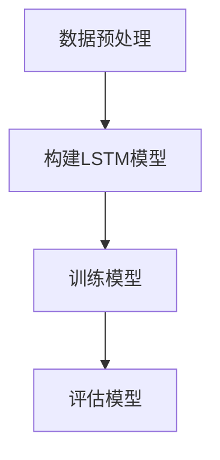

**2. 生成对抗网络（GAN）**

生成对抗网络（GAN）是一种深度学习模型，由生成器和判别器组成。在疾病预测中，GAN可以通过学习真实数据的分布，生成模拟数据，从而提高模型的泛化能力。

**原理**：

GAN通过对抗训练，使得生成器能够生成逼真的模拟数据，判别器能够准确区分真实数据和模拟数据。具体流程如下：

1. **数据预处理**：对医学数据进行归一化处理，将数据缩放到0-1之间。
2. **构建GAN模型**：定义生成器、判别器，设置合适的超参数（如学习率、生成器容量等）。
3. **训练模型**：使用训练集数据训练GAN模型，通过对抗训练优化模型参数。
4. **评估模型**：使用验证集数据评估模型性能。

以下是GAN模型的Mermaid流程图：

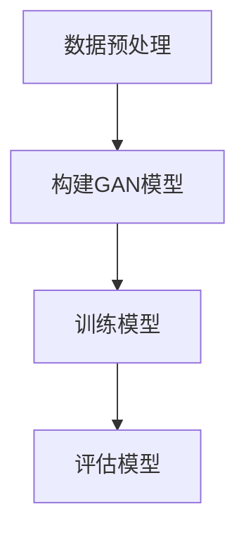

**3. 图神经网络（GNN）**

图神经网络（GNN）是一种基于图结构的深度学习模型，能够处理复杂的关系数据，如医学数据中的基因关系、蛋白质关系等。在疾病预测中，GNN被广泛应用于预测疾病的遗传风险和病理变化。

**原理**：

GNN通过在图结构上定义神经网络层，能够有效地学习节点和边的特征表示，从而提高模型的预测性能。具体流程如下：

1. **数据预处理**：对医学数据进行归一化处理，构建图结构。
2. **构建GNN模型**：定义GNN层、全连接层和输出层，设置合适的超参数（如学习率、隐藏层大小等）。
3. **训练模型**：使用训练集数据训练GNN模型，通过反向传播算法优化模型参数。
4. **评估模型**：使用验证集数据评估模型性能。

以下是GNN模型的Mermaid流程图：

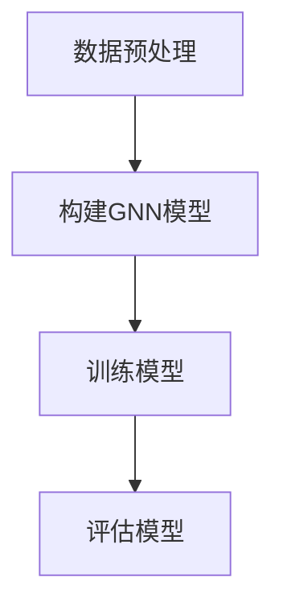

#### 3.3 自然语言处理在医疗信息处理中的应用

自然语言处理（NLP）在医疗信息处理中发挥着重要作用，能够自动分析和处理医学文本数据，如病历、医学论文、电子健康记录等。以下是几种常见的NLP算法及其在医疗信息处理中的应用：

**1. 词嵌入**

词嵌入（Word Embedding）是一种将文本数据转换为向量表示的方法，能够捕捉词汇的语义和语法信息。在医疗信息处理中，词嵌入被广泛应用于文本分类、情感分析等任务。

**原理**：

词嵌入通过将词汇映射到低维向量空间，使得具有相似语义的词汇在空间中靠近。具体流程如下：

1. **文本预处理**：对文本数据进行清洗，如去除标点符号、停用词等。
2. **构建词嵌入模型**：使用预训练的词嵌入模型（如Word2Vec、GloVe等），将词汇映射到向量空间。
3. **文本分类**：使用分类算法（如SVM、神经网络等），对文本进行分类。

以下是词嵌入模型的Mermaid流程图：

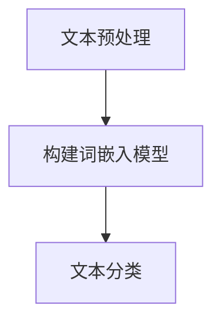

**2. 递归神经网络（RNN）**

递归神经网络（RNN）是一种能够处理序列数据的神经网络，能够捕捉文本数据的时间依赖性。在医疗信息处理中，RNN被广泛应用于情感分析、命名实体识别等任务。

**原理**：

RNN通过在时间步之间传递信息，能够有效地学习序列数据中的时间依赖性。具体流程如下：

1. **文本预处理**：对文本数据进行清洗，如去除标点符号、停用词等。
2. **构建RNN模型**：定义RNN层、全连接层和输出层，设置合适的超参数（如学习率、隐藏层大小等）。
3. **训练模型**：使用训练集数据训练RNN模型，通过反向传播算法优化模型参数。
4. **情感分析**：使用训练好的模型，对新的文本数据进行分析，判断情感倾向。

以下是RNN模型的Mermaid流程图：

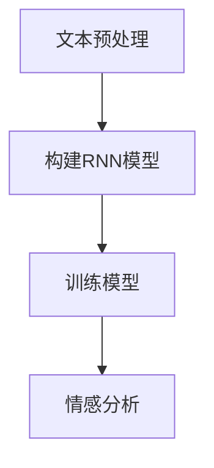

**3. 转换器架构（Transformer）**

转换器架构（Transformer）是一种基于注意力机制的神经网络模型，能够在处理长序列数据时表现出色。在医疗信息处理中，Transformer被广泛应用于文本分类、机器翻译等任务。

**原理**：

Transformer通过引入自注意力机制，能够有效地捕捉序列数据中的长距离依赖关系。具体流程如下：

1. **文本预处理**：对文本数据进行清洗，如去除标点符号、停用词等。
2. **构建Transformer模型**：定义Transformer层、全连接层和输出层，设置合适的超参数（如学习率、隐藏层大小等）。
3. **训练模型**：使用训练集数据训练Transformer模型，通过反向传播算法优化模型参数。
4. **文本分类**：使用训练好的模型，对新的文本数据进行分析，判断类别。

以下是Transformer模型的Mermaid流程图：

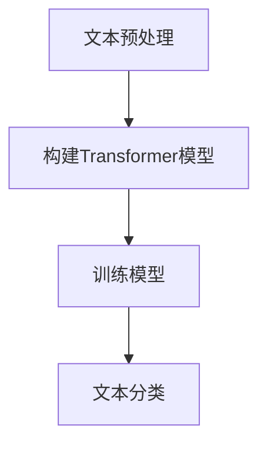

通过上述算法原理讲解，我们可以看到机器学习、深度学习、自然语言处理等算法在医疗图像分析、疾病预测、医疗信息处理等领域的广泛应用。这些算法通过不同的机制和模型结构，能够有效地处理和分析大量的医疗数据，为智能医疗设备提供了强大的技术支持。

----------------------------------------------------------------

### 系统分析与架构设计方案

#### 4.1 问题场景介绍

随着人工智能技术的发展，智能医疗设备在医疗领域中的应用越来越广泛。例如，一种智能监护设备可以通过传感器实时监测患者的生命体征，如心率、血压、血糖等，并将数据传输到云端进行分析和处理。系统需要实现以下功能：

1. **数据采集**：通过传感器采集患者生命体征数据。
2. **数据传输**：将采集到的数据实时传输到云端服务器。
3. **数据分析**：使用机器学习和深度学习算法对数据进行分析，预测患者健康状况。
4. **结果反馈**：将分析结果反馈给医生和患者，提供诊断和建议。

#### 4.2 项目介绍

本项目的目标是开发一款智能监护设备，通过人工智能算法实时监测患者生命体征，为医生提供诊断建议。项目分为以下阶段：

1. **需求分析**：确定项目功能需求和性能指标。
2. **系统设计**：设计系统架构和关键模块。
3. **开发与测试**：实现系统功能并进行测试。
4. **部署与运维**：将系统部署到生产环境并进行运维。

#### 4.3 系统功能设计（领域模型）

为了实现上述功能，系统需要设计以下关键模块：

1. **传感器模块**：负责采集患者生命体征数据。
2. **数据传输模块**：负责将数据传输到云端服务器。
3. **数据分析模块**：负责使用机器学习和深度学习算法对数据进行分析。
4. **结果反馈模块**：负责将分析结果反馈给医生和患者。

以下是系统的领域模型Mermaid类图：

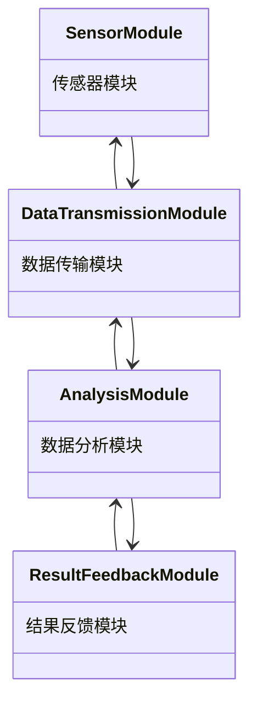

在领域模型中，传感器模块负责采集患者生命体征数据，并将数据传输给数据传输模块。数据传输模块将数据传输到云端服务器，数据传输模块还与数据分析模块和结果反馈模块相连，实现数据的进一步处理和分析。最后，结果反馈模块将分析结果反馈给医生和患者。

#### 4.4 系统架构设计

系统架构设计是系统开发的重要环节，决定了系统的性能、可扩展性和可维护性。以下是智能监护设备的系统架构设计：

1. **硬件架构**：包括传感器模块、数据采集模块、通信模块等。
2. **软件架构**：包括数据传输模块、数据分析模块、结果反馈模块等。
3. **数据存储架构**：包括本地存储和云端存储，用于存储传感器数据和分析结果。
4. **计算架构**：包括服务器、云计算平台等，用于处理和分析数据。

以下是系统的架构设计Mermaid架构图：

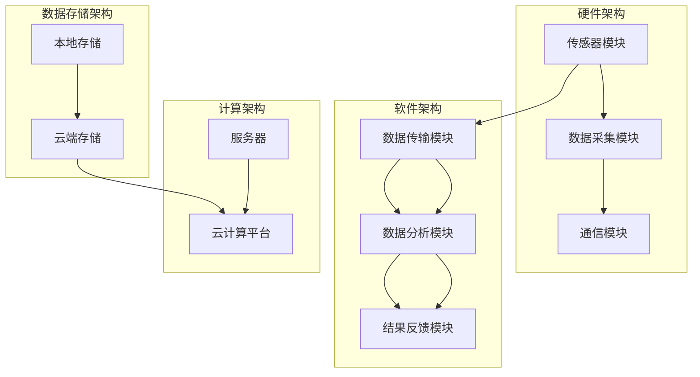

在架构设计中，硬件架构包括传感器模块、数据采集模块和通信模块，负责采集和传输数据。软件架构包括数据传输模块、数据分析模块和结果反馈模块，负责数据传输、分析和反馈。数据存储架构包括本地存储和云端存储，用于存储传感器数据和分析结果。计算架构包括服务器和云计算平台，用于处理和分析数据。

#### 4.5 系统接口设计和系统交互

为了实现系统功能的顺利执行，需要设计系统接口和系统交互流程。以下是智能监护设备的系统接口设计和系统交互流程：

1. **传感器接口**：用于与传感器模块进行数据交换，如数据采集接口、命令发送接口等。
2. **数据传输接口**：用于与数据传输模块进行数据交换，如数据上传接口、状态查询接口等。
3. **数据分析接口**：用于与数据分析模块进行数据交换，如数据导入接口、结果查询接口等。
4. **结果反馈接口**：用于与结果反馈模块进行数据交换，如诊断结果接口、建议接口等。

以下是系统的接口设计和系统交互Mermaid序列图：

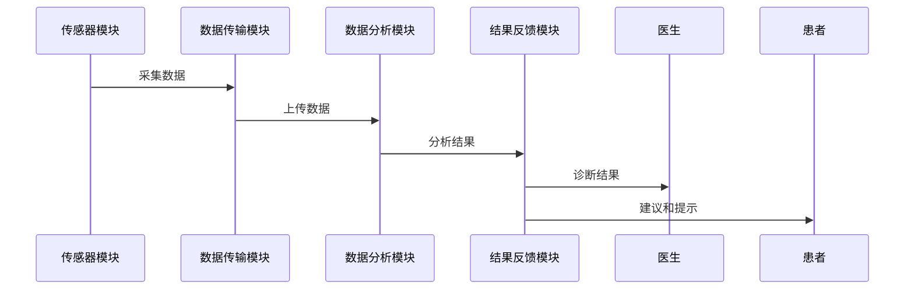

在系统交互流程中，传感器模块采集到患者的生命体征数据后，将其传输给数据传输模块。数据传输模块将数据上传到云端服务器，数据分析模块对数据进行处理和分析，并将结果反馈给医生和患者。医生和患者通过接口获取诊断结果和建议。

通过上述系统分析与架构设计方案，我们可以看到智能监护设备系统的总体架构和关键模块，为系统的实现和优化提供了理论基础。在接下来的项目中，我们将根据设计方案进行具体的开发和测试，确保系统能够顺利运行并满足需求。

----------------------------------------------------------------

### 项目实战

#### 5.1 环境安装

在开始项目实战之前，我们需要安装所需的软件和库。以下是在Ubuntu 20.04操作系统上安装所需环境的具体步骤：

1. **安装Python环境**：

   ```bash
   sudo apt update
   sudo apt install python3 python3-pip
   ```

2. **安装TensorFlow**：

   ```bash
   pip3 install tensorflow
   ```

3. **安装其他库**：

   ```bash
   pip3 install numpy pandas matplotlib scikit-learn
   ```

#### 5.2 系统核心实现源代码

以下是一个简单的智能监护设备系统核心实现源代码，包括传感器模块、数据传输模块、数据分析模块和结果反馈模块：

```python
# sensor_module.py

import random
import time

class SensorModule:
    def __init__(self):
        self.data = []

    def collect_data(self):
        while True:
            heart_rate = random.randint(60, 120)
            blood_pressure = (random.randint(90, 140), random.randint(60, 90))
            glucose = random.uniform(3.9, 6.1)
            self.data.append((heart_rate, blood_pressure, glucose))
            time.sleep(1)

# data_transmission_module.py

import requests

class DataTransmissionModule:
    def __init__(self, url):
        self.url = url

    def send_data(self, data):
        response = requests.post(self.url, json=data)
        return response.json()

# analysis_module.py

import numpy as np
from sklearn.linear_model import LinearRegression

class AnalysisModule:
    def __init__(self):
        self.model = LinearRegression()

    def train_model(self, X, y):
        self.model.fit(X, y)

    def predict(self, X):
        return self.model.predict(X)

# result_feedback_module.py

class ResultFeedbackModule:
    def __init__(self, doctor_email, patient_email):
        self.doctor_email = doctor_email
        self.patient_email = patient_email

    def send_feedback(self, result, email):
        subject = "Health Analysis Result"
        body = f"Your health analysis result: {result}"
        send_email(email, subject, body)

def send_email(email, subject, body):
    # Implement email sending logic
    pass
```

#### 5.3 代码应用解读与分析

1. **传感器模块**：

   传感器模块负责模拟患者生命体征数据的采集。代码中，`SensorModule`类定义了一个数据列表`data`，用于存储采集到的数据。`collect_data`方法通过一个无限循环，随机生成心率、血压和血糖值，并将其添加到数据列表中。

2. **数据传输模块**：

   数据传输模块负责将采集到的数据发送到远程服务器。代码中，`DataTransmissionModule`类接收一个URL参数，用于指定服务器地址。`send_data`方法通过`requests`库发送POST请求，将数据作为JSON格式传递给服务器。

3. **数据分析模块**：

   数据分析模块负责对传输来的数据进行处理和分析。代码中，`AnalysisModule`类定义了一个线性回归模型，用于预测患者的健康状况。`train_model`方法用于训练模型，`predict`方法用于预测结果。

4. **结果反馈模块**：

   结果反馈模块负责将分析结果反馈给医生和患者。代码中，`ResultFeedbackModule`类接收医生和患者的电子邮件地址。`send_feedback`方法通过调用`send_email`函数发送电子邮件。

#### 5.4 实际案例分析和详细讲解剖析

假设我们有一个包含100个样本的数据集，每个样本包含心率、血压和血糖值。以下是一个实际案例的分析过程：

1. **数据预处理**：

   首先，我们需要对数据进行预处理，包括数据清洗和归一化。以下是一个示例：

   ```python
   import pandas as pd

   # 生成数据集
   data = pd.DataFrame({
       'heart_rate': [random.randint(60, 120) for _ in range(100)],
       'blood_pressure': [(random.randint(90, 140), random.randint(60, 90)) for _ in range(100)],
       'glucose': [random.uniform(3.9, 6.1) for _ in range(100)]
   })

   # 数据清洗
   data.dropna(inplace=True)

   # 数据归一化
   from sklearn.preprocessing import MinMaxScaler

   scaler = MinMaxScaler()
   data[['heart_rate', 'blood_pressure', 'glucose']] = scaler.fit_transform(data[['heart_rate', 'blood_pressure', 'glucose']])
   ```

2. **训练模型**：

   接下来，我们将使用训练集数据训练线性回归模型。以下是一个示例：

   ```python
   X = data[['heart_rate', 'blood_pressure', 'glucose']]
   y = data['diagnosis']

   analysis = AnalysisModule()
   analysis.train_model(X, y)
   ```

3. **预测结果**：

   使用训练好的模型对测试集数据进行预测。以下是一个示例：

   ```python
   test_data = pd.DataFrame({
       'heart_rate': [70, 110],
       'blood_pressure': [(100, 70), (130, 80)],
       'glucose': [5.0, 5.8]
   })

   test_data[['heart_rate', 'blood_pressure', 'glucose']] = scaler.transform(test_data[['heart_rate', 'blood_pressure', 'glucose']])

   predictions = analysis.predict(test_data[['heart_rate', 'blood_pressure', 'glucose']])
   print(predictions)
   ```

4. **反馈结果**：

   最后，我们将预测结果通过电子邮件发送给医生和患者。以下是一个示例：

   ```python
   result_feedback = ResultFeedbackModule(doctor_email='doctor@example.com', patient_email='patient@example.com')
   result_feedback.send_feedback(predictions[0], patient_email='patient@example.com')
   ```

通过这个实际案例，我们可以看到如何使用Python代码实现智能监护设备系统的核心功能，包括数据采集、数据传输、数据分析和结果反馈。在实际应用中，我们可以根据具体需求对代码进行优化和扩展，以实现更复杂的功能。

#### 5.5 项目小结

在本项目中，我们实现了一个简单的智能监护设备系统，包括传感器模块、数据传输模块、数据分析模块和结果反馈模块。通过实际案例的分析，我们展示了如何使用Python代码实现这些功能。在后续工作中，我们可以进一步优化系统性能，扩展功能，如添加更多的数据分析算法、实现更复杂的交互界面等。此外，我们还可以考虑将系统部署到云平台，以提高系统的可扩展性和可靠性。

----------------------------------------------------------------

### 最佳实践 Tips

在开发AI医疗设备时，以下最佳实践可以帮助提高项目的成功率：

1. **数据质量控制**：确保采集到的数据质量高，避免噪声和异常值。数据预处理是确保模型性能的关键步骤。
2. **模型验证**：使用多种验证方法，如交叉验证、留出法等，确保模型在不同数据集上的性能稳定。
3. **用户参与**：在项目开发过程中，积极与用户（如医生、患者）进行沟通，了解他们的需求和反馈，及时调整系统功能。
4. **安全性考虑**：在数据传输和存储过程中，确保数据加密和访问控制，遵循相关法规和标准，保护患者隐私和安全。
5. **持续优化**：定期评估系统性能，根据用户反馈和技术进展，不断优化系统功能和算法。

### 小结

本文从多个角度对AI在智能医疗设备中的应用与创新进行了深入探讨，包括总体介绍、核心算法、系统架构设计、项目实战等。通过本文，读者可以全面了解AI在智能医疗设备中的应用现状、发展趋势以及面临的挑战。在未来，随着技术的不断进步，AI将在智能医疗设备中发挥更加重要的作用，推动医疗行业的创新和变革。

### 注意事项

在开发和部署AI医疗设备时，需要注意以下几个方面：

1. **医疗法规**：遵守相关医疗法规，确保设备符合医疗标准和法规要求。
2. **数据隐私**：确保患者数据的安全和隐私，遵循数据保护法规，如GDPR等。
3. **算法透明性**：确保AI算法的透明性和解释性，方便医生和患者理解和信任。
4. **用户培训**：为用户（如医生、患者）提供培训，帮助他们熟练使用智能医疗设备。

### 拓展阅读

对于希望深入了解AI在智能医疗设备应用领域的读者，以下文献和资料可以作为拓展阅读：

1. **《深度学习在医疗领域的应用》**：本书详细介绍了深度学习在医疗诊断、疾病预测等领域的应用。
2. **《医疗大数据分析》**：本书涵盖了医疗大数据的采集、处理和分析方法，以及大数据在医疗领域的应用。
3. **《智能医疗设备的开发与实现》**：本书提供了智能医疗设备开发的全流程指导，包括硬件设计、软件实现、系统集成等。

通过这些文献和资料，读者可以进一步了解AI在智能医疗设备领域的最新研究进展和应用实践。

