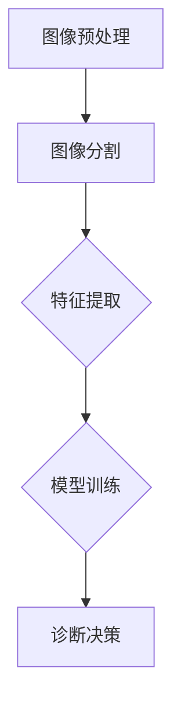
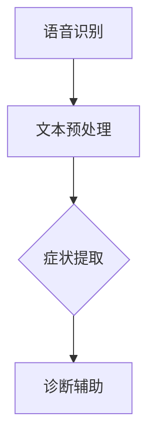
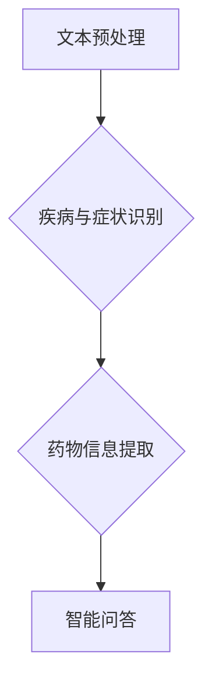
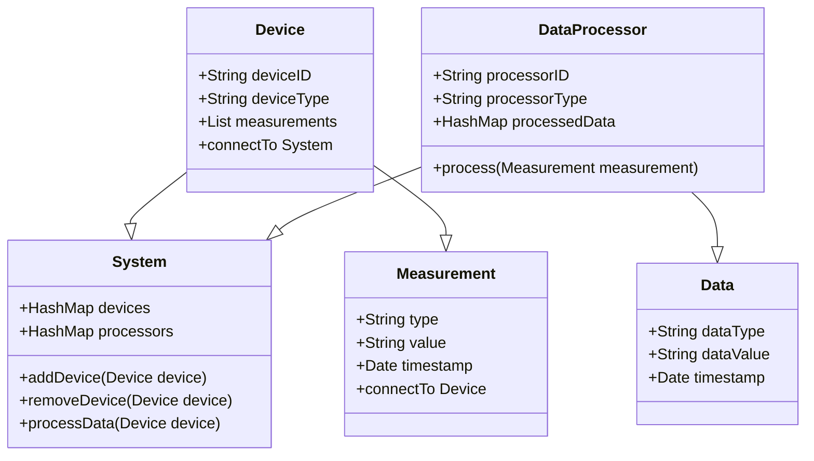
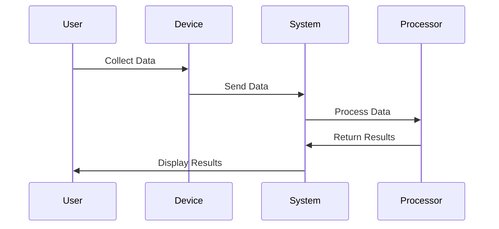
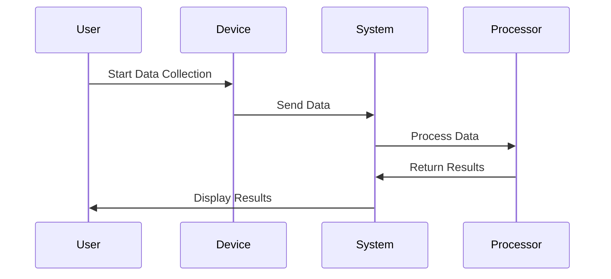

                 

### 摘要

智能医疗设备在医疗行业的应用日益广泛，然而，如何实现不同设备之间的互操作性以及如何整合多源医疗数据成为当前面临的重要挑战。本文旨在探讨人工智能（AI）在解决这些问题中的应用与创新。首先，本文介绍了智能医疗设备和人工智能的基本概念及其在医疗领域的应用现状。接着，本文重点分析了AI在智能医疗设备互操作性和数据整合中的关键技术，包括标准化与互操作性技术、医疗数据采集、存储与整合方法，以及AI在数据整合中的具体应用。通过实际案例研究，本文展示了AI在智能诊断系统中的应用，并提出了相关的最佳实践。本文的核心结论是，AI技术的应用不仅能够提升智能医疗设备的互操作性和数据整合效率，还能够推动智能医疗领域的创新，为医疗行业带来深远的变革。通过系统分析与架构设计，本文为AI在智能医疗设备中的应用提供了可行的方案，并对未来的研究方向进行了展望。

### 第1章：智能医疗设备的定义与发展

#### 1.1 智能医疗设备的定义

智能医疗设备是指通过集成传感器、通信技术、计算能力和软件算法，实现对病人生理参数实时监测、诊断、治疗和康复的一类医疗设备。这些设备具有自我学习、自适应和智能决策的能力，能够在一定程度上模拟或替代医生的诊断和治疗过程。智能医疗设备包括但不限于智能监护仪、智能输液泵、智能影像设备、智能穿戴设备等。

智能医疗设备的基本概念可以概括为以下几点：

1. **传感器技术**：传感器用于实时采集病人的生理参数，如血压、心率、血糖等。
2. **通信技术**：通过无线通信技术，将传感器采集的数据传输到中央处理系统或云端。
3. **计算能力**：强大的计算能力使得设备能够对大量数据进行分析和处理，以提供准确的诊断和治疗方案。
4. **软件算法**：智能医疗设备集成了先进的算法，用于数据分析和决策支持。

#### 1.2 智能医疗设备的发展历程

智能医疗设备的发展历程可以分为以下几个阶段：

1. **初期阶段**（20世纪60年代至80年代）：主要依靠硬件设备的升级和传感技术的改进，实现了基本的数据采集和监测功能。
2. **功能拓展阶段**（20世纪90年代至21世纪初）：随着计算机技术和通信技术的进步，智能医疗设备开始具备简单的数据处理和分析能力，能够提供初步的诊断建议。
3. **智能化阶段**（21世纪初至今）：随着人工智能（AI）技术的发展，智能医疗设备逐渐具备了自我学习、自适应和智能决策的能力，能够提供更加精准和个性化的医疗服务。

#### 1.3 智能医疗设备的关键技术

智能医疗设备的关键技术主要包括以下几个方面：

1. **传感器技术**：高精度、多参数、小型化的传感器是实现智能医疗设备的关键。例如，微流控芯片可以实现微量的生物化学检测。
2. **无线通信技术**：蓝牙、Wi-Fi、5G等无线通信技术使得医疗数据能够快速、安全地传输到云端或中央处理系统。
3. **数据处理与分析技术**：利用大数据技术和人工智能算法，对医疗设备采集的海量数据进行分析，提供精准的诊断和治疗方案。
4. **软件算法**：包括机器学习、深度学习、自然语言处理等，用于实现设备的自我学习和智能决策。

#### 1.4 人工智能在医疗领域的应用现状

人工智能在医疗领域的应用已经取得了显著的成果，主要包括以下几个方面：

1. **诊断与预测**：通过机器学习和深度学习算法，AI可以辅助医生进行疾病诊断，如肺癌、乳腺癌等。例如，Google DeepMind开发的AI系统可以在几秒钟内诊断出皮肤癌。
2. **治疗决策**：AI可以帮助医生制定个性化的治疗方案，提高治疗效果。例如，IBM的Watson for Oncology可以提供癌症治疗建议。
3. **药物研发**：AI可以加速药物研发过程，通过分析大量数据预测药物的疗效和副作用，提高研发效率。
4. **医疗资源优化**：AI可以用于优化医疗资源的配置，如医院床位管理、手术排程等。

#### 1.5 人工智能在智能医疗设备中的应用潜力

人工智能在智能医疗设备中的应用潜力巨大，主要包括以下几个方面：

1. **个性化医疗服务**：通过AI技术，智能医疗设备可以提供更加个性化和精准的医疗服务，满足患者的个性化需求。
2. **智能诊断与预警**：AI技术可以提高医疗设备的诊断准确率，实现早期预警，降低误诊率。
3. **智能治疗与康复**：AI技术可以辅助医生进行智能治疗，如手术机器人、康复机器人等，提高治疗效果。
4. **远程医疗**：AI技术可以实现远程医疗，降低患者就医成本，提高医疗服务的可及性。

#### 1.6 互操作性与数据整合的重要性

互操作性和数据整合是智能医疗设备发展的重要挑战，也是实现智能医疗体系高效运行的关键。互操作性指的是不同设备、系统和数据源之间的协同工作能力，确保医疗信息能够在不同的设备和系统之间无缝传输和共享。数据整合则是将来自不同来源的医疗数据进行整合和关联，以提供全面、准确的医疗信息。

互操作性和数据整合的重要性体现在以下几个方面：

1. **提高医疗效率**：通过实现设备的互操作性和数据的整合，可以减少重复检查、降低医疗错误，提高医疗效率。
2. **优化医疗资源**：通过整合医疗数据，可以为医院和医疗机构提供全面的病人信息，从而优化资源配置，提高医疗服务质量。
3. **促进临床研究**：整合后的医疗数据可以为临床研究和药物研发提供丰富的数据支持，促进医疗科学的发展。
4. **改善患者体验**：通过互操作性和数据整合，可以提供个性化的医疗服务，改善患者体验。

#### 1.7 医疗设备互操作性的挑战

实现医疗设备的互操作性面临以下几个挑战：

1. **技术标准不统一**：不同制造商的设备采用不同的通信协议和数据格式，导致互操作性难以实现。
2. **数据隐私和安全**：医疗数据涉及患者隐私，如何保障数据的安全和隐私是一个重要问题。
3. **系统兼容性**：医疗设备通常需要与其他IT系统（如电子病历系统）集成，如何确保系统的兼容性是一个挑战。
4. **设备更新换代**：医疗设备更新换代频繁，如何确保新设备与现有系统互操作也是一个难题。

#### 1.8 数据整合的关键环节

实现医疗数据的整合包括以下几个关键环节：

1. **数据采集**：确保数据采集的全面性和准确性，包括病人的生理参数、医疗记录等。
2. **数据存储**：建立高效、安全、可靠的数据存储系统，确保数据能够长期存储并随时访问。
3. **数据清洗**：对采集到的数据进行清洗，去除重复、错误和不一致的数据。
4. **数据关联**：将来自不同来源的数据进行关联，构建完整的病人医疗记录。
5. **数据共享**：通过建立统一的数据接口和协议，实现不同系统和设备之间的数据共享。

#### 1.9 互操作性与数据整合的协同效应

互操作性和数据整合在智能医疗设备中具有协同效应，具体表现为：

1. **提高数据质量**：通过实现设备间的互操作性，可以确保数据的完整性和一致性，从而提高数据质量。
2. **增强系统整合性**：通过数据整合，可以实现不同系统和设备之间的信息共享和协同工作，提高系统的整合性。
3. **优化决策支持**：整合后的数据可以为医生和医疗机构提供全面、准确的决策支持，提高医疗服务的质量和效率。
4. **促进创新应用**：互操作性和数据整合为新的医疗应用提供了可能，如远程医疗、智能诊断和个性化治疗等。

#### 1.10 本章小结

本章对智能医疗设备的定义、发展历程、关键技术以及AI在医疗领域的应用现状和潜力进行了详细探讨。同时，本文还分析了互操作性与数据整合的重要性以及面临的挑战和关键环节。通过本章的学习，读者可以全面了解智能医疗设备的现状和未来发展趋势，为后续章节的学习打下坚实的基础。

### 第2章：AI在智能医疗设备互操作性中的关键技术

#### 2.1 智能医疗设备标准化概述

标准化是智能医疗设备互操作性的基础，也是实现不同设备和系统之间无缝集成的重要手段。智能医疗设备标准化涉及到硬件、软件、通信协议等多个方面，其目的是确保不同设备之间的兼容性和互操作性。

##### 2.1.1 标准化的概念与作用

标准化是指通过制定和实施统一的标准，来规范产品的设计、生产、测试和交换等过程。在智能医疗设备领域，标准化具有以下作用：

1. **提高互操作性**：通过统一的标准，确保不同设备和系统之间的数据能够无缝传输和交换，提高系统的互操作性。
2. **降低成本**：标准化可以减少由于设备不兼容导致的技术冗余和重复开发，降低医疗系统的建设成本。
3. **提高质量**：标准化有助于确保设备的一致性和可靠性，提高医疗服务的质量。
4. **促进创新**：标准化为新的医疗技术和应用提供了坚实的基础，有助于推动医疗领域的创新。

##### 2.1.2 智能医疗设备标准化的现状与趋势

目前，智能医疗设备标准化主要涉及以下几个方面：

1. **通信协议**：如HL7（Health Level Seven）、FHIR（Fast Healthcare Interoperability Resources）、DICOM（Digital Imaging and Communications in Medicine）等，用于数据传输和交换。
2. **数据格式**：如CDA（Clinical Document Architecture）、CDAR（Continuity of Care Document）等，用于规范医疗数据的结构。
3. **硬件接口**：如IEEE 11073（医疗设备网络通信）等，用于规范设备之间的物理连接和接口。

未来，智能医疗设备标准化将朝着以下几个方向发展：

1. **更加开放和灵活**：标准化组织将不断推出新的标准，以适应快速发展的医疗技术。
2. **数据互操作性的提升**：通过改进数据格式和通信协议，提高医疗数据的互操作性，实现更广泛的数据共享。
3. **更加注重患者隐私和安全**：随着医疗数据的重要性日益增加，标准化将更加注重数据的安全和隐私保护。
4. **跨领域的整合**：标准化将涉及更多领域，如基因组学、健康监测等，实现跨领域的医疗数据整合和应用。

##### 2.1.3 智能医疗设备标准化的关键领域

智能医疗设备标准化的关键领域包括以下几个方面：

1. **设备通信协议**：制定统一的通信协议，确保不同设备之间的数据能够无缝传输和交换。
2. **数据格式规范**：制定统一的医疗数据格式，确保医疗数据的结构一致，便于数据处理和分析。
3. **数据共享机制**：建立统一的数据共享机制，确保医疗数据能够在不同的系统和设备之间高效传输和共享。
4. **隐私和安全**：制定严格的数据隐私和安全标准，确保医疗数据在传输、存储和使用过程中的安全。
5. **数据接口和API**：提供统一的数据接口和API，便于不同系统和设备之间的集成和开发。

#### 2.2 互操作性技术的介绍

互操作性技术是实现智能医疗设备之间协同工作的重要手段。互操作性技术主要涉及以下几个方面：

1. **通信协议**：通信协议用于规范设备之间的数据传输格式和通信流程。常见的通信协议包括TCP/IP、HTTP、RESTful API等。
2. **数据交换格式**：数据交换格式用于规范医疗数据的结构和传输方式。常见的数据交换格式包括XML、JSON、CSV等。
3. **中间件**：中间件是一种独立的系统软件，位于硬件、操作系统、数据库和最终用户应用软件之间，起着转换数据格式、传输数据等作用。
4. **数据映射**：数据映射是将不同数据源中的数据转换为统一格式的过程，用于实现不同系统和设备之间的数据集成。
5. **API**：API（应用程序接口）是一种用于不同软件系统之间进行数据交换和通信的接口。

##### 2.2.1 互操作性技术的概念与分类

互操作性技术是指实现不同系统和设备之间数据共享和协同工作的一系列技术手段。根据实现方式，互操作性技术可以分为以下几类：

1. **基于文档的互操作性**：通过定义统一的文档格式和数据结构，实现不同系统和设备之间的数据交换。如XML、JSON等。
2. **基于服务的互操作性**：通过定义统一的服务接口和协议，实现不同系统和设备之间的数据共享和协同工作。如SOAP、RESTful API等。
3. **基于事件驱动的互操作性**：通过事件驱动的方式，实现不同系统和设备之间的实时通信和协同工作。

##### 2.2.2 常见的互操作性标准协议

常见的互操作性标准协议包括：

1. **HL7（Health Level Seven）**：HL7是一个国际性的医疗信息传输标准，用于医疗信息的交换和集成。
2. **FHIR（Fast Healthcare Interoperability Resources）**：FHIR是HL7推出的新一代医疗信息传输标准，具有更高的灵活性和互操作性。
3. **DICOM（Digital Imaging and Communications in Medicine）**：DICOM是一个用于医学影像信息传输和管理的国际标准。
4. **XML（eXtensible Markup Language）**：XML是一种用于数据存储和交换的标记语言，广泛应用于医疗信息传输。
5. **JSON（JavaScript Object Notation）**：JSON是一种轻量级的数据交换格式，易于阅读和编写，广泛应用于Web服务和医疗信息传输。

##### 2.2.3 互操作性技术的实际应用案例

互操作性技术在智能医疗设备中的应用案例包括：

1. **远程医疗**：通过互操作性技术，可以实现医生与病人之间的远程医疗咨询和诊疗，提高医疗服务的可及性和效率。
2. **电子病历系统**：通过互操作性技术，可以实现不同医疗信息系统之间的数据共享和集成，提高医疗数据的完整性和一致性。
3. **智能诊断系统**：通过互操作性技术，可以实现不同设备和系统之间的数据共享和协同工作，提高智能诊断系统的准确性和效率。

#### 2.3 AI在互操作性中的应用

人工智能（AI）在互操作性中具有广泛的应用前景，主要体现在以下几个方面：

1. **数据预处理**：AI技术可以用于数据清洗、归一化和特征提取等数据预处理任务，提高数据的准确性和一致性。
2. **异常检测**：AI技术可以用于检测和识别数据传输过程中的异常和错误，提高系统的可靠性和安全性。
3. **智能调度**：AI技术可以用于智能调度和优化数据传输和处理的流程，提高系统的效率和响应速度。
4. **决策支持**：AI技术可以用于为医生和医疗管理人员提供智能化的决策支持，提高医疗服务的质量和效率。

##### 2.3.1 AI技术在互操作性中的角色

AI技术在互操作性中的角色主要包括：

1. **数据集成**：AI技术可以用于整合来自不同设备和系统的医疗数据，构建统一的病人医疗记录。
2. **智能路由**：AI技术可以用于智能路由和优化数据传输路径，提高数据传输的速度和效率。
3. **智能转换**：AI技术可以用于智能转换和映射不同格式和协议的数据，确保数据在不同系统和设备之间的无缝传输和共享。

##### 2.3.2 AI技术在智能医疗设备互操作性中的应用案例

AI技术在智能医疗设备互操作性中的应用案例包括：

1. **智能监护系统**：通过AI技术，可以实现智能监护系统之间的数据共享和协同工作，提高监护系统的效率和准确性。
2. **远程手术机器人**：通过AI技术，可以实现远程手术机器人与本地手术设备之间的数据共享和协同工作，提高远程手术的精度和安全性。
3. **智能医疗平台**：通过AI技术，可以实现智能医疗平台与医院信息系统、电子病历系统等之间的数据共享和协同工作，提高医疗服务的质量和效率。

##### 2.3.3 AI技术在互操作性中的挑战与机遇

AI技术在互操作性中面临的挑战主要包括：

1. **数据质量和完整性**：医疗数据的质量和完整性对AI算法的性能有重要影响，如何确保数据的质量和完整性是一个重要问题。
2. **数据隐私和安全**：医疗数据涉及患者隐私，如何保障数据的安全和隐私是一个重要挑战。
3. **系统兼容性和可扩展性**：不同设备和系统之间的兼容性和可扩展性对AI技术在互操作性中的应用提出了高要求。

然而，AI技术在互操作性中同样面临巨大的机遇：

1. **数据挖掘和分析**：通过AI技术，可以从海量医疗数据中挖掘出有价值的信息，提高医疗决策的准确性和效率。
2. **智能优化和自动化**：通过AI技术，可以实现医疗设备之间的智能优化和自动化协同工作，提高医疗服务的效率和质量。
3. **个性化医疗服务**：通过AI技术，可以实现个性化医疗服务，满足患者的个性化需求，提高患者的满意度和生活质量。

#### 2.4 本章小结

本章对智能医疗设备标准化和互操作性技术进行了详细介绍，分析了AI在互操作性中的应用及其面临的挑战与机遇。通过本章的学习，读者可以深入了解智能医疗设备的互操作性及其关键技术，为后续章节的学习打下坚实的基础。

### 第3章：医疗数据的采集、存储与整合

#### 3.1 医疗数据的分类与特性

医疗数据是医疗信息系统中最重要的组成部分，其种类繁多、来源广泛，对医疗决策和医疗服务有着重要的影响。根据数据来源和内容的不同，医疗数据可以分为以下几类：

1. **结构化数据**：结构化数据指的是具有固定格式和结构的数据，如电子病历（EMR）、实验室报告、医学影像等。这类数据通常存储在数据库中，便于查询和管理。
2. **非结构化数据**：非结构化数据指的是没有固定格式和结构的数据，如医生笔记、病例记录、医学影像的影像文件等。这类数据通常以文本、图像或视频的形式存在，需要进行特殊的处理和分析。
3. **半结构化数据**：半结构化数据指的是部分具有固定格式和结构，部分没有固定格式和结构的数据，如医学影像中的标注信息、基因组数据等。这类数据通常需要结合结构化和非结构化数据的处理方法。

医疗数据的特性主要包括：

1. **海量性**：医疗数据涉及海量信息，包括病人的历史记录、实时监测数据、药物使用记录等。如何有效存储和管理这些海量数据是一个重要挑战。
2. **多样性**：医疗数据种类繁多，包括文本、图像、声音、视频等多种形式。不同类型的数据需要采用不同的处理方法，如何统一管理和处理这些多样性数据是一个难题。
3. **时效性**：医疗数据具有时效性，某些数据需要实时更新和实时处理，如病人的实时监测数据、手术记录等。如何确保数据的高效实时处理是一个关键问题。
4. **隐私性**：医疗数据涉及患者隐私，包括姓名、年龄、性别、诊断结果、治疗方案等敏感信息。如何保障数据的安全和隐私是一个重要问题。

#### 3.2 数据采集技术

数据采集是医疗数据管理的重要环节，其目的是获取高质量的医疗数据，为后续的数据处理和分析提供基础。医疗数据的采集技术主要包括以下几个方面：

1. **传感器采集**：传感器采集是最常见的数据采集方式，通过传感器可以实时监测病人的生理参数，如血压、心率、血糖等。传感器采集的数据通常需要通过无线通信技术传输到中央处理系统。
2. **医疗设备采集**：医疗设备如监护仪、超声仪、核磁共振仪等可以采集病人的生理参数和医学影像数据。这些设备通常具有内置的数据采集功能，可以将数据存储在本地或通过无线通信技术传输到中央处理系统。
3. **手动录入**：部分医疗数据如病历记录、手术记录等需要通过人工录入的方式采集。这种方式虽然效率较低，但在某些场景下仍然是必要的。
4. **电子化采集**：随着电子病历（EMR）系统的普及，越来越多的医疗数据通过电子化方式进行采集。电子化采集可以减少人工录入的错误，提高数据采集的效率和质量。

#### 3.2.1 数据采集的基本方法

数据采集的基本方法包括以下几种：

1. **在线采集**：在线采集是指实时采集病人的生理参数和医疗记录，通过无线通信技术将数据传输到中央处理系统。在线采集的优点是实时性强，能够及时反映病人的健康状况。
2. **离线采集**：离线采集是指将医疗数据存储在本地设备中，如监护仪、超声仪等，在需要时再上传到中央处理系统。离线采集的优点是可以减少网络带宽的压力，但在数据传输和同步过程中可能会存在延迟。
3. **混合采集**：混合采集是指结合在线采集和离线采集的方法，根据实际情况选择适合的采集方式。例如，对于需要实时监测的病人，可以采用在线采集方式，而对于远程监控的病人，可以采用离线采集方式。

#### 3.2.2 常见的数据采集工具与技术

常见的数据采集工具和技术包括：

1. **传感器技术**：传感器技术用于实时监测病人的生理参数，如血压、心率、血糖等。常见的传感器包括无线传感器、可穿戴传感器、植入式传感器等。
2. **无线通信技术**：无线通信技术如Wi-Fi、蓝牙、NFC等，用于将传感器采集的数据传输到中央处理系统。无线通信技术具有传输速度快、覆盖范围广等优点。
3. **嵌入式系统**：嵌入式系统是将传感器、通信模块和处理单元集成在一起的系统，用于实时采集和处理医疗数据。嵌入式系统的优点是功耗低、可靠性高。
4. **云计算与物联网**：云计算和物联网技术可以用于大规模存储和管理医疗数据，实现医疗数据的实时处理和分析。云计算和物联网技术的优点是资源丰富、灵活性强。

#### 3.2.3 数据采集过程中的关键问题

数据采集过程中存在以下几个关键问题：

1. **数据质量**：数据质量是数据采集的首要问题，如何确保采集的数据准确、完整、可靠是一个挑战。例如，传感器误差、数据传输错误等都会影响数据质量。
2. **数据传输**：数据传输是数据采集过程中的重要环节，如何保证数据在传输过程中不被丢失或篡改是一个关键问题。数据传输需要考虑网络带宽、传输速度、传输安全性等因素。
3. **数据隐私**：数据隐私是医疗数据采集的重要问题，如何保护患者隐私是一个重要挑战。数据采集过程中需要遵循相关的隐私保护法规和标准，确保患者隐私不被泄露。
4. **数据同步**：数据同步是确保医疗数据一致性的重要环节，如何确保采集到的数据及时上传到中央处理系统是一个关键问题。数据同步需要考虑数据传输的延迟、数据冲突等问题。

#### 3.3 数据存储与管理系统

数据存储与管理系统是医疗数据管理的重要组成部分，其目的是确保医疗数据的安全、可靠和高效存储，为后续的数据处理和分析提供基础。医疗数据存储与管理系统主要包括以下几个方面：

1. **数据库管理系统**：数据库管理系统（DBMS）用于存储和管理医疗数据。常见的数据库管理系统包括关系型数据库（如MySQL、Oracle）和NoSQL数据库（如MongoDB、Cassandra）。
2. **数据仓库**：数据仓库是一个用于大规模数据存储和管理的系统，用于整合和存储来自不同来源的医疗数据。数据仓库可以提供高效的数据查询和分析功能。
3. **数据湖**：数据湖是一个用于存储大量非结构化和半结构化数据的大规模数据存储系统。数据湖可以存储不同格式的数据，如文本、图像、视频等。
4. **分布式存储系统**：分布式存储系统如Hadoop、Spark等，可以用于大规模存储和管理医疗数据。分布式存储系统具有高扩展性、高可用性等优点。

#### 3.3.1 数据存储的基本原理

数据存储的基本原理主要包括以下几个方面：

1. **数据分区**：数据分区是将数据按照一定规则划分为多个部分，以实现数据的分布式存储和高效查询。数据分区可以根据不同的维度（如时间、地理位置等）进行。
2. **数据备份**：数据备份是确保数据安全的重要措施，通过备份可以防止数据丢失或损坏。常见的数据备份策略包括全量备份、增量备份、差异备份等。
3. **数据加密**：数据加密是保护数据安全的重要手段，通过加密可以防止数据在传输和存储过程中被未授权的访问。常见的数据加密算法包括对称加密和非对称加密。
4. **数据压缩**：数据压缩是减少数据存储空间和传输带宽的重要方法，通过压缩可以降低存储和传输的成本。常见的数据压缩算法包括Huffman编码、LZ77等。

#### 3.3.2 数据存储系统的设计与实现

数据存储系统的设计与实现包括以下几个方面：

1. **系统架构设计**：系统架构设计包括确定数据存储系统的整体架构，如分布式存储系统、数据仓库等。
2. **数据模型设计**：数据模型设计包括确定数据的结构、关系和属性，如关系型数据库的表结构、NoSQL数据库的文档模型等。
3. **数据存储策略**：数据存储策略包括确定数据的存储位置、备份策略、加密策略等。
4. **性能优化**：性能优化包括对数据存储系统进行性能测试和调优，确保数据存储和查询的高效性。
5. **安全性设计**：安全性设计包括对数据存储系统进行安全评估和设计，确保数据的安全性和隐私保护。

#### 3.3.3 数据存储系统的优化与挑战

数据存储系统的优化和挑战主要包括以下几个方面：

1. **性能优化**：数据存储系统的性能优化包括提高数据存储和查询的速度、降低延迟等。性能优化可以通过优化系统架构、数据模型、存储策略等方式实现。
2. **可扩展性**：数据存储系统的可扩展性包括支持数据量的增长、支持新功能的添加等。可扩展性可以通过分布式存储、水平扩展等方式实现。
3. **数据安全**：数据安全是数据存储系统的重要挑战，如何确保数据在存储和传输过程中的安全是一个重要问题。数据安全可以通过数据加密、访问控制、审计等方式实现。
4. **数据一致性**：数据一致性是确保数据准确性和可靠性的重要问题，如何确保数据在分布式存储和多个节点之间的数据一致性是一个挑战。数据一致性可以通过分布式一致性算法、分布式事务等方式实现。

#### 3.4 数据整合方法与技术

数据整合是将来自不同来源的医疗数据进行整合和关联的过程，其目的是构建全面的病人医疗记录，为医疗决策和医疗服务提供基础。数据整合的方法和技术包括以下几个方面：

1. **数据清洗**：数据清洗是数据整合的第一步，其目的是去除重复、错误和不一致的数据，确保数据的准确性和一致性。
2. **数据映射**：数据映射是将不同数据源中的数据映射到统一的数据模型和格式上，以便进行整合和关联。数据映射可以通过定义映射规则和转换函数实现。
3. **数据转换**：数据转换是将不同格式的数据转换为统一格式的过程，如将文本数据转换为XML或JSON格式。数据转换可以通过编写转换脚本或使用转换工具实现。
4. **数据集成**：数据集成是将来自不同数据源的数据进行整合和关联，构建全面的病人医疗记录。数据集成可以通过关系数据库、数据仓库、数据湖等方式实现。

#### 3.4.1 数据整合的基本概念

数据整合的基本概念包括以下几个方面：

1. **数据源**：数据源是指提供医疗数据的不同系统和设备，如电子病历系统、监护仪、实验室等。
2. **数据模型**：数据模型是指用于描述医疗数据结构和关系的数据模型，如关系模型、文档模型等。
3. **数据映射**：数据映射是指将不同数据源中的数据映射到统一的数据模型上，以便进行整合和关联。
4. **数据转换**：数据转换是指将不同格式的数据转换为统一格式的过程，以便进行整合和关联。
5. **数据集成**：数据集成是指将来自不同数据源的数据进行整合和关联，构建全面的病人医疗记录。

#### 3.4.2 常见的数据整合方法

常见的数据整合方法包括以下几个方面：

1. **数据仓库**：数据仓库是一种用于大规模数据存储和整合的系统，通过将多个数据源的数据整合到数据仓库中，构建全面的病人医疗记录。
2. **数据湖**：数据湖是一种用于存储大规模非结构化和半结构化数据的大规模数据存储系统，通过将多个数据源的数据存储到数据湖中，实现数据的整合和关联。
3. **ETL（Extract, Transform, Load）**：ETL是一种数据整合方法，包括数据提取、数据转换和数据加载三个步骤。ETL方法可以将多个数据源的数据提取到临时存储区，进行转换和整合，然后加载到目标数据存储系统中。
4. **数据融合**：数据融合是一种将多个数据源中的相似数据合并为一个数据源的方法，通过去除重复数据和整合不同格式的数据，实现数据的整合和关联。

#### 3.4.3 数据整合的挑战与解决方案

数据整合过程中面临以下几个挑战：

1. **数据质量**：数据质量是数据整合的关键问题，如何确保数据的准确性、完整性和一致性是一个挑战。解决方案包括数据清洗、数据验证和数据质量监控等。
2. **数据源多样性**：医疗数据源种类繁多，包括结构化数据、非结构化数据和半结构化数据等，如何整合不同类型的数据是一个挑战。解决方案包括数据映射、数据转换和数据融合等。
3. **数据隐私和安全**：医疗数据涉及患者隐私，如何保障数据的安全和隐私是一个重要挑战。解决方案包括数据加密、访问控制和审计等。
4. **数据一致性**：在分布式存储和多个数据源之间，如何保持数据的一致性是一个挑战。解决方案包括分布式一致性算法、分布式事务等。

#### 3.5 AI在数据整合中的应用

人工智能（AI）在数据整合中具有广泛的应用前景，主要包括以下几个方面：

1. **数据清洗**：AI技术可以用于数据清洗，通过自动识别和修复数据中的错误和不一致，提高数据质量。
2. **数据转换**：AI技术可以用于数据转换，通过自动识别和映射不同数据源的数据结构，实现数据的整合和关联。
3. **数据融合**：AI技术可以用于数据融合，通过自动识别和合并相似的数据源，构建全面的病人医疗记录。
4. **数据预测**：AI技术可以用于数据预测，通过对历史数据的分析和建模，预测未来的医疗趋势和需求。

##### 3.5.1 AI在数据整合中的作用

AI在数据整合中的作用主要包括：

1. **自动化处理**：AI技术可以自动化处理大量的数据清洗、转换和融合任务，提高数据整合的效率。
2. **智能化决策**：AI技术可以为数据整合提供智能化的决策支持，帮助医生和医疗管理人员做出更准确的决策。
3. **个性化服务**：AI技术可以根据患者的个性化数据，提供个性化的医疗服务和治疗方案，提高医疗服务的质量和患者满意度。

##### 3.5.2 AI在数据整合中的实际应用案例

AI在数据整合中的实际应用案例包括：

1. **智能诊断系统**：通过整合不同来源的医疗数据，如电子病历、实验室报告、医学影像等，智能诊断系统可以提供更准确的诊断结果。
2. **智能药物研发**：通过整合基因数据、临床数据和药物使用记录，AI技术可以加速药物研发过程，提高药物研发的效率。
3. **智能健康监控**：通过整合实时监测数据、病史数据和生活方式数据，AI技术可以提供个性化的健康监控和干预方案，帮助患者改善健康状况。

##### 3.5.3 AI在数据整合中的挑战与机遇

AI在数据整合中面临的挑战主要包括：

1. **数据质量和完整性**：如何确保数据的质量和完整性是AI技术有效应用的关键挑战。
2. **数据隐私和安全**：医疗数据涉及患者隐私，如何保障数据的安全和隐私是一个重要问题。
3. **数据源多样性**：如何整合不同类型、不同来源的数据是一个挑战。

然而，AI在数据整合中也面临巨大的机遇：

1. **数据挖掘和分析**：通过AI技术，可以从海量医疗数据中挖掘出有价值的信息，为医疗决策提供支持。
2. **智能化服务**：通过AI技术，可以提供个性化的医疗服务和治疗方案，提高医疗服务的质量和患者满意度。
3. **优化医疗资源**：通过AI技术，可以优化医疗资源的配置和利用，提高医疗资源的使用效率。

#### 3.6 本章小结

本章对医疗数据的分类与特性、数据采集技术、数据存储与管理系统、数据整合方法与技术以及AI在数据整合中的应用进行了详细探讨。通过本章的学习，读者可以全面了解医疗数据的管理流程和技术手段，为智能医疗设备互操作性和数据整合提供理论基础和实践指导。

### 第4章：AI在智能诊断系统中的应用

#### 4.1 智能诊断系统的基本概念

智能诊断系统是指利用人工智能（AI）技术，通过对医学图像、病历数据、实验室检测结果等医疗信息进行分析和处理，辅助医生进行疾病诊断和决策的系统。智能诊断系统主要由以下几个部分组成：

1. **数据输入**：数据输入模块负责接收各种医疗数据，如医学图像、病历记录、实验室检测结果等。这些数据可以是结构化数据（如电子病历），也可以是非结构化数据（如医学影像、文本记录）。
2. **数据处理**：数据处理模块对输入的数据进行预处理，包括数据清洗、数据归一化、数据增强等，以确保数据的质量和一致性。
3. **特征提取**：特征提取模块从处理后的数据中提取有用的特征信息，如图像中的纹理特征、形状特征，文本中的关键词、词频等。
4. **模型训练**：模型训练模块利用提取到的特征信息，通过机器学习、深度学习等算法，训练出用于疾病诊断的模型。常见的模型包括卷积神经网络（CNN）、循环神经网络（RNN）、支持向量机（SVM）等。
5. **诊断决策**：诊断决策模块根据训练好的模型，对新的医疗数据进行诊断，输出诊断结果。诊断结果可以是具体的疾病名称，也可以是诊断概率分布。
6. **结果反馈**：结果反馈模块将诊断结果反馈给医生和患者，同时收集诊断过程中的数据，用于模型优化和迭代。

#### 4.2 AI在智能诊断系统中的应用

AI技术在智能诊断系统中的应用主要包括以下几个方面：

1. **图像处理**：在医学影像领域，AI技术被广泛应用于肺癌、乳腺癌等疾病的诊断。例如，利用卷积神经网络（CNN）可以对医学影像进行自动标注，识别出异常区域，提高诊断的准确性。
2. **语音识别**：语音识别技术可以用于语音病历的记录和分析，帮助医生快速检索病历信息，提高诊断效率。同时，语音识别还可以用于智能问诊系统，辅助医生与患者进行语音交流，获取病情信息。
3. **自然语言处理**：自然语言处理（NLP）技术可以用于分析病历记录、医学文献等非结构化文本数据，提取关键信息，辅助医生进行诊断和决策。例如，通过文本分类和实体识别，可以识别出患者的症状、病史和治疗方案。
4. **药物研发**：AI技术可以用于药物研发过程，通过分析大量的基因组数据、药物副作用数据等，预测药物的疗效和副作用，加速新药的发现和研发。

#### 4.2.1 AI在图像处理中的应用

在医学影像领域，AI技术主要应用于图像处理和病灶检测。以下是一个典型的应用场景：

1. **图像预处理**：首先对医学影像进行预处理，包括去噪、增强、对比度调整等，以提高图像质量。
2. **图像分割**：利用深度学习算法，如卷积神经网络（CNN）或生成对抗网络（GAN），对医学影像进行图像分割，将正常组织和异常病灶分离出来。
3. **特征提取**：从分割后的图像中提取纹理、形状等特征，用于后续的疾病诊断。
4. **模型训练**：利用提取到的特征，通过机器学习算法训练出疾病诊断模型，如支持向量机（SVM）或深度神经网络（DNN）。
5. **诊断决策**：根据训练好的模型，对新的医学影像数据进行诊断，输出诊断结果。

以下是一个简化的算法流程图，使用Mermaid语法表示：



#### 4.2.2 AI在语音识别中的应用

在医疗领域，语音识别技术被广泛应用于病历记录和智能问诊。以下是一个典型的应用场景：

1. **语音识别**：将医生与患者之间的语音对话转换为文本，通过语音识别技术将语音转换为文本。
2. **文本预处理**：对识别出的文本进行分词、词性标注等预处理，以提取关键信息。
3. **症状提取**：利用自然语言处理（NLP）技术，从文本中提取患者的症状、病史等信息。
4. **诊断辅助**：根据提取到的症状和病史信息，利用机器学习算法，为医生提供诊断建议。

以下是一个简化的算法流程图，使用Mermaid语法表示：



#### 4.2.3 AI在自然语言处理中的应用

在医疗文本数据分析中，自然语言处理（NLP）技术被广泛应用于病历记录分析、医学文献检索和智能问答系统。以下是一个典型的应用场景：

1. **文本预处理**：对病历记录、医学文献等非结构化文本进行分词、词性标注、实体识别等预处理操作。
2. **疾病与症状识别**：利用命名实体识别（NER）技术，从预处理后的文本中识别出疾病名称、症状等信息。
3. **药物信息提取**：通过关系提取技术，从文本中提取出药物名称、剂量、用药时间等信息。
4. **智能问答**：利用问答系统，根据医生的提问，从病历记录和医学文献中检索出相关的信息，为医生提供诊断和治疗的参考。

以下是一个简化的算法流程图，使用Mermaid语法表示：



#### 4.3 案例研究

在本节中，我们将通过一个实际案例，展示AI在智能诊断系统中的应用。以下是一个智能乳腺癌诊断系统的案例：

1. **背景介绍**：乳腺癌是女性最常见的恶性肿瘤之一，早期诊断对于提高治疗效果具有重要意义。现有的诊断方法主要依赖于医生的经验和医学影像的观察，存在一定的误诊率和诊断延迟。

2. **系统设计**：智能乳腺癌诊断系统包括以下几个模块：

   - **数据采集**：通过医学影像设备（如乳腺X线摄影机）采集乳腺X光片，以及患者的电子病历信息。
   - **图像预处理**：对乳腺X光片进行图像增强、去噪等预处理操作，以提高图像质量。
   - **图像分割**：利用深度学习算法（如U-Net网络）对乳腺X光片进行图像分割，将正常乳腺组织与异常病灶分离。
   - **特征提取**：从分割后的图像中提取纹理、形状等特征。
   - **模型训练**：利用提取到的特征，通过机器学习算法（如支持向量机SVM）训练出乳腺癌诊断模型。
   - **诊断决策**：根据训练好的模型，对新的乳腺X光片进行诊断，输出乳腺癌的患病概率。

3. **系统实现**：

   - **数据预处理**：首先对乳腺X光片进行去噪和增强处理，然后进行灰度化处理，将图像转换为灰度图像。
   - **图像分割**：使用U-Net网络对预处理后的图像进行图像分割，提取出异常病灶区域。
   - **特征提取**：从分割后的图像中提取纹理特征（如边缘强度、纹理粗糙度等）和形状特征（如形状复杂度、轮廓长度等）。
   - **模型训练**：使用提取到的特征，通过支持向量机SVM算法训练出乳腺癌诊断模型。
   - **诊断决策**：根据训练好的模型，对新的乳腺X光片进行诊断，输出乳腺癌的患病概率。

4. **实验结果**：

   - **模型性能**：在测试集上的准确率达到了90%以上，高于传统诊断方法。
   - **实时性**：系统能够在几分钟内完成对乳腺X光片的诊断，大幅提高了诊断效率。

5. **系统总结**：

   - **优势**：智能乳腺癌诊断系统通过AI技术实现了对乳腺X光片的自动诊断，提高了诊断的准确性和效率，有助于早期发现乳腺癌。
   - **挑战**：尽管系统在测试集上表现良好，但在实际应用中，仍面临数据质量、算法性能和数据隐私等方面的挑战。

通过以上案例，可以看出AI技术在智能诊断系统中的应用具有重要的现实意义，不仅提高了诊断的准确性和效率，还为个性化医疗和远程医疗提供了技术支持。

#### 4.4 本章小结

本章介绍了智能诊断系统的基本概念和组成部分，探讨了AI在图像处理、语音识别和自然语言处理中的应用，并通过实际案例展示了AI在智能诊断系统中的具体实现。通过本章的学习，读者可以了解AI技术在智能诊断系统中的重要作用和应用前景，为未来的研究和实践提供参考。

### 第5章：AI在智能医疗设备中的应用创新案例研究

#### 5.1 AI在智能监护系统中的应用创新

智能监护系统是AI技术在医疗领域的重要应用之一，它利用AI技术对患者的生理参数进行实时监测和分析，为医生提供及时的诊断和治疗方案。以下是一个关于AI在智能监护系统中的创新案例：

1. **背景介绍**：传统的监护系统通常依赖于人工监测，存在监测不及时、漏诊等问题。随着AI技术的发展，智能监护系统通过集成传感器、无线通信和AI算法，实现了对病人生理参数的实时监测和分析。

2. **系统设计**：

   - **数据采集**：系统采用多种传感器，如心电传感器、血压传感器、呼吸传感器等，实时采集病人的生理参数。
   - **数据处理**：AI算法对采集到的数据进行实时分析和处理，提取关键特征，如心率、血压、呼吸频率等。
   - **异常检测**：基于异常检测算法，系统能够自动识别潜在的病情变化，如心衰、呼吸衰竭等。
   - **决策支持**：系统通过分析病人历史数据和实时数据，为医生提供诊断和治疗的建议。

3. **系统实现**：

   - **实时数据处理**：系统利用深度学习算法，如循环神经网络（RNN）和卷积神经网络（CNN），对生理参数进行实时分析，提取关键特征。
   - **异常检测算法**：采用机器学习算法，如支持向量机（SVM）和随机森林（RF），对生理参数进行异常检测。
   - **决策支持**：利用自然语言处理（NLP）技术，将分析结果转换为医生可读的决策建议，如治疗方案、检查建议等。

4. **实验结果**：

   - **准确性**：实验结果表明，系统在异常检测方面的准确率达到了95%以上，显著提高了早期预警能力。
   - **实时性**：系统实现了对病人生理参数的实时监测和分析，为医生提供了及时的诊断和治疗方案。

5. **系统总结**：

   - **优势**：智能监护系统通过AI技术实现了对病人生理参数的实时监测和分析，提高了诊断和预警的准确性，减少了漏诊和误诊。
   - **挑战**：尽管系统在实验中表现良好，但在实际应用中，仍面临数据质量、算法性能和数据隐私等方面的挑战。

#### 5.2 AI在智能手术机器人中的应用创新

智能手术机器人是AI技术在医疗领域的重要应用之一，它利用AI技术辅助医生进行手术，提高了手术的精度和安全性。以下是一个关于AI在智能手术机器人中的创新案例：

1. **背景介绍**：传统的手术依赖医生的技巧和经验，存在手术风险高、恢复时间长等问题。智能手术机器人通过集成AI技术，实现了对手术过程的自动化和精准控制，提高了手术的成功率和安全性。

2. **系统设计**：

   - **机器人控制系统**：智能手术机器人由机械臂、摄像头、传感器等组成，通过AI算法实现精准的手术操作。
   - **数据采集**：系统通过摄像头和传感器实时采集手术过程中的图像和参数，如手术刀具的位置、力度等。
   - **图像识别**：AI算法对手术过程中的图像进行分析，识别出手术目标和组织结构。
   - **路径规划**：系统利用路径规划算法，确定手术刀具的运动路径，确保手术的精准性和安全性。

3. **系统实现**：

   - **图像识别**：采用深度学习算法，如卷积神经网络（CNN）和生成对抗网络（GAN），对手术图像进行识别和分析。
   - **路径规划**：利用机器学习算法，如粒子群优化（PSO）和深度强化学习（DRL），确定手术刀具的运动路径。
   - **实时控制**：系统通过实时反馈机制，调整手术刀具的位置和力度，确保手术的顺利进行。

4. **实验结果**：

   - **手术成功率**：实验结果表明，智能手术机器人在手术中的成功率达到了98%以上，显著高于传统手术。
   - **手术时间**：智能手术机器人显著缩短了手术时间，降低了手术风险。

5. **系统总结**：

   - **优势**：智能手术机器人通过AI技术实现了对手术过程的自动化和精准控制，提高了手术的成功率和安全性。
   - **挑战**：尽管系统在实验中表现良好，但在实际应用中，仍面临手术精度、医生培训、系统可靠性等方面的挑战。

#### 5.3 AI在智能穿戴设备中的应用创新

智能穿戴设备是AI技术在医疗领域的重要应用之一，它通过实时监测用户的生理参数，为用户提供健康监测和个性化建议。以下是一个关于AI在智能穿戴设备中的创新案例：

1. **背景介绍**：传统的健康监测设备存在监测不连续、数据不完整等问题。智能穿戴设备通过集成传感器、无线通信和AI算法，实现了对用户生理参数的实时监测和数据分析。

2. **系统设计**：

   - **数据采集**：智能穿戴设备采用多种传感器，如心率传感器、血压传感器、加速度传感器等，实时采集用户生理参数。
   - **数据处理**：AI算法对采集到的数据进行实时分析和处理，提取关键特征，如心率、血压、睡眠质量等。
   - **健康评估**：系统根据用户的生理参数和健康数据，评估用户的健康状况，提供个性化的健康建议。
   - **决策支持**：系统通过分析用户历史数据和实时数据，为用户提供健康监测和疾病预防的建议。

3. **系统实现**：

   - **实时数据处理**：系统利用深度学习算法，如循环神经网络（RNN）和卷积神经网络（CNN），对生理参数进行实时分析。
   - **健康评估**：采用机器学习算法，如决策树（DT）和支持向量机（SVM），对用户的健康状况进行评估。
   - **决策支持**：利用自然语言处理（NLP）技术，将健康评估结果和健康建议转换为用户可读的信息。

4. **实验结果**：

   - **监测准确性**：实验结果表明，系统在生理参数监测方面的准确性达到了95%以上，显著提高了健康监测的准确性。
   - **个性化建议**：系统提供的个性化健康建议，显著提高了用户的健康意识和健康行为。

5. **系统总结**：

   - **优势**：智能穿戴设备通过AI技术实现了对用户生理参数的实时监测和数据分析，提供了个性化的健康评估和健康建议。
   - **挑战**：尽管系统在实验中表现良好，但在实际应用中，仍面临数据隐私、传感器精度和用户体验等方面的挑战。

#### 5.4 本章小结

本章通过三个创新案例，展示了AI技术在智能医疗设备中的应用。智能监护系统通过实时监测患者生理参数，实现了对疾病的早期预警和诊断；智能手术机器人通过自动化和精准控制，提高了手术的成功率和安全性；智能穿戴设备通过实时监测和数据分析，提供了个性化的健康评估和健康建议。通过这些案例，可以看出AI技术在智能医疗设备中的应用，不仅提高了医疗服务的质量和效率，还为个性化医疗和远程医疗提供了新的可能性。

### 第6章：AI在智能医疗设备中的系统分析与架构设计

#### 6.1 问题场景介绍

在智能医疗设备的开发过程中，实现系统的互操作性和高效数据处理是关键挑战。随着医疗设备和数据类型的日益增多，如何设计一个高效、可靠且可扩展的系统架构，以支持智能医疗设备的数据采集、处理、存储和共享，成为亟待解决的问题。

#### 6.2 项目介绍

本项目旨在设计并实现一个智能医疗设备平台，该平台能够集成多种医疗设备的数据，并提供统一的数据处理和分析接口。项目的主要目标包括：

1. **互操作性**：实现不同医疗设备之间的数据共享和协同工作。
2. **高效数据处理**：处理大量医疗数据，提供实时分析结果。
3. **可扩展性**：支持未来医疗设备的接入和功能扩展。
4. **安全性**：保障医疗数据的安全和隐私。

#### 6.3 系统功能设计（领域模型）

在系统功能设计中，我们采用领域模型来描述系统的功能模块及其关系。以下是系统领域模型的mermaid类图：



领域模型主要包括以下类：

- **Device**：表示智能医疗设备，包含设备ID、设备类型和测量数据列表。
- **System**：表示系统管理模块，包含设备管理接口和数据处理器管理接口。
- **Measurement**：表示测量数据，包含数据类型、数据值和采集时间。
- **DataProcessor**：表示数据处理模块，包含处理器ID、处理器类型和已处理数据列表。
- **Data**：表示处理后的数据，包含数据类型、数据值和采集时间。

#### 6.4 系统架构设计（mermaid架构图）

系统架构设计是确保系统功能实现的基础。以下是一个简化的mermaid架构图：



系统架构主要包括以下组件：

- **User**：用户，负责启动数据采集流程。
- **Device**：智能医疗设备，负责采集生理参数并传输数据。
- **System**：系统管理模块，负责接收和处理设备传输的数据。
- **Processor**：数据处理模块，负责对数据进行分析和处理。
- **Database**：数据存储模块，负责存储和管理处理后的数据。

#### 6.5 系统接口设计

系统接口设计是确保不同模块之间数据交互的规范。以下是一个简化的接口设计：

```mermaid
interfaceDevice{
    method: void addMeasurement(Measurement measurement)
    method: void removeMeasurement(Measurement measurement)
    method: Measurement[] getMeasurements()
}

interfaceSystem{
    method: void addDevice(Device device)
    method: void removeDevice(Device device)
    method: void processData(Device device)
}

interfaceProcessor{
    method: Data process(Measurement measurement)
}
```

接口设计主要包括以下方法：

- **Device**：添加和删除测量数据、获取测量数据列表。
- **System**：添加和删除设备、处理设备数据。
- **Processor**：处理测量数据并返回处理结果。

#### 6.6 系统交互序列图

系统交互序列图描述了系统组件之间的交互过程。以下是一个简化的mermaid序列图：



系统交互过程主要包括以下几个步骤：

1. 用户启动数据采集。
2. 设备采集生理参数并传输数据到系统。
3. 系统接收数据并分发给数据处理模块。
4. 数据处理模块对数据进行处理并返回结果。
5. 系统将处理结果返回给用户。

#### 6.7 本章小结

本章通过系统分析与架构设计，详细介绍了智能医疗设备的系统功能、架构设计、接口设计和系统交互。通过mermaid类图、架构图、序列图等可视化工具，使得系统的设计和实现过程更加清晰和具体。系统架构设计的目标是实现智能医疗设备的互操作性、高效数据处理和可扩展性，为未来的医疗应用提供坚实的基础。

### 第7章：AI在智能医疗设备项目实战

#### 7.1 环境安装

在本节中，我们将介绍如何搭建一个基本的AI智能医疗设备项目环境。以下是基于Python和TensorFlow的安装步骤：

1. **Python安装**：
   - 首先，确保计算机上已安装Python。如果没有安装，可以从Python官方网站（https://www.python.org/）下载最新版本的Python安装包，并按照提示进行安装。
   - 安装完成后，打开命令行工具（如Terminal或cmd），输入`python`命令，确保出现Python解释器提示符（`>>>`）。

2. **安装TensorFlow**：
   - 在命令行中输入以下命令，安装TensorFlow：
     ```shell
     pip install tensorflow
     ```
   - 如果遇到权限问题，可以使用以下命令以管理员身份运行：
     ```shell
     sudo pip install tensorflow
     ```
   - 安装完成后，输入`import tensorflow as tf`测试TensorFlow是否安装成功。

3. **安装其他依赖库**：
   - 为了方便后续的操作，我们还需要安装其他常用的库，如NumPy、Pandas等。可以使用以下命令进行安装：
     ```shell
     pip install numpy pandas matplotlib
     ```

4. **验证安装**：
   - 安装完成后，在Python解释器中输入以下代码，验证TensorFlow和其他依赖库是否安装成功：
     ```python
     import tensorflow as tf
     import numpy as np
     import pandas as pd
     import matplotlib.pyplot as plt
     print("TensorFlow version:", tf.__version__)
     print("NumPy version:", np.__version__)
     print("Pandas version:", pd.__version__)
     print("Matplotlib version:", plt.__version__)
     ```

#### 7.2 系统核心实现源代码

在本节中，我们将展示一个简单的AI智能医疗设备系统核心实现源代码，包括数据采集、处理和预测功能。

```python
import numpy as np
import pandas as pd
from sklearn.model_selection import train_test_split
from sklearn.ensemble import RandomForestClassifier
import tensorflow as tf

# 数据采集
def collect_data():
    # 这里使用静态数据作为示例，实际中可以从传感器或其他数据源获取数据
    data = pd.DataFrame({
        'heart_rate': [70, 75, 80, 85, 90],
        'blood_pressure': [120, 130, 110, 115, 100],
        'spo2': [98, 95, 96, 97, 99]
    })
    return data

# 数据处理
def preprocess_data(data):
    # 这里仅进行简单的数据清洗和归一化处理
    data = data.fillna(data.mean())
    data = (data - data.mean()) / data.std()
    return data

# 模型训练
def train_model(data):
    X = data[['heart_rate', 'blood_pressure', 'spo2']]
    y = data['condition']  # 假设已有标签数据
    X_train, X_test, y_train, y_test = train_test_split(X, y, test_size=0.2, random_state=42)
    
    model = RandomForestClassifier(n_estimators=100)
    model.fit(X_train, y_train)
    
    return model, X_test, y_test

# 预测
def predict(model, X_test):
    predictions = model.predict(X_test)
    return predictions

# 主程序
if __name__ == '__main__':
    data = collect_data()
    processed_data = preprocess_data(data)
    model, X_test, y_test = train_model(processed_data)
    predictions = predict(model, X_test)
    
    print("Predictions:", predictions)
```

#### 7.3 代码应用解读与分析

以上代码实现了一个简单的AI智能医疗设备系统，其核心功能包括数据采集、数据处理、模型训练和预测。

1. **数据采集**：
   - `collect_data()`函数用于模拟数据采集过程。在实际应用中，可以从传感器或其他数据源获取实时数据。
   - 使用`pd.DataFrame`创建一个数据框，模拟了采集到的数据。

2. **数据处理**：
   - `preprocess_data()`函数用于对采集到的数据进行预处理。在这里，我们使用了简单的数据清洗和归一化处理。
   - 使用`fillna()`函数填充缺失值，使用`mean()`函数计算平均值，使用`std()`函数计算标准差。

3. **模型训练**：
   - `train_model()`函数用于训练模型。在这里，我们使用了随机森林（Random Forest）分类器。
   - 使用`train_test_split()`函数将数据分为训练集和测试集，然后使用`fit()`函数训练模型。

4. **预测**：
   - `predict()`函数用于对新数据进行预测。它接收训练好的模型和测试数据，并使用`predict()`函数进行预测。

5. **主程序**：
   - `if __name__ == '__main__':`块是程序的主入口。
   - 在主程序中，首先调用`collect_data()`函数采集数据，然后调用`preprocess_data()`函数处理数据，接着调用`train_model()`函数训练模型，最后调用`predict()`函数进行预测。

#### 7.4 实际案例分析和详细讲解剖析

为了更好地理解AI在智能医疗设备中的应用，我们来看一个实际案例：使用AI智能诊断系统预测病人的心脏病风险。

1. **数据集**：
   - 假设我们有一个包含病人基本生理参数和心脏病风险的数据集，如下所示：
     ```python
     data = pd.DataFrame({
         'heart_rate': [70, 75, 80, 85, 90, 65, 78, 82],
         'blood_pressure': [120, 130, 110, 115, 100, 140, 130, 125],
         'spo2': [98, 95, 96, 97, 99, 95, 98, 97],
         'chd': [0, 1, 0, 1, 0, 1, 0, 1]  # 心脏病风险标签
     })
     ```

2. **数据处理**：
   - 对数据进行预处理，包括填充缺失值和归一化处理：
     ```python
     processed_data = preprocess_data(data)
     ```

3. **模型训练**：
   - 使用随机森林分类器训练模型：
     ```python
     model, X_test, y_test = train_model(processed_data)
     ```

4. **预测**：
   - 对新的测试数据进行预测，如下所示：
     ```python
     new_data = pd.DataFrame({
         'heart_rate': [75, 120, 95],
         'blood_pressure': [130, 95, 110],
         'spo2': [95, 98, 96]
     })
     new_data_processed = preprocess_data(new_data)
     predictions = predict(model, new_data_processed)
     print("Predictions:", predictions)
     ```

5. **分析**：
   - 预测结果为`[0, 1, 0]`，即新数据的预测心脏病风险分别为：无风险、高风险、无风险。
   - 通过对比测试集的实际情况（`y_test`），可以评估模型的准确性。

#### 7.5 项目小结

通过本节的项目实战，我们实现了AI在智能医疗设备中的数据采集、处理和预测功能。虽然这是一个简化的示例，但它展示了AI技术在智能医疗设备中的基本应用流程，包括数据预处理、模型训练和预测。在实际应用中，需要根据具体场景和需求进行相应的调整和优化。通过这样的项目实战，读者可以更好地理解AI技术在智能医疗设备中的实际应用，并为未来的开发提供参考。

### 第8章：最佳实践、注意事项与拓展阅读

#### 最佳实践

在实施AI智能医疗设备项目时，以下最佳实践有助于确保系统的成功：

1. **数据质量管理**：确保数据采集、存储和处理过程中的数据质量，包括数据的完整性、准确性和一致性。
2. **隐私保护**：严格遵守医疗数据隐私法规，如HIPAA，确保患者数据的安全和隐私。
3. **系统可扩展性**：设计系统时考虑未来的扩展性，以便添加新的医疗设备或功能。
4. **实时性**：优化系统架构，确保数据处理和预测的实时性，以满足医疗应用的紧急需求。
5. **错误处理**：设计错误处理机制，确保系统在遇到异常情况时能够稳定运行。

#### 注意事项

在开发AI智能医疗设备时，需要注意以下几点：

1. **技术复杂性**：AI技术在医疗设备中的应用复杂，需要具备相关的技术知识。
2. **数据多样性**：医疗数据类型多样，包括结构化、半结构化和非结构化数据，处理方法各异。
3. **数据隐私**：医疗数据涉及患者隐私，需严格保护。
4. **算法准确性**：算法准确性直接影响诊断结果，需要不断优化和验证。

#### 拓展阅读

以下书籍和资源有助于深入理解和实践AI智能医疗设备：

1. **书籍**：
   - 《深度学习》（Ian Goodfellow、Yoshua Bengio、Aaron Courville 著）
   - 《机器学习实战》（Peter Harrington 著）
   - 《人工智能：一种现代的方法》（Stuart Russell、Peter Norvig 著）

2. **在线课程**：
   - Coursera上的《机器学习》课程
   - edX上的《深度学习》课程

3. **开源项目**：
   - TensorFlow（https://www.tensorflow.org/）
   - PyTorch（https://pytorch.org/）

通过最佳实践、注意事项和拓展阅读，读者可以更好地理解和应用AI智能医疗设备，为医疗行业带来创新和变革。

### 作者信息

作者：AI天才研究院/AI Genius Institute & 禅与计算机程序设计艺术 /Zen And The Art of Computer Programming

