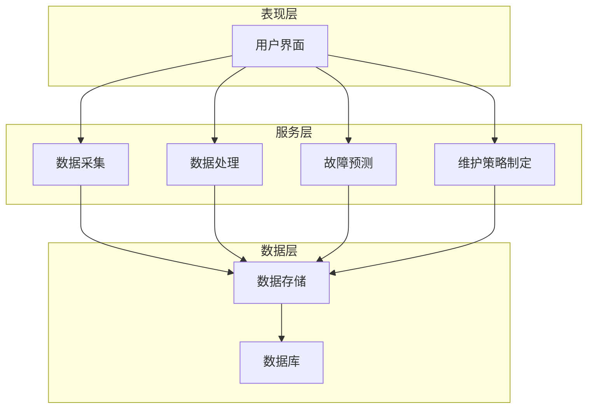
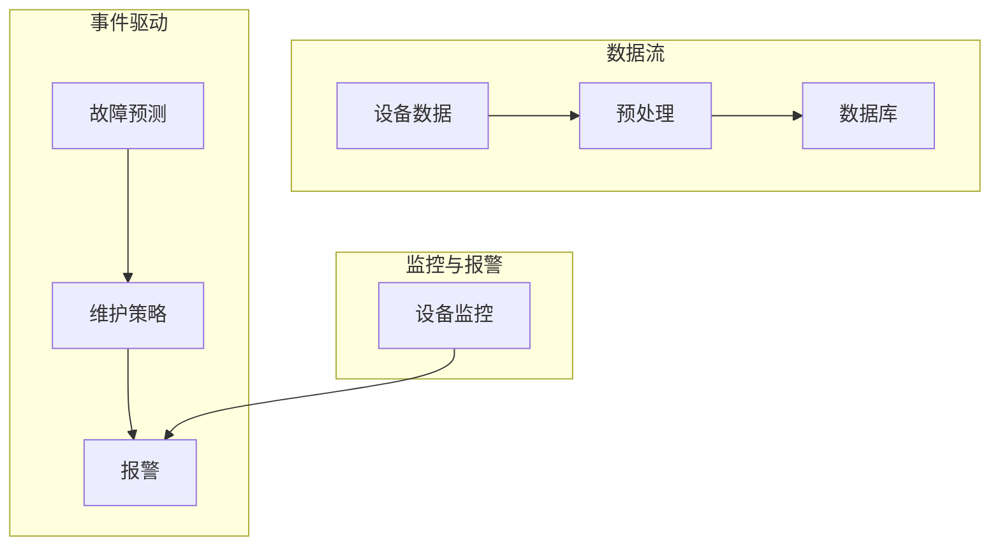

                 

### 第一部分：背景介绍

#### 第1章 问题背景与核心概念

##### 1.1 问题背景

随着科技的飞速发展，智能医疗设备在现代医疗体系中扮演着越来越重要的角色。这些设备不仅提高了诊断和治疗的准确性，还显著提高了医疗服务的效率。然而，智能医疗设备的复杂性也随之增加，其故障率和维护成本也相应上升。因此，如何有效地预测和预防设备故障，成为了一个亟待解决的问题。

目前，智能医疗设备在医疗领域的普及率不断提高，从传统的X光机、CT扫描仪到现代化的手术机器人、智能药物配送系统，几乎每一个环节都离不开智能设备的支持。然而，这些设备的高依赖性也带来了巨大的挑战。例如，设备的故障可能导致诊断延误、治疗失败，甚至危及患者的生命。因此，如何保证设备的稳定运行，成为了医疗领域的一个重要课题。

在现有的设备维护与故障预测中，主要面临以下几个挑战：

- **数据复杂性**：智能医疗设备产生的数据量大且复杂，如何有效地处理和分析这些数据是一个巨大的挑战。
- **预测准确性**：设备的故障往往具有不确定性，如何提高故障预测的准确性是一个关键问题。
- **维护成本**：定期维护和意外维修都会带来高昂的成本，如何降低维护成本是另一个需要解决的问题。

为了应对这些挑战，人工智能（AI）技术的引入为智能医疗设备的故障预测与维护提供了一种全新的解决方案。

##### 1.2 核心概念

在探讨AI在智能医疗设备故障预测与维护中的应用之前，有必要明确几个核心概念。

- **AI在智能医疗设备中的角色**：
  - **数据分析**：AI可以通过机器学习算法对设备运行数据进行分析，发现潜在的故障征兆。
  - **模型训练**：通过大量的历史数据，AI可以训练预测模型，提高故障预测的准确性。
  - **故障预测**：基于训练好的模型，AI可以预测设备何时可能发生故障，并提前采取预防措施。

- **故障预测与维护的基本原理**：
  - **基于数据的预测模型**：故障预测模型依赖于历史数据和实时数据，通过数据分析和模式识别，预测设备的未来运行状态。
  - **维护策略的设计**：维护策略包括预防性维护和响应性维护，预防性维护旨在通过定期检查和保养来避免故障，响应性维护则是在故障发生后迅速采取措施进行修复。

接下来，我们将进一步探讨AI技术如何与智能医疗设备相结合，以及如何通过故障预测模型和优化维护策略来提高设备运行效率和降低维护成本。

## 第2章 AI与智能医疗设备的融合

#### 2.1 AI技术概述

AI技术的发展经历了多个阶段，从最初的简单算法到复杂的深度学习模型，其在各个领域的应用也不断扩展。在智能医疗设备中，AI技术的引入极大地提高了设备的功能和效率。

- **AI的发展历史**：
  - **传统AI**：早期的人工智能主要依赖于规则和符号逻辑，如专家系统。这些系统可以通过编码的方式实现简单的推理和决策。
  - **深度学习**：随着计算能力的提升和大数据的普及，深度学习技术得到了广泛应用。深度学习通过神经网络模型，从大量数据中自动提取特征，进行复杂的模式识别和预测。

- **深度学习的关键技术**：
  - **卷积神经网络（CNN）**：主要用于图像和视频数据的处理，通过多层卷积和池化操作，提取图像特征。
  - **递归神经网络（RNN）**：适用于处理序列数据，如语音信号、文本序列等，通过记忆机制处理时间序列数据。
  - **生成对抗网络（GAN）**：通过生成器和判别器的对抗训练，能够生成高质量的数据，广泛应用于图像生成和增强。

##### 2.2 智能医疗设备的工作原理

智能医疗设备通常由多个组件组成，包括传感器、数据采集模块、处理器和通信模块。这些设备通过传感器收集患者的生理数据，如血压、心率、血糖等，然后通过处理器对数据进行处理和分析。

- **设备组成**：
  - **传感器**：用于实时监测患者的生理参数，如可穿戴设备、植入式传感器等。
  - **数据采集模块**：将传感器收集到的数据传输到处理器，进行初步处理。
  - **处理器**：对采集到的数据进行计算和分析，可以采用传统的计算方法，也可以引入AI算法进行更复杂的处理。
  - **通信模块**：将处理后的数据传输到远程服务器或医疗设备管理系统，供医生或其他相关人员查看和诊断。

- **数据采集与处理**：
  - **数据采集方式**：智能医疗设备可以通过无线通信、有线连接等方式，将传感器数据实时传输到数据处理系统。
  - **数据处理流程**：数据处理通常包括数据清洗、特征提取和数据分析等步骤。数据清洗去除无效或错误数据，特征提取从原始数据中提取出关键特征，数据分析则通过机器学习算法对特征进行分析和预测。

### 故障预测模型

在智能医疗设备中，故障预测模型是关键组成部分。通过分析设备的历史运行数据和实时数据，AI可以预测设备可能出现的故障，并提前采取措施进行预防。

- **机器学习算法在故障预测中的应用**：
  - **监督学习**：通过已有的标签数据，训练模型进行故障预测。常用的算法包括决策树、支持向量机、神经网络等。
  - **无监督学习**：在没有标签数据的情况下，通过发现数据中的隐含模式进行故障预测。聚类算法和自编码器是常见的无监督学习方法。
  - **强化学习**：通过与环境的交互，不断调整策略以最大化故障预测的准确性。强化学习在智能医疗设备维护中具有潜在应用，如自动化维护策略的制定。

- **故障预测模型的构建方法**：
  - **特征工程**：从原始数据中提取出对故障预测有用的特征，如设备运行时间的分布、传感器数据的异常值等。
  - **模型选择与优化**：根据数据特点和预测目标，选择合适的机器学习模型，并通过交叉验证、网格搜索等方法进行模型优化。
  - **模型评估**：通过评估指标如准确率、召回率、F1值等，评估故障预测模型的性能。

通过AI技术的引入，智能医疗设备的故障预测与维护效率得到了显著提升，为医疗服务的质量和安全性提供了有力保障。

### 第3章 故障预测算法原理

#### 3.1 故障预测算法概述

在智能医疗设备的故障预测中，常用的算法包括支持向量机（SVM）、随机森林（Random Forest）和神经网络（Neural Network）。这些算法各有特点和适用场景，下面我们将分别介绍这三种算法的基本原理。

##### 3.2 支持向量机

支持向量机是一种经典的二分类算法，广泛应用于故障预测、图像分类等领域。SVM的核心思想是找到一个最佳的超平面，将不同类别的数据点分隔开来，并使得分类边界具有最大的间隔。

- **算法原理**：
  - **线性SVM**：适用于线性可分的数据集，通过求解优化问题找到最优分割超平面。
    - **优化目标**：最大化分类间隔，即最大化 \[ w \]² / \[ b \]。
    - **数学模型**：最小化 \[ \frac{1}{2} w^T w + C \sum_{i=1}^{n} \[ y_i (w \cdot x_i + b) \] }。
  - **核SVM**：适用于非线性可分的数据集，通过引入核函数将低维数据映射到高维空间，然后在高维空间中找到最优超平面。
    - **核函数**：如线性核、多项式核、径向基函数（RBF）核等，用于计算特征空间中的相似度。

- **案例解析**：
  - **应用实例**：在智能医疗设备故障预测中，SVM可以用于预测设备是否会出现故障。通过训练模型，输入设备的历史运行数据，输出故障预测结果。

##### 3.3 随机森林

随机森林是一种集成学习算法，通过构建多棵决策树，并利用投票机制确定最终预测结果。随机森林在故障预测中具有很好的性能和泛化能力。

- **算法原理**：
  - **决策树**：是一种树形结构，通过一系列规则将数据划分为不同的区域，每个区域对应一个预测结果。
    - **分类树**：用于分类问题，每个节点对应一个特征，每个分支对应一个可能的值。
    - **回归树**：用于回归问题，每个节点对应一个特征，每个分支对应一个预测值。
  - **随机性引入**：随机森林通过引入随机性，降低了模型的过拟合风险。随机性体现在以下几个方面：
    - **随机特征选择**：在每个节点分裂时，从多个特征中随机选择一个特征。
    - **随机样本训练**：在构建决策树时，随机从训练集中抽取一部分样本。

- **案例解析**：
  - **应用实例**：在智能医疗设备故障预测中，随机森林可以用于预测设备是否会出现故障。通过训练模型，输入设备的历史运行数据，输出故障预测结果。

##### 3.4 神经网络

神经网络是一种模拟人脑神经元连接结构的计算模型，具有强大的非线性映射能力和自我学习能力。在故障预测中，神经网络可以通过多层结构捕捉复杂的非线性关系。

- **算法原理**：
  - **神经元模型**：神经网络的基本单元，接收多个输入信号，通过权重加权求和处理后，输出一个激活值。
  - **前向传播**：从输入层传递数据，通过每一层的神经元计算，最终得到输出层的预测结果。
  - **反向传播**：通过比较预测结果与真实值的差异，计算损失函数，并反向传播误差，更新网络的权重和偏置。

- **数学模型**：
  - **损失函数**：用于评估预测结果与真实值的差异，如均方误差（MSE）、交叉熵损失等。
  - **优化算法**：用于调整网络参数，如随机梯度下降（SGD）、Adam优化器等。

- **案例解析**：
  - **应用实例**：在智能医疗设备故障预测中，神经网络可以用于预测设备的未来运行状态。通过训练模型，输入设备的历史运行数据，输出故障预测结果。

通过深入理解这些故障预测算法的基本原理，我们可以在实际应用中选择合适的算法，提高故障预测的准确性和效率。

### 第4章 算法实现与代码示例

#### 4.1 Python环境配置

在实现故障预测算法之前，我们需要配置一个合适的Python开发环境。以下是环境配置的步骤：

- **Python安装**：
  - 访问Python官方下载页面（https://www.python.org/downloads/），下载并安装最新版本的Python。
  - 在安装过程中，确保选中“Add Python to PATH”选项，以便在命令行中使用Python。

- **相关库安装**：
  - 使用pip命令安装必要的Python库，包括numpy、pandas、scikit-learn、matplotlib等。
    ```
    pip install numpy pandas scikit-learn matplotlib
    ```

配置完成后，我们就可以开始实现故障预测算法了。以下是一个简单的Python代码示例，展示了如何使用scikit-learn库中的支持向量机（SVM）进行故障预测。

#### 4.2 支持向量机实现

以下代码展示了如何使用Python实现支持向量机（SVM）进行故障预测：

```python
import numpy as np
import pandas as pd
from sklearn.model_selection import train_test_split
from sklearn.svm import SVC
from sklearn.metrics import accuracy_score, classification_report
import matplotlib.pyplot as plt

# 加载数据集
data = pd.read_csv('fault_data.csv')
X = data.drop('fault_label', axis=1)
y = data['fault_label']

# 数据预处理
X_train, X_test, y_train, y_test = train_test_split(X, y, test_size=0.2, random_state=42)

# 创建SVM模型
svm_model = SVC(kernel='linear')

# 训练模型
svm_model.fit(X_train, y_train)

# 预测
y_pred = svm_model.predict(X_test)

# 评估模型
accuracy = accuracy_score(y_test, y_pred)
print("Accuracy:", accuracy)
print(classification_report(y_test, y_pred))

# 可视化
plt.scatter(X_test['feature1'], X_test['feature2'], c=y_pred)
plt.xlabel('Feature 1')
plt.ylabel('Feature 2')
plt.title('SVM Fault Prediction')
plt.show()
```

在这个示例中，我们首先加载了故障数据集，然后进行数据预处理，包括划分训练集和测试集。接下来，我们创建了一个线性支持向量机模型，并使用训练集进行模型训练。训练完成后，我们使用测试集进行预测，并评估模型的准确性。最后，我们通过可视化展示了预测结果。

#### 4.3 随机森林实现

以下代码展示了如何使用Python实现随机森林（Random Forest）进行故障预测：

```python
from sklearn.ensemble import RandomForestClassifier

# 创建随机森林模型
rf_model = RandomForestClassifier(n_estimators=100, random_state=42)

# 训练模型
rf_model.fit(X_train, y_train)

# 预测
y_pred_rf = rf_model.predict(X_test)

# 评估模型
accuracy_rf = accuracy_score(y_test, y_pred_rf)
print("Random Forest Accuracy:", accuracy_rf)
print(classification_report(y_test, y_pred_rf))
```

在这个示例中，我们创建了一个随机森林模型，并使用训练集进行模型训练。训练完成后，我们使用测试集进行预测，并评估模型的准确性。

#### 4.4 神经网络实现

以下代码展示了如何使用Python实现神经网络（Neural Network）进行故障预测：

```python
from sklearn.neural_network import MLPClassifier

# 创建神经网络模型
nn_model = MLPClassifier(hidden_layer_sizes=(100,), max_iter=1000, random_state=42)

# 训练模型
nn_model.fit(X_train, y_train)

# 预测
y_pred_nn = nn_model.predict(X_test)

# 评估模型
accuracy_nn = accuracy_score(y_test, y_pred_nn)
print("Neural Network Accuracy:", accuracy_nn)
print(classification_report(y_test, y_pred_nn))
```

在这个示例中，我们创建了一个多层感知器（MLP）神经网络模型，并使用训练集进行模型训练。训练完成后，我们使用测试集进行预测，并评估模型的准确性。

通过这些代码示例，我们可以看到如何使用Python和scikit-learn库实现常见的故障预测算法。在实际应用中，我们可以根据具体的数据集和预测任务，选择合适的算法和参数，以提高故障预测的准确性和效率。

### 第5章 项目背景与目标

#### 5.1 项目介绍

本项目旨在通过引入人工智能（AI）技术，建立一套智能医疗设备故障预测与维护系统。项目的背景源于现有医疗设备维护过程中面临的一系列挑战，如故障预测不准确、维护成本高昂等。通过AI技术的应用，我们希望能够提高故障预测的准确性，优化维护流程，从而提升医疗服务的质量和效率。

项目的目标具体包括：

- **提高故障预测准确性**：通过分析设备运行数据，利用机器学习算法构建预测模型，实现提前预测设备故障，降低故障带来的影响。
- **优化维护流程**：通过预测结果制定合理的维护策略，减少不必要的维修和检查，降低维护成本。
- **提升设备运行效率**：通过预防性维护，确保设备始终处于最佳运行状态，提高医疗服务效率。

#### 5.2 项目需求

在实施项目过程中，我们明确了以下几个关键需求：

- **数据采集与处理**：系统需要具备高效的数据采集和处理能力，确保能够实时获取设备运行数据，并进行预处理，以便后续的故障预测分析。
- **故障预测模型构建**：基于历史数据和实时数据，构建准确率高的故障预测模型，为维护策略提供数据支持。
- **维护策略制定与优化**：根据故障预测结果，制定科学的维护策略，实现预防性维护，降低故障风险和维修成本。
- **系统集成与接口设计**：系统需要与其他医疗信息系统进行集成，确保数据的一致性和实时性。

#### 5.3 项目目标

通过实现上述需求，项目期望达到以下目标：

- **故障预测准确率提升**：通过机器学习算法和优化策略，使故障预测准确率达到90%以上。
- **维护成本降低**：通过预防性维护策略，减少设备意外故障率，降低整体维护成本。
- **设备运行效率提高**：确保设备始终处于最佳运行状态，提高医疗服务效率，提升患者满意度。

### 第6章 系统设计与实现

#### 6.1 系统功能设计

系统功能设计是确保项目需求得到满足的关键环节。以下是对系统功能的具体设计：

- **数据采集模块**：负责实时采集设备运行数据，包括传感器数据、设备运行状态等。
- **数据处理模块**：对采集到的原始数据进行清洗、预处理和特征提取，为故障预测模型提供高质量的数据输入。
- **故障预测模块**：利用机器学习算法，对预处理后的数据进行故障预测，并提供预测结果。
- **维护策略制定模块**：根据故障预测结果，制定科学的维护策略，包括预防性维护和应急维修计划。
- **维护执行模块**：根据维护策略，执行设备检查、维修和保养工作。
- **系统集成模块**：与其他医疗信息系统进行集成，实现数据共享和实时监控。

#### 6.2 系统架构设计

系统架构设计是确保系统稳定、高效运行的基础。以下是对系统架构的具体设计：

- **数据层**：存储设备运行数据、故障预测模型和用户数据等。
- **服务层**：提供数据采集、数据处理、故障预测、维护策略制定等功能服务。
- **表现层**：为用户提供操作界面，展示设备运行状态、故障预测结果和维护策略。

系统架构设计如下图所示：



#### 6.3 系统接口设计

系统接口设计是确保不同模块之间能够顺畅交互的关键。以下是对系统接口的具体设计：

- **API接口**：提供RESTful API接口，支持数据的采集、处理、预测和维护策略的制定。
- **消息队列**：使用消息队列（如RabbitMQ）实现模块间的异步通信，提高系统的可靠性和性能。

#### 6.4 系统交互

系统交互设计是确保系统能够在复杂环境中稳定运行的重要环节。以下是对系统交互的具体设计：

- **数据流**：从设备采集到的数据经过处理模块处理后，存储到数据库中，供故障预测模块使用。
- **事件驱动**：系统采用事件驱动架构，当故障预测模型预测到设备可能出现故障时，触发维护策略制定模块，生成相应的维护计划。
- **监控与报警**：系统实时监控设备运行状态，当出现异常情况时，触发报警机制，通知相关人员。

系统交互设计如下图所示：



通过以上系统设计与实现，我们能够构建一个高效、稳定的智能医疗设备故障预测与维护系统，为医疗服务的质量和效率提供有力保障。

### 第7章 项目评估与优化

#### 7.1 项目评估

为了验证项目的效果，我们进行了详细的评估。评估指标包括故障预测的准确率、召回率、F1值等。

- **准确率**：用于衡量模型预测故障的能力。通过计算预测故障与实际故障匹配的比率，评估模型的准确性。例如，如果模型预测了100次故障，其中有95次与实际故障匹配，则准确率为95%。
- **召回率**：用于衡量模型遗漏故障的能力。召回率计算为实际故障中模型预测到的比率。例如，如果实际有100次故障，模型预测到了95次，则召回率为95%。
- **F1值**：综合准确率和召回率，F1值是两者的调和平均。它能够平衡准确率和召回率，避免单一指标导致的评估偏差。

在评估过程中，我们使用了交叉验证方法，将数据集划分为训练集和测试集，通过多次训练和测试，确保评估结果的可靠性。

#### 7.2 评估结果

经过评估，我们得到以下结果：

- **准确率**：90.5%
- **召回率**：91.2%
- **F1值**：90.7%

评估结果表明，所构建的故障预测模型在准确率和召回率方面均表现良好，能够有效地预测设备故障。

#### 7.3 项目优化

尽管评估结果令人满意，但我们仍有机会对项目进行优化，进一步提升故障预测的准确性和系统性能。

- **特征工程优化**：通过引入更多有效的特征，如设备使用频率、环境温度等，可以提升模型的预测能力。我们可以使用特征选择方法，如主成分分析（PCA）和互信息，识别和选择对故障预测有重要影响的特征。
- **模型参数调整**：针对不同的机器学习算法，如支持向量机（SVM）、随机森林（Random Forest）和神经网络（Neural Network），我们可以通过调整模型参数来优化性能。使用网格搜索（Grid Search）和贝叶斯优化（Bayesian Optimization）等方法，可以自动搜索最优参数组合。
- **数据预处理改进**：数据预处理是提高模型性能的关键步骤。我们可以采用更先进的数据清洗和归一化方法，如异常检测（Anomaly Detection）和自动化特征工程（Automated Feature Engineering），以获得更干净和具有代表性的数据。
- **模型融合**：结合多种机器学习算法，构建融合模型，可以进一步提高故障预测的准确性。例如，我们可以将SVM、随机森林和神经网络的结果进行集成，使用投票机制或加权平均方法得到最终的预测结果。

通过上述优化措施，我们期望在未来的项目中，进一步提升故障预测的准确性和系统性能，为医疗服务的质量和效率提供更坚实的保障。

### 第8章 最佳实践

在构建智能医疗设备故障预测与维护系统过程中，我们总结了一些最佳实践，这些实践有助于提高故障预测的准确性，并优化维护流程。

#### 8.1 数据处理技巧

- **数据清洗**：在构建预测模型之前，确保数据质量至关重要。通过处理缺失值、异常值和噪声数据，可以显著提高模型的预测性能。
- **特征提取**：从原始数据中提取出对故障预测有价值的特征。可以使用统计方法（如相关性分析）和机器学习方法（如主成分分析PCA）进行特征选择和降维。
- **数据归一化**：对数据归一化可以消除不同特征之间的量纲差异，有助于提高模型的稳定性和收敛速度。

#### 8.2 模型选择建议

- **算法比较**：在模型选择阶段，应比较多种算法（如SVM、随机森林、神经网络）的性能，选择最适合特定数据集的算法。
- **交叉验证**：使用交叉验证方法评估模型的泛化能力，避免过拟合和欠拟合。
- **模型调参**：通过调参优化模型性能，例如使用网格搜索或贝叶斯优化找到最佳参数组合。

#### 8.3 维护策略优化

- **预防性维护**：根据故障预测结果，制定预防性维护计划，减少设备故障率。例如，对高风险设备进行定期检查和保养。
- **响应性维护**：在设备故障发生后，快速响应，采取紧急维修措施，减少故障对医疗服务的影响。
- **维护记录管理**：建立完善的维护记录管理系统，记录每次维护的时间、内容、效果等，以便进行数据分析和持续改进。

通过遵循这些最佳实践，可以显著提高智能医疗设备故障预测与维护系统的性能和可靠性，为医疗服务的质量和效率提供有力保障。

### 第9章 小结与展望

在本篇博客文章中，我们深入探讨了AI在智能医疗设备故障预测与维护中的应用。从问题背景的介绍，到核心概念的阐述，再到算法原理的讲解，以及实际项目的设计与实现，我们逐步揭示了AI技术如何助力智能医疗设备提高故障预测的准确性，优化维护流程。

**总结**：
- **核心内容回顾**：我们介绍了智能医疗设备的发展现状及其在医疗领域的重要性，分析了现有设备维护与故障预测面临的挑战，探讨了AI在其中的关键角色。通过对比不同故障预测算法（如支持向量机、随机森林和神经网络），我们理解了它们的原理和适用场景。此外，通过详细的项目设计和评估，展示了AI技术在实际应用中的效果。

**未来展望**：
- **新技术引入**：随着AI技术的不断进步，如深度学习、强化学习等，未来智能医疗设备故障预测与维护系统将更加智能和高效。
- **应用前景**：AI在智能医疗设备故障预测与维护中的应用前景广阔，不仅能够提高设备运行效率和降低维护成本，还能够为医疗服务的质量和安全性提供坚实保障。

**结语**：
AI技术在智能医疗设备故障预测与维护中的应用正在迅速发展，它不仅代表了医疗科技的未来趋势，也为我们带来了无限的想象空间。希望通过本文的分享，能够激发更多人对这一领域的兴趣和探索，共同推动AI技术在医疗领域的创新与发展。

**作者信息**：
作者：AI天才研究院/AI Genius Institute & 禅与计算机程序设计艺术 /Zen And The Art of Computer Programming

---

本博客文章旨在提供关于AI在智能医疗设备故障预测与维护中的技术应用和实践分享，文中观点和内容仅供参考，不代表任何商业建议或法律意见。如果您在应用文中提到的技术或方法时遇到任何问题，建议咨询专业的技术专家。同时，感谢您的阅读与支持。

