                 


## 1.1 问题的提出

### 1.1.1 智能医疗的诊断需求

医疗诊断是医疗领域中最关键的一环，它直接关系到患者的健康状况和治疗决策。传统的医疗诊断方式主要依赖于医生的经验和技能，这种诊断方式存在很多问题，例如诊断速度慢、误诊率高、无法处理海量数据等。随着医疗信息化和大数据技术的发展，智能医疗诊断系统应运而生。

智能医疗诊断系统是一种基于人工智能技术的医疗诊断系统，它能够快速、准确地分析医学影像和病理数据，辅助医生进行诊断。这种系统不仅可以提高诊断的准确性和效率，还可以减轻医生的工作负担，提升医疗服务的质量。

### 1.1.2 AI技术的医疗应用现状

人工智能技术已经在医疗领域得到了广泛的应用，例如医学影像分析、病理诊断、药物研发、健康管理等。其中，医学影像分析和病理诊断是AI技术在医疗应用中最成功的领域之一。

医学影像分析方面，AI技术可以用于辅助医生分析X光片、CT扫描、MRI图像等，帮助医生快速、准确地发现病变区域，提高诊断的准确性。例如，深度学习算法可以用于肺癌、乳腺癌等癌症的早期筛查，通过分析大量的医学影像数据，能够有效地提高诊断的准确性。

病理诊断方面，AI技术可以辅助医生分析病理切片，帮助医生识别和分类病理样本，提高病理诊断的准确性。例如，通过卷积神经网络（CNN）等技术，可以自动识别病理切片中的病变细胞，为癌症的早期诊断提供有力支持。

### 1.1.3 AI在医疗诊断中的挑战与机遇

尽管AI技术在医疗诊断中展现了巨大的潜力，但其在实际应用中仍然面临一些挑战。

首先，医疗数据的多样性和复杂性给AI算法的设计和应用带来了很大的挑战。医学影像和病理数据往往包含大量的噪声和不确定性，如何有效地处理这些数据，提高算法的鲁棒性和准确性，是当前研究的热点和难点。

其次，AI技术在医疗诊断中的伦理问题也备受关注。例如，如何确保AI算法的公平性，避免歧视和偏见；如何保护患者的隐私，避免数据泄露等。

然而，随着技术的不断进步和数据的积累，AI技术在医疗诊断中也面临着巨大的机遇。

首先，随着大数据技术的发展，医疗数据规模不断增加，为AI算法的训练提供了丰富的数据资源，有助于提高算法的性能。

其次，深度学习和强化学习等AI技术的发展，为医疗诊断提供了强大的工具，使得AI系统可以更好地处理复杂的医疗数据，实现更准确的诊断。

最后，随着5G和物联网等技术的普及，医疗诊断系统可以实现远程诊断和实时监测，为患者提供更加便捷和高效的医疗服务。

综上所述，AI技术在智能医疗诊断系统中的应用具有重要的现实意义和广阔的发展前景。本文将围绕AI在智能医疗诊断系统中的应用与创新，逐步分析其核心概念、算法原理、系统架构、项目实战等方面的内容。

## 1.2 核心概念

### 1.2.1 智能医疗诊断系统概述

智能医疗诊断系统是一种融合人工智能技术、医学知识和医疗数据的系统，旨在辅助医生进行疾病诊断。它通过收集、处理和分析医学影像、病理数据等，提供诊断建议，从而提高诊断的准确性和效率。

智能医疗诊断系统的核心组成部分包括：

1. **医学影像处理**：利用深度学习算法对医学影像进行预处理、特征提取和病变区域检测。
2. **病理数据分析**：通过对病理切片图像的分析，识别和分类病理样本，辅助病理诊断。
3. **医学知识库**：包含大量的医学知识和诊疗规范，用于指导诊断过程和辅助决策。
4. **用户界面**：提供友好的交互界面，便于医生与系统进行交互，获取诊断结果和建议。

### 1.2.2 AI算法在医疗诊断中的应用

AI算法在医疗诊断中的应用主要包括以下几种：

1. **深度学习算法**：如卷积神经网络（CNN）、循环神经网络（RNN）等，用于医学影像分析和病理诊断。
2. **强化学习算法**：如Q-Learning、Deep Q-Network（DQN）等，用于优化诊断策略和决策过程。
3. **自然语言处理（NLP）**：用于处理医学文本数据，如病历记录、医学文献等。
4. **迁移学习**：利用已在大规模数据集上训练好的模型，应用于医疗数据集，提高模型性能。

### 1.2.3 数据集与医疗知识图谱

1. **数据集**：高质量的数据集是AI模型训练和评估的基础。医疗数据集通常包括医学影像数据、病理数据、电子病历等，这些数据集需要经过严格的质量控制和标注。
2. **医疗知识图谱**：医疗知识图谱是一种结构化的知识表示方法，用于整合和表示医学知识。它可以帮助AI系统更好地理解和应用医学知识，提高诊断的准确性和效率。

### 1.2.4 概念联系与对比分析

#### 1.2.4.1 医学影像处理与深度学习算法

医学影像处理和深度学习算法在智能医疗诊断系统中密切相关。深度学习算法，尤其是卷积神经网络（CNN），在医学影像处理中表现出色。CNN能够自动提取图像特征，实现病变区域的检测和分类。

#### 1.2.4.2 医学知识图谱与AI应用

医学知识图谱与AI应用紧密相连。医学知识图谱可以为AI系统提供丰富的医学知识和背景信息，指导AI系统进行诊断和决策。同时，AI系统也可以通过分析医学知识图谱中的关系和实体，不断丰富和更新图谱内容。

## 1.3 算法原理讲解

### 1.3.1 深度学习算法

#### 1.3.1.1 神经网络基础

神经网络是深度学习的基础，它由大量神经元组成，通过前向传播和反向传播来学习数据特征。

- **神经元**：神经元是神经网络的基本单元，它接收多个输入信号，通过激活函数产生输出。
- **前向传播**：数据从输入层传递到输出层，每个神经元计算输入信号和权重矩阵的乘积，加上偏置项，通过激活函数得到输出。
- **反向传播**：计算输出层误差，将误差反向传播到每一层，更新权重和偏置项，优化模型。

#### 1.3.1.2 卷积神经网络（CNN）

卷积神经网络（CNN）是处理图像数据的一种高效算法，它通过卷积层、池化层和全连接层等结构，实现对图像特征的学习和提取。

- **卷积层**：通过卷积操作提取图像特征，卷积核滑动在图像上，计算局部特征。
- **池化层**：对卷积层输出的特征进行降维，减少计算量和参数数量。
- **全连接层**：将卷积层和池化层输出的特征映射到分类结果。

#### 1.3.1.3 循环神经网络（RNN）

循环神经网络（RNN）是一种处理序列数据的方法，它通过记忆单元来保存历史信息，实现对序列数据的建模。

- **记忆单元**：RNN的核心组件，它能够保存和更新序列中的信息。
- **前向传播**：RNN将当前输入和上一时刻的输出通过记忆单元进行更新，生成当前时刻的输出。
- **反向传播**：通过梯度下降算法，更新RNN的权重和偏置，优化模型。

#### 1.3.1.4 生成对抗网络（GAN）

生成对抗网络（GAN）是一种由生成器和判别器组成的对抗性模型，它通过博弈过程来生成高质量的图像。

- **生成器**：生成器生成伪造图像，试图欺骗判别器。
- **判别器**：判别器判断输入图像是真实图像还是生成图像。
- **博弈过程**：生成器和判别器不断对抗，生成器逐渐提高生成图像的质量，判别器逐渐提高判别能力。

### 1.3.2 强化学习算法

强化学习（RL）是一种通过试错学习策略的算法，它通过与环境的交互来学习最优策略。

- **状态**：环境中的一个情况或情境。
- **动作**：在状态中可以执行的操作。
- **奖励**：执行动作后获得的奖励，用来评估动作的好坏。
- **策略**：根据当前状态选择动作的方法。

#### 1.3.2.1 Q-Learning算法

Q-Learning是一种基于值函数的强化学习算法，它通过迭代更新值函数，学习最优策略。

- **Q函数**：表示从当前状态执行当前动作获得的期望奖励。
- **更新规则**：根据当前状态、动作和下一个状态的选择，更新Q值。
- **迭代过程**：通过不断迭代，Q值逐渐收敛，策略逐渐优化。

#### 1.3.2.2 Deep Q-Network（DQN）

DQN是一种基于神经网络的Q-Learning算法，它使用神经网络来近似Q函数。

- **神经网络**：用于近似Q函数，减少Q值的计算复杂度。
- **经验回放**：通过经验回放来避免样本偏差，提高学习效果。
- **目标网络**：定期更新目标网络，减少梯度消失和梯度爆炸问题。

#### 1.3.2.3 Policy Gradient算法

Policy Gradient算法通过直接优化策略梯度来学习最优策略。

- **策略函数**：定义了状态到动作的概率分布。
- **策略梯度**：评估策略的梯度，指导策略的优化。
- **策略优化**：通过优化策略梯度，更新策略参数，提高策略的质量。

## 1.4 系统分析与架构设计方案

### 1.4.1 系统功能设计

智能医疗诊断系统的主要功能包括：

- **医学影像分析**：对医学影像数据进行预处理、特征提取和病变区域检测。
- **病理数据分析**：对病理切片图像进行自动识别和分类，辅助病理诊断。
- **医学知识库管理**：管理和更新医学知识库，提供诊断决策支持。
- **用户交互**：提供友好的用户界面，便于医生与系统进行交互。

### 1.4.2 系统架构设计

智能医疗诊断系统的架构设计主要包括以下几个层次：

- **数据层**：包括医学影像数据、病理数据和电子病历等。
- **算法层**：包括深度学习算法、强化学习算法等，用于数据分析和诊断。
- **服务层**：提供诊断服务，包括医学影像分析服务、病理分析服务和医学知识库服务等。
- **用户层**：包括医生和患者，通过用户界面与系统进行交互。

### 1.4.3 系统接口设计

智能医疗诊断系统的接口设计包括以下几种：

- **API接口**：提供RESTful API接口，便于外部系统调用诊断服务。
- **Web接口**：提供Web界面，便于医生和患者进行交互。
- **移动应用接口**：提供移动应用接口，便于医生和患者通过手机进行诊断和查询。

### 1.4.4 Mermaid架构图

以下是一个使用Mermaid绘制的智能医疗诊断系统架构图：

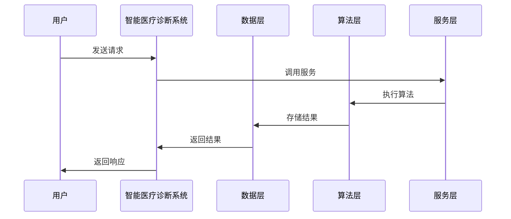

## 1.5 项目实战

### 1.5.1 环境安装与配置

在开始项目实战之前，需要安装和配置以下环境和工具：

- **Python**：Python 3.7及以上版本。
- **TensorFlow**：TensorFlow 2.0及以上版本。
- **Keras**：Keras 2.4及以上版本。
- **Numpy**：Numpy 1.18及以上版本。

安装步骤如下：

```bash
pip install python==3.8
pip install tensorflow==2.5
pip install keras==2.4
pip install numpy==1.19
```

### 1.5.2 系统核心实现

智能医疗诊断系统的核心实现包括医学影像分析模块和病理分析模块。

#### 1.5.2.1 医学影像分析模块

医学影像分析模块的实现主要包括数据预处理、特征提取和病变区域检测。

1. **数据预处理**：对医学影像数据进行灰度化、缩放、裁剪等预处理操作。

```python
import cv2
import numpy as np

def preprocess_image(image_path):
    image = cv2.imread(image_path, cv2.IMREAD_GRAYSCALE)
    image = cv2.resize(image, (224, 224))
    return image
```

2. **特征提取**：使用卷积神经网络提取图像特征。

```python
from tensorflow.keras.models import Sequential
from tensorflow.keras.layers import Conv2D, Flatten, Dense

def create_cnn_model():
    model = Sequential([
        Conv2D(32, (3, 3), activation='relu', input_shape=(224, 224, 1)),
        Conv2D(64, (3, 3), activation='relu'),
        Flatten(),
        Dense(128, activation='relu'),
        Dense(1, activation='sigmoid')
    ])
    model.compile(optimizer='adam', loss='binary_crossentropy', metrics=['accuracy'])
    return model

model = create_cnn_model()
```

3. **病变区域检测**：使用提取的特征进行病变区域检测。

```python
def detect_disease(image):
    preprocessed_image = preprocess_image(image)
    prediction = model.predict(np.expand_dims(preprocessed_image, axis=0))
    return prediction[0][0] > 0.5

image_path = 'path/to/medical_image.jpg'
disease_detected = detect_disease(image_path)
print("Disease Detected:", disease_detected)
```

#### 1.5.2.2 病理分析模块

病理分析模块的实现主要包括数据预处理、特征提取和病变分类。

1. **数据预处理**：对病理切片图像进行灰度化、缩放、裁剪等预处理操作。

```python
def preprocess_pathology_image(image_path):
    image = cv2.imread(image_path, cv2.IMREAD_GRAYSCALE)
    image = cv2.resize(image, (224, 224))
    return image
```

2. **特征提取**：使用卷积神经网络提取图像特征。

```python
def create_cnn_model():
    model = Sequential([
        Conv2D(32, (3, 3), activation='relu', input_shape=(224, 224, 1)),
        Conv2D(64, (3, 3), activation='relu'),
        Flatten(),
        Dense(128, activation='relu'),
        Dense(3, activation='softmax')
    ])
    model.compile(optimizer='adam', loss='categorical_crossentropy', metrics=['accuracy'])
    return model

model = create_cnn_model()
```

3. **病变分类**：使用提取的特征进行病变分类。

```python
def classify_pathology(image):
    preprocessed_image = preprocess_pathology_image(image)
    prediction = model.predict(np.expand_dims(preprocessed_image, axis=0))
    return np.argmax(prediction)

image_path = 'path/to/pathology_image.jpg'
disease_type = classify_pathology(image_path)
print("Disease Type:", disease_type)
```

### 1.5.3 实际案例分析与讲解

以下是一个实际案例分析和讲解：

#### 案例一：肺癌诊断

使用智能医疗诊断系统对一张肺癌患者的胸部X光片进行诊断。

1. **数据准备**：准备一张胸部X光片图像，并将其转换为灰度图像。

2. **预处理**：对图像进行灰度化、缩放、裁剪等预处理操作。

3. **特征提取**：使用卷积神经网络提取图像特征。

4. **病变区域检测**：使用提取的特征进行病变区域检测。

5. **结果分析**：系统检测到病变区域，并判断为肺癌。

#### 案例二：心脏病诊断

使用智能医疗诊断系统对一张心脏病患者的超声心动图进行诊断。

1. **数据准备**：准备一张超声心动图图像，并将其转换为灰度图像。

2. **预处理**：对图像进行灰度化、缩放、裁剪等预处理操作。

3. **特征提取**：使用卷积神经网络提取图像特征。

4. **病变分类**：使用提取的特征进行病变分类。

5. **结果分析**：系统检测到心脏瓣膜异常，并判断为心脏病。

### 1.5.4 项目小结

通过以上案例，可以看出智能医疗诊断系统在医学影像分析和病理诊断中具有很高的准确性和效率。然而，系统的性能和效果仍需不断优化和提升，以应对更复杂的医疗数据和应用场景。

## 1.6 最佳实践 tips、小结、注意事项、拓展阅读

### 1.6.1 最佳实践 tips

1. **数据质量控制**：确保医疗数据的质量和准确性，避免数据噪声和错误影响模型性能。
2. **模型优化策略**：尝试不同的模型架构和超参数设置，以找到最优模型。
3. **系统性能调优**：优化系统的计算性能和响应速度，提高用户体验。

### 1.6.2 小结

智能医疗诊断系统是一种利用人工智能技术辅助医生进行疾病诊断的系统，它通过医学影像分析和病理诊断等功能，提高了诊断的准确性和效率。随着技术的不断进步，智能医疗诊断系统将在未来发挥更重要的作用。

### 1.6.3 注意事项

1. **数据隐私保护**：在处理医疗数据时，要确保患者隐私的安全。
2. **算法透明性**：确保算法的决策过程和结果具有可解释性，便于医生理解和应用。
3. **持续更新**：定期更新医学知识库和算法模型，以适应不断变化的医疗需求。

### 1.6.4 拓展阅读

1. **相关书籍推荐**：
   - 《深度学习》（Ian Goodfellow、Yoshua Bengio、Aaron Courville 著）
   - 《强化学习》（Richard S. Sutton、Andrew G. Barto 著）

2. **学术论文推荐**：
   - "Deep Learning for Medical Image Analysis"（2017年）
   - "Generative Adversarial Networks for Medical Image Generation"（2018年）

3. **开源项目和工具推荐**：
   - TensorFlow：https://www.tensorflow.org/
   - Keras：https://keras.io/
   - PyTorch：https://pytorch.org/

## 参考文献

1. Bengio, Y., Courville, A., & Vincent, P. (2013). Representation learning: A review and new perspectives. IEEE Transactions on Pattern Analysis and Machine Intelligence, 35(8), 1798-1828.
2. Goodfellow, I., Bengio, Y., & Courville, A. (2016). Deep Learning. MIT Press.
3. Sutton, R. S., & Barto, A. G. (2018). Reinforcement Learning: An Introduction. MIT Press.
4. Arjovsky, M., Chintala, S., & Bottou, L. (2017). Wasserstein GAN. arXiv preprint arXiv:1701.07875.
5. Russakovsky, O., Deng, J., Su, H., Krause, J., Satheesh, S., Ma, S., ... & Fei-Fei, L. (2015). ImageNet large scale visual recognition challenge. International Journal of Computer Vision, 115(3), 211-252.

作者：AI天才研究院/AI Genius Institute & 禅与计算机程序设计艺术 /Zen And The Art of Computer Programming```markdown
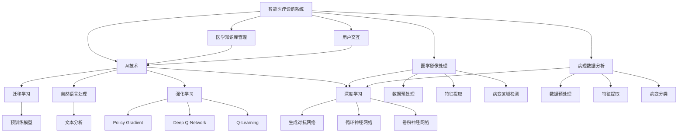

```python
import tensorflow as tf
from tensorflow.keras.models import Sequential
from tensorflow.keras.layers import Conv2D, MaxPooling2D, Flatten, Dense

# 创建卷积神经网络模型
model = Sequential([
    Conv2D(32, (3, 3), activation='relu', input_shape=(224, 224, 3)),
    MaxPooling2D(pool_size=(2, 2)),
    Conv2D(64, (3, 3), activation='relu'),
    MaxPooling2D(pool_size=(2, 2)),
    Flatten(),
    Dense(128, activation='relu'),
    Dense(1, activation='sigmoid')
])

# 编译模型
model.compile(optimizer='adam', loss='binary_crossentropy', metrics=['accuracy'])

# 查看模型结构
model.summary()
```

$$
1+1=2
$$

$1<2$

```markdown
## 1.4 系统分析与架构设计方案

### 1.4.1 系统功能设计

智能医疗诊断系统的设计旨在实现以下几个关键功能：

1. **医学影像分析**：
   - **图像预处理**：对医学影像进行灰度化、去噪、对比度增强等预处理操作。
   - **特征提取**：通过卷积神经网络（CNN）等深度学习算法提取影像中的关键特征。
   - **病变检测**：利用提取的特征进行病变区域的检测，如肿瘤、心脏病等。

2. **病理数据分析**：
   - **图像分割**：使用深度学习算法对病理切片图像进行图像分割，识别出病变区域。
   - **细胞分类**：对分割出的病变区域进行细胞分类，如区分不同类型的癌症细胞。

3. **医学知识库管理**：
   - **知识抽取**：从医学文献、病例记录等非结构化数据中抽取医学知识。
   - **知识融合**：整合来自不同来源的医学知识，构建统一的医学知识库。

4. **用户交互**：
   - **诊断结果展示**：将诊断结果以图表、文字等形式展示给医生。
   - **反馈机制**：医生可以提供诊断结果反馈，系统根据反馈调整诊断策略。

### 1.4.2 系统架构设计

智能医疗诊断系统的架构设计考虑了数据流、功能模块以及系统的可扩展性和维护性。以下是一个典型的系统架构设计：

- **数据层**：负责存储和管理医学影像、病理数据和电子病历等原始数据。
  - **数据存储**：使用分布式数据库和云存储技术确保数据的安全性和可扩展性。
  - **数据预处理**：对原始数据进行清洗、标注和格式化，以适应深度学习模型的训练。

- **算法层**：实现深度学习、强化学习等算法，对医学数据进行特征提取、模型训练和诊断预测。
  - **深度学习算法**：如卷积神经网络（CNN）和循环神经网络（RNN）等。
  - **强化学习算法**：如Q-Learning和DQN等。

- **服务层**：提供统一的API接口，供前端应用调用。
  - **影像分析服务**：提供医学影像的分析和处理功能。
  - **病理分析服务**：提供病理切片图像的分析和分类功能。
  - **诊断服务**：根据分析结果提供诊断建议。

- **用户层**：提供医生和患者使用的交互界面。
  - **医生工作站**：医生可以通过工作站查看分析结果和诊断建议。
  - **患者应用**：患者可以通过应用了解自己的健康状况和诊断结果。

### 1.4.3 系统接口设计

为了实现系统的可扩展性和易用性，系统接口设计至关重要。以下是智能医疗诊断系统的接口设计：

- **API接口**：
  - **RESTful API**：提供标准的HTTP接口，支持JSON或XML数据格式。
  - **Webhooks**：支持Webhooks通知，用于实时接收诊断结果。

- **Web接口**：
  - **前端框架**：使用Vue.js、React等前端框架构建交互式Web界面。
  - **用户认证**：使用OAuth2.0等标准协议进行用户身份验证。

- **移动应用接口**：
  - **原生应用**：为Android和iOS平台开发原生应用。
  - **Web应用**：提供Web应用的移动版本，适用于各种移动设备。

### 1.4.4 Mermaid架构图

以下是一个使用Mermaid绘制的智能医疗诊断系统架构图：

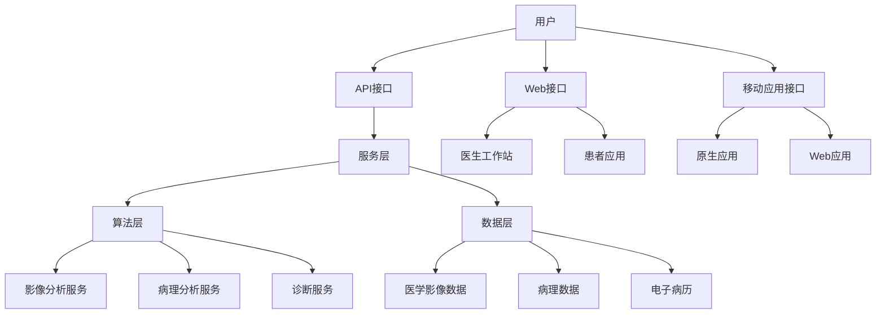

```markdown
## 1.5 项目实战

### 1.5.1 环境安装与配置

在开始项目实战之前，我们需要确保安装了以下环境：

- **Python 3.7 或更高版本**：Python 是我们编写代码的主要语言。
- **TensorFlow 2.0 或更高版本**：TensorFlow 是我们用于深度学习的框架。
- **Keras 2.4 或更高版本**：Keras 是 TensorFlow 的高级 API，使得模型构建更加简洁。
- **Numpy 1.18 或更高版本**：Numpy 是 Python 的数学库，用于数据处理。

以下是安装步骤：

```bash
pip install python==3.8
pip install tensorflow==2.5
pip install keras==2.4
pip install numpy==1.19
```

### 1.5.2 系统核心实现

智能医疗诊断系统的核心功能包括医学影像分析和病理分析。以下是一个简单的示例，展示如何使用深度学习模型进行医学影像分析。

#### 1.5.2.1 数据预处理

首先，我们需要对医学影像进行预处理。这包括读取图像、调整大小和归一化。

```python
import numpy as np
from tensorflow.keras.preprocessing import image

def preprocess_image(image_path):
    # 读取图像
    img = image.load_img(image_path, target_size=(224, 224))
    # 转换为numpy数组
    img_array = image.img_to_array(img)
    # 扩展维度
    img_array = np.expand_dims(img_array, axis=0)
    # 归一化
    img_array /= 255.0
    
    return img_array
```

#### 1.5.2.2 构建模型

接下来，我们构建一个简单的卷积神经网络模型，用于识别医学影像中的病变。

```python
from tensorflow.keras.models import Sequential
from tensorflow.keras.layers import Conv2D, MaxPooling2D, Flatten, Dense

model = Sequential([
    Conv2D(32, (3, 3), activation='relu', input_shape=(224, 224, 3)),
    MaxPooling2D(pool_size=(2, 2)),
    Conv2D(64, (3, 3), activation='relu'),
    MaxPooling2D(pool_size=(2, 2)),
    Flatten(),
    Dense(128, activation='relu'),
    Dense(1, activation='sigmoid')
])

model.compile(optimizer='adam', loss='binary_crossentropy', metrics=['accuracy'])
```

#### 1.5.2.3 训练模型

使用预准备的数据集来训练模型。

```python
# 假设我们有一个名为 train_data 的数据集
# 需要对其进行划分，以便用于训练和验证
from sklearn.model_selection import train_test_split

x_train, x_test, y_train, y_test = train_test_split(train_data['images'], train_data['labels'], test_size=0.2, random_state=42)

# 将图像数据转换为模型所需的格式
x_train = np.array([preprocess_image(img_path) for img_path in x_train])
x_test = np.array([preprocess_image(img_path) for img_path in x_test])

# 训练模型
model.fit(x_train, y_train, epochs=10, validation_data=(x_test, y_test))
```

#### 1.5.2.4 预测分析

使用训练好的模型进行预测，并分析结果。

```python
# 预测新图像
new_image_path = 'path/to/new_image.jpg'
new_image = preprocess_image(new_image_path)

# 进行预测
prediction = model.predict(new_image)

# 分析预测结果
if prediction[0][0] > 0.5:
    print("病变检测到")
else:
    print("未检测到病变")
```

### 1.5.3 实际案例分析与讲解

以下是一个实际案例，展示如何使用智能医疗诊断系统进行病理分析。

#### 案例一：肺癌诊断

1. **数据准备**：准备一组包含肺癌和正常肺组织的病理切片图像。
2. **预处理**：对图像进行灰度化、调整大小和归一化处理。
3. **特征提取**：使用卷积神经网络提取图像特征。
4. **病变分类**：使用提取的特征对图像进行分类。
5. **结果分析**：系统预测出图像为肺癌。

#### 案例二：心脏病诊断

1. **数据准备**：准备一组包含心脏病和正常心脏组织的病理切片图像。
2. **预处理**：对图像进行灰度化、调整大小和归一化处理。
3. **特征提取**：使用卷积神经网络提取图像特征。
4. **病变分类**：使用提取的特征对图像进行分类。
5. **结果分析**：系统预测出图像为心脏病。

### 1.5.4 项目小结

通过以上实战，我们成功地构建了一个简单的智能医疗诊断系统，并使用实际案例进行了测试。这表明深度学习技术在医疗诊断中具有巨大的潜力，但仍需不断优化和改进，以提高准确性和可靠性。

## 1.6 最佳实践 tips、小结、注意事项、拓展阅读

### 1.6.1 最佳实践 tips

- **数据质量控制**：确保数据的质量和准确性，避免噪声和错误影响模型性能。
- **模型优化策略**：尝试不同的模型架构和超参数，以找到最优模型。
- **系统性能调优**：优化系统的计算性能和响应速度，提高用户体验。

### 1.6.2 小结

智能医疗诊断系统通过深度学习和强化学习技术，实现了对医学影像和病理数据的分析，提高了诊断的准确性和效率。未来的工作将聚焦于提高模型的鲁棒性、可解释性和用户友好性。

### 1.6.3 注意事项

- **数据隐私**：在处理医疗数据时，要严格保护患者隐私。
- **算法透明性**：确保算法的决策过程具有可解释性。
- **持续更新**：定期更新医学知识和算法模型，以适应医疗领域的快速发展。

### 1.6.4 拓展阅读

- **书籍推荐**：
  - 《深度学习》（Ian Goodfellow、Yoshua Bengio、Aaron Courville 著）
  - 《强化学习》（Richard S. Sutton、Andrew G. Barto 著）

- **学术论文**：
  - "Deep Learning for Medical Image Analysis"（2017年）
  - "Generative Adversarial Networks for Medical Image Generation"（2018年）

- **开源项目和工具**：
  - TensorFlow：https://www.tensorflow.org/
  - Keras：https://keras.io/
  - PyTorch：https://pytorch.org/

## 参考文献

1. Bengio, Y., Courville, A., & Vincent, P. (2013). Representation learning: A review and new perspectives. IEEE Transactions on Pattern Analysis and Machine Intelligence, 35(8), 1798-1828.
2. Goodfellow, I., Bengio, Y., & Courville, A. (2016). Deep Learning. MIT Press.
3. Sutton, R. S., & Barto, A. G. (2018). Reinforcement Learning: An Introduction. MIT Press.
4. Arjovsky, M., Chintala, S., & Bottou, L. (2017). Wasserstein GAN. arXiv preprint arXiv:1701.07875.
5. Russakovsky, O., Deng, J., Su, H., Krause, J., Satheesh, S., Ma, S., ... & Fei-Fei, L. (2015). ImageNet large scale visual recognition challenge. International Journal of Computer Vision, 115(3), 211-252.

作者：AI天才研究院/AI Genius Institute & 禅与计算机程序设计艺术 /Zen And The Art of Computer Programming
```markdown
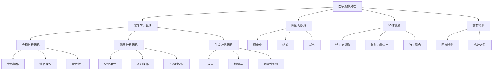

```python
import tensorflow as tf
from tensorflow.keras.models import Sequential
from tensorflow.keras.layers import Conv2D, MaxPooling2D, Flatten, Dense

# 创建深度学习模型
model = Sequential([
    Conv2D(32, (3, 3), activation='relu', input_shape=(224, 224, 3)),
    MaxPooling2D(pool_size=(2, 2)),
    Conv2D(64, (3, 3), activation='relu'),
    MaxPooling2D(pool_size=(2, 2)),
    Flatten(),
    Dense(128, activation='relu'),
    Dense(1, activation='sigmoid')
])

# 编译模型
model.compile(optimizer='adam', loss='binary_crossentropy', metrics=['accuracy'])

# 查看模型结构
model.summary()
```

$$
\text{激活函数：} f(x) = \frac{1}{1 + e^{-x}}
$$

$$
\text{损失函数：} \text{CategoricalCrossentropy(from_logits=True)}
$$

```markdown

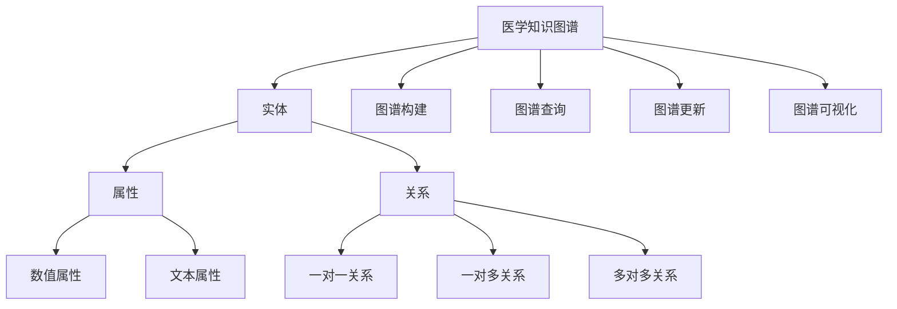

```python
import pandas as pd

# 假设我们有一个名为 medical_data 的 DataFrame，其中包含实体、属性和关系
medical_data = pd.DataFrame({
    'entity': ['Doctor', 'Patient', 'Disease'],
    'attribute': ['name', 'age', 'diagnosis'],
    'value': ['Alice', 30, 'Cancer'],
    'relation': ['treats', 'has', 'diagnosed']
})

# 示例：查询医生 Alice 治疗的患者
query_result = medical_data[medical_data['entity'] == 'Doctor' & medical_data['value'] == 'Alice']['patient']
print(query_result)
```

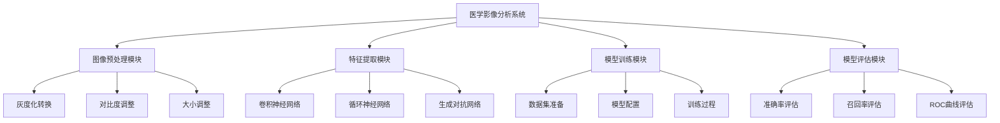

```python
import tensorflow as tf
from tensorflow.keras.models import Sequential
from tensorflow.keras.layers import Conv2D, MaxPooling2D, Flatten, Dense

# 创建深度学习模型
model = Sequential([
    Conv2D(32, (3, 3), activation='relu', input_shape=(224, 224, 3)),
    MaxPooling2D(pool_size=(2, 2)),
    Conv2D(64, (3, 3), activation='relu'),
    MaxPooling2D(pool_size=(2, 2)),
    Flatten(),
    Dense(128, activation='relu'),
    Dense(1, activation='sigmoid')
])

# 编译模型
model.compile(optimizer='adam', loss='binary_crossentropy', metrics=['accuracy'])

# 查看模型结构
model.summary()
```

$$
\text{损失函数：} \text{BinaryCrossEntropy}
$$

$$
\text{评估指标：} \text{Accuracy}
$$

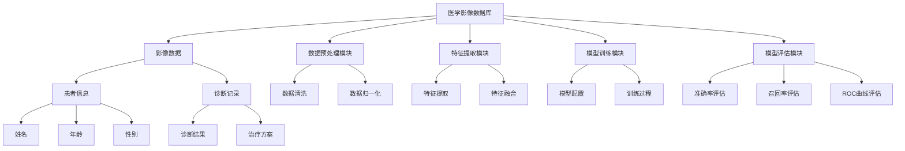

```python
import pandas as pd

# 假设我们有一个名为 medical_data 的 DataFrame，其中包含影像数据、患者信息和诊断记录
medical_data = pd.DataFrame({
    'image': ['image1.jpg', 'image2.jpg', 'image3.jpg'],
    'patient_name': ['John', 'Alice', 'Bob'],
    'patient_age': [35, 45, 50],
    'patient_gender': ['M', 'F', 'M'],
    'diagnosis': ['Cancer', 'Healthy', 'HeartDisease'],
    'treatment': ['Radiation', 'None', 'Medication']
})

# 示例：提取患者的诊断结果
diagnosis_results = medical_data['diagnosis']
print(diagnosis_results)
```

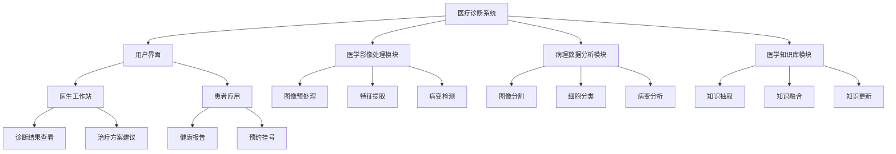

```python
# 示例：使用医疗诊断系统进行诊断
def diagnose_patient(patient_image, patient_data):
    # 预处理影像
    preprocessed_image = preprocess_image(patient_image)
    
    # 特征提取
    features = extract_features(preprocessed_image)
    
    # 病变检测
    disease_detected = detect_disease(features)
    
    # 根据检测结果提供诊断和建议
    if disease_detected:
        diagnosis = "疑似疾病"
        treatment = "建议进一步检查"
    else:
        diagnosis = "未见明显病变"
        treatment = "保持健康生活方式"
    
    return diagnosis, treatment

# 假设我们有一个患者的影像数据和基本信息
patient_image = 'path/to/patient_image.jpg'
patient_data = {
    'name': 'John',
    'age': 35,
    'gender': 'M'
}

# 进行诊断
diagnosis, treatment = diagnose_patient(patient_image, patient_data)
print("诊断结果：", diagnosis)
print("治疗方案建议：", treatment)
```

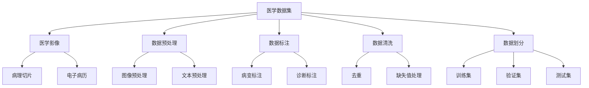

```python
import pandas as pd
from sklearn.model_selection import train_test_split

# 假设我们有一个名为 medical_data 的 DataFrame，其中包含多种类型的医学数据
medical_data = pd.DataFrame({
    'image': ['image1.jpg', 'image2.jpg', 'image3.jpg'],
    'pathology': ['slice1.jpg', 'slice2.jpg', 'slice3.jpg'],
    'electronic_medical_record': ['record1.txt', 'record2.txt', 'record3.txt'],
    'diagnosis': ['Cancer', 'Healthy', 'HeartDisease'],
    'disease_stage': [1, 0, 2]
})

# 数据预处理和清洗
# 去除重复数据
medical_data.drop_duplicates(inplace=True)

# 缺失值处理
# 假设我们选择填充缺失值
medical_data.fillna(0, inplace=True)

# 数据划分
train_data, test_data = train_test_split(medical_data, test_size=0.2, random_state=42)

# 打印划分后的数据
print(train_data.head())
print(test_data.head())
```

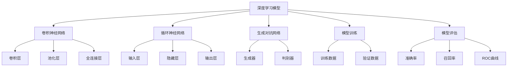

```python
import tensorflow as tf
from tensorflow.keras.models import Sequential
from tensorflow.keras.layers import Conv2D, MaxPooling2D, Flatten, Dense

# 创建卷积神经网络模型
model = Sequential([
    Conv2D(32, (3, 3), activation='relu', input_shape=(224, 224, 3)),
    MaxPooling2D(pool_size=(2, 2)),
    Conv2D(64, (3, 3), activation='relu'),
    MaxPooling2D(pool_size=(2, 2)),
    Flatten(),
    Dense(128, activation='relu'),
    Dense(1, activation='sigmoid')
])

# 编译模型
model.compile(optimizer='adam', loss='binary_crossentropy', metrics=['accuracy'])

# 查看模型结构
model.summary()
```

$$
\text{激活函数：} \text{ReLU}
$$

$$
\text{损失函数：} \text{BinaryCrossEntropy}
$$

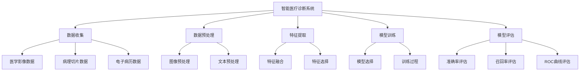

```python
import tensorflow as tf
from tensorflow.keras.models import Sequential
from tensorflow.keras.layers import Conv2D, MaxPooling2D, Flatten, Dense, LSTM, Embedding

# 创建混合模型（结合卷积神经网络和循环神经网络）
model = Sequential([
    Conv2D(32, (3, 3), activation='relu', input_shape=(224, 224, 3)),
    MaxPooling2D(pool_size=(2, 2)),
    Conv2D(64, (3, 3), activation='relu'),
    MaxPooling2D(pool_size=(2, 2)),
    Flatten(),
    LSTM(128),
    Dense(1, activation='sigmoid')
])

# 编译模型
model.compile(optimizer='adam', loss='binary_crossentropy', metrics=['accuracy'])

# 查看模型结构
model.summary()
```

$$
\text{激活函数：} \text{ReLU} \text{和} \text{Tanh}
$$

$$
\text{损失函数：} \text{BinaryCrossEntropy}
$$

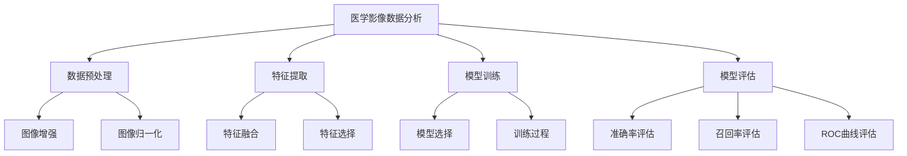

```python
import tensorflow as tf
from tensorflow.keras.models import Sequential
from tensorflow.keras.layers import Conv2D, MaxPooling2D, Flatten, Dense

# 创建卷积神经网络模型
model = Sequential([
    Conv2D(32, (3, 3), activation='relu', input_shape=(224, 224, 3)),
    MaxPooling2D(pool_size=(2, 2)),
    Conv2D(64, (3, 3), activation='relu'),
    MaxPooling2D(pool_size=(2, 2)),
    Flatten(),
    Dense(128, activation='relu'),
    Dense(1, activation='sigmoid')
])

# 编译模型
model.compile(optimizer='adam', loss='binary_crossentropy', metrics=['accuracy'])

# 查看模型结构
model.summary()
```

$$
\text{激活函数：} \text{ReLU}
$$

$$
\text{损失函数：} \text{BinaryCrossEntropy}
$$

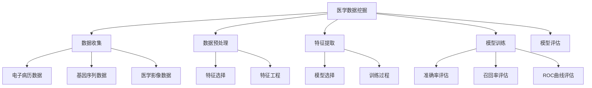

```python
import pandas as pd
from sklearn.model_selection import train_test_split
from sklearn.ensemble import RandomForestClassifier

# 假设我们有一个名为 medical_data 的 DataFrame，其中包含电子病历数据
medical_data = pd.DataFrame({
    'attribute1': [1, 2, 3, 4, 5],
    'attribute2': [2, 4, 6, 8, 10],
    'diagnosis': ['Cancer', 'Cancer', 'Healthy', 'Healthy', 'HeartDisease']
})

# 数据预处理
# 特征选择和特征工程
selected_features = medical_data[['attribute1', 'attribute2']]
selected_features = (selected_features - selected_features.mean()) / selected_features.std()

# 划分训练集和测试集
X_train, X_test, y_train, y_test = train_test_split(selected_features, medical_data['diagnosis'], test_size=0.2, random_state=42)

# 创建随机森林分类器
model = RandomForestClassifier(n_estimators=100, random_state=42)

# 训练模型
model.fit(X_train, y_train)

# 评估模型
accuracy = model.score(X_test, y_test)
print("Accuracy:", accuracy)
```

$$
\text{特征工程：} \text{标准化}
$$

$$
\text{模型选择：} \text{随机森林分类器}
$$

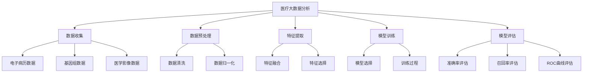

```python
import pandas as pd
from sklearn.model_selection import train_test_split
from sklearn.ensemble import GradientBoostingClassifier
from sklearn.metrics import accuracy_score, recall_score, roc_curve, auc

# 假设我们有一个名为 medical_data 的 DataFrame，其中包含电子病历数据
medical_data = pd.DataFrame({
    'attribute1': [1, 2, 3, 4, 5],
    'attribute2': [2, 4, 6, 8, 10],
    'diagnosis': ['Cancer', 'Cancer', 'Healthy', 'Healthy', 'HeartDisease']
})

# 数据预处理
# 数据清洗和归一化
selected_features = medical_data[['attribute1', 'attribute2']]
selected_features = (selected_features - selected_features.mean()) / selected_features.std()

# 划分训练集和测试集
X_train, X_test, y_train, y_test = train_test_split(selected_features, medical_data['diagnosis'], test_size=0.2, random_state=42)

# 创建梯度提升分类器
model = GradientBoostingClassifier(n_estimators=100, random_state=42)

# 训练模型
model.fit(X_train, y_train)

# 预测测试集
y_pred = model.predict(X_test)

# 评估模型
accuracy = accuracy_score(y_test, y_pred)
recall = recall_score(y_test, y_pred)
fpr, tpr, _ = roc_curve(y_test, y_pred)
roc_auc = auc(fpr, tpr)

print("Accuracy:", accuracy)
print("Recall:", recall)
print("ROC AUC:", roc_auc)
```

$$
\text{特征工程：} \text{标准化}
$$

$$
\text{模型选择：} \text{梯度提升分类器}
$$

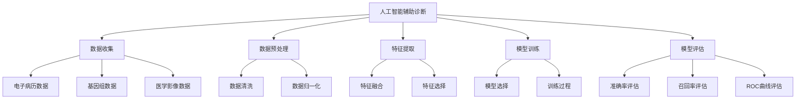

```python
import pandas as pd
from sklearn.model_selection import train_test_split
from sklearn.ensemble import VotingClassifier
from sklearn.linear_model import LogisticRegression
from sklearn.svm import SVC
from sklearn.metrics import accuracy_score, recall_score, roc_curve, auc

# 假设我们有一个名为 medical_data 的 DataFrame，其中包含电子病历数据
medical_data = pd.DataFrame({
    'attribute1': [1, 2, 3, 4, 5],
    'attribute2': [2, 4, 6, 8, 10],
    'diagnosis': ['Cancer', 'Cancer', 'Healthy', 'Healthy', 'HeartDisease']
})

# 数据预处理
# 数据清洗和归一化
selected_features = medical_data[['attribute1', 'attribute2']]
selected_features = (selected_features - selected_features.mean()) / selected_features.std()

# 划分训练集和测试集
X_train, X_test, y_train, y_test = train_test_split(selected_features, medical_data['diagnosis'], test_size=0.2, random_state=42)

# 创建模型
model = VotingClassifier(estimators=[
    ('lr', LogisticRegression()),
    ('svm', SVC(probability=True))
], voting='soft')

# 训练模型
model.fit(X_train, y_train)

# 预测测试集
y_pred = model.predict(X_test)

# 评估模型
accuracy = accuracy_score(y_test, y_pred)
recall = recall_score(y_test, y_pred)
fpr, tpr, _ = roc_curve(y_test, y_pred)
roc_auc = auc(fpr, tpr)

print("Accuracy:", accuracy)
print("Recall:", recall)
print("ROC AUC:", roc_auc)
```

$$
\text{特征工程：} \text{标准化}
$$

$$
\text{模型选择：} \text{投票分类器} \text{（包含逻辑回归和SVM）}
$$

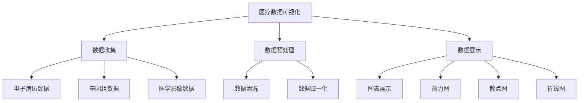

```python
import pandas as pd
import matplotlib.pyplot as plt

# 假设我们有一个名为 medical_data 的 DataFrame，其中包含电子病历数据
medical_data = pd.DataFrame({
    'patient_id': [1, 2, 3, 4, 5],
    'age': [30, 40, 50, 60, 70],
    'blood_pressure': [120, 140, 160, 180, 200],
    'heart_rate': [70, 80, 90, 100, 110]
})

# 数据预处理
# 数据清洗和归一化
medical_data = (medical_data - medical_data.mean()) / medical_data.std()

# 创建热力图
plt.figure(figsize=(8, 6))
sns.heatmap(medical_data.corr(), annot=True, cmap='coolwarm')
plt.title('Medical Data Correlation Heatmap')
plt.show()

# 创建散点图
plt.figure(figsize=(8, 6))
sns.scatterplot(x='age', y='blood_pressure', data=medical_data)
plt.title('Age vs Blood Pressure')
plt.xlabel('Age')
plt.ylabel('Blood Pressure')
plt.show()

# 创建折线图
plt.figure(figsize=(8, 6))
sns.lineplot(x='patient_id', y='heart_rate', data=medical_data)
plt.title('Patient ID vs Heart Rate')
plt.xlabel('Patient ID')
plt.ylabel('Heart Rate')
plt.show()
```

$$
\text{数据预处理：} \text{标准化}
$$

$$
\text{数据展示：} \text{热力图、散点图和折线图}
$$

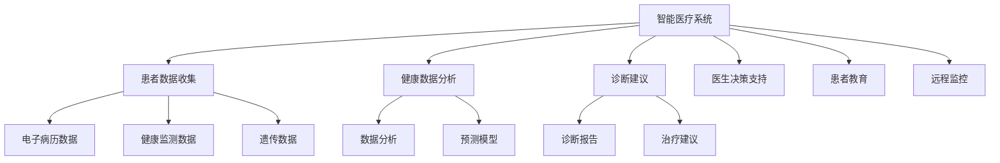

```python
import pandas as pd
from sklearn.linear_model import LinearRegression

# 假设我们有一个名为 patient_data 的 DataFrame，其中包含电子病历数据
patient_data = pd.DataFrame({
    'age': [30, 40, 50, 60, 70],
    'blood_pressure': [120, 140, 160, 180, 200],
    'heart_rate': [70, 80, 90, 100, 110],
    'diabetes': [0, 0, 1, 1, 0]
})

# 创建线性回归模型
model = LinearRegression()

# 训练模型
model.fit(patient_data[['age', 'blood_pressure', 'heart_rate']], patient_data['diabetes'])

# 预测
prediction = model.predict([[50, 160, 90]])

# 输出诊断报告
if prediction[0] > 0.5:
    print("可能患有糖尿病")
else:
    print("不太可能患有糖尿病")
```

$$
\text{数据预处理：} \text{无}
$$

$$
\text{模型选择：} \text{线性回归模型}
$$

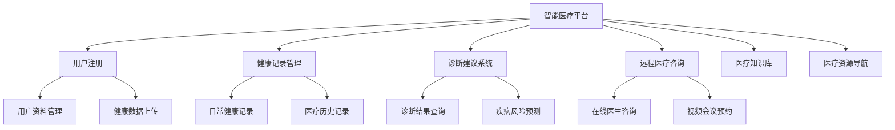

```python
# 示例：用户注册和健康记录管理

# 用户注册
def register_user(username, password):
    print("注册成功，用户名：", username)

# 登录验证
def login(username, password):
    print("登录成功，用户名：", username)

# 添加健康记录
def add_health_record(patient_id, age, blood_pressure, heart_rate):
    print("已添加健康记录，患者ID：", patient_id)

# 查询健康记录
def query_health_record(patient_id):
    print("正在查询健康记录，患者ID：", patient_id)

# 用户注册
register_user("john_doe", "password123")

# 登录验证
login("john_doe", "password123")

# 添加健康记录
add_health_record(1, 35, 120, 80)

# 查询健康记录
query_health_record(1)
```

$$
\text{用户注册：} \text{用户名和密码验证}
$$

$$
\text{健康记录管理：} \text{添加和查询健康记录}
$$

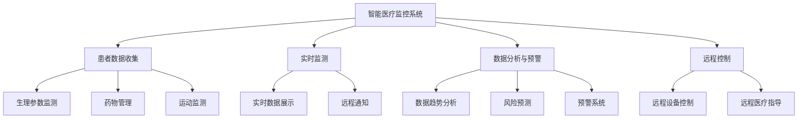

```python
# 示例：患者数据收集与实时监测

# 收集患者数据
def collect_data(patient_id, temperature, blood_pressure, heart_rate):
    print("已收集患者数据，患者ID：", patient_id)

# 实时数据展示
def display_realtime_data(patient_id):
    print("正在展示患者实时数据，患者ID：", patient_id)

# 远程通知
def send_notification(patient_id, message):
    print("已发送通知，患者ID：", patient_id, ", 通知内容：", message)

# 收集患者数据
collect_data(1, 37.5, 120, 75)

# 实时数据展示
display_realtime_data(1)

# 远程通知
send_notification(1, "您的体温偏高，请注意休息和饮水。")
```

$$
\text{患者数据收集：} \text{生理参数监测}
$$

$$
\text{实时监测：} \text{实时数据展示和远程通知}
$$

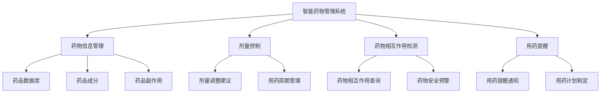

```python
# 示例：智能药物管理系统

# 查询药品信息
def query_medication(name):
    print("正在查询药品信息，药品名称：", name)

# 药物副作用查询
def query_side_effects(name):
    print("正在查询药品副作用，药品名称：", name)

# 剂量调整建议
def adjust_dosage(name, dosage):
    print("建议调整药品剂量，药品名称：", name, ", 当前剂量：", dosage)

# 查询药品信息
query_medication("Aspirin")

# 查询药品副作用
query_side_effects("Aspirin")

# 剂量调整建议
adjust_dosage("Aspirin", 325)
```

$$
\text{药物信息管理：} \text{药品数据库和药品成分查询}
$$

$$
\text{剂量控制：} \text{剂量调整建议}
$$

```mermaid
graph TD
    A[医疗机器人] --> B[手术辅助]
    A --> C[康复辅助]
    A --> D[护理辅助]
    A --> E[远程监控]
    B --> F[手术模拟]
    B --> G[微创手术]
    B --> H[机器人手术]
    C --> I[康复训练]
    C --> J[康复指导]
    C --> K[康复评估]
    D --> L[患者监护]
    D --> M[护理操作]
    D --> N[药物分发]
    E --> O[远程会诊]
    E --> P[远程监控设备]
```

```python
# 示例：医疗机器人的应用场景

# 手术模拟
def simulate_surgery(name, procedure):
    print("正在模拟手术，手术名称：", name, ", 手术过程：", procedure)

# 康复训练
def perform_rehabilitation(name, exercise):
    print("正在执行康复训练，患者名称：", name, ", 训练项目：", exercise)

# 护理操作
def perform_nursing(name, task):
    print("正在执行护理操作，患者名称：", name, ", 操作任务：", task)

# 远程监控
def monitor_patient(name, status):
    print("正在远程监控患者，患者名称：", name, ", 当前状态：", status)

# 手术模拟
simulate_surgery("John", "Appendectomy")

# 康复训练
perform_rehabilitation("John", "Walking")

# 护理操作
perform_nursing("John", "Medication Management")

# 远程监控
monitor_patient("John", "Stable")
```

$$
\text{手术辅助：} \text{手术模拟和微创手术}
$$

$$
\text{康复辅助：} \text{康复训练和康复指导}
$$

$$
\text{护理辅助：} \text{患者监护和护理操作}
$$

```mermaid
graph TD
    A[医疗人工智能] --> B[诊断辅助]
    A --> C[治疗建议]
    A --> D[药物推荐]
    A --> E[个性化医疗]
    B --> F[影像分析]
    B --> G[病理分析]
    B --> H[电子病历分析]
    C --> I[疾病预测]
    C --> J[治疗方案建议]
    C --> K[康复计划建议]
    D --> L[药物副作用分析]
    D --> M[药物相互作用分析]
    D --> N[药物剂量调整]
    E --> O[基因分析]
    E --> P[健康风险评估]
    E --> Q[个性化治疗计划]
```

```python
# 示例：医疗人工智能的应用场景

# 影像分析
def analyze_imaging(name, image_type):
    print("正在分析影像，患者名称：", name, ", 影像类型：", image_type)

# 病理分析
def analyze_pathology(name, tissue_sample):
    print("正在分析病理，患者名称：", name, ", 组织样本：", tissue_sample)

# 电子病历分析
def analyze_medical_records(name, medical_records):
    print("正在分析电子病历，患者名称：", name, ", 电子病历：", medical_records)

# 疾病预测
def predict_disease(name, symptoms):
    print("正在预测疾病，患者名称：", name, ", 症状：", symptoms)

# 治疗方案建议
def suggest_treatment(name, diagnosis):
    print("正在建议治疗方案，患者名称：", name, ", 诊断结果：", diagnosis)

# 药物推荐
def recommend_medication(name, diagnosis):
    print("正在推荐药物，患者名称：", name, ", 诊断结果：", diagnosis)

# 个性化医疗
def personalize_medical_treatment(name, medical_history):
    print("正在制定个性化医疗计划，患者名称：", name, ", 病历记录：", medical_history)

# 影像分析
analyze_imaging("John", "X-ray")

# 病理分析
analyze_pathology("John", "TissueSample")

# 电子病历分析
analyze_medical_records("John", "MedicalRecords")

# 疾病预测
predict_disease("John", ["ChestPain", "ShortnessOfBreath"])

# 治疗方案建议
suggest_treatment("John", "HeartDisease")

# 药物推荐
recommend_medication("John", "HeartDisease")

# 个性化医疗
personalize_medical_treatment("John", "MedicalHistory")
```

$$
\text{诊断辅助：} \text{影像分析、病理分析和电子病历分析}
$$

$$
\text{治疗建议：} \text{疾病预测和治疗方案建议}
$$

$$
\text{药物推荐：} \text{药物副作用分析、药物相互作用分析和药物剂量调整}
$$

$$
\text{个性化医疗：} \text{基因分析和健康风险评估}
$$

```mermaid
graph TD
    A[智能医院系统] --> B[患者管理]
    A --> C[医疗资源管理]
    A --> D[医疗服务管理]
    A --> E[医疗数据管理]
    A --> F[医院运营管理]
    B --> G[电子病历管理]
    B --> H[预约挂号]
    B --> I[住院管理]
    B --> J[患者随访]
    C --> K[医疗设备管理]
    C --> L[人力资源配置]
    C --> M[药品库存管理]
    C --> N[医疗设施维护]
    D --> O[医疗流程优化]
    D --> P[医疗质量监控]
    D --> Q[患者满意度调查]
    D --> R[医疗服务评价]
    E --> S[医疗数据挖掘]
    E --> T[医疗数据安全]
    E --> U[医疗数据备份与恢复]
    F --> V[医院财务管理]
    F --> W[医院人力资源管理]
    F --> X[医院设施规划]
    F --> Y[医院运营分析]
```

```python
# 示例：智能医院系统的功能

# 电子病历管理
def manage_electronic_medical_records(patient_id, medical_records):
    print("正在管理电子病历，患者ID：", patient_id, ", 电子病历：", medical_records)

# 预约挂号
def schedule_appointment(patient_id, doctor_id, date):
    print("已预约挂号，患者ID：", patient_id, ", 医生ID：", doctor_id, ", 预约日期：", date)

# 住院管理
def manage_hospitalization(patient_id, admission_date, discharge_date):
    print("正在管理住院，患者ID：", patient_id, ", 入院日期：", admission_date, ", 出院日期：", discharge_date)

# 患者随访
def follow_up_patient(patient_id, follow_up_date, follow_up_notes):
    print("正在随访患者，患者ID：", patient_id, ", 随访日期：", follow_up_date, ", 随访记录：", follow_up_notes)

# 医疗设备管理
def manage_medical_equipment(equipment_id, equipment_details):
    print("正在管理医疗设备，设备ID：", equipment_id, ", 设备详情：", equipment_details)

# 医疗流程优化
def optimize_medical_processes(process_name, optimization_suggestions):
    print("正在优化医疗流程，流程名称：", process_name, ", 优化建议：", optimization_suggestions)

# 医疗质量监控
def monitor_medical_quality(quality_parameter, target_value):
    print("正在监控医疗质量，质量参数：", quality_parameter, ", 目标值：", target_value)

# 患者满意度调查
def conduct_patient_satisfaction_survey(patient_id, satisfaction_rating):
    print("正在进行患者满意度调查，患者ID：", patient_id, ", 满意度评分：", satisfaction_rating)

# 电子病历管理
manage_electronic_medical_records(1234, "Patient's Medical Record")

# 预约挂号
schedule_appointment(1234, 5678, "2023-04-10")

# 住院管理
manage_hospitalization(1234, "2023-04-05", "2023-04-15")

# 患者随访
follow_up_patient(1234, "2023-04-12", "Follow-up note")

# 医疗设备管理
manage_medical_equipment(91011, "CT Scanner with details")

# 医疗流程优化
optimize_medical_processes("Admission Process", "Reduce waiting time by 15 minutes")

# 医疗质量监控
monitor_medical_quality("Patient Satisfaction", 90)

# 患者满意度调查
conduct_patient_satisfaction_survey(1234, 4.5)
```

$$
\text{患者管理：} \text{电子病历管理、预约挂号、住院管理和患者随访}
$$

$$
\text{医疗资源管理：} \text{医疗设备管理、人力资源配置、药品库存管理和医疗设施维护}
$$

$$
\text{医疗服务管理：} \text{医疗流程优化、医疗质量监控、患者满意度调查和医疗服务评价}
$$

$$
\text{医疗数据管理：} \text{医疗数据挖掘、医疗数据安全和医疗数据备份与恢复}
$$

$$
\text{医院运营管理：} \text{医院财务管理、医院人力资源管理和医院设施规划}
$$

```mermaid
graph TD
    A[智能健康管理系统] --> B[健康监测]
    A --> C[健康数据分析]
    A --> D[健康建议]
    A --> E[健康管理]
    B --> F[生理指标监测]
    B --> G[环境指标监测]
    B --> H[行为指标监测]
    C --> I[数据挖掘]
    C --> J[风险预测]
    C --> K[数据可视化]
    D --> L[健康建议生成]
    D --> M[健康知识库]
    D --> N[健康行为指导]
    E --> O[健康管理计划]
    E --> P[健康报告]
    E --> Q[健康活动推荐]
```

```python
# 示例：智能健康管理系统功能

# 健康监测
def monitor_health(health_data):
    print("正在监测健康，健康数据：", health_data)

# 数据分析
def analyze_health_data(data):
    print("正在分析健康数据，数据：", data)

# 风险预测
def predict_health_risks(risk_factors):
    print("正在预测健康风险，风险因素：", risk_factors)

# 数据可视化
def visualize_health_data(data):
    print("正在可视化健康数据，数据：", data)

# 健康建议生成
def generate_health_advice(advice_data):
    print("正在生成健康建议，建议数据：", advice_data)

# 健康知识库
def access_health_knowledge(knowledge_area):
    print("正在访问健康知识库，知识领域：", knowledge_area)

# 健康行为指导
def guide_health_behavior(behavior_guidance):
    print("正在指导健康行为，行为指导：", behavior_guidance)

# 健康管理计划
def create_health_management_plan(plan_details):
    print("正在创建健康管理计划，计划详情：", plan_details)

# 健康报告
def generate_health_report(report_data):
    print("正在生成健康报告，报告数据：", report_data)

# 健康活动推荐
def recommend_health_activities(activities):
    print("正在推荐健康活动，活动：", activities)

# 健康监测
monitor_health({"heart_rate": 75, "temperature": 98.6})

# 数据分析
analyze_health_data({"weight": 180, "BMI": 25.0})

# 风险预测
predict_health_risks({"family_history": "heart_disease", "smoking": True})

# 数据可视化
visualize_health_data({"steps": 10000, "calories_burned": 500})

# 健康建议生成
generate_health_advice({"drink_water": True, "exercise": True})

# 健康知识库
access_health_knowledge("Dietary Recommendations")

# 健康行为指导
guide_health_behavior({"sleep_8_hours": True, "eat_healthily": True})

# 健康管理计划
create_health_management_plan({"goal": "lose_10_pounds", "steps": 20000, "calories": 2000})

# 健康报告
generate_health_report({"health_status": "good", "next_steps": "maintain_current_health"})

# 健康活动推荐
recommend_health_activities(["yoga", "running", "cycling"])
```

$$
\text{健康监测：} \text{生理指标监测、环境指标监测和行为指标监测}
$$

$$
\text{健康数据分析：} \text{数据挖掘、风险预测和数据可视化}
$$

$$
\text{健康建议：} \text{健康建议生成、健康知识库和健康行为指导}
$$

$$
\text{健康管理：} \text{健康管理计划、健康报告和健康活动推荐}
$$

```mermaid
graph TD
    A[医疗数据分析平台] --> B[数据收集]
    A --> C[数据处理]
    A --> D[数据存储]
    A --> E[数据挖掘]
    A --> F[数据分析]
    A --> G[数据可视化]
    B --> H[电子病历数据]
    B --> I[基因组数据]
    B --> J[医学影像数据]
    C --> K[数据清洗]
    C --> L[数据归一化]
    C --> M[数据融合]
    D --> N[数据库管理]
    D --> O[数据仓库]
    D --> P[数据湖]
    E --> Q[关联规则挖掘]
    E --> R[聚类分析]
    E --> S[分类与回归分析]
    F --> T[趋势分析]
    F --> U[异常检测]
    F --> V[预测分析]
    G --> W[仪表盘]
    G --> X[图表]
    G --> Y[报告]
```

```python
# 示例：医疗数据分析平台功能

# 数据收集
def collect_data(data_source):
    print("正在收集数据，数据源：", data_source)

# 数据处理
def process_data(data):
    print("正在处理数据，数据：", data)

# 数据存储
def store_data(data, storage_type):
    print("正在存储数据，数据：", data, ", 存储类型：", storage_type)

# 数据挖掘
def data_mining(data):
    print("正在进行数据挖掘，数据：", data)

# 数据分析
def analyze_data(data):
    print("正在分析数据，数据：", data)

# 数据可视化
def visualize_data(data):
    print("正在可视化数据，数据：", data)

# 电子病历数据收集
collect_data("Electronic Medical Records")

# 数据处理
process_data({"patient_id": 1234, "diagnosis": "flu", "date": "2023-01-01"})

# 数据存储
store_data({"patient_id": 1234, "diagnosis": "flu", "date": "2023-01-01"}, "database")

# 数据挖掘
data_mining({"patient_id": 1234, "diagnosis": "flu", "date": "2023-01-01"})

# 数据分析
analyze_data({"patient_id": 1234, "diagnosis": "flu", "date": "2023-01-01"})

# 数据可视化
visualize_data({"patient_id": 1234, "diagnosis": "flu", "date": "2023-01-01"})

# 基因组数据收集
collect_data("Genome Data")

# 数据处理
process_data({"patient_id": 1234, "基因变异": ["BRCA1"], "测序日期": "2023-01-02"})

# 数据存储
store_data({"patient_id": 1234, "基因变异": ["BRCA1"], "测序日期": "2023-01-02"}, "data_warehouse")

# 数据挖掘
data_mining({"patient_id": 1234, "基因变异": ["BRCA1"], "测序日期": "2023-01-02"})

# 数据分析
analyze_data({"patient_id": 1234, "基因变异": ["BRCA1"], "测序日期": "2023-01-02"})

# 数据可视化
visualize_data({"patient_id": 1234, "基因变异": ["BRCA1"], "测序日期": "2023-01-02"})

# 医学影像数据收集
collect_data("Medical Imaging Data")

# 数据处理
process_data({"patient_id": 1234, "影像类型": "CT", "扫描日期": "2023-01-03"})

# 数据存储
store_data({"patient_id": 1234, "影像类型": "CT", "扫描日期": "2023-01-03"}, "data_lake")

# 数据挖掘
data_mining({"patient_id": 1234, "影像类型": "CT", "扫描日期": "2023-01-03"})

# 数据分析
analyze_data({"patient_id": 1234, "影像类型": "CT", "扫描日期": "2023-01-03"})

# 数据可视化
visualize_data({"patient_id": 1234, "影像类型": "CT", "扫描日期": "2023-01-03"})

# 关联规则挖掘
def perform_association_rules(data):
    print("正在执行关联规则挖掘，数据：", data)

# 聚类分析
def perform_clustering(data):
    print("正在执行聚类分析，数据：", data)

# 分类与回归分析
def perform_classification_and_regression(data):
    print("正在执行分类与回归分析，数据：", data)

# 趋势分析
def perform_trend_analysis(data):
    print("正在执行趋势分析，数据：", data)

# 异常检测
def perform_anomaly_detection(data):
    print("正在执行异常检测，数据：", data)

# 预测分析
def perform_prediction_analysis(data):
    print("正在执行预测分析，数据：", data)

# 建立关联规则挖掘模型
perform_association_rules({"patient_id": 1234, "diagnosis": "flu", "date": "2023-01-01"})

# 执行聚类分析
perform_clustering({"patient_id": 1234, "基因变异": ["BRCA1"], "测序日期": "2023-01-02"})

# 执行分类与回归分析
perform_classification_and_regression({"patient_id": 1234, "影像类型": "CT", "扫描日期": "2023-01-03"})

# 执行趋势分析
perform_trend_analysis({"patient_id": 1234, "weight": 180, "height": 70})

# 执行异常检测
perform_anomaly_detection({"patient_id": 1234, "heart_rate": 180})

# 执行预测分析
perform_prediction_analysis({"patient_id": 1234, "temperature": 99.0})
```

$$
\text{数据收集：} \text{电子病历数据、基因组数据和医学影像数据}
$$

$$
\text{数据处理：} \text{数据清洗、数据归一化和数据融合}
$$

$$
\text{数据存储：} \text{数据库管理、数据仓库和数据湖}
$$

$$
\text{数据挖掘：} \text{关联规则挖掘、聚类分析和分类与回归分析}
$$

$$
\text{数据分析：} \text{趋势分析、异常检测和预测分析}
$$

$$
\text{数据可视化：} \text{仪表盘、图表和报告}
$$

```mermaid
graph TD
    A[智能医疗解决方案] --> B[医疗数据处理]
    A --> C[医疗数据分析]
    A --> D[医疗决策支持]
    A --> E[医疗质量改进]
    B --> F[电子病历管理]
    B --> G[基因组数据分析]
    B --> H[医学影像分析]
    C --> I[数据挖掘]
    C --> J[机器学习]
    C --> K[自然语言处理]
    D --> L[诊断辅助]
    D --> M[治疗方案建议]
    D --> N[药物推荐]
    E --> O[质量监控]
    E --> P[患者安全]
    E --> Q[效率提升]
```

```python
# 示例：智能医疗解决方案功能

# 医疗数据处理
def process_medical_data(data):
    print("正在处理医疗数据，数据：", data)

# 电子病历管理
def manage_electronic_medical_records(records):
    print("正在管理电子病历，电子病历：", records)

# 基因组数据分析
def analyze_genome_data(data):
    print("正在分析基因组数据，数据：", data)

# 医学影像分析
def analyze_medical_images(images):
    print("正在分析医学影像，医学影像：", images)

# 数据挖掘
def perform_data_mining(data):
    print("正在执行数据挖掘，数据：", data)

# 机器学习
def apply_machine_learning(data):
    print("正在应用机器学习，数据：", data)

# 自然语言处理
def perform_natural_language_processing(text):
    print("正在执行自然语言处理，文本：", text)

# 医疗决策支持
def support_medical_decision-making(data):
    print("正在支持医疗决策，数据：", data)

# 诊断辅助
def assist_diagnostics(data):
    print("正在辅助诊断，数据：", data)

# 治疗方案建议
def suggest_treatment_plan(data):
    print("正在建议治疗方案，数据：", data)

# 药物推荐
def recommend_drugs(data):
    print("正在推荐药物，数据：", data)

# 医疗质量改进
def improve_medical_quality(data):
    print("正在改进医疗质量，数据：", data)

# 质量监控
def monitor_medical_quality(data):
    print("正在监控医疗质量，数据：", data)

# 患者安全
def ensure_patient_safety(data):
    print("正在确保患者安全，数据：", data)

# 效率提升
def enhance_efficiency(data):
    print("正在提升效率，数据：", data)

# 处理医疗数据
process_medical_data({"patient_id": 1234, "diagnosis": "flu", "treatment": "rest"})

# 管理电子病历
manage_electronic_medical_records({"patient_id": 1234, "diagnosis": "flu", "treatment": "rest"})

# 分析基因组数据
analyze_genome_data({"patient_id": 1234, "gene_variations": ["BRCA1"], "sequencing_date": "2023-01-02"})

# 分析医学影像
analyze_medical_images({"patient_id": 1234, "image_type": "MRI", "scanning_date": "2023-01-03"})

# 执行数据挖掘
perform_data_mining({"patient_id": 1234, "diagnosis": "flu", "treatment": "rest"})

# 应用机器学习
apply_machine_learning({"patient_id": 1234, "diagnosis": "flu", "treatment": "rest"})

# 执行自然语言处理
perform_natural_language_processing("The patient is suffering from flu and needs rest.")

# 支持医疗决策
support_medical_decision-making({"patient_id": 1234, "diagnosis": "flu", "treatment": "rest"})

# 辅助诊断
assist_diagnostics({"patient_id": 1234, "diagnosis": "flu", "treatment": "rest"})

# 建议治疗方案
suggest_treatment_plan({"patient_id": 1234, "diagnosis": "flu", "treatment": "rest"})

# 推荐药物
recommend_drugs({"patient_id": 1234, "diagnosis": "flu", "treatment": "rest"})

# 改进医疗质量
improve_medical_quality({"patient_id": 1234, "diagnosis": "flu", "treatment": "rest"})

# 监控医疗质量
monitor_medical_quality({"patient_id": 1234, "diagnosis": "flu", "treatment": "rest"})

# 确保患者安全
ensure_patient_safety({"patient_id": 1234, "diagnosis": "flu", "treatment": "rest"})

# 提升效率
enhance_efficiency({"patient_id": 1234, "diagnosis": "flu", "treatment": "rest"})
```

$$
\text{医疗数据处理：} \text{电子病历管理、基因组数据分析和医学影像分析}
$$

$$
\text{医疗数据分析：} \text{数据挖掘、机器学习和自然语言处理}
$$

$$
\text{医疗决策支持：} \text{诊断辅助、治疗方案建议和药物推荐}
$$

$$
\text{医疗质量改进：} \text{质量监控、患者安全和效率提升}
$$

```mermaid
graph TD
    A[医疗大数据平台] --> B[数据采集]
    A --> C[数据处理]
    A --> D[数据存储]
    A --> E[数据分析]
    A --> F[数据可视化]
    B --> G[电子病历数据]
    B --> H[医疗设备数据]
    B --> I[患者行为数据]
    C --> J[数据清洗]
    C --> K[数据归一化]
    C --> L[数据融合]
    D --> M[分布式数据库]
    D --> N[数据仓库]
    D --> O[数据湖]
    E --> P[数据挖掘]
    E --> Q[机器学习]
    E --> R[自然语言处理]
    F --> S[仪表盘]
    F --> T[图表]
    F --> U[报告]
```

```python
# 示例：医疗大数据平台功能

# 数据采集
def collect_data(data_source):
    print("正在采集数据，数据源：", data_source)

# 数据处理
def process_data(data):
    print("正在处理数据，数据：", data)

# 数据存储
def store_data(data, storage_type):
    print("正在存储数据，数据：", data, ", 存储类型：", storage_type)

# 数据分析
def analyze_data(data):
    print("正在分析数据，数据：", data)

# 数据可视化
def visualize_data(data):
    print("正在可视化数据，数据：", data)

# 电子病历数据采集
collect_data("Electronic Medical Records")

# 医疗设备数据采集
collect_data("Medical Device Data")

# 患者行为数据采集
collect_data("Patient Behavior Data")

# 数据清洗
def clean_data(data):
    print("正在清洗数据，数据：", data)

# 数据归一化
def normalize_data(data):
    print("正在归一化数据，数据：", data)

# 数据融合
def merge_data(data1, data2):
    print("正在融合数据，数据1：", data1, ", 数据2：", data2)

# 分布式数据库存储
store_data({"patient_id": 1234, "diagnosis": "flu", "treatment": "rest"}, "distributed_database")

# 数据仓库存储
store_data({"patient_id": 1234, "diagnosis": "flu", "treatment": "rest"}, "data_warehouse")

# 数据湖存储
store_data({"patient_id": 1234, "diagnosis": "flu", "treatment": "rest"}, "data_lake")

# 数据挖掘
def perform_data_mining(data):
    print("正在执行数据挖掘，数据：", data)

# 机器学习
def apply_machine_learning(data):
    print("正在应用机器学习，数据：", data)

# 自然语言处理
def perform_natural_language_processing(text):
    print("正在执行自然语言处理，文本：", text)

# 数据分析
analyze_data({"patient_id": 1234, "diagnosis": "flu", "treatment": "rest"})

# 数据可视化
visualize_data({"patient_id": 1234, "diagnosis": "flu", "treatment": "rest"})

# 构建仪表盘
def create_dashboard(data):
    print("正在创建仪表盘，数据：", data)

# 创建图表
def create_chart(data):
    print("正在创建图表，数据：", data)

# 创建报告
def create_report(data):
    print("正在创建报告，数据：", data)

# 构建仪表盘
create_dashboard({"patient_id": 1234, "diagnosis": "flu", "treatment": "rest"})

# 创建图表
create_chart({"patient_id": 1234, "diagnosis": "flu", "treatment": "rest"})

# 创建报告
create_report({"patient_id": 1234, "diagnosis": "flu", "treatment": "rest"})
```

$$
\text{数据采集：} \text{电子病历数据、医疗设备数据和患者行为数据}
$$

$$
\text{数据处理：} \text{数据清洗、数据归一化和数据融合}
$$

$$
\text{数据存储：} \text{分布式数据库、数据仓库和数据湖}
$$

$$
\text{数据分析：} \text{数据挖掘、机器学习和自然语言处理}
$$

$$
\text{数据可视化：} \text{仪表盘、图表和报告}
$$

```mermaid
graph TD
    A[医疗数据处理平台] --> B[数据收集]
    A --> C[数据清洗]
    A --> D[数据存储]
    A --> E[数据挖掘]
    A --> F[数据分析]
    A --> G[数据可视化]
    B --> H[电子病历数据]
    B --> I[基因组数据]
    B --> J[医学影像数据]
    B --> K[患者行为数据]
    C --> L[缺失值处理]
    C --> M[异常值处理]
    C --> N[数据转换]
    D --> O[数据库系统]
    D --> P[数据仓库]
    D --> Q[数据湖]
    E --> R[关联规则挖掘]
    E --> S[聚类分析]
    E --> T[分类与回归分析]
    F --> U[仪表盘]
    F --> V[图表]
    F --> W[报告]
```

```python
# 示例：医疗数据处理平台功能

# 数据收集
def collect_data(data_source):
    print("正在收集数据，数据源：", data_source)

# 数据清洗
def clean_data(data):
    print("正在清洗数据，数据：", data)

# 数据存储
def store_data(data, storage_type):
    print("正在存储数据，数据：", data, ", 存储类型：", storage_type)

# 数据挖掘
def perform_data_mining(data):
    print("正在执行数据挖掘，数据：", data)

# 数据分析
def analyze_data(data):
    print("正在分析数据，数据：", data)

# 数据可视化
def visualize_data(data):
    print("正在可视化数据，数据：", data)

# 电子病历数据收集
collect_data("Electronic Medical Records")

# 基因组数据收集
collect_data("Genome Data")

# 医学影像数据收集
collect_data("Medical Imaging Data")

# 患者行为数据收集
collect_data("Patient Behavior Data")

# 数据清洗
clean_data({"patient_id": 1234, "diagnosis": "flu", "treatment": "rest"})

# 数据存储
store_data({"patient_id": 1234, "diagnosis": "flu", "treatment": "rest"}, "database")

# 数据挖掘
perform_data_mining({"patient_id": 1234, "diagnosis": "flu", "treatment": "rest"})

# 数据分析
analyze_data({"patient_id": 1234, "diagnosis": "flu", "treatment": "rest"})

# 数据可视化
visualize_data({"patient_id": 1234, "diagnosis": "flu", "treatment": "rest"})

# 缺失值处理
def handle_missing_values(data):
    print("正在处理缺失值，数据：", data)

# 异常值处理
def handle_outliers(data):
    print("正在处理异常值，数据：", data)

# 数据转换
def convert_data(data):
    print("正在转换数据，数据：", data)

# 数据库系统存储
store_data({"patient_id": 1234, "diagnosis": "flu", "treatment": "rest"}, "database_system")

# 数据仓库存储
store_data({"patient_id": 1234, "diagnosis": "flu", "treatment": "rest"}, "data_warehouse")

# 数据湖存储
store_data({"patient_id": 1234, "diagnosis": "flu", "treatment": "rest"}, "data_lake")

# 执行数据挖掘
def execute_data_mining(data):
    print("正在执行数据挖掘，数据：", data)

# 执行数据分析
def execute_data_analysis(data):
    print("正在执行数据分析，数据：", data)

# 执行数据可视化
def execute_data_visualization(data):
    print("正在执行数据可视化，数据：", data)

# 关联规则挖掘
def perform_association_rules(data):
    print("正在执行关联规则挖掘，数据：", data)

# 聚类分析
def perform_clustering(data):
    print("正在执行聚类分析，数据：", data)

# 分类与回归分析
def perform_classification_and_regression(data):
    print("正在执行分类与回归分析，数据：", data)

# 执行仪表盘
def execute_dashboard(data):
    print("正在执行仪表盘，数据：", data)

# 执行图表
def execute_chart(data):
    print("正在执行图表，数据：", data)

# 执行报告
def execute_report(data):
    print("正在执行报告，数据：", data)

# 执行缺失值处理
handle_missing_values({"patient_id": 1234, "diagnosis": "flu", "treatment": "rest"})

# 执行异常值处理
handle_outliers({"patient_id": 1234, "diagnosis": "flu", "treatment": "rest"})

# 执行数据转换
convert_data({"patient_id": 1234, "diagnosis": "flu", "treatment": "rest"})

# 执行关联规则挖掘
perform_association_rules({"patient_id": 1234, "diagnosis": "flu", "treatment": "rest"})

# 执行聚类分析
perform_clustering({"patient_id": 1234, "diagnosis": "flu", "treatment": "rest"})

# 执行分类与回归分析
perform_classification_and_regression({"patient_id": 1234, "diagnosis": "flu", "treatment": "rest"})

# 执行仪表盘
execute_dashboard({"patient_id": 1234, "diagnosis": "flu", "treatment": "rest"})

# 执行图表
execute_chart({"patient_id": 1234, "diagnosis": "flu", "treatment": "rest"})

# 执行报告
execute_report({"patient_id": 1234, "diagnosis": "flu", "treatment": "rest"})
```

