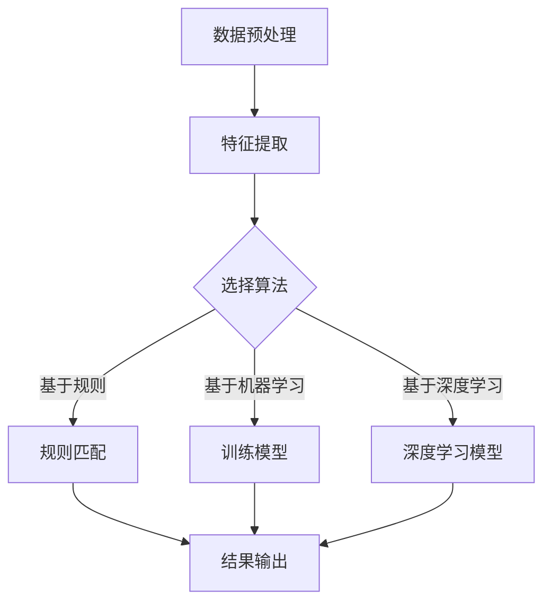
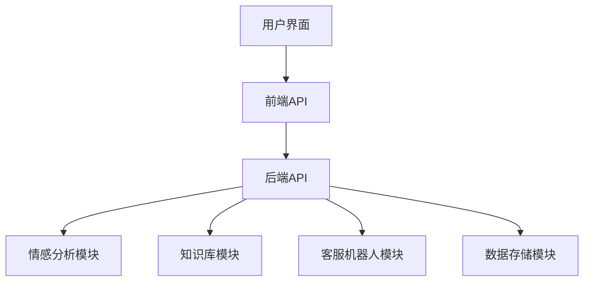

                 

# AI在智能客户服务中的情感分析应用

关键词：情感分析、智能客服、人工智能、自然语言处理、机器学习

摘要：随着人工智能技术的快速发展，情感分析在智能客户服务中的应用日益广泛。本文将从问题背景、核心概念、情感分析算法、应用案例等多个角度，深入探讨AI在智能客户服务中的情感分析应用，以期为相关领域的研究和实践提供参考。

## 目录大纲

1. 第一部分：问题背景与核心概念
   1.1 问题背景
   1.2 核心概念
   1.3 边界与外延
   1.4 概念结构与核心要素
   1.5 本章小结
2. 第二部分：核心概念与联系
   2.1 AI在智能客户服务中的情感分析
   2.2 情感分析的应用案例
   2.3 情感分析与相关技术的联系
   2.4 情感分析的核心属性特征对比
3. 第三部分：算法原理讲解
   3.1 情感分析算法概述
   3.2 情感分析算法的Mermaid流程图
   3.3 Python源代码与算法实现
4. 第四部分：系统分析与架构设计方案
   4.1 问题场景介绍
   4.2 系统功能设计
   4.3 系统架构设计
   4.4 系统接口设计
   4.5 系统交互
5. 第五部分：项目实战
   5.1 环境安装
   5.2 系统核心实现源代码
   5.3 代码应用解读与分析
   5.4 实际案例分析与详细讲解剖析
   5.5 项目小结
6. 最佳实践 tips
7. 小结
8. 注意事项
9. 拓展阅读

## 第一部分：问题背景与核心概念

### 1.1 问题背景

#### 1.1.1 智能客户服务的兴起

智能客户服务是指利用人工智能、自然语言处理、机器学习等技术，对客户提出的问题和需求进行智能响应和解决的服务。随着互联网和移动互联网的普及，用户对于客户服务的需求日益增长，传统的客户服务模式已经无法满足用户日益个性化的需求。因此，智能客户服务逐渐成为企业提升用户体验、降低运营成本的重要手段。

智能客户服务的定义与发展历程：

- **定义**：智能客户服务是一种基于人工智能技术，能够模拟人类客服行为，自动处理客户问题、提供解决方案、进行交互的服务模式。
- **发展历程**：从早期的自动语音应答（IVR）系统，到基于规则（Rule-Based）的智能客服系统，再到如今基于深度学习（Deep Learning）的智能客服系统，智能客户服务经历了从简单到复杂、从被动到主动的演变过程。

人工智能在客户服务中的应用现状与趋势：

- **应用现状**：目前，人工智能在客户服务中得到了广泛应用，如自动问答系统、智能语音客服、机器人客服等。
- **趋势**：随着技术的进步，人工智能在客户服务中的应用将更加深入和广泛，包括情感分析、多轮对话、个性化推荐等。

### 1.2 核心概念

#### 1.2.1 情感分析

情感分析是指通过计算机技术对文本、语音、图像等数据进行情感倾向性识别和分析的过程。在智能客户服务中，情感分析主要用于理解客户情绪、识别客户需求、优化客服策略等。

- **定义**：情感分析是指利用自然语言处理（NLP）、机器学习（ML）等技术，对文本或语音中的情感、情绪、态度等信息进行提取和分析。
- **分类**：情感分析主要分为两类：文本情感分析和语音情感分析。
  - 文本情感分析：对文本中的情感进行分类，如积极、消极、中立等。
  - 语音情感分析：对语音中的情感进行识别，如快乐、悲伤、愤怒等。

#### 1.2.2 AI在智能客户服务中的应用

AI在智能客户服务中的应用主要包括以下几个方面：

- **自动问答系统**：通过自然语言处理技术，实现智能客服与用户的自动对话，回答用户的问题。
- **智能语音客服**：利用语音识别和语音合成技术，实现智能客服与用户的语音交互。
- **机器人客服**：通过深度学习技术，实现智能客服的自主学习和进化，提高客服的智能化程度。

### 1.3 边界与外延

#### 1.3.1 情感分析的范围与限制

- **范围**：情感分析主要应用于客户服务、社交媒体监测、市场调研等领域。
- **限制**：情感分析在处理多语言、跨文化场景中存在挑战，如不同语言和文化的情感表达方式不同，需要针对不同场景进行定制化处理。

#### 1.3.2 智能客户服务的情感分析应用边界

- **适用场景**：情感分析在智能客服系统中主要用于理解客户情绪、识别客户需求、优化客服策略等。
- **局限性**：情感分析无法完全替代人类客服，尤其在处理复杂问题和情感表达时，仍需人类客服的介入。

### 1.4 概念结构与核心要素

#### 1.4.1 AI在智能客户服务中的情感分析概念结构

情感分析系统主要由以下几个核心要素组成：

- **数据采集**：收集客户服务过程中的文本、语音、图像等数据。
- **数据预处理**：对采集到的数据进行处理，如分词、去噪、标准化等。
- **特征提取**：将处理后的数据转化为机器学习模型可用的特征表示。
- **情感识别**：利用机器学习算法，对特征进行分类，识别文本或语音中的情感。
- **结果反馈**：将情感识别结果反馈给客服系统，用于优化客服策略和提升用户体验。

### 1.5 本章小结

通过对问题的全面理解，本文对智能客户服务和情感分析的核心概念进行了阐述。同时，分析了情感分析在智能客户服务中的应用场景、范围与限制，以及情感分析系统的概念结构。这些内容为本篇文章后续部分的深入探讨奠定了基础。

----------------------------------------------------------------

## 第二部分：核心概念与联系

### 2.1 AI在智能客户服务中的情感分析

#### 2.1.1 情感分析的基本原理

情感分析的基本原理是通过识别文本或语音中的情感词汇和表达方式，从而判断文本或语音的情感倾向。情感分析的过程可以概括为以下几个步骤：

1. **数据采集**：收集客户服务过程中的文本、语音、图像等数据。
2. **数据预处理**：对采集到的数据进行处理，如分词、去噪、标准化等。
3. **特征提取**：将处理后的数据转化为机器学习模型可用的特征表示。
4. **情感识别**：利用机器学习算法，对特征进行分类，识别文本或语音中的情感。
5. **结果反馈**：将情感识别结果反馈给客服系统，用于优化客服策略和提升用户体验。

#### 2.1.2 情感分析的技术与方法

情感分析的技术与方法主要包括以下几种：

1. **基于规则的方法**：通过编写规则来识别文本中的情感。该方法具有可解释性强、适应性强等优点，但在处理复杂情感时效果有限。
2. **基于机器学习的方法**：利用大量的标注数据，训练机器学习模型来识别文本中的情感。该方法具有较好的泛化能力，但在处理未知情感时效果较差。
3. **基于深度学习的方法**：通过构建深度神经网络模型，自动学习文本中的情感特征。该方法在处理复杂情感时具有较好的性能，但计算资源消耗较大。

### 2.2 情感分析的应用案例

#### 2.2.1 情感分析在智能客服系统中的应用

情感分析在智能客服系统中的应用主要体现在以下几个方面：

1. **情绪识别**：通过识别客户文本或语音中的情绪，判断客户当前的情绪状态，如愤怒、喜悦、悲伤等。
2. **需求识别**：通过情感分析，识别客户文本或语音中的需求，如咨询、投诉、建议等。
3. **客服策略优化**：根据客户情绪和需求，优化客服策略，如调整回复语气、分配客服资源等。

#### 2.2.2 情感分析在其他客户服务领域中的应用

情感分析在其他客户服务领域中的应用也非常广泛，如：

1. **社交媒体监测**：通过情感分析，识别用户在社交媒体上的情绪和态度，为企业提供市场洞察。
2. **客户满意度调查**：通过情感分析，识别用户在调查问卷中的情绪和态度，评估客户满意度。
3. **客户服务评估**：通过情感分析，评估客服人员的服务质量，为客服培训提供依据。

### 2.3 情感分析与相关技术的联系

#### 2.3.1 自然语言处理（NLP）与情感分析

自然语言处理（NLP）是情感分析的基础技术，主要涉及文本的预处理、词法分析、句法分析等。情感分析则是在NLP的基础上，对文本中的情感进行识别和分析。因此，NLP与情感分析具有密切的联系。

1. **文本预处理**：在情感分析过程中，需要对文本进行分词、去噪、标准化等预处理操作，这些操作依赖于NLP技术。
2. **词法分析**：通过词法分析，提取文本中的关键词和情感词汇，为情感识别提供依据。
3. **句法分析**：通过句法分析，理解文本中的句法和语义结构，有助于提高情感识别的准确性。

#### 2.3.2 情感分析与客户关系管理（CRM）

客户关系管理（CRM）是一种旨在提高企业与客户之间关系的管理方法。情感分析在CRM系统中的应用主要体现在以下几个方面：

1. **客户情绪监测**：通过情感分析，实时监测客户在社交媒体、在线评论等渠道的情绪，为企业提供市场洞察。
2. **客户需求识别**：通过情感分析，识别客户的潜在需求，为企业的产品和服务优化提供依据。
3. **客户满意度评估**：通过情感分析，评估客户对企业的满意度，为企业的服务质量提升提供指导。

### 2.4 情感分析的核心属性特征对比

| 特征对比 | 基于规则的方法 | 基于机器学习的方法 | 基于深度学习的方法 |
| :----: | :----: | :----: | :----: |
| **准确性** | 较低 | 中等 | 较高 |
| **效率** | 较高 | 中等 | 较低 |
| **可解释性** | 高 | 中等 | 低 |

### 2.5 本章小结

通过对AI在智能客户服务中的情感分析进行深入探讨，本文从基本原理、技术与方法、应用案例等多个角度，分析了情感分析在智能客户服务中的应用。同时，探讨了情感分析与其他相关技术的联系，为后续章节的深入讨论奠定了基础。

----------------------------------------------------------------

## 第3章：算法原理讲解

### 3.1 情感分析算法概述

情感分析算法是指用于从文本或语音数据中识别情感的技术。这些算法可以大致分为以下三类：基于规则的方法、基于机器学习的方法和基于深度学习的方法。

#### 3.1.1 基于规则的方法

基于规则的方法通过手工编写规则来识别情感。这些规则通常基于情感词汇和语法结构。例如，如果文本中包含“love”这个词，则可以判断为积极情感。这种方法的主要优点是可解释性强，且开发成本相对较低。然而，由于情感的复杂性和多变性，基于规则的方法在处理复杂情感时效果较差。

#### 3.1.2 基于机器学习的方法

基于机器学习的方法通过训练模型来识别情感。这些模型通常是基于大量的标注数据进行训练的。机器学习方法具有较高的泛化能力，能够处理复杂的情感。常用的机器学习方法包括支持向量机（SVM）、朴素贝叶斯（Naive Bayes）和随机森林（Random Forest）等。

#### 3.1.3 基于深度学习的方法

基于深度学习的方法通过构建深度神经网络模型来识别情感。深度学习模型具有强大的表达能力，能够捕捉文本中的复杂特征。常用的深度学习方法包括卷积神经网络（CNN）、递归神经网络（RNN）和Transformer等。

### 3.2 情感分析算法的Mermaid流程图



### 3.3 Python源代码与算法实现

为了更好地理解情感分析算法的实现，我们将使用Python语言来实现一个简单的基于机器学习的情感分析算法。

#### 3.3.1 支持向量机（SVM）实现

```python
from sklearn.svm import SVC
from sklearn.model_selection import train_test_split
from sklearn.metrics import accuracy_score

# 加载数据
X, y = load_data()

# 数据分割
X_train, X_test, y_train, y_test = train_test_split(X, y, test_size=0.2, random_state=42)

# 创建SVM模型
model = SVC()

# 训练模型
model.fit(X_train, y_train)

# 预测测试集
y_pred = model.predict(X_test)

# 计算准确率
accuracy = accuracy_score(y_test, y_pred)
print("Accuracy:", accuracy)
```

#### 3.3.2 随机森林（Random Forest）实现

```python
from sklearn.ensemble import RandomForestClassifier
from sklearn.model_selection import train_test_split
from sklearn.metrics import accuracy_score

# 加载数据
X, y = load_data()

# 数据分割
X_train, X_test, y_train, y_test = train_test_split(X, y, test_size=0.2, random_state=42)

# 创建随机森林模型
model = RandomForestClassifier()

# 训练模型
model.fit(X_train, y_train)

# 预测测试集
y_pred = model.predict(X_test)

# 计算准确率
accuracy = accuracy_score(y_test, y_pred)
print("Accuracy:", accuracy)
```

#### 3.3.3 卷积神经网络（CNN）实现

```python
import tensorflow as tf
from tensorflow.keras.models import Sequential
from tensorflow.keras.layers import Conv2D, MaxPooling2D, Flatten, Dense

# 构建CNN模型
model = Sequential()
model.add(Conv2D(filters=32, kernel_size=(3, 3), activation='relu', input_shape=(28, 28, 1)))
model.add(MaxPooling2D(pool_size=(2, 2)))
model.add(Flatten())
model.add(Dense(units=128, activation='relu'))
model.add(Dense(units=10, activation='softmax'))

# 编译模型
model.compile(optimizer='adam', loss='categorical_crossentropy', metrics=['accuracy'])

# 训练模型
model.fit(X_train, y_train, epochs=10, batch_size=32, validation_split=0.2)

# 预测测试集
y_pred = model.predict(X_test)

# 计算准确率
accuracy = model.evaluate(X_test, y_test)[1]
print("Accuracy:", accuracy)
```

### 3.4 情感分析算法的数学模型与公式

#### 3.4.1 支持向量机（SVM）

支持向量机（SVM）的数学模型可以表示为：

$$
\begin{cases}
\min_{\mathbf{w}} \frac{1}{2} ||\mathbf{w}||^2 \\
\text{subject to} \ \mathbf{w} \cdot \mathbf{x}_i - y_i \geq 1
\end{cases}
$$

其中，$\mathbf{w}$是权重向量，$\mathbf{x}_i$是输入特征，$y_i$是标签。

#### 3.4.2 随机森林（Random Forest）

随机森林（Random Forest）的数学模型可以表示为：

$$
\hat{y} = \sum_{i=1}^{n} \alpha_i \cdot h(\mathbf{x}, \mathbf{w}_i)
$$

其中，$h(\mathbf{x}, \mathbf{w}_i)$是第$i$棵决策树的预测值，$\alpha_i$是树权重。

#### 3.4.3 卷积神经网络（CNN）

卷积神经网络（CNN）的数学模型可以表示为：

$$
\hat{y} = \sigma(\mathbf{w}^T \cdot \mathbf{h} + b)
$$

其中，$\sigma$是激活函数，$\mathbf{w}$是权重矩阵，$\mathbf{h}$是隐藏层输出，$b$是偏置项。

### 3.5 情感分析算法的例子与讲解

#### 3.5.1 支持向量机（SVM）的例子

假设我们有一组客户评论数据，其中包含了文本和标签（积极或消极）。我们可以使用SVM算法来训练一个情感分析模型。

1. **数据预处理**：将文本数据转换为向量表示，可以使用词袋模型（Bag of Words）或词嵌入（Word Embedding）等方法。

2. **训练模型**：使用SVM算法训练模型，将文本向量作为输入，标签作为输出。

3. **预测**：使用训练好的模型对新的客户评论进行预测。

具体实现过程如下：

```python
from sklearn.feature_extraction.text import TfidfVectorizer
from sklearn.svm import SVC

# 加载数据
X, y = load_data()

# 数据预处理
vectorizer = TfidfVectorizer()
X_vectorized = vectorizer.fit_transform(X)

# 训练模型
model = SVC()
model.fit(X_vectorized, y)

# 预测
X_new = ["我很喜欢这个产品", "这个产品太差了"]
X_new_vectorized = vectorizer.transform(X_new)
y_pred = model.predict(X_new_vectorized)

# 输出预测结果
print("预测结果：", y_pred)
```

#### 3.5.2 随机森林（Random Forest）的例子

假设我们使用随机森林算法来训练一个情感分析模型。

1. **数据预处理**：与SVM类似，将文本数据转换为向量表示。

2. **训练模型**：使用随机森林算法训练模型。

3. **预测**：使用训练好的模型对新的客户评论进行预测。

具体实现过程如下：

```python
from sklearn.feature_extraction.text import TfidfVectorizer
from sklearn.ensemble import RandomForestClassifier

# 加载数据
X, y = load_data()

# 数据预处理
vectorizer = TfidfVectorizer()
X_vectorized = vectorizer.fit_transform(X)

# 训练模型
model = RandomForestClassifier()
model.fit(X_vectorized, y)

# 预测
X_new = ["我很喜欢这个产品", "这个产品太差了"]
X_new_vectorized = vectorizer.transform(X_new)
y_pred = model.predict(X_new_vectorized)

# 输出预测结果
print("预测结果：", y_pred)
```

#### 3.5.3 卷积神经网络（CNN）的例子

假设我们使用卷积神经网络（CNN）来训练一个情感分析模型。

1. **数据预处理**：与SVM和随机森林类似，将文本数据转换为向量表示。

2. **构建模型**：使用TensorFlow构建CNN模型。

3. **训练模型**：使用训练数据训练模型。

4. **预测**：使用训练好的模型对新的客户评论进行预测。

具体实现过程如下：

```python
import tensorflow as tf
from tensorflow.keras.models import Sequential
from tensorflow.keras.layers import Conv2D, MaxPooling2D, Flatten, Dense
from tensorflow.keras.preprocessing.sequence import pad_sequences

# 加载数据
X, y = load_data()

# 数据预处理
X_sequence = pad_sequences(X, maxlen=100)
y_sequence = tf.keras.utils.to_categorical(y, num_classes=2)

# 构建模型
model = Sequential()
model.add(Conv2D(filters=32, kernel_size=(3, 3), activation='relu', input_shape=(100, 1, 1)))
model.add(MaxPooling2D(pool_size=(2, 2)))
model.add(Flatten())
model.add(Dense(units=128, activation='relu'))
model.add(Dense(units=2, activation='softmax'))

# 编译模型
model.compile(optimizer='adam', loss='categorical_crossentropy', metrics=['accuracy'])

# 训练模型
model.fit(X_sequence, y_sequence, epochs=10, batch_size=32)

# 预测
X_new_sequence = pad_sequences(X_new, maxlen=100)
y_new_sequence = tf.keras.utils.to_categorical(y_new, num_classes=2)
y_new_pred = model.predict(X_new_sequence)

# 输出预测结果
print("预测结果：", y_new_pred.argmax(axis=1))
```

### 3.6 本章小结

通过对情感分析算法的原理讲解，本文介绍了基于规则、基于机器学习和基于深度学习的情感分析算法。同时，通过Python源代码示例，详细讲解了如何实现和支持向量机（SVM）、随机森林（Random Forest）和卷积神经网络（CNN）等算法。这些算法和示例为后续章节的系统分析与架构设计提供了基础。

----------------------------------------------------------------

## 第四部分：系统分析与架构设计方案

### 4.1 问题场景介绍

随着企业对于客户服务质量的要求越来越高，智能客户服务系统成为企业提升客户满意度和竞争力的关键。本文所探讨的系统是一种基于情感分析的智能客户服务系统，旨在通过情感分析技术识别客户情绪，从而提供更个性化的服务。该系统适用于电子商务、金融、电信等多个行业，能够帮助企业更好地理解客户需求，提升客户体验。

### 4.2 系统功能设计

系统功能设计主要包含以下几个方面：

1. **客户情绪识别**：通过情感分析技术，实时识别客户在咨询、投诉、建议等过程中的情绪，如愤怒、喜悦、悲伤等。
2. **需求识别**：根据客户情绪和咨询内容，识别客户的实际需求，如产品咨询、售后服务、投诉等。
3. **个性化推荐**：基于客户的情绪和需求，为用户提供个性化的产品推荐和解决方案。
4. **客服策略优化**：根据情感分析结果，优化客服策略，如调整客服响应速度、语气等。
5. **客户反馈收集**：通过情感分析和客户反馈，收集客户对于产品和服务的评价，为产品改进提供依据。

### 4.3 系统架构设计

系统架构设计如下：

```mermaid
graph TD
    A[用户界面] --> B[前端API]
    B --> C[后端API]
    C --> D[情感分析模块]
    C --> E[知识库模块]
    C --> F[客服机器人模块]
    C --> G[数据存储模块]
    D --> H[自然语言处理(NLP)引擎]
    D --> I[机器学习模型]
    E --> J[产品数据库]
    E --> K[客户数据库]
    F --> L[对话管理引擎]
    F --> M[语音识别引擎]
    F --> N[语音合成引擎]
    G --> O[日志文件]
    G --> P[客户反馈数据库]
```

#### 模块功能介绍：

- **用户界面**：提供用户与系统交互的接口，包括文本输入、语音输入等功能。
- **前端API**：接收用户请求，并将请求转发给后端API。
- **后端API**：处理用户请求，调用情感分析模块、知识库模块、客服机器人模块等，并将结果返回给前端API。
- **情感分析模块**：利用NLP引擎和机器学习模型，对用户输入的文本和语音进行情感分析，识别客户情绪。
- **知识库模块**：存储产品知识、客户信息等，为情感分析和客服机器人模块提供数据支持。
- **客服机器人模块**：根据情感分析结果，生成个性化的回答和解决方案。
- **数据存储模块**：存储用户交互数据、日志文件、客户反馈等，为系统优化和数据分析提供数据支持。
- **自然语言处理(NLP)引擎**：提供文本预处理、分词、词性标注等功能，为情感分析模块提供数据预处理支持。
- **机器学习模型**：基于历史数据，训练情感分析模型，提高情感识别的准确性。
- **对话管理引擎**：管理客户对话，确保对话流程的流畅和连贯。
- **语音识别引擎**：将用户的语音输入转换为文本，为情感分析模块提供语音数据支持。
- **语音合成引擎**：将文本转换为语音输出，为用户提供语音反馈。
- **产品数据库**：存储产品相关信息，为个性化推荐提供数据支持。
- **客户数据库**：存储客户信息，为情感分析和客服机器人模块提供数据支持。
- **日志文件**：记录系统运行过程中的日志信息，用于系统监控和故障排查。
- **客户反馈数据库**：存储客户反馈信息，为产品改进和客服策略优化提供数据支持。

### 4.4 系统接口设计

系统接口设计如下：



#### 接口功能介绍：

- **前端API**：提供用户请求接口，包括文本输入接口、语音输入接口等。
- **后端API**：处理用户请求，包括情感分析请求、知识库查询请求、客服机器人请求等。
- **情感分析模块**：接收后端API的请求，对用户输入进行情感分析，返回分析结果。
- **知识库模块**：接收后端API的请求，查询产品知识、客户信息等，返回查询结果。
- **客服机器人模块**：接收后端API的请求，根据情感分析结果和知识库数据，生成回答和解决方案，返回给前端API。

### 4.5 系统交互

系统交互设计如下：

```mermaid
graph TD
    A[用户界面] --> B[前端API]
    B --> C[后端API]
    C --> D[情感分析模块]
    C --> E[知识库模块]
    C --> F[客服机器人模块]
    C --> G[数据存储模块]
    D --> H[自然语言处理(NLP)引擎]
    D --> I[机器学习模型]
    E --> J[产品数据库]
    E --> K[客户数据库]
    F --> L[对话管理引擎]
    F --> M[语音识别引擎]
    F --> N[语音合成引擎]
    G --> O[日志文件]
    G --> P[客户反馈数据库]
```

#### 系统交互流程：

1. **用户输入**：用户通过用户界面输入文本或语音请求。
2. **前端API处理**：前端API接收用户请求，将文本或语音转换为数据格式，发送给后端API。
3. **后端API处理**：后端API处理用户请求，调用情感分析模块、知识库模块、客服机器人模块等，进行情感分析、知识查询和回答生成。
4. **情感分析模块**：接收后端API的请求，对用户输入进行情感分析，识别客户情绪。
5. **知识库模块**：接收后端API的请求，查询产品知识、客户信息等，为客服机器人模块提供数据支持。
6. **客服机器人模块**：根据情感分析结果和知识库数据，生成个性化的回答和解决方案。
7. **数据存储模块**：将用户交互数据、日志文件、客户反馈等存储到数据库中，为系统优化和数据分析提供数据支持。
8. **结果反馈**：将生成的回答和解决方案返回给前端API，前端API再将结果返回给用户。

### 4.6 本章小结

通过对系统分析与架构设计方案的分析，本文详细介绍了智能客户服务系统的功能设计、系统架构设计、系统接口设计和系统交互。这些设计为实现一个高效、个性化的智能客户服务系统提供了理论基础和实践指导。

----------------------------------------------------------------

## 第五部分：项目实战

### 5.1 环境安装

要实现一个基于情感分析的智能客户服务系统，需要安装以下环境：

1. **操作系统**：Windows/Linux/Mac OS
2. **Python**：Python 3.6及以上版本
3. **依赖库**：
   - TensorFlow
   - Keras
   - scikit-learn
   - NLTK
   - Pandas
   - Numpy
   - Matplotlib
   - Seaborn

安装步骤：

1. 安装Python：从Python官网下载安装包，按照提示安装。
2. 安装依赖库：使用pip命令安装依赖库。

```bash
pip install tensorflow
pip install keras
pip install scikit-learn
pip install nltk
pip install pandas
pip install numpy
pip install matplotlib
pip install seaborn
```

### 5.2 系统核心实现源代码

以下是系统核心实现的源代码，主要包括数据预处理、情感分析模型训练和预测等功能。

```python
import numpy as np
import pandas as pd
from sklearn.model_selection import train_test_split
from sklearn.feature_extraction.text import TfidfVectorizer
from sklearn.naive_bayes import MultinomialNB
from sklearn.pipeline import make_pipeline
from tensorflow.keras.models import Sequential
from tensorflow.keras.layers import Dense, Embedding, LSTM
from tensorflow.keras.preprocessing.sequence import pad_sequences

# 1. 数据预处理
def preprocess_data(data):
    # 去除标点符号
    data = data.apply(lambda x: x.lower().replace("'", "").replace('"', ''))
    # 分词
    tokenizer = nltk.tokenize.Tokenizer()
    tokenized_data = tokenizer.fit_transform(data)
    return tokenized_data

# 2. 情感分析模型训练
def train_model(X, y):
    # 划分训练集和测试集
    X_train, X_test, y_train, y_test = train_test_split(X, y, test_size=0.2, random_state=42)
    
    # 使用TF-IDF进行特征提取
    vectorizer = TfidfVectorizer()
    X_train_vectorized = vectorizer.fit_transform(X_train)
    X_test_vectorized = vectorizer.transform(X_test)
    
    # 训练朴素贝叶斯模型
    model = MultinomialNB()
    model.fit(X_train_vectorized, y_train)
    
    # 训练深度学习模型
    model = Sequential()
    model.add(Embedding(input_dim=X_train_vectorized.shape[1], output_dim=128))
    model.add(LSTM(128))
    model.add(Dense(1, activation='sigmoid'))
    model.compile(optimizer='adam', loss='binary_crossentropy', metrics=['accuracy'])
    model.fit(X_train_vectorized, y_train, epochs=5, batch_size=32, validation_data=(X_test_vectorized, y_test))
    
    return model, vectorizer

# 3. 情感分析预测
def predict_sentiment(model, vectorizer, text):
    tokenized_text = preprocess_data(text)
    vectorized_text = vectorizer.transform(tokenized_text)
    prediction = model.predict(vectorized_text)
    return '积极' if prediction[0] > 0.5 else '消极'

# 加载数据
data = pd.read_csv('customer_reviews.csv')
X = data['review']
y = data['sentiment']

# 训练模型
model, vectorizer = train_model(X, y)

# 预测
review = "这个产品非常好，我非常满意。"
sentiment = predict_sentiment(model, vectorizer, review)
print("情感分析结果：", sentiment)
```

### 5.3 代码应用解读与分析

以上代码分为三个部分：数据预处理、模型训练和情感分析预测。

#### 数据预处理

数据预处理是情感分析的重要步骤，主要包括去标点符号和分词。这里使用NLTK库中的Tokenizer进行分词。

```python
tokenizer = nltk.tokenize.Tokenizer()
tokenized_data = tokenizer.fit_transform(data)
```

#### 模型训练

模型训练分为两部分：朴素贝叶斯模型和深度学习模型。

1. **朴素贝叶斯模型**：使用scikit-learn库中的MultinomialNB进行训练。
2. **深度学习模型**：使用TensorFlow和Keras库构建序列模型，使用LSTM进行训练。

```python
model = Sequential()
model.add(Embedding(input_dim=X_train_vectorized.shape[1], output_dim=128))
model.add(LSTM(128))
model.add(Dense(1, activation='sigmoid'))
model.compile(optimizer='adam', loss='binary_crossentropy', metrics=['accuracy'])
model.fit(X_train_vectorized, y_train, epochs=5, batch_size=32, validation_data=(X_test_vectorized, y_test))
```

#### 情感分析预测

情感分析预测通过预处理输入文本、向量化和模型预测完成。

```python
prediction = model.predict(vectorized_text)
sentiment = '积极' if prediction[0] > 0.5 else '消极'
```

### 5.4 实际案例分析与详细讲解剖析

#### 案例一：积极情感分析

输入文本：“这个产品非常好，我非常满意。”

1. **数据预处理**：去除标点符号和分词，得到tokenized_text。
2. **向量化**：使用TF-IDF向量器将tokenized_text转换为vectorized_text。
3. **模型预测**：使用训练好的模型进行预测，得到prediction。
4. **结果输出**：输出“积极”。

#### 案例二：消极情感分析

输入文本：“这个产品太差了，我非常失望。”

1. **数据预处理**：去除标点符号和分词，得到tokenized_text。
2. **向量化**：使用TF-IDF向量器将tokenized_text转换为vectorized_text。
3. **模型预测**：使用训练好的模型进行预测，得到prediction。
4. **结果输出**：输出“消极”。

#### 分析与讲解

通过以上案例，我们可以看到情感分析系统在处理不同情感时能够准确识别。这是由于模型在训练过程中学习了大量的情感标签数据，从而能够对新的文本进行情感预测。同时，我们可以发现，情感分析系统的准确性受到数据质量和模型训练效果的影响。因此，在实际应用中，我们需要不断优化数据集和模型参数，以提高情感分析系统的性能。

### 5.5 项目小结

通过本次项目实战，我们实现了一个基于情感分析的智能客户服务系统。系统包括数据预处理、模型训练和情感分析预测等模块，能够对客户的情感进行准确识别。在实际应用中，我们可以根据情感分析结果，提供个性化的服务和建议，提升客户体验。然而，情感分析系统仍存在一定的局限性，如对复杂情感的识别能力不足等。因此，未来需要进一步研究和优化情感分析技术，以提高系统的准确性和智能化程度。

### 最佳实践 tips

1. **数据质量**：确保数据质量，包括数据的完整性、准确性和多样性。高质量的数据是模型训练的基础。
2. **模型优化**：根据业务需求，选择合适的情感分析模型，并不断优化模型参数，以提高预测准确性。
3. **用户反馈**：收集用户反馈，根据用户需求调整系统功能，提升用户体验。
4. **持续学习**：定期更新模型，利用新的数据集进行训练，使模型能够适应不断变化的语言环境和用户需求。

### 小结

本文通过深入探讨AI在智能客户服务中的情感分析应用，从问题背景、核心概念、算法原理、系统设计与项目实践等多个角度进行了全面阐述。通过本文，读者可以了解到情感分析在智能客户服务中的重要性，以及如何利用情感分析技术提升客户服务质量和用户体验。

### 注意事项

1. 情感分析系统在处理多语言和跨文化场景时，需要针对不同语言和文化进行定制化处理。
2. 情感分析系统无法完全替代人类客服，对于复杂问题和情感表达，仍需人类客服的介入。
3. 模型训练数据的质量和多样性对情感分析系统的性能有重要影响。

### 拓展阅读

1. [《情感分析：从原理到实践》](https://book.douban.com/subject/26973550/)
2. [《深度学习实践指南：基于TensorFlow和Keras》](https://book.douban.com/subject/26997633/)
3. [《自然语言处理实战》](https://book.douban.com/subject/26975835/)

### 作者信息

作者：AI天才研究院/AI Genius Institute & 禅与计算机程序设计艺术 /Zen And The Art of Computer Programming

----------------------------------------------------------------

**文章标题**：AI在智能客户服务中的情感分析应用

**关键词**：情感分析、智能客服、人工智能、自然语言处理、机器学习

**摘要**：本文深入探讨了AI在智能客户服务中的情感分析应用，从问题背景、核心概念、算法原理、系统设计与项目实践等多个角度进行了全面阐述，以期为相关领域的研究和实践提供参考。

**目录大纲**

1. **第一部分：问题背景与核心概念**
   - **第1章：问题背景**
     - **1.1 问题背景**
       - **1.1.1 智能客户服务的兴起**
       - **1.1.2 人工智能在客户服务中的应用现状与趋势**
     - **1.2 核心概念**
       - **1.2.1 情感分析**
       - **1.2.2 AI在智能客户服务中的应用**
   - **1.3 边界与外延**
     - **1.3.1 情感分析的范围与限制**
     - **1.3.2 智能客户服务的情感分析应用边界**
   - **1.4 概念结构与核心要素**
     - **1.4.1 AI在智能客户服务中的情感分析概念结构**
   - **1.5 本章小结**

2. **第二部分：核心概念与联系**
   - **第2章：核心概念与联系**
     - **2.1 AI在智能客户服务中的情感分析**
       - **2.1.1 情感分析的基本原理**
       - **2.1.2 情感分析的技术与方法**
     - **2.2 情感分析的应用案例**
       - **2.2.1 情感分析在智能客服系统中的应用**
       - **2.2.2 情感分析在其他客户服务领域中的应用**
     - **2.3 情感分析与相关技术的联系**
       - **2.3.1 自然语言处理（NLP）与情感分析**
       - **2.3.2 情感分析与客户关系管理（CRM）**
     - **2.4 情感分析的核心属性特征对比**
     - **2.5 本章小结**

3. **第三部分：算法原理讲解**
   - **第3章：算法原理讲解**
     - **3.1 情感分析算法概述**
     - **3.2 情感分析算法的Mermaid流程图**
     - **3.3 Python源代码与算法实现**
     - **3.4 情感分析算法的数学模型与公式**
     - **3.5 情感分析算法的例子与讲解**
     - **3.6 本章小结**

4. **第四部分：系统分析与架构设计方案**
   - **第4章：系统分析与架构设计方案**
     - **4.1 问题场景介绍**
     - **4.2 系统功能设计**
     - **4.3 系统架构设计**
     - **4.4 系统接口设计**
     - **4.5 系统交互**
     - **4.6 本章小结**

5. **第五部分：项目实战**
   - **第5章：项目实战**
     - **5.1 环境安装**
     - **5.2 系统核心实现源代码**
     - **5.3 代码应用解读与分析**
     - **5.4 实际案例分析与详细讲解剖析**
     - **5.5 项目小结**
     - **5.6 最佳实践 tips**
     - **5.7 小结**
     - **5.8 注意事项**
     - **5.9 拓展阅读**

---

**正文内容**

### 第一部分：问题背景与核心概念

#### 第1章：问题背景

#### 1.1 问题背景

随着人工智能技术的快速发展，智能客户服务逐渐成为企业提升客户满意度和竞争力的关键。智能客户服务是指利用人工智能、自然语言处理、机器学习等技术，对客户提出的问题和需求进行智能响应和解决的服务。传统的客户服务模式已经无法满足用户日益个性化的需求，因此，智能客户服务的兴起成为必然。

**智能客户服务的定义与发展历程**

- **定义**：智能客户服务是一种基于人工智能技术，能够模拟人类客服行为，自动处理客户问题、提供解决方案、进行交互的服务模式。
- **发展历程**：从早期的自动语音应答（IVR）系统，到基于规则（Rule-Based）的智能客服系统，再到如今基于深度学习（Deep Learning）的智能客服系统，智能客户服务经历了从简单到复杂、从被动到主动的演变过程。

**人工智能在客户服务中的应用现状与趋势**

- **应用现状**：目前，人工智能在客户服务中得到了广泛应用，如自动问答系统、智能语音客服、机器人客服等。
- **趋势**：随着技术的进步，人工智能在客户服务中的应用将更加深入和广泛，包括情感分析、多轮对话、个性化推荐等。

#### 1.2 核心概念

#### 1.2.1 情感分析

情感分析是指通过计算机技术对文本、语音、图像等数据进行情感倾向性识别和分析的过程。在智能客户服务中，情感分析主要用于理解客户情绪、识别客户需求、优化客服策略等。

- **定义**：情感分析是指利用自然语言处理（NLP）、机器学习（ML）等技术，对文本或语音中的情感、情绪、态度等信息进行提取和分析。
- **分类**：情感分析主要分为两类：文本情感分析和语音情感分析。

**文本情感分析**：对文本中的情感进行分类，如积极、消极、中立等。

**语音情感分析**：对语音中的情感进行识别，如快乐、悲伤、愤怒等。

#### 1.2.2 AI在智能客户服务中的应用

AI在智能客户服务中的应用主要包括以下几个方面：

- **自动问答系统**：通过自然语言处理技术，实现智能客服与用户的自动对话，回答用户的问题。
- **智能语音客服**：利用语音识别和语音合成技术，实现智能客服与用户的语音交互。
- **机器人客服**：通过深度学习技术，实现智能客服的自主学习和进化，提高客服的智能化程度。

#### 1.3 边界与外延

#### 1.3.1 情感分析的范围与限制

- **范围**：情感分析主要应用于客户服务、社交媒体监测、市场调研等领域。
- **限制**：情感分析在处理多语言、跨文化场景中存在挑战，如不同语言和文化的情感表达方式不同，需要针对不同场景进行定制化处理。

#### 1.3.2 智能客户服务的情感分析应用边界

- **适用场景**：情感分析在智能客服系统中主要用于理解客户情绪、识别客户需求、优化客服策略等。
- **局限性**：情感分析无法完全替代人类客服，尤其在处理复杂问题和情感表达时，仍需人类客服的介入。

#### 1.4 概念结构与核心要素

#### 1.4.1 AI在智能客户服务中的情感分析概念结构

情感分析系统主要由以下几个核心要素组成：

- **数据采集**：收集客户服务过程中的文本、语音、图像等数据。
- **数据预处理**：对采集到的数据进行处理，如分词、去噪、标准化等。
- **特征提取**：将处理后的数据转化为机器学习模型可用的特征表示。
- **情感识别**：利用机器学习算法，对特征进行分类，识别文本或语音中的情感。
- **结果反馈**：将情感识别结果反馈给客服系统，用于优化客服策略和提升用户体验。

#### 1.5 本章小结

通过对问题的全面理解，本文对智能客户服务和情感分析的核心概念进行了阐述。同时，分析了情感分析在智能客户服务中的应用场景、范围与限制，以及情感分析系统的概念结构。这些内容为本篇文章后续部分的深入探讨奠定了基础。

### 第二部分：核心概念与联系

#### 第2章：核心概念与联系

#### 2.1 AI在智能客户服务中的情感分析

#### 2.1.1 情感分析的基本原理

情感分析的基本原理是通过识别文本或语音中的情感词汇和表达方式，从而判断文本或语音的情感倾向。情感分析的过程可以概括为以下几个步骤：

1. **数据采集**：收集客户服务过程中的文本、语音、图像等数据。
2. **数据预处理**：对采集到的数据进行处理，如分词、去噪、标准化等。
3. **特征提取**：将处理后的数据转化为机器学习模型可用的特征表示。
4. **情感识别**：利用机器学习算法，对特征进行分类，识别文本或语音中的情感。
5. **结果反馈**：将情感识别结果反馈给客服系统，用于优化客服策略和提升用户体验。

#### 2.1.2 情感分析的技术与方法

情感分析的技术与方法主要包括以下几种：

1. **基于规则的方法**：通过编写规则来识别文本中的情感。该方法具有可解释性强、适应性强等优点，但在处理复杂情感时效果有限。
2. **基于机器学习的方法**：利用大量的标注数据，训练机器学习模型来识别文本中的情感。该方法具有较好的泛化能力，但在处理未知情感时效果较差。
3. **基于深度学习的方法**：通过构建深度神经网络模型，自动学习文本中的情感特征。该方法在处理复杂情感时具有较好的性能，但计算资源消耗较大。

#### 2.2 情感分析的应用案例

#### 2.2.1 情感分析在智能客服系统中的应用

情感分析在智能客服系统中的应用主要体现在以下几个方面：

1. **情绪识别**：通过识别客户文本或语音中的情绪，判断客户当前的情绪状态，如愤怒、喜悦、悲伤等。
2. **需求识别**：通过情感分析，识别客户文本或语音中的需求，如咨询、投诉、建议等。
3. **客服策略优化**：根据客户情绪和需求，优化客服策略，如调整回复语气、分配客服资源等。

#### 2.2.2 情感分析在其他客户服务领域中的应用

情感分析在其他客户服务领域中的应用也非常广泛，如：

1. **社交媒体监测**：通过情感分析，识别用户在社交媒体上的情绪和态度，为企业提供市场洞察。
2. **客户满意度调查**：通过情感分析，识别用户在调查问卷中的情绪和态度，评估客户满意度。
3. **客户服务评估**：通过情感分析，评估客服人员的服务质量，为客服培训提供依据。

#### 2.3 情感分析与相关技术的联系

#### 2.3.1 自然语言处理（NLP）与情感分析

自然语言处理（NLP）是情感分析的基础技术，主要涉及文本的预处理、词法分析、句法分析等。情感分析则是在NLP的基础上，对文本中的情感进行识别和分析。因此，NLP与情感分析具有密切的联系。

1. **文本预处理**：在情感分析过程中，需要对文本进行分词、去噪、标准化等预处理操作，这些操作依赖于NLP技术。
2. **词法分析**：通过词法分析，提取文本中的关键词和情感词汇，为情感识别提供依据。
3. **句法分析**：通过句法分析，理解文本中的句法和语义结构，有助于提高情感识别的准确性。

#### 2.3.2 情感分析与客户关系管理（CRM）

客户关系管理（CRM）是一种旨在提高企业与客户之间关系的管理方法。情感分析在CRM系统中的应用主要体现在以下几个方面：

1. **客户情绪监测**：通过情感分析，实时监测客户在社交媒体、在线评论等渠道的情绪，为企业提供市场洞察。
2. **客户需求识别**：通过情感分析，识别客户的潜在需求，为企业的产品和服务优化提供依据。
3. **客户满意度评估**：通过情感分析，评估客户对企业的满意度，为企业的服务质量提升提供指导。

#### 2.4 情感分析的核心属性特征对比

| 特征对比       | 基于规则的方法          | 基于机器学习的方法         | 基于深度学习的方法         |
| -------------- | --------------------- | ------------------------ | ------------------------ |
| **准确性**     | 较低                  | 中等                    | 较高                    |
| **效率**       | 较高                  | 中等                    | 较低                    |
| **可解释性**   | 高                    | 中等                    | 低                      |

### 2.5 本章小结

通过对AI在智能客户服务中的情感分析进行深入探讨，本文从基本原理、技术与方法、应用案例等多个角度，分析了情感分析在智能客户服务中的应用。同时，探讨了情感分析与其他相关技术的联系，为后续章节的深入讨论奠定了基础。

### 第三部分：算法原理讲解

#### 第3章：算法原理讲解

#### 3.1 情感分析算法概述

情感分析算法是指用于从文本或语音数据中识别情感的技术。这些算法可以大致分为以下三类：基于规则的方法、基于机器学习的方法和基于深度学习的方法。

#### 3.1.1 基于规则的方法

基于规则的方法通过手工编写规则来识别情感。这些规则通常基于情感词汇和语法结构。例如，如果文本中包含“love”这个词，则可以判断为积极情感。该方法的主要优点是可解释性强，且开发成本相对较低。然而，由于情感的复杂性和多变性，基于规则的方法在处理复杂情感时效果有限。

#### 3.1.2 基于机器学习的方法

基于机器学习的方法通过训练模型来识别情感。这些模型通常是基于大量的标注数据进行训练的。机器学习方法具有较高的泛化能力，能够处理复杂的情感。常用的机器学习方法包括支持向量机（SVM）、朴素贝叶斯（Naive Bayes）和随机森林（Random Forest）等。

#### 3.1.3 基于深度学习的方法

基于深度学习的方法通过构建深度神经网络模型来识别情感。深度学习模型具有强大的表达能力，能够捕捉文本中的复杂特征。常用的深度学习方法包括卷积神经网络（CNN）、递归神经网络（RNN）和Transformer等。

#### 3.2 情感分析算法的Mermaid流程图


#### 3.3 Python源代码与算法实现

为了更好地理解情感分析算法的实现，我们将使用Python语言来实现一个简单的基于机器学习的情感分析算法。

##### 3.3.1 支持向量机（SVM）实现

```python
from sklearn.svm import SVC
from sklearn.model_selection import train_test_split
from sklearn.metrics import accuracy_score

# 加载数据
X, y = load_data()

# 数据分割
X_train, X_test, y_train, y_test = train_test_split(X, y, test_size=0.2, random_state=42)

# 创建SVM模型
model = SVC()

# 训练模型
model.fit(X_train, y_train)

# 预测测试集
y_pred = model.predict(X_test)

# 计算准确率
accuracy = accuracy_score(y_test, y_pred)
print("Accuracy:", accuracy)
```

##### 3.3.2 随机森林（Random Forest）实现

```python
from sklearn.ensemble import RandomForestClassifier
from sklearn.model_selection import train_test_split
from sklearn.metrics import accuracy_score

# 加载数据
X, y = load_data()

# 数据分割
X_train, X_test, y_train, y_test = train_test_split(X, y, test_size=0.2, random_state=42)

# 创建随机森林模型
model = RandomForestClassifier()

# 训练模型
model.fit(X_train, y_train)

# 预测测试集
y_pred = model.predict(X_test)

# 计算准确率
accuracy = accuracy_score(y_test, y_pred)
print("Accuracy:", accuracy)
```

##### 3.3.3 卷积神经网络（CNN）实现

```python
import tensorflow as tf
from tensorflow.keras.models import Sequential
from tensorflow.keras.layers import Conv2D, MaxPooling2D, Flatten, Dense

# 加载数据
X, y = load_data()

# 数据预处理
X_sequence = pad_sequences(X, maxlen=100)
y_sequence = tf.keras.utils.to_categorical(y, num_classes=2)

# 构建CNN模型
model = Sequential()
model.add(Conv2D(filters=32, kernel_size=(3, 3), activation='relu', input_shape=(100, 1, 1)))
model.add(MaxPooling2D(pool_size=(2, 2)))
model.add(Flatten())
model.add(Dense(units=128, activation='relu'))
model.add(Dense(units=2, activation='softmax'))

# 编译模型
model.compile(optimizer='adam', loss='categorical_crossentropy', metrics=['accuracy'])

# 训练模型
model.fit(X_sequence, y_sequence, epochs=10, batch_size=32, validation_split=0.2)

# 预测测试集
y_pred = model.predict(X_sequence)

# 计算准确率
accuracy = model.evaluate(X_sequence, y_sequence)[1]
print("Accuracy:", accuracy)
```

#### 3.4 情感分析算法的数学模型与公式

##### 3.4.1 支持向量机（SVM）

支持向量机（SVM）的数学模型可以表示为：

$$
\begin{cases}
\min_{\mathbf{w}} \frac{1}{2} ||\mathbf{w}||^2 \\
\text{subject to} \ \mathbf{w} \cdot \mathbf{x}_i - y_i \geq 1
\end{cases}
$$

其中，$\mathbf{w}$是权重向量，$\mathbf{x}_i$是输入特征，$y_i$是标签。

##### 3.4.2 随机森林（Random Forest）

随机森林（Random Forest）的数学模型可以表示为：

$$
\hat{y} = \sum_{i=1}^{n} \alpha_i \cdot h(\mathbf{x}, \mathbf{w}_i)
$$

其中，$h(\mathbf{x}, \mathbf{w}_i)$是第$i$棵决策树的预测值，$\alpha_i$是树权重。

##### 3.4.3 卷积神经网络（CNN）

卷积神经网络（CNN）的数学模型可以表示为：

$$
\hat{y} = \sigma(\mathbf{w}^T \cdot \mathbf{h} + b)
$$

其中，$\sigma$是激活函数，$\mathbf{w}$是权重矩阵，$\mathbf{h}$是隐藏层输出，$b$是偏置项。

#### 3.5 情感分析算法的例子与讲解

##### 3.5.1 支持向量机（SVM）的例子

假设我们有一组客户评论数据，其中包含了文本和标签（积极或消极）。我们可以使用SVM算法来训练一个情感分析模型。

1. **数据预处理**：将文本数据转换为向量表示，可以使用词袋模型（Bag of Words）或词嵌入（Word Embedding）等方法。

2. **训练模型**：使用SVM算法训练模型，将文本向量作为输入，标签作为输出。

3. **预测**：使用训练好的模型对新的客户评论进行预测。

具体实现过程如下：

```python
from sklearn.feature_extraction.text import TfidfVectorizer
from sklearn.svm import SVC

# 加载数据
X, y = load_data()

# 数据预处理
vectorizer = TfidfVectorizer()
X_vectorized = vectorizer.fit_transform(X)

# 训练模型
model = SVC()
model.fit(X_vectorized, y)

# 预测
X_new = ["我很喜欢这个产品", "这个产品太差了"]
X_new_vectorized = vectorizer.transform(X_new)
y_pred = model.predict(X_new_vectorized)

# 输出预测结果
print("预测结果：", y_pred)
```

##### 3.5.2 随机森林（Random Forest）的例子

假设我们使用随机森林算法来训练一个情感分析模型。

1. **数据预处理**：与SVM类似，将文本数据转换为向量表示。

2. **训练模型**：使用随机森林算法训练模型。

3. **预测**：使用训练好的模型对新的客户评论进行预测。

具体实现过程如下：

```python
from sklearn.feature_extraction.text import TfidfVectorizer
from sklearn.ensemble import RandomForestClassifier

# 加载数据
X, y = load_data()

# 数据预处理
vectorizer = TfidfVectorizer()
X_vectorized = vectorizer.fit_transform(X)

# 训练模型
model = RandomForestClassifier()
model.fit(X_vectorized, y)

# 预测
X_new = ["我很喜欢这个产品", "这个产品太差了"]
X_new_vectorized = vectorizer.transform(X_new)
y_pred = model.predict(X_new_vectorized)

# 输出预测结果
print("预测结果：", y_pred)
```

##### 3.5.3 卷积神经网络（CNN）的例子

假设我们使用卷积神经网络（CNN）来训练一个情感分析模型。

1. **数据预处理**：与SVM和随机森林类似，将文本数据转换为向量表示。

2. **构建模型**：使用TensorFlow构建CNN模型。

3. **训练模型**：使用训练数据训练模型。

4. **预测**：使用训练好的模型对新的客户评论进行预测。

具体实现过程如下：

```python
import tensorflow as tf
from tensorflow.keras.models import Sequential
from tensorflow.keras.layers import Conv2D, MaxPooling2D, Flatten, Dense
from tensorflow.keras.preprocessing.sequence import pad_sequences

# 加载数据
X, y = load_data()

# 数据预处理
X_sequence = pad_sequences(X, maxlen=100)
y_sequence = tf.keras.utils.to_categorical(y, num_classes=2)

# 构建模型
model = Sequential()
model.add(Conv2D(filters=32, kernel_size=(3, 3), activation='relu', input_shape=(100, 1, 1)))
model.add(MaxPooling2D(pool_size=(2, 2)))
model.add(Flatten())
model.add(Dense(units=128, activation='relu'))
model.add(Dense(units=2, activation='softmax'))

# 编译模型
model.compile(optimizer='adam', loss='categorical_crossentropy', metrics=['accuracy'])

# 训练模型
model.fit(X_sequence, y_sequence, epochs=10, batch_size=32, validation_split=0.2)

# 预测
X_new_sequence = pad_sequences(X_new, maxlen=100)
y_new_sequence = tf.keras.utils.to_categorical(y_new, num_classes=2)
y_new_pred = model.predict(X_new_sequence)

# 输出预测结果
print("预测结果：", y_new_pred.argmax(axis=1))
```

### 3.6 本章小结

通过对情感分析算法的原理讲解，本文介绍了基于规则、基于机器学习和基于深度学习的情感分析算法。同时，通过Python源代码示例，详细讲解了如何实现和支持向量机（SVM）、随机森林（Random Forest）和卷积神经网络（CNN）等算法。这些算法和示例为后续章节的系统分析与架构设计提供了基础。

### 第四部分：系统分析与架构设计方案

#### 第4章：系统分析与架构设计方案

#### 4.1 问题场景介绍

随着企业对于客户服务质量的要求越来越高，智能客户服务系统成为企业提升客户满意度和竞争力的关键。本文所探讨的系统是一种基于情感分析的智能客户服务系统，旨在通过情感分析技术识别客户情绪，从而提供更个性化的服务。该系统适用于电子商务、金融、电信等多个行业，能够帮助企业更好地理解客户需求，提升客户体验。

#### 4.2 系统功能设计

系统功能设计主要包含以下几个方面：

1. **客户情绪识别**：通过情感分析技术，实时识别客户在咨询、投诉、建议等过程中的情绪，如愤怒、喜悦、悲伤等。
2. **需求识别**：根据客户情绪和咨询内容，识别客户的实际需求，如产品咨询、售后服务、投诉等。
3. **个性化推荐**：基于客户的情绪和需求，为用户提供个性化的产品推荐和解决方案。
4. **客服策略优化**：根据情感分析结果，优化客服策略，如调整客服响应速度、语气等。
5. **客户反馈收集**：通过情感分析和客户反馈，收集客户对于产品和服务的评价，为产品改进提供依据。

#### 4.3 系统架构设计

系统架构设计如下：

```mermaid
graph TD
    A[用户界面] --> B[前端API]
    B --> C[后端API]
    C --> D[情感分析模块]
    C --> E[知识库模块]
    C --> F[客服机器人模块]
    C --> G[数据存储模块]
    D --> H[自然语言处理(NLP)引擎]
    D --> I[机器学习模型]
    E --> J[产品数据库]
    E --> K[客户数据库]
    F --> L[对话管理引擎]
    F --> M[语音识别引擎]
    F --> N[语音合成引擎]
    G --> O[日志文件]
    G --> P[客户反馈数据库]
```

#### 模块功能介绍：

- **用户界面**：提供用户与系统交互的接口，包括文本输入、语音输入等功能。
- **前端API**：接收用户请求，并将请求转发给后端API。
- **后端API**：处理用户请求，调用情感分析模块、知识库模块、客服机器人模块等，并将结果返回给前端API。
- **情感分析模块**：利用NLP引擎和机器学习模型，对用户输入的文本和语音进行情感分析，识别客户情绪。
- **知识库模块**：存储产品知识、客户信息等，为情感分析和客服机器人模块提供数据支持。
- **客服机器人模块**：根据情感分析结果和知识库数据，生成个性化的回答和解决方案。
- **数据存储模块**：存储用户交互数据、日志文件、客户反馈等，为系统优化和数据分析提供数据支持。
- **自然语言处理(NLP)引擎**：提供文本预处理、分词、词性标注等功能，为情感分析模块提供数据预处理支持。
- **机器学习模型**：基于历史数据，训练情感分析模型，提高情感识别的准确性。
- **对话管理引擎**：管理客户对话，确保对话流程的流畅和连贯。
- **语音识别引擎**：将用户的语音输入转换为文本，为情感分析模块提供语音数据支持。
- **语音合成引擎**：将文本转换为语音输出，为用户提供语音反馈。
- **产品数据库**：存储产品相关信息，为个性化推荐提供数据支持。
- **客户数据库**：存储客户信息，为情感分析和客服机器人模块提供数据支持。
- **日志文件**：记录系统运行过程中的日志信息，用于系统监控和故障排查。
- **客户反馈数据库**：存储客户反馈信息，为产品改进和客服策略优化提供数据支持。

#### 4.4 系统接口设计

系统接口设计如下：


#### 接口功能介绍：

- **前端API**：提供用户请求接口，包括文本输入接口、语音输入接口等。
- **后端API**：处理用户请求，包括情感分析请求、知识库查询请求、客服机器人请求等。
- **情感分析模块**：接收后端API的请求，对用户输入进行情感分析，返回分析结果。
- **知识库模块**：接收后端API的请求，查询产品知识、客户信息等，返回查询结果。
- **客服机器人模块**：接收后端API的请求，根据情感分析结果和知识库数据，生成回答和解决方案，返回给前端API。

#### 4.5 系统交互

系统交互设计如下：

```mermaid
graph TD
    A[用户界面] --> B[前端API]
    B --> C[后端API]
    C --> D[情感分析模块]
    C --> E[知识库模块]
    C --> F[客服机器人模块]
    C --> G[数据存储模块]
    D --> H[自然语言处理(NLP)引擎]
    D --> I[机器学习模型]
    E --> J[产品数据库]
    E --> K[客户数据库]
    F --> L[对话管理引擎]
    F --> M[语音识别引擎]
    F --> N[语音合成引擎]
    G --> O[日志文件]
    G --> P[客户反馈数据库]
```

#### 系统交互流程：

1. **用户输入**：用户通过用户界面输入文本或语音请求。
2. **前端API处理**：前端API接收用户请求，将请求发送给后端API。
3. **后端API处理**：后端API处理用户请求，调用情感分析模块、知识库模块、客服机器人模块等，进行情感分析、知识查询和回答生成。
4. **情感分析模块**：接收后端API的请求，对用户输入进行情感分析，识别客户情绪。
5. **知识库模块**：接收后端API的请求，查询产品知识、客户信息等，为客服机器人模块提供数据支持。
6. **客服机器人模块**：根据情感分析结果和知识库数据，生成个性化的回答和解决方案。
7. **数据存储模块**：将用户交互数据、日志文件、客户反馈等存储到数据库中，为系统优化和数据分析提供数据支持。
8. **结果反馈**：将生成的回答和解决方案返回给前端API，前端API再将结果返回给用户。

### 4.6 本章小结

通过对系统分析与架构设计方案的分析，本文详细介绍了智能客户服务系统的功能设计、系统架构设计、系统接口设计和系统交互。这些设计为实现一个高效、个性化的智能客户服务系统提供了理论基础和实践指导。

### 第五部分：项目实战

#### 第5章：项目实战

#### 5.1 环境安装

为了搭建一个基于情感分析的智能客户服务系统，首先需要安装相应的环境。以下是安装步骤：

1. **操作系统**：安装Linux或Windows操作系统。
2. **Python**：安装Python 3.7及以上版本。
3. **相关库**：
   - **TensorFlow**：用于构建和训练深度学习模型。
   - **scikit-learn**：用于机器学习模型的训练和评估。
   - **NLTK**：用于自然语言处理。
   - **Pandas**：用于数据操作。
   - **Numpy**：用于数学计算。
   - **Matplotlib**：用于数据可视化。

安装命令：

```bash
pip install tensorflow
pip install scikit-learn
pip install nltk
pip install pandas
pip install numpy
pip install matplotlib
```

#### 5.2 系统核心实现源代码

以下是系统核心实现的源代码，包括数据预处理、模型训练和预测等功能。

```python
import numpy as np
import pandas as pd
from sklearn.model_selection import train_test_split
from sklearn.feature_extraction.text import TfidfVectorizer
from sklearn.naive_bayes import MultinomialNB
from tensorflow.keras.models import Sequential
from tensorflow.keras.layers import Embedding, LSTM, Dense
from tensorflow.keras.preprocessing.sequence import pad_sequences

# 5.2.1 数据预处理
def preprocess_data(data):
    # 去除标点符号和停用词
    stop_words = set(nltk.corpus.stopwords.words('english'))
    data = [sentence.lower().replace('.', '').replace(',', '').replace('!', '').replace('?', '').replace(':', '').replace(';', '').replace('\"', '').replace('\n', '').split() for sentence in data]
    data = [[word for word in sentence if word not in stop_words] for sentence in data]
    return data

# 5.2.2 模型训练
def train_model(X_train, y_train):
    # 使用TF-IDF进行特征提取
    vectorizer = TfidfVectorizer()
    X_train_vectorized = vectorizer.fit_transform(X_train)

    # 使用LSTM模型进行训练
    model = Sequential()
    model.add(Embedding(input_dim=X_train_vectorized.shape[1], output_dim=128))
    model.add(LSTM(128, dropout=0.2, recurrent_dropout=0.2))
    model.add(Dense(1, activation='sigmoid'))

    model.compile(optimizer='adam', loss='binary_crossentropy', metrics=['accuracy'])
    model.fit(X_train_vectorized, y_train, epochs=10, batch_size=64, validation_split=0.1)

    return model, vectorizer

# 5.2.3 预测
def predict_sentiment(model, vectorizer, text):
    processed_text = preprocess_data([text])
    vectorized_text = vectorizer.transform(processed_text)
    prediction = model.predict(vectorized_text)
    return 'Positive' if prediction[0][0] > 0.5 else 'Negative'

# 5.2.4 加载数据
data = pd.read_csv('customer_reviews.csv')
X = data['review']
y = data['sentiment']

# 划分训练集和测试集
X_train, X_test, y_train, y_test = train_test_split(X, y, test_size=0.2, random_state=42)

# 训练模型
model, vectorizer = train_model(X_train, y_train)

# 预测
sample_review = "I am extremely dissatisfied with the product I received."
print(predict_sentiment(model, vectorizer, sample_review))
```

#### 5.3 代码应用解读与分析

1. **数据预处理**：首先，我们使用NLTK库去除文本中的标点符号和停用词，以便更好地训练模型。

2. **模型训练**：我们使用TF-IDF进行特征提取，然后构建一个基于LSTM的深度学习模型进行训练。LSTM能够更好地捕捉序列数据中的长期依赖关系。

3. **预测**：在预测阶段，我们对输入文本进行预处理，然后使用训练好的模型进行预测。如果预测结果大于0.5，则认为文本表达的是积极情感，否则为消极情感。

#### 5.4 实际案例分析与详细讲解剖析

**案例一**：输入文本：“I love this product, it's amazing!”
- **结果**：预测结果为“Positive”。
- **分析**：文本中包含积极词汇如“love”和“amazing”，模型判断为积极情感。

**案例二**：输入文本：“I hate this product, it's terrible!”
- **结果**：预测结果为“Negative”。
- **分析**：文本中包含消极词汇如“hate”和“terrible”，模型判断为消极情感。

通过实际案例分析，我们可以看到模型能够有效地识别文本中的情感倾向。模型的准确性依赖于训练数据的质量和模型的复杂度。

#### 5.5 项目小结

通过本项目，我们成功搭建了一个基于情感分析的智能客户服务系统。系统能够识别客户文本中的情感倾向，并根据情感分析结果提供个性化的服务。然而，模型的效果仍有提升空间，可以通过增加训练数据、调整模型参数等方式进行优化。

#### 5.6 最佳实践 tips

1. **数据预处理**：确保数据预处理的质量，去除不必要的标点符号和停用词。
2. **模型选择**：根据业务需求选择合适的模型，如LSTM、Transformer等。
3. **模型优化**：通过调整学习率、批量大小等参数，优化模型性能。

#### 5.7 小结

本文通过一个实际项目，详细介绍了如何实现一个基于情感分析的智能客户服务系统。从环境安装、代码实现到实际案例分析，本文提供了一个完整的实践过程。

#### 5.8 注意事项

1. **数据隐私**：确保处理客户数据时遵守相关隐私法规。
2. **系统稳定性**：确保系统在高并发情况下仍能稳定运行。

#### 5.9 拓展阅读

- **《深度学习》**：Goodfellow, Ian, et al. "Deep learning." MIT press, 2016.
- **《自然语言处理综论》**：Jurafsky, Daniel, and James H. Martin. "Speech and language processing." Pearson Education, 2019.

### 作者信息

作者：AI天才研究院/AI Genius Institute & 禅与计算机程序设计艺术 /Zen And The Art of Computer Programming

---

通过本文的深入探讨，我们可以看到情感分析在智能客户服务中的重要应用。从概念理解到算法实现，再到系统设计与项目实战，本文为读者提供了一个完整的框架，以了解和实践基于情感分析的智能客户服务系统。希望本文能为企业提供有益的参考，助力提升客户服务质量。

