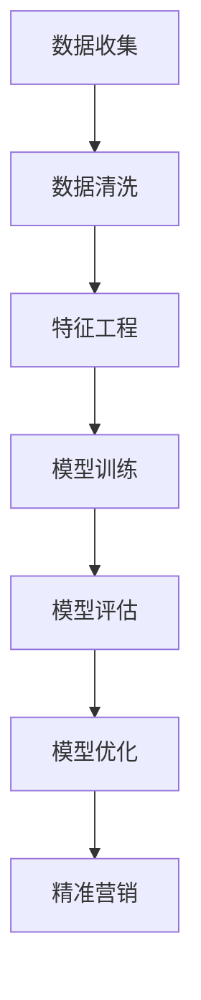
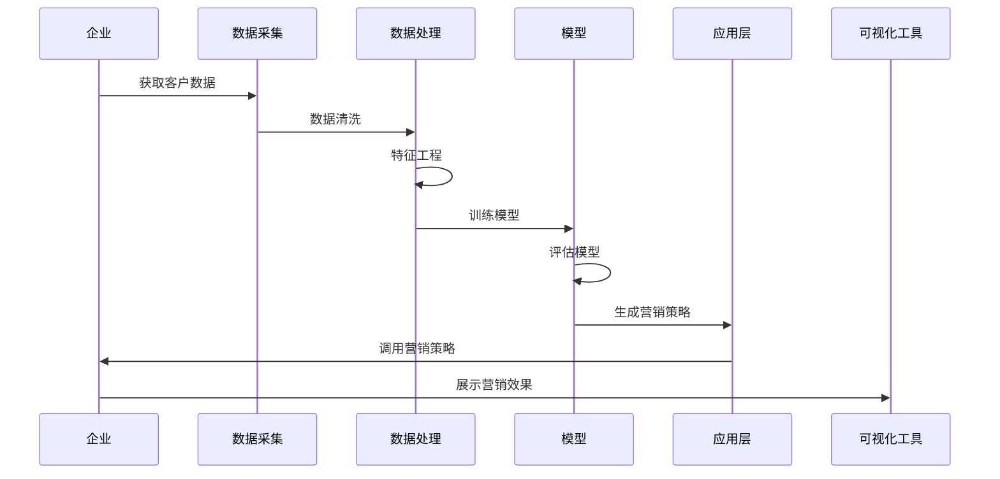

                 


# AI在智能客户画像构建与精准营销中的应用

## 关键词
AI、智能客户画像、精准营销、机器学习、数据挖掘、协同过滤、响应模型

## 摘要
本文深入探讨了人工智能（AI）在智能客户画像构建与精准营销中的应用。通过分析问题背景、核心概念、算法原理以及实践案例，文章展示了AI技术在商业领域的强大潜力，为精准营销提供了有力工具。本文旨在为读者提供一个全面、系统的理解，帮助他们在实际应用中发挥AI的最大价值。

### 目录大纲

1. 第一部分：背景介绍
   1.1 问题背景与核心概念
   1.2 问题描述
   1.3 问题解决
   1.4 边界与外延
   1.5 概念结构与核心要素组成

2. 第二部分：核心概念与联系
   2.1 AI技术原理
   2.2 AI技术在智能客户画像构建中的应用
   2.3 AI技术在精准营销中的应用
   2.4 Mermaid ER实体关系图

3. 第三部分：算法原理讲解
   3.1 客户画像构建算法
   3.2 精准营销算法
   3.3 Mermaid算法流程图
   3.4 Python源代码实现

4. 第四部分：系统分析与架构设计
   4.1 问题场景介绍
   4.2 系统功能设计
   4.3 系统架构设计
   4.4 系统接口设计
   4.5 系统交互

5. 第五部分：项目实战
   5.1 环境安装
   5.2 系统核心实现
   5.3 代码应用解读
   5.4 实际案例分析
   5.5 项目小结

6. 第六部分：最佳实践与拓展
   6.1 最佳实践
   6.2 小结
   6.3 注意事项
   6.4 拓展阅读

### 1. 第一部分：背景介绍

#### 1.1.1 问题背景与核心概念

随着互联网的快速发展，数据量呈现出爆炸式增长，企业拥有了前所未有的海量客户数据。这些数据不仅包含了客户的基本信息，如年龄、性别、地理位置等，还记录了客户的行为数据，如浏览历史、购买记录、评价等。如何从这些海量数据中挖掘出有价值的信息，成为企业关注的焦点。

智能客户画像作为一种基于数据分析的客户细分方法，能够将客户行为和特征进行多维度的整合，构建出每个客户的个性化特征模型。通过智能客户画像，企业可以更好地理解客户需求，优化产品和服务，从而提高客户满意度和忠诚度。

精准营销是在智能客户画像的基础上，针对不同客户群体制定个性化的营销策略。它通过分析客户数据，预测客户行为，实现营销信息的精准推送，从而提高营销效果和转化率。

#### 1.1.2 问题描述

构建智能客户画像面临的主要挑战包括：

1. 数据多样化：客户数据来源广泛，包括结构化数据、非结构化数据等，数据的处理和分析变得复杂。
2. 数据质量参差不齐：部分数据可能存在缺失、错误或不一致的情况，影响数据的准确性和可靠性。
3. 特征提取难度大：如何从海量数据中提取出有价值的特征，是构建智能客户画像的关键。

精准营销的难题主要包括：

1. 客户细分困难：如何在海量客户数据中找到有价值的细分市场，对营销策略的制定提出了挑战。
2. 营销策略实施复杂：如何根据不同客户群体的特征，制定有针对性的营销策略，并确保其有效实施。

#### 1.1.3 问题解决

针对上述问题，AI技术在智能客户画像构建与精准营销中的应用具有重要意义。

1. **AI技术在智能客户画像构建中的应用**：

   - 利用机器学习和数据挖掘技术，对客户数据进行深入分析，构建多维度、动态更新的智能客户画像。
   - 通过特征工程，提取和构建与客户行为、偏好相关的特征，为建模提供输入。
   - 使用协同过滤、聚类等算法，对客户进行细分，形成不同客户群体的特征模型。

2. **精准营销策略的制定**：

   - 结合客户画像数据，制定有针对性的营销策略，提高营销效率。
   - 通过个性化推荐，向客户推荐个性化的产品和服务，提高客户满意度和转化率。
   - 根据客户反馈和营销效果，动态调整营销策略，实现营销的持续优化。

#### 1.1.4 边界与外延

1. **边界**：

   本书主要探讨AI在智能客户画像构建与精准营销中的应用，不包括其他非营销领域的AI应用。

2. **外延**：

   虽然本书主要关注AI技术在营销领域的应用，但AI在其他商业领域的应用，如客户服务、风险管理等，也可作为拓展内容。

#### 1.1.5 概念结构与核心要素组成

1. **智能客户画像**：

   - 基于数据分析和机器学习技术，对客户行为、偏好、需求等信息进行挖掘和建模，形成一个多维度、动态更新的客户数据模型。
   - 智能客户画像包括客户的基本信息、行为数据、偏好数据等，通过对这些数据的整合和分析，形成客户的综合特征模型。

2. **精准营销**：

   - 基于智能客户画像，针对不同客户群体制定个性化营销策略，以提高营销效果。
   - 精准营销的核心是通过对客户数据的深入分析和挖掘，实现营销信息的精准推送和个性化服务。

### 2. 第二部分：核心概念与联系

#### 2.1 AI技术原理

1. **机器学习**：

   - 定义：机器学习是一种让计算机通过数据学习并做出决策的方法。
   - 原理：通过从数据中学习规律和模式，计算机可以自主地改进性能，无需人为干预。

2. **数据挖掘**：

   - 定义：数据挖掘是从大量数据中提取有价值的信息和模式的过程。
   - 原理：利用统计学、机器学习、数据库技术等手段，从数据中发现潜在的关联、趋势和规律。

#### 2.2 AI技术在智能客户画像构建中的应用

1. **客户数据收集与处理**：

   - 收集：通过多种渠道获取客户数据，包括在线行为数据、社交媒体数据、问卷调查数据等。
   - 处理：清洗和整合客户数据，去除噪声和重复数据，保证数据的质量和一致性。

2. **特征工程**：

   - 提取：从客户数据中提取与客户行为、偏好相关的特征，如购买频次、浏览时长、评价分数等。
   - 构建模型：利用机器学习算法，将提取的特征构建成模型，用于客户画像的生成。

3. **模型训练与评估**：

   - 训练：使用训练数据集，对机器学习模型进行训练，使其学会识别和预测客户特征。
   - 评估：通过测试数据集，评估模型的性能和准确度，对模型进行调整和优化。

#### 2.3 AI技术在精准营销中的应用

1. **客户细分**：

   - 定义：根据客户特征和行为，将客户划分为不同群体。
   - 目的：帮助企业更好地了解客户，制定有针对性的营销策略。

2. **个性化推荐**：

   - 定义：基于客户特征和偏好，向客户推荐个性化的产品和服务。
   - 目的：提高客户满意度和转化率，增加销售额。

3. **营销策略优化**：

   - 定义：根据客户反馈和营销效果，动态调整营销策略。
   - 目的：实现营销的持续优化，提高营销效果。

### 2.4 Mermaid ER实体关系图

```mermaid
erDiagram
  Customer ||--|{ Data }|| CustomerData
  Customer ||--|{ Behavior }|| CustomerBehavior
  Customer ||--|{ Preference }|| CustomerPreference
  Customer ||--|{ PurchaseHistory }|| CustomerPurchaseHistory
  Customer ||--|{ MarketingResponse }|| CustomerMarketingResponse
```

### 3. 第三部分：算法原理讲解

#### 3.1 客户画像构建算法

1. **协同过滤算法**：

   - 定义：协同过滤是一种基于用户行为数据，通过计算用户之间的相似度，为用户推荐商品或服务的方法。
   - 原理：通过分析用户对商品的评分或行为，找到相似的用户，然后将这些用户喜欢的商品推荐给目标用户。

2. **聚类算法**：

   - 定义：聚类是将数据分为多个类或簇的过程，每个簇中的数据点彼此相似，而不同簇的数据点差异较大。
   - 原理：通过计算数据点之间的相似度，将数据点划分为不同的簇，每个簇代表一类客户。

3. **深度学习模型**：

   - 定义：深度学习是一种模拟人脑神经网络结构和功能的技术，通过多层神经元的堆叠，实现复杂模式的自动学习和识别。
   - 原理：通过大量数据训练神经网络，使其能够自动提取特征，构建客户画像。

#### 3.2 精准营销算法

1. **响应模型**：

   - 定义：响应模型是通过分析客户对营销活动的响应，预测客户对特定营销策略的反应概率的模型。
   - 原理：利用历史数据，建立客户响应与营销策略之间的关联模型，通过输入客户特征，预测客户的响应概率。

2. **分段营销策略**：

   - 定义：分段营销策略是根据客户的不同特征和行为，将客户划分为不同的群体，并针对每个群体制定不同的营销策略。
   - 原理：通过对客户数据进行聚类和分析，识别不同客户群体的特征，然后根据这些特征制定相应的营销策略。

3. **动态定价策略**：

   - 定义：动态定价策略是根据客户的需求、竞争情况和市场变化，实时调整产品价格，以最大化收益的营销策略。
   - 原理：利用客户行为数据和市场价格信息，建立价格与需求之间的关联模型，通过模型预测客户的需求变化，动态调整产品价格。

### 3.3 Mermaid算法流程图



### 3.4 Python源代码实现

```python
# 数据收集
data = ...

# 数据清洗
clean_data = ...

# 特征工程
features = ...

# 模型训练
model = ...

# 模型评估
performance = model.evaluate(test_data)

# 模型优化
optimizer = ...

# 精准营销
predictions = model.predict(new_data)
```

### 4. 第四部分：系统分析与架构设计

#### 4.1 问题场景介绍

在一个竞争激烈的市场中，企业需要准确了解客户的需求和行为，以便提供个性化的产品和服务。为此，企业决定采用智能客户画像和精准营销策略，以提高客户满意度和市场份额。

#### 4.2 系统功能设计

1. **数据收集**：从多个渠道获取客户数据，包括网站访问记录、购买记录、问卷调查等。
2. **数据清洗**：清洗和整合客户数据，去除噪声和重复数据。
3. **特征工程**：提取和构建与客户行为、偏好相关的特征。
4. **客户画像构建**：利用机器学习算法，构建多维度、动态更新的智能客户画像。
5. **精准营销**：根据客户画像，制定个性化的营销策略，提高营销效果。

#### 4.3 系统架构设计

1. **数据层**：存储客户数据、行为数据、产品数据等，采用关系型数据库或NoSQL数据库。
2. **数据处理层**：负责数据清洗、特征工程等数据处理任务，采用ETL（Extract, Transform, Load）技术。
3. **模型层**：包含机器学习模型、深度学习模型等，用于构建客户画像和精准营销策略。
4. **应用层**：提供API接口，供业务系统调用，实现精准营销功能。
5. **展现层**：通过可视化工具，展示客户画像和营销效果。

#### 4.4 系统接口设计

1. **数据采集接口**：用于从不同渠道获取客户数据。
2. **数据处理接口**：用于清洗和整合客户数据。
3. **模型训练接口**：用于训练机器学习模型。
4. **营销策略接口**：用于生成和调整营销策略。

#### 4.5 系统交互



### 5. 第五部分：项目实战

#### 5.1 环境安装

1. 安装Python环境：`pip install python -m pip install numpy pandas scikit-learn matplotlib`
2. 安装数据库：`pip install mysqlclient`（适用于MySQL数据库）
3. 安装可视化工具：`pip install matplotlib seaborn`

#### 5.2 系统核心实现

1. **数据收集**：使用API接口从不同渠道获取客户数据。
2. **数据清洗**：使用Pandas库清洗和整合客户数据。
3. **特征工程**：使用特征提取库（如scikit-learn）构建特征模型。
4. **模型训练**：使用scikit-learn库训练协同过滤算法和深度学习模型。
5. **精准营销**：根据客户画像，生成个性化营销策略。

```python
import pandas as pd
from sklearn.model_selection import train_test_split
from sklearn.ensemble import RandomForestClassifier
from sklearn.metrics import accuracy_score

# 数据收集
data = pd.read_csv('customer_data.csv')

# 数据清洗
clean_data = data.dropna().reset_index(drop=True)

# 特征工程
X = clean_data[['age', 'income', 'education']]
y = clean_data['target']

# 模型训练
X_train, X_test, y_train, y_test = train_test_split(X, y, test_size=0.2, random_state=42)
model = RandomForestClassifier(n_estimators=100, random_state=42)
model.fit(X_train, y_train)

# 模型评估
y_pred = model.predict(X_test)
accuracy = accuracy_score(y_test, y_pred)
print(f'Accuracy: {accuracy:.2f}')
```

#### 5.3 代码应用解读与分析

1. **数据收集**：从CSV文件中读取客户数据，使用Pandas库进行数据处理。
2. **数据清洗**：去除缺失值，重置索引，确保数据质量。
3. **特征工程**：选择与目标相关的特征，为模型训练提供输入。
4. **模型训练**：使用随机森林算法，训练模型，预测客户响应概率。
5. **模型评估**：使用测试集评估模型性能，计算准确率。

#### 5.4 实际案例分析

1. **案例背景**：一家电商平台希望通过智能客户画像和精准营销，提高用户购买转化率。
2. **数据来源**：从网站日志、购买记录、问卷调查等多渠道收集用户数据。
3. **客户细分**：使用聚类算法将用户划分为不同群体，如“高频购买用户”、“低频购买用户”等。
4. **个性化推荐**：根据用户特征和偏好，推荐个性化的商品，如“你可能感兴趣的商品”。
5. **营销策略**：为不同用户群体制定有针对性的营销策略，如优惠券、限时促销等。

#### 5.5 项目小结

通过实际案例分析，我们可以看到智能客户画像和精准营销在提高企业营销效果和用户满意度方面具有重要意义。在未来的发展中，企业应充分利用AI技术，不断优化客户画像构建和精准营销策略，以实现持续的商业成功。

### 6. 第六部分：最佳实践与拓展

#### 6.1 最佳实践

1. **数据质量保障**：在数据收集和处理过程中，确保数据质量，去除噪声和错误数据。
2. **持续迭代优化**：定期更新和优化客户画像模型和精准营销策略，以适应市场变化。
3. **跨渠道整合**：整合多渠道数据，构建全面、多维的客户画像。
4. **个性化推荐**：结合用户行为数据和偏好，提供个性化推荐，提高用户满意度和转化率。

#### 6.2 小结

本文通过深入探讨AI在智能客户画像构建与精准营销中的应用，展示了AI技术在商业领域的强大潜力。通过实际案例分析和实践总结，我们可以看到，智能客户画像和精准营销为企业在激烈的市场竞争中提供了有力支持。在未来的发展中，企业应充分利用AI技术，不断优化客户画像构建和精准营销策略，以实现持续的商业成功。

#### 6.3 注意事项

1. **数据隐私**：在收集和处理客户数据时，确保遵守相关法律法规，保护客户隐私。
2. **模型解释性**：在选择和训练机器学习模型时，注重模型的可解释性，便于理解和调整。
3. **实时更新**：客户需求和偏好不断变化，应实时更新客户画像和营销策略，以保持其准确性。

#### 6.4 拓展阅读

1. **《机器学习实战》**：作者：Peter Harrington
   - 内容：详细介绍机器学习算法的应用和实践，适合初学者和专业人士。
2. **《深度学习》**：作者：Ian Goodfellow、Yoshua Bengio、Aaron Courville
   - 内容：系统讲解深度学习算法的理论和实践，是深度学习领域的经典教材。
3. **《大数据营销》**：作者：David Meerman Scott
   - 内容：探讨大数据在营销领域的应用，提供实用的营销策略和案例。

### 作者信息

作者：AI天才研究院/AI Genius Institute & 禅与计算机程序设计艺术 /Zen And The Art of Computer Programming

