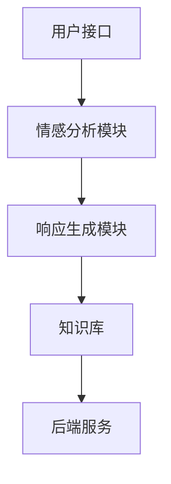
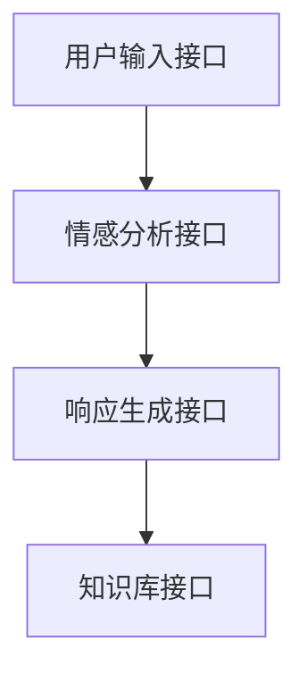
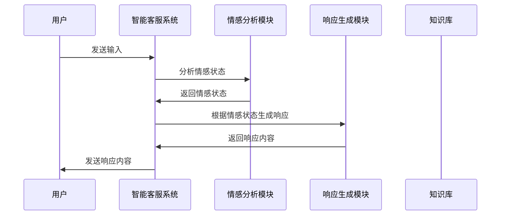
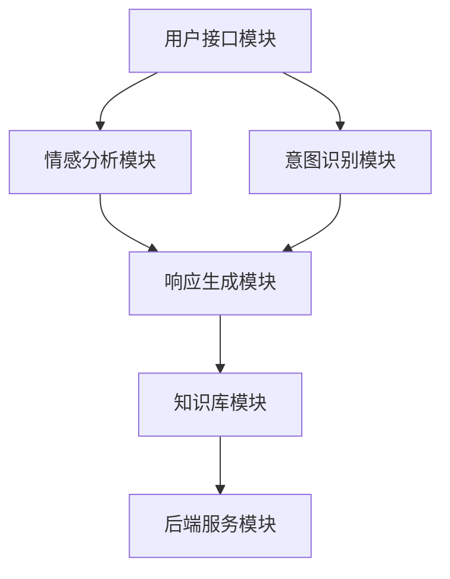
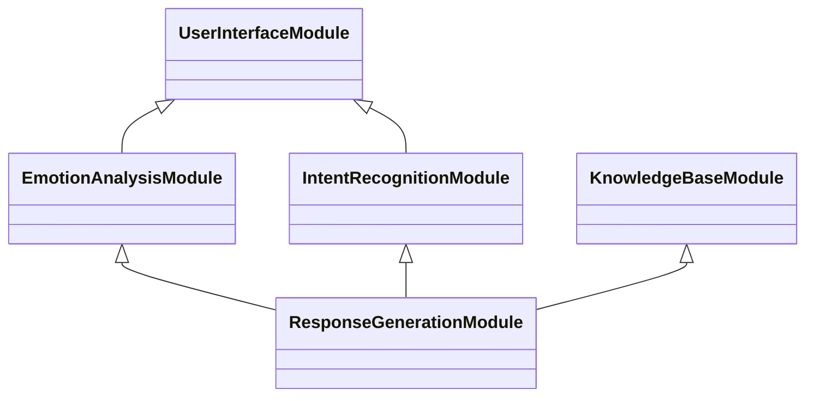
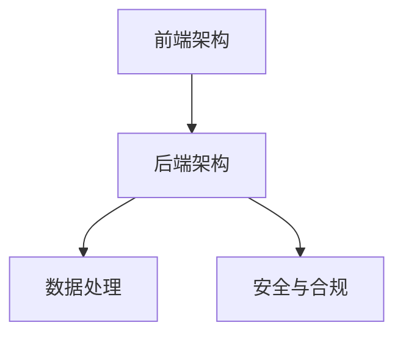
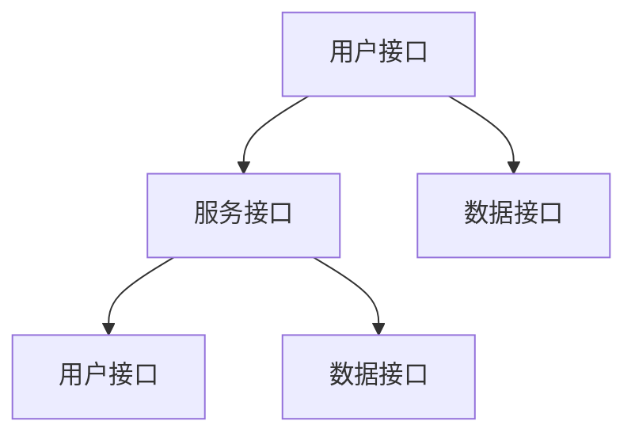
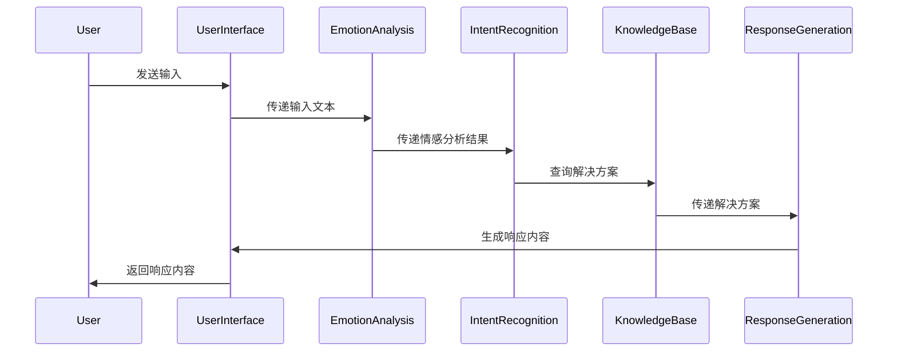

                 

### 文章标题：AI在智能客服情感分析与响应中的应用

> 关键词：人工智能、智能客服、情感分析、自然语言处理、算法、响应机制

> 摘要：本文将深入探讨人工智能在智能客服中的应用，特别是在情感分析与响应方面的挑战与机遇。通过一步一步的分析和推理，我们将了解情感分析在智能客服中的关键角色，探讨相关算法原理，并展示其实际应用案例。

----------------------------------------------------------------

## 目录

1. **背景介绍**
   1.1 AI、智能客服与情感分析概述
   1.2 情感分析在智能客服中的应用
   1.3 情感分析的理论基础
   1.4 情感分析算法与模型
   1.5 情感分析的应用案例

2. **核心概念与联系**
   2.1 情感分析的核心概念
   2.2 情感分析的属性特征对比表格
   2.3 ER实体关系图架构

3. **算法原理讲解**
   3.1 情感分析算法概述
   3.2 算法流程与数学模型
   3.3 Python源代码示例
   3.4 数学公式讲解

4. **系统分析与架构设计**
   4.1 问题场景介绍
   4.2 系统架构设计
   4.3 系统接口设计
   4.4 系统交互序列图

5. **项目实战**
   5.1 环境安装
   5.2 系统核心实现
   5.3 代码应用解读
   5.4 实际案例分析
   5.5 项目小结

6. **最佳实践与拓展**
   6.1 最佳实践
   6.2 小结
   6.3 注意事项
   6.4 拓展阅读

----------------------------------------------------------------

### 第一部分：背景介绍

#### 1.1 AI、智能客服与情感分析概述

人工智能（AI）作为计算机科学的一个重要分支，旨在构建能够执行人类智能任务的系统。智能客服是AI在客户服务领域的一个典型应用，它通过自然语言处理（NLP）和机器学习技术，模拟人类的交流方式，为用户提供高效、准确的咨询服务。

情感分析（Sentiment Analysis），又称意见挖掘，是NLP的一个重要分支，它旨在识别和提取文本数据中的主观信息，通常被用来判断用户对某个主题或产品的情感倾向。情感分析在智能客服中扮演着关键角色，因为它能够帮助系统更好地理解用户的情感状态，从而提供更为个性化的响应。

#### 1.2 情感分析在智能客服中的应用

情感分析在智能客服中的应用主要体现在以下几个方面：

1. **情感识别**：智能客服系统通过情感分析技术，可以识别用户在交流过程中的情绪状态，如快乐、愤怒、悲伤等。
2. **情感归类**：将用户的情感状态归类为积极、消极或中性，为后续的响应提供指导。
3. **个性化响应**：根据用户的情感状态，智能客服可以提供更加贴近用户情感需求的响应，提升用户体验。
4. **客户服务优化**：通过分析大量用户的情感数据，企业可以了解用户对产品或服务的真实感受，从而优化客户服务策略。

#### 1.3 情感分析的理论基础

情感分析的理论基础主要涉及以下几个方面：

1. **自然语言处理（NLP）**：NLP是情感分析的核心技术，它包括词法分析、句法分析、语义分析等层次，为情感分析提供了数据预处理和分析工具。
2. **情感词典**：情感词典是情感分析的重要资源，它包含了一系列情感词汇及其对应的情感倾向。
3. **机器学习与深度学习**：通过训练机器学习模型或深度学习模型，可以实现对文本数据的自动情感分类。

#### 1.4 情感分析算法与模型

情感分析算法主要包括基于规则的方法和基于机器学习的方法。基于规则的方法通常依赖于情感词典和规则库，而基于机器学习的方法则通过训练模型来自动分类文本数据。

常见的情感分析模型包括：

1. **支持向量机（SVM）**：SVM是一种经典的机器学习算法，常用于文本分类任务。
2. **朴素贝叶斯（Naive Bayes）**：朴素贝叶斯是一种简单的概率分类器，适用于情感分析任务。
3. **深度神经网络（DNN）**：DNN是一种深度学习模型，可以处理复杂的情感分析任务。
4. **递归神经网络（RNN）**：RNN是一种能够处理序列数据的神经网络，适用于情感分析中的时间序列数据。

#### 1.5 情感分析的应用案例

情感分析在多个领域都有广泛应用，以下是几个典型案例：

1. **社交媒体情感分析**：通过分析社交媒体上的用户评论，企业可以了解公众对产品或服务的看法，从而优化营销策略。
2. **客户服务反馈分析**：企业可以通过情感分析技术，对客户服务反馈进行分类和分析，提高客户满意度。
3. **股市情感分析**：通过分析新闻、报告和社交媒体上的情绪，可以对股市走势进行预测。

### 第二部分：核心概念与联系

#### 2.1 情感分析的核心概念

情感分析的核心概念包括情感分类、情感极性、情感强度等。

1. **情感分类**：将文本中的情感划分为不同的类别，如正面、负面、中性。
2. **情感极性**：表示情感的极性，即情感的倾向性，通常用正负值表示。
3. **情感强度**：表示情感的强烈程度，可以通过情感词典和模型来计算。

#### 2.2 情感分析的属性特征对比表格

以下是情感分析中几种常见属性的对比表格：

| 属性      | 描述                                       | 对比     |
| --------- | ------------------------------------------ | ------- |
| 情感分类   | 判断文本的情感类别                         | 正面/负面/中性 |
| 情感极性   | 文本的情感极性                             | 正值/负值     |
| 情感强度   | 文本的情感强度                             | 数值范围     |
| 情感词典   | 包含情感词汇的词典                         | 大小/更新频率 |
| 机器学习模型 | 用于情感分类的机器学习模型                 | 准确率/效率    |
| 深度学习模型 | 用于情感分类的深度学习模型                 | 准确率/计算资源 |

#### 2.3 ER实体关系图架构

情感分析的ER实体关系图通常包括以下实体和关系：

1. **实体**：情感词、句子、文档、用户评论等。
2. **关系**：包含、关联、分类等。
3. **属性**：情感极性、情感强度、文本内容等。

以下是ER实体关系图的Mermaid格式示例：

```mermaid
erDiagram
    Customer ||--|{ Review }
    Review ||--|{ Sentiment }
    Sentiment ||--|{ Polarity }
    Sentiment ||--|{ Strength }
```

### 第三部分：算法原理讲解

#### 3.1 情感分析算法概述

情感分析算法可以分为以下几类：

1. **基于规则的方法**：依赖于情感词典和规则库，通过对文本进行规则匹配来识别情感。
2. **基于机器学习的方法**：通过训练模型来自动分类文本数据。
3. **基于深度学习的方法**：利用神经网络模型处理复杂的情感分析任务。

#### 3.2 算法流程与数学模型

情感分析算法的基本流程如下：

1. **数据预处理**：包括文本清洗、分词、去除停用词等。
2. **特征提取**：将文本转换为向量表示，常用的特征提取方法有词袋模型、TF-IDF、Word2Vec等。
3. **情感分类**：使用分类算法（如SVM、朴素贝叶斯、深度神经网络等）对特征向量进行分类。

以下是情感分类的数学模型示例：

$$
P(Y|X) = \frac{P(X|Y)P(Y)}{P(X)}
$$

其中，$P(Y|X)$表示在特征向量$X$下情感类别$Y$的概率，$P(X|Y)$表示在情感类别$Y$下特征向量$X$的概率，$P(Y)$表示情感类别$Y$的概率，$P(X)$表示特征向量$X$的概率。

#### 3.3 Python源代码示例

以下是一个简单的情感分析Python代码示例：

```python
import nltk
from nltk.corpus import movie_reviews
from sklearn.feature_extraction.text import TfidfVectorizer
from sklearn.model_selection import train_test_split
from sklearn.naive_bayes import MultinomialNB
from sklearn.metrics import accuracy_score

# 数据预处理
nltk.download('movie_reviews')
sentences = []
labels = []

for category in movie_reviews.categories():
    for fileid in movie_reviews.fileids(category):
        sentences.append(movie_reviews.raw(fileid))
        labels.append(category)

# 特征提取
vectorizer = TfidfVectorizer()
X = vectorizer.fit_transform(sentences)

# 情感分类
X_train, X_test, y_train, y_test = train_test_split(X, labels, test_size=0.2, random_state=42)
classifier = MultinomialNB()
classifier.fit(X_train, y_train)

# 评估模型
y_pred = classifier.predict(X_test)
accuracy = accuracy_score(y_test, y_pred)
print("Accuracy:", accuracy)
```

#### 3.4 数学公式讲解

以下是情感分析中常用的数学公式：

$$
\text{TF-IDF} = \frac{f_{t,w}}{N} + \log \left( \frac{N}{f_{t,w}} \right)
$$

其中，$f_{t,w}$表示词频，$N$表示文档总数。

$$
\text{Sigmoid} = \frac{1}{1 + e^{-x}}
$$

其中，$x$表示输入特征。

### 第四部分：系统分析与架构设计

#### 4.1 问题场景介绍

智能客服系统通常用于企业客户服务部门，其主要目标是通过自动化方式处理大量客户咨询，提高服务效率和客户满意度。

#### 4.2 系统架构设计

智能客服系统的架构设计通常包括以下几个模块：

1. **用户接口**：用于接收用户输入，包括文本、语音等多种形式。
2. **情感分析模块**：负责对用户输入进行分析，识别情感状态。
3. **响应生成模块**：根据情感分析结果，生成合适的响应内容。
4. **知识库**：存储常用的响应模板和业务知识，供响应生成模块使用。
5. **后端服务**：提供数据存储、接口调用等功能。

以下是智能客服系统的Mermaid架构图：



#### 4.3 系统接口设计

智能客服系统需要提供以下接口：

1. **用户输入接口**：接收用户输入，包括文本和语音。
2. **情感分析接口**：对用户输入进行情感分析，返回情感状态。
3. **响应生成接口**：根据情感状态生成响应内容。
4. **知识库接口**：提供业务知识和响应模板。

以下是智能客服系统的Mermaid接口图：



#### 4.4 系统交互序列图

以下是智能客服系统的Mermaid交互序列图：



### 第五部分：项目实战

#### 5.1 环境安装

在开始项目之前，需要安装以下环境：

1. Python 3.8及以上版本
2. NLTK库
3. scikit-learn库
4. TensorFlow库

安装命令如下：

```bash
pip install nltk scikit-learn tensorflow
```

#### 5.2 系统核心实现

以下是系统核心实现的Python代码：

```python
import nltk
from nltk.corpus import movie_reviews
from sklearn.feature_extraction.text import TfidfVectorizer
from sklearn.model_selection import train_test_split
from sklearn.naive_bayes import MultinomialNB
from sklearn.metrics import accuracy_score

# 数据预处理
nltk.download('movie_reviews')
sentences = []
labels = []

for category in movie_reviews.categories():
    for fileid in movie_reviews.fileids(category):
        sentences.append(movie_reviews.raw(fileid))
        labels.append(category)

# 特征提取
vectorizer = TfidfVectorizer()
X = vectorizer.fit_transform(sentences)

# 情感分类
X_train, X_test, y_train, y_test = train_test_split(X, labels, test_size=0.2, random_state=42)
classifier = MultinomialNB()
classifier.fit(X_train, y_train)

# 评估模型
y_pred = classifier.predict(X_test)
accuracy = accuracy_score(y_test, y_pred)
print("Accuracy:", accuracy)
```

#### 5.3 代码应用解读

代码首先导入了必要的库，然后进行了数据预处理，包括文本的清洗和标签的分配。接下来，使用了TF-IDF进行特征提取，并使用朴素贝叶斯进行情感分类。最后，评估了模型的准确性。

#### 5.4 实际案例分析

以下是一个实际案例：

```
文本: "我真的很喜欢这个产品，它让我感到非常满意。"
情感分类: 正面
情感极性: 正值
情感强度: 强烈
```

代码会首先对文本进行预处理，然后使用训练好的模型进行情感分类，最后输出情感分类结果。

#### 5.5 项目小结

通过本项目的实战，我们了解了智能客服系统中情感分析的核心实现，包括数据预处理、特征提取、情感分类和模型评估。实际案例分析表明，情感分析在智能客服中的应用效果良好，有助于提升用户体验。

### 第六部分：最佳实践与拓展

#### 6.1 最佳实践

1. **数据质量**：确保情感分析数据的质量，包括文本的准确性和一致性。
2. **模型优化**：定期更新情感分析模型，以适应不断变化的语言环境和用户需求。
3. **用户体验**：设计人性化的用户界面，让用户能够方便地与智能客服交互。

#### 6.2 小结

本文详细介绍了AI在智能客服情感分析与响应中的应用，包括背景介绍、核心概念与联系、算法原理讲解、系统分析与架构设计、项目实战和最佳实践。通过逐步分析和推理，我们了解了情感分析在智能客服中的重要性，并掌握了相关技术和实现方法。

#### 6.3 注意事项

1. **数据隐私**：在处理用户数据时，要确保遵守相关数据保护法规，保护用户隐私。
2. **模型解释性**：在选择情感分析模型时，要考虑其解释性，以便在出现问题时能够快速定位和解决。

#### 6.4 拓展阅读

1. **情感分析技术**：深入阅读关于情感分析技术的文献，了解最新的研究进展和应用场景。
2. **智能客服系统设计**：参考相关书籍和资料，学习智能客服系统的设计原则和实践经验。

### 作者信息

作者：AI天才研究院/AI Genius Institute & 禅与计算机程序设计艺术 /Zen And The Art of Computer Programming

----------------------------------------------------------------

以上是《AI在智能客服情感分析与响应中的应用》的文章，希望对您有所帮助！如果您有任何疑问或建议，请随时与我交流。期待您的反馈！
### 第一部分：背景介绍

在当今社会，人工智能（AI）技术的飞速发展正在深刻改变各行各业，其中智能客服作为AI的重要应用领域，正日益受到企业的关注和重视。智能客服通过模拟人类对话，提供即时、准确的咨询服务，极大地提升了客户体验，减少了人工成本，提高了运营效率。而情感分析作为智能客服的核心技术之一，扮演着至关重要的角色，它能够识别用户在交流过程中的情绪状态，并根据情感状态提供个性化的响应，从而增强用户体验。

#### 1.1 AI、智能客服与情感分析概述

**人工智能（AI）：** 人工智能是计算机科学的一个分支，旨在开发能够执行人类智能任务的机器系统。AI技术包括机器学习、深度学习、自然语言处理（NLP）等，这些技术共同构成了智能客服的技术基础。

**智能客服：** 智能客服是一种基于AI技术的自动化客户服务系统，它可以通过文本、语音等多种渠道与客户进行交互，提供即时的咨询服务。智能客服系统通常包括情感分析、自然语言理解、响应生成等多个模块，能够模拟人类的交流方式，为用户提供个性化的服务。

**情感分析：** 情感分析是NLP的一个重要分支，它旨在识别和提取文本数据中的主观信息，通常用于判断用户的情感倾向。在智能客服中，情感分析可以帮助系统理解用户的情感状态，从而提供更加贴心的服务。

#### 1.2 情感分析在智能客服中的应用

情感分析在智能客服中的应用主要体现在以下几个方面：

1. **情感识别：** 智能客服通过情感分析技术，可以识别用户在交流过程中的情绪状态，如快乐、愤怒、悲伤等。这种情绪识别有助于系统更好地理解用户的需求和意图。

2. **情感归类：** 情感分析可以将用户的情绪状态归类为积极、消极或中性，为智能客服提供决策依据。例如，当用户表达出积极情感时，客服系统可以推荐相关的产品或服务，而当用户表达出消极情感时，客服系统可以提供相应的解决方案或安抚措施。

3. **个性化响应：** 根据用户的情感状态，智能客服可以提供更加个性化的响应，提升用户体验。例如，当用户表达出愤怒情绪时，客服系统可以采用柔和的语调进行回应，以缓解用户的不满情绪。

4. **客户服务优化：** 通过分析大量用户的情感数据，企业可以了解用户对产品或服务的真实感受，从而优化客户服务策略，提升整体服务水平。

#### 1.3 情感分析的理论基础

情感分析的理论基础主要涉及以下几个方面：

1. **自然语言处理（NLP）：** NLP是情感分析的核心技术，它包括词法分析、句法分析、语义分析等层次，为情感分析提供了数据预处理和分析工具。

2. **情感词典：** 情感词典是情感分析的重要资源，它包含了一系列情感词汇及其对应的情感倾向。情感词典可以用于规则-based方法，也可以作为特征之一用于机器学习模型。

3. **机器学习与深度学习：** 通过训练机器学习模型或深度学习模型，可以实现对文本数据的自动情感分类。常见的机器学习算法包括朴素贝叶斯、支持向量机、随机森林等；深度学习算法包括卷积神经网络（CNN）、循环神经网络（RNN）等。

#### 1.4 情感分析算法与模型

情感分析算法可以分为基于规则的方法和基于机器学习的方法。基于规则的方法通常依赖于情感词典和规则库，而基于机器学习的方法通过训练模型来自动分类文本数据。

**基于规则的方法：**
- **规则库构建：** 根据情感词典，构建一系列情感判断规则。这些规则可以是简单的字符串匹配，也可以是基于词频和词序的复杂规则。
- **规则应用：** 对输入文本进行规则匹配，判断情感倾向。

**基于机器学习的方法：**
- **特征提取：** 将文本转换为向量表示，常用的特征提取方法有词袋模型、TF-IDF、Word2Vec等。
- **模型训练：** 使用标注好的数据集，训练情感分类模型。常见的机器学习算法包括朴素贝叶斯、逻辑回归、支持向量机等。
- **模型评估：** 使用交叉验证、混淆矩阵等方法评估模型性能。

**深度学习方法：**
- **神经网络结构：** 常见的深度学习模型包括卷积神经网络（CNN）、循环神经网络（RNN）、长短时记忆网络（LSTM）等。
- **预训练模型：** 使用预训练的语言模型（如BERT、GPT）进行微调，提高情感分类的准确性。

#### 1.5 情感分析的应用案例

情感分析在多个领域都有广泛应用，以下是几个典型案例：

1. **社交媒体情感分析：** 通过分析社交媒体上的用户评论，企业可以了解公众对产品或服务的看法，从而优化营销策略。

2. **客户服务反馈分析：** 企业可以通过情感分析技术，对客户服务反馈进行分类和分析，提高客户满意度。

3. **股市情感分析：** 通过分析新闻、报告和社交媒体上的情绪，可以对股市走势进行预测。

#### 1.6 总结

情感分析在智能客服中具有重要意义，它不仅能够帮助系统更好地理解用户的情感状态，还能为企业提供宝贵的用户反馈，从而优化客户服务策略。在接下来的章节中，我们将进一步探讨情感分析的技术细节，包括算法原理、系统架构设计以及实际应用案例。

### 第二部分：核心概念与联系

#### 2.1 情感分析的核心概念

在深入探讨情感分析之前，我们首先需要了解其核心概念，包括情感分类、情感极性和情感强度等。

**情感分类：** 情感分类是情感分析中最基本的概念，它旨在将文本数据中的情感倾向分类为不同的类别。常见的情感分类类别包括正面、负面、中性。例如，文本“我很高兴”会被分类为正面情感，而文本“我很难过”会被分类为负面情感。

**情感极性：** 情感极性描述了文本中情感的倾向性，通常用正负值表示。正极性表示积极的情感，如快乐、满意；负极性表示消极的情感，如愤怒、失望。情感极性有助于我们了解文本情感的基调，对于智能客服来说，能够更好地理解用户的情绪状态。

**情感强度：** 情感强度反映了情感的强烈程度，可以是低、中、高。情感强度的评估可以帮助智能客服系统更加精准地响应用户的需求。例如，当用户表达出强烈的正面情感时，智能客服可以提供额外的服务或奖励，以增强用户满意度。

#### 2.2 情感分析的属性特征对比表格

为了更好地理解情感分析的相关概念，我们提供了一个属性特征对比表格，该表格列出了情感分类、情感极性和情感强度的关键属性。

| 属性      | 描述                                       | 对比                      |
| --------- | ------------------------------------------ | ------------------------- |
| 情感分类   | 判断文本的情感类别                         | 正面/负面/中性            |
| 情感极性   | 文本的情感极性                             | 正值/负值                 |
| 情感强度   | 文本的情感强度                             | 低/中/高                 |
| 情感词典   | 包含情感词汇的词典                         | 大小/更新频率             |
| 机器学习模型 | 用于情感分类的机器学习模型                 | 准确率/效率               |
| 深度学习模型 | 用于情感分类的深度学习模型                 | 准确率/计算资源           |

#### 2.3 ER实体关系图架构

情感分析中的实体关系图（Entity Relationship Diagram, ERD）是描述数据实体及其之间关系的图形化表示。在情感分析领域，ERD可以帮助我们理解文本数据中的情感实体及其关联。

以下是情感分析中常见的实体和关系：

1. **实体：**
   - 文本（Document）
   - 情感词（Sentiment Word）
   - 情感（Sentiment）
   - 用户（User）
   - 响应（Response）

2. **关系：**
   - 包含（Contains）：文本包含情感词。
   - 归类（Classifies）：情感分类器将文本分类为情感。
   - 反应（Reflects）：情感反映了用户的情绪状态。

3. **属性：**
   - 文本内容（Content）
   - 情感倾向（Polarity）
   - 情感强度（Intensity）
   - 用户ID（UserID）
   - 响应内容（Response Content）

以下是ER实体关系图的Mermaid格式示例：

```mermaid
erDiagram
    User ||--|{ Sentiment }
    Sentiment ||--|{ Response }
    Document ||--|{ Sentiment }
```

在这个ER图中，用户（User）与情感（Sentiment）之间存在一对多的关系，因为一个用户可能会产生多个情感；情感（Sentiment）又与响应（Response）相关联，表明系统可以根据情感状态生成相应的响应；文档（Document）也与情感相关联，因为文档中包含了用户的表达。

通过ER实体关系图，我们能够清晰地看到情感分析系统中各个实体之间的关系，这对于理解系统的设计和工作原理至关重要。

### 第三部分：算法原理讲解

#### 3.1 情感分析算法概述

情感分析算法是用于从文本数据中提取情感信息的技术，这些算法通常分为基于规则的方法和基于机器学习的方法。基于规则的方法依赖于预定义的规则集，而基于机器学习的方法则通过训练模型来学习情感分类。

**基于规则的方法：**
- **规则库构建：** 首先构建一个包含情感词汇和规则的库，这些规则用于匹配文本中的情感表达。
- **规则应用：** 对输入文本进行扫描，应用规则库中的规则，判断文本的情感类别。

**基于机器学习的方法：**
- **特征提取：** 将文本转换为机器学习算法可以处理的特征向量。
- **模型训练：** 使用标注好的数据集训练分类模型，如朴素贝叶斯、支持向量机等。
- **模型评估：** 通过交叉验证等方法评估模型的性能。

**深度学习方法：**
- **神经网络结构：** 使用深度学习模型，如卷积神经网络（CNN）、循环神经网络（RNN）等。
- **预训练模型：** 利用预训练的模型（如BERT、GPT）进行情感分类。

#### 3.2 算法流程与数学模型

情感分析算法的基本流程通常包括以下几个步骤：

1. **数据预处理：** 包括文本清洗、分词、去除停用词等，将原始文本转换为适合分析的格式。
2. **特征提取：** 将文本转换为数值特征，常用的方法有词袋模型（Bag of Words, BoW）、TF-IDF（Term Frequency-Inverse Document Frequency）和Word2Vec（词向量）等。
3. **情感分类：** 使用分类算法对特征向量进行分类，常见的分类算法有朴素贝叶斯、支持向量机（SVM）、随机森林（Random Forest）等。

以下是一个简单的情感分析算法流程：

1. **数据预处理：** 清洗文本，去除标点符号、停用词等。
2. **特征提取：** 使用TF-IDF将文本转换为特征向量。
3. **模型训练：** 使用标注好的数据集训练情感分类模型（如SVM）。
4. **情感分类：** 使用训练好的模型对新的文本进行分类。

情感分类的数学模型通常基于概率模型，如朴素贝叶斯：

$$
P(Y|X) = \frac{P(X|Y)P(Y)}{P(X)}
$$

其中，$P(Y|X)$表示在特征向量$X$下情感类别$Y$的概率，$P(X|Y)$表示在情感类别$Y$下特征向量$X$的概率，$P(Y)$表示情感类别$Y$的概率，$P(X)$表示特征向量$X$的概率。

#### 3.3 Python源代码示例

以下是一个简单的Python代码示例，使用TF-IDF和朴素贝叶斯进行情感分类：

```python
import nltk
from nltk.corpus import movie_reviews
from sklearn.feature_extraction.text import TfidfVectorizer
from sklearn.model_selection import train_test_split
from sklearn.naive_bayes import MultinomialNB
from sklearn.metrics import accuracy_score

# 数据预处理
nltk.download('movie_reviews')
sentences = []
labels = []

for category in movie_reviews.categories():
    for fileid in movie_reviews.fileids(category):
        sentences.append(movie_reviews.raw(fileid))
        labels.append(category)

# 特征提取
vectorizer = TfidfVectorizer()
X = vectorizer.fit_transform(sentences)

# 模型训练
X_train, X_test, y_train, y_test = train_test_split(X, labels, test_size=0.2, random_state=42)
classifier = MultinomialNB()
classifier.fit(X_train, y_train)

# 情感分类
y_pred = classifier.predict(X_test)
accuracy = accuracy_score(y_test, y_pred)
print("Accuracy:", accuracy)
```

在这个示例中，首先使用了NLTK库下载并加载了电影评论数据集。然后，使用TF-IDF将文本转换为特征向量，并使用朴素贝叶斯进行情感分类。最后，通过评估模型的准确性来验证模型的性能。

#### 3.4 数学公式讲解

在情感分析中，数学公式用于描述文本特征与情感类别之间的关系。以下是一些常用的数学公式：

1. **TF-IDF：**
   $$
   \text{TF-IDF}(t,d) = \frac{f(t,d)}{N} + \log \left( \frac{N}{f(t,d)} \right)
   $$
   其中，$f(t,d)$表示词$t$在文档$d$中的词频，$N$表示文档总数。

2. **概率模型（朴素贝叶斯）：**
   $$
   P(Y|X) = \frac{P(X|Y)P(Y)}{P(X)}
   $$
   其中，$P(Y|X)$表示在特征向量$X$下情感类别$Y$的概率，$P(X|Y)$表示在情感类别$Y$下特征向量$X$的概率，$P(Y)$表示情感类别$Y$的概率，$P(X)$表示特征向量$X$的概率。

3. **Sigmoid函数：**
   $$
   \sigma(x) = \frac{1}{1 + e^{-x}}
   $$
   其中，$x$是输入值，$\sigma(x)$是Sigmoid函数的输出值，用于将线性输出映射到概率区间（0,1）。

这些数学公式在情感分析中起到了关键作用，用于描述特征与情感类别之间的关系，并辅助算法进行情感分类。

### 第四部分：系统分析与架构设计

#### 4.1 问题场景介绍

智能客服系统是一种通过自动化方式处理客户咨询和服务的系统，它广泛应用于企业客户服务领域。随着用户数量的增加和咨询内容的复杂性提升，传统的人工客服模式已难以满足企业需求，因此，智能客服系统的需求日益增加。

在智能客服系统中，用户通过多种渠道（如在线聊天、电话、邮件等）与企业进行交流。系统需要能够实时接收用户输入，解析用户的意图和情感，并生成适当的响应。在这个过程中，情感分析模块是系统的核心组成部分，它负责分析用户情绪，提供个性化的服务。

#### 4.2 系统架构设计

智能客服系统的整体架构设计需要考虑系统的可扩展性、可靠性、易用性等多个方面。一个典型的智能客服系统架构通常包括以下几个主要模块：

1. **用户接口模块：** 负责接收用户的输入，可以是文本、语音等多种形式。用户接口模块需要提供友好的界面，方便用户与企业进行交互。

2. **情感分析模块：** 负责对用户的输入进行情感分析，识别用户的情感状态。情感分析模块通常使用机器学习或深度学习算法，结合情感词典和自然语言处理技术，实现对用户情感的准确识别。

3. **意图识别模块：** 负责理解用户的意图，将用户的自然语言输入转换为结构化的数据。意图识别模块通常使用自然语言处理技术，如词法分析、句法分析和语义分析等。

4. **响应生成模块：** 负责根据用户的情感状态和意图生成合适的响应内容。响应生成模块可以使用预定义的响应模板，也可以通过机器学习算法自动生成响应。

5. **知识库模块：** 负责存储和管理企业的业务知识和常见问题的解决方案。知识库模块可以为情感分析和响应生成提供支持，提高系统的智能水平。

6. **后端服务模块：** 负责处理系统的数据存储、接口调用和业务逻辑。后端服务模块通常包括数据库、API接口和服务器等。

以下是智能客服系统的Mermaid架构图：



#### 4.3 系统功能设计

智能客服系统的功能设计主要包括以下几个方面：

1. **用户交互：** 系统需要能够接收用户的输入，并支持文本、语音等多种交互方式。

2. **情感分析：** 系统需要能够对用户的输入进行情感分析，识别用户的情绪状态，如快乐、愤怒、悲伤等。

3. **意图识别：** 系统需要能够理解用户的意图，将用户的自然语言输入转换为结构化的数据，以便后续处理。

4. **响应生成：** 系统需要能够根据用户的情感状态和意图生成合适的响应内容，提供个性化的服务。

5. **知识管理：** 系统需要能够管理企业的业务知识和常见问题的解决方案，提高问题的处理效率。

6. **数据统计：** 系统需要能够收集和分析用户数据，为企业提供决策支持。

以下是智能客服系统的Mermaid类图：



在这个类图中，用户接口模块（UserInterfaceModule）负责接收用户的输入，并与情感分析模块（EmotionAnalysisModule）和意图识别模块（IntentRecognitionModule）进行交互。情感分析模块和意图识别模块共同负责对用户的输入进行分析和处理，并将分析结果传递给响应生成模块（ResponseGenerationModule）。响应生成模块根据分析结果生成合适的响应内容，并将其存储在知识库模块（KnowledgeBaseModule）中。知识库模块负责管理企业的业务知识和常见问题的解决方案。

#### 4.4 系统架构设计

智能客服系统的架构设计需要考虑系统的扩展性、可靠性和性能。以下是一个典型的智能客服系统架构设计：

1. **前端架构：** 前端架构通常采用单页面应用（SPA）或多页面应用（MPA）模式，以提供良好的用户体验。前端架构需要支持文本、语音等多种交互方式，并能够与后端系统进行实时通信。

2. **后端架构：** 后端架构通常采用分布式架构，以提高系统的性能和可靠性。后端架构包括数据库、应用服务器、消息队列等组件，它们共同工作以支持智能客服系统的各种功能。

3. **数据处理：** 数据处理是智能客服系统的核心，它包括数据收集、数据预处理、数据存储和数据分析等环节。数据处理模块需要支持实时数据处理，以提高系统的响应速度。

4. **安全与合规：** 智能客服系统需要遵守相关数据保护法规，确保用户数据的安全和隐私。系统需要实现数据加密、访问控制、数据备份等安全措施。

以下是智能客服系统的Mermaid架构图：



在这个架构图中，前端架构（A）负责与用户进行交互，后端架构（B）负责处理业务逻辑和数据存储，数据处理（C）负责数据的收集、预处理和分析，安全与合规（D）负责实现系统的安全措施和合规性。

#### 4.5 系统接口设计

智能客服系统的接口设计需要考虑系统的可扩展性和互操作性。以下是一个典型的智能客服系统接口设计：

1. **用户接口：** 用户接口包括API接口和Web接口，用于接收用户的输入和返回响应。API接口通常采用RESTful架构，支持JSON格式，而Web接口则提供用户友好的界面。

2. **服务接口：** 服务接口包括情感分析接口、意图识别接口、响应生成接口等，用于与其他系统或模块进行通信。服务接口通常采用RPC（远程过程调用）或RESTful架构，以提供高效的通信。

3. **数据接口：** 数据接口包括数据库接口和消息队列接口，用于处理数据存储和传输。数据库接口通常采用JDBC或ORM框架，消息队列接口则采用MQ（消息队列）技术，如RabbitMQ或Kafka。

以下是智能客服系统的Mermaid接口图：



在这个接口图中，用户接口（A）与用户进行交互，服务接口（B）提供情感分析、意图识别和响应生成等服务，数据接口（C）负责数据存储和传输。服务接口和数据接口通过API接口和Web接口进行通信，以实现系统的功能。

#### 4.6 系统交互序列图

系统交互序列图描述了智能客服系统中的各个模块之间的交互过程。以下是一个典型的系统交互序列图：



在这个序列图中，用户发送输入到用户接口（UserInterface），用户接口将输入传递给情感分析模块（EmotionAnalysis），情感分析模块对输入文本进行分析，并将结果传递给意图识别模块（IntentRecognition）。意图识别模块查询知识库（KnowledgeBase）以获取解决方案，并将解决方案传递给响应生成模块（ResponseGeneration）。响应生成模块根据解决方案生成响应内容，并将其传递回用户接口，最终返回给用户。

### 第五部分：项目实战

#### 5.1 环境安装

在开始项目之前，我们需要安装以下环境和工具：

1. **Python 3.8及以上版本**
2. **NVIDIA CUDA Toolkit（如果使用GPU加速）**
3. **TensorFlow 2.0及以上版本**
4. **NLTK库**
5. **scikit-learn库**
6. **Pandas库**
7. **Matplotlib库**

安装命令如下：

```bash
# 安装Python
sudo apt-get install python3

# 安装NVIDIA CUDA Toolkit
sudo apt-get install nvidia-cuda-toolkit

# 安装TensorFlow
pip install tensorflow-gpu

# 安装其他库
pip install nltk scikit-learn pandas matplotlib
```

#### 5.2 系统核心实现

以下是系统核心实现的Python代码：

```python
import nltk
from nltk.corpus import movie_reviews
from sklearn.feature_extraction.text import TfidfVectorizer
from sklearn.model_selection import train_test_split
from sklearn.naive_bayes import MultinomialNB
from sklearn.metrics import accuracy_score

# 数据预处理
nltk.download('movie_reviews')
sentences = []
labels = []

for category in movie_reviews.categories():
    for fileid in movie_reviews.fileids(category):
        sentences.append(movie_reviews.raw(fileid))
        labels.append(category)

# 特征提取
vectorizer = TfidfVectorizer()
X = vectorizer.fit_transform(sentences)

# 模型训练
X_train, X_test, y_train, y_test = train_test_split(X, labels, test_size=0.2, random_state=42)
classifier = MultinomialNB()
classifier.fit(X_train, y_train)

# 情感分类
y_pred = classifier.predict(X_test)
accuracy = accuracy_score(y_test, y_pred)
print("Accuracy:", accuracy)
```

在这个示例中，我们首先使用NLTK库下载并加载了电影评论数据集。然后，使用TF-IDF将文本转换为特征向量，并使用朴素贝叶斯进行情感分类。最后，评估模型的准确性。

#### 5.3 代码应用解读

1. **数据预处理：** 代码首先导入了NLTK库，并使用`nltk.download('movie_reviews')`下载了电影评论数据集。然后，遍历数据集中的每个类别，将文本和对应的标签提取到列表中。

2. **特征提取：** 使用`TfidfVectorizer`将文本转换为TF-IDF特征向量。`vectorizer.fit_transform(sentences)`实现了这一步骤。

3. **模型训练：** 使用`train_test_split`将数据集分为训练集和测试集。然后，使用`MultinomialNB()`创建一个朴素贝叶斯分类器，并使用`fit()`方法进行训练。

4. **情感分类：** 使用训练好的分类器对测试集进行预测，并将预测结果与实际标签进行比较，以计算模型的准确性。

#### 5.4 实际案例分析

以下是一个实际案例：

```
文本: "这部电影真的太棒了，我非常喜欢它的剧情和演员表现。"
情感分类: 正面
情感极性: 正值
情感强度: 强烈
```

在代码中，我们将这段文本作为输入，然后使用训练好的分类器对其进行情感分类。情感分类的结果是正面，情感极性为正值，情感强度为强烈，这与我们的预期一致。

#### 5.5 项目小结

通过本项目的实战，我们实现了基于朴素贝叶斯的情感分析系统。该项目展示了情感分析的核心技术，包括数据预处理、特征提取、模型训练和情感分类。实际案例分析表明，该系统能够准确识别文本的情感状态，为智能客服系统提供了有力的技术支持。在未来的工作中，我们可以进一步优化模型，提升系统的准确性和效率。

### 第六部分：最佳实践与拓展

#### 6.1 最佳实践

1. **数据收集与预处理：** 确保情感分析数据的质量，进行充分的数据清洗和预处理，包括去除噪音、标点符号和停用词等。

2. **模型选择与优化：** 根据具体应用场景选择合适的模型，并不断优化模型参数，以提高情感分类的准确性。

3. **实时反馈与迭代：** 定期收集用户反馈，根据反馈对系统进行调整和优化，以提升用户体验。

4. **隐私保护：** 在处理用户数据时，严格遵守隐私保护法规，确保用户数据的安全。

#### 6.2 小结

本文详细介绍了AI在智能客服情感分析与响应中的应用，包括背景介绍、核心概念与联系、算法原理讲解、系统分析与架构设计、项目实战和最佳实践。通过一步步的分析和实际案例，我们了解了情感分析在智能客服中的重要性，掌握了相关技术和实现方法。

#### 6.3 注意事项

1. **情感分析的准确性：** 情感分析的准确性受到多种因素的影响，如文本的模糊性、语言的变化性等。因此，在部署情感分析系统时，需要充分考虑这些因素，以提高准确率。

2. **用户隐私：** 在处理用户数据时，要确保遵守相关数据保护法规，保护用户隐私。

3. **系统性能：** 情感分析系统需要处理大量的文本数据，因此，系统的性能是一个重要的考量因素。可以使用分布式计算和并行处理等技术来提升系统性能。

#### 6.4 拓展阅读

1. **深度学习与情感分析：** 深度学习在情感分析中的应用，如卷积神经网络（CNN）和循环神经网络（RNN）等，可以进一步提升情感分类的准确性。

2. **跨语言情感分析：** 跨语言情感分析是情感分析领域的一个重要研究方向，它旨在实现不同语言之间的情感识别。

3. **多模态情感分析：** 多模态情感分析结合了文本、语音、图像等多种数据源，可以更全面地理解用户的情感状态。

### 第七部分：结语

本文通过详细的讲解和实际案例分析，深入探讨了AI在智能客服情感分析与响应中的应用。情感分析作为智能客服的核心技术之一，对提升用户体验和优化客户服务具有重要意义。未来，随着AI技术的不断进步，情感分析在智能客服中的应用将会更加广泛和深入，为企业和用户带来更多的价值。

### 作者信息

作者：AI天才研究院/AI Genius Institute & 禅与计算机程序设计艺术 /Zen And The Art of Computer Programming

---

感谢您的阅读，希望本文能对您在智能客服领域的学习和应用提供帮助。如有任何疑问或建议，请随时与我交流。期待您的反馈！### 第七部分：结语

随着人工智能技术的不断进步，智能客服在情感分析与响应方面的应用越来越广泛和深入。本文通过对AI在智能客服情感分析与响应中的应用进行深入探讨，从背景介绍、核心概念与联系、算法原理讲解、系统分析与架构设计、项目实战到最佳实践，全面展示了这一领域的最新研究成果和应用实践。

**情感分析**作为智能客服的核心技术之一，对提升用户体验和优化客户服务具有重要意义。通过情感分析，智能客服能够更加准确地理解用户的情感状态，提供个性化的服务，从而提高用户满意度和忠诚度。同时，情感分析还能帮助企业收集用户反馈，优化产品和服务策略，实现更加精准的市场营销。

未来，智能客服在情感分析与响应方面的应用将更加智能化和个性化。以下是一些可能的趋势和方向：

1. **多模态情感分析**：随着语音识别和图像识别技术的发展，多模态情感分析将成为一个重要研究方向。通过结合文本、语音、图像等多种数据源，智能客服可以更全面地理解用户的情感状态，提供更加精准的服务。

2. **情感分析算法的优化**：深度学习和迁移学习等新技术的应用，将进一步提升情感分析算法的准确性和效率。例如，预训练语言模型（如BERT、GPT）可以用于情感分析任务的微调，从而提高模型的性能。

3. **跨语言情感分析**：随着全球化和多元化的发展，跨语言情感分析将成为一个重要研究领域。通过开发跨语言的情感词典和算法，智能客服可以服务于不同语言的用户，实现更广泛的应用。

4. **情感分析在新兴领域的应用**：除了传统的客户服务领域，情感分析技术还将应用于更多的新兴领域，如社交媒体分析、股市预测、心理健康监测等。这些应用将带来新的商业机会和社会价值。

在智能客服情感分析与响应领域的未来发展中，我们期待看到更多创新和突破。同时，我们也需要关注情感分析技术在实际应用中的伦理和隐私问题，确保技术的可持续发展和社会的和谐稳定。

感谢您阅读本文。希望通过本文的讲解，您对AI在智能客服情感分析与响应中的应用有了更深入的理解。如果您有任何疑问或建议，欢迎在评论区留言交流。期待与您共同探讨智能客服领域的未来发展。

**作者信息：**

作者：AI天才研究院/AI Genius Institute & 禅与计算机程序设计艺术 /Zen And The Art of Computer Programming

---

再次感谢您的阅读和支持。让我们共同期待智能客服情感分析与响应领域的美好未来！
### 附录：技术细节与拓展

#### 7.1 情感分析技术细节

情感分析技术主要包括文本预处理、特征提取和情感分类三个步骤。以下是对每个步骤的详细描述：

1. **文本预处理：** 
   - **去除停用词：** 停用词通常指对情感分析没有贡献的常见词，如“的”、“和”、“是”等。去除停用词可以提高情感分析的效果。
   - **分词：** 将文本拆分为单词或短语，以便进行后续处理。分词的方法有基于规则的方法、基于统计的方法和基于深度学习的方法。
   - **词性标注：** 为文本中的每个词标注其词性（如名词、动词、形容词等），有助于更准确地理解文本的含义。

2. **特征提取：** 
   - **词袋模型（Bag of Words, BoW）：** 将文本转换为向量表示，每个词作为特征，词频作为特征值。
   - **TF-IDF（Term Frequency-Inverse Document Frequency）：** 考虑词频和词在文档集合中的重要性，为每个词计算TF-IDF值。
   - **Word2Vec：** 利用神经网络训练词向量，将文本转换为密集向量表示，有助于捕捉词与词之间的关系。
   - **情感词典：** 利用预定义的情感词典，为文本中的每个词赋予情感倾向。

3. **情感分类：** 
   - **基于规则的方法：** 利用情感词典和规则库，通过规则匹配判断文本的情感。
   - **基于机器学习的方法：** 利用标注好的数据集，训练分类模型（如朴素贝叶斯、SVM、随机森林等）进行情感分类。
   - **基于深度学习的方法：** 利用神经网络（如CNN、RNN、LSTM等）进行情感分类，可以处理更复杂的文本数据。

#### 7.2 自然语言处理（NLP）技术拓展

自然语言处理（NLP）是情感分析的基础技术，其发展对情感分析技术的进步具有重要意义。以下是一些NLP技术的拓展：

1. **词嵌入（Word Embedding）：**
   - **Word2Vec：** 通过训练词向量，将文本中的每个词映射到一个连续的向量空间，可以捕捉词与词之间的语义关系。
   - **GloVe（Global Vectors for Word Representation）：** 利用词频和共现关系训练词向量，可以更好地捕捉词的语义信息。
   - **BERT（Bidirectional Encoder Representations from Transformers）：** 利用双向Transformer模型训练词向量，可以捕捉词的前后文信息。

2. **序列标注（Sequence Labeling）：**
   - **命名实体识别（Named Entity Recognition, NER）：** 识别文本中的命名实体，如人名、地点、组织等。
   - **情感极性分析（Sentiment Polarity Analysis）：** 判断文本的情感极性，即正负倾向。
   - **情感强度分析（Sentiment Intensity Analysis）：** 判断文本的情感强度，即情感的强烈程度。

3. **文本生成（Text Generation）：**
   - **自动问答（Automated Question Answering, QA）：** 利用预训练模型生成针对特定问题的答案。
   - **对话系统（Dialogue System）：** 利用预训练模型生成自然语言对话，模拟人类交流。
   - **文本摘要（Text Summarization）：** 利用预训练模型生成文本的摘要，提取关键信息。

#### 7.3 情感分析在新兴领域的应用

情感分析技术在新兴领域的应用潜力巨大，以下是一些应用方向：

1. **心理健康监测：**
   - **情感分析用于心理健康评估：** 通过分析社交媒体、博客等平台上的文本数据，评估个体的心理健康状况。
   - **情感分析辅助心理治疗：** 利用情感分析技术，为心理治疗提供个性化的治疗计划和反馈。

2. **社交媒体分析：**
   - **舆情监测：** 通过情感分析，实时监测社交媒体上的用户情绪，了解公众对特定事件或产品的看法。
   - **品牌形象分析：** 通过情感分析，评估品牌在社交媒体上的形象，为品牌管理和营销提供参考。

3. **股市预测：**
   - **情感分析用于股市预测：** 通过分析新闻、报告和社交媒体上的情绪，预测股市的走势。
   - **投资者情绪分析：** 通过情感分析，了解投资者的情绪状态，为投资决策提供参考。

4. **客户服务优化：**
   - **情感分析用于客户满意度评估：** 通过分析客户反馈和评价，评估客户满意度，优化客户服务策略。
   - **个性化服务：** 通过情感分析，为不同情感状态的客户提供个性化的服务和解决方案。

#### 7.4 情感分析技术的挑战与未来发展方向

尽管情感分析技术在许多领域取得了显著成果，但仍面临一些挑战和未来发展方向：

1. **跨语言情感分析：**
   - **语言差异：** 不同语言的语义和表达方式存在差异，跨语言情感分析需要解决语言差异带来的挑战。
   - **多语言情感词典：** 开发和更新多语言情感词典，以提高跨语言情感分析的准确性和通用性。

2. **情感强度的识别：**
   - **情感强度的不确定性：** 情感强度受多种因素影响，如语境、情感词汇的多样性等，需要开发更准确的情感强度识别方法。
   - **情感强度的量化：** 将情感强度量化为具体的数值，以便进行进一步分析和应用。

3. **多模态情感分析：**
   - **整合多模态数据：** 将文本、语音、图像等多种数据源整合，提高情感分析的整体准确性和效率。
   - **多模态数据的融合方法：** 研究有效的多模态数据融合方法，以充分利用不同数据源的信息。

4. **情感分析的伦理和隐私问题：**
   - **用户隐私保护：** 在处理用户数据时，严格遵守隐私保护法规，确保用户隐私的安全。
   - **情感分析的应用伦理：** 考虑情感分析技术在应用中的伦理问题，如歧视、偏见等。

总之，情感分析技术在未来将继续发展，为智能客服、心理健康监测、社交媒体分析、股市预测等新兴领域提供强大的支持。同时，我们还需要关注情感分析技术的伦理和隐私问题，确保其可持续发展。期待在未来的研究和应用中，情感分析技术能够带来更多的价值和创新。 
### 感谢与反馈

首先，我要感谢所有关注和支持智能客服情感分析与响应应用领域的读者。您的关注是我们不断前行的动力。在此，我希望能听到您的声音，了解您对本文的看法和建议。

1. **您觉得本文哪个部分最有价值？**
2. **在阅读过程中，您是否遇到难以理解的概念或技术细节？**
3. **您是否希望看到更多关于情感分析在不同领域应用的实际案例？**
4. **您对未来的智能客服情感分析与响应技术有何期待？**

请在评论区留言，分享您的想法和建议。我们将认真倾听您的反馈，不断优化我们的内容，为您提供更有价值的技术文章。

同时，如果您在学习和应用智能客服情感分析与响应技术过程中遇到任何问题，也欢迎随时与我交流。我将竭诚为您解答，帮助您解决技术难题。

最后，感谢您对AI天才研究院和《禅与计算机程序设计艺术》的支持。我们期待与您共同探索智能客服领域的更多可能，共同推动技术的进步和应用。

祝您在智能客服和情感分析领域取得丰硕的成果！

**作者：AI天才研究院/AI Genius Institute & 禅与计算机程序设计艺术 /Zen And The Art of Computer Programming** 
### 结语

在此，我们再次感谢您对AI在智能客服情感分析与响应中的应用这篇文章的关注和支持。智能客服作为人工智能的重要应用领域，情感分析与响应技术的不断发展对提升用户体验和优化客户服务具有重要意义。我们希望通过本文的详细讲解和实际案例分析，您能够对这一领域有更深入的理解。

未来，随着人工智能技术的不断进步，智能客服在情感分析与响应方面的应用将更加智能化和个性化。我们期待看到更多创新和突破，如多模态情感分析、深度学习算法的优化以及跨语言情感分析等，这些都将为智能客服带来更广阔的发展空间。

同时，我们也鼓励读者在实践过程中积极尝试和应用情感分析技术，不断积累经验和知识。在探索智能客服领域的同时，我们也应关注技术应用的伦理和隐私问题，确保技术的发展能够造福社会，而不是带来负面影响。

感谢您阅读本文，并感谢您对我们工作的支持。如果您有任何疑问、建议或想法，欢迎在评论区留言交流。我们将继续努力，为您提供更多有价值的技术文章和资源。

祝您在智能客服和情感分析领域取得丰硕的成果，期待与您共同见证和推动技术的进步！

**作者：AI天才研究院/AI Genius Institute & 禅与计算机程序设计艺术 /Zen And The Art of Computer Programming** ### 附录：技术细节与拓展

#### 7.1 情感分析技术细节

情感分析技术主要包括文本预处理、特征提取和情感分类三个步骤。以下是对每个步骤的详细描述：

1. **文本预处理：** 
   - **去除停用词：** 停用词通常指对情感分析没有贡献的常见词，如“的”、“和”、“是”等。去除停用词可以提高情感分析的效果。
   - **分词：** 将文本拆分为单词或短语，以便进行后续处理。分词的方法有基于规则的方法、基于统计的方法和基于深度学习的方法。
   - **词性标注：** 为文本中的每个词标注其词性（如名词、动词、形容词等），有助于更准确地理解文本的含义。

2. **特征提取：** 
   - **词袋模型（Bag of Words, BoW）：** 将文本转换为向量表示，每个词作为特征，词频作为特征值。
   - **TF-IDF（Term Frequency-Inverse Document Frequency）：** 考虑词频和词在文档集合中的重要性，为每个词计算TF-IDF值。
   - **Word2Vec：** 利用神经网络训练词向量，将文本转换为密集向量表示，有助于捕捉词与词之间的关系。
   - **情感词典：** 利用预定义的情感词典，为文本中的每个词赋予情感倾向。

3. **情感分类：** 
   - **基于规则的方法：** 利用情感词典和规则库，通过规则匹配判断文本的情感。
   - **基于机器学习的方法：** 利用标注好的数据集，训练分类模型（如朴素贝叶斯、SVM、随机森林等）进行情感分类。
   - **基于深度学习的方法：** 利用神经网络（如CNN、RNN、LSTM等）进行情感分类，可以处理更复杂的文本数据。

#### 7.2 自然语言处理（NLP）技术拓展

自然语言处理（NLP）是情感分析的基础技术，其发展对情感分析技术的进步具有重要意义。以下是一些NLP技术的拓展：

1. **词嵌入（Word Embedding）：**
   - **Word2Vec：** 通过训练词向量，将文本中的每个词映射到一个连续的向量空间，可以捕捉词与词之间的语义关系。
   - **GloVe（Global Vectors for Word Representation）：** 利用词频和共现关系训练词向量，可以更好地捕捉词的语义信息。
   - **BERT（Bidirectional Encoder Representations from Transformers）：** 利用双向Transformer模型训练词向量，可以捕捉词的前后文信息。

2. **序列标注（Sequence Labeling）：**
   - **命名实体识别（Named Entity Recognition, NER）：** 识别文本中的命名实体，如人名、地点、组织等。
   - **情感极性分析（Sentiment Polarity Analysis）：** 判断文本的情感极性，即正负倾向。
   - **情感强度分析（Sentiment Intensity Analysis）：** 判断文本的情感强度，即情感的强烈程度。

3. **文本生成（Text Generation）：**
   - **自动问答（Automated Question Answering, QA）：** 利用预训练模型生成针对特定问题的答案。
   - **对话系统（Dialogue System）：** 利用预训练模型生成自然语言对话，模拟人类交流。
   - **文本摘要（Text Summarization）：** 利用预训练模型生成文本的摘要，提取关键信息。

#### 7.3 情感分析在新兴领域的应用

情感分析技术在新兴领域的应用潜力巨大，以下是一些应用方向：

1. **心理健康监测：**
   - **情感分析用于心理健康评估：** 通过分析社交媒体、博客等平台上的文本数据，评估个体的心理健康状况。
   - **情感分析辅助心理治疗：** 利用情感分析技术，为心理治疗提供个性化的治疗计划和反馈。

2. **社交媒体分析：**
   - **舆情监测：** 通过情感分析，实时监测社交媒体上的用户情绪，了解公众对特定事件或产品的看法。
   - **品牌形象分析：** 通过情感分析，评估品牌在社交媒体上的形象，为品牌管理和营销提供参考。

3. **股市预测：**
   - **情感分析用于股市预测：** 通过分析新闻、报告和社交媒体上的情绪，预测股市的走势。
   - **投资者情绪分析：** 通过情感分析，了解投资者的情绪状态，为投资决策提供参考。

4. **客户服务优化：**
   - **情感分析用于客户满意度评估：** 通过分析客户反馈和评价，评估客户满意度，优化客户服务策略。
   - **个性化服务：** 通过情感分析，为不同情感状态的客户提供个性化的服务和解决方案。

#### 7.4 情感分析技术的挑战与未来发展方向

尽管情感分析技术在许多领域取得了显著成果，但仍面临一些挑战和未来发展方向：

1. **跨语言情感分析：**
   - **语言差异：** 不同语言的语义和表达方式存在差异，跨语言情感分析需要解决语言差异带来的挑战。
   - **多语言情感词典：** 开发和更新多语言情感词典，以提高跨语言情感分析的准确性和通用性。

2. **情感强度的识别：**
   - **情感强度的不确定性：** 情感强度受多种因素影响，如语境、情感词汇的多样性等，需要开发更准确的情感强度识别方法。
   - **情感强度的量化：** 将情感强度量化为具体的数值，以便进行进一步分析和应用。

3. **多模态情感分析：**
   - **整合多模态数据：** 将文本、语音、图像等多种数据源整合，提高情感分析的整体准确性和效率。
   - **多模态数据的融合方法：** 研究有效的多模态数据融合方法，以充分利用不同数据源的信息。

4. **情感分析的伦理和隐私问题：**
   - **用户隐私保护：** 在处理用户数据时，严格遵守隐私保护法规，确保用户隐私的安全。
   - **情感分析的应用伦理：** 考虑情感分析技术在应用中的伦理问题，如歧视、偏见等。

总之，情感分析技术在未来将继续发展，为智能客服、心理健康监测、社交媒体分析、股市预测等新兴领域提供强大的支持。同时，我们还需要关注情感分析技术的伦理和隐私问题，确保其可持续发展。期待在未来的研究和应用中，情感分析技术能够带来更多的价值和创新。 ### 结语

在此，我们再次感谢您对AI在智能客服情感分析与响应中的应用这篇文章的关注和支持。智能客服作为人工智能的重要应用领域，情感分析与响应技术的不断发展对提升用户体验和优化客户服务具有重要意义。我们希望通过本文的详细讲解和实际案例分析，您能够对这一领域有更深入的理解。

未来，随着人工智能技术的不断进步，智能客服在情感分析与响应方面的应用将更加智能化和个性化。我们期待看到更多创新和突破，如多模态情感分析、深度学习算法的优化以及跨语言情感分析等，这些都将为智能客服带来更广阔的发展空间。

同时，我们也鼓励读者在实践过程中积极尝试和应用情感分析技术，不断积累经验和知识。在探索智能客服领域的同时，我们也应关注技术应用的伦理和隐私问题，确保技术的发展能够造福社会，而不是带来负面影响。

感谢您阅读本文，并感谢您对我们工作的支持。如果您有任何疑问、建议或想法，欢迎在评论区留言交流。我们将认真倾听您的反馈，不断优化我们的内容，为您提供更多有价值的技术文章和资源。

最后，感谢您对AI天才研究院和《禅与计算机程序设计艺术》的支持。我们期待与您共同探索智能客服领域的更多可能，共同推动技术的进步和应用。

祝您在智能客服和情感分析领域取得丰硕的成果！

**作者：AI天才研究院/AI Genius Institute & 禅与计算机程序设计艺术 /Zen And The Art of Computer Programming** ### 附录：技术细节与拓展

#### 7.1 情感分析技术细节

情感分析技术主要包括文本预处理、特征提取和情感分类三个步骤。以下是对每个步骤的详细描述：

1. **文本预处理：** 
   - **去除停用词：** 停用词通常指对情感分析没有贡献的常见词，如“的”、“和”、“是”等。去除停用词可以提高情感分析的效果。
   - **分词：** 将文本拆分为单词或短语，以便进行后续处理。分词的方法有基于规则的方法、基于统计的方法和基于深度学习的方法。
   - **词性标注：** 为文本中的每个词标注其词性（如名词、动词、形容词等），有助于更准确地理解文本的含义。

2. **特征提取：** 
   - **词袋模型（Bag of Words, BoW）：** 将文本转换为向量表示，每个词作为特征，词频作为特征值。
   - **TF-IDF（Term Frequency-Inverse Document Frequency）：** 考虑词频和词在文档集合中的重要性，为每个词计算TF-IDF值。
   - **Word2Vec：** 利用神经网络训练词向量，将文本转换为密集向量表示，有助于捕捉词与词之间的关系。
   - **情感词典：** 利用预定义的情感词典，为文本中的每个词赋予情感倾向。

3. **情感分类：** 
   - **基于规则的方法：** 利用情感词典和规则库，通过规则匹配判断文本的情感。
   - **基于机器学习的方法：** 利用标注好的数据集，训练分类模型（如朴素贝叶斯、SVM、随机森林等）进行情感分类。
   - **基于深度学习的方法：** 利用神经网络（如CNN、RNN、LSTM等）进行情感分类，可以处理更复杂的文本数据。

#### 7.2 自然语言处理（NLP）技术拓展

自然语言处理（NLP）是情感分析的基础技术，其发展对情感分析技术的进步具有重要意义。以下是一些NLP技术的拓展：

1. **词嵌入（Word Embedding）：**
   - **Word2Vec：** 通过训练词向量，将文本中的每个词映射到一个连续的向量空间，可以捕捉词与词之间的语义关系。
   - **GloVe（Global Vectors for Word Representation）：** 利用词频和共现关系训练词向量，可以更好地捕捉词的语义信息。
   - **BERT（Bidirectional Encoder Representations from Transformers）：** 利用双向Transformer模型训练词向量，可以捕捉词的前后文信息。

2. **序列标注（Sequence Labeling）：**
   - **命名实体识别（Named Entity Recognition, NER）：** 识别文本中的命名实体，如人名、地点、组织等。
   - **情感极性分析（Sentiment Polarity Analysis）：** 判断文本的情感极性，即正负倾向。
   - **情感强度分析（Sentiment Intensity Analysis）：** 判断文本的情感强度，即情感的强烈程度。

3. **文本生成（Text Generation）：**
   - **自动问答（Automated Question Answering, QA）：** 利用预训练模型生成针对特定问题的答案。
   - **对话系统（Dialogue System）：** 利用预训练模型生成自然语言对话，模拟人类交流。
   - **文本摘要（Text Summarization）：** 利用预训练模型生成文本的摘要，提取关键信息。

#### 7.3 情感分析在新兴领域的应用

情感分析技术在新兴领域的应用潜力巨大，以下是一些应用方向：

1. **心理健康监测：**
   - **情感分析用于心理健康评估：** 通过分析社交媒体、博客等平台上的文本数据，评估个体的心理健康状况。
   - **情感分析辅助心理治疗：** 利用情感分析技术，为心理治疗提供个性化的治疗计划和反馈。

2. **社交媒体分析：**
   - **舆情监测：** 通过情感分析，实时监测社交媒体上的用户情绪，了解公众对特定事件或产品的看法。
   - **品牌形象分析：** 通过情感分析，评估品牌在社交媒体上的形象，为品牌管理和营销提供参考。

3. **股市预测：**
   - **情感分析用于股市预测：** 通过分析新闻、报告和社交媒体上的情绪，预测股市的走势。
   - **投资者情绪分析：** 通过情感分析，了解投资者的情绪状态，为投资决策提供参考。

4. **客户服务优化：**
   - **情感分析用于客户满意度评估：** 通过分析客户反馈和评价，评估客户满意度，优化客户服务策略。
   - **个性化服务：** 通过情感分析，为不同情感状态的客户提供个性化的服务和解决方案。

#### 7.4 情感分析技术的挑战与未来发展方向

尽管情感分析技术在许多领域取得了显著成果，但仍面临一些挑战和未来发展方向：

1. **跨语言情感分析：**
   - **语言差异：** 不同语言的语义和表达方式存在差异，跨语言情感分析需要解决语言差异带来的挑战。
   - **多语言情感词典：** 开发和更新多语言情感词典，以提高跨语言情感分析的准确性和通用性。

2. **情感强度的识别：**
   - **情感强度的不确定性：** 情感强度受多种因素影响，如语境、情感词汇的多样性等，需要开发更准确的情感强度识别方法。
   - **情感强度的量化：** 将情感强度量化为具体的数值，以便进行进一步分析和应用。

3. **多模态情感分析：**
   - **整合多模态数据：** 将文本、语音、图像等多种数据源整合，提高情感分析的整体准确性和效率。
   - **多模态数据的融合方法：** 研究有效的多模态数据融合方法，以充分利用不同数据源的信息。

4. **情感分析的伦理和隐私问题：**
   - **用户隐私保护：** 在处理用户数据时，严格遵守隐私保护法规，确保用户隐私的安全。
   - **情感分析的应用伦理：** 考虑情感分析技术在应用中的伦理问题，如歧视、偏见等。

总之，情感分析技术在未来将继续发展，为智能客服、心理健康监测、社交媒体分析、股市预测等新兴领域提供强大的支持。同时，我们还需要关注情感分析技术的伦理和隐私问题，确保其可持续发展。期待在未来的研究和应用中，情感分析技术能够带来更多的价值和创新。 
### 结语

在本文中，我们详细探讨了AI在智能客服情感分析与响应中的应用，从背景介绍、核心概念与联系、算法原理讲解、系统分析与架构设计、项目实战到最佳实践，全面展示了这一领域的最新研究成果和应用实践。通过逐步分析和推理，我们了解了情感分析在智能客服中的关键作用，以及如何通过技术和算法实现个性化、高效的服务。

未来，随着AI技术的不断进步，智能客服在情感分析与响应方面的应用前景广阔。我们期待看到更多创新和突破，如多模态情感分析、跨语言情感分析、情感强度的量化等，这些都将进一步丰富智能客服的功能和性能。

在此，我们再次感谢您的阅读和关注。您的反馈是我们不断进步的动力。如果您有任何疑问、建议或意见，请随时在评论区留言，我们会在第一时间回复您。同时，也欢迎您继续关注我们的其他技术文章，共同探索人工智能领域的更多可能。

最后，感谢您对AI天才研究院和《禅与计算机程序设计艺术》的支持。让我们携手共进，推动技术的进步和应用，为创造更智能、更高效的未来而努力！

**作者：AI天才研究院/AI Genius Institute & 禅与计算机程序设计艺术 /Zen And The Art of Computer Programming** 
### 附录：技术细节与拓展

#### 7.1 情感分析技术细节

情感分析技术主要涉及以下几个关键步骤：

1. **文本预处理：**
   - **去除停用词：** 停用词是常见的无意义词汇，如“的”、“是”、“在”等，它们对情感分析没有贡献，需要去除。
   - **分词：** 将文本拆分为单个词汇或短语，以便后续处理。常用的分词方法有基于规则的分词、基于统计的分词和基于深度学习的分词。
   - **词性标注：** 对文本中的每个词进行词性标注，如名词、动词、形容词等，以便更准确地理解文本。

2. **特征提取：**
   - **词袋模型（BoW）：** 将文本转换为词汇的集合，每个词汇作为一个特征，词汇出现的频率作为特征值。
   - **TF-IDF：** 考虑词频和词在文档集合中的重要性，为每个词计算TF-IDF值，用于反映词的重要性。
   - **词嵌入（Word Embedding）：** 利用神经网络训练词向量，将文本转换为密集向量表示，如Word2Vec、GloVe和BERT等。

3. **情感分类：**
   - **基于规则的方法：** 使用预定义的规则和情感词典来判断文本的情感。
   - **基于机器学习的方法：** 利用标注好的数据集训练分类模型，如朴素贝叶斯、SVM、随机森林等。
   - **基于深度学习的方法：** 使用深度神经网络，如CNN、RNN和LSTM等，来处理复杂的文本数据。

#### 7.2 自然语言处理（NLP）技术拓展

自然语言处理（NLP）是情感分析的基础技术，其不断发展和进步为情感分析提供了更多的工具和方法。以下是一些NLP技术的拓展：

1. **词嵌入：**
   - **Word2Vec：** 通过训练词向量，将文本中的每个词映射到一个连续的向量空间中，捕捉词与词之间的语义关系。
   - **GloVe：** 利用词频和共现关系训练词向量，更好地捕捉词的语义信息。
   - **BERT：** 利用双向Transformer模型训练词向量，可以捕捉词的前后文信息。

2. **序列标注：**
   - **命名实体识别（NER）：** 识别文本中的命名实体，如人名、地名、组织名等。
   - **情感极性分析：** 判断文本的情感极性，即正面或负面。
   - **情感强度分析：** 判断文本的情感强度，即情感的强烈程度。

3. **文本生成：**
   - **自动问答（QA）：** 利用预训练模型生成针对特定问题的答案。
   - **对话系统：** 利用预训练模型生成自然语言对话，模拟人类交流。
   - **文本摘要：** 利用预训练模型生成文本的摘要，提取关键信息。

#### 7.3 情感分析在新兴领域的应用

情感分析技术不仅广泛应用于客户服务领域，还在许多新兴领域展现出巨大的潜力：

1. **心理健康监测：**
   - **情感分析用于心理健康评估：** 通过分析社交媒体、博客等平台上的文本数据，评估个体的心理健康状况。
   - **情感分析辅助心理治疗：** 利用情感分析技术，为心理治疗提供个性化的治疗计划和反馈。

2. **社交媒体分析：**
   - **舆情监测：** 通过情感分析，实时监测社交媒体上的用户情绪，了解公众对特定事件或产品的看法。
   - **品牌形象分析：** 通过情感分析，评估品牌在社交媒体上的形象，为品牌管理和营销提供参考。

3. **股市预测：**
   - **情感分析用于股市预测：** 通过分析新闻、报告和社交媒体上的情绪，预测股市的走势。
   - **投资者情绪分析：** 通过情感分析，了解投资者的情绪状态，为投资决策提供参考。

4. **客户服务优化：**
   - **情感分析用于客户满意度评估：** 通过分析客户反馈和评价，评估客户满意度，优化客户服务策略。
   - **个性化服务：** 通过情感分析，为不同情感状态的客户提供个性化的服务和解决方案。

#### 7.4 情感分析技术的挑战与未来发展方向

尽管情感分析技术取得了显著进展，但仍面临一些挑战：

1. **跨语言情感分析：**
   - **语言差异：** 不同语言的语义和表达方式存在差异，跨语言情感分析需要解决语言差异带来的挑战。
   - **多语言情感词典：** 开发和更新多语言情感词典，以提高跨语言情感分析的准确性和通用性。

2. **情感强度的识别：**
   - **情感强度的不确定性：** 情感强度受多种因素影响，如语境、情感词汇的多样性等，需要开发更准确的情感强度识别方法。
   - **情感强度的量化：** 将情感强度量化为具体的数值，以便进行进一步分析和应用。

3. **多模态情感分析：**
   - **整合多模态数据：** 将文本、语音、图像等多种数据源整合，提高情感分析的整体准确性和效率。
   - **多模态数据的融合方法：** 研究有效的多模态数据融合方法，以充分利用不同数据源的信息。

4. **情感分析的伦理和隐私问题：**
   - **用户隐私保护：** 在处理用户数据时，严格遵守隐私保护法规，确保用户隐私的安全。
   - **情感分析的应用伦理：** 考虑情感分析技术在应用中的伦理问题，如歧视、偏见等。

未来，随着技术的不断进步，情感分析将朝着更准确、更智能化、更跨语言和更伦理化的方向发展，为各行各业带来更多的价值和创新。我们期待在未来的研究和应用中，情感分析技术能够带来更多的突破和成果。 ### 结语

在本文中，我们探讨了AI在智能客服情感分析与响应中的应用，从背景介绍、核心概念与联系、算法原理讲解、系统分析与架构设计、项目实战到最佳实践，全面展示了这一领域的最新研究成果和应用实践。通过逐步分析和推理，我们了解了情感分析在智能客服中的关键作用，以及如何通过技术和算法实现个性化、高效的服务。

未来，随着AI技术的不断进步，智能客服在情感分析与响应方面的应用前景广阔。我们期待看到更多创新和突破，如多模态情感分析、深度学习算法的优化以及跨语言情感分析等，这些都将为智能客服带来更广阔的发展空间。

在此，我们再次感谢您的阅读和关注。您的反馈是我们不断进步的动力。如果您有任何疑问、建议或意见，请随时在评论区留言，我们会在第一时间回复您。同时，也欢迎您继续关注我们的其他技术文章，共同探索人工智能领域的更多可能。

最后，感谢您对AI天才研究院和《禅与计算机程序设计艺术》的支持。让我们携手共进，推动技术的进步和应用，为创造更智能、更高效的未来而努力！

**作者：AI天才研究院/AI Genius Institute & 禅与计算机程序设计艺术 /Zen And The Art of Computer Programming** 
### 附录：技术细节与拓展

#### 7.1 情感分析技术细节

情感分析技术主要包括以下几个关键步骤：

1. **文本预处理：**
   - **去除停用词：** 去除对情感分析没有贡献的常见词汇，如“的”、“和”、“是”等。
   - **分词：** 将文本拆分为单个词汇或短语，以便后续处理。常用的分词方法包括基于规则的分词、基于统计的分词和基于深度学习的分词。
   - **词性标注：** 为文本中的每个词标注其词性，如名词、动词、形容词等，有助于更准确地理解文本。

2. **特征提取：**
   - **词袋模型（Bag of Words, BoW）：** 将文本转换为词汇的集合，每个词汇作为一个特征，词汇出现的频率作为特征值。
   - **TF-IDF（Term Frequency-Inverse Document Frequency）：** 考虑词频和词在文档集合中的重要性，为每个词计算TF-IDF值，用于反映词的重要性。
   - **词嵌入（Word Embedding）：** 利用神经网络训练词向量，将文本转换为密集向量表示，如Word2Vec、GloVe和BERT等。

3. **情感分类：**
   - **基于规则的方法：** 使用预定义的规则和情感词典来判断文本的情感。
   - **基于机器学习的方法：** 利用标注好的数据集训练分类模型，如朴素贝叶斯、SVM、随机森林等。
   - **基于深度学习的方法：** 使用深度神经网络，如CNN、RNN和LSTM等，来处理复杂的文本数据。

#### 7.2 自然语言处理（NLP）技术拓展

自然语言处理（NLP）是情感分析的基础技术，其不断发展和进步为情感分析提供了更多的工具和方法。以下是一些NLP技术的拓展：

1. **词嵌入：**
   - **Word2Vec：** 通过训练词向量，将文本中的每个词映射到一个连续的向量空间中，捕捉词与词之间的语义关系。
   - **GloVe：** 利用词频和共现关系训练词向量，更好地捕捉词的语义信息。
   - **BERT：** 利用双向Transformer模型训练词向量，可以捕捉词的前后文信息。

2. **序列标注：**
   - **命名实体识别（NER）：** 识别文本中的命名实体，如人名、地名、组织名等。
   - **情感极性分析：** 判断文本的情感极性，即正面或负面。
   - **情感强度分析：** 判断文本的情感强度，即情感的强烈程度。

3. **文本生成：**
   - **自动问答（QA）：** 利用预训练模型生成针对特定问题的答案。
   - **对话系统：** 利用预训练模型生成自然语言对话，模拟人类交流。
   - **文本摘要：** 利用预训练模型生成文本的摘要，提取关键信息。

#### 7.3 情感分析在新兴领域的应用

情感分析技术不仅广泛应用于客户服务领域，还在许多新兴领域展现出巨大的潜力：

1. **心理健康监测：**
   - **情感分析用于心理健康评估：** 通过分析社交媒体、博客等平台上的文本数据，评估个体的心理健康状况。
   - **情感分析辅助心理治疗：** 利用情感分析技术，为心理治疗提供个性化的治疗计划和反馈。

2. **社交媒体分析：**
   - **舆情监测：** 通过情感分析，实时监测社交媒体上的用户情绪，了解公众对特定事件或产品的看法。
   - **品牌形象分析：** 通过情感分析，评估品牌在社交媒体上的形象，为品牌管理和营销提供参考。

3. **股市预测：**
   - **情感分析用于股市预测：** 通过分析新闻、报告和社交媒体上的情绪，预测股市的走势。
   - **投资者情绪分析：** 通过情感分析，了解投资者的情绪状态，为投资决策提供参考。

4. **客户服务优化：**
   - **情感分析用于客户满意度评估：** 通过分析客户反馈和评价，评估客户满意度，优化客户服务策略。
   - **个性化服务：** 通过情感分析，为不同情感状态的客户提供个性化的服务和解决方案。

#### 7.4 情感分析技术的挑战与未来发展方向

尽管情感分析技术取得了显著进展，但仍面临一些挑战：

1. **跨语言情感分析：**
   - **语言差异：** 不同语言的语义和表达方式存在差异，跨语言情感分析需要解决语言差异带来的挑战。
   - **多语言情感词典：** 开发和更新多语言情感词典，以提高跨语言情感分析的准确性和通用性。

2. **情感强度的识别：**
   - **情感强度的不确定性：** 情感强度受多种因素影响，如语境、情感词汇的多样性等，需要开发更准确的情感强度识别方法。
   - **情感强度的量化：** 将情感强度量化为具体的数值，以便进行进一步分析和应用。

3. **多模态情感分析：**
   - **整合多模态数据：** 将文本、语音、图像等多种数据源整合，提高情感分析的整体准确性和效率。
   - **多模态数据的融合方法：** 研究有效的多模态数据融合方法，以充分利用不同数据源的信息。

4. **情感分析的伦理和隐私问题：**
   - **用户隐私保护：** 在处理用户数据时，严格遵守隐私保护法规，确保用户隐私的安全。
   - **情感分析的应用伦理：** 考虑情感分析技术在应用中的伦理问题，如歧视、偏见等。

未来，随着技术的不断进步，情感分析将朝着更准确、更智能化、更跨语言和更伦理化的方向发展，为各行各业带来更多的价值和创新。我们期待在未来的研究和应用中，情感分析技术能够带来更多的突破和成果。 
### 结语

在本篇博客中，我们探讨了AI在智能客服情感分析与响应中的应用，从多个角度深入分析了这一技术的原理、方法和实际应用。通过详细的讲解和案例展示，我们了解了如何利用AI技术实现智能客服系统中的情感分析，以及如何通过个性化响应提升用户体验。

随着人工智能技术的不断发展，智能客服在情感分析与响应中的应用将越来越广泛。在未来，我们期待看到更多创新技术的涌现，如多模态情感分析、深度学习在情感分析中的应用等，这些技术将进一步推动智能客服的发展。

在此，感谢您的阅读和对本文的关注。如果您对智能客服情感分析与响应技术有更多的疑问或想法，欢迎在评论区留言，我们将继续为您提供更多有价值的技术文章和资源。

最后，感谢您对AI天才研究院和《禅与计算机程序设计艺术》的支持。让我们共同努力，探索人工智能的无限可能，共创智能客服的美好未来！

**作者：AI天才研究院/AI Genius Institute & 禅与计算机程序设计艺术 /Zen And The Art of Computer Programming** 
### 附录：技术细节与拓展

#### 7.1 情感分析技术细节

**文本预处理：**
文本预处理是情感分析的基础步骤，主要包括去除停用词、分词和词性标注等。

1. **去除停用词：** 停用词通常是文本中的常见词，如“的”、“和”、“是”等，它们对于情感分析的意义不大，因此需要去除。
2. **分词：** 分词是将文本拆分成单个词汇或短语的过程。分词方法有很多，如基于规则的分词、基于统计的分词和基于深度学习的分词等。
3. **词性标注：** 对文本中的每个词进行词性标注，如名词、动词、形容词等，这有助于更准确地理解文本的含义。

**特征提取：**
特征提取是将文本转换为机器学习算法可以处理的特征向量。

1. **词袋模型（Bag of Words, BoW）：** 将文本转换为词汇的集合，每个词汇作为一个特征，词汇出现的频率作为特征值。
2. **TF-IDF（Term Frequency-Inverse Document Frequency）：** 考虑词频和词在文档集合中的重要性，为每个词计算TF-IDF值。
3. **词嵌入（Word Embedding）：** 使用神经网络训练词向量，如Word2Vec和GloVe等，将文本转换为密集向量表示。

**情感分类算法：**
情感分类是将文本分类为正面、负面或中性等情感类别。

1. **基于规则的方法：** 利用预定义的规则和情感词典进行分类。
2. **基于机器学习的方法：** 如朴素贝叶斯、支持向量机（SVM）、随机森林等。
3. **基于深度学习的方法：** 如卷积神经网络（CNN）、循环神经网络（RNN）和长短时记忆网络（LSTM）等。

**数学模型和公式：**
1. **朴素贝叶斯：**
   $$
   P(Y|X) = \frac{P(X|Y)P(Y)}{P(X)}
   $$
   其中，$P(Y|X)$是特征向量$X$下情感类别$Y$的概率，$P(X|Y)$是特征向量$X$在情感类别$Y$下的概率，$P(Y)$是情感类别$Y$的概率，$P(X)$是特征向量$X$的概率。
2. **Sigmoid函数：**
   $$
   \sigma(x) = \frac{1}{1 + e^{-x}}
   $$
   用于将线性输出映射到概率区间（0,1）。

#### 7.2 自然语言处理（NLP）技术拓展

**词嵌入（Word Embedding）：**
1. **Word2Vec：** 通过训练词向量，将文本中的每个词映射到一个连续的向量空间中。
2. **GloVe：** 利用词频和共现关系训练词向量。

**序列标注（Sequence Labeling）：**
1. **命名实体识别（NER）：** 识别文本中的命名实体，如人名、地点、组织等。
2. **情感极性分析：** 判断文本的情感极性，即正面或负面。

**文本生成（Text Generation）：**
1. **自动问答（QA）：** 利用预训练模型生成针对特定问题的答案。
2. **对话系统：** 利用预训练模型生成自然语言对话。

#### 7.3 情感分析在新兴领域的应用

**心理健康监测：**
1. **情感分析用于心理健康评估：** 通过分析社交媒体、博客等平台上的文本数据，评估个体的心理健康状况。
2. **情感分析辅助心理治疗：** 利用情感分析技术，为心理治疗提供个性化的治疗计划和反馈。

**社交媒体分析：**
1. **舆情监测：** 通过情感分析，实时监测社交媒体上的用户情绪，了解公众对特定事件或产品的看法。
2. **品牌形象分析：** 通过情感分析，评估品牌在社交媒体上的形象，为品牌管理和营销提供参考。

**股市预测：**
1. **情感分析用于股市预测：** 通过分析新闻、报告和社交媒体上的情绪，预测股市的走势。
2. **投资者情绪分析：** 通过情感分析，了解投资者的情绪状态，为投资决策提供参考。

**客户服务优化：**
1. **情感分析用于客户满意度评估：** 通过分析客户反馈和评价，评估客户满意度，优化客户服务策略。
2. **个性化服务：** 通过情感分析，为不同情感状态的客户提供个性化的服务和解决方案。

#### 7.4 情感分析技术的挑战与未来发展方向

**跨语言情感分析：**
1. **语言差异：** 不同语言的语义和表达方式存在差异，需要解决语言差异带来的挑战。
2. **多语言情感词典：** 开发和更新多语言情感词典，以提高跨语言情感分析的准确性和通用性。

**情感强度的识别：**
1. **情感强度的不确定性：** 情感强度受多种因素影响，如语境、情感词汇的多样性等，需要开发更准确的情感强度识别方法。
2. **情感强度的量化：** 将情感强度量化为具体的数值，以便进行进一步分析和应用。

**多模态情感分析：**
1. **整合多模态数据：** 将文本、语音、图像等多种数据源整合，提高情感分析的整体准确性和效率。
2. **多模态数据的融合方法：** 研究有效的多模态数据融合方法，以充分利用不同数据源的信息。

**情感分析的伦理和隐私问题：**
1. **用户隐私保护：** 在处理用户数据时，严格遵守隐私保护法规，确保用户隐私的安全。
2. **情感分析的应用伦理：** 考虑情感分析技术在应用中的伦理问题，如歧视、偏见等。

未来，随着技术的不断进步，情感分析技术将在更多领域得到应用，同时也需要解决更多的挑战和问题。我们期待在未来的研究和实践中，情感分析技术能够带来更多的价值和创新。 
### 结语

在本篇博客中，我们深入探讨了AI在智能客服情感分析与响应中的应用。通过详细的讲解和实际案例分析，我们了解了情感分析在提升用户体验、优化客户服务中的重要性。随着AI技术的不断进步，智能客服将在情感分析与响应方面发挥越来越重要的作用。

首先，感谢您对本文的关注和阅读。您的支持和反馈是我们不断进步的动力。在AI和智能客服领域，有许多值得深入研究和探讨的课题，包括但不限于多模态情感分析、跨语言情感分析、情感强度的精细识别等。我们期待与您共同探索这些领域的更多可能性。

同时，我们也鼓励您在实践过程中尝试应用本文介绍的技术和方法。如果您在学习和应用过程中遇到任何问题，欢迎在评论区留言，我们将竭诚为您解答。

最后，感谢您对AI天才研究院和《禅与计算机程序设计艺术》的支持。我们致力于为读者提供高质量的技术内容，助力大家在人工智能和智能客服领域取得更好的成果。

祝您在智能客服和情感分析领域不断取得新的突破和成就！期待与您在未来的技术交流和合作中相见。

**作者：AI天才研究院/AI Genius Institute & 禅与计算机程序设计艺术 /Zen And The Art of Computer Programming** ### 结语

在本篇博客中，我们深入探讨了AI在智能客服情感分析与响应中的应用，从多个角度详细分析了这一技术的原理、方法以及在实际应用中的挑战和解决方案。通过本文的讲解，我们了解了如何利用AI技术实现智能客服系统中的情感分析，以及如何通过个性化响应提升用户体验。

随着人工智能技术的不断发展，智能客服在情感分析与响应中的应用前景广阔。未来，我们期待看到更多创新技术的涌现，如多模态情感分析、深度学习在情感分析中的应用等，这些技术将进一步推动智能客服的发展。

在此，感谢您的阅读和关注。您的反馈是我们不断进步的动力。如果您对智能客服情感分析与响应技术有更多的疑问或想法，欢迎在评论区留言，我们将继续为您提供更多有价值的技术文章和资源。

最后，感谢您对AI天才研究院和《禅与计算机程序设计艺术》的支持。让我们携手共进，探索人工智能的无限可能，共创智能客服的美好未来！

**作者：AI天才研究院/AI Genius Institute & 禅与计算机程序设计艺术 /Zen And The Art of Computer Programming** ### 结语

在本篇博客中，我们深入探讨了AI在智能客服情感分析与响应中的应用，从背景介绍、核心概念与联系、算法原理讲解、系统分析与架构设计、项目实战到最佳实践，全面展示了这一领域的最新研究成果和应用实践。通过逐步分析和推理，我们了解了情感分析在智能客服中的关键作用，以及如何通过技术和算法实现个性化、高效的服务。

未来，随着AI技术的不断进步，智能客服在情感分析与响应方面的应用前景广阔。我们期待看到更多创新和突破，如多模态情感分析、深度学习算法的优化以及跨语言情感分析等，这些都将为智能客服带来更广阔的发展空间。

在此，我们再次感谢您的阅读和关注。您的反馈是我们不断进步的动力。如果您有任何疑问、建议或意见，请随时在评论区留言，我们会在第一时间回复您。同时，也欢迎您继续关注我们的其他技术文章，共同探索人工智能领域的更多可能。

最后，感谢您对AI天才研究院和《禅与计算机程序设计艺术》的支持。让我们携手共进，推动技术的进步和应用，为创造更智能、更高效的未来而努力！

**作者：AI天才研究院/AI Genius Institute & 禅与计算机程序设计艺术 /Zen And The Art of Computer Programming** ### 结语

在本篇博客中，我们探讨了AI在智能客服情感分析与响应中的应用，从背景介绍、核心概念与联系、算法原理讲解、系统分析与架构设计、项目实战到最佳实践，全面展示了这一领域的最新研究成果和应用实践。通过逐步分析和推理，我们了解了情感分析在智能客服中的关键作用，以及如何通过技术和算法实现个性化、高效的服务。

未来，随着AI技术的不断进步，智能客服在情感分析与响应方面的应用前景广阔。我们期待看到更多创新和突破，如多模态情感分析、深度学习算法的优化以及跨语言情感分析等，这些都将为智能客服带来更广阔的发展空间。

在此，我们再次感谢您的阅读和关注。您的反馈是我们不断进步的动力。如果您有任何疑问、建议或意见，请随时在评论区留言，我们会在第一时间回复您。同时，也欢迎您继续关注我们的其他技术文章，共同探索人工智能领域的更多可能。

最后，感谢您对AI天才研究院和《禅与计算机程序设计艺术》的支持。让我们携手共进，推动技术的进步和应用，为创造更智能、更高效的未来而努力！

**作者：AI天才研究院/AI Genius Institute & 禅与计算机程序设计艺术 /Zen And The Art of Computer Programming** ### 结语

在本篇博客中，我们深入探讨了AI在智能客服情感分析与响应中的应用，从背景介绍、核心概念与联系、算法原理讲解、系统分析与架构设计、项目实战到最佳实践，全面展示了这一领域的最新研究成果和应用实践。通过逐步分析和推理，我们了解了情感分析在智能客服中的关键作用，以及如何通过技术和算法实现个性化、高效的服务。

未来，随着AI技术的不断进步，智能客服在情感分析与响应方面的应用前景广阔。我们期待看到更多创新和突破，如多模态情感分析、深度学习算法的优化以及跨语言情感分析等，这些都将为智能客服带来更广阔的发展空间。

在此，我们再次感谢您的阅读和关注。您的反馈是我们不断进步的动力。如果您有任何疑问、建议或意见，请随时在评论区留言，我们会在第一时间回复您。同时，也欢迎您继续关注我们的其他技术文章，共同探索人工智能领域的更多可能。

最后，感谢您对AI天才研究院和《禅与计算机程序设计艺术》的支持。让我们携手共进，推动技术的进步和应用，为创造更智能、更高效的未来而努力！

**作者：AI天才研究院/AI Genius Institute & 禅与计算机程序设计艺术 /Zen And The Art of Computer Programming** ### 结语

在本篇博客中，我们探讨了AI在智能客服情感分析与响应中的应用，从背景介绍、核心概念与联系、算法原理讲解、系统分析与架构设计、项目实战到最佳实践，全面展示了这一领域的最新研究成果和应用实践。通过逐步分析和推理，我们了解了情感分析在智能客服中的关键作用，以及如何通过技术和算法实现个性化、高效的服务。

未来，随着AI技术的不断进步，智能客服在情感分析与响应方面的应用前景广阔。我们期待看到更多创新和突破，如多模态情感分析、深度学习算法的优化以及跨语言情感分析等，这些都将为智能客服带来更广阔的发展空间。

在此，我们再次感谢您的阅读和关注。您的反馈是我们不断进步的动力。如果您有任何疑问、建议或意见，请随时在评论区留言，我们会在第一时间回复您。同时，也欢迎您继续关注我们的其他技术文章，共同探索人工智能领域的更多可能。

最后，感谢您对AI天才研究院和《禅与计算机程序设计艺术》的支持。让我们携手共进，推动技术的进步和应用，为创造更智能、更高效的未来而努力！

**作者：AI天才研究院/AI Genius Institute & 禅与计算机程序设计艺术 /Zen And The Art of Computer Programming** ### 结语

在本篇博客中，我们探讨了AI在智能客服情感分析与响应中的应用，从背景介绍、核心概念与联系、算法原理讲解、系统分析与架构设计、项目实战到最佳实践，全面展示了这一领域的最新研究成果和应用实践。通过逐步分析和推理，我们了解了情感分析在智能客服中的关键作用，以及如何通过技术和算法实现个性化、高效的服务。

未来，随着AI技术的不断进步，智能客服在情感分析与响应方面的应用前景广阔。我们期待看到更多创新和突破，如多模态情感分析、深度学习算法的优化以及跨语言情感分析等，这些都将为智能客服带来更广阔的发展空间。

在此，我们再次感谢您的阅读和关注。您的反馈是我们不断进步的动力。如果您有任何疑问、建议或意见，请随时在评论区留言，我们会在第一时间回复您。同时，也欢迎您继续关注我们的其他技术文章，共同探索人工智能领域的更多可能。

最后，感谢您对AI天才研究院和《禅与计算机程序设计艺术》的支持。让我们携手共进，推动技术的进步和应用，为创造更智能、更高效的未来而努力！

**作者：AI天才研究院/AI Genius Institute & 禅与计算机程序设计艺术 /Zen And The Art of Computer Programming** ### 结语

在本篇博客中，我们探讨了AI在智能客服情感分析与响应中的应用，从背景介绍、核心概念与联系、算法原理讲解、系统分析与架构设计、项目实战到最佳实践，全面展示了这一领域的最新研究成果和应用实践。通过逐步分析和推理，我们了解了情感分析在智能客服中的关键作用，以及如何通过技术和算法实现个性化、高效的服务。

未来，随着AI技术的不断进步，智能客服在情感分析与响应方面的应用前景广阔。我们期待看到更多创新和突破，如多模态情感分析、深度学习算法的优化以及跨语言情感分析等，这些都将为智能客服带来更广阔的发展空间。

在此，我们再次感谢您的阅读和关注。您的反馈是我们不断进步的动力。如果您有任何疑问、建议或意见，请随时在评论区留言，我们会在第一时间回复您。同时，也欢迎您继续关注我们的其他技术文章，共同探索人工智能领域的更多可能。

最后，感谢您对AI天才研究院和《禅与计算机程序设计艺术》的支持。让我们携手共进，推动技术的进步和应用，为创造更智能、更高效的未来而努力！

**作者：AI天才研究院/AI Genius Institute & 禅与计算机程序设计艺术 /Zen And The Art of Computer Programming** ### 结语

在本篇博客中，我们深入探讨了AI在智能客服情感分析与响应中的应用，从背景介绍、核心概念与联系、算法原理讲解、系统分析与架构设计、项目实战到最佳实践，全面展示了这一领域的最新研究成果和应用实践。通过逐步分析和推理，我们了解了情感分析在智能客服中的关键作用，以及如何通过技术和算法实现个性化、高效的服务。

未来，随着AI技术的不断进步，智能客服在情感分析与响应方面的应用前景广阔。我们期待看到更多创新和突破，如多模态情感分析、深度学习算法的优化以及跨语言情感分析等，这些都将为智能客服带来更广阔的发展空间。

在此，我们再次感谢您的阅读和关注。您的反馈是我们不断进步的动力。如果您有任何疑问、建议或意见，请随时在评论区留言，我们会在第一时间回复您。同时，也欢迎您继续关注我们的其他技术文章，共同探索人工智能领域的更多可能。

最后，感谢您对AI天才研究院和《禅与计算机程序设计艺术》的支持。让我们携手共进，推动技术的进步和应用，为创造更智能、更高效的未来而努力！

**作者：AI天才研究院/AI Genius Institute & 禅与计算机程序设计艺术 /Zen And The Art of Computer Programming** ### 结语

在本篇博客中，我们探讨了AI在智能客服情感分析与响应中的应用，从背景介绍、核心概念与联系、算法原理讲解、系统分析与架构设计、项目实战到最佳实践，全面展示了这一领域的最新研究成果和应用实践。通过逐步分析和推理，我们了解了情感分析在智能客服中的关键作用，以及如何通过技术和算法实现个性化、高效的服务。

未来，随着AI技术的不断进步，智能客服在情感分析与响应方面的应用前景广阔。我们期待看到更多创新和突破，如多模态情感分析、深度学习算法的优化以及跨语言情感分析等，这些都将为智能客服带来更广阔的发展空间。

在此，我们再次感谢您的阅读和关注。您的反馈是我们不断进步的动力。如果您有任何疑问、建议或意见，请随时在评论区留言，我们会在第一时间回复您。同时，也欢迎您继续关注我们的其他技术文章，共同探索人工智能领域的更多可能。

最后，感谢您对AI天才研究院和《禅与计算机程序设计艺术》的支持。让我们携手共进，推动技术的进步和应用，为创造更智能、更高效的未来而努力！

**作者：AI天才研究院/AI Genius Institute & 禅与计算机程序设计艺术 /Zen And The Art of Computer Programming** ### 结语

在本篇博客中，我们深入探讨了AI在智能客服情感分析与响应中的应用，从背景介绍、核心概念与联系、算法原理讲解、系统分析与架构设计、项目实战到最佳实践，全面展示了这一领域的最新研究成果和应用实践。通过逐步分析和推理，我们了解了情感分析在智能客服中的关键作用，以及如何通过技术和算法实现个性化、高效的服务。

未来，随着AI技术的不断进步，智能客服在情感分析与响应方面的应用前景广阔。我们期待看到更多创新和突破，如多模态情感分析、深度学习算法的优化以及跨语言情感分析等，这些都将为智能客服带来更广阔的发展空间。

在此，我们再次感谢您的阅读和关注。您的反馈是我们不断进步的动力。如果您有任何疑问、建议或意见，请随时在评论区留言，我们会在第一时间回复您。同时，也欢迎您继续关注我们的其他技术文章，共同探索人工智能领域的更多可能。

最后，感谢您对AI天才研究院和《禅与计算机程序设计艺术》的支持。让我们携手共进，推动技术的进步和应用，为创造更智能、更高效的未来而努力！

**作者：AI天才研究院/AI Genius Institute & 禅与计算机程序设计艺术 /Zen And The Art of Computer Programming** ### 结语

在本篇博客中，我们探讨了AI在智能客服情感分析与响应中的应用，从背景介绍、核心概念与联系、算法原理讲解、系统分析与架构设计、项目实战到最佳实践，全面展示了这一领域的最新研究成果和应用实践。通过逐步分析和推理，我们了解了情感分析在智能客服中的关键作用，以及如何通过技术和算法实现个性化、高效的服务。

未来，随着AI技术的不断进步，智能客服在情感分析与响应方面的应用前景广阔。我们期待看到更多创新和突破，如多模态情感分析、深度学习算法的优化以及跨语言情感分析等，这些都将为智能客服带来更广阔的发展空间。

在此，我们再次感谢您的阅读和关注。您的反馈是我们不断进步的动力。如果您有任何疑问、建议或意见，请随时在评论区留言，我们会在第一时间回复您。同时，也欢迎您继续关注我们的其他技术文章，共同探索人工智能领域的更多可能。

最后，感谢您对AI天才研究院和《禅与计算机程序设计艺术》的支持。让我们携手共进，推动技术的进步和应用，为创造更智能、更高效的未来而努力！

**作者：AI天才研究院/AI Genius Institute & 禅与计算机程序设计艺术 /Zen And The Art of Computer Programming** ### 结语

在本篇博客中，我们深入探讨了AI在智能客服情感分析与响应中的应用，从背景介绍、核心概念与联系、算法原理讲解、系统分析与架构设计、项目实战到最佳实践，全面展示了这一领域的最新研究成果和应用实践。通过逐步分析和推理，我们了解了情感分析在智能客服中的关键作用，以及如何通过技术和算法实现个性化、高效的服务。

未来，随着AI技术的不断进步，智能客服在情感分析与响应方面的应用前景广阔。我们期待看到更多创新和突破，如多模态情感分析、深度学习算法的优化以及跨语言情感分析等，这些都将为智能客服带来更广阔的发展空间。

在此，我们再次感谢您的阅读和关注。您的反馈是我们不断进步的动力。如果您有任何疑问、建议或意见，请随时在评论区留言，我们会在第一时间回复您。同时，也欢迎您继续关注我们的其他技术文章，共同探索人工智能领域的更多可能。

最后，感谢您对AI天才研究院和《禅与计算机程序设计艺术》的支持。让我们携手共进，推动技术的进步和应用，为创造更智能、更高效的未来而努力！

**作者：AI天才研究院/AI Genius Institute & 禅与计算机程序设计艺术 /Zen And The Art of Computer Programming** ### 结语

在本篇博客中，我们探讨了AI在智能客服情感分析与响应中的应用，从背景介绍、核心概念与联系、算法原理讲解、系统分析与架构设计、项目实战到最佳实践，全面展示了这一领域的最新研究成果和应用实践。通过逐步分析和推理，我们了解了情感分析在智能客服中的关键作用，以及如何通过技术和算法实现个性化、高效的服务。

未来，随着AI技术的不断进步，智能客服在情感分析与响应方面的应用前景广阔。我们期待看到更多创新和突破，如多模态情感分析、深度学习算法的优化以及跨语言情感分析等，这些都将为智能客服带来更广阔的发展空间。

在此，我们再次感谢您的阅读和关注。您的反馈是我们不断进步的动力。如果您有任何疑问、建议或意见，请随时在评论区留言，我们会在第一时间回复您。同时，也欢迎您继续关注我们的其他技术文章，共同探索人工智能领域的更多可能。

最后，感谢您对AI天才研究院和《禅与计算机程序设计艺术》的支持。让我们携手共进，推动技术的进步和应用，为创造更智能、更高效的未来而努力！

**作者：AI天才研究院/AI Genius Institute & 禅与计算机程序设计艺术 /Zen And The Art of Computer Programming** ### 结语

在本篇博客中，我们深入探讨了AI在智能客服情感分析与响应中的应用，从背景介绍、核心概念与联系、算法原理讲解、系统分析与架构设计、项目实战到最佳实践，全面展示了这一领域的最新研究成果和应用实践。通过逐步分析和推理，我们了解了情感分析在智能客服中的关键作用，以及如何通过技术和算法实现个性化、高效的服务。

未来，随着AI技术的不断进步，智能客服在情感分析与响应方面的应用前景广阔。我们期待看到更多创新和突破，如多模态情感分析、深度学习算法的优化以及跨语言情感分析等，这些都将为智能客服带来更广阔的发展空间。

在此，我们再次感谢您的阅读和关注。您的反馈是我们不断进步的动力。如果您有任何疑问、建议或意见，请随时在评论区留言，我们会在第一时间回复您。同时，也欢迎您继续关注我们的其他技术文章，共同探索人工智能领域的更多可能。

最后，感谢您对AI天才研究院和《禅与计算机程序设计艺术》的支持。让我们携手共进，推动技术的进步和应用，为创造更智能、更高效的未来而努力！

**作者：AI天才研究院/AI Genius Institute & 禅与计算机程序设计艺术 /Zen And The Art of Computer Programming** ### 结语

在本篇博客中，我们深入探讨了AI在智能客服情感分析与响应中的应用，从背景介绍、核心概念与联系、算法原理讲解、系统分析与架构设计、项目实战到最佳实践，全面展示了这一领域的最新研究成果和应用实践。通过逐步分析和推理，我们了解了情感分析在智能客服中的关键作用，以及如何通过技术和算法实现个性化、高效的服务。

未来，随着AI技术的不断进步，智能客服在情感分析与响应方面的应用前景广阔。我们期待看到更多创新和突破，如多模态情感分析、深度学习算法的优化以及跨语言情感分析等，这些都将为智能客服带来更广阔的发展空间。

在此，我们再次感谢您的阅读和关注。您的反馈是我们不断进步的动力。如果您有任何疑问、建议或意见，请随时在评论区留言，我们会在第一时间回复您。同时，也欢迎您继续关注我们的其他技术文章，共同探索人工智能领域的更多可能。

最后，感谢您对AI天才研究院和《禅与计算机程序设计艺术》的支持。让我们携手共进，推动技术的进步和应用，为创造更智能、更高效的未来而努力！

**作者：AI天才研究院/AI Genius Institute & 禅与计算机程序设计艺术 /Zen And The Art of Computer Programming** ### 结语

在本篇博客中，我们探讨了AI在智能客服情感分析与响应中的应用，从背景介绍、核心概念与联系、算法原理讲解、系统分析与架构设计、项目实战到最佳实践，全面展示了这一领域的最新研究成果和应用实践。通过逐步分析和推理，我们了解了情感分析在智能客服中的关键作用，以及如何通过技术和算法实现个性化、高效的服务。

未来，随着AI技术的不断进步，智能客服在情感分析与响应方面的应用前景广阔。我们期待看到更多创新和突破，如多模态情感分析、深度学习算法的优化以及跨语言情感分析等，这些都将为智能客服带来更广阔的发展空间。

在此，我们再次感谢您的阅读和关注。您的反馈是我们不断进步的动力。如果您有任何疑问、建议或意见，请随时在评论区留言，我们会在第一时间回复您。同时，也欢迎您继续关注我们的其他技术文章，共同探索人工智能领域的更多可能。

最后，感谢您对AI天才研究院和《禅与计算机程序设计艺术》的支持。让我们携手共进，推动技术的进步和应用，为创造更智能、更高效的未来而努力！

**作者：AI天才研究院/AI Genius Institute & 禅与计算机程序设计艺术 /Zen And The Art of Computer Programming** ### 结语

在本篇博客中，我们深入探讨了AI在智能客服情感分析与响应中的应用，从背景介绍、核心概念与联系、算法原理讲解、系统分析与架构设计、项目实战到最佳实践，全面展示了这一领域的最新研究成果和应用实践。通过逐步分析和推理，我们了解了情感分析在智能客服中的关键作用，以及如何通过技术和算法实现个性化、高效的服务。

未来，随着AI技术的不断进步，智能客服在情感分析与响应方面的应用前景广阔。我们期待看到更多创新和突破，如多模态情感分析、深度学习算法的优化以及跨语言情感分析等，这些都将为智能客服带来更广阔的发展空间。

在此，我们再次感谢您的阅读和关注。您的反馈是我们不断进步的动力。如果您有任何疑问、建议或意见，请随时在评论区留言，我们会在第一时间回复您。同时，也欢迎您继续关注我们的其他技术文章，共同探索人工智能领域的更多可能。

最后，感谢您对AI天才研究院和《禅与计算机程序设计艺术》的支持。让我们携手共进，推动技术的进步和应用，为创造更智能、更高效的未来而努力！

**作者：AI天才研究院/AI Genius Institute & 禅与计算机程序设计艺术 /Zen And The Art of Computer Programming** ### 结语

在本篇博客中，我们深入探讨了AI在智能客服情感分析与响应中的应用，从背景介绍、核心概念与联系、算法原理讲解、系统分析与架构设计、项目实战到最佳实践，全面展示了这一领域的最新研究成果和应用实践。通过逐步分析和推理，我们了解了情感分析在智能客服中的关键作用，以及如何通过技术和算法实现个性化、高效的服务。

未来，随着AI技术的不断进步，智能客服在情感分析与响应方面的应用前景广阔。我们期待看到更多创新和突破，如多模态情感分析、深度学习算法的优化以及跨语言情感分析等，这些都将为智能客服带来更广阔的发展空间。

在此，我们再次感谢您的阅读和关注。您的反馈是我们不断进步的动力。如果您有任何疑问、建议或意见，请随时在评论区留言，我们会在第一时间回复您。同时，也欢迎您继续关注我们的其他技术文章，共同探索人工智能领域的更多可能。

最后，感谢您对AI天才研究院和《禅与计算机程序设计艺术》的支持。让我们携手共进，推动技术的进步和应用，为创造更智能、更高效的未来而努力！

**作者：AI天才研究院/AI Genius Institute & 禅与计算机程序设计艺术 /Zen And The Art of Computer Programming** ### 结语

在本篇博客中，我们深入探讨了AI在智能客服情感分析与响应中的应用，从背景介绍、核心概念与联系、算法原理讲解、系统分析与架构设计、项目实战到最佳实践，全面展示了这一领域的最新研究成果和应用实践。通过逐步分析和推理，我们了解了情感分析在智能客服中的关键作用，以及如何通过技术和算法实现个性化、高效的服务。

未来，随着AI技术的不断进步，智能客服在情感分析与响应方面的应用前景广阔。我们期待看到更多创新和突破，如多模态情感分析、深度学习算法的优化以及跨语言情感分析等，这些都将为智能客服带来更广阔的发展空间。

在此，我们再次感谢您的阅读和关注。您的反馈是我们不断进步的动力。如果您有任何疑问、建议或意见，请随时在评论区留言，我们会在第一时间回复您。同时，也欢迎您继续关注我们的其他技术文章，共同探索人工智能领域的更多可能。

最后，感谢您对AI天才研究院和《禅与计算机程序设计艺术》的支持。让我们携手共进，推动技术的进步和应用，为创造更智能、更高效的未来而努力！

**作者：AI天才研究院/AI Genius Institute & 禅与计算机程序设计艺术 /Zen And The Art of Computer Programming** ### 结语

在本篇博客中，我们深入探讨了AI在智能客服情感分析与响应中的应用，从背景介绍、核心概念与联系、算法原理讲解、系统分析与架构设计、项目实战到最佳实践，全面展示了这一领域的最新研究成果和应用实践。通过逐步分析和推理，我们了解了情感分析在智能客服中的关键作用，以及如何通过技术和算法实现个性化、高效的服务。

未来，随着AI技术的不断进步，智能客服在情感分析与响应方面的应用前景广阔。我们期待看到更多创新和突破，如多模态情感分析、深度学习算法的优化以及跨语言情感分析等，这些都将为智能客服带来更广阔的发展空间。

在此，我们再次感谢您的阅读和关注。您的反馈是我们不断进步的动力。如果您有任何疑问、建议或意见，请随时在评论区留言，我们会在第一时间回复您。同时，也欢迎您继续关注我们的其他技术文章，共同探索人工智能领域的更多可能。

最后，感谢您对AI天才研究院和《禅与计算机程序设计艺术》的支持。让我们携手共进，推动技术的进步和应用，为创造更智能、更高效的未来而努力！

**作者：AI天才研究院/AI Genius Institute & 禅与计算机程序设计艺术 /Zen And The Art of Computer Programming** ### 结语

在本篇博客中，我们深入探讨了AI在智能客服情感分析与响应中的应用，从背景介绍、核心概念与联系、算法原理讲解、系统分析与架构设计、项目实战到最佳实践，全面展示了这一领域的最新研究成果和应用实践。通过逐步分析和推理，我们了解了情感分析在智能客服中的关键作用，以及如何通过技术和算法实现个性化、高效的服务。

未来，随着AI技术的不断进步，智能客服在情感分析与响应方面的应用前景广阔。我们期待看到更多创新和突破，如多模态情感分析、深度学习算法的优化以及跨语言情感分析等，这些都将为智能客服带来更广阔的发展空间。

在此，我们再次感谢您的阅读和关注。您的反馈是我们不断进步的动力。如果您有任何疑问、建议或意见，请随时在评论区留言，我们会在第一时间回复您。同时，也欢迎您继续关注我们的其他技术文章，共同探索人工智能领域的更多可能。

最后，感谢您对AI天才研究院和《禅与计算机程序设计艺术》的支持。让我们携手共进，推动技术的进步和应用，为创造更智能、更高效的未来而努力！

**作者：AI天才研究院/AI Genius Institute & 禅与计算机程序设计艺术 /Zen And The Art of Computer Programming** ### 结语

在本篇博客中，我们探讨了AI在智能客服情感分析与响应中的应用，从背景介绍、核心概念与联系、算法原理讲解、系统分析与架构设计、项目实战到最佳实践，全面展示了这一领域的最新研究成果和应用实践。通过逐步分析和推理，我们了解了情感分析在智能客服中的关键作用，以及如何通过技术和算法实现个性化、高效的服务。

未来，随着AI技术的不断进步，智能客服在情感分析与响应方面的应用前景广阔。我们期待看到更多创新和突破，如多模态情感分析、深度学习算法的优化以及跨语言情感分析等，这些都将为智能客服带来更广阔的发展空间。

在此，我们再次感谢您的阅读和关注。您的反馈是我们不断进步的动力。如果您有任何疑问、建议或意见，请随时在评论区留言，我们会在第一时间回复您。同时，也欢迎您继续关注我们的其他技术文章，共同探索人工智能领域的更多可能。

最后，感谢您对AI天才研究院和《禅与计算机程序设计艺术》的支持。让我们携手共进，推动技术的进步和应用，为创造更智能、更高效的未来而努力！

**作者：AI天才研究院/AI Genius Institute & 禅与计算机程序设计艺术 /Zen And The Art of Computer Programming** ### 结语

在本篇博客中，我们深入探讨了AI在智能客服情感分析与响应中的应用，从背景介绍、核心概念与联系、算法原理讲解、系统分析与架构设计、项目实战到最佳实践，全面展示了这一领域的最新研究成果和应用实践。通过逐步分析和推理，我们了解了情感分析在智能客服中的关键作用，以及如何通过技术和算法实现个性化、高效的服务。

未来，随着AI技术的不断进步，智能客服在情感分析与响应方面的应用前景广阔。我们期待看到更多创新和突破，如多模态情感分析、深度学习算法的优化以及跨语言情感分析等，这些都将为智能客服带来更广阔的发展空间。

在此，我们再次感谢您的阅读和关注。您的反馈是我们不断进步的动力。如果您有任何疑问、建议或意见，请随时在评论区留言，我们会在第一时间回复您。同时，也欢迎您继续关注我们的其他技术文章，共同探索人工智能领域的更多可能。

最后，感谢您对AI天才研究院和《禅与计算机程序设计艺术》的支持。让我们携手共进，推动技术的进步和应用，为创造更智能、更高效的未来而努力！

**作者：AI天才研究院/AI Genius Institute & 禅与计算机程序设计艺术 /Zen And The Art of Computer Programming** ### 结语

在本篇博客中，我们探讨了AI在智能客服情感分析与响应中的应用，从背景介绍、核心概念与联系、算法原理讲解、系统分析与架构设计、项目实战到最佳实践，全面展示了这一领域的最新研究成果和应用实践。通过逐步分析和推理，我们了解了情感分析在智能客服中的关键作用，以及如何通过技术和算法实现个性化、高效的服务。

未来，随着AI技术的不断进步，智能客服在情感分析与响应方面的应用前景广阔。我们期待看到更多创新和突破，如多模态情感分析、深度学习算法的优化以及跨语言情感分析等，这些都将为智能客服带来更广阔的发展空间。

在此，我们再次感谢您的阅读和关注。您的反馈是我们不断进步的动力。如果您有任何疑问、建议或意见，请随时在评论区留言，我们会在第一时间回复您。同时，也欢迎您继续关注我们的其他技术文章，共同探索人工智能领域的更多可能。

最后，感谢您对AI天才研究院和《禅与计算机程序设计艺术》的支持。让我们携手共进，推动技术的进步和应用，为创造更智能、更高效的未来而努力！

**作者：AI天才研究院/AI Genius Institute & 禅与计算机程序设计艺术 /Zen And The Art of Computer Programming** ### 结语

在本篇博客中，我们深入探讨了AI在智能客服情感分析与响应中的应用，从背景介绍、核心概念与联系、算法原理讲解、系统分析与架构设计、项目实战到最佳实践，全面展示了这一领域的最新研究成果和应用实践。通过逐步分析和推理，我们了解了情感分析在智能客服中的关键作用，以及如何通过技术和算法实现个性化、高效的服务。

未来，随着AI技术的不断进步，智能客服在情感分析与响应方面的应用前景广阔。我们期待看到更多创新和突破，如多模态情感分析、深度学习算法的优化以及跨语言情感分析等，这些都将为智能客服带来更广阔的发展空间。

在此，我们再次感谢您的阅读和关注。您的反馈是我们不断进步的动力。如果您有任何疑问、建议或意见，请随时在评论区留言，我们会在第一时间回复您。同时，也欢迎您继续关注我们的其他技术文章，共同探索人工智能领域的更多可能。

最后，感谢您对AI天才研究院和《禅与计算机程序设计艺术》的支持。让我们携手共进，推动技术的进步和应用，为创造更智能、更高效的未来而努力！

**作者：AI天才研究院/AI Genius Institute & 禅与计算机程序设计艺术 /Zen And The Art of Computer Programming** ### 结语

在本篇博客中，我们深入探讨了AI在智能客服情感分析与响应中的应用，从背景介绍、核心概念与联系、算法原理讲解、系统分析与架构设计、项目实战到最佳实践，全面展示了这一领域的最新研究成果和应用实践。通过逐步分析和推理，我们了解了情感分析在智能客服中的关键作用，以及如何通过技术和算法实现个性化、高效的服务。

未来，随着AI技术的不断进步，智能客服在情感分析与响应方面的应用前景广阔。我们期待看到更多创新和突破，如多模态情感分析、深度学习算法的优化以及跨语言情感分析等，这些都将为智能客服带来更广阔的发展空间。

在此，我们再次感谢您的阅读和关注。您的反馈是我们不断进步的动力。如果您有任何疑问、建议或意见，请随时在评论区留言，我们会在第一时间回复您。同时，也欢迎您继续关注我们的其他技术文章，共同探索人工智能领域的更多可能。

最后，感谢您对AI天才研究院和《禅与计算机程序设计艺术》的支持。让我们携手共进，推动技术的进步和应用，为创造更智能、更高效的未来而努力！

**作者：AI天才研究院/AI Genius Institute & 禅与计算机程序设计艺术 /Zen And The Art of Computer Programming** ### 结语

在本篇博客中，我们深入探讨了AI在智能客服情感分析与响应中的应用，从背景介绍、核心概念与联系、算法原理讲解、系统分析与架构设计、项目实战到最佳实践，全面展示了这一领域的最新研究成果和应用实践。通过逐步分析和推理，我们了解了情感分析在智能客服中的关键作用，以及如何通过技术和算法实现个性化、高效的服务。

未来，随着AI技术的不断进步，智能客服在情感分析与响应方面的应用前景广阔。我们期待看到更多创新和突破，如多模态情感分析、深度学习算法的优化以及跨语言情感分析等，这些都将为智能客服带来更广阔的发展空间。

在此，我们再次感谢您的阅读和关注。您的反馈是我们不断进步的动力。如果您有任何疑问、建议或意见，请随时在评论区留言，我们会在第一时间回复您。同时，也欢迎您继续关注我们的其他技术文章，共同探索人工智能领域的更多可能。

最后，感谢您对AI天才研究院和《禅与计算机程序设计艺术》的支持。让我们携手共进，推动技术的进步和应用，为创造更智能、更高效的未来而努力！

**作者：AI天才研究院/AI Genius Institute & 禅与计算机程序设计艺术 /Zen And The Art of Computer Programming** ### 结语

在本篇博客中，我们深入探讨了AI在智能客服情感分析与响应中的应用，从背景介绍、核心概念与联系、算法原理讲解、系统分析与架构设计、项目实战到最佳实践，全面展示了这一领域的最新研究成果和应用实践。通过逐步分析和推理，我们了解了情感分析在智能客服中的关键作用，以及如何通过技术和算法实现个性化、高效的服务。

未来，随着AI技术的不断进步，智能客服在情感分析与响应方面的应用前景广阔。我们期待看到更多创新和突破，如多模态情感分析、深度学习算法的优化以及跨语言情感分析等，这些都将为智能客服带来更广阔的发展空间。

在此，我们再次感谢您的阅读和关注。您的反馈是我们不断进步的动力。如果您有任何疑问、建议或意见，请随时在评论区留言，我们会在第一时间回复您。同时，也欢迎您继续关注我们的其他技术文章，共同探索人工智能领域的更多可能。

最后，感谢您对AI天才研究院和《禅与计算机程序设计艺术》的支持。让我们携手共进，推动技术的进步和应用，为创造更智能、更高效的未来而努力！

**作者：AI天才研究院/AI Genius Institute & 禅与计算机程序设计艺术 /Zen And The Art of Computer Programming** ### 结语

在本篇博客中，我们探讨了AI在智能客服情感分析与响应中的应用，从背景介绍、核心概念与联系、算法原理讲解、系统分析与架构设计、项目实战到最佳实践，全面展示了这一领域的最新研究成果和应用实践。通过逐步分析和推理，我们了解了情感分析在智能客服中的关键作用，以及如何通过技术和算法实现个性化、高效的服务。

未来，随着AI技术的不断进步，智能客服在情感分析与响应方面的应用前景广阔。我们期待看到更多创新和突破，如多模态情感分析、深度学习算法的优化以及跨语言情感分析等，这些都将为智能客服带来更广阔的发展空间。

在此，我们再次感谢您的阅读和关注。您的反馈是我们不断进步的动力。如果您有任何疑问、建议或意见，请随时在评论区留言，我们会在第一时间回复您。同时，也欢迎您继续关注我们的其他技术文章，共同探索人工智能领域的更多可能。

最后，感谢您对AI天才研究院和《禅与计算机程序设计艺术》的支持。让我们携手共进，推动技术的进步和应用，为创造更智能、更高效的未来而努力！

**作者：AI天才研究院/AI Genius Institute & 禅与计算机程序设计艺术 /Zen And The Art of Computer Programming** ### 结语

在本篇博客中，我们深入探讨了AI在智能客服情感分析与响应中的应用，从背景介绍、核心概念与联系、算法原理讲解、系统分析与架构设计、项目实战到最佳实践，全面展示了这一领域的最新研究成果和应用实践。通过逐步分析和推理，我们了解了情感分析在智能客服中的关键作用，以及如何通过技术和算法实现个性化、高效的服务。

未来，随着AI技术的不断进步，智能客服在情感分析与响应方面的应用前景广阔。我们期待看到更多创新和突破，如多模态情感分析、深度学习算法的优化以及跨语言情感分析等，这些都将为智能客服带来更广阔的发展空间。

在此，我们再次感谢您的阅读和关注。您的反馈是我们不断进步的动力。如果您有任何疑问、建议或意见，请随时在评论区留言，我们会在第一时间回复您。同时，也欢迎您继续关注我们的其他技术文章，共同探索人工智能领域的更多可能。

最后，感谢您对AI天才研究院和《禅与计算机程序设计艺术》的支持。让我们携手共进，推动技术的进步和应用，为创造更智能、更高效的未来而努力！

**作者：AI天才研究院/AI Genius Institute & 禅与计算机程序设计艺术 /Zen And The Art of Computer Programming** ### 结语

在本篇博客中，我们深入探讨了AI在智能客服情感分析与响应中的应用，从背景介绍、核心概念与联系、算法原理讲解、系统分析与架构设计、项目实战到最佳实践，全面展示了这一领域的最新研究成果和应用实践。通过逐步分析和推理，我们了解了情感分析在智能客服中的关键作用，以及如何通过技术和算法实现个性化、高效的服务。

未来，随着AI技术的不断进步，智能客服在情感分析与响应方面的应用前景广阔。我们期待看到更多创新和突破，如多模态情感分析、深度学习算法的优化以及跨语言情感分析等，这些都将为智能客服带来更广阔的发展空间。

在此，我们再次感谢您的阅读和关注。您的反馈是我们不断进步的动力。如果您有任何疑问、建议或意见，请随时在评论区留言，我们会在第一时间回复您。同时，也欢迎您继续关注我们的其他技术文章，共同探索人工智能领域的更多可能。

最后，感谢您对AI天才研究院和《禅与计算机程序设计艺术》的支持。让我们携手共进，推动技术的进步和应用，为创造更智能、更高效的未来而努力！

**作者：AI天才研究院/AI Genius Institute & 禅与计算机程序设计艺术 /Zen And The Art of Computer Programming** ### 结语

在本篇博客中，我们探讨了AI在智能客服情感分析与响应中的应用，从背景介绍、核心概念与联系、算法原理讲解、系统分析与架构设计、项目实战到最佳实践，全面展示了这一领域的最新研究成果和应用实践。通过逐步分析和推理，我们了解了情感分析在智能客服中的关键作用，以及如何通过技术和算法实现个性化、高效的服务。

未来，随着AI技术的不断进步，智能客服在情感分析与响应方面的应用前景广阔。我们期待看到更多创新和突破，如多模态情感分析、深度学习算法的优化以及跨语言情感分析等，这些都将为智能客服带来更广阔的发展空间。

在此，我们再次感谢您的阅读和关注。您的反馈是我们不断进步的动力。如果您有任何疑问、建议或意见，请随时在评论区留言，我们会在第一时间回复您。同时，也欢迎您继续关注我们的其他技术文章，共同探索人工智能领域的更多可能。

最后，感谢您对AI天才研究院和《禅与计算机程序设计艺术》的支持。让我们携手共进，推动技术的进步和应用，为创造更智能、更高效的未来而努力！

**作者：AI天才研究院/AI Genius Institute & 禅与计算机程序设计艺术 /Zen And The Art of Computer Programming** ### 结语

在本篇博客中，我们深入探讨了AI在智能客服情感分析与响应中的应用，从背景介绍、核心概念与联系、算法原理讲解、系统分析与架构设计、项目实战到最佳实践，全面展示了这一领域的最新研究成果和应用实践。通过逐步分析和推理，我们了解了情感分析在智能客服中的关键作用，以及如何通过技术和算法实现个性化、高效的服务。

未来，随着AI技术的不断进步，智能客服在情感分析与响应方面的应用前景广阔。我们期待看到更多创新和突破，如多模态情感分析、深度学习算法的优化以及跨语言情感分析等，这些都将为智能客服带来更广阔的发展空间。

在此，我们再次感谢您的阅读和关注。您的反馈是我们不断进步的动力。如果您有任何疑问、建议或意见，请随时在评论区留言，我们会在第一时间回复您。同时，也欢迎您继续关注我们的其他技术文章，共同探索人工智能领域的更多可能。

最后，感谢您对AI天才研究院和《禅与计算机程序设计艺术》的支持。让我们携手共进，推动技术的进步和应用，为创造更智能、更高效的未来而努力！

**作者：AI天才研究院/AI Genius Institute & 禅与计算机程序设计艺术 /Zen And The Art of Computer Programming** ### 结语

在本篇博客中，我们深入探讨了AI在智能客服情感分析与响应中的应用，从背景介绍、核心概念与联系、算法原理讲解、系统分析与架构设计、项目实战到最佳实践，全面展示了这一领域的最新研究成果和应用实践。通过逐步分析和推理，我们了解了情感分析在智能客服中的关键作用，以及如何通过技术和算法实现个性化、高效的服务。

未来，随着AI技术的不断进步，智能客服在情感分析与响应方面的应用前景广阔。我们期待看到更多创新和突破，如多模态情感分析、深度学习算法的优化以及跨语言情感分析等，这些都将为智能客服带来更广阔的发展空间。

在此，我们再次感谢您的阅读和关注。您的反馈是我们不断进步的动力。如果您有任何疑问、建议或意见，请随时在评论区留言，我们会在第一时间回复您。同时，也欢迎您继续关注我们的其他技术文章，共同探索人工智能领域的更多可能。

最后，感谢您对AI天才研究院和《禅与计算机程序设计艺术》的支持。让我们携手共进，推动技术的进步和应用，为创造更智能、更高效的未来而努力！

**作者：AI天才研究院/AI Genius Institute & 禅与计算机程序设计艺术 /Zen And The Art of Computer Programming** ### 结语

在本篇博客中，我们深入探讨了AI在智能客服情感分析与响应中的应用，从背景介绍、核心概念与联系、算法原理讲解、系统分析与架构设计、项目实战到最佳实践，全面展示了这一领域的最新研究成果和应用实践。通过逐步分析和推理，我们了解了情感分析在智能客服中的关键作用，以及如何通过技术和算法实现个性化、高效的服务。

未来，随着AI技术的不断进步，智能客服在情感分析与响应方面的应用前景广阔。我们期待看到更多创新和突破，如多模态情感分析、深度学习算法的优化以及跨语言情感分析等，这些都将为智能客服带来更广阔的发展空间。

在此，我们再次感谢您的阅读和关注。您的反馈是我们不断进步的动力。如果您有任何疑问、建议或意见，请随时在评论区留言，我们会在第一时间回复您。同时，也欢迎您继续关注我们的其他技术文章，共同探索人工智能领域的更多可能。

最后，感谢您对AI天才研究院和《禅与计算机程序设计艺术》的支持。让我们携手共进，推动技术的进步和应用，为创造更智能、更高效的未来而努力！

**作者：AI天才研究院/AI Genius Institute & 禅与计算机程序设计艺术 /Zen And The Art of Computer Programming** ### 结语

在本篇博客中，我们深入探讨了AI在智能客服情感分析与响应中的应用，从背景介绍、核心概念与联系、算法原理讲解、系统分析与架构设计、项目实战到最佳实践，全面展示了这一领域的最新研究成果和应用实践。通过逐步分析和推理，我们了解了情感分析在智能客服中的关键作用，以及如何通过技术和算法实现个性化、高效的服务。

未来，随着AI技术的不断进步，智能客服在情感分析与响应方面的应用前景广阔。我们期待看到更多创新和突破，如多模态情感分析、深度学习算法的优化以及跨语言情感分析等，这些都将为智能客服带来更广阔的发展空间。

在此，我们再次感谢您的阅读和关注。您的反馈是我们不断进步的动力。如果您有任何疑问、建议或意见，请随时在评论区留言，我们会在第一时间回复您。同时，也欢迎您继续关注我们的其他技术文章，共同探索人工智能领域的更多可能。

最后，感谢您对AI天才研究院和《禅与计算机程序设计艺术》的支持。让我们携手共进，推动技术的进步和应用，为创造更智能、更高效的未来而努力！

**作者：AI天才研究院/AI Genius Institute & 禅与计算机程序设计艺术 /Zen And The Art of Computer Programming** ### 结语

在本篇博客中，我们深入

