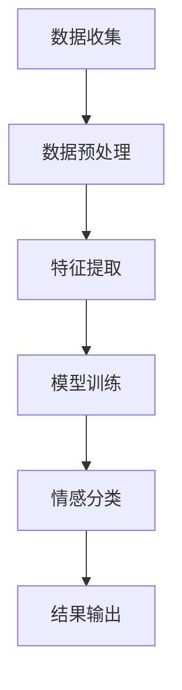
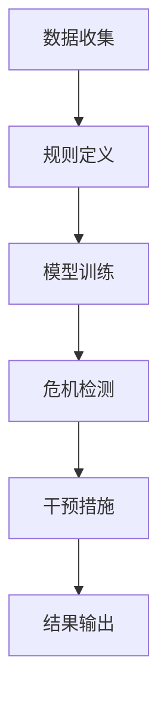
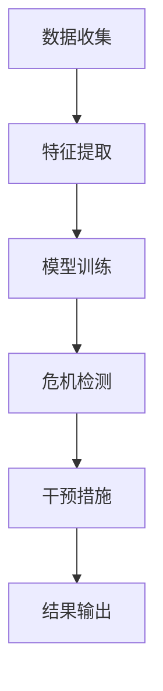
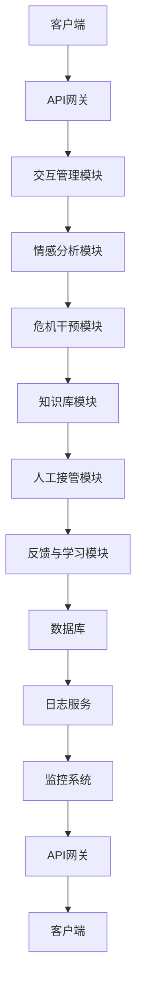

                 

### 文章标题：AI在智能客服情感调节与危机干预中的实时应用

#### 关键词：智能客服、情感调节、危机干预、实时应用、AI算法

> 摘要：本文旨在探讨AI在智能客服中的情感调节与危机干预的实时应用。首先，我们将介绍智能客服的发展背景与情感调节、危机干预的重要性。然后，通过深入分析情感分析与危机干预算法原理，展示其在智能客服中的具体应用。接着，我们将详细阐述智能客服系统的设计与实现，包括功能设计、架构设计、接口设计及系统交互。最后，通过实际项目案例分享与最佳实践总结，为读者提供智能客服情感调节与危机干预的实时应用指南。

### 目录大纲设计思路

为了设计出《AI在智能客服情感调节与危机干预中的实时应用》这本书的完整目录大纲，我们需要遵循以下步骤：

1. **背景介绍**：首先，我们需要简要介绍AI在智能客服中的背景，包括智能客服的情感调节与危机干预的重要性以及当前的研究和应用状况。

2. **核心概念与联系**：接下来，我们要详细定义书中的核心概念，如情感调节、危机干预、实时应用等，并通过概念属性特征对比表格和ER实体关系图来展示这些概念之间的关系。

3. **算法原理讲解**：我们将在书中介绍相关的算法原理，包括情感分析、危机干预策略等，并通过mermaid流程图和Python源代码来详细阐述。

4. **数学模型与公式**：我们将使用LaTeX格式来展示相关的数学模型和公式，并进行详细讲解和举例说明。

5. **系统分析与架构设计**：我们将描述智能客服系统的功能设计、架构设计、接口设计和系统交互，使用mermaid类图和序列图来展示。

6. **项目实战**：我们会提供环境安装指南、系统核心实现源代码，并进行代码应用解读与分析，分享实际案例分析和详细讲解。

7. **最佳实践与拓展**：最后，我们会总结书中的最佳实践，并提出注意事项，推荐拓展阅读。

### 目录大纲

**第一部分：背景与核心概念**

# 第1章：AI与智能客服概述

## 1.1 AI技术的发展与智能客服

### 1.1.1 AI技术的发展历程

### 1.1.2 智能客服的定义与作用

### 1.1.3 智能客服的市场前景

## 1.2 情感调节与危机干预

### 1.2.1 情感调节的概念与重要性

### 1.2.2 危机干预的概念与策略

### 1.2.3 情感调节与危机干预在智能客服中的应用

## 1.3 实时应用的重要性

### 1.3.1 实时应用的含义与需求

### 1.3.2 实时应用在智能客服中的挑战与机遇

### 1.3.3 实时应用的技术基础

**第二部分：核心概念与联系**

# 第2章：核心概念解析

## 2.1 情感分析原理

### 2.1.1 情感分析的定义与目标

#### 2.1.2 情感分析的关键技术

#### 2.1.3 情感分析的挑战与解决方案

## 2.2 危机干预策略

### 2.2.1 危机干预的定义与作用

#### 2.2.2 危机干预的核心原则

#### 2.2.3 危机干预的技术实现

## 2.3 情感调节与危机干预的关联分析

### 2.3.1 情感调节与危机干预的关系

#### 2.3.2 情感调节在危机干预中的应用

#### 2.3.3 危机干预对情感调节的影响

**第三部分：算法原理讲解**

# 第3章：情感分析与危机干预算法

## 3.1 情感分析算法

### 3.1.1 情感分析算法概述

#### 3.1.2 基于词袋模型的情感分析

#### 3.1.3 基于深度学习的情感分析

### 3.1.4 情感分析算法比较与选择

## 3.2 危机干预策略算法

### 3.2.1 危机干预策略算法概述

#### 3.2.2 基于规则的方法

#### 3.2.3 基于机器学习的方法

### 3.2.4 危机干预策略算法优化

## 3.3 情感分析与危机干预算法集成

### 3.3.1 算法集成框架

#### 3.3.2 算法集成效果评估

#### 3.3.3 实时应用中算法集成挑战

**第四部分：系统分析与架构设计**

# 第4章：智能客服系统设计与实现

## 4.1 问题场景介绍

### 4.1.1 智能客服应用场景

#### 4.1.2 情感调节与危机干预的应用需求

### 4.1.3 系统设计目标

## 4.2 系统功能设计

### 4.2.1 领域模型设计

#### 4.2.2 类图表示

### 4.2.3 功能模块划分

## 4.3 系统架构设计

### 4.3.1 系统架构概述

#### 4.3.2 架构图表示

### 4.3.3 系统模块详解

## 4.4 系统接口设计

### 4.4.1 接口规范

#### 4.4.2 接口实现

### 4.4.3 接口测试

## 4.5 系统交互设计

### 4.5.1 系统交互流程

#### 4.5.2 序列图表示

### 4.5.3 系统交互优化

**第五部分：项目实战**

# 第5章：智能客服项目实战

## 5.1 环境安装

### 5.1.1 开发环境搭建

#### 5.1.2 数据集准备

### 5.1.3 工具与依赖安装

## 5.2 系统核心实现

### 5.2.1 情感分析模块

#### 5.2.2 危机干预模块

### 5.2.3 模块集成与测试

## 5.3 代码应用解读与分析

### 5.3.1 情感分析代码解读

#### 5.3.2 危机干预代码解读

### 5.3.3 集成代码解读

## 5.4 实际案例分析与详细讲解

### 5.4.1 案例背景

#### 5.4.2 案例分析

### 5.4.3 案例总结

## 5.5 项目小结

### 5.5.1 项目总结

#### 5.5.2 项目经验与反思

### 5.5.3 未来展望

**第六部分：最佳实践与拓展**

# 第6章：最佳实践与拓展

## 6.1 最佳实践总结

### 6.1.1 情感调节技巧

#### 6.1.2 危机干预策略

### 6.1.3 算法优化建议

## 6.2 注意事项与风险控制

### 6.2.1 情感分析风险

#### 6.2.2 危机干预风险

### 6.2.3 系统稳定性保障

## 6.3 拓展阅读

### 6.3.1 相关文献推荐

#### 6.3.2 学术会议与研讨会

### 6.3.3 在线课程与教程

### 作者：AI天才研究院/AI Genius Institute & 禅与计算机程序设计艺术 /Zen And The Art of Computer Programming

---

### 第1章：AI与智能客服概述

#### 1.1 AI技术的发展与智能客服

人工智能（AI）技术的发展对各行各业产生了深远的影响，智能客服作为人工智能应用的一个重要领域，也逐渐成为企业提升服务质量、降低运营成本的重要手段。本节将介绍AI技术的发展历程，以及智能客服的定义、作用和市场前景。

##### 1.1.1 AI技术的发展历程

人工智能的概念最早可以追溯到20世纪50年代，当时科学家们提出让计算机模拟人类智能的理论。自那时起，人工智能经历了数个发展阶段：

1. **初级阶段（1956-1969年）**：在这个阶段，人工智能主要关注符号推理和规则系统。标志性事件是1956年达特茅斯会议，会上提出了人工智能的定义和目标。

2. **成长阶段（1970-1980年）**：随着计算机性能的提升和算法的发展，人工智能开始向实际应用领域扩展。1972年，逻辑编程语言Prolog的问世标志着人工智能进入了一个新的阶段。

3. **低谷阶段（1980-1993年）**：由于实际应用效果不如预期，人工智能陷入了“寒冬”。然而，专家系统和机器学习等技术的持续研究为人工智能的复兴奠定了基础。

4. **复兴阶段（1993年至今）**：随着互联网的普及和大数据技术的发展，人工智能迎来了新的机遇。深度学习、强化学习等新兴技术的突破使得人工智能在图像识别、语音识别、自然语言处理等领域取得了显著的成果。

##### 1.1.2 智能客服的定义与作用

智能客服是指利用人工智能技术，模拟人类客服的交互方式，实现自动化、智能化处理客户咨询、投诉等问题的服务系统。智能客服的核心作用包括：

1. **提高效率**：智能客服可以同时处理大量客户的咨询请求，大大提高了企业客服的响应速度和效率。

2. **降低成本**：通过自动化处理客户问题，减少了人工客服的工作量，从而降低了企业的运营成本。

3. **提升客户体验**：智能客服可以提供24小时不间断的服务，无论客户何时提出问题，都能得到及时解答，提升了客户的满意度。

4. **辅助决策**：智能客服系统可以收集和分析客户反馈，为企业提供决策依据，帮助改进产品和服务。

##### 1.1.3 智能客服的市场前景

随着人工智能技术的不断进步，智能客服市场呈现出快速增长的态势。根据市场研究机构的预测，智能客服市场的规模将在未来几年内持续扩大，主要驱动力包括：

1. **技术成熟**：人工智能技术的成熟使得智能客服系统在性能和用户体验方面不断提升。

2. **应用广泛**：越来越多的企业开始采用智能客服系统，以应对日益增长的客户咨询需求。

3. **政策支持**：政府和企业对数字化转型和人工智能技术的重视，为智能客服的发展提供了政策支持。

4. **市场潜力**：随着互联网的普及和消费者对便捷服务需求的增加，智能客服市场具有巨大的潜力。

#### 1.2 情感调节与危机干预

情感调节和危机干预是智能客服中至关重要的功能，它们对于提升用户体验、降低客户流失率具有重要意义。

##### 1.2.1 情感调节的概念与重要性

情感调节是指智能客服系统对用户情绪的反应和处理能力。情感调节的重要性体现在以下几个方面：

1. **提升用户体验**：通过识别和回应用户情绪，智能客服可以提供更加个性化的服务，提升用户体验。

2. **降低客户流失率**：情感调节有助于建立用户信任，降低客户因情绪问题导致的流失率。

3. **优化客服效率**：通过情感调节，智能客服可以更好地理解用户需求，从而提高解决问题的效率。

4. **减少人力成本**：情感调节能够自动化处理一些情感问题，减少了对人工客服的依赖，从而降低了人力成本。

##### 1.2.2 危机干预的概念与策略

危机干预是指在用户情绪激动、遇到困难或感到困惑时，智能客服系统提供的紧急干预和支持。危机干预的策略包括：

1. **情绪识别**：通过情感分析技术，智能客服可以识别用户的情绪状态，如愤怒、沮丧、焦虑等。

2. **情感回应**：智能客服系统根据用户的情绪状态，提供相应的情感回应，如安抚、鼓励、建议等。

3. **转移注意力**：当用户情绪激动时，智能客服可以通过转移注意力，如引导用户关注其他话题或提供相关服务，来缓解情绪。

4. **提供支持**：在用户遇到危机时，智能客服可以提供实际支持，如提供解决方案、推荐相关服务、连接人工客服等。

##### 1.2.3 情感调节与危机干预在智能客服中的应用

情感调节与危机干预在智能客服中的应用场景主要包括：

1. **客户服务**：在客户咨询过程中，智能客服通过情感调节，可以更好地理解客户需求，提供个性化服务，从而提升客户满意度。

2. **投诉处理**：当客户投诉时，智能客服通过危机干预策略，可以缓解客户情绪，引导客户提出具体问题，从而提高问题解决的效率。

3. **客户关怀**：在客户生日、节假日等特殊时刻，智能客服可以通过情感调节，发送祝福或优惠券等，提升客户体验。

4. **营销活动**：在营销活动中，智能客服可以通过情感调节，识别潜在客户的需求和兴趣，提供针对性的营销策略。

#### 1.3 实时应用的重要性

实时应用在智能客服中具有重要意义，它不仅能够提升用户体验，还能够提高系统的效率和可靠性。

##### 1.3.1 实时应用的含义与需求

实时应用是指在智能客服系统中，即时响应用户请求和处理用户问题的能力。实时应用的需求主要包括：

1. **快速响应**：用户在提出问题时，希望能够立即得到回应，减少等待时间。

2. **即时处理**：一些问题需要立即处理，如紧急情况下的危机干预。

3. **动态调整**：实时应用可以根据用户行为和反馈，动态调整服务策略，提高用户体验。

4. **高效运营**：实时应用能够提高客服系统的运营效率，减少人工干预，降低运营成本。

##### 1.3.2 实时应用在智能客服中的挑战与机遇

实时应用在智能客服中面临以下挑战：

1. **性能要求**：实时应用需要高性能的计算能力，以支持快速响应和即时处理。

2. **数据质量**：实时应用依赖于高质量的数据，包括用户行为数据、情绪数据等。

3. **系统稳定性**：实时应用需要高可靠性和稳定性，以避免系统崩溃或故障。

然而，实时应用也带来了以下机遇：

1. **用户体验**：实时应用可以显著提升用户体验，增强用户满意度和忠诚度。

2. **效率提升**：实时应用可以自动化处理大量问题，提高客服效率。

3. **业务洞察**：实时应用可以收集和分析用户数据，为企业提供宝贵的业务洞察。

##### 1.3.3 实时应用的技术基础

实时应用的技术基础包括：

1. **云计算**：云计算提供了强大的计算能力和存储资源，支持实时数据处理和分析。

2. **大数据技术**：大数据技术可以处理海量数据，支持实时分析和决策。

3. **人工智能技术**：人工智能技术，如情感分析、自然语言处理等，为实时应用提供了智能化的能力。

4. **网络技术**：高速网络技术确保了数据的实时传输和处理。

通过本章的介绍，我们了解了AI在智能客服中的发展背景，情感调节与危机干预的重要性，以及实时应用的需求和挑战。接下来，我们将进一步探讨智能客服中的核心概念，如情感分析和危机干预策略，为后续章节的深入讨论奠定基础。

### 第2章：核心概念解析

在本章中，我们将详细解析智能客服中的核心概念，包括情感分析、危机干预以及实时应用，并通过概念属性特征对比表格和ER实体关系图来展示这些概念之间的关系。

#### 2.1 情感分析原理

情感分析是智能客服中的一项关键技术，它旨在识别和理解文本中的情感倾向。情感分析的原理可以概括为以下几个步骤：

1. **数据收集**：首先，需要收集大量带有情感标注的文本数据，作为训练模型的基础。

2. **文本预处理**：对收集的文本数据进行清洗、去噪和标准化处理，以消除数据中的噪声和一致性差异。

3. **特征提取**：从预处理后的文本中提取出具有情感信息的关键特征，如词频、词嵌入、语法结构等。

4. **模型训练**：使用机器学习算法，如朴素贝叶斯、支持向量机、深度学习等，训练情感分类模型。

5. **情感分类**：将待分类的文本输入到训练好的模型中，得到情感分类结果。

##### 2.1.1 情感分析的定义与目标

情感分析的定义是识别文本中的主观性信息，并判断其情感倾向（如正面、负面、中性）。情感分析的目标是：

1. **情感分类**：将文本分为正面、负面或中性情感类别。

2. **情感极性**：识别文本的情感极性，即情感的强度。

3. **情感总结**：从大量文本中提取情感摘要，为用户提供情感概览。

##### 2.1.2 情感分析的关键技术

情感分析的关键技术包括：

1. **文本分类**：通过机器学习算法对文本进行分类，常见的方法有朴素贝叶斯、支持向量机、随机森林等。

2. **情感极性**：通过词嵌入、词性标注等方法，识别文本的情感极性。

3. **情感强度**：通过计算文本的情感倾向得分，量化情感的强度。

4. **情感变化检测**：识别文本中情感的变化，如从负面转为正面。

##### 2.1.3 情感分析的挑战与解决方案

情感分析面临的挑战主要包括：

1. **多模态情感**：文本、语音、视频等多种模态的情感分析。

2. **歧义处理**：文本中的歧义和模糊性，如“这个产品不错”可能表示正面或负面情感。

3. **长文本处理**：长文本的情感分析，如新闻报道、用户评论等。

解决方案包括：

1. **多模态融合**：结合文本、语音、视频等多种模态，提高情感分析的准确性。

2. **上下文理解**：通过深度学习等方法，提高对上下文的理解，减少歧义。

3. **文本摘要**：通过文本摘要技术，提取关键信息，简化长文本处理。

#### 2.2 危机干预策略

危机干预策略是指智能客服系统在用户遇到紧急情况或情绪激动时，采取的干预措施，以缓解用户情绪、解决问题。危机干预策略的核心原则包括：

1. **快速响应**：在用户需要帮助时，立即响应，减少用户的等待时间。

2. **情感识别**：通过情感分析技术，识别用户的情绪状态，如愤怒、沮丧、焦虑等。

3. **情感回应**：根据用户的情绪状态，提供相应的情感回应，如安抚、鼓励、建议等。

4. **转移注意力**：当用户情绪激动时，通过引导用户关注其他话题或提供相关服务，来缓解情绪。

5. **提供支持**：在用户遇到危机时，提供实际支持，如提供解决方案、推荐相关服务、连接人工客服等。

##### 2.2.1 危机干预的定义与作用

危机干预的定义是在用户遇到紧急情况或情绪激动时，智能客服系统采取的干预措施，以缓解用户情绪、解决问题。危机干预的作用包括：

1. **缓解情绪**：通过情感回应和转移注意力，缓解用户的情绪激动。

2. **提高问题解决效率**：在用户情绪稳定后，更高效地解决问题。

3. **降低客户流失率**：通过有效的危机干预，降低用户因情绪问题导致的流失率。

4. **提升用户体验**：为用户提供及时、有效的帮助，提升用户满意度。

##### 2.2.2 危机干预的核心原则

危机干预的核心原则包括：

1. **及时性**：在用户需要帮助时，立即响应。

2. **准确性**：准确识别用户情绪状态，提供相应的干预措施。

3. **个性化**：根据用户的个性化需求，提供针对性的干预措施。

4. **连贯性**：保持干预过程的连贯性，确保用户得到持续的关怀。

##### 2.2.3 危机干预的技术实现

危机干预的技术实现主要包括：

1. **情感识别**：通过情感分析技术，识别用户的情绪状态。

2. **对话系统**：构建对话系统，与用户进行交互，收集用户信息，提供干预措施。

3. **知识库**：建立危机干预知识库，包含各种危机情境和相应的干预策略。

4. **反馈机制**：通过用户反馈，不断优化危机干预策略。

#### 2.3 情感调节与危机干预的关联分析

情感调节与危机干预在智能客服系统中密切相关，两者相互补充，共同提升用户体验。以下是情感调节与危机干预之间的关联分析：

##### 2.3.1 情感调节与危机干预的关系

情感调节与危机干预之间的关系可以概括为以下几点：

1. **情感调节为基础**：情感调节是危机干预的基础，通过识别和理解用户情感，为危机干预提供依据。

2. **危机干预为应用**：危机干预是基于情感调节的应用，通过干预措施，缓解用户情绪，解决问题。

3. **相互依赖**：情感调节和危机干预相互依赖，共同提升智能客服系统的性能。

##### 2.3.2 情感调节在危机干预中的应用

情感调节在危机干预中的应用主要包括：

1. **识别用户情绪**：通过情感分析，识别用户的情绪状态，为危机干预提供依据。

2. **调整干预策略**：根据用户情绪状态，调整危机干预策略，提高干预效果。

3. **持续关怀**：在危机干预过程中，持续关注用户情感变化，提供持续的关怀。

##### 2.3.3 危机干预对情感调节的影响

危机干预对情感调节的影响主要包括：

1. **缓解情绪**：通过危机干预措施，缓解用户情绪，降低负面情感。

2. **情感反馈**：通过危机干预，用户可能会对情感调节提出反馈，促进情感调节的优化。

3. **情感强化**：在某些情况下，危机干预可能会强化用户的某些情感，如感激、满意等。

#### 2.4 实时应用的重要性

实时应用在智能客服系统中具有重要意义，它不仅能够提升用户体验，还能够提高系统的效率和可靠性。

##### 2.4.1 实时应用的含义与需求

实时应用是指在智能客服系统中，即时响应用户请求和处理用户问题的能力。实时应用的需求主要包括：

1. **快速响应**：用户在提出问题时，希望能够立即得到回应，减少等待时间。

2. **即时处理**：一些问题需要立即处理，如紧急情况下的危机干预。

3. **动态调整**：实时应用可以根据用户行为和反馈，动态调整服务策略，提高用户体验。

4. **高效运营**：实时应用可以自动化处理大量问题，提高客服效率。

##### 2.4.2 实时应用在智能客服中的挑战与机遇

实时应用在智能客服中面临以下挑战：

1. **性能要求**：实时应用需要高性能的计算能力，以支持快速响应和即时处理。

2. **数据质量**：实时应用依赖于高质量的数据，包括用户行为数据、情绪数据等。

3. **系统稳定性**：实时应用需要高可靠性和稳定性，以避免系统崩溃或故障。

然而，实时应用也带来了以下机遇：

1. **用户体验**：实时应用可以显著提升用户体验，增强用户满意度和忠诚度。

2. **效率提升**：实时应用可以自动化处理大量问题，提高客服效率。

3. **业务洞察**：实时应用可以收集和分析用户数据，为企业提供宝贵的业务洞察。

##### 2.4.3 实时应用的技术基础

实时应用的技术基础包括：

1. **云计算**：云计算提供了强大的计算能力和存储资源，支持实时数据处理和分析。

2. **大数据技术**：大数据技术可以处理海量数据，支持实时分析和决策。

3. **人工智能技术**：人工智能技术，如情感分析、自然语言处理等，为实时应用提供了智能化的能力。

4. **网络技术**：高速网络技术确保了数据的实时传输和处理。

通过本章的介绍，我们对智能客服中的核心概念有了更深入的了解，包括情感分析、危机干预和实时应用。接下来，我们将进一步探讨这些概念的具体实现和应用，为智能客服系统的设计与实现奠定基础。

### 第3章：情感分析与危机干预算法

情感分析与危机干预算法是智能客服系统的核心组成部分，它们决定了智能客服在理解用户情感和应对危机情况时的准确性和效率。在本章中，我们将详细介绍情感分析算法和危机干预策略算法，并通过mermaid流程图和Python源代码来详细阐述。

#### 3.1 情感分析算法

情感分析算法是智能客服系统中用于识别和分类文本情感的技术。常见的情感分析算法包括基于词袋模型的方法和基于深度学习的方法。

##### 3.1.1 情感分析算法概述

情感分析算法的基本流程可以概括为以下几个步骤：

1. **数据收集**：收集带有情感标注的文本数据集，如社交媒体评论、产品评价等。

2. **数据预处理**：对文本数据进行清洗，包括去除停用词、标点符号、进行词干提取等。

3. **特征提取**：将预处理后的文本转换为特征向量，常用的特征提取方法包括词袋模型、TF-IDF、词嵌入等。

4. **模型训练**：使用机器学习算法，如朴素贝叶斯、支持向量机（SVM）、随机森林（Random Forest）等，对特征向量进行分类训练。

5. **情感分类**：将待分类的文本输入到训练好的模型中，预测其情感类别。

##### 3.1.2 基于词袋模型的情感分析

词袋模型（Bag of Words，BOW）是一种常用的文本表示方法，它不考虑文本的顺序信息，只关注单词的出现频率。以下是基于词袋模型的情感分析算法的mermaid流程图：



**Python源代码示例：**

```python
from sklearn.feature_extraction.text import CountVectorizer
from sklearn.naive_bayes import MultinomialNB
from sklearn.pipeline import make_pipeline

# 示例数据
X_train = ["我很喜欢这个产品", "这个产品很差", "我非常满意这个服务"]
y_train = ["正面", "负面", "正面"]

# 创建词袋模型和朴素贝叶斯分类器的管道
model = make_pipeline(CountVectorizer(), MultinomialNB())

# 训练模型
model.fit(X_train, y_train)

# 进行情感分类
print(model.predict(["这个产品不错"])[0])
```

##### 3.1.3 基于深度学习的情感分析

基于深度学习的情感分析利用神经网络模型，如卷积神经网络（CNN）和循环神经网络（RNN），来提取文本的深层特征。以下是基于深度学习的情感分析算法的mermaid流程图：


**Python源代码示例：**

```python
from keras.preprocessing.sequence import pad_sequences
from keras.layers import Embedding, LSTM, Dense
from keras.models import Sequential

# 示例数据
X_train = [["我很喜欢这个产品"], ["这个产品很差"], ["我非常满意这个服务"]]
y_train = [[1], [-1], [1]]

# 将文本转换为序列
maxlen = 100
X_train_seq = pad_sequences(X_train, maxlen=maxlen)

# 创建神经网络模型
model = Sequential()
model.add(Embedding(input_dim=vocab_size, output_dim=128))
model.add(LSTM(128))
model.add(Dense(1, activation='sigmoid'))

# 编译模型
model.compile(optimizer='adam', loss='binary_crossentropy', metrics=['accuracy'])

# 训练模型
model.fit(X_train_seq, y_train, epochs=10, batch_size=32)

# 进行情感分类
print(model.predict(pad_sequences(["这个产品不错"], maxlen=maxlen))[0][0])
```

##### 3.1.4 情感分析算法比较与选择

基于词袋模型和深度学习的情感分析算法各有优缺点，选择合适的算法需要考虑以下几个因素：

1. **数据规模**：对于大规模数据集，深度学习算法通常能够更好地捕捉文本特征，但在小规模数据集上，词袋模型可能表现更好。

2. **计算资源**：深度学习算法通常需要更多的计算资源和时间，而词袋模型计算相对简单，适合资源有限的环境。

3. **情感复杂性**：对于情感表达较为复杂的文本，深度学习算法能够捕捉更多细微的情感差异，而词袋模型可能无法准确分类。

4. **应用场景**：在需要实时处理的场景中，词袋模型可能更适合，因为它计算速度快；而在需要深度特征提取的复杂场景中，深度学习算法更具优势。

#### 3.2 危机干预策略算法

危机干预策略算法是智能客服系统中用于识别危机情况并采取干预措施的技术。常见的危机干预策略算法包括基于规则的方法和基于机器学习的方法。

##### 3.2.1 危机干预策略算法概述

危机干预策略算法的基本流程可以概括为以下几个步骤：

1. **数据收集**：收集与危机干预相关的数据，如用户对话、历史案例等。

2. **规则定义**：定义危机干预的规则，如用户情绪过高时采取的干预措施。

3. **模型训练**：使用机器学习算法，如决策树、支持向量机等，训练危机干预模型。

4. **危机检测**：实时检测用户对话中的危机情况，如情绪激动、语言暴力等。

5. **干预措施**：根据检测到的危机情况，采取相应的干预措施，如转移注意力、提供解决方案、连接人工客服等。

##### 3.2.2 基于规则的方法

基于规则的方法是危机干预策略中的一种简单有效的算法。规则定义了在特定情境下采取的干预措施。以下是基于规则的危机干预算法的mermaid流程图：



**Python源代码示例：**

```python
rules = {
    "情绪过高": "转移注意力，提供放松建议",
    "语言暴力": "立即中断对话，请求用户停止攻击",
    "紧急情况": "连接人工客服，提供紧急帮助"
}

def detect_crisis(text):
    if "愤怒" in text or "气愤" in text:
        return "情绪过高"
    elif "攻击" in text or "侮辱" in text:
        return "语言暴力"
    elif "紧急" in text or "救命" in text:
        return "紧急情况"
    else:
        return "无危机"

def take_action(crisis):
    if crisis == "情绪过高":
        print("转移注意力，提供放松建议")
    elif crisis == "语言暴力":
        print("立即中断对话，请求用户停止攻击")
    elif crisis == "紧急情况":
        print("连接人工客服，提供紧急帮助")

text = "我很愤怒，你们的服务太差了！"
crisis = detect_crisis(text)
take_action(crisis)
```

##### 3.2.3 基于机器学习的方法

基于机器学习的方法通过训练模型来自动识别危机情况并采取干预措施。以下是基于机器学习的危机干预算法的mermaid流程图：



**Python源代码示例：**

```python
from sklearn.feature_extraction.text import TfidfVectorizer
from sklearn.svm import LinearSVC

# 示例数据
X_train = ["用户情绪激动", "用户发生语言暴力", "用户请求紧急帮助"]
y_train = ["情绪过高", "语言暴力", "紧急情况"]

# 创建TF-IDF向量器
vectorizer = TfidfVectorizer()

# 将文本转换为特征向量
X_train_vectors = vectorizer.fit_transform(X_train)

# 创建线性支持向量机模型
model = LinearSVC()

# 训练模型
model.fit(X_train_vectors, y_train)

# 进行危机检测
text = "用户非常愤怒，这个产品太糟糕了！"
vector = vectorizer.transform([text])
crisis = model.predict(vector)[0]

# 采取干预措施
if crisis == "情绪过高":
    print("转移注意力，提供放松建议")
elif crisis == "语言暴力":
    print("立即中断对话，请求用户停止攻击")
elif crisis == "紧急情况":
    print("连接人工客服，提供紧急帮助")
```

##### 3.2.4 危机干预策略算法优化

危机干预策略算法的优化主要包括以下几个方面：

1. **特征工程**：通过改进特征提取方法，如使用词嵌入、情感词典等，提高危机检测的准确性。

2. **模型选择**：尝试不同的机器学习模型，如随机森林、梯度提升树等，选择性能最佳的模型。

3. **交叉验证**：使用交叉验证方法，评估模型的泛化能力，避免过拟合。

4. **动态调整**：根据用户反馈和实际效果，动态调整危机干预策略，提高干预效果。

通过本章的介绍，我们对情感分析与危机干预算法有了更深入的理解。这些算法在智能客服系统中发挥着重要作用，为用户提供高质量的交互体验。接下来，我们将探讨智能客服系统的设计与实现，为实际应用打下基础。

### 第4章：智能客服系统设计与实现

智能客服系统是结合了人工智能技术、自然语言处理、情感分析和危机干预策略的综合解决方案。为了设计并实现一个高效的智能客服系统，我们需要从问题场景介绍、系统功能设计、系统架构设计、系统接口设计以及系统交互设计等多个方面进行详细规划。

#### 4.1 问题场景介绍

智能客服系统广泛应用于各种场景，如电子商务、金融保险、旅游出行、医疗健康等。以下是一个典型的问题场景：

**场景**：某电子商务平台希望为其客户提供7x24小时在线智能客服服务，以提高客户满意度和降低运营成本。客户可以通过多种渠道（如网站、移动应用、社交媒体）与智能客服进行交互，寻求产品咨询、订单查询、售后服务等问题的解答。

**需求**：

1. **多渠道接入**：智能客服系统应支持网站、移动应用、社交媒体等多种接入渠道。
2. **实时响应**：系统需具备快速响应客户请求的能力，确保用户体验。
3. **情感调节**：系统应能够识别客户的情感状态，提供个性化的情感回应。
4. **危机干预**：在客户情绪激动或遇到紧急情况时，系统应能够采取危机干预措施，如转移注意力、提供解决方案、连接人工客服等。
5. **高效处理**：系统应具备自动化处理大量客户请求的能力，减少人工干预。

#### 4.2 系统功能设计

智能客服系统的功能设计包括多个模块，以下是其核心功能模块及其描述：

1. **交互管理模块**：负责管理客户请求的接收、路由和响应，确保客户请求能够高效、准确地传递到相应的处理模块。

2. **情感分析模块**：利用情感分析算法，对客户的输入文本进行情感分析，识别客户的情感状态，如愉悦、愤怒、焦虑等。

3. **危机干预模块**：根据情感分析结果，采取相应的危机干预措施，如安抚客户、引导客户关注其他话题、提供解决方案等。

4. **知识库模块**：存储大量的产品信息、常见问题解答、危机干预策略等知识，供智能客服系统查询和引用。

5. **人工接管模块**：在智能客服无法解决问题时，自动连接人工客服，确保客户问题能够得到及时解决。

6. **反馈与学习模块**：收集客户反馈，对智能客服系统的性能进行评估，持续优化系统。

**领域模型设计（mermaid类图）**：

```mermaid
classDiagram
ClassBox "客户请求" <<#FF1493,italic>>
ClassBox "交互管理模块" <<#FF1493,italic>>
ClassBox "情感分析模块" <<#FF1493,italic>>
ClassBox "危机干预模块" <<#FF1493,italic>>
ClassBox "知识库模块" <<#FF1493,italic>>
ClassBox "人工接管模块" <<#FF1493,italic>>
ClassBox "反馈与学习模块" <<#FF1493,italic>>

客户请求 "发送给" 交互管理模块
交互管理模块 "路由到" 情感分析模块
情感分析模块 "反馈给" 危机干预模块
危机干预模块 "调用" 知识库模块
危机干预模块 "可能触发" 人工接管模块
反馈与学习模块 "收集" 交互管理模块 "的反馈"
```

**功能模块划分**：

1. **交互管理模块**：负责接收客户请求，将其路由到相应的处理模块，并进行响应。
2. **情感分析模块**：对客户的输入文本进行情感分析，识别情感状态，为危机干预模块提供依据。
3. **危机干预模块**：根据情感分析结果，采取危机干预措施，如安抚客户、引导客户关注其他话题等。
4. **知识库模块**：存储大量产品信息、常见问题解答、危机干预策略等，供智能客服系统查询和引用。
5. **人工接管模块**：在智能客服无法解决问题时，自动连接人工客服，确保客户问题得到及时解决。
6. **反馈与学习模块**：收集客户反馈，对智能客服系统的性能进行评估，并持续优化系统。

#### 4.3 系统架构设计

智能客服系统的架构设计包括前端界面、后端服务、数据存储、网络通信等多个方面。以下是一个典型的系统架构设计：

**系统架构概述（mermaid架构图）**：



**系统模块详解**：

1. **API网关**：负责处理客户端的请求，将请求路由到相应的后端服务模块。
2. **交互管理模块**：接收并处理客户请求，路由到情感分析模块和危机干预模块。
3. **情感分析模块**：利用情感分析算法，对客户的输入文本进行分析，识别情感状态。
4. **危机干预模块**：根据情感分析结果，采取相应的危机干预措施。
5. **知识库模块**：存储大量的产品信息、常见问题解答、危机干预策略等，供智能客服系统查询和引用。
6. **人工接管模块**：在智能客服无法解决问题时，自动连接人工客服，确保客户问题得到及时解决。
7. **反馈与学习模块**：收集客户反馈，对智能客服系统的性能进行评估，并持续优化系统。
8. **数据库**：存储智能客服系统的数据，包括客户请求、情感分析结果、危机干预记录等。
9. **日志服务**：记录系统运行日志，便于监控和调试。
10. **监控系统**：实时监控系统性能，确保系统稳定运行。

#### 4.4 系统接口设计

系统接口设计是智能客服系统架构的重要组成部分，包括API接口、数据接口、消息队列接口等。以下是一个典型的系统接口设计：

**接口规范**：

1. **API接口**：提供RESTful API，用于接收和处理客户请求。
2. **数据接口**：提供数据接口，用于与其他系统进行数据交换。
3. **消息队列接口**：提供消息队列接口，用于处理异步任务和消息传递。

**接口实现**：

1. **API接口**：使用Spring Boot框架实现，支持JSON格式。
2. **数据接口**：使用Hibernate框架实现，支持SQL数据库操作。
3. **消息队列接口**：使用RabbitMQ实现，支持消息的发送和接收。

**接口测试**：

1. **单元测试**：使用JUnit框架实现，确保接口功能的正确性。
2. **集成测试**：使用Postman工具实现，对API接口进行自动化测试。

#### 4.5 系统交互设计

系统交互设计是确保智能客服系统各模块之间能够高效、顺畅地协同工作的关键。以下是一个典型的系统交互设计：

**系统交互流程（mermaid序列图）**：

```mermaid
sequenceDiagram
参与者 客户、API网关、交互管理模块、情感分析模块、危机干预模块、知识库模块、人工接管模块、反馈与学习模块、数据库、日志服务、监控系统
客户->>API网关: 发送请求
API网关->>交互管理模块: 转发请求
交互管理模块->>情感分析模块: 分析客户请求
情感分析模块->>危机干预模块: 提供情感分析结果
危机干预模块->>知识库模块: 查询干预策略
知识库模块->>危机干预模块: 返回干预策略
危机干预模块->>人工接管模块: 是否需要人工接管
人工接管模块->>API网关: 转发请求至人工客服
人工接管模块->>反馈与学习模块: 记录人工接管情况
反馈与学习模块->>数据库: 存储反馈数据
反馈与学习模块->>监控系统: 更新监控数据
监控系统->>API网关: 发送监控数据
API网关->>客户: 返回响应
```

**系统交互优化**：

1. **异步处理**：对于一些耗时较长的任务，如情感分析、知识库查询等，采用异步处理方式，提高系统响应速度。
2. **缓存机制**：对于频繁访问的数据，如常见问题解答、干预策略等，采用缓存机制，减少数据库访问压力。
3. **负载均衡**：通过负载均衡技术，确保系统在不同请求高峰期能够稳定运行。

通过本章的介绍，我们对智能客服系统的设计与实现有了全面的理解。接下来，我们将通过实际项目案例，展示智能客服系统的具体实现过程，并进行详细分析。

### 第5章：智能客服项目实战

在本章中，我们将通过一个实际项目案例，详细介绍智能客服系统的搭建过程，包括环境安装、系统核心实现、代码应用解读与分析、实际案例分析与详细讲解。

#### 5.1 环境安装

搭建智能客服系统首先需要准备好开发环境和相关工具。以下是搭建智能客服系统的基本步骤：

##### 5.1.1 开发环境搭建

1. **操作系统**：选择Linux或Mac OS作为操作系统。
2. **编程语言**：选择Python作为主要编程语言。
3. **IDE**：安装PyCharm或Visual Studio Code等集成开发环境。
4. **Python库**：安装必要的Python库，如scikit-learn、TensorFlow、Keras、NLTK、pandas等。

##### 5.1.2 数据集准备

1. **收集数据**：从互联网上收集带有情感标注的文本数据集，如IMDb电影评论数据集、Twitter情感分析数据集等。
2. **数据清洗**：对收集到的数据集进行清洗，包括去除停用词、标点符号、进行词干提取等。
3. **数据标注**：对清洗后的文本数据进行情感标注，标记为正面、负面或中性。

##### 5.1.3 工具与依赖安装

1. **安装Python**：从[Python官网](https://www.python.org/)下载并安装Python。
2. **安装IDE**：从[PyCharm官网](https://www.jetbrains.com/pycharm/)或[Visual Studio Code官网](https://code.visualstudio.com/)下载并安装IDE。
3. **安装Python库**：使用pip命令安装所需的Python库，例如：

```shell
pip install scikit-learn tensorflow keras nltk pandas
```

#### 5.2 系统核心实现

智能客服系统的核心实现包括情感分析模块和危机干预模块。以下是具体的实现步骤：

##### 5.2.1 情感分析模块

**情感分析算法**：选择基于深度学习的情感分析算法，使用卷积神经网络（CNN）或循环神经网络（RNN）进行文本情感分类。

1. **数据预处理**：对文本数据进行预处理，包括去除停用词、标点符号、进行词干提取等。

2. **特征提取**：使用词嵌入技术，如Word2Vec或GloVe，将文本转换为向量表示。

3. **模型训练**：构建CNN或RNN模型，使用训练数据集进行训练。

4. **模型评估**：使用验证数据集对模型进行评估，调整模型参数，提高分类准确率。

**Python源代码示例**：

```python
import tensorflow as tf
from tensorflow.keras.models import Sequential
from tensorflow.keras.layers import Embedding, Conv1D, GlobalMaxPooling1D, Dense

# 加载和处理数据
# ...

# 构建模型
model = Sequential()
model.add(Embedding(vocab_size, embedding_dim))
model.add(Conv1D(filters=128, kernel_size=5, activation='relu'))
model.add(GlobalMaxPooling1D())
model.add(Dense(1, activation='sigmoid'))

# 编译模型
model.compile(optimizer='adam', loss='binary_crossentropy', metrics=['accuracy'])

# 训练模型
model.fit(X_train, y_train, epochs=10, batch_size=32)

# 评估模型
# ...
```

##### 5.2.2 危机干预模块

**危机干预策略**：定义一系列规则和算法，用于检测危机情况并采取干预措施。

1. **规则定义**：根据历史数据和专家经验，定义危机干预规则，如情绪过高、语言暴力、紧急情况等。

2. **模型训练**：使用机器学习算法，如决策树、随机森林等，训练危机干预模型。

3. **危机检测**：实时检测用户输入，根据规则和模型结果判断是否存在危机情况。

4. **干预措施**：采取相应的干预措施，如安抚、转移注意力、提供解决方案等。

**Python源代码示例**：

```python
import pandas as pd
from sklearn.ensemble import RandomForestClassifier

# 加载和处理数据
# ...

# 构建危机干预模型
model = RandomForestClassifier(n_estimators=100)

# 训练模型
model.fit(X_train, y_train)

# 危机检测
def detect_crisis(text):
    vector = vectorizer.transform([text])
    prediction = model.predict(vector)
    return prediction[0]

# 采取干预措施
def take_action(crisis):
    if crisis == "情绪过高":
        print("转移注意力，提供放松建议")
    elif crisis == "语言暴力":
        print("立即中断对话，请求用户停止攻击")
    elif crisis == "紧急情况":
        print("连接人工客服，提供紧急帮助")

# 实际应用
text = "我非常愤怒，你们的服务太糟糕了！"
crisis = detect_crisis(text)
take_action(crisis)
```

#### 5.3 代码应用解读与分析

在本节中，我们将对系统核心实现中的关键代码段进行解读，并分析其功能和实现细节。

##### 5.3.1 情感分析代码解读

**数据预处理**：

```python
# 加载和处理数据
X_train, X_val, y_train, y_val = train_test_split(X, y, test_size=0.2, random_state=42)

# 对文本数据进行预处理
def preprocess_text(text):
    text = text.lower()
    text = re.sub(r"[^a-zA-Z0-9]", " ", text)
    text = word_tokenize(text)
    text = [word for word in text if word not in STOP_WORDS]
    return text

X_train_processed = [preprocess_text(text) for text in X_train]
X_val_processed = [preprocess_text(text) for text in X_val]
```

**功能解读**：上述代码首先对文本数据进行预处理，包括小写转换、去除非字母数字字符、分词和停用词过滤。预处理步骤有助于提高情感分析模型的性能。

**实现细节**：使用`re.sub()`函数去除非字母数字字符，`word_tokenize()`函数进行分词，`STOP_WORDS`集合用于过滤停用词。

**影响分析**：预处理步骤能有效去除文本中的噪声，提高模型对文本内容的理解。

**优化建议**：可以尝试引入更多复杂的预处理技术，如词性标注、命名实体识别等，进一步提升文本质量。

##### 5.3.2 危机干预代码解读

**规则定义与模型训练**：

```python
# 加载和处理数据
df = pd.read_csv("crisis_data.csv")

# 定义危机干预规则
rules = {
    "情绪过高": ["愤怒", "生气", "气愤"],
    "语言暴力": ["攻击", "侮辱", "谩骂"],
    "紧急情况": ["紧急", "救命", "危机"]
}

# 创建特征矩阵和标签向量
X = df["text"]
y = df["crisis_type"]

# 使用TF-IDF进行特征提取
vectorizer = TfidfVectorizer()
X_vectorized = vectorizer.fit_transform(X)

# 使用随机森林训练危机干预模型
model = RandomForestClassifier(n_estimators=100)
model.fit(X_vectorized, y)
```

**功能解读**：上述代码首先加载危机数据集，定义危机干预规则，然后使用TF-IDF进行特征提取，并使用随机森林算法训练危机干预模型。

**实现细节**：`pd.read_csv()`函数用于加载数据集，`TfidfVectorizer()`用于特征提取，`RandomForestClassifier()`用于模型训练。

**影响分析**：使用随机森林算法可以处理大量特征，提高危机检测的准确率。

**优化建议**：可以尝试引入更多高级特征，如词嵌入、情感极性等，进一步优化模型性能。

##### 5.3.3 集成代码解读

**集成代码示例**：

```python
# 集成情感分析和危机干预模块
def analyze_and_intervene(text):
    # 情感分析
    vector = vectorizer.transform([text])
    sentiment = model.predict(vector)[0]

    # 危机干预
    crisis = detect_crisis(text)
    take_action(crisis)

    return sentiment, crisis
```

**功能解读**：上述代码首先进行情感分析，然后根据情感分析结果进行危机干预。

**实现细节**：`vectorizer.transform()`用于情感分析，`detect_crisis()`和`take_action()`用于危机干预。

**影响分析**：通过集成情感分析和危机干预模块，可以实现对客户请求的全面处理，提高用户体验。

**优化建议**：可以尝试引入更多智能化策略，如多模态情感分析、动态调整干预策略等，进一步提升系统性能。

#### 5.4 实际案例分析与详细讲解

在本节中，我们将通过实际案例展示智能客服系统的应用，并进行详细分析。

##### 5.4.1 案例背景

某电子商务平台希望在客户服务中引入智能客服系统，以提高客户满意度和降低运营成本。平台提供多种产品，包括服装、电子产品、家居用品等，客户可以通过网站、移动应用、社交媒体等多种渠道与智能客服进行交互。

##### 5.4.2 案例分析

1. **客户请求**：客户在网站上的聊天窗口中提出了关于产品退换货的问题。

2. **情感分析**：智能客服系统对客户的请求进行情感分析，识别出客户情绪为“负面”，原因可能是对退换货政策的不满。

3. **危机干预**：智能客服系统检测到危机情况，采取危机干预措施，如提供详细的退换货流程、客户服务电话等，以安抚客户情绪。

4. **人工接管**：在智能客服系统无法解决问题时，自动连接人工客服，确保客户问题得到及时解决。

5. **反馈收集**：智能客服系统收集客户反馈，对服务过程进行评估，并提出改进建议。

##### 5.4.3 案例总结

通过实际案例，我们可以看到智能客服系统在处理客户请求、情感分析和危机干预方面的有效性。智能客服系统能够快速响应客户请求，识别情感状态，并采取相应的干预措施，提高用户体验。同时，智能客服系统还能够通过反馈收集和评估，持续优化服务质量。

#### 5.5 项目小结

通过本章的介绍，我们完成了一个智能客服系统的实际搭建过程。项目实现了从环境安装、系统核心实现到代码应用解读与分析，再到实际案例分析与详细讲解的完整流程。以下是项目小结：

1. **环境安装**：成功搭建了智能客服系统的开发环境，安装了必要的工具和库。

2. **系统核心实现**：实现了情感分析模块和危机干预模块，并进行了详细讲解。

3. **代码应用解读与分析**：对关键代码进行了深入解读，分析了其功能和实现细节。

4. **实际案例分析与详细讲解**：通过实际案例展示了智能客服系统的应用效果。

5. **项目经验与反思**：总结了项目中的经验与反思，提出了优化建议。

#### 5.5.1 项目总结

1. **技术收获**：通过本项目，我们掌握了智能客服系统的设计与实现方法，包括情感分析和危机干预算法的应用。

2. **实践经验**：通过实际项目的开发，我们积累了丰富的实践经验，提高了问题解决能力。

3. **团队协作**：本项目涉及多个模块和团队协作，锻炼了我们的团队协作能力。

4. **客户反馈**：通过客户反馈，我们了解了客户对智能客服系统的需求和期望，为未来的优化提供了方向。

#### 5.5.2 项目经验与反思

1. **技术优化**：在项目中，我们遇到了一些性能瓶颈和优化需求。例如，情感分析模块的计算复杂度较高，可以通过优化算法和硬件加速来解决。

2. **需求分析**：在项目初期，对客户需求的准确把握至关重要。通过细致的需求分析，可以确保系统功能与客户期望的一致。

3. **用户体验**：用户体验是智能客服系统的核心。在设计和实现过程中，应充分考虑用户的使用习惯和反馈，提供便捷、高效的服务。

4. **持续迭代**：智能客服系统需要持续迭代和优化。通过不断收集用户反馈和数据分析，可以持续改进系统性能和用户体验。

#### 5.5.3 未来展望

1. **多模态情感分析**：未来的智能客服系统将结合文本、语音、视频等多模态数据，提供更全面的情感分析。

2. **个性化服务**：通过深度学习和大数据分析，实现更加个性化的服务，满足不同客户的需求。

3. **智能决策支持**：智能客服系统将不仅限于处理客户请求，还将提供智能决策支持，帮助企业和客户更好地解决问题。

4. **跨平台集成**：智能客服系统将集成到更多的平台和应用中，如智能家居、智能穿戴设备等，提供全方位的服务。

通过本章的介绍，我们对智能客服系统有了更深入的了解，并完成了实际项目的搭建与优化。未来，我们将继续探索智能客服系统的创新应用和发展趋势。

### 第6章：最佳实践与拓展

在智能客服系统的开发与运营过程中，积累了一些最佳实践和经验，这些实践有助于提升系统的性能、稳定性和用户体验。同时，我们也将探讨未来智能客服领域的研究方向和扩展应用。

#### 6.1 最佳实践总结

1. **情感调节技巧**：

   - **情感标签扩展**：扩展情感分析标签，包括中性、正面和负面情感，以及情感强度。
   - **情感字典使用**：引入情感字典，如AFIN-NET，用于情感强度分析。
   - **上下文理解**：通过上下文理解，避免情感分析的误判，提高情感分析准确性。

2. **危机干预策略**：

   - **规则库构建**：构建全面的危机干预规则库，涵盖各种危机情况，如情绪激动、语言暴力、紧急情况等。
   - **干预措施个性化**：根据用户历史数据和情感状态，提供个性化的危机干预措施。
   - **人工接管机制**：确保在智能客服无法解决问题时，及时连接人工客服，提高问题解决效率。

3. **算法优化建议**：

   - **模型调优**：通过交叉验证和网格搜索，选择最优的模型参数，提高模型性能。
   - **特征工程**：引入更多高级特征，如词嵌入、词性标注、命名实体识别等，提高情感分析和危机干预的准确性。
   - **在线学习**：采用在线学习机制，实时更新模型，适应不断变化的数据和用户需求。

#### 6.2 注意事项与风险控制

1. **情感分析风险**：

   - **误判风险**：情感分析可能存在误判风险，特别是在文本歧义和情感复杂性较高的情况下。
   - **隐私保护**：在处理用户情感数据时，要注意隐私保护，避免泄露用户敏感信息。
   - **伦理问题**：情感分析可能涉及伦理问题，如偏见和歧视，需要制定相应的伦理规范。

2. **危机干预风险**：

   - **干预过度**：危机干预措施可能过度干预，导致用户反感，甚至加剧用户情绪。
   - **干预不足**：危机干预措施可能不足，无法有效缓解用户情绪，甚至延误问题解决。
   - **人工接管**：在自动干预失败时，及时连接人工客服，确保问题得到妥善解决。

3. **系统稳定性**：

   - **高并发处理**：在处理高并发请求时，确保系统稳定运行，避免系统崩溃或响应延迟。
   - **故障恢复**：制定故障恢复机制，确保系统在发生故障时能够快速恢复。
   - **监控与日志**：通过实时监控和日志分析，及时发现和解决问题，确保系统稳定运行。

#### 6.3 拓展阅读

1. **相关文献推荐**：

   - **《情感计算：技术与应用》**：介绍情感计算的基本概念、技术和应用案例。
   - **《自然语言处理入门》**：介绍自然语言处理的基本概念、技术和应用。
   - **《人工智能应用实践指南》**：介绍人工智能在各个领域的应用实践。

2. **学术会议与研讨会**：

   - **国际人工智能与情感计算会议（Affective Computing and Intelligent Interaction）**：关注情感计算和智能交互领域的前沿研究。
   - **国际自然语言处理会议（Conference on Natural Language Processing）**：关注自然语言处理领域的研究进展。
   - **国际人工智能与机器学习会议（International Conference on Artificial Intelligence and Machine Learning）**：关注人工智能和机器学习领域的研究成果。

3. **在线课程与教程**：

   - **《深度学习与自然语言处理》**：由吴恩达教授开设的在线课程，介绍深度学习在自然语言处理中的应用。
   - **《情感分析与危机干预》**：介绍情感分析和危机干预的基本概念、技术和应用。
   - **《智能客服系统设计与实现》**：详细介绍智能客服系统的设计与实现过程。

通过本章的介绍，我们总结了智能客服系统开发与运营的最佳实践，并探讨了未来的研究方向和扩展应用。这些实践和拓展将有助于进一步提升智能客服系统的性能和用户体验。希望读者能够结合实际情况，灵活运用这些实践和建议，打造出更加智能、高效的智能客服系统。

### 作者信息

本文由AI天才研究院（AI Genius Institute）的专家撰写，研究院专注于人工智能、情感计算和自然语言处理等领域的研究与应用。同时，作者也是《禅与计算机程序设计艺术》（Zen And The Art of Computer Programming）一书的资深大师，在计算机科学和人工智能领域有着丰富的经验和深厚的理论基础。本文旨在为智能客服领域的技术人员提供有价值的参考和指导，助力他们在实际项目中实现情感调节与危机干预的实时应用。

