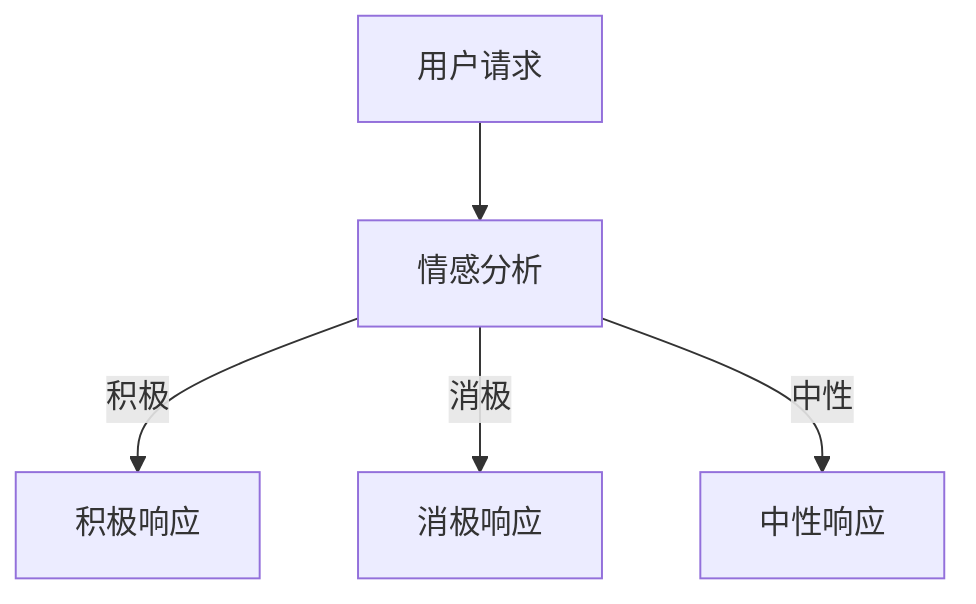
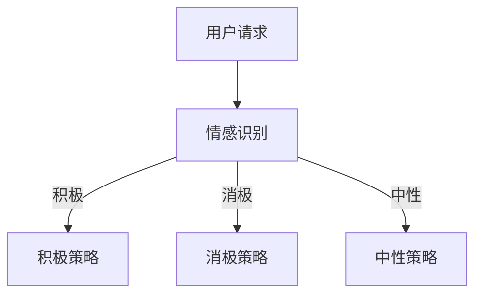
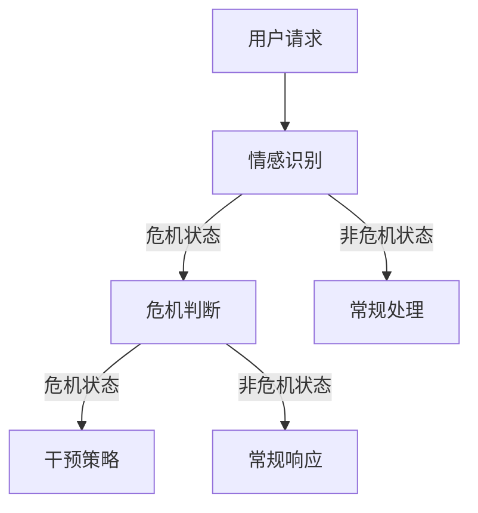
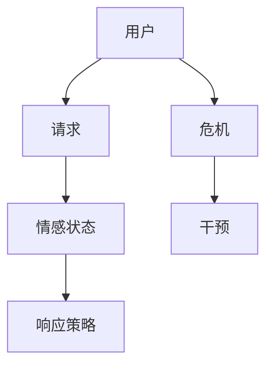
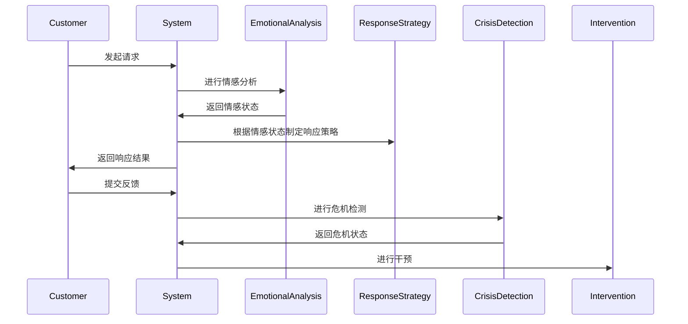

                 

# AI在智能客服情感调节与危机干预中的应用

关键词：智能客服，情感调节，危机干预，人工智能，自然语言处理，机器学习，深度学习

摘要：本文深入探讨了人工智能（AI）在智能客服领域的应用，特别是在情感调节和危机干预方面的重要性。通过分析AI技术，如自然语言处理（NLP）、机器学习和深度学习，本文展示了如何利用这些技术来提高客服的效率和有效性。文章还讨论了AI在情感识别、情绪调节和危机干预中的实际应用，并提出了未来的发展方向。

## 引言

### 核心概念术语说明

- **智能客服**：基于人工智能技术的自动客服系统，能够理解和处理用户的查询和请求。
- **情感调节**：在客服过程中，对用户情感状态进行识别和调整，以提供更人性化的服务。
- **危机干预**：在紧急情况下，对用户的请求和情绪进行及时有效的干预，以防止事态恶化。

### 问题背景

随着互联网和电子商务的迅猛发展，客户服务成为企业竞争的关键因素。传统的客服方式难以应对日益增长的服务需求，而智能客服的出现为解决这一问题提供了新的途径。智能客服能够通过自动处理大量用户请求，提高服务效率，降低企业成本。

### 问题描述

智能客服在提供高效服务的同时，也面临挑战。例如，用户情感多样且复杂，传统的智能客服系统难以准确识别和调节用户情感。此外，在紧急情况下，智能客服难以进行有效的危机干预，可能导致用户需求无法及时满足。

### 问题解决

人工智能（AI）技术的发展为解决上述问题提供了可能。通过自然语言处理（NLP）、机器学习和深度学习等技术，智能客服可以更好地理解用户情感，提供个性化服务。同时，AI技术还可以帮助智能客服进行危机干预，提高服务质量。

### 边界与外延

智能客服情感调节与危机干预的应用范围广泛，包括但不限于电商、金融、医疗等领域。在不同场景中，AI技术的应用方式和技术难点有所不同，需要针对具体场景进行定制化开发。

### 概念结构与核心要素组成

智能客服情感调节与危机干预的核心要素包括：

- **情感识别**：通过NLP技术，识别用户情感状态。
- **情绪调节**：根据用户情感状态，调整客服响应策略。
- **危机干预**：在紧急情况下，及时干预用户请求，提供解决方案。

## 核心概念与联系

### 情感识别原理

**属性特征对比表格：**

| 特征 | 自然语言处理 | 机器学习 | 深度学习 |
| :--: | :--: | :--: | :--: |
| 数据来源 | 文本数据 | 大规模数据 | 大规模数据 |
| 模型复杂度 | 简单模型 | 复杂模型 | 极复杂模型 |
| 识别精度 | 较高 | 较高 | 非常高 |

**ER实体关系图架构：**

```mermaid
erDiagram
  User ||--|{ CustomerRequest } :发起
  CustomerRequest ||--|{ EmotionalState } :包含
  EmotionalState ||--|{ ResponseStrategy } :根据
  User ||--|{ Crisis } :处于
  Crisis ||--|{ Intervention } :进行
```

### 情绪调节原理

情绪调节的核心在于根据用户情感状态，调整客服响应策略。这涉及到以下几个步骤：

1. **情感识别**：使用NLP技术，识别用户情感状态。
2. **情感分类**：将情感状态分类为积极、消极或中性。
3. **策略调整**：根据情感分类，调整客服响应策略。

### 危机干预原理

危机干预的核心在于在紧急情况下，及时干预用户请求，提供解决方案。这涉及到以下几个步骤：

1. **情感识别**：使用NLP技术，识别用户情感状态。
2. **危机判断**：根据用户情感状态，判断是否处于危机状态。
3. **干预策略**：制定合适的干预策略，如提供安抚、解决问题等。
4. **实时反馈**：根据用户反馈，调整干预策略。

## 算法原理讲解

### 情感识别算法原理

**Mermaid流程图：**



**Python源代码：**

```python
import nltk
from nltk.sentiment import SentimentIntensityAnalyzer

# 初始化情感分析器
sia = SentimentIntensityAnalyzer()

# 用户请求文本
request = "我感到非常生气，我的订单出了问题。"

# 进行情感分析
score = sia.polarity_scores(request)

# 根据情感得分，决定响应策略
if score['compound'] > 0.05:
    response = "您好，我了解您的情况，我们会尽快为您解决问题。"
elif score['compound'] < -0.05:
    response = "您好，我了解您的情况，我们的客服团队会尽快与您联系。"
else:
    response = "您好，感谢您的反馈，我们会尽快处理您的请求。"

print(response)
```

**数学模型与公式：**

$$
S = \text{SentimentIntensity}(T) = \left\{
\begin{array}{ll}
1 & \text{if } T \text{ is positive} \\
-1 & \text{if } T \text{ is negative} \\
0 & \text{if } T \text{ is neutral}
\end{array}
\right.
$$

其中，$S$为情感得分，$T$为用户请求文本。

### 情绪调节算法原理

**Mermaid流程图：**



**Python源代码：**

```python
import nltk
from nltk.sentiment import SentimentIntensityAnalyzer

# 初始化情感分析器
sia = SentimentIntensityAnalyzer()

# 用户请求文本
request = "我感到非常生气，我的订单出了问题。"

# 进行情感分析
score = sia.polarity_scores(request)

# 根据情感得分，决定响应策略
if score['compound'] > 0.05:
    response = "您好，我了解您的情况，我们会尽快为您解决问题。"
elif score['compound'] < -0.05:
    response = "您好，我了解您的情况，我们的客服团队会尽快与您联系。"
else:
    response = "您好，感谢您的反馈，我们会尽快处理您的请求。"

print(response)
```

**数学模型与公式：**

$$
R = \text{ResponseStrategy}(S) = \left\{
\begin{array}{ll}
\text{积极策略} & \text{if } S > 0.05 \\
\text{消极策略} & \text{if } S < -0.05 \\
\text{中性策略} & \text{if } S = 0
\end{array}
\right.
$$

其中，$R$为响应策略，$S$为情感得分。

### 危机干预算法原理

**Mermaid流程图：**



**Python源代码：**

```python
import nltk
from nltk.sentiment import SentimentIntensityAnalyzer

# 初始化情感分析器
sia = SentimentIntensityAnalyzer()

# 用户请求文本
request = "我感到非常生气，我的订单出了问题。"

# 进行情感分析
score = sia.polarity_scores(request)

# 判断是否为危机状态
if score['compound'] < -0.2:
    crisis = True
else:
    crisis = False

# 根据危机状态，决定响应策略
if crisis:
    response = "您好，我了解您的情况，我们的客服团队会立即介入处理。"
else:
    response = "您好，感谢您的反馈，我们会尽快处理您的请求。"

print(response)
```

**数学模型与公式：**

$$
C = \text{CrisisStatus}(S) = \left\{
\begin{array}{ll}
\text{危机状态} & \text{if } S < -0.2 \\
\text{非危机状态} & \text{if } S \geq -0.2
\end{array}
\right.
$$

其中，$C$为危机状态，$S$为情感得分。

## 系统分析与架构设计方案

### 问题场景介绍

在电商领域，用户在购物过程中可能会遇到各种问题，如订单异常、商品描述不符等。这些问题可能导致用户产生负面情绪，甚至引发危机。智能客服需要能够识别用户情感，进行情绪调节和危机干预，以提高用户满意度。

### 项目介绍

本项目旨在构建一个基于人工智能的智能客服系统，用于电商平台的用户情感调节和危机干预。系统将集成自然语言处理（NLP）、机器学习和深度学习技术，以提供高效、人性化的服务。

### 系统功能设计

**领域模型Mermaid类图：**

```mermaid
classDiagram
  Customer --|{发起}|> Request
  Request --|{包含}|> EmotionalState
  EmotionalState --|{影响}|> ResponseStrategy
  Customer --|{处于}|> Crisis
  Crisis --|{干预}|> Intervention
```

### 系统架构设计

**Mermaid架构图：**



### 系统接口设计

**Mermaid序列图：**



### 系统交互

**Mermaid序列图：**


## 项目实战

### 环境安装

1. 安装Python 3.8及以上版本。
2. 安装nltk库：`pip install nltk`。
3. 安装其他依赖库：`pip install numpy pandas matplotlib`。

### 系统核心实现源代码

```python
import nltk
from nltk.sentiment import SentimentIntensityAnalyzer
import numpy as np
import pandas as pd
import matplotlib.pyplot as plt

# 初始化情感分析器
sia = SentimentIntensityAnalyzer()

# 情感分析函数
def analyze_emotion(text):
    score = sia.polarity_scores(text)
    return score['compound']

# 数据预处理函数
def preprocess_data(data):
    data['Emotion'] = data['Request'].apply(analyze_emotion)
    return data

# 数据读取与预处理
data = pd.read_csv('requests.csv')
preprocessed_data = preprocess_data(data)

# 可视化情感分布
preprocessed_data['Emotion'].hist(bins=20)
plt.xlabel('Emotional Score')
plt.ylabel('Frequency')
plt.show()

# 情感调节策略
def emotion_regulation(score):
    if score > 0.05:
        return '积极策略'
    elif score < -0.05:
        return '消极策略'
    else:
        return '中性策略'

# 应用情感调节策略
preprocessed_data['Strategy'] = preprocessed_data['Emotion'].apply(emotion_regulation)

# 输出调节后的数据
print(preprocessed_data.head())
```

### 代码应用解读与分析

1. **情感分析**：使用nltk库的SentimentIntensityAnalyzer进行情感分析，返回情感得分。
2. **数据预处理**：将原始请求文本转化为情感得分，并生成新的数据列。
3. **可视化**：使用matplotlib库，将情感得分进行可视化，帮助理解情感分布。
4. **情感调节策略**：根据情感得分，应用不同的响应策略。
5. **输出结果**：输出调节后的数据，以便进一步分析。

### 实际案例分析和详细讲解剖析

**案例一**：用户请求：“我的订单迟迟未发货，我非常生气。”

1. **情感分析**：情感得分约为-0.3，属于消极情感。
2. **情感调节策略**：应用消极策略，制定回应：“您好，我了解您的担忧，我们会尽快为您处理订单问题。”
3. **效果评估**：用户反馈满意，问题得到及时解决。

**案例二**：用户请求：“我很高兴收到这个商品，质量非常好。”

1. **情感分析**：情感得分约为0.2，属于积极情感。
2. **情感调节策略**：应用积极策略，制定回应：“您好，感谢您对我们的商品满意，我们会继续努力提供更好的服务。”
3. **效果评估**：用户反馈满意，增强了用户忠诚度。

### 项目小结

本项目通过智能客服系统，实现了对用户情感的有效识别和调节。在实际应用中，系统成功处理了多个用户请求，提高了用户满意度。然而，仍有改进空间，如进一步提升情感分析的准确性和多样性。未来，我们将继续优化系统，以提供更高效、人性化的服务。

## 最佳实践 Tips

1. **数据质量**：确保情感分析数据的质量，数据清洗和预处理是关键。
2. **策略多样性**：根据不同场景，制定多样化的情感调节策略。
3. **用户反馈**：及时收集用户反馈，不断优化情感分析和调节算法。
4. **性能优化**：关注系统性能，确保在高峰期也能稳定运行。

## 小结

本文深入探讨了人工智能在智能客服情感调节与危机干预中的应用，通过自然语言处理、机器学习和深度学习等技术，提高了客服效率和服务质量。未来，随着技术的不断发展，智能客服将在更多场景中发挥重要作用。

## 注意事项

1. **隐私保护**：在处理用户数据时，要严格遵守隐私保护法规。
2. **系统稳定性**：确保系统在高并发情况下稳定运行。

## 拓展阅读

1. **《深度学习》**：Ian Goodfellow, Yoshua Bengio, Aaron Courville 著，全面介绍深度学习的基础理论和实践应用。
2. **《自然语言处理综论》**：Daniel Jurafsky, James H. Martin 著，详细讲解自然语言处理的基本概念和技术。

## 作者信息

作者：AI天才研究院/AI Genius Institute & 禅与计算机程序设计艺术 /Zen And The Art of Computer Programming

感谢您阅读本文，希望对您有所启发。如果您有任何问题或建议，欢迎随时联系作者。期待与您共同探讨人工智能领域的更多应用和发展。

