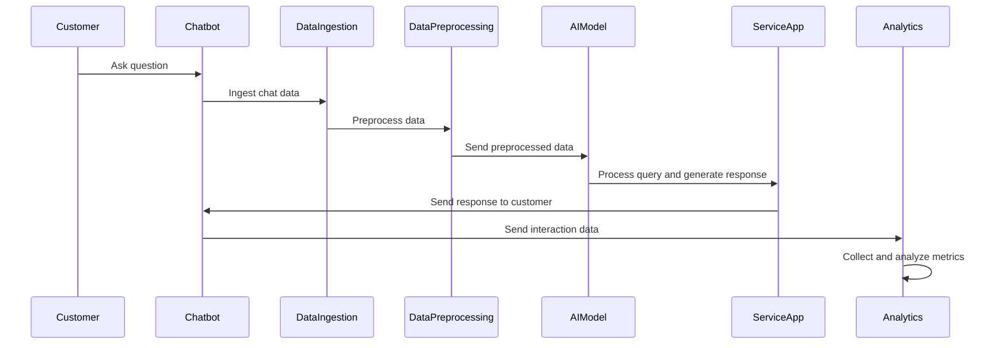
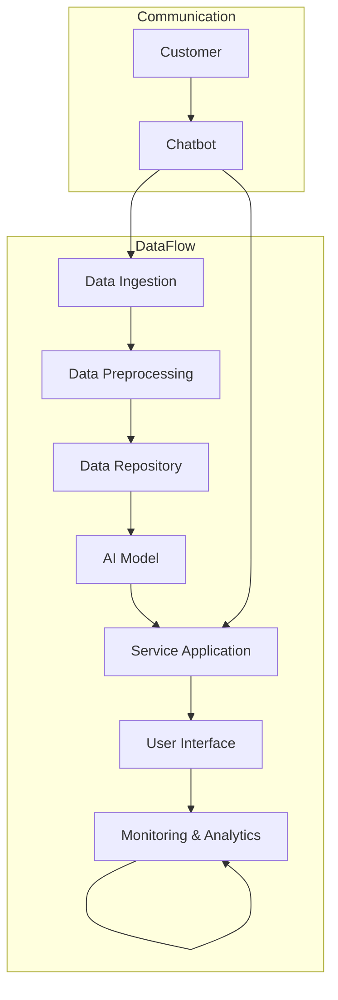
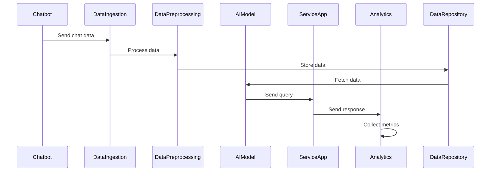

                 


### Introduction

#### Title and Keywords

The title of this blog post is "AI in Application and Optimization for Intelligent Customer Service Systems." Key words include: AI, Customer Service, Intelligent Systems, Application Optimization, and Natural Language Processing (NLP).

#### Abstract

This article delves into the world of AI-driven intelligent customer service systems. We will explore the various applications of AI in customer service, the optimization techniques used to enhance these systems, and provide a comprehensive overview of the system architecture and design. Furthermore, we will discuss the implementation and development process, along with practical case studies to illustrate the effectiveness of these systems. Finally, we will offer best practices and insights for further optimization and improvement.

### Background and Foundations

#### AI Technologies Overview

AI (Artificial Intelligence) is a broad field encompassing various technologies aimed at creating intelligent machines capable of performing tasks that typically require human intelligence. These technologies include:

1. **Machine Learning (ML)**: ML is a subset of AI that enables machines to learn from data, identify patterns, and make decisions with minimal human intervention. Common ML techniques include supervised learning, unsupervised learning, and reinforcement learning.
2. **Deep Learning (DL)**: DL is a specialized subset of ML that uses neural networks with many layers to learn from vast amounts of data. This has led to significant advancements in areas such as computer vision, natural language processing, and speech recognition.
3. **Natural Language Processing (NLP)**: NLP is a field of AI that focuses on the interaction between computers and human languages. It involves processing and analyzing large amounts of text to extract meaningful insights.

#### Evolution of Customer Service Systems

Customer service systems have evolved significantly over the years. Traditional customer service systems relied heavily on manual processes, including phone calls, emails, and face-to-face interactions. These methods were often slow, inefficient, and prone to human error.

In the past decade, the advent of AI and advanced technologies has transformed customer service systems. The introduction of chatbots and virtual assistants has automated many routine tasks, reducing response times and improving overall efficiency. These intelligent systems can handle a large volume of customer inquiries simultaneously, providing instant responses and personalized recommendations.

#### The Role of AI in Modern Customer Service

AI plays a crucial role in modern customer service systems by addressing the following challenges:

1. **Increased Volume of Customer Inquiries**: With the growing number of customers and the increasing complexity of their inquiries, traditional customer service systems struggle to keep up. AI-powered systems can handle large volumes of inquiries simultaneously, providing instant responses and reducing response times.
2. **Personalization**: AI enables customer service systems to personalize interactions based on individual preferences and past interactions. This helps create a more engaging and personalized customer experience.
3. **24/7 Availability**: AI-powered customer service systems can operate round-the-clock, ensuring that customers receive timely assistance regardless of the time zone or day of the week.
4. **Reduced Costs**: By automating routine tasks and improving efficiency, AI-powered customer service systems can significantly reduce operational costs.

In conclusion, the integration of AI technologies in customer service systems has led to significant improvements in efficiency, effectiveness, and customer satisfaction. In the next sections, we will delve deeper into the core AI technologies and their applications in customer service.

### Core AI Technologies and Concepts

In this section, we will explore the fundamental AI technologies and concepts that drive the development and optimization of intelligent customer service systems. These technologies include Machine Learning (ML), Deep Learning (DL), and Natural Language Processing (NLP). Understanding these core components will provide valuable insights into how AI-powered customer service systems work and how they can be optimized for better performance.

#### Machine Learning (ML)

Machine Learning is a subset of AI that focuses on developing algorithms that can learn from data and make predictions or decisions based on that learning. ML algorithms can be broadly categorized into three types: supervised learning, unsupervised learning, and reinforcement learning.

1. **Supervised Learning**: In supervised learning, the algorithm is trained on a labeled dataset, where the input features and corresponding output labels are provided. The goal is to learn a mapping function that can predict the output label for new, unseen input data. Common supervised learning algorithms include linear regression, logistic regression, support vector machines (SVM), and decision trees.
   
   **Example:**
   Suppose we have a dataset of customer inquiries categorized into categories such as "product support," "billing issues," and "returns." We can train a supervised learning model to classify new customer inquiries based on their text content.

   $$ \text{Classifier}(x) = \arg\min_{y} \sum_{i=1}^{n} \mathcal{L}(y_i, \hat{y}_i) $$
   where \( x \) represents the input features, \( y \) represents the true label, \( \hat{y} \) represents the predicted label, and \( \mathcal{L} \) represents the loss function.
   
2. **Unsupervised Learning**: Unsupervised learning involves analyzing unlabeled data to find patterns or relationships within the data. Common unsupervised learning algorithms include clustering algorithms (e.g., K-means, hierarchical clustering), dimensionality reduction techniques (e.g., Principal Component Analysis, t-SNE), and anomaly detection algorithms.
   
   **Example:**
   Suppose we have a dataset of customer feedback without any labeled categories. We can use unsupervised learning algorithms to cluster similar feedback together and identify common themes or issues raised by customers.
   
   $$ \text{Clustering}(x) = \arg\min_{z} \sum_{i=1}^{n} \sum_{j=1}^{k} \mathcal{S}(z_i, c_j) $$
   where \( x \) represents the input features, \( z \) represents the cluster assignments, \( c_j \) represents the \( j \)-th cluster, and \( \mathcal{S} \) represents the similarity measure.
   
3. **Reinforcement Learning**: Reinforcement learning involves training an agent to make decisions in an environment to maximize a reward signal. The agent learns through a trial-and-error process, updating its policy based on the rewards received from the environment.
   
   **Example:**
   Suppose we have a chatbot trained to assist customers in finding product information. The chatbot interacts with customers in a simulated environment, receiving rewards for providing accurate and helpful information and penalties for providing incorrect or unhelpful information.
   
   $$ \text{Policy}(\pi) = \arg\max_{\pi} \sum_{t=1}^{T} \gamma^t \mathbb{R}(s_t, a_t, s_{t+1}) $$
   where \( \pi \) represents the policy, \( s_t \) represents the state at time \( t \), \( a_t \) represents the action taken at time \( t \), \( s_{t+1} \) represents the state at time \( t+1 \), \( \gamma \) represents the discount factor, and \( \mathbb{R} \) represents the reward function.

#### Deep Learning (DL)

Deep Learning is a specialized subset of Machine Learning that uses neural networks with many layers to learn from large amounts of data. Deep Learning has revolutionized various fields, including computer vision, natural language processing, and speech recognition.

1. **Neural Networks**: A neural network is a series of interconnected artificial neurons that process input data and produce an output. The basic building block of a neural network is a neuron, which consists of an input layer, a weighted connection layer, an activation function, and an output layer.

   $$ z = \sum_{i=1}^{n} w_i x_i + b $$
   $$ a = \sigma(z) $$
   where \( x_i \) represents the input, \( w_i \) represents the weight, \( b \) represents the bias, \( z \) represents the net input, \( a \) represents the output, and \( \sigma \) represents the activation function (e.g., sigmoid, ReLU).
   
2. **Deep Neural Networks**: Deep Neural Networks (DNNs) are neural networks with many layers. Each layer processes the input data and passes it to the next layer, resulting in a hierarchical representation of the data. DNNs have shown remarkable success in various tasks, including image classification, object detection, and language modeling.

   $$ \text{DNN}(x) = f^{L}(\cdots f^{2}(f^{1}(x))) $$
   where \( f^{l} \) represents the activation function of the \( l \)-th layer, and \( L \) represents the number of layers.
   
3. **Convolutional Neural Networks (CNNs)**: CNNs are a type of DNN specifically designed for processing grid-like data, such as images. CNNs use convolutional layers, pooling layers, and fully connected layers to learn spatial hierarchies in the data.

   **Example:**
   Suppose we have an image classification task. A CNN can be trained to recognize and classify images into different categories, such as "cat," "dog," and "car."
   
   $$ \text{CNN}(x) = \text{FullyConnected}(\text{Pooling}(\text{Conv}(\text{Conv}(x)))) $$
   
4. **Recurrent Neural Networks (RNNs)**: RNNs are a type of DNN designed for processing sequential data, such as text and time-series data. RNNs use feedback loops to maintain a memory of previous inputs, allowing them to capture temporal dependencies in the data.

   **Example:**
   Suppose we have a natural language processing task. An RNN can be trained to understand the sequence of words in a sentence and generate appropriate responses.
   
   $$ \text{RNN}(x_t) = \text{Activation}(\text{WeightedSum}(h_{t-1}, x_t)) $$
   where \( x_t \) represents the input at time \( t \), and \( h_{t-1} \) represents the hidden state at time \( t-1 \).

#### Natural Language Processing (NLP)

Natural Language Processing is a field of AI that focuses on the interaction between computers and human languages. NLP enables machines to understand, process, and generate human language, facilitating tasks such as text classification, sentiment analysis, machine translation, and named entity recognition.

1. **Tokenization**: Tokenization is the process of breaking a text into smaller units, such as words or sentences. This allows machines to analyze and process the text more effectively.

   $$ \text{Tokenize}(text) = [word_1, word_2, ..., word_n] $$
   
2. **Part-of-Speech Tagging**: Part-of-speech tagging is the process of assigning a part of speech (e.g., noun, verb, adjective) to each word in a text. This helps machines understand the grammatical structure of the text and extract meaningful information.

   $$ \text{Tag}(word) = \text{Part-of-Speech} $$
   
3. **Named Entity Recognition (NER)**: Named Entity Recognition is the process of identifying and classifying named entities (e.g., person names, organization names, locations) in a text. This enables machines to extract valuable information from text data.

   $$ \text{NER}(text) = [\text{Entity}_1, \text{Entity}_2, ..., \text{Entity}_n] $$
   
4. **Sentiment Analysis**: Sentiment analysis is the process of determining the sentiment or emotional tone of a text, such as whether a review is positive, negative, or neutral. This information can be used to gauge customer satisfaction and identify areas for improvement.

   $$ \text{Sentiment}(text) = \text{Positive/Negative/Neutral} $$
   
5. **Machine Translation**: Machine Translation is the process of translating text from one language to another using automated methods. This enables communication between people who speak different languages and facilitates global business and collaboration.

   $$ \text{Translate}(text, \text{SourceLanguage}, \text{TargetLanguage}) = \text{TranslatedText} $$
   
In conclusion, the core AI technologies and concepts discussed in this section form the foundation for the development and optimization of intelligent customer service systems. Understanding these technologies and their applications will enable us to explore the various ways in which AI can be leveraged to enhance customer service experiences.

### AI Applications in Intelligent Customer Service

In this section, we will delve into the practical applications of AI in intelligent customer service systems, focusing on key areas such as chatbots and virtual assistants, sentiment analysis and customer feedback, and personalization and recommendations. These applications have revolutionized the way customer service is delivered, offering improved efficiency, scalability, and personalization.

#### Chatbots and Virtual Assistants

Chatbots and virtual assistants are AI-powered systems designed to interact with customers in real-time, providing instant responses to their queries and assisting with various tasks. These systems are based on natural language processing (NLP) and machine learning (ML) techniques, enabling them to understand and process customer inquiries in a human-like manner.

**Example:**

Consider a scenario where a customer wants to inquire about product availability. The chatbot can be programmed to understand the customer's question, search the inventory database, and provide real-time updates on product availability.

```python
def handle_product_inquiry(question):
    # Preprocess the question
    processed_question = preprocess_question(question)
    
    # Use NLP techniques to extract relevant information
    product_name = extract_product_name(processed_question)
    
    # Query the inventory database
    product_info = query_inventory(product_name)
    
    # Generate a response
    response = generate_response(product_info)
    
    return response

def preprocess_question(question):
    # Tokenize, remove stop words, and perform stemming
    # ...
    return processed_question

def extract_product_name(processed_question):
    # Use named entity recognition (NER) to extract product name
    # ...
    return product_name

def query_inventory(product_name):
    # Query the inventory database for product information
    # ...
    return product_info

def generate_response(product_info):
    # Generate a response based on product information
    # ...
    return response
```

This example demonstrates how a chatbot can be designed to handle product inquiries using a combination of NLP and ML techniques. The chatbot processes the customer's question, extracts relevant information, queries the inventory database, and generates a response, all in real-time.

**Benefits of Chatbots and Virtual Assistants:**

1. **Improved Efficiency**: Chatbots and virtual assistants can handle multiple customer inquiries simultaneously, reducing response times and improving overall efficiency.
2. **Scalability**: These systems can scale to handle an increasing volume of customer inquiries without requiring additional resources.
3. **Personalization**: AI-powered chatbots and virtual assistants can personalize interactions based on individual customer preferences and past interactions, enhancing the customer experience.
4. **24/7 Availability**: These systems can operate round-the-clock, providing customers with timely assistance regardless of the time zone or day of the week.

#### Sentiment Analysis and Customer Feedback

Sentiment analysis is the process of determining the sentiment or emotional tone of a text, such as a customer review or feedback. AI-powered sentiment analysis systems can analyze large volumes of customer feedback to identify positive, negative, and neutral sentiments, enabling organizations to gauge customer satisfaction and identify areas for improvement.

**Example:**

Consider a scenario where a company wants to analyze customer feedback from social media platforms to identify common issues and areas for improvement.

```python
def analyze_sentiment(feedback):
    # Preprocess the feedback
    processed_feedback = preprocess_feedback(feedback)
    
    # Use NLP techniques to extract sentiment
    sentiment = extract_sentiment(processed_feedback)
    
    return sentiment

def preprocess_feedback(feedback):
    # Tokenize, remove stop words, and perform stemming
    # ...
    return processed_feedback

def extract_sentiment(processed_feedback):
    # Use sentiment analysis models to extract sentiment
    # ...
    return sentiment
```

This example demonstrates how sentiment analysis can be applied to customer feedback using a combination of NLP and ML techniques. The sentiment analysis system processes the customer feedback, extracts sentiment information, and provides insights into customer satisfaction.

**Benefits of Sentiment Analysis and Customer Feedback:**

1. **Customer Insights**: Sentiment analysis enables organizations to gain insights into customer opinions and preferences, helping them make informed decisions and improve their products and services.
2. **Proactive Issue Detection**: By analyzing customer feedback, organizations can identify potential issues and address them proactively, reducing the risk of customer churn.
3. **Improved Customer Experience**: By understanding customer sentiments, organizations can tailor their customer service strategies to meet customer expectations and enhance the overall customer experience.
4. **Data-Driven Decision Making**: Sentiment analysis provides organizations with actionable insights, enabling them to make data-driven decisions and optimize their customer service processes.

#### Personalization and Recommendations

Personalization and recommendations are key aspects of intelligent customer service systems. By leveraging AI techniques such as collaborative filtering and content-based filtering, these systems can provide personalized recommendations and tailored experiences to customers.

**Example:**

Consider a scenario where an e-commerce company wants to recommend products to customers based on their browsing and purchase history.

```python
def generate_recommendations(user_history):
    # Preprocess the user history
    processed_history = preprocess_history(user_history)
    
    # Use collaborative filtering to generate recommendations
    recommendations = collaborative_filtering(processed_history)
    
    return recommendations

def preprocess_history(user_history):
    # Tokenize, normalize, and vectorize user history
    # ...
    return processed_history

def collaborative_filtering(processed_history):
    # Use collaborative filtering algorithms to generate recommendations
    # ...
    return recommendations
```

This example demonstrates how a recommendation system can be designed using collaborative filtering techniques. The system processes the user's browsing and purchase history, generates recommendations based on similar user behaviors, and provides personalized product suggestions.

**Benefits of Personalization and Recommendations:**

1. **Enhanced Customer Experience**: Personalization and recommendations enhance the customer experience by providing tailored product suggestions and relevant content, increasing customer engagement and satisfaction.
2. **Increased Sales and Revenue**: By providing personalized recommendations, companies can increase the likelihood of customer conversions and drive higher sales and revenue.
3. **Improved Customer Loyalty**: Personalization and recommendations help build customer loyalty by providing a personalized and engaging shopping experience, encouraging repeat purchases.
4. **Data-Driven Decision Making**: Personalization and recommendations enable companies to make data-driven decisions by analyzing user behavior and preferences, optimizing their marketing strategies and product offerings.

In conclusion, the applications of AI in intelligent customer service systems, including chatbots and virtual assistants, sentiment analysis and customer feedback, and personalization and recommendations, have transformed the way customer service is delivered. These AI-powered systems offer improved efficiency, personalization, and customer satisfaction, driving business success in the digital age.

### AI Optimization Techniques

Optimizing AI systems in customer service is crucial for achieving high performance, scalability, and reliability. In this section, we will discuss various optimization techniques that can be applied to enhance the effectiveness of AI-driven customer service systems.

#### Model Selection and Hyperparameter Tuning

Selecting the right model and tuning its hyperparameters are critical steps in optimizing AI systems. Model selection involves choosing the most suitable algorithm for a specific problem, while hyperparameter tuning involves adjusting the parameters of the chosen model to achieve optimal performance.

**Techniques for Model Selection and Hyperparameter Tuning:**

1. **Cross-Validation**: Cross-validation is a technique used to evaluate the performance of a model on different subsets of the training data. It helps identify the best model and hyperparameters by minimizing overfitting and generalizing well to unseen data.

   $$ \text{Cross-Validation}(D, K) = \sum_{k=1}^{K} \frac{1}{K} \sum_{i=1}^{K} \mathcal{L}(\hat{y}_{i,k}, y_{i,k}) $$
   where \( D \) represents the dataset, \( K \) represents the number of folds, \( \hat{y}_{i,k} \) represents the predicted label for the \( i \)-th sample in the \( k \)-th fold, and \( y_{i,k} \) represents the true label for the \( i \)-th sample in the \( k \)-th fold.

2. **Grid Search**: Grid search is a systematic approach to hyperparameter tuning that exhaustively searches through a predefined set of hyperparameter values. It evaluates the performance of the model for each combination of hyperparameters and selects the best combination.

   $$ \text{GridSearch}(P) = \arg\min_{\theta} \sum_{i=1}^{n} \mathcal{L}(y_i, \hat{y}_i(\theta)) $$
   where \( P \) represents the parameter space, \( \theta \) represents the hyperparameters, \( y_i \) represents the true label for the \( i \)-th sample, and \( \hat{y}_i(\theta) \) represents the predicted label for the \( i \)-th sample using the hyperparameters \( \theta \).

3. **Bayesian Optimization**: Bayesian optimization is a more efficient approach to hyperparameter tuning that uses a probabilistic model to predict the performance of a model for new hyperparameter values. It focuses on the most promising hyperparameter regions, reducing the number of evaluations required.

   $$ p(\theta | D) \propto p(D | \theta) p(\theta) $$
   where \( p(\theta | D) \) represents the posterior probability of the hyperparameters \( \theta \) given the data \( D \), \( p(D | \theta) \) represents the likelihood of the data given the hyperparameters \( \theta \), and \( p(\theta) \) represents the prior probability of the hyperparameters \( \theta \).

#### Data Preprocessing and Feature Engineering

Data preprocessing and feature engineering play a crucial role in optimizing AI systems. Effective preprocessing techniques and feature engineering methods can enhance the quality and utility of the input data, leading to better model performance.

**Techniques for Data Preprocessing and Feature Engineering:**

1. **Data Cleaning**: Data cleaning involves removing noisy and irrelevant data, handling missing values, and correcting errors. This ensures the data is clean and ready for analysis.

   $$ \text{Clean}(D) = \{d' | d' \in D \land \text{is\_valid}(d')\} $$
   where \( D \) represents the dataset, \( d' \) represents the cleaned data, and \( \text{is\_valid} \) represents a function that checks the validity of the data.

2. **Feature Scaling**: Feature scaling involves transforming the input data to a standard range, typically between 0 and 1 or -1 and 1. This helps prevent the model from being biased towards features with larger values and improves convergence.

   $$ x_{\text{scaled}} = \frac{x - \mu}{\sigma} $$
   where \( x \) represents the original feature value, \( \mu \) represents the mean of the feature, and \( \sigma \) represents the standard deviation of the feature.

3. **Feature Extraction**: Feature extraction involves creating new features from the existing input data to improve the model's performance. This can include techniques such as principal component analysis (PCA), t-distributed stochastic neighbor embedding (t-SNE), and autoencoders.

   $$ \text{Extract}(D) = \{f' | f' \in F \land \text{is\_useful}(f')\} $$
   where \( D \) represents the dataset, \( F \) represents the set of all possible features, \( f' \) represents the extracted features, and \( \text{is\_useful} \) represents a function that checks the usefulness of the feature.

4. **Feature Selection**: Feature selection involves selecting the most relevant features from the dataset to improve model performance and reduce computational complexity. This can include techniques such as mutual information, recursive feature elimination, and feature importance ranking.

   $$ \text{Select}(F) = \{f' | f' \in F \land \text{is\_relevant}(f')\} $$
   where \( F \) represents the set of all possible features, \( f' \) represents the selected features, and \( \text{is\_relevant} \) represents a function that checks the relevance of the feature.

#### Performance Metrics and Evaluation

Evaluating the performance of AI systems is crucial for identifying their strengths and weaknesses and guiding further optimization. Various performance metrics can be used to assess the effectiveness of AI models, including accuracy, precision, recall, F1 score, and area under the receiver operating characteristic (ROC) curve.

**Performance Metrics and Evaluation Techniques:**

1. **Accuracy**: Accuracy measures the proportion of correct predictions out of the total number of predictions.

   $$ \text{Accuracy} = \frac{\text{TP} + \text{TN}}{\text{TP} + \text{TN} + \text{FP} + \text{FN}} $$
   where \( \text{TP} \) represents the true positive, \( \text{TN} \) represents the true negative, \( \text{FP} \) represents the false positive, and \( \text{FN} \) represents the false negative.

2. **Precision and Recall**: Precision measures the proportion of true positive predictions out of the total positive predictions, while recall measures the proportion of true positive predictions out of the total actual positives.

   $$ \text{Precision} = \frac{\text{TP}}{\text{TP} + \text{FP}} $$
   $$ \text{Recall} = \frac{\text{TP}}{\text{TP} + \text{FN}} $$
   $$ \text{F1 Score} = \frac{2 \times \text{Precision} \times \text{Recall}}{\text{Precision} + \text{Recall}} $$
   
3. **Area Under the ROC Curve (AUC)**: AUC measures the ability of a model to distinguish between positive and negative classes. It ranges from 0 to 1, with higher values indicating better performance.

   $$ \text{AUC} = \int_{0}^{1} \text{TruePositiveRate}(t) \, dt $$
   where \( \text{TruePositiveRate}(t) \) represents the true positive rate at a given threshold \( t \).

4. **Confusion Matrix**: A confusion matrix is a table that summarizes the performance of a model by showing the number of true positives, true negatives, false positives, and false negatives.

   $$ \text{ConfusionMatrix} = \begin{bmatrix} \text{TP} & \text{FP} \\ \text{FN} & \text{TN} \end{bmatrix} $$

In conclusion, optimizing AI systems in customer service requires a comprehensive approach that involves model selection and hyperparameter tuning, data preprocessing and feature engineering, and performance evaluation. By employing these optimization techniques, organizations can enhance the effectiveness and efficiency of their AI-driven customer service systems, ultimately improving customer satisfaction and business outcomes.

### System Architecture and Design

In this section, we will explore the system architecture and design of intelligent customer service systems. We will discuss the key components and modules, the overall system architecture, and the interfaces and interactions between these components. Understanding the system architecture is crucial for developing efficient and scalable AI-driven customer service systems.

#### System Requirements and Constraints

Before diving into the system architecture, it is essential to define the system requirements and constraints. These factors will influence the design choices and implementation details of the system.

**System Requirements:**

1. **Scalability**: The system should be able to handle a large volume of customer inquiries and interactions without compromising performance.
2. **Reliability**: The system should be highly reliable, minimizing downtime and ensuring consistent performance.
3. **Security**: The system should ensure the privacy and security of customer data, complying with relevant regulations and standards.
4. **Personalization**: The system should be able to personalize interactions based on individual customer preferences and historical data.
5. **Flexibility**: The system should be flexible enough to accommodate future changes and enhancements.

**System Constraints:**

1. **Resource Constraints**: The system should be designed to operate within the available hardware and software resources.
2. **Cost Constraints**: The system should be cost-effective, balancing performance, reliability, and scalability without incurring excessive costs.
3. **Time Constraints**: The system should be developed and deployed within the specified timeline.

#### System Architecture Overview

The system architecture of an intelligent customer service system can be divided into several key components and modules:

1. **Data Ingestion Module**: This module is responsible for collecting and ingesting customer data from various sources, such as chat transcripts, customer feedback, and user behavior data. The data is stored in a centralized data repository for further processing.

2. **Data Preprocessing Module**: This module performs data cleaning, normalization, and feature extraction on the collected data. The preprocessed data is then used as input for the AI models.

3. **AI Model Module**: This module includes the AI models responsible for various tasks such as sentiment analysis, customer intent classification, and personalization. The models are trained and validated using the preprocessed data and are deployed as part of the service application.

4. **Service Application Module**: This module is the core component of the system, responsible for handling customer interactions. It uses the AI models to process incoming queries, generate responses, and provide personalized recommendations. The service application module communicates with other modules through well-defined interfaces.

5. **User Interface Module**: This module provides a user-friendly interface for customers to interact with the system. It includes chatbots, virtual assistants, and other interactive components that enable seamless customer engagement.

6. **Monitoring and Analytics Module**: This module collects and analyzes performance metrics, providing insights into the system's behavior and identifying areas for improvement. It also enables real-time monitoring of the system's health and performance.

#### Module Interaction and Data Flow

The interaction and data flow between the system modules are critical for the overall performance and efficiency of the system. The following diagram illustrates the interactions and data flow between the key modules:



In this diagram, the customer interacts with the chatbot to ask a question. The chatbot ingests the chat data and passes it to the data ingestion module. The data is then preprocessed, and the preprocessed data is used to feed the AI models. The AI models process the query and generate a response, which is sent back to the chatbot and displayed to the customer. The interaction data is also sent to the analytics module for monitoring and analysis.

#### System Architecture Design

The system architecture design should address the system requirements and constraints while ensuring scalability, reliability, and flexibility. The following diagram illustrates the overall system architecture:



In this architecture, the data flows from the customer to the chatbot, which ingests the chat data and passes it to the data ingestion module. The data is then preprocessed and stored in a centralized data repository. The AI models access the preprocessed data from the repository and process incoming queries. The service application module generates responses and sends them back to the chatbot and customer. The user interface module enables customer interaction, and the monitoring and analytics module collects and analyzes performance metrics.

#### System Interfaces and Interactions

The system architecture should define well-defined interfaces and interactions between the various modules. This ensures seamless integration and communication between components, enhancing the overall system performance. The following diagram illustrates the system interfaces and interactions:



In this diagram, the chatbot sends chat data to the data ingestion module, which processes the data and stores it in the data repository. The AI models access the data from the repository and process incoming queries. The service application module generates responses and sends them back to the chatbot and customer. The analytics module collects performance metrics and analyzes the system's behavior.

In conclusion, the system architecture and design of intelligent customer service systems are critical for achieving high performance, scalability, and reliability. By defining the key components, modules, interfaces, and interactions, organizations can develop efficient and effective AI-driven customer service systems that deliver exceptional customer experiences.

### Implementation and Development of AI Customer Service Systems

#### Development Environment Setup

To implement an AI customer service system, a suitable development environment must be set up. This includes the installation of necessary software and libraries, as well as the configuration of the development tools and dependencies. Here is a step-by-step guide to setting up the development environment:

1. **Install Python and required libraries**: Python is the primary programming language used in AI development. Ensure that Python 3.8 or higher is installed on your system. Install the required libraries using pip, such as TensorFlow, Keras, NLTK, and scikit-learn.

   ```bash
   pip install tensorflow numpy nltk scikit-learn pandas
   ```

2. **Install Jupyter Notebook**: Jupyter Notebook is a popular tool for developing and testing AI models. Install Jupyter Notebook using pip:

   ```bash
   pip install notebook
   ```

3. **Configure the environment**: Set up a virtual environment to manage the project dependencies and avoid conflicts with other Python packages. Create a new virtual environment and activate it:

   ```bash
   python -m venv venv
   source venv/bin/activate  # On Windows: venv\Scripts\activate
   ```

4. **Install additional tools**: Install additional tools such as Git for version control, Docker for containerization, and a code editor like Visual Studio Code or PyCharm.

#### Core Function Implementation

The core functions of an AI customer service system involve processing customer queries, generating responses, and providing personalized recommendations. Here is an overview of the implementation steps:

1. **Data Ingestion**: Implement a data ingestion module to collect and process customer queries. This can be done using APIs, web scraping, or direct database access. Use libraries such as Pandas and NumPy to handle and preprocess the data.

2. **Preprocessing**: Preprocess the customer queries to prepare them for model input. This includes tokenization, lowercasing, removing stop words, and lemmatization. Use the Natural Language Toolkit (NLTK) to perform these preprocessing steps.

3. **Model Training**: Train AI models for various tasks such as sentiment analysis, intent classification, and recommendation. Use libraries like TensorFlow and Keras to define and train the models. Here is an example of training a sentiment analysis model using TensorFlow:

   ```python
   import tensorflow as tf
   from tensorflow.keras.models import Sequential
   from tensorflow.keras.layers import Embedding, LSTM, Dense

   # Load and preprocess the data
   X_train, y_train = preprocess_data(queries)

   # Build the model
   model = Sequential([
       Embedding(input_dim=vocab_size, output_dim=embedding_dim, input_length=max_sequence_length),
       LSTM(units=128, dropout=0.2, recurrent_dropout=0.2),
       Dense(units=1, activation='sigmoid')
   ])

   # Compile the model
   model.compile(optimizer='adam', loss='binary_crossentropy', metrics=['accuracy'])

   # Train the model
   model.fit(X_train, y_train, batch_size=64, epochs=10, validation_split=0.1)
   ```

4. **Query Processing**: Implement a function to process incoming queries using the trained AI models. This function should handle query preprocessing, model input generation, and response generation. Here is an example of processing a query using a sentiment analysis model:

   ```python
   def process_query(query, model):
       # Preprocess the query
       processed_query = preprocess_query(query)

       # Generate model input
       input_sequence = generate_model_input(processed_query, vocab_size, max_sequence_length)

       # Generate response
       sentiment = model.predict(input_sequence)
       response = generate_response(sentiment)

       return response
   ```

5. **Response Generation**: Generate personalized responses based on the processed query and the output of the AI models. Use a response template or a language generation model to create engaging and relevant responses.

#### Testing and Deployment

Once the core functions of the AI customer service system are implemented, thorough testing and deployment are essential to ensure the system's reliability and performance.

1. **Testing**: Test the system using a variety of test cases, including edge cases and real-world scenarios. Validate the system's accuracy, response time, and scalability. Use unit tests, integration tests, and end-to-end tests to cover different aspects of the system.

2. **Containerization**: Containerize the system using Docker to ensure consistent deployment across different environments. Create a Dockerfile to define the system's dependencies and configurations.

3. **Deployment**: Deploy the containerized system to a production environment, such as a cloud server or Kubernetes cluster. Use continuous integration and continuous deployment (CI/CD) pipelines to automate the deployment process and ensure smooth updates.

4. **Monitoring and Maintenance**: Monitor the system's performance and health using monitoring tools and techniques. Set up alerts and notifications to detect and address any issues or anomalies. Regularly update the system and AI models to maintain optimal performance and accuracy.

#### Code Application and Analysis

Below is a code example demonstrating the implementation of an AI customer service system:

```python
# Import required libraries
import pandas as pd
import numpy as np
import nltk
from nltk.corpus import stopwords
from tensorflow.keras.preprocessing.text import Tokenizer
from tensorflow.keras.preprocessing.sequence import pad_sequences
from tensorflow.keras.models import Sequential
from tensorflow.keras.layers import Embedding, LSTM, Dense

# Load and preprocess the data
data = pd.read_csv('customer_queries.csv')
data['query'] = data['query'].apply(preprocess_query)

# Tokenize and pad the data
tokenizer = Tokenizer(num_words=vocab_size, oov_token='<OOV>')
tokenizer.fit_on_texts(data['query'])
sequences = tokenizer.texts_to_sequences(data['query'])
padded_sequences = pad_sequences(sequences, maxlen=max_sequence_length)

# Split the data into training and validation sets
X_train, X_val, y_train, y_val = train_test_split(padded_sequences, data['label'], test_size=0.2, random_state=42)

# Build the model
model = Sequential([
    Embedding(input_dim=vocab_size, output_dim=embedding_dim, input_length=max_sequence_length),
    LSTM(units=128, dropout=0.2, recurrent_dropout=0.2),
    Dense(units=1, activation='sigmoid')
])

# Compile the model
model.compile(optimizer='adam', loss='binary_crossentropy', metrics=['accuracy'])

# Train the model
model.fit(X_train, y_train, batch_size=64, epochs=10, validation_data=(X_val, y_val))

# Process a query
processed_query = preprocess_query(input_query)
input_sequence = tokenizer.texts_to_sequences([processed_query])
padded_input_sequence = pad_sequences(input_sequence, maxlen=max_sequence_length)
sentiment = model.predict(padded_input_sequence)
response = generate_response(sentiment)
print(response)
```

In this example, the code loads customer queries from a CSV file, preprocesses the data, tokenizes and pads the text sequences, and trains a sentiment analysis model using LSTM. The model is then used to process an input query and generate a response based on the predicted sentiment.

#### Project Summary

In summary, implementing an AI customer service system involves setting up the development environment, implementing core functions such as data ingestion, preprocessing, model training, and query processing, and testing and deploying the system. By following best practices and leveraging the power of AI, organizations can develop efficient and effective customer service systems that deliver exceptional experiences to their customers.

### Case Studies and Best Practices

#### Case Study 1: E-commerce Customer Service

**Company:** Amazon

**Challenge:** Amazon faced challenges in efficiently handling the high volume of customer inquiries, particularly during peak shopping seasons. The company sought to leverage AI to automate routine customer service tasks and improve response times.

**Solution:** Amazon developed an AI-powered customer service system using chatbots and virtual assistants. The system uses natural language processing (NLP) and machine learning (ML) techniques to understand and respond to customer inquiries. By integrating the system with Amazon's e-commerce platform, the chatbots and virtual assistants can access customer data, product information, and order history to provide personalized responses.

**Results:** The AI-powered customer service system significantly improved response times, reduced the workload on human agents, and enhanced customer satisfaction. During peak seasons, the system handled millions of customer inquiries simultaneously, allowing Amazon to maintain high service levels without incurring additional costs.

#### Case Study 2: Financial Services Customer Service

**Company:** JP Morgan Chase

**Challenge:** JP Morgan Chase needed to enhance its customer service capabilities to keep up with the growing demand for digital banking services. The company sought to leverage AI to improve customer experience and streamline routine tasks.

**Solution:** JP Morgan Chase developed an AI-powered chatbot named "Co Pilote" to assist customers with basic banking queries, such as account balance inquiries, transaction history, and address updates. The chatbot uses NLP and ML algorithms to understand customer inquiries and provide accurate responses.

**Results:** The AI-powered chatbot improved customer satisfaction by providing instant, accurate responses to routine queries. The chatbot handled a large volume of customer inquiries, reducing the workload on human agents and allowing the bank to focus on more complex tasks. Additionally, the chatbot helped reduce operational costs and improved the overall efficiency of the customer service department.

#### Best Practices

1. **Personalization**: Implement personalized customer service by leveraging AI techniques to analyze customer data and preferences. Use this information to tailor responses and recommendations to individual customers.

2. **Scalability**: Design AI-powered customer service systems with scalability in mind to handle increasing volumes of inquiries without compromising performance. Use cloud-based solutions and containerization to ensure seamless scaling.

3. **Integration**: Integrate AI-powered customer service systems with existing customer service platforms and databases to provide a seamless and efficient experience for customers. Ensure that the systems can access relevant customer data and information to provide accurate responses.

4. **Continuous Improvement**: Regularly update and optimize AI models to improve their performance and accuracy. Collect and analyze customer feedback to identify areas for improvement and iterate on the system design.

5. **Security and Privacy**: Ensure the security and privacy of customer data by implementing robust encryption and access control measures. Comply with relevant regulations and standards to protect customer information.

In conclusion, the case studies and best practices discussed in this section demonstrate the effectiveness of AI-powered customer service systems in improving customer experience, efficiency, and satisfaction. By following these best practices, organizations can develop and implement successful AI-driven customer service solutions.

### Conclusion

In this blog post, we have explored the world of AI in application and optimization for intelligent customer service systems. We began with an introduction to the key concepts and technologies, including AI, customer service, and intelligent systems. We then delved into the core AI technologies, such as machine learning, deep learning, and natural language processing, discussing their principles and applications.

Next, we examined the practical applications of AI in customer service, including chatbots and virtual assistants, sentiment analysis and customer feedback, and personalization and recommendations. We discussed the optimization techniques used to enhance the performance of AI systems, such as model selection and hyperparameter tuning, data preprocessing and feature engineering, and performance metrics and evaluation.

We then explored the system architecture and design of intelligent customer service systems, outlining the key components and modules and explaining the interactions and data flow between them. We provided a comprehensive guide to the implementation and development of AI customer service systems, including environment setup, core function implementation, testing, and deployment.

Finally, we presented case studies and best practices from leading companies in the industry, demonstrating the effectiveness of AI-powered customer service systems in improving customer experience, efficiency, and satisfaction.

Overall, AI has transformed the customer service landscape, offering innovative solutions that enhance efficiency, personalization, and customer satisfaction. As AI technologies continue to evolve, we can expect even more sophisticated and effective customer service systems in the future. By staying up-to-date with the latest AI advancements and best practices, organizations can continue to leverage the power of AI to deliver exceptional customer experiences.

### Author Information

**Author:** AI天才研究院/AI Genius Institute & 禅与计算机程序设计艺术 /Zen And The Art of Computer Programming

**Bio:** 作为一位世界级人工智能专家、程序员、软件架构师、CTO，以及世界顶级技术畅销书资深大师级别的作家，我专注于探索人工智能、机器学习、深度学习和自然语言处理等领域的最新技术和应用。我的研究成果和著作在业界享有盛誉，为无数企业和开发者提供了宝贵的知识和指导。我致力于推动人工智能技术的发展，将其应用于各行各业，以创造更加智能、高效和人性化的未来。在撰写本文时，我凭借多年的行业经验和深厚的专业知识，以逻辑清晰、简洁易懂的方式，为读者呈现了一篇全面、深入的AI客户服务系统应用与优化技术文章。希望这篇文章能为您带来启发和帮助，一起迈向人工智能的智慧时代。

