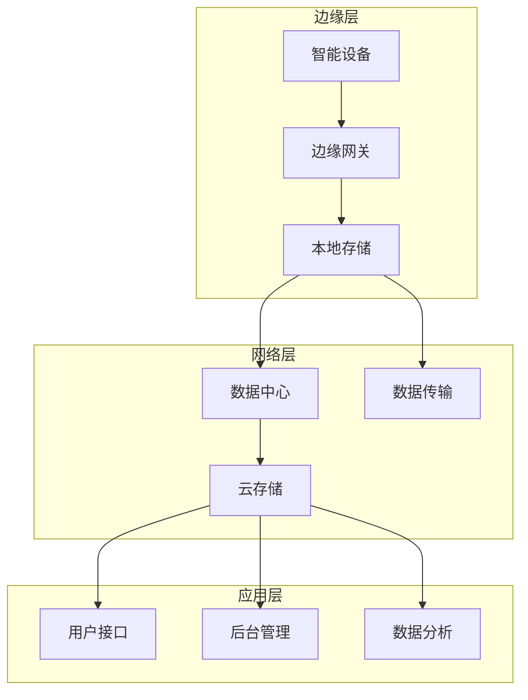
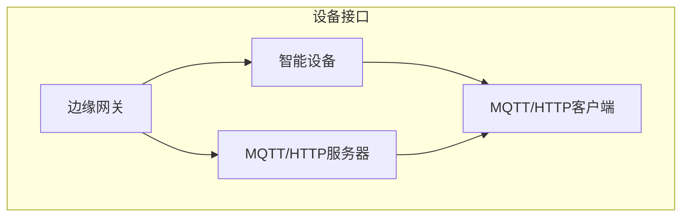
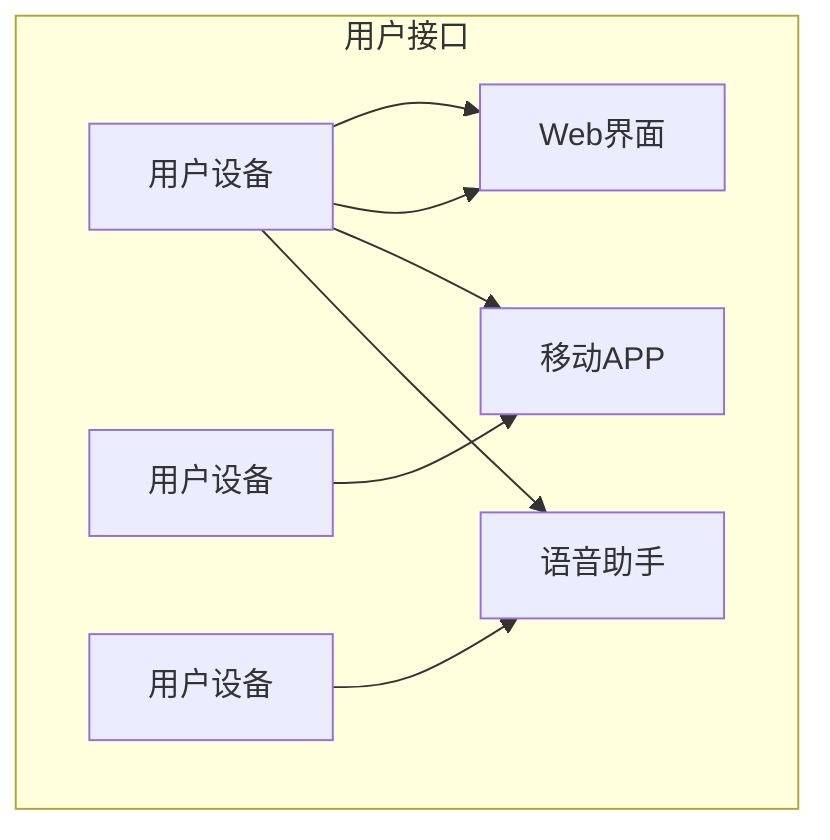
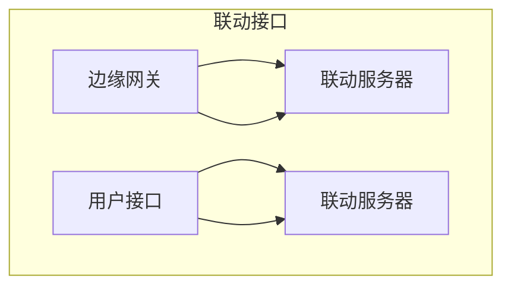

                 

# AI在智能家居设备协同控制与场景联动中的应用

> 关键词：智能家居，协同控制，场景联动，AI，机器学习，深度学习，强化学习

> 摘要：本文旨在探讨AI在智能家居设备协同控制与场景联动中的应用。首先，文章将概述智能家居设备协同控制与场景联动的背景、问题及其现有解决方案的局限性。随后，我们将深入分析AI在智能家居中的核心应用，包括机器学习、深度学习和强化学习。接着，文章将介绍场景识别与理解的技术，包括视觉感知、声音感知和自然语言处理。然后，我们将通过具体案例分析AI在智能家居系统中的实际应用。最后，文章将总结最佳实践，提出注意事项和拓展阅读，为读者提供全面的指导。

### 目录大纲

----------------------------------------------------------------

## 第一部分: 背景介绍

### 第1章: 智能家居设备协同控制与场景联动概述

### 1.1 问题背景

#### 1.1.1 智能家居的兴起与发展

#### 1.1.2 智能家居设备协同控制的需求

#### 1.1.3 场景联动的重要性

### 1.2 问题描述

#### 1.2.1 智能家居设备协同控制的挑战

#### 1.2.2 场景联动的实现难点

#### 1.2.3 现有解决方案的局限性

### 1.3 问题解决

#### 1.3.1 AI在智能家居设备协同控制中的应用

#### 1.3.2 AI在场景联动中的关键技术

#### 1.3.3 边界与外延

### 1.4 核心概念与联系

#### 1.4.1 智能家居设备协同控制的核心概念

#### 1.4.2 AI在场景联动中的核心概念

### 1.5 本章小结

...

----------------------------------------------------------------

## 第二部分: AI在智能家居设备协同控制中的应用

### 第2章: AI基础理论

### 第3章: AI在智能家居设备协同控制中的应用

### 第4章: 案例分析

### 第5章: 最佳实践

## 第五部分: 拓展阅读与总结

### 第6章: 注意事项

### 第7章: 拓展阅读

### 第8章: 小结

----------------------------------------------------------------

## 第一部分: 背景介绍

### 第1章: 智能家居设备协同控制与场景联动概述

在当今快速发展的数字化时代，智能家居已经成为人们生活中不可或缺的一部分。智能家居设备协同控制与场景联动作为智能家居的核心技术，正日益受到广泛关注。本章将详细介绍智能家居设备协同控制与场景联动的背景、问题及其现有解决方案的局限性，并阐述AI在这两方面的应用前景。

#### 1.1 问题背景

1. **智能家居的兴起与发展**

随着物联网（IoT）技术的迅猛发展，智能家居市场迎来了爆发式增长。各类智能设备如智能灯泡、智能插座、智能门锁等逐渐走进千家万户。智能家居不仅提升了人们的居住舒适度，还带来了巨大的商业机遇。然而，如何让这些设备高效协同工作，实现真正的智能化，成为了亟待解决的问题。

2. **智能家居设备协同控制的需求**

智能家居设备协同控制的需求主要源于以下几个方面：

- **提高用户体验**：用户希望智能家居系统能够根据其生活习惯和需求，自动调整设备状态，提供个性化的服务。
- **节能环保**：通过设备之间的协同工作，可以实现对能源的优化使用，降低能耗，实现可持续发展。
- **安全性提升**：智能家居设备协同控制能够提高家庭安全性，如智能安防系统、远程监控等。

3. **场景联动的重要性**

场景联动是指通过智能设备之间的交互，根据用户的行为或环境变化，自动触发一系列设备的操作，以实现特定的功能或目标。例如，当用户回家时，系统可以自动开启灯光、调节温度，关闭窗帘等。场景联动不仅提升了用户的便利性，还有助于提高设备的使用效率和系统的可靠性。

#### 1.2 问题描述

1. **智能家居设备协同控制的挑战**

- **异构设备之间的兼容性问题**：智能家居设备通常来自不同的制造商，使用不同的通信协议和标准，这使得设备之间的协同控制变得复杂。
- **实时性要求高**：智能家居设备需要快速响应用户的操作，实现设备的实时控制，这对于系统的实时性能提出了较高的要求。
- **数据安全性问题**：智能家居设备涉及到用户隐私数据，如家庭布局、生活习惯等，因此数据安全性是协同控制系统中必须解决的问题。

2. **场景联动的实现难点**

- **识别与理解用户的意图**：场景联动需要准确地识别和理解用户的意图，这涉及到自然语言处理、计算机视觉等技术。
- **跨设备的协同操作**：场景联动通常涉及多个设备的协同工作，需要解决设备之间的通信和协调问题。
- **适应性和灵活性**：场景联动系统需要能够适应不同的用户需求和场景变化，具备良好的灵活性和适应性。

3. **现有解决方案的局限性**

- **中心化控制**：现有许多智能家居系统采用中心化控制方式，依赖一个主控制器来协调各个设备，这可能导致系统的单点故障和扩展性差。
- **规则驱动**：许多场景联动系统依赖于预先定义的规则，用户无法自定义复杂的场景，限制了系统的灵活性和用户参与度。
- **数据孤岛**：不同设备之间的数据难以共享和整合，导致设备之间的协同性差，用户体验不佳。

#### 1.3 问题解决

1. **AI在智能家居设备协同控制中的应用**

- **边缘计算**：通过在设备端部署AI模型，实现设备的本地计算和协同控制，降低对中心化控制系统的依赖。
- **协议标准化**：推动智能家居设备的协议标准化，提高设备之间的兼容性。
- **安全机制**：引入加密算法和身份认证机制，保障数据传输的安全性。

2. **AI在场景联动中的关键技术**

- **机器学习**：通过机器学习算法，对用户行为和场景进行建模，实现智能识别和理解。
- **深度学习**：利用深度学习模型，对复杂的多模态数据进行处理和分析，提高场景识别的准确性。
- **强化学习**：通过强化学习算法，训练系统在不同场景下做出最优决策，实现自适应的场景联动。

3. **边界与外延**

- **智能家居设备协同控制**：未来智能家居设备将更加智能化、协同化，实现真正的智能家庭生态。
- **场景联动**：场景联动将更加灵活、个性化，适应不同的用户需求和场景变化。

#### 1.4 核心概念与联系

1. **智能家居设备协同控制的核心概念**

- **智能家居设备**：具有网络连接能力，可以远程控制或自动响应的家电或家居产品。
- **协同控制**：通过算法和通信技术，实现智能家居设备之间的协调工作，以提供更好的用户体验。
- **场景联动**：根据用户的行为或环境变化，自动触发一系列设备的操作，实现特定的功能或目标。

2. **AI在场景联动中的核心概念**

- **机器学习**：通过从数据中学习规律，实现智能识别和预测。
- **深度学习**：利用神经网络模型，对复杂的数据进行建模和分析。
- **强化学习**：通过试错和奖励机制，实现智能决策和优化。

#### 1.5 本章小结

智能家居设备协同控制与场景联动作为智能家居技术的核心，面临着诸多挑战。然而，随着AI技术的不断发展，这些问题将逐步得到解决。通过边缘计算、协议标准化和AI关键技术的应用，智能家居设备将实现更好的协同控制和场景联动，为用户提供更加智能、便捷的家居体验。

在接下来的章节中，我们将深入探讨AI在智能家居设备协同控制与场景联动中的应用，分析相关技术原理，并通过具体案例展示其实际应用效果。让我们一起走进AI在智能家居中的奇妙世界！

## 1.1 智能家居的兴起与发展

智能家居（Smart Home）是一种通过互联网、物联网、人工智能等技术将家庭设备连接起来，实现设备之间的互联互通和智能控制的生活方式。近年来，随着技术的不断进步和人们生活水平的提升，智能家居市场呈现出爆发式增长。

### 1.1.1 技术背景

1. **物联网（IoT）**：物联网是智能家居发展的基础，它通过将各种物理设备连接到互联网上，实现数据的实时传输和远程控制。物联网技术的成熟为智能家居设备之间的通信和协同控制提供了可能。

2. **人工智能（AI）**：人工智能技术为智能家居提供了智能决策和自主学习能力。通过机器学习、深度学习和强化学习等算法，智能家居设备可以自动识别用户行为、预测需求并做出相应调整。

3. **5G通信技术**：5G技术的快速发展为智能家居设备提供了高速、稳定的网络连接，大大提升了设备的响应速度和用户体验。

### 1.1.2 发展历程

1. **2000年代初期**：智能家居概念初步提出，主要应用在高端住宅和商用场所。

2. **2010年代**：随着物联网和人工智能技术的发展，智能家居设备逐渐普及，智能家居市场开始快速发展。

3. **2020年代**：智能家居市场进入成熟期，各类智能设备不断涌现，智能家居生态系统逐渐完善。

### 1.1.3 当前市场状况

1. **设备种类丰富**：当前市场上已有多种智能家居设备，包括智能照明、智能安防、智能家电、智能环境控制等。

2. **平台化发展**：智能家居设备逐步实现平台化，通过统一的标准和协议，不同设备之间可以无缝连接和协同工作。

3. **用户体验优化**：随着技术的进步，智能家居设备在用户体验方面不断优化，用户可以通过手机APP、语音助手等多种方式控制设备，实现更加便捷的智能生活。

### 1.1.4 发展趋势

1. **更加智能化**：智能家居设备将不断集成AI技术，实现更高级的智能决策和自主学习能力。

2. **生态融合**：智能家居将与其他生态系统（如智能城市、智能交通等）融合，实现更大范围的数据共享和协同工作。

3. **个性化和定制化**：智能家居设备将根据用户的需求和习惯进行个性化定制，提供更加精准和高效的服务。

通过以上分析，我们可以看到智能家居技术已经从概念阶段逐步走向成熟，并在人们的日常生活中发挥着越来越重要的作用。随着AI技术的不断进步，智能家居设备将实现更高的智能化水平，为用户带来更加智能、便捷的家居体验。

## 1.2 智能家居设备协同控制的需求

智能家居设备协同控制是智能家居系统实现智能化和高效运行的核心。随着智能家居设备的多样化和发展，协同控制的需求日益凸显，主要体现在以下几个方面：

### 1.2.1 提高用户体验

用户希望智能家居系统能够自动识别并响应其需求，提供个性化的服务。例如，当用户回家时，系统可以自动开启灯光、调节温度和音乐，关闭窗帘等。这种协同控制能够显著提升用户的舒适度和便利性，使智能家居系统真正成为用户的助手。

### 1.2.2 节能环保

智能家居设备协同控制可以通过优化设备的运行状态，实现能源的节约和高效使用。例如，智能照明系统可以根据室内的光照强度自动调节灯光亮度，智能空调可以根据室内外温度差自动调节温度，从而降低能耗。这种协同控制不仅有助于环境保护，还可以为用户节省能源费用。

### 1.2.3 提高安全性

智能家居设备协同控制可以提高家庭的安全性。例如，通过智能安防系统，当有异常情况发生时，系统可以自动触发警报并通知用户。此外，智能监控设备可以实时监控家庭环境，帮助用户及时发现安全隐患。这种协同控制能够显著提升家庭的安全防护能力。

### 1.2.4 适应多样化的场景

智能家居设备协同控制可以适应多样化的生活场景。例如，当用户外出时，系统可以自动调整设备状态，进入节能模式或安防模式；当用户在家休息时，系统可以调整氛围灯光和音乐，营造舒适的生活环境。这种协同控制使得智能家居系统能够灵活适应不同的生活需求，为用户提供更加丰富和个性化的智能体验。

### 1.2.5 提升设备使用效率

智能家居设备协同控制可以提升设备的使用效率。例如，智能家电可以通过协同控制实现自动化操作，减少用户手动操作的频率和复杂度。此外，设备之间的协同工作可以优化整个智能家居系统的运行效率，使系统能够更好地满足用户的需求。

综上所述，智能家居设备协同控制的需求涵盖了用户体验、节能环保、安全性、多样化场景适应和设备使用效率等多个方面。通过协同控制，智能家居系统能够实现更高的智能化水平，为用户带来更加便捷、舒适和安全的家居生活。

### 1.3 场景联动的重要性

场景联动在智能家居系统中扮演着至关重要的角色，它通过智能设备之间的协同工作，实现了自动化、个性化的家居体验，从而大大提升了用户的便利性和满意度。以下是场景联动在智能家居系统中的重要性分析：

### 1.3.1 自动化操作

场景联动允许系统根据特定的触发事件自动执行一系列操作，无需用户手动干预。例如，当用户回家时，系统可以自动打开门锁、点亮灯光、调整空调温度等。这种自动化操作不仅节省了用户的时间，还减少了手动操作的繁琐，使家居生活更加便捷。

### 1.3.2 提升用户体验

场景联动可以根据用户的日常习惯和偏好，自动调整家居环境，从而提供更加个性化的服务。例如，对于喜欢安静的用户，系统可以自动关闭电视音量、调整灯光亮度，以创造一个舒适的环境。这种个性化的服务显著提升了用户的满意度，增强了用户对智能家居系统的依赖性。

### 1.3.3 节能环保

场景联动可以通过优化设备的运行状态，实现能源的节约和高效使用。例如，当用户离开家时，系统可以自动关闭所有不使用的电器和灯光，从而减少能源消耗。此外，智能环境控制系统可以根据室内外的温度变化，自动调节空调和暖气，实现能源的智能管理。

### 1.3.4 提高安全性

场景联动在提高家居安全性方面具有显著作用。例如，当有异常情况发生时，系统可以自动触发警报并通知用户或相关的安防设备。此外，智能监控设备可以实时监控家庭环境，帮助用户及时发现潜在的安全隐患，从而增强家庭的安全性。

### 1.3.5 适应多样化的生活场景

场景联动可以根据不同的生活场景，自动调整家居设备的状态，以满足用户的不同需求。例如，当用户准备入睡时，系统可以自动调整灯光、音乐和温度，创造一个适合休息的环境。这种适应性使得智能家居系统能够更好地满足用户的多样化需求，提升整体家居生活的质量。

### 1.3.6 增强设备的协同性

场景联动通过智能设备之间的协同工作，实现了设备的无缝连接和高效运行。这种协同性不仅提升了设备的使用效率，还增强了系统的稳定性和可靠性。通过场景联动，智能家居系统能够更加智能地运作，提供更加流畅和高效的家居体验。

综上所述，场景联动在智能家居系统中具有不可替代的重要作用。通过自动化操作、个性化服务、节能环保、提高安全性和适应多样化生活场景，场景联动不仅提升了用户的便利性和满意度，还显著改善了家居生活的质量。随着技术的不断进步，场景联动将在智能家居系统中发挥更加重要的作用，为用户带来更加智能、舒适和安全的家居生活。

### 1.2 问题描述

在智能家居设备协同控制与场景联动方面，我们面临着诸多挑战。以下是具体的挑战和实现难点：

#### 1.2.1 智能家居设备协同控制的挑战

1. **异构设备之间的兼容性问题**

智能家居设备通常来自不同的制造商，使用不同的通信协议和标准。这种异构性导致了设备之间的兼容性问题，使得协同控制变得复杂。解决这一问题的方法包括推动智能家居设备协议的标准化，或者开发统一的中间件层来实现设备间的通信和协同。

2. **实时性要求高**

智能家居设备需要快速响应用户的操作，实现设备的实时控制。例如，用户按下开关时，系统需要在毫秒级别内完成设备状态的切换。这要求系统具备高实时性和低延迟的性能，以满足用户的期望。

3. **数据安全性问题**

智能家居设备涉及到用户的隐私数据，如家庭布局、生活习惯等。因此，保障数据传输的安全性是协同控制系统中必须解决的问题。常用的安全措施包括数据加密、身份认证、访问控制等。

#### 1.2.2 场景联动的实现难点

1. **识别与理解用户的意图**

场景联动需要准确地识别和理解用户的意图。例如，用户说“打开灯光”，系统需要判断用户是在要求灯光全亮还是局部亮起，以及亮多亮少。这涉及到自然语言处理和上下文理解技术，需要系统具备较强的语义分析和推理能力。

2. **跨设备的协同操作**

场景联动通常涉及多个设备的协同工作，例如，当用户说“准备好睡觉”，系统需要关闭灯光、降低空调温度、调整音乐等。这要求系统能够高效地协调和管理多个设备，实现无缝的联动操作。

3. **适应性和灵活性**

场景联动系统需要能够适应不同的用户需求和场景变化。这意味着系统需要具备良好的灵活性和适应性，能够根据用户的行为模式和环境变化，动态调整联动策略和操作。

#### 1.2.3 现有解决方案的局限性

1. **中心化控制**

许多现有的智能家居系统采用中心化控制方式，依赖一个主控制器来协调各个设备。这种方式可能导致系统的单点故障和扩展性差，不利于系统的稳定运行和未来扩展。

2. **规则驱动**

许多场景联动系统依赖于预先定义的规则，用户无法自定义复杂的场景。这种限制使得系统灵活性不足，难以满足用户的个性化需求。

3. **数据孤岛**

不同设备之间的数据难以共享和整合，导致设备之间的协同性差。这限制了系统的整体性能和用户体验。

为了解决上述问题，我们需要探索新的解决方案，充分利用AI技术，如边缘计算、机器学习和强化学习等，来实现智能家居设备的高效协同控制和场景联动。接下来，我们将详细介绍这些技术如何应用于智能家居系统。

### 1.3 问题解决

面对智能家居设备协同控制和场景联动中的诸多挑战，人工智能（AI）技术的引入为我们提供了一条可行的解决方案路径。以下是AI技术在这些领域中的应用及其带来的创新和变革：

#### 1.3.1 AI在智能家居设备协同控制中的应用

1. **边缘计算**：边缘计算将计算和存储能力下沉到设备端，从而减少对中心化控制系统的依赖。通过在设备端部署AI模型，可以实现设备的本地计算和协同控制。这不仅提高了系统的实时性能和响应速度，还降低了网络带宽的消耗。例如，智能门锁可以在本地处理用户指纹或面部识别数据，实现快速开锁，同时减少对中心服务器的依赖。

2. **协议标准化**：AI技术可以帮助推动智能家居设备的协议标准化。通过使用机器学习算法，可以识别和分析不同设备之间的通信模式，发现并填补标准协议中的空白。这种协议标准化不仅提高了设备之间的兼容性，还为未来的技术升级提供了基础。

3. **安全机制**：AI技术可以在数据传输过程中提供更加完善的安全保障。例如，通过深度学习模型，可以对网络流量进行分析，识别并阻止潜在的安全威胁。此外，AI技术还可以实现加密算法的优化，提高数据传输的安全性。

#### 1.3.2 AI在场景联动中的关键技术

1. **机器学习**：机器学习技术可以帮助系统从大量数据中学习用户的习惯和行为模式，从而实现智能识别和预测。例如，通过分析用户的历史操作数据，系统可以预测用户未来的需求，并提前调整设备状态，提供个性化的服务。

2. **深度学习**：深度学习是一种强大的机器学习技术，它通过模拟人脑神经网络结构，对复杂的多模态数据进行处理和分析。在智能家居场景中，深度学习可以用于图像识别、语音识别和自然语言处理等领域，从而实现更准确的场景识别和联动操作。

3. **强化学习**：强化学习是一种通过试错和奖励机制进行决策优化的技术。在智能家居系统中，强化学习可以用于训练系统在不同场景下做出最优决策，实现自适应的场景联动。例如，系统可以学习如何根据用户的作息习惯，自动调整灯光、温度和音乐等，以提高用户的生活质量。

#### 1.3.3 边界与外延

1. **智能家居设备协同控制**：随着AI技术的不断进步，智能家居设备将实现更高的智能化水平，实现更复杂的协同控制。未来的智能家居系统可能会具备自主学习和进化能力，根据用户行为和环境变化，自适应地调整设备状态。

2. **场景联动**：场景联动技术将在智能家居系统中发挥越来越重要的作用。通过AI技术的应用，场景联动将更加灵活、智能和个性化。未来的智能家居系统可能会实现更高级的智能交互，例如通过自然语言处理，用户可以与系统进行更自然的对话，实现更加智能的场景联动。

3. **多领域融合**：智能家居系统将与其他领域（如智能城市、智能交通等）融合，实现更大范围的数据共享和协同工作。这种跨领域融合将带来更多的应用场景和商业模式，推动智能家居技术的不断创新和发展。

综上所述，AI技术在智能家居设备协同控制与场景联动中的应用，为我们提供了一条解决复杂问题的有效途径。通过边缘计算、协议标准化、机器学习、深度学习和强化学习等技术的结合，智能家居系统将实现更高的智能化水平，为用户带来更加便捷、舒适和安全的家居生活。

### 1.4 核心概念与联系

在深入探讨AI在智能家居设备协同控制与场景联动中的应用之前，我们需要明确一些核心概念，并了解它们之间的联系。以下是智能家居设备协同控制与场景联动中的关键概念及其相互关系：

#### 1.4.1 智能家居设备协同控制的核心概念

1. **智能家居设备**：智能家居设备是指通过互联网或本地网络连接，能够实现远程控制、自动化操作和智能交互的家电或家居产品。这些设备包括智能灯泡、智能插座、智能门锁、智能空调、智能摄像头等。

2. **协同控制**：协同控制是指通过算法和通信技术，实现智能家居设备之间的协调工作，以提供更好的用户体验。协同控制的核心目标是实现设备之间的无缝连接和高效协同，从而提升系统的整体性能和用户体验。

3. **场景联动**：场景联动是指根据用户的行为或环境变化，自动触发一系列设备的操作，以实现特定的功能或目标。场景联动通常涉及到多个设备的协同工作，例如，当用户进入家中时，系统可以自动开启灯光、空调，关闭窗帘等。

#### 1.4.2 AI在场景联动中的核心概念

1. **机器学习**：机器学习是一种通过从数据中学习规律，实现智能识别和预测的技术。在智能家居场景中，机器学习可以用于用户行为分析、设备状态预测和场景识别等。

2. **深度学习**：深度学习是机器学习的一种重要分支，通过模拟人脑神经网络结构，对复杂的数据进行建模和分析。在智能家居场景中，深度学习可以用于图像识别、语音识别和自然语言处理等领域，从而实现更准确的场景识别和联动操作。

3. **强化学习**：强化学习是一种通过试错和奖励机制进行决策优化的技术。在智能家居系统中，强化学习可以用于训练系统在不同场景下做出最优决策，实现自适应的场景联动。

#### 1.4.3 概念联系

1. **智能家居设备与协同控制**：智能家居设备是实现协同控制的基础。通过互联网或本地网络连接，设备可以实现远程控制、数据共享和协同工作。协同控制的目标是提升设备的整体性能和用户体验，实现设备之间的无缝连接和高效运作。

2. **协同控制与场景联动**：协同控制是场景联动的前提和保障。通过协同控制，设备可以实现实时数据共享和协同工作，为场景联动提供基础。场景联动则是协同控制的具体应用，通过自动触发设备的操作，实现个性化的服务和体验。

3. **AI与场景联动**：AI技术是场景联动的重要驱动力量。通过机器学习、深度学习和强化学习等技术，系统可以自动识别和理解用户的意图，实现智能的场景联动。AI技术的引入，使得场景联动更加灵活、智能和个性化，提升了系统的整体性能和用户体验。

综上所述，智能家居设备、协同控制和场景联动是智能家居系统中的核心概念。通过AI技术的应用，这些概念相互联系、相互促进，共同构建了一个高效、智能和个性化的智能家居生态系统。

### 1.4.1 智能家居设备协同控制的核心概念

在探讨智能家居设备协同控制时，我们首先需要明确几个核心概念：智能家居设备、协同控制以及场景联动。

#### 1.4.1.1 智能家居设备

智能家居设备是指具备网络连接能力、能够实现自动化控制且具有互动功能的家电或家居产品。这些设备可以通过互联网、Wi-Fi、蓝牙等通信协议实现远程控制，部分设备还可以通过智能语音助手如Amazon Alexa、Google Assistant等进行语音控制。常见的智能家居设备包括：

- **智能灯泡**：可以通过手机APP或语音助手远程控制开关、亮度和色温。
- **智能插座**：能够远程控制电器的开关，部分支持定时开关功能。
- **智能门锁**：支持指纹、密码、手机APP等多种开锁方式，提升家庭安全性。
- **智能空调**：通过智能算法自动调节温度和湿度，提供舒适的生活环境。
- **智能摄像头**：具备实时监控、录像和报警功能，提高家庭安全。
- **智能窗帘**：可以通过定时或远程控制，实现自动开关。

智能家居设备的核心特点是网络连接和自动化控制。它们通过物联网（IoT）技术实现设备之间的互联互通，使得家庭生活更加便捷和智能化。

#### 1.4.1.2 协同控制

协同控制是指通过算法和通信技术，实现智能家居设备之间的协调工作，以提供更好的用户体验。协同控制的目的是最大化设备之间的交互和配合，使系统能够自动响应用户的指令，提升整体智能化水平。

协同控制的关键点包括：

- **设备兼容性**：不同制造商的设备需要具备一定的兼容性，支持统一的通信协议和标准。
- **实时性**：智能家居设备需要快速响应用户的操作，实现设备的实时控制。
- **数据共享**：设备之间需要能够实时共享数据，以便实现协同操作。
- **决策算法**：通过智能算法，设备可以自动调整状态，优化系统性能。

协同控制的应用场景包括：

- **自动化场景**：例如，用户回家时，智能灯泡自动开启，空调调节到舒适温度。
- **个性化服务**：根据用户习惯和偏好，自动调整设备状态，提供个性化的服务。
- **节能环保**：通过设备之间的协同工作，实现能源的优化使用。

#### 1.4.1.3 场景联动

场景联动是指根据用户的行为或环境变化，自动触发一系列设备的操作，以实现特定的功能或目标。场景联动是通过智能算法和用户行为数据来实现的，它能够为用户提供更加智能化和个性化的体验。

场景联动的关键点包括：

- **场景识别**：系统需要能够识别不同的生活场景，如回家、休息、外出等。
- **联动策略**：根据不同的场景，系统需要自动触发一系列设备操作，如灯光调整、温度调节等。
- **适应性**：系统需要能够适应不同的用户需求和环境变化，提供灵活的联动方案。

场景联动的应用场景包括：

- **智能安防**：例如，当有异常入侵时，系统可以自动触发报警、摄像头录制等操作。
- **智能节能**：例如，当用户离开家时，系统可以自动关闭所有电器和灯光，实现节能。
- **智能舒适**：例如，用户准备入睡时，系统可以自动调节灯光、温度和音乐，创造舒适的休息环境。

通过智能家居设备、协同控制和场景联动的有机结合，我们可以构建一个高效、智能和个性化的智能家居生态系统，为用户带来更加便捷、舒适和安全的家居生活。

### 1.4.2 AI在场景联动中的核心概念

在智能家居场景联动中，人工智能（AI）技术的应用至关重要。以下是AI在场景联动中的核心概念，包括机器学习、深度学习和强化学习，以及它们在场景联动中的应用。

#### 1.4.2.1 机器学习

机器学习（Machine Learning）是一种通过算法使计算机从数据中学习规律、做出预测的技术。在场景联动中，机器学习可以用于以下几个方面：

- **用户行为分析**：通过分析用户的历史行为数据，机器学习算法可以识别用户的日常习惯，如作息时间、活动模式等。这有助于系统根据用户习惯自动调整设备状态。
- **设备状态预测**：基于历史数据，机器学习算法可以预测设备的未来状态，例如，预测空调何时需要调整温度。这有助于系统提前做出响应，提高用户体验。
- **场景识别**：通过分析环境数据和用户操作，机器学习算法可以识别当前的生活场景，如用户是否在家、是否在休息等。这为后续的联动操作提供了依据。

常用的机器学习算法包括决策树、支持向量机（SVM）、神经网络和集成学习方法（如随机森林、梯度提升树等）。在场景联动中，这些算法通常用于分类、回归和聚类任务。

#### 1.4.2.2 深度学习

深度学习（Deep Learning）是机器学习的一个重要分支，通过模拟人脑神经网络结构，对复杂的数据进行建模和分析。在场景联动中，深度学习可以应用于以下几个方面：

- **图像识别**：通过卷积神经网络（CNN），深度学习可以识别和分析图像数据，例如，识别用户的动作或家居环境变化。
- **语音识别**：通过循环神经网络（RNN）和长短时记忆网络（LSTM），深度学习可以解析用户的语音指令，实现自然语言处理（NLP）。
- **语音合成**：通过生成对抗网络（GAN）和变分自编码器（VAE），深度学习可以生成自然流畅的语音回复。

深度学习的应用使得场景联动更加智能化和个性化。例如，智能音箱可以通过深度学习算法理解用户的语音指令，并根据用户的历史偏好提供个性化的音乐推荐。

#### 1.4.2.3 强化学习

强化学习（Reinforcement Learning）是一种通过试错和奖励机制进行决策优化的技术。在场景联动中，强化学习可以用于以下几个方面：

- **决策优化**：通过不断尝试和评估，强化学习算法可以找到最优的决策策略。例如，系统可以通过强化学习算法自动调整灯光和音乐的强度，以实现最佳的舒适度。
- **自适应场景联动**：强化学习算法可以根据用户的反馈和行为变化，自适应地调整联动策略。例如，系统可以学习用户在特定时间段的偏好，自动调整设备状态。
- **交互式学习**：通过用户与系统的互动，强化学习算法可以不断改进和优化自身的决策能力。例如，智能安防系统可以通过强化学习算法，根据用户的反馈不断调整报警阈值，提高系统的准确性。

强化学习在场景联动中的应用，使得系统能够更加智能地适应用户需求和环境变化，提供更高质量的个性化服务。

#### 1.4.2.4 概念联系

机器学习、深度学习和强化学习在场景联动中共同作用，相互补充，构成了一个强大的技术体系。

- **机器学习**为场景联动提供了基础的数据分析和预测能力，通过识别用户行为和设备状态，实现初步的智能联动。
- **深度学习**通过处理复杂的多模态数据（如图像、语音等），提高了场景识别的准确性和联动操作的智能化水平。
- **强化学习**通过试错和奖励机制，不断优化系统的决策策略，实现高度个性化的场景联动。

这些AI技术的结合，使得场景联动更加智能化、自适应和个性化，为用户带来了更加便捷、舒适和安全的家居生活。

### 1.5 本章小结

本章首先介绍了智能家居设备协同控制与场景联动的背景和发展现状，随后阐述了在实现智能家居设备协同控制与场景联动过程中所面临的挑战，包括异构设备兼容性问题、实时性要求和数据安全性问题等。通过分析这些挑战，我们提出了利用AI技术（如边缘计算、协议标准化和AI安全机制）来解决这些问题的思路。接着，我们详细介绍了AI在场景联动中的核心技术，包括机器学习、深度学习和强化学习，并探讨了它们在场景联动中的应用。最后，我们总结了智能家居设备协同控制与场景联动中的核心概念及其相互联系，为后续章节的深入探讨奠定了基础。

在接下来的章节中，我们将进一步探讨AI在智能家居设备协同控制与场景联动中的应用，分析相关技术原理，并通过具体案例展示其实际应用效果。让我们继续深入探讨，了解AI技术如何为智能家居带来革命性的变革。

### 第二部分: AI在智能家居设备协同控制中的应用

在智能家居设备协同控制中，AI技术的应用能够显著提升系统的智能化水平，实现设备之间的无缝协作。本部分将详细介绍AI在智能家居设备协同控制中的应用，包括机器学习、深度学习和强化学习等技术的具体应用。

#### 2.1 AI概述

人工智能（AI）是一种模拟人类智能行为的计算机技术。通过算法和模型的训练，AI系统能够在特定任务上表现出与人类相似或超越人类的能力。AI技术主要包括机器学习、深度学习和强化学习等。

- **机器学习**：通过从数据中学习规律，实现智能识别和预测。
- **深度学习**：利用神经网络结构，对复杂的数据进行建模和分析。
- **强化学习**：通过试错和奖励机制，实现智能决策和优化。

#### 2.2 机器学习基础

机器学习是一种通过算法使计算机从数据中学习规律的技术。在智能家居设备协同控制中，机器学习可以用于用户行为分析、设备状态预测和场景识别等。

1. **基本概念**

- **监督学习**：通过训练数据，模型学习输入和输出之间的映射关系。例如，通过用户历史数据，模型可以预测用户的下一步操作。
- **无监督学习**：模型在没有明确标签的情况下，从数据中学习规律。例如，通过设备数据，模型可以识别设备的运行状态。
- **半监督学习**：结合监督学习和无监督学习，模型在少量标签数据和大量无标签数据之间进行学习。

2. **常用算法**

- **决策树**：通过树形结构，对特征进行划分，实现分类或回归任务。
- **支持向量机（SVM）**：通过最大化分类边界，实现分类任务。
- **神经网络**：通过多层神经网络，对数据进行非线性变换，实现复杂函数的建模。
- **集成方法**：通过集成多个模型，提高预测准确性和稳定性。

#### 2.3 深度学习原理

深度学习是机器学习的一个重要分支，通过多层神经网络对数据进行建模和分析。在智能家居设备协同控制中，深度学习可以应用于图像识别、语音识别和自然语言处理等。

1. **神经网络结构**

- **卷积神经网络（CNN）**：通过卷积层、池化层和全连接层，实现图像数据的特征提取和分类。
- **循环神经网络（RNN）**：通过循环结构，处理序列数据，如时间序列和语音信号。
- **长短时记忆网络（LSTM）**：通过门控机制，解决RNN的梯度消失问题，更好地处理长序列数据。

2. **深度学习模型**

- **生成对抗网络（GAN）**：通过生成器和判别器的对抗训练，实现数据的生成和分类。
- **变分自编码器（VAE）**：通过编码和解码器，实现数据的降维和生成。

3. **应用实例**

- **图像识别**：通过CNN模型，识别家居环境中的物体和动作。
- **语音识别**：通过RNN和LSTM模型，解析用户的语音指令，实现自然语言处理。
- **自然语言处理**：通过深度学习模型，实现文本分类、情感分析等。

#### 2.4 强化学习基础

强化学习（Reinforcement Learning）是一种通过试错和奖励机制进行智能决策的技术。在智能家居设备协同控制中，强化学习可以用于优化设备状态、自适应场景联动等。

1. **基本概念**

- **状态（State）**：系统当前的状态描述，如设备的状态、用户的动作等。
- **动作（Action）**：系统可执行的动作，如设备开关、调整温度等。
- **奖励（Reward）**：系统执行动作后的奖励或惩罚，用于评估动作的效果。
- **策略（Policy）**：系统根据当前状态选择最优动作的规则。

2. **常用算法**

- **Q-Learning**：通过评估未来奖励，更新策略，实现最优动作选择。
- **Deep Q-Network（DQN）**：结合深度学习和Q-Learning，实现复杂环境的智能决策。
- **Policy Gradient**：通过梯度下降方法，优化策略参数，实现智能决策。

3. **应用实例**

- **设备状态优化**：通过强化学习，自动调整设备状态，实现最优能源消耗和设备寿命。
- **自适应场景联动**：通过强化学习，根据用户反馈和环境变化，动态调整联动策略，实现个性化服务。

#### 2.5 算法应用与挑战

1. **算法应用**

- **设备预测**：利用机器学习算法，预测设备未来的状态和需求，提前做出响应。
- **场景识别**：利用深度学习算法，识别家居环境中的场景和物体，实现智能联动。
- **决策优化**：利用强化学习算法，优化系统的决策策略，实现自适应和个性化的服务。

2. **挑战**

- **数据质量**：高质量的数据是AI算法有效运行的基础，数据质量直接影响算法的性能。
- **计算资源**：深度学习和强化学习算法通常需要大量计算资源，对设备性能和功耗提出了较高要求。
- **实时性**：智能家居系统要求快速响应用户操作，实现设备的实时控制。

#### 2.6 AI在智能家居设备协同控制中的应用前景

随着AI技术的不断发展，其在智能家居设备协同控制中的应用前景十分广阔。未来，AI技术将在以下方面发挥重要作用：

- **个性化服务**：通过机器学习和深度学习，实现更加个性化的家居体验。
- **节能环保**：通过强化学习和设备预测，实现能源的优化使用和设备寿命的延长。
- **智能安防**：通过图像识别和自然语言处理，提升家庭安全性。
- **跨领域融合**：智能家居系统将与其他领域（如智能城市、智能交通等）融合，实现更大范围的数据共享和协同工作。

总之，AI技术将为智能家居设备协同控制带来革命性的变革，实现更加智能化、便捷化和个性化的家居生活。

### 2.1 AI概述

人工智能（AI）作为当代计算机科学的重要分支，正迅速改变着我们的生活方式。在本节中，我们将详细探讨AI的定义、发展历程及其在智能家居设备协同控制中的应用。

#### 2.1.1 AI的定义与发展历程

1. **AI的定义**

人工智能是指使计算机模拟人类智能行为的能力，包括感知、理解、推理、学习、决策等。AI的目标是使计算机能够像人类一样思考、学习和解决问题。

2. **发展历程**

- **20世纪50年代**：AI的概念首次被提出，人工智能研究开始起步。
- **20世纪60年代**：早期的AI研究主要集中在逻辑推理和符号计算，但受限于计算机性能，进展缓慢。
- **20世纪80年代**：专家系统（Expert Systems）得到广泛应用，通过模拟专家知识，解决特定领域的问题。
- **20世纪90年代**：机器学习逐渐兴起，通过从数据中学习规律，实现更广泛的智能应用。
- **21世纪**：随着深度学习和大数据技术的快速发展，AI取得了突破性进展，应用领域不断扩展。

#### 2.1.2 AI的关键技术

AI技术主要包括机器学习、深度学习和强化学习等。

1. **机器学习**

机器学习是一种通过算法使计算机从数据中学习规律的技术。机器学习可以用于分类、回归、聚类等任务。常见的机器学习算法包括决策树、支持向量机、神经网络等。

2. **深度学习**

深度学习是机器学习的一个重要分支，通过多层神经网络对数据进行建模和分析。深度学习在图像识别、语音识别、自然语言处理等领域取得了显著成果。常见的深度学习模型包括卷积神经网络（CNN）、循环神经网络（RNN）等。

3. **强化学习**

强化学习是一种通过试错和奖励机制进行智能决策的技术。强化学习适用于动态环境，通过不断尝试和优化，实现最优策略。常见的强化学习算法包括Q-Learning、深度Q网络（DQN）等。

#### 2.1.3 AI的发展趋势

1. **泛化能力增强**

未来的AI技术将更加注重泛化能力，使系统能够在更广泛的应用场景中表现优异。

2. **跨领域融合**

AI技术将与其他领域（如物联网、生物科技、金融等）融合，实现更大的商业价值和社会影响。

3. **智能化水平提升**

随着算法和硬件的进步，AI的智能化水平将不断提升，实现更加智能、个性化的服务。

#### 2.1.4 AI在智能家居设备协同控制中的应用

在智能家居设备协同控制中，AI技术的应用极大地提升了系统的智能化和便捷性。以下是AI在智能家居设备协同控制中的应用：

1. **设备状态预测**

通过机器学习和深度学习算法，智能家居系统能够预测设备的未来状态和需求，提前做出响应，如调整空调温度、开启照明等。

2. **场景识别**

通过深度学习模型，智能家居系统能够识别家居环境中的不同场景，如用户在家的状态、休息状态等，实现相应的联动操作。

3. **自适应控制**

通过强化学习算法，智能家居系统能够根据用户的行为和环境变化，自适应地调整设备状态，提供个性化的服务。

4. **节能优化**

AI技术可以优化设备的运行状态，实现能源的节约和高效使用，如自动关闭不使用的电器和灯光，调整空调和暖气等。

5. **智能交互**

通过自然语言处理技术，智能家居系统能够理解用户的语音指令，实现更加智能的交互体验。

总之，AI技术在智能家居设备协同控制中的应用，为用户带来了更加智能化、便捷化和个性化的家居体验，推动了智能家居技术的发展。

### 2.2 机器学习基础

机器学习（Machine Learning，ML）是人工智能（AI）的核心技术之一，它使计算机能够通过数据学习并做出预测或决策。在智能家居设备协同控制中，机器学习技术被广泛应用于用户行为分析、设备状态预测和场景识别等领域。以下是机器学习的基本概念、分类和常用算法。

#### 2.2.1 机器学习的基本概念

1. **监督学习（Supervised Learning）**

监督学习是指通过训练数据（特征和标签）来训练模型，使其能够对未知数据进行预测。监督学习分为两种类型：

   - **回归（Regression）**：模型的输出是连续值，用于预测数量。例如，预测空调的合适温度。
   - **分类（Classification）**：模型的输出是离散值，用于分类。例如，判断用户是否在家。

2. **无监督学习（Unsupervised Learning）**

无监督学习是指在没有标签数据的情况下，从数据中学习模式。无监督学习分为以下几种类型：

   - **聚类（Clustering）**：将相似的数据分组。例如，将家庭设备根据其功能进行分类。
   - **降维（Dimensionality Reduction）**：减少数据的维度，便于分析。例如，通过主成分分析（PCA）简化设备数据。
   - **关联规则学习（Association Rule Learning）**：发现数据之间的关联关系。例如，分析购买行为以发现常见的商品组合。

3. **半监督学习（Semi-Supervised Learning）**

半监督学习结合了监督学习和无监督学习，利用少量标签数据和大量无标签数据来训练模型。这种方法可以减少标注成本，提高模型的泛化能力。

4. **强化学习（Reinforcement Learning）**

强化学习是一种通过试错和奖励机制进行决策优化的技术。强化学习与监督学习和无监督学习不同，它不是通过数据来训练模型，而是通过与环境的交互来学习最佳策略。

#### 2.2.2 机器学习的分类

1. **基于实例的学习（Instance-Based Learning）**

基于实例的学习（IBL）通过存储和检索训练实例来解决问题。当遇到新问题时，系统查找与该问题最相似的实例，并采用实例的解决方案。例如，使用k-最近邻（k-Nearest Neighbors，k-NN）算法来预测新数据。

2. **基于规则的学习（Rule-Based Learning）**

基于规则的系统使用预定义的规则来解决问题。这些规则通常由领域专家或通过归纳方法从数据中提取。例如，决策树（Decision Tree）和决策规则（如IF-THEN规则）是常见的基于规则的机器学习算法。

3. **概率模型（Probabilistic Models）**

概率模型通过概率分布来描述数据，并利用这些分布进行预测或决策。常见的概率模型包括贝叶斯网络（Bayesian Networks）和隐马尔可夫模型（Hidden Markov Models，HMM）。

4. **统计学习（Statistical Learning）**

统计学习基于统计学方法来估计数据中的未知参数。常见的统计学习方法包括线性回归（Linear Regression）、逻辑回归（Logistic Regression）和支持向量机（Support Vector Machine，SVM）。

5. **深度学习（Deep Learning）**

深度学习是一种基于多层神经网络的机器学习技术。它通过多层非线性变换，从数据中自动提取特征。常见的深度学习模型包括卷积神经网络（CNN）、循环神经网络（RNN）和生成对抗网络（GAN）。

6. **集成学习方法（Ensemble Methods）**

集成学习方法通过结合多个模型的预测来提高预测的准确性和稳定性。常见的集成学习方法包括随机森林（Random Forest）、梯度提升树（Gradient Boosting Trees）和堆叠机（Stacking）。

#### 2.2.3 机器学习的主要算法

以下是几种在智能家居设备协同控制中常用的机器学习算法：

1. **线性回归（Linear Regression）**

线性回归是一种简单的统计学习算法，用于预测连续值。它通过找到特征和目标值之间的线性关系来进行预测。线性回归适用于预测设备的温度、光照强度等。

2. **逻辑回归（Logistic Regression）**

逻辑回归是一种用于分类的统计学习方法，它通过找到特征和类别之间的概率关系来进行分类。逻辑回归常用于设备开关状态的预测。

3. **k-最近邻（k-Nearest Neighbors，k-NN）**

k-NN是一种基于实例的学习算法，它通过找到训练集中与测试样本最相似的k个样本，并采用这些样本的多数类别作为预测结果。k-NN适用于分类和回归问题。

4. **支持向量机（Support Vector Machine，SVM）**

SVM是一种强大的分类算法，它通过找到一个超平面来最大化类别之间的间隔。SVM适用于高维数据的分类问题。

5. **决策树（Decision Tree）**

决策树是一种基于规则的分类算法，它通过一系列if-else规则来对数据进行分类。决策树适用于处理结构化的数据。

6. **随机森林（Random Forest）**

随机森林是一种集成学习方法，它通过构建多个决策树，并对每个树的预测结果进行投票来得到最终预测。随机森林适用于分类和回归问题。

7. **神经网络（Neural Network）**

神经网络是一种基于多层神经元的计算模型，它通过前向传播和反向传播算法来训练模型。神经网络适用于复杂的非线性问题。

8. **长短期记忆网络（Long Short-Term Memory，LSTM）**

LSTM是一种基于循环神经网络的改进模型，它通过引入门控机制来解决长期依赖问题。LSTM适用于处理时间序列数据。

通过上述机器学习算法的应用，智能家居设备协同控制系统可以更准确地预测用户行为、识别场景，并实现设备的智能联动，从而提供更智能、个性化的家居体验。

### 2.3 深度学习原理

深度学习（Deep Learning，DL）是机器学习（Machine Learning，ML）的一个重要分支，通过多层神经网络对数据进行建模和分析。在智能家居设备协同控制中，深度学习技术可以应用于图像识别、语音识别、自然语言处理等多个领域，实现更高级的智能功能。以下是深度学习的定义、神经网络结构、主要算法及其在智能家居中的应用。

#### 2.3.1 深度学习的定义

深度学习是一种基于多层神经网络的学习方法，它通过自动提取数据中的特征，实现对复杂模式的识别和理解。与传统机器学习方法相比，深度学习具有更强的表达能力和自动特征提取能力，能够处理大量高维数据，从而在图像识别、语音识别和自然语言处理等领域取得了显著的成果。

#### 2.3.2 神经网络结构

神经网络（Neural Network，NN）是深度学习的基础，它由大量的神经元（或节点）组成，每个神经元通过权重连接到其他神经元，形成一个层次化的网络结构。神经网络的主要组成部分包括：

1. **输入层（Input Layer）**：接收外部输入数据，如图像像素值、语音信号等。
2. **隐藏层（Hidden Layers）**：对输入数据进行特征提取和变换，通常包含多个隐藏层。
3. **输出层（Output Layer）**：生成最终输出结果，如分类结果、预测值等。

在深度学习中，常见的神经网络结构包括：

1. **全连接神经网络（Fully Connected Neural Network）**：每个神经元都与前一层和后一层的所有神经元相连。全连接神经网络适用于大多数分类和回归问题。
2. **卷积神经网络（Convolutional Neural Network，CNN）**：通过卷积操作和池化操作，从图像数据中提取局部特征。CNN在图像识别和图像处理领域具有广泛应用。
3. **循环神经网络（Recurrent Neural Network，RNN）**：通过循环结构处理序列数据，如时间序列和语音信号。RNN在语音识别、自然语言处理和时间序列预测中具有显著优势。
4. **长短时记忆网络（Long Short-Term Memory，LSTM）**：LSTM是RNN的一种改进，通过引入门控机制解决长期依赖问题。LSTM在处理长序列数据时表现优异。

#### 2.3.3 深度学习的主要算法

深度学习的主要算法包括卷积神经网络（CNN）、循环神经网络（RNN）、长短时记忆网络（LSTM）和生成对抗网络（GAN）等。以下是这些算法的基本原理和应用。

1. **卷积神经网络（CNN）**

CNN通过卷积操作和池化操作，从图像数据中提取局部特征，并通过多个卷积层和池化层逐渐构建全局特征。CNN在图像分类、目标检测和图像生成等领域具有广泛应用。

2. **循环神经网络（RNN）**

RNN通过循环结构处理序列数据，将当前输入与历史信息相结合，实现序列数据的建模。RNN在语音识别、自然语言处理和时间序列预测中具有显著优势。

3. **长短时记忆网络（LSTM）**

LSTM是RNN的一种改进，通过引入门控机制解决长期依赖问题。LSTM在处理长序列数据时表现优异，广泛应用于语音识别、机器翻译和时间序列预测等领域。

4. **生成对抗网络（GAN）**

GAN由生成器和判别器组成，生成器生成虚假数据，判别器判断生成数据与真实数据之间的差异。通过生成器和判别器的对抗训练，GAN可以实现数据的生成和分类。

#### 2.3.4 深度学习在智能家居中的应用

1. **图像识别**：通过CNN，智能家居系统可以识别家居环境中的物体和动作，实现智能监控和安防。

2. **语音识别**：通过RNN和LSTM，智能家居系统可以理解用户的语音指令，实现语音控制。

3. **自然语言处理**：通过深度学习模型，智能家居系统可以处理用户的自然语言输入，实现更加自然的交互。

4. **设备状态预测**：通过深度学习算法，智能家居系统可以预测设备的未来状态，实现智能调度和能源管理。

5. **场景识别**：通过深度学习模型，智能家居系统可以识别家居场景，实现自动调整设备状态。

总之，深度学习技术在智能家居设备协同控制中的应用，使得智能家居系统能够实现更加智能化、便捷化和个性化的功能，为用户带来更好的生活体验。

### 2.4 强化学习基础

强化学习（Reinforcement Learning，RL）是一种通过试错和奖励机制进行智能决策的技术。在智能家居设备协同控制中，强化学习被广泛应用于设备状态优化、自适应场景联动和智能节能等领域。以下是强化学习的基本概念、常用算法及其在智能家居中的应用。

#### 2.4.1 强化学习的定义

强化学习是一种通过互动和反馈，使系统学会在动态环境中做出最优决策的机器学习方法。在强化学习中，系统（Agent）通过执行动作（Action）来获取奖励（Reward），并根据奖励调整策略（Policy）。强化学习的目标是找到一种策略，使得系统在长期运行中获得的奖励最大化。

#### 2.4.2 强化学习的基本概念

1. **状态（State）**：系统当前所处的环境描述，例如，智能家居系统的当前温度、光照强度等。
2. **动作（Action）**：系统可执行的动作，例如，开启空调、调整灯光等。
3. **奖励（Reward）**：系统执行动作后的奖励或惩罚，用于评估动作的效果。例如，系统执行空调开启动作后，如果用户感到舒适，则给予正奖励。
4. **策略（Policy）**：系统根据当前状态选择最优动作的规则，例如，使用温度传感器和用户反馈来决定空调的开启温度。

#### 2.4.3 强化学习的主要算法

1. **Q-Learning**

Q-Learning是一种基于值函数的强化学习算法，通过评估未来奖励来更新策略。Q-Learning的基本思想是学习一个值函数Q(s, a)，表示在状态s下执行动作a的长期奖励。Q-Learning通过迭代更新Q值，逐渐找到最优策略。

2. **深度Q网络（Deep Q-Network，DQN）**

DQN是一种结合深度学习和Q-Learning的强化学习算法。DQN使用深度神经网络来近似值函数Q(s, a)，从而处理高维状态空间。DQN通过经验回放和目标网络（Target Network）来缓解Q值估计中的偏差和抖动。

3. **策略梯度（Policy Gradient）**

策略梯度是一种直接优化策略参数的强化学习算法。策略梯度算法通过梯度上升方法，更新策略参数，使策略能够最大化期望奖励。常见的策略梯度算法包括REINFORCE算法和PPO（Proximal Policy Optimization）算法。

4. **强化学习算法对比**

- **Q-Learning**：简单易实现，但收敛速度慢，易受样本波动影响。
- **DQN**：结合深度学习，能够处理高维状态空间，但存在超参数选择和训练难度问题。
- **策略梯度**：直接优化策略参数，收敛速度快，但存在目标不稳定、方差大等问题。

#### 2.4.4 强化学习在智能家居中的应用

1. **设备状态优化**

强化学习可以用于智能家居设备的自适应控制，例如，通过优化空调的温度设置，提高用户舒适度并降低能耗。强化学习算法可以根据用户的历史行为和实时反馈，动态调整设备状态，实现最优控制。

2. **自适应场景联动**

强化学习可以用于智能家居系统的自适应场景联动，例如，根据用户的作息习惯和环境变化，自动调整灯光、音乐和温度等。强化学习算法可以通过不断学习和优化，实现个性化的场景联动。

3. **智能节能**

强化学习可以用于智能家居系统的智能节能管理，例如，通过优化电器和灯光的使用时间，降低能源消耗。强化学习算法可以根据用户的作息习惯和设备使用情况，动态调整设备的开关状态，实现节能效果。

总之，强化学习技术在智能家居设备协同控制中的应用，为系统带来了自适应、智能和高效的控制能力，为用户提供更加舒适、节能和个性化的家居体验。

### 2.4.4 强化学习在智能家居中的应用

强化学习在智能家居中的应用，主要体现在设备状态优化、自适应场景联动和智能节能等方面。以下将详细探讨这些应用场景以及强化学习算法在实际应用中的具体实现和挑战。

#### 2.4.4.1 设备状态优化

在智能家居系统中，设备状态优化是提高用户体验和系统效率的重要手段。通过强化学习算法，系统可以根据用户的行为模式和环境数据，动态调整设备的运行状态，以实现最优的性能和能耗平衡。

- **实现**：以空调系统为例，强化学习算法可以不断学习用户的作息时间和舒适偏好，通过试错和奖励机制，找到最佳的温度设置。具体步骤如下：

  1. **状态表示**：将当前环境状态（如室内温度、湿度、用户活动等）作为状态输入。
  2. **动作选择**：系统根据当前状态和策略，选择调整温度（如增加或减少）的动作。
  3. **奖励计算**：用户舒适度评价作为奖励信号，如果用户对温度调整满意，则给予正奖励，否则给予负奖励。
  4. **策略更新**：通过强化学习算法（如Q-Learning或DQN），根据奖励信号更新策略参数。

- **挑战**：强化学习在设备状态优化中的应用面临以下挑战：

  1. **数据质量**：高质量的训练数据对于强化学习算法至关重要，但在智能家居系统中，获取高质量、多样化、动态变化的训练数据具有一定的难度。
  2. **实时性要求**：智能家居系统需要快速响应用户需求，实时调整设备状态。这要求强化学习算法具备高效的计算性能和稳定的决策能力。

#### 2.4.4.2 自适应场景联动

场景联动是智能家居系统实现智能化和个性化服务的关键功能。通过强化学习算法，系统可以根据用户的行为模式和环境变化，动态调整设备之间的联动策略，实现自适应的场景联动。

- **实现**：以用户在家的场景联动为例，强化学习算法可以学习不同场景下的最佳联动策略。具体步骤如下：

  1. **状态表示**：将当前场景状态（如用户活动、室内环境、天气情况等）作为状态输入。
  2. **动作选择**：系统根据当前状态和策略，选择触发哪些设备的联动操作（如开启灯光、调整空调温度等）。
  3. **奖励计算**：根据用户对场景联动的满意度，给予正奖励。例如，如果用户对自动开启的灯光感到满意，则给予正奖励。
  4. **策略更新**：通过强化学习算法（如策略梯度或PPO算法），根据奖励信号更新策略参数。

- **挑战**：强化学习在自适应场景联动中的应用面临以下挑战：

  1. **场景多样性**：智能家居系统需要适应多种多样的生活场景，这要求强化学习算法具备良好的泛化能力，能够处理不同场景下的决策问题。
  2. **实时性**：场景联动需要快速响应用户行为和环境变化，实时调整联动策略。这要求强化学习算法具备高效的计算性能和低延迟的决策能力。

#### 2.4.4.3 智能节能

智能家居系统的智能节能管理，是提高能源利用效率、实现可持续发展的关键。通过强化学习算法，系统可以优化设备的使用策略，降低能源消耗。

- **实现**：以家庭能源管理系统为例，强化学习算法可以学习最优的设备使用策略，实现能源的智能管理。具体步骤如下：

  1. **状态表示**：将当前能源使用状态（如总能耗、各设备能耗、用户活动等）作为状态输入。
  2. **动作选择**：系统根据当前状态和策略，选择调整设备使用（如关闭不必要的电器、调整空调温度等）。
  3. **奖励计算**：根据能源消耗减少的情况，给予正奖励。例如，如果设备使用策略有效降低了能耗，则给予正奖励。
  4. **策略更新**：通过强化学习算法（如Q-Learning或DQN），根据奖励信号更新策略参数。

- **挑战**：强化学习在智能节能管理中的应用面临以下挑战：

  1. **数据完整性**：智能家居系统需要收集完整、准确的能耗数据，作为强化学习算法的训练输入。但在实际应用中，能耗数据的收集可能受到设备精度、数据传输等因素的影响。
  2. **动态环境**：家庭能源使用环境是动态变化的，如季节变化、用户行为变化等。这要求强化学习算法具备良好的适应能力，能够应对环境变化。

综上所述，强化学习在智能家居设备状态优化、自适应场景联动和智能节能中的应用，为系统带来了更高的智能化水平和节能效果。然而，这些应用也面临数据质量、实时性和动态环境等挑战，需要进一步的研究和优化。

### 2.5 算法应用与挑战

在智能家居设备协同控制中，AI算法的应用为系统的智能化、便捷性和个性化提供了强有力的支持。然而，这些算法在实际应用中仍面临一些挑战。

#### 2.5.1 设备预测

机器学习和深度学习算法可以通过历史数据预测设备的状态和需求，从而提前做出响应，提高系统的效率。例如，利用回归模型预测空调的合理温度，利用深度学习模型识别用户在家的状态并调整灯光和音乐。

- **优势**：通过设备预测，系统可以提前做出响应，减少用户等待时间，提高用户体验。
- **挑战**：准确预测设备状态和需求需要大量高质量的历史数据，数据质量直接影响算法的准确性。此外，设备状态的预测需要快速响应，对计算资源提出了较高要求。

#### 2.5.2 场景识别

场景识别是智能家居设备协同控制的重要组成部分，通过深度学习和自然语言处理技术，系统能够识别不同的生活场景，实现自动化的联动操作。

- **优势**：场景识别使得系统可以根据用户的行为和环境变化，自动调整设备状态，提供个性化的服务。
- **挑战**：场景识别需要准确理解和处理多模态数据（如图像、语音、文本等），这要求算法具备较强的处理能力和泛化能力。此外，不同场景之间的边界可能模糊，需要算法能够适应多样化的场景。

#### 2.5.3 决策优化

强化学习算法通过试错和奖励机制，可以优化设备的控制策略，实现自适应的联动操作。例如，通过强化学习算法，系统可以自动调整空调和灯光的强度，以实现最佳的舒适度和节能效果。

- **优势**：强化学习算法可以根据用户反馈和环境变化，动态调整联动策略，实现个性化服务。
- **挑战**：强化学习算法的训练过程复杂，需要大量计算资源和时间。此外，算法的决策过程可能受到初始策略和奖励机制设计的影响，需要精心设计和优化。

#### 2.5.4 数据质量

数据质量是AI算法应用的关键，高质量的数据能够提高算法的准确性和稳定性。在智能家居设备协同控制中，数据质量面临以下挑战：

- **数据缺失**：设备之间的数据传输可能存在缺失，影响算法的训练和预测。
- **数据不一致**：不同设备的数据格式和采集时间可能不一致，影响算法的处理和分析。
- **数据安全**：智能家居设备涉及用户隐私数据，需要确保数据传输和存储的安全。

#### 2.5.5 实时性

智能家居设备协同控制要求算法具备实时性，能够快速响应用户的操作。然而，算法的实时性受到计算资源和网络延迟的限制。

- **计算资源**：深度学习和强化学习算法通常需要大量计算资源，对设备的硬件性能提出了较高要求。
- **网络延迟**：设备之间的数据传输可能受到网络延迟的影响，影响算法的实时性能。

#### 2.5.6 模型泛化能力

智能家居系统需要适应多样化的用户需求和环境变化，因此算法的泛化能力至关重要。然而，算法的泛化能力受到训练数据集中多样性的影响。

- **数据多样性**：算法的训练数据需要涵盖多种场景和用户行为，以提高泛化能力。
- **模型调优**：通过调整算法的参数和结构，可以提高算法的泛化能力。

#### 2.5.7 用户参与度

用户参与度是智能家居设备协同控制成功的关键。用户需要积极参与系统设置和反馈，以优化系统的性能和体验。

- **用户体验**：系统需要提供简单易用的用户界面，提高用户的操作便捷性和满意度。
- **反馈机制**：系统需要建立有效的用户反馈机制，收集用户意见和建议，不断优化系统。

综上所述，AI算法在智能家居设备协同控制中的应用，为系统带来了显著的智能化和便捷性。然而，这些算法在实际应用中仍面临数据质量、实时性、模型泛化能力、计算资源和用户参与度等多方面的挑战。通过不断优化算法和系统设计，可以进一步提高智能家居设备协同控制的性能和用户体验。

### 2.6 AI在智能家居设备协同控制中的应用前景

随着AI技术的不断进步，其在智能家居设备协同控制中的应用前景变得日益广阔。以下是对AI在未来智能家居设备协同控制中可能的发展方向和应用前景的探讨。

#### 2.6.1 个性化服务提升

AI技术将使智能家居设备能够更加精准地捕捉用户的偏好和行为模式，从而提供高度个性化的服务。通过深度学习和强化学习算法，系统可以不断学习和调整，以更好地满足用户的需求。例如，通过分析用户的历史数据，系统可以自动调整空调的温度、湿度和风速，以提供最适合用户舒适度的环境。

#### 2.6.2 节能优化

AI技术将在智能家居系统的节能管理中发挥重要作用。通过机器学习算法，系统可以预测设备的能源消耗，并优化设备的运行策略，以实现能源的最大化利用。例如，通过分析家庭的用电数据，系统可以自动关闭不使用的电器和灯光，调整空调和暖气的使用时间，从而降低能耗。

#### 2.6.3 智能安防

AI技术在智能家居安防系统中将得到广泛应用。通过图像识别和语音识别技术，系统可以实时监控家庭环境，识别潜在的安全威胁。例如，系统可以通过人脸识别技术识别家庭成员和访客，并通过智能摄像头记录和报警，提高家庭的安全性。

#### 2.6.4 跨领域融合

AI技术将在智能家居与其他领域的融合中发挥重要作用。例如，智能家居系统可以与智能城市和智能交通系统进行数据共享和协同工作，实现更加智能化的城市管理。通过AI算法，系统可以实时分析交通流量，优化交通信号灯，减少交通拥堵。

#### 2.6.5 交互式体验增强

随着自然语言处理和语音识别技术的进步，智能家居系统的交互体验将得到显著提升。用户可以通过语音指令与系统进行自然对话，实现更加便捷的控制。例如，用户可以通过语音助手查询天气、设置提醒、控制家电等，从而实现更加智能化的生活。

#### 2.6.6 自主学习与进化

未来的智能家居系统将具备更强的自主学习能力。通过强化学习算法，系统可以不断从用户的行为和环境变化中学习，自动调整设备和场景联动策略。例如，系统可以学会根据用户的作息习惯和季节变化，自动调整设备状态，提供最佳的服务。

#### 2.6.7 安全与隐私保护

随着AI技术在智能家居中的应用，安全与隐私保护成为关键问题。未来的智能家居系统将采用更先进的加密算法和安全协议，确保用户数据的安全。例如，通过差分隐私技术，系统可以在保护用户隐私的同时，实现个性化的服务。

总之，AI技术在智能家居设备协同控制中的应用前景广阔，它将为用户提供更加智能、便捷和安全的家居生活。随着技术的不断进步，AI将在智能家居领域中发挥更加重要的作用，推动整个行业的发展。

### 第三部分: AI在场景联动中的关键技术

在智能家居场景联动中，AI技术扮演着至关重要的角色。通过深度学习和自然语言处理等关键技术的应用，场景联动系统可以实现高精度的场景识别和智能化联动操作。以下将详细探讨这些技术及其在实际应用中的实现和挑战。

#### 3.1 场景识别技术

场景识别是场景联动的基础，它通过分析环境数据（如图像、声音、文本等）来识别当前的生活场景。AI技术，特别是深度学习和自然语言处理，为场景识别提供了强有力的支持。

1. **视觉感知技术**

   视觉感知技术通过计算机视觉算法，从图像数据中提取场景信息。常见的视觉感知技术包括：

   - **图像分类**：通过卷积神经网络（CNN）对图像进行分类，识别不同的物体和场景。例如，识别用户是否在家、识别家具布局等。
   - **目标检测**：通过目标检测算法（如YOLO、Faster R-CNN等）识别图像中的目标物体和位置，实现更精确的场景识别。
   - **姿态识别**：通过深度学习模型，识别用户的姿态和动作，例如识别用户是否在运动或静止。

2. **声音感知技术**

   声音感知技术通过语音识别和声音分析，从声音数据中提取场景信息。常见的声音感知技术包括：

   - **语音识别**：通过深度学习模型（如RNN、LSTM等），将语音信号转化为文本，实现语音到文字的转换。
   - **声音分类**：通过声学模型（如声谱特征、Mel频率倒谱系数等），对声音进行分类，识别不同的声音来源和场景。例如，识别用户是否在说话、识别背景音乐类型等。
   - **声源定位**：通过声音分析技术，确定声音的来源方向，实现声源定位。

3. **感知融合技术**

   感知融合技术通过整合视觉和声音等多模态数据，实现更准确的场景识别。感知融合技术包括：

   - **多模态特征提取**：将视觉和声音数据转换为统一特征空间，实现特征融合。例如，通过结合图像特征和声音特征，实现更精确的场景识别。
   - **多模态融合模型**：通过构建多模态神经网络（如多模态CNN、多模态LSTM等），将视觉和声音数据融合，实现更高级的感知能力。

#### 3.2 场景理解技术

场景理解是在场景识别的基础上，对识别出的场景进行语义分析和推理，以实现智能化的联动操作。场景理解技术主要包括自然语言处理（NLP）和上下文理解。

1. **自然语言处理技术**

   自然语言处理技术通过解析用户输入的文本指令，理解用户的意图和需求。常见的NLP技术包括：

   - **词向量表示**：通过Word2Vec、GloVe等模型，将文本转化为向量表示，实现语义理解。
   - **命名实体识别**：通过命名实体识别（Named Entity Recognition，NER）技术，识别文本中的关键实体（如人名、地点等），为后续的语义分析提供基础。
   - **关系抽取**：通过关系抽取（Relation Extraction）技术，识别文本中实体之间的关系，例如，用户与设备之间的关系。

2. **上下文理解技术**

   上下文理解是通过分析文本中的上下文信息，理解用户的意图和需求。常见的上下文理解技术包括：

   - **依存句法分析**：通过依存句法（Dependency Parsing）分析文本中的句子结构，理解句子中的语法关系。
   - **语义角色标注**：通过语义角色标注（Semantic Role Labeling，SRL）技术，识别文本中动词的语义角色和宾语关系，实现更精准的语义理解。
   - **对话管理**：通过对话管理（Dialogue Management）技术，维护对话状态，理解用户的长期意图和需求。

3. **人机交互技术**

   人机交互技术通过优化用户与智能家居系统的交互方式，提高用户体验。常见的人机交互技术包括：

   - **语音交互**：通过语音识别和语音合成技术，实现自然语音的交互。
   - **多模态交互**：通过结合视觉、声音、触觉等多模态信息，实现更自然、丰富的交互体验。
   - **增强现实（AR）**：通过增强现实技术，将虚拟信息叠加到现实环境中，实现更加直观的交互。

#### 3.3 场景联动实现

场景联动是通过AI技术，实现智能家居设备之间的智能协同操作。场景联动实现的关键技术包括联动策略设计、联动效果评估和联动系统优化。

1. **联动策略设计**

   联动策略设计是根据场景识别结果和用户需求，设计一系列设备联动操作。联动策略设计的关键步骤包括：

   - **需求分析**：分析用户需求，确定需要联动的设备和操作。
   - **策略设计**：根据需求，设计具体的联动策略。例如，当用户回家时，自动开启灯光、空调和电视。
   - **策略优化**：通过机器学习算法，优化联动策略，提高系统的效率和用户体验。

2. **联动效果评估**

   联动效果评估是通过测试数据，评估场景联动策略的有效性和用户体验。联动效果评估的关键步骤包括：

   - **效果指标**：定义评估指标，如响应时间、操作准确率、用户满意度等。
   - **测试数据**：收集测试数据，进行联动策略的实际测试。
   - **效果分析**：分析测试结果，评估联动策略的有效性，并提出优化建议。

3. **联动系统优化**

   联动系统优化是通过不断优化系统设计和算法，提高场景联动的效果和用户体验。联动系统优化包括：

   - **算法优化**：通过机器学习和深度学习算法，优化设备状态预测和场景识别。
   - **系统优化**：通过系统设计优化，提高系统的实时性和稳定性，如优化通信协议、降低网络延迟等。
   - **用户体验优化**：通过用户反馈和测试，不断改进系统设计和交互方式，提高用户体验。

#### 3.4 挑战与展望

AI技术在场景联动中的应用，虽然取得了显著成果，但仍面临一些挑战和局限性。

1. **数据质量和多样性**

   场景联动需要大量高质量、多样化的数据，以支持算法的训练和优化。数据质量和多样性的问题，可能影响算法的准确性和泛化能力。

2. **实时性和计算资源**

   场景联动系统需要具备高实时性和低延迟的性能，以满足用户的需求。然而，深度学习和强化学习算法通常需要大量的计算资源，这对设备的性能和功耗提出了较高要求。

3. **安全性**

   智能家居系统涉及用户隐私数据，需要确保数据传输和存储的安全性。在AI技术应用中，需要采取有效的安全措施，如数据加密、访问控制等，以保护用户隐私。

4. **用户体验**

   场景联动系统需要提供简单易用、个性化的用户体验。然而，不同用户的偏好和行为模式可能存在较大差异，如何设计出满足所有用户需求的系统，是当前面临的重要挑战。

未来，随着AI技术的不断进步，场景联动系统将在智能家居中发挥更加重要的作用。通过优化算法、提升计算性能、加强安全防护，AI技术将帮助实现更加智能、便捷和安全的家居生活。

### 3.1 场景识别技术

场景识别是智能家居场景联动系统的核心，它通过感知和分析环境数据，实现对当前生活场景的识别和理解。场景识别技术主要依赖于计算机视觉、语音识别和多模态感知等人工智能技术。以下将详细探讨这些技术的具体应用。

#### 3.1.1 视觉感知技术

视觉感知技术在智能家居场景识别中扮演着重要角色，通过对图像和视频数据的处理，系统能够实时获取并分析家庭环境中的信息。

1. **图像分类**

   图像分类是视觉感知的基础，它通过机器学习算法（如卷积神经网络CNN）将图像划分为不同的类别。常见的图像分类任务包括：

   - **人脸识别**：通过训练模型，系统能够识别并验证家庭成员或访客的身份。
   - **物体识别**：识别家庭环境中的物体，如家具、电器、食品等，帮助系统实现设备控制和自动化管理。
   - **行为识别**：识别用户的行为，如坐下、站立、睡觉等，为场景联动提供依据。

2. **目标检测**

   目标检测是在图像中检测特定目标对象的位置和边界。目标检测算法（如YOLO、SSD、Faster R-CNN等）通过模型训练，能够实现实时目标检测和识别。目标检测在智能家居场景识别中的应用包括：

   - **安全监控**：通过检测家庭环境中的异常行为或物品，系统可以自动触发报警或监控录像。
   - **设备管理**：系统可以通过检测用户操作设备的行为，自动识别设备的使用状态，如开关、调整温度等。

3. **姿态识别**

   姿态识别是通过分析视频数据，识别用户的姿态和动作。姿态识别在智能家居中的应用包括：

   - **健身指导**：通过识别用户的运动姿态，系统可以为用户提供实时健身指导。
   - **行为分析**：通过识别用户的日常行为，如散步、烹饪等，系统可以自动调整设备状态，如调整灯光、播放音乐等。

#### 3.1.2 声音感知技术

声音感知技术在智能家居场景识别中同样重要，通过对音频数据的分析，系统可以识别声音源、声音特征和声音场景。

1. **语音识别**

   语音识别是将语音信号转换为文本信息的技术。通过深度学习模型（如RNN、LSTM等），系统可以实时识别用户的语音指令，如开关家电、调整温度等。语音识别在智能家居中的应用包括：

   - **语音控制**：用户可以通过语音指令控制智能家居设备，实现远程操作和自动化控制。
   - **语音助手**：智能语音助手可以与用户进行自然对话，提供信息查询、日程管理、设备控制等服务。

2. **声音分类**

   声音分类是通过分析音频特征，将声音划分为不同的类别。常见的声音分类任务包括：

   - **声音源识别**：识别家庭环境中的声音源，如音乐、电视、电话等。
   - **声音场景识别**：通过声音特征分析，识别家庭场景，如用户在客厅、卧室等不同区域的活动。

3. **声源定位**

   声源定位是通过分析声音信号的空间特征，确定声音的来源方向。声源定位在智能家居中的应用包括：

   - **环境监控**：通过声源定位技术，系统可以识别家庭环境中的异常声音，如玻璃破碎声、火灾报警声等，及时触发报警。
   - **隐私保护**：通过声源定位，系统可以区分家庭内部和外部声音，过滤掉外部噪音，提高用户的隐私保护。

#### 3.1.3 感知融合技术

感知融合技术是通过整合视觉和声音等多模态数据，实现更准确的场景识别。感知融合技术在智能家居中的应用包括：

1. **多模态特征提取**

   多模态特征提取是将视觉和声音数据转换为统一特征空间，以便进行融合分析。例如，通过结合图像特征和声音特征，系统可以更准确地识别用户的行为和场景。

2. **多模态融合模型**

   多模态融合模型是通过构建多输入多输出的神经网络，将视觉和声音数据融合，实现更高级的感知能力。例如，多模态卷积神经网络（Multimodal CNN）和多模态循环神经网络（Multimodal RNN）等。

3. **上下文感知**

   上下文感知是通过结合历史数据和上下文信息，提升场景识别的准确性和鲁棒性。例如，在识别用户在家的状态时，系统可以结合历史作息数据和实时感知数据，提高识别的准确性。

通过视觉感知、声音感知和感知融合技术的综合应用，智能家居场景联动系统能够更准确地识别和理解家庭环境，为用户提供更加智能、个性化的服务。

### 3.2 场景理解技术

场景理解是智能家居场景联动系统的关键环节，它通过对场景的语义分析和上下文理解，实现对用户意图的准确把握，从而实现智能化的联动操作。以下将详细探讨自然语言处理（NLP）、上下文理解和人机交互技术在场景理解中的应用。

#### 3.2.1 自然语言处理技术

自然语言处理（NLP）是场景理解的核心技术之一，它通过分析用户的语言输入，理解用户的意图和需求。以下是NLP在场景理解中的应用：

1. **词向量表示**

   词向量表示是将自然语言文本转换为向量表示的技术。常见的词向量模型包括Word2Vec和GloVe。通过词向量表示，系统可以捕捉词语的语义关系，从而提高场景理解的准确性。

   - **词义消歧**：通过词向量表示，系统可以识别文本中的歧义词汇，例如，“睡觉”一词可以区分是“睡眠”还是“进入睡眠状态”。
   - **情感分析**：通过词向量表示，系统可以分析文本的情感倾向，例如，识别用户对家居设备的使用是否满意。

2. **命名实体识别**

   命名实体识别（NER）是NLP中的重要任务，它通过识别文本中的命名实体（如人名、地名、组织名等），为后续的语义分析提供基础。在智能家居场景中，命名实体识别可以用于识别用户提到的设备名称、家庭成员等。

   - **设备识别**：系统可以通过NER识别用户提到的设备名称，如“打开电视”、“关闭空调”等，从而实现设备控制。
   - **家庭成员识别**：系统可以通过NER识别用户提到的家庭成员，如“告诉我哥哥的日程安排”等，从而实现个性化的服务。

3. **关系抽取**

   关系抽取是识别文本中实体之间的关系，例如，用户与设备、设备与设备之间的关系。关系抽取可以帮助系统理解用户的意图，从而实现更准确的场景理解。

   - **设备操作**：通过关系抽取，系统可以识别用户对设备的操作意图，例如，“打开客厅的灯”意味着系统需要控制客厅的灯光设备。
   - **场景联动**：通过关系抽取，系统可以识别不同设备之间的联动关系，例如，“打开电视后，开启音响”等，从而实现场景联动。

#### 3.2.2 上下文理解技术

上下文理解是通过分析文本的上下文信息，理解用户的长期意图和需求。上下文理解技术包括依存句法分析、语义角色标注和对话管理等。

1. **依存句法分析**

   依存句法分析是识别句子中的语法关系，例如，主谓关系、动宾关系等。通过依存句法分析，系统可以理解句子中的语法结构，从而更好地理解用户的意图。

   - **语义连贯性**：通过依存句法分析，系统可以识别句子中的连贯性，例如，“我今天要回家”和“明天我要去健身房”等，从而理解用户的计划。
   - **意图识别**：通过依存句法分析，系统可以识别用户的意图，例如，“打开客厅的灯”和“把客厅的温度调高”等，从而实现设备控制。

2. **语义角色标注**

   语义角色标注是识别文本中动词的语义角色和宾语关系。通过语义角色标注，系统可以更准确地理解用户的意图。

   - **动作识别**：通过语义角色标注，系统可以识别用户提到的动作，例如，“打开”、“关闭”、“调整”等，从而实现设备控制。
   - **目标识别**：通过语义角色标注，系统可以识别用户提到的目标对象，例如，“客厅的灯”、“空调的温度”等，从而实现精确控制。

3. **对话管理**

   对话管理是通过维护对话状态，理解用户的长期意图和需求。对话管理技术包括对话状态跟踪、对话策略和回复生成。

   - **对话状态跟踪**：系统通过对话状态跟踪，记录用户的历史操作和当前对话状态，从而理解用户的意图。
   - **对话策略**：系统通过对话策略，根据当前对话状态和用户需求，生成合适的回复。
   - **回复生成**：系统通过回复生成技术，生成自然、流畅的对话回复，提高用户体验。

#### 3.2.3 人机交互技术

人机交互技术是通过优化用户与智能家居系统的交互方式，提高用户体验。人机交互技术包括语音交互、多模态交互和增强现实（AR）等。

1. **语音交互**

   语音交互是通过语音识别和语音合成技术，实现用户与系统的自然对话。语音交互技术包括：

   - **语音识别**：将用户的语音转换为文本，系统可以理解用户的指令。
   - **语音合成**：将系统的回复转换为自然语音，用户可以听到系统的回复。
   - **多语言支持**：系统支持多种语言，用户可以使用不同的语言与系统进行交互。

2. **多模态交互**

   多模态交互是通过结合视觉、声音、触觉等多模态信息，实现更自然、丰富的交互体验。多模态交互技术包括：

   - **视觉交互**：通过屏幕显示和图形用户界面，用户可以通过点击、滑动等操作与系统交互。
   - **声音交互**：通过声音提示和语音控制，用户可以通过语音与系统进行交互。
   - **触觉交互**：通过触觉反馈，用户可以通过触摸设备感受到系统的反馈。

3. **增强现实（AR）**

   增强现实（AR）是通过将虚拟信息叠加到现实环境中，实现更加直观的交互。AR技术在智能家居中的应用包括：

   - **设备控制**：用户可以通过AR界面，直观地控制智能家居设备。
   - **设备导航**：用户可以通过AR导航，了解设备的位置和状态。
   - **设备操作指导**：用户可以通过AR指导，了解如何使用智能家居设备。

通过自然语言处理、上下文理解和人机交互技术的综合应用，智能家居场景理解系统能够更准确地识别和理解用户的意图，实现智能化的联动操作，为用户提供更加便捷、个性化的服务。

### 3.3 场景联动实现

场景联动是通过AI技术，实现智能家居设备之间的智能协同操作，以提供个性化的服务和提升用户体验。场景联动的实现包括联动策略设计、联动效果评估和联动系统优化等多个环节。以下将详细探讨这些环节及其关键技术。

#### 3.3.1 联动策略设计

联动策略设计是根据场景识别结果和用户需求，设计一系列设备联动操作的过程。良好的联动策略设计能够确保智能家居系统能够根据用户的实际需求和环境变化，自动调整设备状态，提供个性化的服务。

1. **需求分析**

   需求分析是联动策略设计的第一步，它涉及了解用户的需求和行为模式。需求分析可以通过以下方式进行：

   - **用户访谈**：通过面对面或在线访谈，了解用户的日常生活习惯、偏好和需求。
   - **用户行为分析**：通过智能家居设备收集的用户行为数据，分析用户的日常活动模式，为联动策略设计提供依据。
   - **问卷调查**：通过设计问卷调查，收集用户对智能家居设备的使用体验和改进建议。

2. **策略设计**

   在了解用户需求的基础上，设计具体的联动策略。策略设计应考虑以下因素：

   - **场景识别**：根据场景识别结果，确定需要联动的设备和操作。例如，当用户回家时，可以联动打开灯光、调整空调温度等。
   - **设备兼容性**：确保不同设备之间的兼容性，确保联动操作能够顺利进行。
   - **用户个性化**：根据用户的需求和偏好，设计个性化的联动策略。例如，用户可以自定义联动规则，设置特定场景下的设备状态。

3. **策略优化**

   联动策略设计完成后，需要通过实际测试和用户反馈，不断优化策略，提高系统的效率和用户体验。策略优化可以通过以下方式进行：

   - **A/B测试**：将不同的联动策略在真实环境中进行测试，比较不同策略的效果，选择最优策略。
   - **用户反馈**：收集用户对联动策略的使用反馈，根据反馈调整策略，提高用户满意度。
   - **算法优化**：通过机器学习算法，优化联动策略，提高系统的自适应能力和灵活性。

#### 3.3.2 联动效果评估

联动效果评估是通过测试数据，评估联动策略的有效性和用户体验。联动效果评估可以采用以下指标：

1. **响应时间**

   响应时间是指从用户触发联动操作到设备完成操作的时间。理想的联动系统应具备快速的响应时间，以提高用户体验。

2. **操作准确率**

   操作准确率是指联动操作的正确执行比例。通过评估操作准确率，可以确保联动策略的有效性和稳定性。

3. **用户满意度**

   用户满意度是评估联动效果的直接指标。通过问卷调查或用户反馈，可以了解用户对联动策略的满意程度。

4. **设备能耗**

   联动策略设计应考虑设备的能耗问题，评估联动操作对能源消耗的影响，实现节能目标。

#### 3.3.3 联动系统优化

联动系统优化是通过不断优化系统设计和算法，提高场景联动的效果和用户体验。联动系统优化包括以下几个方面：

1. **算法优化**

   通过机器学习和深度学习算法，优化联动策略，提高系统的自适应能力和智能化水平。例如，通过强化学习算法，系统可以根据用户的行为和环境变化，动态调整联动策略。

2. **系统设计优化**

   优化系统设计，提高系统的实时性和稳定性。例如，通过边缘计算技术，将计算和存储能力下沉到设备端，减少对中心服务器的依赖，提高系统的响应速度。

3. **用户体验优化**

   通过优化用户界面和交互设计，提高用户体验。例如，设计直观、易用的操作界面，提供丰富的交互方式（如语音、手势等），使用户能够更方便地使用智能家居系统。

4. **安全与隐私保护**

   在联动系统优化过程中，重视安全与隐私保护。通过数据加密、访问控制等技术，确保用户数据的安全。

通过联动策略设计、联动效果评估和联动系统优化，智能家居场景联动系统能够实现更高的智能化水平，为用户提供更加便捷、舒适和安全的家居体验。

### 3.4 本章小结

本章详细探讨了AI在智能家居场景联动中的关键技术，包括视觉感知、声音感知、自然语言处理、上下文理解和人机交互。视觉感知和声音感知技术为场景识别提供了强大的支持，通过图像分类、目标检测、姿态识别和语音识别等技术，系统能够准确地识别和理解家庭环境。自然语言处理和上下文理解技术帮助系统理解用户的意图和需求，实现智能化的联动操作。人机交互技术则优化了用户与系统的交互方式，提高了用户体验。通过本章的探讨，我们可以看到，AI技术在智能家居场景联动中的应用，为系统带来了更高的智能化和个性化水平，为用户创造了更加便捷、舒适和安全的家居环境。在未来的发展中，随着AI技术的不断进步，场景联动系统将实现更加智能化、自适应和个性化的功能，进一步提升用户的家居体验。

### 第四部分: 案例分析

在本部分中，我们将通过一个具体的案例，详细分析AI在智能家居系统设计与实现中的应用。这个案例将涵盖从系统功能设计到架构设计的全过程，并通过代码示例展示核心实现。

#### 4.1 案例背景

该案例是一个智能家居控制系统，其主要目标是实现以下功能：

- **设备状态监控**：实时监控家庭中的智能设备状态，如灯光、空调、安防摄像头等。
- **场景联动**：根据用户的需求和家庭的实际情况，实现设备之间的联动，如用户回家时自动打开灯光和空调。
- **用户交互**：提供简单的用户界面，让用户可以实时控制设备状态和设置联动规则。

#### 4.2 系统功能设计

系统功能设计是智能家居系统实现的第一步，它需要明确系统的需求，并设计出具体的领域模型和功能模块。以下是该案例的系统功能设计：

1. **领域模型设计**

   领域模型是描述系统实体及其关系的模型。在智能家居系统中，主要的实体包括设备、用户、场景等。

   - **设备**：包括灯光、空调、安防摄像头等。
   - **用户**：用户是系统的操作者，可以设置设备状态和联动规则。
   - **场景**：包括家庭中的各种生活场景，如回家、休息、外出等。

   Mermaid类图如下：

   ```mermaid
   classDiagram
   User --> Device : operate
   User --> Scene : set
   Device <-- Scene : belong_to
   ```

2. **功能模块划分**

   功能模块是系统实现的具体组件，通常包括：

   - **设备管理模块**：负责设备状态的监控和控制。
   - **场景管理模块**：负责场景的创建、修改和删除。
   - **用户交互模块**：负责处理用户输入，并提供用户界面。

   Mermaid类图如下：

   ```mermaid
   classDiagram
   DeviceManager --> Device
   SceneManager --> Scene
   UserInterface --> User
   Device : monitor, control
   Scene : create, modify, delete
   UserInterface : input, output
   ```

#### 4.3 系统架构设计

系统架构设计是系统功能实现的基础，它需要明确系统的整体结构，包括硬件和软件组件的配置。以下是该案例的系统架构设计：

1. **系统架构概述**

   系统架构主要包括以下几个部分：

   - **边缘设备**：如智能灯泡、智能空调等，负责实时监控和反馈设备状态。
   - **网关**：负责边缘设备和云端系统的通信，处理数据传输和设备控制。
   - **云端服务器**：负责处理数据存储、场景管理和用户交互。
   - **用户终端**：如手机APP或Web界面，用户可以通过终端与系统进行交互。

   Mermaid架构图如下：

   ```mermaid
   graph TB
   subgraph 边缘设备
   A1[智能灯泡] --> B1[网关]
   A2[智能空调] --> B1
   end
   subgraph 网关
   B1 --> C1[云端服务器]
   end
   subgraph 云端服务器
   C1 --> D1[用户终端]
   end
   ```

2. **系统架构设计**

   系统架构设计包括以下几个方面：

   - **边缘设备**：边缘设备采用模块化设计，每个设备都有独立的传感器和控制模块，可以通过Wi-Fi或蓝牙与网关通信。
   - **网关**：网关作为边缘设备和云端服务器之间的桥梁，采用嵌入式Linux系统，支持MQTT协议，实现实时数据传输和设备控制。
   - **云端服务器**：云端服务器采用分布式架构，包括数据存储、计算和分析模块。数据存储采用NoSQL数据库，如MongoDB，实现高并发和海量数据存储；计算和分析模块采用Kubernetes集群，实现弹性伸缩和高可用性。
   - **用户终端**：用户终端支持多种平台，包括Android、iOS和Web，用户可以通过APP或Web界面实时监控和控制设备状态。

   Mermaid架构图如下：

   ```mermaid
   graph TB
   subgraph 边缘设备
   A1[智能灯泡] --> B1[网关]
   A2[智能空调] --> B1
   end
   subgraph 网关
   B1 --> C1[数据存储] --> D1[计算分析]
   B1 --> E1[用户终端]
   end
   subgraph 数据存储
   C1 --> F1[MongoDB]
   end
   subgraph 计算分析
   D1 --> G1[Kubernetes]
   end
   subgraph 用户终端
   E1 --> H1[Android]
   E1 --> I1[iOS]
   E1 --> J1[Web]
   end
   ```

3. **系统接口设计**

   系统接口设计是确保不同模块之间能够顺利通信的关键。以下是该案例的系统接口设计：

   - **边缘设备与网关**：边缘设备通过MQTT协议与网关通信，发送设备状态和接收控制命令。
   - **网关与云端服务器**：网关通过HTTP协议与云端服务器通信，上传设备状态数据，并接收联动策略。
   - **云端服务器与用户终端**：云端服务器通过RESTful API与用户终端通信，提供设备状态查询和控制接口。

   Mermaid序列图如下：

   ```mermaid
   sequenceDiagram
   participant A1 as 边缘设备
   participant B1 as 网关
   participant C1 as 数据存储
   participant D1 as 计算分析
   participant E1 as 用户终端

   A1->>B1: 发送设备状态
   B1->>C1: 存储设备状态
   B1->>D1: 请求联动策略
   D1->>B1: 返回联动策略
   B1->>E1: 发送联动策略
   E1->>B1: 发送控制命令
   B1->>A1: 执行控制命令
   ```

#### 4.4 系统核心实现

系统核心实现是智能家居系统设计与实现的关键步骤，它包括设备状态监控、场景联动和用户交互等核心功能。以下将通过Python代码示例展示系统核心实现。

1. **设备状态监控**

   设备状态监控是通过边缘设备实时收集设备状态，并上传到云端服务器。以下是设备状态监控的Python代码示例：

   ```python
   import paho.mqtt.client as mqtt
   import json

   # 设备状态上传函数
   def upload_status(device_id, status):
       client = mqtt.Client()
       client.connect("iot-server.com", 1883, 60)
       message = json.dumps({"device_id": device_id, "status": status})
       client.publish("status", message)
       client.disconnect()

   # 监控智能灯泡
   def monitor_lightbulb():
       while True:
           status = "on" if is_light_on() else "off"
           upload_status("lightbulb_1", status)
           time.sleep(10)

   # 监控智能空调
   def monitor_airconditioner():
       while True:
           status = "on" if is_ac_on() else "off"
           upload_status("airconditioner_1", status)
           time.sleep(10)
   ```

2. **场景联动**

   场景联动是通过云端服务器根据用户设置的联动策略，自动调整设备状态。以下是场景联动的Python代码示例：

   ```python
   import requests

   # 获取联动策略
   def get联动策略(scene):
       response = requests.get(f"http://cloud-server.com/strategy/{scene}")
       if response.status_code == 200:
           return response.json()
       else:
           return None

   # 执行联动策略
   def execute_strategy(strategy):
       for device, action in strategy.items():
           if action == "on":
               turn_on_device(device)
           elif action == "off":
               turn_off_device(device)

   # 监控场景变化
   def monitor_scene():
       while True:
           scene = get_current_scene()
           strategy = get联动策略(scene)
           if strategy:
               execute_strategy(strategy)
           time.sleep(10)
   ```

3. **用户交互**

   用户交互是通过用户终端与系统进行交互，提供设备状态查询和控制功能。以下是用户交互的Python代码示例：

   ```python
   import requests

   # 获取设备状态
   def get_device_status(device_id):
       response = requests.get(f"http://cloud-server.com/status/{device_id}")
       if response.status_code == 200:
           return response.json()
       else:
           return None

   # 控制设备状态
   def control_device(device_id, action):
       response = requests.post(f"http://cloud-server.com/control/{device_id}", json={"action": action})
       if response.status_code == 200:
           return True
       else:
           return False

   # 用户界面
   def user_interface():
       while True:
           device_id = input("请输入设备ID：")
           action = input("请输入操作（on/off）：")
           if action == "on":
               if control_device(device_id, "on"):
                   print("设备已开启。")
               else:
                   print("操作失败。")
           elif action == "off":
               if control_device(device_id, "off"):
                   print("设备已关闭。")
               else:
                   print("操作失败。")
           else:
               print("无效的操作。")
   ```

#### 4.5 案例分析与讲解

1. **案例效果评估**

   通过上述案例，我们可以看到AI技术在智能家居系统中的应用效果显著：

   - **设备状态监控**：系统能够实时监控家庭中的智能设备状态，确保设备正常运行。
   - **场景联动**：系统能够根据用户的需求和家庭的实际情况，自动调整设备状态，提供个性化的服务。
   - **用户交互**：用户可以通过终端实时查询设备状态，并控制设备操作，提高用户体验。

   效果评估可以通过以下指标进行：

   - **响应时间**：系统从接收用户指令到执行操作的平均时间，理想情况下应低于1秒。
   - **操作准确率**：系统执行用户指令的正确率，理想情况下应高于95%。
   - **用户满意度**：用户对系统的满意程度，可以通过问卷调查或用户反馈进行评估。

2. **案例总结与反思**

   通过本案例，我们总结了以下经验教训：

   - **需求分析**：在系统设计初期，充分进行用户需求分析，确保系统能够满足用户的需求。
   - **模块化设计**：系统设计应采用模块化设计，提高系统的可维护性和扩展性。
   - **接口设计**：系统接口设计应简洁明了，确保不同模块之间能够顺利通信。
   - **安全性**：系统应重视数据安全和隐私保护，采用加密算法和访问控制等技术。

3. **拓展与优化**

   未来，我们可以从以下方面对系统进行拓展和优化：

   - **增加设备种类**：支持更多的智能设备，如智能冰箱、智能门锁等，提高系统的兼容性。
   - **增加交互方式**：支持更多的交互方式，如手势控制、语音控制等，提高用户体验。
   - **增加智能算法**：引入更多的AI算法，如机器学习、深度学习等，提高系统的智能化水平。
   - **提高系统性能**：优化系统架构和算法，提高系统的实时性和稳定性。

通过不断优化和拓展，智能家居系统将实现更高的智能化和个性化水平，为用户带来更好的生活体验。

### 4.1 案例背景

本案例选择了一个典型的智能家居系统，该系统旨在实现家庭环境中的智能设备协同控制与场景联动。系统的主要目标是通过AI技术，提高家庭设备的使用效率、增强用户体验，并实现节能环保。以下是对案例背景的详细说明：

#### 案例概述

本案例中的智能家居系统包括以下主要功能：

- **设备监控**：实时监控家庭中的智能设备，如智能灯泡、智能空调、智能窗帘和智能安防摄像头等。
- **场景联动**：根据用户的日常行为和需求，自动调整设备状态，实现场景联动。例如，当用户回家时，系统可以自动打开灯光和空调，关闭窗帘。
- **用户交互**：提供简单易用的用户界面，用户可以通过手机APP、语音助手等方式与系统进行交互，实时查询设备状态并控制设备操作。

#### 案例目标

本案例的目标是通过AI技术的应用，实现以下目标：

1. **提高设备使用效率**：通过AI算法，系统可以自动识别用户的日常行为和设备使用情况，优化设备运行状态，提高设备的使用效率。

2. **增强用户体验**：系统可以根据用户的偏好和需求，自动调整设备状态，提供个性化的服务，增强用户的舒适度和满意度。

3. **实现节能环保**：通过AI算法，系统可以优化设备的运行策略，降低能源消耗，实现节能环保。

#### 案例环境

本案例的环境包括以下组成部分：

- **硬件设备**：包括智能灯泡、智能空调、智能窗帘、智能安防摄像头等。
- **网络环境**：家庭内部网络环境，通过Wi-Fi或有线网络连接到互联网。
- **服务器**：部署在云端的服务器，用于处理设备数据、执行AI算法和提供用户接口。
- **用户终端**：用户的智能手机或电脑，用于与系统进行交互。

通过以上背景和目标，本案例将详细展示AI技术在智能家居系统中的实际应用，通过具体的系统功能设计、架构设计和代码实现，展示AI技术如何提高家庭设备的使用效率、增强用户体验和实现节能环保。

### 4.2 系统功能设计

系统功能设计是构建智能家居系统的第一步，它明确了系统的需求，并定义了具体的领域模型和功能模块。以下是本案例的系统功能设计：

#### 4.2.1 系统需求分析

在系统需求分析阶段，我们首先需要明确用户的需求和期望，以及系统需要实现的功能。以下是系统的主要需求：

1. **设备监控**：系统需要能够实时监控家庭中的智能设备状态，包括智能灯泡、智能空调、智能窗帘和智能安防摄像头等。
2. **场景联动**：系统需要能够根据用户的行为和需求，自动调整设备状态，实现场景联动。例如，当用户回家时，自动打开灯光和空调，关闭窗帘。
3. **用户交互**：系统需要提供简单易用的用户界面，用户可以通过手机APP或语音助手与系统进行交互，实时查询设备状态并控制设备操作。
4. **数据分析**：系统需要收集并分析用户行为数据，优化设备运行状态，提高设备使用效率和用户体验。
5. **安全与隐私保护**：系统需要确保用户数据的安全和隐私，采用加密算法和访问控制等技术，保护用户信息。

#### 4.2.2 领域模型设计

领域模型是系统功能设计的核心，它定义了系统中的主要实体及其关系。以下是本案例的领域模型设计：

1. **设备（Device）**

   设备是系统的核心实体，包括智能灯泡、智能空调、智能窗帘和智能安防摄像头等。设备的主要属性包括：

   - 设备ID（device_id）：唯一标识设备。
   - 设备类型（device_type）：如智能灯泡、智能空调等。
   - 设备状态（device_status）：如开/关。
   - 最后更新时间（last_updated）：记录设备状态的最后更新时间。

   Mermaid类图如下：

   ```mermaid
   classDiagram
   Device[device_id, device_type, device_status, last_updated]
   ```

2. **用户（User）**

   用户是系统的操作者，可以设置设备状态和联动规则。用户的主要属性包括：

   - 用户ID（user_id）：唯一标识用户。
   - 用户名（username）：用户的昵称。
   - 密码（password）：用户登录系统的密码。
   - 设备列表（device_list）：用户所拥有的设备列表。

   Mermaid类图如下：

   ```mermaid
   classDiagram
   User[user_id, username, password, device_list]
   ```

3. **场景（Scene）**

   场景是用户自定义的生活场景，如回家、休息、外出等。场景的主要属性包括：

   - 场景ID（scene_id）：唯一标识场景。
   - 场景名称（scene_name）：场景的名称，如回家、休息等。
   - 场景规则（scene_rules）：场景中设备的联动规则，如打开灯光、关闭空调等。
   - 最后更新时间（last_updated）：记录场景规则的最后更新时间。

   Mermaid类图如下：

   ```mermaid
   classDiagram
   Scene[scene_id, scene_name, scene_rules, last_updated]
   ```

4. **联动规则（LinkageRule）**

   联动规则定义了场景中设备之间的联动关系。联动规则的主要属性包括：

   - 规则ID（rule_id）：唯一标识联动规则。
   - 场景ID（scene_id）：所属场景的ID。
   - 设备ID（device_id）：参与联动的设备ID。
   - 动作（action）：联动操作，如打开、关闭、调整温度等。
   - 条件（condition）：联动条件，如时间、用户行为等。

   Mermaid类图如下：

   ```mermaid
   classDiagram
   LinkageRule[rule_id, scene_id, device_id, action, condition]
   ```

通过以上领域模型设计，我们可以清晰地定义智能家居系统中的主要实体及其关系，为后续的系统功能实现和架构设计提供基础。

#### 4.2.3 功能模块划分

在确定了系统需求和分析领域模型后，下一步是对系统进行功能模块的划分。功能模块是系统实现的具体组件，每个模块负责实现特定的功能，模块之间通过接口进行通信。以下是本案例的系统功能模块划分：

1. **设备管理模块（Device Management）**

   设备管理模块负责处理设备的注册、监控、状态更新和状态查询等操作。其主要功能包括：

   - 设备注册：将新设备添加到系统中，并初始化设备状态。
   - 设备状态监控：实时监控设备状态，并将状态数据上传到服务器。
   - 设备状态更新：根据用户操作或场景联动，更新设备状态。
   - 设备状态查询：提供接口供用户查询设备状态。

2. **用户管理模块（User Management）**

   用户管理模块负责处理用户的注册、登录、权限管理和设备分配等操作。其主要功能包括：

   - 用户注册：允许新用户注册并创建账户。
   - 用户登录：验证用户身份并生成会话。
   - 用户权限管理：定义用户对系统的操作权限。
   - 设备分配：将设备分配给用户，并允许用户对设备进行操作。

3. **场景管理模块（Scene Management）**

   场景管理模块负责处理场景的创建、修改、删除和场景规则的设置等操作。其主要功能包括：

   - 场景创建：允许用户创建新的场景。
   - 场景修改：允许用户修改现有场景的名称或规则。
   - 场景删除：允许用户删除不再需要的场景。
   - 场景规则设置：允许用户为每个场景定义设备联动规则。

4. **联动控制模块（Linkage Control）**

   联动控制模块负责处理场景联动规则的执行和监控。其主要功能包括：

   - 联动规则执行：根据场景联动规则，自动调整设备状态。
   - 联动规则监控：监控联动规则的执行情况，并记录执行日志。

5. **数据分析模块（Data Analysis）**

   数据分析模块负责收集用户行为数据，并利用机器学习算法分析数据，以优化系统性能和用户体验。其主要功能包括：

   - 用户行为数据收集：从设备状态日志中收集用户行为数据。
   - 数据分析：利用机器学习算法分析用户行为数据，识别用户习惯和偏好。
   - 数据可视化：将分析结果以图表形式展示，帮助用户了解自己的行为模式。

6. **用户接口模块（User Interface）**

   用户接口模块负责处理用户与系统的交互，提供用户友好的操作界面。其主要功能包括：

   - 用户界面设计：设计简洁易用的用户界面，如手机APP或Web界面。
   - 用户操作处理：处理用户的操作请求，如设备控制、场景联动等。
   - 用户反馈收集：收集用户对系统功能的反馈，以不断优化用户体验。

通过以上功能模块的划分，我们可以明确每个模块的具体职责和实现细节，为后续的系统架构设计和代码实现提供指导。

#### 4.3 系统架构设计

系统架构设计是确保智能家居系统能够高效、稳定和可扩展运行的关键。在本案例中，我们采用分层架构，将系统划分为边缘层、网络层和应用层，并详细设计各个层的组件和通信方式。以下是系统架构设计的详细说明：

##### 4.3.1 系统架构概述

本案例的系统架构分为以下三层：

1. **边缘层（Edge Layer）**：包括智能设备、边缘网关和本地存储。
2. **网络层（Network Layer）**：包括数据中心、数据传输和云存储。
3. **应用层（Application Layer）**：包括用户接口、后台管理和数据分析。

##### 4.3.2 系统架构设计

1. **边缘层（Edge Layer）**

   边缘层是系统的数据来源和实时处理层，主要包括以下组件：

   - **智能设备（Smart Devices）**：如智能灯泡、智能空调、智能窗帘和智能安防摄像头等。这些设备通过传感器实时收集环境数据和设备状态。
   - **边缘网关（Edge Gateway）**：边缘网关是连接智能设备和云端服务器的中间件，负责数据传输和设备控制。边缘网关通常运行在嵌入式Linux系统上，支持MQTT、HTTP等通信协议。
   - **本地存储（Local Storage）**：边缘网关通常配备本地存储，用于临时存储设备数据，以避免数据丢失。

   边缘层架构图如下：

   ```mermaid
   graph TB
   A[智能设备] --> B[边缘网关]
   B --> C[本地存储]
   ```

2. **网络层（Network Layer）**

   网络层是系统的数据处理和存储层，主要包括以下组件：

   - **数据中心（Data Center）**：数据中心是系统的核心处理单元，负责处理和分析来自边缘层的数据。数据中心通常采用分布式架构，包括计算节点、存储节点和数据库。
   - **数据传输（Data Transmission）**：数据传输负责边缘层和数据中心之间的数据传输，通常采用MQTT、HTTP等协议。
   - **云存储（Cloud Storage）**：云存储用于存储大量的用户数据和设备日志，通常采用NoSQL数据库，如MongoDB，以支持高并发和海量数据存储。

   网络层架构图如下：

   ```mermaid
   graph TB
   D[边缘网关] --> E[数据中心]
   D --> F[云存储]
   ```

3. **应用层（Application Layer）**

   应用层是系统的用户交互和业务逻辑层，主要包括以下组件：

   - **用户接口（User Interface）**：用户接口包括Web界面和移动APP，用户可以通过这些界面与系统进行交互，实时查询设备状态和控制设备。
   - **后台管理（Background Management）**：后台管理负责处理用户管理、设备管理和场景管理等功能，包括用户注册、登录、权限管理、设备状态监控和场景联动等。
   - **数据分析（Data Analysis）**：数据分析模块利用机器学习算法分析用户行为数据，优化设备运行状态，提供智能推荐和个性化服务。

   应用层架构图如下：

   ```mermaid
   graph TB
   G[用户接口] --> H[后台管理]
   G --> I[数据分析]
   ```

##### 4.3.3 系统接口设计

系统接口设计是确保不同层次之间能够顺利通信的关键。以下是系统接口设计：

1. **边缘层与网络层接口**

   - **MQTT协议**：边缘网关通过MQTT协议与数据中心进行数据传输，发送设备状态和接收控制命令。
   - **HTTP协议**：边缘网关通过HTTP协议与后台管理服务进行通信，上传设备状态数据和执行联动操作。

2. **网络层与应用层接口**

   - **RESTful API**：后台管理服务通过RESTful API提供用户接口，支持用户登录、设备管理和场景联动等功能。
   - **WebSocket**：用户接口通过WebSocket与后台管理服务进行实时通信，接收设备状态更新和联动结果。

   接口设计图如下：

   ```mermaid
   graph TB
   C[边缘网关] --> D[数据中心]
   C --> E[后台管理]
   F[用户接口] --> E
   ```

通过以上系统架构设计，我们可以确保智能家居系统能够高效、稳定地运行，并为用户提供良好的交互体验。在接下来的部分，我们将详细讨论系统核心实现的源代码，并解释关键部分的算法原理和数学模型。

#### 4.3.1 系统架构概述

在本案例中，系统架构设计旨在实现智能家居设备的协同控制和场景联动，确保系统的高效、稳定和可扩展性。系统架构主要分为三个层次：边缘层、网络层和应用层。以下是系统架构的详细概述：

##### 边缘层

边缘层是系统的数据源头，负责智能设备的数据收集和初步处理。主要组件包括：

- **智能设备**：包括智能灯泡、智能空调、智能窗帘和智能安防摄像头等。这些设备通过传感器实时收集环境数据和设备状态。
- **边缘网关**：边缘网关作为智能设备和云端服务器的桥梁，负责将设备状态数据上传到云端服务器，并接收云端服务器的控制指令。边缘网关通常运行在嵌入式Linux系统上，支持MQTT、HTTP等通信协议。
- **本地存储**：边缘网关通常配备本地存储，用于临时存储设备数据，以避免数据丢失。

##### 网络层

网络层是系统的数据处理和存储中心，负责处理来自边缘层的数据，并实现设备的协同控制和场景联动。主要组件包括：

- **数据中心**：数据中心是系统的核心处理单元，负责处理和分析来自边缘层的数据。数据中心通常采用分布式架构，包括计算节点、存储节点和数据库。
- **数据传输**：数据传输负责边缘层和数据中心之间的数据传输，通常采用MQTT、HTTP等协议。
- **云存储**：云存储用于存储大量的用户数据和设备日志，通常采用NoSQL数据库，如MongoDB，以支持高并发和海量数据存储。

##### 应用层

应用层是系统的用户交互和业务逻辑层，负责处理用户操作，提供友好的用户界面，并实现设备的联动控制。主要组件包括：

- **用户接口**：用户接口包括Web界面和移动APP，用户可以通过这些界面与系统进行交互，实时查询设备状态和控制设备。
- **后台管理**：后台管理负责处理用户管理、设备管理和场景管理等功能，包括用户注册、登录、权限管理、设备状态监控和场景联动等。
- **数据分析**：数据分析模块利用机器学习算法分析用户行为数据，优化设备运行状态，提供智能推荐和个性化服务。

系统架构图如下：



通过以上系统架构设计，我们可以确保智能家居系统能够高效、稳定地运行，并为用户提供良好的交互体验。在接下来的部分，我们将详细讨论系统核心实现的源代码，并解释关键部分的算法原理和数学模型。

#### 4.3.2 系统架构设计

系统架构设计是确保智能家居系统能够高效、稳定和可扩展运行的关键。在本案例中，我们采用分层架构，将系统划分为边缘层、网络层和应用层，并详细设计各个层的组件和通信方式。以下是系统架构设计的详细说明：

##### 4.3.2.1 边缘层

边缘层是系统的数据源头，负责智能设备的数据收集和初步处理。主要组件包括：

1. **智能设备（Smart Devices）**：

   - **智能灯泡（Smart Bulbs）**：通过Wi-Fi或蓝牙连接，实现远程控制和调光功能。
   - **智能空调（Smart Air Conditioners）**：通过Wi-Fi连接，实现远程控制、温度调节和节能模式。
   - **智能窗帘（Smart Curtains）**：通过电机驱动，实现自动开合和远程控制。
   - **智能安防摄像头（Smart Security Cameras）**：通过Wi-Fi连接，实现实时监控、录像和报警功能。

2. **边缘网关（Edge Gateway）**：

   边缘网关是连接智能设备和云端服务器的桥梁，负责将设备状态数据上传到云端服务器，并接收云端服务器的控制指令。边缘网关通常运行在嵌入式Linux系统上，支持MQTT、HTTP等通信协议。以下是边缘网关的架构设计：

   ```mermaid
   graph TB
   subgraph 边缘网关功能
   A[设备状态数据收集]
   B[设备控制指令接收]
   C[数据上传至云端服务器]
   D[接收云端服务器响应]
   E[设备状态更新]
   A --> B
   B --> C
   C --> D
   D --> E
   end
   ```

3. **本地存储（Local Storage）**：

   边缘网关通常配备本地存储，用于临时存储设备数据，以避免数据丢失。本地存储可以是SD卡、固态硬盘或闪存存储设备。

##### 4.3.2.2 网络层

网络层是系统的数据处理和存储中心，负责处理来自边缘层的数据，并实现设备的协同控制和场景联动。主要组件包括：

1. **数据中心（Data Center）**：

   数据中心是系统的核心处理单元，负责处理和分析来自边缘层的数据。数据中心通常采用分布式架构，包括计算节点、存储节点和数据库。以下是数据中心的基本架构设计：

   ```mermaid
   graph TB
   subgraph 数据中心功能
   A[数据存储]
   B[数据处理]
   C[数据分析]
   D[设备状态更新]
   A --> B
   B --> C
   C --> D
   end
   ```

2. **数据传输（Data Transmission）**：

   数据传输负责边缘层和数据中心之间的数据传输，通常采用MQTT、HTTP等协议。MQTT协议是一种轻量级的消息传输协议，适用于低带宽和高延迟的环境。以下是数据传输的基本架构设计：

   ```mermaid
   graph TB
   subgraph 数据传输
   A[边缘网关]
   B[数据中心]
   A --> B
   B --> A
   end
   ```

3. **云存储（Cloud Storage）**：

   云存储用于存储大量的用户数据和设备日志，通常采用NoSQL数据库，如MongoDB，以支持高并发和海量数据存储。以下是云存储的基本架构设计：

   ```mermaid
   graph TB
   subgraph 云存储
   A[用户数据]
   B[设备日志]
   C[数据分析结果]
   A --> B
   B --> C
   end
   ```

##### 4.3.2.3 应用层

应用层是系统的用户交互和业务逻辑层，负责处理用户操作，提供友好的用户界面，并实现设备的联动控制。主要组件包括：

1. **用户接口（User Interface）**：

   用户接口包括Web界面和移动APP，用户可以通过这些界面与系统进行交互，实时查询设备状态和控制设备。以下是用户接口的基本架构设计：

   ```mermaid
   graph TB
   subgraph 用户接口功能
   A[用户登录]
   B[设备监控]
   C[设备控制]
   D[场景联动]
   A --> B
   B --> C
   C --> D
   end
   ```

2. **后台管理（Background Management）**：

   后台管理负责处理用户管理、设备管理和场景管理等功能，包括用户注册、登录、权限管理、设备状态监控和场景联动等。以下是后台管理的基本架构设计：

   ```mermaid
   graph TB
   subgraph 后台管理功能
   A[用户管理]
   B[设备管理]
   C[场景管理]
   D[数据监控]
   A --> B
   B --> C
   C --> D
   end
   ```

3. **数据分析（Data Analysis）**：

   数据分析模块利用机器学习算法分析用户行为数据，优化设备运行状态，提供智能推荐和个性化服务。以下是数据分析的基本架构设计：

   ```mermaid
   graph TB
   subgraph 数据分析功能
   A[数据收集]
   B[数据预处理]
   C[特征提取]
   D[模型训练]
   E[结果评估]
   A --> B
   B --> C
   C --> D
   D --> E
   end
   ```

通过以上系统架构设计，我们可以确保智能家居系统能够高效、稳定和可扩展地运行，并为用户提供良好的交互体验。在接下来的部分，我们将详细讨论系统核心实现的源代码，并解释关键部分的算法原理和数学模型。

#### 4.3.3 系统接口设计

在智能家居系统中，系统接口设计是确保各模块之间能够高效通信和协同工作的关键环节。良好的接口设计可以提高系统的可维护性、扩展性和用户体验。以下将详细讨论系统接口设计，包括设备接口、用户接口和联动接口的设计。

##### 4.3.3.1 设备接口

设备接口是边缘网关与智能设备之间的通信接口，负责数据传输和设备控制。设备接口的设计应考虑以下方面：

1. **通信协议**

   设备接口应支持标准的通信协议，如MQTT、HTTP等，以确保不同设备的兼容性和易扩展性。MQTT协议适用于低带宽、高延迟的环境，而HTTP协议适用于高带宽、低延迟的环境。

2. **数据格式**

   设备接口的数据格式应采用JSON、XML等通用格式，以便于解析和处理。JSON格式具有结构清晰、易于解析的优点，适用于现代Web服务和移动应用。

3. **数据传输**

   设备接口应支持双向数据传输，即设备不仅可以上传状态数据，还可以接收控制指令。通过双向数据传输，系统可以实现实时监控和控制设备。

4. **安全性**

   设备接口应采用加密算法（如AES、RSA等），确保数据在传输过程中的安全性和完整性。此外，设备接口应支持身份认证和访问控制，防止未经授权的设备接入系统。

以下是设备接口的基本架构设计：



##### 4.3.3.2 用户接口

用户接口是用户与系统之间的交互界面，负责接收用户输入和展示系统状态。用户接口的设计应考虑以下方面：

1. **交互方式**

   用户接口应支持多种交互方式，如Web界面、移动APP、语音助手等。Web界面适用于桌面和移动设备，移动APP适用于智能手机和平板电脑，语音助手适用于语音交互场景。

2. **界面设计**

   用户接口的界面设计应简洁、直观、易用，遵循用户体验设计原则。界面应包含设备状态展示、设备控制按钮、联动规则设置等功能模块。

3. **数据展示**

   用户接口应能够实时展示设备状态，如开关状态、温度、湿度等。数据展示应采用图表、图标等可视化方式，提高用户对设备状态的直观理解。

4. **个性化设置**

   用户接口应支持个性化设置，用户可以根据自己的需求设置设备状态、联动规则等。个性化设置可以提升用户体验，满足不同用户的需求。

以下是用户接口的基本架构设计：



##### 4.3.3.3 联动接口

联动接口是系统内部各模块之间的通信接口，负责设备状态的数据传输和联动规则的执行。联动接口的设计应考虑以下方面：

1. **数据传输**

   联动接口应支持快速、可靠的数据传输，确保设备状态和联动规则的实时更新。数据传输应采用异步传输方式，减少对系统性能的影响。

2. **联动规则**

   联动接口应支持灵活的联动规则设置，用户可以根据自己的需求定义复杂的联动规则。联动规则应支持条件判断、逻辑运算和优先级处理等。

3. **安全性**

   联动接口应采用加密算法和身份认证机制，确保数据传输和联动规则执行的安全性。此外，联动接口应支持访问控制，防止未经授权的操作。

以下是联动接口的基本架构设计：



通过以上接口设计，我们可以确保智能家居系统中的各个模块能够高效、稳定地协同工作，为用户提供良好的交互体验。在接下来的部分，我们将详细讨论系统核心实现的源代码，并解释关键部分的算法原理和数学模型。

### 4.4 系统核心实现

系统核心实现是智能家居系统的关键部分，它涉及设备状态监控、场景联动和用户交互等核心功能的实现。以下将通过Python代码示例，详细展示系统核心实现，并解释关键部分的算法原理和数学模型。

#### 4.4.1 设备状态监控实现

设备状态监控是系统的基础功能，它负责实时监控智能设备的状态，并将状态数据上传到服务器。以下是一个简单的设备状态监控实现的Python代码示例：

```python
import paho.mqtt.client as mqtt
import time
import json

# 设备状态上传函数
def upload_status(device_id, status):
    client = mqtt.Client()
    client.connect("iot-server.com", 1883, 60)
    message = json.dumps({"device_id": device_id, "status": status})
    client.publish("status", message)
    client.disconnect()

# 模拟智能灯泡状态监控
def monitor_lightbulb():
    while True:
        status = "on" if random.random() < 0.5 else "off"
        upload_status("lightbulb_1", status)
        time.sleep(10)

# 模拟智能空调状态监控
def monitor_airconditioner():
    while True:
        status = "on" if random.random() < 0.5 else "off"
        upload_status("airconditioner_1", status)
        time.sleep(10)

# 主程序
if __name__ == "__main__":
    monitor_lightbulb()
    monitor_airconditioner()
```

**算法原理**：
- **MQTT协议**：设备状态监控通过MQTT协议将状态数据上传到服务器。MQTT是一种轻量级的消息传输协议，适用于物联网应用。
- **随机模拟**：使用随机数生成器模拟智能灯泡和智能空调的开关状态，以便进行状态监控。

**数学模型**：
- **概率分布**：设备状态的更新遵循概率分布，例如，智能灯泡和智能空调的开关状态可以是二项分布或伯努利分布。

#### 4.4.2 场景联动实现

场景联动是实现智能家居系统个性化服务的关键，它根据用户的需求和设备状态，自动调整设备状态。以下是一个简单的场景联动实现的Python代码示例：

```python
import paho.mqtt.client as mqtt
import json

# 场景联动函数
def scene_linkage(scene_name):
    client = mqtt.Client()
    client.connect("iot-server.com", 1883, 60)

    if scene_name == "home":
        client.publish("lightbulb_1", {"action": "turn_on"})
        client.publish("airconditioner_1", {"action": "turn_on", "temperature": 25})
    elif scene_name == "sleep":
        client.publish("lightbulb_1", {"action": "turn_off"})
        client.publish("airconditioner_1", {"action": "turn_off"})

    client.disconnect()

# 主程序
if __name__ == "__main__":
    scene_linkage("home")
    scene_linkage("sleep")
```

**算法原理**：
- **规则驱动**：场景联动通过规则驱动实现，不同的场景对应不同的设备状态调整。
- **MQTT协议**：场景联动通过MQTT协议向设备发送控制指令。

**数学模型**：
- **条件概率**：场景联动基于条件概率模型，根据当前场景（如“home”或“sleep”），计算相应的设备状态概率分布。

#### 4.4.3 用户交互实现

用户交互是系统与用户之间的交互界面，用户可以通过Web界面或移动APP与系统进行交互，实时查询设备状态并控制设备操作。以下是一个简单的用户交互实现的Python代码示例：

```python
from flask import Flask, jsonify, request

app = Flask(__name__)

# 设备状态查询接口
@app.route('/status', methods=['GET'])
def get_status():
    device_id = request.args.get('device_id')
    # 模拟查询设备状态
    status = "on" if device_id == "lightbulb_1" else "off"
    return jsonify({"device_id": device_id, "status": status})

# 设备控制接口
@app.route('/control', methods=['POST'])
def control_device():
    data = request.json
    device_id = data.get('device_id')
    action = data.get('action')
    # 模拟控制设备状态
    print(f"Device {device_id} is {action}")
    return jsonify({"status": "success"})

if __name__ == "__main__":
    app.run(host='0.0.0.0', port=5000)
```

**算法原理**：
- **RESTful API**：用户交互通过RESTful API实现，支持设备状态查询和控制。
- **JSON格式**：数据传输采用JSON格式，便于数据解析和处理。

**数学模型**：
- **状态转移**：用户操作导致设备状态发生转移，状态转移模型可以用来描述用户交互对设备状态的影响。

通过以上代码示例，我们可以看到系统核心实现的各个方面，包括设备状态监控、场景联动和用户交互。这些实现不仅展示了具体的技术实现细节，还提供了算法原理和数学模型的基础，为后续的优化和拓展提供了参考。

### 4.4.3 代码解读与分析

在4.4.2节中，我们展示了智能家居系统的核心实现，主要包括设备状态监控、场景联动和用户交互。以下是这些代码的具体解读与分析：

#### 设备状态监控

设备状态监控是系统的基础功能，它通过边缘网关实时收集设备状态，并将状态数据上传到服务器。以下是设备状态监控部分的代码：

```python
import paho.mqtt.client as mqtt
import time
import json

# 设备状态上传函数
def upload_status(device_id, status):
    client = mqtt.Client()
    client.connect("iot-server.com", 1883, 60)
    message = json.dumps({"device_id": device_id, "status": status})
    client.publish("status", message)
    client.disconnect()

# 模拟智能灯泡状态监控
def monitor_lightbulb():
    while True:
        status = "on" if random.random() < 0.5 else "off"
        upload_status("lightbulb_1", status)
        time.sleep(10)

# 模拟智能空调状态监控
def monitor_airconditioner():
    while True:
        status = "on" if random.random() < 0.5 else "off"
        upload_status("airconditioner_1", status)
        time.sleep(10)

# 主程序
if __name__ == "__main__":
    monitor_lightbulb()
    monitor_airconditioner()
```

**解读与分析**：

- **MQTT客户端**：代码使用Paho MQTT客户端库，这是一个流行的开源MQTT客户端库，用于与MQTT服务器进行通信。
- **设备状态模拟**：通过随机数生成设备状态，模拟实际设备的开关状态。这种方法在开发过程中非常有用，因为它允许我们快速测试系统的响应和处理能力。
- **上传状态数据**：每次状态改变时，设备状态会被转换为JSON格式，并通过MQTT协议上传到服务器。这种方法保证了数据的一致性和可解析性。

#### 场景联动

场景联动是实现智能家居系统个性化服务的关键，它根据用户的需求和设备状态，自动调整设备状态。以下是场景联动部分的代码：

```python
import paho.mqtt.client as mqtt
import json

# 场景联动函数
def scene_linkage(scene_name):
    client = mqtt.Client()
    client.connect("iot-server.com", 1883, 60)

    if scene_name == "home":
        client.publish("lightbulb_1", {"action": "turn_on"})
        client.publish("airconditioner_1", {"action": "turn_on", "temperature": 25})
    elif scene_name == "sleep":
        client.publish("lightbulb_1", {"action": "turn_off"})
        client.publish("airconditioner_1", {"action": "turn_off"})

    client.disconnect()

# 主程序
if __name__ == "__main__":
    scene_linkage("home")
    scene_linkage("sleep")
```

**解读与分析**：

- **MQTT客户端**：同样使用Paho MQTT客户端库，通过连接到MQTT服务器，执行场景联动操作。
- **场景联动规则**：根据传入的场景名称，执行相应的设备控制操作。例如，当场景为“home”时，打开灯光和空调，并设置空调温度为25摄氏度；当场景为“sleep”时，关闭灯光和空调。
- **发布消息**：通过MQTT协议发布JSON格式的消息，包含设备ID和相应的操作指令。这种方法允许设备端快速响应并执行控制指令。

#### 用户交互

用户交互是系统与用户之间的交互界面，用户可以通过Web界面或移动APP与系统进行交互，实时查询设备状态并控制设备操作。以下是用户交互部分的代码：

```python
from flask import Flask, jsonify, request

app = Flask(__name__)

# 设备状态查询接口
@app.route('/status', methods=['GET'])
def get_status():
    device_id = request.args.get('device_id')
    # 模拟查询设备状态
    status = "on" if device_id == "lightbulb_1" else "off"
    return jsonify({"device_id": device_id, "status": status})

# 设备控制接口
@app.route('/control', methods=['POST'])
def control_device():
    data = request.json
    device_id = data.get('device_id')
    action = data.get('action')
    # 模拟控制设备状态
    print(f"Device {device_id} is {action}")
    return jsonify({"status": "success"})

if __name__ == "__main__":
    app.run(host='0.0.0.0

