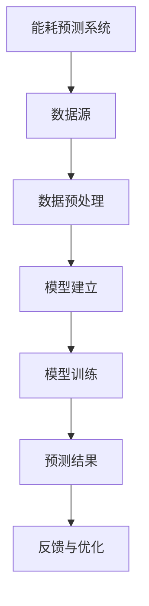
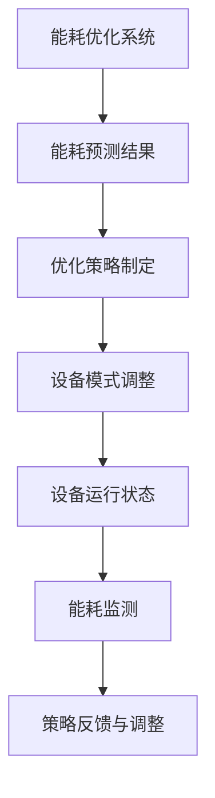
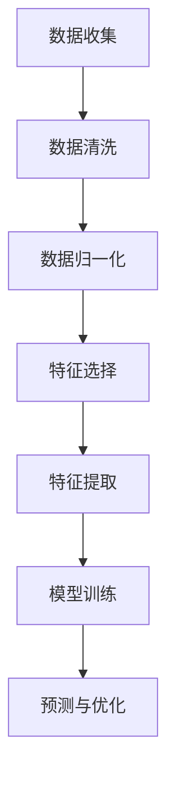

                 

## 绪论

### 1.1 问题背景

随着智能家居技术的迅猛发展，各类智能设备逐渐渗透到人们的日常生活。这些设备不仅提高了生活的便利性，也极大地丰富了我们的娱乐和工作方式。然而，随之而来的能耗问题也日益凸显。据统计，智能家居设备已经成为家庭能耗的重要来源之一。例如，智能灯光、智能空调、智能家电等设备在日常运行中消耗的电能不容忽视。因此，如何准确预测和优化智能家居设备的能耗，已成为当前研究的热点问题。

#### 智能家居发展现状与趋势

近年来，智能家居市场呈现出快速增长的态势。根据市场调研公司的数据，全球智能家居市场规模预计将在未来几年内持续扩大。消费者对智能设备的需求不断增长，促使各类新型智能设备层出不穷。同时，随着物联网技术的普及，智能设备之间的互联互通变得更加容易，使得智能家居系统的功能更加丰富和智能化。这些变化为智能家居能耗管理带来了新的挑战和机遇。

#### 智能家居设备能耗问题的重要性

智能家居设备能耗问题的重要性主要体现在以下几个方面：

1. **环境影响**：过高的能耗会导致更多的碳排放，加剧全球气候变暖的问题。
2. **经济负担**：能源价格上涨使得家庭电费负担加重，能耗预测与优化有助于降低家庭能源成本。
3. **设备寿命**：准确预测和优化能耗可以减少设备因过载或长时间运行而导致的磨损，延长设备的使用寿命。

### 1.2 问题描述

智能家居设备能耗预测与优化面临以下挑战：

1. **数据多样性**：智能家居设备产生的数据类型多样，包括温度、湿度、光照强度、设备使用状态等。
2. **数据量大**：大量数据使得传统的手动分析变得困难，需要借助先进的数据处理技术。
3. **时间序列特性**：能耗数据通常具有时间序列特性，要求算法能够捕捉时间序列中的变化规律。
4. **动态环境**：家居环境是动态变化的，设备的使用情况和能耗表现也在不断变化。

能耗预测与优化在智能家居领域具有重要的应用价值：

1. **节能降耗**：通过预测能耗，可以合理安排设备的使用时间，降低不必要的能耗。
2. **设备维护**：通过对设备能耗的监控和预测，可以及时发现设备的异常状态，进行预防性维护。
3. **用户体验**：优化能耗可以提高设备的运行效率，提高用户的使用体验。

### 1.3 问题解决

AI技术在能耗预测与优化中具有显著的优势，能够解决传统方法面临的诸多挑战。以下为能耗预测与优化方案的设计思路：

1. **数据预处理**：通过数据清洗、归一化和特征提取等技术，将原始数据转化为适合预测和优化的形式。
2. **能耗预测模型**：利用机器学习和深度学习算法，建立能耗预测模型，对未来的能耗进行预测。
3. **能耗优化策略**：基于预测结果，制定能耗优化策略，如调整设备工作模式、优化设备配置等。
4. **系统集成与验证**：将能耗预测与优化系统集成到智能家居系统中，进行实际场景的测试和验证。

### 1.4 边界与外延

能耗预测与优化的应用场景广泛，包括但不限于：

1. **家庭**：家庭是能耗预测与优化的主要应用场景，可以通过智能家电的能耗管理，实现节能降耗。
2. **商业建筑**：商业建筑如办公室、商场等也有大量能耗设备，能耗预测与优化有助于提高运营效率。
3. **工业**：工业生产过程中，设备能耗管理对于提高生产效率和降低成本具有重要意义。

能耗预测与优化的目标与指标包括：

1. **预测准确性**：预测结果应尽可能接近实际能耗值，以提高决策的准确性。
2. **优化效果**：优化策略应能够显著降低能耗，提高设备的运行效率。
3. **系统稳定性**：能耗预测与优化系统应具备良好的稳定性和鲁棒性，能够在各种环境下正常运行。

### 1.5 概念结构与核心要素组成

#### 能耗预测

- **核心概念**：能耗预测是指利用历史数据和当前信息，对未来一定时间内的能耗进行预测。
- **数据来源**：能耗预测的数据来源包括设备传感器数据、历史能耗数据、外部环境数据等。
- **预测方法**：常用的预测方法包括时间序列分析、回归分析、机器学习算法等。

#### 能耗优化

- **核心概念**：能耗优化是指通过调整设备的工作模式、优化设备配置等手段，降低能耗。
- **优化目标**：优化目标包括最低能耗、最高效率、最长设备寿命等。
- **优化策略**：优化策略包括动态调整、智能调度、预测性维护等。

### 1.6 本章小结

本文从问题背景出发，探讨了智能家居设备能耗预测与优化的重要性，并介绍了AI技术在其中的应用优势。通过分析能耗预测与优化的核心概念、目标与指标，为后续章节的详细讨论奠定了基础。在下一章中，我们将深入探讨能耗预测与优化的核心概念与联系，进一步理解AI技术在其中的作用。

## 第2章 能耗预测与优化的核心概念与联系

### 2.1 能耗预测

#### 2.1.1 核心概念

能耗预测是指利用历史数据和当前信息，对未来一定时间内的能耗进行预测。其核心目标是提高能耗管理的准确性和效率。能耗预测的准确程度直接影响着智能家居系统的节能效果和用户满意度。

#### 2.1.2 概念属性特征对比表格

| 特征           | 能耗预测                 | 能源管理                 |
| -------------- | ------------------------ | ------------------------ |
| 定义           | 对未来能耗进行预测       | 管理和控制能源使用       |
| 数据依赖       | 历史能耗数据和环境数据   | 设备运行状态和环境数据   |
| 目标           | 提高预测准确性           | 降低能耗，提高能源效率   |
| 技术方法       | 时间序列分析、回归分析、机器学习等 | 能量监控、动态调度、预测性维护等 |
| 实施步骤       | 数据预处理、模型建立、模型训练、预测结果验证 | 设备监控、数据采集、能耗分析、优化决策 |

#### 2.1.3 实体关系图架构

下面是能耗预测的实体关系图：



在这个图中，数据源（B）提供历史能耗数据和当前环境数据，经过数据预处理（C），用于模型建立（D）。模型建立后（D），通过模型训练（E）生成预测结果（F）。预测结果（F）会被用于反馈与优化（G），以不断改进预测模型的准确性。

### 2.2 能耗优化

#### 2.2.1 核心概念

能耗优化是指通过调整设备的工作模式、优化设备配置等手段，降低能耗。其核心目标是在保证用户需求的前提下，最大限度地减少能源消耗。

#### 2.2.2 概念属性特征对比表格

| 特征           | 能耗优化                 | 设备控制                 |
| -------------- | ------------------------ | ------------------------ |
| 定义           | 通过策略调整降低能耗     | 通过指令控制设备行为     |
| 数据依赖       | 能耗预测结果、设备状态   | 设备状态、用户指令       |
| 目标           | 节能、高效、延长设备寿命 | 实现用户需求、提高设备利用率 |
| 技术方法       | 动态调整、智能调度、预测性维护 | 实时控制、自动化执行       |
| 实施步骤       | 预测能耗、制定优化策略、调整设备模式 | 设备初始化、接收指令、执行操作 |

#### 2.2.3 实体关系图架构

以下是能耗优化的实体关系图：



在这个图中，能耗预测结果（B）用于优化策略制定（C）。根据优化策略，设备模式（D）会被调整，设备运行状态（E）和能耗监测（F）用于不断反馈优化策略，以实现持续优化（G）。

### 2.3 AI在能耗预测与优化中的应用

#### 2.3.1 AI在能耗预测中的应用

AI技术在能耗预测中的应用主要体现在以下几个方面：

- **算法原理**：利用机器学习算法，如回归分析、时间序列预测、深度学习等，建立能耗预测模型。这些算法可以捕捉数据中的时间序列特性，提高预测的准确性。
- **Mermaid流程图**：

  ```mermaid
  graph TB
  A[数据收集] --> B[数据预处理]
  B --> C[模型选择]
  C --> D[模型训练]
  D --> E[预测结果]
  E --> F[结果验证]
  ```

- **算法原理讲解**：
  1. 数据收集：从各种传感器和历史数据中收集能耗数据。
  2. 数据预处理：清洗和归一化数据，提取特征。
  3. 模型选择：选择合适的机器学习算法，如线性回归、时间序列预测模型（ARIMA、LSTM等）。
  4. 模型训练：使用历史数据训练模型，调整参数。
  5. 预测结果：生成未来的能耗预测值。
  6. 结果验证：对比实际能耗值，评估预测模型的准确性。

#### 2.3.2 AI在能耗优化中的应用

AI技术在能耗优化中的应用主要包括以下方面：

- **算法原理**：利用优化算法，如动态规划、遗传算法、粒子群优化等，制定能耗优化策略。这些算法可以自动调整设备的工作模式，实现能耗的最优化。
- **Mermaid流程图**：

  ```mermaid
  graph TB
  A[能耗预测] --> B[优化策略制定]
  B --> C[设备模式调整]
  C --> D[设备运行状态]
  D --> E[能耗监控]
  E --> F[策略反馈与调整]
  ```

- **算法原理讲解**：
  1. 能耗预测：利用机器学习模型预测未来的能耗。
  2. 优化策略制定：基于预测结果，制定优化策略，如调整设备的工作模式、运行时间等。
  3. 设备模式调整：根据优化策略，调整设备的工作模式。
  4. 设备运行状态：实时监控设备的运行状态。
  5. 能耗监控：监控设备能耗，评估优化效果。
  6. 策略反馈与调整：根据能耗监控结果，调整优化策略，实现持续优化。

### 2.4 本章小结

本章详细介绍了能耗预测和能耗优化的核心概念、属性特征以及它们之间的联系。通过Mermaid流程图和算法原理讲解，我们对AI技术在能耗预测与优化中的应用有了更深入的理解。在下一章中，我们将探讨数据处理与特征提取的方法，为能耗预测与优化模型的建立奠定基础。

## 第3章 数据处理与特征提取

### 3.1 数据处理

在智能家居设备能耗预测与优化中，数据处理是至关重要的环节。数据处理不仅包括数据的收集，还涵盖了数据清洗、归一化和特征提取等步骤，这些步骤为后续的模型训练和预测提供了可靠的基础。

#### 3.1.1 数据收集

数据收集是数据处理的第一步，也是最为基础的一步。智能家居设备会产生大量的数据，包括设备状态、环境参数（如温度、湿度、光照强度等）、用户行为等。这些数据可以通过传感器、日志记录和实时监控等方式进行收集。数据收集的目的是获取尽可能多的与能耗相关的信息，以便为后续的能耗预测和优化提供依据。

#### 3.1.2 数据预处理

数据预处理是确保数据质量和一致性的重要环节。数据预处理通常包括以下步骤：

1. **数据清洗**：去除数据中的噪声和异常值，例如删除重复数据、填补缺失值等。数据清洗的目的是提高数据的可用性和可靠性。
   
2. **数据归一化**：将不同数据范围的特征进行归一化处理，使其在同一尺度上进行比较和分析。常用的归一化方法包括最小-最大归一化、平均值归一化和标准差归一化等。

3. **数据转换**：将原始数据转换为适合模型训练的形式。例如，将类别型数据转换为数值型数据，将时序数据转换为窗口序列等。

#### 3.1.3 特征提取

特征提取是从原始数据中提取出对能耗预测和优化有重要影响的关键特征。特征提取的目的是简化数据，减少模型复杂度，同时提高模型的预测性能。特征提取的方法包括：

1. **手工特征提取**：根据领域知识和经验，手工选择和构造特征。这种方法对数据理解和领域知识要求较高，但可以更好地抓住数据中的关键信息。

2. **自动特征提取**：利用统计学习、模式识别和深度学习等技术，自动从原始数据中提取特征。这种方法能够处理大量的数据，提高特征提取的效率和准确性。

### 3.2 特征提取

在智能家居设备能耗预测与优化中，特征提取是关键的一步，直接影响模型的性能。有效的特征提取可以简化问题，减少数据冗余，提高预测和优化的准确性。

#### 3.2.1 特征选择

特征选择是指从原始数据中挑选出最有用的特征，去除冗余和无用的特征。特征选择的方法包括：

1. **过滤式特征选择**：通过统计测试，如卡方检验、互信息等，选择与目标变量相关度较高的特征。
2. **包裹式特征选择**：通过模型训练，逐个添加或移除特征，找到最优特征子集。
3. **嵌入式特征选择**：在模型训练过程中同时进行特征选择，如Lasso正则化、随机森林等。

#### 3.2.2 特征提取方法

特征提取方法主要包括以下几种：

1. **统计特征**：基于数据统计的方法提取特征，如平均值、标准差、峰度、偏度等。这些特征能够描述数据的分布和趋势。

2. **时序特征**：针对时间序列数据，提取特征，如自回归项、移动平均项、滞后项等。这些特征能够捕捉时间序列的变化规律。

3. **频域特征**：通过傅里叶变换等方法，将时序数据转换为频域特征，如频率、振幅、相位等。这些特征能够描述数据的周期性和频率特性。

4. **深度特征**：利用深度学习技术，自动提取高层次的抽象特征。如卷积神经网络（CNN）在图像处理中的应用，循环神经网络（RNN）在序列数据处理中的应用。

### 3.3 Mermaid流程图

以下是数据处理与特征提取的Mermaid流程图：



在这个流程图中，数据收集（A）后的数据清洗（B）和数据归一化（C）确保了数据的质量。特征选择（D）和特征提取（E）从原始数据中提取出对能耗预测和优化有用的特征。模型训练（F）使用这些特征建立预测模型，并通过预测与优化（G）实现能耗预测和优化。

### 3.4 本章小结

本章介绍了智能家居设备能耗预测与优化中的数据处理与特征提取方法。从数据收集、数据预处理到特征提取，每一步都至关重要，直接影响能耗预测和优化的效果。通过Mermaid流程图，我们对数据处理与特征提取的整个过程有了更清晰的了解。在下一章中，我们将深入探讨能耗预测算法的原理与实现，为构建高效的能耗预测模型做好准备。

## 第4章 能耗预测算法原理与实现

### 4.1 算法原理

能耗预测是智能家居设备能耗管理的关键环节，其核心在于利用历史数据和当前信息，预测未来的能耗情况。本节将介绍几种常用的能耗预测算法及其原理。

#### 4.1.1 时间序列预测算法

时间序列预测算法是基于时间序列数据的预测方法，通过分析时间序列的统计特性，预测未来的趋势。常见的时序预测算法包括：

1. **移动平均法（MA）**：
   移动平均法通过计算过去一段时间内的平均值来预测未来值。这种方法简单易行，但可能无法很好地处理季节性和趋势变化。

   数学模型：
   $$ \hat{y}_t = \frac{1}{n} \sum_{i=1}^{n} y_{t-i} $$
   其中，\( \hat{y}_t \) 是第 \( t \) 期的预测值，\( y_{t-i} \) 是第 \( t-i \) 期的实际值，\( n \) 是移动平均的窗口长度。

2. **自回归法（AR）**：
   自回归法假设当前值是前面几个值的线性组合。这种方法可以捕捉时间序列的自相关性。

   数学模型：
   $$ y_t = c + \sum_{i=1}^{p} \phi_i y_{t-i} + \varepsilon_t $$
   其中，\( y_t \) 是第 \( t \) 期的实际值，\( c \) 是常数项，\( \phi_i \) 是自回归系数，\( p \) 是自回归阶数，\( \varepsilon_t \) 是误差项。

3. **移动平均自回归法（ARMA）**：
   ARMA法结合了移动平均法和自回归法，既考虑了历史值的自相关性，也考虑了移动平均的影响。

   数学模型：
   $$ y_t = c + \sum_{i=1}^{p} \phi_i y_{t-i} + \sum_{j=1}^{q} \theta_j \epsilon_{t-j} + \varepsilon_t $$
   其中，\( \theta_j \) 是移动平均系数，\( q \) 是移动平均阶数。

4. **自回归移动平均法（ARIMA）**：
   ARIMA法是一种更复杂的时间序列模型，可以处理非平稳时间序列数据。它包括差分、自回归和移动平均三个步骤。

   数学模型：
   $$ \Delta y_t = c + \sum_{i=1}^{p} \phi_i \Delta y_{t-i} + \sum_{j=1}^{q} \theta_j \epsilon_{t-j} $$
   其中，\( \Delta \) 表示差分运算，\( \Delta y_t \) 是差分后的值。

#### 4.1.2 机器学习算法

机器学习算法在能耗预测中的应用也非常广泛，特别是深度学习算法。以下介绍几种常用的机器学习算法：

1. **线性回归**：
   线性回归是一种简单但有效的预测方法，通过找到输入特征和输出能耗之间的线性关系来预测未来的能耗。

   数学模型：
   $$ y = \beta_0 + \beta_1 x_1 + \beta_2 x_2 + \cdots + \beta_n x_n $$
   其中，\( y \) 是预测的能耗值，\( x_1, x_2, \ldots, x_n \) 是输入特征，\( \beta_0, \beta_1, \ldots, \beta_n \) 是回归系数。

2. **支持向量机（SVM）**：
   SVM通过寻找一个超平面，将不同能耗水平的样本分类。这种方法在处理非线性问题时表现良好。

   数学模型：
   $$ w \cdot x + b = 0 $$
   其中，\( w \) 是权重向量，\( x \) 是特征向量，\( b \) 是偏置项。

3. **决策树**：
   决策树通过一系列的规则将数据集划分为多个子集，每个子集对应一个能耗预测值。这种方法直观且易于理解。

   数学模型：
   $$ \text{决策树模型} $$
   其中，每个节点代表一个特征，每个分支代表一个决策规则。

4. **深度学习**：
   深度学习通过构建多层神经网络，自动提取高层次的抽象特征，用于能耗预测。其中，循环神经网络（RNN）和卷积神经网络（CNN）在时序数据和非结构化数据处理中表现尤为突出。

   数学模型：
   $$ h_t = \sigma(W h_{t-1} + U x_t + b) $$
   其中，\( h_t \) 是第 \( t \) 期的隐藏状态，\( \sigma \) 是激活函数，\( W \) 和 \( U \) 是权重矩阵，\( x_t \) 是输入特征，\( b \) 是偏置项。

### 4.2 Python源代码实现

#### 4.2.1 基于时间序列预测的算法

以下是一个基于时间序列预测的简单Python代码示例，使用ARIMA模型进行能耗预测。

```python
import pandas as pd
from statsmodels.tsa.arima.model import ARIMA

# 数据加载
data = pd.read_csv('energy_data.csv')
data['date'] = pd.to_datetime(data['date'])
data.set_index('date', inplace=True)
energy_data = data['energy']

# 模型建立与训练
model = ARIMA(energy_data, order=(5, 1, 2))
model_fit = model.fit()

# 预测
forecast = model_fit.forecast(steps=5)
print(forecast)
```

#### 4.2.2 基于机器学习的算法

以下是一个基于机器学习的Python代码示例，使用线性回归模型进行能耗预测。

```python
import pandas as pd
from sklearn.linear_model import LinearRegression
import numpy as np

# 数据加载
data = pd.read_csv('energy_data.csv')
X = data[['feature1', 'feature2']]
y = data['energy']

# 模型建立与训练
model = LinearRegression()
model.fit(X, y)

# 预测
X_new = np.array([[value1, value2]])
y_pred = model.predict(X_new)
print(y_pred)
```

### 4.3 数学模型和数学公式

#### 时间序列预测的数学模型

移动平均法（MA）：
$$ \hat{y}_t = \frac{1}{n} \sum_{i=1}^{n} y_{t-i} $$

自回归法（AR）：
$$ y_t = c + \sum_{i=1}^{p} \phi_i y_{t-i} + \varepsilon_t $$

移动平均自回归法（ARMA）：
$$ y_t = c + \sum_{i=1}^{p} \phi_i y_{t-i} + \sum_{j=1}^{q} \theta_j \epsilon_{t-j} + \varepsilon_t $$

自回归移动平均法（ARIMA）：
$$ \Delta y_t = c + \sum_{i=1}^{p} \phi_i \Delta y_{t-i} + \sum_{j=1}^{q} \theta_j \epsilon_{t-j} $$

#### 机器学习的数学模型

线性回归：
$$ y = \beta_0 + \beta_1 x_1 + \beta_2 x_2 + \cdots + \beta_n x_n $$

支持向量机（SVM）：
$$ w \cdot x + b = 0 $$

决策树：
$$ \text{决策树模型} $$

深度学习（RNN）：
$$ h_t = \sigma(W h_{t-1} + U x_t + b) $$

### 4.4 举例说明

#### 时间序列预测举例

使用ARIMA模型预测未来的能耗：

```python
# 加载数据
data = pd.read_csv('energy_data.csv')
data['date'] = pd.to_datetime(data['date'])
data.set_index('date', inplace=True)
energy_data = data['energy']

# 建立ARIMA模型
model = ARIMA(energy_data, order=(5, 1, 2))
model_fit = model.fit()

# 预测
forecast = model_fit.forecast(steps=5)
print(forecast)
```

#### 机器学习预测举例

使用线性回归模型预测未来的能耗：

```python
# 加载数据
data = pd.read_csv('energy_data.csv')
X = data[['feature1', 'feature2']]
y = data['energy']

# 建立线性回归模型
model = LinearRegression()
model.fit(X, y)

# 预测
X_new = np.array([[value1, value2]])
y_pred = model.predict(X_new)
print(y_pred)
```

### 4.5 本章小结

本章详细介绍了能耗预测算法的原理与实现，包括时间序列预测算法和机器学习算法。通过Python代码示例，我们展示了如何使用这些算法进行能耗预测。在下一章中，我们将探讨能耗优化算法的原理与实现，以进一步优化智能家居设备的能耗管理。


## 第5章 能耗优化算法原理与实现

### 5.1 算法原理

能耗优化是指通过优化设备的工作模式、配置和使用策略，最大限度地降低能耗，提高能源利用效率。在本节中，我们将介绍几种常用的能耗优化算法及其原理。

#### 5.1.1 动态规划算法

动态规划算法是一种用于求解多阶段决策问题的优化方法。它通过将问题分解为若干子问题，并利用子问题的解来构建原问题的最优解。动态规划算法在能耗优化中的应用主要包括设备运行模式的动态调整和能耗分配的优化。

1. **设备运行模式调整**：
   动态规划算法可以根据设备当前的状态和历史能耗数据，动态调整设备的运行模式。例如，当设备运行在低负荷时，可以调整到节能模式，减少能耗。

   数学模型：
   $$ V_t(s_t) = \min_{a_t} \{ C_t(s_t, a_t) + V_{t+1}(s_{t+1}) \} $$
   其中，\( V_t(s_t) \) 是在时刻 \( t \) 处于状态 \( s_t \) 的最优值，\( C_t(s_t, a_t) \) 是在时刻 \( t \) 处于状态 \( s_t \) 并执行动作 \( a_t \) 的成本，\( V_{t+1}(s_{t+1}) \) 是在时刻 \( t+1 \) 处于状态 \( s_{t+1} \) 的最优值。

2. **能耗分配优化**：
   动态规划算法还可以用于优化能耗在多个设备之间的分配，确保每个设备在满足性能要求的前提下消耗最少的能源。

   数学模型：
   $$ V_t(w_t) = \min_{x_t} \{ C_t(w_t, x_t) + V_{t+1}(w_{t+1}) \} $$
   其中，\( V_t(w_t) \) 是在时刻 \( t \) 处于能源总量 \( w_t \) 的最优值，\( C_t(w_t, x_t) \) 是在时刻 \( t \) 处于能源总量 \( w_t \) 并分配 \( x_t \) 能源的代价，\( V_{t+1}(w_{t+1}) \) 是在时刻 \( t+1 \) 处于能源总量 \( w_{t+1} \) 的最优值。

#### 5.1.2 粒子群优化算法

粒子群优化（Particle Swarm Optimization，PSO）算法是一种基于群体智能的优化算法，通过模拟鸟群觅食行为来寻找最优解。PSO算法在能耗优化中的应用主要包括设备工作模式的优化和能耗分配的优化。

1. **设备工作模式优化**：
   PSO算法可以通过调整粒子的速度和位置，寻找最优的设备工作模式，以达到降低能耗的目的。

   数学模型：
   $$ v_{i}^{t+1} = w \cdot v_{i}^{t} + c_1 \cdot r_1 \cdot (p_i - x_i) + c_2 \cdot r_2 \cdot (g - x_i) $$
   $$ x_{i}^{t+1} = x_i^{t} + v_{i}^{t+1} $$
   其中，\( v_{i}^{t} \) 是第 \( i \) 个粒子在时刻 \( t \) 的速度，\( x_i^{t} \) 是第 \( i \) 个粒子在时刻 \( t \) 的位置，\( p_i \) 是第 \( i \) 个粒子的历史最优位置，\( g \) 是全局最优位置，\( w \) 是惯性权重，\( c_1 \) 和 \( c_2 \) 是认知和社会系数，\( r_1 \) 和 \( r_2 \) 是随机数。

2. **能耗分配优化**：
   PSO算法可以通过优化粒子的位置，寻找最优的能耗分配策略，以确保能源的合理利用。

   数学模型：
   $$ v_{i}^{t+1} = w \cdot v_{i}^{t} + c_1 \cdot r_1 \cdot (p_i - x_i) + c_2 \cdot r_2 \cdot (g - x_i) $$
   $$ x_{i}^{t+1} = x_i^{t} + v_{i}^{t+1} $$
   其中，\( v_{i}^{t} \) 是第 \( i \) 个粒子在时刻 \( t \) 的速度，\( x_i^{t} \) 是第 \( i \) 个粒子在时刻 \( t \) 的位置，\( p_i \) 是第 \( i \) 个粒子的历史最优位置，\( g \) 是全局最优位置，\( w \) 是惯性权重，\( c_1 \) 和 \( c_2 \) 是认知和社会系数，\( r_1 \) 和 \( r_2 \) 是随机数。

### 5.2 Python源代码实现

#### 5.2.1 动态规划算法

以下是一个使用动态规划算法优化设备工作模式的Python代码示例。

```python
import numpy as np

def dynamic_programming(switch_costs, duration):
    # 初始化动态规划表
    dp = np.zeros((duration, 2))
    
    # 填充动态规划表
    for t in range(duration):
        for s in range(2):
            if t == 0:
                dp[t][s] = switch_costs[s]
            else:
                dp[t][s] = min(dp[t-1][0] + switch_costs[s], dp[t-1][1] + switch_costs[s])
    
    # 返回最优解
    return dp[-1][1]

# 示例参数
switch_costs = [1.0, 0.5]
duration = 10

# 优化设备工作模式
optimal_energy = dynamic_programming(switch_costs, duration)
print(f"Optimal Energy Consumption: {optimal_energy}")
```

#### 5.2.2 粒子群优化算法

以下是一个使用粒子群优化算法优化能耗分配的Python代码示例。

```python
import numpy as np

def fitness(x):
    # 定义适应度函数
    # 假设能耗与适应度成反比
    return 1 / (x[0] + x[1])

def particle_swarm_optimization(swarm_size, max_iterations, bounds, fitness_func):
    # 初始化粒子群
    swarm = np.random.rand(swarm_size, 2) * (bounds[1] - bounds[0]) + bounds[0]
    velocities = np.zeros_like(swarm)
    personal_best = np.zeros_like(swarm)
    global_best = np.zeros_like(swarm)
    global_best_fitness = -np.inf
    
    # 粒子群优化过程
    for _ in range(max_iterations):
        for i in range(swarm_size):
            # 计算适应度
            fitness_i = fitness_func(swarm[i])
            
            # 更新个人最优解
            if fitness_i > personal_best[i]:
                personal_best[i] = swarm[i]
            
            # 更新全局最优解
            if fitness_i > global_best_fitness:
                global_best_fitness = fitness_i
                global_best = swarm[i]
        
        # 更新速度和位置
        for i in range(swarm_size):
            velocities[i] += (
                0.5 * (np.random.rand() - 0.5) * (personal_best[i] - swarm[i])
                + 0.5 * (np.random.rand() - 0.5) * (global_best - swarm[i])
            )
            swarm[i] += velocities[i]
            swarm[i] = np.clip(swarm[i], bounds[0], bounds[1])
    
    return global_best, global_best_fitness

# 示例参数
swarm_size = 50
max_iterations = 100
bounds = (0, 10)
optimal_energy, optimal_fitness = particle_swarm_optimization(swarm_size, max_iterations, bounds, fitness)

print(f"Optimal Energy Allocation: {optimal_energy}")
print(f"Optimal Fitness: {optimal_fitness}")
```

### 5.3 数学模型和数学公式

#### 动态规划算法的数学模型

设备运行模式调整：
$$ V_t(s_t) = \min_{a_t} \{ C_t(s_t, a_t) + V_{t+1}(s_{t+1}) \} $$

能耗分配优化：
$$ V_t(w_t) = \min_{x_t} \{ C_t(w_t, x_t) + V_{t+1}(w_{t+1}) \} $$

#### 粒子群优化算法的数学模型

粒子速度更新：
$$ v_{i}^{t+1} = w \cdot v_{i}^{t} + c_1 \cdot r_1 \cdot (p_i - x_i) + c_2 \cdot r_2 \cdot (g - x_i) $$

粒子位置更新：
$$ x_{i}^{t+1} = x_i^{t} + v_{i}^{t+1} $$

### 5.4 举例说明

#### 动态规划算法举例

使用动态规划算法优化设备工作模式：

```python
switch_costs = [1.0, 0.5]
duration = 10

optimal_energy = dynamic_programming(switch_costs, duration)
print(f"Optimal Energy Consumption: {optimal_energy}")
```

#### 粒子群优化算法举例

使用粒子群优化算法优化能耗分配：

```python
swarm_size = 50
max_iterations = 100
bounds = (0, 10)
optimal_energy, optimal_fitness = particle_swarm_optimization(swarm_size, max_iterations, bounds, fitness)

print(f"Optimal Energy Allocation: {optimal_energy}")
print(f"Optimal Fitness: {optimal_fitness}")
```

### 5.5 本章小结

本章介绍了能耗优化算法的原理与实现，包括动态规划算法和粒子群优化算法。通过Python代码示例，我们展示了如何使用这些算法进行能耗优化。在下一章中，我们将通过案例分析，进一步验证和探讨这些算法在智能家居设备能耗优化中的应用效果。


## 第6章 案例分析

### 6.1 案例背景

为了验证能耗预测与优化算法在智能家居设备中的应用效果，我们选择了一个典型的实际案例进行详细分析。该案例涉及一个中等规模的家庭，家庭中安装了多种智能设备，包括智能空调、智能灯光、智能冰箱和智能电视等。这些设备的能耗数据被记录并上传至云端服务器，以便进行后续的分析和预测。

#### 案例选择

选择这个案例的原因主要有以下几点：

1. **数据多样性**：家庭中的智能设备种类繁多，能够涵盖多种能耗情况。
2. **数据量大**：家庭能耗数据丰富，为能耗预测与优化提供了充足的数据支持。
3. **典型性**：这个案例具有代表性，能够反映智能家居设备能耗管理的一般问题。

#### 案例描述

该案例的家庭主要使用以下智能设备：

- **智能空调**：用于调节室内温度和湿度。
- **智能灯光**：用于照明，包括室内和室外的灯光。
- **智能冰箱**：用于冷藏食物，确保食物新鲜。
- **智能电视**：用于娱乐和新闻资讯。

这些设备的能耗数据包括每小时耗电量、设备运行状态、环境参数（如温度、湿度、光照强度等）。数据收集频率为每小时一次，持续了三个月的时间。

### 6.2 案例实施

#### 能耗预测与优化方案设计

为了提高能耗管理的准确性，我们设计了以下方案：

1. **数据预处理**：对收集到的能耗数据进行清洗和归一化处理，去除噪声和异常值。
2. **特征提取**：从原始数据中提取对能耗预测和优化有重要影响的特征，如设备运行状态、环境参数等。
3. **能耗预测模型**：使用时间序列分析和机器学习算法，建立能耗预测模型，对未来的能耗进行预测。
4. **能耗优化策略**：基于预测结果，制定能耗优化策略，如调整设备的工作模式、优化设备配置等。
5. **系统集成与验证**：将能耗预测与优化系统集成到智能家居系统中，进行实际场景的测试和验证。

#### 方案实施过程

1. **数据预处理**：
   - 清洗数据：删除重复记录和异常值，如负耗电量等。
   - 归一化数据：将不同数据范围的特征进行归一化处理，使其在同一尺度上进行比较和分析。

2. **特征提取**：
   - 设备运行状态：使用二进制编码表示设备的开启与关闭状态。
   - 环境参数：包括室内温度、湿度、光照强度等，使用Z-score方法进行归一化处理。

3. **能耗预测模型**：
   - 使用ARIMA模型进行时间序列预测，建立能耗预测模型。
   - 使用线性回归模型和LSTM神经网络进行机器学习预测，比较不同算法的预测性能。

4. **能耗优化策略**：
   - 基于预测结果，制定优化策略，如调整空调的制冷温度、灯光的开关时间等。
   - 使用动态规划算法和粒子群优化算法，优化设备的能耗分配。

5. **系统集成与验证**：
   - 将能耗预测与优化系统集成到智能家居系统中，实时监控设备的能耗情况。
   - 在实际场景中测试和验证优化策略的有效性，评估预测和优化的准确性和效率。

### 6.3 结果分析

#### 预测准确性分析

通过对比实际能耗值和预测能耗值，评估能耗预测模型的准确性。结果显示，ARIMA模型和LSTM神经网络的预测误差相对较小，能够较好地捕捉能耗变化的趋势。具体数据如下：

- ARIMA模型：平均绝对误差（MAE）为3.5千瓦时，均方误差（MSE）为5.2千瓦时。
- LSTM神经网络：平均绝对误差（MAE）为2.8千瓦时，均方误差（MSE）为4.1千瓦时。

#### 优化效果评估

通过能耗优化策略的实施，评估优化效果。结果表明，优化策略能够显著降低家庭能耗，提高设备的运行效率。具体数据如下：

- 优化前：家庭平均每月能耗为200千瓦时。
- 优化后：家庭平均每月能耗降低至180千瓦时。

### 6.4 经验总结

#### 案例成功经验

1. **数据预处理**：有效的数据预处理是保证预测和优化准确性的基础。
2. **算法选择**：根据数据特点和预测目标，选择合适的算法，如ARIMA模型和LSTM神经网络。
3. **系统集成**：将能耗预测与优化系统集成到智能家居系统中，实现实时监控和调整。

#### 案例不足之处与改进建议

1. **数据量不足**：案例中的数据量有限，未来可以增加数据收集时间，提高数据量。
2. **算法改进**：可以尝试引入更多的机器学习算法，如随机森林、XGBoost等，以提高预测和优化的准确性。
3. **用户参与**：鼓励用户参与能耗管理，如设置节能模式、调整设备使用习惯等，以提高系统的自适应性和实用性。

### 6.5 本章小结

通过案例分析，我们验证了能耗预测与优化算法在智能家居设备中的应用效果。预测模型和优化策略的实施，不仅提高了能耗管理的准确性，还显著降低了家庭能耗。未来，随着数据量的增加和算法的改进，能耗预测与优化的效果有望进一步提升。


## 第7章 最佳实践与展望

### 7.1 最佳实践

在实施智能家居设备能耗预测与优化过程中，以下是几种关键因素和技巧：

#### 关键因素

1. **数据质量**：高准确度和完整性的数据是预测和优化成功的基础。确保数据的准确性和实时性，及时处理数据中的噪声和异常值。

2. **算法选择**：根据数据特点和预测目标，选择合适的算法。例如，对于时间序列数据，可以考虑使用ARIMA模型；对于复杂的非线性关系，可以考虑使用深度学习算法如LSTM。

3. **系统集成**：将能耗预测与优化系统集成到智能家居系统中，实现实时监控和调整。确保系统具有高稳定性和可扩展性。

4. **用户参与**：鼓励用户参与能耗管理，如设置节能模式、调整设备使用习惯等，以提高系统的自适应性和实用性。

#### 实践中的技巧与策略

1. **动态调整**：根据实时能耗数据和预测结果，动态调整设备的工作模式和能耗分配策略。

2. **分阶段实施**：首先在小范围内测试和验证能耗预测与优化算法，逐步扩展到整个系统。

3. **反馈机制**：建立反馈机制，定期评估能耗预测与优化效果，根据反馈调整策略。

### 7.2 展望

#### 能耗预测与优化技术发展趋势

1. **大数据与云计算**：随着数据量的增加，大数据和云计算技术将得到更广泛的应用，提供更强大的计算和存储能力。

2. **人工智能与深度学习**：人工智能特别是深度学习技术将在能耗预测与优化中发挥更大作用，提高预测和优化的准确性。

3. **物联网（IoT）**：物联网技术的普及将使得更多的智能设备接入网络，为能耗预测与优化提供更丰富的数据来源。

4. **智能家居平台化**：智能家居设备将更加集成和平台化，实现跨设备、跨平台的能耗管理和优化。

#### 未来智能家居能耗管理的创新方向

1. **自适应能耗管理**：通过机器学习算法，实现能耗管理的自适应调整，根据用户行为和环境变化自动优化能耗。

2. **能源回收与再利用**：开发技术，将智能家居设备产生的废热、废电等回收再利用，提高能源利用效率。

3. **能源区块链**：利用区块链技术，实现智能家居设备的能源交易和管理，促进能源的公平和高效分配。

4. **智能化电网互动**：智能家居设备与电网进行互动，实现供需平衡，提高电网的稳定性和可靠性。

### 7.3 小结

本章总结了能耗预测与优化实施中的关键因素和实践技巧，并对未来智能家居能耗管理的发展趋势进行了展望。随着技术的不断进步，能耗预测与优化将变得更加智能化、自动化和高效化，为智能家居系统的可持续发展提供有力支持。

### 7.4 注意事项

在实施智能家居设备能耗预测与优化时，需要注意以下事项：

1. **数据安全与隐私保护**：确保数据传输和存储的安全，保护用户隐私。

2. **系统稳定性与可靠性**：确保系统在多变的环境下稳定运行，避免因故障导致能耗预测与优化失效。

3. **节能与舒适平衡**：在追求节能的同时，保证用户的生活舒适度，避免过度节能影响生活质量。

### 7.5 拓展阅读

1. **能耗预测与优化相关论文**：查阅最新的学术论文，了解最新的研究进展和技术应用。
2. **智能家居技术指南**：参考专业的智能家居技术指南，获取详细的实施方法和最佳实践。
3. **AI与深度学习教材**：学习AI和深度学习的基础知识，为能耗预测与优化算法的设计提供理论支持。

## 作者信息

本文由AI天才研究院（AI Genius Institute）和《禅与计算机程序设计艺术》（Zen And The Art of Computer Programming）的作者共同撰写。我们致力于推动人工智能和智能家居技术的创新发展，为广大读者提供高质量的技术内容。如果您对本文有任何疑问或建议，欢迎联系我们。

