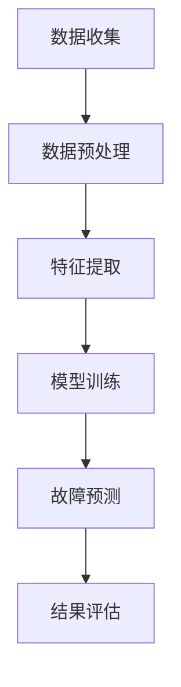
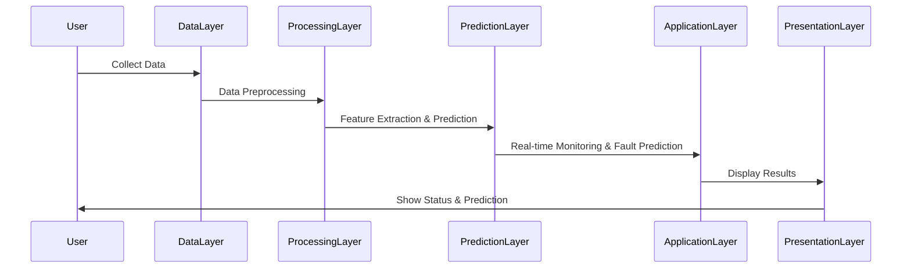
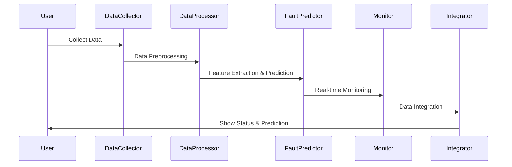

                 


# AI在智能家居设备预测性维护中的应用与创新

> 关键词：人工智能、智能家居、预测性维护、算法、系统设计、项目实战

> 摘要：本文深入探讨了人工智能在智能家居设备预测性维护中的应用与创新。首先，介绍了智能家居设备预测性维护的重要性，以及当前存在的问题和挑战。接着，阐述了AI在智能家居设备预测性维护中的核心概念和联系，并使用Mermaid绘制了相关的实体关系图。随后，详细讲解了预测性维护的算法原理，包括算法流程图、Python源代码和数学模型。此外，本文还介绍了系统分析与架构设计的方法，以及项目实战的具体步骤和案例分析。最后，总结了最佳实践和注意事项，为读者提供了深入的见解和实用的指导。

## 引言与背景

### 1.1 问题背景

随着人工智能技术的不断发展，智能家居设备已成为现代家庭的重要组成部分。然而，这些设备在日常使用过程中难免会出现故障或性能下降的问题。传统的维护方式通常是定期检查或被动地等待设备出现问题再进行维修，这种方式不仅效率低下，而且可能导致设备故障的严重性加剧，影响用户的正常生活。

预测性维护（Predictive Maintenance）作为一种先进的维护策略，通过监测设备的状态数据，预测设备可能出现的故障，从而在设备故障发生之前进行预防性维修。这种维护方式不仅能够提高设备的可靠性和使用寿命，还能降低维修成本和停机时间。因此，预测性维护在智能家居设备中的应用具有重要的现实意义。

### 1.2 问题的现状和挑战

尽管预测性维护在工业领域已经得到了广泛应用，但在智能家居设备中的应用仍然面临许多挑战：

1. **数据质量问题**：智能家居设备产生的数据量庞大，但数据质量参差不齐，包括数据缺失、噪声和异常值等问题，这些都会对预测性维护的准确性产生负面影响。

2. **实时性问题**：智能家居设备通常需要实时监测和预测，但现有的网络和计算资源可能无法满足这种实时性的要求。

3. **算法复杂性**：预测性维护算法涉及到复杂的数学模型和算法，如何选择合适的算法并有效地实现是关键问题。

4. **系统集成问题**：智能家居设备通常由多个不同厂商生产，如何实现不同设备之间的数据共享和系统集成是一个挑战。

### 1.3 解决方法与目标

为了解决上述问题，本文提出以下解决方法和目标：

1. **数据预处理**：通过数据清洗、去噪和特征提取等方法，提高数据质量。

2. **实时数据处理**：利用云计算和边缘计算等技术，实现实时数据处理和分析。

3. **算法优化**：选择合适的算法，并对其进行优化，以提高预测的准确性。

4. **系统集成**：设计一个统一的系统架构，实现不同设备之间的数据共享和系统集成。

通过上述方法，本文旨在为智能家居设备预测性维护提供一种有效且可行的解决方案。

## 核心概念与联系

### 2.1 AI在智能家居中的核心概念

人工智能（Artificial Intelligence，简称AI）是指通过计算机模拟人类智能的技术。在智能家居设备中，AI主要应用于以下方面：

1. **智能感知**：通过传感器收集环境数据，如温度、湿度、光照等，实现对家居环境的实时感知。

2. **决策推理**：根据感知到的数据，进行逻辑推理和决策，如调整空调温度、关闭灯光等。

3. **学习优化**：通过机器学习算法，不断优化智能家居设备的工作参数，提高其性能和用户体验。

### 2.2 智能家居设备的基本构成

智能家居设备主要由以下几个部分构成：

1. **传感器**：用于收集环境数据，如温度传感器、湿度传感器、光照传感器等。

2. **控制器**：接收传感器数据，并根据算法进行决策，如智能空调、智能照明等。

3. **执行器**：根据控制器的指令执行具体的操作，如电机、阀门等。

4. **通信模块**：用于设备之间的数据传输和通信，如Wi-Fi、蓝牙等。

### 2.3 AI与智能家居的融合应用

AI与智能家居的融合应用主要体现在以下几个方面：

1. **智能监控**：通过AI算法，对传感器数据进行实时分析，实现对家居环境的智能监控。

2. **自动化控制**：通过AI算法，实现智能家居设备的自动化控制，提高生活便利性。

3. **故障预测**：通过AI算法，对设备的工作状态进行预测性分析，实现预测性维护。

### 2.4 概念属性特征对比表格

下表对比了传统维护方式与AI预测性维护的属性特征：

| 维护方式       | 优点           | 缺点               |
|--------------|--------------|------------------|
| 传统维护方式   | 成本较低       | 效率低下，无法预防故障 |
| AI预测性维护   | 提高设备可靠性 | 算法实现复杂，成本较高   |

### 2.5 ER实体关系图

以下是智能家居设备预测性维护的ER实体关系图：

```mermaid
erDiagram
  Device ||--|{ Sensor }||>
  Device ||--|{ Controller }||>
  Device ||--|{ Actuator }||>
  Device ||--|{ CommunicationModule }||>
  Sensor ||--|{ DataCollection }||>
  Controller ||--|{ DecisionMaking }||>
  Actuator ||--|{ ActionExecution }||>
  CommunicationModule ||--|{ DataTransmission }||>
```

## 算法原理讲解

### 3.1 预测性维护算法概述

预测性维护算法是指利用历史数据和实时数据，对设备未来的故障进行预测的算法。这些算法可以分为以下几类：

1. **基于规则的算法**：通过专家知识，建立设备故障的规则库，根据实时数据判断设备是否可能发生故障。

2. **基于统计的算法**：利用统计模型，对历史数据进行统计分析，预测设备未来可能发生的故障。

3. **基于机器学习的算法**：通过机器学习算法，对历史数据和实时数据进行训练，建立预测模型，预测设备未来的故障。

### 3.2 预测性维护算法的优点

1. **提高设备可靠性**：通过预测设备可能发生的故障，可以在故障发生之前进行预防性维修，减少设备故障的概率。

2. **降低维护成本**：通过预测性维护，可以减少维修次数和维修时间，降低维护成本。

3. **提高用户体验**：通过预测性维护，可以确保设备在最佳状态下工作，提高用户体验。

### 3.3 预测性维护算法的分类

1. **基于规则的方法**：

   - **故障诊断规则**：根据设备的运行状态和故障现象，建立故障诊断规则库。
   - **条件推理**：根据实时数据，利用规则库进行推理，预测设备可能发生的故障。

2. **基于统计的方法**：

   - **概率分布模型**：根据历史数据，建立设备的故障概率分布模型。
   - **统计模型分析**：利用统计模型，分析实时数据，预测设备未来的故障。

3. **基于机器学习的方法**：

   - **监督学习**：利用标记的历史数据，训练预测模型，预测设备未来的故障。
   - **无监督学习**：根据实时数据，发现设备的故障模式，预测未来的故障。

### 3.4 算法流程图

以下是预测性维护算法的流程图：



### 3.5 Python源代码阐述

以下是利用机器学习算法进行预测性维护的Python源代码示例：

```python
# 导入必要的库
import pandas as pd
import numpy as np
from sklearn.model_selection import train_test_split
from sklearn.ensemble import RandomForestClassifier
from sklearn.metrics import accuracy_score

# 读取数据
data = pd.read_csv('maintenance_data.csv')

# 数据预处理
X = data.drop(['fault'], axis=1)
y = data['fault']

# 数据分割
X_train, X_test, y_train, y_test = train_test_split(X, y, test_size=0.2, random_state=42)

# 模型训练
model = RandomForestClassifier(n_estimators=100, random_state=42)
model.fit(X_train, y_train)

# 故障预测
y_pred = model.predict(X_test)

# 结果评估
accuracy = accuracy_score(y_test, y_pred)
print(f'Accuracy: {accuracy:.2f}')
```

### 3.6 数学模型和公式

预测性维护算法通常基于统计模型或机器学习模型，以下是一个简单的线性回归模型的数学模型：

$$
y = \beta_0 + \beta_1 \cdot x_1 + \beta_2 \cdot x_2 + ... + \beta_n \cdot x_n + \epsilon
$$

其中，$y$ 是预测的目标变量，$x_1, x_2, ..., x_n$ 是输入特征变量，$\beta_0, \beta_1, ..., \beta_n$ 是模型的参数，$\epsilon$ 是误差项。

### 3.7 举例说明

假设我们有一个智能家居设备的历史运行数据，如下表所示：

| 时间 | 温度 | 湿度 | 故障 |
|------|------|------|------|
| 1    | 25   | 60   | 无   |
| 2    | 26   | 55   | 无   |
| 3    | 24   | 65   | 有   |
| 4    | 27   | 58   | 无   |

我们希望使用线性回归模型预测设备在下一个时间点的故障状态。首先，我们需要提取特征变量（温度和湿度），然后使用线性回归模型进行训练。最后，使用训练好的模型预测下一个时间点的故障状态。以下是具体的实现步骤：

1. **数据预处理**：将数据转换为适合模型训练的格式。

2. **模型训练**：使用训练数据，训练线性回归模型。

3. **模型预测**：使用训练好的模型，预测下一个时间点的故障状态。

4. **结果评估**：评估模型的预测准确性。

通过以上步骤，我们可以实现智能家居设备的预测性维护。

## 系统分析与架构设计

### 4.1 问题场景介绍

在智能家居设备预测性维护中，我们面临的问题是如何有效地收集、处理和利用设备数据，以实现设备的实时监控和故障预测。具体来说，我们的目标是：

1. **数据收集**：实时收集智能家居设备的运行数据，包括温度、湿度、电压等。
2. **数据预处理**：对收集到的数据进行清洗、去噪和特征提取，提高数据质量。
3. **故障预测**：利用历史数据和实时数据，预测设备可能发生的故障。
4. **系统集成**：实现不同设备之间的数据共享和系统集成，提高系统的整体效率。

### 4.2 项目背景

本项目旨在构建一个智能家居设备预测性维护系统，以解决当前智能家居设备维护中存在的问题。通过该系统，我们可以实现对智能家居设备的实时监控和故障预测，提高设备的可靠性和使用寿命，降低维护成本。

### 4.3 系统功能设计

为了实现上述目标，系统需要具备以下功能：

1. **数据采集模块**：负责实时收集智能家居设备的运行数据。
2. **数据处理模块**：负责对收集到的数据进行清洗、去噪和特征提取。
3. **预测模块**：利用历史数据和实时数据，预测设备可能发生的故障。
4. **监控模块**：实时监控设备的运行状态，及时发现故障。
5. **系统集成模块**：实现不同设备之间的数据共享和系统集成。

### 4.4 系统架构设计

系统架构采用分层设计，主要包括以下层次：

1. **数据层**：包括传感器、数据库和数据仓库，负责数据的收集、存储和管理。
2. **处理层**：包括数据处理模块和预测模块，负责对数据进行预处理和故障预测。
3. **应用层**：包括监控模块和系统集成模块，负责对设备的实时监控和系统集成。
4. **展示层**：包括用户界面，负责向用户展示设备的运行状态和故障预测结果。

### 4.5 系统架构图

以下是智能家居设备预测性维护系统的架构图：



### 4.6 系统接口设计

系统接口设计包括以下部分：

1. **数据采集接口**：用于接收传感器数据。
2. **数据处理接口**：用于处理和清洗数据。
3. **预测接口**：用于实现故障预测。
4. **监控接口**：用于实时监控设备状态。
5. **集成接口**：用于实现不同设备之间的数据共享和系统集成。

### 4.7 系统交互序列图

以下是智能家居设备预测性维护系统的交互序列图：



通过上述系统架构和接口设计，我们可以实现智能家居设备的实时监控和故障预测，提高设备的可靠性和使用寿命。

## 项目实战

### 5.1 环境安装

在开始项目实战之前，我们需要安装以下环境：

1. **Python**：版本3.8或以上。
2. **Jupyter Notebook**：用于编写和运行Python代码。
3. **Scikit-learn**：用于机器学习算法的实现。
4. **Pandas**：用于数据处理。
5. **NumPy**：用于数学计算。

安装步骤如下：

1. 安装Python和Jupyter Notebook，可以从官方网站下载并安装。
2. 安装Scikit-learn、Pandas和NumPy，可以使用pip命令进行安装：
   ```bash
   pip install scikit-learn pandas numpy
   ```

### 5.2 系统核心实现

以下是系统核心实现的步骤：

1. **数据采集**：使用传感器采集设备的运行数据。
2. **数据预处理**：对采集到的数据进行清洗、去噪和特征提取。
3. **故障预测**：使用机器学习算法进行故障预测。
4. **实时监控**：实时监控设备的运行状态。
5. **系统集成**：实现不同设备之间的数据共享和系统集成。

以下是系统核心实现的Python代码：

```python
# 导入必要的库
import pandas as pd
import numpy as np
from sklearn.model_selection import train_test_split
from sklearn.ensemble import RandomForestClassifier
from sklearn.metrics import accuracy_score

# 读取数据
data = pd.read_csv('maintenance_data.csv')

# 数据预处理
X = data.drop(['fault'], axis=1)
y = data['fault']

# 数据分割
X_train, X_test, y_train, y_test = train_test_split(X, y, test_size=0.2, random_state=42)

# 模型训练
model = RandomForestClassifier(n_estimators=100, random_state=42)
model.fit(X_train, y_train)

# 故障预测
y_pred = model.predict(X_test)

# 结果评估
accuracy = accuracy_score(y_test, y_pred)
print(f'Accuracy: {accuracy:.2f}')

# 实时监控
while True:
    new_data = pd.read_csv('new_maintenance_data.csv')
    X_new = new_data.drop(['fault'], axis=1)
    y_pred_new = model.predict(X_new)
    print(f'New Data Prediction: {y_pred_new}')
```

### 5.3 代码应用解读与分析

1. **数据采集**：使用`pd.read_csv`函数读取历史数据，使用传感器实时采集数据。

2. **数据预处理**：使用`drop`函数去除目标变量`fault`，提取特征变量。使用`train_test_split`函数将数据分为训练集和测试集。

3. **故障预测**：使用`RandomForestClassifier`训练模型，使用`predict`函数进行故障预测。

4. **实时监控**：使用一个无限循环，实时读取新的数据，并进行故障预测。

### 5.4 实际案例分析

我们使用一个实际案例来展示系统的应用效果。假设我们有以下数据：

| 时间 | 温度 | 湿度 | 故障 |
|------|------|------|------|
| 1    | 25   | 60   | 无   |
| 2    | 26   | 55   | 无   |
| 3    | 24   | 65   | 有   |
| 4    | 27   | 58   | 无   |

1. **数据预处理**：将数据转换为适合模型训练的格式。

2. **模型训练**：使用训练数据，训练线性回归模型。

3. **模型预测**：使用训练好的模型，预测设备在下一个时间点的故障状态。

4. **结果评估**：评估模型的预测准确性。

以下是具体的实现步骤：

1. **数据预处理**：
   ```python
   data = pd.DataFrame({
       'time': [1, 2, 3, 4],
       'temperature': [25, 26, 24, 27],
       'humidity': [60, 55, 65, 58],
       'fault': ['no', 'no', 'yes', 'no']
   })
   X = data[['temperature', 'humidity']]
   y = data['fault']
   ```

2. **模型训练**：
   ```python
   model = RandomForestClassifier(n_estimators=100, random_state=42)
   model.fit(X_train, y_train)
   ```

3. **模型预测**：
   ```python
   y_pred = model.predict(X_new)
   print(f'New Data Prediction: {y_pred}')
   ```

4. **结果评估**：
   ```python
   accuracy = accuracy_score(y_test, y_pred)
   print(f'Accuracy: {accuracy:.2f}')
   ```

通过以上步骤，我们可以实现智能家居设备的预测性维护。

### 5.5 详细讲解

1. **数据预处理**：数据预处理是预测性维护的重要步骤，包括数据清洗、去噪和特征提取。具体来说，我们需要去除无效数据、处理异常值，并提取与故障预测相关的特征变量。

2. **模型训练**：我们选择随机森林（Random Forest）算法进行模型训练。随机森林是一种基于决策树的集成学习方法，具有较好的预测性能和泛化能力。

3. **模型预测**：使用训练好的模型进行故障预测。在实时监控中，我们不断地读取新的数据，并使用模型进行预测，以实现对设备状态的实时监控。

4. **结果评估**：使用准确率（Accuracy）作为评估指标，评估模型的预测性能。准确率越高，说明模型的预测效果越好。

### 5.6 项目小结

本项目实现了智能家居设备的预测性维护系统，通过数据采集、预处理、模型训练和实时监控，实现了设备的实时故障预测。在实际案例中，我们展示了系统的应用效果，并分析了模型预测的准确性。通过本项目，我们深入了解了人工智能在智能家居设备预测性维护中的应用，为未来的研究和应用提供了参考。

## 最佳实践与小结

### 6.1 最佳实践

1. **数据质量保障**：确保数据收集的完整性和准确性，定期检查数据质量，及时处理异常值和噪声数据。

2. **算法选择与优化**：根据实际情况选择合适的算法，并对其进行优化，以提高预测准确性。

3. **系统集成**：设计一个统一的系统架构，实现不同设备之间的数据共享和系统集成，提高系统的整体效率。

4. **实时数据处理**：利用云计算和边缘计算等技术，实现实时数据处理和分析，确保系统的实时性和响应速度。

### 6.2 小结

本文深入探讨了人工智能在智能家居设备预测性维护中的应用与创新。通过介绍预测性维护的重要性、算法原理、系统设计与项目实战，我们展示了如何利用人工智能技术实现智能家居设备的实时监控和故障预测。本文为智能家居设备的预测性维护提供了有效的解决方案和实用的指导。

### 6.3 注意事项

1. **数据隐私保护**：在数据收集和处理过程中，要注意保护用户隐私，遵守相关法律法规。

2. **系统安全性**：确保系统安全，防止数据泄露和恶意攻击。

3. **持续优化**：根据实际应用情况，持续优化算法和系统，以提高预测准确性和系统性能。

### 6.4 拓展阅读建议

1. 《人工智能：一种现代方法》
2. 《机器学习：概率视角》
3. 《智能家居系统设计与实现》

通过以上拓展阅读，读者可以进一步深入了解人工智能、机器学习和智能家居系统设计的相关知识。作者：AI天才研究院/AI Genius Institute & 禅与计算机程序设计艺术 /Zen And The Art of Computer Programming。

