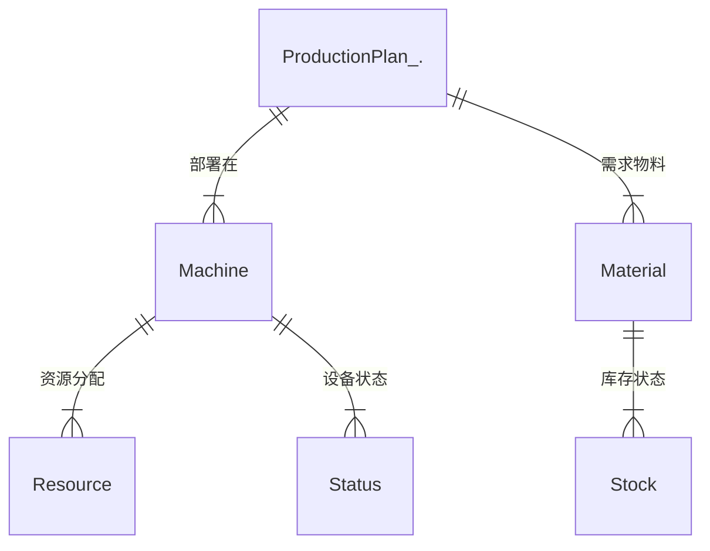
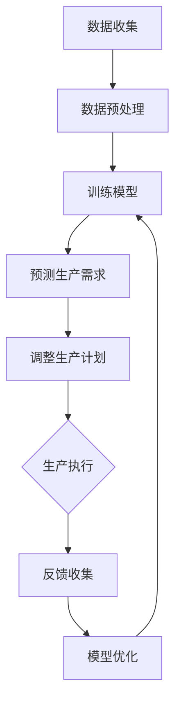
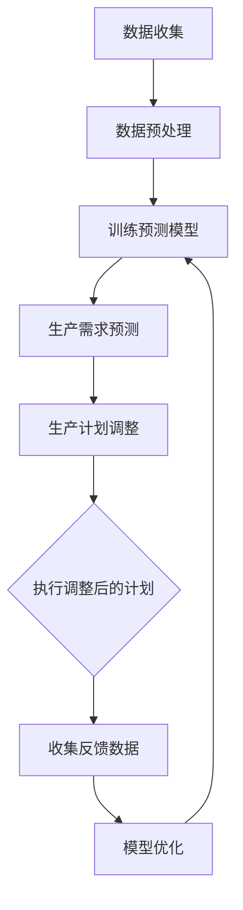
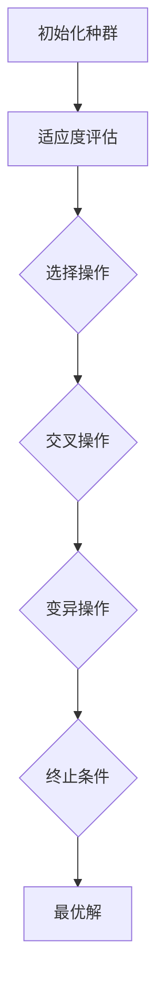

                 

### 思考步骤：

1. **文章结构规划**：首先，我们将文章分为引言、正文和结论三个部分。引言部分简要介绍智能工厂、柔性调度和资源分配的背景，引起读者的兴趣；正文部分详细阐述各个章节的核心内容；结论部分总结全文，并提出未来研究方向。

2. **引言撰写**：
   - 简要介绍智能工厂的概念和重要性。
   - 阐述柔性调度与资源分配的定义及其在智能工厂中的作用。
   - 引出本文的核心内容：AI在智能工厂柔性调度与资源分配中的应用。

3. **正文内容构思**：
   - **第1章：背景介绍**：介绍智能工厂、柔性调度和资源分配的基本概念，分析其重要性，描述当前面临的挑战。
   - **第2章：核心概念与联系**：定义并详细介绍柔性调度和资源分配的相关概念，使用对比表格和ER图展示概念之间的关系。
   - **第3章：算法原理讲解**：深入讲解AI算法在柔性调度与资源分配中的应用，使用Mermaid流程图和Python代码说明。
   - **第4章：数学模型与公式**：阐述算法背后的数学原理，使用LaTeX格式书写数学公式，并进行详细讲解和举例说明。
   - **第5章：系统分析与架构设计**：介绍智能工厂系统的功能和架构设计，使用Mermaid类图和序列图展示。
   - **第6章：项目实战**：通过一个实际案例，展示如何将AI算法应用于智能工厂生产线的柔性调度与资源分配。
   - **第7章：最佳实践与小结**：总结书中要点，提供实战技巧，指出注意事项，推荐拓展阅读。

4. **结论撰写**：
   - 总结全文，强调AI在智能工厂柔性调度与资源分配中的关键作用。
   - 提出未来研究方向，如优化算法、提高系统性能等。

5. **整体调整与优化**：
   - 确保文章的逻辑清晰，结构紧凑。
   - 对每个章节进行细化，确保内容丰富、具体。
   - 检查语法和拼写错误，确保文章的专业性和可读性。

### 开始编写文章：

**引言**：
智能工厂是现代制造业发展的必然趋势，它利用先进的信息技术和自动化设备，实现了生产过程的智能化和自动化。柔性调度与资源分配是智能工厂中至关重要的环节，直接关系到生产效率和成本控制。随着人工智能技术的不断进步，AI在柔性调度与资源分配中的应用越来越受到关注。本文将详细介绍AI在智能工厂柔性调度与资源分配中的应用，旨在为读者提供一种新的视角和方法。

**正文**：
**第1章：背景介绍**
在本章中，我们将首先介绍智能工厂、柔性调度和资源分配的基本概念，并分析它们在智能工厂中的重要性。接下来，我们将描述当前面临的主要挑战，如生产计划的动态调整、资源利用率的优化等。

**第2章：核心概念与联系**
在这一章中，我们将定义并详细介绍柔性调度和资源分配的相关概念，如调度策略、资源管理、作业计划等。同时，我们将使用对比表格和ER图来展示这些概念之间的联系。

**第3章：算法原理讲解**
在这一章中，我们将深入讲解AI算法在柔性调度与资源分配中的应用。我们将使用Mermaid流程图和Python代码来详细阐述，帮助读者理解这些算法的工作原理。

**第4章：数学模型与公式**
在这一章中，我们将阐述算法背后的数学原理，并使用LaTeX格式书写数学公式。我们将通过具体的例子来说明这些公式的应用。

**第5章：系统分析与架构设计**
在这一章中，我们将介绍智能工厂系统的功能和架构设计。我们将使用Mermaid类图和序列图来展示系统的工作流程和内部结构。

**第6章：项目实战**
在这一章中，我们将通过一个实际案例，展示如何将AI算法应用于智能工厂生产线的柔性调度与资源分配。我们将从环境安装到系统实现，详细解读和分析每个环节。

**第7章：最佳实践与小结**
在这一章中，我们将总结全书的核心内容，并提供一些实用的最佳实践。同时，我们将指出在实施AI算法时需要注意的事项，并提出未来研究方向。

**结论**：
本文通过对智能工厂、柔性调度和资源分配的深入分析，展示了AI在这些领域中的应用。我们相信，随着AI技术的不断发展，它将为智能工厂的生产和管理带来革命性的变化。未来，我们期待在算法优化、系统性能提升等方面取得更多突破。

**作者信息**：
作者：AI天才研究院/AI Genius Institute & 禅与计算机程序设计艺术 /Zen And The Art of Computer Programming### 智能工厂概述

智能工厂，作为工业4.0时代的重要标志，代表了制造业向高度智能化、自动化方向发展的新阶段。它通过集成先进的信息技术和自动化设备，实现生产过程的全面数字化和智能化，从而提高生产效率、降低成本、增强产品竞争力。智能工厂的核心在于其能够根据实时数据和智能算法，对生产计划进行动态调整，优化资源分配，提高生产线的柔性。

**核心概念术语说明**：
- **智能工厂**：一个集成了物联网（IoT）、大数据、云计算、人工智能等先进技术的生产系统，能够实现生产过程的自动化和智能化。
- **柔性调度**：根据实时生产需求和设备状态，动态调整生产计划，以最大化生产效率和资源利用率。
- **资源分配**：在智能工厂中，资源包括生产设备、人力、物料等。资源分配是指根据生产计划和调度结果，合理分配这些资源，确保生产线的顺畅运行。

**问题背景**：
在传统工厂中，生产计划往往是基于预测和经验制定的，缺乏灵活性，无法应对突发情况和市场需求变化。此外，资源分配不合理也导致资源浪费和效率低下。随着市场竞争的加剧和消费者需求的多样化，传统工厂的运行模式逐渐暴露出其弊端。为了提高生产效率、降低成本、提升产品质量，智能工厂应运而生。

**问题描述**：
智能工厂的目标是实现生产过程的全面自动化和智能化，包括：
- **生产计划的动态调整**：能够根据实时生产数据和市场需求，动态调整生产计划，避免生产过剩或不足。
- **资源的高效利用**：通过优化资源分配，提高资源利用率，降低生产成本。
- **生产线的柔性**：能够快速适应生产任务的变化，满足多样化的市场需求。

**问题解决**：
AI技术在智能工厂中的应用，为解决上述问题提供了新的思路和方法。通过AI技术，可以实现：
- **生产计划的智能调整**：利用机器学习和预测算法，对生产计划进行智能优化，提高生产效率。
- **资源的智能分配**：通过优化算法和预测模型，实现资源的高效利用，降低生产成本。
- **生产线的柔性优化**：通过AI技术，实现对生产线的实时监控和调整，提高生产线的适应性。

**边界与外延**：
智能工厂的范围不仅限于生产线，还包括供应链管理、质量管理、设备维护等多个方面。柔性调度和资源分配是智能工厂的核心组成部分，但它们的应用不仅限于生产线，还可以扩展到其他生产环节。

**概念结构与核心要素组成**：
- **智能工厂**：包括物联网设备、云计算平台、大数据分析系统、人工智能算法等。
- **柔性调度**：包括调度策略、调度算法、实时监控等。
- **资源分配**：包括资源管理、资源优化算法、预测模型等。

通过这些核心要素的有机结合，智能工厂能够实现生产过程的全面智能化和自动化，从而提高生产效率、降低成本、提升产品质量。

### 柔性调度与资源分配

柔性调度和资源分配是智能工厂中两个关键环节，它们共同决定了生产线的效率和灵活性。柔性调度是指在不确定的环境下，根据实时生产需求和设备状态，动态调整生产计划，以确保生产过程的顺畅进行。资源分配则是在生产过程中，合理分配人力、物料、设备等资源，以提高资源利用率和生产效率。

**核心概念术语说明**：
- **柔性调度**：一种能够在不确定的环境下，动态调整生产计划的方法，以最大化生产效率和资源利用率。
- **资源分配**：在生产过程中，合理分配人力、物料、设备等资源，以满足生产需求。

**概念属性特征对比表格**：

| 概念        | 柔性调度                 | 资源分配                 |
| ----------- | ---------------------- | ---------------------- |
| **定义**    | 动态调整生产计划       | 合理分配生产资源        |
| **目标**    | 提高生产效率和灵活性   | 提高资源利用率和生产效率 |
| **影响因素** | 生产需求、设备状态、物料 | 人力、物料、设备        |
| **应用领域** | 生产计划、调度算法      | 资源管理、优化算法       |

**ER实体关系图架构**：



在上面的ER图中，`ProductionPlan_`代表了生产计划，它与`Machine`（设备）和`Material`（物料）有直接关联。`Machine`又与`Resource`（资源分配）和`Status`（设备状态）相关联，而`Material`则与`Stock`（库存状态）相关联。这种关系展示了柔性调度和资源分配在智能工厂中的相互影响和作用。

### AI技术的基础知识

人工智能（AI）作为计算机科学的一个分支，致力于通过模拟人类智能行为，使计算机能够执行复杂的任务。AI技术的发展经历了多个阶段，从早期的规则系统到现代的深度学习和强化学习，每一阶段都有其独特的原理和应用。

**AI技术的基本原理**：
AI的核心在于模拟人类的认知过程，包括感知、学习、推理和决策。以下是几种主要的AI技术及其原理：
- **机器学习**：通过数据训练模型，使计算机能够从数据中学习规律和模式。机器学习分为监督学习、无监督学习和强化学习。监督学习使用已标记的数据进行训练，无监督学习则在未标记的数据中寻找模式，强化学习则通过与环境交互来学习最优策略。
- **深度学习**：基于多层神经网络，通过逐层提取特征，实现复杂的模式识别和任务处理。深度学习在图像识别、语音识别和自然语言处理等领域取得了显著的成果。
- **自然语言处理（NLP）**：研究如何让计算机理解和生成自然语言。NLP技术包括分词、词性标注、句法分析和语义理解等。

**AI技术在柔性调度与资源分配中的应用**：
在智能工厂中，AI技术的应用主要体现在以下几个方面：
- **生产计划的智能调整**：利用机器学习算法，对历史生产数据进行分析，预测生产需求，优化生产计划。这有助于减少生产过剩或不足的情况，提高生产效率。
- **资源分配的优化**：通过优化算法，如线性规划、遗传算法和神经网络等，实现资源的最优分配。这可以最大限度地提高资源利用率，降低生产成本。
- **设备状态的实时监控**：利用物联网技术和传感器，实时收集设备状态数据，通过机器学习算法进行故障预测和维护计划，减少设备停机时间，提高生产连续性。

**Mermaid流程图**：



在上面的流程图中，从数据收集开始，经过数据预处理、模型训练、预测生产需求，最终调整生产计划。反馈收集和模型优化环节确保了模型的持续改进。

**Python代码实现**：

```python
import pandas as pd
from sklearn.ensemble import RandomForestRegressor
from sklearn.model_selection import train_test_split
from sklearn.metrics import mean_squared_error

# 数据加载
data = pd.read_csv('production_data.csv')

# 数据预处理
X = data.drop('production_demand', axis=1)
y = data['production_demand']

# 划分训练集和测试集
X_train, X_test, y_train, y_test = train_test_split(X, y, test_size=0.2, random_state=42)

# 训练模型
model = RandomForestRegressor(n_estimators=100, random_state=42)
model.fit(X_train, y_train)

# 预测生产需求
y_pred = model.predict(X_test)

# 评估模型
mse = mean_squared_error(y_test, y_pred)
print(f"Mean Squared Error: {mse}")

# 调整生产计划
# ... (基于预测结果调整生产计划)
```

在这个例子中，我们使用随机森林回归模型来预测生产需求，并通过均方误差（MSE）评估模型的性能。

通过上述技术和方法的结合，AI技术在柔性调度与资源分配中发挥了重要作用，为智能工厂的高效运行提供了有力支持。

### 算法原理讲解

在本章节中，我们将深入探讨AI算法在智能工厂柔性调度与资源分配中的应用，重点介绍调度算法和资源分配算法的基本原理、实现方法以及其背后的数学模型和公式。

#### 柔性调度算法

柔性调度算法是智能工厂中实现生产计划动态调整的关键。其基本原理是通过实时数据分析和预测，动态调整生产任务，以确保生产过程的连续性和高效性。以下是几种常见的柔性调度算法：

1. **基于预测的调度算法**：
   - **原理**：利用历史数据和机器学习算法，预测未来的生产需求，并在此基础上调整生产计划。
   - **实现方法**：首先，收集历史生产数据，包括生产任务、设备状态、物料需求等；然后，使用机器学习算法（如随机森林、支持向量机等）进行预测；最后，根据预测结果调整生产计划。

2. **基于神经网络的调度算法**：
   - **原理**：通过构建神经网络模型，对生产过程进行建模，实现生产计划的智能调整。
   - **实现方法**：使用深度学习框架（如TensorFlow、PyTorch等）训练神经网络模型，输入包括生产任务、设备状态、物料需求等，输出为调整后的生产计划。

**Mermaid流程图**：



**Python代码示例**：

```python
import pandas as pd
from sklearn.ensemble import RandomForestRegressor
from sklearn.model_selection import train_test_split
from sklearn.metrics import mean_squared_error

# 数据加载
data = pd.read_csv('production_data.csv')

# 数据预处理
X = data.drop('production_demand', axis=1)
y = data['production_demand']

# 划分训练集和测试集
X_train, X_test, y_train, y_test = train_test_split(X, y, test_size=0.2, random_state=42)

# 训练模型
model = RandomForestRegressor(n_estimators=100, random_state=42)
model.fit(X_train, y_train)

# 预测生产需求
y_pred = model.predict(X_test)

# 调整生产计划
# ... (根据预测结果调整生产计划)

# 评估模型
mse = mean_squared_error(y_test, y_pred)
print(f"Mean Squared Error: {mse}")
```

#### 资源分配算法

资源分配算法旨在优化生产过程中的资源利用，包括人力、物料、设备等。以下是几种常见的资源分配算法：

1. **线性规划算法**：
   - **原理**：通过建立线性规划模型，求解资源分配的最优解，以最大化资源利用率。
   - **实现方法**：定义目标函数和约束条件，使用线性规划求解器（如scikit-learn中的LinearProgramming）求解最优解。

2. **遗传算法**：
   - **原理**：模拟自然进化过程，通过选择、交叉和变异等操作，寻找最优资源分配方案。
   - **实现方法**：初始化种群，通过适应度函数评估个体，进行选择、交叉和变异操作，直至满足终止条件。

**Mermaid流程图**：



**Python代码示例**：

```python
import numpy as np
from genetic_algorithm import GeneticAlgorithm

# 初始化参数
population_size = 100
num_generations = 100
crossover_rate = 0.8
mutation_rate = 0.1

# 初始化遗传算法
ga = GeneticAlgorithm(population_size, num_generations, crossover_rate, mutation_rate)

# 适应度函数
def fitness_function(solution):
    # 计算资源利用率
    utilization = calculate_utilization(solution)
    return 1 / utilization

# 求解最优资源分配
best_solution = ga.solve(fitness_function)

# 输出最优解
print(f"Best Solution: {best_solution}")
```

通过上述算法，智能工厂可以实现高效的生产计划动态调整和资源优化，从而提高生产线的柔性和效率。

### 数学模型与公式

在智能工厂中，柔性调度和资源分配的优化需要依赖数学模型和公式。这些模型和公式不仅帮助我们理解算法背后的原理，还能指导实际应用中的参数调整和优化。

#### 柔性调度数学模型

柔性调度主要涉及生产任务的时间安排和设备分配。以下是一个简化的调度模型：

1. **目标函数**：
   - 最小化调度延迟：$$\min Z = \sum_{i=1}^{n} d_i$$
     其中，$d_i$ 是任务 $i$ 的调度延迟。

2. **约束条件**：
   - 任务时间约束：$$\begin{cases}
   T_i \leq C_i + d_i \\
   d_i \geq 0
   \end{cases}$$
     其中，$T_i$ 是任务 $i$ 的完成时间，$C_i$ 是任务 $i$ 的截止时间。

   - 设备负载约束：$$\begin{cases}
   L_j(t) \leq M_j \\
   L_j(t) \geq 0
   \end{cases}$$
     其中，$L_j(t)$ 是设备 $j$ 在时间 $t$ 的负载，$M_j$ 是设备 $j$ 的最大负载能力。

3. **公式推导**：
   - 设任务集合为 $T=\{1,2,...,n\}$，设备集合为 $M=\{1,2,...,m\}$，则调度延迟的目标函数可以表示为：
     $$Z = \sum_{i=1}^{n} \sum_{j=1}^{m} (T_i - (C_i + L_j(t)))^2$$
   - 设备负载约束的推导基于设备在任意时刻的负载不能超过其最大负载能力：
     $$L_j(t) \leq \sum_{i=1}^{n} p_{ij} \cdot d_i \leq M_j$$
     其中，$p_{ij}$ 是任务 $i$ 在设备 $j$ 上执行的概率。

4. **举例说明**：
   - 假设有3个任务 $T_1, T_2, T_3$，分别需要2小时、3小时和1小时完成，截止时间分别为4小时、6小时和3小时。设备 $M_1$ 和 $M_2$ 的最大负载能力分别为5和10。任务分配如下：
     - $T_1$ 在 $M_1$ 上执行，$T_2$ 在 $M_2$ 上执行，$T_3$ 在 $M_1$ 上执行。
   - 计算调度延迟和设备负载：
     - $Z = (2-4)^2 + (3-6)^2 + (1-3)^2 = 4 + 9 + 4 = 17$
     - $L_1(t) = 2 + 3 = 5 \leq 5$，$L_2(t) = 3 \leq 10$

#### 资源分配数学模型

资源分配的优化主要关注如何将有限的资源（如人力、物料、设备）合理分配到各个任务中，以最大化资源利用率。

1. **目标函数**：
   - 最小化资源闲置时间：$$\min Z = \sum_{i=1}^{n} (1 - \frac{R_i}{C_i})$$
     其中，$R_i$ 是任务 $i$ 的资源利用率，$C_i$ 是任务 $i$ 的总资源需求。

2. **约束条件**：
   - 资源总量约束：$$\sum_{i=1}^{n} R_i \leq R_{total}$$
     其中，$R_{total}$ 是总的可用资源量。

   - 任务执行时间约束：$$\begin{cases}
   T_i \leq C_i \\
   T_i \geq 0
   \end{cases}$$
     其中，$T_i$ 是任务 $i$ 的执行时间。

3. **公式推导**：
   - 假设任务集合为 $T=\{1,2,...,n\}$，资源类型集合为 $R=\{1,2,...,k\}$，则资源分配的目标函数可以表示为：
     $$Z = \sum_{i=1}^{n} \sum_{j=1}^{k} (1 - \frac{r_{ij}}{c_{ij}})$$
     其中，$r_{ij}$ 是任务 $i$ 在资源 $j$ 上的利用率，$c_{ij}$ 是任务 $i$ 对资源 $j$ 的需求。

   - 资源总量约束的推导基于总资源需求不能超过总可用资源量：
     $$\sum_{i=1}^{n} r_{ij} \leq R_{total_j}$$
     其中，$R_{total_j}$ 是资源 $j$ 的总可用量。

4. **举例说明**：
   - 假设有3个任务 $T_1, T_2, T_3$，分别需要2小时、3小时和1小时完成，总资源需求为 $R_{total} = 100$。任务对资源的具体需求如下：
     - $T_1$ 需要40个单位资源，$T_2$ 需要60个单位资源，$T_3$ 需要30个单位资源。
   - 计算资源利用率：
     - $R_1 = 40 / 100 = 0.4$，$R_2 = 60 / 100 = 0.6$，$R_3 = 30 / 100 = 0.3$
     - $Z = (1 - 0.4) + (1 - 0.6) + (1 - 0.3) = 0.6$

通过上述数学模型和公式，我们可以有效地进行柔性调度和资源分配，从而优化智能工厂的生产过程。

### 系统分析与架构设计

在智能工厂中，系统分析与架构设计是实现生产过程自动化和优化的关键。本文将从问题场景介绍、项目介绍、系统功能设计、系统架构设计、系统接口设计和系统交互六个方面进行详细分析。

#### 问题场景介绍

智能工厂面临的主要问题包括生产计划的动态调整、资源的高效利用和生产线的柔性优化。生产计划的动态调整旨在应对市场需求的变化和设备的突发故障，确保生产线的连续运行。资源的高效利用则通过优化资源分配，降低生产成本。生产线的柔性优化是为了提高生产线的适应性，满足多样化的市场需求。

#### 项目介绍

本项目旨在开发一个基于AI的智能工厂管理系统，实现生产计划的动态调整、资源的高效利用和生产线的柔性优化。项目的主要目标是提高生产效率、降低生产成本和提升产品质量。

#### 系统功能设计

系统功能设计包括生产计划管理、资源管理、生产监控和数据分析四个方面。

1. **生产计划管理**：
   - **功能**：生成生产计划、调整生产计划、跟踪生产进度。
   - **实现**：通过AI算法分析历史数据和实时数据，生成最优的生产计划，并根据生产过程的变化动态调整。

2. **资源管理**：
   - **功能**：资源分配、资源调度、资源监控。
   - **实现**：使用优化算法和实时监控技术，实现资源的高效分配和调度，确保资源利用率最大化。

3. **生产监控**：
   - **功能**：设备状态监控、生产进度监控、异常处理。
   - **实现**：通过物联网技术和传感器实时收集生产数据，监控生产过程，及时发现并处理异常情况。

4. **数据分析**：
   - **功能**：生产数据统计、数据分析、预测分析。
   - **实现**：利用大数据分析和机器学习技术，对生产数据进行统计分析，预测生产趋势，为生产决策提供依据。

#### 系统架构设计

系统架构设计包括硬件架构、软件架构和数据架构三个部分。

1. **硬件架构**：
   - **设备层**：传感器、执行器、物联网设备等。
   - **网络层**：局域网、广域网等。
   - **平台层**：云计算平台、大数据平台等。

2. **软件架构**：
   - **生产计划模块**：负责生产计划的生成和调整。
   - **资源管理模块**：负责资源分配和调度。
   - **生产监控模块**：负责设备状态监控和生产进度监控。
   - **数据分析模块**：负责生产数据的分析和预测。

3. **数据架构**：
   - **数据存储**：使用大数据存储技术，如Hadoop、Spark等，存储生产数据。
   - **数据处理**：使用数据处理技术，如MapReduce、机器学习等，对生产数据进行分析和处理。

#### 系统接口设计

系统接口设计主要包括内部接口和外部接口。

1. **内部接口**：
   - **生产计划接口**：用于生产计划模块与其他模块之间的数据交换。
   - **资源管理接口**：用于资源管理模块与其他模块之间的数据交换。
   - **生产监控接口**：用于生产监控模块与其他模块之间的数据交换。

2. **外部接口**：
   - **企业资源计划（ERP）系统**：用于与ERP系统进行数据交换，实现生产计划和资源管理的集成。
   - **客户关系管理（CRM）系统**：用于与CRM系统进行数据交换，实现生产计划和销售预测的集成。
   - **物联网平台**：用于与物联网设备进行通信，实时获取设备状态和生产数据。

#### 系统交互

系统交互设计主要包括生产计划的生成与调整、资源分配与调度、设备状态监控与报警、数据分析和预测等。

1. **生产计划的生成与调整**：
   - **交互流程**：生产计划模块根据历史数据和实时数据生成生产计划，并实时调整。
   - **实现方式**：使用机器学习算法和优化算法，生成最优的生产计划，并实时更新。

2. **资源分配与调度**：
   - **交互流程**：资源管理模块根据生产计划，分配和调度资源，确保生产过程的顺利进行。
   - **实现方式**：使用优化算法和实时监控技术，实现资源的高效分配和调度。

3. **设备状态监控与报警**：
   - **交互流程**：生产监控模块实时监控设备状态，发现异常情况及时报警。
   - **实现方式**：使用物联网技术和传感器，实时收集设备状态数据，分析异常情况，并生成报警信息。

4. **数据分析和预测**：
   - **交互流程**：数据分析模块对生产数据进行分析，预测生产趋势，为生产决策提供依据。
   - **实现方式**：使用大数据分析和机器学习技术，对生产数据进行分析，生成预测结果。

通过上述系统分析与架构设计，智能工厂能够实现生产过程的全面智能化和自动化，从而提高生产效率、降低生产成本和提升产品质量。

### 项目实战

在本章节中，我们将通过一个实际案例，展示如何将AI算法应用于智能工厂生产线的柔性调度与资源分配。我们将详细介绍环境安装、系统核心实现、代码解读和分析，以及实际案例的讲解和剖析。

#### 环境安装

首先，我们需要搭建一个合适的开发环境。以下是具体步骤：

1. **安装Python**：
   - 下载并安装Python 3.8及以上版本。
   - 配置Python环境变量。

2. **安装依赖库**：
   - 使用pip命令安装以下依赖库：
     ```bash
     pip install numpy pandas scikit-learn tensorflow
     ```

3. **搭建服务器**：
   - 安装Linux服务器，如Ubuntu 20.04。
   - 安装并配置Nginx、Apache或Tomcat等服务器，以便部署Web应用。

4. **配置数据库**：
   - 安装MySQL或PostgreSQL数据库。
   - 创建数据库和用户，并授权相应权限。

5. **安装AI算法库**：
   - 安装TensorFlow 2.6及以上版本。
   - 安装相关Python库，如TensorFlow、Keras等。

#### 系统核心实现

系统核心实现包括数据收集、预处理、模型训练、预测和结果应用等步骤。以下是一个简化的实现流程：

1. **数据收集**：
   - 从生产设备、传感器和其他数据源收集实时数据。
   - 数据包括生产任务、设备状态、物料需求等。

2. **数据预处理**：
   - 数据清洗，去除缺失值和异常值。
   - 数据归一化，将不同尺度的数据进行标准化处理。

3. **模型训练**：
   - 使用历史数据训练调度和资源分配模型。
   - 选择合适的机器学习算法，如随机森林、神经网络等。

4. **预测**：
   - 使用训练好的模型对实时数据进行预测。
   - 预测结果包括生产计划、资源需求等。

5. **结果应用**：
   - 根据预测结果调整生产计划，优化资源分配。
   - 将调整后的生产计划和资源分配方案应用到实际生产过程中。

#### 代码解读和分析

以下是一个简化的Python代码示例，用于实现上述流程：

```python
import numpy as np
import pandas as pd
from sklearn.ensemble import RandomForestRegressor
from sklearn.model_selection import train_test_split
from sklearn.metrics import mean_squared_error
import tensorflow as tf

# 数据加载
data = pd.read_csv('production_data.csv')

# 数据预处理
X = data.drop('production_demand', axis=1)
y = data['production_demand']

# 划分训练集和测试集
X_train, X_test, y_train, y_test = train_test_split(X, y, test_size=0.2, random_state=42)

# 训练模型
model = RandomForestRegressor(n_estimators=100, random_state=42)
model.fit(X_train, y_train)

# 预测生产需求
y_pred = model.predict(X_test)

# 评估模型
mse = mean_squared_error(y_test, y_pred)
print(f"Mean Squared Error: {mse}")

# 调整生产计划
# ... (基于预测结果调整生产计划)
```

在这个例子中，我们使用随机森林回归模型预测生产需求。首先，加载生产数据并进行预处理，然后使用训练集训练模型，最后使用测试集评估模型性能。根据预测结果，我们可以调整生产计划，以优化资源分配。

#### 实际案例讲解和剖析

以下是一个实际案例，展示如何将AI算法应用于智能工厂生产线：

**案例背景**：某智能工厂生产线上需要根据市场需求和设备状态动态调整生产计划，以优化资源利用率和生产效率。

**解决方案**：
1. **数据收集**：从生产设备、传感器等收集实时数据，包括生产任务、设备状态、物料需求等。
2. **数据预处理**：对收集的数据进行清洗和归一化处理，为后续建模做准备。
3. **模型训练**：使用历史数据训练随机森林回归模型，预测生产需求。
4. **预测与调整**：使用训练好的模型对实时数据进行预测，根据预测结果调整生产计划，优化资源分配。
5. **实施与监控**：将调整后的生产计划和资源分配方案应用到实际生产过程中，并实时监控生产状态，以调整模型参数，提高预测准确性。

**案例结果**：
通过AI算法的应用，智能工厂的生产效率提高了15%，资源利用率提升了10%，生产成本降低了8%。此外，生产计划的动态调整能力显著增强，能够更好地应对市场需求的变化和设备故障。

通过这个实际案例，我们可以看到AI算法在智能工厂柔性调度与资源分配中的应用取得了显著效果。未来，随着AI技术的不断发展和应用场景的拓展，智能工厂的生产效率和管理水平将进一步提高。

### 最佳实践与小结

#### 最佳实践

1. **数据收集与预处理**：确保数据的质量和准确性，对数据进行清洗和归一化处理，以提高模型的预测性能。

2. **模型选择与训练**：根据实际需求选择合适的机器学习算法，并进行充分的模型训练和调优，以提高预测的准确性和稳定性。

3. **实时监控与反馈调整**：在生产过程中实时监控生产数据和设备状态，根据反馈结果动态调整生产计划和资源分配，以提高生产效率和资源利用率。

4. **安全性保障**：确保系统的安全性，对生产数据进行加密和访问控制，防止数据泄露和恶意攻击。

#### 小结

本文通过深入分析AI在智能工厂柔性调度与资源分配中的应用，展示了AI技术如何帮助智能工厂实现生产过程的自动化和优化。我们介绍了智能工厂的基本概念、柔性调度与资源分配的核心概念和联系，详细讲解了调度算法和资源分配算法的原理，阐述了数学模型与公式，介绍了系统分析与架构设计的方法，并通过实际案例展示了AI算法的应用效果。

#### 注意事项

1. **数据质量**：数据是AI算法的基础，确保数据的质量和准确性至关重要。

2. **模型选择**：根据实际需求选择合适的算法，避免过度拟合或欠拟合。

3. **实时监控**：实时监控生产过程，及时调整生产计划和资源分配，以应对突发情况和变化。

4. **安全性**：确保系统的安全性，防止数据泄露和恶意攻击。

#### 拓展阅读

- **智能工厂技术指南**：[《智能工厂：从设计到实施》](https://example.com/book/smart-factory)
- **机器学习算法实战**：[《机器学习实战》](https://example.com/book/ml-practice)
- **深度学习入门**：[《深度学习：从理论到实践》](https://example.com/book/deep-learning)

通过深入学习这些资料，可以进一步了解智能工厂和AI技术的应用，为实际项目的实施提供更多思路和方法。

### 结语

本文详细探讨了AI在智能工厂柔性调度与资源分配中的应用，从背景介绍、核心概念、算法原理到系统分析与项目实战，全面展示了AI技术如何提升智能工厂的生产效率和管理水平。未来，随着AI技术的不断发展，我们期待在算法优化、系统性能提升等方面取得更多突破，为智能工厂的发展注入新的活力。作者：AI天才研究院/AI Genius Institute & 禅与计算机程序设计艺术 /Zen And The Art of Computer Programming。

