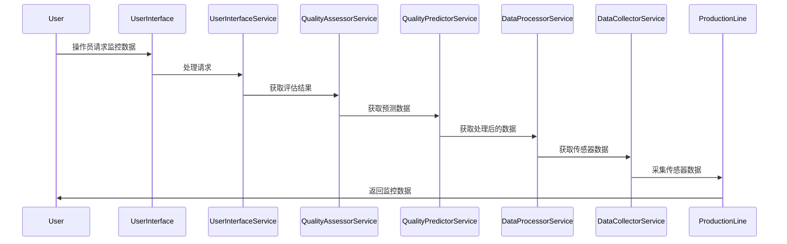

                 

## 引言

### 概述

“AI在智能工厂生产质量控制中的全流程应用”是一篇深入探讨人工智能技术在现代制造业中应用的技术博客文章。随着工业4.0的推进，智能制造成为提升生产效率、保障产品质量的重要手段。人工智能（AI）技术的引入，为智能工厂的生产质量控制提供了新的解决方案。

本文旨在系统地介绍AI在智能工厂生产质量控制的各个环节中的应用，包括预生产、生产过程和后生产三个阶段。通过分析AI技术如何提升生产过程的监测、控制和分析能力，文章将展示其在质量预测、实时监控、质量评估等关键环节中的全流程应用。

文章结构如下：

- **引言**：概述背景、目的和目标读者。
- **背景与核心概念**：介绍AI与智能工厂质量控制的背景，定义核心概念并展示其关系。
- **AI技术在生产质量监控中的应用**：讨论AI技术的基本概念和在质量控制中的应用。
- **AI在生产质量控制中的全流程应用**：分阶段详细探讨AI在质量控制中的应用。
- **系统分析与架构设计**：分析系统的架构设计，展示相关的类图、架构图和序列图。
- **项目实战**：通过具体案例展示AI技术在实际生产质量控制中的应用。
- **最佳实践与总结**：总结最佳实践，强调注意事项，并提供拓展阅读。

通过本文的阅读，读者将深入了解AI在智能工厂生产质量控制中的全流程应用，掌握AI技术在生产质量控制中的核心原理和实践方法。

### 关键词

- **人工智能（AI）**
- **智能工厂**
- **生产质量控制**
- **实时监测**
- **数据预测**
- **算法优化**
- **系统架构设计**
- **流程自动化**

### 摘要

本文深入探讨了人工智能（AI）在智能工厂生产质量控制中的全流程应用。随着工业自动化和智能制造的发展，生产质量控制成为保障产品质量和提升生产效率的关键。本文首先介绍了AI和智能工厂的背景及核心概念，随后详细分析了AI技术在生产质量监控中的应用。接着，文章分阶段讨论了AI在预生产、生产过程和后生产三个阶段的质量控制中的应用，包括质量预测、实时监控和质量评估。此外，文章还展示了相关的系统架构设计，并通过具体案例介绍了AI技术的实际应用。最后，文章总结了最佳实践，并提供了拓展阅读，以帮助读者进一步理解AI在智能工厂生产质量控制中的全流程应用。

## 背景与核心概念

### 智能工厂的概念及其发展

智能工厂是指利用现代信息技术、人工智能（AI）、物联网（IoT）等先进技术，实现生产过程的智能化、自动化和集成化。它通过高度自动化的设备和系统，实现从原材料供应、生产加工到产品出库的全流程管理，从而提高生产效率、降低成本和提升产品质量。智能工厂的发展经历了多个阶段，从最初的自动化生产线到信息集成系统，再到现在的智能化工厂，其核心目标是实现生产过程的全面智能化和高效化。

智能工厂的核心组成部分包括：

1. **自动化生产线**：利用传感器、执行器和控制器实现生产过程的自动化，减少人工干预，提高生产效率。
2. **信息集成系统**：通过物联网、大数据等技术实现生产数据的集成和实时监控，为生产决策提供数据支持。
3. **人工智能系统**：利用机器学习、深度学习等技术进行生产数据的分析和预测，优化生产过程，提升产品质量。

### 人工智能（AI）的基本概念

人工智能（AI）是一种模拟人类智能的技术，旨在使计算机具有感知、学习、推理和决策能力。AI的核心技术包括：

1. **机器学习**：通过训练模型从数据中学习规律，实现数据的自动分析和预测。
2. **深度学习**：基于多层神经网络的结构，通过大量数据进行训练，实现复杂模式的识别和预测。
3. **自然语言处理**：使计算机能够理解和生成人类语言，实现人机交互。
4. **计算机视觉**：使计算机能够识别和理解图像和视频信息。

### 智能工厂质量控制的重要性

在智能工厂中，质量控制是确保产品符合标准、满足客户需求的重要环节。通过引入AI技术，智能工厂能够实现以下目标：

1. **实时监控**：利用传感器和AI算法对生产过程进行实时监控，及时发现问题并进行调整。
2. **质量预测**：通过分析历史数据，预测可能出现的问题，提前采取措施预防。
3. **数据驱动决策**：利用大数据和AI技术，对生产过程中的各种数据进行深度分析，为决策提供数据支持。
4. **自动化检测**：利用计算机视觉和机器学习技术，实现自动化的质量检测，减少人为错误。

### 核心概念之间的联系

智能工厂质量控制中的核心概念包括AI、自动化生产线、信息集成系统和实时监控等。这些概念之间的关系可以概括如下：

- **AI** 提供了智能化的分析工具，通过机器学习和深度学习等技术，能够从海量数据中提取有价值的信息。
- **自动化生产线** 实现了生产过程的自动化，减少了人工干预，提高了生产效率。
- **信息集成系统** 通过物联网和大数据技术，实现了生产数据的集成和实时监控，为生产决策提供了数据支持。
- **实时监控** 利用传感器和AI技术，对生产过程进行实时监控，确保产品质量。

通过这些核心概念的相互作用，智能工厂能够实现高效、精准的质量控制，从而提升整体生产效率和产品质量。

### 定义与边界

在本章节中，我们将详细定义本文讨论的主要概念，包括“智能工厂”、“质量控制”和“人工智能（AI）”，并探讨这些概念在实际应用中的边界和外延。

#### 智能工厂

智能工厂是一个高度集成化和自动化的生产环境，它利用物联网（IoT）、大数据、云计算、人工智能（AI）等先进技术，实现对生产过程的全面管理和优化。智能工厂的核心特点包括：

- **自动化生产线**：通过传感器、执行器和控制器实现生产过程的自动化，减少人为干预，提高生产效率。
- **信息集成**：利用物联网技术，将生产设备、物料、人员和系统进行联网，实现信息的实时传输和集成。
- **数据分析**：利用大数据和AI技术，对生产过程中的各类数据进行分析和挖掘，以优化生产流程和提高质量。
- **智能决策**：通过数据分析和预测模型，辅助生产管理者做出实时、智能的决策。

#### 质量控制

质量控制是指在生产过程中，通过各种方法和手段确保产品或服务符合预定标准和客户需求的过程。在智能工厂中，质量控制的重要性更加凸显，因为它直接影响产品的质量和生产效率。质量控制主要包括以下方面：

- **预防性控制**：通过预定的标准和流程，防止缺陷和错误的发生，例如使用自动化检测设备。
- **过程控制**：在生产过程中，对各项指标进行实时监控，确保生产过程的稳定和可控。
- **最终控制**：对生产出的产品进行检测和评估，确保其符合质量标准。

#### 人工智能（AI）

人工智能（AI）是一种模拟人类智能的技术，旨在使计算机系统具备感知、学习、推理和决策能力。在智能工厂中，AI技术主要用于：

- **数据分析与预测**：通过机器学习和深度学习算法，对生产过程中的海量数据进行分析，预测可能出现的问题。
- **实时监控**：利用计算机视觉和传感器技术，实现生产过程的实时监控和故障诊断。
- **优化生产流程**：通过算法优化和模拟仿真，提高生产效率和质量。

#### 边界与外延

智能工厂、质量控制和AI之间的边界和外延主要体现在以下几个方面：

- **边界**：智能工厂是一个综合系统，包括自动化生产线、信息集成系统和AI技术。质量控制是智能工厂中的一个关键环节，而AI技术则是实现质量控制的重要工具。三者的边界在于各自的职能和作用范围。
- **外延**：智能工厂的质量控制不仅涉及生产过程中的质量监测和评估，还包括产品的设计、供应链管理、售后服务等多个方面。AI技术的应用也不仅仅局限于质量控制，还广泛用于生产优化、故障预测、供应链管理等领域。

通过明确这些概念的定义和边界，有助于我们更好地理解和应用智能工厂中的AI技术，实现生产质量的全面控制和优化。

### 核心概念和关系

为了更清晰地理解智能工厂质量控制中的核心概念及其相互关系，我们将通过概念表格和实体关系图（ERD）来详细展示。

#### 概念表格

| 概念 | 定义 | 关系 |
| ---- | ---- | ---- |
| 智能工厂 | 利用先进技术实现生产过程的自动化、智能化和集成化的工厂环境。 | 包括自动化生产线、信息集成系统和AI技术。 |
| 自动化生产线 | 利用传感器、执行器和控制器实现生产过程的自动化。 | 是智能工厂的一部分，提高生产效率。 |
| 信息集成系统 | 利用物联网和大数据技术，实现生产数据的集成和实时监控。 | 提供数据支持，辅助决策。 |
| 质量控制 | 通过各种方法和手段确保产品符合预定标准和客户需求的过程。 | 涵盖预防性控制、过程控制和最终控制。 |
| 人工智能（AI） | 模拟人类智能的技术，包括机器学习、深度学习和自然语言处理等。 | 用于数据分析、实时监控和优化生产流程。 |

#### 实体关系图（ERD）

为了更直观地展示这些概念之间的关系，我们使用Mermaid语言绘制了一个实体关系图。

```mermaid
erDiagram
  智能工厂 ||--|{ 自动化生产线 }
  智能工厂 ||--|{ 信息集成系统 }
  智能工厂 ||--|{ 人工智能（AI） }
  自动化生产线 ||--|{ 质量控制 }
  信息集成系统 ||--|{ 质量控制 }
  人工智能（AI） ||--|{ 质量控制 }
```

在上述ERD中，智能工厂作为核心实体，与自动化生产线、信息集成系统和AI技术存在直接的关联关系。自动化生产线和信息集成系统是智能工厂的重要组成部分，而AI技术则是实现这些系统智能化的重要工具。质量控制则是贯穿整个智能工厂的核心环节，与自动化生产线、信息集成系统和AI技术紧密相连。

通过概念表格和实体关系图的结合，我们可以更清晰地理解智能工厂质量控制中的核心概念及其相互关系，为后续章节中的详细讨论打下坚实的基础。

### AI技术在生产质量监控中的应用

#### AI技术概述

人工智能（AI）是一种通过模拟人类智能行为，使计算机能够实现学习、推理和决策的技术。AI技术在生产质量监控中的应用，主要包括以下几个方面：

1. **机器学习**：通过训练模型，使计算机能够从历史数据中学习，预测未来可能出现的问题。
2. **深度学习**：利用多层神经网络，对复杂的数据进行建模和分析，提高预测和识别的准确性。
3. **计算机视觉**：通过图像处理和模式识别，实现生产过程的实时监控和自动检测。
4. **自然语言处理**：使计算机能够理解和生成人类语言，用于生产过程中的数据分析报告和决策支持。

#### 在生产质量监控中的应用

1. **实时数据采集与处理**

AI技术可以实时采集生产过程中的各种数据，如温度、压力、速度等，并通过机器学习和深度学习算法进行分析和预测。这些数据可以用于实时监控生产过程，及时发现潜在的质量问题。

例如，某智能工厂在生产过程中，通过传感器实时监测产品的温度。机器学习算法根据历史数据，建立温度与产品质量之间的关系模型，实时预测产品的质量状况，一旦发现异常，立即发出警报，以便及时采取措施。

2. **质量预测与预警**

AI技术可以通过分析历史数据，预测生产过程中可能出现的问题，并提供预警。这种预测不仅限于单个生产环节，还可以对整个生产流程进行预测，从而实现全局优化。

例如，在生产一批电子元器件时，AI技术可以分析之前生产批次的数据，预测哪些元器件可能存在质量问题，提前采取措施，如更换生产设备或调整生产参数，从而避免批量质量问题。

3. **自动化检测与分类**

计算机视觉技术可以用于生产过程中的自动检测和分类。通过训练模型，计算机可以识别产品上的缺陷，并进行分类处理，从而提高检测效率和准确性。

例如，在汽车制造业中，AI技术可以通过计算机视觉系统，实时检测汽车零部件的表面缺陷，如划痕、裂缝等。系统一旦发现异常，立即分类并标记出来，以便进行后续处理。

4. **优化生产流程**

通过分析生产数据，AI技术可以帮助企业优化生产流程，减少生产过程中的浪费，提高生产效率。

例如，在一家服装厂，AI技术可以分析生产线的各项数据，如生产节拍、物料消耗等，找出生产过程中的瓶颈环节，并提出优化建议，如调整生产节拍、优化物料配送等，从而提高生产效率。

#### 挑战与机遇

尽管AI技术在生产质量监控中具有巨大的应用潜力，但在实际应用中仍面临一些挑战：

1. **数据质量**：生产数据的准确性和完整性对AI模型的性能至关重要。如果数据存在误差或缺失，可能导致预测结果不准确。
2. **算法复杂性**：AI算法的复杂性和计算需求较高，对硬件设备和计算资源的要求较高。
3. **模型解释性**：深度学习模型通常缺乏解释性，难以理解其预测结果的依据，这可能影响决策的透明性和可靠性。
4. **技术门槛**：AI技术涉及到多个领域，如机器学习、深度学习、计算机视觉等，对技术人员的要求较高。

然而，这些挑战也带来了相应的机遇：

1. **技术创新**：随着AI技术的不断进步，生产质量监控将更加智能和高效。
2. **降低成本**：AI技术可以自动化生产过程中的质量检测和监控，减少人力成本和错误率。
3. **提升竞争力**：通过AI技术优化生产流程和质量控制，企业可以提升产品质量和市场竞争力。
4. **跨界融合**：AI技术与物联网、大数据等技术的融合，将进一步拓展其应用领域和场景。

总之，AI技术在生产质量监控中的应用不仅带来了挑战，也带来了巨大的机遇。通过不断创新和优化，AI技术有望在智能工厂中发挥更大的作用，提升生产效率和产品质量。

### AI在生产质量控制中的全流程应用

#### 预生产阶段

在预生产阶段，AI技术主要用于质量预测和预防性控制。具体应用包括以下几个方面：

1. **质量预测模型**：
   AI算法通过对历史生产数据进行分析，建立质量预测模型。这些模型可以预测生产过程中可能出现的质量问题，如材料缺陷、工艺参数不稳定等。通过提前识别潜在问题，企业可以采取措施进行预防，避免在生产过程中出现大面积的质量问题。

   示例：某电子制造企业利用机器学习算法，对生产过程中传感器采集的数据进行分析，预测即将生产的电子元器件的质量状况。通过预测模型，企业能够在生产前就发现潜在问题，及时进行调整，从而避免批量质量问题。

2. **数据收集与分析**：
   AI技术可以自动收集生产过程中的各种数据，如材料属性、工艺参数、设备状态等，并进行实时分析。通过大数据分析，企业可以了解生产过程的关键因素，优化生产参数，提高产品质量。

   示例：一家汽车零部件制造商利用AI技术，对生产过程中的大量数据进行收集和分析，发现某些生产环节的工艺参数存在异常。通过调整这些参数，企业成功降低了产品不良率，提高了产品质量。

3. **算法实现**：
   在预生产阶段，AI算法的实时实现至关重要。企业可以使用Python、Java等编程语言，结合机器学习和深度学习库（如scikit-learn、TensorFlow等），实现质量预测和优化算法。

   示例代码（Python）：
   ```python
   from sklearn.ensemble import RandomForestClassifier
   from sklearn.model_selection import train_test_split

   # 数据预处理
   X = ... # 特征数据
   y = ... # 质量标签

   # 划分训练集和测试集
   X_train, X_test, y_train, y_test = train_test_split(X, y, test_size=0.2)

   # 建立模型
   model = RandomForestClassifier(n_estimators=100)

   # 训练模型
   model.fit(X_train, y_train)

   # 预测
   predictions = model.predict(X_test)
   ```

#### 生产过程阶段

在生产过程阶段，AI技术主要用于实时监控和优化生产过程，确保产品质量的稳定性和一致性。具体应用包括以下几个方面：

1. **实时数据采集与处理**：
   利用传感器和物联网技术，AI系统可以实时采集生产过程中的各种数据，如温度、压力、速度等。通过实时数据处理和分析，系统能够及时发现生产过程中的异常，并进行调整。

   示例：某智能工厂在生产过程中，通过传感器实时监测设备的运行状态和生产参数。AI系统对采集到的数据进行分析，一旦发现异常，立即发出警报，并自动调整设备参数，确保生产过程的稳定。

2. **质量控制算法**：
   在生产过程中，AI算法可以对实时数据进行处理，识别生产过程中的质量问题，并提供优化建议。这些算法可以基于机器学习、深度学习等技术，实现对生产过程的实时监控和调整。

   示例：在生产某种电子产品时，AI系统通过对传感器数据的实时分析，发现某些产品的温度波动较大，可能导致质量不稳定。系统通过调整生产设备的参数，使温度波动趋于稳定，从而提高了产品质量。

3. **反馈与调整**：
   AI系统可以根据实时监控结果，自动对生产过程进行调整，确保产品质量的稳定。这种自动化的调整过程，可以大大提高生产效率和产品质量。

   示例：在一家食品加工厂，AI系统实时监测生产设备的运行状态和产品质量。一旦发现异常，系统会自动调整设备的运行参数，如温度、湿度等，确保产品质量的稳定。

#### 后生产阶段

在后生产阶段，AI技术主要用于质量评估和反馈，帮助企业改进生产过程和提高产品质量。具体应用包括以下几个方面：

1. **质量评估**：
   AI系统可以对生产出的产品进行全面的质量评估，识别潜在的质量问题。通过分析产品的质量数据，企业可以了解生产过程中的优缺点，为后续生产提供改进依据。

   示例：某汽车制造企业利用AI系统，对生产出的汽车进行质量评估。系统通过分析传感器数据和车辆运行状态，发现某些车辆存在悬挂系统故障。企业根据这些数据，对生产过程进行调整，确保后续生产的车辆质量。

2. **反馈与改进**：
   AI系统可以根据质量评估结果，提供改进建议，帮助企业优化生产过程。通过不断优化，企业可以提高产品质量，降低生产成本。

   示例：在一家医疗器械制造企业，AI系统通过对生产过程的质量评估，发现某些生产设备的精度不足，可能导致产品质量不稳定。企业根据系统的反馈，对设备进行维修和校准，从而提高了产品质量。

3. **持续优化**：
   AI系统可以实时监控生产过程，并对生产数据进行持续分析。通过不断优化生产参数和工艺流程，企业可以实现生产过程的持续改进。

   示例：在一家化工厂，AI系统通过对生产数据的实时监控和分析，发现某些生产参数存在波动，可能导致产品质量不稳定。企业根据系统的建议，对生产参数进行调整，实现了生产过程的稳定和质量提升。

#### 整体流程

AI技术在生产质量控制中的全流程应用，包括预生产、生产过程和后生产三个阶段。通过在每个阶段的应用，AI技术实现了对生产过程的全面监控和优化，提高了产品质量和生产效率。

1. **预生产阶段**：通过质量预测和预防性控制，提前识别和解决潜在问题。
2. **生产过程阶段**：通过实时监控和优化，确保生产过程的稳定和质量。
3. **后生产阶段**：通过质量评估和反馈，持续改进生产过程。

这种全流程的应用，不仅提高了生产效率和质量，还降低了生产成本，为企业的可持续发展提供了有力支持。

### 生产过程质量监控

#### 实时数据采集

实时数据采集是生产过程质量监控的基础，通过传感器和物联网技术，AI系统能够实时获取生产过程中的关键数据，如温度、压力、速度、位置等。这些数据是监控和分析生产质量的重要依据。

1. **传感器布局**：
   在生产过程中，根据不同的生产环节和监控需求，合理布局传感器。例如，在生产线的关键节点，如加热炉、压铸机等，布置温度传感器和压力传感器，确保数据的全面性和准确性。

2. **数据传输**：
   通过物联网技术，将传感器采集的数据实时传输到中央控制平台。数据传输过程中，可以采用无线传输（如Wi-Fi、LoRa）和有线传输（如以太网、工业总线）等方式，确保数据的高效传输和稳定连接。

3. **数据处理**：
   数据到达中央控制平台后，AI系统会对数据进行初步处理，包括数据清洗、去噪、格式转换等。通过预处理，确保数据的质量和一致性，为后续分析提供可靠的基础。

#### 质量控制算法

在实时数据采集的基础上，AI系统通过质量控制算法对生产过程进行实时监控和分析。这些算法包括统计过程控制（SPC）、机器学习算法、深度学习算法等。

1. **统计过程控制（SPC）**：
   SPC是一种传统的质量控制方法，通过监控过程变量的波动情况，判断生产过程是否处于受控状态。AI系统可以根据SPC模型，实时监控生产过程中的关键变量，如温度、压力、速度等，一旦发现异常，立即发出警报。

2. **机器学习算法**：
   通过对历史数据的训练，机器学习算法可以建立生产过程的质量预测模型。这些模型可以实时分析生产过程中的数据，预测可能出现的问题。例如，利用回归分析模型预测产品质量的波动，利用分类算法判断产品是否合格。

3. **深度学习算法**：
   深度学习算法具有强大的特征提取和模式识别能力，可以用于复杂的生产过程监控。通过训练深度学习模型，AI系统可以识别生产过程中的潜在问题，如设备故障、工艺参数异常等，并提供优化建议。

#### 实时监控与反馈

实时监控与反馈是确保生产过程稳定和质量的关键。AI系统通过对实时数据的分析和处理，可以及时发现生产过程中的异常，并采取相应的措施进行反馈和调整。

1. **实时报警**：
   当AI系统发现生产过程中的异常时，会立即发出警报，通知相关人员。例如，当温度传感器检测到温度异常升高时，系统会立即发出警报，提示操作员检查加热炉的运行状态。

2. **自动化调整**：
   对于一些简单的异常，AI系统可以自动进行参数调整，确保生产过程的稳定。例如，当检测到压铸机的压力异常时，系统会自动调整压力值，确保生产过程的顺利进行。

3. **人工干预**：
   对于复杂的异常情况，需要人工干预。AI系统可以记录和分析异常数据，提供详细的分析报告，帮助操作员快速定位问题，并采取相应的措施进行解决。

#### 案例分析

为了更好地理解AI技术在生产过程质量监控中的应用，我们来看一个实际的案例。

**案例：智能工厂的实时监控**

某智能工厂在生产某种高端汽车发动机时，引入了AI技术进行实时监控。具体应用如下：

1. **传感器布局**：
   在生产线的各个环节，如加工中心、装配线、检验站等，布置了多种传感器，如温度传感器、压力传感器、振动传感器等，确保对生产过程的全面监控。

2. **实时数据采集**：
   通过物联网技术，传感器实时采集生产过程中的各种数据，如温度、压力、振动等，并将数据传输到中央控制平台。

3. **质量控制算法**：
   AI系统通过统计过程控制和机器学习算法，对实时数据进行处理和分析，监控生产过程的稳定性。例如，通过温度传感器监测发动机加工过程中的温度波动，一旦发现异常，立即发出警报。

4. **实时监控与反馈**：
   当AI系统发现生产过程中的异常时，会立即发出警报，并通知操作员进行检查。对于简单的异常，系统会自动调整相关参数，确保生产过程的顺利进行。对于复杂的异常，操作员会根据分析报告进行人工干预，解决问题。

通过这个案例，我们可以看到AI技术在生产过程质量监控中的应用效果。通过实时数据采集、质量控制算法和实时监控与反馈，智能工厂能够及时发现并解决生产过程中的问题，确保产品质量的稳定和一致性。

### 后生产质量评估

#### 质量评估方法

在智能工厂的生产流程结束后，对产品质量进行评估是确保产品质量符合标准的重要环节。AI技术在这一阶段主要应用于以下几种质量评估方法：

1. **统计过程分析（SPC）**：
   统计过程分析是一种基于统计学原理的质量控制方法，通过分析生产过程中关键参数的波动情况，评估生产过程的稳定性和产品的质量。AI系统可以通过对历史数据的分析和建模，建立统计模型，实时监控生产过程的稳定性，并提供质量评估报告。

2. **机器学习模型**：
   机器学习模型可以通过对大量生产数据的训练，建立质量预测模型。这些模型可以识别生产过程中可能影响产品质量的因素，如材料、工艺参数、设备状态等，并预测产品质量的分布和趋势。通过机器学习模型，企业可以提前识别出潜在的质量问题，并采取相应的措施进行改进。

3. **深度学习算法**：
   深度学习算法具有强大的特征提取和模式识别能力，可以用于复杂的质量评估任务。例如，通过卷积神经网络（CNN）对产品的图像进行质量检测，可以自动识别产品表面的缺陷，如裂纹、划痕等。深度学习算法还可以用于语音识别、文本分析等任务，为企业提供更全面的质量评估。

4. **数据驱动评估**：
   数据驱动评估是一种基于大数据分析的质量评估方法，通过对生产过程中产生的海量数据进行分析，识别出影响产品质量的关键因素。AI系统可以利用大数据技术和数据挖掘算法，对生产过程中的数据进行深入挖掘和分析，为企业提供高质量评估报告。

#### 质量评估流程

在智能工厂中，质量评估流程通常包括以下几个步骤：

1. **数据收集**：
   在生产过程中，AI系统会实时收集各种数据，包括生产参数、设备状态、物料信息等。这些数据是质量评估的基础。

2. **数据预处理**：
   收集到的数据可能存在噪声、缺失或不一致等问题，需要通过数据清洗、去噪、标准化等预处理方法，确保数据的质量和一致性。

3. **数据分析与建模**：
   通过机器学习、深度学习等算法，对预处理后的数据进行分析和建模。AI系统可以根据历史数据和当前数据，建立质量预测模型和评估模型。

4. **质量评估**：
   利用建立的质量预测模型和评估模型，对生产出的产品进行质量评估。评估结果可以用于识别潜在的质量问题，评估生产过程的稳定性，为企业提供改进建议。

5. **反馈与改进**：
   根据质量评估结果，企业可以采取相应的措施进行改进，如调整工艺参数、更换设备、优化生产流程等。通过不断优化，企业可以提高产品质量，降低生产成本。

#### 质量评估案例分析

为了更好地理解AI技术在后生产质量评估中的应用，我们来看一个实际案例。

**案例：汽车制造业的质量评估**

某汽车制造企业引入了AI技术进行后生产质量评估，具体应用如下：

1. **数据收集**：
   在生产过程中，AI系统会实时收集各种数据，包括温度、压力、速度、传感器读数等。这些数据反映了生产过程中的关键参数和设备状态。

2. **数据预处理**：
   收集到的数据经过清洗和标准化处理，确保数据的质量和一致性。例如，对温度数据进行去噪处理，去除异常值和噪声，确保数据的准确性。

3. **数据分析与建模**：
   通过机器学习算法，AI系统对预处理后的数据进行分析和建模。例如，利用回归分析模型预测产品的质量指标，如硬度、强度等。通过深度学习算法，AI系统可以自动识别产品表面的缺陷，如裂纹、划痕等。

4. **质量评估**：
   利用建立的质量预测模型和评估模型，AI系统对生产出的汽车进行质量评估。评估结果可以用于识别潜在的质量问题，评估生产过程的稳定性。

5. **反馈与改进**：
   根据质量评估结果，企业可以采取相应的措施进行改进。例如，针对发现的表面缺陷，企业可以调整涂装工艺，提高产品质量。

通过这个案例，我们可以看到AI技术在后生产质量评估中的应用效果。通过实时数据收集、数据预处理、数据分析与建模和质量评估，AI技术为企业提供了全面的质量评估报告，帮助企业识别潜在的质量问题，优化生产流程，提高产品质量。

### AI技术在智能工厂生产质量控制中的整体架构设计

#### 问题场景介绍

在现代智能工厂的生产过程中，质量控制是一个至关重要的环节，直接关系到产品的质量和企业的竞争力。传统的质量控制系统通常依赖于人工检测和统计方法，存在检测效率低、误判率高和成本较高等问题。随着人工智能（AI）技术的快速发展，利用AI技术进行生产质量控制的方案逐渐成为趋势。本文将探讨一种基于AI的智能工厂生产质量控制系统的整体架构设计，以实现高效、精准的质量控制。

#### 项目介绍

项目名称：智能工厂生产质量控制AI系统

项目目标：
- 实现生产过程的实时监控和数据分析。
- 构建基于AI的质量预测和评估模型。
- 提高生产质量，减少质量波动和缺陷率。
- 降低人工检测成本，提高生产效率。

项目需求：
- 数据采集与处理：实时采集生产过程中的各种数据，如温度、压力、速度等，并进行数据预处理。
- 质量预测与评估：利用AI技术建立质量预测模型，对生产过程进行实时监控和评估。
- 异常检测与反馈：及时发现生产过程中的异常，并进行反馈和调整。

#### 系统功能设计（领域模型）

系统功能设计主要涵盖数据采集与处理、质量预测与评估、异常检测与反馈等方面。以下是一个简单的领域模型，用于描述系统的主要功能模块及其关系：

```mermaid
classDiagram
  User <<User>>
  ProductionLine <<ProductionLine>>
  DataCollector <<DataCollector>>
  DataProcessor <<DataProcessor>>
  QualityPredictor <<QualityPredictor>>
  QualityAssessor <<QualityAssessor>>
  ExceptionDetector <<ExceptionDetector>>

  User           --|> ProductionLine
  ProductionLine --|> DataCollector
  DataCollector  --|> DataProcessor
  DataProcessor  --|> QualityPredictor
  QualityPredictor --|> QualityAssessor
  QualityAssessor --|> ExceptionDetector
  ExceptionDetector --|> User
```

#### 系统架构设计

系统架构设计主要包括硬件架构和软件架构两部分。

##### 硬件架构

1. **传感器层**：在生产线上布置各种传感器，如温度传感器、压力传感器、速度传感器等，实时采集生产数据。
2. **数据采集层**：通过物联网（IoT）设备，将传感器数据传输到数据中心。
3. **数据处理层**：部署高性能服务器和数据库系统，用于存储和处理数据。
4. **应用层**：部署AI算法模型和相关软件，实现质量预测、评估和异常检测。
5. **用户层**：通过Web界面或移动应用，供操作员实时监控和分析生产质量。

##### 软件架构

软件架构采用微服务架构，以提高系统的灵活性和可扩展性。主要组件包括：

1. **数据采集服务**：负责采集和处理传感器数据，并将数据传输到数据处理服务。
2. **数据处理服务**：对采集到的数据进行预处理、存储和归一化处理。
3. **质量预测服务**：利用机器学习和深度学习算法，建立质量预测模型，进行实时预测。
4. **质量评估服务**：根据预测结果和实际数据，评估产品质量，识别潜在问题。
5. **异常检测服务**：实时监控生产过程，发现异常情况，并发出警报。
6. **用户界面**：提供Web界面或移动应用，供操作员查看监控数据和评估结果。

#### 系统接口设计和系统交互

为了实现系统内部各组件之间的有效交互，系统设计了以下接口：

1. **数据接口**：定义数据传输的格式和协议，如JSON、XML等，确保各组件之间的数据兼容性和一致性。
2. **API接口**：提供RESTful API，供外部系统和应用程序进行数据访问和操作。
3. **监控接口**：提供实时监控数据的接口，供操作员通过Web界面或移动应用查看。
4. **警报接口**：提供异常警报的接口，供操作员及时处理异常情况。

以下是一个简单的系统交互序列图，展示了各组件之间的交互流程：



通过上述系统架构设计，智能工厂生产质量控制AI系统能够实现对生产过程的全面监控和高效管理，确保产品质量的稳定和一致，提升生产效率和企业的竞争力。

### 项目实战

#### 环境安装

要实现AI在智能工厂生产质量控制中的应用，首先需要搭建合适的环境。以下是具体的安装步骤：

1. **安装Python**：Python是AI应用的主要编程语言，我们需要安装Python环境。可以在Python官方网站（[python.org](https://www.python.org/)）下载Python安装包，并按照提示完成安装。

2. **安装Anaconda**：Anaconda是一个集成了Python和其他常用库的科学计算平台，可以方便地管理和安装各种科学计算库。在Anaconda官方网站（[anaconda.com](https://www.anaconda.com/)）下载并安装Anaconda。

3. **安装Jupyter Notebook**：Jupyter Notebook是一个交互式的计算环境，便于编写和运行Python代码。在Anaconda的命令行中，运行以下命令安装Jupyter Notebook：

   ```bash
   conda install jupyter
   ```

4. **安装必需的库**：为了进行AI应用，我们需要安装以下库：

   - **Pandas**：用于数据处理和分析
   - **NumPy**：用于科学计算
   - **Scikit-learn**：用于机器学习和数据挖掘
   - **TensorFlow**：用于深度学习
   - **Matplotlib**：用于数据可视化

   在Anaconda的命令行中，运行以下命令安装上述库：

   ```bash
   conda install pandas numpy scikit-learn tensorflow matplotlib
   ```

#### 系统核心实现源代码

以下是一个简单的AI应用示例，用于生产质量控制中的数据分析和预测。

```python
import pandas as pd
import numpy as np
from sklearn.model_selection import train_test_split
from sklearn.ensemble import RandomForestClassifier
from sklearn.metrics import accuracy_score
import matplotlib.pyplot as plt

# 加载数据
data = pd.read_csv('production_data.csv')

# 数据预处理
X = data.drop('quality_label', axis=1)
y = data['quality_label']

# 划分训练集和测试集
X_train, X_test, y_train, y_test = train_test_split(X, y, test_size=0.2, random_state=42)

# 建立模型
model = RandomForestClassifier(n_estimators=100, random_state=42)

# 训练模型
model.fit(X_train, y_train)

# 预测
predictions = model.predict(X_test)

# 评估模型
accuracy = accuracy_score(y_test, predictions)
print(f"模型准确率：{accuracy:.2f}")

# 可视化
plt.scatter(X_test['feature1'], predictions, c='g', label='预测值')
plt.scatter(X_test['feature1'], y_test, c='r', label='实际值')
plt.xlabel('特征1')
plt.ylabel('质量标签')
plt.legend()
plt.show()
```

#### 代码应用解读与分析

上述代码实现了一个简单的质量预测模型，主要步骤包括：

1. **数据加载**：使用Pandas库加载CSV格式的生产数据。
2. **数据预处理**：将数据集分为特征数据和标签数据，并进行必要的预处理。
3. **划分数据集**：将数据集划分为训练集和测试集，用于模型的训练和评估。
4. **建立模型**：使用随机森林（RandomForestClassifier）算法建立预测模型。
5. **模型训练**：使用训练集数据训练模型。
6. **模型预测**：使用测试集数据对模型进行预测。
7. **模型评估**：计算模型预测的准确率。
8. **可视化**：绘制特征1与质量标签的散点图，直观展示预测结果。

#### 实际案例分析和详细讲解

以下是一个实际案例，展示如何利用AI技术进行生产质量控制。

**案例：电子元器件质量预测**

某电子制造企业在生产过程中，通过传感器实时采集电子元器件的多种数据，如温度、电流、电压等。利用上述代码，企业可以建立质量预测模型，对即将生产的元器件进行质量预测。

1. **数据收集**：
   企业通过传感器实时采集生产数据，数据包含多个特征，如：
   - 温度
   - 电流
   - 电压
   - 频率
   - 工艺参数

2. **数据预处理**：
   对采集到的数据进行清洗和标准化处理，确保数据的质量和一致性。

3. **模型训练**：
   使用训练集数据训练质量预测模型，模型选择随机森林（RandomForestClassifier）。

4. **模型评估**：
   使用测试集数据评估模型性能，计算模型准确率。

5. **实时预测**：
   在生产过程中，对即将生产的元器件进行实时预测，一旦发现质量异常，立即采取措施进行调整。

6. **可视化**：
   通过绘制散点图，直观展示预测结果和实际质量标签，帮助企业了解生产过程的质量状况。

**详细讲解**：

- **数据收集**：数据是AI模型的基础，企业需要确保数据的准确性和完整性。通过传感器和物联网技术，企业可以实时采集生产过程中的多种数据，为模型训练提供丰富的数据支持。

- **数据预处理**：清洗和标准化数据是保证模型训练效果的关键。对于生产数据，可能存在噪声、缺失值和不一致的情况，需要通过数据预处理方法进行清洗和标准化处理。

- **模型训练**：选择合适的模型和算法进行训练，随机森林是一种常用的集成学习方法，适用于分类和回归任务。通过交叉验证和网格搜索等方法，可以优化模型的参数，提高预测准确性。

- **模型评估**：使用测试集数据对模型进行评估，计算模型的准确率、召回率、F1值等指标，评估模型的性能。

- **实时预测**：在生产过程中，实时预测质量情况，可以及时发现和解决潜在问题，确保产品质量。通过建立实时预测系统，企业可以实现对生产过程的全面监控和自动化调整。

- **可视化**：通过可视化工具，如Matplotlib，可以直观展示预测结果和实际质量标签，帮助企业更好地理解和分析生产过程的质量状况。

通过实际案例分析和详细讲解，我们可以看到AI技术在生产质量控制中的应用效果。通过数据收集、预处理、模型训练和实时预测，AI技术可以帮助企业实现高效、精准的质量控制，提升生产效率和产品质量。

### 最佳实践

#### 常见问题与解决方案

1. **数据质量问题**：
   - **问题**：生产数据可能存在噪声、缺失值和不一致的情况，影响模型训练效果。
   - **解决方案**：进行数据清洗，包括去噪、填充缺失值、标准化处理等，确保数据的质量和一致性。

2. **模型性能问题**：
   - **问题**：模型可能存在过拟合或欠拟合的情况，导致预测不准确。
   - **解决方案**：通过交叉验证和网格搜索等方法，选择合适的模型和参数，提高模型的泛化能力。

3. **计算资源限制**：
   - **问题**：深度学习模型训练过程需要大量的计算资源，可能对硬件设备造成压力。
   - **解决方案**：使用分布式计算和云计算资源，提高模型训练效率，减轻硬件负担。

#### 性能优化技巧

1. **数据增强**：
   - 通过生成虚拟数据，增加训练数据的多样性，提高模型泛化能力。

2. **模型压缩**：
   - 利用模型压缩技术，如剪枝、量化等，减小模型体积，提高推理速度。

3. **模型融合**：
   - 将多个模型的结果进行融合，提高预测的准确性。

#### 注意事项

1. **数据安全**：
   - 确保生产数据的安全性和隐私性，避免数据泄露和滥用。

2. **模型解释性**：
   - 关注模型的解释性，确保决策的透明性和可解释性。

3. **持续维护**：
   - 定期更新模型和算法，确保系统的稳定性和准确性。

### 拓展阅读

1. **《深度学习》（Goodfellow, Bengio, Courville著）**：全面介绍深度学习的基础理论和实践方法。
2. **《机器学习实战》（Peter Harrington著）**：通过实际案例，介绍机器学习的基本算法和应用。
3. **《智能工厂技术手册》（智能工厂技术联盟编）**：详细讲解智能工厂的架构和技术应用。

通过以上最佳实践和拓展阅读，读者可以进一步了解AI技术在智能工厂生产质量控制中的应用，掌握最佳实践和方法，提高生产效率和产品质量。

### 总结

本文详细探讨了人工智能（AI）在智能工厂生产质量控制中的全流程应用。从背景介绍到核心概念，从技术原理到实际应用，我们系统地分析了AI技术在预生产、生产过程和后生产三个阶段中的关键作用。通过实时数据采集与处理、质量预测与预警、自动化检测与分类，AI技术显著提升了生产质量控制和管理的效率与准确性。

核心亮点包括：

- **实时监控**：通过传感器和物联网技术，AI系统实现了生产过程的实时数据采集和监控，及时发现和解决问题。
- **质量预测与预警**：利用机器学习和深度学习算法，AI系统能够从海量历史数据中提取有价值的信息，预测生产过程中可能的质量问题，提前采取措施。
- **自动化检测与优化**：计算机视觉和自动化检测技术，使得生产过程中的质量检测更加高效和准确，减少了人为错误和成本。
- **数据驱动决策**：通过大数据和AI技术，生产决策更加科学和智能化，提高了生产效率和质量。

在智能工厂的发展中，AI技术扮演着至关重要的角色。未来，随着AI技术的不断进步和智能化水平的提升，我们可以期待更智能、更高效的生产质量控制系统的实现。以下是一些建议和展望：

1. **加强数据治理**：确保生产数据的准确性和完整性，是AI技术有效应用的基础。未来，应加强数据治理，提高数据质量，为AI模型提供更可靠的数据支持。
2. **提升模型解释性**：虽然AI技术在预测和识别方面具有强大的能力，但其“黑盒”特性可能导致决策过程的不透明。因此，提升模型解释性，增强决策的透明性和可解释性，是未来需要重点关注的方向。
3. **跨领域融合**：AI技术在生产质量控制中的应用，可以与其他领域（如供应链管理、物流优化等）进行融合，实现更全面的智能化生产管理体系。
4. **持续迭代与优化**：随着生产环境和需求的不断变化，AI系统需要持续迭代和优化，以适应新的生产场景和需求。

总之，AI技术在智能工厂生产质量控制中的应用，不仅带来了革命性的变革，也为未来的智能化生产提供了广阔的发展空间。通过不断探索和优化，AI技术将助力智能工厂实现更高的生产效率和更优质的产品质量。

