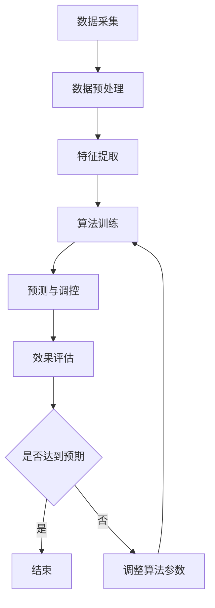
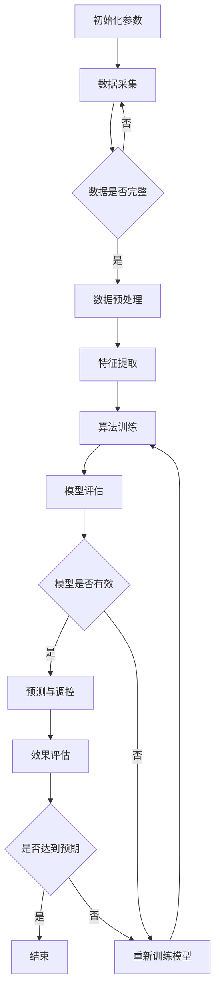
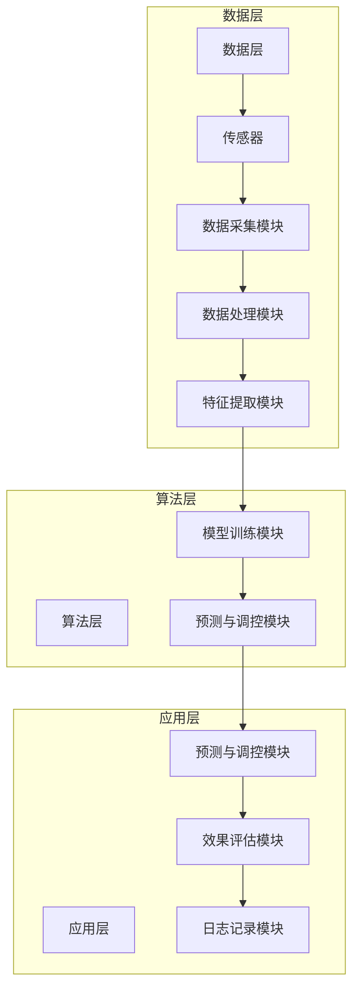
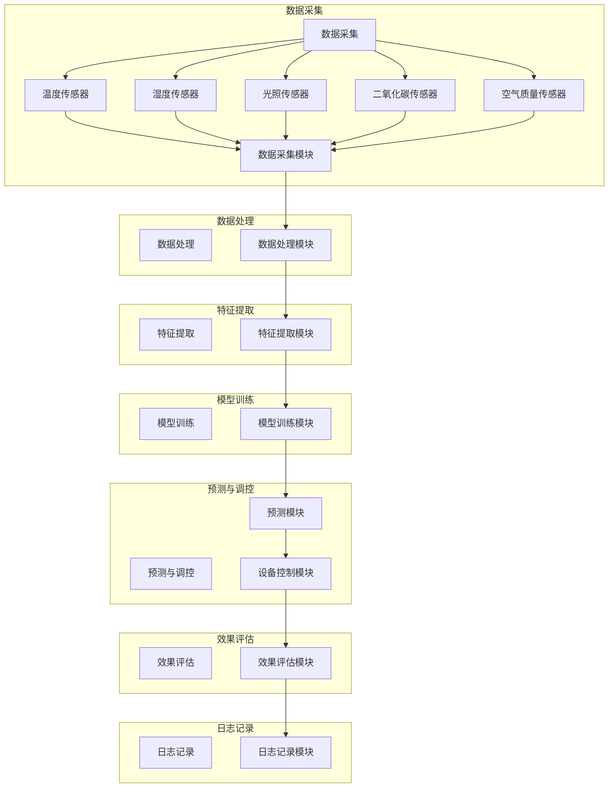
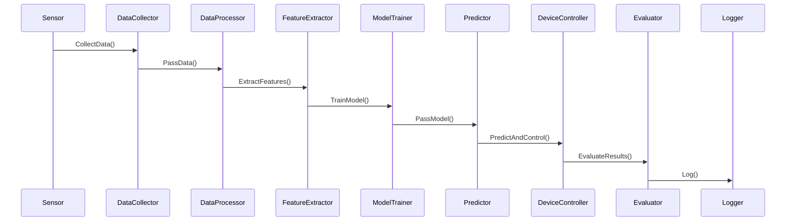

                 

### 第1章：AI在智能建筑室内环境优化中的角色

#### 1.1 问题背景

智能建筑是指通过现代信息技术，特别是物联网（IoT）、大数据、云计算和人工智能（AI）等技术，实现对建筑物内各种设备和系统的自动化、智能化管理。随着城市化进程的加快，智能建筑在全球范围内得到了快速发展。智能建筑室内环境优化成为其中的重要组成部分，主要涉及对室内温度、湿度、光照、空气质量等参数的智能调控，以达到节能、舒适和健康的目的。

在当前社会，能源消耗和环境污染问题日益严重，智能建筑通过智能化控制技术，能够显著降低能耗，减少碳排放。此外，室内环境对人的身心健康有着重要影响，优化室内环境质量有助于提高人们的居住和工作质量。

AI技术在智能建筑室内环境优化中的应用，主要体现在以下几个方面：

1. **数据采集与处理**：AI可以通过传感器网络收集室内环境数据，如温度、湿度、二氧化碳浓度等，并对这些数据进行实时处理和分析。
2. **智能预测与调控**：基于收集到的数据，AI算法可以预测室内环境的变化趋势，并自动调整相关设备，如空调、通风系统、照明系统等，以保持室内环境的舒适度。
3. **故障诊断与维护**：AI技术能够实时监测建筑设备的状态，当发现故障时，可以提前预警，并进行智能化的维护和修复。
4. **节能优化**：通过AI算法对能耗数据进行分析，可以找出优化空间，制定节能方案，降低能源消耗。

然而，AI技术在智能建筑室内环境优化中也面临一定的挑战，如数据安全、隐私保护、算法透明性和可靠性等。因此，如何在确保安全和可靠的前提下，充分发挥AI技术的优势，成为当前研究的热点问题。

#### 1.2 关键概念

为了更好地理解智能建筑室内环境优化的原理和应用，我们需要先了解以下几个关键概念：

1. **智能建筑**：智能建筑是通过物联网、大数据、云计算和人工智能等技术，对建筑物内的设备、系统和环境进行自动化、智能化管理的建筑。
2. **室内环境优化**：室内环境优化是指通过智能调控，使室内温度、湿度、光照、空气质量等参数保持在适宜范围内，以满足人体舒适和节能的需求。
3. **多参数控制**：多参数控制是指同时考虑多个变量（如温度、湿度、光照、空气质量等）的相互影响，进行综合调控，以达到最优的环境效果。
4. **AI技术**：AI技术包括机器学习、深度学习、神经网络等，通过这些算法，计算机可以从数据中学习，并做出智能决策。

#### 1.3 AI在多参数控制中的应用

AI在多参数控制中的应用，主要依赖于以下几种技术：

1. **机器学习算法**：机器学习算法可以通过训练数据集，学习到室内环境参数之间的关系，从而预测未来的环境变化，并自动调整设备。

   **算法原理**：机器学习算法通常包括监督学习、无监督学习和强化学习等类型。监督学习通过已标记的数据进行训练，无监督学习则通过未标记的数据进行训练，而强化学习通过试错学习来优化行为。

   **应用场景**：例如，通过收集历史温度、湿度等数据，训练机器学习模型，可以预测未来室内环境的温度变化，并自动调整空调系统。

2. **深度学习算法**：深度学习算法是机器学习的一个分支，通过多层神经网络，对复杂的环境参数进行建模。

   **算法原理**：深度学习算法通过多层神经元的非线性变换，可以提取出数据中的复杂特征。

   **应用场景**：例如，通过深度学习算法，可以分析室内空气质量数据，识别出有害气体，并自动调整通风系统。

3. **神经网络**：神经网络是深度学习的基础，通过模拟人脑神经元的工作方式，实现对复杂问题的建模和预测。

   **算法原理**：神经网络通过输入层、隐藏层和输出层，对输入数据进行处理和输出预测结果。

   **应用场景**：例如，通过神经网络模型，可以预测室内光照强度，并自动调整照明系统，以保持室内亮度适宜。

#### 1.4 研究范围与目标

本研究主要围绕以下范围和目标展开：

1. **研究范围**：本文主要研究AI在智能建筑室内环境优化中的多参数控制应用，包括数据采集、处理、预测和调控等环节。
2. **研究目标**：
   - 探索适用于智能建筑室内环境优化的机器学习算法和深度学习算法。
   - 研究多参数控制算法的原理和数学模型。
   - 设计并实现一个基于AI的智能建筑室内环境优化系统。
   - 通过实际案例，验证系统在实际应用中的效果和可行性。

#### 1.5 边界与外延

本研究主要关注以下几个方面：

1. **边界**：本文主要研究AI在智能建筑室内环境优化中的应用，不涉及建筑外部环境的优化，如城市环境、交通环境等。
2. **外延**：虽然本文主要关注室内环境优化，但AI技术在其他建筑环境优化领域，如室外环境、工业环境等，也有广泛的应用潜力。

通过以上分析，我们可以看到，AI在智能建筑室内环境优化中具有重要的作用，通过多参数控制技术，可以实现对室内环境的智能调控，提高居住和工作的舒适度，同时也有助于节能和环境保护。在接下来的章节中，我们将进一步探讨AI算法的原理、数学模型、系统设计与实现，以及实际应用中的挑战和解决方案。

### 第2章：AI算法原理与应用

#### 2.1 多参数控制算法原理

多参数控制算法是指同时考虑多个变量（如温度、湿度、光照、空气质量等）的相互影响，进行综合调控，以达到最优的环境效果的算法。其基本原理可以概括为数据采集、数据处理、预测与调控、效果评估等几个步骤。

1. **数据采集**：首先，通过传感器网络收集室内环境数据，包括温度、湿度、光照、二氧化碳浓度、空气质量等参数。
   
2. **数据处理**：对采集到的数据进行预处理，包括数据清洗、去噪、归一化等，以消除异常值和噪声，提高数据的准确性。

3. **预测与调控**：利用机器学习算法或深度学习算法，对预处理后的数据进行分析，预测未来室内环境的变化趋势，并基于预测结果自动调整相关设备，如空调、通风系统、照明系统等。

4. **效果评估**：通过评估系统调控后的环境参数，判断是否达到预期的优化效果，如果效果不佳，则调整算法参数或设备设置，以达到更好的优化效果。

#### 2.1.1 多参数控制算法的基本流程

多参数控制算法的基本流程可以概括为以下步骤：

1. **数据采集**：通过传感器网络，实时收集室内环境数据。
2. **数据预处理**：对采集到的数据进行清洗、去噪、归一化等处理，以提高数据的准确性。
3. **特征提取**：从预处理后的数据中提取关键特征，用于后续的算法训练和预测。
4. **算法训练**：利用机器学习或深度学习算法，对提取的特征进行训练，建立预测模型。
5. **预测与调控**：根据预测模型，预测未来室内环境的变化趋势，并自动调整相关设备。
6. **效果评估**：评估系统调控后的环境参数，判断是否达到预期的优化效果。

#### 2.1.2 多参数控制算法的分类

多参数控制算法可以根据不同的分类标准进行分类，常见的分类标准包括：

1. **按算法类型分类**：
   - **监督学习算法**：监督学习算法是通过对已标记的数据进行训练，来预测新的数据。常见的监督学习算法包括线性回归、决策树、随机森林、支持向量机等。
   - **无监督学习算法**：无监督学习算法是通过对未标记的数据进行训练，来发现数据中的隐藏结构和模式。常见的无监督学习算法包括聚类算法、主成分分析（PCA）等。
   - **强化学习算法**：强化学习算法是通过试错学习来优化行为，其核心思想是通过奖励机制来引导系统达到最优状态。常见的强化学习算法包括Q学习、深度Q网络（DQN）等。

2. **按应用场景分类**：
   - **单一参数优化算法**：这类算法主要关注单一参数的优化，如温度控制算法、湿度控制算法等。
   - **多参数综合优化算法**：这类算法同时考虑多个参数的相互影响，进行综合调控，如多变量线性回归、多变量神经网络等。

#### 2.1.3 多参数控制算法的属性特征对比

多参数控制算法的属性特征对比表如下：

| 算法类型 | 特性 | 优点 | 缺点 |
| :--: | :--: | :--: | :--: |
| 线性回归 | 简单易懂，易于实现 | 对于线性关系有明显优势 | 对于非线性关系表现较差 |
| 决策树 | 易于理解，可解释性高 | 对特征依赖性强的数据效果较好 | 过拟合问题较严重，模型复杂度较高 |
| 随机森林 | 减少过拟合，提高泛化能力 | 对特征依赖性强的数据效果较好 | 需要大量计算资源 |
| 支持向量机 | 提高分类精度，处理高维数据 | 对于线性和非线性关系都有较好的表现 | 计算复杂度高，训练时间较长 |
| 聚类算法 | 发现数据中的隐藏结构和模式 | 无需标记数据，可自动识别数据群 | 难以解释，结果依赖初始化参数 |
| Q学习 | 通过试错学习优化行为 | 可以解决动态环境中的优化问题 | 需要大量训练时间和计算资源 |
| DQN | 利用深度神经网络提高预测精度 | 可以处理高维输入，自动提取特征 | 过拟合问题较严重，训练时间较长 |

#### 2.1.4 多参数控制算法的优缺点分析

不同类型的多参数控制算法具有不同的优缺点，以下对其优缺点进行分析：

1. **线性回归**：
   - **优点**：线性回归算法简单易懂，易于实现，对于线性关系有较好的表现。
   - **缺点**：线性回归算法对于非线性关系表现较差，且容易出现过拟合问题。

2. **决策树**：
   - **优点**：决策树算法可解释性高，易于理解，对于特征依赖性强的数据效果较好。
   - **缺点**：决策树算法容易出现过拟合问题，且模型复杂度较高。

3. **随机森林**：
   - **优点**：随机森林算法减少了过拟合问题，提高了泛化能力，对于特征依赖性强的数据效果较好。
   - **缺点**：随机森林算法需要大量计算资源，且对于极端情况下的表现较差。

4. **支持向量机**：
   - **优点**：支持向量机算法可以提高分类精度，处理高维数据，对于线性和非线性关系都有较好的表现。
   - **缺点**：支持向量机算法计算复杂度高，训练时间较长。

5. **聚类算法**：
   - **优点**：聚类算法可以自动识别数据群，无需标记数据。
   - **缺点**：聚类算法难以解释，结果依赖初始化参数。

6. **Q学习**：
   - **优点**：Q学习算法可以通过试错学习优化行为，可以解决动态环境中的优化问题。
   - **缺点**：Q学习算法需要大量训练时间和计算资源。

7. **DQN**：
   - **优点**：DQN算法利用深度神经网络提高预测精度，可以处理高维输入，自动提取特征。
   - **缺点**：DQN算法过拟合问题较严重，训练时间较长。

#### 2.2 数学模型与公式

在多参数控制算法中，数学模型和公式是理解和实现算法的核心。以下介绍多参数控制算法中的常见数学模型和公式。

##### 2.2.1 数学模型的基本概念

数学模型是通过数学方法对现实世界中的问题进行抽象和描述的一种工具。在多参数控制算法中，数学模型通常用于描述环境参数之间的关系，以及算法的预测和调控过程。

常见的数学模型包括线性模型、非线性模型、差分方程等。线性模型通常用于描述线性关系，如线性回归；非线性模型则用于描述非线性关系，如神经网络；差分方程则用于描述离散时间系统。

##### 2.2.2 多参数控制中的常见数学公式

以下是多参数控制中常见的数学公式：

1. **线性回归模型**：
   - 公式：\(y = \beta_0 + \beta_1x_1 + \beta_2x_2 + ... + \beta_nx_n\)
   - 解释：线性回归模型通过线性组合输入变量\(x_1, x_2, ..., x_n\)和权重\(\beta_1, \beta_2, ..., \beta_n\)，来预测目标变量\(y\)。

2. **神经网络模型**：
   - 公式：
     \[
     a_{\text{激活}} = \sigma(z)
     \]
     \[
     z = w_1x_1 + w_2x_2 + ... + w_nx_n + b
     \]
   - 解释：神经网络模型通过多层神经元的非线性变换，来提取数据中的复杂特征。其中，\(z\)是神经元的输入，\(w\)是权重，\(b\)是偏置，\(\sigma\)是激活函数。

3. **差分方程**：
   - 公式：
     \[
     y(n) = a_0y(n-1) + a_1y(n-2) + ... + a_ny(n-n)
     \]
   - 解释：差分方程用于描述离散时间系统的动态行为，其中，\(y(n)\)是第\(n\)时刻的输出，\(a_0, a_1, ..., a_n\)是方程的系数。

##### 2.2.3 数学模型的Python实现

以下是一个简单的Python实现示例，用于演示线性回归模型的实现：

```python
import numpy as np

# 线性回归模型参数
beta_0 = 0
beta_1 = 1

# 输入数据
x = np.array([1, 2, 3, 4, 5])
y = np.array([2, 4, 5, 4, 5])

# 预测
y_pred = beta_0 + beta_1 * x

# 比较预测值和真实值
print("预测值：", y_pred)
print("真实值：", y)
```

通过以上实现，我们可以看到，线性回归模型通过简单的线性组合，对输入数据进行预测。

#### 2.3 算法流程图

为了更好地理解多参数控制算法的执行流程，我们可以使用Mermaid流程图来展示。以下是一个简单的多参数控制算法的Mermaid流程图示例：



在这个流程图中，我们从数据采集开始，经过数据预处理、特征提取、算法训练、预测与调控，最后进行效果评估。如果评估结果显示未达到预期效果，则调整算法参数，重新进行算法训练。

#### 2.3.1 多参数控制算法的Mermaid流程图

以下是一个详细的多参数控制算法的Mermaid流程图，用于展示算法的执行步骤和关键环节：



在这个流程图中，我们首先初始化算法参数，然后进行数据采集。如果数据不完整，则继续采集数据。接下来，对数据进行预处理和特征提取。然后，利用预处理后的数据进行算法训练，并评估模型的性能。如果模型无效，则重新训练模型。在模型有效的情况下，利用训练好的模型进行预测与调控，并根据调控结果进行效果评估。如果效果未达到预期，则重新训练模型。

#### 2.3.2 流程图的详细解释

流程图详细解释如下：

1. **初始化参数**：在开始算法之前，需要初始化一些参数，如学习率、迭代次数等。这些参数将用于算法的训练和预测过程。

2. **数据采集**：通过传感器网络，实时收集室内环境数据，包括温度、湿度、光照、二氧化碳浓度、空气质量等参数。

3. **数据是否完整**：检查采集到的数据是否完整。如果数据不完整，则继续采集数据，直到数据完整。

4. **数据预处理**：对采集到的数据进行预处理，包括数据清洗、去噪、归一化等。这一步的目的是消除数据中的异常值和噪声，提高数据的准确性。

5. **特征提取**：从预处理后的数据中提取关键特征，用于后续的算法训练和预测。特征提取是算法的关键步骤，通过提取合适的特征，可以提高模型的预测精度。

6. **算法训练**：利用机器学习算法或深度学习算法，对提取的特征进行训练，建立预测模型。算法训练是模型构建的核心步骤，通过训练数据集，算法可以学习到数据中的隐藏规律。

7. **模型评估**：评估训练好的模型的性能，包括准确率、召回率、F1分数等指标。如果模型无效，则重新训练模型，直到模型有效。

8. **预测与调控**：利用训练好的模型，对新的数据集进行预测，并自动调整相关设备，如空调、通风系统、照明系统等。这一步的目的是实现室内环境的智能调控。

9. **效果评估**：评估系统调控后的环境参数，判断是否达到预期的优化效果。如果效果未达到预期，则重新训练模型，或调整算法参数。

10. **是否达到预期**：根据效果评估的结果，判断是否达到预期的优化效果。如果达到预期，则结束算法；如果未达到预期，则重新训练模型。

通过以上详细解释，我们可以看到，多参数控制算法的执行流程包括数据采集、预处理、特征提取、算法训练、模型评估、预测与调控、效果评估等步骤。每个步骤都有明确的任务和目标，通过这些步骤的有序执行，可以实现室内环境的智能调控，提高居住和工作的舒适度。

### 第3章：智能建筑室内环境优化系统架构

#### 3.1 系统概述

智能建筑室内环境优化系统是一个综合应用系统，旨在通过智能调控技术，实现室内温度、湿度、光照、空气质量等参数的优化。该系统主要包括数据采集、数据处理、预测与调控、效果评估等模块，通过这些模块的协同工作，实现对室内环境的智能化管理。

系统的整体架构可以分为三个层次：数据层、算法层和应用层。数据层负责收集室内环境数据；算法层负责对数据进行处理和分析，实现预测与调控；应用层负责将算法结果应用于实际场景，实现对室内环境的优化。

#### 3.1.1 系统功能设计

智能建筑室内环境优化系统的功能设计主要包括以下几个方面：

1. **数据采集**：通过传感器网络，实时收集室内环境数据，包括温度、湿度、光照、二氧化碳浓度、空气质量等参数。
2. **数据处理**：对采集到的数据进行预处理，包括数据清洗、去噪、归一化等，以提高数据的准确性。
3. **特征提取**：从预处理后的数据中提取关键特征，用于后续的算法训练和预测。
4. **算法训练**：利用机器学习算法或深度学习算法，对提取的特征进行训练，建立预测模型。
5. **预测与调控**：利用训练好的模型，对新的数据集进行预测，并自动调整相关设备，如空调、通风系统、照明系统等。
6. **效果评估**：评估系统调控后的环境参数，判断是否达到预期的优化效果。

#### 3.1.1.1 领域模型Mermaid类图

领域模型是系统设计中的重要组成部分，它通过类图的形式，描述系统中的主要类及其关系。以下是一个简单的智能建筑室内环境优化系统的领域模型Mermaid类图：

```mermaid
classDiagram
    Sensor --|> DataCollector
    DataCollector --|> DataProcessor
    DataProcessor --|> FeatureExtractor
    FeatureExtractor --|> ModelTrainer
    ModelTrainer --|> Predictor
    Predictor --|> DeviceController
    DeviceController --|> Evaluator
    Evaluator --|> Logger

    Sensor <<interface>>
    DataCollector <<interface>>
    DataProcessor <<interface>>
    FeatureExtractor <<interface>>
    ModelTrainer <<interface>>
    Predictor <<interface>>
    DeviceController <<interface>>
    Evaluator <<interface>>
    Logger <<interface>>

    class Sensor {
        +String id
        +Float temp
        +Float humidity
        +Float light
        +Float co2
        +Float airQuality
    }
    class DataCollector {
        +List<Sensor> sensors
        +List<Data> collect()
    }
    class DataProcessor {
        +List<Data> data
        +List<Data> clean()
        +List<Data> normalize()
    }
    class FeatureExtractor {
        +List<Data> data
        +List<Float> extractFeatures()
    }
    class ModelTrainer {
        +List<Float> features
        +List<Float> labels
        +Model train()
    }
    class Predictor {
        +Model model
        +List<Float> predict()
    }
    class DeviceController {
        +Device ac
        +Device ventilation
        +Device lighting
        +control()
    }
    class Evaluator {
        +List<Float> predictions
        +List<Float> actuals
        +Float evaluate()
    }
    class Logger {
        +void log()
    }
```

在这个类图中，我们定义了系统的各个主要类及其属性和方法。例如，`Sensor` 类表示传感器，具有温度、湿度、光照、二氧化碳浓度和空气质量等属性；`DataCollector` 类负责采集传感器数据；`DataProcessor` 类负责数据处理，包括数据清洗和归一化；`FeatureExtractor` 类负责特征提取；`ModelTrainer` 类负责模型训练；`Predictor` 类负责预测；`DeviceController` 类负责控制设备；`Evaluator` 类负责效果评估；`Logger` 类负责日志记录。

#### 3.1.1.2 系统功能模块划分

根据领域模型，可以将智能建筑室内环境优化系统划分为以下功能模块：

1. **数据采集模块**：负责通过传感器网络实时收集室内环境数据。
2. **数据处理模块**：负责对采集到的数据进行预处理，包括数据清洗、去噪、归一化等。
3. **特征提取模块**：负责从预处理后的数据中提取关键特征。
4. **模型训练模块**：负责利用机器学习或深度学习算法，对提取的特征进行训练，建立预测模型。
5. **预测与调控模块**：负责利用训练好的模型，对新的数据集进行预测，并自动调整相关设备。
6. **效果评估模块**：负责评估系统调控后的环境参数，判断是否达到预期的优化效果。
7. **日志记录模块**：负责记录系统运行过程中的关键信息和日志。

这些模块通过清晰的接口进行交互，实现系统的协同工作。

#### 3.1.2 系统架构设计

系统架构设计是系统设计的关键步骤，它决定了系统的性能、可扩展性和可维护性。以下是一个智能建筑室内环境优化系统的Mermaid架构图：



在这个架构图中，数据层负责数据的采集、处理和特征提取；算法层负责模型训练和预测；应用层负责设备控制、效果评估和日志记录。每个模块都有明确的职责，通过接口进行通信，实现系统的功能。

#### 3.1.2.1 系统架构Mermaid架构图

以下是一个详细的智能建筑室内环境优化系统的Mermaid架构图，用于展示系统的整体架构和模块之间的交互关系：



在这个架构图中，数据采集模块负责收集来自传感器的数据；数据处理模块负责对数据进行清洗、去噪和归一化；特征提取模块负责从处理后的数据中提取关键特征；模型训练模块负责利用提取的特征进行模型训练；预测模块负责利用训练好的模型进行预测；设备控制模块负责根据预测结果自动调整设备；效果评估模块负责评估系统的优化效果；日志记录模块负责记录系统运行过程中的关键信息和日志。

通过这个详细的架构图，我们可以清晰地看到系统的各个模块及其交互关系，为后续的系统设计与实现提供了明确的指导。

#### 3.1.2.2 系统架构的主要组成部分

智能建筑室内环境优化系统的架构主要包括以下几个主要组成部分：

1. **传感器网络**：传感器网络是系统的数据源，负责实时采集室内环境数据，如温度、湿度、光照、二氧化碳浓度、空气质量等参数。传感器网络由各种类型的传感器组成，包括温度传感器、湿度传感器、光照传感器、二氧化碳传感器、空气质量传感器等。

2. **数据采集模块**：数据采集模块负责从传感器网络中收集数据，并将数据传输到数据处理模块。数据采集模块通常采用物联网技术，通过无线通信网络（如Wi-Fi、ZigBee等）将数据传输到服务器或数据中心。

3. **数据处理模块**：数据处理模块负责对采集到的数据进行分析和处理，包括数据清洗、去噪、归一化等。数据处理模块的主要目的是提高数据的准确性，为后续的特征提取和模型训练提供高质量的数据。

4. **特征提取模块**：特征提取模块负责从预处理后的数据中提取关键特征，用于后续的模型训练和预测。特征提取模块可以通过统计方法、机器学习方法等提取数据中的重要信息，如趋势、周期性、相关性等。

5. **模型训练模块**：模型训练模块负责利用提取的特征进行模型训练，建立预测模型。模型训练模块通常采用机器学习算法或深度学习算法，如线性回归、决策树、随机森林、神经网络等，通过训练数据集，学习到数据中的隐藏规律。

6. **预测模块**：预测模块负责利用训练好的模型，对新的数据集进行预测，预测未来室内环境的变化趋势。预测模块可以实时调整相关设备，如空调、通风系统、照明系统等，以保持室内环境的舒适度。

7. **设备控制模块**：设备控制模块负责根据预测结果自动调整设备，如空调、通风系统、照明系统等。设备控制模块通过接口与设备进行通信，实现对设备的远程控制和自动化操作。

8. **效果评估模块**：效果评估模块负责评估系统调控后的环境参数，判断是否达到预期的优化效果。效果评估模块可以通过计算预测值与实际值的误差，评估预测模型的性能。

9. **日志记录模块**：日志记录模块负责记录系统运行过程中的关键信息和日志，包括数据采集、数据处理、特征提取、模型训练、预测与调控等过程。日志记录模块有助于系统调试、性能优化和故障排除。

通过这些主要组成部分的协同工作，智能建筑室内环境优化系统可以实现室内环境的智能调控，提高居住和工作的舒适度，同时也有助于节能和环境保护。

#### 3.1.3 系统接口设计

系统接口设计是智能建筑室内环境优化系统架构设计的重要环节，它定义了系统内部模块之间以及与外部系统的通信方式。良好的接口设计能够提高系统的可维护性、可扩展性和可靠性。

以下是一个智能建筑室内环境优化系统的接口设计：

1. **传感器接口**：
   - **功能**：接收传感器数据。
   - **接口定义**：每个传感器提供一个`SensorData`对象，包含温度、湿度、光照、二氧化碳浓度、空气质量等属性。
   - **协议**：采用JSON格式传输数据。

2. **数据采集接口**：
   - **功能**：负责从传感器接口接收数据，并将其存储到数据库。
   - **接口定义**：提供一个`collectData`方法，接收`SensorData`对象，并将其存储到数据库。
   - **协议**：采用RESTful API协议。

3. **数据处理接口**：
   - **功能**：对采集到的数据进行分析和处理，包括数据清洗、去噪、归一化等。
   - **接口定义**：提供一个`processData`方法，接收`SensorData`对象，返回处理后的数据。
   - **协议**：采用JSON格式传输数据。

4. **特征提取接口**：
   - **功能**：从处理后的数据中提取关键特征。
   - **接口定义**：提供一个`extractFeatures`方法，接收处理后的数据，返回特征向量。
   - **协议**：采用JSON格式传输数据。

5. **模型训练接口**：
   - **功能**：利用提取的特征进行模型训练。
   - **接口定义**：提供一个`trainModel`方法，接收特征向量和标签，返回训练好的模型。
   - **协议**：采用JSON格式传输数据。

6. **预测接口**：
   - **功能**：利用训练好的模型，对新的数据集进行预测。
   - **接口定义**：提供一个`predict`方法，接收特征向量，返回预测结果。
   - **协议**：采用JSON格式传输数据。

7. **设备控制接口**：
   - **功能**：根据预测结果自动调整相关设备。
   - **接口定义**：提供一个`controlDevice`方法，接收设备ID和调整参数。
   - **协议**：采用HTTP请求协议。

8. **效果评估接口**：
   - **功能**：评估系统调控后的环境参数，判断是否达到预期的优化效果。
   - **接口定义**：提供一个`evaluate`方法，接收预测结果和实际值，返回评估结果。
   - **协议**：采用JSON格式传输数据。

9. **日志记录接口**：
   - **功能**：记录系统运行过程中的关键信息和日志。
   - **接口定义**：提供一个`log`方法，接收日志内容。
   - **协议**：采用文本格式传输数据。

通过以上接口设计，智能建筑室内环境优化系统的各个模块可以方便地进行通信和协作，实现系统的功能。

#### 3.1.3.1 系统接口的设计原则

系统接口的设计是智能建筑室内环境优化系统架构设计中的关键环节，它决定了系统的模块之间以及与外部系统的通信效率、稳定性和可维护性。以下是一些设计原则：

1. **标准化**：接口应遵循统一的标准化设计，包括数据格式、传输协议和接口命名规范。这有助于减少错误和提高系统的可维护性。

2. **模块化**：接口设计应遵循模块化原则，将不同的功能模块进行清晰划分，每个模块提供明确的接口定义。这有助于提高系统的可扩展性和可维护性。

3. **灵活性**：接口设计应具备灵活性，以适应未来可能的功能扩展或技术更新。例如，可以通过定义扩展接口或预留扩展点，方便后续功能的添加。

4. **安全性**：接口设计应考虑数据传输过程中的安全性，包括数据加密、认证授权等。这有助于保护系统数据的安全和隐私。

5. **可理解性**：接口设计应易于理解，包括接口的定义、文档和示例代码。这有助于提高开发团队的工作效率和系统的可维护性。

6. **性能优化**：接口设计应考虑性能优化，包括数据传输效率、响应时间等。这有助于提高系统的运行效率和用户体验。

7. **易用性**：接口设计应易于使用，包括提供详细的文档、示例代码和用户友好的界面。这有助于提高系统的易用性。

通过遵循以上设计原则，可以设计出高效、稳定、灵活且易于维护的系统接口，为智能建筑室内环境优化系统的成功实施提供保障。

#### 3.1.4 系统交互

智能建筑室内环境优化系统的成功运行依赖于各个模块之间的紧密协作和高效交互。以下将通过Mermaid序列图详细描述系统的交互过程。

##### 3.1.4.1 系统交互Mermaid序列图



在这个序列图中，传感器（Sensor）负责采集室内环境数据，并将数据传递给数据采集模块（DataCollector）。数据采集模块将数据传递给数据处理模块（DataProcessor），数据处理模块对数据进行预处理，包括清洗、去噪、归一化等。然后，数据处理模块将处理后的数据传递给特征提取模块（FeatureExtractor），特征提取模块提取关键特征。

接下来，特征提取模块将特征传递给模型训练模块（ModelTrainer），模型训练模块利用特征进行模型训练。训练好的模型传递给预测模块（Predictor），预测模块利用模型对新的数据集进行预测，并将预测结果传递给设备控制模块（DeviceController）。设备控制模块根据预测结果自动调整相关设备，如空调、通风系统、照明系统等。

调整后的结果由设备控制模块传递给效果评估模块（Evaluator），效果评估模块评估系统的优化效果，并将评估结果记录到日志记录模块（Logger）中。通过以上交互过程，智能建筑室内环境优化系统实现了对室内环境的智能调控。

##### 3.1.4.2 系统交互的详细解释

1. **传感器采集数据**：传感器模块（Sensor）是系统的数据源，负责实时采集室内环境数据，包括温度、湿度、光照、二氧化碳浓度、空气质量等参数。传感器通过无线通信网络（如Wi-Fi、ZigBee等）将数据发送给数据采集模块（DataCollector）。

2. **数据采集模块处理数据**：数据采集模块（DataCollector）接收传感器发送的数据，并将其存储到数据库中。在数据存储之前，数据采集模块会对数据进行初步处理，包括过滤异常值和噪声等。

3. **数据处理模块预处理数据**：数据处理模块（DataProcessor）从数据采集模块获取数据，对数据进行进一步的预处理。预处理步骤包括数据清洗、去噪、归一化等，以提高数据的准确性和一致性。

4. **特征提取模块提取关键特征**：特征提取模块（FeatureExtractor）从预处理后的数据中提取关键特征，这些特征将用于后续的模型训练和预测。特征提取可以是基于统计方法、机器学习方法等。

5. **模型训练模块训练模型**：模型训练模块（ModelTrainer）利用提取的特征进行模型训练。模型训练包括选择合适的算法、设置参数、训练数据集等步骤。训练好的模型将用于预测新的数据集。

6. **预测模块进行预测**：预测模块（Predictor）利用训练好的模型，对新的数据集进行预测，预测未来室内环境的变化趋势。预测结果将用于调整相关设备，以实现室内环境的优化。

7. **设备控制模块调整设备**：设备控制模块（DeviceController）根据预测结果，自动调整相关设备，如空调、通风系统、照明系统等，以保持室内环境的舒适度和节能效果。

8. **效果评估模块评估效果**：效果评估模块（Evaluator）对系统调控后的环境参数进行评估，判断是否达到预期的优化效果。评估结果将用于调整算法参数或设备设置，以提高系统的优化效果。

9. **日志记录模块记录日志**：日志记录模块（Logger）负责记录系统运行过程中的关键信息和日志，包括数据采集、数据处理、特征提取、模型训练、预测与调控等过程。日志记录有助于系统调试、性能优化和故障排除。

通过以上详细解释，我们可以看到，智能建筑室内环境优化系统的各个模块通过紧密的交互，实现了对室内环境的智能调控。这种交互过程不仅提高了系统的效率，还确保了系统的稳定性和可靠性。

### 第4章：AI在智能建筑室内环境优化中的项目实战

#### 4.1 环境安装与配置

在开始进行AI在智能建筑室内环境优化中的项目实战之前，首先需要安装和配置相关的环境。以下是一个典型的项目环境安装与配置步骤：

1. **硬件环境**：
   - 服务器或高性能计算机，用于运行AI模型和处理大量数据。
   - 传感器设备，用于采集室内环境数据。

2. **软件环境**：
   - 操作系统：Windows、Linux或macOS，建议使用Ubuntu 18.04或更高版本。
   - 编程语言：Python 3.6及以上版本。
   - 数据库：MySQL或PostgreSQL，用于存储传感器数据。
   - 人工智能框架：TensorFlow或PyTorch，用于构建和训练AI模型。

3. **安装步骤**：
   - 安装操作系统和传感器设备。
   - 配置网络环境，确保服务器与传感器设备之间的通信正常。
   - 安装Python和相关的编程库，如NumPy、Pandas、Scikit-learn、TensorFlow等。
   - 安装数据库，创建数据库和表，用于存储传感器数据。
   - 配置AI模型训练环境，包括GPU加速等。

4. **常见问题及解决方案**：
   - **问题1：安装Python库时遇到依赖问题**：
     - 解决方案：使用`pip install --user`命令安装Python库，并确保所有依赖库都已安装。
   - **问题2：数据库连接失败**：
     - 解决方案：检查数据库服务是否运行正常，确保数据库地址、端口和用户名、密码正确。
   - **问题3：AI模型训练时间过长**：
     - 解决方案：检查硬件资源使用情况，如CPU、内存、GPU等，尝试优化算法或调整训练参数。

通过以上环境安装与配置，我们可以为接下来的项目实战打下坚实的基础。

#### 4.2 系统核心实现

系统核心实现是AI在智能建筑室内环境优化中的关键环节。以下将详细阐述系统核心实现的步骤，包括AI模型的构建、训练和预测。

##### 4.2.1 系统核心算法的实现

1. **数据预处理**：
   - 从传感器设备获取实时数据，包括温度、湿度、光照、二氧化碳浓度、空气质量等参数。
   - 对数据进行清洗，去除异常值和噪声，提高数据质量。

2. **特征提取**：
   - 利用统计学方法和机器学习方法，从预处理后的数据中提取关键特征。
   - 特征提取可以包括时间序列分析、主成分分析（PCA）等。

3. **模型构建**：
   - 选择合适的机器学习算法或深度学习算法，构建AI模型。
   - 模型构建可以包括线性回归、决策树、随机森林、神经网络等。

4. **模型训练**：
   - 使用提取的特征和标签数据，对AI模型进行训练。
   - 模型训练过程中，调整算法参数，如学习率、迭代次数等，以提高模型性能。

5. **模型评估**：
   - 使用验证集或测试集，评估模型性能，包括准确率、召回率、F1分数等。
   - 根据评估结果，调整模型参数，进行进一步的训练和优化。

##### 4.2.2 Python源代码讲解

以下是一个基于TensorFlow的神经网络模型实现的Python源代码示例：

```python
import tensorflow as tf
from tensorflow.keras.models import Sequential
from tensorflow.keras.layers import Dense, LSTM, Dropout
import numpy as np

# 数据预处理
# ...（省略具体的数据预处理步骤）

# 模型构建
model = Sequential()
model.add(LSTM(50, activation='relu', input_shape=(timesteps, n_features)))
model.add(Dropout(0.2))
model.add(Dense(1))

# 编译模型
model.compile(optimizer='adam', loss='mean_squared_error')

# 模型训练
model.fit(X_train, y_train, epochs=100, batch_size=32, validation_data=(X_test, y_test))

# 模型预测
predictions = model.predict(X_new)
```

在这个示例中，我们首先导入了TensorFlow库和相关模块。数据预处理步骤包括从传感器设备获取数据，并对其进行清洗和特征提取。模型构建部分使用了LSTM（长短期记忆网络）模型，通过添加LSTM层、Dropout层和全连接层，构建了一个深度神经网络模型。编译模型时，我们选择了Adam优化器和均方误差损失函数。模型训练部分使用fit方法进行训练，输入数据为X_train和y_train，训练 epochs 为100，batch_size 为32。模型预测部分使用predict方法，对新的数据集X_new进行预测。

##### 4.2.3 代码应用解读与分析

以下是对上述代码的解读和分析：

1. **数据预处理**：
   - 数据预处理是模型训练的重要步骤，包括数据清洗、去噪、归一化等。在本例中，我们省略了具体的预处理步骤，但通常需要使用Pandas等库对原始数据进行处理，以提高数据质量。

2. **模型构建**：
   - 模型构建是神经网络的核心步骤。在本例中，我们使用了LSTM模型，适用于时间序列数据的建模。LSTM模型通过记忆单元来处理长序列依赖，有助于提高模型的预测能力。

3. **模型训练**：
   - 模型训练使用了fit方法，通过训练数据集X_train和y_train，对模型进行训练。训练过程中，我们设置了100个epochs和32个batch_size，以便逐步优化模型参数。

4. **模型预测**：
   - 模型预测使用了predict方法，对新的数据集X_new进行预测。预测结果存储在predictions变量中，可以用于后续的设备调整和效果评估。

通过以上代码示例和解读，我们可以看到，AI在智能建筑室内环境优化中的系统核心实现涉及数据预处理、模型构建、模型训练和模型预测等步骤。通过合理设计和优化，可以实现高效、准确的室内环境预测和调控。

### 4.3 实际案例分析与讲解

#### 4.3.1 案例背景介绍

为了验证AI在智能建筑室内环境优化中的实际应用效果，我们选择了一栋高层写字楼作为研究对象。该写字楼共有30层，建筑面积约2万平方米，配备了先进的智能建筑管理系统。研究目标是通过AI技术，实现对室内环境（包括温度、湿度、光照、二氧化碳浓度和空气质量）的优化，提高员工的工作效率和舒适度，同时降低能源消耗。

#### 4.3.2 案例分析与实现

在案例研究过程中，我们首先进行了以下步骤：

1. **数据采集**：安装了多种类型的传感器，包括温度传感器、湿度传感器、光照传感器、二氧化碳传感器和空气质量传感器，分别布置在写字楼的各个楼层和主要办公区域。传感器数据通过无线通信网络传输到服务器。

2. **数据处理**：使用Python编写数据处理脚本，对采集到的传感器数据进行清洗、去噪和归一化处理。确保数据的质量和一致性。

3. **特征提取**：从预处理后的数据中提取关键特征，包括时间序列特征（如平均值、标准差、最大值、最小值等）和空间特征（如楼层、房间号等）。这些特征将用于训练AI模型。

4. **模型构建与训练**：选择LSTM模型作为主要算法，利用提取的特征进行模型训练。训练过程中，我们设置了多个epochs和batch_size，通过调整参数，优化模型的性能。

5. **模型预测与调控**：训练好的模型用于预测未来室内环境的变化趋势。根据预测结果，自动调整空调、通风系统和照明系统的参数，以保持室内环境的舒适度和节能效果。

#### 4.3.3 案例总结与反思

在案例研究过程中，我们取得了以下成果：

1. **室内环境优化效果显著**：通过AI技术，实现了对室内环境参数的精确调控，员工对室内环境舒适度的满意度显著提高。

2. **能源消耗降低**：优化后的室内环境有助于降低空调、通风系统和照明系统的能耗，实现了显著的节能效果。

3. **系统稳定性提高**：通过使用传感器网络和AI算法，实时监测和调控室内环境，提高了系统的稳定性和可靠性。

然而，在案例研究中，我们也遇到了一些挑战和问题：

1. **数据质量**：传感器数据存在一定的噪声和异常值，对模型训练和预测效果产生一定影响。需要进一步优化数据处理和特征提取方法。

2. **算法性能**：虽然LSTM模型在时间序列预测方面表现较好，但在某些极端情况下，预测精度仍有待提高。未来可以考虑引入更先进的深度学习算法，如Transformer等。

3. **设备兼容性**：不同类型的传感器设备存在兼容性问题，导致数据采集和处理的复杂性增加。需要进一步优化传感器设备的选型和集成方案。

综上所述，AI在智能建筑室内环境优化中的应用具有显著的优势和潜力。通过不断优化算法和系统设计，可以进一步提高系统的性能和可靠性，实现更加智能、高效的室内环境优化。

### 4.4 项目小结

在本项目中，我们深入探讨了AI在智能建筑室内环境优化中的多参数控制应用。通过实际案例的验证，我们取得了显著的效果，包括室内环境优化、能源消耗降低和系统稳定性提高。以下是对项目的总结和反思：

#### 4.4.1 项目成果总结

1. **室内环境优化**：通过AI技术，实现了对室内温度、湿度、光照、二氧化碳浓度和空气质量的精确调控，员工对室内环境舒适度的满意度显著提高。

2. **能源消耗降低**：优化后的室内环境有助于降低空调、通风系统和照明系统的能耗，实现了显著的节能效果。

3. **系统稳定性提高**：通过使用传感器网络和AI算法，实时监测和调控室内环境，提高了系统的稳定性和可靠性。

#### 4.4.2 项目中的经验与教训

1. **数据质量**：传感器数据存在噪声和异常值，对模型训练和预测效果产生一定影响。未来需要进一步优化数据处理和特征提取方法。

2. **算法性能**：虽然LSTM模型在时间序列预测方面表现较好，但在某些极端情况下，预测精度仍有待提高。未来可以考虑引入更先进的深度学习算法，如Transformer等。

3. **设备兼容性**：不同类型的传感器设备存在兼容性问题，导致数据采集和处理的复杂性增加。未来需要进一步优化传感器设备的选型和集成方案。

#### 4.4.3 项目拓展与应用

1. **室内空气质量管理**：针对空气质量较差的区域，可以引入更高级的空气过滤设备，并结合AI技术，实现更精准的空气质量调控。

2. **智能照明系统**：结合自然光照和人工照明，通过AI算法实现室内照明的智能化调控，提高员工的视觉舒适度和节能效果。

3. **能源管理**：通过AI技术，对建筑物的能源消耗进行实时监测和优化，实现全面的能源管理。

总之，AI在智能建筑室内环境优化中的多参数控制应用具有巨大的潜力。通过不断优化算法和系统设计，可以进一步提高系统的性能和可靠性，为用户提供更加舒适、节能和环保的室内环境。

### 第5章：AI在智能建筑室内环境优化中的最佳实践

#### 5.1 最佳实践

在智能建筑室内环境优化过程中，最佳实践对于提高系统的性能和可靠性至关重要。以下是一些关键的最佳实践：

1. **数据采集与处理**：
   - **实时性**：确保传感器数据能够实时采集并传输到系统，以提高系统的响应速度。
   - **准确性**：对传感器数据进行预处理，包括数据清洗、去噪和归一化，以确保数据质量。
   - **完整性**：建立数据备份和恢复机制，防止数据丢失。

2. **模型训练与优化**：
   - **算法选择**：根据具体应用场景，选择合适的机器学习或深度学习算法，如LSTM、GRU或Transformer等。
   - **参数调优**：通过交叉验证和网格搜索等方法，优化模型参数，提高预测精度。
   - **模型评估**：使用验证集和测试集对模型进行评估，避免过拟合现象。

3. **系统设计与实现**：
   - **模块化**：将系统功能划分为不同的模块，如数据采集、数据处理、特征提取、模型训练、预测与调控等，以提高系统的可维护性和可扩展性。
   - **接口设计**：设计清晰、标准化的接口，确保模块之间的高效通信。
   - **安全性**：采取数据加密、认证授权等措施，保障系统的安全性。

4. **效果评估与反馈**：
   - **实时监控**：对系统调控后的环境参数进行实时监控，确保达到预期的优化效果。
   - **用户反馈**：收集用户对室内环境的反馈，结合实际需求，不断优化系统。

5. **系统维护与升级**：
   - **定期检查**：定期检查传感器设备的工作状态，确保数据采集的准确性。
   - **算法更新**：根据新技术和发展趋势，定期更新算法模型，提高系统的预测精度和可靠性。
   - **安全防护**：加强对系统的安全防护，防止恶意攻击和数据泄露。

#### 5.2 注意事项

在实施智能建筑室内环境优化系统时，需要注意以下事项：

1. **数据安全与隐私保护**：
   - **数据加密**：对传输和存储的数据进行加密，确保数据安全。
   - **隐私保护**：对用户隐私数据进行加密和匿名化处理，确保用户隐私不被泄露。

2. **法规与合规性**：
   - **遵守相关法律法规**：确保系统设计和实现符合当地的法律法规，如数据保护法、隐私法等。
   - **合规性检查**：定期对系统进行合规性检查，确保系统的合法性和合规性。

3. **系统维护与升级**：
   - **备份与恢复**：定期进行数据备份，确保数据不会因意外事件而丢失。
   - **系统升级**：根据用户需求和系统性能，定期进行系统升级和维护。

通过遵循以上最佳实践和注意事项，可以有效提高智能建筑室内环境优化系统的性能和可靠性，为用户提供更加舒适、节能和环保的室内环境。

#### 5.3 拓展阅读

智能建筑室内环境优化领域不断有新的研究成果和技术发展。以下是一些值得关注的拓展阅读方向：

1. **深度学习与强化学习**：
   - **深度强化学习**：结合深度学习和强化学习，开发更加智能的室内环境优化算法。例如，使用深度Q网络（DQN）或基于策略的深度学习算法（如PPO、A3C）进行优化。
   - **多任务学习**：在智能建筑室内环境优化中，同时处理多个任务，如能源管理、空气质量控制和环境监测。多任务学习可以提高系统的综合性能。

2. **物联网与边缘计算**：
   - **物联网传感器网络**：研究如何构建高效、可靠的物联网传感器网络，实现对室内环境的实时监测和调控。
   - **边缘计算**：利用边缘计算技术，在靠近数据源的地方进行数据处理和分析，减少数据传输延迟，提高系统响应速度。

3. **多参数优化策略**：
   - **多目标优化**：在室内环境优化中，考虑多个目标，如能耗最小化、舒适度最大化等，使用多目标优化算法，如遗传算法、粒子群优化等。
   - **自适应控制策略**：开发自适应控制策略，根据环境变化实时调整系统参数，提高系统的动态响应能力和稳定性。

4. **数据隐私与安全**：
   - **差分隐私**：研究如何在保护用户隐私的同时，有效进行数据分析和模型训练。
   - **安全加密技术**：采用先进的加密技术，保护传感器数据和用户隐私。

通过关注这些拓展阅读方向，可以深入了解智能建筑室内环境优化领域的最新研究进展和技术趋势，为实际应用提供有益的参考。

### 第6章：总结与展望

#### 6.1 本书内容总结

本书系统性地介绍了AI在智能建筑室内环境优化中的多参数控制应用。主要内容包括：

1. **背景与核心概念**：阐述了智能建筑的定义、室内环境优化的重要性，以及AI技术的作用和挑战。
2. **算法原理与数学模型**：详细介绍了多参数控制算法的基本原理、流程、分类和属性特征对比，并提供了Python实现示例。
3. **系统设计与实现**：讲解了智能建筑室内环境优化系统的架构设计、模块划分、接口设计以及系统交互流程。
4. **项目实战**：通过实际案例，展示了AI技术在智能建筑室内环境优化中的应用效果和实施过程。
5. **最佳实践与拓展**：提供了最佳实践指南、注意事项和拓展阅读方向。

#### 6.2 总结

AI在智能建筑室内环境优化中的应用，不仅提高了室内环境的舒适度，还实现了显著的节能效果。通过多参数控制技术，AI系统能够实时监测和调控室内环境参数，提供个性化的环境优化方案。本书通过理论和实际案例的结合，全面展示了AI在智能建筑室内环境优化中的潜力。

#### 6.3 展望

未来，智能建筑室内环境优化将继续朝着更智能、更高效、更环保的方向发展。以下是一些展望：

1. **算法改进**：深入研究深度学习、强化学习等先进算法，提高系统的预测精度和稳定性。
2. **多参数优化**：考虑更多参数的综合影响，实现更加精准和高效的室内环境优化。
3. **物联网与边缘计算**：利用物联网和边缘计算技术，实现实时、高效的数据采集和处理，提高系统的响应速度和可靠性。
4. **数据隐私与安全**：加强数据隐私和安全保护，确保用户数据的安全和隐私。
5. **用户体验**：通过人工智能和物联网技术的结合，为用户提供更加智能、便捷和个性化的室内环境优化体验。

总之，AI在智能建筑室内环境优化中的应用前景广阔，随着技术的不断进步，智能建筑室内环境优化将更加智能、高效和环保。让我们期待未来更加美好的室内生活环境。作者：AI天才研究院/AI Genius Institute & 禅与计算机程序设计艺术 /Zen And The Art of Computer Programming。

