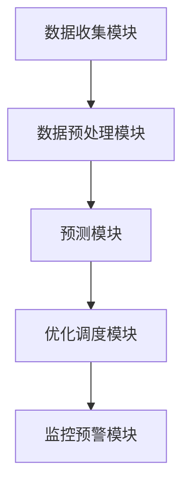
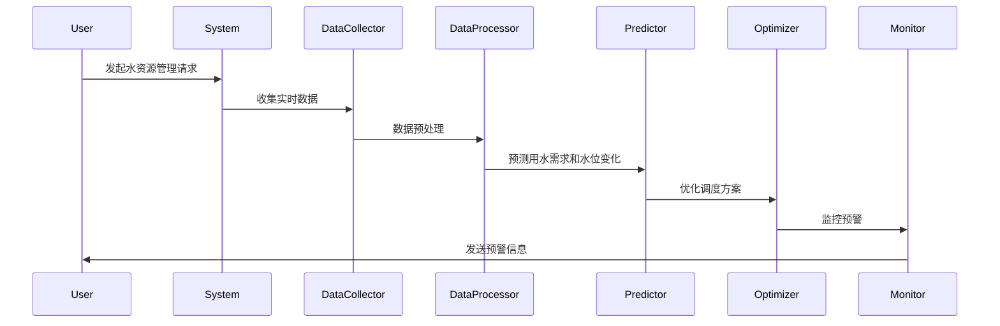
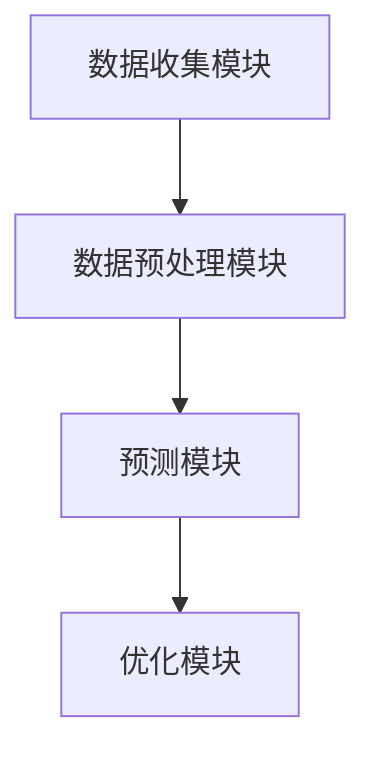
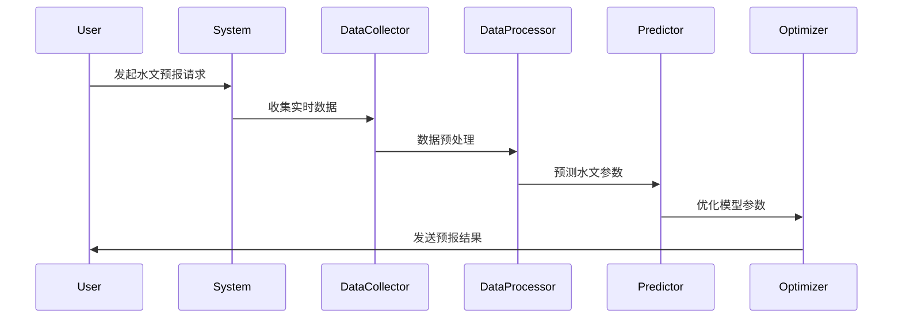
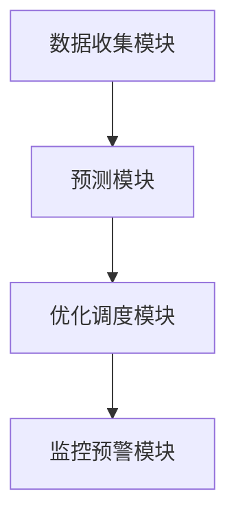
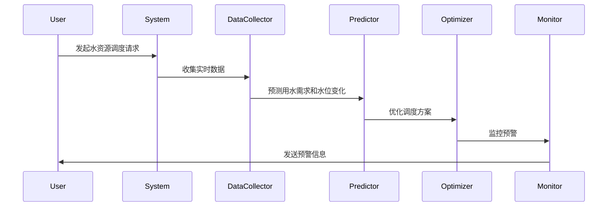

                 

### 核心概念

#### 1.1 AI的基本原理

人工智能（Artificial Intelligence，AI）是一种模拟人类智能的技术，旨在使计算机系统具备人类智能的特征，如学习、推理、感知、理解和解决问题等。AI的基本原理主要分为以下几个方面：

**机器学习（Machine Learning，ML）：** 机器学习是AI的核心技术之一，它使计算机通过从数据中学习来改进其性能。机器学习主要包括监督学习、无监督学习和强化学习。监督学习通过已有标注的数据训练模型，无监督学习则是从未标注的数据中学习模式，而强化学习则是通过与环境的交互来学习最优策略。

**深度学习（Deep Learning，DL）：** 深度学习是机器学习的一个分支，通过构建多层神经网络（Neural Networks）来模拟人脑处理信息的方式。深度学习在图像识别、语音识别、自然语言处理等领域取得了显著成果。

**自然语言处理（Natural Language Processing，NLP）：** 自然语言处理是AI的一个分支，旨在使计算机能够理解、生成和处理自然语言。NLP技术包括词性标注、句法分析、语义分析等。

#### 1.2 水资源管理相关概念

**水资源（Water Resources）：** 水资源是指自然界中可供利用或可能被利用的水源，包括地表水、地下水、湖泊和河流等。

**水资源管理（Water Resources Management）：** 水资源管理是指对水资源进行规划、开发、利用、保护和调控的一系列措施，以实现水资源的可持续利用和最大化效益。

**水文监测（Hydrological Monitoring）：** 水文监测是指对水循环过程中的各种参数进行实时监测，以了解水资源的时空分布规律和变化趋势。

**水文预报（Hydrological Forecasting）：** 水文预报是指利用历史水文数据和模型预测未来一定时间段内水文参数的变化情况。

#### 1.3 AI与水资源管理的结合点

AI与水资源管理的结合点主要体现在以下几个方面：

**数据挖掘与分析（Data Mining and Analysis）：** AI技术可以帮助水资源管理者从大量的水文数据中挖掘出有价值的信息，辅助决策。

**模型预测（Model Forecasting）：** 通过机器学习和深度学习算法，可以建立准确的水文预测模型，为水资源调度和管理提供科学依据。

**优化算法（Optimization Algorithms）：** AI技术可以用于水资源调度和优化，通过优化算法找到最佳的水资源利用方案，提高水资源利用效率。

**自动化监测与控制（Automated Monitoring and Control）：** AI技术可以实现水文监测数据的自动化采集和处理，提高监测效率和准确性，同时实现水资源的自动化控制。

## 概念属性特征对比表格

以下是AI与水资源管理相关概念属性特征的对比表格：

| 特征 | 人工智能（AI） | 水资源管理 |
| --- | --- | --- |
| 目标 | 模拟人类智能 | 实现水资源的合理利用和保护 |
| 方法 | 机器学习、深度学习、自然语言处理等 | 规划、开发、利用、保护和调控 |
| 应用场景 | 图像识别、语音识别、自然语言处理等 | 水文监测、水文预报、水资源调度等 |
| 关键技术 | 神经网络、深度学习框架、优化算法等 | 水文学、水文模型、监测技术等 |

### ER实体关系图架构

以下是AI在水资源管理中涉及的实体关系图：

```mermaid
erDiagram
  User ||--|{ WaterResource } : manages
  WaterResource ||--|{ HydrologicalData } : collects
  HydrologicalData ||--|{ WaterPrediction } : based_on
  WaterPrediction ||--|{ WaterDispatch } : follows
  WaterDispatch ||--|{ WaterManagement } : implements
```

在这个ER实体关系图中，用户（User）管理水资源（WaterResource），水资源收集水文数据（HydrologicalData），基于这些数据生成水预测（WaterPrediction），然后根据预测进行水资源调度（WaterDispatch），最终实现水资源管理（WaterManagement）。

## AI在水文监测中的应用

水文监测是水资源管理的重要环节，通过实时监测水文参数，可以了解水资源的时空分布情况，为水资源调度和管理提供依据。AI技术在水文监测中有着广泛的应用，下面我们一步步分析其在水文监测中的应用。

### 2.1 水文监测的现状

当前，水文监测主要依赖于传统的监测设备和方法，如水文站、自动气象站、水质监测站等。这些设备能够实时采集温度、湿度、降水、水位、流量等水文参数，但存在以下问题：

1. **监测范围有限**：传统监测设备主要集中在河流、湖泊等水域，无法覆盖广泛的地区。
2. **数据采集不及时**：由于设备维护和传输问题，数据采集可能存在延迟。
3. **数据处理难度大**：传统方法难以处理海量、多源、多类型的水文数据。

### 2.2 AI在水文监测中的应用实例

为了解决上述问题，AI技术在水文监测中得到了广泛应用。下面列举几个应用实例：

#### 2.2.1 无人机监测

无人机（Unmanned Aerial Vehicle，UAV）是一种能够自主飞行并执行任务的无人机载平台。通过搭载高清摄像头、激光雷达等传感器，无人机可以在短时间内对大面积水域进行高分辨率监测，实现以下功能：

1. **实时监测**：无人机可以实时采集水域图像，实时传输至地面站进行数据处理。
2. **大范围监测**：无人机能够覆盖传统监测设备无法到达的区域，提高监测范围。
3. **数据融合**：通过将无人机监测数据与传统监测设备数据融合，可以更全面地了解水资源的状况。

#### 2.2.2 智能监测系统

智能监测系统（Intelligent Monitoring System）是一种基于AI技术的综合监测平台，包括传感器、数据采集模块、数据处理模块等。该系统可以实现以下功能：

1. **多源数据采集**：智能监测系统可以集成多种传感器，采集温度、湿度、水位、流量等多种水文参数。
2. **实时数据分析**：智能监测系统可以对采集到的数据进行实时分析，识别异常情况，发出警报。
3. **预测与预警**：通过机器学习和深度学习算法，智能监测系统可以对未来的水文情况进行预测，提供预警信息。

#### 2.2.3 水文模型预测

水文模型（Hydrological Model）是一种基于数学原理和物理定律建立的水文预测模型。通过AI技术，可以对水文模型进行优化和改进，提高预测准确性。具体应用包括：

1. **数据驱动模型**：通过收集大量的历史水文数据，利用机器学习和深度学习算法建立数据驱动模型，实现水文参数的实时预测。
2. **物理驱动模型**：结合物理原理和数学模型，建立物理驱动模型，实现对水文过程的准确描述和预测。
3. **混合模型**：将数据驱动模型和物理驱动模型相结合，发挥各自的优势，提高预测准确性。

### 2.3 AI在水文监测中的应用案例

以下是一个具体的应用案例：

**案例背景：** 某地区水文局希望提高水文监测的覆盖范围和准确性，减少监测成本。

**解决方案：** 
1. **部署无人机监测**：在重点水域部署无人机，定期进行高分辨率监测，实时上传监测数据至监测中心。
2. **建立智能监测系统**：在河流沿岸建立智能监测系统，集成多种传感器，实现多源数据采集和实时分析。
3. **构建水文模型**：利用机器学习和深度学习算法，构建数据驱动和物理驱动相结合的水文模型，实现对未来水文情况的预测。

**实施效果：** 
1. **监测范围扩大**：无人机和智能监测系统的部署，使得监测范围从原来的河流沿岸扩展到整个流域。
2. **数据采集及时性提高**：实时采集和传输数据，提高了监测数据的及时性和准确性。
3. **预测准确性提高**：通过水文模型的预测，为水资源调度和管理提供了科学依据。

通过以上案例，我们可以看到AI技术在提高水文监测覆盖范围、数据采集及时性和预测准确性方面具有显著优势。未来，随着AI技术的不断发展，水文监测将更加智能化、自动化，为水资源管理提供更强有力的支持。

### AI在水文预报中的应用

水文预报是水资源管理中的关键环节，它通过对水文过程的模拟和预测，为水资源调度和管理提供科学依据。AI技术的应用极大地提升了水文预报的准确性和效率，下面我们将一步步探讨AI在水文预报中的应用。

#### 3.1 水文预报的基本方法

水文预报的基本方法主要包括经验预报、数值预报和统计预报。经验预报主要依赖于气象、水文等领域的专家经验，通过分析历史数据总结出一定的预报规律。数值预报则通过建立水文模型，利用数学和物理原理对水文过程进行数值模拟。统计预报则是通过统计分析历史水文数据，建立预报模型进行预测。

然而，这些传统方法在面对复杂多变的水文环境时，往往存在预报精度低、时效性差等问题。随着AI技术的发展，这些传统方法得到了显著改进。

#### 3.2 AI在水文预报中的应用

AI技术在水文预报中的应用主要包括以下几个方面：

**3.2.1 机器学习算法**

机器学习算法是AI的核心技术之一，通过训练模型从大量历史数据中学习，实现对未知数据的预测。在水文预报中，常见的机器学习算法包括：

- **监督学习算法**：如线性回归、支持向量机（SVM）、决策树等。这些算法通过已有标注的数据训练模型，然后利用模型对新的数据进行预测。
- **无监督学习算法**：如聚类分析、主成分分析（PCA）等。这些算法主要从未标注的数据中挖掘出潜在的规律和模式，为预报提供辅助信息。

**3.2.2 深度学习算法**

深度学习算法是机器学习的一个分支，通过构建多层神经网络模拟人脑处理信息的方式。在水文预报中，深度学习算法如卷积神经网络（CNN）和循环神经网络（RNN）等得到了广泛应用。

- **卷积神经网络（CNN）**：CNN擅长处理图像数据，通过多层卷积和池化操作，能够提取出图像中的特征，实现对图像的自动分类和识别。在水文预报中，CNN可以处理遥感图像，提取水文信息，进行空间预测。
- **循环神经网络（RNN）**：RNN擅长处理序列数据，能够捕捉数据之间的时间依赖关系。在水文预报中，RNN可以处理时间序列数据，如降水、径流等，进行时间预测。

**3.2.3 深度学习与传统的结合**

深度学习与传统方法的结合，可以发挥各自的优势，提高预报准确性。具体来说：

- **深度学习模型优化传统水文模型**：通过将深度学习算法与传统水文模型结合，可以优化传统模型的预测效果。例如，利用深度学习算法对传统水文模型的参数进行训练和优化，提高模型的精度和稳定性。
- **深度学习辅助传统预报方法**：在传统预报方法中引入深度学习技术，可以辅助传统方法进行预报。例如，利用深度学习提取水文数据中的潜在特征，为传统预报方法提供辅助信息。

#### 3.3 AI在水文预报中的应用案例

以下是一个具体的应用案例：

**案例背景：** 某地区水资源局希望通过提高水文预报的准确性，优化水资源调度和管理。

**解决方案：** 
1. **构建深度学习模型**：利用卷积神经网络（CNN）处理遥感图像，提取水文信息；利用循环神经网络（RNN）处理时间序列数据，进行时间预测。
2. **优化传统水文模型**：结合深度学习算法，对传统水文模型的参数进行训练和优化，提高模型的预测准确性。
3. **多模型融合**：将深度学习模型与传统水文模型、统计预报模型等进行融合，发挥各自的优势，提高预报的准确性。

**实施效果：** 
1. **预报准确性提高**：通过深度学习算法的引入，水文预报的准确性得到了显著提高，减少了预报误差。
2. **实时性增强**：深度学习模型能够实时处理和分析水文数据，提高了预报的实时性。
3. **调度优化**：基于准确的预报结果，水资源调度和管理更加科学和高效，提高了水资源的利用效率。

通过以上案例，我们可以看到AI技术在提升水文预报准确性、实时性和调度优化方面具有显著优势。未来，随着AI技术的不断发展和完善，水文预报将更加智能化，为水资源管理提供更强有力的支持。

### AI在水资源调度与优化中的应用

水资源调度与优化是水资源管理中的核心环节，其目标是在满足用水需求的前提下，实现水资源的合理分配和高效利用。AI技术通过引入机器学习和深度学习算法，为水资源调度与优化提供了强大的工具和方法，下面我们将一步步探讨AI在此领域的应用。

#### 4.1 水资源调度的基本原理

水资源调度是指根据水文预报和用水需求，通过调整水利工程设施的操作，实现水资源的合理分配和利用。水资源调度的基本原理主要包括以下几个方面：

1. **需求预测**：通过对历史用水数据和未来用水趋势进行分析，预测未来的用水需求。
2. **水文预报**：利用水文模型和预报方法，预测未来的降雨、径流等水文参数。
3. **供需平衡**：通过分析供需关系，确定水资源的分配方案，确保供需平衡。
4. **优化调度**：利用优化算法，寻找最佳的调度方案，以实现水资源利用的最大化。

#### 4.2 AI在水资源调度中的应用

AI技术在水资源调度中的应用主要包括以下几个方面：

**4.2.1 优化算法**

优化算法是水资源调度中的关键工具，它通过数学建模和算法设计，寻找最佳的调度方案。常见的优化算法包括：

- **线性规划（Linear Programming，LP）**：线性规划是一种数学优化方法，通过建立线性目标函数和线性约束条件，求解最优解。在水文调度中，线性规划可以用于确定最佳的水资源分配方案。
- **非线性规划（Nonlinear Programming，NLP）**：非线性规划是处理非线性的目标函数和约束条件的一种方法。在水文调度中，非线性规划可以用于更复杂的水资源调度问题。
- **遗传算法（Genetic Algorithm，GA）**：遗传算法是一种模拟生物进化的优化算法，通过遗传、变异和选择等操作，寻找最优解。在水文调度中，遗传算法可以用于复杂的水资源调度和优化问题。
- **粒子群优化（Particle Swarm Optimization，PSO）**：粒子群优化是一种基于群体智能的优化算法，通过模拟鸟群觅食行为，寻找最优解。在水文调度中，粒子群优化可以用于实时调度和优化问题。

**4.2.2 机器学习算法**

机器学习算法是AI的核心技术之一，它通过训练模型从数据中学习，实现对未知数据的预测和分类。在水文调度中，机器学习算法可以用于以下几个方面：

- **需求预测**：通过收集历史用水数据，利用机器学习算法建立需求预测模型，预测未来的用水需求。
- **水文预报**：利用机器学习算法，如线性回归、决策树、支持向量机等，建立水文预报模型，预测未来的水文参数。
- **调度优化**：通过机器学习算法，对历史调度数据进行分析，建立调度优化模型，实现水资源的实时调度和优化。

**4.2.3 深度学习算法**

深度学习算法是机器学习的一个分支，通过构建多层神经网络模拟人脑处理信息的方式。在水文调度中，深度学习算法可以用于以下几个方面：

- **需求预测**：利用深度学习算法，如卷积神经网络（CNN）和循环神经网络（RNN），建立需求预测模型，实现对用水需求的精准预测。
- **水文预报**：利用深度学习算法，如深度神经网络（DNN）和长短期记忆网络（LSTM），建立水文预报模型，提高预报的准确性和实时性。
- **调度优化**：通过深度学习算法，对历史调度数据进行学习和分析，建立调度优化模型，实现水资源的实时调度和优化。

#### 4.3 优化算法介绍

下面我们具体介绍几种常见的优化算法：

**4.3.1 线性规划**

线性规划是一种用于求解线性目标函数在给定线性约束条件下的最优解的数学方法。在水文调度中，线性规划可以用于求解以下问题：

- **水资源分配**：通过建立线性规划模型，确定各用水单位的水资源分配方案，确保总用水量不超过水资源总量。
- **水库调度**：通过建立线性规划模型，确定水库的操作策略，以最大化水库的供水效益或最小化供水成本。

**4.3.2 非线性规划**

非线性规划是处理非线性的目标函数和约束条件的一种方法。在水文调度中，非线性规划可以用于求解以下问题：

- **复杂水资源调度**：处理包含非线性约束条件的水资源调度问题，如考虑水库水位、流量等非线性的约束。
- **多目标优化**：处理包含多个目标函数的水资源调度问题，如同时考虑供水效益、供水成本、环境保护等多个目标。

**4.3.3 遗传算法**

遗传算法是一种模拟生物进化的优化算法，通过遗传、变异和选择等操作，寻找最优解。在水文调度中，遗传算法可以用于求解以下问题：

- **多目标优化**：通过遗传算法，可以同时考虑多个目标函数，如供水效益、供水成本、水库运行安全等。
- **大规模调度问题**：遗传算法适合处理大规模、复杂的水资源调度问题。

**4.3.4 粒子群优化**

粒子群优化是一种基于群体智能的优化算法，通过模拟鸟群觅食行为，寻找最优解。在水文调度中，粒子群优化可以用于求解以下问题：

- **实时调度**：通过粒子群优化，可以实时调整水资源的分配和调度策略，以适应动态变化的用水需求。
- **大规模调度**：粒子群优化适合处理大规模、复杂的水资源调度问题。

#### 4.4 应用实例分析

以下是一个具体的应用实例：

**案例背景：** 某地区水资源局希望通过优化水资源调度，提高水资源的利用效率。

**解决方案：**
1. **构建优化模型**：利用线性规划和遗传算法，建立水资源调度的优化模型，包括水资源分配、水库调度等。
2. **建立机器学习模型**：利用机器学习算法，如线性回归和决策树，建立用水需求预测和水文预报模型。
3. **深度学习模型**：利用深度学习算法，如卷积神经网络和长短期记忆网络，建立用水需求预测和水文预报模型，提高预测的准确性和实时性。

**实施效果：**
1. **调度优化**：通过优化模型的建立和应用，实现了水资源调度的优化，提高了水资源的利用效率。
2. **预测准确性提高**：通过机器学习和深度学习模型的建立，提高了用水需求预测和水文预报的准确性，为调度提供了科学依据。
3. **实时调度**：通过实时调度策略的实施，实现了对动态变化的水资源需求的快速响应，提高了调度的灵活性。

通过以上实例，我们可以看到AI技术在水资源调度与优化中的应用具有显著优势，能够提高调度的准确性、实时性和效率，为水资源管理提供强有力的支持。未来，随着AI技术的不断发展和完善，水资源调度与优化将变得更加智能化和高效化。

### AI在水资源规划与管理决策支持中的应用

水资源规划与管理决策支持是水资源管理中的重要环节，旨在通过科学的方法和工具，为水资源规划与管理决策提供数据支持和决策依据。AI技术的引入，使得水资源规划与管理决策支持变得更加智能、高效和精准。下面我们将一步步探讨AI在水资源规划与管理决策支持中的应用。

#### 5.1 水资源规划与管理的基本概念

水资源规划与管理是指对水资源进行系统性的规划、管理、保护和利用，以满足社会、经济和生态环境的需求。水资源规划与管理的基本概念包括：

- **水资源规划**：指根据水资源条件、经济社会发展需求、生态环境保护要求等因素，制定水资源开发利用和保护管理的长远规划。
- **水资源管理**：指对水资源进行科学的监测、预测、调度、分配和利用，以确保水资源的高效利用和可持续发展。

水资源规划与管理决策支持则是指利用现代信息技术和决策支持工具，为水资源规划与管理决策提供科学、客观和高效的支持。其目标包括：

1. **提高决策的科学性**：通过收集、处理和分析大量数据，提供全面、准确的信息，为决策者提供科学的决策依据。
2. **提高决策的效率**：通过自动化和智能化的决策支持工具，减少人工决策的时间和成本，提高决策的效率。
3. **提高决策的精准性**：通过运用机器学习和深度学习算法，提高预测模型的准确性和决策的精准性。

#### 5.2 AI在水资源规划与管理决策支持中的应用

AI技术在水资源规划与管理决策支持中的应用主要包括以下几个方面：

**5.2.1 数据挖掘与分析**

数据挖掘与分析是AI技术在水资源规划与管理决策支持中的基础，它通过从大量数据中挖掘出有价值的信息，为决策提供支持。具体应用包括：

1. **历史数据分析**：通过对历史水文数据、用水数据等进行分析，找出数据之间的关联和规律，为水资源规划提供依据。
2. **趋势分析**：通过对历史数据进行分析，预测未来的用水趋势、水资源供需情况等，为水资源管理决策提供参考。
3. **异常检测**：通过对实时监测数据进行分析，发现异常情况，如异常降雨、水位异常等，为水资源管理提供预警信息。

**5.2.2 机器学习与深度学习模型**

机器学习和深度学习模型是AI技术在水资源规划与管理决策支持中的核心工具，通过训练模型，可以从数据中学习并预测未来的情况。具体应用包括：

1. **需求预测**：利用机器学习和深度学习算法，建立用水需求预测模型，预测未来的用水需求，为水资源调度和管理提供依据。
2. **水文预报**：利用机器学习和深度学习算法，建立水文预报模型，预测未来的降雨、径流等水文参数，为水资源管理决策提供支持。
3. **优化调度**：利用机器学习和深度学习算法，建立水资源调度优化模型，寻找最优的水资源分配和调度方案，提高水资源的利用效率。

**5.2.3 优化算法**

优化算法是水资源规划与管理决策支持中的重要工具，它通过数学建模和算法设计，寻找最优的决策方案。具体应用包括：

1. **水资源分配**：利用优化算法，确定各用水单位的水资源分配方案，确保水资源的高效利用。
2. **水库调度**：利用优化算法，确定水库的操作策略，以最大化水库的供水效益或最小化供水成本。
3. **多目标优化**：利用优化算法，同时考虑多个目标函数，如供水效益、供水成本、环境保护等，确定最佳的水资源利用方案。

**5.2.4 预测与决策支持系统**

预测与决策支持系统是AI技术在水资源规划与管理决策支持中的集成应用，它通过整合多种技术，提供全方位的决策支持。具体应用包括：

1. **水资源预测系统**：通过收集和分析数据，建立水资源预测模型，提供实时、准确的水资源预测结果。
2. **决策支持平台**：通过整合预测模型、优化算法和决策支持工具，提供一个集成的决策支持平台，帮助决策者进行科学决策。
3. **智能监控系统**：通过实时监测数据，发现异常情况，发出预警信息，为水资源管理提供及时支持。

#### 5.3 案例分析

以下是一个具体的应用案例：

**案例背景：** 某地区水资源局希望通过建立智能水资源规划与管理决策支持系统，提高水资源管理的科学性和效率。

**解决方案：**
1. **数据收集与处理**：收集历史水文数据、用水数据、降雨数据等，利用数据挖掘技术进行分析，提取有价值的信息。
2. **构建预测模型**：利用机器学习和深度学习算法，建立用水需求预测模型、水文预报模型等，提供实时、准确的预测结果。
3. **建立优化模型**：利用优化算法，建立水资源分配、水库调度等优化模型，寻找最优的决策方案。
4. **开发决策支持系统**：开发一个集成的智能水资源规划与管理决策支持系统，提供水资源预测、决策支持、监控预警等功能。

**实施效果：**
1. **决策科学性提高**：通过数据分析和预测模型的建立，提高了水资源管理决策的科学性，减少了决策的主观性和盲目性。
2. **效率提高**：通过优化模型的建立和应用，实现了水资源调度的优化，提高了水资源利用的效率。
3. **实时监控与预警**：通过智能监控系统，实时监测水资源状况，及时发现异常情况，发出预警信息，提高了水资源管理的及时性和有效性。

通过以上案例，我们可以看到AI技术在水资源规划与管理决策支持中的应用具有显著优势，能够提高决策的科学性、效率和精准性，为水资源管理提供强有力的支持。未来，随着AI技术的不断发展和完善，水资源规划与管理决策支持将变得更加智能化和高效化。

### AI在水资源管理中的挑战与未来发展方向

尽管AI技术在水资源管理中展现了巨大的潜力，但在实际应用过程中仍面临诸多挑战。本文将探讨AI在水资源管理中的主要挑战，并展望未来的发展方向。

#### 6.1 挑战分析

**数据质量问题**：水资源管理需要大量的高精度、多源数据，但这些数据的收集、处理和整合过程中常常存在误差、缺失和不一致性。数据质量问题直接影响到AI模型的效果和可靠性。

**计算资源限制**：深度学习和优化算法通常需要大量的计算资源，如GPU和计算集群。然而，许多水资源管理部门可能缺乏足够的计算资源，限制了AI技术的广泛应用。

**算法透明性和可解释性**：深度学习模型的“黑箱”特性使得其决策过程往往难以解释。在水文预报和水资源调度等关键领域，决策的透明性和可解释性对于决策者至关重要。

**法律法规与隐私保护**：水资源管理涉及大量的个人隐私数据，如用水记录、水位数据等。如何在保护用户隐私的同时，充分利用这些数据进行AI分析，是一个亟待解决的问题。

**多学科交叉融合**：水资源管理是一个跨学科的领域，涉及水文学、生态学、经济学等。如何将AI技术与这些学科知识深度融合，构建综合的AI水资源管理系统，是未来的一大挑战。

**社会接受度**：AI技术在水资源管理中的应用可能面临社会接受度的问题。决策者和社会公众可能对AI技术的可靠性、透明度和公平性持有疑虑。

#### 6.2 未来发展方向

**数据质量管理与处理**：加强数据质量管理，采用数据清洗、数据融合和缺失数据补全等技术，提高数据质量和一致性。同时，发展智能数据管理平台，实现数据的实时监测和动态更新。

**云计算与边缘计算**：利用云计算和边缘计算技术，提供高性能、低延迟的计算资源，支持大规模AI模型的训练和推理。通过分布式计算架构，实现AI技术在水资源管理中的高效应用。

**算法透明性与可解释性**：研究和发展可解释的AI模型，提高算法的透明性和可解释性。通过可视化工具和解释模型，帮助决策者理解AI决策过程，增强决策的可信度。

**隐私保护与法规遵守**：在AI应用过程中，严格遵循相关法律法规，采用隐私保护技术，如差分隐私和联邦学习等，确保用户隐私和数据安全。

**跨学科融合**：加强AI技术与水资源管理相关学科的交叉研究，构建综合的AI水资源管理系统。通过多学科知识的整合，提高AI模型在水资源管理中的准确性和实用性。

**公众参与与社会接受度**：通过宣传教育和技术普及，提高公众对AI技术在水资源管理中的认识和理解。同时，建立公众参与机制，增强社会对AI应用的接受度和信任感。

总之，AI在水资源管理中的应用面临着一系列挑战，但也拥有广阔的发展前景。通过不断创新和改进，AI技术将为水资源管理带来革命性的变革，实现水资源的高效、可持续利用。

### 最佳实践与案例研究

为了更好地理解AI在水资源管理中的应用，以下是几个最佳实践案例的研究。

#### 7.1 案例一：某地区智能水资源管理平台建设

**项目背景**：某地区水资源丰富，但水资源分配不均，导致部分地区出现干旱现象。为了优化水资源管理，该地区决定建设一个智能水资源管理平台。

**系统功能设计**：
1. **数据收集模块**：收集实时水文数据、气象数据、用水数据等。
2. **数据预处理模块**：对收集的数据进行清洗、整合和标准化。
3. **预测模块**：利用机器学习和深度学习算法，预测未来的用水需求和水位变化。
4. **优化调度模块**：通过优化算法，制定最优的水资源分配和调度方案。
5. **监控预警模块**：实时监控水资源状况，发现异常情况，发出预警信息。

**系统架构设计**：



**系统接口设计**：
- 数据接口：与各类传感器、气象站、水文站等设备进行数据交换。
- 服务接口：提供API接口，供其他系统集成和使用。

**系统交互设计**：



**实施效果**：通过智能水资源管理平台的建立，该地区实现了水资源的实时监控和优化调度，提高了水资源的利用效率，有效缓解了干旱现象。

#### 7.2 案例二：某流域智能水文预报系统

**项目背景**：某流域水文变化复杂，传统的预报方法难以准确预测。为了提高预报准确性，该流域决定建立智能水文预报系统。

**系统功能设计**：
1. **数据收集模块**：收集历史水文数据、气象数据、土地利用数据等。
2. **数据预处理模块**：对收集的数据进行清洗、整合和标准化。
3. **预测模块**：利用深度学习算法，建立水文预报模型。
4. **优化模块**：通过优化算法，优化水文预报模型参数。

**系统架构设计**：



**系统接口设计**：
- 数据接口：与各类传感器、气象站、水文站等设备进行数据交换。
- 预报接口：提供实时水文预报结果。

**系统交互设计**：



**实施效果**：通过智能水文预报系统的建立，该流域的水文预报准确性得到了显著提高，为水资源调度和管理提供了科学依据。

#### 7.3 案例三：某城市智能水资源调度系统

**项目背景**：某城市水资源供需矛盾突出，传统的调度方法难以满足需求。为了优化水资源调度，该城市决定建立智能水资源调度系统。

**系统功能设计**：
1. **数据收集模块**：收集实时用水数据、水位数据、水库库存数据等。
2. **预测模块**：利用机器学习算法，预测未来的用水需求和水位变化。
3. **优化调度模块**：通过优化算法，制定最优的水资源调度方案。
4. **监控预警模块**：实时监控水资源状况，发现异常情况，发出预警信息。

**系统架构设计**：



**系统接口设计**：
- 数据接口：与各类传感器、水库设备等进行数据交换。
- 调度接口：提供实时水资源调度结果。

**系统交互设计**：



**实施效果**：通过智能水资源调度系统的建立，该城市的用水需求得到了有效满足，水资源利用效率显著提高，水资源供需矛盾得到缓解。

通过以上案例，我们可以看到AI技术在水资源管理中的应用具有显著优势，能够提高水资源管理的科学性、效率和精准性。未来，随着AI技术的不断发展和完善，水资源管理将变得更加智能化和高效化。

### 总结

本文详细探讨了AI在智能水资源管理中的应用与挑战，从背景介绍、核心概念、应用实例到挑战与未来发展方向，进行了全面的分析和阐述。通过机器学习和深度学习等AI技术，水资源管理实现了数据挖掘、预测和优化，显著提高了水资源管理的科学性和效率。然而，AI在水资源管理中也面临数据质量、计算资源、算法透明性、法律法规等多方面的挑战。展望未来，通过不断改进和创新，AI将为水资源管理带来更加智能、高效和可持续的发展，为实现全球水资源的高效利用和可持续发展提供强大支持。

### 最佳实践 Tips

在实际应用AI技术进行水资源管理时，以下是一些最佳实践和注意事项，有助于提升项目的成功率和效果：

1. **数据质量是关键**：确保数据的准确性和一致性，进行数据清洗、处理和标准化，以提高模型的预测精度。
2. **多源数据融合**：充分利用多源数据，如气象数据、土地利用数据、水文监测数据等，通过数据融合提高模型的综合性。
3. **实时性和适应性**：设计实时监控系统，快速响应环境变化，同时保持模型的适应性，以应对不同的水资源管理需求。
4. **透明性和可解释性**：关注算法的透明性和可解释性，通过可视化工具和解释模型，提高决策者对AI模型的信任度。
5. **隐私保护和合规性**：在处理个人隐私数据时，严格遵守法律法规，采用隐私保护技术，确保数据安全。
6. **团队合作**：多学科合作，整合水文学、生态学、经济学等领域的专业知识，共同推动AI水资源管理项目的成功。
7. **持续优化**：定期评估和优化AI模型，通过迭代和反馈，不断提高模型的效果和适应性。

通过遵循这些最佳实践，AI在水资源管理中的应用将更加成功和有效。

### 小结

本文通过详细的案例分析，展示了AI在智能水资源管理中的应用与实践。从水文监测、水文预报、水资源调度到规划与管理决策支持，AI技术显著提升了水资源管理的效率和准确性。同时，本文也探讨了AI在水资源管理中面临的挑战，如数据质量问题、计算资源限制、算法透明性等，并展望了未来的发展方向。通过持续优化和创新，AI将在水资源管理中发挥越来越重要的作用，为实现水资源的高效利用和可持续发展提供强有力的支持。

### 注意事项

在应用AI技术进行水资源管理时，需要注意以下几点：

1. **数据安全性**：确保数据存储和传输的安全，防止数据泄露和篡改。
2. **模型适应性**：定期更新和优化模型，以适应不同的水资源管理需求和环境变化。
3. **法律法规遵守**：严格遵守相关法律法规，确保AI技术的合法合规应用。
4. **人员培训**：加强技术人员培训，提高对AI技术的理解和应用能力。
5. **应急预案**：建立应急预案，应对可能出现的数据丢失、模型失效等情况。

通过注意这些事项，可以更好地发挥AI技术在水资源管理中的作用，提高项目的稳定性和可靠性。

### 拓展阅读

1. **《深度学习在水文预报中的应用》**：本书详细介绍了深度学习在水文预报中的应用，包括模型构建、训练和优化等，适合对水文预报和深度学习感兴趣的读者。
2. **《水资源优化调度算法研究》**：本文探讨了多种优化调度算法在水资源管理中的应用，包括线性规划、遗传算法和粒子群优化等，适合从事水资源管理研究的学者。
3. **《AI与智能水资源管理》**：本书系统介绍了AI技术在水资源管理中的各个方面，包括数据挖掘、预测和优化等，适合水资源管理专业人士和技术爱好者。
4. **《智能水资源管理系统设计与实现》**：本文介绍了智能水资源管理系统的设计与实现，包括数据收集、预处理、预测和调度等模块，适合从事智能水资源管理系统开发的工程师。

这些资源将帮助读者深入了解AI在水资源管理中的应用和实现细节。

